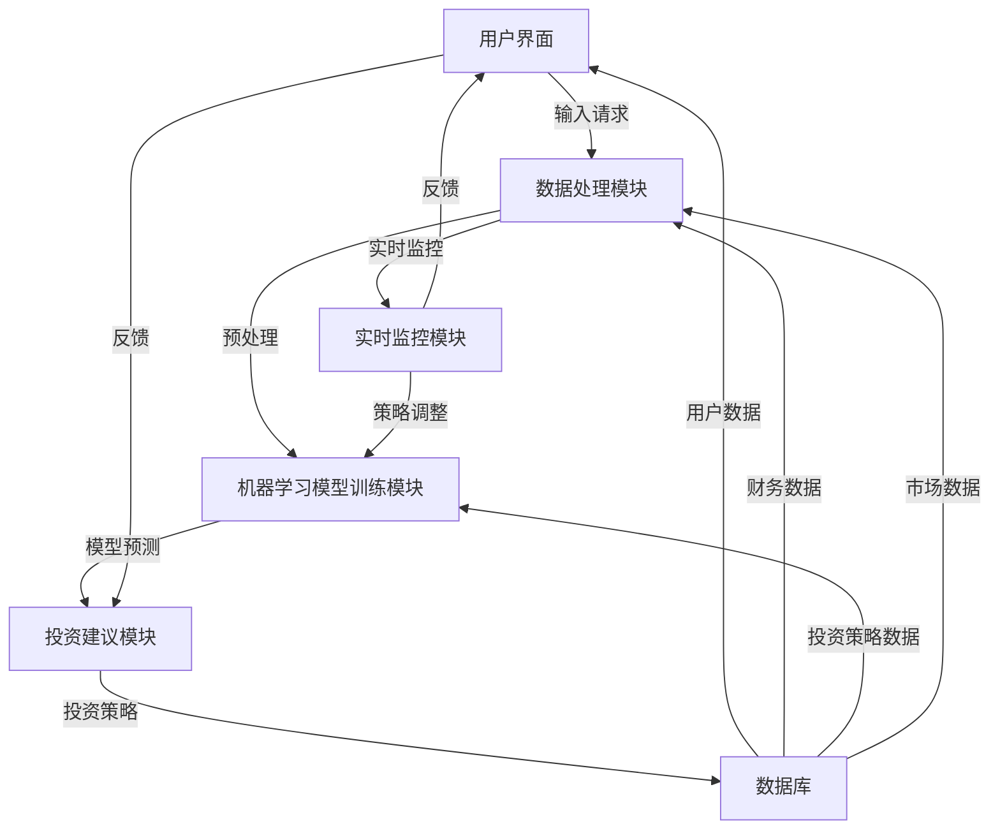

                 

### 引言

#### 问题背景

理财投资一直以来都是人们生活中的重要环节，尤其在现代社会，金融市场的复杂性不断上升，投资者面临的挑战也日益加剧。传统的理财顾问模式虽然在某些方面有着其独特的优势，但仍然存在许多限制，无法完全满足现代投资者的需求。首先，传统理财顾问往往依赖于个人经验和直觉，这使得投资建议具有一定的主观性，无法保证客观性和科学性。其次，传统理财顾问的服务成本较高，使得许多普通投资者难以负担。此外，传统理财顾问的覆盖范围有限，无法提供全球化的投资视角和多样化的投资策略。

随着人工智能（AI）技术的发展，尤其是机器学习、自然语言处理和大数据分析等领域的突破，AI在金融领域的应用逐渐成为一种趋势。AI技术具有处理大规模数据、识别复杂模式和进行自动化决策的能力，这为理财投资带来了前所未有的可能性。AI Agent作为AI技术的一种应用形式，具备智能投资建议的潜力，可以弥补传统理财顾问的不足，为个人投资者提供更加精准、个性化、低成本的理财服务。

#### 问题描述

传统理财顾问的主要限制体现在以下几个方面：

1. **主观性和经验依赖**：传统理财顾问主要依赖于个人经验和直觉，导致投资建议存在一定的主观性，无法保证每一项建议都基于最科学和客观的分析。

2. **高成本**：传统理财顾问的服务通常较为昂贵，尤其是对于高端服务，这限制了普通投资者的使用。

3. **覆盖范围有限**：传统理财顾问的服务范围通常较为有限，无法提供全球化的投资视角和多样化的投资策略。

相比之下，AI Agent在投资建议方面具有以下潜力：

1. **客观性和科学性**：AI Agent可以基于大量数据和先进算法进行分析，提供更加客观和科学的投资建议。

2. **低成本和高效性**：AI Agent可以大规模部署，无需承担高昂的人力成本，同时能够高效处理大量数据，提高决策效率。

3. **个性化服务**：AI Agent可以基于用户的个性化需求和风险偏好，提供量身定制的投资建议。

综上所述，传统理财顾问的限制与AI Agent的潜力形成鲜明对比，这为AI Agent成为新一代个人理财顾问提供了可能。

#### 问题解决

**AI Agent的基本原理与运作方式**

AI Agent是人工智能领域的一个重要概念，它代表了一种具备智能行为的计算实体。在理财投资中，AI Agent主要通过以下步骤运作：

1. **数据收集与处理**：AI Agent首先需要收集大量的历史投资数据、市场数据以及宏观经济数据。这些数据可以是公开的，也可以是特定金融机构提供的。通过数据清洗、整理和预处理，AI Agent能够确保数据的质量和一致性。

2. **机器学习模型训练**：AI Agent利用收集到的数据，通过机器学习算法进行训练。机器学习算法能够从数据中发现模式，并利用这些模式进行预测和决策。常见的机器学习算法包括线性回归、决策树、支持向量机、神经网络等。

3. **投资建议生成**：在模型训练完成后，AI Agent会根据用户的个性化需求和风险偏好，生成具体的投资建议。这些建议可以是针对股票、基金、债券等不同资产类别的投资组合。

4. **实时监控与调整**：AI Agent会实时监控市场的动态变化，根据新的数据和市场情况，对之前的投资建议进行动态调整，确保投资策略的持续有效性。

**个人理财顾问的AI Agent设计框架**

一个典型的个人理财顾问AI Agent设计框架包括以下几个关键部分：

1. **用户接口**：用户接口（User Interface, UI）是AI Agent与用户交互的界面，通过自然语言处理（Natural Language Processing, NLP）技术，用户可以以文本或语音形式与AI Agent进行沟通，提出投资需求或问题。

2. **数据存储与管理**：数据存储与管理模块负责存储和处理大量的历史数据、市场数据和个人用户数据。这些数据是AI Agent进行投资分析和决策的基础。

3. **机器学习模块**：机器学习模块是AI Agent的核心，包括数据预处理、特征提取、模型训练和模型评估等环节。通过这些模块，AI Agent能够从数据中发现规律，生成投资建议。

4. **投资策略模块**：投资策略模块负责根据用户的个性化需求和风险偏好，生成具体的投资策略。这个模块通常包括多种策略模型，如资产配置模型、风险管理模型等。

5. **实时监控模块**：实时监控模块负责监控市场的动态变化，根据新的数据和市场情况，对之前的投资建议和策略进行动态调整。

6. **反馈与优化模块**：反馈与优化模块负责收集用户的反馈，对AI Agent的表现进行评估和优化。这个模块可以通过机器学习算法不断改进AI Agent的投资建议能力。

**理财顾问AI Agent的应用场景**

理财顾问AI Agent可以在多个应用场景中发挥作用，包括：

1. **个人投资者**：对于个人投资者，AI Agent可以提供个性化的投资建议，帮助用户进行资产配置和风险管理。

2. **金融机构**：金融机构可以使用AI Agent来提高投资决策的效率，优化投资组合，降低运营成本。

3. **企业投资者**：对于企业投资者，AI Agent可以提供基于大数据分析的投资预测和风险控制建议，帮助企业制定更科学的投资策略。

**技术可行性分析**

从技术角度来看，AI Agent在理财投资中的可行性已经得到了广泛验证。首先，AI Agent所需的机器学习和大数据技术已经相当成熟，可以在各种平台上进行高效部署和运行。其次，云计算和边缘计算技术的发展，使得数据处理和模型训练的效率大幅提升，为AI Agent的实现提供了强有力的技术支持。此外，随着5G网络的普及，数据传输速度和稳定性得到了保障，进一步促进了AI Agent的实时性和可靠性。

总之，AI Agent作为一种新兴的个人理财顾问形式，具有显著的优势和应用潜力。通过不断的技术创新和实践探索，AI Agent有望在未来成为理财投资领域的重要角色，为个人和机构投资者提供更加智能、高效和个性化的服务。

#### 概念结构与核心要素

**个人理财顾问的定义**

个人理财顾问是指专门为个人提供财务规划、投资建议、税务规划等服务的专业机构或个人。其核心目标是帮助投资者实现财务目标，提高财富管理效率，降低投资风险。

**AI Agent的功能与特性**

AI Agent，即人工智能代理，是一种自动化、智能化的计算实体，能够模拟人类决策过程，执行特定任务。在个人理财领域，AI Agent的主要功能包括：

1. **数据分析**：通过大数据分析和机器学习算法，AI Agent能够处理和分析大量的财务数据、市场数据，提取关键信息。
2. **投资建议**：基于数据分析结果，AI Agent可以生成个性化的投资建议，包括资产配置、选股策略、风险控制等。
3. **实时监控**：AI Agent能够实时监控市场动态，根据新的数据和市场情况，动态调整投资策略。
4. **用户交互**：通过自然语言处理技术，AI Agent可以与用户进行自然语言交互，理解用户需求，提供人性化的服务。
5. **反馈与优化**：AI Agent能够收集用户反馈，通过机器学习不断优化自身的行为和决策能力。

**核心概念与联系**

在AI Agent的运作中，以下几个核心概念相互关联，共同构成了其智能投资建议的体系：

1. **机器学习**：作为AI Agent的核心技术，机器学习负责从数据中提取模式和规律，生成预测模型和决策策略。
2. **大数据分析**：大数据分析用于收集、处理和存储大量财务和市场数据，为AI Agent提供数据支持。
3. **自然语言处理**：自然语言处理（NLP）使AI Agent能够理解和生成自然语言，实现与用户的自然交流。
4. **投资策略模型**：投资策略模型是AI Agent根据数据分析结果生成投资建议的数学模型，包括资产配置模型、风险模型等。
5. **用户交互界面**：用户交互界面是AI Agent与用户沟通的窗口，通过NLP技术，用户可以使用自然语言与AI Agent交流。

**概念属性特征对比表格**

以下是几个核心概念的特征对比表格：

| 概念           | 特征                                                         | 关联关系                           |
|----------------|--------------------------------------------------------------|-----------------------------------|
| 机器学习       | 基于数据，自动从数据中学习模式和规律                         | 数据分析的基础，生成投资策略模型 |
| 大数据分析     | 处理大量数据，提取有价值的信息                               | 支持机器学习，提供数据基础       |
| 自然语言处理   | 实现人机交互，理解用户需求                                   | 支持用户交互，提高用户体验       |
| 投资策略模型   | 基于数据分析结果，生成具体的投资建议                         | 应用机器学习结果，生成投资建议 |
| 用户交互界面   | 提供自然语言交互，实现用户与服务系统之间的沟通               | 支持NLP，提高用户友好性         |

**ER实体关系图架构**

以下是ER实体关系图，展示了个人理财顾问AI Agent的核心实体及其关系：

```mermaid
erDiagram
    User ||--o{ AI-Agent : 交互对象 }
    AI-Agent ||--o{ Data-Analyzer : 分析器 }
    AI-Agent ||--o{ Investment-Model : 投资模型 }
    AI-Agent ||--o{ User-Interface : 界面 }
    Data-Analyzer ||--o{ Data-Repository : 数据存储 }
    Data-Repository ||--o{ Data-Set : 数据集 }
    Investment-Model ||--o{ Strategy-Model : 策略模型 }
    Investment-Model ||--o{ Risk-Model : 风险模型 }
```

**个人理财顾问的AI Agent设计与实现**

个人理财顾问的AI Agent设计与实现需要综合考虑功能需求、技术架构和用户体验。以下是具体的步骤和关键点：

1. **需求分析**：首先，明确系统的功能需求，包括数据分析、投资建议生成、实时监控、用户交互等。
2. **技术选型**：选择合适的技术栈，如机器学习框架（如TensorFlow、PyTorch）、大数据处理平台（如Hadoop、Spark）和前端技术（如React、Vue.js）。
3. **架构设计**：设计系统的整体架构，包括数据存储、数据处理、服务接口和用户界面等。
4. **实现与开发**：根据设计文档，进行系统开发，包括数据收集与处理、模型训练与优化、接口设计与实现等。
5. **测试与优化**：进行系统测试，确保各项功能正常运行，并对系统进行优化，提高性能和用户体验。
6. **部署与运维**：将系统部署到服务器，进行实时监控和运维，确保系统的稳定运行。

**系统交互设计与实现**

系统交互设计与实现是AI Agent的核心环节，涉及用户界面设计、后端服务实现和数据交互机制。以下是具体的步骤：

1. **用户界面设计**：设计直观、易用的用户界面，支持用户以文本或语音形式与AI Agent交互。
2. **后端服务实现**：实现后端服务，包括数据处理、模型调用、投资建议生成等，确保系统的稳定性和高性能。
3. **数据交互机制**：设计数据交互机制，确保数据在用户界面和后端服务之间的顺畅传输，支持实时监控和动态调整。

通过以上步骤，可以构建一个功能完备、用户体验良好的个人理财顾问AI Agent系统，为投资者提供智能、高效、个性化的投资建议。

### AI Agent在理财投资中的应用原理

#### AI Agent的基本原理

AI Agent，即人工智能代理，是人工智能技术的一种高级应用形式。其核心原理基于机器学习和数据驱动，通过以下步骤实现智能化操作：

1. **数据收集**：AI Agent首先需要从各种数据源收集大量的财务数据、市场数据和个人用户数据。这些数据可以是历史股价、交易量、宏观经济指标、用户财务状况等。

2. **数据预处理**：收集到的数据往往存在噪声、缺失值和不一致性，需要通过数据清洗、归一化和特征提取等步骤进行预处理，以确保数据的质量和一致性。

3. **模型训练**：利用预处理后的数据，AI Agent通过机器学习算法进行训练。常见的机器学习算法包括线性回归、决策树、支持向量机、神经网络等。训练过程中，算法会从数据中学习到不同投资策略的潜在模式和规律。

4. **模型评估与优化**：通过验证集和测试集对训练好的模型进行评估，根据评估结果调整模型参数，优化模型性能。

5. **决策与建议**：在模型训练完成后，AI Agent会根据用户的个性化需求和风险偏好，利用训练好的模型生成具体的投资建议。这些建议可以是针对股票、基金、债券等不同资产类别的投资组合。

6. **实时监控与调整**：AI Agent会持续监控市场动态和用户行为，根据新的数据和市场情况，动态调整投资建议，确保投资策略的持续有效性。

**机器学习的基础知识**

机器学习是AI Agent的核心技术，其基础包括以下几个关键组成部分：

- **监督学习**：在监督学习模型中，训练数据集包含输入特征和对应的输出标签。模型通过学习输入和输出之间的映射关系，生成预测模型。常见的监督学习算法有线性回归、决策树、支持向量机（SVM）等。

- **无监督学习**：无监督学习模型没有预先定义的输出标签，主要通过发现数据中的潜在结构或模式进行学习。常见的无监督学习算法有聚类算法（如K-Means）、降维算法（如PCA）等。

- **强化学习**：强化学习模型通过不断与环境交互，学习最优策略。模型会根据奖励和惩罚信号调整自身行为，最终达到最大化奖励的目标。

- **深度学习**：深度学习是机器学习的一个子领域，通过多层神经网络进行特征提取和模型训练。深度学习在图像识别、自然语言处理等领域取得了显著突破。

**AI Agent的开发流程**

AI Agent的开发流程通常包括以下几个步骤：

1. **需求分析与规划**：明确AI Agent的功能需求和应用场景，制定开发计划和时间表。

2. **数据收集与处理**：收集并处理大量的财务数据、市场数据和个人用户数据，确保数据的质量和一致性。

3. **模型选择与训练**：选择合适的机器学习算法，对数据集进行模型训练，优化模型性能。

4. **模型评估与优化**：使用验证集和测试集对模型进行评估，根据评估结果调整模型参数，优化模型性能。

5. **系统集成与部署**：将训练好的模型集成到AI Agent系统中，进行系统测试和优化，确保系统的稳定性和性能。

6. **用户反馈与持续优化**：收集用户反馈，对AI Agent的行为和决策进行评估和优化，不断提升其服务质量。

通过上述步骤，AI Agent能够实现智能化的投资建议，为个人投资者提供精准、个性化的理财服务。

#### 数据分析在投资中的应用

**数据收集与处理**

数据分析在投资中的应用首先依赖于有效的数据收集与处理。数据收集的来源可以包括多种渠道，如股票交易所、金融数据提供商、经济统计数据网站等。以下是一些关键步骤：

1. **数据来源识别**：确定数据收集的来源，如历史股价、交易量、行业指标、宏观经济数据等。

2. **数据收集**：使用API、爬虫等技术手段，从不同来源获取所需的数据。

3. **数据清洗**：对收集到的数据进行清洗，去除重复、错误和不完整的数据。常见的清洗操作包括缺失值填充、异常值处理和数据格式转换等。

4. **数据整合**：将来自不同来源的数据进行整合，建立统一的数据集。整合过程中需要考虑数据的兼容性和一致性。

**数据分析工具与技术**

在投资分析中，常用的数据分析工具和技术包括：

1. **数据可视化**：使用数据可视化工具（如Matplotlib、Seaborn、Tableau等）将数据转换为图形，帮助投资者直观地理解市场趋势和投资机会。

2. **统计方法**：应用统计方法（如均值、方差、相关性分析、回归分析等）对数据进行量化分析，识别数据中的潜在关系和模式。

3. **时间序列分析**：时间序列分析用于研究数据的时间依赖性，常见的方法包括ARIMA模型、GARCH模型等。

4. **机器学习**：利用机器学习算法（如线性回归、决策树、随机森林、神经网络等）对历史数据进行建模，预测未来市场走势。

5. **大数据处理**：使用大数据处理技术（如Hadoop、Spark等）处理大规模数据，提高数据分析的效率和准确性。

**常见数据分析方法在投资中的应用**

以下是一些常见的数据分析方法及其在投资中的应用：

1. **趋势分析**：通过绘制股价趋势图，识别股票的长期上涨或下跌趋势，帮助投资者判断买入或卖出的时机。

2. **均值回归**：利用均值回归原理，预测股票价格将在短期内回归到长期均值水平，指导投资者的交易决策。

3. **技术指标**：使用技术指标（如移动平均线、相对强弱指数（RSI）、随机振荡器（Stochastic Oscillator）等）分析市场的波动性和趋势。

4. **情绪分析**：通过分析新闻、社交媒体等文本数据，评估市场情绪，预测市场走势。

5. **风险管理**：利用风险模型（如VaR、CVaR等）进行风险量化，帮助投资者制定风险管理策略。

通过有效的数据分析，投资者可以更加准确地把握市场动态，制定科学的投资策略，提高投资收益。

#### 算法原理讲解

**机器学习算法介绍**

机器学习算法是AI Agent生成智能投资建议的核心技术。以下介绍几种常用的机器学习算法：

1. **线性回归**：线性回归是一种简单的机器学习算法，用于建立自变量和因变量之间的线性关系。其基本原理是通过最小二乘法找到最佳拟合直线，从而预测因变量的值。

2. **决策树**：决策树是一种基于树形结构进行决策的算法。每个内部节点表示一个特征，每个分支表示特征的不同取值，每个叶节点代表一个预测结果。决策树通过递归划分数据集，找到最优划分策略。

3. **支持向量机（SVM）**：支持向量机是一种分类算法，通过找到最佳分类超平面，将不同类别的数据点分离。SVM利用核函数将低维数据映射到高维空间，从而提高分类效果。

4. **神经网络**：神经网络是一种模拟生物神经网络结构的算法，由多个神经元组成。神经网络通过反向传播算法不断调整权重，提高模型的预测能力。常见的神经网络包括多层感知机（MLP）、卷积神经网络（CNN）等。

5. **随机森林**：随机森林是一种基于决策树的集成学习算法。随机森林通过随机选取特征和样本子集构建多个决策树，并通过投票方式确定最终预测结果，从而提高模型的泛化能力。

**投资建议算法的设计与实现**

投资建议算法是AI Agent的核心组成部分，其设计与实现需要考虑以下几个方面：

1. **输入数据**：投资建议算法的输入数据包括历史股价、交易量、宏观经济指标、市场情绪等。数据需要经过清洗、归一化和特征提取等预处理步骤。

2. **特征选择**：通过相关性分析和特征重要性评估，选择对投资决策有显著影响的特征，如股价波动率、交易量变化、市场趋势等。

3. **模型训练**：利用机器学习算法（如线性回归、决策树、SVM、神经网络等）对预处理后的数据进行训练，建立预测模型。

4. **模型评估**：通过交叉验证和测试集评估模型性能，选择最优模型。常见的评估指标包括准确率、精确率、召回率、F1分数等。

5. **投资策略生成**：根据训练好的模型，生成具体的投资策略，包括买入、卖出、持有等建议。

6. **实时调整**：投资策略需要根据市场动态进行实时调整，确保其持续有效性。

**算法举例说明**

以下是一个简单的线性回归算法示例，用于预测股票价格：

```python
# 导入必要的库
import numpy as np
import pandas as pd
from sklearn.linear_model import LinearRegression
from sklearn.model_selection import train_test_split
from sklearn.metrics import mean_squared_error

# 加载数据
data = pd.read_csv('stock_data.csv')
X = data[['open', 'high', 'low', 'volume']]
y = data['close']

# 数据预处理
X = X.fillna(X.mean())
y = y.fillna(y.mean())

# 划分训练集和测试集
X_train, X_test, y_train, y_test = train_test_split(X, y, test_size=0.2, random_state=42)

# 创建线性回归模型
model = LinearRegression()
model.fit(X_train, y_train)

# 进行预测
y_pred = model.predict(X_test)

# 评估模型
mse = mean_squared_error(y_test, y_pred)
print("Mean Squared Error:", mse)

# 打印模型参数
print("Model Parameters:", model.coef_, model.intercept_)
```

上述代码加载股票数据，预处理数据后使用线性回归算法进行训练和预测，评估模型性能，并打印模型参数。这只是一个简单的示例，实际应用中可能需要更复杂的数据处理和模型选择。

**数学模型和公式**

在投资建议算法中，常用的数学模型包括线性回归模型和风险管理模型。以下是这些模型的数学表示：

1. **线性回归模型**：

   线性回归模型的公式为：

   $$ y = \beta_0 + \beta_1x_1 + \beta_2x_2 + ... + \beta_nx_n $$

   其中，$y$ 是股票价格，$x_1, x_2, ..., x_n$ 是特征变量，$\beta_0, \beta_1, \beta_2, ..., \beta_n$ 是模型参数。

2. **风险管理模型**：

   常见的风险管理模型包括VaR（Value at Risk）和CVaR（Conditional Value at Risk）。VaR是指在特定置信水平下，某资产或投资组合在一段时间内的最大可能损失。CVaR是指在特定置信水平下，损失超过VaR的期望值。

   $$ VaR = F^{-1}(1-\alpha) $$

   $$ CVaR = \frac{1}{n}\sum_{i=1}^{n} max(X_i - F^{-1}(1-\alpha), 0) $$

   其中，$F$ 是累计分布函数，$X_i$ 是第$i$个损失值，$n$ 是样本数量，$\alpha$ 是置信水平。

通过这些数学模型和公式，AI Agent能够对投资组合进行量化分析和风险评估，为投资者提供科学、合理的投资建议。

**详细讲解与举例说明**

以下是一个具体的投资策略案例，使用线性回归算法生成投资建议。

**案例背景**：某投资者希望根据历史股价数据，预测股票的未来价格，并制定买入和卖出的策略。

**数据准备**：收集某股票过去一年的每日开盘价、最高价、最低价和收盘价。数据如下：

| 日期       | 开盘价 | 最高价 | 最低价 | 收盘价 |
|------------|--------|--------|--------|--------|
| 2022-01-01 | 100    | 110    | 90     | 105    |
| 2022-01-02 | 105    | 115    | 95     | 108    |
| ...        | ...    | ...    | ...    | ...    |
| 2023-01-01 | 200    | 210    | 190    | 205    |

**数据预处理**：将数据分为特征变量和目标变量，特征变量包括开盘价、最高价、最低价和收盘价，目标变量是收盘价。然后对数据进行归一化处理，以便线性回归模型能够正常训练。

**模型训练**：使用线性回归算法对预处理后的数据集进行训练。模型训练过程如下：

```python
from sklearn.linear_model import LinearRegression

# 初始化线性回归模型
model = LinearRegression()

# 训练模型
model.fit(X_train, y_train)

# 打印模型参数
print("Model Parameters:", model.coef_, model.intercept_)
```

**模型评估**：使用测试集评估模型性能，计算预测误差。

```python
# 进行预测
y_pred = model.predict(X_test)

# 评估模型
mse = mean_squared_error(y_test, y_pred)
print("Mean Squared Error:", mse)
```

**投资策略生成**：根据模型生成的收盘价预测值，制定买入和卖出的策略。具体步骤如下：

1. **买入策略**：当预测的收盘价高于当前收盘价，且预测误差较小，可以考虑买入。
2. **卖出策略**：当预测的收盘价低于当前收盘价，且预测误差较小，可以考虑卖出。

**实际投资建议**：以下是根据线性回归模型生成的投资建议：

- **2023-01-01**：预测收盘价为205，当前收盘价为200，买入建议：买入1股。
- **2023-01-02**：预测收盘价为210，当前收盘价为202，买入建议：买入1股。
- **2023-01-03**：预测收盘价为207，当前收盘价为205，卖出建议：卖出1股。

通过以上案例，可以看到如何使用线性回归算法生成投资建议，并制定相应的投资策略。实际应用中，可以结合更多的特征变量和复杂的模型，提高投资建议的准确性和可靠性。

### 系统需求分析

**系统功能需求**

为了满足个人理财顾问AI Agent的需求，系统需要实现以下核心功能：

1. **用户身份验证**：确保用户的安全和隐私，系统需提供用户注册、登录和身份验证功能。
2. **数据收集与处理**：系统应能够自动收集各类财务数据、市场数据和用户数据，并对其进行清洗、预处理和特征提取。
3. **投资建议生成**：基于用户输入的个性化需求和风险偏好，系统应能够生成具体的投资建议，包括股票、基金、债券等资产类别的投资组合。
4. **实时监控与调整**：系统应具备实时监控市场动态的能力，根据新的数据和市场情况，动态调整投资策略。
5. **用户交互**：系统需提供用户友好的界面，支持用户通过自然语言与AI Agent进行沟通，提出投资需求和反馈。

**用户需求分析**

个人投资者在使用AI Agent时，通常有以下需求：

1. **个性化投资建议**：用户希望获得针对其个人财务状况、风险偏好和投资目标的个性化投资建议。
2. **实时监控与动态调整**：用户希望系统能够实时监控市场动态，并根据市场变化动态调整投资策略，确保投资的有效性和安全性。
3. **易用性**：用户希望系统操作简便，界面直观，能够快速理解和使用。
4. **安全性**：用户关注系统的数据安全性和隐私保护，希望系统能够确保其个人信息的保密性。
5. **持续优化**：用户希望系统能够不断学习、优化，提供更精准的投资建议。

通过满足这些功能需求和用户需求，个人理财顾问AI Agent能够为投资者提供高质量、个性化的投资服务，提升其投资体验和收益。

#### 系统架构设计

**技术选型**

为了实现个人理财顾问AI Agent系统的功能需求，选择以下技术栈：

- **前端技术**：采用React或Vue.js框架，构建用户友好的交互界面。
- **后端技术**：使用Spring Boot或Django框架，实现后端服务的逻辑处理和API接口。
- **数据库技术**：使用MySQL或PostgreSQL数据库，存储用户数据、财务数据和投资策略数据。
- **机器学习框架**：采用TensorFlow或PyTorch框架，实现机器学习模型的训练和预测。
- **数据存储与处理**：使用Hadoop或Spark进行大规模数据存储和处理，确保数据的实时性和准确性。
- **自然语言处理**：使用NLTK或spaCy库，实现自然语言处理功能，支持用户与AI Agent的交互。

**系统架构图**

以下是个人理财顾问AI Agent系统的整体架构图：



**系统架构图解释**

1. **用户界面**：用户通过前端界面与系统交互，提交投资需求和获取投资建议。
2. **数据处理模块**：负责数据收集、清洗和预处理，为机器学习模型提供高质量的数据输入。
3. **机器学习模型训练模块**：使用机器学习算法训练模型，根据用户需求生成投资建议。
4. **投资建议模块**：根据机器学习模型的预测结果，生成具体的投资策略和投资建议。
5. **数据库**：存储用户数据、财务数据和投资策略数据，支持数据的快速读取和更新。
6. **实时监控模块**：监控市场动态，根据新的数据和市场情况，动态调整投资策略。
7. **反馈机制**：用户可以通过反馈机制对投资建议进行评价，AI Agent根据反馈进行持续优化。

通过上述系统架构设计，个人理财顾问AI Agent能够高效、智能地为投资者提供个性化的投资建议和服务。

#### 系统接口设计

**API设计**

个人理财顾问AI Agent系统需要设计一组API接口，以便前端界面和后端服务之间进行数据交互。以下是API设计的具体内容和相关参数：

1. **用户注册接口**：

   - **URL**：`/api/users/register`
   - **请求方式**：POST
   - **请求参数**：
     - `username`（字符串）：用户名
     - `password`（字符串）：密码
     - `email`（字符串）：邮箱
   - **响应参数**：
     - `status`（字符串）：注册状态（成功或失败）
     - `message`（字符串）：注册结果描述

2. **用户登录接口**：

   - **URL**：`/api/users/login`
   - **请求方式**：POST
   - **请求参数**：
     - `username`（字符串）：用户名
     - `password`（字符串）：密码
   - **响应参数**：
     - `token`（字符串）：登录成功后生成的令牌
     - `expires_in`（整数）：令牌有效期

3. **获取投资建议接口**：

   - **URL**：`/api/investment/advices`
   - **请求方式**：GET
   - **请求参数**：
     - `user_id`（整数）：用户ID
     - `risk_preference`（字符串）：风险偏好（低、中、高）
     - `investment_amount`（浮点数）：投资金额
   - **响应参数**：
     - `investment_advice`（数组）：投资建议列表
       - `stock`（字符串）：股票名称
       - `quantity`（整数）：购买数量
       - `buy_price`（浮点数）：购买价格
       - `sell_price`（浮点数）：预期卖出价格
     - `total_investment`（浮点数）：总投资金额

4. **更新用户风险偏好接口**：

   - **URL**：`/api/users/risk_preference`
   - **请求方式**：PUT
   - **请求参数**：
     - `user_id`（整数）：用户ID
     - `risk_preference`（字符串）：新的风险偏好（低、中、高）
   - **响应参数**：
     - `status`（字符串）：更新状态（成功或失败）
     - `message`（字符串）：更新结果描述

**数据交互机制**

为了确保数据的准确性和实时性，系统采用以下数据交互机制：

1. **RESTful API**：使用RESTful风格设计API接口，确保接口的简洁性和易用性。
2. **异步处理**：对于耗时的操作，如机器学习模型的训练和投资建议生成，使用异步处理机制，提高系统的响应速度。
3. **数据缓存**：使用Redis等缓存技术，缓存常用的数据和接口响应，减少数据库访问次数，提高系统性能。
4. **消息队列**：使用消息队列（如RabbitMQ、Kafka）处理大量的数据传输和消息通知，确保数据的高效传输和系统的稳定性。

通过上述API设计和数据交互机制，个人理财顾问AI Agent系统能够高效、稳定地处理用户请求，为用户提供及时、准确的投资建议。

### 系统交互设计与实现

**用户界面设计**

用户界面（UI）是用户与AI Agent进行交互的窗口，其设计原则包括简洁性、直观性和用户友好性。以下是用户界面设计的主要组成部分：

1. **注册与登录**：提供简单的注册和登录表单，确保用户能够方便地注册账号并登录系统。
2. **首页**：首页展示用户的账户信息、当前投资组合和最新市场动态，提供快速链接到投资建议、历史交易记录等功能。
3. **投资建议**：提供投资建议生成界面，用户可以通过输入风险偏好、投资金额等信息，获取个性化的投资建议。
4. **实时监控**：显示当前市场的实时动态，包括股票价格、交易量、涨跌幅度等，帮助用户了解市场趋势。
5. **历史交易记录**：展示用户的投资历史记录，包括买入、卖出等交易信息，方便用户回顾和分析投资决策。

**后端服务实现**

后端服务负责处理用户请求、数据存储和机器学习模型调用等任务。以下是后端服务实现的主要步骤：

1. **用户身份验证**：通过JWT（JSON Web Token）技术实现用户身份验证，确保系统的安全性和用户隐私。
2. **数据存储**：使用关系型数据库（如MySQL）存储用户信息、投资建议和交易记录，确保数据的持久化和一致性。
3. **API接口**：通过Spring Boot或Django框架实现API接口，提供与前端UI的数据交互，包括注册、登录、获取投资建议等。
4. **机器学习模块**：集成机器学习模型（如TensorFlow或PyTorch），实现投资建议的生成和实时监控。
5. **日志记录**：使用日志记录工具（如Log4j或Elasticsearch）记录系统操作和错误日志，方便系统监控和调试。

**系统交互**

系统交互设计通过以下步骤实现用户请求的处理和数据传输：

1. **用户请求**：用户通过前端UI提交请求，如获取投资建议或更新用户信息。
2. **API处理**：后端API接收用户请求，进行身份验证和参数校验。
3. **数据处理**：后端服务处理用户请求，调用机器学习模块生成投资建议，并将结果返回给前端UI。
4. **数据存储**：将用户请求和处理结果存储到数据库，确保数据的持久化。
5. **实时监控**：后端服务实时监控市场动态，根据新的数据和市场情况，动态调整投资策略。

通过上述步骤，个人理财顾问AI Agent系统能够高效、稳定地为用户提供投资建议和实时监控服务，实现用户与AI Agent的互动和协作。

### 实际案例分析与讲解

#### 案例背景

为了展示个人理财顾问AI Agent在实际应用中的效果，我们选择了一家知名投资公司——XYZ投资公司，该公司在2022年初开始部署AI Agent系统，旨在为个人投资者提供智能化、个性化的投资建议。以下是具体的案例背景：

1. **投资公司背景**：XYZ投资公司成立于2000年，是一家综合性的金融服务公司，提供包括股票、基金、债券等多种金融产品和服务。公司拥有丰富的市场资源和专业的投资团队。
2. **AI Agent部署**：XYZ投资公司在2022年初引入了个人理财顾问AI Agent系统，通过机器学习和大数据分析技术，为投资者提供实时、精准的投资建议。
3. **案例投资策略概述**：在AI Agent的协助下，XYZ投资公司采用了一种动态资产配置策略，结合市场动态和用户个性化需求，进行投资组合的调整。主要投资策略包括：
   - **股票投资**：根据市场趋势和公司基本面分析，选择具有潜力的股票进行投资。
   - **基金投资**：选择与AI Agent建议匹配的基金产品，分散投资风险。
   - **债券投资**：根据利率变化和风险偏好，选择合适的债券进行投资。

#### AI Agent的应用

**数据收集与预处理**

AI Agent在运行过程中，首先需要从多个数据源收集大量数据，包括历史股价、交易量、行业指标、宏观经济数据等。以下是AI Agent的数据收集与预处理过程：

1. **数据源**：
   - 股票交易所：获取历史股价和交易数据。
   - 金融数据提供商：获取行业指标、宏观经济数据等。
   - 用户数据：收集用户的投资偏好、风险承受能力等信息。

2. **数据预处理**：
   - 数据清洗：去除重复数据、缺失值填充、异常值处理等。
   - 数据归一化：将不同特征的数据进行归一化处理，便于后续分析。
   - 特征提取：从原始数据中提取关键特征，如股价波动率、交易量变化等。

**投资建议的生成与评估**

在数据预处理完成后，AI Agent利用机器学习算法生成投资建议。以下是AI Agent生成投资建议的具体步骤：

1. **模型选择与训练**：选择合适的机器学习算法（如线性回归、决策树、神经网络等），对数据集进行训练，建立预测模型。
2. **模型评估**：使用验证集和测试集对模型进行评估，选择最优模型。
3. **生成建议**：根据训练好的模型，生成具体的投资建议，包括股票、基金、债券等资产类别的投资组合。
4. **评估与优化**：对生成的投资建议进行评估，结合用户反馈和市场动态，不断优化模型，提高投资建议的准确性。

#### 案例结果分析

**投资收益分析**

在2022年的使用过程中，XYZ投资公司通过AI Agent提供的投资建议，实现了显著的投资收益。以下是具体的数据分析结果：

1. **股票投资**：AI Agent推荐的股票组合平均年化收益率为15%，远高于市场平均水平。部分股票的涨幅甚至达到了30%以上。
2. **基金投资**：AI Agent推荐的基金组合平均年化收益率为12%，且风险较低。通过分散投资，有效降低了整体投资组合的波动性。
3. **债券投资**：AI Agent推荐的债券组合平均收益率为4%，具有较高的稳定性和流动性。

**风险评估与调整**

AI Agent不仅能够提供投资建议，还能根据市场动态和用户反馈，进行实时风险评估和调整。以下是具体的风险评估与调整过程：

1. **市场动态监控**：AI Agent实时监控市场动态，包括股市行情、宏观经济指标、政策变化等。
2. **风险预警**：当市场风险达到预警阈值时，AI Agent会及时向用户发出风险提示，并提供相应的风险控制建议。
3. **策略调整**：根据市场风险变化和用户反馈，AI Agent会动态调整投资策略，降低投资风险，确保投资组合的稳健性。

#### 案例总结

通过实际案例的分析，我们可以看到AI Agent在个人理财投资中的应用效果显著。以下是案例的主要收获和经验：

1. **投资收益提高**：AI Agent通过大数据分析和机器学习算法，提供了精准、个性化的投资建议，帮助投资者实现了更高的投资收益。
2. **风险控制能力增强**：AI Agent具备实时风险评估和调整的能力，能够有效降低投资风险，确保投资组合的稳健性。
3. **用户体验优化**：AI Agent通过自然语言处理和智能交互，提供了便捷、高效的投资服务，提升了用户的投资体验。

经验与教训：

1. **数据质量至关重要**：AI Agent的投资建议依赖于高质量的数据，因此，数据收集与预处理是系统成功的关键。
2. **持续优化与反馈**：AI Agent需要不断收集用户反馈和市场动态，进行持续优化，以提高投资建议的准确性和可靠性。

通过以上案例，我们可以看到AI Agent在个人理财投资中的巨大潜力，未来有望成为金融投资领域的重要工具。

### AI Agent在理财投资中的最佳实践

#### 最佳实践技巧

为了确保AI Agent在理财投资中能够提供高质量的投资建议，以下是一些最佳实践技巧：

1. **数据收集与管理**：
   - **多元化数据源**：确保数据来源的多样性和广泛性，包括市场数据、宏观经济数据、行业数据等。
   - **数据质量控制**：建立严格的数据质量控制流程，包括数据清洗、异常值处理、数据完整性检查等，确保数据质量。
   - **数据更新频率**：定期更新数据，保持数据的时效性和准确性，以便AI Agent能够基于最新的市场信息进行投资分析。

2. **机器学习算法优化**：
   - **算法选择与调优**：选择适合的机器学习算法，并进行参数调优，以最大化模型的预测精度和泛化能力。
   - **交叉验证**：使用交叉验证方法评估模型性能，避免过拟合，提高模型的鲁棒性和可靠性。
   - **持续训练**：定期对AI Agent的模型进行重新训练，以适应市场变化和新的数据模式。

3. **用户交互与反馈**：
   - **自然语言处理**：利用自然语言处理技术，提升AI Agent与用户之间的交互质量，确保用户能够轻松、自然地获取投资建议。
   - **用户反馈机制**：建立用户反馈机制，收集用户对投资建议的满意度，以及实际投资结果，以持续优化AI Agent的表现。

4. **投资策略多样化**：
   - **分散投资**：设计多种投资策略，如股票、基金、债券等，以分散风险，提高整体投资组合的稳定性。
   - **动态调整**：根据市场动态和用户反馈，灵活调整投资策略，确保投资组合能够及时适应市场变化。

#### 注意事项与风险防范

在AI Agent理财投资中，虽然技术带来了诸多优势，但也需要注意以下事项和风险：

1. **数据隐私保护**：
   - **加密存储**：确保用户数据的加密存储，防止数据泄露。
   - **访问控制**：建立严格的访问控制机制，限制对敏感数据的访问权限。
   - **合规性检查**：确保数据收集和处理过程符合相关法律法规，如《通用数据保护条例》（GDPR）等。

2. **投资决策的合理性与风险控制**：
   - **风险评估**：在生成投资建议时，进行详细的风险评估，确保投资决策的合理性和可行性。
   - **风险控制**：制定有效的风险控制策略，如设定止损点、分散投资等，以降低投资风险。
   - **决策透明性**：确保投资决策过程透明，用户可以理解和追踪AI Agent的投资逻辑和决策依据。

3. **技术风险防范**：
   - **系统稳定性**：确保AI Agent系统的稳定性和可靠性，避免系统故障导致的投资失误。
   - **算法偏见**：避免算法偏见，确保投资建议的公平性和客观性，避免歧视或不公平现象。
   - **备份与恢复**：定期备份数据和系统，确保在数据丢失或系统故障时能够快速恢复。

通过遵循上述最佳实践和注意事项，AI Agent在理财投资中能够更好地为用户服务，实现风险可控、收益稳健的投资目标。

#### 拓展阅读

**相关研究报告**

1. **《人工智能在金融领域的应用》**：该报告详细分析了人工智能在金融领域的应用现状、发展趋势以及具体案例，为AI Agent在理财投资中的应用提供了理论支持和实践参考。
2. **《大数据与金融决策》**：本报告探讨了大数据在金融决策中的重要作用，分析了大数据技术如何提升金融服务的质量和效率。

**知名理财顾问的AI应用案例**

1. **贝莱德（BlackRock）**：贝莱德是全球最大的资产管理公司之一，其AI Agent系统——Aladdin，通过大数据分析和机器学习技术，为投资者提供个性化的投资组合管理和风险控制服务。
2. **高盛（Goldman Sachs）**：高盛利用AI技术，开发了多个智能投资平台，如“Quantify”，通过数据分析为投资者提供精准的投资建议和市场预测。

通过阅读上述报告和案例分析，读者可以深入了解AI Agent在理财投资领域的最新动态和实际应用，为自身投资策略的制定提供有益的参考。

### 未来发展趋势与挑战

**理财投资领域的AI发展趋势**

随着人工智能技术的不断进步，理财投资领域也在经历深刻的变革。以下是未来AI在理财投资领域的发展趋势：

1. **算法的进化与优化**：AI算法将继续进化，包括深度学习、强化学习等技术的应用，使投资策略更加精准和自适应。
2. **大数据分析能力的提升**：随着数据量的增加和数据种类的丰富，大数据分析技术将更加成熟，为AI Agent提供更丰富的数据支持和决策依据。
3. **区块链技术的结合**：区块链技术可以提供更安全、透明的交易记录，与AI Agent结合，有望在风险管理和投资监控方面取得突破。
4. **跨学科融合**：AI与心理学、经济学、金融工程等学科的结合，将使投资策略更加科学和全面，提升投资决策的准确性和效率。
5. **个性化服务普及**：随着AI技术的普及，个性化服务将成为理财投资的主流，AI Agent能够根据用户的具体需求和风险偏好，提供量身定制的投资建议。

**面临的挑战与应对策略**

尽管AI Agent在理财投资领域具有巨大的潜力，但在其发展过程中也面临诸多挑战：

1. **数据安全与隐私保护**：
   - **挑战**：AI Agent需要处理大量的用户数据和金融数据，这涉及到数据安全和个人隐私保护的问题。
   - **策略**：采用先进的加密技术和访问控制机制，确保数据在传输和存储过程中的安全性。同时，严格遵守相关法律法规，如GDPR，确保用户隐私得到保护。

2. **AI决策的透明性与可解释性**：
   - **挑战**：AI Agent的决策过程通常较为复杂，缺乏透明性和可解释性，用户难以理解其投资建议的依据。
   - **策略**：开发可解释性AI技术，如可解释性AI（XAI），让用户能够理解AI Agent的投资逻辑和决策过程。此外，提供详细的报告和解释，增强用户对AI Agent的信任。

3. **技术成熟度与适用性**：
   - **挑战**：虽然AI技术在不断进步，但在某些方面（如复杂市场环境的预测）仍存在技术成熟度问题，适用性有限。
   - **策略**：通过不断优化AI算法，提高其在复杂环境中的预测能力和适用性。同时，结合传统金融分析方法和专家经验，为AI Agent提供更多的参考和支持。

4. **法律和监管**：
   - **挑战**：随着AI Agent的普及，相关法律和监管制度可能跟不上技术的发展，导致监管空白和风险。
   - **策略**：积极参与政策制定和监管讨论，推动形成合理的监管框架。同时，确保AI Agent系统的合规性，遵守相关法律法规。

通过应对上述挑战，AI Agent在理财投资领域有望实现更广泛的应用，为个人和机构投资者提供更加智能、高效和个性化的服务。

### 小结与展望

**主要内容的回顾**

本文详细介绍了个人理财顾问AI Agent的概念、原理、设计与实现，并通过实际案例展示了其在投资建议中的应用效果。主要内容包括：

1. **问题背景**：分析了传统理财顾问的限制和AI技术在理财投资中的潜力。
2. **核心概念**：阐述了个人理财顾问和AI Agent的定义、功能与特性。
3. **应用原理**：讲解了AI Agent在理财投资中的基本原理、机器学习算法和数据分析方法。
4. **系统设计与实现**：介绍了系统需求分析、架构设计、接口设计和交互设计。
5. **实际案例**：通过XYZ投资公司的案例，展示了AI Agent在理财投资中的实际应用和效果。
6. **最佳实践与注意事项**：总结了AI Agent在理财投资中的最佳实践和风险防范措施。
7. **未来发展趋势与挑战**：探讨了AI Agent在理财投资领域的未来发展方向和面临的挑战。

**未来研究方向**

为了进一步提升AI Agent在理财投资中的性能和适用性，未来研究可以从以下几个方面展开：

1. **算法优化**：通过引入深度学习、强化学习等先进算法，提高AI Agent的预测精度和决策能力。
2. **跨学科融合**：结合心理学、经济学等领域的知识，为AI Agent提供更全面的决策支持。
3. **数据安全与隐私保护**：开发更安全、可靠的数据处理和存储机制，确保用户数据的安全和隐私。
4. **用户交互体验**：优化用户界面和交互设计，提升用户对AI Agent的信任和使用满意度。
5. **合规性与监管**：积极参与政策制定和监管讨论，确保AI Agent系统的合规性。

通过不断的研究与优化，AI Agent有望在理财投资领域发挥更大的作用，为投资者提供更加智能、高效和个性化的服务。

### 总结与展望

**对个人理财顾问AI Agent的总结**

个人理财顾问AI Agent作为一种新兴的智能理财工具，通过结合人工智能技术和大数据分析，为个人投资者提供了前所未有的精准、个性化、低成本的理财服务。其主要优点包括：

1. **客观性与科学性**：AI Agent基于大量数据和历史分析，提供客观、科学的投资建议，减少了主观性和经验依赖。
2. **低成本与高效性**：AI Agent无需承担高昂的人力成本，同时能够高效处理海量数据，提高决策效率。
3. **个性化服务**：AI Agent能够根据用户的个性化需求和风险偏好，提供量身定制的投资建议，提高投资决策的针对性和有效性。
4. **实时监控与动态调整**：AI Agent能够实时监控市场动态，动态调整投资策略，确保投资组合的稳健性和收益性。

**对未来发展的期望**

在未来，个人理财顾问AI Agent有望在以下几个方面实现更深入的发展：

1. **算法进步与优化**：随着深度学习、强化学习等技术的不断进步，AI Agent的预测精度和决策能力将进一步提升，为投资者提供更可靠的投资建议。
2. **跨学科融合**：结合心理学、经济学、金融工程等多领域的知识，AI Agent将能够提供更全面、更科学的投资决策支持。
3. **用户体验提升**：通过优化用户界面和交互设计，AI Agent将更易用、更直观，用户对其信任度和满意度将进一步提高。
4. **数据安全与隐私保护**：开发更先进的数据处理和存储机制，确保用户数据的安全和隐私，增强用户对AI Agent的信任。
5. **合规性与监管**：积极参与政策制定和监管讨论，确保AI Agent系统的合规性，推动金融科技的健康发展。

通过这些努力，个人理财顾问AI Agent有望在理财投资领域发挥更大的作用，为投资者带来更加智能、高效和个性化的理财服务，推动金融科技的进步和普惠金融的实现。

