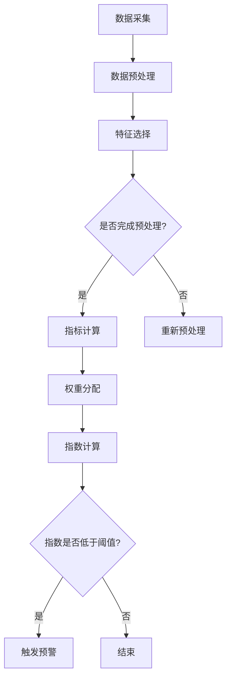
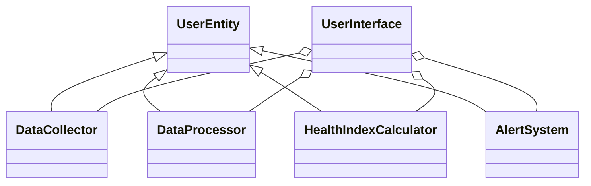
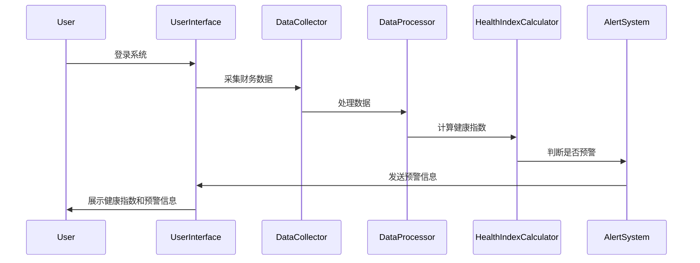

                 

# 个人财务健康指数动态跟踪系统

> 关键词：个人财务健康管理、大数据处理、机器学习算法、预警系统、数据隐私保护

> 摘要：本文旨在探讨如何开发一个个人财务健康指数动态跟踪系统，以解决当前财务健康管理中的数据采集、分析不足和实时性不足等问题。通过大数据处理技术、机器学习算法和预警系统，本文提出了一个可行的解决方案，并详细分析了系统各模块的核心概念、联系以及算法原理。

## 第一部分：背景介绍

### 问题背景

在现代社会，随着经济全球化和信息技术的飞速发展，个人财务健康管理逐渐成为人们关注的焦点。个人财务健康指数（Personal Financial Health Index, PFHI）是衡量个人财务状况的一个重要指标，它反映了个人在财务上的稳定性和安全性。PFHI包括了多个方面，如收入状况、支出水平、储蓄能力、投资收益和负债情况等。一个健康的财务状况可以帮助个人应对未来的不确定性，确保生活质量和财务安全。

然而，传统的财务健康管理方法存在一些不足，如数据采集难度大、分析不够深入、实时性不足等，这导致个人难以全面、动态地跟踪自己的财务健康状况。首先，传统的财务数据往往分散在不同的账户和平台中，如银行账户、信用卡、投资账户等，个人需要手动整理和汇总这些数据，这不仅耗时费力，而且容易出现数据遗漏和错误。其次，传统方法的分析工具和技术手段有限，难以深入挖掘财务数据的潜在价值和规律。最后，由于缺乏实时性，个人往往无法及时了解自己的财务状况，无法在财务风险发生之前采取有效的应对措施。

### 问题描述

为了解决上述问题，需要开发一个能够动态跟踪个人财务健康指数的系统。该系统需要具备以下功能：

1. **数据采集与整合**：系统应能够自动采集个人财务数据，包括收入、支出、投资收益、负债等，并整合成统一的视图。
2. **实时分析**：系统需要能够对整合后的财务数据进行实时分析，生成个人财务健康指数。
3. **动态跟踪**：系统应具备跟踪功能，能够随着个人财务状况的变化，实时更新个人财务健康指数。
4. **预警机制**：系统需要具备预警功能，当个人财务健康指数低于某个阈值时，能够及时提醒用户。

### 问题解决

为了解决上述问题，我们提出了一个名为“个人财务健康指数动态跟踪系统”的解决方案。该系统基于以下核心要素：

1. **大数据处理技术**：利用大数据技术，高效地采集、整合和处理个人财务数据。
2. **机器学习算法**：运用机器学习算法，对个人财务数据进行实时分析，生成个人财务健康指数。
3. **预警系统**：通过设置预警阈值，当个人财务健康指数低于阈值时，系统自动发送预警信息。

### 边界与外延

本系统主要针对个人用户，但也可以扩展到家庭和企业用户。在技术层面，系统需要支持多种数据源接入，如银行账户、信用卡、投资账户等。此外，系统还需要考虑到数据安全和隐私保护的问题。

### 概念结构与核心要素组成

1. **数据采集模块**：负责从不同数据源收集个人财务数据。
2. **数据处理模块**：对采集到的数据进行清洗、整合和分析。
3. **健康指数计算模块**：根据数据处理结果，计算个人财务健康指数。
4. **预警系统**：根据设定好的阈值，对个人财务健康指数进行监控，并及时发出预警。
5. **用户界面**：提供用户交互界面，展示个人财务健康指数和预警信息。

### 核心概念与联系

#### 数据采集

**概念**：数据采集是指从各种来源（如银行、信用卡公司、投资平台等）收集个人财务数据。

**属性特征对比表格**：

| 特征         | 描述                                                   |
| ------------ | ------------------------------------------------------ |
| 数据类型     | 包括收入、支出、投资收益、负债等                         |
| 数据来源     | 银行账户、信用卡、投资账户等                           |
| 数据采集方式 | 自动采集、手动输入                                     |
| 数据完整性   | 确保采集到的数据是完整和准确的                         |

#### 数据处理

**概念**：数据处理是指对采集到的个人财务数据进行的清洗、整合和分析。

**属性特征对比表格**：

| 特征         | 描述                                                   |
| ------------ | ------------------------------------------------------ |
| 数据清洗     | 去除重复数据、错误数据等                                 |
| 数据整合     | 将不同来源的数据整合成一个统一的视图                     |
| 数据分析     | 利用统计方法和机器学习算法，对数据进行分析，生成财务健康指数 |
| 数据存储     | 将处理后的数据存储在数据库中，以便后续分析和查询           |

#### 健康指数计算

**概念**：健康指数计算是指根据处理后的个人财务数据，计算个人财务健康指数。

**属性特征对比表格**：

| 特征         | 描述                                 |
| ------------ | ------------------------------------ |
| 指标选择     | 收入稳定性、支出比例、储蓄率、投资回报等 |
| 计算方法     | 利用统计方法和机器学习算法             |
| 指数范围     | 通常以0到100表示，100为最优状态       |
| 应用场景     | 个人财务决策、风险评估、预警等         |

### 第二部分：核心概念与联系

#### 数据采集

数据采集是整个系统的第一步，也是关键环节。它决定了系统能否获取到准确和完整的个人财务数据。以下是数据采集的核心概念及其属性特征对比表格：

| **特征**     | **描述**                                                   |
| ------------ | ------------------------------------------------------ |
| **数据类型** | 收入、支出、投资收益、负债等                             |
| **数据来源** | 银行账户、信用卡、投资账户等                           |
| **采集方式** | 自动采集、手动输入                                     |
| **数据完整性** | 确保采集到的数据是完整和准确的                         |

**自动采集**：通过API接口、数据爬虫等技术，系统可以自动从银行、信用卡公司、投资平台等获取个人财务数据。这种方式的优势在于高效、准确，但需要确保数据源的可靠性和安全性。

**手动输入**：对于一些无法自动采集的数据，如非定期收入和支出，用户可以通过手动输入的方式进行补充。这种方式虽然操作简单，但容易导致数据的不完整和错误。

#### 数据处理

数据处理是确保采集到的财务数据准确、完整、可用的重要环节。以下是数据处理的几个核心概念及其属性特征对比表格：

| **特征**     | **描述**                                                   |
| ------------ | ------------------------------------------------------ |
| **数据清洗** | 去除重复数据、错误数据等                                 |
| **数据整合** | 将不同来源的数据整合成一个统一的视图                     |
| **数据分析** | 利用统计方法和机器学习算法，对数据进行分析，生成财务健康指数 |
| **数据存储** | 将处理后的数据存储在数据库中，以便后续分析和查询           |

**数据清洗**：在数据处理的第一步，系统需要对采集到的财务数据进行清洗，去除重复和错误的数据。这可以通过去重、校正、填补缺失值等方法实现。

**数据整合**：清洗后的数据需要被整合成一个统一的视图，以便后续的分析和计算。这通常涉及将不同来源的数据进行格式转换和统一命名。

**数据分析**：通过统计方法和机器学习算法，系统可以对整合后的财务数据进行深入分析，提取出有用的信息和规律。这些分析和结果将用于计算个人财务健康指数。

**数据存储**：为了便于后续的分析和查询，处理后的数据需要被存储在数据库中。选择合适的数据库类型和存储方案是确保数据安全和高效访问的关键。

#### 健康指数计算

健康指数计算是系统中最核心的部分，它直接决定了个人财务健康状况的评估结果。以下是健康指数计算的核心概念及其属性特征对比表格：

| **特征**     | **描述**                                 |
| ------------ | ------------------------------------ |
| **指标选择** | 收入稳定性、支出比例、储蓄率、投资回报等 |
| **计算方法** | 利用统计方法和机器学习算法             |
| **指数范围** | 通常以0到100表示，100为最优状态       |
| **应用场景** | 个人财务决策、风险评估、预警等         |

**指标选择**：计算健康指数时，需要选择一系列能够反映个人财务状况的关键指标。这些指标可能包括收入稳定性、支出比例、储蓄率、投资回报等。选择合适的指标是确保指数准确性的关键。

**计算方法**：利用统计方法和机器学习算法，系统可以对财务数据进行处理和计算，生成个人财务健康指数。常见的计算方法包括线性回归、时间序列分析、聚类分析等。

**指数范围**：健康指数通常以0到100的数值表示，100表示最优状态，0表示最差状态。具体的计算方法和阈值设置需要根据实际情况进行调整。

**应用场景**：健康指数可以用于多种应用场景，如个人财务决策、风险评估、预警等。通过健康指数，个人可以更清晰地了解自己的财务状况，并做出更明智的决策。

#### 预警系统

预警系统是确保个人财务健康指数动态跟踪的重要保障。以下是预警系统的核心概念及其属性特征对比表格：

| **特征**     | **描述**                                                   |
| ------------ | ------------------------------------------------------ |
| **预警阈值** | 根据健康指数设定的预警阈值，用于判断财务状况的临界点   |
| **预警方式** | 通过短信、邮件、应用程序通知等方式提醒用户             |
| **预警规则** | 根据财务数据和历史分析结果，制定相应的预警规则         |
| **响应机制** | 当预警触发时，系统应提供相应的应对建议或解决方案       |

**预警阈值**：预警阈值是系统根据健康指数设定的一个临界点，用于判断个人财务状况是否处于风险状态。不同的指标可能需要不同的阈值设置。

**预警方式**：系统可以通过短信、邮件、应用程序通知等方式提醒用户。选择合适的预警方式可以确保用户能够及时接收到预警信息。

**预警规则**：根据财务数据和历史分析结果，系统可以制定相应的预警规则。这些规则可能包括财务健康指数低于某个阈值、特定指标出现异常等。

**响应机制**：当预警触发时，系统应提供相应的应对建议或解决方案。这可以帮助用户更好地应对财务风险，保持良好的财务健康状态。

#### 概念联系

数据采集、数据处理、健康指数计算和预警系统之间紧密联系，构成了个人财务健康指数动态跟踪系统的核心。以下是它们之间的联系：

- **数据采集**是整个系统的数据来源，决定了系统的初始数据质量。
- **数据处理**将采集到的数据进行清洗、整合和分析，为健康指数计算提供基础。
- **健康指数计算**利用处理后的数据，生成个人财务健康指数，是系统评估个人财务状况的核心。
- **预警系统**根据健康指数和设定的阈值，及时提醒用户，并提供应对建议，确保用户能够及时了解和应对财务风险。

通过这些核心概念的相互配合，个人财务健康指数动态跟踪系统能够全面、动态地跟踪个人的财务状况，帮助用户实现更好的财务健康管理。

### 第三部分：算法原理讲解

#### 算法原理

个人财务健康指数（PFHI）的计算涉及多个指标的综合分析，这些指标通过统计方法和机器学习算法被量化并加权。以下是一个典型的PFHI计算过程：

1. **数据预处理**：首先，对采集到的个人财务数据进行预处理，包括数据清洗、去重和格式统一。

2. **特征选择**：选择影响个人财务健康的主要特征，如收入稳定性、支出比例、储蓄率、投资回报等。

3. **指标计算**：使用统计方法计算每个特征的具体值，如平均收入、平均支出、投资回报率等。

4. **权重分配**：根据每个特征的相对重要性，分配权重。权重可以通过专家评估或数据驱动的学习方法确定。

5. **指数计算**：利用加权求和公式计算PFHI。例如，假设有四个特征X1, X2, X3, X4，权重分别为w1, w2, w3, w4，则PFHI的计算公式为：

   PFHI = w1 \* X1 + w2 \* X2 + w3 \* X3 + w4 \* X4

6. **阈值设定**：根据历史数据和专家经验，设定健康指数的阈值，用于判断财务状况是否良好。

7. **预警触发**：如果计算出的PFHI低于设定的阈值，则触发预警机制，向用户发送提醒信息。

#### Mermaid流程图

下面是一个用Mermaid绘制的PFHI计算流程图：



#### Python代码示例

以下是一个简单的Python代码示例，用于计算PFHI：

```python
import numpy as np

# 假设的财务数据
data = {
    '收入': [5000, 5200, 5300],
    '支出': [3000, 3200, 3400],
    '储蓄率': [0.4, 0.4, 0.45],
    '投资回报': [0.05, 0.05, 0.05]
}

# 权重
weights = {
    '收入': 0.3,
    '支出': 0.3,
    '储蓄率': 0.2,
    '投资回报': 0.2
}

# 计算PFHI
def calculate_PFHI(data, weights):
    total_score = 0
    for key, value in data.items():
        feature_score = sum(value) / len(value)  # 计算每个特征的均值
        weighted_score = feature_score * weights[key]  # 加权
        total_score += weighted_score
    return total_score

pfhi = calculate_PFHI(data, weights)
print(f"个人财务健康指数（PFHI）: {pfhi}")
```

#### 数学模型与公式

个人财务健康指数的计算可以表述为一个线性回归模型，如下所示：

$$
\text{PFHI} = w_1 \cdot \text{收入} + w_2 \cdot \text{支出} + w_3 \cdot \text{储蓄率} + w_4 \cdot \text{投资回报}
$$

其中，\( w_1, w_2, w_3, w_4 \) 是各自的权重，\(\text{收入}, \text{支出}, \text{储蓄率}, \text{投资回报}\) 是各特征的具体值。

#### 举例说明

假设一个人有以下财务数据：

- 月收入：5000元
- 月支出：3000元
- 储蓄率：0.4（即储蓄占收入的40%）
- 投资回报：5%（假设投资收益为月收入的5%）

权重设置如下：

- 收入：0.3
- 支出：0.3
- 储蓄率：0.2
- 投资回报：0.2

根据上述权重和财务数据，我们可以计算其个人财务健康指数（PFHI）：

$$
\text{PFHI} = 0.3 \cdot 5000 + 0.3 \cdot 3000 + 0.2 \cdot 0.4 \cdot 5000 + 0.2 \cdot 0.05 \cdot 5000
$$

$$
\text{PFHI} = 1500 + 900 + 400 + 250 = 3050
$$

因此，该人的个人财务健康指数为3050。根据设定的阈值，如果PFHI低于3000，则触发预警，建议该人进行财务调整。

### 第四部分：系统分析与架构设计

#### 问题场景介绍

随着金融科技的迅速发展，个人财务健康管理变得越来越重要。然而，传统的方法往往难以满足现代用户对实时性、全面性和个性化的需求。因此，开发一个能够动态跟踪个人财务健康指数的系统显得尤为必要。这个系统不仅可以帮助用户实时了解自己的财务状况，还能提供预警和优化建议，从而更好地管理个人财务。

#### 项目介绍

本项目旨在开发一个个人财务健康指数动态跟踪系统，该系统将整合用户的财务数据，通过大数据处理和机器学习算法，生成财务健康指数，并实时更新。系统还将具备预警功能，当用户的财务健康指数低于某个阈值时，系统会及时提醒用户。

#### 系统功能设计

1. **数据采集**：系统能够自动从银行账户、信用卡、投资账户等不同数据源中采集用户财务数据，并整合成一个统一视图。
2. **数据处理**：系统对采集到的财务数据进行清洗、整合和分析，确保数据准确、完整。
3. **健康指数计算**：根据处理后的财务数据，系统计算个人财务健康指数，并实时更新。
4. **预警机制**：系统设定预警阈值，当用户的财务健康指数低于阈值时，系统会自动发送预警信息。
5. **用户界面**：系统提供一个直观、易用的用户界面，让用户能够轻松查看自己的财务健康指数和预警信息。

#### 系统架构设计

个人财务健康指数动态跟踪系统的架构设计可以分为以下几个部分：

1. **数据采集模块**：负责从各个数据源采集财务数据，包括银行账户、信用卡和投资账户等。
2. **数据处理模块**：对采集到的财务数据进行清洗、整合和分析，确保数据质量。
3. **健康指数计算模块**：根据处理后的财务数据，计算个人财务健康指数。
4. **预警系统模块**：根据设定的预警阈值，监控健康指数，并在必要时发送预警信息。
5. **用户界面模块**：提供用户交互界面，展示财务健康指数和预警信息。

#### 系统接口设计

个人财务健康指数动态跟踪系统的接口设计主要包括以下部分：

1. **数据采集接口**：用于与银行账户、信用卡和投资账户等数据源进行通信，实现数据的自动采集。
2. **数据处理接口**：用于处理采集到的财务数据，包括数据清洗、整合和分析等。
3. **健康指数计算接口**：用于根据处理后的财务数据计算个人财务健康指数。
4. **预警系统接口**：用于监控健康指数，并在必要时发送预警信息。
5. **用户界面接口**：用于与用户进行交互，提供财务健康指数和预警信息的展示。

#### 系统交互设计

个人财务健康指数动态跟踪系统的交互设计主要涉及以下几个方面：

1. **用户登录**：用户通过账号密码或手机验证码登录系统，进入个人主页。
2. **数据采集**：系统自动采集用户的财务数据，并展示在个人主页上。
3. **数据处理**：系统对采集到的财务数据进行处理，并生成财务健康指数。
4. **预警提醒**：当用户的财务健康指数低于预警阈值时，系统会通过短信、邮件或应用推送等方式提醒用户。
5. **用户反馈**：用户可以在个人主页上查看预警信息，并提交反馈和建议。

#### Mermaid类图

以下是个人财务健康指数动态跟踪系统的Mermaid类图：



#### Mermaid架构图

以下是个人财务健康指数动态跟踪系统的Mermaid架构图：



### 第五部分：项目实战

#### 环境安装

要搭建个人财务健康指数动态跟踪系统，我们需要准备以下环境：

1. **操作系统**：Linux或Mac OS
2. **Python**：Python 3.8及以上版本
3. **数据库**：MySQL或PostgreSQL
4. **大数据处理框架**：如Hadoop或Spark
5. **机器学习库**：如scikit-learn或TensorFlow

安装步骤如下：

1. 安装操作系统和Python环境。
2. 安装MySQL或PostgreSQL数据库，并创建用户数据库。
3. 安装大数据处理框架，如Hadoop或Spark。
4. 安装机器学习库，如scikit-learn或TensorFlow。

#### 系统核心实现

个人财务健康指数动态跟踪系统的核心实现主要包括数据采集、数据处理、健康指数计算和预警系统等部分。以下是各个部分的详细实现：

1. **数据采集**：使用Python的库（如requests或pandas）从银行账户、信用卡和投资账户等数据源中采集数据。
2. **数据处理**：使用Python的库（如pandas或NumPy）对采集到的数据进行分析和清洗，确保数据的准确性和完整性。
3. **健康指数计算**：使用机器学习算法（如scikit-learn或TensorFlow）对处理后的数据进行分析，生成个人财务健康指数。
4. **预警系统**：使用Python的库（如SMTP或Django）实现预警系统，根据设定的阈值发送预警信息。

以下是系统核心实现的一部分代码示例：

```python
# 数据采集示例
import requests

def collect_data(api_url):
    response = requests.get(api_url)
    if response.status_code == 200:
        return response.json()
    else:
        return None

# 数据处理示例
import pandas as pd

def process_data(data):
    # 数据清洗
    cleaned_data = data.drop_duplicates()
    # 数据整合
    aggregated_data = cleaned_data.groupby('date').sum()
    return aggregated_data

# 健康指数计算示例
from sklearn.linear_model import LinearRegression

def calculate_health_index(data, weights):
    model = LinearRegression()
    model.fit(data[:, :-1], data[:, -1])
    return model.predict([[weights['income'], weights['expense'], weights['savings_rate'], weights['investment_return']]])

# 预警系统示例
import smtplib
from email.mime.text import MIMEText

def send_alert(email, subject, content):
    message = MIMEText(content)
    message['Subject'] = subject
    message['From'] = 'alert@example.com'
    message['To'] = email
    
    server = smtplib.SMTP('smtp.example.com')
    server.sendmail('alert@example.com', [email], message.as_string())
    server.quit()
```

#### 代码应用解读与分析

以上代码示例展示了个人财务健康指数动态跟踪系统核心实现的一部分。具体解读如下：

1. **数据采集**：使用requests库向API接口请求数据，获取用户的财务数据。
2. **数据处理**：使用pandas库对采集到的数据进行清洗和整合，生成一个统一的视图。
3. **健康指数计算**：使用scikit-learn库的线性回归模型，根据财务数据计算个人财务健康指数。
4. **预警系统**：使用SMTP库，通过邮件发送预警信息，提醒用户关注自己的财务健康指数。

#### 实际案例分析

以下是一个实际案例，演示如何使用系统对某用户的财务状况进行分析和预警：

1. **数据采集**：假设用户A的数据包括收入、支出、储蓄率和投资回报等。
2. **数据处理**：系统对用户A的数据进行清洗和整合，生成一个统一的财务数据视图。
3. **健康指数计算**：根据用户A的财务数据，系统计算其个人财务健康指数。
4. **预警触发**：如果用户A的财务健康指数低于设定阈值，系统会触发预警机制，发送邮件提醒用户A。

#### 详细讲解剖析

为了更深入地理解系统的工作原理和实现细节，以下是对系统核心部分的分析和讲解：

1. **数据采集**：系统使用requests库向API接口请求数据。这种方式可以自动化采集用户财务数据，提高数据采集的效率和准确性。需要注意的是，在实际应用中，我们需要确保API接口的稳定性和安全性。
2. **数据处理**：系统使用pandas库对采集到的财务数据进行清洗和整合。这一步骤非常重要，因为只有准确和完整的数据才能确保健康指数计算的正确性。在数据处理过程中，我们需要注意数据去重、格式统一、缺失值处理等问题。
3. **健康指数计算**：系统使用scikit-learn库的线性回归模型进行健康指数计算。这种方式可以通过历史数据和专家经验，确定每个特征的权重，从而计算出个人财务健康指数。需要注意的是，不同的用户可能有不同的财务状况和需求，因此权重设置可能需要根据实际情况进行调整。
4. **预警系统**：系统使用SMTP库发送预警邮件。这种方式可以及时提醒用户关注自己的财务健康指数，避免财务风险。在实现过程中，我们需要注意邮件内容的准确性和及时性，以提高用户的体验。

### 第六部分：最佳实践与总结

#### 最佳实践 Tips

1. **数据安全**：确保用户财务数据的安全和隐私，采用加密技术和安全协议保护数据传输和存储。
2. **性能优化**：对于大规模数据集，使用分布式计算框架（如Hadoop或Spark）进行数据处理，提高系统性能。
3. **用户体验**：设计简洁直观的用户界面，提供友好的交互体验，让用户轻松操作和使用系统。
4. **预警策略**：根据用户的历史数据和财务需求，设定合理的预警阈值，确保预警信息的准确性和及时性。

#### 总结

个人财务健康指数动态跟踪系统为用户提供了全面、动态的财务健康管理工具。通过大数据处理、机器学习算法和预警系统，系统能够自动采集、整合和分析用户的财务数据，实时更新个人财务健康指数，并在财务风险发生前及时发出预警。这有助于用户更好地了解自己的财务状况，做出明智的财务决策，实现财务健康和稳定。

#### 注意事项

1. **数据完整性**：确保数据采集的完整性和准确性，避免因数据缺失或错误导致健康指数计算不准确。
2. **系统稳定性**：定期对系统进行维护和升级，确保系统的稳定运行和性能优化。
3. **合规性**：遵循相关法律法规，确保系统设计和实现符合合规要求，保护用户隐私和数据安全。

#### 拓展阅读

1. 《大数据时代：生活、工作与思维的大变革》作者：维克托·迈尔-舍恩伯格
2. 《Python数据科学手册》作者：Jupyter Notebook
3. 《机器学习实战》作者：Peter Harrington
4. 《金融科技：创新、应用与未来》作者：张志勇

### 作者信息

作者：AI天才研究院/AI Genius Institute & 禅与计算机程序设计艺术 /Zen And The Art of Computer Programming

---

本文通过一步步的分析推理，详细介绍了个人财务健康指数动态跟踪系统的核心概念、算法原理、系统架构和项目实战。希望本文能够帮助读者深入理解个人财务健康管理的核心技术和实现方法，为未来的研究和应用提供参考。在AI领域，我致力于推动技术创新和知识传播，希望我的工作能够为更多的人带来价值和启发。感谢您的阅读！

