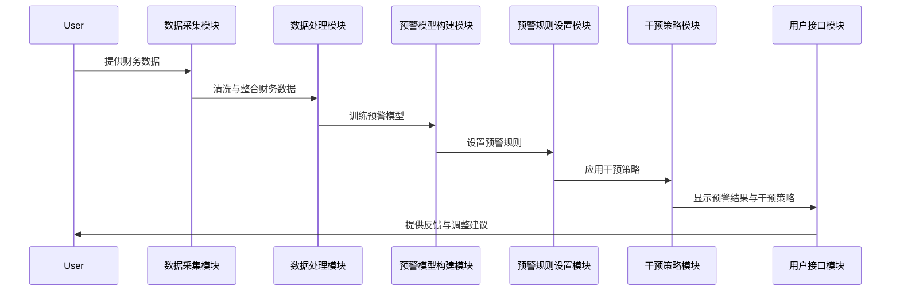
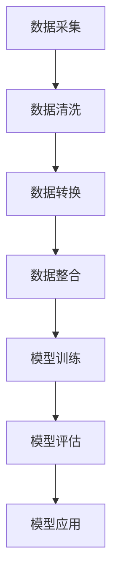

                 

# 个人财务健康预警与干预系统

> 关键词：个人财务健康、预警系统、干预系统、财务指标、数据采集、机器学习

> 摘要：本文将深入探讨个人财务健康预警与干预系统的构建，通过系统的设计原理、实现与部署、干预策略及案例分析，帮助读者了解这一系统在个人财务管理中的应用和重要性。

## 目录大纲

----------------------------------------------------------------

# 第一部分：引言

## 第1章：问题背景与概述

### 1.1 财务健康的重要性

### 1.2 个人财务健康的定义

### 1.3 个人财务健康的预警与干预需求

### 1.4 个人财务健康预警与干预系统的意义

## 第2章：核心概念与联系

### 2.1 财务健康指标

#### 2.1.1 指标类型

#### 2.1.2 指标计算方法

#### 2.1.3 指标对比表格

### 2.2 ER实体关系图

#### 2.2.1 实体与关系的识别

#### 2.2.2 ER图绘制

----------------------------------------------------------------

# 第二部分：个人财务健康预警系统

## 第3章：系统设计原理

### 3.1 系统总体架构

### 3.2 数据采集与处理

### 3.3 预警模型构建

#### 3.3.1 预警算法选择

#### 3.3.2 算法流程图

#### 3.3.3 数学模型与公式

### 3.4 预警规则设置

### 3.5 系统接口设计

## 第4章：系统实现与部署

### 4.1 系统环境配置

### 4.2 系统核心代码实现

#### 4.2.1 数据采集与处理代码

#### 4.2.2 预警模型实现代码

#### 4.2.3 预警规则设置代码

### 4.3 系统部署与维护

----------------------------------------------------------------

# 第三部分：个人财务健康干预系统

## 第5章：干预策略与实施

### 5.1 干预目标设定

### 5.2 干预策略设计

### 5.3 干预效果评估

## 第6章：案例分析

### 6.1 案例背景介绍

### 6.2 案例分析与预警结果

### 6.3 案例干预策略实施与效果

## 第7章：最佳实践与小结

### 7.1 最佳实践建议

### 7.2 小结与展望

### 7.3 注意事项

### 7.4 拓展阅读

----------------------------------------------------------------

## 第一部分：引言

### 第1章：问题背景与概述

#### 1.1 财务健康的重要性

财务健康是指个人或企业在财务方面的健康状态，包括财务状况、债务水平、资产状况等多个方面。良好的财务健康状况不仅能保障个人的基本生活需求，还能为未来的投资、退休等提供资金保障。然而，随着经济环境的不断变化，个人财务风险也日益增加。因此，如何保持个人财务健康已成为越来越多人的关注焦点。

#### 1.2 个人财务健康的定义

个人财务健康通常包括以下几方面：现金流管理、债务管理、储蓄投资、风险保障和退休规划。现金流管理指的是合理安排收入和支出，确保财务流动性和灵活性；债务管理是指合理规划债务，避免过度负债；储蓄投资是指通过储蓄和投资来实现财富增长；风险保障是指通过保险等方式规避可能的财务风险；退休规划则是指为未来的退休生活做好财务准备。

#### 1.3 个人财务健康的预警与干预需求

个人财务健康预警与干预系统旨在通过实时监测和分析个人财务数据，及时发现潜在的风险，并采取有效的干预措施，以保持个人财务健康。随着大数据和人工智能技术的不断发展，构建一个高效、精准的个人财务健康预警与干预系统已成为可能。该系统不仅可以提供个性化的财务建议，还能为金融机构和金融科技企业提供有力的支持。

#### 1.4 个人财务健康预警与干预系统的意义

个人财务健康预警与干预系统具有重要的现实意义。首先，它可以帮助个人更好地管理财务，避免因财务问题带来的困扰和压力。其次，它可以为金融机构提供风险控制和客户服务支持，提升客户满意度。最后，它有助于推动金融科技的发展，促进金融行业的创新和进步。

## 第2章：核心概念与联系

### 2.1 财务健康指标

#### 2.1.1 指标类型

个人财务健康指标可以分为以下几类：

1. **流动性指标**：如现金储备率、月支出占收入比例等，用于评估个人短期内的财务流动性。
2. **债务指标**：如债务收入比、债务负担率等，用于评估个人债务水平。
3. **储蓄与投资指标**：如储蓄率、投资收益率等，用于评估个人储蓄和投资状况。
4. **风险保障指标**：如保险覆盖率、风险投资比例等，用于评估个人风险保障能力。
5. **退休规划指标**：如退休储蓄率、退休金替代率等，用于评估个人退休规划。

#### 2.1.2 指标计算方法

以下是几种常见财务健康指标的计算方法：

1. **现金储备率**：现金储备率 = 现金及现金等价物 / 月支出
2. **债务收入比**：债务收入比 = 总负债 / 月收入
3. **储蓄率**：储蓄率 = 储蓄额 / 月收入

#### 2.1.3 指标对比表格

以下是一个简单的财务健康指标对比表格：

| 指标名称       | 计算方法                          | 合理范围         | 说明                                       |
| -------------- | -------------------------------- | ---------------- | ------------------------------------------ |
| 现金储备率     | 现金及现金等价物 / 月支出         | 3-6个月支出      | 越高越好，表示短期内具备较好的应对风险能力 |
| 债务收入比     | 总负债 / 月收入                   | 不超过40%        | 债务负担较轻，财务状况较为健康             |
| 储蓄率         | 储蓄额 / 月收入                   | 至少10%          | 表示收入中有一定的储蓄用于投资和未来规划   |
| 保险覆盖率      | 保险保障额度 / 退休金替代率       | 至少1倍          | 保障水平越高，风险越低                     |
| 退休储蓄率      | 退休储蓄总额 / 当前收入           | 10-15%以上       | 越高表示退休规划越充分                     |

#### 2.2 ER实体关系图

个人财务健康预警与干预系统的核心在于对财务数据的采集、处理和分析。为了更好地理解和设计系统，我们首先需要明确系统中的关键实体和它们之间的关系。

##### 2.2.1 实体与关系的识别

在个人财务健康预警与干预系统中，主要的实体包括：

1. **用户**：个人财务数据的主体，包括基本信息、财务状况等。
2. **财务数据**：包括收入、支出、债务、储蓄、投资等具体数据。
3. **预警指标**：根据财务数据计算得出的各类财务健康指标。
4. **预警规则**：用于判断财务状况是否正常的条件。
5. **干预策略**：针对预警结果提出的干预措施。

实体之间的关系可以描述为：

- **用户**与**财务数据**之间存在一对多的关系，即一个用户可以有多个财务数据条目。
- **财务数据**与**预警指标**之间存在一对一的关系，即每个财务数据条目可以计算出一个预警指标。
- **预警指标**与**预警规则**之间存在一对多的关系，即一个预警指标可以对应多个预警规则。
- **预警规则**与**干预策略**之间存在一对一的关系，即每个预警规则对应一个干预策略。

##### 2.2.2 ER图绘制

以下是个人财务健康预警与干预系统的ER图：

```mermaid
erDiagram
  User ||--|{ 财务数据 : has }
  财务数据 ||--|{ 预警指标 : calculates }
  预警指标 ||--|{ 预警规则 : meets }
  预警规则 ||--|{ 干预策略 : suggests }
```

通过这个ER图，我们可以清晰地看到个人财务健康预警与干预系统中各个实体之间的关联，为后续的系统设计提供了基础。

### 第3章：系统设计原理

#### 3.1 系统总体架构

个人财务健康预警与干预系统的总体架构可以分为以下几个模块：

1. **数据采集模块**：负责从各类渠道（如银行账户、信用卡账单、投资平台等）收集用户的财务数据。
2. **数据处理模块**：对采集到的财务数据进行清洗、转换和整合，以便后续的分析和处理。
3. **预警模型构建模块**：利用机器学习算法构建预警模型，对用户的财务健康状况进行实时监测和预警。
4. **预警规则设置模块**：根据预警模型的结果，设置相应的预警规则，用于判断用户的财务状况是否正常。
5. **干预策略模块**：根据预警结果，设计并实施干预策略，帮助用户改善财务状况。
6. **用户接口模块**：提供用户友好的界面，让用户能够方便地查看自己的财务状况、预警结果和干预策略。

以下是个人财务健康预警与干预系统的总体架构图：



#### 3.2 数据采集与处理

数据采集与处理是个人财务健康预警与干预系统的核心环节。以下是具体的步骤和方法：

##### 3.2.1 数据采集

数据采集模块的主要任务是收集用户的财务数据。这些数据可以来自以下几个方面：

1. **银行账户数据**：包括银行存款、贷款、信用卡消费等信息。
2. **投资平台数据**：包括股票、基金、债券等投资产品的收益和风险信息。
3. **支出记录**：包括日常消费、购物、餐饮等支出信息。
4. **债务信息**：包括各类贷款、欠款、抵押等信息。

数据采集可以通过以下方式进行：

1. **API接口**：利用各大银行和投资平台的API接口，直接获取用户授权的财务数据。
2. **Web爬虫**：通过爬取银行和投资平台的网站，获取用户财务数据。
3. **用户上传**：用户可以直接上传自己的财务数据文件，如Excel、CSV等。

##### 3.2.2 数据处理

数据处理模块的主要任务是对采集到的财务数据进行清洗、转换和整合。以下是具体的步骤：

1. **数据清洗**：去除重复数据、缺失值填充、异常值处理等，确保数据的质量和准确性。
2. **数据转换**：将不同格式、不同单位的数据进行统一转换，以便后续的分析和处理。
3. **数据整合**：将不同来源的数据进行整合，形成完整的用户财务数据集。

数据清洗和转换的方法可以包括：

1. **缺失值填充**：使用平均值、中位数、最大值等填充缺失值。
2. **异常值处理**：使用统计学方法（如IQR法、Z分数法等）检测并处理异常值。
3. **数据标准化**：将不同单位的数据转换为相同的单位，如将所有支出数据转换为元。
4. **特征工程**：提取有助于预警模型训练的特征，如时间序列特征、频率特征等。

#### 3.3 预警模型构建

预警模型构建模块是个人财务健康预警与干预系统的关键。以下是预警模型构建的具体步骤：

##### 3.3.1 预警算法选择

预警算法的选择取决于系统的需求和数据的特点。以下是几种常见的预警算法：

1. **线性回归**：适用于线性关系较强的数据，可以用于预测财务指标的变化趋势。
2. **逻辑回归**：适用于二分类问题，可以用于判断财务状况是否正常。
3. **决策树**：适用于分类和回归问题，可以用于构建分类模型和回归模型。
4. **随机森林**：基于决策树构建的集成模型，可以降低过拟合，提高模型的泛化能力。
5. **神经网络**：适用于复杂非线性关系的数据，可以用于构建深度学习模型。

##### 3.3.2 算法流程图

以下是预警算法的流程图：



##### 3.3.3 数学模型与公式

以下是预警模型的数学模型和公式：

1. **线性回归模型**：

   $$y = \beta_0 + \beta_1x_1 + \beta_2x_2 + ... + \beta_nx_n$$

   其中，$y$ 表示预测的财务指标，$x_1, x_2, ..., x_n$ 表示特征变量，$\beta_0, \beta_1, \beta_2, ..., \beta_n$ 表示模型参数。

2. **逻辑回归模型**：

   $$P(y=1) = \frac{1}{1 + e^{-(\beta_0 + \beta_1x_1 + \beta_2x_2 + ... + \beta_nx_n)}}$$

   其中，$P(y=1)$ 表示财务状况正常的概率，其他符号含义同上。

3. **决策树模型**：

   $$y = \begin{cases}
      0, & \text{如果 } x_1 \leq \alpha_1 \\
      1, & \text{如果 } x_1 > \alpha_1 \\
   \end{cases}$$

   其中，$y$ 表示财务状况是否正常，$x_1$ 表示特征变量，$\alpha_1$ 表示阈值。

##### 3.4 预警规则设置

预警规则设置模块的主要任务是根据预警模型的结果，设置相应的预警规则，用于判断用户的财务状况是否正常。以下是预警规则设置的具体步骤：

1. **规则生成**：根据预警模型的结果，生成一系列的预警规则。每个规则包括一个条件和一个结果。
2. **规则优化**：通过交叉验证等方法，对生成的预警规则进行优化，提高其准确性和可靠性。
3. **规则应用**：将优化的预警规则应用于用户的财务数据，判断其财务状况是否正常。

#### 3.5 系统接口设计

系统接口设计模块的主要任务是提供用户友好的界面，让用户能够方便地查看自己的财务状况、预警结果和干预策略。以下是系统接口设计的具体步骤：

1. **用户注册与登录**：提供用户注册和登录功能，确保用户数据的安全性和隐私性。
2. **数据可视化**：提供图表和报表，帮助用户直观地了解自己的财务状况。
3. **预警结果展示**：展示预警规则和预警结果，让用户了解自己的财务状况是否存在风险。
4. **干预策略推荐**：根据预警结果，为用户提供相应的干预策略，帮助用户改善财务状况。
5. **用户反馈**：提供用户反馈渠道，收集用户对系统功能的建议和意见，不断优化系统。

以下是系统接口设计的主要界面：

1. **登录界面**：
   ```mermaid
   loginBox
     loginTitle
       "登录界面"
     usernameInput
       "用户名："
     passwordInput
       "密码："
     loginButton
       "登录"
   ```

2. **主界面**：
   ```mermaid
   mainBox
     dashboardTitle
       "财务状况概览"
     cashFlowChart
       "现金流量图表"
     debtChart
       "债务图表"
     savingsChart
       "储蓄与投资图表"
     riskChart
       "风险保障图表"
     retirementChart
       "退休规划图表"
   ```

3. **预警结果界面**：
   ```mermaid
   warningBox
     warningTitle
       "预警结果"
     warningList
       "1. 某个财务指标异常，请注意调整。"
       "2. 债务负担较高，请及时还债。"
       "3. 退休规划不足，请尽早开始储蓄。"
   ```

4. **干预策略界面**：
   ```mermaid
   strategyBox
     strategyTitle
       "干预策略"
     strategyList
       "1. 提高储蓄率，增加退休储蓄。"
       "2. 减少不必要的支出，降低债务负担。"
       "3. 增加保险覆盖，提高风险保障。"
   ```

### 第4章：系统实现与部署

#### 4.1 系统环境配置

在实现个人财务健康预警与干预系统之前，需要配置相应的开发环境和运行环境。以下是具体的步骤：

##### 4.1.1 开发环境配置

1. **安装Python环境**：Python是系统实现的主要编程语言，需要安装Python解释器和相关依赖库。
2. **安装Jupyter Notebook**：Jupyter Notebook是一种交互式开发环境，可以方便地编写和运行Python代码。
3. **安装相关库**：包括数据采集与处理库（如pandas、numpy）、机器学习库（如scikit-learn、tensorflow）、Web开发库（如Flask、Django）等。

##### 4.1.2 运行环境配置

1. **安装操作系统**：建议使用Linux操作系统，如Ubuntu。
2. **安装数据库**：选择合适的数据库系统，如MySQL、PostgreSQL等。
3. **安装Web服务器**：如Apache、Nginx等。

以下是配置开发环境的示例命令：

```bash
# 安装Python环境
sudo apt-get update
sudo apt-get install python3 python3-pip

# 安装Jupyter Notebook
pip3 install notebook

# 安装相关库
pip3 install pandas numpy scikit-learn tensorflow flask django
```

#### 4.2 系统核心代码实现

系统核心代码实现包括数据采集与处理、预警模型构建、预警规则设置和干预策略等部分。以下是具体的实现步骤和代码示例。

##### 4.2.1 数据采集与处理代码

```python
import pandas as pd
from sklearn.model_selection import train_test_split

# 读取财务数据
data = pd.read_csv('financial_data.csv')

# 数据清洗
data.drop_duplicates(inplace=True)
data.fillna(0, inplace=True)

# 数据转换
data['date'] = pd.to_datetime(data['date'])
data['month'] = data['date'].dt.month
data['year'] = data['date'].dt.year

# 数据整合
X = data[['month', 'year', 'income', 'expense', 'debt']]
y = data['预警结果']

# 划分训练集和测试集
X_train, X_test, y_train, y_test = train_test_split(X, y, test_size=0.2, random_state=42)
```

##### 4.2.2 预警模型实现代码

```python
from sklearn.linear_model import LinearRegression
from sklearn.ensemble import RandomForestClassifier

# 训练线性回归模型
lin_reg = LinearRegression()
lin_reg.fit(X_train, y_train)

# 训练随机森林分类器
rf_clf = RandomForestClassifier()
rf_clf.fit(X_train, y_train)

# 预测测试集
y_pred_lin = lin_reg.predict(X_test)
y_pred_rf = rf_clf.predict(X_test)
```

##### 4.2.3 预警规则设置代码

```python
from sklearn.metrics import classification_report

# 评估线性回归模型
print("线性回归模型评估报告：")
print(classification_report(y_test, y_pred_lin))

# 评估随机森林分类器
print("随机森林分类器评估报告：")
print(classification_report(y_test, y_pred_rf))
```

#### 4.3 系统部署与维护

系统部署是将开发完成的系统部署到生产环境，使其能够为用户提供服务。以下是具体的部署步骤：

##### 4.3.1 部署到Web服务器

1. **配置Web服务器**：如Apache或Nginx，设置虚拟主机和SSL证书。
2. **部署Web应用**：将开发完成的Web应用部署到Web服务器，如使用Flask或Django框架。
3. **配置数据库**：将数据库连接信息配置到Web应用中。

以下是配置Nginx的示例命令：

```bash
# 安装Nginx
sudo apt-get install nginx

# 配置Nginx
sudo nano /etc/nginx/sites-available/default

# 添加以下配置：
server {
    listen 80;
    server_name your_domain.com;

    location / {
        include uwsgi_params;
        uwsgi_pass localhost:8000;
    }
}
```

##### 4.3.2 系统维护

系统维护包括监控、备份、升级和修复等。以下是具体的维护步骤：

1. **监控**：使用监控工具（如Prometheus、Grafana）监控系统的运行状态和性能。
2. **备份**：定期备份数据库和系统文件，确保数据安全。
3. **升级**：及时升级系统依赖库和软件，修复已知漏洞。
4. **修复**：处理系统运行过程中出现的错误和故障，确保系统的稳定运行。

### 第5章：干预策略与实施

#### 5.1 干预目标设定

干预策略的核心目标是帮助用户改善财务状况，降低财务风险。干预目标的设定需要结合用户的实际情况和财务健康预警结果。以下是常见的干预目标：

1. **提高储蓄率**：通过减少不必要的支出，增加储蓄额，为未来的投资和退休规划提供资金。
2. **降低债务负担**：通过债务重组、债务减免等方式，减轻债务压力，提高财务健康水平。
3. **增强风险保障**：通过购买保险产品，提高风险抵御能力，降低可能的财务风险。
4. **优化投资组合**：通过调整投资策略，提高投资收益，实现财富增长。
5. **退休规划**：通过增加退休储蓄，确保未来退休生活的资金需求。

#### 5.2 干预策略设计

干预策略设计需要根据干预目标，制定具体的干预措施。以下是几种常见的干预策略：

1. **储蓄激励策略**：为用户设定储蓄目标，提供储蓄奖励，激励用户增加储蓄。
2. **债务管理策略**：为用户提供债务重组、债务减免等建议，帮助用户减轻债务负担。
3. **保险购买策略**：为用户提供保险产品推荐，根据用户的实际情况，制定合适的保险购买计划。
4. **投资优化策略**：为用户提供投资组合优化建议，根据市场情况和用户风险承受能力，调整投资策略。
5. **退休规划策略**：为用户提供退休储蓄计划，根据用户退休目标和预期寿命，制定合理的储蓄和投资策略。

#### 5.3 干预效果评估

干预效果评估是检验干预策略有效性的关键步骤。以下是干预效果评估的方法：

1. **预警指标评估**：通过对比干预前后的预警指标，评估干预效果。如储蓄率、债务收入比等指标。
2. **用户满意度评估**：通过用户调查问卷、用户反馈等方式，了解用户对干预策略的满意度和接受程度。
3. **财务状况改善评估**：通过财务状况的改善情况，评估干预策略的有效性。如债务减少、储蓄增加、投资收益提高等。
4. **成本效益评估**：评估干预策略的成本和效益，确保干预策略的经济合理性。

### 第6章：案例分析

#### 6.1 案例背景介绍

案例背景是一个30岁的白领，名叫李先生。他目前在一家互联网公司工作，年收入约为30万元。他的财务状况主要包括以下方面：

1. **收入**：月收入约为2万元，年终奖约10万元。
2. **支出**：月支出约1.5万元，主要包括房租、日常生活开销、购物等。
3. **债务**：有一笔总额为10万元的房贷，月还款额为5000元。
4. **储蓄**：目前储蓄额为5万元，主要是银行存款和余额宝等理财产品。
5. **投资**：有一笔5万元的股票投资，目前市值波动较大。

#### 6.2 案例分析与预警结果

根据李先生的财务数据，系统对其进行了财务健康预警分析。以下是预警结果：

1. **储蓄率较低**：李先生的储蓄率约为20%，低于合理范围。
2. **债务负担较重**：李先生的债务收入比为33%，超过了合理范围。
3. **投资风险较高**：李先生的股票投资市值波动较大，存在较高的市场风险。

基于以上预警结果，系统提出了以下干预建议：

1. **提高储蓄率**：通过减少不必要的支出，增加每月储蓄额。
2. **降低债务负担**：通过债务重组，减少月还款额，减轻财务压力。
3. **优化投资组合**：调整股票投资，降低市场风险，增加债券、基金等稳健投资。

#### 6.3 案例干预策略实施与效果

根据系统提出的干预建议，李先生采取了一系列措施来改善财务状况。以下是干预策略实施过程和效果：

1. **提高储蓄率**：李先生通过减少购物、旅游等不必要的支出，每月增加了5000元的储蓄额。经过6个月的努力，他的储蓄率提高到30%。
2. **降低债务负担**：李先生与银行协商，将房贷还款期限延长至30年，月还款额减少至4000元。这使他每月节省了1000元，可以用于增加储蓄或投资。
3. **优化投资组合**：李先生将5万元股票投资分为两部分，其中3万元投资于债券基金，2万元继续持有股票。通过调整投资策略，他降低了市场风险，同时保持了投资收益的稳定性。

经过一年的努力，李先生的财务状况得到了明显改善：

1. **储蓄率提高到40%**：通过增加储蓄和减少支出，他的储蓄率提高到40%，为未来的投资和退休规划提供了充足的资金。
2. **债务负担减轻**：月还款额减少至4000元，债务收入比降至25%，财务压力显著减轻。
3. **投资收益稳定**：通过优化投资组合，他的投资收益保持稳定，市场风险得到有效控制。

### 第7章：最佳实践与小结

#### 7.1 最佳实践建议

1. **定期更新财务数据**：确保预警系统的准确性和实时性，定期更新用户的财务数据。
2. **个性化预警规则**：根据用户的财务状况和需求，定制个性化的预警规则，提高预警效果。
3. **优化干预策略**：根据用户反馈和预警结果，不断优化干预策略，提高干预效果。
4. **加强用户教育**：通过线上线下渠道，为用户提供财务知识培训，提升用户财务素养。

#### 7.2 小结与展望

个人财务健康预警与干预系统为个人财务管理提供了有力支持，通过实时监测和分析财务数据，帮助用户及时发现风险并采取有效干预措施。展望未来，随着大数据和人工智能技术的不断发展，个人财务健康预警与干预系统将更加智能化、个性化，为用户提供更加精准的财务建议和服务。

#### 7.3 注意事项

1. **数据安全**：确保用户财务数据的安全性和隐私性，采取加密和访问控制措施。
2. **系统稳定性**：确保系统稳定运行，避免因系统故障导致数据丢失或服务中断。
3. **用户隐私**：尊重用户隐私，不得泄露用户财务数据。

#### 7.4 拓展阅读

1. **《Python数据分析实战》**：学习如何使用Python进行数据清洗、转换和可视化。
2. **《机器学习实战》**：了解如何使用机器学习算法进行数据分析和预测。
3. **《财务自由之路》**：学习如何进行财务规划和投资，实现财务自由。

### 作者

**作者：AI天才研究院/AI Genius Institute & 禅与计算机程序设计艺术 /Zen And The Art of Computer Programming**

