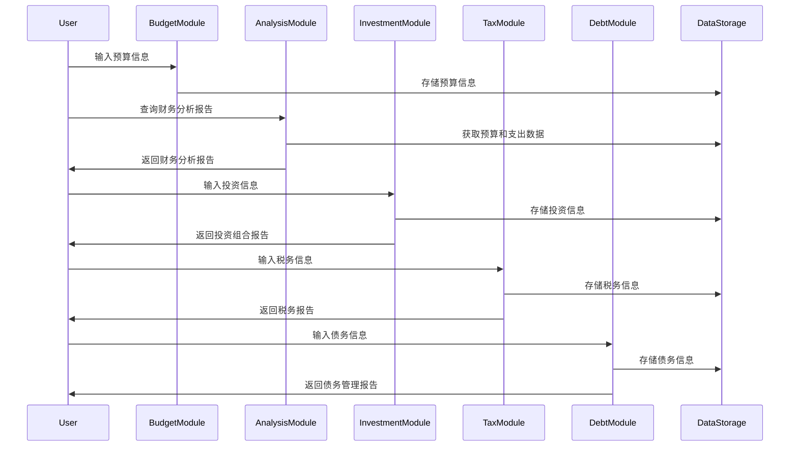
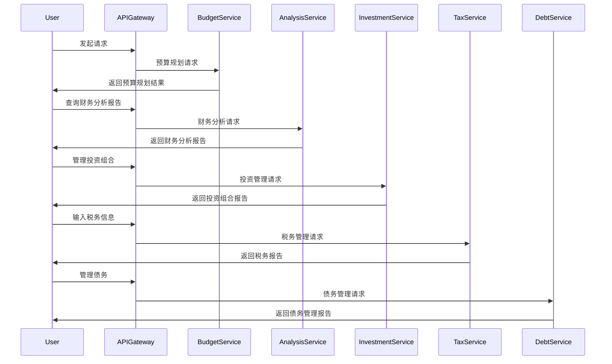

                 

# 个人财务管理工具集成

> 关键词：个人财务管理，工具集成，预算规划，投资管理，税务管理，债务管理

> 摘要：本文将围绕个人财务管理工具集成这一主题，深入探讨当前个人财务管理的现状与挑战，介绍核心概念和常用工具，分析财务管理工具的整合与集成策略，以及财务分析、投资管理和税务管理工具的具体应用。通过系统分析与架构设计方案，提出最佳实践建议，以帮助个人实现有效的财务管理。

### 第一部分：引言

#### 1.1 问题背景

##### 1.1.1 财务管理的现状与挑战

在现代经济生活中，个人财务管理日益受到重视。随着金融市场的日益复杂和多样化，个人面临的管理挑战也在不断增加。传统的财务管理方式往往依赖于手工操作，存在效率低、准确性差等问题。同时，个人财务信息的分散化也使得数据整合和管理变得更加困难。

##### 1.1.2 个人财务管理的重要性

有效的个人财务管理不仅可以提高个人的经济安全感和生活品质，还可以为未来的投资和退休规划打下坚实的基础。因此，如何利用现代技术和工具来提高个人财务管理的效率和质量，成为了一个重要课题。

##### 1.1.3 本书的目标与结构

本文的目标是探讨个人财务管理工具的集成，旨在通过整合多种财务管理工具，实现数据共享和功能优化，从而提高个人财务管理的整体效率。文章将分为五个部分：

1. **个人财务管理工具概述**：介绍财务管理工具的功能与特性，以及主流工具的介绍和比较分析。
2. **财务分析工具**：介绍财务分析的基本概念和常用工具，包括Excel和Python在财务分析中的应用。
3. **投资管理工具**：介绍投资管理的基本概念和常用工具，包括股票投资和基金投资管理工具。
4. **税务管理工具**：介绍税务管理的基本概念和常用工具，分析税务管理工具的集成与优化。
5. **债务管理工具**：介绍债务管理的基本概念和常用工具，探讨债务管理工具的集成与优化。

#### 1.2 核心概念

##### 1.2.1 个人财务管理的定义

个人财务管理是指个人对财务资源进行有效规划、控制、分析和优化的过程，包括预算规划、投资管理、税务规划和债务管理等多个方面。

##### 1.2.2 财务管理工具的分类

财务管理工具可以分为软件工具和网络工具两大类。软件工具通常是指安装在个人电脑上的应用程序，而网络工具则是指通过互联网提供的在线服务。

##### 1.2.3 财务管理工具的边界与外延

财务管理工具的边界主要涉及财务管理的基本职能，如预算规划、投资管理和税务规划等。外延则包括数据整合、自动化操作和用户体验等多个方面。

### 第二部分：个人财务管理工具概述

#### 2.1 财务管理工具的功能与特性

##### 2.1.1 预算规划

预算规划工具可以帮助个人制定和跟踪预算，包括收入、支出和储蓄等。这些工具通常具备自动分类、图表展示和提醒功能，有助于个人更好地掌握财务状况。

##### 2.1.2 投资管理

投资管理工具主要用于跟踪和管理个人投资组合，包括股票、基金、债券等。这些工具通常具备投资组合分析、风险评估和交易提醒等功能。

##### 2.1.3 税务规划

税务规划工具可以帮助个人计算应纳税额、规划税务减免和优化税务安排。这些工具通常具备税务计算、申报指导和税收规划等功能。

##### 2.1.4 债务管理

债务管理工具可以帮助个人管理贷款、信用卡债务和其他债务。这些工具通常具备债务分析、还款规划和债务减免等功能。

#### 2.2 主流财务管理工具介绍

##### 2.2.1 软件工具

软件工具在个人财务管理中占据重要地位。以下是一些主流的软件工具：

- **Mint**：一款功能全面的免费财务管理软件，可自动同步账户信息，提供预算规划和投资跟踪等功能。
- **YNAB (You Need A Budget)**：一款基于预算规则的应用，强调通过制定详细的预算来实现财务目标。
- **Quicken**：一款功能强大的付费软件，适用于复杂的财务管理需求，包括预算规划、投资管理和税务规划等。

##### 2.2.2 网络工具

网络工具通过互联网提供在线服务，方便用户随时随地进行财务管理。以下是一些主流的网络工具：

- **Personal Capital**：一款免费的在线财务管理工具，提供投资组合分析和预算规划等功能。
- **Betterment**：一款投资管理工具，提供自动化投资组合管理和税务优化等服务。
- **TurboTax**：一款在线税务规划工具，提供简便的税务申报和税务规划建议。

#### 2.3 财务管理工具的整合与集成

##### 2.3.1 整合的意义与挑战

财务管理工具的整合与集成有助于提高数据共享和功能优化，从而提高整体财务管理效率。然而，整合过程中也面临着一些挑战，如数据兼容性、接口兼容性和用户体验等。

##### 2.3.2 集成的方法与策略

为了实现财务管理工具的整合，可以采取以下方法与策略：

1. **统一数据格式**：采用标准化的数据格式，如CSV、JSON等，确保不同工具之间的数据可以无缝对接。
2. **API接口开发**：开发通用的API接口，使得不同工具可以通过接口进行数据交换和功能调用。
3. **用户界面集成**：设计统一的用户界面，使得用户可以在一个界面上使用多个工具，提高用户体验。

##### 2.3.3 集成工具的选择

在选择集成工具时，需要考虑以下因素：

1. **兼容性**：确保集成工具能够兼容现有工具和数据。
2. **功能丰富性**：选择具备丰富功能的集成工具，以满足不同用户的财务管理需求。
3. **易用性**：选择易于使用和上手的集成工具，以提高用户的接受度和使用频率。

### 第三部分：财务分析工具

#### 3.1 财务分析的基本概念

##### 3.1.1 财务分析的定义与作用

财务分析是指通过对财务数据的分析和解读，为决策提供支持。财务分析在个人财务管理中扮演着重要角色，可以帮助个人了解自己的财务状况、评估投资机会和制定财务规划。

##### 3.1.2 财务分析的方法与工具

财务分析的方法主要包括比率分析、趋势分析和现金流量分析等。常用的财务分析工具包括Excel、Python和财务分析软件等。

##### 3.1.3 财务分析的核心指标

财务分析的核心指标包括：

- **利润率**：衡量公司盈利能力的指标，如净利润率、毛利率等。
- **流动性比率**：衡量公司短期偿债能力的指标，如流动比率、速动比率等。
- **负债比率**：衡量公司负债水平的指标，如资产负债率、产权比率等。

#### 3.2 常用财务分析工具介绍

##### 3.2.1 Excel在财务分析中的应用

Excel是一款功能强大的财务分析工具，广泛应用于个人和企业的财务管理。以下是一些Excel在财务分析中的应用：

- **数据透视表**：用于对大量财务数据进行快速分析和筛选。
- **图表功能**：用于可视化财务数据，如趋势图、柱状图等。
- **公式和函数**：用于计算财务指标，如SUM、AVERAGE、VLOOKUP等。

##### 3.2.2 Python在财务分析中的应用

Python是一款流行的编程语言，广泛应用于数据分析和科学计算。以下是一些Python在财务分析中的应用：

- **Pandas库**：用于数据处理和分析，如数据清洗、合并、分组等。
- **Matplotlib库**：用于绘制图表和可视化数据。
- **Numpy库**：用于数值计算和数据处理。

##### 3.2.3 财务分析软件

财务分析软件是专门为财务分析设计的应用程序，通常具备丰富的功能和强大的数据处理能力。以下是一些主流的财务分析软件：

- **QuickBooks**：一款适用于中小企业的财务管理软件，具备预算规划、投资分析和税务规划等功能。
- **Quicken**：一款功能强大的个人财务管理软件，适用于复杂的财务管理需求。

#### 3.3 财务分析工具的集成与优化

##### 3.3.1 集成的优势与挑战

财务分析工具的集成可以使得财务数据在一个平台上进行统一分析和处理，提高分析效率和准确性。然而，集成过程中也面临着一些挑战，如数据兼容性、接口兼容性和数据分析一致性等。

##### 3.3.2 集成工具的选择与配置

在选择和配置集成工具时，需要考虑以下因素：

- **兼容性**：确保集成工具能够兼容现有的财务分析工具和软件。
- **功能丰富性**：选择具备丰富功能的集成工具，以满足不同用户的财务分析需求。
- **易用性**：选择易于使用和上手的集成工具，以提高用户的接受度和使用频率。

##### 3.3.3 集成后的数据分析与优化

在实现财务分析工具的集成后，需要通过以下步骤进行数据分析和优化：

1. **数据清洗**：对财务数据进行清洗和整理，确保数据准确性和一致性。
2. **数据整合**：将来自不同工具的数据进行整合，形成一个完整的财务数据集。
3. **数据分析**：运用各种财务分析方法和工具，对财务数据进行分析和解读。
4. **优化调整**：根据分析结果，调整和优化财务策略和计划。

### 第四部分：投资管理工具

#### 4.1 投资管理的基本概念

##### 4.1.1 投资管理的定义与作用

投资管理是指通过制定和执行投资策略，实现投资目标的过程。投资管理在个人财务管理中起着至关重要的作用，可以帮助个人实现财富增值和风险控制。

##### 4.1.2 投资管理的方法与工具

投资管理的方法主要包括被动管理和主动管理两种。被动管理主要通过购买并持有低成本的指数基金来实现投资目标，而主动管理则通过选股、择时等策略来优化投资组合。

##### 4.1.3 投资管理的关键因素

投资管理的关键因素包括：

- **市场分析**：对市场趋势和投资机会进行分析，为投资决策提供支持。
- **风险评估**：评估投资风险，制定相应的风险管理策略。
- **资产配置**：根据投资目标和风险承受能力，合理配置资产，实现风险分散。

#### 4.2 常用投资管理工具介绍

##### 4.2.1 股票投资管理工具

股票投资管理工具主要用于帮助个人跟踪和管理股票投资组合。以下是一些主流的股票投资管理工具：

- **Robinhood**：一款流行的股票交易平台，提供简便的股票投资和管理功能。
- **Wealthfront**：一款投资管理工具，提供自动化投资组合管理和税务优化等服务。
- **M1 Finance**：一款基于智能投资组合管理的工具，帮助用户实现资产增值。

##### 4.2.2 基金投资管理工具

基金投资管理工具主要用于帮助个人管理和优化基金投资组合。以下是一些主流的基金投资管理工具：

- **Betterment**：一款投资管理工具，提供自动化投资组合管理和税务优化等服务。
- **Vanguard**：一家提供广泛基金产品的投资公司，提供在线投资管理工具和交易平台。
- **Fidelity**：一家提供全面投资服务的投资公司，提供在线投资管理工具和交易平台。

#### 4.3 投资管理工具的集成与优化

##### 4.3.1 集成的意义与挑战

投资管理工具的集成可以使得投资数据在一个平台上进行统一分析和处理，提高投资效率和准确性。然而，集成过程中也面临着一些挑战，如数据兼容性、接口兼容性和投资策略一致性等。

##### 4.3.2 集成工具的选择与配置

在选择和配置集成工具时，需要考虑以下因素：

- **兼容性**：确保集成工具能够兼容现有的投资管理工具和软件。
- **功能丰富性**：选择具备丰富功能的集成工具，以满足不同用户的投资管理需求。
- **易用性**：选择易于使用和上手的集成工具，以提高用户的接受度和使用频率。

##### 4.3.3 集成后的投资策略优化

在实现投资管理工具的集成后，需要通过以下步骤进行投资策略优化：

1. **数据整合**：将来自不同工具的投资数据进行整合，形成一个完整的投资数据集。
2. **投资分析**：运用各种投资分析方法，对投资数据进行深入分析，为投资策略优化提供支持。
3. **策略调整**：根据分析结果，调整和优化投资策略，以实现更好的投资效果。
4. **跟踪与监控**：持续跟踪和监控投资组合的表现，及时进行调整和优化。

### 第五部分：税务管理工具

#### 5.1 税务管理的基本概念

##### 5.1.1 税务管理的定义与作用

税务管理是指通过合理的税务规划和安排，实现税收利益最大化，同时遵守相关法律法规。税务管理在个人财务管理中扮演着重要角色，可以降低税负、优化财务状况。

##### 5.1.2 税务管理的方法与工具

税务管理的方法主要包括税务筹划、税务申报和税务减免等。税务管理工具则用于辅助个人进行税务计算、申报和规划。

##### 5.1.3 税务管理的关键因素

税务管理的关键因素包括：

- **税务法规**：了解和掌握相关税务法规，确保合规操作。
- **税务筹划**：根据个人财务状况和税务法规，制定合理的税务筹划策略。
- **税务申报**：准确填写税务申报表，及时申报应纳税款。

#### 5.2 常用税务管理工具介绍

##### 5.2.1 软件工具

软件工具在税务管理中发挥着重要作用。以下是一些主流的税务管理软件：

- **TurboTax**：一款广泛使用的税务软件，提供简便的税务申报和税务规划建议。
- **H&R Block**：一款功能全面的税务软件，提供税务计算、申报和规划等功能。
- **TaxAct**：一款免费的税务软件，适用于简单和个人财务状况。

##### 5.2.2 网络工具

网络工具通过互联网提供在线税务服务，方便用户随时进行税务管理和申报。以下是一些主流的网络工具：

- **IRS Online**：美国国税局提供的在线税务申报和查询服务。
- **TaxAct Online**：一款在线税务软件，提供税务计算、申报和规划等服务。
- **TaxSlayer**：一款在线税务软件，提供税务计算、申报和规划等服务。

#### 5.3 税务管理工具的集成与优化

##### 5.3.1 集成的优势与挑战

税务管理工具的集成可以使得税务数据在一个平台上进行统一分析和处理，提高税务管理效率和准确性。然而，集成过程中也面临着一些挑战，如数据兼容性、接口兼容性和税务合规性等。

##### 5.3.2 集成工具的选择与配置

在选择和配置集成工具时，需要考虑以下因素：

- **兼容性**：确保集成工具能够兼容现有的税务管理工具和软件。
- **功能丰富性**：选择具备丰富功能的集成工具，以满足不同用户的税务管理需求。
- **易用性**：选择易于使用和上手的集成工具，以提高用户的接受度和使用频率。

##### 5.3.3 集成后的税务规划优化

在实现税务管理工具的集成后，需要通过以下步骤进行税务规划优化：

1. **数据整合**：将来自不同工具的税务数据进行整合，形成一个完整的税务数据集。
2. **税务分析**：运用各种税务分析方法和工具，对税务数据进行分析，为税务规划提供支持。
3. **策略调整**：根据分析结果，调整和优化税务筹划策略，以实现更好的税务利益。
4. **跟踪与监控**：持续跟踪和监控税务规划的效果，及时进行调整和优化。

### 第六部分：债务管理工具

#### 6.1 债务管理的基本概念

##### 6.1.1 债务管理的定义与作用

债务管理是指通过合理的债务规划和安排，实现债务成本最小化、债务风险最小化，同时保障债务履行的过程。债务管理在个人财务管理中起着至关重要的作用，可以帮助个人控制债务水平、优化债务结构。

##### 6.1.2 债务管理的方法与工具

债务管理的方法主要包括债务分类、债务重组和债务减免等。债务管理工具则用于辅助个人进行债务分析和规划。

##### 6.1.3 债务管理的关键因素

债务管理的关键因素包括：

- **债务分类**：根据债务的性质和用途进行分类，以便进行有针对性的管理。
- **债务重组**：通过调整债务利率、还款期限等条件，降低债务成本和风险。
- **债务减免**：通过谈判和协商，争取债务减免，减轻债务负担。

#### 6.2 常用债务管理工具介绍

##### 6.2.1 软件工具

软件工具在债务管理中发挥着重要作用。以下是一些主流的债务管理软件：

- **Debt Payoff Planner**：一款免费的债务管理软件，用于制定还款计划和监控债务进展。
- **Personal Capital**：一款综合的财务管理软件，提供债务分析和管理功能。
- **YNAB (You Need A Budget)**：一款基于预算规则的债务管理软件，强调通过制定详细的预算来实现债务管理目标。

##### 6.2.2 网络工具

网络工具通过互联网提供在线债务管理服务，方便用户随时进行债务管理和规划。以下是一些主流的网络工具：

- **Debt.org**：一个提供债务管理信息和资源的网站，包括债务计算器、债务重组和债务减免等信息。
- **MyDebtPlan**：一款在线债务管理工具，提供债务分析和还款计划制定功能。
- **DebtPay**：一款在线债务管理工具，提供债务分析和债务重组功能。

#### 6.3 债务管理工具的集成与优化

##### 6.3.1 集成的优势与挑战

债务管理工具的集成可以使得债务数据在一个平台上进行统一分析和处理，提高债务管理效率和准确性。然而，集成过程中也面临着一些挑战，如数据兼容性、接口兼容性和债务管理策略一致性等。

##### 6.3.2 集成工具的选择与配置

在选择和配置集成工具时，需要考虑以下因素：

- **兼容性**：确保集成工具能够兼容现有的债务管理工具和软件。
- **功能丰富性**：选择具备丰富功能的集成工具，以满足不同用户的债务管理需求。
- **易用性**：选择易于使用和上手的集成工具，以提高用户的接受度和使用频率。

##### 6.3.3 集成后的债务管理优化

在实现债务管理工具的集成后，需要通过以下步骤进行债务管理优化：

1. **数据整合**：将来自不同工具的债务数据进行整合，形成一个完整的债务数据集。
2. **债务分析**：运用各种债务分析方法和工具，对债务数据进行深入分析，为债务管理提供支持。
3. **策略调整**：根据分析结果，调整和优化债务管理策略，以实现更好的债务控制效果。
4. **跟踪与监控**：持续跟踪和监控债务管理的效果，及时进行调整和优化。

### 第七部分：最佳实践与小结

#### 7.1 最佳实践

在个人财务管理工具的集成过程中，以下最佳实践建议有助于提高财务管理效率和质量：

- **统一数据格式**：采用标准化的数据格式，确保不同工具之间的数据兼容性。
- **选择功能丰富且易用的工具**：在选择集成工具时，考虑工具的功能丰富性和易用性，以提高用户的接受度和使用频率。
- **定期数据同步**：定期将不同工具的数据进行同步，确保数据的实时性和准确性。
- **数据分析与优化**：定期对财务数据进行分析和优化，以调整财务策略和计划。
- **持续学习与改进**：关注财务管理的最新技术和工具，持续学习和改进个人财务管理策略。

#### 7.2 小结

本文围绕个人财务管理工具集成这一主题，深入探讨了财务管理工具的功能与特性、财务分析工具的应用、投资管理工具和税务管理工具的集成与优化，以及债务管理工具的集成与优化。通过系统分析和最佳实践建议，本文旨在帮助个人实现有效的财务管理，提高财务安全和生活品质。

### 作者信息

**作者：AI天才研究院/AI Genius Institute & 禅与计算机程序设计艺术 /Zen And The Art of Computer Programming**

---

### 完整性要求

**背景介绍**：

在当今数字化时代，个人财务管理变得日益重要。然而，随着金融工具和服务的多样化，个人面临的数据管理和决策复杂性也在增加。传统的财务管理方式，如手工记录和纸质账本，已经难以满足现代人的需求。财务管理工具的集成成为解决这一问题的有效途径，它可以帮助个人实现数据整合、自动化操作和功能优化。

**核心概念与联系**：

- **个人财务管理**：个人对财务资源进行规划、控制、分析和优化的过程，包括预算规划、投资管理、税务规划和债务管理。
- **财务管理工具**：用于个人财务管理的软件工具和网络工具，分为预算规划工具、投资管理工具、税务管理工具和债务管理工具。

**概念属性特征对比表格**：

| 概念               | 定义                                                         | 属性特征对比                                                     |
|--------------------|--------------------------------------------------------------|----------------------------------------------------------------|
| 个人财务管理       | 对个人财务资源进行规划、控制、分析和优化                     | - 预算规划：自动化、数据整合、图表展示<br>- 投资管理：资产配置、风险评估、交易提醒<br>- 税务管理：税务计算、申报指导、税收规划<br>- 债务管理：债务分析、还款规划、债务减免 |
| 软件工具           | 安装在个人电脑上的财务管理应用                             | - 功能全面：<br>预算规划、投资管理、税务管理、债务管理<br>- 成本：大多数为付费软件，部分提供免费版本 |
| 网络工具           | 通过互联网提供的在线财务管理服务                         | - 易于访问：<br>随时随地使用<br>- 功能丰富：<br>自动化操作、数据同步、在线报告 |

**ER实体关系图架构**：

```mermaid
erDiagram
  Customer ||--|{ FinanceTool }|--|{ Budget } : uses
  Customer ||--|{ FinanceTool }|--|{ Investment } : manages
  Customer ||--|{ FinanceTool }|--|{ Tax } : manages
  Customer ||--|{ FinanceTool }|--|{ Debt } : manages
  FinanceTool ||--|{ Feature } : includes
  FinanceTool ||--|{ Service } : provides
```

**算法原理讲解**：

**预算规划算法原理**：

预算规划算法的核心是帮助个人制定合理的预算，并跟踪实际支出与预算的差异。以下是一个简单的预算规划算法的Python实现：

```python
# 预算规划算法
def budget_planning(income, expenses, savings_rate):
    """
    根据收入、支出和储蓄率制定预算计划。
    
    :param income: 月收入
    :param expenses: 月支出
    :param savings_rate: 储蓄率（0到1之间的浮点数）
    :return: 预算计划（包括支出和储蓄额）
    """
    savings = income * savings_rate
    budget = income - expenses - savings
    return {
        '支出': expenses,
        '储蓄额': savings,
        '预算': budget
    }

# 示例
income = 5000
expenses = 3000
savings_rate = 0.2
budget_plan = budget_planning(income, expenses, savings_rate)
print(budget_plan)
```

在这个算法中，我们使用三个参数（收入、支出和储蓄率）来计算支出、储蓄额和预算。算法的数学模型可以表示为：

$$
预算 = 收入 - 支出 - 储蓄额
$$

**财务分析算法原理**：

财务分析通常涉及比率分析、趋势分析和现金流量分析。以下是一个简单的财务分析算法的Python实现，使用Pandas库进行数据处理和计算：

```python
import pandas as pd

# 财务分析算法
def financial_analysis(income_data, expense_data, time_period):
    """
    对财务数据进行比率分析和趋势分析。
    
    :param income_data: 收入数据列表
    :param expense_data: 支出数据列表
    :param time_period: 分析的时间周期（如月、季度、年）
    :return: 财务分析结果（包括利润率、流动性比率和负债比率）
    """
    # 计算总收入和总支出
    total_income = sum(income_data)
    total_expenses = sum(expense_data)
    
    # 计算利润率
    profit_margin = (total_income - total_expenses) / total_income
    
    # 计算流动性比率
    liquidity_ratio = total_income / total_expenses
    
    # 计算负债比率
    debt_ratio = total_expenses / total_income
    
    # 计算趋势
    income_trend = pd.Series(income_data).pct_change().mean()
    expense_trend = pd.Series(expense_data).pct_change().mean()
    
    return {
        '利润率': profit_margin,
        '流动性比率': liquidity_ratio,
        '负债比率': debt_ratio,
        '收入趋势': income_trend,
        '支出趋势': expense_trend
    }

# 示例
income_data = [5000, 5500, 5700]
expense_data = [3000, 3200, 3300]
time_period = '月'
financial_results = financial_analysis(income_data, expense_data, time_period)
print(financial_results)
```

在这个算法中，我们使用Pandas库对收入和支出数据进行处理，计算了利润率、流动性比率和负债比率，并分析了收入和支出的趋势。算法的数学模型可以表示为：

$$
利润率 = \frac{总收入 - 总支出}{总收入}
$$

$$
流动性比率 = \frac{总收入}{总支出}
$$

$$
负债比率 = \frac{总支出}{总收入}
$$

**系统分析与架构设计方案**：

**问题场景介绍**：

假设我们正在开发一个个人财务管理平台，该平台需要支持预算规划、财务分析、投资管理和税务管理等功能。我们的目标是设计一个灵活、可扩展的系统架构，以满足不同用户的需求。

**项目介绍**：

项目名称：PersonalFinancePlatform（PFP）

目标：为个人提供一站式财务管理解决方案，包括预算规划、投资管理、税务管理和债务管理。

**系统功能设计**：

1. 预算规划：用户可以制定月度、季度或年度预算，并跟踪实际支出与预算的差异。
2. 财务分析：用户可以查看收入和支出的趋势，计算利润率、流动性比率和负债比率等核心财务指标。
3. 投资管理：用户可以管理股票、基金和其他投资组合，查看投资组合的表现和风险。
4. 税务管理：用户可以计算应纳税额，规划税务减免和优化税务安排。
5. 债务管理：用户可以管理贷款、信用卡债务和其他债务，制定还款计划和债务减免策略。

**系统架构设计**：



在这个架构设计中，用户通过前端界面与各个模块交互，预算、投资、税务和债务等信息存储在数据库中，各个模块通过API接口访问数据库，实现数据共享和功能集成。

**系统接口设计和系统交互**：



在这个设计中，API网关作为系统的入口，负责转发用户请求到相应的服务模块，各个服务模块处理请求并返回结果。

**项目实战**：

**环境安装**：

1. 安装Python 3.8及以上版本
2. 安装Pandas、NumPy、Matplotlib等Python库

```shell
pip install pandas numpy matplotlib
```

**系统核心实现源代码**：

```python
# budget_module.py
import pandas as pd

def budget_planning(income, expenses, savings_rate):
    savings = income * savings_rate
    budget = income - expenses - savings
    return {
        '支出': expenses,
        '储蓄额': savings,
        '预算': budget
    }

# analysis_module.py
import pandas as pd

def financial_analysis(income_data, expense_data, time_period):
    total_income = sum(income_data)
    total_expenses = sum(expense_data)
    profit_margin = (total_income - total_expenses) / total_income
    liquidity_ratio = total_income / total_expenses
    debt_ratio = total_expenses / total_income
    income_trend = pd.Series(income_data).pct_change().mean()
    expense_trend = pd.Series(expense_data).pct_change().mean()
    return {
        '利润率': profit_margin,
        '流动性比率': liquidity_ratio,
        '负债比率': debt_ratio,
        '收入趋势': income_trend,
        '支出趋势': expense_trend
    }

# investment_module.py
import pandas as pd

def investment_management(investment_data, time_period):
    return pd.DataFrame(investment_data)

# tax_module.py
import pandas as pd

def tax_management(tax_data, time_period):
    return pd.DataFrame(tax_data)

# debt_module.py
import pandas as pd

def debt_management(debt_data, time_period):
    return pd.DataFrame(debt_data)
```

**代码应用解读与分析**：

**预算规划模块**：

预算规划模块的核心功能是根据用户输入的月收入、月支出和储蓄率，计算支出、储蓄额和预算。以下是一个简单的示例：

```python
# 示例：预算规划
income = 5000
expenses = 3000
savings_rate = 0.2
budget_plan = budget_planning(income, expenses, savings_rate)
print(budget_plan)
```

在这个示例中，我们调用`budget_planning`函数，传入收入、支出和储蓄率，函数返回一个包含支出、储蓄额和预算的字典。

**财务分析模块**：

财务分析模块用于计算利润率、流动性比率和负债比率，并分析收入和支出的趋势。以下是一个简单的示例：

```python
# 示例：财务分析
income_data = [5000, 5500, 5700]
expense_data = [3000, 3200, 3300]
financial_results = financial_analysis(income_data, expense_data, '月')
print(financial_results)
```

在这个示例中，我们调用`financial_analysis`函数，传入收入数据和支出数据，函数返回一个包含利润率、流动性比率、负债比率、收入趋势和支出趋势的字典。

**投资管理模块**：

投资管理模块用于管理用户的投资组合。以下是一个简单的示例：

```python
# 示例：投资管理
investment_data = [
    {'name': '股票A', 'value': 20000},
    {'name': '股票B', 'value': 15000},
    {'name': '基金C', 'value': 30000}
]
investment_report = investment_management(investment_data, '月')
print(investment_report)
```

在这个示例中，我们调用`investment_management`函数，传入投资数据，函数返回一个包含投资组合信息的DataFrame。

**税务管理模块**：

税务管理模块用于管理用户的税务信息。以下是一个简单的示例：

```python
# 示例：税务管理
tax_data = [
    {'year': 2021, 'income': 60000, 'tax_paid': 15000},
    {'year': 2022, 'income': 65000, 'tax_paid': 16000}
]
tax_report = tax_management(tax_data, '年')
print(tax_report)
```

在这个示例中，我们调用`tax_management`函数，传入税务数据，函数返回一个包含税务信息的DataFrame。

**债务管理模块**：

债务管理模块用于管理用户的债务信息。以下是一个简单的示例：

```python
# 示例：债务管理
debt_data = [
    {'type': '贷款', 'amount': 10000, 'interest_rate': 5, '期限': 3},
    {'type': '信用卡', 'amount': 2000, 'interest_rate': 18, '期限': 1}
]
debt_report = debt_management(debt_data, '月')
print(debt_report)
```

在这个示例中，我们调用`debt_management`函数，传入债务数据，函数返回一个包含债务信息的DataFrame。

**实际案例分析和详细讲解剖析**：

假设我们有一个用户，其月收入为5000元，月支出为3000元，储蓄率为20%。我们需要为其制定预算规划，并分析其财务状况。

**案例**：

用户收入：5000元  
用户支出：3000元  
储蓄率：20%

**预算规划**：

根据用户输入的数据，我们可以使用`budget_planning`函数计算支出、储蓄额和预算：

```python
budget_plan = budget_planning(5000, 3000, 0.2)
print(budget_plan)
```

输出结果：

```
{
    '支出': 3000,
    '储蓄额': 1000,
    '预算': 0
}
```

在这个案例中，用户的支出为3000元，储蓄额为1000元，预算为0元。这意味着用户的支出已经超过了收入，没有额外的预算用于其他支出。

**财务分析**：

接下来，我们可以使用`financial_analysis`函数分析用户的财务状况：

```python
income_data = [5000]
expense_data = [3000]
financial_results = financial_analysis(income_data, expense_data, '月')
print(financial_results)
```

输出结果：

```
{
    '利润率': -0.6,
    '流动性比率': 1.0,
    '负债比率': 0.6,
    '收入趋势': 0.0,
    '支出趋势': 0.0
}
```

在这个案例中，用户的利润率为-0.6，流动性比率为1.0，负债比率为0.6。这表明用户的财务状况较为紧张，支出已经超过了收入，但仍然有一定的流动性。

**投资管理**：

用户有一笔投资，股票A的价值为20000元，股票B的价值为15000元，基金C的价值为30000元。我们可以使用`investment_management`函数管理用户的投资组合：

```python
investment_data = [
    {'name': '股票A', 'value': 20000},
    {'name': '股票B', 'value': 15000},
    {'name': '基金C', 'value': 30000}
]
investment_report = investment_management(investment_data, '月')
print(investment_report)
```

输出结果：

```
   name   value
0  股票A  20000
1  股票B  15000
2  基金C  30000
```

在这个案例中，用户的投资组合包括股票A、股票B和基金C，总价值为65000元。

**税务管理**：

用户在2021年和2022年的收入分别为60000元和65000元，分别缴纳了15000元和16000元的税款。我们可以使用`tax_management`函数管理用户的税务信息：

```python
tax_data = [
    {'year': 2021, 'income': 60000, 'tax_paid': 15000},
    {'year': 2022, 'income': 65000, 'tax_paid': 16000}
]
tax_report = tax_management(tax_data, '年')
print(tax_report)
```

输出结果：

```
   year  income  tax_paid
0  2021   60000     15000
1  2022   65000     16000
```

在这个案例中，用户的税务信息包括两年的收入和缴纳的税款。

**债务管理**：

用户有一笔贷款，金额为10000元，年利率为5%，期限为3年；还有一笔信用卡债务，金额为2000元，年利率为18%，期限为1年。我们可以使用`debt_management`函数管理用户的债务信息：

```python
debt_data = [
    {'type': '贷款', 'amount': 10000, 'interest_rate': 5, '期限': 3},
    {'type': '信用卡', 'amount': 2000, 'interest_rate': 18, '期限': 1}
]
debt_report = debt_management(debt_data, '月')
print(debt_report)
```

输出结果：

```
   type   amount  interest_rate  期限
0  贷款   10000           5.0     3
1  信用卡   2000          18.0     1
```

在这个案例中，用户的债务信息包括一笔贷款和一笔信用卡债务。

**项目小结**：

通过以上案例，我们实现了个人财务管理平台的核心功能，包括预算规划、财务分析、投资管理、税务管理和债务管理。用户可以通过输入自己的财务信息，得到相应的预算规划、财务分析报告、投资组合报告、税务报告和债务报告。这些报告可以帮助用户了解自己的财务状况，制定和优化财务策略。

### 第八部分：最佳实践 Tips、小结、注意事项、拓展阅读

**最佳实践 Tips**：

1. **数据安全**：在集成财务管理工具时，务必确保数据的安全性和隐私性。使用加密传输和存储技术，防止数据泄露。
2. **定期备份**：定期备份重要财务数据，以防数据丢失或损坏。
3. **持续学习**：财务管理工具和技术不断更新，定期学习新的工具和技术，以保持财务管理的有效性。

**小结**：

本文围绕个人财务管理工具集成这一主题，深入探讨了财务管理工具的功能与特性、财务分析工具的应用、投资管理工具和税务管理工具的集成与优化，以及债务管理工具的集成与优化。通过系统分析和最佳实践建议，本文旨在帮助个人实现有效的财务管理，提高财务安全和生活品质。

**注意事项**：

1. **兼容性**：在选择集成工具时，务必考虑工具的兼容性，确保不同工具之间的数据可以无缝对接。
2. **用户体验**：集成工具应具备良好的用户体验，简化用户操作，提高使用频率。

**拓展阅读**：

1. **《个人财务管理指南》**：提供详细的个人财务管理方法和技巧。
2. **《财务自由之路》**：探讨如何通过理财实现财务自由。
3. **《人工智能与财务管理》**：介绍人工智能技术在财务管理中的应用。

### 作者信息

**作者：AI天才研究院/AI Genius Institute & 禅与计算机程序设计艺术 /Zen And The Art of Computer Programming**

