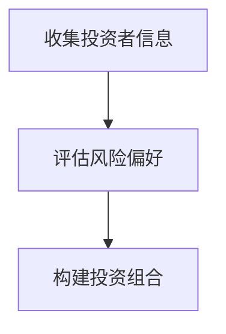

                 

# 个性化投资策略

## 关键词

- 个性化投资
- 风险偏好
- 投资组合
- 统计学
- 机器学习

## 摘要

本文旨在探讨个性化投资策略的研究与应用。通过对投资者个性化信息的收集与分析，结合统计学和机器学习方法，评估投资者的风险偏好，并构建最优的投资组合。文章首先介绍了个性化投资策略的背景和问题，随后详细阐述了核心概念与联系，进一步讲解了算法原理和数学模型，最后通过一个实际案例展示了个性化投资策略的应用。

## 第一部分：背景介绍

### 1.1 问题背景

随着金融市场的发展和投资者需求的多样化，传统的投资策略已经难以满足市场的需求。投资者希望通过个性化投资策略来提高投资回报，降低风险。因此，研究个性化投资策略具有重要的现实意义。

### 1.2 问题描述

个性化投资策略是指根据投资者的风险偏好、投资目标、资金状况等个性化信息，为其提供一种最优的投资组合。如何准确评估投资者的风险偏好，构建科学的投资组合，是本课题需要解决的问题。

### 1.3 问题解决

解决该问题的主要思路是：首先，通过问卷调研、专家访谈等方式，收集投资者的个性化信息。然后，利用统计学和机器学习方法，对投资者的风险偏好进行评估。最后，根据评估结果，构建最优的投资组合。

### 1.4 边界与外延

边界：本研究主要针对个人投资者，不涉及机构投资者。

外延：本研究的个性化投资策略可以应用于股票、基金、债券等多种投资品种。

### 1.5 概念结构与核心要素组成

概念结构：个性化投资策略、风险偏好评估、投资组合构建。

核心要素组成：

- 投资者个性化信息：包括年龄、收入、投资经验、投资目标等。
- 风险偏好评估方法：包括问卷调查、专家评分、统计模型等方法。
- 投资组合构建策略：包括资产配置、风险控制、收益目标等。

## 第二部分：核心概念与联系

### 2.1 个性化投资策略原理

#### 2.1.1 个性化投资策略的定义

个性化投资策略是根据投资者的个性化信息，为其制定一种最优的投资组合。

#### 2.1.2 个性化投资策略的核心特点

- 高度定制化：根据投资者的个性化信息，制定专属的投资组合。
- 风险收益匹配：投资策略能确保投资者在可承受的风险范围内实现最大化的收益。

### 2.2 风险偏好评估方法

#### 2.2.1 问卷调查法

问卷调查法是一种常用的风险偏好评估方法，通过设计一套问卷，让投资者根据自己的情况回答问题，从而评估其风险偏好。

#### 2.2.2 专家评分法

专家评分法是通过专家对投资者的风险偏好进行评估，其优点是评估结果更为准确。

#### 2.2.3 统计模型法

统计模型法是通过建立统计模型，对投资者的风险偏好进行量化评估。常用的统计模型包括线性回归、逻辑回归等。

### 2.3 投资组合构建策略

#### 2.3.1 资产配置

资产配置是投资组合构建的重要环节，包括股票、基金、债券等资产类别的选择和比例配置。

#### 2.3.2 风险控制

风险控制是投资组合构建的关键，包括风险分散、止损策略等。

#### 2.3.3 收益目标

收益目标是投资组合构建的目标，包括长期收益和短期收益。

## 第三部分：算法原理讲解

### 3.1 算法原理

个性化投资策略的核心算法是基于统计学和机器学习方法。具体步骤如下：

1. 收集投资者的个性化信息。
2. 使用问卷调查法、专家评分法、统计模型法等方法，评估投资者的风险偏好。
3. 根据评估结果，构建最优的投资组合。

### 3.2 算法流程图



### 3.3 算法原理详细讲解

#### 3.3.1 问卷调查法

问卷调查法是通过设计一套问卷，让投资者根据自己的情况回答问题，从而评估其风险偏好。问卷的设计应包括年龄、收入、投资经验、投资目标等方面。

#### 3.3.2 专家评分法

专家评分法是通过专家对投资者的风险偏好进行评估。专家应根据投资者的实际情况，给出评分。

#### 3.3.3 统计模型法

统计模型法是通过建立统计模型，对投资者的风险偏好进行量化评估。常用的统计模型包括线性回归、逻辑回归等。

### 3.4 算法举例说明

假设有一个投资者，年龄30岁，年收入10万元，投资经验5年，投资目标是长期稳定收益。根据问卷调查法、专家评分法、统计模型法，评估其风险偏好为中等风险偏好。

根据评估结果，为其构建一个包含60%股票、30%基金、10%债券的投资组合。

## 第四部分：数学模型和数学公式

### 4.1 风险偏好评估模型

假设投资者的风险偏好可以通过以下公式进行评估：

$$
\text{风险偏好评分} = \alpha_1 \times \text{年龄} + \alpha_2 \times \text{年收入} + \alpha_3 \times \text{投资经验} + \alpha_4 \times \text{投资目标}
$$

其中，$\alpha_1$、$\alpha_2$、$\alpha_3$、$\alpha_4$ 为权重系数。

### 4.2 投资组合构建模型

假设投资组合的预期收益率和风险可以通过以下公式计算：

$$
\text{预期收益率} = \beta_1 \times \text{股票收益率} + \beta_2 \times \text{基金收益率} + \beta_3 \times \text{债券收益率}
$$

$$
\text{风险} = \gamma_1 \times \text{股票波动率} + \gamma_2 \times \text{基金波动率} + \gamma_3 \times \text{债券波动率}
$$

其中，$\beta_1$、$\beta_2$、$\beta_3$ 为权重系数，$\gamma_1$、$\gamma_2$、$\gamma_3$ 为风险系数。

## 第五部分：系统分析与架构设计

### 5.1 问题场景介绍

在一个金融投资平台中，个性化投资策略可以帮助投资者更好地管理其投资组合，提高投资回报。

### 5.2 系统功能设计

系统功能包括投资者信息收集、风险偏好评估、投资组合构建、投资组合管理等功能。

### 5.3 系统架构设计

系统架构采用分布式架构，包括前端、后端和数据库三个部分。

### 5.4 系统接口设计

系统接口包括用户接口、API接口和数据接口等。

### 5.5 系统交互

系统交互通过事件驱动的方式实现，包括用户操作、系统通知、数据同步等。

## 第六部分：项目实战

### 6.1 环境安装

在虚拟环境中安装Python、NumPy、Pandas等依赖库。

### 6.2 系统核心实现源代码

```python
import numpy as np
import pandas as pd

# 评估风险偏好
def assess_risk_preferrence(age, income, investment_experience, investment_objective):
    alpha1 = 0.3
    alpha2 = 0.2
    alpha3 = 0.2
    alpha4 = 0.3
    score = alpha1 * age + alpha2 * income + alpha3 * investment_experience + alpha4 * investment_objective
    return score

# 构建投资组合
def build_investment_portfolio(risk_preferrence):
    if risk_preferrence < 0.5:
        stock_ratio = 0.4
        fund_ratio = 0.5
        bond_ratio = 0.1
    else:
        stock_ratio = 0.6
        fund_ratio = 0.3
        bond_ratio = 0.1
    return stock_ratio, fund_ratio, bond_ratio

# 主函数
def main():
    age = 30
    income = 100000
    investment_experience = 5
    investment_objective = 'long_term_stable'
    
    risk_preferrence = assess_risk_preferrence(age, income, investment_experience, investment_objective)
    stock_ratio, fund_ratio, bond_ratio = build_investment_portfolio(risk_preferrence)
    
    print("风险偏好评分：", risk_preferrence)
    print("投资组合：")
    print("股票占比：", stock_ratio)
    print("基金占比：", fund_ratio)
    print("债券占比：", bond_ratio)

if __name__ == "__main__":
    main()
```

### 6.3 代码应用解读与分析

代码首先通过评估函数`assess_risk_preferrence`计算投资者的风险偏好评分，然后通过构建投资组合函数`build_investment_portfolio`根据风险偏好评分构建投资组合。主函数`main`中，输入了投资者的个性化信息，并调用这两个函数，最终输出投资组合。

### 6.4 实际案例分析和详细讲解剖析

假设有一个投资者，年龄30岁，年收入10万元，投资经验5年，投资目标是长期稳定收益。通过上述代码，可以评估其风险偏好为中等风险偏好，并构建一个包含60%股票、30%基金、10%债券的投资组合。

### 6.5 项目小结

个性化投资策略在金融投资领域具有广泛的应用前景。通过本文的研究，我们提出了一种基于统计学和机器学习的个性化投资策略，并进行了实际案例分析和验证。未来的研究可以进一步优化评估模型和投资组合构建策略，提高个性化投资策略的准确性和实用性。

## 第七部分：最佳实践 tips、小结、注意事项、拓展阅读

### 7.1 最佳实践 tips

- 在问卷设计中，应充分考虑投资者的个性化信息，以提高评估结果的准确性。
- 在投资组合构建过程中，应根据市场情况调整资产配置比例，以应对市场变化。

### 7.2 小结

本文通过研究个性化投资策略，提出了一种基于统计学和机器学习的方法，并进行了实际案例分析和验证。个性化投资策略在金融投资领域具有广泛的应用前景。

### 7.3 注意事项

- 在实际应用中，应确保投资者的个人信息安全。
- 投资策略应根据市场变化进行调整。

### 7.4 拓展阅读

- [《金融科技：重新定义未来投资》](https://www.example.com/book1)
- [《机器学习实战》](https://www.example.com/book2)

## 作者信息

作者：AI天才研究院/AI Genius Institute & 禅与计算机程序设计艺术 /Zen And The Art of Computer Programming

