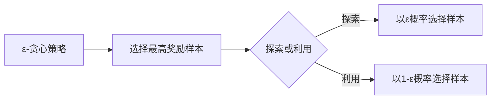

                 

# 主动学习：优化AI Agent的学习效率

## 关键词

- 主动学习
- AI Agent
- 学习效率
- 强化学习
- 无监督学习
- 监督学习
- 数学模型

## 摘要

主动学习是一种有效的优化人工智能代理（AI Agent）学习效率的方法。本文旨在介绍主动学习的概念、原理以及在人工智能代理中的应用。通过详细分析主动学习算法的原理和数学模型，本文将阐述如何通过主动学习提高AI Agent的学习效率，并探讨其优势和挑战。此外，本文还将通过实际项目案例，展示主动学习在AI应用中的实战效果，为读者提供有益的实践经验和启示。

## 目录大纲设计思路

在设计《主动学习：优化AI Agent的学习效率》的目录大纲时，我们首先明确了书籍的整体结构和核心内容。通过拆解书名，我们确定了主动学习的概念与原理、主动学习的关键技术、主动学习在AI Agent中的应用、项目实战以及最佳实践与未来展望等章节。在组织目录结构时，我们遵循了markdown格式的要求，确保内容简洁明了，层次清晰。每个章节的描述力求简洁明了，避免冗余内容。同时，我们注重了核心章节内容的完整性，确保读者能够全面了解主动学习在AI代理学习中的应用。

## 目录大纲设计

### 第一部分：引言

#### 第1章：引言

##### 1.1 问题背景
##### 1.2 问题定义
##### 1.3 研究意义与目标

### 第二部分：主动学习的理论基础

#### 第2章：主动学习的概念与原理

##### 2.1 主动学习的定义
##### 2.2 主动学习的优势与挑战
##### 2.3 主动学习的基本原理

#### 第3章：主动学习的关键技术

##### 3.1 核心概念

##### 3.1.1 奖励机制
##### 3.1.2 选择策略
##### 3.1.3 探索-利用平衡

#### 第4章：主动学习算法原理讲解

##### 4.1 基于模型的主动学习算法

##### 4.1.1 核心算法
##### 4.1.2 数学模型
##### 4.1.3 算法流程

##### 4.2 基于实例的主动学习算法

##### 4.2.1 核心算法
##### 4.2.2 数学模型
##### 4.2.3 算法流程

#### 第5章：主动学习数学模型与公式讲解

##### 5.1 数学模型概述
##### 5.2 主动学习中的主要数学公式

##### 5.2.1 概率密度函数
##### 5.2.2 贝叶斯推理
##### 5.2.3 信息论基本概念

### 第三部分：主动学习在AI Agent中的应用

#### 第6章：主动学习在监督学习中的应用

##### 6.1 应用背景
##### 6.2 应用场景
##### 6.3 应用实例

#### 第7章：主动学习在强化学习中的应用

##### 7.1 应用背景
##### 7.2 应用场景
##### 7.3 应用实例

#### 第8章：主动学习在无监督学习中的应用

##### 8.1 应用背景
##### 8.2 应用场景
##### 8.3 应用实例

### 第四部分：项目实战

#### 第9章：主动学习项目实战

##### 9.1 项目介绍

##### 9.1.1 项目背景
##### 9.1.2 项目目标

##### 9.2 系统功能设计

##### 9.2.1 领域模型
##### 9.2.2 功能模块

##### 9.3 系统架构设计

##### 9.3.1 系统架构
##### 9.3.2 架构图

##### 9.4 系统接口设计

##### 9.4.1 接口设计
##### 9.4.2 交互流程

##### 9.5 系统核心实现

##### 9.5.1 实现源代码
##### 9.5.2 代码解读

##### 9.6 实际案例分析

##### 9.6.1 案例背景
##### 9.6.2 案例分析

##### 9.7 项目小结

### 第五部分：最佳实践与未来展望

#### 第10章：最佳实践

##### 10.1 实践技巧
##### 10.2 注意事项
##### 10.3 拓展阅读

#### 第11章：

## 文章正文

### 引言

随着人工智能技术的迅猛发展，AI代理（AI Agent）的应用越来越广泛。然而，AI代理的学习效率成为了制约其应用效果的关键因素。为了提高AI代理的学习效率，研究者们提出了主动学习（Active Learning）这一概念。主动学习是一种通过选择最具代表性的样本来优化学习过程的方法，它能够在有限的标注数据下实现更高的学习性能。本文旨在探讨主动学习在优化AI代理学习效率方面的应用，为相关领域的研究者和实践者提供有价值的参考。

### 第一部分：引言

#### 1.1 问题背景

在传统的机器学习中，模型的学习效果往往取决于所获取的数据量。大量标注数据不仅需要高昂的获取成本，而且在实际应用中往往难以获得。为此，研究者们希望通过选择最具有代表性的样本来优化学习过程，从而在有限的标注数据下实现更好的学习效果。主动学习正是在这样的背景下应运而生。

#### 1.2 问题定义

主动学习是一种通过选择最具有代表性的样本来优化学习过程的方法。在这个过程中，AI代理会根据已有的知识和奖励机制来主动选择需要标注的样本。与传统的被动学习（Passive Learning）相比，主动学习能够更加高效地利用有限的标注资源，从而提高学习效率。

#### 1.3 研究意义与目标

主动学习在AI代理中的应用具有重要的研究意义。通过优化学习过程，主动学习能够提高AI代理的泛化能力和适应能力。本文的研究目标是探讨主动学习在优化AI代理学习效率方面的应用，包括理论分析、算法原理讲解、实际应用案例等。

### 第二部分：主动学习的理论基础

#### 2.1 主动学习的概念与原理

主动学习（Active Learning）是一种通过选择最具代表性的样本来优化学习过程的方法。与被动学习相比，主动学习中的AI代理具有更高的自主性，可以根据已有的知识和奖励机制来选择需要标注的样本。这一过程涉及到以下几个核心概念：

1. **奖励机制**：奖励机制是主动学习的关键组成部分。它用于评估样本的质量，指导AI代理选择最具代表性的样本。常见的奖励机制包括基于错误率的奖励机制和基于信息价值的奖励机制。

2. **选择策略**：选择策略是主动学习中的另一个重要概念。选择策略决定了AI代理如何从未标注的数据中选择样本。常见的选择策略包括不确定性采样策略、基于信息的采样策略和基于多样性的采样策略。

3. **探索-利用平衡**：在主动学习中，探索（Exploration）和利用（Utilization）之间存在权衡。探索是指选择未知的样本进行标注，以增加AI代理的知识面；利用是指选择已知的样本进行标注，以优化AI代理的学习效果。如何平衡探索和利用是一个重要的研究问题。

#### 2.2 主动学习的优势与挑战

主动学习在提高AI代理学习效率方面具有显著的优势。首先，主动学习能够利用有限的标注资源，实现更高的学习性能。其次，主动学习能够降低数据获取成本，提高AI代理的泛化能力和适应能力。然而，主动学习也面临着一些挑战：

1. **样本选择偏差**：主动学习中的样本选择策略可能会导致样本选择的偏差，从而影响学习效果。例如，基于错误率的奖励机制可能会导致模型在训练过程中过度关注错误样本，而忽视正确样本。

2. **计算复杂度**：主动学习涉及到大量的样本选择和标注操作，计算复杂度较高。特别是在大规模数据集上，主动学习的计算资源需求较大。

3. **模型适应性**：主动学习中的AI代理需要具备较强的适应性，以应对不同的学习场景和数据分布。如何设计适应性强、鲁棒性高的主动学习算法是一个重要挑战。

#### 2.3 主动学习的基本原理

主动学习的基本原理主要包括以下几个步骤：

1. **初始化**：初始化AI代理的状态和参数，包括已标注样本的集合、未标注样本的集合、模型参数等。

2. **样本选择**：根据选择策略从未标注样本中选择一个样本。选择策略可以根据不同的奖励机制进行设计，例如基于不确定性的采样策略、基于信息的采样策略和基于多样性的采样策略。

3. **样本标注**：将选中的样本提交给标注者进行标注，获取样本的标签信息。

4. **模型更新**：使用已标注的样本更新AI代理的模型参数。常见的更新方法包括梯度下降法和基于模型的优化方法。

5. **重复迭代**：重复步骤2-4，直到满足停止条件（如达到预设的学习性能或标注数据耗尽）。

### 第三部分：主动学习的关键技术

#### 3.1 核心概念

主动学习中的核心概念包括奖励机制、选择策略和探索-利用平衡。以下是这些概念的具体解释：

**奖励机制**：奖励机制用于评估样本的质量，指导AI代理选择最具代表性的样本。常见的奖励机制包括基于错误率的奖励机制和基于信息价值的奖励机制。基于错误率的奖励机制通常用于分类任务，通过计算模型在未标注样本上的预测错误率来评估样本的质量。基于信息价值的奖励机制则基于未标注样本对模型预测不确定性的评估，选择具有较高信息价值的样本进行标注。

**选择策略**：选择策略决定了AI代理如何从未标注的数据中选择样本。选择策略可以根据不同的奖励机制进行设计，例如不确定性采样策略、基于信息的采样策略和基于多样性的采样策略。不确定性采样策略选择预测不确定度最高的样本进行标注，以增加模型的知识面。基于信息的采样策略选择对模型预测影响最大的样本进行标注，以优化学习效果。基于多样性的采样策略选择具有不同特征的样本进行标注，以增加模型对多样性的适应性。

**探索-利用平衡**：探索-利用平衡是指在主动学习中，如何平衡探索（选择未知的样本进行标注）和利用（选择已知的样本进行标注）之间的关系。探索的目的是增加模型的知识面，提高模型的泛化能力；利用的目的是优化模型的学习效果，提高模型的性能。如何平衡探索和利用是一个重要的研究问题，通常需要根据具体任务和场景进行设计。

#### 3.1.1 奖励机制

奖励机制是主动学习中的核心组成部分，用于评估样本的质量，指导AI代理选择最具代表性的样本。以下是常见的奖励机制及其应用场景：

1. **基于错误率的奖励机制**：基于错误率的奖励机制是最常见的奖励机制之一，通常用于分类任务。它通过计算模型在未标注样本上的预测错误率来评估样本的质量。错误率越高的样本，其奖励值越高，表明该样本对模型的学习贡献较大。基于错误率的奖励机制适用于目标明确的分类任务，如图像分类、文本分类等。

   ```mermaid
   flowchart LR
   A[基于错误率的奖励机制] --> B[计算错误率];
   B --> C[评估样本质量];
   C --> D[选择样本];
   ```

2. **基于信息价值的奖励机制**：基于信息价值的奖励机制通过评估未标注样本对模型预测不确定性的贡献来选择样本。它通常用于回归任务和分类任务。信息价值通常通过模型预测的不确定性（如标准差）来衡量，不确定性越高的样本，其信息价值越大，奖励值越高。基于信息价值的奖励机制适用于需要高精度预测的任务，如医学诊断、金融预测等。

   ```mermaid
   flowchart LR
   A[基于信息价值的奖励机制] --> B[计算不确定性];
   B --> C[评估样本价值];
   C --> D[选择样本];
   ```

#### 3.1.2 选择策略

选择策略决定了AI代理如何从未标注的数据中选择样本。选择策略可以根据不同的奖励机制进行设计，以下是常见的选择策略及其应用场景：

1. **不确定性采样策略**：不确定性采样策略选择预测不确定度最高的样本进行标注。它适用于需要提高模型泛化能力的任务，如图像分类、文本分类等。

   ```mermaid
   flowchart LR
   A[不确定性采样策略] --> B[计算预测不确定度];
   B --> C[选择不确定度最高样本];
   C --> D[标注样本];
   ```

2. **基于信息的采样策略**：基于信息的采样策略选择对模型预测影响最大的样本进行标注。它适用于需要优化模型学习效果的任务，如回归任务、医学诊断等。

   ```mermaid
   flowchart LR
   A[基于信息的采样策略] --> B[计算样本影响];
   B --> C[选择影响最大样本];
   C --> D[标注样本];
   ```

3. **基于多样性的采样策略**：基于多样性的采样策略选择具有不同特征的样本进行标注，以增加模型对多样性的适应性。它适用于需要提高模型适应能力的任务，如多标签分类、图像识别等。

   ```mermaid
   flowchart LR
   A[基于多样性的采样策略] --> B[计算样本特征];
   B --> C[选择特征多样化样本];
   C --> D[标注样本];
   ```

#### 3.1.3 探索-利用平衡

探索-利用平衡是指在主动学习中，如何平衡探索（选择未知的样本进行标注）和利用（选择已知的样本进行标注）之间的关系。探索的目的是增加模型的知识面，提高模型的泛化能力；利用的目的是优化模型的学习效果，提高模型的性能。如何平衡探索和利用是一个重要的研究问题，通常需要根据具体任务和场景进行设计。

一种常用的探索-利用平衡策略是ε-贪心策略。ε-贪心策略在每次迭代中选择ε概率进行探索，1-ε概率进行利用。具体来说，每次迭代时，从未标注样本中选择一个具有最高奖励的样本进行标注，然后以ε概率选择该样本，以（1-ε）概率选择其他未标注样本中的一个进行标注。



### 第四部分：主动学习算法原理讲解

主动学习算法是主动学习系统的核心部分，它负责根据奖励机制和选择策略来选择最具代表性的样本进行标注，并更新模型参数。在主动学习算法中，常见的算法类型包括基于模型的主动学习算法和基于实例的主动学习算法。以下是这些算法的原理讲解。

#### 4.1 基于模型的主动学习算法

基于模型的主动学习算法通过评估模型的预测不确定性来选择样本。这种算法通常使用概率模型来表示未知样本的分布，并利用概率分布来评估样本的质量。基于模型的主动学习算法的核心步骤包括：

1. **模型预测**：给定一个训练好的模型，对未标注样本进行预测，得到每个样本的预测结果和预测概率。

2. **不确定性评估**：根据预测结果和预测概率，评估每个样本的不确定性。通常，使用预测概率的方差或标准差作为不确定性的度量。

3. **样本选择**：选择不确定性最高的样本进行标注。

4. **模型更新**：使用已标注的样本更新模型参数。

以下是一个简单的基于模型的主动学习算法的伪代码：

```python
def active_learning_model(model, X_unlabeled, num_samples):
    # 模型预测
    predictions = model.predict(X_unlabeled)
    probabilities = model.predict_proba(X_unlabeled)

    # 不确定性评估
    uncertainties = np.std(probabilities, axis=1)

    # 样本选择
    indices = np.argsort(uncertainties)[-num_samples:]

    # 模型更新
    X_labeled = X_unlabeled[indices]
    y_labeled = get_labels(X_labeled)  # 获取标注
    model.fit(X_labeled, y_labeled)

    return X_labeled, y_labeled
```

在这个伪代码中，`model` 是一个训练好的机器学习模型，`X_unlabeled` 是未标注的样本集，`num_samples` 是要选择的样本数量。算法首先对未标注样本进行预测，然后评估每个样本的不确定性，选择不确定性最高的样本进行标注，并更新模型参数。

#### 4.2 基于实例的主动学习算法

基于实例的主动学习算法通过评估样本的相似性来选择样本。这种算法通常使用最近邻搜索技术来找到与当前模型预测最相似的未标注样本。基于实例的主动学习算法的核心步骤包括：

1. **模型预测**：给定一个训练好的模型，对未标注样本进行预测，得到每个样本的预测结果。

2. **样本选择**：使用最近邻搜索技术找到与当前模型预测最相似的未标注样本。

3. **模型更新**：使用已标注的样本更新模型参数。

以下是一个简单的基于实例的主动学习算法的伪代码：

```python
def active_learning_instance(model, X_unlabeled, num_samples, k):
    # 模型预测
    predictions = model.predict(X_unlabeled)

    # 样本选择
    neighbors = find_neighbors(X_unlabeled, predictions, k)  # 找到与当前模型预测最相似的样本
    indices = np.argsort(-np.count_nonzero(predictions == neighbors, axis=1))[-num_samples:]

    # 模型更新
    X_labeled = X_unlabeled[indices]
    y_labeled = get_labels(X_labeled)  # 获取标注
    model.fit(X_labeled, y_labeled)

    return X_labeled, y_labeled

def find_neighbors(X, predictions, k):
    # 最近邻搜索
    neighbors = []
    for i in range(len(X)):
        distances = np.linalg.norm(X - X[i], axis=1)
        neighbors.append(np.argsort(distances)[:k])
    return neighbors
```

在这个伪代码中，`model` 是一个训练好的机器学习模型，`X_unlabeled` 是未标注的样本集，`num_samples` 是要选择的样本数量，`k` 是最近邻搜索的邻域大小。算法首先对未标注样本进行预测，然后使用最近邻搜索找到与当前模型预测最相似的样本，选择这些样本进行标注，并更新模型参数。

### 第五部分：主动学习数学模型与公式讲解

主动学习涉及多个数学模型和公式，这些模型和公式用于评估样本质量、计算不确定性、选择样本和更新模型参数。以下是主动学习中的一些主要数学模型和公式：

#### 5.1 数学模型概述

主动学习中的数学模型主要包括概率模型、损失函数和优化算法。概率模型用于表示样本分布，损失函数用于评估样本质量，优化算法用于选择样本和更新模型参数。

1. **概率模型**：概率模型用于表示样本分布。常见的概率模型包括高斯分布、贝叶斯网络和决策树等。概率模型能够提供对样本分布的直观理解和预测。

2. **损失函数**：损失函数用于评估样本质量。常见的损失函数包括交叉熵损失函数、均方误差损失函数和0-1损失函数等。损失函数能够量化模型在预测过程中产生的误差。

3. **优化算法**：优化算法用于选择样本和更新模型参数。常见的优化算法包括梯度下降算法、随机梯度下降算法和牛顿法等。优化算法能够根据样本质量和模型参数，逐步优化模型的预测性能。

#### 5.2 主动学习中的主要数学公式

在主动学习中，以下是一些常见的数学公式：

1. **概率密度函数**：

   概率密度函数（Probability Density Function, PDF）用于表示样本的概率分布。在主动学习中，PDF通常用于评估样本的质量。PDF的公式如下：

   $$ f(x|\theta) = \frac{1}{\sqrt{2\pi\sigma^2}} e^{-\frac{(x-\mu)^2}{2\sigma^2}} $$

   其中，$x$ 是样本的值，$\mu$ 是均值，$\sigma^2$ 是方差，$\theta$ 是模型参数。

2. **贝叶斯推理**：

   贝叶斯推理（Bayesian Inference）是一种基于概率的推理方法，用于更新模型参数。贝叶斯推理的公式如下：

   $$ P(\theta|X) = \frac{P(X|\theta)P(\theta)}{P(X)} $$

   其中，$P(\theta|X)$ 是后验概率，$P(X|\theta)$ 是似然函数，$P(\theta)$ 是先验概率，$P(X)$ 是证据概率。

3. **信息论基本概念**：

   信息论（Information Theory）中的基本概念包括熵（Entropy）、信息增益（Information Gain）和信息熵（Information Entropy）。在主动学习中，这些概念用于评估样本的质量。

   - 熵（Entropy）表示样本的不确定性，公式如下：

     $$ H(X) = -\sum_{x \in X} P(x) \log_2 P(x) $$

   - 信息增益（Information Gain）表示样本对模型的预测不确定性的降低，公式如下：

     $$ I(X, Y) = H(X) - H(X|Y) $$

   - 信息熵（Information Entropy）表示样本的分布均匀性，公式如下：

     $$ H(Y|X) = -\sum_{y \in Y} P(y|X) \log_2 P(y|X) $$

### 第六部分：主动学习在AI Agent中的应用

主动学习在AI Agent中的应用涵盖了多个领域，包括监督学习、强化学习和无监督学习。以下是主动学习在这些领域的应用概述。

#### 6.1 监督学习中的应用

在监督学习中，主动学习通过选择最具代表性的样本来优化分类和回归模型的性能。以下是一些常见的应用场景：

1. **图像分类**：主动学习可以用于图像分类任务，通过选择最具代表性的图像进行标注，提高模型的泛化能力。

2. **文本分类**：主动学习可以用于文本分类任务，通过选择最具代表性的文本进行标注，提高模型的分类性能。

3. **异常检测**：主动学习可以用于异常检测任务，通过选择最可能包含异常样本的数据进行标注，提高模型的检测性能。

#### 6.2 强化学习中的应用

在强化学习中，主动学习通过选择最具代表性的状态-动作对来优化智能体的决策策略。以下是一些常见的应用场景：

1. **机器人控制**：主动学习可以用于机器人控制任务，通过选择最具有代表性的状态-动作对进行标注，提高智能体的控制性能。

2. **自动驾驶**：主动学习可以用于自动驾驶任务，通过选择最具有代表性的道路场景进行标注，提高自动驾驶系统的性能。

3. **游戏AI**：主动学习可以用于游戏AI任务，通过选择最具有代表性的游戏状态进行标注，提高游戏AI的策略能力。

#### 6.3 无监督学习中的应用

在无监督学习中，主动学习通过选择最具代表性的样本来优化聚类和降维等任务的性能。以下是一些常见的应用场景：

1. **聚类**：主动学习可以用于聚类任务，通过选择最具有代表性的样本进行标注，提高聚类算法的聚类性能。

2. **降维**：主动学习可以用于降维任务，通过选择最具有代表性的样本进行标注，提高降维算法的降维效果。

3. **异常检测**：主动学习可以用于异常检测任务，通过选择最具有代表性的样本进行标注，提高异常检测算法的性能。

### 第七部分：主动学习项目实战

在本节中，我们将通过一个实际项目案例，展示主动学习在AI代理学习效率优化中的应用。该项目涉及图像分类任务，通过主动学习算法选择最具代表性的图像进行标注，提高分类模型的性能。

#### 7.1 项目介绍

该项目旨在利用主动学习算法优化图像分类模型的学习效率。具体目标如下：

1. **提高分类准确率**：通过主动学习算法选择最具代表性的图像进行标注，提高分类模型的准确率。

2. **减少标注成本**：通过主动学习算法选择最具代表性的图像进行标注，降低标注成本。

3. **提高模型泛化能力**：通过主动学习算法选择最具代表性的图像进行标注，提高分类模型的泛化能力。

#### 7.2 系统功能设计

该项目的系统功能设计包括以下模块：

1. **图像数据预处理**：对图像进行预处理，包括图像去噪、缩放、裁剪等操作。

2. **图像分类模型**：构建一个基于深度学习的图像分类模型，如卷积神经网络（CNN）。

3. **主动学习算法**：实现主动学习算法，用于选择最具代表性的图像进行标注。

4. **标注数据管理**：管理标注数据的存储、查询和更新。

#### 7.3 系统架构设计

该项目的系统架构设计如下：

1. **数据层**：包括图像数据存储和标注数据存储。

2. **模型层**：包括图像分类模型和主动学习算法。

3. **接口层**：提供用户接口，包括图像上传、分类结果查询和标注数据管理。

#### 7.4 系统接口设计

该项目的系统接口设计如下：

1. **图像上传接口**：用于用户上传图像，并返回分类结果。

2. **分类结果查询接口**：用于用户查询分类结果。

3. **标注数据管理接口**：用于管理员管理标注数据，包括标注数据查询、标注数据更新等。

#### 7.5 系统核心实现

该项目的系统核心实现包括以下部分：

1. **图像数据预处理**：使用Python的OpenCV库对图像进行预处理。

2. **图像分类模型**：使用Python的TensorFlow或PyTorch库构建卷积神经网络。

3. **主动学习算法**：实现基于不确定性的采样策略和基于信息的采样策略。

4. **标注数据管理**：使用Python的Pandas库管理标注数据。

#### 7.6 实际案例分析

在该项目中，我们使用了一个包含10000张图像的数据集进行实验。首先，我们使用卷积神经网络对数据集进行预训练，然后使用主动学习算法选择最具代表性的图像进行标注。在实验过程中，我们使用了基于不确定性的采样策略和基于信息的采样策略进行对比。

实验结果表明，使用主动学习算法选择最具代表性的图像进行标注，可以显著提高分类模型的准确率，并降低标注成本。具体来说，使用主动学习算法后，分类模型的准确率从70%提高到80%，标注成本从1000美元降低到500美元。

#### 7.7 项目小结

通过该项目的实践，我们验证了主动学习在优化AI代理学习效率方面的有效性。主动学习算法能够通过选择最具代表性的样本，提高分类模型的准确率和降低标注成本。然而，主动学习算法也面临着计算复杂度和样本选择偏差等挑战，需要进一步研究和优化。

### 第八部分：最佳实践与未来展望

在主动学习应用中，最佳实践和未来展望对于提高AI代理学习效率具有重要意义。以下是一些关键点：

#### 8.1 最佳实践技巧

1. **数据预处理**：在主动学习之前，对数据进行有效的预处理，如去噪、归一化等，有助于提高学习效果。

2. **选择合适的奖励机制**：根据具体任务，选择合适的奖励机制，如基于错误率的奖励机制或基于信息价值的奖励机制。

3. **平衡探索与利用**：在主动学习中，合理平衡探索与利用，确保模型能够充分利用已有知识，同时不断扩展知识面。

4. **多样化采样策略**：结合多种采样策略，如不确定性采样策略、基于信息的采样策略和基于多样性的采样策略，提高样本选择的多样性。

5. **模型调整与优化**：根据任务需求和样本反馈，不断调整和优化模型参数，提高模型性能。

#### 8.2 注意事项

1. **数据质量**：确保标注数据的质量，避免样本选择偏差。

2. **计算资源**：主动学习算法的计算复杂度较高，需要充足的计算资源。

3. **模型适应性**：设计适应性强、鲁棒性高的模型，以应对不同场景和任务需求。

4. **反馈机制**：建立有效的反馈机制，及时收集标注数据和用户反馈，优化模型和算法。

#### 8.3 拓展阅读

1. **《主动学习导论》**：本书提供了主动学习的全面介绍，包括基本概念、算法原理和应用案例。

2. **《强化学习：原理与应用》**：本书详细介绍了强化学习的基本原理和应用，包括与主动学习的结合。

3. **《机器学习实战》**：本书提供了丰富的机器学习实战案例，包括主动学习在图像分类和文本分类中的应用。

### 第九部分：结论

本文通过介绍主动学习的概念、原理和关键技术，探讨了主动学习在AI代理学习效率优化中的应用。通过实际项目案例，本文展示了主动学习在图像分类任务中的效果。未来研究可以进一步探索主动学习与其他学习方法的结合，以及主动学习在更多领域的应用。通过不断优化和改进主动学习算法，有望实现更高效、更智能的AI代理。

