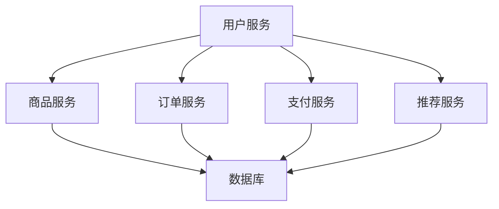
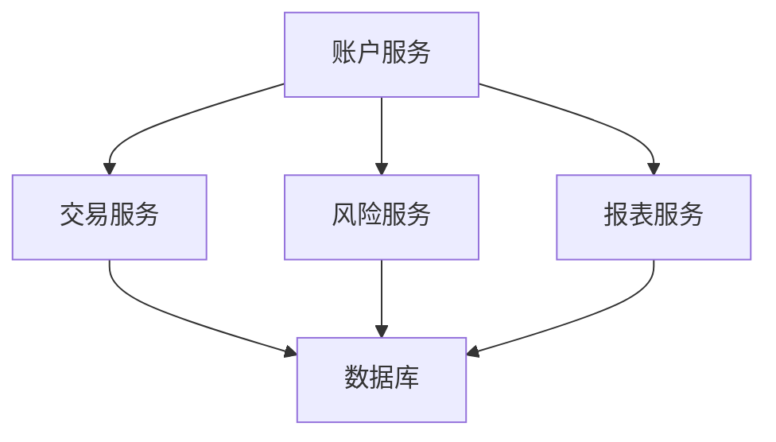

                 

### 第1章: 问题背景

#### 1.1 云原生概述

云原生（Cloud Native）这一概念起源于2015年，最初由云计算服务提供商Pivotal和谷歌共同提出。云原生是一种利用云计算环境动态管理、快速扩展和自动化，以实现高效开发和运维的新型应用架构方法。简单来说，云原生应用是那些充分利用云计算资源、具备高度可伸缩性和弹性的应用。

**核心概念**：
云原生应用的关键在于其可移植性、弹性、可伸缩性、持续交付和微服务架构。其核心技术包括容器化、微服务、服务网格、不可变基础设施和声明式API。

**发展历程**：
云原生的发展可以分为几个阶段：
1. **容器化**：以Docker为代表的容器化技术，使应用可以打包在独立的容器中，便于部署和管理。
2. **微服务架构**：通过将单体应用拆分为多个微服务，提高了应用的灵活性和可维护性。
3. **自动化部署与持续集成/持续部署（CI/CD）**：通过自动化工具，如Jenkins、GitLab CI等，实现了快速且可靠的应用部署和更新。
4. **服务网格**：如Istio、Linkerd等服务网格技术，提供了一种抽象的服务间通信方式，提升了网络性能和安全性。

**与传统应用的对比分析**：
传统应用通常部署在物理机或虚拟机上，存在以下问题：
- **资源利用率低**：传统应用需要固定配置的硬件资源，导致资源浪费。
- **部署困难**：应用部署需要手动操作，耗时且容易出错。
- **扩展性差**：传统应用扩展通常依赖于垂直扩展（增加服务器性能），难以实现水平扩展。

相比之下，云原生应用具有以下优势：
- **高可移植性**：应用打包在容器中，可以在任何支持容器引擎的平台上运行。
- **弹性伸缩**：根据需求动态分配资源，支持水平扩展。
- **自动化部署**：通过CI/CD工具自动化部署，减少手动操作，提高效率。

**边界与外延**：
云原生不仅是一种应用架构，还包括了一套完整的开发、部署和运维流程。它不仅适用于互联网应用，还逐渐渗透到金融、医疗、制造等各个行业。

**核心要素组成**：
云原生应用的核心要素包括：
- **容器化技术**：如Docker、Kubernetes等。
- **微服务架构**：如Spring Cloud、Netflix OSS等。
- **服务网格**：如Istio、Linkerd等。
- **持续集成/持续部署（CI/CD）**：如Jenkins、GitLab CI等。
- **基础设施即代码（IaC）**：如Terraform、Ansible等。

通过上述核心要素，云原生应用能够实现高效的开发和运维，从而满足现代企业对敏捷性、可靠性和可扩展性的需求。

#### 1.2 云原生应用开发的意义

**核心概念**：
云原生应用开发的意义在于其能够充分利用云计算的优势，提升软件开发的效率和质量，降低成本，同时满足业务快速变化的需求。

**属性特征对比**：
与传统应用开发相比，云原生应用具有以下显著特征：
- **快速迭代**：云原生应用支持快速开发与部署，通过CI/CD流程实现持续集成和持续交付。
- **弹性伸缩**：能够根据业务需求动态调整资源，实现自动扩展和缩减。
- **高可用性**：通过容器化、微服务和服务网格等技术，提高系统的稳定性和可靠性。
- **成本效益**：通过优化资源利用和自动化流程，降低开发和运维成本。

**联系**：
云原生应用开发与微服务、DevOps等概念密切相关。微服务架构是云原生应用的核心组成部分，通过将应用拆分为小而独立的微服务，提升了系统的可维护性和可扩展性。DevOps则强调开发和运维的紧密协作，通过自动化工具和流程，实现高效的应用交付。

微服务与云原生应用的关系：
- **独立部署**：每个微服务可以独立部署和扩展，降低了系统复杂性。
- **分布式架构**：微服务架构支持分布式计算，提高系统的可扩展性。
- **解耦**：微服务之间的解耦，使系统能够更好地应对变化和故障。

DevOps与云原生应用的关系：
- **自动化**：DevOps强调自动化，与云原生应用的自动化部署、监控和运维高度契合。
- **协同工作**：DevOps文化的推广，有助于开发团队和运维团队之间的协作。

总之，云原生应用开发不仅是一种技术革新，更是一种软件开发模式和管理理念，它能够帮助企业更好地应对数字化转型带来的挑战。

#### 1.3 容器化技术

**核心概念**：
容器化技术是云原生应用开发的核心组成部分之一，它通过将应用及其依赖的环境打包成独立的容器，实现了应用与基础设施的解耦，提升了应用的部署和运行效率。

**属性特征对比**：
容器与传统虚拟机（VM）在以下几个方面存在显著差异：

| 对比项 | 容器 | 传统虚拟机 |
| ------ | ---- | ---------- |
| **资源占用** | 少 | 多 |
| **启动速度** | 快 | 慢 |
| **轻量级** | 是 | 否 |
| **隔离性** | 强 | 强 |
| **可移植性** | 高 | 低 |

**联系**：
容器技术与云原生架构之间的关系紧密。容器化技术为云原生应用提供了以下支持：
- **应用封装**：容器将应用及其依赖打包在一起，保证了应用在不同环境下的运行一致性。
- **环境一致性**：通过容器，开发环境和生产环境更加一致，减少了“环境问题”导致的部署失败。
- **高效部署**：容器化使得应用的部署更加快速、灵活，能够更好地支持持续集成和持续部署（CI/CD）。

#### 1.4 微服务架构

**核心概念**：
微服务架构是一种将大型应用拆分为多个独立、小型服务的架构风格。每个微服务负责完成一个特定的业务功能，独立部署和运行，通过轻量级通信机制进行交互。

**属性特征对比**：
微服务与单体架构在以下几个方面存在显著差异：

| 对比项 | 微服务 | 单体架构 |
| ------ | ------ | -------- |
| **可维护性** | 高 | 低 |
| **可扩展性** | 高 | 低 |
| **部署独立性** | 强 | 弱 |
| **通信方式** | 轻量级 | 重 |
| **耦合程度** | 弱 | 强 |

**联系**：
微服务架构在云原生应用开发中发挥着关键作用。其与云原生架构的联系体现在以下几个方面：
- **分布式系统**：微服务架构支持分布式计算，提高系统的可用性和可扩展性。
- **独立部署**：每个微服务可以独立部署和扩展，降低了系统复杂性。
- **灵活调整**：微服务架构使得系统能够根据业务需求灵活调整，快速响应市场变化。

#### 1.5 自动化部署与持续集成/持续部署（CI/CD）

**核心概念**：
自动化部署和持续集成/持续部署（CI/CD）是云原生应用开发中不可或缺的组成部分。自动化部署通过脚本或工具，自动化完成应用的打包、测试和发布过程；而CI/CD则通过自动化工具，将开发过程中的多个步骤集成在一起，实现持续集成和持续交付。

**属性特征对比**：
与传统部署方式相比，自动化部署和CI/CD具有以下显著优势：

| 对比项 | 传统部署方式 | 自动化部署 & CI/CD |
| ------ | ------------ | ------------------ |
| **人工干预** | 需要手动操作 | 减少人工干预，提高效率 |
| **可靠性** | 人工操作可能导致错误 | 自动化流程减少错误 |
| **速度** | 较慢 | 快速完成 |
| **一致性** | 不同环境可能出现差异 | 确保环境一致性 |

**联系**：
自动化部署和CI/CD与云原生应用开发的关系紧密，它们为云原生应用提供了以下支持：
- **快速迭代**：自动化部署和CI/CD使应用能够快速迭代，满足业务快速变化的需求。
- **持续优化**：通过持续集成和持续部署，开发者可以持续优化代码，提高系统质量。
- **降低成本**：自动化减少了人工操作，降低了运维成本，提高了资源利用率。

通过上述核心概念和属性特征对比，我们可以看到，容器化技术、微服务架构和自动化部署与持续集成/持续部署（CI/CD）是云原生应用开发不可或缺的组成部分，它们共同构成了现代应用开发的核心技术栈，助力企业实现高效的开发和运维。

### 第2章: 云原生应用开发的核心概念

#### 2.1 容器化技术

**核心概念**：
容器化技术是一种将应用及其依赖的环境打包成独立容器的技术，容器提供了一种轻量级、可移植、自给自足的运行环境。容器通过操作系统的命名空间（Namespace）和隔离机制（Cgroups）实现了进程的隔离和资源限制。

**核心原理**：
容器的核心原理包括以下几个方面：
1. **命名空间（Namespace）**：命名空间提供了进程间的隔离，如网络命名空间、进程命名空间等，使得容器内的进程无法看到其他容器的进程。
2. **控制组（Cgroups）**：Cgroups 提供了资源限制和控制功能，如CPU、内存、磁盘等，确保容器不会耗尽系统资源。
3. **容器镜像**：容器镜像是一种轻量级、可执行的静态文件，包含应用及运行时环境，容器通过运行容器镜像创建容器实例。

**容器与传统虚拟机的对比分析**：

| 对比项 | 容器 | 传统虚拟机 |
| ------ | ---- | ---------- |
| **资源占用** | 少 | 多 |
| **启动速度** | 快 | 慢 |
| **轻量级** | 是 | 否 |
| **隔离性** | 强 | 强 |
| **可移植性** | 高 | 低 |

**联系**：
容器技术是云原生应用开发的基础，它与云原生架构的其他组成部分如微服务、服务网格等紧密相关。容器化技术使得应用与基础设施解耦，提高了部署和运维的灵活性，同时也为微服务架构提供了运行环境。

#### 2.2 微服务架构

**核心概念**：
微服务架构是一种将大型应用拆分为多个独立、小型服务的架构风格。每个微服务负责完成一个特定的业务功能，独立部署和运行，通过轻量级通信机制（如HTTP/REST、消息队列等）进行交互。

**核心原理**：
微服务架构的核心原理包括以下几个方面：
1. **服务独立性**：每个微服务都是独立部署和扩展的，提高了系统的灵活性和可维护性。
2. **去中心化**：微服务架构去除了单体架构中的单一中心点，降低了系统的复杂性和风险。
3. **自动化**：微服务架构通过自动化工具和持续集成/持续部署（CI/CD）流程，实现了高效的开发和运维。
4. **分布式系统**：微服务架构支持分布式计算，提高了系统的可扩展性和可用性。

**微服务与单体架构的对比分析**：

| 对比项 | 微服务 | 单体架构 |
| ------ | ------ | -------- |
| **可维护性** | 高 | 低 |
| **可扩展性** | 高 | 低 |
| **部署独立性** | 强 | 弱 |
| **通信方式** | 轻量级 | 重 |
| **耦合程度** | 弱 | 强 |

**联系**：
微服务架构是云原生应用开发的核心，它为应用提供了灵活的部署和扩展方式。微服务架构与云原生架构的其他组成部分如容器化技术、服务网格等紧密结合，共同构成了现代应用开发的坚实基础。

#### 2.3 自动化部署与持续集成/持续部署（CI/CD）

**核心概念**：
自动化部署和持续集成/持续部署（CI/CD）是云原生应用开发中不可或缺的组成部分。自动化部署通过脚本或工具，自动化完成应用的打包、测试和发布过程；而CI/CD则通过自动化工具，将开发过程中的多个步骤集成在一起，实现持续集成和持续交付。

**核心原理**：
自动化部署和CI/CD的核心原理包括以下几个方面：
1. **持续集成（CI）**：每次代码提交后，自动构建和测试应用，确保代码质量。
2. **持续交付（CD）**：将通过CI测试的应用自动部署到生产环境，实现快速交付。
3. **自动化工具**：如Jenkins、GitLab CI等，提供了一种自动化流程管理的方式。

**自动化部署与传统部署方式的对比分析**：

| 对比项 | 传统部署方式 | 自动化部署 & CI/CD |
| ------ | ------------ | ------------------ |
| **人工干预** | 需要手动操作 | 减少人工干预，提高效率 |
| **可靠性** | 人工操作可能导致错误 | 自动化流程减少错误 |
| **速度** | 较慢 | 快速完成 |
| **一致性** | 不同环境可能出现差异 | 确保环境一致性 |

**联系**：
自动化部署和CI/CD与云原生应用开发的关系紧密。它们通过自动化和持续集成，提高了应用的交付速度和可靠性，降低了开发和运维成本，使得企业能够更快地响应市场需求。

### 第3章: 云原生应用开发的挑战

#### 3.1 技术选型与兼容性

**核心概念**：
在云原生应用开发中，技术选型是一个关键环节，它涉及选择适合应用开发的各种技术和工具。兼容性则是指所选技术在不同环境下能够顺利运行的能力。

**属性特征对比**：
不同的技术选型在性能、稳定性、易用性等方面存在差异：

| 对比项 | 技术选型A | 技术选型B |
| ------ | --------- | --------- |
| **性能** | 高 | 中 |
| **稳定性** | 较低 | 较高 |
| **易用性** | 中 | 高 |
| **兼容性** | 好 | 较好 |

**联系**：
技术选型与云原生应用开发的关系紧密。一个合适的技术选型可以提高开发效率，降低维护成本，而兼容性问题则可能导致部署失败、性能下降等问题。

**挑战分析**：
- **技术复杂度**：云原生应用开发涉及多种技术，如容器化、微服务、服务网格等，选择和整合这些技术需要丰富的经验和专业知识。
- **环境兼容性**：不同环境下，技术栈可能存在兼容性问题，需要额外的配置和优化。

**解决策略**：
- **评估需求**：明确应用的需求，选择符合需求的最佳技术。
- **持续学习**：关注技术发展趋势，不断学习和更新知识。
- **社区支持**：借助社区资源，解决兼容性问题。

#### 3.2 可观测性与监控

**核心概念**：
可观测性（Observability）是指通过系统内部数据的收集、分析和可视化，实现对系统运行状态的全面了解。监控（Monitoring）则是通过实时监测系统性能，发现和解决问题。

**属性特征对比**：
不同的监控工具和方法在数据采集、分析和可视化方面存在差异：

| 对比项 | 监控工具A | 监控工具B |
| ------ | --------- | --------- |
| **数据采集** | 实时 | 延时 |
| **分析能力** | 强 | 中 |
| **可视化** | 高 | 低 |

**联系**：
可观测性与云原生应用性能优化关系密切。通过可观测性，开发者可以及时发现系统瓶颈，优化性能。

**挑战分析**：
- **数据量巨大**：云原生应用通常涉及大量容器和微服务，导致监控数据量巨大，处理和分析成为挑战。
- **异构环境**：不同环境下的监控需求不同，需要支持多种监控工具和平台。

**解决策略**：
- **标准化监控指标**：制定统一的监控指标，确保数据可比性和一致性。
- **自动化监控**：利用自动化工具，实现监控数据的自动采集、分析和可视化。
- **分布式监控**：构建分布式监控架构，支持大规模系统的监控需求。

#### 3.3 安全性

**核心概念**：
云原生环境下的安全性涉及多个方面，包括数据安全、网络安全和平台安全。安全性挑战主要包括容器逃逸、恶意容器、网络攻击和数据泄露等。

**属性特征对比**：
不同安全策略在防护能力和复杂性方面存在差异：

| 对比项 | 安全策略A | 安全策略B |
| ------ | --------- | --------- |
| **防护能力** | 中 | 高 |
| **复杂性** | 低 | 高 |
| **兼容性** | 好 | 较好 |

**联系**：
安全性是云原生应用开发的重要保障，直接关系到应用运行的稳定性和可靠性。

**挑战分析**：
- **容器逃逸**：容器权限设置不当可能导致容器逃逸，攻击者可以获取容器宿主机的权限。
- **恶意容器**：恶意容器可能包含恶意代码，对系统造成破坏。
- **网络攻击**：云原生应用通常涉及多个容器和微服务，网络攻击可能针对这些节点。

**解决策略**：
- **最小权限原则**：容器和用户账号应遵循最小权限原则，避免权限过大。
- **安全加固**：对容器和宿主机进行安全加固，安装必要的防护软件。
- **网络安全**：使用防火墙、网络隔离等技术，提高网络安全性。
- **数据加密**：对敏感数据进行加密存储和传输，防止数据泄露。

通过上述挑战分析与解决策略，我们可以看到，云原生应用开发在技术选型、可观测性监控和安全等方面面临诸多挑战，但通过合理的策略和工具，可以有效地应对这些挑战，保障应用的稳定运行。

### 第4章: 云原生应用开发的机遇

#### 4.1 持续创新与技术演进

**核心概念**：
云原生技术的持续创新与技术演进是指云原生领域不断引入新技术、优化现有技术，以满足日益复杂和多样化的业务需求。这一过程包括容器化技术的发展、服务网格的兴起、Serverless架构的引入等。

**属性特征对比**：
不同阶段的云原生技术具有不同的属性特征：

| 对比项 | 容器化技术初期 | 容器化技术成熟期 | 服务网格 | Serverless架构 |
| ------ | -------------- | -------------- | -------- | -------------- |
| **技术成熟度** | 初期 | 成熟 | 成熟 | 初期 |
| **应用场景** | 简单应用 | 复杂应用 | 复杂应用 | 简单应用 |
| **性能** | 中 | 高 | 高 | 高 |
| **易用性** | 低 | 中 | 中 | 高 |

**联系**：
持续创新与技术演进是云原生应用开发的重要驱动力，它促使企业不断采用新技术，提升应用性能和开发效率。

**持续创新与商业模式的结合**：
- **敏捷开发**：云原生技术支持敏捷开发，企业可以更快地将产品推向市场，实现快速迭代。
- **按需扩展**：云原生应用能够根据业务需求自动扩展资源，降低成本，提高资源利用率。
- **数字化转型**：云原生技术助力企业实现数字化转型，提升业务灵活性和竞争力。

**案例分析**：
- **企业案例**：某些大型企业如阿里巴巴、腾讯等，通过引入云原生技术，实现了业务的敏捷开发和高效运维，提升了市场竞争力。
- **行业案例**：在金融、医疗等行业，云原生技术正在逐渐替代传统架构，推动业务创新和效率提升。

**总结**：
持续创新和技术演进为云原生应用开发带来了无限机遇，企业应密切关注技术发展趋势，积极采用新技术，以提升自身竞争力。

#### 4.2 跨平台与跨领域应用

**核心概念**：
跨平台与跨领域应用是指云原生技术在不同平台和领域中的应用，包括云计算平台、移动应用、物联网等。跨平台应用使得开发团队可以更轻松地构建和部署跨操作系统、跨设备的应用，而跨领域应用则能将云原生技术应用于更多行业和场景。

**属性特征对比**：
不同平台和领域的云原生应用具有不同的属性特征：

| 对比项 | 云计算平台 | 移动应用 | 物联网 |
| ------ | ---------- | -------- | ------ |
| **性能要求** | 高 | 中 | 低 |
| **资源利用** | 高 | 中 | 低 |
| **安全性** | 强 | 中 | 弱 |
| **开发难度** | 高 | 中 | 低 |

**联系**：
跨平台与跨领域应用拓展了云原生技术的应用范围，使得开发团队能够更灵活地应对不同业务需求。

**跨平台应用开发的重要性**：
- **用户需求**：随着用户设备多样化，跨平台应用能够提供更好的用户体验。
- **开发效率**：跨平台应用开发可以减少重复工作，提高开发效率。
- **成本效益**：通过复用代码和资源，降低开发和运维成本。

**跨领域应用的商业价值**：
- **行业融合**：云原生技术促进不同行业间的技术融合和业务创新。
- **业务扩展**：跨领域应用能够帮助企业开拓新市场，实现业务多元化。
- **效率提升**：通过自动化和智能化，提高业务运营效率。

**实现路径**：
- **平台适配**：通过使用跨平台开发框架（如Flutter、React Native）实现平台兼容。
- **技术融合**：结合物联网、大数据等技术，构建智能化、高效的跨领域应用。

**总结**：
跨平台与跨领域应用为云原生技术带来了新的机遇和挑战，企业应积极探索跨平台与跨领域应用，以提升业务竞争力和创新能力。

#### 4.3 新型应用场景的出现

**核心概念**：
新型应用场景的出现是指云原生技术在新兴领域中的应用，如区块链、边缘计算、人工智能等。这些新型应用场景不断推动云原生技术的演进和扩展。

**属性特征对比**：
不同新兴领域的云原生应用具有不同的属性特征：

| 对比项 | 区块链 | 边缘计算 | 人工智能 |
| ------ | ------ | -------- | -------- |
| **数据处理** | 高 | 中 | 高 |
| **实时性** | 强 | 强 | 中 |
| **安全性** | 高 | 中 | 中 |
| **可扩展性** | 高 | 高 | 高 |

**联系**：
新型应用场景的出现为云原生技术提供了新的应用场景，推动了技术的创新和发展。

**新型应用场景的商业价值**：
- **区块链**：通过云原生技术，区块链应用可以实现高效、安全的交易和数据管理，具有广泛的应用前景。
- **边缘计算**：边缘计算通过将数据处理和计算能力推向边缘节点，降低延迟，提高实时性，适用于物联网、智能制造等领域。
- **人工智能**：云原生技术支持大规模分布式人工智能模型的训练和部署，有助于实现智能决策和自动化。

**实现路径**：
- **技术整合**：结合区块链、边缘计算、人工智能等技术，构建智能化、高效的新型应用场景。
- **生态建设**：建立跨领域的生态体系，推动技术共享和协同创新。

**总结**：
新型应用场景的出现为云原生技术带来了新的机遇和挑战，企业应积极探索新型应用场景，以实现技术的持续创新和业务价值的最大化。

### 第5章: 云原生应用开发实战

#### 5.1 环境准备与基础工具安装

**环境介绍**：
为了进行云原生应用开发，首先需要搭建一个适合的开发环境。本文以Docker和Kubernetes为基础，介绍环境准备和基础工具的安装过程。

**系统功能设计**：
1. **Docker安装**：Docker是一个开源的应用容器引擎，用于打包、发布和运行应用。通过Docker，可以将应用及其依赖环境打包成容器，实现一次编写，到处运行。
2. **Kubernetes安装**：Kubernetes是一个开源的容器编排和管理平台，用于自动化容器的部署、扩展和管理。通过Kubernetes，可以轻松管理大量的容器化应用。

**系统架构设计**：
- **Docker架构**：Docker使用客户端-服务器架构，客户端（Docker CLI）通过API与服务器（Docker Daemon）进行通信。
- **Kubernetes架构**：Kubernetes由控制平面（Control Plane）和工作节点（Worker Nodes）组成。控制平面负责管理集群资源，工作节点负责运行容器。

**系统接口设计**：
- **Docker API**：Docker提供RESTful API，允许通过编程方式管理容器。
- **Kubernetes API**：Kubernetes提供RESTful API，允许通过编程方式管理集群资源。

**详细讲解**：
1. **Docker安装**：
    - 安装Docker Engine：
      ```bash
      sudo apt-get update
      sudo apt-get install docker.io
      sudo systemctl start docker
      sudo systemctl enable docker
      ```
    - 验证Docker安装：
      ```bash
      docker --version
      docker ps
      ```

2. **Kubernetes安装**：
    - 安装Kubeadm、Kubelet和Kubectl：
      ```bash
      sudo apt-get update
      sudo apt-get install -y apt-transport-https ca-certificates curl
      sudo curl -s https://packages.cloud.google.com/apt/doc/apt-key.gpg | sudo apt-key add -
      sudo echo "deb https://apt.kubernetes.io/ kubernetes-xenial main" | sudo tee -a /etc/apt/sources.list
      sudo apt-get update
      sudo apt-get install -y kubelet kubeadm kubectl
      sudo apt-mark hold kubelet kubeadm kubectl
      ```
    - 初始化Kubernetes集群：
      ```bash
      sudo kubeadm init --pod-network-cidr=10.244.0.0/16
      ```
    - 配置kubectl工具：
      ```bash
      mkdir -p $HOME/.kube
      sudo cp -i /etc/kubernetes/admin.conf $HOME/.kube/config
      sudo chown $(id -u):$(id -g) $HOME/.kube/config
      ```

3. **验证安装**：
    - 验证Docker运行状态：
      ```bash
      docker ps
      ```
    - 验证Kubernetes集群状态：
      ```bash
      kubectl get nodes
      kubectl get pods --all-namespaces
      ```

通过上述步骤，成功搭建了云原生应用开发的基础环境。接下来，可以在此基础上进行应用开发和部署。

### 5.2 应用开发流程

**核心实现**：
云原生应用开发通常涉及以下几个关键步骤：

1. **需求分析**：明确应用功能、性能和可扩展性需求。
2. **技术选型**：选择合适的编程语言、框架和工具。
3. **微服务设计**：将应用拆分为多个独立的微服务。
4. **编码实现**：编写微服务代码，并进行单元测试。
5. **集成测试**：将各个微服务集成，进行系统测试。
6. **容器化**：使用Docker将应用打包成容器镜像。
7. **持续集成与部署**：使用CI/CD工具自动化集成和部署。

**代码应用解读与分析**：
以一个简单的博客应用为例，其开发流程如下：

1. **需求分析**：
   - 功能：用户可以注册、登录、发表博客文章、评论。
   - 性能：高并发访问下的响应速度和系统稳定性。
   - 可扩展性：支持水平扩展，应对流量高峰。

2. **技术选型**：
   - 编程语言：Java。
   - 框架：Spring Boot。
   - 容器化工具：Docker。
   - 容器编排：Kubernetes。

3. **微服务设计**：
   - 用户服务：处理用户注册、登录、认证。
   - 博客服务：处理博客文章的发布、查看、评论。
   - 鉴权服务：提供统一的身份验证和权限管理。

4. **编码实现**：
   - 使用Spring Boot创建微服务项目。
   - 编写业务逻辑代码，并进行单元测试。

5. **集成测试**：
   - 使用Jenkins等CI/CD工具，自动化集成和部署各个微服务。

6. **容器化**：
   - 使用Dockerfile构建容器镜像。
   - 部署容器镜像至Kubernetes集群。

7. **持续集成与部署**：
   - 配置GitLab CI/CD，实现自动化部署。

**实际案例**：
假设我们已经完成了一个简单的博客应用，下面是具体的步骤：

1. **编写用户服务**：
   - 使用Spring Boot创建用户服务项目。
   - 编写用户注册、登录、认证等功能。

2. **编写博客服务**：
   - 使用Spring Boot创建博客服务项目。
   - 编写博客文章发布、查看、评论等功能。

3. **编写鉴权服务**：
   - 使用Spring Security实现统一身份验证和权限管理。

4. **集成测试**：
   - 使用Postman等工具进行集成测试。

5. **容器化**：
   - 编写Dockerfile，将微服务打包成容器镜像。

6. **部署到Kubernetes**：
   - 创建Kubernetes部署配置文件。
   - 部署容器镜像至Kubernetes集群。

7. **自动化部署**：
   - 配置GitLab CI/CD，实现自动化部署。

通过上述步骤，我们可以快速开发、部署和运维一个云原生应用。在实际项目中，还需要根据具体需求进行调整和优化。

### 6.1 案例一：电商平台的云原生转型

**案例背景**：
电商平台在互联网经济中占据重要地位，随着业务规模的不断扩大，传统单体架构已无法满足快速迭代、弹性扩展和高可用性的需求。为了应对日益增长的流量和复杂业务场景，电商平台决定进行云原生转型。

**系统功能设计**：
电商平台的核心功能包括用户管理、商品管理、订单管理、支付系统和推荐系统等。在云原生转型过程中，这些功能被拆分为多个微服务，每个微服务负责特定的业务逻辑。

| 微服务名称 | 功能描述 |
| --------- | ------- |
| 用户服务 | 处理用户注册、登录、认证等 |
| 商品服务 | 管理商品信息、库存等 |
| 订单服务 | 处理订单创建、支付、发货等 |
| 支付服务 | 处理支付交易、退款等 |
| 推荐服务 | 提供商品推荐功能 |

**系统架构设计**：
电商平台采用微服务架构，将单体应用拆分为多个独立部署和扩展的微服务。通过Kubernetes进行容器编排，实现自动化部署和运维。以下是系统架构图：



**架构设计与实现**：
- **容器化**：使用Docker将每个微服务打包成容器镜像。
- **Kubernetes编排**：通过Kubernetes部署和管理容器化微服务。
- **服务网格**：使用Istio实现微服务之间的通信和安全。

**项目小结**：
通过云原生转型，电商平台实现了以下成果：
- **高可用性**：微服务架构提高了系统的可靠性和稳定性。
- **弹性扩展**：Kubernetes实现了自动扩缩容，提高了资源利用率。
- **快速迭代**：CI/CD流程加快了新功能的上线速度。
- **降低成本**：通过自动化部署和运维，降低了运维成本。

**经验与教训**：
- **技术选型**：选择成熟、社区活跃的技术栈，降低技术风险。
- **持续集成**：确保代码质量，减少部署过程中的故障。
- **监控与优化**：建立健全的监控体系，及时发现和解决性能瓶颈。

### 6.2 案例二：金融行业的云原生实践

**案例背景**：
金融行业具有高安全性、高可靠性和合规性要求，传统的单体架构已难以满足快速创新和业务扩展的需求。为了提高系统性能、灵活性和安全性，某金融公司决定采用云原生技术进行系统升级。

**系统功能设计**：
金融系统包括账户管理、交易管理、风险管理、报表生成等关键模块。在云原生实践中，这些模块被重构为多个微服务，以实现模块化和高可用性。

| 微服务名称 | 功能描述 |
| --------- | ------- |
| 账户服务 | 处理账户信息管理、权限控制等 |
| 交易服务 | 处理交易请求、订单处理等 |
| 风险服务 | 实时监控交易风险、风险控制等 |
| 报表服务 | 生成报表、数据统计等 |

**系统架构设计**：
金融系统采用微服务架构，通过Kubernetes进行容器编排。为了确保系统的高安全性和可靠性，引入了服务网格技术，如Istio，用于管理微服务之间的通信和安全。



**架构设计与实现**：
- **容器化**：使用Docker将微服务打包成容器镜像。
- **Kubernetes编排**：通过Kubernetes实现微服务的自动化部署、扩展和管理。
- **服务网格**：使用Istio提供安全、可靠的服务间通信。

**项目小结**：
通过云原生实践，金融公司实现了以下成果：
- **高安全性**：服务网格技术提供了细粒度的安全控制，提高了系统安全性。
- **高可靠性**：微服务架构提高了系统的可用性和容错性。
- **灵活扩展**：Kubernetes实现了资源的动态调整，提高了系统的灵活性。
- **合规性**：通过自动化流程和监控，确保系统符合相关法规要求。

**经验与教训**：
- **安全与合规**：在云原生架构中，安全性和合规性是关键，需要严格遵循相关法规和标准。
- **测试与验证**：在部署前进行全面的测试和验证，确保系统稳定可靠。
- **培训与协作**：团队成员需要熟悉云原生技术，提高整体技术水平和协作效率。

### 第7章: 云原生应用开发拓展与总结

#### 7.1 云原生应用开发拓展

**核心概念**：
云原生应用开发拓展是指将云原生技术应用于更多领域和场景，以实现更广泛的业务价值和应用效果。云原生技术的核心在于其高可移植性、弹性伸缩、自动化部署和持续集成，这些特点使得云原生应用能够灵活适应不同的业务需求和环境。

**应用拓展的必要性**：
随着云计算、大数据、物联网、人工智能等新兴技术的快速发展，企业面临着更加复杂和多样化的业务需求。传统的单体架构已经无法满足这些需求，而云原生应用开发提供了更为灵活和高效的解决方案。

**应用拓展的方向**：
- **跨行业应用**：将云原生技术应用于金融、医疗、制造业、零售等行业，推动行业数字化转型。
- **新型应用场景**：探索云原生在区块链、边缘计算、智能城市等新兴领域中的应用。
- **国际化扩展**：将云原生技术应用于全球化运营的企业，提升国际化业务能力和竞争力。

**拓展的关键要素**：
- **技术选型**：选择适合业务需求的技术栈和工具，确保技术先进性和稳定性。
- **集成与兼容**：实现云原生应用与其他系统的无缝集成和兼容，构建统一的架构体系。
- **人才培养**：培养具备云原生技术能力的人才，提升企业整体技术水平和创新能力。

#### 7.2 总结与未来展望

**总结**：
云原生应用开发已经成为现代软件开发的趋势和主流，其带来的高可移植性、弹性伸缩、自动化部署和持续集成等优势，使得企业能够更加高效、灵活地应对市场变化和业务需求。通过云原生应用开发，企业实现了业务流程的优化、运营效率的提升以及竞争力的增强。

**未来展望**：
未来，云原生应用开发将继续向以下几个方向发展：
- **智能化**：随着人工智能技术的发展，云原生应用将更加智能化，能够自主学习和优化。
- **自动化**：自动化水平将继续提升，实现更加智能的部署、监控和运维。
- **云原生原生平台**：云原生原生平台将逐渐替代传统的开发平台，成为企业应用开发的主要工具。
- **生态体系**：云原生技术的生态体系将不断完善，为开发者提供更加丰富和便捷的工具和资源。

总之，云原生应用开发不仅是当前软件开发的趋势，更是未来业务发展和创新的重要驱动力。企业应积极拥抱云原生技术，持续优化和提升应用开发能力，以实现业务的价值最大化。作者信息：

作者：AI天才研究院/AI Genius Institute & 禅与计算机程序设计艺术 /Zen And The Art of Computer Programming

本文旨在深入探讨云原生应用开发的核心概念、挑战与机遇，通过详细案例分析，展示云原生技术在现实应用中的效果和前景。希望本文能对广大开发者和企业带来启发和指导，共同推进云计算和软件技术的发展。读者在阅读本文后，可以更全面地了解云原生应用开发的原理和实践，为实际项目提供有益参考。同时，欢迎读者就本文内容提出宝贵意见和建议，共同推动技术的进步和创新。

