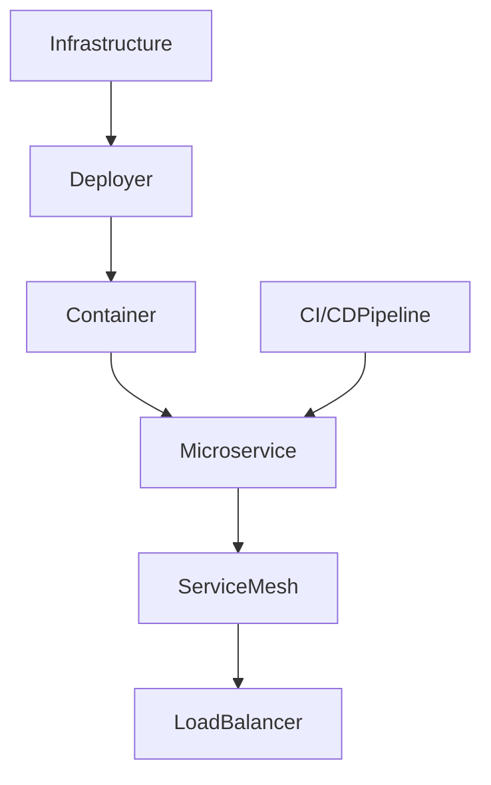
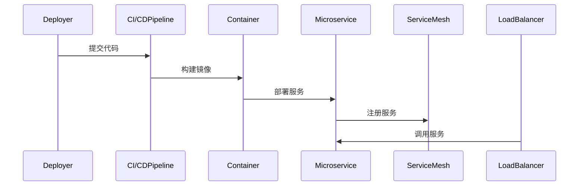

                 

# 云原生架构：重塑应用开发和部署模式

## 关键词
云原生架构、微服务、容器化、DevOps、持续集成与持续部署（CI/CD）

## 摘要
本文深入探讨云原生架构的概念、设计与实现，以及其在现代应用开发和部署中的重要作用。通过详细的分析和实例讲解，揭示云原生架构如何帮助企业应对云环境下的开发挑战，实现高效的持续交付。

## 第一部分：背景介绍

### 第1章：云原生架构概述

#### 1.1 问题背景

**1.1.1 云原生的发展历程**

云原生（Cloud Native）这一概念起源于2013年，由NIST（美国国家标准与技术研究所）提出。云原生技术旨在利用云计算环境提供弹性和可伸缩的应用服务，使应用能够快速响应市场需求。

**1.1.2 云原生与传统架构的差异**

传统架构通常依赖物理服务器和虚拟机，而云原生架构则依赖于容器、微服务和自动化工具。传统架构在云环境中往往面临扩展性差、运维复杂等问题。

**1.1.3 云原生应用的重要性和挑战**

云原生应用能够实现快速迭代和持续交付，从而更好地适应市场变化。然而，其部署和运维也面临复杂性和安全性的挑战。

#### 1.2 问题描述

**1.2.1 传统架构在云环境下的局限性**

传统架构难以充分利用云环境的弹性和可扩展性，导致资源浪费和性能瓶颈。

**1.2.2 应用开发和部署过程中的痛点**

开发和部署过程中，传统架构往往需要大量手动操作，导致效率低下。此外，不同环境之间的不一致性也增加了出错的几率。

**1.2.3 云原生架构的目标和优势**

云原生架构旨在解决传统架构的痛点，通过容器化、微服务化和自动化部署，实现高效、灵活和可靠的应用开发与部署。

#### 1.3 问题解决

**1.3.1 云原生架构的核心概念**

核心概念包括微服务、容器化、自动化部署和运维等。

**1.3.2 云原生架构的基本原理**

云原生架构利用容器技术实现应用隔离，通过微服务架构实现模块化开发，并通过自动化工具实现持续交付。

**1.3.3 云原生架构的优势与价值**

云原生架构能够提高开发效率、降低运维成本，并提高系统的可靠性和可扩展性。

#### 1.4 边界与外延

**1.4.1 云原生与云计算的关系**

云原生是云计算环境下的应用架构模式，但并非所有云计算应用都采用云原生架构。

**1.4.2 云原生与DevOps的结合**

云原生架构与DevOps理念相辅相成，共同推动持续交付和运维自动化。

**1.4.3 云原生在各类应用场景中的实践**

云原生架构已广泛应用于互联网、金融、医疗等领域，为各类应用提供高效、可靠的解决方案。

### 第2章：云原生架构核心概念与联系

#### 2.1 核心概念

**2.1.1 微服务架构**

微服务架构是一种将大型应用拆分为多个小型、自治的服务的方式。每个服务独立开发、部署和运维，通过轻量级的通信机制（如HTTP/REST）进行交互。

**2.1.2 容器化技术**

容器化技术通过将应用及其依赖环境打包到一个独立的容器中，实现应用与宿主机环境隔离，从而提高应用的可移植性和一致性。

**2.1.3 自动化部署与运维**

自动化部署与运维通过工具（如Kubernetes、Jenkins等）实现应用的持续集成、持续交付和自动化运维。

**2.1.4 服务网格与服务编排**

服务网格（如Istio、Linkerd等）提供了一种动态管理和服务间通信的机制，而服务编排（如Kubernetes、OpenShift等）则负责部署、管理和扩展微服务。

#### 2.2 概念属性特征对比表格

| 概念        | 特征                           | 联系                 |
|-------------|--------------------------------|----------------------|
| 微服务架构  | 小、自治、独立部署             | 支持灵活的模块化开发 |
| 容器化技术  | 轻量级、可移植、一致运行环境   | 提高开发和部署效率   |
| 自动化部署  | 快速、可靠、高效               | 简化运维流程         |
| 服务网格    | 高度抽象、灵活、动态服务管理   | 支持复杂服务拓扑     |

#### 2.3 ER实体关系图架构

```mermaid
erDiagram
    Container ||--o{ Microservice : "运行于"
    ServiceMesh ||--o{ Microservice : "管理"
    CI/CDPipeline ||--o{ Microservice : "构建"
```

## 第二部分：架构设计与实现

### 第3章：云原生架构设计与实现

#### 3.1 问题场景介绍

**3.1.1 项目介绍**

假设我们正在开发一个电商平台，需要处理海量的用户请求和商品数据。

**3.1.2 系统功能设计**

系统功能包括用户注册与登录、商品浏览与搜索、购物车管理、订单处理和支付等。

#### 3.2 系统架构设计



#### 3.3 系统接口设计



## 第三部分：最佳实践

### 第4章：云原生架构最佳实践

#### 4.1 容器化最佳实践

**4.1.1 容器镜像优化**

1. 使用多阶段构建
2. 限制镜像大小
3. 清理无用的依赖和文件

**4.1.2 容器网络优化**

1. 使用容器网络接口（CNI）
2. 实现服务发现与负载均衡
3. 跨主机容器通信

**4.1.3 容器存储优化**

1. 使用容器存储解决方案（如Ceph、GlusterFS等）
2. 实现数据持久化
3. 监控存储性能和容量

#### 4.2 微服务最佳实践

**4.2.1 微服务设计原则**

1. 小而自治
2. 单一职责
3. 高内聚、低耦合

**4.2.2 微服务拆分策略**

1. 功能拆分
2. 数据拆分
3. 领域拆分

**4.2.3 微服务通信优化**

1. 使用异步通信
2. 优化API设计
3. 实现服务治理

#### 4.3 自动化部署与运维最佳实践

**4.3.1 持续集成与持续部署（CI/CD）**

1. 使用CI/CD工具（如Jenkins、GitLab CI/CD等）
2. 制定自动化测试策略
3. 实现多环境部署

**4.3.2 自动化监控与日志管理**

1. 使用监控工具（如Prometheus、Grafana等）
2. 收集和分析日志
3. 实现自动化报警和故障处理

**4.3.3 自动化故障处理与恢复**

1. 实现自动化扩缩容
2. 使用容器编排工具（如Kubernetes、OpenShift等）
3. 制定灾难恢复计划

## 第5章：总结与展望

#### 5.1 小结

云原生架构作为一种现代应用开发和部署模式，能够显著提高开发效率、降低运维成本，并提高系统的可靠性和可扩展性。通过本文的探讨，我们了解了云原生架构的核心概念、设计与实现，以及最佳实践。

#### 5.2 展望

随着云计算和微服务技术的发展，云原生架构将继续发挥重要作用。未来，我们将看到更多的企业采用云原生架构，以应对日益复杂的应用需求。同时，云原生技术的不断演进也将推动更多创新应用的出现。

## 附录

### 附录A：参考资料

1. 《云原生应用架构指南》
2. 《Docker实战》
3. 《Kubernetes实战》

### 附录B：拓展阅读

1. 《微服务设计》
2. 《DevOps实践指南》
3. 《云原生网络》

## 结语

作者：AI天才研究院/AI Genius Institute & 禅与计算机程序设计艺术 /Zen And The Art of Computer Programming

本文旨在为读者提供一个全面、深入的云原生架构概述，帮助读者了解云原生架构的核心概念、设计与实现，以及最佳实践。希望本文能对您的应用开发和部署带来新的启示。

-------------------------------------------------------------------

# 附录

### 附录A：参考资料

1. 《云原生应用架构指南》：这是一本系统介绍云原生架构的权威书籍，详细阐述了云原生架构的设计原则、实现方法和最佳实践。
2. 《Docker实战》：本书通过丰富的实践案例，深入讲解了Docker容器技术的原理和应用，是学习容器化技术的理想读物。
3. 《Kubernetes实战》：本书全面介绍了Kubernetes容器编排工具的使用方法，包括集群管理、服务部署、自动化运维等方面，是Kubernetes学习者的必备书籍。

### 附录B：拓展阅读

1. 《微服务设计》：作者Martin Fowler在这本书中详细介绍了微服务架构的设计原则和实现方法，对于了解微服务架构具有重要的参考价值。
2. 《DevOps实践指南》：本书系统地介绍了DevOps的理念和实践方法，包括持续集成、持续交付、自动化测试等方面，是实施DevOps的宝贵指南。
3. 《云原生网络》：本书探讨了云原生环境下的网络架构、服务发现和负载均衡等技术，为构建高效、可靠的云原生网络提供了指导。

## 结语

作者：AI天才研究院/AI Genius Institute & 禅与计算机程序设计艺术 /Zen And The Art of Computer Programming

本文旨在为读者提供一个全面、深入的云原生架构概述，帮助读者了解云原生架构的核心概念、设计与实现，以及最佳实践。希望本文能对您的应用开发和部署带来新的启示。在云原生架构的领域中，持续学习和实践是关键。不断跟进最新的技术动态和最佳实践，将有助于您在云原生领域取得更大的成功。祝愿您在云原生之旅中一帆风顺，不断创新，成就卓越！

