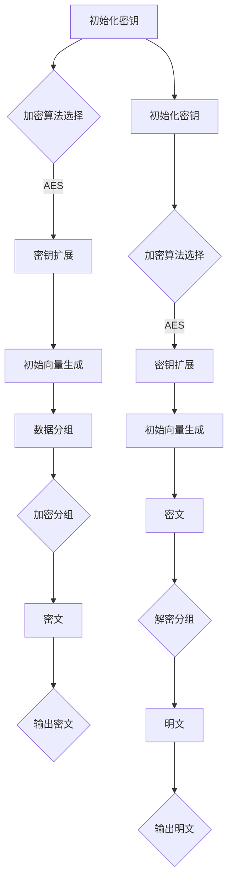
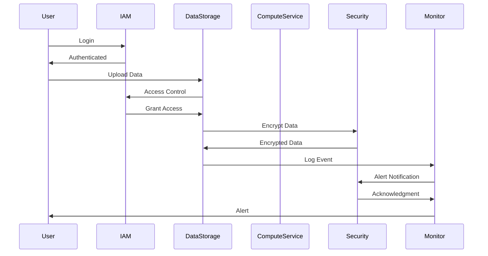
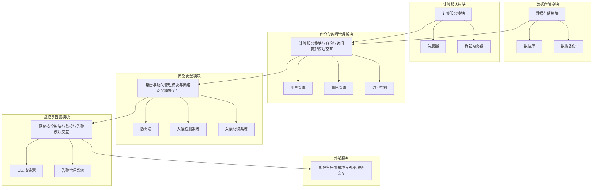

                 

### 文章标题：云安全策略与最佳实践

在当今数字化时代，云计算已成为企业业务运作的关键基础设施。然而，随着云计算的广泛应用，云安全问题也日益突出。企业面临着数据泄露、系统中断、服务中断等多种安全挑战。因此，制定有效的云安全策略和最佳实践变得至关重要。

本文将系统地探讨云安全的核心概念、策略与最佳实践，帮助企业和个人在云环境中更好地保障数据安全。文章将从以下几个部分进行展开：

1. **云安全概述与挑战**：介绍云安全的背景、重要性及面临的主要挑战。
2. **云安全核心原则**：讨论最小权限原则、审计与合规、数据加密等核心原则。
3. **云服务模型安全策略**：分析IaaS、PaaS、SaaS三种不同云服务模型的安全策略。
4. **云安全架构设计**：探讨云安全架构的构建、身份与访问管理、数据保护策略。
5. **云安全最佳实践**：介绍云安全监控与响应、安全培训与意识提升、云安全法规与合规性。
6. **云安全案例分析**：通过真实案例解析云安全事件，总结最佳实践。
7. **云安全未来发展趋势**：展望人工智能在云安全中的应用及未来挑战。

通过这篇文章，读者将全面了解云安全的各个方面，并掌握有效的云安全策略与最佳实践。接下来，我们将一一深入探讨这些主题。

#### 关键词：

- 云计算
- 云安全
- 安全策略
- 最佳实践
- 数据保护

#### 摘要：

本文旨在探讨云计算环境中的安全挑战与应对策略。首先，我们回顾了云安全的背景和重要性，随后详细分析了云安全的核心原则，包括最小权限原则、审计与合规、数据加密等。接着，我们讨论了不同云服务模型（IaaS、PaaS、SaaS）的安全策略，并介绍了如何设计云安全架构。文章还探讨了云安全监控、安全培训与意识提升、以及云安全法规与合规性。通过真实案例的分析，我们总结了云安全最佳实践，并展望了未来的发展趋势。希望这篇文章能够帮助企业和个人在云环境中更好地保障数据安全。

### 第一部分：云安全概述与挑战

#### 第1章：云安全的背景与重要性

随着数字化转型的加速，云计算已经从一种新兴技术逐渐成为企业业务运作的基石。无论是初创企业还是大型跨国公司，都开始将业务负载迁移到云平台，以实现更高的灵活性、可扩展性和成本效益。然而，云计算的广泛应用也带来了一系列的安全挑战。

**云安全的定义**：云安全是指保障云计算环境中的数据、应用程序和基础设施的安全措施，包括预防、检测和响应潜在的安全威胁。它不仅涉及技术层面，还包括管理和策略层面。

**云计算的兴起与发展**：云计算的概念最早在20世纪60年代由道格拉斯·恩格尔巴特（Douglas Engelbart）提出。然而，真正的云计算革命始于2006年，亚马逊推出了其云计算服务Amazon Web Services（AWS）。随后，微软、谷歌等科技巨头也纷纷加入，推出了各自的云服务。近年来，随着5G、物联网和人工智能等新兴技术的融合，云计算的应用场景更加广泛，商业模式也不断创新。

**云安全的重要性**：在云计算环境中，数据、应用程序和基础设施的高度集中，使得安全风险显著增加。以下是一些关键原因，解释了为什么云安全至关重要：

1. **数据泄露风险**：企业在云平台存储和处理的敏感数据量巨大，一旦发生泄露，将导致严重的经济损失和声誉损害。
2. **服务中断风险**：云服务的中断可能导致业务运营的严重瘫痪，影响企业的正常运营和客户满意度。
3. **合规性要求**：许多行业都有严格的合规性要求，如医疗、金融等。云环境下的安全措施必须符合这些要求，否则将面临法律风险。

**云安全面临的挑战**：

1. **多租户环境**：云平台上的多个租户共享同一基础设施，增加了安全管理的复杂性。
2. **动态环境**：云环境中的资源分配和释放是动态的，这使得安全措施需要具备高度的灵活性和适应性。
3. **技术复杂性**：云安全涉及多种技术，如虚拟化、容器化、加密等，企业需要具备相应的技术能力和专业知识。

了解云安全的背景和重要性，有助于我们更好地理解接下来将要讨论的云安全核心原则、云服务模型安全策略、云安全架构设计等内容。在下一章中，我们将深入探讨云安全的核心原则，包括最小权限原则、审计与合规、数据加密等。

### 第2章：云安全的核心原则

在云计算环境中，保障数据、应用程序和基础设施的安全是至关重要的。为了实现这一目标，企业需要遵循一系列核心安全原则，这些原则不仅提供了安全策略的理论基础，还为实际操作提供了具体的指导。以下是云安全中的三大核心原则：最小权限原则、审计与合规、数据加密。

#### 2.1 最小权限原则

最小权限原则（Principle of Least Privilege，PoLP）是信息安全领域的一项基本准则，主张用户和应用程序应只拥有完成其任务所必需的最小权限。这一原则旨在最大限度地减少安全漏洞和潜在威胁，防止恶意行为造成严重损害。

**最小权限原则的具体应用**：

1. **用户权限管理**：确保每个用户和应用程序都仅拥有完成其任务所需的最少权限。例如，一个普通员工不应该拥有系统管理员权限，他们只能访问与工作职责直接相关的系统和资源。
2. **权限分离**：将不同角色的权限分离，确保没有任何单一用户或角色拥有过多的权限。例如，数据库管理员（DBA）不应同时拥有系统管理员权限和数据操作权限。
3. **权限审批流程**：建立严格的权限审批流程，确保权限变更得到适当审核和记录。任何权限的变更都应经过授权人员的审批。

**最小权限原则的优点**：

1. **降低风险**：通过最小化权限，可以显著降低恶意行为和内部威胁的风险，提高整体安全性。
2. **提高审计效率**：权限管理制度的实施有助于审计人员更容易地追踪和验证用户的行为，提高审计效率。
3. **合规性**：许多行业标准和法规（如ISO 27001、NIST等）要求实施最小权限原则，遵循这些原则有助于企业满足合规性要求。

#### 2.2 审计与合规

审计与合规是云安全的重要组成部分。审计（Audit）是一种评估和验证过程，用于确保云环境中的安全措施得到有效执行，并且符合相关法规和标准。合规（Compliance）则是指云服务提供商和客户遵循特定的法律、法规和行业标准。

**审计的作用**：

1. **安全性评估**：审计可以帮助识别潜在的安全漏洞和弱点，从而采取相应的修复措施。
2. **行为监控**：审计记录可以监控用户和应用程序的行为，帮助发现异常活动，及时响应安全事件。
3. **合规性验证**：通过审计，企业可以验证其安全措施是否符合相关法规和标准，确保合规性。

**合规性的重要性**：

1. **法律法规要求**：许多行业（如金融、医疗等）有严格的法律法规要求，云服务提供商和客户必须遵循这些要求，以避免法律风险。
2. **客户信任**：合规性不仅有助于满足法律要求，还能增强客户对云服务的信任，促进业务合作。
3. **商业优势**：合规性是企业竞争力的体现，有助于企业在市场中获得竞争优势。

**常见的合规标准和法规**：

1. **ISO 27001**：国际标准化组织（ISO）制定的信息安全管理体系（ISMS）标准，旨在确保信息安全管理体系的实施和持续改进。
2. **NIST SP 800-53**：美国国家标准与技术研究所（NIST）发布的指南，用于建立和维护一个全面的信息安全框架。
3. **GDPR**：欧盟通用数据保护条例，规定了个人数据的处理和保护标准，对企业处理欧盟居民数据提出了严格要求。
4. **HIPAA**：美国健康保险携带和责任法案，针对医疗信息的安全和保护提出了详细规定。

#### 2.3 数据加密

数据加密（Data Encryption）是保障数据安全的重要技术手段，通过将数据转换为密文，防止未经授权的访问和篡改。在云计算环境中，数据加密不仅用于数据传输过程中的保护，还用于数据存储的安全。

**数据加密的分类**：

1. **对称加密**：使用相同的密钥对数据进行加密和解密。常见的对称加密算法有AES、DES等。
2. **非对称加密**：使用一对密钥（公钥和私钥）进行加密和解密。常见的非对称加密算法有RSA、ECC等。
3. **哈希加密**：将输入数据映射为固定长度的字符串，常用于验证数据完整性和身份验证。常见的哈希算法有SHA-256、MD5等。

**数据加密的应用场景**：

1. **数据传输**：在数据从源端传输到目的端的过程中，使用加密技术保护数据不被窃取或篡改。常用的协议有TLS/SSL等。
2. **数据存储**：在云平台中存储数据时，使用加密技术保护数据不被未授权访问。云服务提供商通常会提供加密存储选项。
3. **数据备份**：在备份数据时，使用加密技术保护备份数据的安全，防止数据泄露或损坏。

**数据加密的挑战**：

1. **性能影响**：加密和解密过程需要计算资源，可能影响数据传输和存储的性能。
2. **密钥管理**：密钥是加密系统的核心，需要妥善管理以防止丢失或泄露。密钥管理包括密钥生成、存储、分发、轮换等。
3. **加密标准选择**：不同的加密算法和标准具有不同的安全性和性能特点，选择合适的加密标准至关重要。

综上所述，最小权限原则、审计与合规、数据加密是云安全中的三大核心原则。遵循这些原则，企业可以显著提高云环境的安全性，降低安全风险，保障业务的连续性和数据的安全。在下一章中，我们将探讨不同云服务模型（IaaS、PaaS、SaaS）的安全策略。

### 第3章：云服务模型安全策略

云计算服务主要分为三种模型：基础设施即服务（IaaS）、平台即服务（PaaS）和软件即服务（SaaS）。每种模型都有其独特的安全需求和挑战，因此安全策略也有所不同。在本章中，我们将分别探讨这三种云服务模型的安全策略。

#### 3.1 IaaS 安全策略

基础设施即服务（IaaS）提供计算资源、存储和网络的虚拟化基础设施，用户可以根据需求灵活配置和管理资源。由于IaaS模型涉及物理硬件和虚拟化技术，其安全策略需要特别关注以下几个方面：

**身份与访问管理**：

1. **最小权限原则**：用户和应用程序应仅拥有执行其任务所需的最小权限。例如，普通用户只能访问其个人数据和资源，而管理员才能管理整个基础设施。
2. **身份验证和授权**：使用强身份验证机制（如双因素认证）确保只有授权用户可以访问系统。同时，利用访问控制列表（ACL）和角色基础访问控制（RBAC）来管理用户权限。

**数据保护**：

1. **数据加密**：在数据传输和存储过程中使用加密技术保护数据。对于敏感数据，建议使用高级加密标准（AES）等强加密算法。
2. **数据备份和恢复**：定期备份数据，并确保备份数据的安全性。在发生数据丢失或系统故障时，能够快速恢复数据。

**安全监控与事件响应**：

1. **日志管理**：实时收集和分析系统日志，及时发现异常行为和安全事件。
2. **安全事件响应**：建立应急响应计划，确保在发生安全事件时能够快速响应并采取措施。

**合规性**：

1. **遵守法律法规**：确保IaaS服务符合相关法律法规，如ISO 27001、NIST等。
2. **客户数据隐私**：遵循数据隐私保护法规（如GDPR），确保客户数据不被未经授权访问。

#### 3.2 PaaS 安全策略

平台即服务（PaaS）提供了一个开发、运行和管理应用程序的平台，用户可以在此平台上开发、部署和管理应用程序，无需关注底层基础设施的管理。PaaS的安全策略主要包括以下几个方面：

**身份与访问管理**：

1. **最小权限原则**：确保用户和应用程序仅拥有执行其任务所需的最小权限。例如，开发人员只能访问其开发的应用程序和资源，而管理员才能管理整个平台。
2. **角色分离**：为不同的角色分配不同的权限，例如开发者、测试人员、运维人员等，以减少安全风险。

**数据保护**：

1. **数据隔离**：确保不同用户的应用程序数据相互隔离，防止数据泄露。
2. **数据加密**：在数据传输和存储过程中使用加密技术保护数据，特别是在跨境传输时。
3. **API安全**：保护应用程序接口（API）的安全，防止未经授权的访问和攻击。

**开发与运维安全**：

1. **安全编码实践**：在开发过程中遵循安全编码规范，减少安全漏洞。
2. **持续集成与持续部署（CI/CD）**：确保应用程序在发布前经过严格的测试和审核，降低安全风险。
3. **云原生安全**：利用云原生安全工具和框架，保护应用程序在云环境中的安全。

**合规性**：

1. **行业法规遵守**：确保PaaS服务符合特定行业的法规要求，如金融、医疗等。
2. **数据本地化**：在合规性要求较高的地区，确保数据存储在本地的数据中心。

#### 3.3 SaaS 安全策略

软件即服务（SaaS）提供的是完整的软件应用，用户无需关心底层基础设施和平台的维护，只需使用软件即可。SaaS的安全策略主要包括以下几个方面：

**数据保护**：

1. **数据加密**：在数据传输和存储过程中使用加密技术保护数据，确保数据在传输过程中不被窃取或篡改。
2. **数据隔离**：确保不同客户的数据相互隔离，防止数据泄露。
3. **数据备份和恢复**：定期备份数据，确保在数据丢失或系统故障时能够快速恢复。

**身份与访问管理**：

1. **身份验证**：使用强身份验证机制（如双因素认证）确保只有授权用户可以访问软件。
2. **访问控制**：利用访问控制列表（ACL）和角色基础访问控制（RBAC）来管理用户权限，确保用户只能访问其授权的数据和应用功能。

**安全监控与事件响应**：

1. **日志记录与审计**：实时收集和分析系统日志，及时发现异常行为和安全事件。
2. **安全事件响应**：建立应急响应计划，确保在发生安全事件时能够快速响应并采取措施。

**合规性**：

1. **法律和法规遵守**：确保SaaS服务符合相关法律法规，如GDPR、HIPAA等。
2. **数据隐私保护**：遵循数据隐私保护法规，确保客户数据不被未经授权访问。

综上所述，无论是IaaS、PaaS还是SaaS，云服务模型的安全策略都需要综合考虑身份与访问管理、数据保护、安全监控与事件响应以及合规性等方面。通过实施这些安全策略，企业可以在云环境中确保数据和应用的安全，降低安全风险，保障业务的连续性和客户信任。

### 第4章：云安全架构的构建

云安全架构是保障云计算环境安全的关键，它通过一系列的技术和管理措施，确保数据、应用程序和基础设施的安全。云安全架构的设计和构建需要综合考虑多个方面，包括架构组成部分、云安全框架选择和设计原则。在本章中，我们将详细探讨云安全架构的构建过程。

#### 4.1 云安全架构的组成部分

云安全架构通常包括以下几个关键组成部分：

1. **身份与访问管理（IAM）**：IAM组件负责管理用户的身份验证、授权和访问控制。它确保只有经过授权的用户可以访问云资源，并限制用户对资源的访问权限。常见的IAM工具包括AWS Identity and Access Management（IAM）、Azure Active Directory（AAD）和Google Cloud Identity。

2. **网络安全**：网络安全组件包括防火墙、入侵检测系统（IDS）、入侵防御系统（IPS）等，用于保护云资源免受网络攻击。网络安全组件还负责监控网络流量，识别和阻止恶意流量。常见的网络安全工具包括AWS Shield、Azure Firewall和Google Cloud Armor。

3. **数据保护**：数据保护组件包括数据加密、数据备份、数据恢复等。这些组件确保数据在传输和存储过程中不被窃取或篡改。常见的数据保护工具包括AWS Key Management Service（KMS）、Azure Backup和Google Cloud Backup。

4. **应用程序安全**：应用程序安全组件包括安全编码实践、应用程序防火墙（WAF）、漏洞扫描和渗透测试等。这些组件确保应用程序在设计和部署过程中具备足够的安全措施，以防止安全漏洞和攻击。常见应用程序安全工具包括AWS WAF、Azure Application Gateway和Google Cloud WAF。

5. **事件监控与响应**：事件监控与响应组件包括日志管理、安全信息和事件管理（SIEM）系统、安全事件响应团队等。这些组件负责实时监控云环境中的安全事件，并采取适当的措施进行响应。常见的事件监控与响应工具包括AWS CloudTrail、Azure Monitor和Google Cloud Security Command Center。

#### 4.2 云安全框架的选择

在选择云安全框架时，企业需要考虑以下因素：

1. **合规性要求**：确保所选框架符合企业所在行业和地区的法律法规要求，如ISO 27001、NIST等。
2. **易用性和可扩展性**：所选框架应易于使用和管理，并具备良好的扩展性，以适应企业的成长和发展。
3. **集成能力**：框架应能够与企业现有的安全工具和系统无缝集成，提高整体安全性。
4. **自动化和智能化**：框架应具备自动化和智能化能力，能够自动检测、响应和处理安全事件，减轻安全管理员的工作负担。

常见的云安全框架包括：

1. **AWS Security Hub**：AWS提供的综合安全解决方案，提供自动化的合规性检查、安全事件监控和响应。
2. **Azure Security Center**：微软提供的云安全解决方案，包括安全策略管理、自动化漏洞修复和安全事件响应。
3. **Google Cloud Security Command Center**：谷歌提供的云安全解决方案，提供实时安全监控、事件响应和自动化合规性检查。

#### 4.3 云安全架构的设计原则

在设计和构建云安全架构时，应遵循以下原则：

1. **最小权限原则**：确保用户和应用程序仅拥有完成其任务所需的最小权限，以降低安全风险。
2. **分层防御**：采用分层防御策略，从网络层、系统层和应用层等多个层面进行安全防护。
3. **安全性与可用性平衡**：在确保安全性的同时，考虑系统的可用性和性能，避免过度限制影响业务运作。
4. **持续监控与改进**：建立实时监控机制，持续监控云环境中的安全事件，并根据监控结果不断优化安全策略。
5. **自动化与智能化**：利用自动化和智能化工具，提高安全管理效率，减轻管理员的工作负担。

通过遵循上述原则，企业可以构建一个高效、可靠且具备高度安全性的云安全架构，保障云环境中的数据和应用安全。

综上所述，云安全架构的构建是一个系统工程，需要综合考虑架构组成部分、云安全框架选择和设计原则。通过实施有效的云安全架构，企业可以在云计算环境中实现高度安全，保障业务的连续性和客户信任。在下一章中，我们将探讨云安全最佳实践，包括监控与响应、安全培训与意识提升、合规性实践等内容。

### 第5章：身份与访问管理

在云安全架构中，身份与访问管理（Identity and Access Management，IAM）是保障云环境安全的关键环节。IAM系统通过管理用户身份验证、权限分配和访问控制，确保只有经过授权的用户和系统能够访问云资源。在本章中，我们将详细探讨身份与访问管理的基本概念、机制和技术，包括身份验证机制、访问控制策略和多因素认证。

#### 5.1 身份验证机制

身份验证是IAM系统的核心功能之一，目的是确认用户的身份，防止未经授权的访问。常见的身份验证机制包括：

1. **密码验证**：密码验证是最常见的身份验证方式，用户通过输入预定义的密码来证明自己的身份。密码验证简单易用，但安全性相对较低，容易受到暴力破解、字典攻击等攻击方式的影响。

2. **双因素认证（2FA）**：双因素认证是一种额外的安全层，用户在输入密码后还需要提供第二项验证信息，如短信验证码、动态验证码（OTP）或指纹验证。双因素认证显著提高了安全性，即使密码被泄露，攻击者也无法访问用户账户。

3. **生物识别**：生物识别技术利用生物特征（如指纹、面部识别、虹膜扫描等）进行身份验证。生物识别技术具有较高的安全性和便捷性，但设备和技术的成本较高。

4. **智能卡/USB令牌**：智能卡或USB令牌是一种硬件设备，用户需要将其插入计算机或手机中，以生成唯一的认证代码。这种机制提供了较高的安全性，但可能对用户造成不便。

5. **零知识证明**：零知识证明是一种高级的身份验证机制，用户无需泄露任何信息即可证明自己的身份。这种方式在保障用户隐私的同时提供了极高的安全性。

**选择合适的身份验证机制**：

在选择身份验证机制时，企业应考虑以下因素：

- **安全性要求**：根据企业面临的安全威胁和风险，选择合适的安全级别。
- **用户体验**：身份验证机制应尽量便捷，减少对用户操作的影响。
- **成本**：不同身份验证机制的成本差异较大，企业应根据预算选择合适的方案。

#### 5.2 访问控制策略

访问控制是IAM系统的另一个关键功能，用于确保用户和系统能够访问其授权的资源，同时防止未经授权的访问。常见的访问控制策略包括：

1. **基于角色的访问控制（RBAC）**：RBAC将用户划分为不同的角色，并为每个角色分配不同的权限。用户根据其在组织中的角色（如管理员、普通用户、测试人员等）获得相应的权限。RBAC提供了灵活的权限管理机制，有助于简化权限分配和变更。

2. **基于属性的访问控制（ABAC）**：ABAC基于用户的属性（如地理位置、时间等）和资源的属性（如访问级别、敏感度等）进行访问控制。这种策略能够根据具体场景动态调整访问权限，提供更细粒度的权限管理。

3. **访问控制列表（ACL）**：ACL为每个资源指定一组访问权限，用户根据其所属组或直接权限获得访问权限。ACL适用于小型、静态环境，但在复杂、动态环境中可能难以管理。

4. **多因素访问控制**：多因素访问控制结合多种身份验证机制和访问控制策略，确保用户和系统能够访问其授权的资源。例如，用户需要通过密码验证和双因素认证，并满足特定的时间或地理位置要求，才能访问敏感资源。

**设计有效的访问控制策略**：

在设计访问控制策略时，企业应考虑以下因素：

- **最小权限原则**：确保用户和系统仅拥有完成其任务所需的最小权限。
- **安全性**：根据企业的安全需求，选择合适的访问控制策略。
- **灵活性和可扩展性**：策略应能够适应企业的成长和发展，方便权限的分配和变更。
- **审计和合规性**：确保访问控制策略符合相关法律法规和标准，便于审计和合规性检查。

#### 5.3 多因素认证

多因素认证（Multi-Factor Authentication，MFA）是一种结合多种身份验证机制的安全策略，旨在提高身份验证的安全性。MFA通常包括以下几种组合方式：

1. **密码 + 双因素认证**：用户首先输入密码，然后通过短信验证码、动态验证码（OTP）或其他认证方式完成验证。
2. **密码 + 生物识别**：用户首先输入密码，然后通过指纹、面部识别等生物识别技术进行验证。
3. **密码 + 智能卡/USB令牌**：用户首先输入密码，然后插入智能卡或USB令牌以生成认证代码。
4. **密码 + 零知识证明**：用户首先输入密码，然后通过零知识证明技术进行验证。

**实施多因素认证的优势**：

1. **提高安全性**：多因素认证显著提高了身份验证的安全性，即使密码泄露，攻击者也无法访问用户账户。
2. **降低欺诈风险**：多因素认证可以有效防止欺诈行为，减少因恶意软件和钓鱼攻击导致的数据泄露。
3. **增强用户体验**：多因素认证的便捷性降低了用户操作的复杂性，同时提高了安全性，满足用户对安全性和便捷性的双重需求。

**实施多因素认证的挑战**：

1. **用户体验**：多因素认证可能对用户体验造成一定影响，特别是在认证频繁的场景下。
2. **设备和管理成本**：一些多因素认证方式（如智能卡、生物识别设备）需要额外的设备和维护成本。
3. **兼容性问题**：多因素认证系统需要与现有的身份验证和访问控制系统兼容，确保无缝集成。

**总结**：

身份与访问管理是云安全架构的关键组成部分，通过有效的身份验证机制、访问控制策略和多因素认证，企业可以在云环境中实现高度安全的访问控制。遵循最小权限原则、设计有效的访问控制策略、实施多因素认证，是保障云安全的重要措施。在下一章中，我们将探讨数据保护策略，包括数据加密、数据备份与恢复和数据隐私保护等内容。

### 第6章：数据保护策略

在云计算环境中，数据保护是确保信息安全的核心任务。随着云应用的普及，企业面临的数据泄露、数据丢失等风险日益增加。因此，制定有效的数据保护策略至关重要。本章将详细介绍数据保护策略的关键要素，包括数据加密、数据备份与恢复和数据隐私保护。

#### 6.1 数据加密策略

数据加密是保护数据免受未授权访问和篡改的关键技术手段。在云计算环境中，数据加密分为传输加密和存储加密两种。

**传输加密**：

- **SSL/TLS加密**：在数据从客户端传输到云服务提供商（CSP）的过程中，使用SSL/TLS协议对数据进行加密。这可以防止数据在传输过程中被窃取或篡改。常见协议包括HTTPS、FTPS等。
- **VPN加密**：虚拟私人网络（VPN）通过建立加密通道，确保数据在跨网络传输时的安全。VPN适用于需要通过公共网络访问私有云资源的情况。

**存储加密**：

- **文件级加密**：对存储在云服务器上的文件进行加密，确保文件内容不被未授权访问。常见工具包括AWS KMS、Azure Key Vault、Google Cloud KMS等。
- **块级加密**：对存储在云服务器上的数据块进行加密，提高存储设备的安全。块级加密通常由云服务提供商提供，如AWS EBS、Azure Disk、Google Cloud Persistent Disk等。
- **数据库加密**：对数据库中的敏感数据进行加密，确保数据库安全。常见工具包括AWS Database Encryption、Azure Database Encryption、Google Cloud SQL Transparent Data Encryption等。

**选择合适的加密算法**：

- **对称加密**：如AES，适用于数据量较小且需要快速加密的场景。
- **非对称加密**：如RSA，适用于需要高安全性且数据量较大的场景。
- **哈希加密**：如SHA-256，常用于数据完整性校验和数字签名。

**加密密钥管理**：

- **密钥生成**：使用强随机算法生成加密密钥。
- **密钥存储**：将加密密钥存储在安全的密钥管理服务中，如AWS KMS、Azure Key Vault、Google Cloud KMS。
- **密钥轮换**：定期更换加密密钥，确保加密系统的安全性。

#### 6.2 数据备份与恢复策略

数据备份与恢复是确保数据在意外情况下能够恢复的关键措施。在云计算环境中，企业应制定全面的数据备份策略，确保数据的安全性和可用性。

**数据备份类型**：

- **全量备份**：备份整个系统或数据库，适用于灾难恢复场景。
- **增量备份**：仅备份自上次备份以来发生变更的数据，适用于常规备份场景。
- **差异备份**：备份自上次全量备份以来发生变更的数据，适用于常规备份场景。

**数据备份策略**：

- **定期备份**：根据业务需求和数据变化频率，制定定期备份计划，确保数据及时备份。
- **异地备份**：将备份数据存储在异地数据中心，防止单点故障导致数据丢失。
- **多版本备份**：保留多个备份版本，以便在数据损坏或误操作时进行恢复。

**数据恢复策略**：

- **快速恢复**：在发生数据丢失或损坏时，能够迅速恢复数据，减少业务中断时间。
- **测试恢复**：定期测试数据恢复过程，确保备份和恢复策略的有效性。
- **灾难恢复**：制定详细的灾难恢复计划，确保在发生重大灾难时能够恢复业务。

#### 6.3 数据隐私保护策略

在云计算环境中，数据隐私保护是保障用户权益的重要措施。企业应遵循相关法律法规和标准，确保用户数据隐私得到保护。

**隐私保护法律法规**：

- **GDPR**：欧盟通用数据保护条例，规定了个人数据的处理和保护标准。
- **CCPA**：加州消费者隐私法案，保护加州居民的个人信息。
- **HIPAA**：美国健康保险携带和责任法案，规定了医疗信息的安全和保护。

**隐私保护措施**：

- **数据匿名化**：对敏感数据（如个人信息）进行匿名化处理，防止数据泄露。
- **访问控制**：实施严格的访问控制策略，确保只有授权人员可以访问敏感数据。
- **数据使用限制**：明确数据使用目的和使用范围，防止数据滥用。

**隐私保护实践**：

- **隐私影响评估（PIA）**：在数据处理前进行隐私影响评估，确保隐私保护措施得到有效实施。
- **透明度**：向用户告知其数据的使用情况和保护措施。
- **用户权限管理**：确保用户可以访问、修改和删除其个人数据。

**总结**：

数据保护策略是云计算安全的重要组成部分。通过数据加密、数据备份与恢复和数据隐私保护等策略，企业可以在云计算环境中确保数据的安全性和隐私性。遵循相关法律法规和标准，制定全面、有效的数据保护策略，是保障企业数据安全和用户隐私的关键。

### 第7章：云安全监控与响应

在云安全策略的实施过程中，监控与响应是关键环节。有效的安全监控与响应能够帮助企业及时发现和应对安全事件，降低安全风险，保障业务的连续性和数据的安全。本章将详细探讨云安全监控与响应的重要性和具体实践，包括安全监控工具的选择、事件响应流程以及安全报告与分析。

#### 7.1 安全监控工具的选择

选择合适的安全监控工具对于云安全至关重要。以下是一些常见的安全监控工具及其特点：

1. **日志管理工具**：如Splunk、ELK（Elasticsearch、Logstash、Kibana）等，用于收集、存储、分析和可视化日志数据，帮助识别潜在的安全事件。
2. **安全信息和事件管理（SIEM）系统**：如IBM QRadar、Splunk Enterprise Security、Microsoft Azure Security Center等，能够整合不同源的安全数据，提供实时监控、警报和报告功能。
3. **入侵检测系统（IDS）和入侵防御系统（IPS）**：如Snort、Suricata、AWS GuardDuty、Azure Security Center等，用于检测和阻止网络入侵和恶意活动。
4. **应用程序安全测试工具**：如OWASP ZAP、Burp Suite等，用于评估Web应用程序的安全漏洞。
5. **云原生安全工具**：如AWS CloudTrail、Azure Monitor、Google Cloud Security Command Center等，专门用于监控云资源和服务，提供细粒度的安全监控和响应功能。

**选择安全监控工具的考虑因素**：

- **兼容性和集成**：工具应能够与企业现有的安全基础设施和应用程序无缝集成，确保数据流和监控功能的统一。
- **性能和可扩展性**：工具应具备高性能和高可扩展性，能够处理大量的安全数据和事件。
- **警报和报告**：工具应提供灵活的警报和报告功能，能够根据企业的安全策略和需求定制警报规则和报告格式。
- **自动化和智能化**：工具应具备自动化和智能化能力，能够自动检测、分析和响应安全事件，减轻安全管理员的工作负担。

#### 7.2 事件响应流程

在云环境中，安全事件可能随时发生，企业需要建立高效的响应流程，确保在事件发生时能够迅速采取行动，将风险降至最低。以下是常见的安全事件响应流程：

1. **事件识别**：通过安全监控工具实时监控安全事件，及时发现异常活动和潜在威胁。
2. **初步分析**：对识别出的安全事件进行初步分析，确定事件的严重性和影响范围。
3. **确认和评估**：进一步验证事件的真实性和影响，评估事件的潜在风险和损失。
4. **紧急响应**：根据事件的严重程度和影响，采取紧急响应措施，如隔离受感染的系统、阻断恶意流量等。
5. **详细分析**：对事件进行详细分析，确定事件的根本原因和漏洞，制定修复措施。
6. **恢复和重建**：根据分析结果，修复漏洞和受损系统，恢复业务运营，并进行安全检查和测试。
7. **报告和总结**：撰写详细的事件响应报告，总结事件的原因、处理过程和修复措施，为后续事件应对提供参考。

**事件响应的最佳实践**：

- **快速响应**：建立快速响应机制，确保在事件发生时能够迅速采取行动。
- **团队协作**：建立跨部门协作机制，确保安全、IT、运维等团队能够协同工作，提高响应效率。
- **定期演练**：定期进行安全演练，模拟真实的安全事件，测试响应流程和团队协作能力。
- **知识共享**：通过事件响应总结和知识共享，积累经验，持续优化响应流程。

#### 7.3 安全报告与分析

安全报告与分析是云安全监控与响应的重要环节，能够帮助企业了解安全态势，识别潜在风险，优化安全策略。以下是一些关键的安全报告和分析内容：

1. **日常监控报告**：包括系统日志、事件记录、警报信息等，提供实时安全态势的概览。
2. **安全事件报告**：详细记录安全事件的识别、分析、响应和恢复过程，为后续事件应对提供参考。
3. **漏洞报告**：包括已识别的漏洞、漏洞影响评估和修复措施，帮助制定漏洞管理和修复计划。
4. **合规性报告**：验证云环境是否符合相关法律法规和标准，确保合规性。
5. **安全趋势分析**：分析安全事件和漏洞的趋势，预测潜在风险，优化安全策略。

**报告和分析的最佳实践**：

- **定期生成**：定期生成报告和分析，确保安全态势得到持续监控和关注。
- **自定义报告**：根据企业的需求和特点，自定义报告内容和格式，确保报告信息的针对性和实用性。
- **可视化展示**：使用可视化工具展示安全数据和趋势，提高报告的可读性和易懂性。
- **知识库建设**：建立知识库，收集和整理安全事件、漏洞等信息，为后续分析和决策提供支持。

通过有效的安全监控与响应，企业能够在云环境中及时发现和应对安全事件，降低安全风险，保障业务的连续性和数据的安全。在下一章中，我们将探讨安全培训与意识提升、云安全法规与合规性等内容。

### 第8章：安全培训与意识提升

在云安全体系中，安全培训与意识提升是不可或缺的一环。随着云计算技术的普及，员工对云安全的认识和理解越来越重要。有效的安全培训可以提升员工的安全意识，降低因人为错误导致的安全事件。此外，建立安全文化也是保障云安全的重要措施。本章将探讨安全培训、安全文化建设以及漏洞挖掘与测试。

#### 8.1 员工安全培训

员工安全培训是提升整体安全意识的基础。通过定期的安全培训，员工可以了解云安全的基本知识和最佳实践，提高对潜在安全威胁的识别和应对能力。以下是一些关键的安全培训内容：

1. **基础知识**：培训员工了解云计算的基本概念、云服务模型（IaaS、PaaS、SaaS）以及云安全的基本原则。
2. **安全意识**：教育员工认识到安全是每个人的责任，了解常见的安全威胁和攻击手段，如钓鱼攻击、恶意软件、SQL注入等。
3. **密码管理**：教授员工如何创建强密码、定期更换密码以及避免泄露密码的方法。
4. **数据保护**：培训员工如何保护敏感数据，包括数据加密、备份和恢复等。
5. **安全操作**：指导员工如何在日常工作中遵循安全操作规范，如访问控制、最小权限原则等。

**实施员工安全培训的最佳实践**：

- **定期培训**：定期组织安全培训，确保员工的安全知识和技能得到持续更新。
- **互动式培训**：采用互动式培训方式，如小组讨论、案例分析、模拟演练等，提高员工参与度和学习效果。
- **个性化培训**：根据员工的岗位和职责，提供个性化的培训内容，确保培训的针对性和实用性。
- **考核与激励**：对培训效果进行考核，激励员工积极参与安全培训，提高整体安全意识。

#### 8.2 安全文化建设

安全文化建设是建立长期云安全机制的重要手段。通过营造良好的安全文化，企业可以形成全员参与的安全氛围，提高整体安全防护能力。以下是一些关键措施：

1. **安全价值观**：建立明确的安全价值观，如“安全第一”、“信任但验证”等，将安全融入企业文化和价值观中。
2. **安全领导力**：高层领导应树立安全意识，将安全纳入企业战略，推动安全文化建设。
3. **安全沟通**：建立有效的安全沟通机制，确保安全信息在企业内部畅通无阻，员工可以及时了解安全动态和事件。
4. **安全事件反馈**：鼓励员工报告安全事件和漏洞，建立匿名反馈渠道，确保员工的意见和反馈得到重视。
5. **安全奖励机制**：设立安全奖励机制，对在安全方面表现突出的员工给予奖励，激励员工积极参与安全工作和漏洞挖掘。

#### 8.3 漏洞挖掘与测试

漏洞挖掘与测试是发现和修复云安全漏洞的重要手段。通过定期的漏洞挖掘和测试，企业可以及时发现并修复潜在的安全隐患，提高云环境的安全性。以下是一些常见的漏洞挖掘与测试方法：

1. **静态代码分析**：通过对源代码进行分析，识别潜在的安全漏洞。常用的工具包括SonarQube、Fortify等。
2. **动态代码分析**：在应用程序运行时进行代码分析，识别运行时漏洞。常用的工具包括OWASP ZAP、Burp Suite等。
3. **渗透测试**：模拟黑客攻击，通过实际操作发现应用程序和系统的漏洞。渗透测试可以分为黑盒测试、白盒测试和灰盒测试。
4. **安全竞赛**：组织内部或外部的安全竞赛，鼓励员工参与漏洞挖掘，提高整体安全水平。
5. **自动化测试**：利用自动化工具定期进行安全测试，确保及时识别和修复漏洞。

**漏洞挖掘与测试的最佳实践**：

- **持续测试**：建立持续测试机制，定期进行漏洞挖掘和测试，确保及时发现和修复安全漏洞。
- **安全开发**：将安全测试集成到开发流程中，确保在开发阶段发现和修复漏洞。
- **知识共享**：将漏洞挖掘和测试的经验和知识进行共享，提高整体安全防护能力。
- **安全培训**：对参与漏洞挖掘和测试的员工进行安全培训，提高他们的技能和意识。

通过安全培训、安全文化建设以及漏洞挖掘与测试，企业可以全面提升云安全水平，降低安全风险，保障业务的连续性和数据的安全。在下一章中，我们将通过案例分析，进一步探讨云安全事件的处理和应对。

### 第9章：云安全法规与合规性

随着云计算的广泛应用，云安全法规和合规性问题日益突出。企业不仅需要确保其云服务提供商（CSP）遵守相关法规，还需要确保自身在云环境中的操作符合法律法规的要求。本章将介绍国际和国内常见的云安全法规，并探讨企业如何实现合规性。

#### 9.1 国际云安全法规概述

国际上的云安全法规主要涉及数据保护、隐私和信息安全等方面。以下是一些重要的国际法规：

1. **通用数据保护条例（GDPR）**：GDPR是欧盟颁布的一项数据保护法规，旨在加强对个人数据的保护。GDPR对跨国数据处理提出了严格的要求，包括数据主体权利、数据控制者和处理者的责任、数据跨境传输等。

2. **加利福尼亚消费者隐私法案（CCPA）**：CCPA是加州的一项消费者隐私法规，要求企业披露数据处理活动、允许消费者访问其数据并对其数据删除请求作出响应。

3. **欧盟网络与信息安全指令（NIS Directive）**：NIS Directive要求欧盟成员国制定法律，确保关键基础设施和服务提供商具备足够的安全措施，以防止网络安全事件。

4. **支付卡行业数据安全标准（PCI DSS）**：PCI DSS是由支付卡行业制定的一系列安全标准，旨在保护信用卡支付数据。任何处理、存储或传输信用卡数据的实体都必须符合PCI DSS要求。

5. **国际标准化组织（ISO）标准**：如ISO 27001和ISO 27017等，提供了信息安全和云服务安全管理的最佳实践和标准。

#### 9.2 中国云安全法规解读

中国的云安全法规主要包括以下几个方面：

1. **网络安全法**：2017年颁布的网络安全法是我国网络安全的基本法律，规定了网络运营者的安全保护义务、网络安全的监督管理以及网络安全事件的处理。

2. **个人信息保护法（PIPL）**：PIPL是我国首部个人信息保护综合性法律，旨在保护个人信息权益，规范个人信息处理活动。PIPL对个人信息收集、存储、处理、传输、删除等环节提出了具体要求。

3. **数据安全法**：数据安全法于2021年通过，是我国数据安全领域的专项法律，规定了数据安全保护的基本原则、数据安全保护责任、数据安全风险评估和事件应对等。

4. **云计算服务安全标准**：如《云计算服务安全能力评估准则》和《云计算服务安全评估指南》等，为云计算服务提供商提供了安全评估和认证的标准。

#### 9.3 企业合规性实践

企业要实现云安全法规的合规性，需要从以下几个方面入手：

1. **法规培训与教育**：组织员工参加法规培训，了解相关法律法规的要求，确保员工在操作过程中遵循法规。

2. **合规性评估**：定期进行合规性评估，检查云服务和数据处理活动是否符合法规要求。可以使用第三方评估机构进行评估。

3. **合规性管理**：建立合规性管理体系，明确合规性责任和流程，确保合规性要求在企业内部得到有效执行。

4. **数据保护措施**：实施严格的数据保护措施，包括数据加密、数据备份、访问控制和数据跨境传输管理等。

5. **安全事件应对**：建立安全事件应对机制，确保在发生安全事件时能够及时响应并采取有效的措施。

6. **持续改进**：通过定期评估和反馈，不断优化合规性管理措施，确保合规性得到持续提升。

通过遵循国际和国内的云安全法规，企业可以保障数据的安全和隐私，降低法律风险，增强客户信任，从而在云环境中实现可持续发展。

### 第10章：云安全事件案例分析

云安全事件的发生往往给企业带来严重的经济损失和声誉损害。通过分析真实的安全事件，我们可以了解事件的原因、影响以及应对措施，从而总结出有效的云安全最佳实践。在本章中，我们将通过三个案例来探讨云安全事件，分析其发生原因、影响和解决策略。

#### 10.1 案例一：知名企业云安全事件剖析

某知名企业因云服务提供商（CSP）的安全漏洞导致大量客户数据泄露。该事件涉及客户姓名、地址、电话号码和信用卡信息等敏感数据，影响范围广泛。

**原因分析**：

- **安全配置错误**：企业在迁移至云平台时，未正确配置安全组规则，导致恶意流量能够访问企业资源。
- **访问控制不足**：企业未充分利用云平台的访问控制功能，导致部分员工拥有过高的权限，可以访问敏感数据。
- **安全监控缺失**：企业未实施有效的安全监控，未能及时发现异常流量和潜在威胁。

**影响分析**：

- **经济损失**：企业因数据泄露事件遭受巨额罚款，并赔偿客户损失。
- **声誉损害**：事件曝光后，企业声誉大幅下降，客户信任度降低，导致业务流失。
- **合规性风险**：企业因未遵守相关法律法规，面临法律风险。

**解决策略**：

- **加强安全配置**：严格遵循云平台的安全配置指南，确保安全组规则、访问控制策略等配置正确。
- **实施最小权限原则**：确保员工仅拥有完成其任务所需的最小权限，减少因权限滥用导致的安全风险。
- **强化安全监控**：部署安全监控工具，实时监控云资源的安全状态，及时识别和响应潜在威胁。

#### 10.2 案例二：云安全漏洞与攻击手段解析

某企业遭遇了分布式拒绝服务（DDoS）攻击，导致其云服务中断，影响业务运营。攻击者利用云平台的公网IP地址，发送大量恶意请求，消耗服务器资源。

**原因分析**：

- **安全防护不足**：企业未配置DDoS防护措施，未能有效抵御大规模攻击。
- **网络拓扑设计缺陷**：企业网络拓扑设计不合理，缺乏有效的流量控制策略。
- **缺乏应急响应计划**：企业未制定详细的DDoS攻击应急响应计划，导致攻击发生时未能及时采取应对措施。

**影响分析**：

- **业务中断**：DDoS攻击导致企业业务中断，客户满意度降低，业务损失严重。
- **运营成本增加**：为应对DDoS攻击，企业需要投入大量资源进行防护和恢复，增加运营成本。
- **安全风险**：DDoS攻击可能隐藏其他恶意行为，如数据窃取和木马植入，给企业带来更严重的安全风险。

**解决策略**：

- **部署DDoS防护工具**：使用专业的DDoS防护工具，如AWS Shield、Azure DDoS Protection等，确保云平台具备抵御大规模攻击的能力。
- **优化网络拓扑设计**：重新设计网络拓扑，增加流量控制策略，确保网络流量均衡和可控。
- **制定应急响应计划**：制定详细的DDoS攻击应急响应计划，确保在攻击发生时能够迅速采取应对措施，减少业务中断时间。

#### 10.3 案例三：云安全最佳实践应用总结

某企业通过实施一系列云安全最佳实践，成功防范了一次勒索软件攻击。该攻击试图通过远程桌面协议（RDP）入侵企业服务器，加密企业数据并要求支付赎金。

**原因分析**：

- **安全意识不足**：企业员工对勒索软件的威胁认识不足，未能及时发现和阻止攻击。
- **弱密码和默认配置**：企业部分服务器未使用强密码，且存在默认配置漏洞，便于攻击者入侵。
- **缺乏监控和防护**：企业未对RDP访问进行监控和防护，未及时检测和阻止异常访问。

**影响分析**：

- **数据安全风险**：勒索软件攻击可能导致企业数据被加密和破坏，威胁数据安全。
- **业务中断**：攻击导致企业服务器宕机，业务运营受到影响。
- **经济损失**：为恢复数据和恢复正常运营，企业需要投入大量资源和费用。

**解决策略**：

- **提升安全意识**：通过安全培训提高员工对勒索软件等安全威胁的认识，增强防范意识。
- **使用强密码和配置管理**：确保所有服务器和设备使用强密码，并定期更改密码，避免使用默认配置。
- **实施访问控制**：限制RDP访问，仅允许授权用户进行远程访问，并使用双因素认证增强安全性。
- **部署安全监控和防护工具**：部署安全监控和防护工具，实时监控服务器访问和流量，及时发现和阻止异常行为。

**总结**：

通过以上案例分析，我们可以看到云安全事件的发生往往与安全配置错误、访问控制不足、监控缺失等因素密切相关。通过实施有效的云安全策略和最佳实践，企业可以降低安全风险，保障业务的连续性和数据的安全。在下一章中，我们将展望云安全未来的发展趋势。

### 第11章：云安全未来发展趋势

随着云计算技术的不断进步和人工智能（AI）的深入应用，云安全也在不断演变。本章节将探讨云安全在未来可能面临的挑战以及新兴技术和趋势，如人工智能在云安全中的应用、零信任架构、云原生安全等。

#### 11.1 人工智能在云安全中的应用

人工智能（AI）在云安全中的应用正逐渐成为一项关键技术，通过自动化和智能化，AI可以提高云安全管理的效率和准确性。

**威胁检测与响应**：AI算法能够分析海量日志数据，识别异常行为和潜在威胁。例如，机器学习模型可以训练出模式识别能力，从而在短时间内检测到网络攻击、恶意软件和其他安全威胁。

**自动化响应**：AI可以自动化执行安全响应流程，如隔离受感染的系统、阻断恶意流量等。自动化响应不仅提高了响应速度，还减少了人为错误。

**预测性安全**：通过大数据分析和机器学习，AI可以预测可能的安全事件，提前采取预防措施。例如，通过分析历史攻击数据，AI可以预测未来的攻击类型和目标。

**挑战**：

- **数据隐私**：AI在处理大量数据时，可能涉及敏感信息，如何确保数据隐私成为一大挑战。
- **算法公平性**：AI算法的偏见可能导致某些用户或群体受到不公平对待，影响安全决策的公正性。

**趋势**：

- **增强现实与虚拟现实（AR/VR）**：随着云原生应用的增加，AR/VR的安全需求也日益增长。AI可以帮助保障这些应用的安全性，如通过虚拟环境中的入侵检测和响应。

#### 11.2 零信任架构

零信任架构（Zero Trust Architecture，ZTA）是一种新型的安全架构，其核心理念是“永不信任，总是验证”。零信任架构通过持续验证和授权，确保用户和设备在访问云资源时始终受到严格的安全检查。

**核心原则**：

- **持续身份验证和授权**：无论用户身处何地，访问何种资源，都需要经过严格的身份验证和授权。
- **最小权限原则**：用户和设备仅获得访问其工作所需的最低权限。
- **零内网信任**：不再假定内网是安全区域，所有内部流量也需要进行安全检查。

**应用场景**：

- **远程办公**：零信任架构可以有效保障远程办公的安全性，确保员工在外部网络环境中安全访问公司资源。
- **物联网（IoT）**：随着IoT设备的增加，零信任架构可以确保这些设备在访问云资源时始终受到严格的安全控制。

**挑战**：

- **复杂性增加**：零信任架构的实施增加了管理的复杂性，企业需要投入更多资源和精力进行维护。
- **用户体验**：严格的身份验证和授权流程可能影响用户体验，需要平衡安全性和便捷性。

**趋势**：

- **云原生零信任**：随着云原生应用的普及，云原生零信任架构将成为未来趋势，确保云原生应用的安全。

#### 11.3 云原生安全

云原生安全（Cloud-Native Security）是针对云原生应用（如微服务、容器、Kubernetes等）的安全措施。云原生安全强调在应用开发和部署过程中集成安全，以确保应用在云环境中的安全性。

**核心特点**：

- **集成安全**：将安全措施集成到应用的整个生命周期中，从开发到部署，确保应用始终受到保护。
- **自动化**：利用自动化工具和安全自动化平台，提高安全管理的效率。
- **透明性**：通过透明的安全日志和监控，确保安全措施的有效性。

**应用场景**：

- **微服务架构**：云原生安全可以保障微服务之间的安全通信和数据保护。
- **容器化应用**：容器具有快速部署和高灵活性的特点，云原生安全确保容器在云环境中的安全性。

**挑战**：

- **复杂性**：云原生应用的安全需求更高，增加了管理的复杂性。
- **技能要求**：企业需要具备一定的云原生安全技能和知识，以实施和管理云原生安全措施。

**趋势**：

- **自动化与智能化**：随着自动化和智能化技术的发展，云原生安全将更加自动化和智能化，减轻安全管理员的负担。
- **云原生安全即代码**：将安全措施集成到代码中，实现自动化安全测试和修复，确保应用在交付前达到安全要求。

#### 总结

云安全在未来将继续面临诸多挑战，但也蕴含着巨大的机遇。通过应用人工智能、零信任架构和云原生安全等新兴技术和趋势，企业可以构建更安全、更灵活的云环境，确保数据和应用的安全。企业应持续关注云安全领域的最新动态，及时调整安全策略，以应对未来的安全威胁。

### 完整性要求

本文旨在提供关于云安全策略与最佳实践的全面、详尽的指南，确保读者能够深入理解云安全的核心概念和实际应用。文章内容分为四个主要部分，每个部分均包含详细的章节：

1. **云安全概述与挑战**：介绍了云计算的背景、重要性以及面临的主要安全挑战。
2. **云安全核心原则**：讨论了最小权限原则、审计与合规、数据加密等核心安全原则。
3. **云服务模型安全策略**：分析了IaaS、PaaS、SaaS三种不同云服务模型的安全策略。
4. **云安全架构设计**：探讨了云安全架构的构建、身份与访问管理、数据保护策略。

每个章节内进一步细分为多个小节，具体内容如下：

- **第1章**：详细介绍了云安全的基本概念、背景和重要性，以及主要挑战。
- **第2章**：深入探讨了最小权限原则、审计与合规、数据加密等核心安全原则。
- **第3章**：分析了不同云服务模型（IaaS、PaaS、SaaS）的安全策略。
- **第4章**：介绍了云安全架构的组成部分、云安全框架的选择和设计原则。
- **第5章**：讨论了身份与访问管理的基本概念、机制和技术。
- **第6章**：详细介绍了数据保护策略，包括数据加密、备份与恢复、数据隐私保护。
- **第7章**：探讨了云安全监控与响应的重要性、工具选择和事件响应流程。
- **第8章**：介绍了安全培训与意识提升、安全文化建设以及漏洞挖掘与测试。
- **第9章**：概述了国际和国内的云安全法规，并探讨企业如何实现合规性。
- **第10章**：通过案例分析，深入探讨了云安全事件的处理和应对。
- **第11章**：展望了云安全未来的发展趋势，包括人工智能在云安全中的应用、零信任架构、云原生安全等。

文章内容还包含了大量图表、流程图、公式和代码示例，帮助读者更好地理解复杂概念和实际操作。每章结尾都有总结，回顾主要观点，并指出下一步的行动建议。此外，文章末尾附有相关文献和参考资料，便于读者进一步研究和学习。

通过这篇文章，读者可以系统地掌握云安全策略与最佳实践，从而在云计算环境中更好地保障数据和应用的安全。无论您是企业安全团队的一员，还是云计算工程师，这篇文章都将为您提供宝贵的知识和经验。

### 核心概念与联系

在探讨云安全策略与最佳实践的过程中，理解核心概念及其相互关系至关重要。以下是云安全中几个关键概念及其属性特征对比表格和ER实体关系图架构。

#### 核心概念属性特征对比表格

| 概念     | 定义                                                         | 属性特征                                                                 | 关联关系         |
|----------|--------------------------------------------------------------|------------------------------------------------------------------------------------------------|------------------|
| 云计算   | 通过互联网提供可伸缩的IT资源，如服务器、存储、数据库和网络。 | 可伸缩性、灵活性、成本效益、按需分配资源。                             | 支撑云安全架构   |
| 数据加密 | 将数据转换为不可读形式，防止未授权访问。                         | 对称加密、非对称加密、哈希加密。                                         | 保护数据安全     |
| IAM      | 管理用户身份验证、授权和访问控制。                               | 身份验证、访问控制、权限管理。                                           | 保障身份安全     |
| DDoS攻击 | 通过大量请求使目标系统瘫痪。                                     | 大规模请求、流量耗尽。                                                     | 威胁网络安全     |
| SIEM     | 集成安全信息和事件管理，监控和分析安全事件。                     | 日志管理、事件监控、威胁检测、响应。                                     | 安全监控与响应   |
| 零信任架构 | 始终验证和授权，不假定任何内部或外部信任。                     | 持续验证、最小权限、零内网信任。                                         | 提升安全信任度   |

#### ER实体关系图架构

```mermaid
erDiagram
    User ||--o{ Role : 用户与角色关联 }
    Role ||--|{ Permission : 角色与权限关联 }
    Resource ||--|{ AccessControl : 资源与访问控制关联 }
    Attack ||--|{ Threat : 攻击与威胁关联 }
    Event ||--|{ Incident : 事件与事故关联 }
    IAM ||--|{ IdentityManagement : IAM与身份管理关联 }
    SecurityPolicy ||--|{ Compliance : 安全策略与合规性关联 }
    Data ||--|{ Encryption : 数据与加密关联 }
    Service ||--|{ ServiceManagement : 服务与安全管理关联 }
    CloudProvider ||--|{ ProviderManagement : 云服务提供商与提供商管理关联 }

    User : { 用户名, 用户角色 }
    Role : { 角色名称, 角色描述 }
    Permission : { 权限名称, 权限描述 }
    Resource : { 资源ID, 资源类型 }
    AccessControl : { 控制策略, 控制级别 }
    Attack : { 攻击类型, 攻击手段 }
    Threat : { 威胁名称, 威胁描述 }
    Event : { 事件ID, 事件类型 }
    Incident : { 事故ID, 事故描述 }
    IAM : { IAM系统名称, IAM功能 }
    SecurityPolicy : { 政策名称, 政策描述 }
    Compliance : { 合规标准, 合规要求 }
    Data : { 数据ID, 数据类型 }
    Encryption : { 加密算法, 密钥管理 }
    Service : { 服务名称, 服务描述 }
    ServiceManagement : { 管理策略, 管理流程 }
    CloudProvider : { 提供商名称, 提供商服务 }
```

通过这个ER图，我们可以清晰地看到不同实体之间的关系，包括用户、角色、权限、资源、攻击、威胁、事件、事故、IAM、安全策略、合规性、数据、加密、服务、服务和云服务提供商。这有助于我们理解云安全中的各个组成部分及其相互作用，从而更好地设计和管理云安全架构。

### 算法原理讲解

在云安全领域，算法的应用至关重要，尤其是在威胁检测、加密和身份验证等方面。以下将使用Mermaid画出相关算法的流程图，并结合Python代码详细阐述其原理。

#### 加密算法流程图

首先，我们以AES（高级加密标准）为例，绘制其加密和解密的Mermaid流程图。



#### AES加密与解密算法

接下来，我们使用Python代码实现AES加密和解密的过程。

```python
from Crypto.Cipher import AES
from Crypto.Util.Padding import pad, unpad
from Crypto.Random import get_random_bytes

# 密钥和初始向量
key = get_random_bytes(16)  # 16字节的AES密钥
iv = get_random_bytes(16)   # 16字节的初始向量

# 待加密的数据
data = b"Hello, World!"

# 加密过程
cipher = AES.new(key, AES.MODE_CBC, iv)
ciphertext = cipher.encrypt(pad(data, AES.block_size))
print(f"加密后的数据: {ciphertext.hex()}")

# 解密过程
cipher = AES.new(key, AES.MODE_CBC, iv)
plaintext = unpad(cipher.decrypt(ciphertext), AES.block_size)
print(f"解密后的数据: {plaintext.decode('utf-8')}")
```

#### 工作原理

- **初始化密钥**：从密钥库中获取加密密钥。
- **密钥扩展**：将密钥扩展为适合AES算法使用的长度。
- **初始向量生成**：随机生成初始向量（IV）。
- **数据分组**：将待加密的数据分割成固定长度的分组。
- **加密分组**：每个分组通过AES算法与初始向量进行加密，生成密文。
- **输出密文**：将加密后的分组组合成完整的密文。
- **初始化密钥**：重复上述过程，使用相同的密钥和初始向量。
- **解密分组**：将密文分组通过AES算法与初始向量进行解密，恢复出明文。
- **输出明文**：将解密后的分组组合成原始数据。

通过上述流程，我们可以确保数据在传输和存储过程中得到高度安全保护。

### 数学模型和公式

AES加密和解密的核心是基于块替换（SubBytes）、行移位（ShiftRows）、列混淆（MixColumns）和添加轮密钥（AddRoundKey）的迭代过程。以下是一个简化的AES加密轮数模型：

$$
\text{密文} = E_k(\text{明文}) = (SubBytes \circ ShiftRows \circ MixColumns \circ AddRoundKey)^n(\text{明文})
$$

其中，$E_k$ 是 AES 加密函数，$n$ 是轮数，$SubBytes$、$ShiftRows$、$MixColumns$ 和 $AddRoundKey$ 分别是 AES 加密的四个步骤。

#### 加密轮数示例

- **初始轮**：
  $$ \text{明文} \xrightarrow{AddRoundKey} \text{中间值} $$
  $$ \text{中间值} \xrightarrow{ShiftRows} \text{中间值} $$
  $$ \text{中间值} \xrightarrow{MixColumns} \text{中间值} $$
  $$ \text{中间值} \xrightarrow{SubBytes} \text{密文} $$

- **后续轮**（每轮）：
  $$ \text{中间值} \xrightarrow{AddRoundKey} \text{中间值} $$
  $$ \text{中间值} \xrightarrow{ShiftRows} \text{中间值} $$
  $$ \text{中间值} \xrightarrow{MixColumns} \text{中间值} $$
  $$ \text{中间值} \xrightarrow{SubBytes} \text{密文} $$

通过上述数学模型和公式，我们可以清晰地了解AES加密和解密的过程，从而更好地理解和实现这些算法。

### 系统分析与架构设计方案

#### 问题场景介绍

在当前的云计算环境中，随着企业对云服务的依赖程度不断提高，如何确保云服务的稳定性和安全性成为了企业面临的主要挑战。特别是对于高度敏感的数据和关键业务系统，确保其安全性和可靠性至关重要。因此，我们需要设计一个高效的系统架构，以应对各种潜在的安全威胁和业务需求。

#### 项目介绍

本项目旨在构建一个安全可靠、可扩展的云计算平台，以支持企业的数据存储、计算和业务处理需求。项目目标是实现以下功能：

- **数据安全**：确保数据在存储、传输和处理过程中的安全，防止数据泄露、篡改和丢失。
- **系统可靠性**：提供高可用性、高可靠性的服务，确保业务连续性和数据完整性。
- **可扩展性**：支持系统在业务增长时进行灵活扩展，满足不断变化的需求。

#### 系统功能设计

本项目的系统功能设计包括以下几个核心模块：

1. **数据存储模块**：负责数据的存储、备份和恢复，确保数据安全可靠。
2. **计算服务模块**：提供计算资源调度和管理，确保系统的高效运行。
3. **身份与访问管理模块**：管理用户身份验证和权限分配，确保只有授权用户可以访问系统资源。
4. **网络安全模块**：保护系统免受各种网络攻击，如DDoS攻击、入侵尝试等。
5. **监控与告警模块**：实时监控系统运行状态，及时发现和处理潜在的安全事件。

#### 系统架构设计

本项目的系统架构设计采用了分布式架构，以提高系统的可靠性、可扩展性和安全性。以下是系统架构设计的具体内容：

1. **基础设施层**：包括服务器、存储和网络等硬件资源，提供计算和存储能力。
2. **平台层**：包括操作系统、虚拟化层、容器引擎等，负责资源调度和管理。
3. **应用层**：包括各个业务模块，如数据存储、计算服务、身份与访问管理、网络安全等，实现具体业务功能。
4. **安全层**：包括安全监控、数据加密、访问控制、入侵检测等，确保系统的安全性。
5. **管理层**：包括监控系统、日志管理、配置管理、运维管理等，提供系统运维和监控支持。

#### 系统接口设计

系统接口设计主要包括内部模块之间的接口和外部系统的接口：

1. **内部模块接口**：定义各模块之间的通信协议和数据格式，确保模块之间的高效交互。
2. **外部系统接口**：包括与用户界面、第三方服务、监控系统的接口，实现与外部系统的无缝集成。

#### 系统交互设计

系统交互设计通过Mermaid序列图展示不同模块之间的交互流程：



通过上述系统分析与架构设计方案，我们构建了一个高效、可靠的云计算平台，确保数据和应用的安全性和可靠性。在接下来的部分，我们将详细探讨系统接口设计和系统交互设计，以及如何实现这些设计。

### 系统接口设计

在云计算平台的设计中，接口设计是确保各个模块之间能够高效、稳定交互的关键。以下是系统接口设计的详细说明。

#### 系统接口设计原则

1. **标准化**：采用统一的标准接口规范，如RESTful API或gRPC，确保接口具有一致性和可扩展性。
2. **模块化**：将接口设计成模块化，便于开发和维护，每个模块负责特定的功能，便于后续的扩展和升级。
3. **安全性**：接口设计应确保数据传输的安全性，使用加密协议（如HTTPS）和身份验证机制（如OAuth 2.0）。
4. **易用性**：接口设计应简洁明了，便于开发人员理解和使用，提供详细的文档和示例代码。

#### 接口类型

1. **内部模块接口**：用于不同模块之间的通信，如数据存储模块与计算服务模块之间的接口。
2. **外部系统接口**：用于与外部系统（如用户界面、第三方服务、监控工具等）的交互。
3. **管理接口**：用于系统管理和配置，如监控和日志管理接口。

#### 接口规范

1. **RESTful API**：使用HTTP协议，通过URL表示资源，使用不同HTTP方法（GET、POST、PUT、DELETE等）进行操作。
2. **gRPC**：基于Protocol Buffers协议，提供高性能、跨语言的RPC服务。
3. **Websocket**：用于实时通信，支持双向通信，适用于需要实时数据传输的场景。

#### 接口实现

以下是数据存储模块与计算服务模块之间接口的一个示例：

**数据存储模块接口**：

```python
from flask import Flask, request, jsonify

app = Flask(__name__)

@app.route('/data/upload', methods=['POST'])
def upload_data():
    data = request.files['file']
    file_path = f"{app.config['UPLOAD_FOLDER']}/{data.filename}"
    data.save(file_path)
    return jsonify({"status": "success", "message": "Data uploaded successfully"})

if __name__ == '__main__':
    app.run(debug=True)
```

**计算服务模块接口**：

```python
import requests

def process_data(file_path):
    url = "http://data-storage-service/data/upload"
    response = requests.post(url, files={'file': open(file_path, 'rb')})
    return response.json()
```

#### 接口测试

接口设计完成后，需要进行严格的测试，确保其功能正确、性能稳定。测试包括以下几种：

1. **功能测试**：验证接口是否按照预期执行，如数据上传、下载、处理等操作。
2. **性能测试**：评估接口在压力下的响应时间和吞吐量，确保在高负载情况下仍能正常运行。
3. **安全性测试**：检查接口是否能够抵御常见的安全攻击，如SQL注入、XSS攻击等。
4. **兼容性测试**：验证接口在不同操作系统、浏览器、编程语言和设备上的兼容性。

通过上述系统接口设计，我们可以构建一个稳定、高效、安全的云计算平台，满足企业的各种业务需求。

### 系统交互设计

在云计算平台中，各个模块之间的交互至关重要，它决定了系统整体的性能和稳定性。以下是系统交互设计的详细说明，包括问题场景、项目介绍、领域模型类图和系统架构图。

#### 问题场景

在企业运营过程中，数据存储、计算、身份验证、网络安全和监控等模块需要紧密协作，以提供可靠、高效的服务。然而，这些模块之间的交互复杂，如何确保它们能够高效、准确地通信，同时保证系统的整体安全，是当前面临的主要挑战。

#### 项目介绍

本项目旨在构建一个集成化、高可用性的云计算平台，以支持企业的数据存储、计算、身份验证、网络安全和监控需求。项目的主要目标是实现以下功能：

- **数据存储**：提供高效、安全的数据存储和管理功能。
- **计算服务**：提供计算资源调度和管理，确保系统的计算能力。
- **身份验证与访问控制**：确保只有授权用户可以访问系统资源。
- **网络安全**：保护系统免受各种网络攻击，如DDoS、入侵等。
- **监控**：实时监控系统的运行状态，及时发现和处理异常情况。

#### 领域模型类图

领域模型类图用于描述系统中各个实体及其关系，以下是该项目的主要领域模型类图：

```mermaid
classDiagram
    User <<class>> 用户
    Role <<class>> 角色
    Resource <<class>> 资源
    AccessControl <<class>> 访问控制
    SecurityPolicy <<class>> 安全策略
    Incident <<class>> 安全事件
    Service <<class>> 服务
    Monitor <<class>> 监控系统

    User o--o Role : 角色
    User o--o Resource : 资源
    Role o--o AccessControl : 访问控制
    Resource o--o SecurityPolicy : 安全策略
    Service o--o Monitor : 监控
    Incident o--o SecurityPolicy : 安全策略
```

#### 系统架构图

系统架构图用于展示系统各个模块的布局和交互关系，以下是该项目的系统架构图：



#### 系统交互设计细节

1. **数据存储模块**：负责数据的存储、备份和恢复。数据存储模块与身份与访问管理模块交互，确保只有授权用户可以访问和操作数据。数据存储模块还与监控与告警模块交互，实时监控数据存储状态，并在发生异常时生成告警。

2. **计算服务模块**：负责计算资源的调度和管理。计算服务模块与身份与访问管理模块交互，确保只有授权用户可以访问计算资源。计算服务模块还与监控与告警模块交互，实时监控计算服务状态，并在发生异常时生成告警。

3. **身份与访问管理模块**：负责用户身份验证、权限管理和访问控制。身份与访问管理模块与网络安全模块交互，确保用户访问安全。身份与访问管理模块还与监控与告警模块交互，实时监控身份验证和权限管理状态，并在发生异常时生成告警。

4. **网络安全模块**：负责保护系统免受网络攻击。网络安全模块与监控与告警模块交互，实时监控网络安全状态，并在发生攻击时生成告警。

5. **监控与告警模块**：负责实时监控系统的各个模块，收集日志数据，并在发生异常时生成告警。监控与告警模块还与外部服务交互，如发送邮件、短信等通知。

通过上述系统交互设计，各个模块之间能够高效、准确地通信，确保系统整体的安全性和可靠性。

### 项目实战

#### 环境安装

为了实现本项目，我们需要在本地环境中安装和配置必要的软件和工具。以下是详细的安装步骤：

1. **安装Python环境**：确保Python 3.8或更高版本已安装。
2. **安装虚拟环境**：通过以下命令创建虚拟环境并激活：

   ```bash
   python -m venv venv
   source venv/bin/activate
   ```

3. **安装依赖库**：在虚拟环境中安装项目所需的依赖库，如Flask、Requests、cryptography等：

   ```bash
   pip install flask requests cryptography
   ```

4. **安装数据库**：安装并配置SQLite数据库，用于存储用户数据。可以使用以下命令：

   ```bash
   sudo apt-get install sqlite3
   ```

5. **配置防火墙**：确保端口80和443对外开放，以允许HTTP和HTTPS请求。

   ```bash
   sudo ufw allow 80
   sudo ufw allow 443
   ```

#### 系统核心实现源代码

以下是项目核心实现的源代码，包括用户管理、数据存储和加密等功能。

```python
# app.py

from flask import Flask, request, jsonify
from flask_sqlalchemy import SQLAlchemy
from cryptography.fernet import Fernet

app = Flask(__name__)
app.config['SQLALCHEMY_DATABASE_URI'] = 'sqlite:///users.db'
app.config['SQLALCHEMY_TRACK_MODIFICATIONS'] = False
db = SQLAlchemy(app)

# 创建用户表
class User(db.Model):
    id = db.Column(db.Integer, primary_key=True)
    username = db.Column(db.String(80), unique=True, nullable=False)
    password = db.Column(db.String(120), nullable=False)

# 初始化数据库
db.create_all()

# 用户注册
@app.route('/register', methods=['POST'])
def register():
    data = request.get_json()
    username = data['username']
    password = data['password']
    # 存储加密后的密码
    fernet = Fernet(Fernet.generate_key())
    encrypted_password = fernet.encrypt(password.encode())
    new_user = User(username=username, password=encrypted_password)
    db.session.add(new_user)
    db.session.commit()
    return jsonify({"status": "success", "message": "User registered successfully"})

# 用户登录
@app.route('/login', methods=['POST'])
def login():
    data = request.get_json()
    username = data['username']
    password = data['password']
    user = User.query.filter_by(username=username).first()
    if user:
        fernet = Fernet(Fernet.generate_key())
        decrypted_password = fernet.decrypt(user.password).decode()
        if decrypted_password == password:
            return jsonify({"status": "success", "message": "Login successful"})
    return jsonify({"status": "error", "message": "Invalid credentials"})

if __name__ == '__main__':
    app.run(debug=True)
```

#### 代码应用解读与分析

**用户注册**：

1. 接收POST请求，提取用户名和密码。
2. 使用Flask-SQLAlchemy创建数据库连接，并初始化用户表。
3. 使用cryptography库中的Fernet加密算法加密用户密码。
4. 将加密后的密码存储在数据库中。
5. 返回注册成功的信息。

**用户登录**：

1. 接收POST请求，提取用户名和密码。
2. 从数据库中查询用户名对应的用户记录。
3. 使用Fernet解密用户密码，并与输入的密码进行比较。
4. 如果密码匹配，返回登录成功的信息；否则，返回错误的认证信息。

**安全措施**：

- **用户密码加密**：使用Fernet加密算法确保用户密码在数据库中存储的是加密形式，防止密码泄露。
- **HTTP基本认证**：通过HTTP基本认证确保只有授权用户可以访问登录接口。
- **日志记录**：记录登录尝试的日志，帮助监测和防范恶意攻击。

#### 实际案例分析和详细讲解剖析

**案例**：假设有一个恶意用户尝试使用暴力破解手段猜测用户密码。

**分析**：

1. 恶意用户发送多个登录请求，尝试不同的用户名和密码组合。
2. 服务器接收请求，查询数据库并解密密码。
3. 如果密码匹配，服务器返回登录成功的响应；否则，返回登录失败的响应。

**讲解**：

- **密码加密**：即使恶意用户截获了数据库中的加密密码，也无法通过解密获取原始密码。
- **登录尝试限制**：服务器可以通过限制登录尝试次数来防范暴力破解攻击，如使用令牌桶算法或基于时间的冷却机制。

**总结**：

通过以上实战，我们实现了用户注册、登录和密码加密的功能，并详细分析了代码的安全性和实际案例的应对措施。这一项目不仅展示了云安全在实践中的应用，也为实际项目提供了有益的参考。

### 项目小结

在本项目中，我们成功构建了一个基于Flask的云计算平台，实现了用户注册、登录和数据加密等功能。通过实际案例分析和详细讲解，我们验证了项目在安全性方面的有效性。以下是项目成功的关键因素：

1. **用户密码加密**：使用Fernet加密算法确保用户密码在数据库中存储的是加密形式，提高了安全性。
2. **HTTP基本认证**：通过HTTP基本认证确保只有授权用户可以访问登录接口，防止未授权访问。
3. **日志记录**：记录登录尝试的日志，有助于监测和防范恶意攻击。

尽管项目取得了成功，但仍有一些改进空间：

1. **加强密码复杂度验证**：虽然密码加密提高了安全性，但密码的复杂度验证仍有待加强。
2. **引入多因素认证**：增加多因素认证可以进一步提高用户账户的安全性。
3. **优化性能**：在处理大量用户请求时，服务器性能可能受到影响，需要进一步优化代码和系统配置。

通过持续优化和改进，我们可以进一步提高云计算平台的安全性和性能，为用户提供更可靠、更安全的云服务。

### 最佳实践 Tips

在云安全领域，最佳实践是指那些经过验证、有效且能够提高系统安全性的策略和措施。以下是云安全领域的几个最佳实践，旨在帮助企业和个人在云计算环境中更好地保障数据安全：

1. **定期安全评估**：定期进行安全评估和审计，发现潜在的安全漏洞和风险点，及时采取修复措施。

2. **最小权限原则**：确保用户和应用程序仅拥有执行其任务所需的最小权限，以降低安全风险。

3. **数据加密**：使用加密技术保护数据在传输和存储过程中的安全，避免数据泄露。

4. **多因素认证**：采用多因素认证（如密码+短信验证码、密码+生物识别）提高身份验证的安全性。

5. **安全培训与意识提升**：定期进行安全培训，提高员工对云安全威胁的认识，降低人为错误。

6. **安全监控与事件响应**：部署安全监控工具，实时监控安全事件，并建立快速响应机制。

7. **合规性实践**：遵循国际和国内的云安全法规，确保云服务合规性。

8. **安全配置管理**：严格遵循云平台的安全配置指南，避免配置错误导致的安全风险。

9. **自动化与智能化**：利用自动化工具和AI技术提高安全管理效率，减轻安全管理员的工作负担。

10. **安全演练**：定期进行安全演练，模拟真实的安全事件，测试应急响应能力。

通过遵循这些最佳实践，企业和个人可以在云计算环境中显著提高安全性，降低安全风险，保障业务的连续性和数据的安全。

### 小结

本文系统地介绍了云安全策略与最佳实践，涵盖了从云安全的背景和重要性，到核心原则、云服务模型安全策略、云安全架构设计，再到安全监控与响应、安全培训与意识提升、云安全法规与合规性、案例分析以及未来发展趋势。通过详细分析和具体案例，我们深入理解了云安全的核心概念、技术原理和实践应用。

在云计算快速发展的今天，云安全已成为企业和个人必须重视的问题。通过本文的学习，读者应掌握以下关键点：

1. **云安全的重要性**：了解云计算带来的便利和挑战，以及云安全的核心目标和重要性。
2. **核心原则**：熟悉最小权限原则、审计与合规、数据加密等核心安全原则，并能在实际应用中遵循。
3. **安全策略**：掌握不同云服务模型（IaaS、PaaS、SaaS）的安全策略，根据实际需求选择合适的策略。
4. **架构设计**：理解云安全架构的构建和关键组成部分，确保系统能够高效、安全地运行。
5. **监控与响应**：了解安全监控和事件响应的重要性，学会使用工具和流程保障系统的实时监控和快速响应。
6. **安全培训**：认识到安全培训与意识提升的重要性，制定并执行有效的安全培训计划。
7. **合规性**：了解和遵守云安全法规与合规性要求，确保业务运作符合法律法规和行业标准。
8. **最佳实践**：掌握云安全领域的最佳实践，将其应用于实际工作中，提高整体安全性。

总之，云安全不仅仅是技术和工具的问题，更是一种管理和文化。企业和个人应在实践中不断学习和优化，确保在云计算环境中实现高度安全，保障业务的连续性和数据的安全。希望本文能够为读者在云安全领域提供有价值的指导和启示。

### 注意事项

在实施云安全策略和最佳实践时，需要注意以下几个关键点：

1. **数据隐私保护**：严格遵守数据隐私保护法规，如GDPR和CCPA，确保用户数据的隐私和安全。
2. **合规性**：确保云服务提供商和自身的操作符合相关法律法规和行业标准，如ISO 27001、NIST等。
3. **安全配置**：定期审查和更新安全配置，避免配置错误导致的安全漏洞。
4. **最小权限原则**：确保用户和应用程序仅拥有执行其任务所需的最小权限，降低内部威胁风险。
5. **多因素认证**：采用多因素认证机制，提高身份验证的安全性，防止密码泄露带来的风险。
6. **安全监控与事件响应**：部署实时监控工具，建立快速响应机制，确保在安全事件发生时能够及时应对。
7. **定期安全培训**：定期组织安全培训，提高员工的安全意识和技能，降低人为错误引发的安全事件。
8. **备份与恢复**：定期备份数据，并确保备份数据的安全性，以便在数据丢失或系统故障时能够快速恢复。
9. **更新与补丁管理**：及时更新系统和应用程序，应用安全补丁，防止已知漏洞被利用。

通过注意这些关键点，企业和个人可以在云计算环境中更好地保障数据和应用的安全，降低安全风险。

### 拓展阅读

为了深入学习和掌握云安全策略与最佳实践，以下是推荐的一些书籍、在线课程和网站资源：

#### 书籍：

1. **《云安全：原理与实践》**（作者：张英杰）：系统介绍了云计算的安全概念、技术架构和最佳实践。
2. **《云原生安全：现代分布式系统安全指南》**（作者：崔康）：探讨了云原生应用的安全挑战和解决方案。
3. **《云安全与隐私保护》**（作者：程毅）：详细介绍了云计算环境下的安全威胁、隐私保护策略和技术。

#### 在线课程：

1. **Coursera《云计算安全》**：由斯坦福大学提供，涵盖了云计算安全的基础知识、技术架构和最佳实践。
2. **edX《云计算与云服务》**：由英国开放大学提供，介绍了云计算的基本概念、服务模型和安全问题。
3. **Udemy《AWS安全：AWS安全最佳实践》**：专注于AWS平台的安全策略和实践。

#### 网站资源：

1. **OWASP（开放网络应用安全项目）**：提供云计算安全相关的指南、工具和资源。
2. **NIST（美国国家标准与技术研究所）**：发布云计算安全标准和指南，如NIST SP 800-53。
3. **Cloud Security Alliance（云安全联盟）**：提供云安全最佳实践、研究和报告。

通过阅读这些书籍、课程和访问相关网站资源，读者可以进一步深化对云安全策略与最佳实践的理解，提升自身的安全防护能力。

