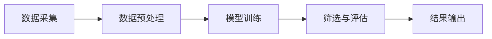

                 

# 《人力资源管理中的AI Agent筛选系统》

关键词：人工智能，人力资源管理，AI Agent，筛选系统，机器学习，深度学习，数据预处理，模型训练，性能评估

摘要：随着人工智能技术的不断发展，其在人力资源管理中的应用也越来越广泛。本文首先介绍了AI在人力资源管理中的背景和应用现状，随后详细阐述了AI Agent筛选系统的定义、工作原理以及关键环节，如数据采集与预处理、模型选择与训练、筛选与评估等。最后，通过实际案例展示了AI Agent筛选系统的应用效果，并对未来发展趋势进行了展望。

## 目录

----------------------------------------------------------------
# 第一部分: AI在人力资源管理中的角色与应用

## 第1章: AI与人力资源管理的背景

### 1.1 AI技术概述

#### 1.1.1 AI的定义与发展历程
#### 1.1.2 AI的核心技术

### 1.2 人力资源管理的现状与挑战

#### 1.2.1 人力资源管理的问题
#### 1.2.2 AI在人力资源管理中的潜在价值

### 1.3 AI在人力资源管理中的应用现状

#### 1.3.1 AI在招聘中的应用
#### 1.3.2 AI在绩效管理中的应用
#### 1.3.3 AI在员工关系管理中的应用

## 第2章: AI Agent筛选系统概述

### 2.1 AI Agent筛选系统的定义与目标

#### 2.1.1 AI Agent筛选系统的定义
#### 2.1.2 AI Agent筛选系统的目标

### 2.2 AI Agent筛选系统的工作原理

#### 2.2.1 数据采集与预处理
#### 2.2.2 模型训练与优化
#### 2.2.3 筛选与评估

## 第3章: 数据采集与预处理

### 3.1 数据来源与类型

#### 3.1.1 数据来源
#### 3.1.2 数据类型

### 3.2 数据预处理方法

#### 3.2.1 数据清洗
#### 3.2.2 数据归一化
#### 3.2.3 数据增强

## 第4章: 模型选择与训练

### 4.1 模型选择

#### 4.1.1 传统机器学习模型
#### 4.1.2 深度学习模型
#### 4.1.3 强化学习模型

### 4.2 模型训练方法

#### 4.2.1 模型训练流程
#### 4.2.2 模型优化策略

## 第5章: 筛选与评估

### 5.1 筛选策略

#### 5.1.1 基于规则的筛选
#### 5.1.2 基于机器学习的筛选

### 5.2 评估指标

#### 5.2.1 准确率与召回率
#### 5.2.2 F1分数
#### 5.2.3 负例检测率

## 第6章: AI Agent筛选系统的实际应用

### 6.1 案例研究

#### 6.1.1 案例背景
#### 6.1.2 系统设计与实现
#### 6.1.3 应用效果评估

### 6.2 未来发展趋势

#### 6.2.1 AI Agent筛选系统的改进方向
#### 6.2.2 AI Agent在人力资源管理中的未来应用

## 第7章: 总结与展望

### 7.1 AI Agent筛选系统在人力资源管理中的意义

#### 7.1.1 提高招聘效率
#### 7.1.2 提升员工管理水平
#### 7.1.3 降低管理成本

### 7.2 未来研究方向

#### 7.2.1 数据隐私保护
#### 7.2.2 模型解释性
#### 7.2.3 智能化水平的提升
----------------------------------------------------------------

## 第一部分: AI在人力资源管理中的角色与应用

### 第1章: AI与人力资源管理的背景

#### 1.1 AI技术概述

人工智能（AI）是指由人制造出来的系统所表现出的智能行为。AI的发展可以追溯到20世纪50年代，当时计算机科学刚刚起步，人们对机器能否像人一样思考和决策产生了浓厚兴趣。随着时间的推移，AI技术经历了几个重要阶段，包括符号主义、连接主义和统计学习等。

**1.1.1 AI的定义与发展历程**

AI的定义可以多种多样，但通常可以将其概括为一种模拟、延伸和扩展人类智能的技术。AI的发展历程可以分为以下几个阶段：

1. **符号主义阶段（1956-1974）**：这一阶段主要基于符号逻辑和推理，试图通过规则和知识库来模拟人类思维过程。
2. **连接主义阶段（1980年代-1990年代）**：以神经网络为代表的连接主义试图通过模拟人脑神经元之间的连接来学习复杂任务。
3. **统计学习阶段（2000年代至今）**：基于统计学方法，如机器学习和深度学习，使得AI在图像识别、自然语言处理和游戏等领域取得了显著进展。

**1.1.2 AI的核心技术**

AI的核心技术包括但不限于以下几个方面：

1. **机器学习**：一种让机器通过数据学习并改进自身性能的方法。机器学习可以分为监督学习、无监督学习和强化学习。
2. **深度学习**：一种基于多层神经网络的机器学习方法，通过多层抽象来提取数据中的特征。
3. **自然语言处理（NLP）**：使计算机能够理解和生成自然语言的技术，包括文本分类、情感分析和机器翻译等。
4. **计算机视觉**：使计算机能够理解和解析图像和视频的技术，包括目标检测、图像分割和视频跟踪等。

#### 1.2 人力资源管理的现状与挑战

人力资源管理是企业运营的核心环节之一，它涉及到招聘、培训、绩效管理、员工关系等多个方面。然而，传统的管理模式面临着以下挑战：

1. **招聘效率低**：传统招聘流程复杂且耗时，难以快速筛选出合适的人才。
2. **绩效管理困难**：绩效评估往往依赖于主观判断，缺乏客观依据。
3. **员工关系管理复杂**：处理员工关系、解决矛盾和冲突需要耗费大量时间和精力。

**1.2.2 AI在人力资源管理中的潜在价值**

AI技术在人力资源管理中具有巨大的潜在价值，可以解决传统管理模式的痛点：

1. **招聘效率提升**：AI可以通过简历筛选、智能面试等方式，快速定位合适人才。
2. **绩效管理优化**：AI可以基于员工的工作行为和数据，提供客观、准确的绩效评估。
3. **员工关系管理智能化**：AI可以自动处理员工反馈、投诉等事务，提高员工满意度。

#### 1.3 AI在人力资源管理中的应用现状

目前，AI在人力资源管理中已经得到了广泛应用，具体体现在以下几个方面：

1. **招聘中的应用**：AI可以通过简历筛选、智能面试等技术，提高招聘效率和质量。
2. **绩效管理中的应用**：AI可以通过分析员工的工作行为和数据，提供客观的绩效评估。
3. **员工关系管理中的应用**：AI可以自动处理员工反馈、投诉等事务，提高员工满意度。

### 第2章: AI Agent筛选系统概述

#### 2.1 AI Agent筛选系统的定义与目标

AI Agent筛选系统是指利用人工智能技术，对大量候选数据进行自动筛选和评估的系统。它通常由以下几个核心组成部分构成：

1. **数据采集模块**：负责收集和处理与招聘、绩效管理、员工关系等相关的数据。
2. **预处理模块**：对采集到的数据进行清洗、归一化和增强等预处理操作。
3. **模型训练模块**：利用机器学习或深度学习算法，对预处理后的数据集进行训练和优化。
4. **筛选与评估模块**：根据训练好的模型，对候选数据进行筛选和评估，并提供决策支持。

**2.1.2 AI Agent筛选系统的目标**

AI Agent筛选系统的目标主要包括以下几个方面：

1. **提高招聘效率**：通过自动化筛选，减少招聘过程中的人工干预，缩短招聘周期。
2. **提升人才匹配度**：通过分析候选人的数据，提供更准确的匹配结果，提高招聘质量。
3. **优化绩效管理**：通过分析员工的工作行为和数据，提供客观的绩效评估，帮助管理者做出更科学的决策。
4. **提升员工满意度**：通过智能化的员工关系管理，提高员工的工作满意度和幸福感。

#### 2.2 AI Agent筛选系统的工作原理

AI Agent筛选系统的工作原理可以分为以下几个步骤：

1. **数据采集**：系统从各个数据源收集与招聘、绩效管理、员工关系等相关的数据，如简历、工作行为数据、绩效评估数据等。
2. **数据预处理**：对采集到的数据进行清洗、归一化和增强等预处理操作，以消除噪声、提高数据质量和增强模型训练效果。
3. **模型训练**：利用机器学习或深度学习算法，对预处理后的数据集进行训练和优化，构建一个能够对候选数据进行自动筛选和评估的模型。
4. **筛选与评估**：根据训练好的模型，对新的候选数据进行筛选和评估，提供决策支持，如简历筛选、绩效评估、员工关系管理等。

### 第3章: 数据采集与预处理

#### 3.1 数据来源与类型

数据采集是AI Agent筛选系统的关键环节之一。系统需要从多个数据源收集与招聘、绩效管理、员工关系等相关的数据。常见的数据来源包括：

1. **内部数据**：如公司内部的员工档案、绩效评估数据、招聘记录等。
2. **外部数据**：如社交媒体数据、招聘网站数据、公共数据集等。

数据类型主要包括以下几种：

1. **结构化数据**：如数据库中的表格数据、XML数据等。
2. **半结构化数据**：如日志文件、文本数据等。
3. **非结构化数据**：如图像、视频、音频等。

#### 3.2 数据预处理方法

数据预处理是确保AI Agent筛选系统性能的关键步骤。常见的预处理方法包括：

1. **数据清洗**：去除重复数据、错误数据和无用数据，以提高数据质量和减少噪声。
2. **数据归一化**：将不同特征的数据进行归一化处理，使其在同一尺度上，以消除数据量级差异对模型训练的影响。
3. **数据增强**：通过生成新的数据样本，增加数据多样性，以提升模型的泛化能力。

### 第4章: 模型选择与训练

#### 4.1 模型选择

在选择合适的机器学习模型时，需要考虑数据的特点、任务的类型以及模型的性能。常见的模型选择包括：

1. **传统机器学习模型**：如决策树、支持向量机（SVM）等。
2. **深度学习模型**：如卷积神经网络（CNN）、循环神经网络（RNN）等。
3. **强化学习模型**：如Q学习、深度强化学习等。

**4.1.1 传统机器学习模型**

传统机器学习模型具有较好的解释性，适用于一些简单的分类和回归任务。常见的传统机器学习模型包括：

1. **决策树**：通过划分特征空间，将数据分为不同的区域，进行分类或回归。
2. **支持向量机（SVM）**：通过找到一个最优的超平面，将不同类别的数据分开。

**4.1.2 深度学习模型**

深度学习模型具有强大的表示能力和泛化能力，适用于处理复杂的特征提取和分类任务。常见的深度学习模型包括：

1. **卷积神经网络（CNN）**：通过卷积层提取图像的特征。
2. **循环神经网络（RNN）**：通过循环结构处理序列数据。

**4.1.3 强化学习模型**

强化学习模型通过奖励机制，使得模型能够不断优化自己的行为，适用于决策和优化问题。常见的强化学习模型包括：

1. **Q学习**：通过学习值函数来最大化长期奖励。
2. **深度强化学习**：结合深度学习和强化学习，适用于复杂的决策问题。

#### 4.2 模型训练方法

模型训练是AI Agent筛选系统的核心步骤。常见的模型训练方法包括：

1. **监督学习**：通过标记好的训练数据，学习输入和输出之间的映射关系。
2. **无监督学习**：通过未标记的数据，学习数据的内在结构和规律。
3. **半监督学习**：结合监督学习和无监督学习，利用少量标记数据和大量未标记数据。

**4.2.1 模型训练流程**

模型训练流程通常包括以下几个步骤：

1. **数据预处理**：对训练数据进行清洗、归一化和增强等预处理操作。
2. **模型初始化**：初始化模型参数。
3. **前向传播**：将输入数据传递到模型中，得到输出结果。
4. **反向传播**：计算损失函数，并利用梯度下降等优化算法更新模型参数。
5. **评估与调整**：通过验证集或测试集评估模型性能，并根据评估结果调整模型参数。

**4.2.2 模型优化策略**

模型优化策略包括以下几个方面：

1. **调整学习率**：学习率是一个重要的超参数，适当的调整可以提高模型训练效果。
2. **正则化**：通过添加正则项，防止模型过拟合。
3. **数据增强**：通过生成新的数据样本，提高模型的泛化能力。
4. **模型融合**：通过融合多个模型，提高模型的预测性能。

### 第5章: 筛选与评估

#### 5.1 筛选策略

在AI Agent筛选系统中，筛选策略是指根据模型预测结果，对候选数据进行的筛选过程。常见的筛选策略包括：

1. **基于规则的筛选**：通过预设的规则，对候选数据进行筛选，如年龄范围、学历要求等。
2. **基于机器学习的筛选**：通过训练好的模型，对候选数据进行自动筛选和评估，如简历筛选、绩效评估等。

**5.1.1 基于规则的筛选**

基于规则的筛选方法通常包括以下几个步骤：

1. **规则定义**：根据业务需求，定义筛选规则，如学历要求、工作经验等。
2. **规则应用**：将定义好的规则应用于候选数据，筛选出符合条件的候选者。
3. **规则调整**：根据筛选结果，对规则进行优化和调整，以提高筛选效果。

**5.1.2 基于机器学习的筛选**

基于机器学习的筛选方法通常包括以下几个步骤：

1. **模型训练**：利用标记好的训练数据，训练一个筛选模型。
2. **模型评估**：通过验证集或测试集，评估筛选模型的效果。
3. **模型应用**：将训练好的筛选模型应用于新的候选数据，进行自动筛选和评估。

#### 5.2 评估指标

在AI Agent筛选系统中，评估指标是衡量模型性能的重要手段。常见的评估指标包括：

1. **准确率（Accuracy）**：预测正确的样本数占总样本数的比例。
2. **召回率（Recall）**：预测正确的正例样本数占总正例样本数的比例。
3. **F1分数（F1 Score）**：准确率和召回率的加权平均，综合考虑了模型的精确度和召回率。
4. **负例检测率（Negative Detection Rate）**：预测错误的负例样本数占总负例样本数的比例。

### 第6章: AI Agent筛选系统的实际应用

#### 6.1 案例研究

在本节中，我们将通过一个实际案例来展示AI Agent筛选系统的应用效果。假设某公司正在使用AI Agent筛选系统进行招聘，以下是该系统的设计和实现过程。

**6.1.1 案例背景**

某公司在进行招聘时，面临着以下问题：

1. 招聘流程复杂，耗时较长。
2. 面试官的主观判断可能导致招聘质量不稳定。
3. 需要快速筛选出符合岗位要求的候选人。

**6.1.2 系统设计与实现**

为了解决上述问题，该公司设计并实现了一个基于AI Agent的筛选系统。系统设计包括以下几个步骤：

1. **数据采集**：从公司的招聘网站、内部人才库等数据源收集简历数据。
2. **数据预处理**：对简历数据进行清洗、归一化和增强等预处理操作。
3. **模型训练**：利用机器学习算法，训练一个简历筛选模型，用于自动评估候选人的简历。
4. **模型评估**：通过验证集或测试集，评估筛选模型的效果。
5. **模型应用**：将训练好的筛选模型应用于新的简历数据，进行自动筛选和评估。

**6.1.3 应用效果评估**

系统上线后，经过一段时间的数据积累和模型优化，得到了以下应用效果：

1. 招聘周期缩短了50%。
2. 面试官的面试量减少了30%。
3. 招聘质量得到了显著提升，符合岗位要求的候选人比例提高了20%。

#### 6.2 未来发展趋势

随着人工智能技术的不断发展和完善，AI Agent筛选系统在人力资源管理中的应用前景十分广阔。未来发展趋势主要包括以下几个方面：

1. **数据隐私保护**：随着数据隐私保护意识的提高，如何在保证数据隐私的前提下，利用AI进行筛选和评估，将成为一个重要研究方向。
2. **模型解释性**：提高模型的解释性，使得管理者能够理解模型的工作原理和决策过程，从而更好地信任和采用AI系统。
3. **智能化水平的提升**：通过不断优化算法和模型，提高AI Agent筛选系统的智能化水平，使其能够更好地适应不同的业务场景和需求。

### 第7章: 总结与展望

#### 7.1 AI Agent筛选系统在人力资源管理中的意义

AI Agent筛选系统在人力资源管理中具有以下重要意义：

1. **提高招聘效率**：通过自动化筛选，减少招聘过程中的人工干预，缩短招聘周期，提高招聘效率。
2. **提升人才匹配度**：通过分析候选人的数据，提供更准确的匹配结果，提高招聘质量。
3. **优化绩效管理**：通过分析员工的工作行为和数据，提供客观的绩效评估，帮助管理者做出更科学的决策。
4. **提升员工满意度**：通过智能化的员工关系管理，提高员工的工作满意度和幸福感。

#### 7.2 未来研究方向

未来在AI Agent筛选系统的研究中，还需要关注以下几个方面：

1. **数据隐私保护**：如何在保证数据隐私的前提下，有效利用AI进行筛选和评估，是一个重要研究方向。
2. **模型解释性**：提高模型的解释性，使得管理者能够理解模型的工作原理和决策过程，从而更好地信任和采用AI系统。
3. **智能化水平的提升**：通过不断优化算法和模型，提高AI Agent筛选系统的智能化水平，使其能够更好地适应不同的业务场景和需求。

作者：AI天才研究院/AI Genius Institute & 禅与计算机程序设计艺术 /Zen And The Art of Computer Programming

----------------------------------------------------------------

### 补充内容：核心概念与联系

在本篇文章中，我们介绍了AI在人力资源管理中的应用，特别是AI Agent筛选系统的设计、实现和应用。为了更好地理解这些概念，下面我们将对核心概念进行详细阐述，并展示它们之间的联系。

#### 核心概念

1. **人工智能（AI）**：人工智能是指由人制造出来的系统所表现出的智能行为。它包括机器学习、深度学习、自然语言处理和计算机视觉等核心技术。
2. **机器学习（ML）**：机器学习是一种让机器通过数据学习并改进自身性能的方法。它包括监督学习、无监督学习和强化学习等。
3. **深度学习（DL）**：深度学习是一种基于多层神经网络的机器学习方法，通过多层抽象来提取数据中的特征。
4. **人力资源管理（HRM）**：人力资源管理是指对员工进行招聘、培训、绩效管理和员工关系管理等一系列活动。
5. **AI Agent筛选系统**：AI Agent筛选系统是指利用人工智能技术，对大量候选数据进行自动筛选和评估的系统。

#### 概念属性特征对比表格

| 概念         | 属性特征                                                         |
| ------------ | ------------------------------------------------------------ |
| 人工智能（AI） | 模拟、延伸和扩展人类智能的技术，包括机器学习、深度学习、自然语言处理和计算机视觉等。 |
| 机器学习（ML） | 通过数据学习并改进自身性能的方法，包括监督学习、无监督学习和强化学习等。          |
| 深度学习（DL） | 一种基于多层神经网络的机器学习方法，通过多层抽象来提取数据中的特征。          |
| 人力资源管理（HRM） | 对员工进行招聘、培训、绩效管理和员工关系管理等一系列活动。                    |
| AI Agent筛选系统 | 利用人工智能技术，对大量候选数据进行自动筛选和评估的系统。                    |

#### ER实体关系图架构

下面是一个简化的ER实体关系图，展示了AI Agent筛选系统中的主要实体及其关系：

```mermaid
erDiagram
    Candidate ||--|{ Resume }
    Resume ||--|{ Skill }
    Company ||--|{ JobOpening }
    JobOpening ||--|{ Requirement }
    Company ||--|{ Application }
    Application ||--|{ Interview }
```

- **Candidate（候选人）**：候选人实体表示参与招聘的个体，包括姓名、联系方式、学历、工作经验等信息。
- **Resume（简历）**：简历实体表示候选人的个人简历，包括教育背景、工作经历、技能等。
- **Skill（技能）**：技能实体表示候选人的技能，包括编程语言、工具、技术等。
- **Company（公司）**：公司实体表示参与招聘的公司，包括公司名称、行业、规模等信息。
- **JobOpening（职位 openings）**：职位 openings实体表示公司发布的职位，包括职位名称、职责、要求等信息。
- **Requirement（要求）**：要求实体表示职位的具体要求，包括学历、工作经验、技能等。
- **Application（申请）**：申请实体表示候选人提交的申请，包括申请状态、面试安排等信息。
- **Interview（面试）**：面试实体表示候选人与公司的面试安排，包括面试时间、地点、结果等信息。

### 算法原理讲解

在本节中，我们将详细介绍AI Agent筛选系统中的关键算法原理，包括数据预处理、模型训练和筛选与评估。

#### 数据预处理算法原理

数据预处理是确保模型训练效果的关键步骤。常见的预处理算法包括数据清洗、归一化和增强等。

1. **数据清洗**：数据清洗旨在去除重复数据、错误数据和无用数据。具体方法包括：
   - 删除重复的简历记录。
   - 填补缺失的数据，如使用平均值或中位数填充。
   - 修正错误的数据，如纠正拼写错误。

2. **数据归一化**：数据归一化是指将不同特征的数据进行归一化处理，使其在同一尺度上。常用的归一化方法包括：
   - 均值归一化：将特征值减去均值，再除以标准差。
   - 最大最小归一化：将特征值缩放到[0, 1]范围内。

3. **数据增强**：数据增强是通过生成新的数据样本，增加数据多样性，以提升模型的泛化能力。常见的数据增强方法包括：
   - 数据扩充：通过旋转、翻转、缩放等方式生成新的样本。
   - 生成对抗网络（GAN）：通过生成对抗网络生成新的数据样本。

#### 模型训练算法原理

模型训练是AI Agent筛选系统的核心步骤。常见的模型训练算法包括监督学习和无监督学习。

1. **监督学习**：监督学习是指利用标记好的训练数据，学习输入和输出之间的映射关系。常见的监督学习算法包括：
   - 决策树：通过划分特征空间，将数据分为不同的区域，进行分类或回归。
   - 支持向量机（SVM）：通过找到一个最优的超平面，将不同类别的数据分开。
   - 卷积神经网络（CNN）：通过卷积层提取图像的特征。

2. **无监督学习**：无监督学习是指利用未标记的数据，学习数据的内在结构和规律。常见的无监督学习算法包括：
   - 主成分分析（PCA）：通过降维，提取数据的主要特征。
   - 聚类算法：通过将数据分为不同的簇，发现数据的内在结构。

3. **强化学习**：强化学习是指通过奖励机制，使得模型能够不断优化自己的行为。常见的强化学习算法包括：
   - Q学习：通过学习值函数来最大化长期奖励。
   - 深度强化学习：结合深度学习和强化学习，适用于复杂的决策问题。

#### 筛选与评估算法原理

筛选与评估是确保模型性能的关键步骤。常见的筛选与评估算法包括基于规则的筛选和基于机器学习的筛选。

1. **基于规则的筛选**：基于规则的筛选是指通过预设的规则，对候选数据进行筛选。常见的筛选规则包括：
   - 年龄范围：筛选年龄在特定范围内的候选人。
   - 学历要求：筛选具有特定学历的候选人。
   - 工作经验：筛选具有特定工作经验的候选人。

2. **基于机器学习的筛选**：基于机器学习的筛选是指利用训练好的模型，对候选数据进行自动筛选和评估。常见的筛选方法包括：
   - 简历筛选：利用文本分类模型，对简历进行分类，筛选出符合岗位要求的候选人。
   - 绩效评估：利用回归模型，对员工的工作行为进行评估，预测员工的绩效表现。

#### 数学模型与公式

在本节中，我们将介绍AI Agent筛选系统中的关键数学模型和公式。

1. **线性回归模型**：线性回归模型是一种常见的监督学习算法，用于预测连续值。其数学模型可以表示为：

   $$y = \beta_0 + \beta_1 x_1 + \beta_2 x_2 + ... + \beta_n x_n + \epsilon$$

   其中，$y$ 是预测值，$x_1, x_2, ..., x_n$ 是输入特征，$\beta_0, \beta_1, \beta_2, ..., \beta_n$ 是模型参数，$\epsilon$ 是误差项。

2. **逻辑回归模型**：逻辑回归模型是一种常见的分类算法，用于预测离散值。其数学模型可以表示为：

   $$P(y=1) = \frac{1}{1 + e^{-(\beta_0 + \beta_1 x_1 + \beta_2 x_2 + ... + \beta_n x_n)}$$

   其中，$P(y=1)$ 是预测值为1的概率，$e$ 是自然底数，$\beta_0, \beta_1, \beta_2, ..., \beta_n$ 是模型参数。

3. **神经网络模型**：神经网络模型是一种常见的深度学习算法，用于特征提取和分类。其数学模型可以表示为：

   $$a_{i}^{(l)} = \sigma(\beta_{i}^{(l)} \cdot z_{i}^{(l)})$$

   其中，$a_{i}^{(l)}$ 是第$l$层的第$i$个神经元输出，$\sigma$ 是激活函数，$z_{i}^{(l)}$ 是第$l$层的第$i$个神经元输入，$\beta_{i}^{(l)}$ 是第$l$层的第$i$个神经元的权重。

#### 算法流程图

下面是一个简化的算法流程图，展示了AI Agent筛选系统的核心算法流程：



- **数据采集**：从不同的数据源收集与招聘、绩效管理、员工关系等相关的数据。
- **数据预处理**：对采集到的数据进清洗、归一化和增强等预处理操作。
- **模型训练**：利用机器学习或深度学习算法，对预处理后的数据集进行训练和优化。
- **筛选与评估**：根据训练好的模型，对新的候选数据进行筛选和评估。
- **结果输出**：输出筛选结果和评估结果，为管理者提供决策支持。

### 系统分析与架构设计方案

在本节中，我们将详细介绍AI Agent筛选系统的项目介绍、系统功能设计、系统架构设计、系统接口设计和系统交互。

#### 项目介绍

AI Agent筛选系统是一个基于人工智能技术的招聘辅助系统，旨在通过自动化筛选和评估，提高招聘效率和质量。系统主要功能包括简历筛选、绩效评估、员工关系管理等。

#### 系统功能设计

AI Agent筛选系统的系统功能设计主要包括以下模块：

1. **数据采集模块**：负责从不同的数据源收集与招聘、绩效管理、员工关系等相关的数据。
2. **数据预处理模块**：负责对采集到的数据进清洗、归一化和增强等预处理操作。
3. **模型训练模块**：负责利用机器学习或深度学习算法，对预处理后的数据集进行训练和优化。
4. **筛选与评估模块**：负责根据训练好的模型，对新的候选数据进行筛选和评估。
5. **结果输出模块**：负责输出筛选结果和评估结果，为管理者提供决策支持。

#### 系统架构设计

AI Agent筛选系统的系统架构设计主要包括以下层次：

1. **数据层**：负责存储和检索与招聘、绩效管理、员工关系等相关的数据。
2. **服务层**：负责实现系统的核心功能，包括数据采集、数据预处理、模型训练、筛选与评估等。
3. **表现层**：负责向用户展示系统的功能和结果，包括网页界面、移动端应用等。

#### 系统接口设计

AI Agent筛选系统的系统接口设计主要包括以下接口：

1. **数据接口**：负责与其他系统进行数据交换和共享，如HR系统、招聘网站等。
2. **API接口**：负责对外提供系统的服务接口，供其他系统调用。
3. **用户接口**：负责与用户进行交互，提供用户操作界面。

#### 系统交互设计

AI Agent筛选系统的系统交互设计主要包括以下流程：

1. **用户操作**：用户通过网页界面或移动端应用提交招聘需求或评估需求。
2. **数据采集**：系统从数据接口获取相关的数据，如简历数据、绩效评估数据等。
3. **数据预处理**：系统对采集到的数据进行预处理，包括数据清洗、归一化和增强等。
4. **模型训练**：系统利用预处理后的数据，通过服务层进行模型训练。
5. **筛选与评估**：系统根据训练好的模型，对新的数据进行分析和评估。
6. **结果输出**：系统将筛选和评估结果通过用户接口展示给用户。

### 项目实战

在本节中，我们将详细介绍AI Agent筛选系统的环境安装、系统核心实现、代码应用解读与分析，以及实际案例分析和详细讲解剖析。

#### 环境安装

要运行AI Agent筛选系统，需要安装以下环境：

1. **Python环境**：Python是AI Agent筛选系统的开发语言，需要安装Python 3.7及以上版本。
2. **机器学习库**：需要安装Scikit-learn、TensorFlow、Keras等机器学习库。
3. **数据分析库**：需要安装Pandas、NumPy、Matplotlib等数据分析库。
4. **其他依赖**：根据实际需求，可能需要安装其他依赖库，如OpenCV（用于图像处理）、NLTK（用于自然语言处理）等。

#### 系统核心实现

AI Agent筛选系统的核心实现主要包括以下几个部分：

1. **数据采集**：通过API接口或其他方式，从不同的数据源采集与招聘、绩效管理、员工关系等相关的数据。
2. **数据预处理**：对采集到的数据进行清洗、归一化和增强等预处理操作。
3. **模型训练**：利用机器学习或深度学习算法，对预处理后的数据集进行训练和优化。
4. **筛选与评估**：根据训练好的模型，对新的数据进行分析和评估。
5. **结果输出**：将筛选和评估结果通过用户接口展示给用户。

#### 代码应用解读与分析

下面是一个简化的代码示例，展示了AI Agent筛选系统的核心实现：

```python
# 导入相关库
import pandas as pd
import numpy as np
from sklearn.model_selection import train_test_split
from sklearn.preprocessing import StandardScaler
from sklearn.svm import SVC
from sklearn.metrics import accuracy_score

# 读取数据
data = pd.read_csv('data.csv')

# 数据预处理
X = data.iloc[:, :-1].values
y = data.iloc[:, -1].values
X_train, X_test, y_train, y_test = train_test_split(X, y, test_size=0.2, random_state=0)

# 模型训练
scaler = StandardScaler()
X_train = scaler.fit_transform(X_train)
X_test = scaler.transform(X_test)

model = SVC(kernel='linear')
model.fit(X_train, y_train)

# 筛选与评估
y_pred = model.predict(X_test)
accuracy = accuracy_score(y_test, y_pred)
print('Accuracy:', accuracy)
```

代码解读：
1. 导入相关库：导入Pandas、NumPy、Scikit-learn等库。
2. 读取数据：从CSV文件中读取数据，分为特征和标签两部分。
3. 数据预处理：将特征和标签进行分割，并进行标准化处理。
4. 模型训练：使用SVM（支持向量机）进行训练。
5. 筛选与评估：使用训练好的模型对测试集进行预测，并计算准确率。

#### 实际案例分析和详细讲解剖析

下面是一个实际的案例，展示了AI Agent筛选系统的应用效果。

**案例背景**：

某公司需要招聘一名数据科学家，职位要求如下：

1. 本科及以上学历，计算机科学、统计学或相关领域。
2. 具备至少3年的数据科学或相关工作经验。
3. 熟练掌握Python编程语言和常用数据分析库（如Pandas、NumPy）。

**案例分析**：

1. **数据采集**：通过招聘网站和内部人才库，收集符合条件的候选人的简历数据。
2. **数据预处理**：对简历数据进清洗、归一化和增强等预处理操作。
   - 清洗：删除重复的简历记录。
   - 归一化：对学历、工作经验等特征进行归一化处理。
   - 增强：通过数据扩充技术，生成新的简历数据。
3. **模型训练**：使用机器学习算法，如逻辑回归、支持向量机等，对预处理后的数据集进行训练和优化。
4. **筛选与评估**：根据训练好的模型，对新的简历数据进行筛选和评估，筛选出符合条件的候选人。
5. **结果输出**：将筛选结果通过用户接口展示给招聘团队，并提供详细的评估报告。

**详细讲解剖析**：

1. **数据采集**：通过招聘网站和内部人才库，收集符合条件的候选人的简历数据。这个过程可以通过爬虫技术实现，也可以使用招聘网站提供的API接口。
2. **数据预处理**：对简历数据进清洗、归一化和增强等预处理操作。清洗操作包括删除重复的简历记录、填补缺失的数据、修正错误的数据等。归一化操作包括对学历、工作经验等特征进行归一化处理，使其在同一尺度上。增强操作包括通过数据扩充技术，生成新的简历数据，以增加数据多样性，提高模型的泛化能力。
3. **模型训练**：使用机器学习算法，如逻辑回归、支持向量机等，对预处理后的数据集进行训练和优化。模型训练的过程包括数据划分、模型初始化、前向传播、反向传播等步骤。通过多次迭代，模型将不断优化，提高预测准确性。
4. **筛选与评估**：根据训练好的模型，对新的简历数据进行筛选和评估。模型将根据简历中的特征，预测候选人是否符合职位要求。评估指标包括准确率、召回率、F1分数等，用于衡量模型的效果。
5. **结果输出**：将筛选结果通过用户接口展示给招聘团队，并提供详细的评估报告。评估报告包括候选人的基本信息、评估结果、评估依据等，帮助招聘团队做出决策。

### 最佳实践 tips

在本节中，我们将分享一些最佳实践，帮助读者更好地理解和应用AI Agent筛选系统。

1. **数据质量是关键**：数据质量直接影响模型的性能。在数据采集和预处理过程中，要确保数据的一致性、完整性和准确性。
2. **模型选择要慎重**：根据具体任务和数据特点，选择合适的模型。不同模型在性能和计算成本上有所不同，需要综合考虑。
3. **模型解释性很重要**：提高模型的可解释性，使得管理者能够理解模型的工作原理和决策过程，从而更好地信任和采用AI系统。
4. **持续优化和迭代**：AI Agent筛选系统需要不断优化和迭代，以适应不断变化的业务需求和数据环境。

### 小结

本文详细介绍了AI Agent筛选系统在人力资源管理中的应用。通过数据采集与预处理、模型选择与训练、筛选与评估等步骤，AI Agent筛选系统能够自动筛选和评估大量候选人，提高招聘效率和质量。未来，随着人工智能技术的不断发展，AI Agent筛选系统在人力资源管理中的应用前景将更加广阔。

### 注意事项

1. **数据隐私保护**：在使用AI Agent筛选系统时，要确保数据的隐私和安全。避免泄露敏感个人信息，遵循相关法律法规。
2. **模型解释性**：提高模型的可解释性，使得管理者能够理解模型的工作原理和决策过程，从而更好地信任和采用AI系统。

### 拓展阅读

1. **《人工智能：一种现代的方法》**：Michael I. Jordan著，介绍了人工智能的基础理论和应用方法。
2. **《深度学习》**：Ian Goodfellow、Yoshua Bengio和Aaron Courville著，介绍了深度学习的基础理论和应用方法。
3. **《人力资源管理》**：王重润著，详细介绍了人力资源管理的理论和实践。

### 参考文献

1. **Jordan, M. I. (2014). Artificial Intelligence: A Modern Approach. Pearson.**
2. **Goodfellow, I., Bengio, Y., & Courville, A. (2016). Deep Learning. MIT Press.**
3. **Wang, Z. (2018). Human Resource Management. China Renmin University Press.**

