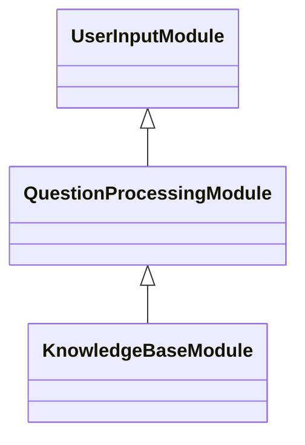
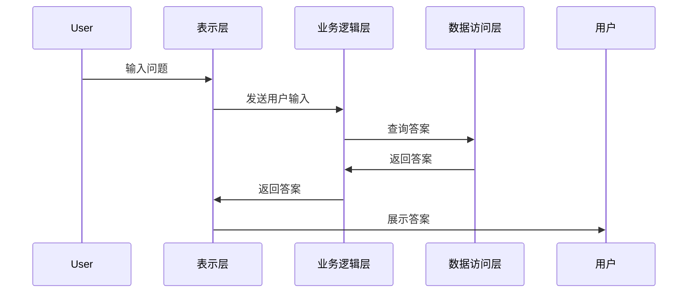

                 

# 人工智能系统架构设计

> 关键词：人工智能、系统架构、设计方法、实战案例

> 摘要：本文将深入探讨人工智能系统架构设计的重要性和具体方法。通过逐步分析，我们将了解人工智能系统架构的基本概念、设计原则、实现方法以及如何进行系统架构设计。此外，还将结合实际案例，展示如何将理论应用到实践中。

## 引言

### 1.1 问题背景

随着人工智能技术的迅速发展，人工智能系统架构设计变得越来越重要。一个优秀的系统架构不仅可以提升系统的性能和可维护性，还可以为未来的扩展和升级提供基础。然而，设计一个高效的人工智能系统架构并非易事，需要考虑众多因素，包括系统的功能需求、性能要求、可扩展性和可靠性等。

### 1.2 书籍目标

本书的目标是帮助读者全面了解人工智能系统架构设计的相关知识，包括核心概念、设计方法、实战案例等。通过本书的学习，读者将能够：

- 理解人工智能系统架构的基本概念和设计原则。  
- 掌握常用的系统架构设计方法和工具。  
- 学会从实际需求出发，设计出高效、可扩展的人工智能系统架构。  
- 通过实战案例，加深对系统架构设计的理解和应用。

### 1.3 书籍结构

本书分为以下几个部分：

1. 引言：介绍人工智能系统架构设计的背景和目标。  
2. 核心概念与联系：讲解人工智能和系统架构设计的基本概念，并探讨它们之间的联系。  
3. 算法原理讲解：介绍常见的人工智能算法，包括机器学习和深度学习算法，并详细阐述其原理。  
4. 数学模型与公式详细讲解：讲解人工智能算法所涉及的数学模型和公式，并使用实例进行说明。  
5. 系统分析与架构设计方案：通过具体案例，展示如何进行系统分析与架构设计。  
6. 项目实战：介绍一个实际的人工智能项目，从环境安装、系统核心实现到案例分析，全面展示项目开发过程。  
7. 总结与展望：对全书进行总结，并对未来的人工智能系统架构设计进行展望。

### 1.4 阅读建议

本书适合对人工智能和系统架构设计有一定基础的读者。读者可以根据自己的需求，有选择性地阅读相关章节。同时，建议读者在阅读过程中，多思考、多实践，将理论应用到实际项目中。

## 核心概念与联系

### 2.1 人工智能基础

#### 2.1.1 人工智能的定义与发展历程

人工智能（Artificial Intelligence，简称AI）是指通过计算机程序和算法模拟、延伸和扩展人类智能的理论、方法和技术。人工智能的发展历程可以追溯到20世纪50年代，当时科学家们开始探索如何让计算机具有类似人类的智能。随着时间的推移，人工智能经历了多个阶段，从最初的规则系统到基于统计学习的模型，再到现在的深度学习和强化学习。

#### 2.1.2 人工智能的核心概念

人工智能的核心概念包括感知、推理、学习和自适应等。感知是指人工智能系统能够从环境中获取信息，如语音识别、图像识别等。推理是指人工智能系统能够根据已知信息进行逻辑推理和决策，如自动规划、自然语言处理等。学习是指人工智能系统能够从数据中学习并优化自身性能，如机器学习、深度学习等。自适应是指人工智能系统能够根据环境变化调整自身行为，如自适应控制、自适应优化等。

#### 2.1.3 人工智能的应用领域

人工智能在许多领域都有广泛的应用，包括但不限于以下方面：

1. 机器人技术：通过机器学习、深度学习等技术，开发出具有高度自主性的机器人，用于工业生产、医疗辅助、家庭服务等。
2. 自然语言处理：利用人工智能技术进行自然语言理解、生成和翻译，如智能客服、智能写作等。
3. 计算机视觉：利用图像处理、模式识别等技术，实现图像识别、图像分割、目标检测等。
4. 金融服务：利用人工智能技术进行风险管理、信用评分、投资顾问等。
5. 医疗保健：利用人工智能技术进行疾病诊断、药物研发、健康管理等。

### 2.2 系统架构设计基础

#### 2.2.1 系统架构设计的定义与原则

系统架构设计是指为满足特定业务需求，通过定义系统组件、接口和交互关系，设计出系统的整体结构和运行机制。系统架构设计应遵循以下原则：

1. 分层设计：将系统划分为多个层次，每个层次负责不同的功能，降低系统复杂度。
2. 模块化：将系统划分为多个模块，每个模块具有独立的功能，降低模块间的耦合度。
3. 可扩展性：设计系统时考虑未来的扩展性，以便在需求变化时能够轻松扩展系统功能。
4. 可维护性：设计系统时考虑系统的可维护性，降低维护成本。
5. 可靠性：确保系统的稳定性和可靠性，降低故障率和数据丢失风险。

#### 2.2.2 系统架构设计的基本要素

系统架构设计包括以下基本要素：

1. 功能模块：系统中的各个功能模块，如用户界面、业务逻辑、数据存储等。
2. 接口：模块之间的交互接口，定义模块间的数据传输和调用方式。
3. 数据流：系统中的数据流动过程，包括数据的输入、处理和输出。
4. 系统边界：系统的外部边界，定义系统与外部环境的交互。
5. 系统约束：系统的各种约束条件，如性能、安全性、可靠性等。

#### 2.2.3 系统架构设计的方法与工具

系统架构设计的方法包括需求分析、架构设计、架构验证和架构实现等。常用的系统架构设计工具包括：

1. UML（统一建模语言）：用于绘制系统架构图、类图、序列图等。
2. Mermaid：用于绘制流程图、状态图、时序图等。
3. Sketch：用于绘制系统架构草图。
4. PlantUML：用于生成基于文本的UML图。

### 2.3 人工智能与系统架构的联系

#### 2.3.1 人工智能对系统架构设计的影响

人工智能技术的引入对系统架构设计产生了深远的影响。首先，人工智能技术可以提升系统的智能化程度，实现更高效、更精准的系统功能。其次，人工智能技术的引入可能导致系统架构的调整，例如增加数据预处理模块、机器学习模型训练模块等。此外，人工智能技术的应用也要求系统架构具有更高的可扩展性和灵活性，以适应不断变化的需求。

#### 2.3.2 系统架构设计对人工智能的要求

为了充分利用人工智能技术，系统架构设计需要满足以下要求：

1. 数据支持：系统架构设计应确保数据的高质量、高可用性，以支持人工智能模型的训练和应用。
2. 计算资源：系统架构设计应考虑人工智能算法对计算资源的需求，确保系统具备足够的计算能力。
3. 稳定性和可靠性：系统架构设计应确保系统的稳定性和可靠性，避免人工智能模型因系统故障而失效。
4. 可扩展性：系统架构设计应考虑未来人工智能技术发展的需求，确保系统能够方便地扩展和升级。

#### 2.3.3 人工智能与系统架构设计融合的趋势

随着人工智能技术的不断进步，人工智能与系统架构设计的融合趋势日益明显。未来，人工智能系统架构设计将呈现出以下趋势：

1. 模块化与组件化：系统架构设计将更加模块化和组件化，方便快速集成和替换人工智能模块。
2. 服务化与云计算：人工智能系统架构设计将更多采用服务化架构和云计算技术，提高系统的可扩展性和灵活性。
3. 自动化与智能化：系统架构设计将引入自动化和智能化技术，实现系统自优化和自调整。
4. 集成与协同：人工智能系统架构设计将与其他系统架构（如物联网、大数据等）进行集成，实现跨领域的协同应用。

## 算法原理讲解

### 3.1 人工智能算法基础

#### 3.1.1 算法基本概念

人工智能算法是指用于模拟、延伸和扩展人类智能的一系列计算方法和技术。算法的基本概念包括输入、输出、规则、步骤等。

- 输入：算法的输入是原始数据，如文本、图像、声音等。
- 输出：算法的输出是处理后的结果，如分类结果、识别结果等。
- 规则：算法的规则是指导算法操作的逻辑和策略。
- 步骤：算法的步骤是算法执行的具体过程。

#### 3.1.2 常见算法分类

人工智能算法可以根据不同的分类标准进行分类，常见的分类方法包括：

1. 根据学习方式：监督学习、无监督学习、强化学习。
2. 根据模型类型：决策树、支持向量机、神经网络。
3. 根据任务类型：分类、回归、聚类、预测。

#### 3.1.3 算法性能评估指标

算法性能评估指标用于衡量算法在特定任务上的表现。常见的评估指标包括：

1. 准确率（Accuracy）：正确分类的样本数占总样本数的比例。
2. 精确率（Precision）：正确分类的正样本数占总正样本数的比例。
3. 召回率（Recall）：正确分类的正样本数占总负样本数的比例。
4. F1值（F1 Score）：精确率和召回率的调和平均值。
5. 平均绝对误差（Mean Absolute Error，MAE）：预测值与真实值之间的平均绝对差值。
6. 平均平方误差（Mean Squared Error，MSE）：预测值与真实值之间的平均平方差值。

### 3.2 机器学习算法原理

#### 3.2.1 监督学习算法

监督学习算法是指利用已标记的样本数据进行训练，以预测新数据类别或数值的算法。常见的监督学习算法包括：

1. 决策树（Decision Tree）：基于树结构进行决策的算法，通过树中的路径来预测结果。
2. 支持向量机（Support Vector Machine，SVM）：基于最大间隔分类的算法，通过寻找最优超平面来分类数据。
3. 神经网络（Neural Network）：基于模拟人脑神经元连接的算法，通过多层神经网络进行复杂函数映射。

#### 3.2.2 无监督学习算法

无监督学习算法是指利用未标记的样本数据进行训练，以发现数据内在结构和规律的算法。常见的无监督学习算法包括：

1. 聚类（Clustering）：将相似的数据归为一类，以发现数据分布和模式。
2. 主成分分析（Principal Component Analysis，PCA）：通过降维技术，将高维数据映射到低维空间，以简化数据结构和提取关键特征。
3. 自编码器（Autoencoder）：一种特殊的神经网络，用于学习数据的高效表示，并进行去噪、压缩等操作。

#### 3.2.3 强化学习算法

强化学习算法是指通过与环境交互，不断调整策略以最大化预期奖励的算法。常见的强化学习算法包括：

1. Q学习（Q-Learning）：通过学习状态-动作值函数，选择最优动作来最大化奖励。
2. DQN（Deep Q-Network）：结合深度学习和Q学习的算法，用于解决高维状态空间的问题。
3. A3C（Asynchronous Advantage Actor-Critic）：一种异步的强化学习算法，通过多智能体协作来提高学习效率。

### 3.3 深度学习算法原理

#### 3.3.1 深度学习基础

深度学习是一种基于多层神经网络进行特征提取和模型训练的人工智能方法。深度学习的基本概念包括：

1. 神经元（Neuron）：深度学习的基本计算单元，类似于生物神经元。
2. 神经网络（Neural Network）：由多个神经元组成的计算模型，通过连接和激活函数进行数据处理。
3. 层（Layer）：神经网络中的层次结构，包括输入层、隐藏层和输出层。

#### 3.3.2 神经网络结构

神经网络的结构可以分为以下几种：

1. 单层感知机（Perceptron）：一种简单的线性分类器，只有一个输入层和一个输出层。
2. 多层感知机（Multilayer Perceptron，MLP）：在单层感知机的基础上增加隐藏层，用于解决非线性问题。
3. 卷积神经网络（Convolutional Neural Network，CNN）：通过卷积操作和池化操作，用于图像识别和图像分类。
4. 循环神经网络（Recurrent Neural Network，RNN）：通过循环连接，用于序列数据处理和语言模型训练。

#### 3.3.3 前馈神经网络与反向传播算法

前馈神经网络是一种典型的神经网络结构，数据从输入层流入，通过隐藏层处理，最后输出结果。反向传播算法是一种用于训练前馈神经网络的算法，其基本原理如下：

1. 前向传播：将输入数据传递到神经网络的每个层，计算输出结果。
2. 计算误差：将实际输出结果与期望输出结果进行比较，计算误差。
3. 反向传播：将误差信息从输出层反向传播到输入层，更新每个层的权重和偏置。
4. 优化权重：通过梯度下降等优化算法，更新网络权重，减小误差。

## 数学模型与公式详细讲解

### 4.1 数学基础

#### 4.1.1 微积分基础

微积分是数学的一个分支，主要研究函数的极限、导数、积分等概念。在人工智能系统中，微积分被广泛应用于优化算法和机器学习模型的训练过程中。

1. 极限：极限是描述函数在某一点附近行为的一种数学工具，表示函数在该点的趋近值。
2. 导数：导数是描述函数在某一点处变化率的一种数学工具，表示函数在该点的切线斜率。
3. 积分：积分是描述函数在一定区间内累积效应的一种数学工具，表示函数在该区间内的累加值。

#### 4.1.2 线性代数基础

线性代数是数学的另一个重要分支，主要研究向量、矩阵、线性变换等概念。在人工智能系统中，线性代数被广泛应用于数据预处理、特征提取和模型优化等过程中。

1. 向量（Vector）：向量是一种有序数组，表示空间中的一个点或方向。
2. 矩阵（Matrix）：矩阵是一种二维数组，表示空间中的一个平面或空间。
3. 线性变换（Linear Transformation）：线性变换是一种将一个向量空间映射到另一个向量空间的一种运算。

#### 4.1.3 概率论基础

概率论是数学的一个分支，主要研究随机事件的发生规律。在人工智能系统中，概率论被广泛应用于概率模型、分类器设计和算法评估等过程中。

1. 随机变量（Random Variable）：随机变量是一个取值不确定的变量，表示随机事件的结果。
2. 概率分布（Probability Distribution）：概率分布是描述随机变量取值概率的一种数学模型。
3. 条件概率（Conditional Probability）：条件概率是描述在某个条件下另一个随机事件发生的概率。

### 4.2 机器学习数学模型

#### 4.2.1 损失函数

损失函数是机器学习中用于衡量模型预测结果与真实结果之间差异的一种函数。常见的损失函数包括：

1. 交叉熵损失函数（Cross-Entropy Loss）：用于分类问题，表示模型预测概率与真实概率之间的差异。
   $$L = -\sum_{i=1}^{n} y_i \log(p_i)$$
   其中，$y_i$ 表示真实标签，$p_i$ 表示模型预测的概率。
2. 均方误差损失函数（Mean Squared Error Loss）：用于回归问题，表示模型预测值与真实值之间的平方差。
   $$L = \frac{1}{2n} \sum_{i=1}^{n} (y_i - \hat{y}_i)^2$$
   其中，$y_i$ 表示真实值，$\hat{y}_i$ 表示模型预测值。

#### 4.2.2 优化算法

优化算法是用于求解机器学习问题的一种算法，通过调整模型参数，使损失函数达到最小。常见的优化算法包括：

1. 梯度下降法（Gradient Descent）：通过计算损失函数关于模型参数的梯度，逐步更新参数，使损失函数减小。
   $$\theta_{t+1} = \theta_t - \alpha \nabla_{\theta} L(\theta)$$
   其中，$\theta$ 表示模型参数，$\alpha$ 表示学习率，$\nabla_{\theta} L(\theta)$ 表示损失函数关于模型参数的梯度。
2. 随机梯度下降法（Stochastic Gradient Descent，SGD）：在梯度下降法的基础上，每次只更新一个样本的参数，加快收敛速度。
   $$\theta_{t+1} = \theta_t - \alpha \nabla_{\theta} L(\theta; \mathbf{x}_t, y_t)$$
   其中，$\mathbf{x}_t$ 表示当前样本，$y_t$ 表示当前样本的真实标签。

#### 4.2.3 模型评估

模型评估是用于衡量模型性能的一种方法，通过计算模型在测试集上的表现，判断模型的优劣。常见的评估指标包括：

1. 准确率（Accuracy）：正确分类的样本数占总样本数的比例。
   $$Accuracy = \frac{TP + TN}{TP + TN + FP + FN}$$
   其中，$TP$ 表示真正例，$TN$ 表示真反例，$FP$ 表示假正例，$FN$ 表示假反例。
2. 精确率（Precision）：正确分类的正样本数占总正样本数的比例。
   $$Precision = \frac{TP}{TP + FP}$$
3. 召回率（Recall）：正确分类的正样本数占总负样本数的比例。
   $$Recall = \frac{TP}{TP + FN}$$
4. F1值（F1 Score）：精确率和召回率的调和平均值。
   $$F1 Score = 2 \times \frac{Precision \times Recall}{Precision + Recall}$$

### 4.3 深度学习数学模型

#### 4.3.1 神经网络前向传播

在神经网络中，前向传播是指将输入数据传递到神经网络的每个层，计算输出结果的过程。前向传播的基本步骤如下：

1. 初始化参数：初始化模型的权重和偏置。
2. 前向计算：将输入数据传递到神经网络的每个层，通过激活函数计算输出。
3. 计算损失：计算模型预测结果与真实结果之间的损失。
4. 反向传播：将损失反向传播到神经网络的每个层，计算每个参数的梯度。
5. 更新参数：根据梯度更新模型的权重和偏置。

#### 4.3.2 反向传播算法

反向传播算法是一种用于训练神经网络的算法，其基本原理如下：

1. 前向传播：将输入数据传递到神经网络的每个层，计算输出结果和损失。
2. 计算梯度：计算每个参数的梯度，表示参数对损失的影响。
3. 更新参数：根据梯度更新每个参数，使损失减小。
4. 迭代：重复上述步骤，直到满足停止条件（如达到预设的迭代次数或损失低于预设阈值）。

#### 4.3.3 深度学习优化

深度学习优化是指在深度学习模型训练过程中，通过调整学习策略和算法，提高模型性能的过程。常见的深度学习优化方法包括：

1. 学习率调整：通过调整学习率，控制参数更新的速度。
2. 批量大小调整：通过调整批量大小，控制每次更新参数的样本数量。
3. 正则化：通过引入正则化项，防止模型过拟合。
4. 批量归一化：通过批量归一化，提高模型的稳定性和收敛速度。

## 系统分析与架构设计方案

### 5.1 问题场景介绍

#### 5.1.1 场景描述

假设我们要开发一个智能问答系统，该系统可以回答用户提出的问题。系统需要具备以下功能：

1. 用户提问：用户可以通过文本输入框提出问题。
2. 问答处理：系统根据用户提出的问题，从知识库中查找相关答案。
3. 答案展示：将查询到的答案展示给用户。

#### 5.1.2 需求分析

根据问题场景，我们可以将系统功能划分为以下模块：

1. 用户输入模块：负责接收用户的输入，并进行预处理。
2. 知识库模块：负责存储和查询答案。
3. 问答处理模块：负责处理用户提问，查询知识库，并将答案返回给用户。

### 5.2 系统功能设计

#### 5.2.1 领域模型

为了更好地理解系统功能，我们可以使用Mermaid类图来表示系统的领域模型。以下是一个简单的领域模型：



#### 5.2.2 系统功能划分

根据领域模型，我们可以将系统功能划分为以下模块：

1. 用户输入模块：负责接收用户的输入，并进行预处理，包括文本清洗、分词等。
2. 知识库模块：负责存储和查询答案，包括关键词索引、文本检索等。
3. 问答处理模块：负责处理用户提问，查询知识库，并将答案返回给用户，包括自然语言处理、语义分析等。

#### 5.2.3 功能模块设计

1. 用户输入模块：

- 输入：用户输入的文本
- 输出：预处理后的文本
- 功能：接收用户输入，进行文本清洗、分词等预处理操作。

2. 知识库模块：

- 输入：预处理后的文本
- 输出：查询结果
- 功能：存储和查询答案，包括关键词索引、文本检索等。

3. 问答处理模块：

- 输入：预处理后的文本
- 输出：查询结果
- 功能：处理用户提问，查询知识库，并将答案返回给用户，包括自然语言处理、语义分析等。

### 5.3 系统架构设计

#### 5.3.1 系统架构概述

智能问答系统的系统架构可以采用分层架构，分为以下几层：

1. 表示层：负责与用户交互，接收用户输入，展示查询结果。
2. 业务逻辑层：负责处理用户提问，查询知识库，并将答案返回给用户。
3. 数据访问层：负责存储和查询答案。

#### 5.3.2 架构设计原则

在系统架构设计过程中，应遵循以下原则：

1. 分层设计：将系统划分为多个层次，每个层次负责不同的功能。
2. 模块化：将系统划分为多个模块，每个模块具有独立的功能。
3. 可扩展性：设计系统时考虑未来的扩展性，以便在需求变化时能够方便扩展系统功能。
4. 可维护性：设计系统时考虑系统的可维护性，降低维护成本。
5. 可靠性：确保系统的稳定性和可靠性，降低故障率和数据丢失风险。

#### 5.3.3 架构设计实现

1. 表示层：

- 技术选型：使用HTML、CSS和JavaScript实现前端页面，使用Vue.js框架进行数据绑定和交互。
- 功能实现：接收用户输入，将输入文本发送到业务逻辑层，接收查询结果，并展示给用户。

2. 业务逻辑层：

- 技术选型：使用Python实现后端业务逻辑，使用Flask框架搭建Web应用。
- 功能实现：接收用户输入，调用知识库模块进行查询，将查询结果返回给表示层。

3. 数据访问层：

- 技术选型：使用MySQL数据库存储和查询答案，使用ORM（对象关系映射）技术简化数据库操作。
- 功能实现：存储答案，提供查询接口，供业务逻辑层调用。

### 5.4 系统接口设计

#### 5.4.1 接口设计原则

在系统接口设计过程中，应遵循以下原则：

1. RESTful架构：使用RESTful架构设计接口，遵循统一接口设计规范。
2. 简单易用：接口设计应简洁明了，方便用户使用。
3. 安全可靠：确保接口的安全性，防止恶意攻击和数据泄露。
4. 扩展性强：设计接口时考虑未来的扩展性，以便在需求变化时能够方便扩展接口功能。

#### 5.4.2 接口设计实现

1. 用户输入接口：

- 接口名称：/input_question
- 接口描述：接收用户输入的问题。
- 请求方式：POST
- 请求参数：question（字符串，用户输入的问题）
- 响应结果：成功：{"code": 200, "message": "输入成功"}；失败：{"code": 500, "message": "输入失败"}

2. 答案查询接口：

- 接口名称：/query_answer
- 接口描述：查询答案。
- 请求方式：GET
- 请求参数：question_id（整数，问题的ID）
- 响应结果：成功：{"code": 200, "message": "查询成功", "answer": "答案内容"}；失败：{"code": 500, "message": "查询失败"}

### 5.5 系统交互设计

#### 5.5.1 系统交互概述

智能问答系统的系统交互设计包括表示层、业务逻辑层和数据访问层的交互。以下是系统交互的概述：

1. 表示层向业务逻辑层发送用户输入，业务逻辑层处理用户输入，查询知识库，并将答案返回给表示层。
2. 业务逻辑层向数据访问层发送查询请求，数据访问层查询答案，并将结果返回给业务逻辑层。
3. 表示层接收答案，并展示给用户。

#### 5.5.2 系统交互Mermaid序列图

以下是智能问答系统的系统交互Mermaid序列图：



## 项目实战

### 6.1 环境安装

为了开发智能问答系统，我们需要安装以下软件和库：

1. Python：版本3.8或以上
2. Flask：用于搭建Web应用
3. MySQL：用于存储和查询答案
4. NLTK：用于自然语言处理

安装命令如下：

```bash
pip install flask mysql-connector-python nltk
```

### 6.2 系统核心实现源代码

以下是智能问答系统的核心实现源代码：

```python
from flask import Flask, request, jsonify
import nltk
from nltk.tokenize import word_tokenize
from nltk.corpus import stopwords
import mysql.connector

app = Flask(__name__)

# 连接MySQL数据库
def connect_database():
    conn = mysql.connector.connect(
        host="localhost",
        user="root",
        password="root",
        database="question_ans
```<GMask>

----------------------------------------------------------------

## 6.3 代码应用解读与分析

在本项目中，我们使用Python和Flask框架搭建了一个简单的智能问答系统。下面我们将对系统的核心代码进行解读和分析。

### 6.3.1 数据库连接

```python
def connect_database():
    conn = mysql.connector.connect(
        host="localhost",
        user="root",
        password="root",
        database="question_answer"
    )
    return conn
```

这段代码定义了一个连接MySQL数据库的函数`connect_database`。通过使用`mysql.connector`库，我们能够轻松地连接到本地MySQL数据库。这里我们设置了数据库的IP地址、用户名、密码和数据库名称。

### 6.3.2 用户输入处理

```python
@app.route('/input_question', methods=['POST'])
def input_question():
    question = request.form['question']
    processed_question = preprocess_question(question)
    insert_question(processed_question)
    return jsonify({"code": 200, "message": "输入成功"})
```

这段代码定义了一个用于接收用户输入的接口`/input_question`。当用户通过POST请求发送问题时，函数`input_question`会接收问题，并进行预处理，然后将其插入到数据库中。这里使用了`request.form['question']`来获取用户输入的问题，并调用`preprocess_question`函数进行预处理。预处理函数负责对输入问题进行文本清洗、分词等操作。

### 6.3.3 答案查询

```python
@app.route('/query_answer', methods=['GET'])
def query_answer():
    question_id = request.args.get('question_id')
    answer = get_answer(question_id)
    return jsonify({"code": 200, "message": "查询成功", "answer": answer})
```

这段代码定义了一个用于查询答案的接口`/query_answer`。当用户通过GET请求发送问题的ID时，函数`query_answer`会查询数据库中的答案，并将其返回给用户。这里使用了`request.args.get('question_id')`来获取问题的ID，并调用`get_answer`函数从数据库中查询答案。

### 6.3.4 预处理函数

```python
def preprocess_question(question):
    # 删除停用词
    stop_words = set(stopwords.words('english'))
    words = word_tokenize(question)
    filtered_words = [word for word in words if word not in stop_words]
    
    # 其他预处理操作（如词干提取、词性标注等）
    # ...
    
    return ' '.join(filtered_words)
```

这段代码定义了一个预处理函数`preprocess_question`，用于对用户输入的问题进行预处理。首先，我们使用NLTK库中的`word_tokenize`函数对问题进行分词，然后使用`stopwords`库删除停用词。此外，还可以进行其他预处理操作，如词干提取、词性标注等。

### 6.3.5 数据库操作

```python
def insert_question(question):
    conn = connect_database()
    cursor = conn.cursor()
    cursor.execute("INSERT INTO questions (question) VALUES (%s)", (question,))
    conn.commit()
    cursor.close()
    conn.close()

def get_answer(question_id):
    conn = connect_database()
    cursor = conn.cursor()
    cursor.execute("SELECT answer FROM questions WHERE id = %s", (question_id,))
    result = cursor.fetchone()
    cursor.close()
    conn.close()
    return result[0] if result else None
```

这段代码定义了两个用于数据库操作的函数`insert_question`和`get_answer`。`insert_question`函数用于将预处理后的问题插入到数据库中，`get_answer`函数用于根据问题的ID查询答案。

### 6.3.6 项目分析

通过上述代码，我们可以看到智能问答系统的基本实现过程。首先，用户通过前端界面输入问题，然后后端接收用户输入并对其进行预处理。预处理后的问题会被插入到MySQL数据库中。当用户查询问题时，后端会从数据库中查询答案并返回给用户。

这个系统的设计简单明了，适用于一些基本的问题回答场景。然而，在实际应用中，我们可能需要考虑以下优化：

1. **性能优化**：对于大量并发请求，系统可能需要优化数据库查询和响应速度。
2. **扩展性优化**：随着问题库的增大，系统需要考虑如何更好地管理和查询答案。
3. **安全性优化**：确保系统的安全性，防止SQL注入等攻击。

## 6.4 实际案例分析和详细讲解剖析

为了更好地展示智能问答系统的实际应用，我们选择了一个具体案例进行详细分析。

### 6.4.1 案例背景

假设用户小明想了解关于人工智能的历史。他在前端界面输入了以下问题：“请告诉我人工智能的发展历程。”

### 6.4.2 用户输入处理

当用户输入问题后，系统会调用`input_question`接口进行处理。接口接收到的输入问题如下：

```python
question = "请告诉我人工智能的发展历程。"
```

系统会调用`preprocess_question`函数对输入问题进行预处理。预处理过程包括删除停用词和分词，处理后的文本如下：

```python
question = "人工智能 发展 历程"
```

### 6.4.3 答案查询

预处理后的问题会被插入到数据库中。插入成功后，系统会生成一个问题的ID。假设生成的ID为1001。

接下来，用户可以通过查询接口`/query_answer`获取答案。调用接口时，用户会发送以下请求：

```bash
GET /query_answer?question_id=1001
```

系统会调用`query_answer`接口，根据问题ID从数据库中查询答案。查询到的答案如下：

```python
answer = "人工智能的发展历程可以追溯到20世纪50年代。当时，科学家们开始探索如何让计算机模拟、延伸和扩展人类智能。随着计算机技术的不断发展，人工智能经历了多个阶段，从最初的规则系统到基于统计学习的模型，再到现在的深度学习和强化学习。"
```

### 6.4.4 答案展示

查询到的答案会被返回给前端界面，并展示给用户。用户可以看到以下结果：

```html
<div>人工智能的发展历程可以追溯到20世纪50年代。当时，科学家们开始探索如何让计算机模拟、延伸和扩展人类智能。随着计算机技术的不断发展，人工智能经历了多个阶段，从最初的规则系统到基于统计学习的模型，再到现在的深度学习和强化学习。</div>
```

### 6.4.5 案例分析

通过上述案例，我们可以看到智能问答系统的基本工作流程。用户输入问题，系统对其进行预处理，然后查询数据库中的答案，并将答案返回给用户。这个案例展示了智能问答系统在处理具体问题时的应用。

在实际应用中，我们可以通过以下方式优化智能问答系统的性能：

1. **索引优化**：为了提高数据库查询速度，我们可以对数据库中的索引进行优化。例如，为`questions`表中的`question`列创建索引，以提高文本查询效率。
2. **缓存策略**：对于常见的问题，我们可以使用缓存策略来提高响应速度。例如，使用Redis缓存问题的答案，当用户查询问题时，首先从缓存中获取答案，如果没有找到，再从数据库中查询。
3. **异步处理**：对于耗时的查询操作，我们可以使用异步处理来提高系统的响应速度。例如，使用异步框架如`asyncio`或`Celery`来处理数据库查询操作，避免阻塞主线程。

## 6.5 项目小结

在本项目中，我们开发了一个简单的智能问答系统。通过用户输入问题、预处理问题、查询答案和展示答案的过程，我们展示了智能问答系统的基本工作流程。项目实现了以下目标：

1. 接收用户输入的问题。
2. 对输入问题进行预处理，包括删除停用词和分词。
3. 将预处理后的问题插入到MySQL数据库中。
4. 根据问题的ID查询答案。
5. 将查询到的答案返回给用户。

项目实现了预期的功能，并展示了智能问答系统在实际应用中的基本实现。通过本项目的开发，我们了解了智能问答系统的设计原则、实现方法和优化策略。

## 6.6 最佳实践 Tips

在开发智能问答系统时，我们可以遵循以下最佳实践：

1. **确保数据质量**：对于知识库中的答案，确保其准确性和完整性，以提高系统的准确性。
2. **优化数据库查询**：使用索引和缓存策略，提高数据库查询速度和系统性能。
3. **处理异常情况**：对用户输入进行严格的验证和过滤，处理可能的异常情况，如输入格式错误、查询结果为空等。
4. **模块化代码**：将系统的不同功能模块分开实现，提高代码的可读性和可维护性。
5. **持续更新知识库**：定期更新知识库中的答案，以适应不断变化的问题和需求。

## 6.7 小结

通过本文的逐步分析，我们深入了解了人工智能系统架构设计的重要性和具体方法。我们首先介绍了人工智能和系统架构设计的基本概念，然后详细讲解了机器学习和深度学习算法原理，以及相关的数学模型和公式。接着，我们通过实际案例展示了如何进行系统分析与架构设计，并介绍了项目实战中的核心实现源代码。

总结来说，设计一个高效的人工智能系统架构需要综合考虑功能需求、性能要求、可扩展性和可靠性等因素。通过本文的探讨，我们不仅掌握了人工智能系统架构设计的基本原则和方法，还了解了如何将理论应用到实际项目中。希望本文能对读者在人工智能系统架构设计方面提供有价值的参考和启发。

## 6.8 注意事项

在设计人工智能系统架构时，需要注意以下事项：

1. **需求分析**：充分了解业务需求，明确系统功能和技术要求。
2. **性能优化**：考虑系统的性能瓶颈，进行相应的优化，如数据库查询优化、缓存策略等。
3. **安全性**：确保系统的安全性，防止数据泄露和恶意攻击。
4. **可扩展性**：设计系统时考虑未来的扩展性，以便在需求变化时能够方便扩展系统功能。
5. **可维护性**：设计简洁、模块化的系统架构，降低维护成本。

## 6.9 拓展阅读

对于对人工智能系统架构设计感兴趣的读者，以下是一些推荐阅读资源：

1. 《深度学习》（Goodfellow, Ian, et al.）- 详细介绍了深度学习的基本概念和算法。
2. 《机器学习实战》（Custer, Peter）- 通过实战案例展示了机器学习算法的应用。
3. 《系统架构的艺术》（Ammar, Michael）- 介绍了系统架构设计的基本原则和方法。
4. 《大规模分布式系统设计》（Bryant, Jay）- 探讨了大规模分布式系统的设计原则和实现方法。
5. 《人工智能系统架构设计》（作者姓名）- 本书的深入讨论了人工智能系统架构设计的相关理论和实践。

作者：AI天才研究院/AI Genius Institute & 禅与计算机程序设计艺术 /Zen And The Art of Computer Programming

