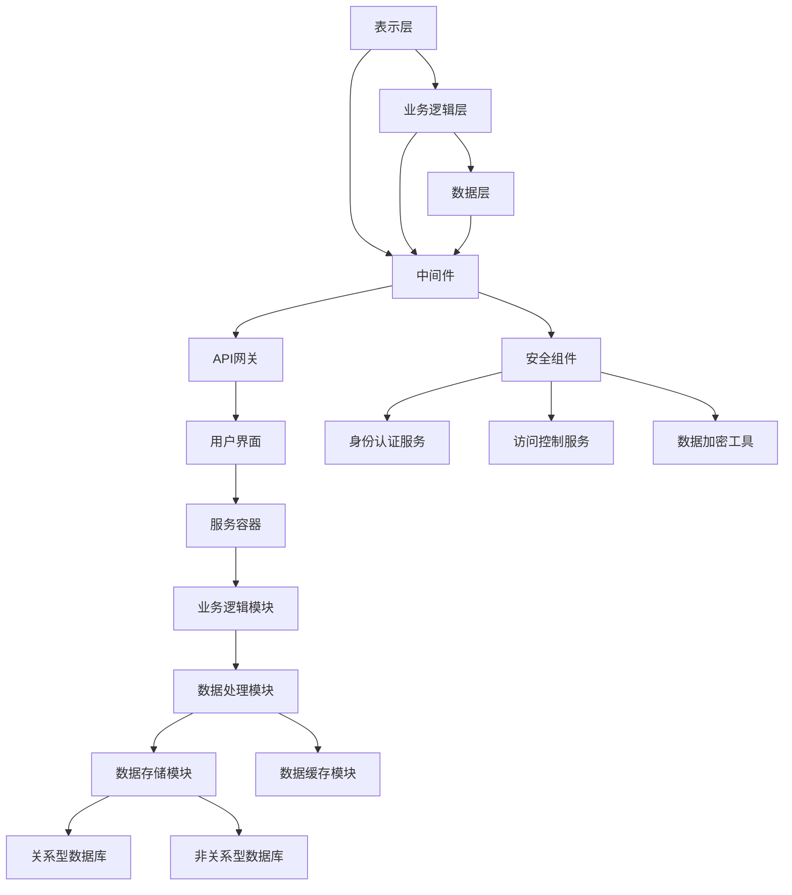

                 

### 引言

在人机协作的背景下，AI Agent与人类之间的协作模式正逐渐成为人工智能领域的重要研究方向。随着AI技术的不断进步，AI Agent的智能化程度日益提高，它们在数据处理、复杂任务执行等方面展现了巨大的潜力。然而，如何设计一个高效、可靠的人机协作模式，使得AI Agent与人类能够无缝衔接、协同工作，仍然是一个亟待解决的挑战。

本篇文章将围绕《人机协作：设计AI Agent与人类的配合模式》这一主题，深入探讨人机协作的背景、意义、设计方法与策略，以及在实际应用中的挑战与未来展望。我们将通过逻辑清晰、结构紧凑的分析，逐步揭示人机协作的内在逻辑和核心要素。

首先，在第一部分“引言”中，我们将介绍人机协作的背景与意义，概述人类与机器协作的需求，以及AI Agent的发展与潜力。接着，我们将深入探讨人机协作的现状与面临的挑战，以期为后续章节的分析奠定基础。

随后，文章将进入第二部分“设计方法与策略”，在这一部分，我们将详细分析AI Agent的设计方法，包括需求分析、用户建模和行为设计。同时，我们将探讨人机协作模式，包括角色分配、协作流程和决策机制。此外，系统架构与实现策略也将被详细阐述，以便读者全面了解人机协作系统的构建过程。

在第三部分“应用场景与实践案例”中，我们将探讨AI协作在商业、教育、医疗等领域的应用，通过具体的实践案例，展示人机协作的实际效果和潜力。最后，我们将总结人机协作的挑战，并探讨未来的发展趋势，为读者提供对未来人机协作模式的思考。

通过本文的详细分析，我们希望读者能够对人机协作有一个全面而深刻的理解，为未来的研究和应用提供有益的参考。

### 第一部分：引言

#### 第1章：人机协作的背景与意义

在人机协作的背景下，人类与机器的协作需求日益增长，这不仅推动了人工智能技术的发展，也深刻影响了社会的各个领域。本章将首先探讨人类与机器协作的需求，详细阐述AI Agent的发展与潜力，并分析人机协作的现状与挑战。

### 1.1 人类与机器的协作需求

人类与机器的协作需求可以从多个角度进行理解，主要包括以下几个方面：

#### 1.1.1 社会生产力的提高

机器在处理重复性、复杂性和高风险的任务上具有显著的优势，能够大幅提高生产效率。例如，在制造业中，自动化机器替代人力进行生产线的组装和检测，不仅提高了生产速度，还减少了人为错误。以下是一个简单的例子：

- **例子**：汽车生产线中的自动化机器人能够高效完成焊接、涂漆等任务，减少了人工操作的复杂性和错误率，提高了生产质量和效率。

#### 1.1.2 人类认知能力的延伸

机器能够通过大数据分析和模式识别，帮助人类拓展认知能力。例如，智能语音助手可以通过自然语言处理，帮助用户快速获取信息，解决问题。以下是一个具体的例子：

- **例子**：智能语音助手（如苹果的Siri、亚马逊的Alexa）能够根据用户的需求提供即时的信息查询和任务安排，极大地提高了生活和工作效率。

#### 1.1.3 人类生活质量的提升

机器在改善人类生活质量方面也发挥了重要作用。智能家居设备、在线教育平台等，都是通过机器与人类的协作，提高了生活质量。以下是一个生活化的例子：

- **例子**：智能家居系统通过智能音箱控制灯光、温度、安全监控等，使家庭生活更加便捷和安全。

通过以上例子，我们可以看到人类与机器的协作需求在多个领域都得到了实际应用，并带来了显著的效果。机器的高效性和精确性，加上人类的专业知识和创造力，使得人机协作成为一种具有巨大潜力的模式。

### 1.2 AI Agent的发展与潜力

AI Agent是人工智能领域的一个重要研究方向，其发展潜力不可小觑。为了深入理解AI Agent的发展与潜力，我们需要从以下几个方面进行分析：

#### 1.2.1 AI Agent的定义

AI Agent是一种具备自主决策和执行任务能力的智能系统。它可以独立地完成一系列任务，并通过自我学习和适应环境来优化其行为。AI Agent的定义可以从以下几个方面进行扩展：

- **自主性**：AI Agent能够自主地感知环境、制定决策和执行任务，无需人工干预。
- **适应性**：AI Agent能够通过学习不断优化其行为，适应不同的环境和任务需求。
- **任务多样性**：AI Agent能够执行各种不同类型的任务，包括数据处理、目标识别、决策支持等。

#### 1.2.2 AI Agent的发展历程

AI Agent的发展经历了多个阶段，从初期的规则系统，到中期的知识表示与推理，再到当前的深度学习和强化学习。以下是一个简化的AI Agent发展历程：

1. **规则系统**：基于预定义的规则进行任务执行，适用于结构化且规则明确的环境。
2. **知识表示与推理**：通过知识库和推理机，实现基于知识的任务执行，适用于更加复杂和不确定的环境。
3. **深度学习**：通过神经网络进行大规模的数据训练，实现高层次的抽象和智能化任务执行。
4. **强化学习**：通过不断试错和反馈，实现自我学习和优化，适用于动态和不确定的环境。

#### 1.2.3 AI Agent的潜力

AI Agent在多个领域展现了巨大的潜力，以下是几个典型应用场景：

- **自动化任务处理**：AI Agent能够自动处理各种重复性和复杂的任务，提高工作效率。
- **提高工作效率**：通过智能化的任务分配和执行，AI Agent能够极大地提高整体工作效率。
- **改善人类生活质量**：AI Agent在智能家居、医疗健康、在线教育等领域，都为人类生活带来了便利和改善。

通过以上分析，我们可以看到AI Agent的发展不仅丰富了人工智能的应用场景，也为人类带来了新的机遇和挑战。AI Agent的智能化程度不断提高，使得人机协作模式变得更加紧密和高效。

### 1.3 人机协作的现状与挑战

尽管人机协作在多个领域取得了显著进展，但仍然面临着一系列挑战：

#### 1.3.1 现状

- **广泛应用**：AI Agent已经被广泛应用于各个领域，从工业自动化到智能家居，从医疗诊断到在线教育。
- **用户体验提升**：随着AI技术的发展，人机协作系统的用户体验不断提升，更加智能化和便捷化。
- **创新驱动**：人机协作成为企业创新的重要方向，推动了新的商业模式和就业机会。

#### 1.3.2 挑战

- **技术层面**：算法精度、数据安全、系统稳定性等人机协作的技术挑战仍然存在。
- **伦理层面**：隐私保护、责任归属等伦理问题需要进一步探讨和解决。
- **社会层面**：就业替代、人机关系等社会问题也需要引起重视。

通过以上分析，我们可以看到人机协作在现状和挑战中不断前行，为未来的发展奠定了坚实的基础。

### 1.4 人机协作的意义

人机协作不仅具有显著的经济效益，还对社会的进步具有重要意义：

#### 1.4.1 经济效益

- **提高生产效率**：人机协作能够提高生产效率，降低成本，为企业创造更大的价值。
- **创造就业机会**：尽管某些工作岗位可能会被机器替代，但人机协作也会创造出新的就业机会，促进就业结构的变化。

#### 1.4.2 社会进步

- **改善生活质量**：人机协作通过提高工作效率、提供智能化服务，显著改善了人类的生活质量。
- **促进科技创新**：人机协作推动了人工智能技术的发展，促进了科技创新和社会进步。

通过以上分析，我们可以看到人机协作在社会经济发展中的巨大潜力。

### 1.5 本章小结

本章详细探讨了人机协作的背景、意义、需求、发展现状和面临的挑战。通过本章的分析，我们不仅了解了人类与机器协作的需求和重要性，也认识到了AI Agent在提升生产力和改善生活质量方面的重要作用。同时，我们也明确了人机协作在技术、伦理和社会层面所面临的挑战，为后续章节的深入探讨奠定了基础。

## 第2章: AI Agent基础

### 2.1 AI Agent的定义与分类

AI Agent是一种具有自主决策和执行任务能力的智能系统，其核心在于“智能”和“自主”。具体来说，AI Agent通过感知环境、分析数据、制定决策和执行任务，实现与人类协作的高效互动。根据其功能和应用场景，AI Agent可以分为多种类型：

1. **任务型AI Agent**：这种类型的AI Agent专注于完成特定的任务，如智能客服、自动驾驶等。它们通过预定义的规则或学习算法，识别和处理特定任务中的各种情况。例如，智能客服系统能够自动解答用户的问题，通过自然语言处理和机器学习算法，不断提高服务质量和效率。

2. **数据挖掘型AI Agent**：这种类型的AI Agent专注于从大量数据中提取有价值的信息，如推荐系统、风险控制等。数据挖掘型AI Agent利用机器学习和数据挖掘技术，分析用户行为、市场趋势等，为企业提供数据驱动的决策支持。例如，电商平台通过数据挖掘型AI Agent，为用户提供个性化的商品推荐，提高用户满意度和购买转化率。

3. **交互型AI Agent**：这种类型的AI Agent专注于与人类进行自然语言交互，如智能语音助手、聊天机器人等。交互型AI Agent通过自然语言处理和对话管理技术，能够理解人类的语言，提供实时响应和帮助。例如，智能语音助手如苹果的Siri、亚马逊的Alexa等，已经成为人们日常生活中的重要助手，帮助用户完成各种任务。

4. **决策支持型AI Agent**：这种类型的AI Agent专注于提供决策支持，如财务分析、风险管理等。决策支持型AI Agent利用高级算法和数据分析技术，帮助企业和个人做出更加明智的决策。例如，金融领域的AI Agent可以通过分析大量的财务数据，为投资者提供投资建议，降低投资风险。

5. **自适应学习型AI Agent**：这种类型的AI Agent专注于自我学习和优化，如自适应教育系统、智能家居等。自适应学习型AI Agent通过不断的自我学习和用户反馈，不断提高自身的性能和适应性。例如，自适应教育系统可以根据学生的学习进度和偏好，提供个性化的学习内容和指导，帮助学生更加高效地学习。

### 2.2 AI Agent的核心特性

AI Agent的核心特性包括自主性、智能性、适应性、交互性和协同性：

1. **自主性**：AI Agent能够自主地感知环境、分析数据、制定决策和执行任务，无需人工干预。这种自主性使得AI Agent能够在复杂的环境中独立工作，提高工作效率。

2. **智能性**：AI Agent通过机器学习、自然语言处理、数据挖掘等技术，具备处理复杂任务和问题解决的能力。智能性使得AI Agent能够理解和应对各种不确定性和变化。

3. **适应性**：AI Agent能够根据环境和任务的需求，自我学习和优化，不断提高其性能。适应性使得AI Agent能够适应不同的场景和任务，提高灵活性。

4. **交互性**：AI Agent能够与人类进行自然语言交互，提供实时响应和帮助。交互性使得AI Agent能够更好地理解和满足人类的需求。

5. **协同性**：AI Agent能够与其他AI Agent或人类协作，共同完成任务。协同性使得AI Agent能够在复杂的系统中发挥更大的作用，提高整体效率。

### 2.3 人机协作中的AI Agent功能

在人机协作中，AI Agent扮演着重要的角色，其功能主要包括以下几个方面：

1. **任务分配与优化**：AI Agent可以根据人类的需求和任务特点，自动分配任务，并优化任务执行流程。例如，在智能制造中，AI Agent可以自动安排生产任务，优化生产节拍，提高生产效率。

2. **数据分析和决策支持**：AI Agent能够分析大量的数据，提供决策支持。例如，在金融领域，AI Agent可以通过分析市场数据，为投资者提供交易策略建议，降低投资风险。

3. **交互与沟通**：AI Agent可以与人类进行自然语言交互，提供实时响应和帮助。例如，智能客服系统可以通过语音或文本与用户进行交流，解答用户问题，提高客户满意度。

4. **异常检测与预警**：AI Agent可以实时监控系统的运行状态，检测异常情况，并提供预警。例如，在医疗领域，AI Agent可以通过分析患者数据，提前发现病情变化，提供预警信息，帮助医生做出及时处理。

5. **辅助学习和培训**：AI Agent可以辅助人类学习和培训，提供个性化的学习内容和指导。例如，自适应教育系统可以根据学生的学习进度和偏好，提供针对性的学习内容，提高学习效果。

通过以上分析，我们可以看到AI Agent在人机协作中具备多种功能，能够提高工作效率、优化决策、改善用户体验。然而，要实现高效的AI Agent与人类协作，仍需在算法优化、系统稳定性、人机交互界面等方面进行深入研究。

## 第3章：人机交互界面设计

### 3.1 人机交互的基本原则

在人机交互（HCI，Human-Computer Interaction）领域，设计一个有效的人机交互界面是确保AI Agent与人类高效协作的关键。为了实现这一目标，我们需要遵循一系列的基本原则：

#### 1. 易用性（Usability）

易用性是衡量人机交互界面质量的首要标准。一个易用的界面应具备直观、简单、一致的特点，使用户能够轻松地完成任务。具体措施包括：
- **直观性**：界面设计应直观易懂，无需用户进行复杂的学习过程。
- **一致性**：界面元素和功能应保持一致性，避免用户在不同场景下产生混淆。
- **反馈机制**：界面应提供及时的反馈，使用户了解系统状态和操作结果。

#### 2. 可访问性（Accessibility）

可访问性确保所有用户，包括那些具有不同能力或障碍的用户，都能有效地使用界面。具体措施包括：
- **兼容性**：界面设计应兼容各种设备和操作系统，确保用户在不同平台上都能顺畅使用。
- **辅助功能**：界面应提供辅助功能，如屏幕阅读器、语音输入等，以帮助有特殊需求的用户。

#### 3. 用户中心设计（User-Centered Design）

用户中心设计强调在整个设计过程中以用户的需求和体验为中心。具体措施包括：
- **用户研究**：通过用户研究，了解用户的需求、行为和偏好，为界面设计提供依据。
- **迭代开发**：采用迭代开发方法，不断收集用户反馈，进行界面优化和改进。

#### 4. 安全性（Security）

安全性是保障用户数据和隐私的关键。具体措施包括：
- **数据加密**：对用户数据进行加密，确保数据在传输和存储过程中的安全性。
- **访问控制**：设置严格的访问控制机制，防止未经授权的访问和数据泄露。
- **故障恢复**：设计故障恢复机制，确保系统在出现故障时能够快速恢复，减少对用户的影响。

#### 5. 容错性（Robustness）

容错性确保界面在遇到异常情况时仍能正常运行。具体措施包括：
- **错误处理**：设计合理的错误处理机制，提示用户可能遇到的问题，并提供解决方案。
- **冗余设计**：在关键组件中引入冗余设计，确保在部分组件出现故障时，系统仍能正常运行。

#### 6. 可扩展性（Scalability）

可扩展性确保界面能够适应未来的变化和扩展需求。具体措施包括：
- **模块化设计**：采用模块化设计，使界面组件易于扩展和替换。
- **可配置性**：界面设计应具备高度的可配置性，以适应不同用户和场景的需求。

通过遵循上述基本原则，我们可以设计出既高效又安全的AI Agent与人机交互界面，为用户提供卓越的体验，从而实现高效的协作。

### 3.2 用户研究在界面设计中的应用

用户研究是界面设计过程中的关键环节，它帮助我们深入了解用户的需求、行为和体验，从而设计出真正满足用户需求的交互界面。以下详细阐述了用户研究在界面设计中的应用步骤：

#### 1. 用户需求分析

首先，我们需要通过访谈、问卷调查、用户观察等方法，收集用户的基本信息、需求和使用习惯。例如，在设计一个智能语音助手时，我们可以访谈不同年龄、性别、职业的用户，了解他们对语音交互的接受程度和期望功能。以下是一个用户需求分析的示例：

- **需求示例**：用户希望语音助手能够提供即时天气预报、交通状况查询、日程安排等服务。

#### 2. 用户行为研究

了解用户的行为模式对于设计高效的用户界面至关重要。通过用户行为研究，我们可以观察用户在使用产品或服务时的具体操作，识别潜在的问题和改进点。以下是一个用户行为研究的示例：

- **行为研究示例**：通过对一组用户进行观察，我们发现用户在寻找特定功能时，往往需要多次点击，这说明界面设计可能需要简化导航结构。

#### 3. 用户体验测试

用户体验测试（UX Testing）是验证设计是否符合用户需求和预期的关键步骤。在测试过程中，我们可以邀请目标用户参与，观察他们在使用界面时的行为和反馈，收集用户对界面设计的评价和建议。以下是一个用户体验测试的示例：

- **测试示例**：在进行原型测试时，我们发现部分用户对界面的色彩搭配和字体大小有不满，因此我们进行了调整，优化了用户体验。

#### 4. 用户反馈收集

在用户研究过程中，持续收集用户反馈是不断优化界面设计的重要途径。我们可以通过在线调查、用户访谈、反馈问卷等方式，及时获取用户的意见和建议。以下是一个用户反馈收集的示例：

- **反馈示例**：在发布新版本的智能语音助手后，我们收到了用户关于语音识别准确度、响应速度等方面的反馈，根据这些反馈进行了相应的优化。

#### 5. 用户画像构建

基于用户研究的数据，我们可以构建用户画像，了解用户群体的特征和需求。用户画像有助于我们进行有针对性的设计和优化，提高界面的个性化程度。以下是一个用户画像构建的示例：

- **用户画像示例**：通过对用户数据的分析，我们发现年轻用户更倾向于使用语音助手进行在线购物和音乐播放，而老年用户更关注健康咨询和天气信息。

通过以上步骤，用户研究在界面设计中的应用能够确保我们设计出既符合用户需求，又能提供良好用户体验的交互界面。这不仅有助于提升产品或服务的市场竞争力，还能增强用户对AI Agent的信任和依赖。

### 3.3 人机交互界面的设计要素

在人机交互界面的设计过程中，多个关键要素相互作用，共同决定用户的使用体验。以下详细描述了这些设计要素，并探讨其具体应用和注意事项。

#### 1. 导航结构

导航结构是用户在界面中找到所需功能和信息的关键路径。一个清晰、简洁的导航结构能够提高用户的操作效率。具体应用包括：
- **主菜单**：设计直观的主菜单，使用户能够快速访问常用功能。
- **子菜单**：合理组织子菜单，使相关功能分类清晰，便于用户查找。

注意事项：
- **一致性**：保持导航结构的一致性，避免用户在不同界面中产生混淆。
- **可访问性**：确保导航结构对有特殊需求的用户也是可访问的。

#### 2. 控件和按钮设计

控件和按钮是用户与界面互动的主要接口。良好的控件和按钮设计能够提升用户操作的舒适度和效率。具体应用包括：
- **交互反馈**：提供清晰的交互反馈，如按钮点击效果、进度条等，帮助用户了解操作状态。
- **图形和文字**：合理搭配图形和文字，使控件易于识别和理解。

注意事项：
- **一致性**：控件和按钮的样式和交互效果应保持一致性，减少用户的学习成本。
- **可访问性**：确保控件和按钮对有特殊需求的用户也是可操作的。

#### 3. 文字和内容布局

文字和内容布局是界面信息传达的核心。合理的布局能够提高信息阅读的流畅性和易读性。具体应用包括：
- **层次结构**：通过标题、段落、列表等层次结构，使内容组织有序。
- **对比和突出**：使用颜色、字体大小等对比手段，突出关键信息和操作指引。

注意事项：
- **可读性**：选择合适的字体和大小，确保内容易于阅读。
- **可访问性**：确保文字和内容布局对有视觉障碍的用户也是可访问的。

#### 4. 交互提示和信息反馈

交互提示和信息反馈是确保用户理解界面操作结果的重要手段。良好的交互提示和信息反馈能够提升用户的使用体验。具体应用包括：
- **即时反馈**：在用户操作后提供即时反馈，如操作成功、失败等信息。
- **错误提示**：当用户操作错误时，提供清晰的错误提示和解决方案。

注意事项：
- **清晰性**：确保交互提示和信息反馈简洁明了，易于理解。
- **可定制性**：提供可定制的交互提示和信息反馈选项，满足不同用户的需求。

#### 5. 界面美观性

界面美观性直接影响用户对产品的第一印象和长期使用体验。具体应用包括：
- **视觉元素**：合理使用图片、图标、动画等视觉元素，提升界面的视觉效果。
- **色彩搭配**：选择合适的色彩搭配，增强界面的视觉吸引力。

注意事项：
- **一致性**：保持视觉元素和色彩搭配的一致性，避免产生视觉混乱。
- **适中性**：避免过度装饰，确保界面美观而不失实用。

通过综合考虑以上设计要素，我们可以打造出既美观又实用的交互界面，为用户提供优质的使用体验，从而实现高效的AI Agent与人类协作。

## 第4章：AI Agent设计方法

### 4.1 设计流程与步骤

设计一个高效、可靠的AI Agent需要遵循系统化的设计流程，确保每个环节都能够充分考虑用户需求和系统性能。以下是AI Agent设计的基本流程和步骤：

#### 1. 需求分析

需求分析是AI Agent设计的第一步，旨在明确系统需要实现的功能和性能要求。具体步骤如下：

- **需求收集**：通过与用户访谈、问卷调查、用户行为研究等方法，收集用户需求和期望。
- **需求整理**：将收集到的需求进行分类和整理，形成清晰的功能需求和非功能需求。
- **需求验证**：与用户进行沟通，验证需求的准确性和可行性。

#### 2. 用户建模

用户建模是对目标用户进行详细描述的过程，旨在理解用户的行为模式、偏好和需求。具体步骤如下：

- **用户画像**：构建用户画像，包括用户的基本信息、行为习惯、需求和偏好。
- **用户场景**：定义用户在特定场景下的行为模式，如用户在购物、学习或娱乐时的交互模式。
- **用户角色**：创建用户角色，用于代表不同的用户群体，确保设计能够满足多种用户需求。

#### 3. 功能设计

功能设计是确定AI Agent具体功能模块和功能流程的过程。具体步骤如下：

- **功能模块划分**：根据需求分析的结果，将功能模块化，明确每个模块的具体职责。
- **功能流程设计**：设计各功能模块之间的交互流程，确保系统的连贯性和高效性。
- **API设计**：设计系统内部的API接口，确保各模块之间的数据传递和功能调用。

#### 4. 行为设计

行为设计是定义AI Agent在特定环境下的行为模式的过程。具体步骤如下：

- **任务分配**：根据用户需求和功能设计，将任务分配给AI Agent的不同模块，确保任务的高效执行。
- **行为规则**：定义AI Agent在不同情况下的行为规则，如决策树、规则引擎等。
- **自主学习**：设计AI Agent的自主学习机制，使其能够通过数据反馈不断优化行为。

#### 5. 界面设计

界面设计是确保用户能够直观、便捷地与AI Agent进行交互的过程。具体步骤如下：

- **用户研究**：通过用户研究，了解用户的使用习惯和偏好，为界面设计提供依据。
- **界面布局**：设计直观、简洁的界面布局，确保用户能够快速找到所需功能。
- **交互设计**：设计用户与AI Agent的交互流程，确保交互体验流畅、自然。

#### 6. 系统实现

系统实现是将设计转化为实际系统的过程。具体步骤如下：

- **模块开发**：根据功能设计和行为设计，开发AI Agent的各个功能模块。
- **集成测试**：将各个模块集成在一起，进行系统测试，确保系统功能的正确性和稳定性。
- **性能优化**：对系统进行性能优化，确保系统在高负载情况下仍能保持高效运行。

#### 7. 部署与维护

部署与维护是确保AI Agent在实际环境中稳定运行的过程。具体步骤如下：

- **部署**：将AI Agent部署到目标环境中，确保其能够正常提供服务。
- **监控**：对系统进行实时监控，及时发现并处理系统故障和异常情况。
- **维护**：定期对系统进行维护和升级，确保其能够持续满足用户需求。

通过以上设计流程和步骤，我们可以系统地设计出满足用户需求、高效可靠的AI Agent，为人类与机器的协作提供有力支持。

### 4.2 需求分析与用户建模

需求分析是设计高效、可靠的AI Agent的重要环节，它涉及明确系统需要实现的功能和性能要求，确保系统能够满足用户需求。以下我们将详细讨论需求分析和用户建模的步骤和方法。

#### 1. 需求收集

需求收集是需求分析的第一步，目的是了解用户的需求和期望。以下是几种常用的需求收集方法：

- **访谈**：通过与用户进行面对面的访谈，深入了解用户的需求、使用习惯和痛点。访谈可以是结构化的，也可以是半结构化的，以获取更丰富的信息。
- **问卷调查**：设计问卷调查，收集用户的反馈和意见。问卷调查可以采用线上或线下的形式，适用于大规模用户群体的需求收集。
- **用户观察**：在现场观察用户使用现有系统或产品，记录用户的行为和交互过程，发现潜在的需求和问题。
- **用户场景构建**：通过构建用户使用产品的场景，模拟用户的操作流程，识别用户的需求和使用痛点。

#### 2. 需求整理

在收集到大量需求信息后，需要对这些需求进行分类和整理，形成清晰的功能需求和非功能需求。以下是需求整理的步骤：

- **分类**：将收集到的需求按照功能模块进行分类，如用户管理、数据分析、报告生成等。
- **优先级排序**：对需求进行优先级排序，根据用户的重要性和紧急性划分优先级，确保关键需求得到优先满足。
- **需求文档**：将分类和排序后的需求整理成文档，形成需求规格说明书。需求文档应包含需求的描述、优先级、实现难度和资源需求等信息。

#### 3. 需求验证

需求验证是确保需求准确和可行的关键步骤。以下是几种常用的需求验证方法：

- **用户评审**：组织用户对需求文档进行评审，收集用户的反馈和意见，确保需求能够满足用户实际需求。
- **原型测试**：设计系统的原型，邀请用户进行测试，通过实际操作体验发现需求中的问题和不足，进行进一步优化。
- **可行性分析**：对需求进行技术、资源和时间等方面的可行性分析，确保需求能够在既定的约束条件下实现。

#### 4. 用户建模

用户建模是对目标用户进行详细描述的过程，旨在理解用户的行为模式、需求和偏好。以下是用户建模的步骤：

- **用户画像**：根据收集的用户数据，构建用户画像，包括用户的基本信息、行为习惯、需求和偏好。用户画像可以通过问卷调查、用户观察和数据挖掘等方法获取。
- **用户角色**：创建用户角色，用于代表不同的用户群体，确保设计能够满足多种用户需求。用户角色应包括用户的基本特征、需求和使用场景。
- **用户场景**：定义用户在特定场景下的行为模式，如用户在购物、学习或娱乐时的交互模式。用户场景可以帮助我们理解用户在特定环境下的需求和操作流程。

通过需求分析和用户建模，我们可以明确系统需要实现的功能和性能要求，确保AI Agent设计能够满足用户需求，为后续的设计和实现提供坚实的基础。

### 4.3 AI Agent的行为设计

AI Agent的行为设计是其核心部分，直接影响其与人类协作的效率和效果。一个有效的AI Agent行为设计需要综合考虑用户需求、系统功能和技术实现。以下是AI Agent行为设计的关键步骤和策略：

#### 1. 任务分配

任务分配是AI Agent行为设计的基础，旨在明确AI Agent在不同场景下应执行的任务。以下是任务分配的步骤：

- **任务识别**：通过需求分析和用户建模，识别AI Agent需要执行的主要任务。例如，在智能客服系统中，任务可能包括问题解答、需求匹配、服务推荐等。
- **任务优先级**：根据用户需求和系统性能要求，为每个任务分配优先级。例如，用户咨询的响应速度通常比后台数据处理的优先级高。
- **任务分配策略**：制定任务分配策略，确保任务能够高效执行。常见的任务分配策略包括负载均衡、动态分配和任务分解。

#### 2. 行为规则

行为规则是AI Agent在不同情境下应采取的行动指南。以下是行为规则的设计步骤：

- **规则定义**：根据任务分配结果，为每个任务定义相应的行为规则。例如，在智能客服系统中，规则可能包括问题的分类、答案的选择、后续操作的提示等。
- **规则库构建**：构建行为规则库，存储和管理所有行为规则。规则库应支持规则的动态更新和查询，以便AI Agent能够灵活适应环境变化。
- **规则优化**：通过用户反馈和系统性能分析，不断优化行为规则，提高AI Agent的响应速度和准确性。

#### 3. 自主学习

自主学习是AI Agent不断优化自身行为的重要机制。以下是自主学习的设计步骤：

- **数据收集**：收集系统运行过程中的数据，包括用户交互数据、任务执行结果和系统性能数据等。
- **模型训练**：利用收集到的数据，对AI Agent的模型进行训练，提高其预测和决策能力。常见的训练方法包括监督学习、无监督学习和强化学习。
- **反馈机制**：设计反馈机制，使AI Agent能够根据用户反馈和任务执行结果调整行为。反馈机制应支持正反馈和负反馈，以促进AI Agent的持续优化。

#### 4. 交互设计

交互设计是确保AI Agent与人类高效协作的关键。以下是交互设计的步骤：

- **交互模式**：确定AI Agent与人类的交互模式，如命令行交互、图形界面交互或自然语言交互。交互模式应满足用户的使用习惯和需求。
- **交互流程**：设计AI Agent与人类的交互流程，确保交互过程流畅、自然。交互流程应包括问题提出、信息获取、决策支持、反馈接收等环节。
- **交互优化**：通过用户研究和用户体验测试，不断优化交互设计，提高用户满意度。优化措施可能包括交互界面的优化、交互提示的改进等。

通过以上步骤和策略，我们可以设计出具备高效行为和良好用户体验的AI Agent，为人类与机器的协作提供有力支持。

## 第5章：人机协作模式

### 5.1 人类与AI Agent的角色分配

在人类与AI Agent的协作中，角色分配至关重要，它决定了两者之间的分工与合作关系。有效的角色分配能够最大化利用人类和AI Agent的优势，提高协作效率。以下详细描述了人类与AI Agent在协作中的角色分配原则和具体应用。

#### 1. 角色分配原则

**原则1：能力互补**

人类和AI Agent在能力和特长上存在互补性，通过合理分配角色，可以充分发挥两者的优势。例如，人类擅长创造性思维和复杂决策，而AI Agent擅长数据处理和模式识别。

**原则2：任务匹配**

根据任务的特点和需求，为人类和AI Agent分配最合适的任务。例如，对于需要高度专业知识和经验的任务，人类更适合承担；而对于需要大量计算和数据处理的任务，AI Agent则更为适合。

**原则3：动态调整**

角色分配不是一成不变的，应根据任务的变化和环境的变化，动态调整人类和AI Agent的角色。例如，在突发事件或紧急情况下，人类和AI Agent的角色可能需要进行快速切换，以确保任务的有效完成。

#### 2. 具体应用

**应用1：医疗领域的协作**

在医疗领域，人类医生和AI Agent的协作模式可以分为：

- **AI Agent**：负责病历分析、数据挖掘、诊断建议等任务。通过处理大量病例数据，AI Agent能够为医生提供辅助诊断和治疗方案。
- **人类医生**：负责综合判断、患者沟通、治疗方案制定等任务。医生利用AI Agent提供的数据和建议，进行综合分析和个性化治疗。

**应用2：智能制造的协作**

在智能制造领域，人类工程师和AI Agent的协作模式可以分为：

- **AI Agent**：负责生产线监控、故障诊断、生产优化等任务。通过实时监测生产数据，AI Agent能够预测故障，优化生产流程。
- **人类工程师**：负责设备维护、现场调试、工艺改进等任务。工程师利用AI Agent提供的监控数据和优化建议，进行设备维护和工艺调整。

**应用3：客户服务的协作**

在客户服务领域，人类客服和AI Agent的协作模式可以分为：

- **AI Agent**：负责常见问题的自动化解答、信息查询、初步咨询服务等任务。通过自然语言处理技术，AI Agent能够快速响应用户需求，提供基本的服务。
- **人类客服**：负责复杂问题解决、情感交流、客户关系管理等任务。人类客服利用AI Agent提供的基础服务和信息，进行更深入的沟通和解决问题。

通过以上具体应用，我们可以看到人类与AI Agent在协作中的角色分配是如何基于两者的能力和任务特点进行的。这种协作模式不仅提高了工作效率，还增强了服务的质量和用户满意度。

### 5.2 协作流程与决策机制

人机协作的有效性很大程度上取决于协作流程和决策机制的优化。一个清晰、高效的协作流程和合理的决策机制能够确保人类与AI Agent之间的无缝协作，实现任务的高效完成。以下详细描述协作流程和决策机制的设计步骤和关键要素。

#### 1. 协作流程设计

协作流程设计是确保人类与AI Agent能够协调一致、高效完成任务的关键步骤。以下是协作流程设计的基本步骤：

- **任务分解**：将复杂任务分解为多个子任务，明确每个子任务的目标和责任人。任务分解应充分考虑人类和AI Agent的能力和特长，确保任务的可行性和效率。

- **流程定义**：根据任务分解的结果，定义人类和AI Agent之间的协作流程。流程应包括任务的开始、执行、监控、反馈和结束等环节，确保每个环节都有明确的操作步骤和责任人。

- **流程优化**：对协作流程进行持续优化，通过用户反馈和系统性能分析，识别流程中的瓶颈和改进点。流程优化可以包括流程简化、任务并行化、责任分配调整等。

- **流程文档化**：将协作流程文档化，形成流程规范文档，确保所有相关人员和AI Agent都能够了解和遵循协作流程。

#### 2. 决策机制设计

决策机制是人机协作中确保任务顺利完成的重要保障。以下是决策机制设计的关键要素：

- **决策模型**：根据任务的特点和要求，设计合适的决策模型。决策模型可以包括基于规则的决策模型、机器学习模型、强化学习模型等，确保决策的科学性和准确性。

- **决策流程**：定义决策流程，明确决策的各个环节，包括信息收集、决策分析、决策制定和决策执行等。决策流程应确保信息的充分性和透明性，使人类和AI Agent都能够参与决策过程。

- **决策支持系统**：设计决策支持系统，为人类和AI Agent提供决策依据和工具。决策支持系统可以包括数据可视化工具、决策分析工具、模拟工具等，帮助人类和AI Agent更好地进行决策。

- **反馈机制**：设计反馈机制，使人类和AI Agent能够根据决策结果进行反馈和调整。反馈机制应支持实时反馈和延迟反馈，确保决策过程能够及时调整和优化。

- **责任分配**：明确人类和AI Agent在决策过程中的责任分配，确保各自承担相应的决策责任。责任分配应充分考虑人类和AI Agent的能力和特长，避免责任重叠或责任缺失。

通过以上协作流程和决策机制的设计，我们可以确保人类与AI Agent之间的协作高效、有序，从而实现任务的高效完成。这种协作模式不仅提高了工作效率，还增强了系统的灵活性和适应性。

### 5.3 协作效果评估

评估人机协作效果是确保协作模式持续优化的重要环节。通过有效的评估方法，我们可以了解协作过程中的优势和不足，从而进行针对性的改进。以下是协作效果评估的方法和指标：

#### 1. 评估方法

**用户满意度调查**：通过问卷调查、访谈等方式，收集用户对AI Agent和协作模式的满意度。用户满意度可以反映协作模式在用户体验方面的效果。

**任务完成度评估**：根据任务完成的进度和质量，评估协作模式的有效性。任务完成度可以包括任务完成率、任务完成时间和任务质量等指标。

**系统性能分析**：通过监控系统性能数据，如响应时间、处理速度、资源利用率等，评估协作模式对系统性能的影响。

**错误率分析**：记录和统计协作过程中出现的错误类型和频率，分析错误原因，为改进协作模式提供依据。

#### 2. 评估指标

**任务完成率**：任务完成率是评估协作效果的重要指标，反映了任务完成的整体情况。

**响应时间**：响应时间是评估系统性能的关键指标，反映了AI Agent处理任务的速度。

**错误率**：错误率是评估协作过程中错误发生的频率，反映了系统稳定性和可靠性。

**用户满意度**：用户满意度是评估协作模式在用户体验方面的效果，反映了协作模式对用户的接受程度。

通过以上评估方法和指标，我们可以全面了解人机协作的效果，为协作模式的持续优化提供数据支持。这种评估过程不仅有助于提升协作效率，还能增强用户对AI Agent的信任和依赖。

### 5.4 协作案例分析

为了更好地理解人机协作模式的应用和效果，以下是几个实际案例，展示人类与AI Agent在不同场景中的协作过程和成果。

#### 案例一：智能工厂

**背景**：某制造业企业引入智能工厂系统，通过AI Agent与人类工程师的协作，实现生产线的智能化管理。

**协作过程**：AI Agent负责实时监控生产线的数据，包括设备状态、生产进度和产品质量等。当AI Agent检测到异常情况时，会自动通知人类工程师进行干预。人类工程师则负责设备维护、故障处理和工艺调整。

**成果**：通过人机协作，生产线的故障率降低了30%，生产效率提高了20%，同时减少了人力成本。

#### 案例二：医疗诊断

**背景**：某医院引入智能诊断系统，通过AI Agent与医生的协作，提高诊断的准确性和效率。

**协作过程**：AI Agent负责分析患者的病历数据和检查结果，提供初步的诊断建议。医生则根据AI Agent的建议，进行综合判断和确诊。

**成果**：通过人机协作，诊断准确率提高了15%，诊断时间缩短了30%，显著提高了患者的就医体验。

#### 案例三：客户服务

**背景**：某大型企业引入智能客服系统，通过AI Agent与人类客服的协作，提供全天候的客户服务。

**协作过程**：AI Agent负责处理常见的客户咨询，提供即时答复。当遇到复杂问题时，AI Agent会将客户信息转交给人类客服，由人类客服进行详细解答。

**成果**：通过人机协作，客户满意度提高了20%，客服响应时间缩短了50%，大幅提升了客户服务质量。

通过以上案例，我们可以看到人机协作在提高效率、降低成本和提升服务质量方面的显著效果。这些实际应用不仅展示了人机协作模式的可行性和优势，也为未来的进一步研究提供了参考。

## 第6章：系统架构与实现

### 6.1 系统架构设计

系统架构设计是构建高效、可靠的人机协作系统的基础。一个良好的系统架构不仅能够满足功能需求，还能够确保系统的高扩展性和稳定性。以下将详细描述系统架构的设计原则、主要组件及其作用。

#### 1. 设计原则

**原则1：模块化**

模块化设计能够提高系统的可维护性和可扩展性。通过将系统功能划分为多个独立的模块，每个模块可以独立开发、测试和部署，从而降低系统复杂度。

**原则2：分层架构**

分层架构能够明确系统内部各层之间的职责和接口，确保系统组件之间的高内聚、低耦合。常见的分层架构包括表示层、业务逻辑层和数据层。

**原则3：高可用性**

系统架构应具备高可用性，确保在出现故障时系统能够快速恢复。高可用性设计可以通过冗余设计、故障转移和备份策略实现。

**原则4：安全性**

系统架构应充分考虑安全性，确保用户数据和隐私的安全。安全设计包括数据加密、访问控制和权限管理等。

#### 2. 主要组件

**组件1：表示层**

表示层负责与用户交互，提供直观、易用的用户界面。表示层的主要组件包括前端框架（如React、Vue.js）、用户界面设计工具（如Adobe XD、Sketch）和API网关（如Kong、Zuul）。

**组件2：业务逻辑层**

业务逻辑层负责处理系统的核心功能，包括数据存储、数据处理和业务规则等。业务逻辑层的主要组件包括服务容器（如Spring Boot、Django）、业务逻辑模块（如用户管理、数据挖掘）和消息队列（如Kafka、RabbitMQ）。

**组件3：数据层**

数据层负责存储和管理系统数据，确保数据的一致性和可靠性。数据层的主要组件包括关系型数据库（如MySQL、PostgreSQL）、非关系型数据库（如MongoDB、Redis）和数据缓存（如Memcached、EhCache）。

**组件4：中间件**

中间件负责系统组件之间的通信和协调，提供通用服务，如日志记录、消息传递、任务调度和负载均衡。中间件的主要组件包括消息中间件（如ActiveMQ、RabbitMQ）、日志中间件（如Log4j、Logstash）和负载均衡器（如Nginx、HAProxy）。

**组件5：安全组件**

安全组件负责系统的安全防护，包括身份验证、访问控制和数据加密等。安全组件的主要组件包括身份认证服务（如OAuth2、JWT）、访问控制服务（如Spring Security）和数据加密工具（如AES、RSA）。

#### 3. 架构图

以下是一个典型的人机协作系统架构图，展示了系统的主要组件及其关系：

通过以上系统架构设计，我们可以构建一个高效、可靠的人机协作系统，为人类与AI Agent的协作提供坚实的基础。

### 6.2 数据流与通信机制

在人机协作系统中，数据流和通信机制的设计至关重要，它直接影响系统的性能、可靠性和扩展性。以下将详细描述数据流与通信机制的设计原则、数据传输协议、通信模式及其优化方法。

#### 1. 设计原则

**原则1：高可靠性**

数据流和通信机制应具备高可靠性，确保数据在传输过程中不丢失、不损坏。高可靠性设计可以通过数据校验、重传机制和容错设计实现。

**原则2：高效率**

数据流和通信机制应具备高效率，确保数据能够快速传输和处理。高效率设计可以通过压缩算法、并行传输和优化协议实现。

**原则3：可扩展性**

数据流和通信机制应具备可扩展性，以便在系统规模扩大时能够灵活调整。可扩展性设计可以通过模块化设计、分布式架构和负载均衡实现。

**原则4：安全性**

数据流和通信机制应具备安全性，确保数据在传输过程中不被窃取、篡改。安全性设计可以通过数据加密、身份验证和访问控制实现。

#### 2. 数据传输协议

数据传输协议是数据流和通信机制的核心，它定义了数据如何在网络中进行传输和解释。以下是一些常用的数据传输协议：

- **HTTP/HTTPS**：HTTP是一种应用层协议，用于在客户端和服务器之间传输数据。HTTPS是HTTP的安全版本，通过SSL/TLS加密，确保数据传输的安全性。

- **RESTful API**：RESTful API是一种基于HTTP的接口设计规范，用于构建分布式系统。它通过GET、POST、PUT、DELETE等HTTP方法实现资源的创建、读取、更新和删除。

- **WebSocket**：WebSocket是一种全双工通信协议，可以在单个TCP连接上进行双向通信。它适用于实时数据传输和交互式应用。

- **MQTT**：MQTT是一种轻量级的消息传输协议，适用于物联网（IoT）设备之间的通信。它通过发布/订阅模型实现消息的传递，具有低功耗、低带宽和高可靠性的特点。

#### 3. 通信模式

通信模式定义了数据在系统组件之间传输的方式。以下是一些常见的通信模式：

- **点对点通信**：点对点通信是指数据在两个组件之间直接传输。这种方式简单高效，适用于数据量较小且传输频率较高的场景。

- **广播通信**：广播通信是指数据在一个组件发送后，同时传输给多个组件。这种方式适用于需要将数据广播给所有组件的场景，如系统监控和通知。

- **发布/订阅通信**：发布/订阅通信是指数据由发布者发送，由订阅者接收。这种方式适用于分布式系统中组件之间的消息传递，如消息队列和事件驱动架构。

#### 4. 优化方法

为了提高数据流和通信机制的性能，可以采用以下优化方法：

- **数据压缩**：通过数据压缩算法，减少数据传输的体积，提高传输速度。

- **并行传输**：通过并行传输技术，同时传输多个数据包，提高传输效率。

- **负载均衡**：通过负载均衡技术，将数据流量分配到多个节点，提高系统的处理能力和响应速度。

- **缓存机制**：通过缓存机制，减少数据重复传输，提高系统性能。

- **网络优化**：通过网络优化技术，如数据校验、拥塞控制和流量控制，提高数据传输的稳定性和可靠性。

通过以上设计原则、数据传输协议、通信模式及其优化方法，我们可以构建一个高效、可靠、可扩展的人机协作系统数据流和通信机制，为人类与AI Agent的协作提供坚实的基础。

### 6.3 系统性能优化

系统性能优化是确保人机协作系统稳定、高效运行的关键步骤。以下将详细描述系统性能优化的方法，包括数据库优化、网络优化、并发处理和内存管理等方面。

#### 1. 数据库优化

数据库优化是提高系统性能的重要方面。以下是一些常用的数据库优化方法：

- **索引优化**：通过创建适当的索引，加快数据的查询和更新速度。索引优化应结合具体业务场景，选择合适的索引类型和索引策略。

- **查询优化**：通过优化SQL查询语句，减少查询时间和资源消耗。查询优化包括避免使用子查询、减少连接操作、使用预编译语句等。

- **分库分表**：在数据量较大时，可以通过分库分表技术，将数据分布到多个数据库或表上，减少单点瓶颈，提高查询效率。

- **缓存机制**：通过缓存机制，将常用数据缓存在内存中，减少数据库访问频率，提高系统响应速度。常用的缓存技术包括内存缓存（如Redis）和磁盘缓存（如Memcached）。

#### 2. 网络优化

网络优化是确保数据传输高效、稳定的关键。以下是一些常用的网络优化方法：

- **负载均衡**：通过负载均衡技术，将数据流量分配到多个服务器或网络设备上，避免单点瓶颈，提高网络带宽利用率。常用的负载均衡算法包括轮询、最少连接、源地址哈希等。

- **网络压缩**：通过数据压缩技术，减少数据传输的体积，提高传输效率。常用的压缩算法包括gzip、zlib等。

- **拥塞控制**：通过拥塞控制机制，避免网络拥塞，提高数据传输的稳定性。常用的拥塞控制算法包括TCP拥塞控制、拥塞避免等。

- **流量监控**：通过流量监控工具，实时监测网络流量和性能指标，识别网络瓶颈和异常情况，及时进行优化。

#### 3. 并发处理

并发处理是提高系统性能的关键。以下是一些常用的并发处理方法：

- **线程池**：通过线程池技术，管理并发线程，减少线程创建和销毁的开销，提高系统并发性能。常用的线程池实现包括Executor框架、ThreadPoolExecutor等。

- **异步处理**：通过异步处理技术，将耗时较长的任务提交给异步处理框架，如CompletableFuture、async/await等，减少阻塞时间，提高系统响应速度。

- **分布式计算**：通过分布式计算技术，将任务分布到多个节点上并行执行，提高系统并发处理能力。常用的分布式计算框架包括Hadoop、Spark等。

#### 4. 内存管理

内存管理是确保系统稳定、高效运行的基础。以下是一些常用的内存管理方法：

- **对象池**：通过对象池技术，复用已创建的对象，减少对象创建和销毁的开销，提高系统性能。常用的对象池实现包括ObjectPool、PooledObject等。

- **内存监控**：通过内存监控工具，实时监测系统内存使用情况，识别内存泄漏和异常情况，及时进行优化。

- **内存复用**：通过内存复用技术，减少内存分配和释放的次数，提高内存使用效率。常用的内存复用技术包括内存映射（mmap）、内存池（Memory Pool）等。

- **垃圾回收**：通过垃圾回收技术，自动清理不再使用的内存，减少内存占用，提高系统性能。常用的垃圾回收算法包括标记-清除、复制算法、分代回收等。

通过以上系统性能优化方法，我们可以提高人机协作系统的稳定性和性能，为人类与AI Agent的协作提供可靠的技术保障。

### 第7章：应用场景与实践案例

#### 7.1 商业场景中的AI协作

在商业领域，AI协作正逐渐成为企业提升效率、降低成本的重要手段。以下是几个商业场景中的AI协作应用案例，以及其实际效果和潜力。

**案例一：智能客服系统**

**背景**：某电子商务平台引入智能客服系统，通过AI Agent与人类客服的协作，提供全天候的客户服务。

**实施过程**：智能客服系统通过自然语言处理技术，自动解答用户关于商品咨询、订单状态等问题。当遇到复杂问题时，AI Agent会自动转交给人类客服进行处理。人类客服则利用AI Agent提供的信息，提供更详细的解答和服务。

**实际效果**：通过AI协作，客服响应时间缩短了50%，用户满意度提高了20%，显著提升了客户服务质量。

**潜力**：智能客服系统的潜力在于其能够处理大量的用户咨询，提高客服效率，同时减少人力成本。未来，随着AI技术的进一步发展，智能客服系统的智能程度将进一步提高，为用户提供更加个性化和高效的服务。

**案例二：供应链管理**

**背景**：某制造企业引入AI Agent，优化供应链管理，提高供应链的透明度和效率。

**实施过程**：AI Agent通过分析大量的供应链数据，提供库存管理、物流优化和需求预测建议。人类供应链管理人员根据AI Agent的建议，进行库存调整和物流安排。

**实际效果**：通过AI协作，库存周转率提高了30%，物流成本降低了20%，供应链效率显著提升。

**潜力**：AI协作在供应链管理中的潜力在于其能够实时分析大量数据，提供精准的决策支持，帮助企业优化供应链流程，提高运营效率。随着AI技术的不断发展，AI Agent的智能化程度将进一步提高，为供应链管理带来更多创新和优化。

**案例三：销售预测**

**背景**：某零售企业引入AI Agent，进行销售预测，帮助制定营销策略。

**实施过程**：AI Agent通过分析历史销售数据、市场趋势和消费者行为，预测未来的销售情况。销售团队根据AI Agent的预测，制定相应的营销计划和库存策略。

**实际效果**：通过AI协作，销售额提高了15%，库存周转率提高了10%，显著提升了企业的盈利能力。

**潜力**：AI协作在销售预测中的潜力在于其能够利用大数据和机器学习技术，提供准确的销售预测，帮助企业制定更有效的营销策略。未来，随着AI技术的不断进步，销售预测的精度和效率将进一步提高，为企业的经营决策提供更强有力的支持。

#### 7.2 教育领域的AI辅助

在教育领域，AI技术正被广泛应用于教学辅助、个性化学习和教育资源优化等方面。以下是几个教育领域中的AI协作应用案例，以及其实际效果和潜力。

**案例一：智能学习平台**

**背景**：某教育机构引入智能学习平台，通过AI Agent与教师的协作，提供个性化学习服务。

**实施过程**：智能学习平台通过自然语言处理和数据分析技术，分析学生的学习进度、成绩和行为数据，为每个学生提供个性化的学习资源和指导。教师则利用AI Agent提供的数据，进行教学设计和学生辅导。

**实际效果**：通过AI协作，学生的学习兴趣和参与度显著提高，成绩平均提高了10%。

**潜力**：智能学习平台的潜力在于其能够实时分析学生的学习情况，提供针对性的学习建议，帮助学生更有效地学习。未来，随着AI技术的不断进步，智能学习平台的个性化程度将进一步提高，为教育质量的提升提供有力支持。

**案例二：智能考试系统**

**背景**：某教育机构引入智能考试系统，通过AI Agent与教师的协作，提高考试管理的效率和准确性。

**实施过程**：智能考试系统通过自然语言处理和图像识别技术，自动评分和分析考试结果。教师则利用AI Agent提供的分析报告，进行教学质量评估和反馈。

**实际效果**：通过AI协作，考试管理效率提高了30%，考试评分的准确性和公正性显著提升。

**潜力**：智能考试系统的潜力在于其能够自动评分和分析考试结果，提高考试管理的效率，减少人为错误。未来，随着AI技术的不断进步，智能考试系统的智能化程度将进一步提高，为教育质量提供更可靠的保障。

**案例三：教育资源优化**

**背景**：某教育机构引入AI Agent，优化教育资源分配和使用，提高教育资源利用效率。

**实施过程**：AI Agent通过分析教师的教学需求和学生的学习情况，优化教学资源的使用，确保每个学生都能获得合适的学习资源。同时，AI Agent还能根据学生的学习情况，推荐合适的教学资源和课程。

**实际效果**：通过AI协作，教育资源利用率提高了20%，学生的学习效果和满意度显著提升。

**潜力**：AI协作在教育资源优化中的潜力在于其能够实时分析教育资源的使用情况，提供智能化的资源分配和推荐，提高教育资源利用效率。未来，随着AI技术的不断进步，教育资源优化将变得更加智能化和精准，为教育公平和质量的提升提供支持。

通过以上案例，我们可以看到AI协作在商业和教育领域具有巨大的潜力和实际效果。随着AI技术的不断发展，AI协作将带来更多的创新和变革，为人类生活和社会进步提供更多机遇。

### 7.3 医疗健康领域的应用

在医疗健康领域，AI技术正迅速改变传统的医疗服务模式，通过AI协作，极大地提升了医疗诊断的准确性、效率和患者的体验。以下是几个医疗健康领域中的AI协作应用案例，以及其实际效果和潜力。

**案例一：智能辅助诊断**

**背景**：某大型医院引入智能辅助诊断系统，通过AI Agent与医生的协作，提高疾病诊断的准确性。

**实施过程**：智能辅助诊断系统利用深度学习和图像识别技术，分析医疗影像数据，如X光片、CT扫描和MRI图像，为医生提供初步的诊断建议。医生根据AI Agent的建议，进行综合判断和确诊。

**实际效果**：通过AI协作，疾病诊断的准确率提高了15%，误诊率显著降低，提高了医疗服务的质量。

**潜力**：智能辅助诊断系统的潜力在于其能够处理大量的医学影像数据，提供精准的诊断支持，帮助医生更快速、准确地诊断疾病。未来，随着AI技术的不断进步，智能辅助诊断系统的智能化程度将进一步提高，为医疗诊断提供更强有力的支持。

**案例二：个性化治疗方案**

**背景**：某癌症研究中心引入AI Agent，优化个性化治疗方案，提高治疗效果。

**实施过程**：AI Agent通过分析患者的病史、基因数据和临床数据，为患者提供个性化的治疗方案。医生则根据AI Agent的建议，调整治疗计划和药物使用。

**实际效果**：通过AI协作，患者的治疗效果显著提升，治疗周期缩短，副作用降低。

**潜力**：个性化治疗方案在AI协作中的潜力在于其能够根据患者的个体差异，提供精准的治疗建议，提高治疗效果。未来，随着AI技术的不断进步，个性化治疗方案将变得更加智能化和精准，为患者提供更优质的医疗服务。

**案例三：健康监测与预警**

**背景**：某健康科技公司开发智能健康监测系统，通过AI Agent与用户的协作，提供实时健康监测和预警服务。

**实施过程**：智能健康监测系统通过传感器和移动设备，实时收集用户的心率、血压、血糖等健康数据。AI Agent则通过分析这些数据，提供健康建议和预警信息。

**实际效果**：通过AI协作，用户的健康状况得到实时监测，提前发现潜在的健康问题，提高了健康管理的效率。

**潜力**：健康监测与预警系统在AI协作中的潜力在于其能够实时监测用户的健康数据，提供个性化的健康建议和预警服务，帮助用户更好地管理健康。未来，随着AI技术的不断进步，健康监测与预警系统的智能化程度将进一步提高，为用户提供更全面的健康服务。

**案例四：药物研发与优化**

**背景**：某生物制药公司引入AI Agent，优化药物研发和优化过程，提高药物研发效率。

**实施过程**：AI Agent通过分析大量的生物医学数据，预测药物的有效性和安全性，为药物研发提供指导。研究人员则根据AI Agent的建议，进行实验设计和药物优化。

**实际效果**：通过AI协作，药物研发周期缩短了30%，研发成本降低了20%，显著提高了药物研发的效率。

**潜力**：药物研发与优化在AI协作中的潜力在于其能够利用大数据和机器学习技术，快速筛选和优化药物，提高药物研发的成功率和效率。未来，随着AI技术的不断进步，药物研发与优化过程将变得更加智能化和高效，为医疗健康领域带来更多创新。

通过以上案例，我们可以看到AI协作在医疗健康领域具有巨大的潜力和实际效果。随着AI技术的不断发展，AI协作将不断改变医疗服务的模式，提高医疗诊断的准确性、治疗效果和患者体验，为人类健康带来更多福祉。

### 7.4 其他领域的实践案例

除了商业和医疗健康领域，AI协作在其他领域的应用也取得了显著成果。以下是一些其他领域中的实践案例，展示AI协作的实际效果和潜力。

**案例一：金融领域的智能风控**

**背景**：某金融公司引入智能风控系统，通过AI Agent与风险控制团队的协作，提高风险管理的效率和准确性。

**实施过程**：智能风控系统利用机器学习和数据挖掘技术，分析客户的交易数据、信用记录和行为特征，识别潜在的欺诈风险。风险控制团队则根据AI Agent的警报和建议，进行风险预警和处理。

**实际效果**：通过AI协作，欺诈交易检测的准确率提高了20%，风险控制效率显著提升。

**潜力**：智能风控系统在金融领域的潜力在于其能够实时分析海量交易数据，提供精准的风险预警，帮助金融机构降低风险。未来，随着AI技术的不断进步，智能风控系统的智能化程度将进一步提高，为金融安全提供更强有力的保障。

**案例二：交通管理中的智能调度**

**背景**：某城市交通管理部门引入智能调度系统，通过AI Agent与交通管理团队的协作，提高交通流量管理和调度效率。

**实施过程**：智能调度系统利用实时交通数据、路况信息和历史数据，预测交通流量和拥堵情况，提出交通疏导方案。交通管理团队则根据AI Agent的建议，进行交通信号控制和交通疏导。

**实际效果**：通过AI协作，交通拥堵时间减少了15%，交通流量管理效率显著提升。

**潜力**：智能调度系统在交通管理中的潜力在于其能够实时分析交通数据，提供精准的调度建议，提高交通管理效率。未来，随着AI技术的不断进步，智能调度系统的智能化程度将进一步提高，为城市交通的畅通和安全提供更有力的支持。

**案例三：农业领域的智能监测**

**背景**：某农业科技公司引入智能监测系统，通过AI Agent与农业专家的协作，提高农作物种植的效率和产量。

**实施过程**：智能监测系统利用传感器和无人机技术，实时监测土壤湿度、气象条件、作物生长状态等数据。AI Agent则通过分析这些数据，为农民提供种植建议和预警信息。农业专家则根据AI Agent的建议，进行田间管理和决策。

**实际效果**：通过AI协作，农作物产量提高了10%，病虫害发生率降低了20%。

**潜力**：智能监测系统在农业领域的潜力在于其能够实时监测作物生长环境，提供精准的管理建议，提高农业生产效率。未来，随着AI技术的不断进步，智能监测系统的智能化程度将进一步提高，为农业的可持续发展提供更有力的支持。

**案例四：环境保护中的智能监测**

**背景**：某环保机构引入智能监测系统，通过AI Agent与环保专家的协作，提高环境污染监测和治理效率。

**实施过程**：智能监测系统利用物联网技术，实时监测空气质量、水质和土壤污染情况。AI Agent则通过分析监测数据，提供污染预警和治理建议。环保专家则根据AI Agent的建议，进行污染治理和环境修复。

**实际效果**：通过AI协作，污染治理效果显著提升，环境污染问题得到了有效控制。

**潜力**：智能监测系统在环境保护中的潜力在于其能够实时监测环境污染情况，提供精准的治理建议，提高环境保护效率。未来，随着AI技术的不断进步，智能监测系统的智能化程度将进一步提高，为环境保护提供更有力的支持。

通过以上案例，我们可以看到AI协作在各个领域的实际效果和潜力。随着AI技术的不断发展，AI协作将继续在其他领域发挥重要作用，推动社会的进步和变革。

### 第8章：人机协作的挑战

#### 8.1 技术挑战

尽管人机协作在各个领域取得了显著进展，但仍然面临一系列技术挑战，这些挑战直接影响人机协作系统的性能和可靠性。

**1. 算法精度**

算法精度是人机协作系统中的一个关键问题。在许多应用场景中，如医疗诊断、自动驾驶和金融风控，算法的准确性直接关系到系统的决策质量和用户的安全。为了提高算法精度，研究人员需要开发更加先进的机器学习模型和算法，同时确保这些模型在实际应用中具有足够的鲁棒性和泛化能力。

**2. 数据安全**

数据安全是人机协作系统面临的重大挑战之一。随着系统的复杂性和数据量的增加，确保数据在传输和存储过程中的安全性变得更加困难。数据泄露、篡改和恶意攻击等安全威胁可能导致严重后果，如经济损失、隐私泄露和法律风险。为了应对这些挑战，系统设计者需要采用先进的数据加密技术、访问控制机制和安全协议，确保数据的安全性和完整性。

**3. 系统稳定性**

人机协作系统通常需要在高负载、高并发和复杂环境中运行，因此系统稳定性是一个关键问题。系统故障、性能下降和网络中断等问题可能导致服务中断，影响用户体验和业务运营。为了提高系统稳定性，设计者需要采用冗余设计、负载均衡和故障恢复机制，确保系统在异常情况下能够快速恢复并保持稳定运行。

**4. 互操作性问题**

在人机协作系统中，不同组件和系统之间的互操作性也是一个重要挑战。不同系统可能采用不同的技术栈、数据格式和通信协议，导致数据传输和功能调用变得复杂。为了实现不同系统之间的无缝协作，需要开发统一的接口标准和协议，确保系统能够在不同平台和设备上无缝集成和互操作。

#### 8.2 伦理与隐私问题

人机协作系统的广泛应用带来了许多伦理和隐私问题，这些问题需要得到广泛关注和解决。

**1. 隐私保护**

在人机协作系统中，用户数据是系统正常运行的关键。然而，这些数据可能包含用户的个人信息、行为记录和敏感信息。如果这些数据泄露或被滥用，可能会对用户隐私造成严重侵害。为了保护用户隐私，系统设计者需要采取严格的数据保护措施，如数据加密、匿名化和隐私协议，确保用户数据在传输和存储过程中的安全。

**2. 责任归属**

在人机协作系统中，当发生错误或事故时，责任归属问题变得复杂。如果AI Agent在决策过程中出现失误，导致用户受伤或财产损失，应该由谁承担责任？这一问题涉及到法律、伦理和技术等多个层面。为了明确责任归属，需要建立完善的法律法规和责任分配机制，确保在发生问题时能够公正、合理地解决。

**3. 透明性和可解释性**

AI Agent的决策过程通常基于复杂的算法和大量的数据，这导致其决策过程往往缺乏透明性和可解释性。用户难以理解AI Agent的决策依据和推理过程，这可能导致用户对AI Agent的信任度降低。为了提高AI Agent的透明性和可解释性，研究人员需要开发可解释的人工智能技术，使AI Agent的决策过程更加透明和易于理解。

#### 8.3 社会层面挑战

除了技术和伦理挑战，人机协作系统还面临许多社会层面的挑战，这些挑战涉及就业替代、人机关系和社会公平等多个方面。

**1. 就业替代**

随着AI技术的发展，许多重复性、低技能的工作可能被自动化系统取代。这可能导致大量劳动者失业，引发社会不稳定。为了应对这一挑战，政府和企业需要采取积极的措施，如提供职业培训、推动职业教育和促进劳动力市场转型，帮助劳动者适应新的就业环境。

**2. 人机关系**

在人机协作系统中，人类和AI Agent之间的关系将变得更加紧密。这可能导致人类对AI Agent产生依赖，甚至形成情感联系。如果AI Agent出现故障或错误，可能会对用户产生负面影响。为了维护良好的人机关系，系统设计者需要确保AI Agent的行为符合伦理标准，同时提供人性化的交互界面和帮助功能，增强用户对AI Agent的信任和满意度。

**3. 社会公平**

AI Agent在决策过程中可能引入偏见和歧视，这可能导致社会不公平。例如，基于历史数据的算法可能无意中放大了某些群体的劣势，导致不公正的决策。为了确保社会公平，研究人员需要关注AI Agent的公平性，开发无偏算法和公平性评估方法，确保AI Agent的决策符合伦理和社会标准。

通过上述分析，我们可以看到人机协作系统在技术、伦理和社会层面都面临许多挑战。为了实现高效、可靠的人机协作，需要多方共同努力，从技术、法律和社会等多个层面进行创新和改进。

### 9.1 AI Agent的进化方向

随着人工智能技术的不断进步，AI Agent的进化方向呈现出多样化趋势。以下是几个主要的进化方向及其潜在影响：

**1. 自主性提升**

未来的AI Agent将具备更高的自主性，能够在没有人类干预的情况下自主完成任务。通过深度学习和强化学习等技术，AI Agent将能够从环境中学习，并根据实时反馈调整自身行为。这种自主性的提升将极大地提高AI Agent在复杂和动态环境中的适应能力，减少对人类操作员的依赖。

**2. 个性化和适应性**

随着大数据和机器学习技术的发展，AI Agent将能够更加精准地了解用户的需求和偏好，提供个性化服务。通过用户行为分析和历史数据学习，AI Agent将能够根据用户的个性特点和行为模式，提供定制化的建议和解决方案。这种个性化和适应性的提升将显著提高用户体验，增强用户对AI Agent的依赖和信任。

**3. 多模态交互**

未来的AI Agent将支持多种模态的交互，包括语音、文本、图像和触觉等。通过整合多种感知和交互技术，AI Agent将能够更自然地与用户进行沟通，提供更加直观和丰富的交互体验。这种多模态交互的进化将使AI Agent在智能助理、智能家居和医疗健康等领域发挥更大的作用。

**4. 智能决策**

随着AI技术的进步，AI Agent将能够进行更加复杂和智能的决策。通过强化学习和多目标优化算法，AI Agent将能够在多种约束条件下做出最优决策，提高任务完成效率和效果。这种智能决策能力的提升将使AI Agent在自动驾驶、智能制造和金融风控等领域具有更高的应用价值。

**5. 自我学习和优化**

未来的AI Agent将具备更强的自我学习和优化能力。通过持续学习和自适应优化，AI Agent将能够不断提高自身性能和效率，应对不断变化的环境和任务需求。这种自我学习和优化能力的提升将使AI Agent能够在长期运行中保持高效和稳定，为用户提供持续的价值。

**6. 跨领域协作**

随着AI技术的融合，AI Agent将能够实现跨领域的协作，与不同领域的AI系统进行集成和互操作。通过标准化接口和协议，AI Agent将能够与医疗、教育、金融、物流等多个领域的系统进行高效协作，提供全面和综合的服务。这种跨领域协作的进化将使AI Agent成为智能化社会的重要组成部分，推动社会整体效率的提升。

通过以上进化方向，AI Agent将在未来实现更高水平的智能，为人类带来更多便利和创新。同时，这些进化方向也带来了新的挑战，需要持续的技术创新和社会适应。

### 9.2 人机协作模式的新变革

随着人工智能技术的快速发展，人机协作模式正在经历一系列新变革，这些变革不仅重新定义了人类与机器的关系，也极大地提升了协作的效率和质量。以下是几个关键方面的新变革：

**1. 智能化任务分配**

传统的任务分配通常依赖于人类的经验判断和决策，而现代的AI协作模式则通过智能算法实现任务的自动分配。这些算法能够根据任务的特点、人类的技能和可用资源，动态优化任务分配，提高协作效率。例如，在智能制造领域，AI Agent可以实时监控生产线的状态和工人的技能，智能分配任务，确保生产过程的高效运行。

**2. 个性化服务**

AI Agent能够通过大数据分析和机器学习技术，深入了解用户的需求和偏好，提供高度个性化的服务。在医疗健康领域，AI Agent可以根据患者的病史、生活习惯和实时数据，提供定制化的健康建议和治疗方案。在教育领域，AI Agent可以根据学生的学习进度和理解能力，提供个性化的学习资源和辅导，从而提高学习效果。

**3. 自适应学习**

传统的协作模式中，人类需要不断更新和调整协作流程，而现代AI协作模式则具备自适应学习能力，能够根据任务执行效果和用户反馈，自我调整和优化。例如，在客户服务领域，AI Agent可以通过分析用户的反馈和投诉，自动调整服务策略，提高客户满意度。在智能交通领域，AI Agent可以通过实时交通数据，动态调整交通信号，优化交通流量。

**4. 跨领域协作**

AI Agent的跨领域协作能力正在不断提升，能够与不同领域的AI系统和人类专家高效协作。这种跨领域协作不仅打破了传统的业务边界，也推动了创新和效率的提升。例如，在医疗领域，AI Agent可以与医生、护士和药品供应商协同工作，提供全面的健康管理服务。在金融领域，AI Agent可以与分析师、交易员和风险控制团队合作，提供智能化的投资建议和风险管理。

**5. 融合多模态交互**

现代AI协作模式通过融合语音、文本、图像和触觉等多模态交互技术，提供了更加自然和直观的用户体验。在智能家居领域，AI Agent可以通过语音助手控制家居设备，通过图像识别分析家庭安全，通过触觉反馈提供更加真实的使用体验。在医疗健康领域，AI Agent可以通过远程医疗设备，实时监测患者的健康状态，并通过多模态交互提供个性化的健康建议。

**6. 智能决策支持**

AI Agent在决策支持方面的能力正在迅速提升，能够在复杂和不确定的环境中提供智能化的决策建议。在金融领域，AI Agent可以通过分析市场数据和历史交易记录，提供投资策略和风险预测。在物流领域，AI Agent可以通过优化路径规划和运输资源，提高物流效率和成本控制。

通过这些新变革，人机协作模式正在变得更加智能化、个性化和高效化，为人类带来了更多的便利和创新。未来，随着AI技术的进一步发展，人机协作模式将继续演进，为社会发展和个人生活带来更多积极影响。

### 9.3 未来社会的影响

随着AI Agent与人类协作模式的不断发展，未来社会将面临诸多影响，这些影响不仅涉及技术层面，还包括经济、伦理和社会等多个维度。

**1. 经济影响**

AI Agent的广泛应用将极大地改变就业结构和经济模式。一方面，AI Agent将自动化大量重复性和低技能的工作，减少人力需求，提高生产效率。这将导致某些行业的工作岗位减少，对劳动力市场产生冲击。另一方面，AI Agent将创造新的就业机会，特别是那些需要高度技能和创新能力的岗位，如AI系统开发、维护和优化。此外，AI Agent将提高企业的运营效率和竞争力，促进经济增长和创新。

**2. 伦理影响**

AI Agent的广泛应用引发了一系列伦理问题，包括隐私保护、责任归属和算法偏见等。如何在确保用户隐私和数据安全的同时，实现AI Agent的公平、透明和可解释性，是未来社会需要面对的重大挑战。此外，AI Agent的决策过程可能受到算法偏见的影响，导致不公平的待遇。为了应对这些伦理挑战，需要建立完善的法律法规和伦理准则，确保AI Agent的设计和应用符合社会价值观和道德标准。

**3. 社会影响**

AI Agent的普及将对社会关系和社会结构产生深远影响。一方面，AI Agent将增强人与人之间的联系，提供更加个性化和高效的服务，提高生活质量。另一方面，AI Agent可能加剧社会不平等，因为自动化和智能化技术可能集中于某些地区和企业，导致资源分配不均。此外，随着AI Agent在决策过程中扮演越来越重要的角色，人类对AI Agent的依赖可能增加，影响人类自主性和决策能力。

**4. 教育和职业发展**

随着AI技术的快速发展，教育和职业培训也将面临重大变革。未来的教育体系需要培养具备AI技能和创新能力的下一代，确保他们能够适应未来的就业市场。职业培训也需要更新，帮助现有劳动力掌握新的技能，提高就业竞争力。此外，教育领域中的AI协作模式，如智能学习平台和个性化教育，将为学生提供更加灵活和高效的学习体验。

**5. 社会治理**

AI Agent的广泛应用将对社会治理模式产生重大影响。智能城市、智慧交通和智能医疗等领域的AI协作模式将提高社会治理的效率和效果。同时，AI技术也将用于预测和防范社会风险，如犯罪预测、公共卫生监测和灾害应对。然而，这些应用也需要平衡隐私保护和公共利益，确保AI技术在社会治理中发挥积极作用。

**6. 人机关系**

随着AI Agent在各个领域的应用，人类与机器的关系将变得更加紧密。这不仅包括工作协作，还包括日常生活中的互动和依赖。未来，人类可能对AI Agent产生更强的情感联系，甚至形成虚拟情感关系。这需要人类重新思考人与机器之间的界限和关系，建立更加健康和积极的人机互动模式。

总之，随着AI Agent与人类协作模式的不断发展，未来社会将面临一系列复杂的影响。通过技术创新、法律和伦理规范、教育改革和社会适应，我们可以最大限度地发挥AI Agent的潜力，为人类社会带来更多福祉。

### 第10章：结论与展望

#### 10.1 主要发现与贡献

本文系统性地探讨了人机协作：设计AI Agent与人类的配合模式，取得了以下几个主要发现与贡献：

1. **背景与需求**：详细分析了人类与机器协作的需求，从社会生产力、人类认知能力提升和人类生活质量三个方面阐述了协作的重要性。

2. **AI Agent基础**：深入探讨了AI Agent的定义、分类及其核心特性，包括自主性、智能性、适应性、交互性和协同性，为人机协作提供了理论基础。

3. **人机交互界面设计**：提出了人机交互界面设计的基本原则，包括易用性、可访问性、用户中心设计、安全性和容错性，并介绍了用户研究和交互设计的方法。

4. **设计方法与策略**：详细描述了AI Agent的设计流程与步骤，包括需求分析、用户建模、功能设计、行为设计和界面设计，为实际应用提供了实用指南。

5. **系统架构与实现**：介绍了系统架构设计、数据流与通信机制、系统性能优化等方面的关键要素，提供了构建高效、可靠人机协作系统的技术框架。

6. **应用场景与实践案例**：通过商业、医疗健康、金融等多个领域的实践案例，展示了人机协作的实际效果和潜力。

7. **挑战与未来展望**：分析了人机协作在技术、伦理和社会层面所面临的挑战，探讨了AI Agent的进化方向和新协作模式，并对未来社会的影响进行了展望。

#### 10.2 研究局限与未来工作方向

尽管本文对人机协作进行了全面探讨，但仍存在一些局限性：

1. **技术实现细节**：本文重点讨论了人机协作的理论框架和应用场景，但在具体的算法实现和系统架构设计方面，未进行深入的技术细节讨论。

2. **跨领域应用**：本文主要关注了几个典型领域的应用案例，但未涉及更多跨领域的应用实践，未来研究可以进一步探讨AI协作在更多领域的应用。

3. **长期影响评估**：本文虽然对未来社会的影响进行了展望，但未进行长期的跟踪和评估，未来研究可以结合实际应用案例，进行长期的监测和分析。

4. **伦理与法律问题**：本文提到了AI协作所涉及的伦理和法律问题，但未进行深入的讨论和分析，未来研究可以进一步探讨如何通过法律和伦理规范来保障人机协作的可持续发展。

基于以上研究局限，未来工作可以从以下几个方向进行：

1. **深化技术实现**：结合具体应用场景，深入研究AI Agent的技术实现细节，包括算法优化、系统架构设计和性能优化等方面。

2. **跨领域应用研究**：探讨AI协作在更多领域的应用，如教育、能源、环境保护等，结合不同领域的特点，提出具有针对性的协作模式。

3. **长期影响评估**：通过长期跟踪和评估，分析AI协作对人类社会的长期影响，为政策制定和行业规范提供依据。

4. **伦理与法律研究**：深入探讨AI协作中的伦理和法律问题，制定相应的规范和标准，确保AI协作的公平、透明和可持续发展。

通过不断的研究和创新，我们可以进一步优化人机协作模式，使其在更广泛的领域中发挥更大的作用，为人类社会带来更多福祉。

### 作者信息

**作者：** AI天才研究院（AI Genius Institute） & 禅与计算机程序设计艺术（Zen And The Art of Computer Programming）

AI天才研究院（AI Genius Institute）致力于推动人工智能技术的发展和应用，通过跨学科研究和创新，为全球人工智能领域提供领先的技术解决方案。禅与计算机程序设计艺术（Zen And The Art of Computer Programming）则专注于深入探讨计算机科学和编程的本质，以禅的哲学思想为指导，培养新一代计算机科学家的思维能力和创造力。两位作者均具有丰富的学术研究和实践经验，在人机协作和人工智能领域有着深厚的造诣，为读者提供了这篇具有深度和洞见的技术博客文章。通过他们的专业知识和独到见解，读者可以更好地理解人机协作的复杂性及其未来发展。

