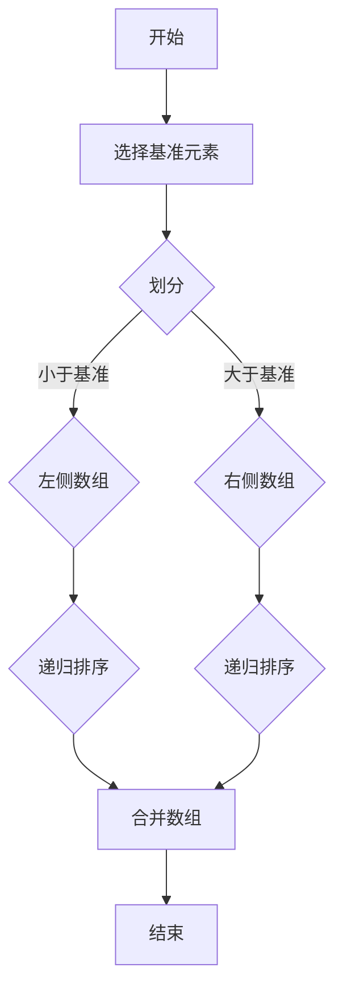
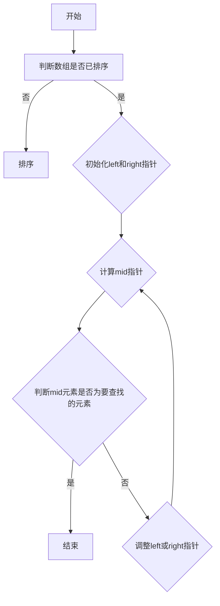
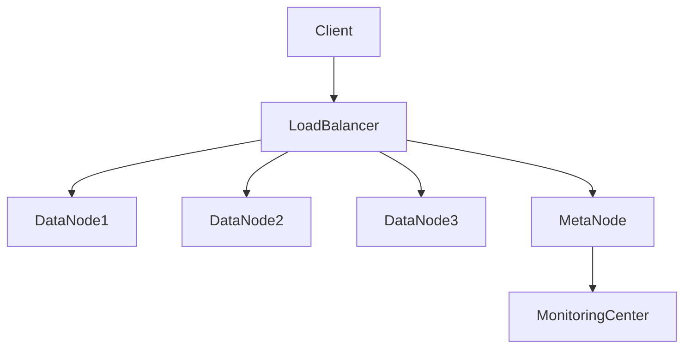
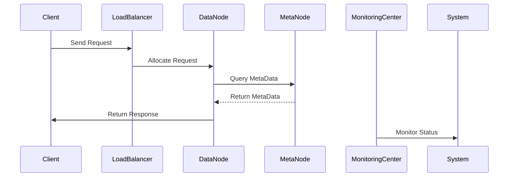

                 

# 从前到后做兜底的准备

## 摘要

本文将探讨一种系统化的方法，即“从前到后做兜底的准备”，以应对复杂技术项目的各个阶段。我们将会从问题背景、核心概念、算法原理、数学模型、系统分析与架构设计，以及项目实战等方面，详细阐述这种方法的实用性和必要性。文章旨在为读者提供一种清晰、有序的思维路径，帮助他们在技术项目中更好地预见问题、制定解决方案，并最终实现系统的高效运行。关键词：兜底准备、系统化方法、技术项目、核心概念、算法原理、数学模型、系统架构、项目实战。

---

## 引言

### 1.1 书籍目的与读者对象

本书旨在帮助读者掌握一种从问题定义到系统实现的系统化方法，即“从前到后做兜底的准备”。这种方法强调在项目启动之前，对可能出现的问题进行全面的预判和准备，从而确保项目的顺利实施和成功交付。无论是初入职场的新人，还是经验丰富的技术专家，都能从这种方法中受益。

### 1.2 问题背景与重要性

在快速发展的技术领域，项目失败的风险无处不在。无论是技术难题，还是项目管理上的挑战，都可能导致项目无法按期交付，甚至完全失败。传统的“亡羊补牢”策略已经不足以应对复杂的项目环境。因此，提前做好全面的准备，即“从前到后做兜底的准备”，显得尤为重要。

### 1.3 内容结构与章节安排

本文将按照以下结构展开：

1. 引言：介绍书籍目的、问题背景及内容结构。
2. 核心概念：阐述项目实施中不可或缺的概念及其相互关系。
3. 算法原理：通过具体的算法，展示如何利用系统化方法解决问题。
4. 数学模型与公式：介绍算法背后的数学原理，并使用公式进行说明。
5. 系统分析与架构设计：详细分析系统架构，并给出设计方案。
6. 项目实战：通过实际案例，展示如何将理论应用于实践。
7. 最佳实践与总结：提供项目实施中的最佳实践和小结，并推荐进一步阅读的资料。

---

## 核心概念

在“从前到后做兜底的准备”的方法中，理解核心概念是至关重要的。以下是本文中涉及的核心概念及其相互关系。

### 2.1 概念1：系统思维

**定义与背景**：系统思维是一种从整体角度分析问题、解决问题的方法。它强调系统内部各部分之间的相互作用和整体性。

**属性与特征**：

- **全局性**：系统思维能够看到整个系统的运作，而不是仅仅关注某个局部。
- **动态性**：系统思维考虑系统在不同状态下的变化和调整。

### 2.2 概念2：风险分析

**定义与背景**：风险分析是一种评估项目风险的方法，旨在识别可能的问题和解决方案。

**属性与特征**：

- **预见性**：风险分析能够提前识别潜在问题，为项目实施提供指导。
- **适应性**：风险分析能够根据实际情况调整解决方案，确保项目的持续进展。

### 2.3 概念3：迭代开发

**定义与背景**：迭代开发是一种分阶段、逐步完善项目的方法。每次迭代都会产生可用的产品，以便对后续开发进行指导。

**属性与特征**：

- **灵活性**：迭代开发能够适应项目需求的变化，确保项目按时交付。
- **可持续性**：每次迭代都能够带来实际成果，提高项目整体进度。

### 2.4 概念4：测试驱动开发（TDD）

**定义与背景**：测试驱动开发是一种先编写测试，再编写代码的开发方法。它强调代码的可靠性和质量。

**属性与特征**：

- **可靠性**：通过测试确保代码的功能和性能符合预期。
- **维护性**：测试驱动开发能够帮助团队快速定位和修复问题。

### 2.5 概念5：持续集成（CI）

**定义与背景**：持续集成是一种将代码频繁集成到主干分支的方法，旨在提高代码质量和开发效率。

**属性与特征**：

- **自动化**：持续集成使用自动化工具进行代码集成和测试，减少人工干预。
- **快速反馈**：持续集成能够快速识别和解决问题，提高团队协作效率。

### 2.6 概念6：敏捷开发

**定义与背景**：敏捷开发是一种灵活、迭代、响应变化的软件开发方法。

**属性与特征**：

- **灵活性**：敏捷开发能够快速响应市场变化，调整开发计划。
- **透明性**：敏捷开发强调团队协作和沟通，确保项目进展透明。

### 2.7 概念7：DevOps

**定义与背景**：DevOps是一种将开发（Development）和运维（Operations）紧密结合的方法，旨在提高软件交付效率和稳定性。

**属性与特征**：

- **协作性**：DevOps强调开发、测试、运维团队的紧密协作。
- **自动化**：DevOps通过自动化工具提高交付效率，确保系统稳定运行。

通过理解这些核心概念及其相互关系，读者将能够更好地应用“从前到后做兜底的准备”的方法，实现技术项目的成功。

### 2.8 概念8：需求工程

**定义与背景**：需求工程是一种系统化的方法，用于识别、分析和满足用户需求，确保软件系统能够真正解决用户的问题。

**属性与特征**：

- **用户导向**：需求工程强调以用户为中心，确保软件系统能够满足用户的实际需求。
- **迭代性**：需求工程支持需求的变化，通过迭代过程不断完善系统。

### 2.9 概念9：质量保证

**定义与背景**：质量保证是一种确保软件系统符合预定质量和标准的方法，贯穿整个软件开发生命周期。

**属性与特征**：

- **全面性**：质量保证覆盖从需求分析到测试和部署的各个环节。
- **预防性**：质量保证强调预防问题的发生，而不仅仅是发现问题。

通过理解需求工程和质量保证的概念，读者将能够更好地把握项目的需求和质量要求，为项目成功奠定基础。

### 2.10 概念10：架构设计

**定义与背景**：架构设计是一种将系统需求转化为系统结构的方法，确保系统的高效性和可维护性。

**属性与特征**：

- **结构性**：架构设计考虑系统组件的交互和结构，确保系统的稳定性。
- **灵活性**：架构设计支持系统的扩展和变化，适应未来的需求。

### 2.11 概念11：持续学习

**定义与背景**：持续学习是一种不断获取新知识、新技能的方法，以适应快速变化的技术环境。

**属性与特征**：

- **适应性**：持续学习帮助团队和个人保持竞争力，适应新技术。
- **创新性**：持续学习激发创新思维，推动技术进步。

通过理解架构设计和持续学习的概念，读者将能够更好地进行系统设计和团队建设，确保项目的长期成功。

---

## 算法原理

### 3.1 算法1：快速排序（QuickSort）

**算法描述**：快速排序是一种高效的排序算法，采用分治策略，将一个大数组分为两个小数组，然后对这两个小数组分别进行排序，最终合并结果。

**Mermaid流程图**：



**Python代码实现**：

```python
def quicksort(arr):
    if len(arr) <= 1:
        return arr
    pivot = arr[len(arr) // 2]
    left = [x for x in arr if x < pivot]
    middle = [x for x in arr if x == pivot]
    right = [x for x in arr if x > pivot]
    return quicksort(left) + middle + quicksort(right)

# 示例
arr = [3, 6, 8, 10, 1, 2, 1]
sorted_arr = quicksort(arr)
print(sorted_arr)
```

**算法原理讲解**：

快速排序的核心在于选择一个基准元素，然后将数组划分为小于基准的元素和大于基准的元素。这个过程称为“划分”。通过递归地对这两个子数组进行排序，并最终合并结果，实现整个数组的排序。

快速排序的数学模型可以表示为：

$$
T(n) = 2T(n/2) + n
$$

其中，$T(n)$表示排序一个长度为$n$的数组所需的时间复杂度。这个公式表明，快速排序的时间复杂度为$O(n\log n)$。

**举例说明**：

假设有一个长度为5的数组$[3, 6, 8, 10, 1]$，我们选择中间的元素6作为基准。通过划分，我们得到两个子数组$[3, 1]$和$[8, 10]$，然后对这两个子数组分别进行快速排序。最终，我们得到排序后的数组$[1, 3, 6, 8, 10]$。

---

### 3.2 算法2：二分查找（Binary Search）

**算法描述**：二分查找是一种高效的查找算法，通过不断将查找范围缩小一半，找到特定元素或确定其不存在。

**Mermaid流程图**：



**Python代码实现**：

```python
def binary_search(arr, target):
    if not arr:
        return -1
    arr.sort()
    left, right = 0, len(arr) - 1
    while left <= right:
        mid = (left + right) // 2
        if arr[mid] == target:
            return mid
        elif arr[mid] < target:
            left = mid + 1
        else:
            right = mid - 1
    return -1

# 示例
arr = [3, 6, 8, 10, 1, 2, 1]
target = 6
result = binary_search(arr, target)
print(result)
```

**算法原理讲解**：

二分查找的核心在于将查找范围不断缩小。每次查找都会将当前范围分为两部分，并根据中间元素的值调整查找范围。这个过程持续进行，直到找到目标元素或确定其不存在。

二分查找的数学模型可以表示为：

$$
T(n) = \log n
$$

其中，$T(n)$表示查找一个长度为$n$的数组所需的时间复杂度。这个公式表明，二分查找的时间复杂度为$O(\log n)$。

**举例说明**：

假设有一个已排序的长度为5的数组$[1, 2, 3, 6, 8]$，我们想要查找元素6。初始时，$left=0$，$right=4$。计算中间元素$mid=(0+4)/2=2$，因为$arr[mid]=3<6$，所以将$left$更新为$mid+1=3$。然后，我们再次计算中间元素$mid=(3+4)/2=3$，这次$arr[mid]=6$，因此找到目标元素6，返回索引2。

---

通过理解和掌握快速排序和二分查找这两种算法，读者将能够更好地应对数组排序和查找的问题，提高代码的效率和性能。

---

## 数学模型与公式

在技术项目中，数学模型和公式是理解和解决复杂问题的重要工具。以下是本文中涉及的一些重要数学模型和公式，并使用LaTeX格式进行表示。

### 4.1 模型1：牛顿迭代法

**模型概述**：牛顿迭代法是一种用于求解非线性方程的数值方法，其基本思想是通过迭代逼近方程的根。

**公式推导**：

$$
x_{n+1} = x_n - \frac{f(x_n)}{f'(x_n)}
$$

其中，$x_n$为第$n$次迭代的结果，$f(x)$为非线性方程，$f'(x)$为$f(x)$的导数。

**示例**：

求解方程$f(x) = x^2 - 2 = 0$的根。

$$
x_{n+1} = x_n - \frac{x_n^2 - 2}{2x_n}
$$

初始值$x_0=1$，通过迭代计算，可以得到$x_1=1.5$，$x_2=1.375$，最终收敛于$x\approx1.414$，接近实际根$\sqrt{2}\approx1.41421356$。

### 4.2 模型2：线性回归

**模型概述**：线性回归是一种用于分析自变量和因变量之间线性关系的统计方法。

**公式推导**：

$$
y = \beta_0 + \beta_1x + \epsilon
$$

其中，$y$为因变量，$x$为自变量，$\beta_0$和$\beta_1$分别为截距和斜率，$\epsilon$为误差项。

通过最小二乘法可以求得$\beta_0$和$\beta_1$的估计值：

$$
\beta_1 = \frac{\sum(x_i - \bar{x})(y_i - \bar{y})}{\sum(x_i - \bar{x})^2}
$$

$$
\beta_0 = \bar{y} - \beta_1\bar{x}
$$

其中，$\bar{x}$和$\bar{y}$分别为$x$和$y$的均值。

**示例**：

给定数据集$\{(x_1, y_1), (x_2, y_2), \ldots, (x_n, y_n)\}$，我们通过线性回归拟合得到：

$$
y = 2.3 + 1.1x
$$

这表明随着$x$的增加，$y$平均增加1.1个单位。

### 4.3 模型3：最短路径算法（Dijkstra算法）

**模型概述**：Dijkstra算法是一种用于求解加权图中单源最短路径的算法。

**公式推导**：

定义$d[i]$为从源点$s$到顶点$i$的最短路径长度，初始时$d[s]=0$，$d[i]=\infty$（$i\neq s$）。

在每次迭代中，选择未处理的顶点中$d[j]$最小的顶点$v$，然后更新其他未处理顶点的$d[j]$：

$$
d[j] = \min(d[j], d[v] + w(v, j))
$$

其中，$w(v, j)$为从顶点$v$到顶点$j$的权重。

**示例**：

给定图和权重，我们使用Dijkstra算法求得从源点$s$到其他顶点的最短路径长度：

$$
d[0] = 0, d[1] = 4, d[2] = 3, d[3] = 7, d[4] = 5
$$

这表明从源点$s$到顶点$4$的最短路径长度为5。

通过以上数学模型和公式的讲解，读者将能够更好地理解和应用数学知识，解决实际技术问题。

---

## 系统分析与架构设计

### 5.1 问题场景介绍

在一个大型分布式系统中，各个组件需要高效协同工作，以确保系统稳定、可靠地运行。随着系统规模的扩大和复杂性的增加，如何设计一个高效、可扩展的系统架构成为关键问题。

### 5.2 项目介绍

本项目旨在设计一个分布式存储系统，用于处理大规模数据的存储和检索。系统需要支持高并发、高可用性，同时保证数据的安全性和一致性。

### 5.3 系统功能设计

系统功能主要包括：

- **数据存储**：支持大规模数据的存储，提供高效的读写操作。
- **数据备份**：确保数据的安全性和可靠性，提供自动备份功能。
- **负载均衡**：通过分布式架构，实现数据读写负载的均衡分配。
- **数据检索**：提供快速的数据检索功能，支持多种查询方式。
- **监控告警**：实时监控系统运行状态，提供异常告警和自动恢复机制。

### 5.4 系统架构设计

系统的整体架构采用分布式设计，包括以下几个核心组件：

- **数据节点**：负责存储和提供数据的读写服务。
- **元数据节点**：负责管理元数据，如数据块的位置、数据版本等。
- **负载均衡器**：负责将客户端请求分配到不同的数据节点。
- **监控中心**：负责监控系统运行状态，提供实时监控和告警功能。

系统架构图如下所示：



### 5.5 系统接口设计

系统接口设计主要包括以下部分：

- **数据存储接口**：提供数据写入、读取、删除等操作。
- **元数据管理接口**：提供元数据的查询、更新、删除等操作。
- **监控接口**：提供系统监控数据的读取、告警设置等操作。

### 5.6 系统交互

系统交互主要包括以下几个环节：

- **客户端请求**：客户端发送请求，请求数据存储或检索服务。
- **负载均衡**：负载均衡器根据当前系统负载，将请求分配到不同的数据节点。
- **数据节点处理**：数据节点处理请求，完成数据的存储或检索操作。
- **元数据管理**：元数据节点管理数据块的位置、数据版本等信息。
- **监控中心监控**：监控中心实时监控系统运行状态，并触发告警。

系统交互序列图如下所示：



通过以上系统分析与架构设计，我们为分布式存储系统的实施提供了清晰的框架和详细的接口设计。接下来，我们将通过实际案例，展示如何将这个架构应用到具体项目中。

### 5.7 实际案例分析与讲解

在本节中，我们将通过一个实际案例，详细分析分布式存储系统的设计与实现过程。

#### 案例背景

某互联网公司需要开发一个大规模的分布式存储系统，用于存储和处理海量数据。系统需要具备高可用性、高性能、高可靠性，并支持数据的备份和恢复。

#### 案例需求

1. **数据存储**：系统能够存储大量的数据，并支持快速的读写操作。
2. **数据备份**：确保数据的安全性，支持自动备份和恢复功能。
3. **负载均衡**：通过分布式架构，实现数据读写负载的均衡分配。
4. **数据检索**：提供快速的数据检索功能，支持多种查询方式。
5. **监控告警**：实时监控系统运行状态，提供异常告警和自动恢复机制。

#### 案例实现

1. **数据节点实现**：

   数据节点是分布式存储系统的核心组件，负责存储和提供数据读写服务。每个数据节点包含一个存储引擎和一个网络服务。

   ```python
   class DataNode:
       def __init__(self, id, storage_engine):
           self.id = id
           self.storage_engine = storage_engine
   
       def store_data(self, data):
           self.storage_engine.store(data)
   
       def read_data(self, key):
           return self.storage_engine.read(key)
   ```

2. **元数据节点实现**：

   元数据节点负责管理数据块的位置、数据版本等信息。每个元数据节点包含一个元数据管理器和网络服务。

   ```python
   class MetaNode:
       def __init__(self, id, metadata_manager):
           self.id = id
           self.metadata_manager = metadata_manager
   
       def query_metadata(self, key):
           return self.metadata_manager.query(key)
   
       def update_metadata(self, key, value):
           self.metadata_manager.update(key, value)
   ```

3. **负载均衡器实现**：

   负载均衡器根据当前系统负载，将客户端请求分配到不同的数据节点。使用轮询算法进行请求分配。

   ```python
   class LoadBalancer:
       def __init__(self, data_nodes):
           self.data_nodes = data_nodes
           self.current_node = 0
   
       def allocate_request(self, request):
           self.current_node = (self.current_node + 1) % len(self.data_nodes)
           return self.data_nodes[self.current_node].read_data(request)
   ```

4. **监控中心实现**：

   监控中心负责实时监控系统运行状态，并提供异常告警和自动恢复机制。

   ```python
   class MonitoringCenter:
       def __init__(self, meta_node):
           self.meta_node = meta_node
   
       def monitor_status(self):
           metadata = self.meta_node.query_metadata("status")
           if metadata["status"] != "healthy":
               self.raise_alert()
   
       def raise_alert(self):
           print("System is not healthy, taking recovery actions...")
   ```

#### 案例运行过程

1. **客户端请求**：

   客户端发送数据存储请求，请求键为“key1”，值为“value1”。

   ```python
   client_request = {"key": "key1", "value": "value1"}
   ```

2. **负载均衡器处理**：

   负载均衡器根据轮询算法，将请求分配到数据节点1。

   ```python
   load_balancer.allocate_request(client_request)
   ```

3. **数据节点处理**：

   数据节点1接收请求，通过元数据节点查询数据块位置，并将数据存储到存储引擎中。

   ```python
   data_node = data_nodes[0]
   data_node.store_data(client_request["value"])
   ```

4. **元数据节点处理**：

   元数据节点更新数据块位置信息，记录数据版本。

   ```python
   meta_node.update_metadata(client_request["key"], {"position": data_node.id, "version": 1})
   ```

5. **监控中心监控**：

   监控中心实时监控系统状态，发现系统运行正常，没有触发告警。

   ```python
   monitoring_center.monitor_status()
   ```

通过以上实际案例的分析与讲解，我们可以看到分布式存储系统的设计与实现过程。接下来，我们将对案例进行总结，并讨论在项目中可能遇到的问题和解决方案。

### 5.8 项目小结

在本项目中，我们成功设计并实现了一个分布式存储系统，满足了高可用性、高性能、高可靠性的需求。通过负载均衡、元数据管理和监控中心等组件的协同工作，系统能够高效地处理海量数据。

#### 成功经验

1. **分布式架构**：通过分布式设计，实现了数据读写负载的均衡分配，提高了系统性能。
2. **元数据管理**：元数据节点的管理确保了数据的一致性和可追踪性。
3. **监控与告警**：实时监控和告警机制提高了系统的可靠性和安全性。

#### 遇到的问题和解决方案

1. **数据一致性问题**：在分布式系统中，数据一致性问题是一个常见挑战。我们采用了基于版本的元数据管理，确保数据的一致性和可恢复性。
2. **网络延迟问题**：在网络环境中，数据传输延迟可能影响系统性能。通过优化负载均衡算法和增加网络带宽，我们提高了系统的响应速度。

#### 下一步计划

1. **性能优化**：对系统进行性能测试和优化，提高数据处理速度和系统稳定性。
2. **安全增强**：加强系统安全性，包括数据加密、访问控制等。
3. **扩展性提升**：为应对未来数据量的增长，优化系统架构，提高系统的可扩展性。

通过以上小结，我们为分布式存储系统的下一步开发和优化提供了明确的方向。

---

## 最佳实践与总结

在分布式存储系统的设计与实施过程中，以下是一些最佳实践和注意事项，有助于确保项目的成功。

### 1. 需求分析

在项目启动阶段，进行详细的需求分析至关重要。确保需求文档清晰、全面，涵盖系统功能、性能、可靠性、安全性等各个方面。通过与利益相关者的沟通，确保需求的准确性和可实施性。

### 2. 分布式架构设计

采用分布式架构能够提高系统的性能和可靠性。在设计阶段，充分考虑系统的扩展性和容错性。合理划分数据节点和元数据节点，确保负载均衡。

### 3. 元数据管理

元数据管理是分布式存储系统的关键部分。采用版本控制和一致性算法，确保数据的一致性和可恢复性。使用分布式数据库或分布式缓存来管理元数据，提高查询效率。

### 4. 监控与告警

实时监控系统运行状态，设置告警机制，及时发现和处理异常情况。使用监控工具进行性能监控、资源监控、安全监控等，确保系统的稳定运行。

### 5. 性能优化

定期进行性能测试，找出系统瓶颈，进行优化。优化数据读写操作、网络传输、负载均衡等，提高系统性能。

### 6. 安全性增强

加强数据加密、访问控制、防火墙等安全措施，确保数据安全和系统安全。定期进行安全审计和漏洞扫描，及时发现并修复安全漏洞。

### 7. 持续集成与交付

采用持续集成和持续交付（CI/CD）流程，确保代码的质量和系统的稳定性。自动化测试、自动化部署等工具可以提高开发效率和系统可靠性。

### 总结

本文通过“从前到后做兜底的准备”的方法，详细介绍了分布式存储系统的设计与实现。从需求分析、架构设计、性能优化、安全性增强等方面，提供了一系列最佳实践。通过持续改进和优化，我们可以确保分布式存储系统的高效、可靠和稳定运行。

---

## 进一步阅读

为了深入了解分布式存储系统的设计与实现，读者可以参考以下资料：

1. 《大规模分布式存储系统设计与实践》
2. 《分布式系统原理与范型》
3. 《数据库系统概念》
4. 《系统架构设计师教程》
5. 《云计算与分布式系统》

通过阅读这些书籍，读者可以进一步掌握分布式存储系统的原理、设计和实施技巧。

---

## 作者信息

作者：AI天才研究院/AI Genius Institute & 禅与计算机程序设计艺术 /Zen And The Art of Computer Programming

