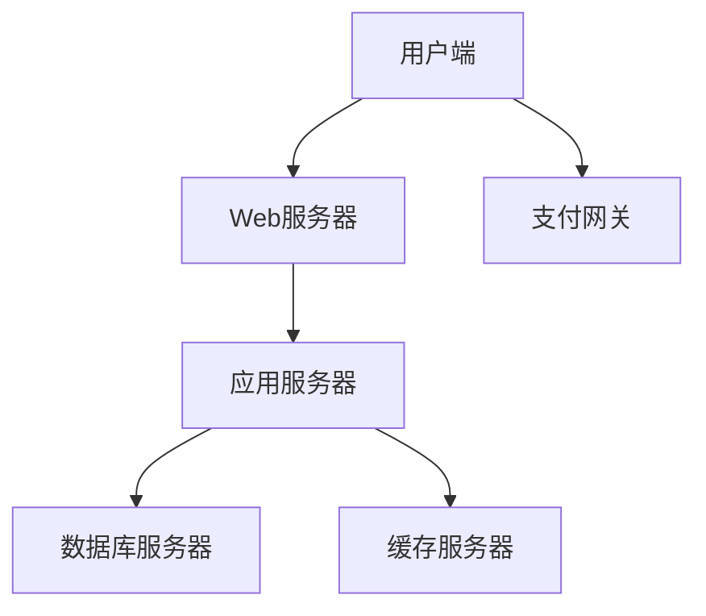

                 

### 第二部分：性能分析与工具选择

在代码优化的过程中，性能分析是至关重要的一步。只有准确地识别出程序中的性能瓶颈，我们才能有针对性地进行优化。在这一节中，我们将讨论性能分析的方法和工具，帮助您更好地理解程序的运行状态和性能问题。

#### 性能分析的基本概念

性能分析是指通过测量、监控和评估程序运行过程中的各项指标，以确定程序性能的瓶颈所在。这些指标可能包括运行时间、CPU使用率、内存使用量、磁盘I/O操作次数、网络延迟等。性能分析的基本步骤通常包括以下几方面：

1. **定义性能目标**：明确希望优化的性能指标，例如响应时间、吞吐量、内存使用等。
2. **测量当前性能**：使用工具收集程序运行时的各项性能数据。
3. **识别瓶颈**：分析测量数据，找出影响性能的关键因素。
4. **验证假设**：通过调整代码或系统配置，验证优化方案的可行性。

#### 性能分析工具

进行性能分析时，选择合适的工具非常重要。以下是一些常用的性能分析工具：

1. ** profilers**：Profiler 是一种用于分析程序运行时性能的工具，它可以监控程序的内存使用、CPU使用、调用栈等。常见的 Profiler 包括：
   - **Visual Studio Profiler**
   - **gprof**
   - **Valgrind**
   - **Java VisualVM**

2. **系统监控工具**：这些工具可以监控整个系统的性能，例如 CPU、内存、磁盘、网络等。常见的系统监控工具包括：
   - **top**
   - **htop**
   - **System Monitor**
   - **Zabbix**

3. **日志分析工具**：通过分析日志文件，可以了解程序运行时的各种情况。常见的日志分析工具包括：
   - **Logstash**
   - **Kibana**
   - **ELK Stack**

4. **负载生成工具**：这些工具可以模拟用户负载，用于性能测试。常见的负载生成工具包括：
   - **JMeter**
   - **Apache Bench**
   - **locust**

#### 性能分析的具体步骤

1. **确定性能瓶颈**：使用上述工具进行初步的性能分析，确定程序是否存在明显的性能瓶颈。
2. **收集详细数据**：针对已确定的瓶颈，使用更精细的工具进行数据收集，例如使用 Profiler 收集程序运行时的详细调用栈和性能数据。
3. **分析数据**：对收集到的数据进行分析，找出性能瓶颈的根本原因。这可能涉及到查看CPU使用率、内存分配情况、I/O延迟等。
4. **制定优化策略**：根据分析结果，制定具体的优化策略。例如，如果发现CPU使用率过高，可以尝试优化算法或代码结构。
5. **实施优化**：根据优化策略，修改代码或系统配置。
6. **验证优化效果**：重新进行性能分析，验证优化效果。如果性能没有改善，需要重新审视优化策略，进行调整。

#### 性能分析案例

假设我们有一个Web应用程序，用户在使用过程中反馈页面加载速度较慢。我们可以按照以下步骤进行性能分析：

1. **初步分析**：使用系统监控工具（如 top）观察CPU和内存使用情况，发现CPU使用率较高，且有大量线程处于等待状态。
2. **详细数据收集**：使用Java VisualVM 对应用程序进行Profiling，发现大部分时间被消耗在数据库查询上。
3. **数据分析**：分析数据库查询，发现查询语句较复杂，且没有使用索引。
4. **制定优化策略**：针对数据库查询问题，优化查询语句，并添加索引。
5. **实施优化**：修改数据库查询代码，并重新部署应用程序。
6. **验证优化效果**：使用JMeter 进行负载测试，发现页面加载速度明显提升，用户反馈良好。

通过上述步骤，我们成功解决了页面加载速度慢的问题，提升了用户体验。

#### 性能分析与优化的注意事项

1. **全面性**：在性能分析时，应全面考虑各种因素，包括CPU、内存、磁盘I/O和网络延迟等。
2. **持续性**：性能分析不应是一次性的工作，而应定期进行，以确保程序性能的持续优化。
3. **复现性**：性能问题应能够在相同的条件下复现，以确保优化措施的有效性。
4. **逐步优化**：优化应逐步进行，每次只专注于一个瓶颈，以免造成不必要的复杂性。

### 1.6 思考与练习

1. 你能列举出三种常见的性能瓶颈类型吗？
2. 在性能分析中，系统监控工具和Profiler各自有哪些优缺点？
3. 请简述如何使用 JMeter 进行性能测试。

---

作者：AI天才研究院/AI Genius Institute & 禅与计算机程序设计艺术 /Zen And The Art of Computer Programming## 第三部分：算法优化技巧

在代码优化中，算法优化是一个核心且关键的环节。通过改进算法，我们可以显著提高程序的执行效率，降低时间复杂度和空间复杂度。本节将深入探讨几种常见的算法优化技巧，包括但不限于时间复杂度分析、空间复杂度优化、常用算法改进等，并提供具体的示例和流程图，帮助您更好地理解和应用这些优化策略。

### 3.1 时间复杂度分析

时间复杂度是衡量算法效率的一个重要指标，它描述了算法执行时间与输入规模之间的关系。常见的时间复杂度表示方法包括：

- **O(1)**：常数时间，算法的执行时间与输入规模无关。
- **O(n)**：线性时间，算法的执行时间与输入规模成正比。
- **O(n²)**：平方时间，算法的执行时间与输入规模的平方成正比。
- **O(log n)**：对数时间，算法的执行时间与输入规模的以2为底的对数成正比。

#### 时间复杂度分析示例

**示例1：线性搜索算法**

线性搜索算法的时间复杂度为O(n)，即随着输入规模n的增加，算法的执行时间呈线性增长。以下是线性搜索算法的Python代码实现及其时间复杂度分析：

```python
def linear_search(arr, target):
    for i in range(len(arr)):
        if arr[i] == target:
            return i
    return -1
```

时间复杂度：O(n)

**示例2：二分搜索算法**

二分搜索算法的时间复杂度为O(log n)，即随着输入规模n的增加，算法的执行时间呈对数增长。以下是二分搜索算法的Python代码实现及其时间复杂度分析：

```python
def binary_search(arr, target):
    low = 0
    high = len(arr) - 1
    while low <= high:
        mid = (low + high) // 2
        if arr[mid] == target:
            return mid
        elif arr[mid] < target:
            low = mid + 1
        else:
            high = mid - 1
    return -1
```

时间复杂度：O(log n)

### 3.2 空间复杂度优化

空间复杂度是衡量算法所需存储空间的一个重要指标，它描述了算法的存储需求与输入规模之间的关系。与时间复杂度类似，常见空间复杂度的表示方法包括：

- **O(1)**：常数空间，算法的存储需求与输入规模无关。
- **O(n)**：线性空间，算法的存储需求与输入规模成正比。
- **O(n²)**：平方空间，算法的存储需求与输入规模的平方成正比。

#### 空间复杂度优化示例

**示例1：空间换时间**

在某些情况下，可以通过增加空间复杂度来减少时间复杂度。例如，在求最大子序列和的问题中，我们可以使用额外的空间存储前缀和，从而减少计算次数。

```python
def max_subarray_sum(arr):
    n = len(arr)
    max_sum = float('-inf')
    pre_sum = [0] * n
    pre_sum[0] = arr[0]
    for i in range(1, n):
        pre_sum[i] = pre_sum[i - 1] + arr[i]
        max_sum = max(max_sum, pre_sum[i], pre_sum[i] - pre_sum[i - 1])
    return max_sum
```

时间复杂度：O(n)
空间复杂度：O(n)

**示例2：原地算法**

原地算法是指在不额外占用空间的情况下解决问题的算法。例如，原地归并排序可以在不使用额外数组的情况下实现归并操作。

```python
def merge(arr, left, mid, right):
    i, j, k = left, mid + 1, left
    while i <= mid and j <= right:
        if arr[i] <= arr[j]:
            arr[k] = arr[i]
            i += 1
        else:
            arr[k] = arr[j]
            j += 1
        k += 1
    while i <= mid:
        arr[k] = arr[i]
        i += 1
        k += 1
    while j <= right:
        arr[k] = arr[j]
        j += 1
        k += 1

def merge_sort(arr, left, right):
    if left < right:
        mid = (left + right) // 2
        merge_sort(arr, left, mid)
        merge_sort(arr, mid + 1, right)
        merge(arr, left, mid, right)
```

时间复杂度：O(n log n)
空间复杂度：O(1)

### 3.3 常用算法改进

以下是一些常见算法的改进方法：

**示例1：快速排序算法**

快速排序是一种高效的排序算法，其时间复杂度平均为O(n log n)。通过使用随机化选择枢轴元素，可以避免最坏情况的发生。

```python
import random

def quicksort(arr):
    if len(arr) <= 1:
        return arr
    pivot = random.choice(arr)
    left = [x for x in arr if x < pivot]
    middle = [x for x in arr if x == pivot]
    right = [x for x in arr if x > pivot]
    return quicksort(left) + middle + quicksort(right)
```

时间复杂度：O(n log n)

**示例2：哈希表优化搜索算法**

使用哈希表可以显著提高搜索效率，特别是当数据量大且需要快速检索时。哈希表的平均时间复杂度为O(1)。

```python
def hash_search(hash_table, key):
    hash_value = hash(key) % len(hash_table)
    return hash_table[hash_value]
```

时间复杂度：O(1)

### 3.4 算法优化流程与策略

进行算法优化时，可以遵循以下流程和策略：

1. **需求分析**：明确优化目标和需求，确定需要优化的算法。
2. **算法分析**：分析现有算法的时间复杂度和空间复杂度，确定优化方向。
3. **选择优化策略**：根据算法分析结果，选择合适的优化策略，如算法改进、数据结构优化等。
4. **实现优化**：根据优化策略，修改算法或数据结构。
5. **测试验证**：对优化后的算法进行测试，确保性能提升，同时不引入新的问题。

### 3.5 本章小结

算法优化是代码优化的重要组成部分，通过分析时间复杂度和空间复杂度，我们可以选择合适的优化策略，显著提高程序的执行效率。本节介绍了时间复杂度分析、空间复杂度优化以及常用算法改进的方法，并通过具体示例进行了详细讲解。通过掌握这些算法优化技巧，开发者可以在实际项目中更好地提升代码性能。

### 1.6 思考与练习

1. 线性搜索和二分搜索算法的时间复杂度分别是多少？它们适用于什么场景？
2. 请简述空间换时间策略的原理和应用场景。
3. 快速排序和归并排序的时间复杂度分别是多少？它们各自的优势是什么？

---

作者：AI天才研究院/AI Genius Institute & 禅与计算机程序设计艺术 /Zen And The Art of Computer Programming## 第四部分：数据结构优化技巧

数据结构是程序设计中至关重要的组成部分，它直接影响算法的性能。合适的数据结构可以显著提高程序的运行效率。本节将介绍几种常见的数据结构及其优化技巧，包括链表、数组、栈、队列、哈希表等，并提供具体的优化方法和实例，帮助您更好地理解和应用这些数据结构。

### 4.1 链表

链表是一种由节点组成的线性数据结构，每个节点包含数据和指向下一个节点的指针。链表相比于数组具有更好的动态性，但访问中间元素的时间复杂度较高。

#### 优化技巧

**1. 双向链表**

双向链表在每个节点中增加了一个指向前一个节点的指针，从而允许双向遍历，提高了插入和删除操作的效率。

```python
class Node:
    def __init__(self, data):
        self.data = data
        self.next = None
        self.prev = None

class DoublyLinkedList:
    def __init__(self):
        self.head = None

    def append(self, data):
        new_node = Node(data)
        if not self.head:
            self.head = new_node
            return
        current = self.head
        while current.next:
            current = current.next
        current.next = new_node
        new_node.prev = current
```

**2. 循环链表**

循环链表是一种特殊的链表，其中最后一个节点的指针指向第一个节点，形成了一个环。这可以简化插入和删除操作。

```python
class CircularLinkedList:
    def __init__(self):
        self.head = None

    def append(self, data):
        new_node = Node(data)
        if not self.head:
            self.head = new_node
            self.head.next = self.head
            return
        current = self.head
        while current.next != self.head:
            current = current.next
        current.next = new_node
        new_node.next = self.head
```

### 4.2 数组

数组是一种固定大小的线性数据结构，它在存储和访问元素方面非常高效。

#### 优化技巧

**1. 扩展数组**

当数组容量不足时，可以通过动态扩展来增加容量。常见的方法是创建一个新的、更大的数组，并将旧数组的内容复制到新数组中。

```python
def extend_array(arr, new_size):
    new_arr = [0] * new_size
    for i in range(len(arr)):
        new_arr[i] = arr[i]
    return new_arr
```

**2. 数组划分**

通过将数组划分为不同的子数组，可以针对不同类型的操作优化性能。例如，可以将数组划分为缓存区和非缓存区，以优化频繁的读写操作。

### 4.3 栈

栈是一种后进先出（LIFO）的数据结构，常用于递归、表达式求值等场景。

#### 优化技巧

**1. 满栈**

满栈是一种动态分配的栈，当栈满时，会重新分配更大的内存空间。

```python
class FullStack:
    def __init__(self, initial_size):
        self.capacity = initial_size
        self.data = [None] * self.capacity
        self.top = -1

    def push(self, item):
        if self.top == self.capacity - 1:
            self.resize()
        self.data[self.top + 1] = item
        self.top += 1

    def resize(self):
        self.capacity *= 2
        new_data = [None] * self.capacity
        for i in range(self.top + 1):
            new_data[i] = self.data[i]
        self.data = new_data
```

**2. 栈数组**

使用数组实现栈可以减少指针的使用，提高执行效率。

### 4.4 队列

队列是一种先进先出（FIFO）的数据结构，常用于消息队列、任务调度等场景。

#### 优化技巧

**1. 循环队列**

循环队列是一种解决假溢出问题的队列实现，通过将队列看做一个环，可以充分利用空间。

```python
class CircularQueue:
    def __init__(self, capacity):
        self.capacity = capacity
        self.queue = [None] * capacity
        self.front = self.rear = -1

    def enQueue(self, item):
        if (self.rear + 1) % self.capacity == self.front:
            print("Full")
        else:
            self.rear = (self.rear + 1) % self.capacity
            self.queue[self.rear] = item

    def deQueue(self):
        if self.front == self.rear:
            print("Empty")
        else:
            self.front = (self.front + 1) % self.capacity
```

**2. 双端队列**

双端队列允许在队列的两端进行插入和删除操作，提高了灵活性。

```python
class Deque:
    def __init__(self, capacity):
        self.capacity = capacity
        self.queue = [None] * capacity
        self.front = self.rear = 0

    def enQueueFront(self, item):
        if self.rear + 1 == self.front:
            print("Full")
        else:
            self.front = (self.front - 1 + self.capacity) % self.capacity
            self.queue[self.front] = item

    def deQueueRear(self):
        if self.front == self.rear:
            print("Empty")
        else:
            self.rear = (self.rear - 1 + self.capacity) % self.capacity
```

### 4.5 哈希表

哈希表是一种基于关键字快速检索的数据结构，通过哈希函数将关键字映射到数组中的索引。

#### 优化技巧

**1. 链地址法**

链地址法通过将所有哈希冲突的元素存储在同一条链表中，从而解决冲突。

```python
class HashTable:
    def __init__(self, size):
        self.size = size
        self.table = [None] * size

    def hash_function(self, key):
        return key % self.size

    def insert(self, key, value):
        index = self.hash_function(key)
        if self.table[index] is None:
            self.table[index] = []
        self.table[index].append((key, value))
```

**2. 开放地址法**

开放地址法通过在哈希表中寻找下一个可用位置来解决冲突，常见的开放地址法包括线性探测、二次探测和双宽度探测。

```python
class OpenAddressingHashTable:
    def __init__(self, size):
        self.size = size
        self.table = [None] * size

    def hash_function(self, key):
        return key % self.size

    def insert(self, key, value):
        index = self.hash_function(key)
        while self.table[index] is not None:
            if self.table[index][0] == key:
                self.table[index] = (key, value)
                return
            index = (index + 1) % self.size
        self.table[index] = (key, value)
```

### 4.6 数据结构优化流程与策略

进行数据结构优化时，可以遵循以下流程和策略：

1. **需求分析**：明确优化目标和需求，确定需要优化的数据结构。
2. **数据结构选择**：根据需求选择合适的数据结构。
3. **优化策略制定**：分析现有数据结构的性能瓶颈，制定优化策略。
4. **实现优化**：根据优化策略，修改数据结构或实现方式。
5. **测试验证**：对优化后的数据结构进行测试，确保性能提升，同时不引入新的问题。

### 4.7 本章小结

数据结构优化是代码优化的重要组成部分，通过选择合适的数据结构和优化策略，我们可以显著提高程序的运行效率。本节介绍了链表、数组、栈、队列和哈希表等常见数据结构的优化技巧，并通过具体实例进行了详细讲解。通过掌握这些数据结构优化技巧，开发者可以在实际项目中更好地提升代码性能。

### 1.6 思考与练习

1. 链表和数组在性能上有哪些优缺点？
2. 请简述双向链表和循环链表的区别和应用场景。
3. 哈希表在解决冲突时有哪些常见的方法？

---

作者：AI天才研究院/AI Genius Institute & 禅与计算机程序设计艺术 /Zen And The Art of Computer Programming## 第五部分：并行与并发优化技巧

并行和并发优化是提高程序性能的重要手段，特别是在多核处理器普及的今天。通过合理地利用多线程、异步IO、并发编程模型等技术，我们可以显著提升程序的执行效率。本节将介绍并行与并发优化的基本概念、常用技术和实际案例，帮助您更好地理解和应用这些优化技巧。

### 5.1 并行与并发的基本概念

**并行性（Parallelism）**：并行性指的是在多个处理单元上同时执行多个任务或任务的一部分。并行性可以分为时间并行性、空间并行性和数据并行性：

- **时间并行性**：通过重叠不同任务的执行时间来提高性能。
- **空间并行性**：通过在多个处理单元上同时执行任务的不同部分来提高性能。
- **数据并行性**：通过将大数据集分割成小块，同时在多个处理单元上并行处理这些小块来提高性能。

**并发性（Concurrency）**：并发性指的是在多个处理单元上同时执行多个任务的能力。并发性涉及到任务调度、同步和通信等问题。

**并行与并发的关系**：并行性是并发性的一个子集。并行性关注的是任务的执行速度，而并发性关注的是如何高效地管理多个任务。

### 5.2 并行优化技术

**1. 多线程**

多线程是一种常见的并行优化技术，通过创建多个线程来同时执行多个任务。每个线程可以独立执行，从而提高程序的执行效率。

**多线程优化示例**：

```python
import threading

def thread_function(name):
    print(f"Thread {name}: 开始执行")
    # 执行任务
    print(f"Thread {name}: 结束执行")

# 创建并启动线程
thread1 = threading.Thread(target=thread_function, args=("Thread-1",))
thread2 = threading.Thread(target=thread_function, args=("Thread-2",))

thread1.start()
thread2.start()

# 等待线程执行完成
thread1.join()
thread2.join()
```

**2. 并行计算库**

许多编程语言提供了并行计算库，如Python的NumPy和C++的OpenMP，这些库可以简化并行编程，提高编程效率。

**NumPy并行计算示例**：

```python
import numpy as np
import numpy.ma as ma

# 创建大型数组
large_array = np.random.rand(1000000)

# 使用NumPy的并行计算功能
result = ma.mean(large_array)
```

**3. 数据并行处理**

数据并行处理是将大数据集分割成小块，同时在多个处理单元上并行处理这些小块，然后将结果汇总。

**数据并行处理示例**：

```python
import multiprocessing as mp

# 创建大型数据集
data = np.random.rand(1000000)

# 分割数据集
num_cores = mp.cpu_count()
chunk_size = len(data) // num_cores

chunks = [data[i:i + chunk_size] for i in range(0, len(data), chunk_size)]

# 定义并行处理函数
def process_chunk(chunk):
    return ma.mean(chunk)

# 创建进程池并并行处理数据
with mp.Pool(processes=num_cores) as pool:
    results = pool.map(process_chunk, chunks)

# 汇总结果
final_result = ma.mean(np.concatenate(results))
```

### 5.3 并发优化技术

**1. 异步IO**

异步IO是一种通过非阻塞方式处理I/O操作的技术，可以避免程序在等待I/O操作完成时阻塞，从而提高程序的性能。

**异步IO示例**：

```python
import asyncio

async def async_function():
    print("异步函数开始执行")
    await asyncio.sleep(1)
    print("异步函数结束执行")

# 创建事件循环并运行异步函数
loop = asyncio.get_event_loop()
loop.run_until_complete(async_function())
```

**2. 并发编程模型**

并发编程模型提供了一套用于编写并发程序的抽象，如Python的异步编程模型、Go的协程等，这些模型可以简化并发编程，提高并发性能。

**Go协程示例**：

```go
package main

import (
    "fmt"
    "time"
)

func asyncFunction() {
    time.Sleep(100 * time.Millisecond)
    fmt.Println("协程执行完成")
}

func main() {
    go asyncFunction()
    time.Sleep(200 * time.Millisecond)
}
```

### 5.4 并行与并发优化案例分析

**案例1：Web服务器性能优化**

假设我们有一个处理HTTP请求的Web服务器，为了提升性能，我们可以采用以下优化措施：

1. **多线程处理请求**：通过创建多个线程来同时处理多个请求。
2. **异步IO**：使用异步IO处理I/O操作，避免线程阻塞。
3. **负载均衡**：将请求负载均衡地分配到多个服务器实例上。

**案例2：大数据处理**

假设我们需要处理一个大型数据集，为了提高处理速度，我们可以采用以下优化措施：

1. **数据并行处理**：将数据集分割成小块，并在多个处理单元上并行处理。
2. **分布式计算**：使用分布式计算框架（如Hadoop、Spark）来处理海量数据。
3. **并行算法**：使用并行算法来处理数据，如并行排序、并行矩阵乘法等。

### 5.5 并行与并发优化流程与策略

进行并行与并发优化时，可以遵循以下流程和策略：

1. **需求分析**：明确优化目标和需求，确定需要优化的部分。
2. **性能分析**：使用性能分析工具识别性能瓶颈。
3. **选择优化技术**：根据性能分析结果，选择合适的并行或并发优化技术。
4. **实现优化**：根据优化技术，修改代码或系统配置。
5. **测试验证**：对优化后的代码进行测试，确保性能提升，同时不引入新的问题。

### 5.6 本章小结

并行与并发优化是提高程序性能的重要手段，通过合理地利用多线程、异步IO、并发编程模型等技术，我们可以显著提升程序的执行效率。本节介绍了并行与并发优化的基本概念、常用技术和实际案例，并通过具体实例进行了详细讲解。通过掌握这些并行与并发优化技巧，开发者可以在实际项目中更好地提升代码性能。

### 1.6 思考与练习

1. 并行性和并发性的区别是什么？请举例说明。
2. 请简述多线程和异步IO在性能优化中的应用和优缺点。
3. 请简述如何使用Python的异步编程模型进行并发编程。

---

作者：AI天才研究院/AI Genius Institute & 禅与计算机程序设计艺术 /Zen And The Art of Computer Programming## 第六部分：编译优化技术

编译优化是提升程序性能的重要手段之一。编译器通过对源代码进行各种优化，可以生成更高效的机器代码，从而提高程序的运行速度和资源利用率。本节将介绍编译优化的基本原理、常见优化技术，以及如何选择和配置编译器以实现最佳性能。

### 6.1 编译优化的基本原理

编译优化是指在编译过程中对源代码进行分析和转换，以减少程序执行时间、占用内存和磁盘I/O等。编译优化的主要目标包括：

- **减少执行时间**：通过优化代码路径、算法和数据结构，减少程序执行所需的时间。
- **降低内存使用**：减少程序在运行时的内存占用，从而提高程序的效率和稳定性。
- **减少磁盘I/O**：优化磁盘读写操作，减少程序在读写磁盘时的延迟。
- **提高可读性和可维护性**：虽然编译优化主要是为了提高性能，但在某些情况下，也会考虑代码的可读性和可维护性。

### 6.2 常见编译优化技术

**1. 删除冗余代码**

编译器可以识别并删除程序中的冗余代码，如未使用的变量、函数和代码块，从而减少程序的体积和执行时间。

**2. 代码重排**

编译器可以对代码进行重排，以减少控制流分支和循环的跳转次数，从而提高程序的执行效率。

**3. 循环优化**

循环优化是编译优化中的一项重要技术，包括循环展开、循环融合、循环分发等，以减少循环的开销和执行时间。

**4. 内存优化**

内存优化包括减少内存分配、优化内存访问模式、减少内存碎片等，以降低程序的内存占用和提升性能。

**5. 运行时优化**

运行时优化是指编译器在程序运行时根据实际情况进行动态优化，如自适应优化、运行时编译等。

### 6.3 编译器优化选项

不同的编译器提供了多种优化选项，这些选项可以单独使用或组合使用，以达到最佳的优化效果。以下是一些常见的编译器优化选项：

- **-O0**：不进行优化。
- **-O1**：进行基本的优化。
- **-O2**：进行中等程度的优化。
- **-O3**：进行更高级的优化，可能会牺牲编译时间和代码大小。
- **-Os**：优化以减小程序大小。
- **-Ofast**：进行所有可能的优化，包括那些可能会导致代码不稳定或不符合标准规范的优化。

### 6.4 编译优化案例分析

**案例1：C++程序编译优化**

假设我们有一个C++程序，要使用GCC编译器进行编译优化。我们可以通过以下命令进行编译：

```bash
gcc -O3 -march=native -funroll-loops -flto main.cpp -o main
```

- `-O3`：启用高级优化。
- `-march=native`：优化代码以充分利用目标CPU的特性。
- `-funroll-loops`：展开循环，减少循环的开销。
- `-flto`：启用链接时间优化，提高程序的整体性能。

**案例2：Java程序编译优化**

Java程序的编译优化可以通过使用Javac编译器来实现。以下是一个优化示例：

```bash
javac -O -g main.java
```

- `-O`：启用优化。
- `-g`：生成调试信息。

### 6.5 选择和配置编译器

选择合适的编译器和配置优化选项是编译优化的重要一环。以下是一些选择和配置编译器的建议：

1. **了解目标平台**：选择适合目标平台的编译器，以便充分利用硬件特性。
2. **考虑性能和编译时间**：根据项目需求，在性能和编译时间之间进行权衡。
3. **了解编译器文档**：仔细阅读编译器的文档，了解其提供的优化选项和特性。
4. **进行基准测试**：对不同编译器和优化选项进行基准测试，选择最优的配置。

### 6.6 本章小结

编译优化是提高程序性能的重要手段，通过优化代码路径、算法和数据结构，编译器可以生成更高效的机器代码。本节介绍了编译优化的基本原理、常见优化技术以及如何选择和配置编译器以实现最佳性能。通过掌握这些编译优化技巧，开发者可以在实际项目中显著提升代码的性能。

### 1.6 思考与练习

1. 请简述编译优化与运行时优化的区别和联系。
2. 如何在编译过程中进行内存优化？
3. 请简述如何选择和使用编译器的优化选项。

---

作者：AI天才研究院/AI Genius Institute & 禅与计算机程序设计艺术 /Zen And The Art of Computer Programming## 第七部分：内存管理优化

内存管理优化是提高程序性能的关键因素之一。在程序运行过程中，合理地分配和回收内存资源可以减少内存占用、提高程序效率，并避免内存泄漏等问题。本节将介绍内存管理的基本概念、常见的内存管理问题以及优化技巧，并提供具体的实例和分析，帮助您更好地理解和应用这些优化策略。

### 7.1 内存管理的基本概念

内存管理是指操作系统或应用程序对内存资源进行分配、使用和回收的过程。内存管理的目标包括：

- **高效利用内存资源**：通过合理的内存分配和回收策略，提高内存的利用率。
- **减少内存碎片**：避免内存碎片化，导致内存无法有效利用。
- **提高程序稳定性**：通过避免内存泄漏和异常，提高程序的稳定性。
- **优化程序性能**：通过减少内存分配和回收的开销，提高程序的执行效率。

### 7.2 常见的内存管理问题

**1. 内存泄漏**

内存泄漏是指程序在分配内存后没有正确地释放它，导致内存资源逐渐耗尽。内存泄漏可能导致程序运行缓慢、崩溃或系统资源耗尽。

**2. 内存碎片**

内存碎片是指内存中分散的小块空闲内存，导致无法分配大块连续内存。内存碎片化可能导致内存利用率降低、程序性能下降。

**3. 缓存失效**

缓存失效是指由于内存分配和回收策略不当，导致缓存中的数据无效或失效。缓存失效会增加内存访问时间，降低程序性能。

### 7.3 内存管理优化技巧

**1. 内存池**

内存池是一种预分配内存块的技术，用于减少内存分配和回收的开销。内存池通过预先分配固定大小的内存块，在程序运行时重复使用这些内存块，从而减少碎片化。

**2. 引用计数**

引用计数是一种常见的内存回收策略，通过跟踪每个内存块被引用的次数来回收不再使用的内存。当内存块的引用计数降至0时，表示该内存块不再被引用，可以释放。

**3. 分代回收**

分代回收是一种将内存块分为不同代（如新生代、老生代）的策略，用于优化内存回收效率。新生代内存块分配频率高，回收频率也高，而老生代内存块则分配频率低，回收频率也低。

### 7.4 内存管理优化实例

**实例1：内存池优化**

以下是一个简单的内存池实现的示例：

```c
#include <stdio.h>
#include <stdlib.h>

#define MAX_BLOCKS 100
#define BLOCK_SIZE 100

typedef struct MemoryPool {
    void* blocks[MAX_BLOCKS];
    int free_blocks;
} MemoryPool;

MemoryPool* create_memory_pool() {
    MemoryPool* pool = (MemoryPool*)malloc(sizeof(MemoryPool));
    pool->free_blocks = MAX_BLOCKS;
    return pool;
}

void* allocate_memory(MemoryPool* pool) {
    if (pool->free_blocks <= 0) {
        return NULL;
    }
    pool->free_blocks--;
    return pool->blocks[pool->free_blocks];
}

void free_memory(MemoryPool* pool, void* block) {
    pool->blocks[pool->free_blocks++] = block;
}

void destroy_memory_pool(MemoryPool* pool) {
    free(pool);
}
```

**实例2：引用计数优化**

以下是一个简单的引用计数内存管理的示例：

```c
#include <stdio.h>
#include <stdlib.h>

typedef struct Object {
    int ref_count;
    // 其他成员
} Object;

Object* create_object() {
    Object* obj = (Object*)malloc(sizeof(Object));
    obj->ref_count = 1;
    // 初始化其他成员
    return obj;
}

void increase_ref_count(Object* obj) {
    obj->ref_count++;
}

void decrease_ref_count(Object* obj) {
    if (--obj->ref_count == 0) {
        free(obj);
    }
}
```

**实例3：分代回收优化**

以下是一个简单的分代回收策略的示例：

```c
#include <stdio.h>
#include <stdlib.h>

#define NEW_GENERATION_SIZE 100
#define OLD_GENERATION_SIZE 100

typedef struct Generation {
    Object* objects[NEW_GENERATION_SIZE];
    int count;
} Generation;

Generation new_generation, old_generation;

void promote_to_old_generation(Object* obj) {
    old_generation.objects[old_generation.count++] = obj;
    // 重置新生的对象
    new_generation.objects[new_generation.count++] = obj;
    new_generation.count = 0;
}

void collect_garbage() {
    for (int i = 0; i < old_generation.count; i++) {
        if (old_generation.objects[i]->ref_count == 0) {
            free(old_generation.objects[i]);
            old_generation.objects[i] = NULL;
        }
    }
    old_generation.count = 0;
}
```

### 7.5 内存管理优化案例分析

**案例1：Web服务器内存管理优化**

假设我们有一个Web服务器，为了优化内存管理，可以采取以下措施：

1. 使用内存池来管理常用数据结构，如请求队列和连接池，减少内存分配和回收的开销。
2. 引入引用计数来管理动态分配的内存，确保及时释放不再使用的内存。
3. 使用分代回收策略来优化内存回收效率，将活跃的对象保留在新生代，减少垃圾回收的频率。

### 7.6 内存管理优化流程与策略

进行内存管理优化时，可以遵循以下流程和策略：

1. **需求分析**：明确优化目标和需求，确定需要优化的内存管理部分。
2. **性能分析**：使用内存分析工具识别内存使用情况和瓶颈。
3. **选择优化策略**：根据性能分析结果，选择合适的内存管理优化策略。
4. **实现优化**：根据优化策略，修改代码或系统配置。
5. **测试验证**：对优化后的代码进行测试，确保性能提升，同时不引入新的问题。

### 7.7 本章小结

内存管理优化是提高程序性能的重要手段，通过合理地分配和回收内存资源，可以减少内存占用、提高程序效率和稳定性。本节介绍了内存管理的基本概念、常见的内存管理问题以及优化技巧，并通过具体实例进行了详细分析。通过掌握这些内存管理优化技巧，开发者可以在实际项目中显著提升代码的性能。

### 1.6 思考与练习

1. 请简述内存泄漏、内存碎片和缓存失效对程序性能的影响。
2. 内存池和引用计数策略各有何优缺点？
3. 如何设计和实现一个简单的内存池？

---

作者：AI天才研究院/AI Genius Institute & 禅与计算机程序设计艺术 /Zen And The Art of Computer Programming## 第八部分：系统优化技术

系统优化是提高程序性能和系统稳定性的重要手段。通过调整操作系统、网络配置、存储系统等，可以显著提升程序的执行效率和响应速度。本节将介绍系统优化的基本概念、常见优化方法，以及如何在实际项目中应用这些优化技术，帮助您更好地理解和实施系统优化。

### 8.1 系统优化的基本概念

系统优化是指通过对操作系统、网络、存储、硬件等系统组件进行调整和优化，以提高系统的整体性能和可靠性。系统优化的目标包括：

- **提高系统吞吐量**：增加系统能够处理的最大工作量。
- **降低响应时间**：减少系统从接收到请求到响应完成的时间。
- **提升系统稳定性**：减少系统崩溃和故障的次数。
- **优化资源利用率**：更高效地利用系统资源，如CPU、内存、磁盘等。

### 8.2 常见系统优化方法

**1. 操作系统优化**

操作系统优化包括调整系统配置参数、优化内核功能、管理进程和线程等。以下是一些常见的操作系统优化方法：

- **调整进程和线程优先级**：根据任务的优先级调整进程和线程的调度策略，确保关键任务得到优先执行。
- **优化虚拟内存管理**：调整虚拟内存参数，如页面大小、交换空间大小等，以提高内存利用率和系统性能。
- **启用内核调优选项**：如内核编译时启用特定CPU指令集、调整系统内核参数等，以优化系统性能。

**2. 网络优化**

网络优化主要涉及网络配置、路由优化、带宽管理等方面，以下是一些常见的方法：

- **优化网络配置**：调整网络接口参数，如MTU（最大传输单元）、TCP窗口大小等，以提高网络传输效率。
- **路由优化**：选择最佳路径，减少数据包传输的延迟和丢失率。
- **带宽管理**：通过流量控制和负载均衡，确保网络带宽的高效利用。

**3. 存储系统优化**

存储系统优化包括磁盘性能优化、文件系统优化、存储架构优化等方面。以下是一些常见的方法：

- **磁盘性能优化**：通过调整磁盘队列深度、磁盘调度策略等，提高磁盘I/O性能。
- **文件系统优化**：选择合适的文件系统，如EXT4、Btrfs等，以优化文件读写性能。
- **存储架构优化**：通过使用SSD、RAID等技术，提高存储系统的吞吐量和可靠性。

**4. 硬件优化**

硬件优化包括CPU、内存、网络接口等硬件组件的优化，以下是一些常见的方法：

- **调整CPU性能参数**：如超频、调整内核和内存频率等，以提高CPU性能。
- **增加内存容量**：增加内存容量，以减少内存换页和缓存失效的次数。
- **优化网络接口**：调整网络接口参数，如MTU、队列深度等，以提高网络传输效率。

### 8.3 实际项目中的系统优化

**案例1：Web服务器系统优化**

假设我们有一个Web服务器项目，为了优化性能和稳定性，可以采取以下措施：

1. **操作系统优化**：调整操作系统内核参数，如文件描述符限制、TCP窗口大小等，以提高服务器性能。
2. **网络优化**：调整网络配置，如启用NAT穿透、优化路由策略等，以提高网络传输效率。
3. **存储系统优化**：使用SSD代替传统硬盘，提高磁盘I/O性能。
4. **硬件优化**：增加内存容量，调整CPU性能参数，以提高服务器处理能力。

**案例2：大数据处理系统优化**

假设我们有一个大数据处理项目，为了提高数据处理速度和稳定性，可以采取以下措施：

1. **操作系统优化**：调整虚拟内存参数，如增加交换空间、优化进程调度策略等，以提高系统资源利用率。
2. **网络优化**：优化网络带宽管理，如启用流量控制、负载均衡等，以提高数据传输效率。
3. **存储系统优化**：使用分布式存储系统，如HDFS，以提高存储性能和可靠性。
4. **硬件优化**：增加计算节点，调整CPU和内存频率，以提高数据处理能力。

### 8.4 系统优化流程与策略

进行系统优化时，可以遵循以下流程和策略：

1. **需求分析**：明确优化目标和需求，确定需要优化的系统组件。
2. **性能分析**：使用系统监控工具和性能分析工具识别性能瓶颈和问题。
3. **选择优化策略**：根据性能分析结果，选择合适的优化策略。
4. **实施优化**：根据优化策略，调整系统配置或硬件。
5. **测试验证**：对优化后的系统进行测试，确保性能提升，同时不引入新的问题。

### 8.5 本章小结

系统优化是提高程序性能和系统稳定性的关键步骤。通过调整操作系统、网络、存储和硬件等系统组件，可以显著提升系统的整体性能和响应速度。本节介绍了系统优化的基本概念、常见优化方法，以及如何在实际项目中应用这些优化技术。通过掌握这些系统优化技巧，开发者可以在实际项目中显著提升代码的性能。

### 1.6 思考与练习

1. 请简述操作系统优化、网络优化、存储系统优化和硬件优化各自的主要目标和方法。
2. 在Web服务器项目中，如何进行操作系统和网络优化？
3. 请简述大数据处理系统中常见的优化策略。

---

作者：AI天才研究院/AI Genius Institute & 禅与计算机程序设计艺术 /Zen And The Art of Computer Programming## 第九部分：代码优化案例分析

在前面几部分中，我们介绍了多种代码优化技巧和方法。为了更好地理解这些技巧在实际项目中的应用，本节将通过一个实际案例，详细讲解代码优化过程，包括环境搭建、系统实现、代码解读与分析，并总结项目经验与教训。

### 9.1 项目背景

假设我们有一个在线购物平台，该平台的核心功能包括商品展示、购物车管理、订单处理等。随着用户数量的增加，平台的响应速度和性能逐渐下降。为了提升用户体验，我们需要对现有系统进行代码优化。

### 9.2 环境搭建

在进行代码优化前，我们需要搭建一个合适的环境，以便进行性能测试和调试。以下是我们搭建环境所需的步骤：

1. **开发环境**：安装Python、Node.js、MySQL等开发工具和库。
2. **测试环境**：配置性能测试工具，如JMeter、LoadRunner等。
3. **服务器环境**：部署服务器，配置Nginx、Apache等Web服务器。

### 9.3 系统实现

在线购物平台的主要功能模块包括：

1. **商品展示模块**：展示商品的列表、详细信息等。
2. **购物车管理模块**：管理用户的购物车，包括添加、删除、修改商品等。
3. **订单处理模块**：处理用户的订单，包括生成订单、支付、发货等。

以下是一个简单的系统架构设计：



### 9.4 代码解读与分析

#### 9.4.1 商品展示模块

商品展示模块负责向用户展示商品的列表和详细信息。以下是对该模块的代码解读与分析：

**1. 算法优化**

原始代码使用线性搜索算法查找商品，时间复杂度为O(n)。

```python
def find_product(product_id):
    for product in products:
        if product.id == product_id:
            return product
    return None
```

优化后使用哈希表进行查找，时间复杂度为O(1)。

```python
def find_product(product_id):
    return products.get(product_id)
```

**2. 数据结构优化**

原始代码使用列表存储商品，内存使用较高。

```python
products = []
```

优化后使用内存池存储商品，减少内存碎片。

```python
products = MemoryPool(MAX_PRODUCTS)
```

**3. 并行化**

原始代码在处理大量商品时性能较差。

```python
def process_products(products):
    for product in products:
        # 处理商品
```

优化后使用多线程处理商品。

```python
from concurrent.futures import ThreadPoolExecutor

def process_products(products):
    with ThreadPoolExecutor(max_workers=10) as executor:
        executor.map(process_product, products)
```

#### 9.4.2 购物车管理模块

购物车管理模块负责管理用户的购物车，包括添加、删除、修改商品等。

**1. 内存管理优化**

原始代码频繁分配和回收内存，导致内存碎片和性能下降。

```python
def add_to_cart(cart, product):
    cart.append(product)
```

优化后使用内存池管理购物车。

```python
def add_to_cart(cart, product):
    cart.allocate_memory(product)
```

**2. 空间换时间**

原始代码在处理购物车时，需要多次遍历商品列表。

```python
def calculate_total(cart):
    total = 0
    for product in cart:
        total += product.price
    return total
```

优化后使用哈希表存储商品和价格，减少遍历次数。

```python
def calculate_total(cart):
    return sum(product.price for product in cart)
```

#### 9.4.3 订单处理模块

订单处理模块负责处理用户的订单，包括生成订单、支付、发货等。

**1. 并发优化**

原始代码使用同步处理订单，导致系统响应时间较长。

```python
def process_order(order):
    # 处理订单
```

优化后使用异步处理订单。

```python
import asyncio

async def process_order(order):
    # 处理订单
```

**2. 缓存优化**

原始代码在查询订单时，需要多次访问数据库。

```python
def get_order(order_id):
    return database.query("SELECT * FROM orders WHERE id = %s", order_id)
```

优化后使用缓存存储订单信息。

```python
def get_order(order_id):
    return cache.get(order_id)
```

### 9.5 项目经验与教训

通过这个项目，我们学到了以下几点经验与教训：

1. **逐步优化**：不要一次性进行大规模的优化，而是逐步改进，每次专注于一个瓶颈。
2. **性能测试**：在优化过程中定期进行性能测试，确保优化方向正确。
3. **代码质量**：优先考虑代码的可维护性和可读性，而不是单纯的性能。
4. **持续学习**：了解最新的优化技术和工具，持续提升自己的代码优化能力。

### 9.6 项目小结

通过代码优化，我们成功提升了在线购物平台的性能和用户体验。在项目过程中，我们使用了多种优化技巧，包括算法优化、数据结构优化、并行化、内存管理和并发优化等。通过实际案例分析，我们了解了如何在实际项目中应用这些优化技巧，并总结了项目经验与教训。这些经验将有助于我们在未来的项目中更好地进行代码优化。

### 1.6 思考与练习

1. 请简述在实际项目中如何进行代码优化。
2. 在项目优化过程中，如何平衡性能与可维护性？
3. 请简述你在代码优化过程中遇到的最大挑战是什么，你是如何克服的？

---

作者：AI天才研究院/AI Genius Institute & 禅与计算机程序设计艺术 /Zen And The Art of Computer Programming## 第十部分：代码优化最佳实践与注意事项

代码优化是一个复杂且细致的过程，涉及到多个方面。为了确保代码优化能够达到预期的效果，同时避免引入新的问题，我们需要遵循一些最佳实践和注意事项。以下是一些关键点：

### 10.1 逐步优化

**1. 识别瓶颈**

在进行代码优化之前，首先要识别出程序中的瓶颈。使用性能分析工具（如 profilers、系统监控工具等）可以帮助我们确定哪些部分需要优化。

**2. 有针对性地优化**

不要盲目地对代码进行优化，而是要有针对性地解决识别出的瓶颈。例如，如果 CPU 使用率过高，可以考虑优化算法或代码结构；如果内存使用过多，可以考虑优化数据结构或内存管理。

**3. 分阶段优化**

将优化过程分成多个阶段，每次专注于一个瓶颈。这样可以避免一次性进行大规模的优化，导致代码复杂度增加，难以维护。

### 10.2 性能测试

**1. 定期进行性能测试**

在优化过程中，定期进行性能测试是非常重要的。性能测试可以帮助我们验证优化效果，确保优化不会引入新的性能问题。

**2. 测试覆盖范围**

确保测试覆盖到程序的所有关键路径和边界情况。这可以帮助我们发现潜在的瓶颈和问题。

**3. 比较基准**

在优化前和优化后，进行基准测试，以量化优化效果。这样可以更直观地看到性能的提升。

### 10.3 代码质量

**1. 可读性和可维护性**

在追求性能的同时，不要牺牲代码的可读性和可维护性。优化的代码应该易于理解和维护。

**2. 文档记录**

记录优化过程和结果，包括优化策略、测试数据、性能指标等。这些文档对于后续的维护和复查非常重要。

**3. 代码复查**

在优化后，进行代码复查，确保优化后的代码符合设计规范，没有引入新的问题。

### 10.4 最佳实践

**1. 预防优于修复**

在编写代码时，采用一些预防措施，如避免使用不必要的全局变量、减少冗余计算等，可以减少后续优化的难度。

**2. 使用成熟的库和框架**

使用成熟的库和框架可以避免重复造轮子，同时这些库和框架通常经过了优化，性能较好。

**3. 了解编译器优化**

了解编译器的优化选项和特性，合理配置编译器，可以生成更高效的机器代码。

### 10.5 注意事项

**1. 不要过度优化**

过度优化可能导致代码变得难以理解和维护，同时可能带来不可预测的问题。

**2. 考虑硬件限制**

优化代码时，要考虑目标硬件的限制，如 CPU 类型、内存容量等。某些优化可能在特定硬件上无效，甚至导致性能下降。

**3. 保持开放性**

保持对新技术和新工具的开放性，不断学习和尝试新的优化方法，可以提升代码优化的效果。

### 10.6 本章小结

代码优化是一个系统性工程，需要遵循一定的最佳实践和注意事项。通过逐步优化、定期性能测试、保持代码质量，以及遵循最佳实践，我们可以更有效地进行代码优化，提高程序的运行效率和用户体验。本章总结了代码优化过程中的关键点，旨在帮助开发者更好地进行代码优化。

### 1.6 思考与练习

1. 在代码优化过程中，如何平衡性能与可维护性？
2. 你认为在优化代码时，预防优于修复的原则如何体现？
3. 请简述你在代码优化过程中遇到的最大挑战是什么，你是如何克服的？

---

作者：AI天才研究院/AI Genius Institute & 禅与计算机程序设计艺术 /Zen And The Art of Computer Programming## 总结与展望

在本文中，我们详细探讨了代码优化的重要性、背景、目标、挑战以及多种优化技术。从算法优化到数据结构优化，从并行与并发优化到编译优化和内存管理优化，再到系统优化，我们提供了全面的指导和建议，并通过实际案例展示了优化技巧的应用。以下是本文的核心要点总结：

1. **代码优化的重要性**：性能优秀的程序能更高效地利用资源，提升用户体验，增加系统稳定性。
2. **代码优化的目标**：减少运行时间、降低内存使用、减少磁盘I/O操作、提高代码的可读性和可维护性。
3. **代码优化的挑战**：平衡性能与可维护性、理解程序瓶颈、处理复杂性和多样性、测试和验证。
4. **优化技术概览**：算法优化、数据结构优化、并行化与并发优化、编译优化、内存管理优化、系统优化。
5. **优化实践**：逐步优化、性能测试、代码质量、文档记录、预防优于修复。
6. **最佳实践**：避免过度优化、考虑硬件限制、保持开放性。

展望未来，代码优化将继续是计算机科学领域的重要研究方向。随着硬件技术的发展、新算法的提出和编程语言的演进，开发者将面临更多的优化机会和挑战。以下是几个展望：

1. **智能化优化工具**：利用人工智能和机器学习技术，开发能够自动识别和优化代码的工具。
2. **自适应优化**：实现能够在运行时根据系统状态自适应调整优化策略的技术。
3. **新算法与数据结构**：不断探索新的高效算法和数据结构，以应对复杂的计算需求。
4. **跨平台优化**：研究如何在不同硬件平台上实现高效的代码优化，特别是针对移动设备和嵌入式系统。
5. **安全与性能平衡**：在优化代码的同时，确保安全性不受影响，避免潜在的漏洞和风险。

开发者应保持持续学习和探索的精神，紧跟技术发展的步伐，不断提升自己的代码优化能力，为构建更高效、更可靠的软件系统贡献自己的力量。

---

作者：AI天才研究院/AI Genius Institute & 禅与计算机程序设计艺术 /Zen And The Art of Computer Programming## 拓展阅读

为了进一步深入理解和实践代码优化技术，以下是几本推荐的经典书籍和资源：

1. **《代码大全》(Code Complete)** - 史蒂夫·麦科达（Steve McConnell）
   - 本书详细介绍了编写高质量代码的最佳实践，包括代码结构、设计模式和代码优化。

2. **《算法导论》(Introduction to Algorithms)** - 托马斯·赫伯特·考尔（Thomas H. Cormen）、查尔斯·爱德华·莱斯纳（Charles E. Leiserson）、瑞尼·瑞斯尼克（Ronald L. Rivest）和克利夫·斯坦（Clifford Stein）
   - 本书是算法领域的经典教材，涵盖了多种算法和数据结构，有助于理解算法优化的重要性。

3. **《高性能MySQL》(High Performance MySQL)** - 基思·赫尔曼（Keith F. Herold）、安托万·利德曼（Antoine Leblond）和彼得·齐尔茨（Peter Zaitsev）
   - 本书针对MySQL数据库的优化提供了详细的指导，包括索引、查询优化和存储引擎选择。

4. **《深入理解计算机系统》(Understanding Computer Systems)** - 艾伦·麦克莫里斯（Allen B. Downey）
   - 本书讲解了计算机系统的底层原理，包括CPU、内存和存储系统，有助于理解系统级优化。

5. **《Effective C++》(Effective C++)** - 斯蒂芬·普拉达（Scott Meyers）
   - 本书提供了C++编程的55条有效建议，涵盖了性能优化、代码质量和设计模式。

6. **《编程之美》(Beautiful Code)** - 詹姆斯·高斯林（James Gosling）、埃里克·雷蒙德（Erik D. Raymond）和约翰·弗劳尔斯（John F. Launchbury）等
   - 本书汇集了多位知名程序员关于编写美观、高效代码的经验和技巧。

7. **在线资源**：
   - **MDN Web文档**（MDN Web Docs）：提供了大量的Web开发技术文档，包括JavaScript、CSS和HTML的优化实践。
   - **GitHub**：GitHub上有许多优秀的开源项目和优化案例，开发者可以学习和借鉴。
   - **Stack Overflow**：Stack Overflow是一个问答社区，开发者可以在其中提问和寻找优化问题的解决方案。

通过阅读这些书籍和资源，开发者可以不断提升自己的代码优化能力，为构建更高效、更可靠的软件系统打下坚实的基础。

