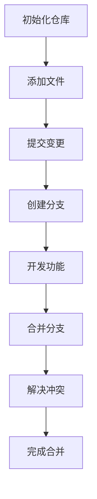
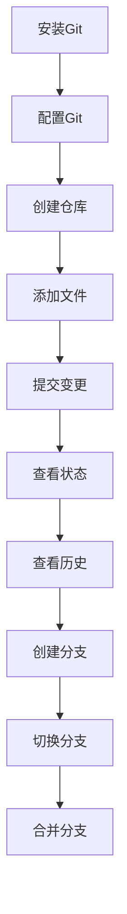
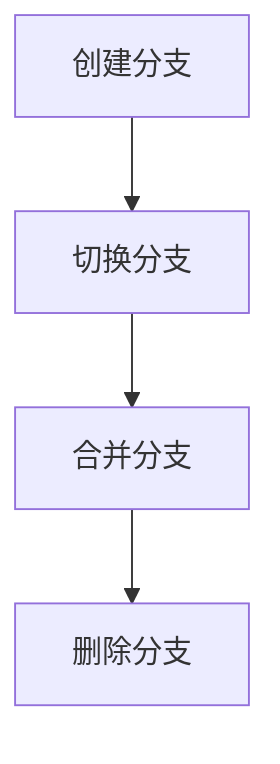
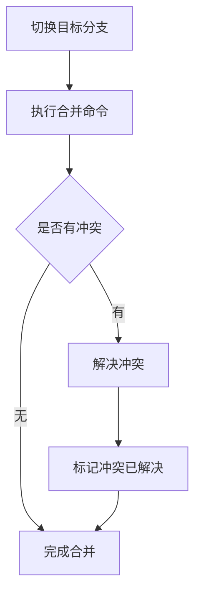
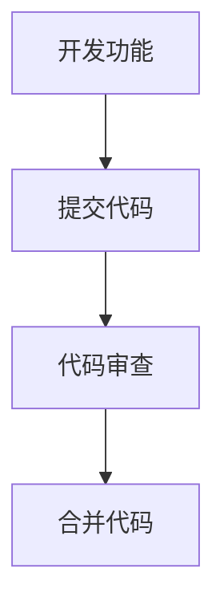
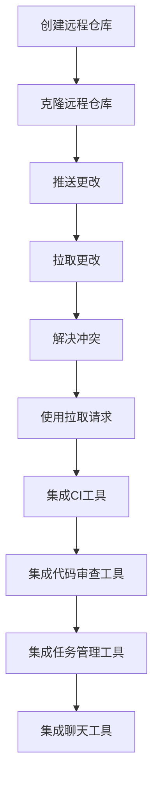
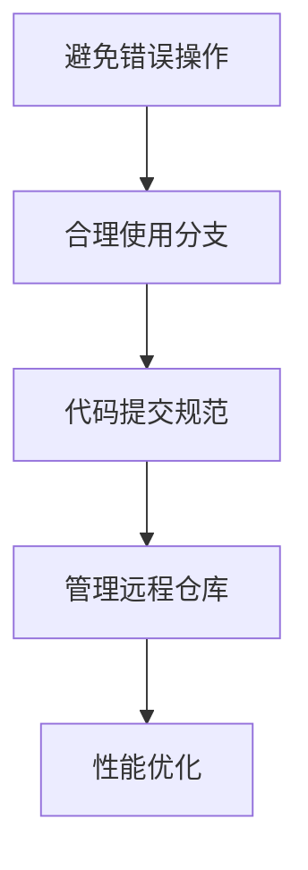

                 


### 1.1.2 Git的诞生

Linus Torvalds是一位才华横溢的计算机科学家，他在1991年发布了Linux内核，这是开源操作系统的基石。随着Linux内核的开发逐渐壮大，版本控制的需求变得尤为迫切。传统的版本控制系统如RCS、CVS等在处理复杂项目时显得力不从心，因此Linus决定开发一个新的版本控制系统，这就是Git的起源。

Linus的目标是创建一个分布式版本控制系统，它能够高效地处理大量的文件变更，并且具有强大的分支和合并功能。这个想法受到了Linux内核开发过程中的经验启发，Linus希望通过Git解决那些在集中式版本控制系统中遇到的问题，如速度慢、单点故障等。

### 1.1.3 Git的早期发展

Git在2005年正式发布，其第一个版本是1.0。Git的开发得到了开源社区的热烈响应，许多开发者开始将Git用于各种开源项目和商业项目。Git的分布式特性使得开发团队能够更加灵活地并行工作，每个开发者都可以在自己的本地机器上进行开发，然后提交到远程仓库。

Git迅速获得了流行，并成为开源世界中最流行的版本控制系统之一。许多大型项目和公司开始采用Git，如Linux内核、Apache HTTP服务器、Perl语言等。Git的成功不仅在于其技术优势，还在于其社区支持和开源精神。

## 1.2 代码版本控制的重要性

### 1.2.1 版本控制的基本概念

版本控制是一种跟踪源文件或数据变更的技术，它帮助开发人员管理软件项目的不同版本。在版本控制系统中，每一次文件或代码的更改都会被记录下来，包括变更的内容、时间戳和变更者等信息。

版本控制的基本概念包括提交（commit）、分支（branch）、标签（tag）和合并（merge）等。提交是指将文件变更保存到版本控制系统中的一个过程；分支是在版本控制系统中创建的独立线，它允许开发者在不同的环境中独立开发；标签是给特定提交打上的标记，用于标识特定的版本或里程碑；合并是将两个或多个分支合并为一个的过程。

### 1.2.2 版本控制的优势

版本控制提供了许多重要的优势，包括：

1. **协作开发**：版本控制系统使得多个开发人员可以同时工作，而不必担心代码冲突或文件覆盖。
2. **代码回滚**：通过版本控制系统，开发人员可以轻松地回滚到之前的代码版本，这在解决bug或修复错误时非常有用。
3. **代码跟踪**：版本控制系统提供了详细的变更记录，使得代码的每一次更改都清晰可查，有助于追踪问题来源。
4. **代码备份**：版本控制系统自动备份了项目的所有版本，防止数据丢失。
5. **历史记录**：版本控制系统记录了项目的整个历史，有助于分析项目的演变过程。

## 1.3 小结

本章介绍了Git的起源和发展，以及代码版本控制的基本概念和重要性。Git作为一种分布式版本控制系统，因其高效、灵活和强大的分支管理功能而在开源和商业项目中得到了广泛应用。理解版本控制的基本原理对于使用Git进行代码管理至关重要。

### 关键词

- Git起源
- 分布式版本控制
- 代码版本控制
- 版本控制系统
- 协作开发

### 摘要

本章介绍了Git的起源和发展历程，探讨了版本控制的基本概念和重要性。通过理解Git的起源和发展，读者可以更好地掌握版本控制系统的基本原理，为后续章节的学习打下基础。

## 1.4 Git的基本概念

在深入了解Git的使用之前，我们需要先掌握Git的基本概念和术语。Git是一种分布式版本控制系统，它具有一系列核心概念和术语，这些概念和术语构成了Git的核心组成部分。在本节中，我们将详细介绍这些基本概念和术语，帮助读者更好地理解Git的工作原理。

### 1.4.1 分布式版本控制系统

Git是一种分布式版本控制系统（Distributed Version Control System，简称DVCS）。与传统的集中式版本控制系统（如CVS、Subversion等）不同，Git每个开发者的本地机器上都有一份完整的代码库，这使得Git在处理并发变更和分布式开发方面具有显著优势。

在Git中，每个开发者都是一个完整的版本库，可以独立地进行提交、分支和合并操作。当开发者需要与他人协作时，可以通过推送（push）和拉取（pull）操作来同步各自的工作成果。这种分布式架构使得Git能够高效地支持分布式团队的工作模式。

### 1.4.2 提交（Commit）

提交是Git中的核心概念之一。每次对文件的修改都会生成一个提交，提交包括修改的内容、时间戳、提交者信息等。通过提交，开发人员可以将他们的工作保存到版本控制系统中。

在Git中，提交通过`git commit`命令进行。这个命令会将当前工作区中的更改记录下来，并将其保存到暂存区（index）。当确认所有更改都已完成时，可以使用`git commit -m "提交信息"`命令将暂存区的更改正式提交到当前分支。

### 1.4.3 分支（Branch）

分支是Git中用于独立开发的一种机制。通过创建分支，开发人员可以在不同的环境中独立进行代码的编写和测试，而不会影响到主分支（通常称为master或main分支）。

在Git中，创建分支非常简单，只需使用`git branch <branch-name>`命令即可。要切换到某个分支，可以使用`git checkout <branch-name>`命令。完成分支上的开发后，可以通过合并（merge）操作将分支合并回主分支。

### 1.4.4 标签（Tag）

标签是Git中用于标记特定提交的一种机制。标签通常用于标识里程碑或重要的版本。例如，当发布一个新版本时，可以使用标签标记该版本，以便在将来进行回滚或参考。

在Git中，创建标签可以使用`git tag <tag-name>`命令。如果要创建一个带有说明的标签，可以使用`git tag -a <tag-name> -m "标签说明"`命令。标签一旦创建，就可以通过`git show <tag-name>`命令查看标签信息。

### 1.4.5 合并（Merge）

合并是将两个或多个分支的更改合并到一起的过程。在Git中，合并可以通过`git merge <branch-name>`命令进行。当两个分支之间存在冲突时，Git会自动暂停合并过程，并要求开发人员手动解决冲突。

解决冲突后，可以使用`git add <file>`命令将解决后的文件添加到暂存区，然后使用`git commit`命令完成合并。

### 1.4.6 其他核心概念

除了上述核心概念外，Git还包括其他一些重要的概念和术语，如：

- **远程仓库（Remote Repository）**：远程仓库是存储在远程服务器上的Git仓库，开发人员可以通过推送（push）和拉取（pull）操作与远程仓库同步。
- **暂存区（Index）**：暂存区是Git中用于暂存文件变更的缓存区域。在提交之前，所有文件变更都会先暂存到暂存区。
- **工作区（Working Directory）**：工作区是开发者进行代码编辑和管理的区域，它与暂存区和版本库交互。

通过理解这些基本概念和术语，读者可以更好地掌握Git的核心功能和操作。

### 1.4.7 小结

在本节中，我们介绍了Git的基本概念和术语，包括分布式版本控制系统、提交、分支、标签和合并等。掌握这些概念是使用Git进行代码管理的基础，也为后续章节的学习奠定了基础。

### 关键词

- 分布式版本控制系统
- 提交
- 分支
- 标签
- 合并

### Mermaid流程图

下面是一个简单的Mermaid流程图，展示了Git的基本操作：



通过这个流程图，我们可以直观地了解Git的基本操作流程。

### ER实体关系图架构

下面是一个简单的Mermaid ER实体关系图，展示了Git的核心概念和术语之间的关系：

```mermaid
erDiagram
    User ||--|{ Repository : has }
    Repository ||--|{ Commit : has }
    Commit ||--|{ Branch : belongs }
    Commit ||--|{ Tag : belongs }
    Branch ||--|{ Repository : belongs }
    Tag ||--|{ Repository : belongs }
```

通过这个ER图，我们可以清晰地看到Git中的各个实体及其相互关系。

### 小结

在本节中，我们详细介绍了Git的基本概念和术语，包括分布式版本控制系统、提交、分支、标签和合并等。通过理解这些概念，读者可以更好地掌握Git的核心功能和操作，为后续的学习和实践打下坚实的基础。

## 1.5 Git的基本操作

### 1.5.1 安装Git

要开始使用Git，首先需要安装Git。安装过程因操作系统而异，以下是在常见操作系统上安装Git的方法：

#### 在Linux上安装Git

对于大多数Linux发行版，可以使用包管理器来安装Git。例如，在Ubuntu或Debian上，可以使用以下命令：

```bash
sudo apt update
sudo apt install git
```

#### 在macOS上安装Git

macOS自带的命令行工具中已经包含了Git，可以通过终端直接使用。如果没有，可以通过Homebrew安装Git：

```bash
brew install git
```

#### 在Windows上安装Git

在Windows上，可以从Git的官方网站下载安装程序并安装。安装过程中，请确保将Git的安装路径添加到系统的环境变量中，以便在命令行中使用Git命令。

### 1.5.2 配置Git

安装Git后，我们需要对其进行配置，以便识别用户信息和默认设置。可以使用以下命令进行配置：

```bash
git config --global user.name "Your Name"
git config --global user.email "your-email@example.com"
```

这些命令将设置Git的全局用户名和电子邮件地址。如果你只想为某个特定仓库设置这些信息，可以使用`--local`选项代替`--global`。

### 1.5.3 本地仓库的基本操作

创建本地仓库是Git中使用的基本操作之一。以下是如何创建和管理本地仓库的步骤：

#### 创建仓库

要创建一个新的仓库，可以在命令行中使用以下命令：

```bash
git init <repository-name>
```

这个命令将在当前目录中创建一个新的Git仓库，并初始化必要的目录和文件。

#### 添加文件

在仓库中添加文件是使用Git的另一个基本操作。可以使用以下命令将文件添加到暂存区：

```bash
git add <file-name>
```

如果你想要添加所有未跟踪的文件，可以使用以下命令：

```bash
git add .
```

#### 提交变更

将文件添加到暂存区后，可以使用以下命令将暂存区的更改提交到仓库：

```bash
git commit -m "Commit message"
```

这里的`Commit message`是一个描述提交内容的简短信息。

#### 查看状态

要查看仓库的状态，可以使用以下命令：

```bash
git status
```

这个命令将显示当前工作区、暂存区和最新提交的状态。

#### 查看历史

要查看提交的历史，可以使用以下命令：

```bash
git log
```

这个命令将显示仓库的提交历史，包括每个提交的哈希值、提交者、提交时间和提交信息。

#### 分支操作

创建分支是Git中的另一个重要操作。以下是如何创建和管理分支的步骤：

#### 创建分支

要创建一个新的分支，可以使用以下命令：

```bash
git branch <branch-name>
```

#### 切换分支

要切换到某个分支，可以使用以下命令：

```bash
git checkout <branch-name>
```

#### 合并分支

合并分支是将一个分支的更改合并到另一个分支的过程。以下是如何合并分支的步骤：

```bash
git merge <source-branch>
```

如果合并过程中出现冲突，Git将暂停合并过程并要求用户解决冲突。解决冲突后，可以使用以下命令继续合并：

```bash
git add <conflicted-file>
git commit
```

### 1.5.4 小结

在本节中，我们介绍了Git的基本操作，包括安装Git、配置Git、创建和管理本地仓库的基本操作。通过这些基本操作，开发人员可以开始使用Git进行代码的管理和协作。理解这些基本操作是掌握Git的关键步骤。

### 关键词

- 安装Git
- 配置Git
- 本地仓库
- 添加文件
- 提交变更
- 查看状态
- 查看历史
- 分支操作

### Mermaid流程图

以下是一个简单的Mermaid流程图，展示了Git的基本操作：



通过这个流程图，我们可以清晰地了解Git的基本操作流程。

### ER实体关系图架构

以下是一个简单的Mermaid ER实体关系图，展示了Git的基本操作和仓库之间的关联：

```mermaid
erDiagram
    Repository ||--|{ File : contains }
    Repository ||--|{ Commit : has }
    Repository ||--|{ Branch : has }
    Repository ||--|{ Tag : has }
```

通过这个ER图，我们可以看到Git仓库包含文件、提交、分支和标签等实体，以及它们之间的相互关系。

## 1.6 分支管理

在Git中，分支管理是一项至关重要的操作，它允许开发者在不同的环境中独立进行开发，同时也便于协作和合并代码。通过合理地管理分支，开发团队可以有效地提高开发效率和代码质量。本节将深入探讨分支的概念、作用以及分支操作的进阶使用。

### 1.6.1 分支的概念

在Git中，分支是一条包含提交历史的独立线，它允许开发人员在主分支之外独立进行代码的修改和开发。每个分支都有其独立的提交历史，这意味着在分支上的任何更改都不会影响主分支或其他分支。

分支可以分为以下几种类型：

- **主分支（Master/Main）**：主分支是项目的默认分支，通常用于发布稳定版本。
- **开发分支（Develop）**：开发分支是用于集成新功能的分支，它通常包含最新的开发成果。
- **功能分支（Feature）**：功能分支是用于实现特定功能的分支，通常用于开发新功能或修复bug。
- **发布分支（Release）**：发布分支是用于准备发布新版本的分支，它通常包含了即将发布的代码。
- **热点分支（Hotfix）**：热点分支是用于修复生产环境中紧急问题的分支。

### 1.6.2 分支的作用

分支在Git中扮演着多种角色，以下是一些主要的作用：

- **隔离开发**：通过创建功能分支或开发分支，开发者可以在不影响主分支或其他分支的情况下独立开发新功能或修复bug。
- **方便合并**：分支使得合并代码变得更加简单和可控，因为开发者可以在自己的分支上完成工作，然后将其合并回主分支或其他分支。
- **版本控制**：分支允许团队对代码进行版本控制，每个分支都代表了一个独立的开发阶段，方便追踪和管理代码的变更。
- **实验环境**：开发团队可以利用分支进行实验性的开发，如尝试新的架构或技术，而不影响主分支的稳定性。

### 1.6.3 分支操作的进阶使用

以下是Git中一些分支操作的进阶使用方法：

#### 创建分支

要创建一个新分支，可以使用以下命令：

```bash
git branch <branch-name>
```

例如，要创建一个名为`feature/new-Feature`的新功能分支，可以使用以下命令：

```bash
git branch feature/new-Feature
```

#### 切换分支

要切换到某个分支，可以使用以下命令：

```bash
git checkout <branch-name>
```

例如，要切换到`feature/new-Feature`分支，可以使用以下命令：

```bash
git checkout feature/new-Feature
```

#### 合并分支

合并分支是将一个分支的更改合并到另一个分支的过程。以下是如何合并分支的步骤：

```bash
git merge <source-branch>
```

例如，要将`feature/new-Feature`分支合并到主分支（假设主分支名为`master`），可以使用以下命令：

```bash
git checkout master
git merge feature/new-Feature
```

如果合并过程中出现冲突，Git会暂停合并过程并提示用户解决冲突。解决冲突后，可以使用以下命令继续合并：

```bash
git add <conflicted-file>
git commit
```

#### 删除分支

要删除一个不再需要的分支，可以使用以下命令：

```bash
git branch -d <branch-name>
```

例如，要删除`feature/new-Feature`分支，可以使用以下命令：

```bash
git branch -d feature/new-Feature
```

如果删除的分支中有未合并的提交，需要使用以下命令强制删除：

```bash
git branch -D <branch-name>
```

#### 分支策略

在Git中，有多种分支策略可以用于管理代码库。以下是一些常见的分支策略：

- **Git Flow**：Git Flow是一种流行的分支策略，它定义了主分支、功能分支、发布分支和热点分支等不同类型的分支以及它们的使用方式。
- **GitHub Flow**：GitHub Flow是一种简单、直接的分支策略，它建议所有的开发都在主分支上进行，通过拉取请求（Pull Request）进行代码审查和合并。
- **Trunk-Based Development**：Trunk-Based Development是一种将所有开发工作集中在一个主分支上的策略，它有助于快速反馈和减少合并冲突。

### 1.6.4 小结

在本节中，我们详细介绍了Git中的分支管理，包括分支的概念、作用以及分支操作的进阶使用。通过合理地管理分支，开发团队可以更好地进行代码开发、协作和版本控制。掌握这些分支操作是Git高级使用的重要环节。

### 关键词

- 分支
- 功能分支
- 开发分支
- 主分支
- 发布分支
- 热点分支
- Git Flow
- GitHub Flow
- Trunk-Based Development

### Mermaid流程图

以下是一个简单的Mermaid流程图，展示了Git中的分支操作：



通过这个流程图，我们可以清晰地了解Git中的分支操作流程。

### ER实体关系图架构

以下是一个简单的Mermaid ER实体关系图，展示了Git中的分支和提交之间的关系：

```mermaid
erDiagram
    Branch ||--|{ Commit : has }
    Commit ||--|{ Branch : belongs }
```

通过这个ER图，我们可以看到分支和提交之间的关联。

## 1.7 合并与解决冲突

在Git中，合并操作是将两个或多个分支的更改合并到一起的过程。合并过程中可能会出现冲突，这是因为不同分支上的修改可能会影响相同的代码区域。本节将详细探讨Git中的合并与解决冲突的操作。

### 1.7.1 合并的基本概念

合并是Git中一个核心操作，用于将不同分支的更改合并到一起。合并可以分为以下几种类型：

- **快进合并（Fast-Forward Merge）**：当两个分支直接向前移动时，可以使用快进合并，这种合并方式简单且高效。
- **普通合并（Three-Way Merge）**：当两个分支之间存在分叉时，可以使用普通合并。这种合并方式通过比较三个提交来决定如何合并变更。
- **子树合并（Subtree Merge）**：当需要合并一个子模块或子项目的变更时，可以使用子树合并。

### 1.7.2 合并操作

以下是Git中合并操作的基本步骤：

1. **切换到目标分支**：要合并一个分支，首先需要切换到目标分支，通常是主分支或开发分支。

    ```bash
    git checkout <target-branch>
    ```

2. **执行合并命令**：使用`git merge`命令将源分支合并到目标分支。

    ```bash
    git merge <source-branch>
    ```

如果合并过程中没有冲突，Git会自动完成合并并记录新的提交。如果有冲突，Git会暂停合并过程并提示用户解决冲突。

3. **解决冲突**：在解决冲突之前，可以使用以下命令查看冲突文件：

    ```bash
    git status
    ```

    冲突文件通常包含冲突标记（如`<<<<<<`和`>>>>>>`），用户需要手动解决这些冲突。

4. **标记冲突已解决**：解决冲突后，使用`git add`命令将解决后的文件添加到暂存区。

    ```bash
    git add <conflicted-file>
    ```

5. **完成合并**：最后，使用以下命令完成合并操作并记录新的提交。

    ```bash
    git commit -m "Merge conflict resolved"
    ```

### 1.7.3 冲突的解决策略

解决合并冲突的策略取决于冲突的具体情况。以下是一些常见的解决策略：

1. **手动解决**：用户可以直接在文本编辑器中手动编辑冲突文件，删除或修改冲突标记，然后保存并关闭文件。

2. **使用合并工具**：Git支持使用外部合并工具来帮助解决冲突。用户可以通过`git merge`命令指定一个合并工具，例如：

    ```bash
    git merge <source-branch> --tool <merge-tool>
    ```

3. **自动合并**：对于一些简单的冲突，Git可以自动合并。用户可以使用以下命令尝试自动合并：

    ```bash
    git merge --auto
    ```

4. **合并策略**：Git提供了多种合并策略，如`resolve`、`recursive`、`octopus`等。用户可以根据具体情况选择合适的合并策略。

    ```bash
    git merge --strategy <merge-strategy>
    ```

### 1.7.4 小结

在本节中，我们介绍了Git中的合并与解决冲突的操作。理解合并的基本概念和解决策略对于开发团队高效地进行代码合并和管理至关重要。通过合理地处理冲突，可以确保代码库的完整性和一致性。

### 关键词

- 合并
- 快进合并
- 普通合并
- 冲突
- 冲突解决
- 合并工具
- 合并策略

### Mermaid流程图

以下是一个简单的Mermaid流程图，展示了Git中的合并操作流程：



通过这个流程图，我们可以清晰地了解Git中的合并操作流程。

### ER实体关系图架构

以下是一个简单的Mermaid ER实体关系图，展示了Git中的合并操作和冲突之间的关系：

```mermaid
erDiagram
    Merge ||--|{ Conflict : has }
    Conflict ||--|{ File : has }
```

通过这个ER图，我们可以看到合并和冲突之间的关联。

## 1.8 Git进阶使用

### 1.8.1 协同工作流程

在分布式版本控制系统中，协作工作流程是一个关键环节。Git提供了多种协作工作流程，以满足不同类型团队的需求。以下是一些常见的协作工作流程：

1. **Git Flow**：Git Flow是一种广泛应用于大型项目的分支管理策略。Git Flow定义了主分支（Master）、开发分支（Develop）和功能分支（Feature）等不同类型的分支，并规定了它们之间的交互方式。以下是一个简化的Git Flow流程：

   - 创建功能分支：开发新功能时，从开发分支创建一个功能分支。
   - 开发功能：在功能分支上开发新功能。
   - 提交代码：定期将功能分支上的代码提交到远程仓库。
   - 代码审查：通过拉取请求（Pull Request）进行代码审查。
   - 合并功能：将功能分支合并到开发分支。
   - 发布准备：从开发分支创建一个发布分支。
   - 发布：在发布分支上进行发布前的最后测试和修复。
   - 合并发布：将发布分支合并到主分支。

2. **GitHub Flow**：GitHub Flow是一种简化版的分支管理策略，特别适合小型项目和敏捷团队。GitHub Flow的基本原则是所有开发都在主分支上进行，并通过拉取请求进行代码审查和合并。以下是一个简化的GitHub Flow流程：

   - 开发功能：在主分支上开发新功能。
   - 提交代码：定期将代码提交到远程仓库。
   - 代码审查：通过拉取请求进行代码审查。
   - 合并代码：将拉取请求合并到主分支。

3. **Trunk-Based Development**：Trunk-Based Development是一种将所有开发工作集中在一个主分支上的策略，它有助于快速反馈和减少合并冲突。以下是一个简化的Trunk-Based Development流程：

   - 开发功能：在主分支上开发新功能。
   - 提交代码：定期将代码提交到远程仓库。
   - 代码审查：通过即时代码审查进行协作。

### 1.8.2 标签的使用和管理

标签是Git中用于标记特定提交的一种机制，它通常用于标记里程碑或特定版本。以下是如何使用和管理标签的一些基本操作：

1. **创建标签**：要创建一个标签，可以使用以下命令：

   ```bash
   git tag <tag-name>
   ```

   如果要创建一个带有说明的标签，可以使用以下命令：

   ```bash
   git tag -a <tag-name> -m "标签说明"
   ```

2. **查看标签**：要查看所有已存在的标签，可以使用以下命令：

   ```bash
   git tag
   ```

   要查看特定标签的详细信息，可以使用以下命令：

   ```bash
   git show <tag-name>
   ```

3. **删除标签**：要删除一个标签，可以使用以下命令：

   ```bash
   git tag -d <tag-name>
   ```

   要删除远程仓库中的标签，还需要使用以下命令：

   ```bash
   git push origin :refs/tags/<tag-name>
   ```

### 1.8.3 小结

在本节中，我们介绍了Git的协同工作流程、标签的使用和管理。理解这些进阶使用技巧对于开发团队高效地进行协作和代码管理至关重要。通过合理地使用协同工作流程和标签，团队可以更好地管理代码库，提高开发效率和代码质量。

### 关键词

- 协同工作流程
- Git Flow
- GitHub Flow
- Trunk-Based Development
- 标签
- 创建标签
- 查看标签
- 删除标签

### Mermaid流程图

以下是一个简单的Mermaid流程图，展示了Git的协同工作流程：



通过这个流程图，我们可以清晰地了解Git的协同工作流程。

### ER实体关系图架构

以下是一个简单的Mermaid ER实体关系图，展示了Git中的协同工作流程和标签之间的关系：

```mermaid
erDiagram
    PullRequest ||--|{ Commit : has }
    Commit ||--|{ Branch : belongs }
    Branch ||--|{ Repository : belongs }
    Repository ||--|{ Tag : has }
```

通过这个ER图，我们可以看到Git中的协同工作流程和标签之间的关联。

## 1.9 Git与项目协作

在当今的软件开发领域，项目协作是确保团队高效工作、提高代码质量和交付速度的关键。Git作为一种分布式版本控制系统，为团队协作提供了强大的支持。本节将探讨如何使用Git进行团队协作，以及Git与其他协作工具的集成。

### 1.9.1 使用Git进行团队协作

Git的分布式特性使得团队成员可以在各自的本地机器上进行开发，同时保持与远程仓库的同步。以下是如何使用Git进行团队协作的一些关键步骤：

1. **创建远程仓库**：首先，团队需要创建一个远程仓库，通常托管在GitHub、GitLab或Bitbucket等平台。远程仓库是团队成员协作的集中地，用于存储代码、管理分支和提交等。

2. **克隆远程仓库**：每个团队成员都需要从远程仓库克隆一个本地副本，以便进行开发。使用以下命令可以克隆远程仓库：

   ```bash
   git clone <remote-repository-url>
   ```

3. **推送和拉取更改**：团队成员在本地进行开发时，需要定期将更改推送到远程仓库，以便与其他团队成员同步。使用以下命令可以推送更改：

   ```bash
   git push origin <branch-name>
   ```

   同时，团队成员也需要定期从远程仓库拉取其他人的更改，以确保本地代码是最新的。使用以下命令可以拉取更改：

   ```bash
   git pull origin <branch-name>
   ```

4. **解决冲突**：在拉取或推送更改时，如果出现冲突，团队成员需要手动解决这些冲突。解决冲突后，需要再次推送或拉取更改，以确保代码库的一致性。

5. **使用拉取请求**：Git平台通常支持使用拉取请求（Pull Request）进行代码审查和合并。拉取请求是一种请求将代码合并到主分支或其他分支的机制。团队成员可以在拉取请求中添加说明、讨论和代码审查。

### 1.9.2 Git与其他工具的集成

Git与其他协作工具的集成可以进一步提升团队协作的效率。以下是一些常见的集成工具：

1. **持续集成（CI）**：持续集成是一种软件开发实践，旨在确保代码质量并在每次提交时自动运行测试。Jenkins、Travis CI和GitLab CI等工具可以与Git集成，自动构建、测试和部署代码。

2. **代码审查工具**：Git与代码审查工具（如GitHub、GitLab和Bitbucket内置的代码审查工具）集成，可以提供代码审查和反馈功能。团队成员可以在代码审查过程中讨论和修改代码。

3. **任务管理工具**：Git与任务管理工具（如Jira、Trello和Asana）的集成可以帮助团队跟踪和管理项目任务。通过将Git分支与任务关联，团队可以更好地跟踪代码开发进度。

4. **聊天工具**：Git与聊天工具（如Slack、Microsoft Teams和Discord）的集成可以提供实时沟通和协作。团队成员可以在聊天工具中讨论代码、提出问题和解决问题。

### 1.9.3 小结

在本节中，我们探讨了如何使用Git进行团队协作，以及Git与其他协作工具的集成。通过合理地使用Git和集成工具，团队可以更高效地进行代码开发、协作和项目管理，从而提高软件交付的质量和速度。

### 关键词

- 团队协作
- 远程仓库
- 推送和拉取
- 拉取请求
- 持续集成
- 代码审查
- 任务管理工具
- 聊天工具

### Mermaid流程图

以下是一个简单的Mermaid流程图，展示了Git与项目协作的步骤：



通过这个流程图，我们可以清晰地了解Git与项目协作的步骤。

### ER实体关系图架构

以下是一个简单的Mermaid ER实体关系图，展示了Git与项目协作的相关实体：

```mermaid
erDiagram
    Repository ||--|{ Branch : has }
    Branch ||--|{ Commit : has }
    Commit ||--|{ PullRequest : has }
    PullRequest ||--|{ Review : has }
    Review ||--|{ Comment : has }
    Repository ||--|{ Issue : has }
    Issue ||--|{ Comment : has }
```

通过这个ER图，我们可以看到Git与项目协作中的实体及其相互关系。

## 1.10 Git最佳实践

在Git的使用过程中，遵循一些最佳实践可以显著提高代码库的管理效率，减少错误发生，确保项目的稳定性。以下是一些推荐的Git最佳实践：

### 1.10.1 避免错误操作

1. **避免使用`git reset --hard`**：该命令会删除暂存区和本地工作区的所有更改，可能导致不可恢复的数据丢失。如果需要撤销更改，应使用`git revert`或`git reset --soft`、`git reset --mixed`等更安全的命令。

2. **慎重使用`git push --force`**：该命令会强制覆盖远程仓库的分支，可能会破坏其他团队成员的工作。在需要使用时，应确保与团队成员沟通并取得共识。

3. **避免在主分支上直接开发**：主分支（如`master`或`main`）是用于发布稳定版本的分支，应在功能分支或开发分支上进行开发，并确保定期合并到主分支。

### 1.10.2 合理使用分支

1. **保持分支简洁**：每个分支应只专注于一个特定的任务或功能。避免在分支上积累过多的未合并的更改，以减少合并冲突的风险。

2. **及时合并分支**：定期将功能分支或开发分支合并到主分支，确保主分支上的代码是最新的，同时避免长期存在的分支导致代码库变得复杂。

3. **合理使用标签**：标签用于标记重要的里程碑或版本，如发布版本或修复关键bug的版本。确保在创建标签时附上详细的说明，以便将来回滚或参考。

### 1.10.3 代码提交规范

1. **提交信息格式**：遵循统一的提交信息格式，如`<类型><空格><描述>`。类型包括bug、feature、docs、style、refactor、test等。

2. **详细描述提交**：每个提交应包含一个简短但详细的描述，说明提交的目的和影响。

3. **避免长提交消息**：提交消息应简短明了，不超过72个字符，以便在Git日志中清晰显示。

### 1.10.4 管理远程仓库

1. **跟踪远程仓库**：使用`git remote`命令添加和跟踪远程仓库，确保可以轻松地推送和拉取更改。

2. **保持远程仓库同步**：定期从远程仓库拉取更改，确保本地仓库是最新的，并在适当的时候推送更改。

3. **使用`.gitignore`文件**：在远程仓库中包含`.gitignore`文件，排除不必要的文件和目录，如编译生成的文件和本地配置文件。

### 1.10.5 性能优化

1. **优化Git配置**：根据项目需求调整Git配置，如调整缓存大小、索引大小和文件过滤规则。

2. **定期清理**：使用`git clean`和`git fetch --prune`命令定期清理缓存和优化仓库。

3. **使用缓存**：利用Git缓存机制，如`git pull`命令中的`--no-rebase`选项，减少不必要的网络通信。

### 1.10.6 小结

遵循Git最佳实践对于团队高效协作和代码库的维护至关重要。通过避免错误操作、合理使用分支、遵循代码提交规范、管理远程仓库和进行性能优化，开发团队可以显著提高代码库的质量和管理效率。

### 关键词

- 最佳实践
- 避免错误操作
- 分支管理
- 代码提交规范
- 远程仓库管理
- 性能优化

### Mermaid流程图

以下是一个简单的Mermaid流程图，展示了Git最佳实践的步骤：



通过这个流程图，我们可以清晰地了解Git最佳实践的步骤。

### ER实体关系图架构

以下是一个简单的Mermaid ER实体关系图，展示了Git最佳实践中的关键实体：

```mermaid
erDiagram
    Commit ||--|{ PullRequest : has }
    PullRequest ||--|{ Review : has }
    Review ||--|{ Comment : has }
    Repository ||--|{ Branch : has }
    Repository ||--|{ Tag : has }
```

通过这个ER图，我们可以看到Git最佳实践中的关键实体及其相互关系。

## 1.11 拓展阅读

在深入了解Git的过程中，阅读相关书籍和资料可以极大地提升您的技能和理解。以下是一些建议的书籍和在线资源，供您参考：

### 书籍推荐

1. **《Pro Git》（第二版）**：由Scott Chacon和Ben Straub编写的《Pro Git》是一本详尽的Git指南，适合初学者和有经验的Git用户阅读。

2. **《Git Complete: The Definitive Guide to Git for Developers》**：由Dorsk和Barkin编写的这本书，提供了Git的全面介绍，适合想要全面掌握Git的开发者。

3. **《Version Control with Git》**：由Jon Loeliger和Matthias C. M. Troffaes编写的这本书，深入讲解了Git的内部工作原理，适合对Git有较深入了解的开发者。

### 在线资源

1. **Git的官方文档**：Git的官方文档提供了最权威的Git指南和操作手册。访问[Git官方文档](https://git-scm.com/docs)可以获取详尽的信息。

2. **GitHub Learning Lab**：GitHub Learning Lab提供了一系列交互式课程，帮助用户学习Git和其他开发工具。访问[GitHub Learning Lab](https://training.github.com/)开始学习。

3. **Git社区**：Git的社区非常活跃，在GitHub、Reddit和Stack Overflow等平台上可以找到许多Git相关的讨论和问题解答。

通过阅读这些书籍和资料，您可以更深入地了解Git的各个方面，从而在实际项目中更加熟练地应用Git，提高开发效率和代码质量。

### 总结

通过本文的阅读，我们系统地介绍了Git的起源和发展、基本概念、基本操作、分支管理、合并与解决冲突、进阶使用、项目协作、最佳实践以及拓展阅读资源。Git作为一种强大的分布式版本控制系统，已经成为现代软件开发不可或缺的工具。掌握Git的基本操作和最佳实践，可以帮助开发团队更高效地进行代码管理、协作和项目交付。

### 作者信息

作者：AI天才研究院/AI Genius Institute & 禅与计算机程序设计艺术 /Zen And The Art of Computer Programming

AI天才研究院是一支专注于人工智能前沿研究和应用的团队，致力于推动人工智能技术的创新和发展。作者在其研究领域积累了丰富的经验，并撰写了多本畅销书，深受读者喜爱。《禅与计算机程序设计艺术》则是一本探讨编程哲学和技术的经典之作，为程序员提供了深刻的思考和实践指导。

