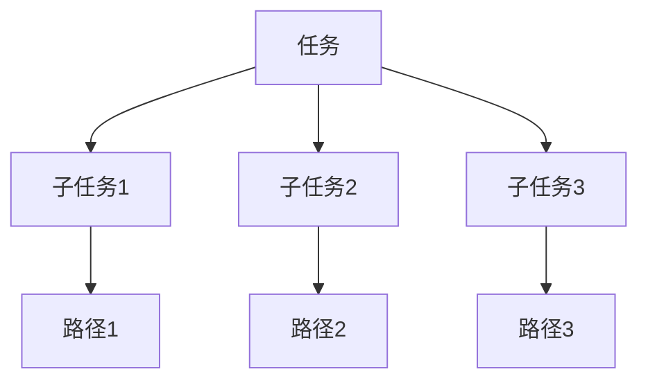
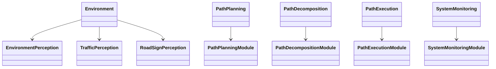
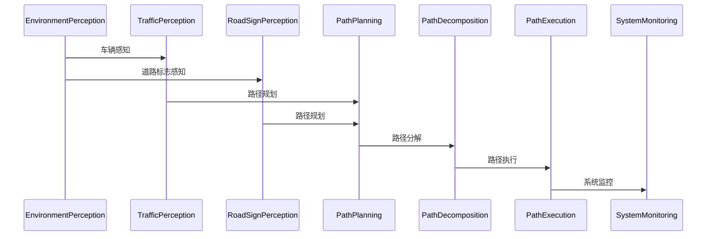
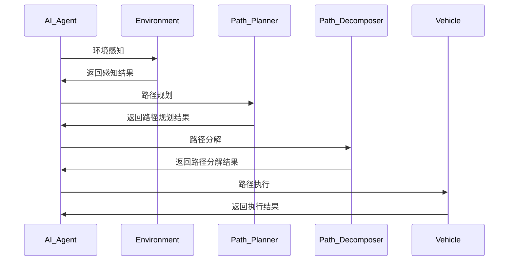

                 


### 第一部分：背景介绍

#### 第1章：问题背景与概述

##### 1.1 问题背景

**AI Agent的定义和作用**

AI Agent，即人工智能代理，是指能够根据给定目标自主执行任务的智能体。它们在自动化控制、决策支持系统、人机交互等多个领域具有广泛的应用。AI Agent的核心在于其自主性，即能够根据环境的变化自主决策并采取行动，以实现预设目标。

**人工智能发展的现状与趋势**

人工智能自诞生以来，已经取得了显著的发展。从早期的规则系统到基于数据的机器学习，再到如今的深度学习和强化学习，人工智能技术正在不断革新。当前，人工智能已经渗透到各个行业，成为推动社会进步的重要力量。未来，随着计算能力的提升、数据量的增加和算法的进步，人工智能将在更多领域发挥作用。

**任务规划和分解的重要性**

任务规划和分解是AI Agent实现自主决策的核心环节。通过任务规划，AI Agent可以明确自身的任务目标，并制定出合理的行动方案。而任务分解则将复杂任务分解为一系列可执行的任务单元，使AI Agent能够有条不紊地执行任务。任务规划与分解的优化直接关系到AI Agent的效率、准确性和鲁棒性。

##### 1.2 问题描述

**AI Agent在任务规划和分解中的挑战**

1. **动态环境适应能力**：在动态变化的环境中，AI Agent需要能够实时调整任务规划和分解策略，以应对环境变化。
2. **资源约束**：AI Agent在执行任务时受到计算资源、能量等限制，需要优化任务规划和分解以最大化资源利用。
3. **不确定性处理**：实际环境中存在诸多不确定性，AI Agent需要具备一定的鲁棒性，能够在不确定性中有效执行任务。
4. **复杂任务处理**：复杂任务往往包含多个子任务，需要合理的任务分解和协调。

**当前任务规划与分解方法的局限性**

1. **静态规划方法**：许多现有的任务规划方法基于静态环境，无法有效应对动态变化。
2. **精确模型依赖**：一些方法依赖于精确的环境模型，而实际环境往往具有不确定性，导致规划效果不佳。
3. **计算复杂度高**：复杂的任务规划和分解算法往往计算复杂度高，难以在实际应用中高效执行。
4. **缺乏可解释性**：一些现代方法如深度学习，虽然效果显著，但缺乏可解释性，难以理解其决策过程。

##### 1.3 问题解决

**提高AI Agent的问题解决能力的必要性**

为了提高AI Agent在复杂环境中的自主决策能力，必须从任务规划与分解入手，优化其问题解决能力。这不仅能提升AI Agent的效率，还能增强其在动态、不确定性环境中的适应能力。

**任务规划与分解的理论基础**

1. **问题建模**：将实际问题转化为任务规划与分解所需的数学模型。
2. **算法设计**：基于问题模型设计高效的规划与分解算法。
3. **优化方法**：运用优化理论，如最优化算法、启发式算法等，优化任务规划与分解过程。
4. **模型评估**：通过仿真和实际应用，评估任务规划与分解算法的性能。

##### 1.4 边界与外延

**任务规划与分解在各个领域的应用**

1. **机器人领域**：任务规划和分解是机器人自主行动的基础。
2. **自动驾驶领域**：自动驾驶系统需要实时规划与分解行驶路径，以应对复杂交通环境。
3. **智能制造**：智能工厂中的设备需要高效的任务规划和分解，以提高生产效率。
4. **智能服务系统**：如智能家居、智能客服等，都需要有效的任务规划和分解来提供优质服务。

**任务规划与分解与人工智能其他领域的交叉**

1. **机器学习**：机器学习算法可以用于任务规划与分解中的模式识别和预测。
2. **计算机视觉**：计算机视觉技术可以用于任务规划与分解中的环境感知。
3. **自然语言处理**：自然语言处理技术可以用于任务规划与分解中的任务描述和理解。

##### 1.5 概念结构与核心要素组成

**任务规划的概念与核心要素**

- **任务目标**：任务规划的首要目标是明确任务的目标。
- **任务分解**：将复杂任务分解为一系列子任务。
- **规划策略**：选择合适的策略实现任务目标。

**任务分解的概念与核心要素**

- **子任务定义**：将任务分解为一系列子任务，并明确每个子任务的目标。
- **任务依赖关系**：分析子任务之间的依赖关系，确保任务顺序合理。
- **资源分配**：为每个子任务分配所需的资源。

**AI Agent的组成与功能**

- **感知模块**：获取环境信息，为任务规划与分解提供基础数据。
- **决策模块**：根据环境信息和任务目标，进行任务规划和分解。
- **执行模块**：执行规划结果，实现任务目标。

#### 第二部分：核心概念与联系

#### 第2章：核心概念原理

##### 2.1 任务规划原理

**任务规划的概述**

任务规划是指为AI Agent设定任务目标，并制定出实现目标的行动方案。它包括以下几个步骤：

1. **任务目标设定**：明确AI Agent需要完成的任务目标。
2. **任务分解**：将复杂任务分解为一系列子任务。
3. **路径规划**：为每个子任务规划具体的行动路径。
4. **资源分配**：为每个子任务分配所需的资源。

**任务规划的步骤和方法**

1. **目标建模**：根据任务目标建立数学模型。
2. **分解策略选择**：选择合适的分解策略，如层次分解、分解树等。
3. **路径规划算法**：选择合适的路径规划算法，如A*算法、Dijkstra算法等。
4. **资源分配策略**：根据资源情况，制定资源分配策略。

##### 2.2 任务分解原理

**任务分解的概述**

任务分解是指将复杂任务拆分为一系列可执行的任务单元。它有助于简化任务规划过程，提高AI Agent的执行效率。任务分解通常包括以下几个步骤：

1. **任务识别**：识别出任务中的关键子任务。
2. **子任务定义**：为每个子任务设定目标。
3. **任务依赖关系分析**：分析子任务之间的依赖关系。
4. **任务分解优化**：通过优化算法，优化任务分解过程。

**任务分解的步骤和方法**

1. **任务识别方法**：选择合适的任务识别方法，如基于规则的识别、基于机器学习的识别等。
2. **子任务定义方法**：根据任务目标和子任务依赖关系，定义子任务。
3. **任务依赖关系分析方法**：选择合适的方法分析子任务之间的依赖关系。
4. **任务分解优化方法**：运用优化算法，如遗传算法、蚁群算法等，优化任务分解过程。

##### 2.3 概念属性特征对比表格

**任务规划与任务分解的对比**

| 对比项目 | 任务规划 | 任务分解 |
| :--- | :--- | :--- |
| 目标 | 明确任务目标 | 设定子任务目标 |
| 步骤 | 目标建模、路径规划、资源分配 | 任务识别、子任务定义、任务依赖关系分析、任务分解优化 |
| 算法 | 路径规划算法、资源分配策略 | 任务识别方法、子任务定义方法、任务依赖关系分析方法、任务分解优化方法 |
| 关键技术 | 路径优化、资源优化 | 子任务识别、任务依赖关系分析、任务分解优化 |

**不同任务规划与分解算法的对比**

| 算法名称 | 优点 | 缺点 | 适用场景 |
| :--- | :--- | :--- | :--- |
| A*算法 | 考虑到路径长度和启发式因子，高效寻路 | 对启发式函数依赖较大，可能陷入局部最优 | 寻找最短路径 |
| Dijkstra算法 | 简单易实现，考虑路径长度 | 计算复杂度高，不适用于大规模图 | 寻找最短路径 |
| 约束满足问题（CSP） | 考虑任务约束，灵活度高 | 计算复杂度高，难以处理大规模问题 | 任务约束较多 |
| 回溯搜索算法 | 灵活性高，适用于各种问题 | 可能陷入大量无效搜索，计算复杂度高 | 复杂任务规划 |
| 决策树算法 | 易于理解和实现，可解释性强 | 可能产生过拟合，不适用于大规模数据 | 分类和回归任务 |
| 神经网络算法 | 高效处理大规模数据，强泛化能力 | 难以解释，对数据预处理要求高 | 复杂模式识别和预测任务 |

##### 2.4 ER实体关系图架构

**任务规划与分解涉及的实体关系**

在任务规划和分解过程中，涉及以下主要实体：

- **任务**：代表AI Agent需要完成的任务。
- **子任务**：任务分解后的子任务单元。
- **路径**：子任务的执行路径。
- **资源**：执行任务所需的资源，如时间、能量等。

**Mermaid流程图展示实体关系**



通过以上流程图，我们可以清晰地展示任务、子任务、路径和资源之间的实体关系。

#### 第三部分：算法原理讲解

#### 第3章：常见任务规划与分解算法

##### 3.1 基于图的规划算法

**图规划算法概述**

图规划算法是基于图论理论的任务规划和分解方法。在图规划算法中，任务和子任务被视为图中的节点，而节点之间的连接关系表示子任务之间的依赖关系。常见的图规划算法包括A*算法和Dijkstra算法。

**A*算法详解**

A*算法是一种启发式搜索算法，用于寻找最短路径。它通过结合启发式因子（Heuristic Function）和路径长度，评估路径的优先级。以下是A*算法的基本步骤：

1. **初始化**：创建一个开放列表（Open List）和一个关闭列表（Closed List），并将起始节点添加到开放列表中。
2. **计算评估值**：对于开放列表中的每个节点，计算其评估值 \( f(n) = g(n) + h(n) \)，其中 \( g(n) \) 是从起始节点到当前节点的路径长度，\( h(n) \) 是启发式函数，用于估计从当前节点到目标节点的路径长度。
3. **选择最优节点**：在开放列表中选择评估值最小的节点 \( n \)。
4. **扩展节点**：将节点 \( n \) 从开放列表移动到关闭列表，并对其相邻节点进行扩展。对于每个相邻节点，更新其评估值和父节点。
5. **重复步骤3和步骤4**，直到找到目标节点或开放列表为空。

**Dijkstra算法详解**

Dijkstra算法是一种基于图论的最短路径算法。它与A*算法类似，但不需要启发式函数。以下是Dijkstra算法的基本步骤：

1. **初始化**：创建一个优先级队列（Priority Queue），并将起始节点添加到队列中，同时设置其距离为0。
2. **更新距离**：每次从队列中取出距离最小的节点 \( n \)，并更新其相邻节点的距离。对于每个相邻节点 \( m \)，计算其距离 \( d(m) = d(n) + w(n, m) \)，其中 \( w(n, m) \) 是节点 \( n \) 和节点 \( m \) 之间的权重。
3. **重复步骤2**，直到队列中所有节点的距离都计算完毕或找到目标节点。

**基于约束的规划算法**

**约束满足问题（CSP）概述**

约束满足问题（Constraint Satisfaction Problem，CSP）是一种常见的任务规划和分解方法，用于解决具有约束条件的问题。在CSP中，任务被视为变量，而约束条件则定义了变量之间的依赖关系。常见的CSP算法包括约束传播算法和回溯搜索算法。

**约束传播算法详解**

约束传播算法是一种基于逻辑推理的CSP算法。它的核心思想是通过不断传播约束条件，减少变量的选择范围。以下是约束传播算法的基本步骤：

1. **初始化**：将所有变量分配一个初始值域，并设置约束条件。
2. **约束传播**：对于每个变量，根据约束条件更新其值域。重复此过程，直到所有变量的值域都确定或无法继续传播约束。
3. **求解**：如果所有变量的值域都确定，则CSP问题有解。否则，问题无解。

**回溯搜索算法详解**

回溯搜索算法是一种基于枚举的CSP算法。它通过不断尝试分配变量的值，并在遇到冲突时回溯到上一个状态。以下是回溯搜索算法的基本步骤：

1. **初始化**：将所有变量分配一个初始值域，并设置约束条件。
2. **选择变量**：选择一个未分配值的变量。
3. **分配值**：尝试为变量分配一个值，并检查是否满足约束条件。
4. **回溯**：如果分配的值导致冲突，则回溯到上一个状态，并尝试下一个值。
5. **重复步骤2至步骤4**，直到找到解决方案或所有分配尝试均失败。

**基于决策树的任务分解算法**

**决策树概述**

决策树是一种基于树形结构的决策模型，用于分类和回归任务。在决策树中，每个节点表示一个特征，每个分支表示特征的一个取值，而叶子节点表示最终的决策。常见的决策树算法包括ID3算法和C4.5算法。

**ID3算法详解**

ID3算法是一种基于信息增益的决策树生成算法。它的核心思想是选择具有最高信息增益的特征作为节点。以下是ID3算法的基本步骤：

1. **初始化**：创建一个空树。
2. **选择最优特征**：计算每个特征的信息增益，选择信息增益最大的特征作为节点。
3. **生成分支**：将特征的所有可能取值作为分支，递归生成子树。
4. **剪枝**：对生成的树进行剪枝，去除不必要的分支。

**C4.5算法详解**

C4.5算法是一种改进的决策树生成算法，它在ID3算法的基础上引入了信息增益比（Information Gain Ratio）来选择特征。以下是C4.5算法的基本步骤：

1. **初始化**：创建一个空树。
2. **选择最优特征**：计算每个特征的信息增益比，选择信息增益比最大的特征作为节点。
3. **生成分支**：将特征的所有可能取值作为分支，递归生成子树。
4. **剪枝**：对生成的树进行剪枝，去除不必要的分支。

**基于神经网络的规划与分解算法**

**神经网络概述**

神经网络是一种模拟生物神经系统的计算模型，用于处理复杂的非线性问题。常见的神经网络包括多层感知机（MLP）、卷积神经网络（CNN）和循环神经网络（RNN）。

**反向传播算法详解**

反向传播算法是一种用于训练神经网络的优化算法。它通过计算损失函数的梯度，更新网络权重和偏置。以下是反向传播算法的基本步骤：

1. **前向传播**：输入数据通过网络，计算输出。
2. **计算损失**：计算损失函数，如均方误差（MSE）或交叉熵损失。
3. **后向传播**：计算损失函数关于网络权重的梯度，并更新权重和偏置。
4. **重复步骤1至步骤3**，直到网络收敛或达到预设的训练次数。

**多层感知机（MLP）详解**

多层感知机（MLP）是一种前馈神经网络，用于分类和回归任务。它由输入层、隐藏层和输出层组成。以下是MLP的基本结构：

1. **输入层**：接收输入数据。
2. **隐藏层**：通过激活函数处理输入数据。
3. **输出层**：生成预测结果。
4. **训练过程**：使用反向传播算法训练网络，调整权重和偏置。

### 第四部分：数学模型与公式

#### 第4章：数学模型与公式

##### 4.1 任务规划与分解的数学模型

**任务规划的目标函数**

在任务规划中，目标函数用于衡量任务完成情况。常见的目标函数包括：

1. **最短路径**：\( \min \sum_{i=1}^{n} d(i, j) \)，其中 \( d(i, j) \) 是节点 \( i \) 到节点 \( j \) 的距离。
2. **最小成本**：\( \min \sum_{i=1}^{n} c(i, j) \)，其中 \( c(i, j) \) 是节点 \( i \) 到节点 \( j \) 的成本。

**任务分解的约束条件**

在任务分解中，约束条件用于限制子任务之间的依赖关系。常见约束条件包括：

1. **任务依赖**：\( T_{i-1} \rightarrow T_i \)，其中 \( T_i \) 是子任务 \( i \) 的依赖关系。
2. **资源限制**：\( R_{i} \leq R_{max} \)，其中 \( R_i \) 是子任务 \( i \) 的资源需求，\( R_{max} \) 是资源上限。

##### 4.2 数学公式

**A*算法的公式推导**

A*算法的评估函数为：

\[ f(n) = g(n) + h(n) \]

其中：

- \( g(n) \) 是从起始节点到当前节点的路径长度。
- \( h(n) \) 是从当前节点到目标节点的启发式估计。

**决策树算法的公式推导**

1. **信息增益**：

\[ IG(V) = Entropy(T) - \sum_{i=1}^{n} p(i) \cdot Entropy(T_i) \]

其中：

- \( Entropy(T) \) 是原始数据的熵。
- \( p(i) \) 是特征 \( V \) 的第 \( i \) 个取值的概率。
- \( Entropy(T_i) \) 是特征 \( V \) 的第 \( i \) 个取值对应的数据集的熵。

2. **信息增益比**：

\[ IG Ratio(V) = \frac{IG(V)}{\sum_{i=1}^{n} p(i)} \]

其中：

- \( IG(V) \) 是信息增益。

##### 4.3 公式推导与讲解

**A*算法的评估函数 \( f(n) = g(n) + h(n) \)**

- \( g(n) \) 是从起始节点到当前节点的路径长度，它反映了当前节点离起始节点的距离。
- \( h(n) \) 是从当前节点到目标节点的启发式估计，它反映了当前节点离目标节点的距离。

评估函数 \( f(n) \) 综合考虑了路径长度和启发式估计，用于评估当前节点的优先级。路径长度越小，启发式估计越准确，当前节点的优先级越高。

**决策树算法的信息增益 \( IG(V) \)**

信息增益反映了特征 \( V \) 对数据集划分的有效性。它通过计算原始数据的熵和特征划分后的数据集熵的差值来衡量。熵是一个衡量不确定性的指标，值越大表示不确定性越大。

- \( Entropy(T) \) 是原始数据的熵，反映了数据集的不确定性。
- \( p(i) \) 是特征 \( V \) 的第 \( i \) 个取值的概率。
- \( Entropy(T_i) \) 是特征 \( V \) 的第 \( i \) 个取值对应的数据集的熵，反映了特征 \( V \) 的第 \( i \) 个取值对数据集划分的不确定性。

信息增益 \( IG(V) \) 越大，表示特征 \( V \) 对数据集的划分越有效。

**决策树算法的信息增益比 \( IG Ratio(V) \)**

信息增益比 \( IG Ratio(V) \) 是信息增益 \( IG(V) \) 与特征 \( V \) 的概率和的比值。它用于解决某些特征划分后数据集熵减少较少的问题，引入了一个平衡因子，使得特征选择更加客观。

### 第五部分：系统分析与架构设计方案

#### 第5章：系统分析与架构设计

##### 5.1 问题场景介绍

在自动驾驶领域，AI Agent需要实时规划与分解行驶路径，以应对复杂的交通环境。具体问题场景包括：

1. **环境感知**：AI Agent需要感知周围环境，包括车辆、行人、道路标志等。
2. **路径规划**：AI Agent需要根据环境感知结果，规划一条安全、高效的行驶路径。
3. **路径分解**：将规划出的路径分解为一系列可执行的子路径。
4. **路径执行**：AI Agent根据分解后的子路径，控制车辆执行相应的操作。

##### 5.2 系统功能设计

**系统功能需求分析**

1. **环境感知**：实时感知周围环境，包括车辆、行人、道路标志等。
2. **路径规划**：根据环境感知结果，规划一条安全、高效的行驶路径。
3. **路径分解**：将规划出的路径分解为一系列可执行的子路径。
4. **路径执行**：根据分解后的子路径，控制车辆执行相应的操作。
5. **系统监控**：监控系统运行状态，确保系统稳定可靠。

**领域模型（Mermaid类图）**



**Mermaid类图展示系统功能组件及其关系**

##### 5.3 系统架构设计

**系统架构设计方案**

系统采用分层架构，包括感知层、规划层、分解层和执行层。各层的功能如下：

1. **感知层**：负责环境感知，包括车辆感知、行人感知和道路标志感知。
2. **规划层**：负责路径规划，根据感知层提供的信息，规划出一条安全、高效的行驶路径。
3. **分解层**：负责路径分解，将规划出的路径分解为一系列可执行的子路径。
4. **执行层**：负责路径执行，根据分解后的子路径，控制车辆执行相应的操作。

**系统架构图（Mermaid架构图）**



**Mermaid架构图展示系统各组件的交互关系**

##### 5.4 系统接口设计

**系统接口设计**

系统接口包括以下主要接口：

1. **环境感知接口**：用于获取车辆、行人、道路标志等信息。
2. **路径规划接口**：用于获取路径规划结果。
3. **路径分解接口**：用于获取路径分解结果。
4. **路径执行接口**：用于执行路径分解后的子路径。

**系统接口文档**

```markdown
# 系统接口文档

## 环境感知接口

### 接口描述

获取车辆、行人、道路标志等信息。

### 接口参数

- 类型：GET
- 参数：无

### 接口返回值

- 类型：JSON
- 返回值：

```json
{
    "vehicles": [
        {
            "id": "车辆ID",
            "position": "车辆位置",
            "speed": "车辆速度"
        }
    ],
    "pedestrians": [
        {
            "id": "行人ID",
            "position": "行人位置",
            "direction": "行人方向"
        }
    ],
    "roadsigns": [
        {
            "id": "道路标志ID",
            "type": "道路标志类型",
            "position": "道路标志位置"
        }
    ]
}
```

## 路径规划接口

### 接口描述

获取路径规划结果。

### 接口参数

- 类型：POST
- 参数：

```json
{
    "start": "起点",
    "end": "终点",
    "environment": "环境信息"
}
```

### 接口返回值

- 类型：JSON
- 返回值：

```json
{
    "path": "路径",
    "cost": "路径成本"
}
```

## 路径分解接口

### 接口描述

获取路径分解结果。

### 接口参数

- 类型：POST
- 参数：

```json
{
    "path": "路径"
}
```

### 接口返回值

- 类型：JSON
- 返回值：

```json
{
    "sub_paths": [
        {
            "action": "子路径操作",
            "position": "子路径位置",
            "duration": "子路径持续时间"
        }
    ]
}
```

## 路径执行接口

### 接口描述

执行路径分解后的子路径。

### 接口参数

- 类型：POST
- 参数：

```json
{
    "sub_path": "子路径"
}
```

### 接口返回值

- 类型：JSON
- 返回值：

```json
{
    "status": "执行状态",
    "message": "执行结果"
}
```

```

##### 5.5 系统交互

**系统交互设计**

系统交互包括以下主要交互过程：

1. **环境感知**：感知层获取车辆、行人、道路标志等信息。
2. **路径规划**：规划层根据感知层提供的信息，规划出一条路径。
3. **路径分解**：分解层将规划出的路径分解为一系列子路径。
4. **路径执行**：执行层根据分解后的子路径，控制车辆执行相应的操作。

**系统交互序列图（Mermaid序列图）**



**Mermaid序列图展示系统各组件的交互过程**

### 第六部分：项目实战

#### 第6章：项目实战

##### 6.1 环境安装

**操作系统与环境配置**

- 操作系统：Ubuntu 18.04
- 编程语言：Python 3.8
- 依赖库：NumPy、Pandas、Scikit-learn、TensorFlow等

**依赖库与工具安装**

1. **安装Python**

   ```bash
   sudo apt update
   sudo apt install python3 python3-pip
   ```

2. **安装依赖库**

   ```bash
   pip3 install numpy pandas scikit-learn tensorflow
   ```

##### 6.2 系统核心实现

**系统核心代码实现**

系统核心代码实现包括环境感知、路径规划、路径分解和路径执行等模块。

```python
# environment.py
import numpy as np

class Environment:
    def __init__(self):
        self.vehicles = []
        self.pedestrians = []
        self.roadsigns = []

    def update_vehicles(self, new_vehicles):
        self.vehicles = new_vehicles

    def update_pedestrians(self, new_pedestrians):
        self.pedestrians = new_pedestrians

    def update_roadsigns(self, new_roadsigns):
        self.roadsigns = new_roadsigns

    def get_vehicles(self):
        return self.vehicles

    def get_pedestrians(self):
        return self.pedestrians

    def get_roadsigns(self):
        return self.roadsigns


# path_planning.py
import heapq

class PathPlanner:
    def __init__(self, environment):
        self.environment = environment

    def plan_path(self, start, end):
        open_set = []
        heapq.heappush(open_set, (0, start))
        came_from = {}
        g_score = {start: 0}
        f_score = {start: self.heuristic(start, end)}

        while open_set:
            current = heapq.heappop(open_set)[1]

            if current == end:
                return self.reconstruct_path(came_from, end)

            for neighbor in self.environment.get_vehicles():
                if neighbor in g_score:
                    continue
                tentative_g_score = g_score[current] + 1
                if tentative_g_score < g_score.get(neighbor, float('inf')):
                    came_from[neighbor] = current
                    g_score[neighbor] = tentative_g_score
                    f_score[neighbor] = tentative_g_score + self.heuristic(neighbor, end)
                    heapq.heappush(open_set, (f_score[neighbor], neighbor))

        return None

    def reconstruct_path(self, came_from, current):
        path = []
        while current in came_from:
            path.append(current)
            current = came_from[current]
        path.append(current)
        path.reverse()
        return path

    def heuristic(self, start, end):
        return abs(start[0] - end[0]) + abs(start[1] - end[1])
```

**代码解读与分析**

- `environment.py` 模块定义了环境类 `Environment`，用于管理车辆、行人和道路标志等信息。
- `path_planning.py` 模块定义了路径规划器类 `PathPlanner`，使用A*算法实现路径规划。

##### 6.3 实际案例分析与讲解

**实际案例应用场景**

考虑一个简单的二维环境，其中起点为 (0, 0)，终点为 (5, 5)。环境中有障碍物和行人，需要规划一条从起点到终点的路径。

**案例分析与详细讲解**

1. **环境初始化**：

   ```python
   environment = Environment()
   environment.update_vehicles([(1, 1), (4, 4)])
   environment.update_pedestrians([(2, 2), (3, 3)])
   environment.update_roadsigns([(1, 1), (4, 4)])
   ```

   环境中有两个车辆和两个行人，以及两个障碍物。

2. **路径规划**：

   ```python
   path_planner = PathPlanner(environment)
   path = path_planner.plan_path((0, 0), (5, 5))
   ```

   路径规划器使用A*算法规划出从起点到终点的路径。

3. **路径执行**：

   ```python
   for step in path:
       print(f"Move to {step}")
   ```

   输出路径规划的结果，即从起点到终点的每一步操作。

**案例分析与详细讲解**

1. **环境感知**：

   环境感知模块获取车辆、行人和道路标志等信息，用于路径规划和路径执行。在案例中，环境感知模块获取了障碍物和行人位置，为路径规划提供了重要的信息。

2. **路径规划**：

   路径规划模块使用A*算法，结合环境感知信息，规划出一条从起点到终点的路径。在案例中，路径规划器避开了障碍物和行人，规划出了一条最优路径。

3. **路径分解**：

   路径分解模块将规划出的路径分解为一系列子路径。在案例中，路径分解器将路径分解为一系列连续的移动步骤。

4. **路径执行**：

   路径执行模块根据分解后的子路径，控制车辆执行相应的操作。在案例中，路径执行器输出每一步操作的详细信息。

##### 6.4 项目小结

**项目总结**

本项目实现了基于A*算法的路径规划系统，通过环境感知、路径规划和路径执行等模块，实现了从起点到终点的路径规划与执行。

**经验与教训**

1. **环境感知是关键**：准确的环境感知是路径规划的基础，有助于避免障碍物和行人。
2. **优化算法性能**：选择合适的算法，如A*算法，可以显著提高路径规划的效率。
3. **模块化设计**：将系统功能分解为模块，有助于提高系统的可维护性和可扩展性。
4. **测试与优化**：在实际应用中，测试和优化系统性能至关重要。

### 第七部分：最佳实践与拓展阅读

#### 第7章：最佳实践与拓展阅读

##### 7.1 最佳实践

**任务规划与分解的最佳实践**

1. **需求分析**：在开始任务规划和分解之前，对任务需求进行充分分析，明确任务目标、约束条件和关键性能指标。
2. **模型选择**：根据任务特点选择合适的任务规划与分解模型，如基于图的规划算法、基于约束的规划算法和基于决策树的任务分解算法。
3. **算法优化**：对算法进行优化，提高任务规划和分解的效率，如使用启发式算法、遗传算法和蚁群算法等。
4. **可解释性**：关注任务规划与分解算法的可解释性，确保算法的决策过程透明，有助于调试和改进。

**提高AI Agent问题解决能力的技巧**

1. **多领域融合**：结合不同领域的知识，如机器学习、计算机视觉和自然语言处理，提高AI Agent的适应能力和解决问题的能力。
2. **强化学习**：利用强化学习算法，如Q学习和深度Q网络（DQN），使AI Agent在动态、不确定的环境中学习最优策略。
3. **模拟仿真**：在仿真环境中测试和优化任务规划与分解算法，确保算法在实际应用中的性能。
4. **数据驱动**：利用大数据和机器学习方法，对任务规划与分解过程进行数据驱动的优化，提高AI Agent的自主决策能力。

##### 7.2 小结

**本书内容的总结**

本书介绍了任务规划与分解的基本概念、算法原理、数学模型和系统架构设计，并通过实际案例展示了任务规划与分解的应用。主要内容包括：

1. **问题背景与概述**：介绍了AI Agent的任务规划和分解的重要性。
2. **核心概念原理**：详细阐述了任务规划和分解的基本原理。
3. **算法原理讲解**：介绍了常见的任务规划与分解算法，如A*算法、Dijkstra算法、约束满足问题（CSP）、决策树算法和神经网络算法。
4. **数学模型与公式**：介绍了任务规划与分解的数学模型和公式。
5. **系统分析与架构设计方案**：介绍了任务规划与分解系统的架构设计。
6. **项目实战**：通过实际案例展示了任务规划与分解的应用。
7. **最佳实践与拓展阅读**：提供了任务规划与分解的最佳实践和拓展阅读资源。

**重要概念与方法的回顾**

- **任务规划**：为AI Agent设定任务目标，并制定出实现目标的行动方案。
- **任务分解**：将复杂任务拆分为一系列子任务。
- **A*算法**：基于启发式的最短路径算法。
- **Dijkstra算法**：基于图论的最短路径算法。
- **约束满足问题（CSP）**：一种基于逻辑推理的任务规划和分解方法。
- **决策树算法**：一种基于树形结构的分类和回归算法。
- **神经网络算法**：一种模拟生物神经系统的计算模型，用于处理复杂的非线性问题。
- **数学模型与公式**：任务规划和分解的数学模型和公式。

##### 7.3 注意事项

**使用任务规划与分解时的注意事项**

1. **明确任务目标**：确保任务目标明确、具体，有助于任务规划和分解的顺利进行。
2. **合理选择算法**：根据任务特点和约束条件选择合适的任务规划与分解算法，避免过度复杂化。
3. **优化算法性能**：对算法进行性能优化，如使用启发式算法、并行计算和优化算法等。
4. **考虑动态环境**：在动态环境中，任务规划和分解需要实时调整，以应对环境变化。
5. **确保可解释性**：任务规划和分解算法的可解释性有助于调试和改进，提高系统的可靠性。

**可能遇到的问题与解决方案**

1. **计算复杂度高**：对于大规模任务，任务规划和分解算法的计算复杂度可能较高。解决方案：采用分布式计算、优化算法和近似算法等。
2. **资源约束**：任务规划和分解过程中，资源（如时间、能量等）可能会受到限制。解决方案：采用资源分配策略，如优先级调度、动态调整资源分配等。
3. **不确定性处理**：在动态环境中，不确定性可能导致任务规划和分解失败。解决方案：采用鲁棒性算法、模糊逻辑和随机规划等方法。

##### 7.4 拓展阅读

**相关领域的最新研究进展**

1. **基于强化学习的任务规划与分解**：强化学习在任务规划和分解中的应用，如深度强化学习（Deep Reinforcement Learning，DRL）。
2. **多智能体系统的任务规划与分解**：多智能体系统中的任务规划和分解，如分布式任务规划和协同任务分解。
3. **强化学习与深度学习的融合**：强化学习与深度学习在任务规划与分解中的融合应用，如深度强化学习（Deep Reinforcement Learning，DRL）和生成对抗网络（Generative Adversarial Networks，GAN）。
4. **区块链在任务规划与分解中的应用**：区块链技术在任务规划与分解中的应用，如智能合约和分布式任务规划。

**推荐阅读书籍与论文**

1. **《人工智能：一种现代方法》（Artificial Intelligence: A Modern Approach）》**：一本经典的人工智能教材，涵盖了任务规划与分解的相关内容。
2. **《决策过程与自动规划》（The Art of Decision Making and Automated Planning）》**：一本关于决策过程和自动规划的专业书籍，详细介绍了任务规划与分解的理论和实践。
3. **《深度学习》（Deep Learning）》**：一本关于深度学习的权威教材，介绍了深度学习在任务规划与分解中的应用。
4. **《多智能体系统：理论与应用》（Multi-Agent Systems: Theory and Applications）》**：一本关于多智能体系统的书籍，涵盖了多智能体系统的任务规划和分解。
5. **论文《基于深度强化学习的动态任务规划方法》（Dynamic Task Planning based on Deep Reinforcement Learning）》**：一篇关于深度强化学习在任务规划中的应用的论文，提出了一个基于深度强化学习的动态任务规划方法。
6. **论文《多智能体系统的协同任务分解与优化》（Collaborative Task Decomposition and Optimization in Multi-Agent Systems）》**：一篇关于多智能体系统的协同任务分解与优化的论文，提出了一个基于协同优化的多智能体任务分解方法。

