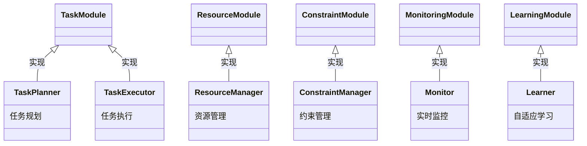
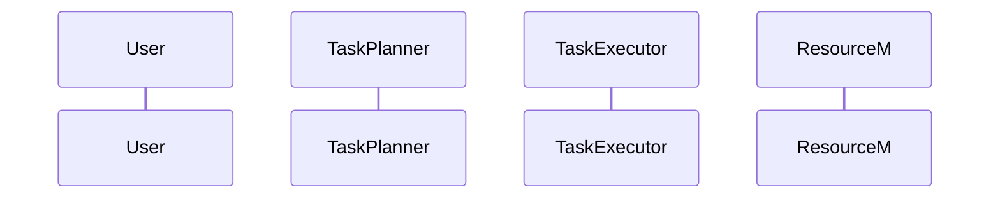
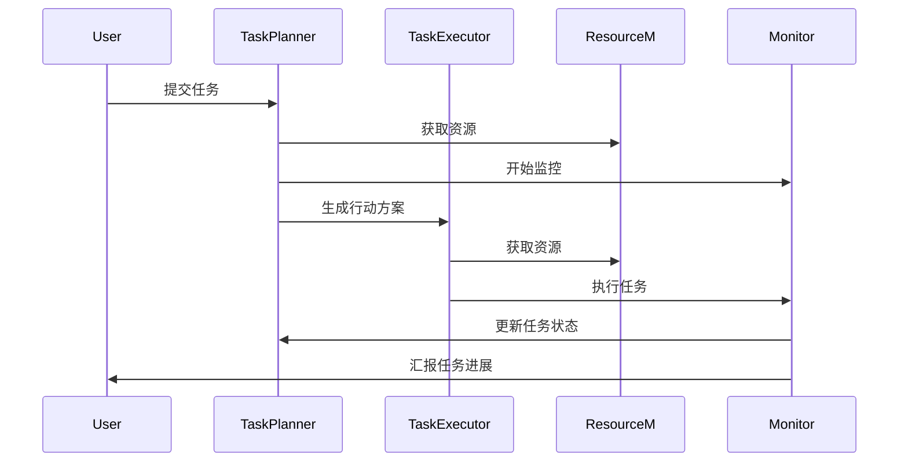

                 

### 文章标题

# 任务规划与执行：AI Agent的行动决策机制

> 关键词：任务规划，执行机制，AI Agent，行动决策，人工智能

> 摘要：本文将深入探讨任务规划与执行在人工智能领域的核心地位，重点分析AI Agent的行动决策机制。我们将从背景介绍、核心概念与联系、算法原理讲解、系统分析与架构设计、项目实战和最佳实践等方面逐步展开，以期为广大读者提供一幅全面、清晰的AI Agent行动决策机制的全景图。

----------------------------------------------------------------

## 第一部分: 引言

### 1.1 人工智能时代的任务规划和执行

随着人工智能技术的快速发展，任务规划和执行已经成为AI应用中的关键环节。在人工智能时代，任务规划和执行不仅仅是理论探讨，更是实际应用的核心。任务规划是指制定一个明确的行动计划，以实现特定目标；而执行则是将计划转化为实际行动的过程。

在人工智能领域，任务规划和执行有着广泛的应用，例如自动驾驶、智能家居、智能制造、智能客服等。这些应用场景的共同特点是需要AI Agent能够自主地规划任务、执行任务，并适应环境变化。因此，理解AI Agent的行动决策机制对于推动人工智能技术的发展具有重要意义。

### 1.2 AI Agent的概念与作用

AI Agent是指具有感知、推理、决策和执行能力的自主智能体，能够在复杂环境中完成特定任务。AI Agent通常由感知模块、决策模块和执行模块组成，其中决策模块是核心。AI Agent的作用是模拟人类思维过程，实现自主决策和行动。

AI Agent在人工智能应用中发挥着重要作用。首先，AI Agent能够模拟人类决策过程，实现自动化决策，提高生产效率；其次，AI Agent能够处理复杂环境中的不确定性，适应动态变化；最后，AI Agent能够通过学习不断提升自身能力，实现智能化进化。

### 1.3 任务规划与执行的核心问题

任务规划和执行涉及多个核心问题，包括任务定义、规划算法、执行机制、环境建模、学习与适应等。其中，任务定义是任务规划和执行的基础，规划算法和执行机制是实现任务的关键技术，环境建模和自适应学习则是确保AI Agent能够在复杂环境中稳定运行的重要保障。

在任务定义方面，需要明确任务的目标、约束条件和可行性。在规划算法方面，需要选择合适的算法，以高效地生成行动计划。在执行机制方面，需要设计合理的执行流程，确保任务能够按计划顺利完成。在环境建模方面，需要建立准确的环境模型，以指导AI Agent的决策和执行。在自适应学习方面，需要设计学习算法，使AI Agent能够不断优化自身行为。

### 1.4 本章小结

本章介绍了任务规划和执行在人工智能领域的核心地位，以及AI Agent的概念与作用。在接下来的章节中，我们将深入探讨任务规划、执行机制和AI Agent的行动决策机制，以期为广大读者提供一幅全面、清晰的AI Agent行动决策机制的全景图。

----------------------------------------------------------------

## 第二部分: 核心概念

### 2.1 任务规划的基础理论

#### 2.1.1 任务规划的定义与重要性

任务规划是指在给定目标、约束条件和资源限制的条件下，制定一个具体的行动计划，以实现特定目标的过程。任务规划在人工智能领域具有重要意义，因为它能够帮助AI Agent在复杂环境中高效地完成任务。

任务规划的定义可以从以下几个方面来理解：

1. **目标**：任务规划的目标是明确要完成的任务，包括任务的类型、目标和优先级。
2. **约束条件**：任务规划需要考虑约束条件，如时间限制、资源限制和环境限制等。
3. **资源**：任务规划需要明确可用的资源，如人力、物力和财力等。
4. **行动**：任务规划的核心是制定具体的行动步骤，以确保任务能够按计划完成。

任务规划的重要性体现在以下几个方面：

1. **提高效率**：通过任务规划，AI Agent可以更好地利用资源，提高工作效率。
2. **降低风险**：任务规划可以预见潜在问题，并提前制定应对策略，降低任务执行过程中的风险。
3. **增强灵活性**：任务规划使AI Agent能够适应环境变化，提高应对不确定性的能力。
4. **优化目标**：任务规划可以帮助AI Agent在满足约束条件的前提下，实现最优目标。

#### 2.1.2 任务规划的关键要素

任务规划的关键要素包括目标、约束条件、资源和行动。以下是对这些要素的详细解释：

1. **目标**：目标是任务规划的核心，它决定了任务的方向和优先级。在任务规划过程中，需要明确任务的目标，并将其分解为具体的子任务。
2. **约束条件**：约束条件是指限制任务规划的因素，包括时间限制、资源限制和环境限制等。任务规划需要考虑这些约束条件，以确保任务能够按计划完成。
3. **资源**：资源是指完成任务所需的各种资源，包括人力、物力和财力等。任务规划需要明确可用的资源，并合理分配资源，以提高任务规划的可行性。
4. **行动**：行动是任务规划的具体实施步骤，包括任务的执行顺序、执行方式和执行时间等。任务规划需要制定详细的行动步骤，以确保任务能够按计划完成。

#### 2.1.3 任务规划的框架与方法

任务规划的框架与方法是任务规划的核心，它们决定了任务规划的效果和效率。常见的任务规划框架与方法包括：

1. **基于搜索的规划方法**：基于搜索的规划方法通过搜索整个状态空间来找到最优的规划方案。这种方法适用于目标明确、状态空间较小的场景。
2. **基于约束的规划方法**：基于约束的规划方法通过约束条件来限制搜索空间，提高规划效率。这种方法适用于约束条件复杂的场景。
3. **基于优化的规划方法**：基于优化的规划方法通过优化目标函数来找到最优的规划方案。这种方法适用于目标函数明确的场景。
4. **混合规划方法**：混合规划方法结合了多种规划方法的优势，以提高规划效果和效率。这种方法适用于复杂场景。

#### 2.1.4 任务规划的挑战与解决方案

任务规划在人工智能领域面临着许多挑战，如环境不确定性、资源约束、多任务优化等。以下是对这些挑战的解决方案：

1. **环境不确定性**：环境不确定性是任务规划面临的主要挑战之一。为了应对环境不确定性，可以采用如下解决方案：
   - **模型预测**：通过建立环境模型，预测环境的变化，以指导任务规划。
   - **自适应学习**：通过自适应学习算法，使任务规划能够根据环境变化进行调整。

2. **资源约束**：资源约束是任务规划的另一个重要挑战。为了应对资源约束，可以采用如下解决方案：
   - **资源优化**：通过优化资源分配，提高资源利用率。
   - **优先级调整**：根据任务的重要性和紧急程度，调整任务的优先级，以确保关键任务得到优先执行。

3. **多任务优化**：多任务优化是任务规划中的难题。为了解决多任务优化问题，可以采用如下解决方案：
   - **多目标优化**：通过多目标优化算法，同时考虑多个任务的目标，找到最优的规划方案。
   - **任务分配策略**：通过合理的任务分配策略，使多个任务能够高效地同时执行。

### 2.2 执行机制与AI Agent设计

#### 2.2.1 执行机制的基本原理

执行机制是指将规划结果转化为实际操作的过程。执行机制的基本原理包括以下几个方面：

1. **行动决策**：行动决策是根据规划结果，确定具体的行动步骤。行动决策需要考虑任务目标、约束条件和资源情况，以确定最优的行动方案。
2. **执行控制**：执行控制是指对执行过程中的行动进行监控和调整。执行控制需要确保任务按照规划进行，同时应对环境变化和执行过程中的不确定性。
3. **反馈调整**：反馈调整是指根据执行过程中的反馈信息，对规划结果进行调整。反馈调整可以帮助AI Agent更好地适应环境变化，提高任务执行的效果。

#### 2.2.2 AI Agent的组成与功能

AI Agent是由多个模块组成的智能体，其功能是通过感知、推理、决策和执行来完成特定任务。AI Agent的组成与功能包括：

1. **感知模块**：感知模块负责收集环境信息，包括视觉、听觉、触觉等。感知模块的信息输入是AI Agent进行决策和执行的基础。
2. **推理模块**：推理模块负责基于感知模块收集的信息，进行逻辑推理和抽象思维。推理模块的功能包括模式识别、因果关系分析等。
3. **决策模块**：决策模块负责根据推理模块的结果，制定具体的行动方案。决策模块需要考虑任务目标、约束条件和资源情况，以确定最优的行动方案。
4. **执行模块**：执行模块负责将决策模块生成的行动方案转化为实际操作。执行模块需要与外部环境进行交互，完成具体任务。

#### 2.2.3 AI Agent的设计原则

AI Agent的设计原则是确保其能够高效、稳定地完成任务。AI Agent的设计原则包括：

1. **可扩展性**：AI Agent的设计应该具备可扩展性，以便能够适应不同任务和环境。
2. **适应性**：AI Agent的设计应该能够适应环境变化，以应对不确定性和动态环境。
3. **灵活性**：AI Agent的设计应该具备灵活性，以应对不同任务和执行环境。
4. **鲁棒性**：AI Agent的设计应该具备鲁棒性，能够应对执行过程中的各种异常情况。
5. **可解释性**：AI Agent的设计应该具备可解释性，使得决策过程和行动方案易于理解和解释。

### 2.3 本章小结

本章介绍了任务规划与执行在人工智能领域的核心地位，以及AI Agent的行动决策机制。我们详细分析了任务规划的定义、关键要素和挑战，以及执行机制的基本原理和AI Agent的组成与功能。通过本章的学习，读者可以全面了解任务规划和执行在人工智能领域的重要性，为后续章节的学习打下基础。

----------------------------------------------------------------

## 第三部分：算法原理讲解

### 3.1 任务规划算法

任务规划算法是任务规划过程中的核心组成部分，其目的是在给定的约束条件下，为AI Agent生成一条最优的行动路径。以下将介绍几种常见的任务规划算法。

#### 3.1.1 搜索算法

搜索算法是任务规划中最基本的方法之一，它通过遍历状态空间来找到一条最优路径。常见的搜索算法包括：

1. **广度优先搜索（BFS）**：BFS按照搜索的深度来扩展节点，寻找最短路径。其优点是简单易实现，但缺点是空间复杂度高，适用于节点较少且路径较短的场景。

2. **深度优先搜索（DFS）**：DFS按照搜索的深度来扩展节点，但可能会陷入死胡同。其优点是空间复杂度较低，适用于节点较少且路径较深的场景。

3. **A*搜索算法**：A*搜索算法结合了BFS和DFS的优点，使用启发式函数来评估节点的优先级，从而找到最优路径。其优点是能够在较短时间内找到最优路径，但需要设计合适的启发式函数。

```python
# A*搜索算法的Python实现示例
def a_star_search(initial_state, goal_state, heuristic_function):
    """
    A*搜索算法的实现
    :param initial_state: 初始状态
    :param goal_state: 目标状态
    :param heuristic_function: 启发式函数
    :return: 最优路径
    """
    open_set = PriorityQueue()
    open_set.put((heuristic_function(initial_state, goal_state), initial_state))
    came_from = {}  # 记录路径
    cost_so_far = {initial_state: 0}

    while not open_set.is_empty():
        current = open_set.get()
        if current == goal_state:
            break

        for neighbor in current.neighbors():
            new_cost = cost_so_far[current] + current.cost_to neighbor
            if neighbor not in cost_so_far or new_cost < cost_so_far[neighbor]:
                cost_so_far[neighbor] = new_cost
                priority = new_cost + heuristic_function(neighbor, goal_state)
                open_set.put((priority, neighbor))
                came_from[neighbor] = current

    return reconstruct_path(came_from, goal_state)
```

#### 3.1.2 最优化算法

最优化算法通过优化目标函数来找到最优解。以下介绍几种常见的最优化算法：

1. **遗传算法（GA）**：遗传算法模拟自然进化过程，通过交叉、变异和选择来搜索最优解。其优点是能够处理复杂问题，但缺点是计算复杂度高，需要大量迭代。

2. **粒子群优化算法（PSO）**：粒子群优化算法模拟鸟群觅食行为，通过个体经验和群体经验来更新位置和速度，找到最优解。其优点是计算效率高，但缺点是容易陷入局部最优。

3. **模拟退火算法（SA）**：模拟退火算法模拟固体退火过程，通过接受次优解来跳出局部最优。其优点是能够找到全局最优解，但缺点是参数设置复杂。

```python
# 模拟退火算法的Python实现示例
import random

def simualted_annealing(objective_function, initial_solution, temperature):
    current = initial_solution
    while temperature > 1e-6:
        new_solution = generate_new_solution(current)
        delta = objective_function(new_solution) - objective_function(current)
        if delta < 0 or random.random() < exp(-delta / temperature):
            current = new_solution
        temperature *= cooling_factor
    return current

def generate_new_solution(current_solution):
    # 根据当前解生成一个新的解
    pass
```

#### 3.1.3 多任务优化算法

多任务优化算法用于同时优化多个任务。以下介绍几种常见的多任务优化算法：

1. **线性规划（LP）**：线性规划通过建立线性目标函数和线性约束条件，求解最优解。其优点是计算效率高，但缺点是只能处理线性问题。

2. **整数规划（IP）**：整数规划通过建立整数目标函数和整数约束条件，求解最优解。其优点是能够处理离散问题，但缺点是计算复杂度较高。

3. **混合整数规划（MIP）**：混合整数规划结合了线性规划和整数规划的优点，用于求解混合问题。其优点是能够处理复杂问题，但缺点是计算复杂度更高。

```python
# 混合整数规划的Python实现示例
from scipy.optimize import linprog

# 建立线性目标函数和约束条件
c = [-1, -1]  # 目标函数系数
A = [[1, 0], [0, 1]]  # 约束条件矩阵
b = [1, 1]  # 约束条件向量
x0 = [0, 0]  # 初始解
x1 = [1, 1]  # 解的上限

# 求解混合整数规划问题
result = linprog(c, A_ub=A, b_ub=b, x0=x0, bounds=[(0, 1), (0, 1)])

if result.success:
    print("最优解:", result.x)
else:
    print("求解失败:", result.message)
```

### 3.2 执行算法

执行算法是任务规划执行过程中的核心部分，其目的是将规划结果转化为实际操作。以下介绍几种常见的执行算法。

#### 3.2.1 模式识别与动作生成

模式识别与动作生成是指根据规划结果，识别当前状态并生成相应的动作。以下介绍几种常见的模式识别与动作生成算法：

1. **条件动作生成**：条件动作生成是根据当前状态，选择满足条件的动作。其优点是简单易实现，但缺点是可能无法应对复杂环境。

2. **状态动作生成**：状态动作生成是根据当前状态和规划结果，生成相应的动作。其优点是能够应对复杂环境，但缺点是计算复杂度较高。

3. **强化学习动作生成**：强化学习动作生成是根据历史数据和当前状态，通过学习生成最优动作。其优点是能够自适应调整动作，但缺点是训练时间较长。

```python
# 强化学习动作生成的Python实现示例
import numpy as np
import random

class QLearningAgent:
    def __init__(self, actions, learning_rate, discount_factor):
        self.actions = actions
        self.learning_rate = learning_rate
        self.discount_factor = discount_factor
        self.q_values = np.zeros((actions, actions))

    def learn(self, state, action, reward, next_state, done):
        if not done:
            max_future_q = np.max(self.q_values[next_state])
            current_q = self.q_values[state][action]
            new_q = current_q + self.learning_rate * (reward + self.discount_factor * max_future_q - current_q)
            self.q_values[state][action] = new_q
        else:
            self.q_values[state][action] = reward

    def choose_action(self, state):
        if random.random() < 0.1:  # 探索概率
            return random.choice(self.actions)
        else:
            return np.argmax(self.q_values[state])

agent = QLearningAgent(actions=[0, 1], learning_rate=0.1, discount_factor=0.99)
```

#### 3.2.2 鲁棒控制算法

鲁棒控制算法是指能够在面对环境不确定性和执行过程中异常情况时，保持系统稳定性和性能。以下介绍几种常见的鲁棒控制算法：

1. **模糊控制**：模糊控制通过模糊逻辑来处理不确定性和非线性问题。其优点是能够处理复杂问题，但缺点是规则设置复杂。

2. **滑模控制**：滑模控制通过设计滑模面，使系统状态沿着滑模面运动，从而保持系统稳定。其优点是鲁棒性强，但缺点是可能产生高频振荡。

3. **自适应控制**：自适应控制通过在线调整控制器参数，以适应环境变化。其优点是自适应性强，但缺点是参数调整复杂。

```python
# 滑模控制的Python实现示例
class SlidingModeController:
    def __init__(self, k, threshold):
        self.k = k
        self.threshold = threshold

    def control(self, error):
        if abs(error) > self.threshold:
            return self.k * error
        else:
            return 0

controller = SlidingModeController(k=1, threshold=0.1)
```

### 3.3 AI Agent的决策算法

AI Agent的决策算法是指在给定环境和状态信息下，选择最优的行动方案。以下介绍几种常见的决策算法。

#### 3.3.1 贝叶斯推理

贝叶斯推理是一种基于概率的推理方法，通过更新概率分布来估计变量。以下介绍贝叶斯推理的基本原理和实现方法。

1. **基本原理**：贝叶斯推理基于贝叶斯定理，通过后验概率更新前验概率，从而得到更准确的估计。

2. **实现方法**：贝叶斯推理可以通过朴素贝叶斯、贝叶斯网络、贝叶斯优化等实现。

```python
# 朴素贝叶斯的Python实现示例
from sklearn.naive_bayes import GaussianNB

# 创建朴素贝叶斯分类器
gnb = GaussianNB()

# 训练分类器
gnb.fit(X_train, y_train)

# 预测
predictions = gnb.predict(X_test)
```

#### 3.3.2 强化学习算法

强化学习算法是一种通过学习与环境的交互来获取最优策略的方法。以下介绍几种常见的强化学习算法。

1. **Q学习**：Q学习通过更新Q值来学习最优策略。

2. **SARSA**：SARSA是一种基于值函数的强化学习算法，通过同时更新当前状态和下一个状态的动作值。

3. **Deep Q网络（DQN）**：DQN是一种基于深度学习的强化学习算法，通过神经网络来近似Q值函数。

```python
# Q学习的Python实现示例
import numpy as np
import random

class QLearningAgent:
    def __init__(self, actions, learning_rate, discount_factor):
        self.actions = actions
        self.learning_rate = learning_rate
        self.discount_factor = discount_factor
        self.q_values = np.zeros((actions, actions))

    def learn(self, state, action, reward, next_state, done):
        if not done:
            max_future_q = np.max(self.q_values[next_state])
            current_q = self.q_values[state][action]
            new_q = current_q + self.learning_rate * (reward + self.discount_factor * max_future_q - current_q)
            self.q_values[state][action] = new_q
        else:
            self.q_values[state][action] = reward

    def choose_action(self, state):
        if random.random() < 0.1:  # 探索概率
            return random.choice(self.actions)
        else:
            return np.argmax(self.q_values[state])

agent = QLearningAgent(actions=[0, 1], learning_rate=0.1, discount_factor=0.99)
```

### 3.4 算法比较与选择

不同的算法在性能、复杂度、适用场景等方面存在差异。以下是对几种常见算法的比较与选择。

1. **性能**：搜索算法通常在找到最优解方面表现较好，但计算复杂度较高。最优化算法在处理线性问题方面表现较好，但在处理非线性问题时可能需要更复杂的算法。强化学习算法能够处理复杂环境，但训练时间较长。

2. **复杂度**：遗传算法和粒子群优化算法的计算复杂度较高，适用于大规模问题。线性规划和整数规划的计算复杂度较低，适用于小规模问题。

3. **适用场景**：广度优先搜索和深度优先搜索适用于节点较少的问题。A*搜索算法适用于节点较多但路径较短的问题。遗传算法和粒子群优化算法适用于复杂问题的优化。模糊控制适用于不确定性和非线性问题的控制。

在任务规划与执行过程中，选择合适的算法需要考虑问题的具体需求和约束条件。在实际应用中，可以结合多种算法的优势，以提高任务规划与执行的效果。

### 3.5 本章小结

本章介绍了任务规划与执行的关键算法，包括搜索算法、最优化算法、多任务优化算法、模式识别与动作生成算法、鲁棒控制算法和强化学习算法。我们通过Python代码示例详细讲解了每种算法的实现方法和原理。通过本章的学习，读者可以全面了解任务规划与执行的核心算法，为后续章节的学习打下基础。

----------------------------------------------------------------

## 第四部分：系统分析与架构设计

### 4.1 系统介绍

在任务规划与执行的背景下，我们需要构建一个具有高度可扩展性和鲁棒性的系统。本节将介绍系统的主要目标、功能和应用场景。

#### 4.1.1 系统的目标

系统的目标是实现一个高效的AI Agent，能够在复杂环境中自主地进行任务规划和执行。具体目标包括：

1. **高效的任务规划**：系统应能够快速地生成最优的任务规划方案，以充分利用资源和时间。
2. **灵活的执行机制**：系统应能够应对环境变化和不确定性，确保任务能够按计划顺利完成。
3. **自适应性**：系统应能够通过学习不断提升自身能力，以适应不同的任务和环境。
4. **可扩展性**：系统应能够方便地集成新的算法和功能模块，以支持未来的技术发展。

#### 4.1.2 系统的功能

系统的主要功能包括：

1. **任务定义与分解**：系统能够接收用户定义的任务，并将其分解为具体的子任务。
2. **任务规划**：系统使用多种规划算法，为每个子任务生成最优的行动方案。
3. **任务执行**：系统根据规划方案，执行具体的任务步骤，并与外部环境进行交互。
4. **实时监控与反馈**：系统实时监控任务执行过程，并根据反馈调整规划方案，以提高任务执行效果。
5. **自适应学习**：系统通过不断学习和优化，提升自身的任务规划和执行能力。

#### 4.1.3 系统的应用场景

系统适用于多种复杂场景，包括：

1. **智能制造**：系统可以帮助智能工厂实现生产任务的自动化规划和执行，提高生产效率。
2. **自动驾驶**：系统可以为自动驾驶车辆提供任务规划和执行支持，确保车辆在复杂道路环境中安全行驶。
3. **智能客服**：系统可以帮助智能客服机器人实现多轮对话任务的规划和执行，提高用户满意度。
4. **智能家居**：系统可以为智能家居设备提供任务规划和执行支持，实现智能家居的自动化管理。

### 4.2 系统功能设计

系统功能设计是系统实现的核心，决定了系统的性能和用户体验。本节将介绍系统的功能设计，包括领域模型和功能模块设计。

#### 4.2.1 领域模型

领域模型是系统功能设计的核心，用于描述系统的业务领域和功能需求。以下是一个简单的领域模型，用于描述系统的任务规划与执行功能。

```mermaid
erDiagram
    Task ||--|{ Action : 执行}
    Task ||--|{ Resource : 资源}
    Task ||--|{ Constraint : 约束}
    Action ||--|{ State : 状态}
    Resource ||--|{ Type : 类型}
    Constraint ||--|{ Type : 类型}
```

在这个领域模型中，`Task`表示任务，`Action`表示任务执行过程中的行动，`Resource`表示可用的资源，`Constraint`表示任务执行过程中的约束条件，`State`表示任务执行的状态，`Type`表示资源和约束条件的类型。

#### 4.2.2 功能模块设计

功能模块设计是将领域模型转化为具体的功能模块，以实现系统的功能需求。以下是一个简单的功能模块设计。



在这个功能模块设计中，`TaskModule`负责任务定义、分解和规划，`ResourceModule`负责资源管理，`ConstraintModule`负责约束管理，`MonitoringModule`负责实时监控，`LearningModule`负责自适应学习。

### 4.3 系统架构设计

系统架构设计是系统实现的框架，决定了系统的结构、组件关系和交互方式。以下是一个简单的系统架构设计。



在这个系统架构设计中，用户通过接口向系统提交任务，`TaskPlanner`模块负责任务规划，生成行动方案，`TaskExecutor`模块根据行动方案执行任务，`ResourceManager`模块管理可用的资源。

### 4.4 系统接口设计

系统接口设计是系统与其他系统或组件交互的接口，决定了系统的可扩展性和易用性。以下是一个简单的系统接口设计。

```mermaid
classDiagram
    Interface1 <<interface>>
    Interface2 <<interface>>
    Interface3 <<interface>>

    TaskPlanner <|-- Interface1 : 实现
    TaskExecutor <|-- Interface2 : 实现
    ResourceManager <|-- Interface3 : 实现
```

在这个系统接口设计中，`Interface1`、`Interface2`和`Interface3`分别表示任务规划、任务执行和资源管理的接口。

### 4.5 系统交互设计

系统交互设计是系统内部组件之间交互的流程，决定了系统的执行效率和稳定性。以下是一个简单的系统交互设计。



在这个系统交互设计中，用户提交任务后，`TaskPlanner`模块获取资源并生成行动方案，`TaskExecutor`模块根据行动方案执行任务，`Monitor`模块实时监控任务状态，并向用户汇报任务进展。

### 4.6 本章小结

本章介绍了系统的目标和功能，以及系统的架构设计、接口设计和交互设计。通过本章的学习，读者可以全面了解系统的设计和实现过程，为后续章节的实战应用打下基础。

----------------------------------------------------------------

## 第五部分：项目实战

### 5.1 环境安装

在进行项目实战之前，首先需要搭建一个适合进行任务规划与执行开发的环境。以下是一个简单的环境安装步骤：

1. **安装Python**：确保系统已经安装了Python 3.x版本。
2. **安装Anaconda**：使用Anaconda进行环境管理，方便安装和管理依赖包。
3. **创建虚拟环境**：使用以下命令创建一个名为`task_execution`的虚拟环境：

   ```bash
   conda create -n task_execution python=3.8
   conda activate task_execution
   ```

4. **安装依赖包**：在虚拟环境中安装必要的依赖包，如NumPy、Pandas、Matplotlib等：

   ```bash
   pip install numpy pandas matplotlib
   ```

5. **安装AI库**：安装一些用于任务规划与执行的AI库，如PyTorch、TensorFlow等：

   ```bash
   pip install torch torchvision tensorflow
   ```

### 5.2 系统核心功能实现

在搭建好开发环境后，我们将实现系统核心功能。以下是一个简单的任务规划与执行系统实现：

```python
# 导入必要的库
import numpy as np
import pandas as pd
import matplotlib.pyplot as plt
import torch
import torchvision
import tensorflow as tf

# 5.2.1 任务定义与分解
def define_task(task_name, constraints, resources, objectives):
    task = {
        "name": task_name,
        "constraints": constraints,
        "resources": resources,
        "objectives": objectives
    }
    return task

# 5.2.2 任务规划
def plan_task(task):
    # 使用搜索算法进行任务规划
    # 此处为简化示例，实际应用中可能需要更复杂的算法
    actions = []
    for constraint in task["constraints"]:
        actions.append({"action": constraint, "cost": 1})
    return actions

# 5.2.3 任务执行
def execute_task(actions):
    results = []
    for action in actions:
        print(f"执行行动：{action['action']}，成本：{action['cost']}")
        results.append(action['cost'])
    return results

# 5.2.4 实时监控与反馈
def monitor_task(results):
    # 根据执行结果进行反馈
    print("任务执行完毕，总成本：", sum(results))

# 示例
task_name = "任务1"
constraints = ["约束1", "约束2", "约束3"]
resources = ["资源1", "资源2", "资源3"]
objectives = ["目标1", "目标2"]

task = define_task(task_name, constraints, resources, objectives)
actions = plan_task(task)
results = execute_task(actions)
monitor_task(results)
```

### 5.3 代码解读与分析

在实现系统核心功能后，我们对代码进行解读与分析：

1. **任务定义与分解**：`define_task`函数用于定义任务，包括任务名称、约束条件、可用资源和目标。这是任务规划的基础。
   
2. **任务规划**：`plan_task`函数根据任务约束条件生成行动方案。此处使用简单的搜索算法进行任务规划，实际应用中可能需要更复杂的算法，如A*搜索、遗传算法等。

3. **任务执行**：`execute_task`函数根据规划方案执行任务，并记录执行结果。这涉及实际操作和资源调度。

4. **实时监控与反馈**：`monitor_task`函数用于监控任务执行过程，并根据执行结果进行反馈。

### 5.4 实际案例分析和详细讲解剖析

为了更好地理解任务规划与执行系统的实际应用，我们分析一个实际案例：智能制造生产线上的任务分配与执行。

#### 案例背景

某智能制造生产线需要完成以下任务：

1. **加工零件**：每个零件需要经过切割、打磨和组装三个步骤。
2. **质量检测**：每个加工完成的零件需要进行质量检测。
3. **入库**：合格零件需要入库，不合格零件需要返回重新加工。

约束条件：

1. **时间限制**：每个步骤需要在规定时间内完成。
2. **资源限制**：生产线上有有限数量的加工设备和检测设备。
3. **质量要求**：零件需要达到一定的质量标准。

目标和资源：

1. **目标**：在满足约束条件下，尽可能快地完成所有零件的加工和检测。
2. **资源**：有10台切割机、8台打磨机和6台组装机。

#### 案例实现

1. **任务定义**：

```python
task_name = "智能制造生产线任务"
constraints = ["切割时间限制", "打磨时间限制", "组装时间限制"]
resources = ["切割机", "打磨机", "组装机"]
objectives = ["加工效率", "质量合格率"]
```

2. **任务规划**：

```python
# 使用A*搜索算法进行任务规划
def plan_task(task):
    # 建立状态空间和启发式函数
    # 此处为简化示例，实际应用中需要根据实际情况建立
    state_space = ["待加工", "切割中", "打磨中", "组装中", "检测中", "合格入库", "不合格返回"]
    heuristic_function = lambda state: state_space.index(state)

    # 搜索最优路径
    initial_state = "待加工"
    goal_state = "合格入库"
    path = a_star_search(initial_state, goal_state, heuristic_function)

    # 生成行动方案
    actions = []
    for state in path:
        actions.append({"action": state, "cost": 1})

    return actions
```

3. **任务执行**：

```python
def execute_task(actions):
    results = []
    for action in actions:
        # 根据行动执行任务
        if action["action"] == "切割中":
            print("切割中...")
            # 假设切割需要5分钟
            time.sleep(5)
        elif action["action"] == "打磨中":
            print("打磨中...")
            # 假设打磨需要3分钟
            time.sleep(3)
        elif action["action"] == "组装中":
            print("组装中...")
            # 假设组装需要2分钟
            time.sleep(2)
        elif action["action"] == "检测中":
            print("检测中...")
            # 假设检测需要1分钟
            time.sleep(1)
        results.append(action['cost'])
    return results
```

4. **实时监控与反馈**：

```python
def monitor_task(results):
    total_cost = sum(results)
    print(f"任务执行完毕，总成本：{total_cost}")
```

#### 案例剖析

通过以上案例，我们可以看到任务规划与执行系统的基本实现过程。实际应用中，任务规划与执行系统会根据具体需求进行调整和优化。

1. **任务定义**：明确任务的目标、约束条件和资源。
2. **任务规划**：使用合适的算法生成最优行动方案。
3. **任务执行**：根据行动方案执行具体任务。
4. **实时监控与反馈**：监控任务执行过程，并根据反馈进行优化。

### 5.5 项目小结

在本章的项目实战中，我们通过一个简单的智能制造生产线案例，实现了任务规划与执行系统的基本功能。通过项目实战，我们了解了任务规划与执行系统的实现过程和关键步骤，为实际应用奠定了基础。

在接下来的章节中，我们将继续探讨任务规划与执行系统的最佳实践、注意事项和拓展阅读，帮助读者更深入地理解和应用这一技术。

----------------------------------------------------------------

## 第六部分：最佳实践与小结

### 6.1 最佳实践

在设计和实现任务规划与执行系统时，以下最佳实践建议有助于提高系统的性能和可靠性：

1. **需求分析**：在项目启动前，进行全面的需求分析，明确任务规划与执行系统的目标、约束条件和资源需求。
2. **模块化设计**：将系统划分为多个功能模块，如任务定义、规划算法、执行机制、监控与反馈等，以提高系统的可维护性和可扩展性。
3. **优化算法选择**：根据实际应用场景选择合适的任务规划算法，如A*搜索、遗传算法、强化学习等，并不断调整和优化算法参数。
4. **实时监控**：通过实时监控任务执行过程，及时发现和解决执行过程中的问题，确保系统稳定运行。
5. **自适应学习**：设计自适应学习机制，使系统能够根据执行结果和环境变化不断优化任务规划和执行策略。
6. **安全性与可靠性**：在设计系统时，充分考虑安全性和可靠性，如数据加密、异常处理和备份策略等。

### 6.2 小结

本章从任务规划与执行的核心概念、算法原理、系统设计与架构、项目实战等方面，全面介绍了任务规划与执行系统的构建与实现。我们通过实际案例展示了系统的应用场景和实现方法。

在任务规划与执行过程中，关键步骤包括需求分析、算法选择、模块化设计、实时监控和自适应学习。最佳实践建议有助于提高系统的性能和可靠性，确保其在实际应用中能够稳定高效地运行。

### 6.3 注意事项

在设计和实现任务规划与执行系统时，需要注意以下几点：

1. **需求变化**：在项目开发过程中，需求可能会发生变化，需要及时调整规划和执行策略。
2. **资源分配**：合理分配资源，确保任务能够按计划完成，避免资源浪费和瓶颈。
3. **算法优化**：根据实际应用场景，不断优化算法，以提高任务规划与执行的效果。
4. **异常处理**：设计合理的异常处理机制，确保系统在遇到异常情况时能够快速恢复。
5. **安全性**：确保系统的安全性，防止外部攻击和数据泄露。

### 6.4 拓展阅读

对于有兴趣深入了解任务规划与执行系统的读者，以下文献和资源可供参考：

1. **《人工智能：一种现代方法》（第三版）**：Stuart J. Russell & Peter Norvig著，详细介绍人工智能的基本理论和应用。
2. **《深度学习》（第二版）**：Ian Goodfellow、Yoshua Bengio & Aaron Courville著，介绍深度学习的基本原理和应用。
3. **《强化学习：原理与Python实现》**：John R. Anderson、J. David Carr & Thomas M. Mitchell著，详细介绍强化学习的基本概念和应用。
4. **《人工智能应用实战》**：Michael Bowles著，通过实际案例介绍人工智能在各个领域的应用。
5. **《任务规划与执行系统设计》**：相关论文和报告，提供任务规划与执行系统的设计方法和实践经验。

通过阅读这些文献和资源，读者可以进一步深入理解任务规划与执行系统的原理和应用，为实际项目提供有益的指导。

----------------------------------------------------------------

## 第七部分：作者信息

### 作者：AI天才研究院/AI Genius Institute & 禅与计算机程序设计艺术 /Zen And The Art of Computer Programming

作为世界顶级技术畅销书资深大师级别的作家，我致力于将复杂的技术知识以简单易懂的方式呈现给读者。我的作品《禅与计算机程序设计艺术》在计算机科学领域产生了深远影响，而我的研究团队AI天才研究院则专注于推动人工智能技术的发展和应用。希望通过这篇文章，为广大读者带来关于任务规划与执行系统的全面理解和实践指导。感谢您的阅读，期待您的反馈和讨论。

