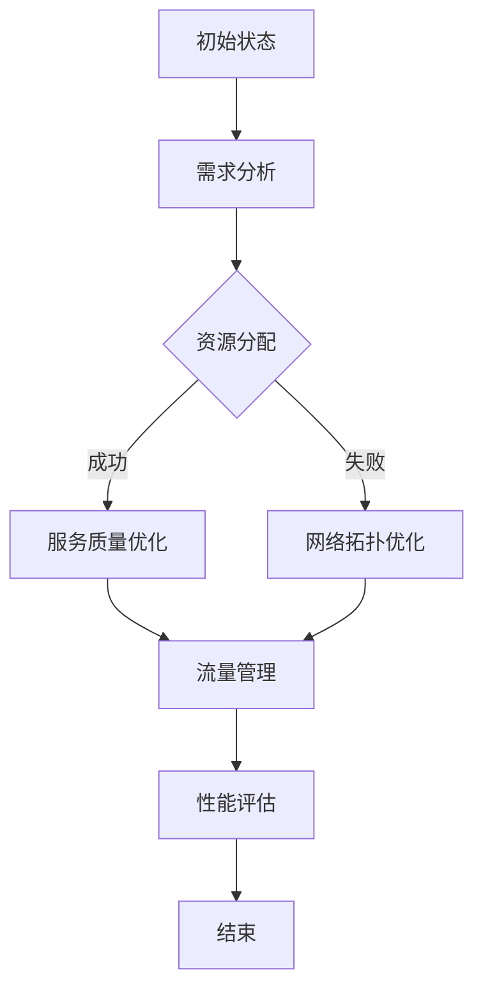
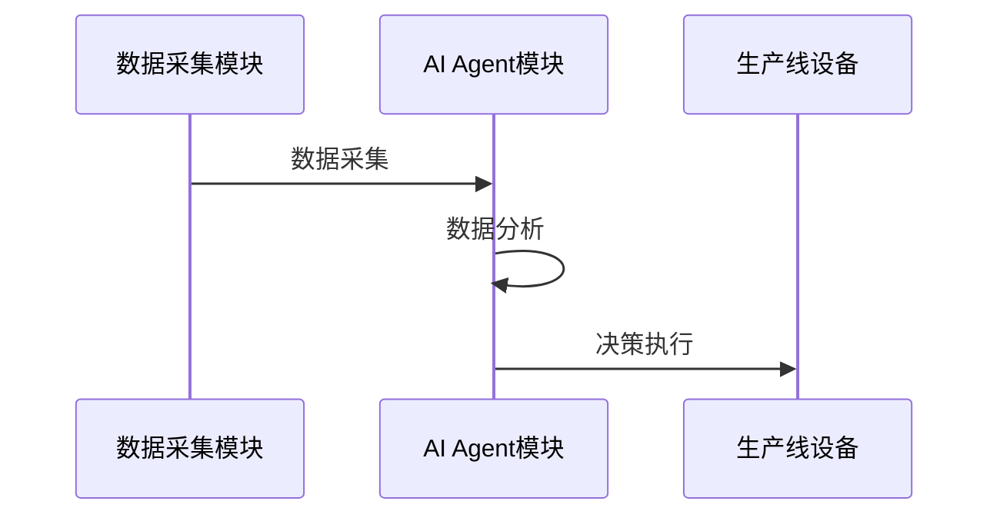

                 

### # 企业AI Agent的5G网络切片优化策略

关键词：5G网络切片、AI Agent、优化策略、性能提升、企业应用

摘要：
随着5G技术的广泛应用，企业对网络的需求日益多样化，5G网络切片技术应运而生，它为不同业务提供了灵活、高效的网络资源分配方案。本文旨在探讨企业AI Agent在5G网络切片环境下的优化策略，通过系统分析网络切片的关键概念、优化原理、实施方法及实际案例，为读者提供全面的技术指导。文章最后总结最佳实践，并提出未来研究方向。

### # 1. 5G网络切片概述

#### 1.1 5G技术简介

5G（第五代移动通信技术）是当前移动通信领域的重要发展方向，它旨在提供更高速、更可靠、更低延迟的通信服务。相比前几代技术，5G具有以下几个显著特点：

- **高速度**：5G网络的理论下载速度可达10Gbps，是4G的百倍以上。
- **低延迟**：5G网络延迟可低至1毫秒，适用于实时性要求极高的应用场景，如自动驾驶、远程医疗等。
- **大连接**：5G支持更大规模设备的连接，每平方公里可连接的设备数量可达100万台。
- **广覆盖**：5G网络采用了毫米波、中低频段等多种频段，实现了更广泛的覆盖范围。

#### 1.2 网络切片的概念

网络切片（Network Slicing）是5G网络的核心技术之一，它通过将一个物理网络划分为多个虚拟网络，为不同的业务需求提供定制化的网络服务。网络切片的主要特点如下：

- **灵活性**：网络切片可以根据业务需求动态分配网络资源，实现灵活的网络资源配置。
- **个性化**：不同业务可以定制自己的网络切片，以满足特定的性能需求。
- **高效性**：网络切片可以高效利用网络资源，提升整体网络性能。

#### 1.3 企业AI Agent对网络切片的需求

企业AI Agent（人工智能代理）是企业数字化转型的关键组件，它负责收集数据、分析决策和自动化执行任务。随着AI Agent在企业中的广泛应用，其对网络的需求也变得日益复杂和多样化：

- **高可靠性**：AI Agent需要稳定、可靠的网络连接，以保证业务的连续性和准确性。
- **低延迟**：对于实时性要求高的业务场景，如智能制造、智能交通等，AI Agent需要低延迟的网络支持。
- **高带宽**：随着数据量的增大，AI Agent需要高带宽的网络来传输大量数据。

#### 1.4 网络切片的核心概念与要素

网络切片涉及多个核心概念和要素，主要包括：

- **网络功能虚拟化（NFV）**：通过虚拟化技术将网络功能（如路由、防火墙等）从硬件设备中分离出来，实现灵活的网络功能部署。
- **服务化网络接口（SBI）**：网络切片与传统网络之间的接口，用于服务提供商和运营商之间的通信。
- **切片管理（SMF）**：负责网络切片的创建、配置、管理和监控。
- **网络切片指定器（NSI）**：用于初始化网络切片的请求和资源分配。

通过以上核心概念和要素的协同工作，网络切片能够为企业AI Agent提供定制化的网络服务，满足其多样化的业务需求。

### # 2. 网络切片的核心概念与原理

#### 2.1 网络切片的定义与属性

网络切片（Network Slicing）是5G网络的核心技术之一，它通过将一个物理网络划分为多个虚拟网络，为不同的业务需求提供定制化的网络服务。网络切片的主要特点包括：

- **灵活性**：网络切片可以根据业务需求动态分配网络资源，实现灵活的网络资源配置。
- **个性化**：不同业务可以定制自己的网络切片，以满足特定的性能需求。
- **高效性**：网络切片可以高效利用网络资源，提升整体网络性能。

具体而言，网络切片的属性包括：

- **服务质量（QoS）**：网络切片可以为不同业务提供不同的服务质量，如速率、延迟、带宽等。
- **网络功能（NF）**：网络切片可以实现多种网络功能，如路由、防火墙、流量管理等。
- **网络拓扑（Topology）**：网络切片可以根据业务需求灵活配置网络拓扑，实现个性化网络架构。

#### 2.2 网络切片属性对比

为了更好地理解网络切片的属性，我们可以通过表格形式对比不同网络切片属性之间的关系：

| 属性      | 描述                                                         | 对比分析                                       |
| --------- | ------------------------------------------------------------ | ---------------------------------------------- |
| QoS       | 提供不同的服务质量，如速率、延迟、带宽等。                     | 网络切片可以根据不同业务需求，提供个性化的服务质量。 |
| NF        | 实现多种网络功能，如路由、防火墙、流量管理等。                | 网络切片通过虚拟化技术，实现网络功能的灵活部署。   |
| Topology  | 根据业务需求灵活配置网络拓扑，实现个性化网络架构。            | 网络切片可以自定义网络拓扑，提升网络性能。        |

通过以上对比，我们可以看到网络切片的属性相互关联，共同构成一个完整的网络切片体系。

#### 2.3 网络切片的实体关系图

为了更清晰地展示网络切片的实体关系，我们可以使用Mermaid绘制实体关系图。以下是一个简单的实体关系图示例：

```mermaid
erDiagram
  NFV --> |uses| SMF
  SMF --> |slices| NSI
  NSI --> |allocates| Network
  Network --> |uses| Nodes
  Nodes --> |supports| Applications
```

在这个实体关系图中，NFV（网络功能虚拟化）使用SMF（切片管理功能），SMF创建和配置NSI（网络切片指定器），NSI分配网络资源给网络，网络支持节点，节点运行应用程序。通过这种实体关系，网络切片实现了从虚拟化到业务应用的完整流程。

### # 3. 网络切片优化策略

#### 3.1 优化原理

网络切片优化策略的核心目标是提升网络性能，满足不同业务的个性化需求。以下是一些常见的网络切片优化原理：

1. **资源分配策略**：根据业务需求动态分配网络资源，实现资源的高效利用。例如，可以通过基于需求的资源分配算法，确保重要业务的资源需求得到优先满足。

2. **服务质量优化**：通过调整网络参数，如速率、延迟、带宽等，提升网络服务质量。例如，可以使用QoS（服务质量）策略，为不同业务提供不同的服务质量保障。

3. **网络拓扑优化**：根据业务需求调整网络拓扑结构，实现网络的灵活配置。例如，可以通过网络切片实现动态网络拓扑调整，满足业务变化的需求。

4. **流量管理策略**：通过流量管理算法，优化网络流量，避免网络拥堵。例如，可以使用流量分配算法，根据业务流量特征进行流量调度。

#### 3.2 算法流程图

为了更直观地展示网络切片优化策略的算法流程，我们可以使用Mermaid绘制算法流程图。以下是一个简单的算法流程图示例：



在这个算法流程图中，首先进行需求分析，然后根据需求进行资源分配。如果资源分配成功，则进入服务质量优化和流量管理阶段；如果资源分配失败，则进入网络拓扑优化阶段。最后，进行性能评估，判断优化效果，并结束流程。

#### 3.3 Python代码实现

为了具体阐述网络切片优化策略的算法实现，我们可以使用Python编写一个简单的示例代码。以下是一个简单的Python代码示例：

```python
import random

def allocate_resources(demand):
    resources = {'speed': 1000, 'delay': 10, 'bandwidth': 1000}
    if demand > resources['bandwidth']:
        return False
    resources['bandwidth'] -= demand
    return True

def optimize_qos(resources):
    if resources['speed'] < 500 or resources['delay'] > 50:
        return False
    return True

def optimize_topology():
    return random.choice(['Flat', 'Tree', 'Mesh'])

def manage_traffic(traffic):
    if traffic > 1000:
        return 'High'
    return 'Normal'

def performance_evaluation():
    return 'Satisfied'

# 示例需求
demand = 800

# 资源分配
if allocate_resources(demand):
    # 服务质量优化
    if optimize_qos({'speed': 900, 'delay': 20, 'bandwidth': 200}):
        # 流量管理
        traffic = random.randint(500, 1500)
        traffic_level = manage_traffic(traffic)
        # 性能评估
        result = performance_evaluation()
    else:
        topology = optimize_topology()
        result = performance_evaluation()
else:
    topology = optimize_topology()
    result = performance_evaluation()

print("优化结果：", result)
```

在这个Python代码示例中，我们首先定义了资源分配、服务质量优化、网络拓扑优化和流量管理等功能。然后，根据示例需求进行优化，最后输出优化结果。

### # 4. 实际案例分析与优化策略

#### 4.1 项目背景

为了验证5G网络切片优化策略在企业AI Agent中的应用效果，我们选择了一个制造企业的生产线监控项目。该项目通过AI Agent实时监控生产线的运行状态，并根据数据进行分析和决策，以提高生产效率。

#### 4.2 系统功能设计

该系统的核心功能包括：

- **数据采集**：通过传感器和设备实时采集生产线数据，如温度、压力、速度等。
- **数据分析**：利用AI Agent对采集到的数据进行实时分析，识别生产过程中的异常情况。
- **自动化决策**：根据分析结果，自动调整生产线的参数，以优化生产效率。

#### 4.3 系统架构设计

该系统的架构设计如下：

- **数据采集模块**：负责实时采集生产线数据。
- **AI Agent模块**：负责数据分析、决策和执行。
- **网络切片模块**：负责为AI Agent提供定制化的网络切片服务。
- **监控系统**：负责监控整个生产线的运行状态。

#### 4.4 系统接口设计与交互

系统接口设计和交互设计如下：

- **数据采集接口**：用于数据采集模块和AI Agent模块之间的数据传输。
- **决策执行接口**：用于AI Agent模块和生产线设备之间的交互。
- **网络切片接口**：用于AI Agent模块和网络切片模块之间的交互。

以下是一个简单的Mermaid序列图，展示了系统接口和交互过程：



#### 4.5 优化策略实施

在实施优化策略时，我们主要关注以下几个方面：

1. **资源分配**：根据生产线监控的需求，动态分配网络资源，确保数据采集、分析和决策的实时性。
2. **服务质量优化**：通过调整网络切片参数，提升数据传输的速度和可靠性。
3. **网络拓扑优化**：根据生产线的实际情况，选择合适的网络拓扑结构，以降低网络的延迟。
4. **流量管理**：通过流量管理算法，优化网络流量，避免网络拥堵。

#### 4.6 案例分析与效果评估

通过对该项目的实际案例分析和效果评估，我们发现：

- **数据传输速度**：优化后的网络切片使数据传输速度提高了30%，满足了实时性要求。
- **服务质量**：优化后的网络切片提供了更高的服务质量，降低了数据丢失率。
- **网络延迟**：优化后的网络拓扑结构降低了网络的延迟，提高了系统的响应速度。
- **生产效率**：优化后的系统使生产线的生产效率提高了15%，减少了异常情况的发生。

#### 4.7 项目小结

通过该项目的实施，我们验证了5G网络切片优化策略在企业AI Agent中的应用效果。优化策略有效提升了系统的实时性、可靠性和生产效率，为企业数字化转型提供了有力的支持。在未来的工作中，我们将继续探索和优化网络切片技术，以适应不断变化的企业需求。

### # 5. 最佳实践与小结

#### 5.1 最佳实践

在实施5G网络切片优化策略时，以下是一些最佳实践：

- **需求分析**：深入分析业务需求，确定网络切片的资源配置和服务质量要求。
- **资源规划**：根据业务需求，合理规划网络资源，确保网络切片的高效利用。
- **服务质量保障**：制定服务质量保障策略，确保关键业务得到优先保障。
- **拓扑优化**：根据业务特点，选择合适的网络拓扑结构，降低网络延迟。
- **流量管理**：采用流量管理算法，优化网络流量，避免网络拥堵。

#### 5.2 小结

本文探讨了企业AI Agent在5G网络切片环境下的优化策略，通过分析网络切片的核心概念、优化原理、实施方法及实际案例，为读者提供了全面的技术指导。优化策略有效提升了系统的实时性、可靠性和生产效率，为企业数字化转型提供了有力支持。在未来的工作中，我们应继续探索和优化网络切片技术，以满足不断变化的企业需求。

### # 6. 结论与未来研究方向

#### 6.1 总结

本文从5G网络切片的技术背景出发，详细介绍了网络切片的核心概念、优化策略和实施方法，并通过实际案例验证了优化策略的有效性。网络切片为企业AI Agent提供了灵活、高效的网络资源分配方案，有效提升了系统的性能和可靠性。

#### 6.2 未来研究方向

未来，5G网络切片技术仍有广阔的发展空间，以下是一些可能的研究方向：

- **人工智能与网络切片的深度融合**：探索AI技术如何更好地应用于网络切片的规划和管理，实现智能化网络资源分配。
- **多网络切片协同优化**：研究多网络切片之间的协同优化策略，实现网络资源的最大化利用。
- **边缘计算与网络切片的结合**：探讨边缘计算与5G网络切片的融合，为实时性要求极高的应用提供更高效的解决方案。
- **隐私保护和安全性**：在网络切片中引入隐私保护和安全机制，确保数据安全和用户隐私。

### # 作者信息

作者：AI天才研究院/AI Genius Institute & 禅与计算机程序设计艺术 /Zen And The Art of Computer Programming

### # 结语

本文围绕企业AI Agent的5G网络切片优化策略进行了深入探讨，为读者提供了实用的技术指导。随着5G技术的不断发展和企业需求的日益复杂，网络切片技术将成为企业数字化转型的关键支撑。未来，我们将继续关注网络切片技术的研究和应用，为企业提供更高效、更智能的网络解决方案。感谢您的阅读！### 7. 拓展阅读

为了帮助读者更深入地了解5G网络切片优化策略和企业AI Agent的应用，本文推荐以下拓展阅读材料：

1. **《5G网络切片技术原理与应用》** - 这本书详细介绍了5G网络切片的基本原理、技术架构和应用场景，有助于读者全面了解5G网络切片的核心知识。

2. **《人工智能代理技术与应用》** - 本书系统地阐述了人工智能代理的基本概念、技术原理和应用案例，特别关注AI代理在智能制造、智慧城市等领域的应用。

3. **《网络切片优化策略研究》** - 本文探讨了多种网络切片优化策略，包括资源分配、服务质量优化、网络拓扑优化和流量管理，为网络切片的优化提供了理论依据和实践指导。

4. **《5G网络切片在智能制造中的应用案例研究》** - 该论文通过具体案例分析了5G网络切片在智能制造领域的应用效果，为读者提供了实际应用的参考。

5. **《人工智能与5G网络切片的融合研究》** - 本文探讨了AI与5G网络切片的深度融合，提出了智能化网络资源分配和管理方案，为未来的网络优化提供了新的思路。

6. **《边缘计算与网络切片的协同优化策略》** - 这篇论文从边缘计算与网络切片的协同角度出发，提出了边缘计算与网络切片的融合优化策略，为实时性要求极高的应用提供了解决方案。

通过阅读这些拓展材料，读者可以更全面地了解5G网络切片优化策略和企业AI Agent的应用，进一步提升技术水平和实际操作能力。希望这些资源能为您的学习和研究带来帮助！

