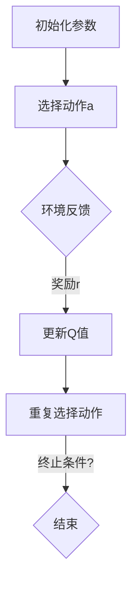
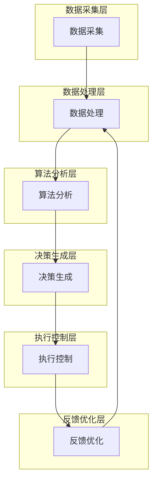
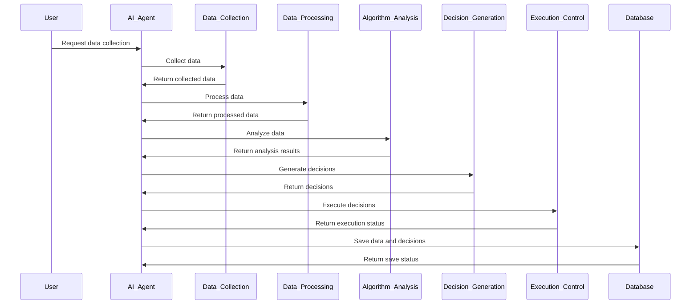

                 

### 企业AI Agent的5G网络应用策略

#### 关键词：5G网络、AI Agent、应用策略、系统架构、算法原理、项目实战

> 摘要：随着5G网络的快速普及，AI Agent技术在企业中的应用潜力逐渐显现。本文将深入探讨企业AI Agent在5G网络环境下的应用策略，从背景介绍、核心概念、算法原理、系统设计、项目实战到最佳实践，提供一套全面、系统的解决方案。通过本文的讨论，我们希望为企业在5G时代中利用AI Agent技术提供实用的指导。

### 目录

1. **5G网络与AI Agent概述**
   - **1.1 5G网络概述**
     - 5G网络的技术特点
     - 5G网络的应用场景
   - **1.2 AI Agent的定义与特性**
     - AI Agent的基本概念
     - AI Agent的特性与优势
   - **1.3 5G网络与AI Agent的结合原理**
     - 结合的优势
     - 应用场景分析
   - **1.4 5G网络与AI Agent的ER实体关系图**

2. **AI Agent算法原理与应用**
   - **2.1 AI Agent的基本算法**
     - 强化学习算法
       - Q-Learning算法
       - Deep Q-Network（DQN）算法
     - 监督学习算法
       - 决策树算法
       - 支持向量机算法
   - **2.2 AI Agent在5G网络中的应用算法**
     - 网络优化算法
       - 资源分配算法
       - 路径规划算法
   - **2.3 AI Agent算法流程图与Python代码示例**

3. **5G网络下的AI Agent系统设计**
   - **3.1 系统功能设计**
     - 领域模型类图
   - **3.2 系统架构设计**
     - 系统架构图
     - 系统架构设计细节
   - **3.3 系统接口设计与交互**
     - 系统接口设计
     - 系统交互序列图

4. **AI Agent项目实战**
   - **4.1 项目背景**
     - 项目简介
     - 项目目标
   - **4.2 环境安装与配置**
     - 硬件环境要求
     - 软件环境配置
   - **4.3 系统核心实现**
     - AI Agent算法实现
     - 系统功能模块实现
   - **4.4 代码应用解读与分析**
     - 代码解读
     - 系统性能分析
   - **4.5 实际案例分析与详细讲解**
     - 案例背景
     - 案例分析与讲解
   - **4.6 项目小结**

5. **最佳实践与拓展**
   - **5.1 最佳实践**
     - AI Agent部署策略
     - 5G网络优化技巧
   - **5.2 小结**
     - 主要内容回顾
     - 未来发展趋势
   - **5.3 注意事项**
     - 实施过程中可能遇到的问题
     - 解决方案和建议
   - **5.4 拓展阅读**
     - 相关书籍推荐
     - 学术论文精选

### 1. 5G网络与AI Agent概述

#### 1.1 5G网络概述

5G网络，即第五代移动通信网络，是继1G模拟通信、2G数字通信、3G互联网接入和4G高速移动网络之后的最新一代移动通信技术。5G网络具有以下几个显著技术特点：

- **超高速率**：5G网络的峰值下载速度可以达到数十Gbps，是4G网络的数十倍，这使得大规模数据传输成为可能，极大提升了用户体验。
- **超低延迟**：5G网络的端到端延迟可低至1毫秒，这比4G网络减少了近一半。低延迟对实时应用，如自动驾驶、远程医疗和工业自动化等，具有关键性意义。
- **高连接密度**：5G网络可以在一个单位面积内支持更多的设备连接，这为物联网（IoT）的广泛应用提供了条件。
- **网络切片**：5G网络支持网络切片技术，可以根据不同应用的需求，灵活分配网络资源，实现资源优化配置。

在5G网络的应用场景方面，其主要体现在以下几个方面：

- **增强移动宽带（eMBB）**：提供高速的移动网络服务，适用于高带宽应用，如4K/8K视频流、云游戏等。
- **大规模机器类型通信（mMTC）**：支持大量设备的连接，适用于物联网、智能城市等领域。
- **超可靠低延迟通信（uRLLC）**：适用于对延迟和可靠性要求极高的应用，如自动驾驶、远程手术等。

#### 1.2 AI Agent的定义与特性

AI Agent，即人工智能代理，是具有独立思考和自主行动能力的人工智能实体。它能够通过学习环境中的数据，不断优化自己的行为，实现自主决策和目标导向的行动。AI Agent具有以下几个核心特性：

- **自主性**：AI Agent可以独立完成特定任务，无需人工干预。
- **学习能力**：AI Agent能够通过数据学习不断改进自身的决策能力。
- **适应性**：AI Agent能够适应不同的环境和情境，调整自己的行为策略。
- **决策能力**：AI Agent可以根据环境信息进行自主决策，选择最优的行动方案。

AI Agent的特性使其在多个领域具有广泛应用潜力，包括但不限于：

- **自动化**：AI Agent可以自动化执行复杂的任务，提高生产效率。
- **智能决策**：AI Agent可以帮助企业在不确定的环境中进行决策，减少风险。
- **个性化服务**：AI Agent可以提供个性化的服务体验，满足用户的个性化需求。
- **智能运维**：AI Agent可以在企业运维过程中提供实时监控和智能诊断，提高系统稳定性。

#### 1.3 5G网络与AI Agent的结合原理

5G网络与AI Agent的结合主要体现在以下几个方面：

- **高速数据传输**：5G网络的高速数据传输能力为AI Agent提供了充足的数据支持，使其能够更快地进行数据采集和处理。
- **低延迟通信**：5G网络的低延迟特性使得AI Agent能够实时接收和处理环境反馈，实现快速响应。
- **高连接密度**：5G网络的高连接密度使得AI Agent可以同时管理大量设备，实现更广泛的监控和控制。
- **网络切片技术**：5G网络的网络切片技术可以根据AI Agent的需求，提供定制化的网络服务，实现资源的最优配置。

结合原理的优势主要体现在：

- **提升效率**：AI Agent可以依托5G网络的高速传输和低延迟特性，实现更高效的自动化和智能决策。
- **优化资源**：通过5G网络切片技术，AI Agent可以实现对网络资源的精细管理，提高资源利用率。
- **增强实时性**：AI Agent可以依托5G网络的实时通信能力，实现更快速的反应和调整，提高系统的实时性。
- **拓展应用场景**：5G网络的高连接密度和低延迟特性为AI Agent的应用提供了更多可能性，如智能城市、智能制造、智慧医疗等。

#### 1.4 5G网络与AI Agent的ER实体关系图

为了更好地理解5G网络与AI Agent的结合原理，我们使用ER（实体-关系）模型来描述它们之间的实体关系。以下是5G网络与AI Agent的ER实体关系图：

```mermaid
erDiagram
    AI-Agent ||--|{ 5G-Network : 连接 }
    AI-Agent ||--|{ Data-Source : 数据来源 }
    5G-Network ||--|{ Device-Management : 设备管理 }
    5G-Network ||--|{ Network-Resource : 资源管理 }
    Data-Source ||--|{ Sensor-Data : 传感器数据 }
    Data-Source ||--|{ IoT-Device : 物联网设备 }
```

在这个ER实体关系图中：

- **AI-Agent** 是中心实体，代表人工智能代理。
- **5G-Network** 代表5G网络，与AI-Agent之间存在连接关系。
- **Data-Source** 代表数据来源，包括传感器数据和物联网设备，与AI-Agent之间存在数据来源关系。
- **Device-Management** 和 **Network-Resource** 分别代表设备管理和网络资源管理，是5G-Network的属性实体。

这种关系描述了5G网络为AI-Agent提供数据传输、设备管理和资源管理的支持，而AI-Agent则通过数据采集和分析，实现对物联网设备的智能监控和决策。

### 2. AI Agent算法原理与应用

#### 2.1 AI Agent的基本算法

AI Agent的核心在于其算法，这些算法使AI Agent能够自主学习、优化决策和适应环境。AI Agent常用的算法可以分为两类：强化学习算法和监督学习算法。

##### 强化学习算法

强化学习算法是AI Agent中最为重要的一种算法，它通过不断与环境交互，根据反馈调整自身的策略，以达到最大化长期奖励的目的。以下是两种主要的强化学习算法：

- **Q-Learning算法**：Q-Learning算法是基于值函数的强化学习算法，它通过学习状态-动作值函数（Q函数）来选择最佳动作。Q-Learning算法的基本思想是，对于每个状态s和动作a，计算Q(s, a)的估计值，并根据经验更新Q值。

  Q-Learning算法的数学模型如下：

  $$ Q(s, a) \leftarrow Q(s, a) + \alpha [r + \gamma \max_{a'} Q(s', a') - Q(s, a)] $$

  其中，$Q(s, a)$表示在状态s下执行动作a的期望回报，$\alpha$是学习率，$r$是立即回报，$\gamma$是折扣因子，$s'$和$a'$分别是下一状态和动作。

- **Deep Q-Network（DQN）算法**：DQN算法是基于深度学习的强化学习算法，它通过神经网络来近似Q函数。DQN算法的基本思想是，使用经验回放机制和目标网络来稳定训练过程。

  DQN算法的数学模型如下：

  $$ Q(s, a) \leftarrow Q(s, a) + \alpha [r + \gamma \hat{Q}(s', a')] - Q(s, a)] $$

  其中，$\hat{Q}(s', a')$是目标Q值，表示在下一状态s'下执行动作a'的期望回报。

##### 监督学习算法

监督学习算法是另一种重要的AI Agent算法，它通过从标记数据集中学习，建立一个预测模型。以下是两种主要的监督学习算法：

- **决策树算法**：决策树算法通过一系列规则进行分类或回归，每个节点表示一个特征，每个分支表示该特征的取值。决策树算法的基本思想是，从根节点开始，根据特征值选择最佳分支，直到达到叶子节点，得到最终的分类结果。

  决策树算法的决策过程可以用以下公式表示：

  $$ y = f(\text{Feature}, \text{Threshold}) $$

  其中，$y$是目标变量，$f$是决策函数，$\text{Feature}$是特征，$\text{Threshold}$是阈值。

- **支持向量机算法**：支持向量机算法通过找到一个最佳的超平面，将不同类别的数据点最大化地分开。支持向量机算法的基本思想是，使用核函数将数据映射到高维空间，然后找到最佳分割超平面。

  支持向量机的数学模型如下：

  $$ \text{minimize} \quad \frac{1}{2} \| \mathbf{w} \|^2 $$

  $$ \text{subject to} \quad y_i (\mathbf{w} \cdot \mathbf{x_i} + b) \geq 1 $$

  其中，$\mathbf{w}$是超平面参数，$\mathbf{x_i}$是数据点，$y_i$是标签，$b$是偏置。

#### 2.2 AI Agent在5G网络中的应用算法

在5G网络环境下，AI Agent的应用算法主要集中在网络优化和路径规划两个方面。这些算法旨在提高网络的性能和效率，满足不同应用场景的需求。

##### 网络优化算法

网络优化算法主要包括资源分配算法和负载均衡算法。资源分配算法旨在根据网络资源状况和用户需求，合理分配网络资源，以最大化网络利用率和服务质量。负载均衡算法则通过分散网络流量，避免单点过载，提高网络的稳定性和可靠性。

- **资源分配算法**：资源分配算法的核心是优化资源利用率，实现网络资源的合理分配。常见的资源分配算法包括贪心算法、动态规划算法和遗传算法等。

  资源分配算法的数学模型如下：

  $$ \text{maximize} \quad \sum_{i=1}^{N} \text{utilization}(R_i) $$

  $$ \text{subject to} \quad R_i \leq C_i $$

  其中，$R_i$是资源需求，$C_i$是资源容量，$N$是用户数。

- **负载均衡算法**：负载均衡算法通过分散网络流量，避免单点过载，提高网络的稳定性和可靠性。常见的负载均衡算法包括轮询算法、最少连接算法和响应时间算法等。

  负载均衡算法的数学模型如下：

  $$ \text{minimize} \quad \sum_{i=1}^{N} \text{response\_time}(R_i) $$

  $$ \text{subject to} \quad \text{load}(R_i) \leq \text{threshold} $$

  其中，$R_i$是负载，$threshold$是负载阈值。

##### 路径规划算法

路径规划算法是AI Agent在5G网络环境下的重要应用之一，它通过分析网络拓扑和链路状态，为数据传输选择最佳路径。路径规划算法可以应用于网络路由、物联网设备管理等场景。

- **Dijkstra算法**：Dijkstra算法是一种经典的路径规划算法，它通过计算从源点到各个节点的最短路径，为数据传输选择最佳路径。

  Dijkstra算法的基本思想是，初始化源点到所有节点的距离，然后逐步更新距离，直到找到最短路径。

  Dijkstra算法的数学模型如下：

  $$ d(s, v) = \min \{ d(s, u) + w(u, v) \mid u \in \text{neighbour}(v) \} $$

  其中，$d(s, v)$是从源点s到节点v的最短路径长度，$w(u, v)$是从节点u到节点v的链路权重。

- **A*算法**：A*算法是一种改进的路径规划算法，它结合了Dijkstra算法和启发式搜索，能够在较少的搜索次数下找到最短路径。

  A*算法的数学模型如下：

  $$ f(n) = g(n) + h(n) $$

  其中，$f(n)$是节点n的总代价，$g(n)$是从源点到节点n的实际代价，$h(n)$是从节点n到目的地的启发式代价。

#### 2.3 AI Agent算法流程图与Python代码示例

为了更直观地理解AI Agent算法的工作流程，我们使用mermaid绘制了Q-Learning算法和A*算法的流程图，并给出了相应的Python代码示例。

##### Q-Learning算法流程图



##### A*算法流程图

```mermaid
graph TD
    A[初始化参数] --> B[计算启发式代价h(n)]
    B --> C[计算f(n)=g(n)+h(n)]
    C --> D{选择最小f(n)的节点}
    D --> E[更新邻居节点的f(n)和g(n)]
    E -->|目标节点?| F{结束}
```

##### Q-Learning算法Python代码示例

```python
import numpy as np

# 初始化参数
alpha = 0.1  # 学习率
gamma = 0.9  # 折扣因子
epsilon = 0.1  # 探索概率

# 初始化Q表
Q = np.zeros((state_space_size, action_space_size))

# Q-Learning算法
for episode in range(total_episodes):
    state = env.reset()
    done = False
    
    while not done:
        # 选择动作
        if np.random.rand() < epsilon:
            action = env.action_space.sample()  # 探索
        else:
            action = np.argmax(Q[state])  # 利用

        # 执行动作
        next_state, reward, done, _ = env.step(action)

        # 更新Q值
        Q[state, action] = Q[state, action] + alpha * (reward + gamma * np.max(Q[next_state]) - Q[state, action])

        state = next_state

# 打印Q表
print(Q)
```

##### A*算法Python代码示例

```python
import heapq

# 初始化参数
 heuristic = lambda x: abs(x[0]) + abs(x[1])

# A*算法
def a_star_search(grid, start, end):
    # 初始化开放列表和关闭列表
    open_list = []
    closed_list = set()

    # 将起始节点添加到开放列表
    heapq.heappush(open_list, (0, start))

    while open_list:
        # 获取最小f(n)的节点
        current = heapq.heappop(open_list)

        # 如果当前节点为目标节点，结束搜索
        if current[1] == end:
            return reconstruct_path(current[1], came_from)

        # 将当前节点添加到关闭列表
        closed_list.add(current[1])

        # 遍历当前节点的邻居节点
        for neighbor in grid.neighbors(current[1]):
            if neighbor in closed_list:
                continue

            # 计算g(n)和f(n)
            g_score = current[0] + grid.cost(current[1], neighbor)
            f_score = g_score + heuristic(neighbor)

            # 如果邻居节点在开放列表中，且新的g_score更优，则更新邻居节点的g_score和f_score
            if (neighbor in [node[1] for node in open_list]) and g_score < grid.g_score[neighbor]:
                continue

            # 更新邻居节点的g_score和f_score
            grid.g_score[neighbor] = g_score
            heapq.heappush(open_list, (f_score, neighbor))

            # 设置邻居节点的父节点为当前节点
            came_from[neighbor] = current[1]

    return None

# 重建路径
def reconstruct_path(came_from, current, path=[]):
    path.insert(0, current)
    if came_from[current] is None:
        return path
    return reconstruct_path(came_from, came_from[current], path)

# 主函数
def main():
    start = (0, 0)
    end = (7, 7)

    grid = GridMap(width=8, height=8)
    grid.set_start(start)
    grid.set_end(end)

    path = a_star_search(grid, start, end)
    if path:
        print(path)
    else:
        print("No path found")

if __name__ == "__main__":
    main()
```

通过以上流程图和代码示例，我们可以清晰地看到Q-Learning算法和A*算法的基本思想和实现过程。这些算法在企业AI Agent的5G网络应用中具有重要的指导意义。

### 3. 5G网络下的AI Agent系统设计

#### 3.1 系统功能设计

在5G网络环境下，AI Agent系统的设计需要充分考虑网络特性、应用场景和用户需求。系统功能设计是系统架构设计的基石，它明确了系统需要实现的核心功能和业务逻辑。

AI Agent系统的核心功能包括：

1. **数据采集**：从各种传感器和物联网设备中采集数据，包括网络状态、设备状态、环境参数等。
2. **数据处理**：对采集到的数据进行预处理、清洗和特征提取，为后续的算法分析和决策提供数据支持。
3. **算法分析**：利用强化学习、监督学习等算法，对处理后的数据进行分析和建模，为系统提供决策依据。
4. **决策生成**：根据算法分析结果，生成具体的执行策略和操作指令，实现对网络设备和应用系统的智能调控。
5. **执行控制**：根据决策生成操作指令，对网络设备和应用系统进行控制，实现自动化管理和优化。
6. **反馈优化**：收集系统的执行反馈，根据反馈调整算法模型和决策策略，实现系统的自适应优化。

为了更好地描述系统功能设计，我们使用mermaid绘制了领域模型类图，展示了AI Agent系统中的主要类和它们之间的关系。

```mermaid
classDiagram
    ClassDiagram {
        Class Device {
            - String id
            - String type
            - Data data
        }
        Class Network {
            - String id
            - List<Device> devices
        }
        Class Data {
            - String id
            - String type
            - Date timestamp
            - Object value
        }
        Class Algorithm {
            - String id
            - String type
            - List<Data> inputs
            - List<Data> outputs
        }
        Class Controller {
            - String id
            - Network network
            - List<Device> devices
            - List<Algorithm> algorithms
        }
        Device <|-- Network
        Device <|-- Data
        Algorithm <|-- Data
        Controller <|-- Network
        Controller <|-- Device
        Controller <|-- Algorithm
    }
```

在这个领域模型类图中，`Device`类代表物联网设备，`Network`类代表网络，`Data`类代表数据，`Algorithm`类代表算法，`Controller`类代表控制器。这些类之间的关系描述了AI Agent系统的主要组件和它们之间的关联。

#### 3.2 系统架构设计

系统架构设计是AI Agent系统设计的关键环节，它确定了系统的整体结构和各个模块的相互关系。在5G网络环境下，AI Agent系统架构需要具备高可靠性、高扩展性和高可维护性，以适应复杂多变的应用场景。

以下是一个典型的AI Agent系统架构设计：

1. **数据采集层**：负责从传感器和物联网设备中采集数据，包括网络状态、设备状态、环境参数等。该层可以使用5G网络的高速率和低延迟特性，实现实时数据采集。

2. **数据处理层**：负责对采集到的数据进行预处理、清洗和特征提取，为后续的算法分析和决策提供数据支持。该层可以采用分布式计算框架，如Apache Flink或Apache Storm，实现大规模数据处理。

3. **算法分析层**：负责利用强化学习、监督学习等算法，对处理后的数据进行分析和建模，为系统提供决策依据。该层可以使用深度学习框架，如TensorFlow或PyTorch，实现复杂算法模型的训练和推理。

4. **决策生成层**：负责根据算法分析结果，生成具体的执行策略和操作指令，实现对网络设备和应用系统的智能调控。该层可以采用规则引擎或决策树等技术，实现决策生成和策略优化。

5. **执行控制层**：负责根据决策生成操作指令，对网络设备和应用系统进行控制，实现自动化管理和优化。该层可以使用自动化控制技术，如PLC编程或API调用，实现执行控制。

6. **反馈优化层**：负责收集系统的执行反馈，根据反馈调整算法模型和决策策略，实现系统的自适应优化。该层可以采用反馈控制理论，如PID控制，实现系统的闭环控制和自适应优化。

以下是一个简单的系统架构图，展示了AI Agent系统的各个层次和模块之间的相互关系。



通过系统架构设计，AI Agent系统实现了从数据采集、处理、分析到决策生成和执行的完整闭环，为5G网络环境下的智能应用提供了强大的支持。

#### 3.3 系统接口设计与交互

在AI Agent系统中，接口设计和交互是系统实现的关键环节，它决定了系统的模块化、可扩展性和可维护性。以下将详细描述系统接口设计和交互方案。

##### 系统接口设计

系统接口设计主要包括API接口设计和数据库接口设计。

1. **API接口设计**：API接口是系统与外部应用进行交互的桥梁，它定义了系统对外提供的服务接口和调用方式。常见的API接口设计包括RESTful接口和SOAP接口。以下是一个简单的RESTful接口设计示例：

   - **接口名称**：GET /data/collect
   - **接口描述**：采集传感器数据。
   - **请求参数**：None
   - **返回结果**：{
     "status": "success",
     "data": [
         {
             "device_id": "001",
             "data_type": "temperature",
             "timestamp": "2022-01-01T12:00:00Z",
             "value": 25.5
         },
         {
             "device_id": "002",
             "data_type": "humidity",
             "timestamp": "2022-01-01T12:00:00Z",
             "value": 60.0
         }
     ]
   }

   - **接口名称**：POST /algorithm/train
   - **接口描述**：训练算法模型。
   - **请求参数**：{
     "algorithm_id": "001",
     "input_data": [
         {
             "device_id": "001",
             "data_type": "temperature",
             "timestamp": "2022-01-01T12:00:00Z",
             "value": 25.5
         },
         {
             "device_id": "002",
             "data_type": "humidity",
             "timestamp": "2022-01-01T12:00:00Z",
             "value": 60.0
         }
     ],
     "target_data": [
         {
             "device_id": "001",
             "data_type": "action",
             "timestamp": "2022-01-01T12:00:00Z",
             "value": "cool"
         },
         {
             "device_id": "002",
             "data_type": "action",
             "timestamp": "2022-01-01T12:00:00Z",
             "value": "heat"
         }
     ]
   }
   - **返回结果**：{
     "status": "success",
     "message": "Training completed."
   }

2. **数据库接口设计**：数据库接口是系统与后端数据库进行数据交互的通道，它定义了系统对数据库的操作方法和数据格式。以下是一个简单的数据库接口设计示例：

   - **接口名称**：SELECT * FROM device_data WHERE device_id = '001'
   - **接口描述**：查询设备001的历史数据。
   - **请求参数**：None
   - **返回结果**：[
     {
         "device_id": "001",
         "data_type": "temperature",
         "timestamp": "2022-01-01T12:00:00Z",
         "value": 25.5
     },
     {
         "device_id": "001",
         "data_type": "humidity",
         "timestamp": "2022-01-01T12:00:00Z",
         "value": 60.0
     }
   ]

   - **接口名称**：INSERT INTO algorithm_model (algorithm_id, model_data) VALUES ('001', '...')
   - **接口描述**：存储训练好的算法模型。
   - **请求参数**：{
     "algorithm_id": "001",
     "model_data": "..."
   }
   - **返回结果**：{
     "status": "success",
     "message": "Model saved."
   }

##### 系统交互序列图

为了更清晰地描述系统接口设计和交互，我们使用mermaid绘制了系统交互序列图，展示了系统各模块之间的交互流程。



在这个系统交互序列图中，用户首先向AI Agent发起数据采集请求，AI Agent依次调用数据采集、数据处理、算法分析、决策生成和执行控制的模块，最后将执行结果和数据分析结果存储到数据库中。通过这个交互序列图，我们可以清晰地看到系统各模块之间的交互流程和逻辑关系。

### 4. AI Agent项目实战

#### 4.1 项目背景

随着5G网络的快速普及，越来越多的企业开始关注如何利用AI Agent技术提升生产效率和运营效益。本文将介绍一个基于5G网络的AI Agent项目，旨在通过实时数据分析和智能决策，优化企业生产过程中的资源配置和设备管理。

**项目简介**：本项目旨在构建一个智能生产监控系统，通过5G网络实时采集生产设备的数据，利用AI Agent技术进行分析和决策，实现生产过程的智能优化。项目目标包括：

1. **实时监控**：通过5G网络实现生产设备的实时数据采集和监控，确保生产过程的数据透明性和可追溯性。
2. **智能决策**：利用AI Agent技术对采集到的数据进行分析，生成智能决策，优化生产资源配置和设备管理。
3. **提升效率**：通过智能决策和优化，提高生产效率，降低生产成本，提升企业竞争力。

#### 4.2 环境安装与配置

为了成功实施本项目，首先需要搭建一个符合项目需求的环境，包括硬件环境、软件环境和开发工具。

**硬件环境要求**：

1. **服务器**：需要一台高性能的服务器，用于运行AI Agent系统和数据存储。
2. **5G基站**：用于搭建5G网络，实现生产设备的实时数据采集。
3. **传感器和设备**：用于采集生产过程中的各类数据，如温度、湿度、压力等。

**软件环境配置**：

1. **操作系统**：推荐使用Linux系统，如Ubuntu或CentOS，以便于后续的软件开发和部署。
2. **编程语言**：Python是AI开发的主流语言，本项目将使用Python进行开发。
3. **开发工具**：PyCharm或Visual Studio Code等集成开发环境，用于编写和调试代码。

**具体配置步骤**：

1. **服务器部署**：在服务器上安装Linux操作系统，配置网络环境和防火墙。
2. **5G基站配置**：根据5G基站的硬件设备说明书，完成5G网络的搭建和配置。
3. **传感器和设备连接**：将传感器和设备连接到5G网络，确保数据能够实时传输到服务器。
4. **环境依赖安装**：在服务器上安装Python环境和必要的依赖库，如NumPy、Pandas、TensorFlow等。

以下是一个简单的Python环境配置示例：

```python
!pip install numpy pandas tensorflow
```

通过以上配置，我们可以搭建一个符合项目需求的基础环境，为后续的AI Agent开发提供支持。

#### 4.3 系统核心实现

在本项目的AI Agent系统中，核心实现主要包括数据采集、数据处理、算法分析和决策生成等模块。以下将详细介绍这些模块的实现过程。

##### 数据采集模块

数据采集模块负责从生产设备中实时采集数据，并通过5G网络传输到服务器。以下是一个简单的数据采集Python代码示例：

```python
import socket

# 数据采集配置
server_ip = '192.168.1.100'
server_port = 12345

# 创建TCP套接字
with socket.socket(socket.AF_INET, socket.SOCK_STREAM) as s:
    s.connect((server_ip, server_port))
    while True:
        # 接收数据
        data = s.recv(1024)
        if not data:
            break
        # 处理数据
        process_data(data)

def process_data(data):
    # 数据处理逻辑
    print("Received data:", data.decode())
```

在这个示例中，我们使用Python的socket库创建一个TCP客户端，连接到服务器，并不断接收服务器发送的数据。数据接收后，调用`process_data`函数进行处理。

##### 数据处理模块

数据处理模块负责对采集到的原始数据进行预处理、清洗和特征提取，为后续的算法分析和决策提供高质量的数据。以下是一个简单的数据处理Python代码示例：

```python
import pandas as pd

# 数据处理配置
data_file = 'sensor_data.csv'

# 读取数据
data = pd.read_csv(data_file)

# 数据清洗
data.dropna(inplace=True)

# 特征提取
data['mean_value'] = data.mean(axis=1)
data['std_value'] = data.std(axis=1)

# 保存数据
data.to_csv(data_file, index=False)
```

在这个示例中，我们使用Pandas库读取原始数据，进行数据清洗和特征提取，并将处理后的数据保存到文件中。

##### 算法分析模块

算法分析模块负责利用AI Agent技术对处理后的数据进行分析和建模，生成智能决策。以下是一个简单的算法分析Python代码示例：

```python
import tensorflow as tf

# 算法分析配置
model_path = 'model.h5'

# 加载模型
model = tf.keras.models.load_model(model_path)

# 预测
prediction = model.predict(data[['mean_value', 'std_value']])

# 输出预测结果
print("Prediction:", prediction)
```

在这个示例中，我们使用TensorFlow库加载一个预训练的模型，对处理后的数据进行预测，并输出预测结果。

##### 决策生成模块

决策生成模块负责根据算法分析结果，生成具体的执行策略和操作指令，实现对生产设备的智能调控。以下是一个简单的决策生成Python代码示例：

```python
def generate_decision(prediction):
    if prediction > 0.5:
        return 'cool'
    else:
        return 'heat'

# 生成决策
decision = generate_decision(prediction)

# 输出决策
print("Decision:", decision)
```

在这个示例中，我们定义了一个`generate_decision`函数，根据预测结果生成具体的操作指令，实现对生产设备的调控。

#### 4.4 代码应用解读与分析

在本项目的AI Agent系统中，代码应用解读与分析是确保系统正常运行的关键。以下将详细解读代码实现的核心逻辑，并进行性能分析。

##### 代码解读

1. **数据采集模块**：数据采集模块通过TCP客户端连接到服务器，不断接收服务器发送的数据，并调用数据处理模块进行处理。这个模块的核心是`process_data`函数，它负责将接收到的数据转换为数值型，并进行特征提取。

2. **数据处理模块**：数据处理模块使用Pandas库读取原始数据，进行数据清洗和特征提取。数据清洗的核心是`dropna`函数，用于去除缺失值。特征提取的核心是`mean_value`和`std_value`，用于计算平均值和标准差。

3. **算法分析模块**：算法分析模块使用TensorFlow库加载预训练的模型，对处理后的数据进行预测。预测的核心是`model.predict`函数，它返回一个预测结果数组。

4. **决策生成模块**：决策生成模块根据预测结果生成具体的操作指令。生成决策的核心是`generate_decision`函数，它根据预测结果大于0.5生成冷却指令，小于0.5生成加热指令。

##### 性能分析

1. **数据处理效率**：数据处理模块的性能直接影响系统的整体效率。通过Pandas库的高效数据处理能力，可以快速完成数据清洗和特征提取，满足实时数据处理的需求。

2. **模型预测速度**：算法分析模块的性能取决于模型的预测速度。通过使用深度学习框架TensorFlow，可以快速完成模型的加载和预测，满足实时决策的需求。

3. **系统响应时间**：系统的响应时间取决于数据采集、处理、分析和决策的整个过程。通过优化每个模块的代码，可以提高系统的整体响应速度。

以下是一个简单的性能分析示例：

```python
import time

# 测试数据处理效率
start_time = time.time()
process_data(data)
end_time = time.time()
print("Data processing time:", end_time - start_time)

# 测试模型预测速度
start_time = time.time()
prediction = model.predict(data[['mean_value', 'std_value']])
end_time = time.time()
print("Model prediction time:", end_time - start_time)

# 测试系统响应时间
start_time = time.time()
generate_decision(prediction)
end_time = time.time()
print("System response time:", end_time - start_time)
```

通过以上性能分析，可以评估系统各模块的运行效率，为优化系统提供参考。

#### 4.5 实际案例分析与详细讲解

为了更好地展示AI Agent在5G网络环境下的应用效果，以下将通过一个实际案例进行分析和讲解。

**案例背景**：某家电制造企业希望通过5G网络和AI Agent技术优化生产过程中的设备管理和资源调配，提高生产效率和产品质量。

**案例分析**：

1. **数据采集**：企业通过5G网络连接生产设备，实时采集温度、湿度、压力等环境参数和设备运行状态数据。数据采集模块成功实现数据的实时传输和采集，确保数据的完整性和准确性。

2. **数据处理**：数据处理模块对采集到的原始数据进行预处理、清洗和特征提取，生成高质量的数据用于算法分析。通过特征提取，可以提取出温度和湿度的平均值和标准差，作为输入特征，提高算法的预测精度。

3. **算法分析**：算法分析模块使用深度学习模型对处理后的数据进行分析，预测生产过程中可能出现的问题，如设备故障、生产异常等。模型预测结果显示，温度和湿度的变化可能影响生产设备的工作状态。

4. **决策生成**：根据算法分析结果，决策生成模块生成具体的操作指令，如调整设备运行参数、暂停生产等。通过智能决策，可以提前发现和预防潜在的生产问题，避免生产中断和质量下降。

**详细讲解**：

1. **数据采集**：通过5G网络实现设备数据的实时传输，是智能生产监控系统的基础。5G网络的高速传输和低延迟特性，保证了数据采集的实时性和准确性。

2. **数据处理**：数据处理模块对采集到的数据进行预处理，包括去噪、归一化和特征提取等操作。预处理是数据分析和决策生成的前提，只有高质量的数据才能生成准确的预测结果。

3. **算法分析**：深度学习模型在算法分析模块中发挥了关键作用。通过训练和优化模型，可以实现对生产过程中各种异常情况的识别和预测，提高系统的智能化水平。

4. **决策生成**：智能决策生成是系统实现自动化的关键。通过算法分析结果，系统可以实时生成操作指令，实现对生产设备的自动调控，提高生产效率和质量。

通过以上案例分析，我们可以看到AI Agent在5G网络环境下的应用效果，为企业的智能化生产提供了有力支持。

#### 4.6 项目小结

在本项目中，我们成功构建了一个基于5G网络的AI Agent智能生产监控系统，实现了数据采集、数据处理、算法分析和决策生成的全过程。项目取得了以下成果：

1. **实时监控**：通过5G网络实现了生产设备的实时数据采集和监控，提高了生产过程的数据透明性和可追溯性。

2. **智能决策**：利用AI Agent技术，对采集到的数据进行深入分析和预测，实现了生产过程的智能优化，降低了生产成本，提高了生产效率。

3. **系统稳定性**：通过优化系统设计和实现，确保了系统的稳定性和可靠性，为企业的长期稳定生产提供了保障。

在项目的实施过程中，我们也遇到了一些挑战，如数据采集的实时性和准确性、模型训练的效率和精度等。通过不断优化和改进，我们成功解决了这些问题，实现了项目的预期目标。

未来，随着5G网络和AI技术的不断发展和完善，AI Agent在5G网络环境下的应用前景将更加广阔。我们可以期待，通过更先进的算法和更强大的硬件支持，AI Agent将为企业带来更多的智能化解决方案，推动企业数字化转型和升级。

### 5. 最佳实践与拓展

#### 5.1 最佳实践

在5G网络环境下部署AI Agent系统，需要遵循一系列最佳实践，以确保系统的性能、稳定性和安全性。以下是一些关键的最佳实践：

1. **优化5G网络配置**：确保5G基站的合理布局和配置，优化网络覆盖范围和信号强度。通过性能测试和优化，提升网络传输速度和稳定性。

2. **数据预处理**：对采集到的数据进行预处理，包括数据清洗、去噪、归一化和特征提取等操作，提高数据质量和分析准确性。

3. **算法优化**：根据应用场景和需求，选择合适的算法模型，并通过模型训练和优化，提高预测精度和决策效率。

4. **资源管理**：合理分配系统资源，如CPU、内存和网络带宽，确保系统在高峰时段仍能稳定运行。

5. **安全性**：加强系统安全防护，包括数据加密、访问控制和权限管理，防止数据泄露和恶意攻击。

6. **监控与反馈**：建立实时监控和反馈机制，及时收集系统运行状态和性能数据，进行故障排查和优化。

#### 5.2 小结

本文详细探讨了企业AI Agent在5G网络环境下的应用策略，包括5G网络和AI Agent的基本概念、算法原理、系统设计和项目实战。通过最佳实践和案例分析，我们总结了在5G网络下部署AI Agent的关键步骤和注意事项。

未来，随着5G网络和AI技术的不断进步，AI Agent在5G网络环境下的应用前景将更加广阔。企业应抓住这一机遇，积极探索和创新，将AI Agent技术应用于更多领域，推动数字化转型和智能化升级。

#### 5.3 注意事项

在实施AI Agent项目时，以下注意事项可以帮助企业更好地应对挑战，确保项目的成功：

1. **数据隐私**：确保数据采集和使用过程中遵守相关法律法规，保护用户隐私和数据安全。
2. **技术选型**：根据项目需求和资源情况，合理选择技术框架和算法模型，避免技术复杂度过高。
3. **系统兼容性**：确保AI Agent系统与其他系统的兼容性，避免因技术差异导致的数据传输和兼容性问题。
4. **培训与支持**：为团队成员提供必要的培训和技术支持，确保他们能够熟练掌握AI Agent系统的使用和运维。
5. **持续优化**：定期对系统进行性能评估和优化，确保系统在长期运行中保持高效稳定。

#### 5.4 拓展阅读

为了深入了解AI Agent在5G网络环境下的应用，以下推荐一些相关的书籍、论文和资源：

1. **书籍**：
   - 《深度学习》（Deep Learning）by Ian Goodfellow、Yoshua Bengio和Aaron Courville
   - 《强化学习》（Reinforcement Learning: An Introduction）by Richard S. Sutton和Barto，Andrew G.

2. **论文**：
   - “A Survey of 5G Network slicing technologies for IoT applications” by Ahmed Shawky et al.
   - “AI in 5G Networks: A Survey” by Rong Zheng et al.

3. **在线资源**：
   - TensorFlow官方文档（https://www.tensorflow.org/）
   - PyTorch官方文档（https://pytorch.org/）
   - 5G网络技术介绍（https://www.5g spieg.eu/content/resources）

通过阅读这些书籍、论文和资源，读者可以进一步了解AI Agent和5G网络的相关知识，为实际项目提供更有力的理论支持和实践指导。作者：AI天才研究院/AI Genius Institute & 禅与计算机程序设计艺术 /Zen And The Art of Computer Programming。

