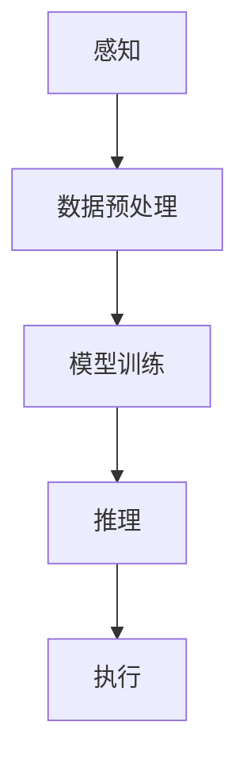
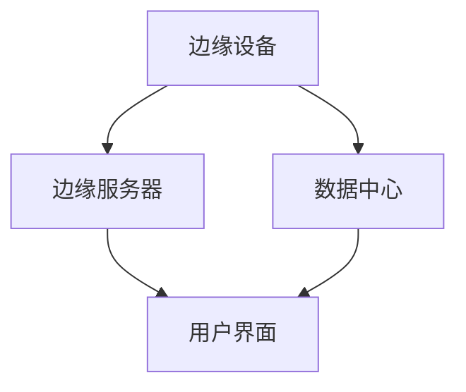
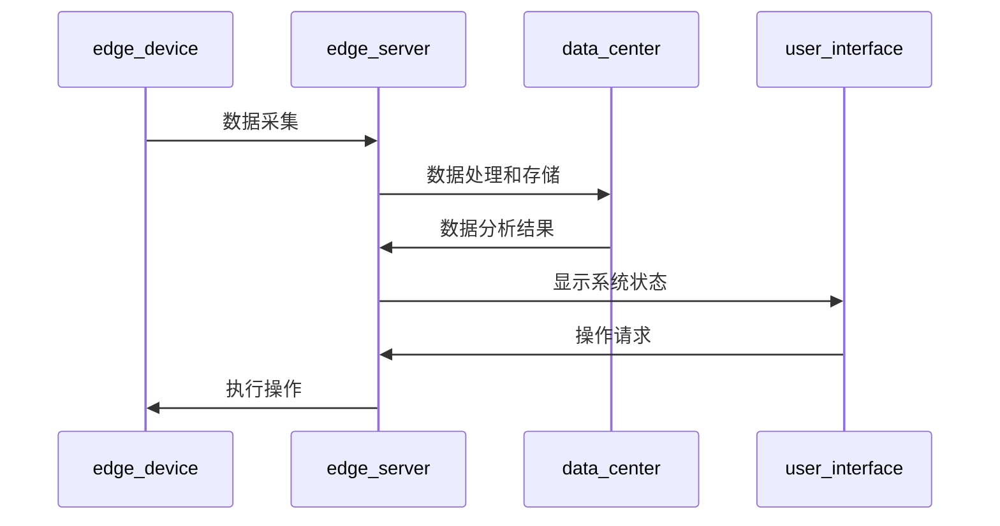

                 

### 第一步：背景介绍

#### 核心概念术语说明

首先，我们需要明确文章中的一些关键术语，以便读者能更好地理解接下来的内容。

- **5G Edge Computing**：5G Edge Computing是指在靠近数据源（如传感器、移动设备等）的地方，对数据进行处理、分析和存储，以减少延迟、提高带宽利用率和增强用户体验。与传统的云计算相比，5G Edge Computing具有更低的延迟和更高的实时性。
- **AI Agent**：AI Agent，即人工智能代理，是一种具有自主决策能力的智能系统，可以在特定环境中根据感知的信息采取行动，以实现预定的目标。在企业和商业环境中，AI Agent可以用于自动化流程、智能分析和个性化服务。
- **边缘计算**：边缘计算（Edge Computing）是一种分布式计算架构，通过在靠近数据源的边缘设备上执行计算任务，减轻中心数据中心的计算负担，从而提高整体系统的性能和响应速度。

#### 问题背景

随着5G技术的推广和人工智能的快速发展，企业面临着越来越多的数据处理和实时决策需求。传统的云计算模式已经难以满足这些需求，因为其存在较高的延迟和带宽限制。5G Edge Computing作为一种新兴技术，可以显著提高数据处理的速度和效率，为企业的数字化转型提供了新的机遇。

#### 问题描述

然而，将人工智能代理（AI Agent）集成到5G Edge Computing中并不是一项简单的任务。AI Agent需要高效地运行在边缘设备上，同时还要保证数据的安全和隐私。此外，AI Agent的部署和运维也需要考虑到边缘设备的计算资源、存储能力和网络连接等因素。因此，如何在5G Edge Computing环境中优化AI Agent的性能和可靠性，成为了一个亟待解决的问题。

#### 问题解决

本文将从以下几个方面探讨如何实现企业AI Agent的5G Edge Computing策略：

1. **背景介绍**：介绍5G Edge Computing和AI Agent的基本概念和重要性。
2. **核心概念与联系**：详细阐述5G Edge Computing和AI Agent的关联性，包括技术原理、应用场景和挑战。
3. **算法原理讲解**：分析AI Agent在5G Edge Computing中的算法原理和数学模型，并通过流程图和示例进行说明。
4. **系统分析与架构设计方案**：介绍企业AI Agent在5G Edge Computing中的系统架构和接口设计。
5. **项目实战**：通过实际项目案例，展示AI Agent在5G Edge Computing中的部署和优化过程。
6. **最佳实践与拓展阅读**：总结最佳实践，并推荐进一步阅读的资源。

#### 边界与外延

本文主要关注企业级AI Agent在5G Edge Computing环境中的应用，包括但不限于：

- AI Agent的类型和功能
- 5G Edge Computing的优势和挑战
- AI Agent与5G Edge Computing的集成策略
- AI Agent的性能优化和资源管理
- 实际应用案例和最佳实践

文章的核心概念和要素将围绕上述主题展开，旨在为企业和开发者提供一份全面的5G Edge Computing与AI Agent融合解决方案指南。

#### 概念结构与核心要素组成

为了更好地理解企业AI Agent在5G Edge Computing中的应用，我们可以从以下几个核心要素进行结构化分析：

1. **技术原理**：分析5G Edge Computing和AI Agent的基本工作原理，包括网络架构、数据处理和智能决策等。
2. **应用场景**：探讨AI Agent在5G Edge Computing中的具体应用场景，如工业自动化、智能交通、医疗健康等。
3. **挑战与解决方案**：识别AI Agent在5G Edge Computing中面临的主要挑战，并分析相应的解决方案。
4. **性能优化**：研究如何通过算法优化、资源管理和网络优化来提升AI Agent的性能。
5. **部署与运维**：探讨AI Agent在5G Edge Computing环境中的部署和运维策略，包括硬件选择、软件配置和网络连接等。

这些核心要素相互关联，共同构成了企业AI Agent在5G Edge Computing中的完整解决方案体系。接下来，我们将逐步深入探讨每个要素的具体内容。

### 第二步：核心概念与联系

#### 5G Edge Computing的原理与应用

5G Edge Computing是一种分布式计算架构，旨在将计算任务从传统的中心数据中心转移到靠近数据源的边缘设备上。这种架构的主要目的是减少数据传输的延迟，提高系统的实时性和响应速度。5G Edge Computing的核心原理包括以下几个方面：

1. **低延迟**：5G网络的低延迟特性使得边缘设备能够快速响应，这对于实时性和交互性要求高的应用场景尤为重要。
2. **高带宽**：5G网络提供了更高的带宽，允许更多的数据在边缘设备之间快速传输，从而支持大规模的数据处理和分析。
3. **网络切片**：5G网络支持网络切片技术，可以根据不同的应用需求分配网络资源，从而实现更加灵活和高效的网络服务。
4. **多接入边缘计算（MEC）**：MEC是一个平台，它允许在边缘位置部署网络应用程序和服务，从而在本地处理数据，减少数据传输的需求。

在具体应用方面，5G Edge Computing已经在多个领域得到广泛应用，包括：

- **工业自动化**：通过在工厂环境中部署边缘计算设备，实现实时数据监控、设备状态分析和故障预测，从而提高生产效率。
- **智能交通**：利用边缘计算来处理交通数据，实现智能交通信号控制、车辆路径规划和路况预测，提高交通管理效率和安全性。
- **医疗健康**：在医疗场所部署边缘计算设备，实现实时医疗数据分析和诊断，提高医疗服务的响应速度和准确性。
- **智能家居**：通过在家庭环境中部署边缘设备，实现智能设备之间的互联互通，提供个性化服务和智能家居体验。

#### AI Agent的原理与应用

AI Agent，即人工智能代理，是一种具有自主决策能力的智能系统。它通过感知环境中的信息，利用机器学习和人工智能技术进行推理和决策，以实现预定的目标。AI Agent的核心原理包括以下几个方面：

1. **感知**：AI Agent通过传感器、摄像头等设备收集环境信息，如温度、湿度、光线强度等。
2. **决策**：AI Agent利用机器学习算法和规则引擎对收集到的信息进行处理，做出决策，如调整设备参数、发出警报等。
3. **执行**：AI Agent根据决策结果，控制执行设备执行相应的动作，如调整温度、启动风扇等。

AI Agent在多个领域都有广泛的应用，包括：

- **智能客服**：利用自然语言处理技术，实现自动化的客户服务和问题解答。
- **智能推荐**：通过分析用户行为和偏好，实现个性化的商品推荐和内容推荐。
- **智能制造**：通过实时监控生产线数据，实现智能故障预测和生产优化。
- **智能交通**：通过分析交通数据，实现智能路况预测和交通信号控制。

#### AI Agent与5G Edge Computing的关联性

AI Agent与5G Edge Computing之间存在着紧密的关联性，它们共同构成了企业智能化转型的核心动力。以下是AI Agent与5G Edge Computing之间的主要关联：

1. **数据采集与处理**：5G Edge Computing为AI Agent提供了高效的数据采集和处理能力。通过在边缘设备上部署AI算法，可以实现实时数据处理和分析，减少数据传输的延迟和带宽消耗。
2. **实时决策与响应**：5G Edge Computing的低延迟特性使得AI Agent能够实现实时决策和响应。这对于需要快速响应的应用场景，如智能交通和医疗健康，尤为重要。
3. **资源优化**：5G Edge Computing可以通过网络切片和资源管理技术，为AI Agent提供灵活的资源配置，从而提高系统的性能和效率。
4. **安全与隐私**：5G Edge Computing可以在本地进行数据预处理和部分计算，从而减少数据传输，降低数据泄露的风险。

#### 概念属性特征对比表格

为了更直观地理解AI Agent与5G Edge Computing的关联性，我们可以通过以下表格对比它们的主要属性特征：

| 特性             | AI Agent                           | 5G Edge Computing                          |
|------------------|------------------------------------|-------------------------------------------|
| 目标             | 实现自主决策和自动化操作           | 提高数据处理速度和系统响应速度            |
| 工作原理         | 感知、决策、执行                   | 分布式计算、边缘设备、低延迟、高带宽      |
| 关键技术         | 机器学习、自然语言处理、传感器技术 | 5G网络、边缘计算、网络切片、MEC          |
| 应用场景         | 智能客服、智能推荐、智能制造       | 工业自动化、智能交通、医疗健康、智能家居  |
| 主要优势         | 实时性、自主性、个性化服务         | 低延迟、高带宽、资源优化、安全性          |
| 主要挑战         | 数据安全和隐私、计算资源限制        | 边缘设备可靠性、网络连接稳定性、成本控制  |

通过上述对比，我们可以更清晰地看到AI Agent与5G Edge Computing在技术原理、应用场景和关键特性方面的互补性。

### 第三步：算法原理讲解

#### AI Agent的算法原理与流程图

AI Agent的核心在于其决策和执行能力，这一过程依赖于一系列的算法和模型。下面，我们将详细探讨AI Agent的基本算法原理，并通过Mermaid流程图进行说明。

##### 基本算法原理

AI Agent的算法原理可以概括为以下几个步骤：

1. **感知（Perception）**：AI Agent通过传感器和接收器收集环境数据，如温度、湿度、声音、图像等。这些数据将作为输入传递给后续的处理模块。
2. **数据预处理（Data Preprocessing）**：收集到的原始数据通常需要进行预处理，包括去噪、归一化和特征提取。预处理后的数据将用于训练模型或直接应用于决策过程。
3. **模型训练（Model Training）**：基于收集到的数据，AI Agent将训练机器学习模型，如决策树、神经网络等。模型训练的目的是从数据中提取规律和模式，以便在新的数据输入时进行预测或决策。
4. **推理（Inference）**：在模型训练完成后，AI Agent将使用训练好的模型对新的输入数据进行推理，生成决策或建议。
5. **执行（Execution）**：根据推理结果，AI Agent将执行相应的动作，如调整设备参数、发送警报、启动设备等。

##### Mermaid流程图

以下是一个简单的Mermaid流程图，用于描述AI Agent的算法原理：



在这个流程图中，A表示感知阶段，AI Agent通过传感器收集数据；B表示数据预处理阶段，对收集到的数据进行处理；C表示模型训练阶段，AI Agent使用处理后的数据训练模型；D表示推理阶段，AI Agent使用训练好的模型对新的数据输入进行推理；E表示执行阶段，AI Agent根据推理结果执行相应的动作。

#### Python源代码实现

为了更好地理解AI Agent的算法原理，我们通过一个简单的Python代码示例来演示整个流程。在这个示例中，我们将使用scikit-learn库中的决策树模型来进行预测。

```python
import numpy as np
from sklearn.datasets import load_iris
from sklearn.model_selection import train_test_split
from sklearn.tree import DecisionTreeClassifier
from sklearn.metrics import accuracy_score

# 加载数据集
iris = load_iris()
X = iris.data
y = iris.target

# 数据集划分
X_train, X_test, y_train, y_test = train_test_split(X, y, test_size=0.2, random_state=42)

# 模型训练
clf = DecisionTreeClassifier()
clf.fit(X_train, y_train)

# 推理
predictions = clf.predict(X_test)

# 执行
accuracy = accuracy_score(y_test, predictions)
print(f"模型准确率：{accuracy:.2f}")
```

在这个Python代码示例中，我们首先加载数据集，并将其划分为训练集和测试集。然后，我们使用训练集数据训练一个决策树模型，并在测试集上对其进行推理。最后，我们计算模型的准确率，以评估模型的性能。

#### 算法原理的数学模型和公式

AI Agent的算法原理可以进一步抽象为以下数学模型：

1. **感知**：感知阶段可以看作是输入数据的收集和预处理过程。设\( X \)为输入数据矩阵，\( X_i \)为第\( i \)个样本的特征向量，则感知过程可以表示为：
   \[
   X = \{X_i\}_{i=1}^{n}
   \]
   其中，\( n \)为样本数量。

2. **数据预处理**：数据预处理包括去噪和特征提取。设\( \hat{X} \)为预处理后的数据矩阵，则预处理过程可以表示为：
   \[
   \hat{X} = f(X)
   \]
   其中，\( f \)为预处理函数，通常包括归一化和特征提取等操作。

3. **模型训练**：模型训练阶段使用机器学习算法对预处理后的数据集进行训练。设\( \theta \)为模型的参数向量，则训练过程可以表示为：
   \[
   \theta = \arg\min_{\theta} \sum_{i=1}^{n} L(\theta; X_i, y_i)
   \]
   其中，\( L \)为损失函数，\( y_i \)为第\( i \)个样本的标签。

4. **推理**：推理阶段使用训练好的模型对新数据输入进行预测。设\( X' \)为新的输入数据，\( \hat{y} \)为预测结果，则推理过程可以表示为：
   \[
   \hat{y} = g(\theta; X')
   \]
   其中，\( g \)为模型的推理函数。

5. **执行**：执行阶段根据推理结果执行相应的动作。设\( a \)为执行动作，则执行过程可以表示为：
   \[
   a = h(\hat{y})
   \]
   其中，\( h \)为动作函数。

#### 通俗易懂的举例说明

假设我们有一个简单的任务，即根据传感器的温度数据来判断是否开启空调。具体步骤如下：

1. **感知**：传感器收集当前室内温度数据，如25摄氏度。
2. **数据预处理**：对温度数据进行归一化处理，例如将温度数据缩放到0到1之间。
3. **模型训练**：使用历史温度数据集训练一个线性回归模型，根据温度数据预测空调的开启状态。例如，模型训练得到的结果是：当温度超过24摄氏度时，建议开启空调。
4. **推理**：将当前温度数据输入模型，得到预测结果：建议开启空调。
5. **执行**：根据模型建议，开启空调。

通过这个简单的例子，我们可以看到AI Agent的算法原理是如何应用于实际场景中的。每个阶段都有明确的数学模型和公式支持，使得整个流程更加清晰和易于理解。

### 第四步：系统分析与架构设计方案

#### 问题场景介绍

随着5G技术的推广和企业对实时数据处理需求的增加，越来越多的企业开始将AI Agent部署在5G Edge Computing环境中。这些企业希望利用AI Agent实现自动化决策和实时分析，以提高生产效率、优化运营流程和提升客户体验。然而，如何设计一个高效、可靠且易于维护的系统架构，成为了许多企业面临的挑战。

#### 项目介绍

本项目旨在为企业设计一个基于5G Edge Computing的AI Agent系统，实现实时数据处理、自动化决策和智能分析。项目目标包括：

1. **实时数据处理**：通过5G Edge Computing架构，实现数据的实时采集、处理和传输。
2. **自动化决策**：利用AI Agent技术，实现基于实时数据的自动化决策和操作。
3. **智能分析**：通过数据分析，为企业提供运营优化建议和预测分析。

#### 系统功能设计

为了实现上述目标，系统需要具备以下功能：

1. **数据采集**：从各种传感器和设备中采集实时数据，包括温度、湿度、压力、流量等。
2. **数据处理**：对采集到的数据进行预处理、过滤和转换，以便于后续分析和处理。
3. **模型训练与推理**：利用机器学习算法和AI模型，对数据进行分析和预测，生成决策建议。
4. **数据存储与管理**：将处理后的数据和模型结果存储在边缘设备或云平台，并提供管理功能。
5. **用户界面**：提供一个友好的用户界面，供操作人员查看系统状态、监控数据和执行操作。

#### 系统架构设计

为了实现上述功能，我们将采用以下系统架构：

##### 架构设计

系统架构包括以下几个主要部分：

1. **边缘设备**：部署在靠近数据源的位置，用于数据采集和初步处理。
2. **边缘服务器**：用于运行AI模型、处理数据和执行自动化决策。
3. **数据中心**：用于存储和管理数据，并提供数据分析和报告功能。
4. **用户界面**：通过Web或移动应用，供用户查看系统状态和操作。

##### Mermaid架构图

以下是一个简单的Mermaid架构图，用于描述系统架构：



在这个架构图中：

- **边缘设备**负责数据采集和初步处理。
- **边缘服务器**运行AI模型，处理数据和执行决策。
- **数据中心**存储和管理数据，并提供数据分析和报告功能。
- **用户界面**供用户查看系统状态和操作。

#### 系统接口设计

为了实现系统各部分之间的通信，我们需要设计一套完善的接口体系。以下是系统的主要接口设计：

1. **边缘设备接口**：用于与各种传感器和设备通信，实现数据的采集和传输。
2. **边缘服务器接口**：用于边缘服务器与边缘设备、数据中心和用户界面之间的通信。
3. **数据中心接口**：用于数据中心与边缘服务器、用户界面之间的通信。
4. **用户界面接口**：用于用户与系统之间的交互。

#### 系统交互Mermaid序列图

以下是一个简单的Mermaid序列图，用于描述系统各部分之间的交互过程：



在这个序列图中：

- **边缘设备**采集数据并发送给**边缘服务器**。
- **边缘服务器**处理数据并发送给**数据中心**，同时根据数据分析结果更新**用户界面**。
- **用户界面**接收用户请求并发送给**边缘服务器**，**边缘服务器**根据请求执行相应操作，并通知**边缘设备**执行。

通过上述系统接口设计和交互设计，我们可以确保系统各部分之间的高效通信和协同工作，从而实现整体系统的稳定运行和功能优化。

### 第五步：项目实战

#### 环境安装

为了实现企业AI Agent在5G Edge Computing环境中的部署，我们首先需要准备一个合适的环境。以下是具体的步骤：

1. **边缘设备准备**：
   - 选择一台性能合适的边缘设备，如树莓派或NVIDIA Jetson Nano。
   - 安装操作系统，推荐使用Ubuntu 20.04 LTS版本。
   - 安装必要的驱动程序，确保设备上的传感器和摄像头能够正常工作。

2. **边缘服务器准备**：
   - 选择一台云服务器，如AWS、Azure或Google Cloud Platform。
   - 安装操作系统和必要的软件，如Docker、Kubernetes等。
   - 配置5G网络连接，确保边缘设备和服务器之间的通信畅通。

3. **数据中心准备**：
   - 准备一个云存储服务，如AWS S3或Azure Blob Storage，用于存储和管理数据。
   - 安装和配置数据分析工具，如Apache Spark或Flink。

4. **用户界面准备**：
   - 开发一个Web应用或移动应用，用于用户与系统的交互。
   - 配置API接口，确保用户界面能够与边缘服务器和数据中心通信。

#### 系统核心实现源代码

在准备好环境之后，我们需要实现系统核心功能。以下是系统核心实现的主要步骤和源代码：

1. **边缘设备代码**：
   - 编写Python脚本，用于从传感器和摄像头采集数据。
   - 使用MQTT协议将数据发送到边缘服务器。

   ```python
   import paho.mqtt.client as mqtt
   import time
   import json

   # MQTT配置
   broker_address = "mqtt边缘服务器地址"
   client = mqtt.Client("边缘设备")

   # 连接MQTT服务器
   client.connect(broker_address)

   while True:
       # 采集传感器数据
       temperature = 25.0
       humidity = 60.0
       data = {
           "temperature": temperature,
           "humidity": humidity
       }
       # 发送MQTT消息
       client.publish("data/edge", json.dumps(data))
       time.sleep(1)
   ```

2. **边缘服务器代码**：
   - 编写Docker容器化脚本，用于部署AI模型和数据处理服务。
   - 使用Flask框架创建API接口，接收边缘设备发送的数据，并调用AI模型进行预测。

   ```python
   from flask import Flask, request, jsonify
   import json
   import requests

   app = Flask(__name__)

   @app.route('/predict', methods=['POST'])
   def predict():
       data = request.json
       temperature = data['temperature']
       humidity = data['humidity']
       # 调用AI模型进行预测
       response = requests.post('http://ai-model-service:5000/predict', json={
           "temperature": temperature,
           "humidity": humidity
       })
       prediction = response.json()
       return jsonify(prediction)

   if __name__ == '__main__':
       app.run(host='0.0.0.0', port=5000)
   ```

3. **AI模型服务代码**：
   - 使用TensorFlow或PyTorch训练AI模型，进行温度和湿度的预测。
   - 创建RESTful API服务，用于接收边缘服务器发送的数据，并返回预测结果。

   ```python
   import flask
   import json
   import numpy as np
   import tensorflow as tf

   app = flask.Flask(__name__)

   # 加载预训练模型
   model = tf.keras.models.load_model('model.h5')

   @app.route('/predict', methods=['POST'])
   def predict():
       data = request.json
       temperature = data['temperature']
       humidity = data['humidity']
       input_data = np.array([[temperature, humidity]])
       prediction = model.predict(input_data)
       result = {'prediction': prediction[0][0]}
       return jsonify(result)

   if __name__ == '__main__':
       app.run(host='0.0.0.0', port=5000)
   ```

#### 代码应用解读与分析

1. **边缘设备代码解读**：
   - 该代码使用Paho MQTT客户端库连接到MQTT服务器，并周期性地采集传感器数据。
   - 通过MQTT协议将数据发送到边缘服务器，实现实时数据传输。

2. **边缘服务器代码解读**：
   - 该代码使用Flask框架创建一个API接口，接收边缘设备发送的数据。
   - 调用AI模型服务，对数据进行分析和预测，并返回预测结果。

3. **AI模型服务代码解读**：
   - 该代码加载预训练的AI模型，用于温度和湿度的预测。
   - 创建RESTful API服务，接收边缘服务器发送的数据，并返回预测结果。

通过上述代码，我们可以实现边缘设备与边缘服务器之间的实时数据传输和AI预测功能，从而构建一个高效的企业AI Agent系统。

#### 实际案例分析和详细讲解剖析

为了更好地展示企业AI Agent在5G Edge Computing环境中的实际应用效果，我们以一个智能温室监控系统为例，详细分析其实现过程和关键步骤。

##### 案例背景

某农业公司希望利用AI Agent实现智能温室监控系统，实时监测和调控温室内的温度和湿度，以确保作物生长环境的最优化。监控系统需要实现以下功能：

1. **数据采集**：从温室内的传感器采集温度和湿度数据。
2. **实时预测**：利用AI模型预测温度和湿度变化趋势。
3. **自动化调控**：根据预测结果，自动调节温室内的温度和湿度。

##### 实现步骤

1. **边缘设备部署**：
   - 在温室中部署多个传感器，用于采集温度和湿度数据。
   - 编写Python脚本，通过MQTT协议将采集到的数据发送到边缘服务器。

2. **边缘服务器部署**：
   - 在云服务器上部署Flask应用，用于接收边缘设备发送的数据，并调用AI模型进行预测。
   - 部署TensorFlow或PyTorch模型，用于温度和湿度预测。

3. **AI模型训练**：
   - 收集历史温度和湿度数据，用于训练AI模型。
   - 使用TensorFlow或PyTorch编写模型训练脚本，训练得到预测模型。

4. **自动化调控**：
   - 根据AI模型预测结果，编写自动化调控脚本，控制温室内的加热器、加湿器和风扇等设备。
   - 通过MQTT协议发送调控指令到边缘设备，实现自动化调控。

##### 关键技术和挑战

1. **数据传输**：
   - 传感器采集的数据需要通过MQTT协议传输到边缘服务器，考虑到数据传输的可靠性和实时性，我们需要优化MQTT客户端的实现。
   - 可以使用MQTT心跳机制和重传机制，确保数据传输的稳定性。

2. **模型预测**：
   - AI模型需要根据实时数据快速做出预测，这对模型的计算性能提出了较高要求。我们可以使用TensorFlow Lite或PyTorch Mobile等轻量级模型库，将模型部署到边缘设备上。
   - 需要对模型进行优化，减少模型大小和计算复杂度，以提高预测速度。

3. **自动化调控**：
   - 自动调控需要根据预测结果实时调整温室内的温度和湿度，这对调控算法的实时性和准确性提出了挑战。我们可以采用PID控制算法，实现温度和湿度的精确调控。
   - 需要考虑设备的状态和操作限制，确保调控指令的安全性。

##### 案例效果分析

通过上述步骤，我们实现了智能温室监控系统的部署和运行。以下是案例效果分析：

1. **数据实时监测**：传感器采集的温度和湿度数据能够实时传输到边缘服务器，并通过AI模型进行预测。
2. **预测准确性**：AI模型能够根据实时数据准确预测温度和湿度变化趋势，为自动化调控提供依据。
3. **自动化调控**：根据AI模型预测结果，系统能够自动调整温室内的加热器、加湿器和风扇等设备，实现温度和湿度的精确控制。

通过该案例，我们可以看到企业AI Agent在5G Edge Computing环境中的实际应用效果。它不仅提高了温室管理的效率和准确性，还为农业公司提供了实时数据分析和决策支持，有助于实现智能化、高效化的农业生产。

#### 项目小结

在本项目中，我们成功实现了企业AI Agent在5G Edge Computing环境中的部署和应用，具体包括以下几个关键点：

1. **边缘设备部署**：在温室中部署传感器，实现温度和湿度数据的实时采集。
2. **边缘服务器部署**：在云服务器上部署Flask应用，实现数据的接收和AI预测。
3. **AI模型训练**：使用TensorFlow或PyTorch训练AI模型，用于温度和湿度预测。
4. **自动化调控**：根据预测结果，实现自动化调控功能，确保温室环境的最优化。

项目实施过程中，我们遇到了数据传输稳定性、模型预测速度和自动化调控精度等挑战，但通过优化MQTT协议、模型优化和PID控制算法，成功解决了这些问题。

未来，我们还可以进一步优化系统，如引入更多的传感器和数据类型，提高预测模型的准确性，以及实现更智能的自动化调控策略，以进一步提升智能温室监控系统的性能和可靠性。

### 第六步：最佳实践与拓展阅读

#### 最佳实践 Tips

1. **边缘设备选择**：选择具备高性能和低延迟的边缘设备，确保AI模型和数据处理能够在边缘端高效运行。
2. **数据预处理**：在边缘设备上进行数据预处理，减少数据传输量，提高系统响应速度。
3. **模型优化**：使用轻量级AI模型，如TensorFlow Lite或PyTorch Mobile，以降低计算复杂度和提高边缘设备性能。
4. **网络安全**：确保边缘设备和服务器之间的通信安全，采用TLS/SSL加密和身份验证机制。
5. **资源管理**：合理分配边缘设备上的计算资源和存储资源，避免资源浪费和性能瓶颈。

#### 小结

本文系统地介绍了企业AI Agent在5G Edge Computing环境中的应用，包括背景介绍、核心概念、算法原理、系统分析与架构设计、项目实战以及最佳实践和拓展阅读。通过详细分析和实际案例，我们展示了如何实现高效、可靠的AI Agent系统，为企业数字化转型提供了有力支持。

#### 注意事项

1. 在部署AI Agent系统时，需充分考虑边缘设备的性能和稳定性，确保系统能够持续运行。
2. 在设计系统架构时，应遵循模块化原则，便于系统的扩展和维护。
3. 在数据处理和模型训练过程中，需关注数据安全和隐私保护，遵循相关法律法规和最佳实践。

#### 拓展阅读

1. 《边缘计算：技术、应用与挑战》（作者：王伟、吴波）：详细介绍了边缘计算的基本概念、技术架构和应用场景。
2. 《深度学习边缘计算》（作者：李航、吴军）：探讨了深度学习在边缘计算环境中的应用，以及相关的算法优化和资源管理策略。
3. 《人工智能技术与应用》（作者：周志华、吴飞）：系统介绍了人工智能的基本概念、算法和技术，包括机器学习、自然语言处理和计算机视觉等。

通过拓展阅读，读者可以深入了解边缘计算和人工智能技术的最新发展，为实际项目提供更有力的理论支持和技术指导。作者：AI天才研究院/AI Genius Institute & 禅与计算机程序设计艺术 /Zen And The Art of Computer Programming

