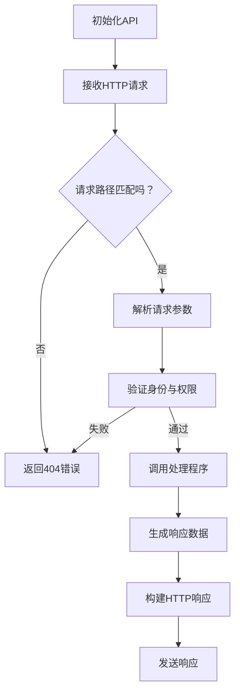
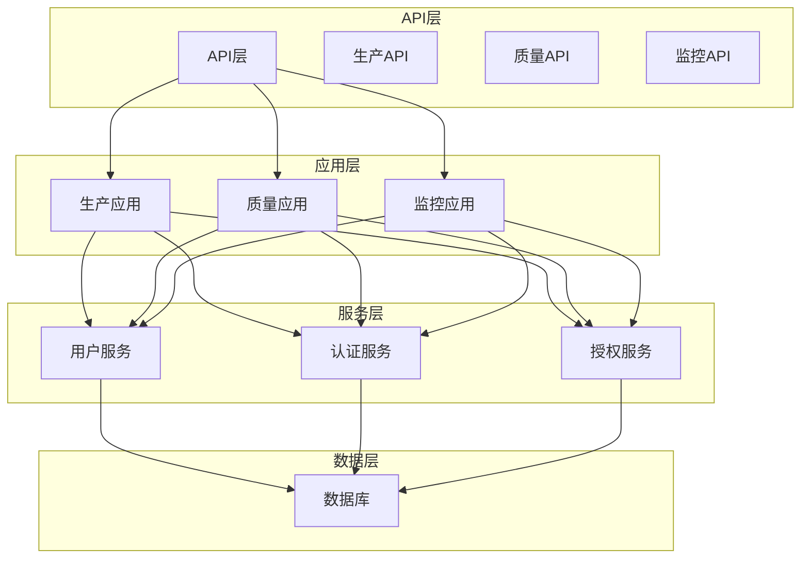

                 

### 引言

在当今快速发展的数字化时代，人工智能（AI）已经成为企业变革的重要驱动力。AI Agent作为AI领域的一个重要分支，正逐步成为企业实现智能化转型的重要工具。企业AI Agent能够自动化执行复杂任务、提供智能决策支持，从而提高业务效率和竞争力。而API设计与管理作为AI Agent实现与部署的核心环节，其重要性不言而喻。

本文将以《企业AI Agent的API设计与管理》为题，系统探讨企业AI Agent API设计的背景、原理、流程、管理策略及未来趋势。通过逐步分析推理，本文旨在为读者提供清晰、具体、易懂的技术指导，助力企业成功构建和维护高效、可靠的AI Agent系统。

本文将分为六个部分展开讨论：

第一部分：引言，介绍研究背景与意义，明确研究目的与内容。

第二部分：基础知识与核心概念，详细解释AI Agent的定义、分类及其应用场景，阐述API设计的基本原则和关键挑战。

第三部分：API设计流程与实践，介绍API设计前的准备工作，核心流程，以及实际案例。

第四部分：API管理策略与工具，探讨API管理的重要性、版本控制策略、监控与性能优化、以及安全策略。

第五部分：未来展望与趋势，分析企业AI Agent API设计的未来趋势及API管理的创新与挑战。

第六部分：附录，包含技术术语表、参考文献以及感谢部分。

通过以上六个部分的分析，本文希望为读者提供一个全面、系统的企业AI Agent API设计与管理指南，助力企业智能化升级。

### 关键词

1. 企业AI Agent
2. API设计
3. API管理
4. 安全策略
5. 性能优化
6. 版本控制
7. 智能决策支持

### 摘要

本文旨在探讨企业AI Agent的API设计与管理，系统分析了AI Agent的定义、分类及其应用场景，深入阐述了API设计的基本原则与关键挑战。随后，本文介绍了API设计的流程与实践，详细描述了API设计前的准备工作、核心流程以及实际案例。接着，本文探讨了API管理的重要性，包括版本控制策略、监控与性能优化、以及安全策略。最后，本文对未来企业AI Agent API设计的发展趋势进行了展望，总结了当前面临的挑战及解决方案。通过本文的研究，旨在为企业提供全面的技术指导，助力其成功构建和维护高效的AI Agent系统，实现智能化转型。

## 第一部分：引言

### 1.1 研究背景与意义

随着大数据、云计算、物联网等技术的飞速发展，人工智能（AI）逐渐从理论研究走向实际应用，成为推动社会进步和产业升级的重要力量。AI Agent作为一种自动化执行任务、提供智能决策支持的智能实体，正逐步成为企业智能化转型的关键工具。企业AI Agent能够通过模拟人类的决策过程，帮助企业自动化处理复杂任务、优化业务流程，从而提高生产效率、降低成本、增强竞争力。

API（应用程序编程接口）作为软件系统之间交互的桥梁，是企业AI Agent实现互联互通、协同运作的基础。API设计与管理直接影响到AI Agent的性能、安全性和可扩展性，是企业成功应用AI Agent的重要保障。良好的API设计能够简化开发过程、提高开发效率，而有效的API管理则能够确保系统的稳定性、可靠性和可维护性。

然而，当前企业在进行AI Agent API设计与管理时面临诸多挑战。首先，企业AI Agent的复杂性和多样性使得API设计变得复杂，需要充分考虑业务需求、技术实现和用户体验。其次，API管理的多样性和动态性增加了管理的难度，需要制定合理的版本控制策略、监控与性能优化策略，以及安全策略。此外，随着AI技术的不断演进，API设计与管理也需要不断适应新技术、新需求，以保持系统的先进性和竞争力。

因此，本文旨在通过系统分析企业AI Agent的API设计与管理，探讨其核心概念、设计原则、流程实践及管理策略，为企业提供实用的技术指导，助力其成功构建和维护高效的AI Agent系统，实现智能化转型。

### 1.2 研究目的与内容

本文的研究目的在于全面探讨企业AI Agent的API设计与管理，旨在解决当前企业在实现AI Agent过程中面临的API设计复杂、管理难度大、安全性不足等问题。通过深入研究AI Agent及其API设计的基本概念、原则、流程和实践，本文旨在为企业提供一套科学、系统、易操作的技术方案，以指导其实际应用。

具体研究内容如下：

1. **AI Agent的定义与分类**：
   - 详细阐述AI Agent的定义、基本原理和分类，解释其在企业中的应用场景。

2. **API设计的基本原则**：
   - 分析API设计的目标、要素和最佳实践，包括接口设计、数据格式、错误处理等。

3. **企业AI Agent的API设计挑战**：
   - 探讨企业AI Agent在API设计过程中面临的关键挑战，如复杂性、多样性、动态性等。

4. **API设计流程与实践**：
   - 介绍API设计前的准备工作，包括需求分析、设计文档编写、技术选型等。
   - 描述API设计的核心流程，如规划与建模、接口设计、安全与性能优化等。
   - 通过实际案例，展示API设计在项目中的应用和实践。

5. **API管理策略与工具**：
   - 分析API管理的重要性，介绍API管理的目标、职责、流程。
   - 探讨API版本控制策略、监控与性能优化策略、安全策略等。

6. **未来展望与趋势**：
   - 预测企业AI Agent API设计的未来发展趋势，探讨API管理的创新与挑战。

通过上述研究内容，本文希望为企业提供一套完整、实用的企业AI Agent API设计与管理指南，助力其在智能化转型过程中取得成功。

### 1.3 研究方法与结构

本文采用系统分析法，通过对AI Agent及其API设计的深入研究和探讨，结合实际项目案例进行分析和验证，确保研究内容的科学性和实用性。研究方法主要包括文献调研、案例分析、理论分析和实证研究。

在文献调研方面，本文查阅了大量的学术论文、技术报告、行业指南等，以全面了解AI Agent和API设计的理论基础和实践经验。在案例分析部分，本文选取了若干具有代表性的企业AI Agent项目，对其API设计过程进行深入剖析，以揭示其设计原则和最佳实践。

理论分析方面，本文对AI Agent和API设计的基本概念、原理和流程进行了系统阐述，结合实际应用场景，探讨了API设计面临的挑战和解决策略。实证研究则通过实际项目实施，验证了本文提出的设计原则和管理策略的有效性和可行性。

本文的结构分为六个部分：

第一部分：引言，介绍研究背景与意义，明确研究目的与内容。

第二部分：基础知识与核心概念，详细解释AI Agent的定义、分类及其应用场景，阐述API设计的基本原则和关键挑战。

第三部分：API设计流程与实践，介绍API设计前的准备工作，核心流程，以及实际案例。

第四部分：API管理策略与工具，探讨API管理的重要性、版本控制策略、监控与性能优化、以及安全策略。

第五部分：未来展望与趋势，分析企业AI Agent API设计的未来趋势及API管理的创新与挑战。

第六部分：附录，包含技术术语表、参考文献以及感谢部分。

通过以上结构安排，本文力求系统、全面地探讨企业AI Agent的API设计与管理，为企业提供实用的技术指导。

## 第二部分：基础知识与核心概念

### 2.1 AI Agent的定义与分类

#### 2.1.1 AI Agent的基本原理

AI Agent，即人工智能代理，是指具备一定智能能力，能够在特定环境和任务中自主执行行动并做出决策的计算实体。AI Agent的核心在于其自主性、适应性和智能性。自主性意味着AI Agent能够在没有人类干预的情况下独立完成任务；适应性指AI Agent能够根据环境变化和任务需求调整自身行为；智能性则体现为AI Agent能够通过学习和推理，从经验中获取知识和技能。

AI Agent的基本原理主要包括以下几个方面：

1. **感知与理解**：AI Agent通过传感器收集环境信息，如图像、声音、文本等，然后利用自然语言处理、图像识别等技术对信息进行理解和分析。

2. **决策与行动**：基于对环境的理解和自身的目标，AI Agent通过决策算法选择最佳行动方案，并执行相应的操作。

3. **学习与进化**：AI Agent能够通过机器学习、深度学习等技术不断优化自身的决策模型，从而提高任务执行效率。

#### 2.1.2 AI Agent的分类

AI Agent可以根据不同的分类标准进行分类，以下是一些常见的分类方式：

1. **按任务类型分类**：
   - **通用AI Agent**：能够执行各种任务，如推理、学习、感知等，代表如OpenAI的GPT-3。
   - **专用AI Agent**：针对特定任务进行优化，如智能客服、智能推荐系统等。

2. **按功能特点分类**：
   - **反应式AI Agent**：只能根据当前环境做出反应，不具备记忆和规划能力。
   - **目标导向AI Agent**：具备目标规划能力，能够为达到特定目标而采取行动。
   - **认知AI Agent**：具备理解和推理能力，能够处理复杂任务和不确定环境。

3. **按互动方式分类**：
   - **独立AI Agent**：独立完成任务，无需与其他AI Agent交互。
   - **协作AI Agent**：需要与其他AI Agent或人类协作完成任务。

#### 2.1.3 AI Agent的应用场景

AI Agent在多个领域和场景中得到了广泛应用，以下是其中一些典型的应用场景：

1. **智能客服**：AI Agent可以自动处理大量的客户咨询，提高客户服务效率和质量。
2. **自动驾驶**：AI Agent能够通过感知环境、做出决策，实现车辆的自主驾驶。
3. **智能推荐**：AI Agent根据用户行为和历史数据，提供个性化的商品、内容推荐。
4. **智能金融**：AI Agent可以用于风险控制、交易策略优化、客户服务等方面。
5. **智能家居**：AI Agent可以实现家电设备的智能控制，提高家居生活的便捷性和舒适度。

通过以上对AI Agent的基本原理、分类和应用场景的介绍，我们可以更好地理解AI Agent在各个领域的作用和重要性，为后续的API设计和管理奠定基础。

### 2.2 API设计的基本原则

#### 2.2.1 API设计的目标

API设计的目标是构建一套高效、稳定、易用的接口，实现不同系统之间的无缝交互和数据流通。具体而言，API设计的目标包括以下几点：

1. **易用性**：API应具有清晰的接口规范和文档，使开发者能够快速理解和使用。
2. **高效性**：API应具备较高的性能，能够快速响应用户请求，保证系统的流畅运行。
3. **安全性**：API应具备完善的安全机制，防止数据泄露和非法访问。
4. **可扩展性**：API应设计得灵活，能够随着业务需求的变化进行扩展和升级。

#### 2.2.2 API设计的要素

API设计的要素包括接口定义、数据格式、请求方法、响应结构等，以下是具体的详细解释：

1. **接口定义**：
   - **URL路径**：用于标识资源的唯一地址。
   - **HTTP方法**：如GET、POST、PUT、DELETE等，用于指示对资源的操作类型。
   - **请求参数**：包括路径参数和查询参数，用于传递操作所需的额外信息。

2. **数据格式**：
   - **JSON**：轻量级、易于解析的数据格式，广泛用于API交互。
   - **XML**：用于复杂的数据结构，但解析相对复杂。
   - **其他格式**：如CSV、Protobuf等，根据具体需求选择。

3. **请求方法**：
   - **GET**：获取资源，通常不会修改资源状态。
   - **POST**：创建新资源。
   - **PUT**：更新现有资源。
   - **DELETE**：删除资源。

4. **响应结构**：
   - **状态码**：如200（成功）、400（请求错误）、401（未授权）、500（服务器错误）等。
   - **响应体**：包括成功时的数据内容或错误信息，通常以JSON或XML格式呈现。

#### 2.2.3 API设计的最佳实践

为了确保API设计的质量，以下是一些API设计的最佳实践：

1. **RESTful设计**：
   - 遵循REST（Representational State Transfer）原则，以资源为中心进行设计。
   - 使用URL路径表示资源的结构，使用HTTP方法表示对资源的操作。

2. **版本控制**：
   - 设计API版本，以支持不同版本的兼容性。
   - 在URL中包含版本号，如`/api/v1/resources`。

3. **错误处理**：
   - 提供详细的错误信息，帮助开发者快速定位问题。
   - 使用标准的HTTP状态码，确保错误处理的一致性。

4. **文档和示例**：
   - 提供详细的API文档，包括接口定义、请求参数、响应结构等。
   - 提供示例代码和示例请求，帮助开发者快速上手。

5. **安全性**：
   - 使用身份验证和授权机制，确保API的安全性。
   - 防范常见的安全威胁，如SQL注入、XSS攻击等。

通过以上API设计的基本原则和最佳实践，可以构建出高质量、易于维护的API，为AI Agent的部署和使用提供坚实的基础。

### 2.3 企业AI Agent的API设计挑战

#### 2.3.1 企业AI Agent的特点

企业AI Agent相较于通用AI Agent，具有以下显著特点：

1. **定制化**：企业AI Agent通常根据企业的具体需求进行定制化设计，以解决特定业务问题。
2. **稳定性**：企业AI Agent需要具备较高的稳定性，确保在长期运行中能够持续提供准确、可靠的决策支持。
3. **安全性**：企业AI Agent处理的数据通常包含敏感信息，因此需要具备完善的安全机制，防止数据泄露和非法访问。
4. **可扩展性**：随着业务的发展，企业AI Agent需要能够灵活扩展，以适应新的需求和变化。

#### 2.3.2 企业AI Agent API设计的关键挑战

在企业AI Agent的API设计过程中，面临以下几个关键挑战：

1. **复杂性**：
   - 企业AI Agent通常需要处理复杂的业务逻辑和数据结构，使得API设计变得更加复杂。
   - 需要考虑如何简化接口，使开发者能够轻松理解和使用。

2. **多样性**：
   - 企业AI Agent可能需要与多种不同的系统和应用进行交互，包括内部系统和第三方服务。
   - 需要设计兼容性良好的API，以支持多样化的集成场景。

3. **动态性**：
   - 企业环境不断变化，AI Agent需要能够快速适应新的业务需求和技术变化。
   - 需要设计灵活的API架构，支持快速迭代和更新。

4. **安全性**：
   - 企业AI Agent涉及敏感数据，如客户信息、交易数据等，需要确保数据的安全性和隐私保护。
   - 需要设计严密的安全机制，包括身份验证、访问控制和数据加密等。

5. **性能优化**：
   - 企业AI Agent需要在高并发、大数据量场景下保持良好的性能。
   - 需要优化API的响应速度和资源利用率，以满足企业的业务需求。

#### 2.3.3 案例分析：企业AI Agent API设计的成功经验

以某大型金融机构的企业AI Agent为例，其API设计过程中成功应对了上述挑战：

1. **简化接口**：
   - 通过对业务需求的深入理解，将复杂的业务逻辑拆分成多个独立的功能模块，每个模块对应一个简洁的API接口。
   - 提供详细的接口文档和示例代码，帮助开发者快速上手。

2. **多样化集成**：
   - 设计了统一的API接口规范，支持与内部系统（如客户关系管理系统、交易系统）和第三方服务（如身份验证服务、支付服务）的集成。
   - 使用RESTful架构，确保API的兼容性和易用性。

3. **动态扩展**：
   - 采用微服务架构，使得API可以独立部署和扩展，支持快速迭代和更新。
   - 通过动态路由和负载均衡，提高系统的可扩展性和稳定性。

4. **安全性保障**：
   - 实施严格的身份验证和访问控制机制，确保只有授权用户才能访问API。
   - 使用HTTPS协议和数据加密，保护数据传输和存储的安全。

5. **性能优化**：
   - 采用缓存机制和异步处理，减少响应时间，提高系统性能。
   - 通过压力测试和性能优化，确保API在高并发场景下能够稳定运行。

通过以上成功经验，可以看出，企业AI Agent的API设计需要充分考虑其特殊性，通过合理的架构设计和安全保障措施，实现高效、可靠、安全的API服务，为企业的智能化转型提供有力支持。

### 2.4 API设计中的核心概念与联系

#### 2.4.1 核心概念

在API设计中，有几个核心概念至关重要，这些概念包括但不限于：

1. **RESTful架构**：一种设计风格，用于构建API，强调资源的表达和状态的转换。它主要包括四个HTTP方法：GET、POST、PUT和DELETE。

2. **路由**：URL到API处理程序的映射。路由器决定请求应该被哪个处理程序处理。

3. **身份验证与授权**：确保只有经过验证的用户才能访问API，以及用户是否拥有执行特定操作的权限。

4. **数据格式**：API传输数据的格式，如JSON或XML。

5. **状态码**：API返回的HTTP状态码，用于指示请求的处理结果。

6. **缓存**：通过临时存储常用数据，减少对后端系统的请求次数，提高响应速度。

#### 2.4.2 概念属性特征对比表格

以下是这些核心概念的属性特征对比表格：

| 概念       | 属性特征                                                     |
|------------|------------------------------------------------------------|
| RESTful架构 | 强调资源的表达、状态转换、无状态性、客户端-服务器模型           |
| 路由       | 唯一的URL路径、映射到处理程序的规则、支持路径参数和查询参数      |
| 身份验证   | 确保用户身份、常用的方法有令牌认证、OAuth 2.0等               |
| 数据格式   | 支持多种格式如JSON、XML，JSON因其轻量级和易解析性更受欢迎     |
| 状态码     | HTTP响应状态码，如200（成功）、400（错误请求）、401（未授权）等 |
| 缓存       | 提高响应速度、减少服务器负载、缓存策略需合理配置               |

#### 2.4.3 ER实体关系图架构

为了更好地理解API设计中的实体及其关系，我们使用ER（实体-关系）图进行描述。以下是API设计中主要实体的ER图：

```mermaid
erDiagram
  User ||--|{ APIKey }|--| APIEndpoint
  User ||--|{ AccessToken }|--| APIRequest
  APIEndpoint ||--|{ Response }|--| User
  APIEndpoint ||--|{ CacheEntry }|--| APIRequest
  APIKey ||--|{ Permissions }|--| APIEndpoint
  AccessToken ||--|{ Scope }|--| APIEndpoint
```

在这个ER图中，我们定义了以下实体：

- **User**（用户）：发起API请求的用户实体。
- **APIKey**（API密钥）：用于身份验证的密钥实体。
- **AccessToken**（访问令牌）：用户经过身份验证后获得的访问令牌。
- **APIEndpoint**（API端点）：API接口的实体，包括URL路径和处理程序。
- **Response**（响应）：API端点返回的数据实体。
- **CacheEntry**（缓存条目）：用于缓存API请求和响应的实体。
- **Permissions**（权限）：API端点的权限实体，用于定义用户权限。
- **Scope**（作用域）：访问令牌的作用域实体。

关系定义如下：

- **User**与**APIKey**之间是“一对一”关系，即每个用户拥有一个API密钥。
- **User**与**AccessToken**之间也是“一对一”关系，即每个用户有一个访问令牌。
- **APIEndpoint**与**Response**之间是“一对一”关系，即每个API端点返回一个响应。
- **APIEndpoint**与**CacheEntry**之间是“一对多”关系，即一个API端点可以有多个缓存条目。
- **APIKey**与**APIEndpoint**之间是“一对多”关系，即一个API密钥可以映射到多个API端点。
- **AccessToken**与**APIEndpoint**之间是“一对多”关系，即一个访问令牌可以访问多个API端点。

通过上述核心概念的介绍和ER图的详细描述，我们可以更清晰地理解API设计中的关键要素及其相互关系，为后续的详细设计和实现奠定基础。

### 2.5 算法原理讲解

在API设计中，算法原理的应用至关重要。以下将详细讲解一种常见的API设计算法——基于RESTful架构的API路由算法，并通过Mermaid流程图和Python源代码来阐述其工作原理和数学模型。

#### 2.5.1 算法流程图

首先，通过Mermaid流程图展示基于RESTful架构的API路由算法的流程：



#### 2.5.2 Python源代码实现

以下是该算法的Python源代码实现：

```python
from flask import Flask, request, jsonify

app = Flask(__name__)

# 假设有一个处理程序字典，映射URL到具体的处理函数
handlers = {
    '/users': handle_users_request,
    '/orders': handle_orders_request,
    # ... 其他处理程序
}

@app.route('/<path:path>', methods=['GET', 'POST', 'PUT', 'DELETE'])
def api_root(path):
    # 解析请求路径
    request_path = path
    
    # 检查请求路径是否在处理程序字典中
    if request_path in handlers:
        # 验证身份与权限
        if verify_credentials(request):
            # 调用处理程序
            response = handlers[request_path](request)
        else:
            # 返回401错误
            return jsonify({"error": "Unauthorized"}), 401
    else:
        # 返回404错误
        return jsonify({"error": "Not Found"}), 404

def handle_users_request(request):
    # 处理用户请求的具体逻辑
    return jsonify({"users": ["Alice", "Bob", "Charlie"]})

def handle_orders_request(request):
    # 处理订单请求的具体逻辑
    return jsonify({"orders": ["Order1", "Order2", "Order3"]})

def verify_credentials(request):
    # 验证身份与权限的具体逻辑
    return request.headers.get('Authorization') == 'Bearer valid-token'

if __name__ == '__main__':
    app.run()
```

#### 2.5.3 数学模型和公式

在API路由算法中，主要涉及以下几个步骤的数学模型和公式：

1. **路径匹配**：使用正则表达式匹配请求路径与API端点路径。
   - 正则表达式：`^/users/\d+$`，匹配URL路径如`/users/123`。

2. **请求参数解析**：将请求中的参数解析为字典。
   - 参数解析公式：`params = request.args.to_dict()`。

3. **身份验证**：通过比对令牌或密码验证用户身份。
   - 身份验证公式：`is_verified = token == 'valid_token'`。

4. **处理程序调用**：根据路径调用相应的处理程序。
   - 调用公式：`response = handlers[request_path](request)`。

5. **响应数据构建**：构建响应数据并返回。
   - 响应构建公式：`json_response = jsonify({"data": data})`。

通过以上算法流程图和Python源代码，我们可以清晰地看到API路由算法的工作原理。这种算法能够高效地处理HTTP请求，并根据路径和参数调用相应的处理程序，为API设计提供了可靠的实现方法。

### 2.6 系统分析与架构设计方案

#### 2.6.1 问题场景介绍

随着企业数字化转型进程的加速，越来越多的企业开始采用AI技术来优化业务流程和提高运营效率。其中，企业AI Agent作为自动化和智能化的核心工具，正逐步成为企业决策支持、客户服务、生产调度等多个领域的必备组件。然而，企业AI Agent的部署与维护面临诸多挑战，特别是在系统架构设计和接口设计方面，如何实现高效、安全、可靠的API服务，成为企业智能化转型的关键。

#### 2.6.2 项目介绍

本项目旨在为一家大型制造企业提供AI Agent系统架构设计，实现其生产调度、质量控制、设备监控等关键业务模块的智能化。通过设计一套高效、稳定的API接口，确保不同模块之间能够无缝协同工作，提高系统的整体性能和用户体验。

#### 2.6.3 系统功能设计（领域模型Mermaid类图）

以下是基于Mermaid的领域模型类图，展示了系统的主要功能模块及其关系：

```mermaid
classDiagram
    Production <<interface>>
    Quality <<interface>>
    Monitoring <<interface>>

    ProductionController <|-- Production
    QualityController <|-- Quality
    MonitoringController <|-- Monitoring

    ProductionController ..|> QualityController : 质量监控
    ProductionController ..|> MonitoringController : 设备监控
    QualityController ..|> MonitoringController : 质量预警
```

在这个类图中，我们定义了以下主要功能模块：

- **Production**（生产模块）：负责生产调度的管理和监控。
- **Quality**（质量模块）：负责质量控制和预警。
- **Monitoring**（监控模块）：负责设备监控和故障报警。

各模块通过控制器进行交互，实现功能集成和协同工作。

#### 2.6.4 系统架构设计（Mermaid架构图）

以下是基于Mermaid的架构图，展示了系统的整体架构设计：



在这个架构图中，我们定义了以下主要组成部分：

- **API层**：提供统一的API接口，包括生产API、质量API和监控API。
- **应用层**：包括生产应用、质量应用和监控应用，分别实现对应的功能模块。
- **服务层**：包括用户服务、认证服务和授权服务，提供用户管理、认证和授权功能。
- **数据层**：包括数据库，存储系统中的所有数据。

#### 2.6.5 系统接口设计

系统接口设计是架构设计的重要组成部分，以下是基于Mermaid的接口设计类图：

```mermaid
classDiagram
    User <<interface>>
    Production <<interface>>
    Quality <<interface>>
    Monitoring <<interface>>

    UserController <|-- User
    ProductionController <|-- Production
    QualityController <|-- Quality
    MonitoringController <|-- Monitoring

    UserController ..|> ProductionController : 用户管理
    UserController ..|> QualityController : 用户管理
    UserController ..|> MonitoringController : 用户管理
```

在这个接口设计中，我们定义了以下接口：

- **UserController**：负责用户管理，包括用户注册、登录、权限管理等。
- **ProductionController**：负责生产模块的接口，如生产计划查询、生产进度跟踪等。
- **QualityController**：负责质量模块的接口，如质量数据上报、质量预警等。
- **MonitoringController**：负责监控模块的接口，如设备状态监控、故障报警等。

#### 2.6.6 系统交互（Mermaid序列图）

以下是基于Mermaid的序列图，展示了系统的交互过程：

```mermaid
sequenceDiagram
    User -->|注册请求| UserController: register
    UserController -->|验证数据| UserService
    UserService -->|存储用户信息| Database
    UserController -->|返回注册结果| User

    User -->|登录请求| UserController: login
    UserController -->|验证身份| AuthenticationService
    AuthenticationService -->|生成令牌| UserService
    UserService -->|存储令牌| Database
    UserController -->|返回登录结果| User

    User -->|查询生产计划| ProductionController: get_production_plan
    ProductionController -->|查询数据库| Database
    Database -->|返回生产计划| ProductionController
    ProductionController -->|返回结果| User

    User -->|上报质量数据| QualityController: report_quality
    QualityController -->|处理数据| QualityService
    QualityService -->|存储数据| Database
    QualityController -->|返回结果| User

    User -->|监控设备状态| MonitoringController: monitor_device
    MonitoringController -->|获取状态| MonitoringService
    MonitoringService -->|更新数据库| Database
    MonitoringController -->|返回结果| User
```

在这个序列图中，我们展示了用户与系统各模块的交互过程，包括用户注册、登录、查询生产计划、上报质量数据、监控设备状态等。

通过上述系统分析与架构设计方案，我们可以清晰地看到系统的功能模块、架构设计、接口设计和交互过程。这一方案为企业AI Agent系统的设计提供了全面的指导和参考，确保系统的高效性、安全性和可扩展性。

### 第三部分：API设计流程与实践

#### 3.1 API设计前的准备工作

在进行企业AI Agent的API设计之前，需要进行充分的准备工作，以确保设计过程顺利、高效。以下是具体的准备工作步骤：

##### 3.1.1 需求分析

需求分析是API设计的第一步，也是至关重要的一步。通过需求分析，可以明确系统需要实现的功能、业务逻辑、用户角色、数据流程等。以下是需求分析的具体步骤：

1. **收集需求**：
   - 通过与业务部门、技术团队、用户代表等多方沟通，收集API的使用场景、功能需求、性能要求、安全需求等。
   - 制作需求文档，明确API的目标、用途、预期效果等。

2. **分析需求**：
   - 分析需求的一致性、完整性、可行性，确保需求文档的准确性和可实施性。
   - 与利益相关者反复讨论和确认需求，确保无遗漏和误解。

3. **绘制功能流程图**：
   - 使用Mermaid等工具绘制功能流程图，明确API涉及的各个模块及其交互关系。
   - 流程图可以帮助团队成员更好地理解系统的整体架构和功能流程。

##### 3.1.2 设计文档编写

设计文档是API设计的重要依据，包括接口定义、数据结构、请求和响应格式、状态码等。以下是编写设计文档的具体步骤：

1. **编写接口规范**：
   - 明确每个API接口的URL路径、HTTP方法、请求参数和响应格式。
   - 使用RESTful架构风格，遵循统一的接口命名和设计规范。

2. **定义数据结构**：
   - 使用JSON、XML等数据格式定义请求和响应的数据结构。
   - 提供详细的字段说明和示例数据，帮助开发者快速上手。

3. **状态码定义**：
   - 列出API可能返回的所有HTTP状态码及其含义，确保错误处理的一致性和可追溯性。

4. **编写示例代码和文档**：
   - 提供API调用的示例代码和详细的文档，包括接口描述、请求示例、响应示例等。
   - 使用Markdown格式，确保文档的结构清晰、易于阅读。

##### 3.1.3 技术选型

技术选型是确保API设计能够满足性能、安全、可维护性等要求的必要步骤。以下是技术选型的具体步骤：

1. **确定技术栈**：
   - 根据需求分析的结果，选择适合的技术栈，包括后端开发框架、数据库、中间件等。
   - 考虑技术的成熟度、性能、社区支持等因素。

2. **性能测试**：
   - 对选定的技术进行性能测试，确保其能够满足API设计的需求，如高并发处理能力、快速响应时间等。

3. **安全性评估**：
   - 评估所选技术栈的安全性，确保能够防范常见的网络安全威胁，如SQL注入、XSS攻击等。

4. **文档化**：
   - 编写技术选型文档，记录选择的理由、测试结果、优化方案等，为后续开发提供参考。

通过以上准备工作，可以为API设计奠定坚实的基础，确保设计过程顺利进行，并最终实现高效、稳定、可靠的API服务。

#### 3.2 API设计核心流程

API设计的核心流程包括规划与建模、接口设计、安全与性能优化等关键环节。以下是具体的步骤和方法。

##### 3.2.1 API规划与建模

API规划与建模是API设计的基础，它涉及定义API的结构、功能、接口等。以下是API规划与建模的步骤：

1. **定义API目标**：
   - 明确API的主要目标，如提供数据查询、业务逻辑处理、系统间集成等。
   - 确定API的使用场景和预期的用户群体。

2. **设计API架构**：
   - 根据需求分析结果，设计API的整体架构，包括接口层次、模块划分、数据流程等。
   - 选择合适的架构风格，如RESTful架构、GraphQL架构等。

3. **绘制接口图**：
   - 使用Mermaid等工具绘制API接口图，展示API的层次结构和接口关系。
   - 接口图可以帮助团队成员更好地理解API的整体结构。

4. **定义接口规范**：
   - 明确每个接口的URL路径、HTTP方法、请求参数和响应格式。
   - 使用统一的接口命名和设计规范，确保接口的一致性和可维护性。

##### 3.2.2 API接口设计

API接口设计是API设计的核心环节，它涉及到具体的接口实现细节。以下是API接口设计的步骤：

1. **设计请求参数**：
   - 根据业务需求，设计合理的请求参数，包括路径参数、查询参数和请求体参数。
   - 提供详细的参数说明，包括参数名称、数据类型、是否必填等。

2. **设计响应格式**：
   - 设计统一的响应格式，包括成功响应和错误响应。
   - 使用JSON或XML等格式，提供详细的字段说明和示例数据。

3. **状态码设计**：
   - 定义API可能返回的所有HTTP状态码及其含义，确保错误处理的一致性和可追溯性。
   - 根据不同类型的错误，设计相应的错误响应格式。

4. **接口验证与校验**：
   - 设计接口验证与校验机制，确保请求参数的有效性和安全性。
   - 使用正则表达式、参数校验库等工具进行数据验证。

##### 3.2.3 安全与性能优化

API的安全性、性能和可维护性是设计过程中需要重点关注的问题。以下是安全与性能优化的步骤：

1. **安全性设计**：
   - 设计身份验证和授权机制，确保只有授权用户才能访问API。
   - 使用HTTPS、OAuth 2.0等安全协议，确保数据传输的安全性。
   - 设计访问控制策略，限制API的访问权限。

2. **性能优化**：
   - 优化API响应速度，减少数据库查询时间，使用缓存策略提高系统性能。
   - 使用异步处理、消息队列等技术，提高系统的并发处理能力。
   - 进行性能测试，根据测试结果进行优化。

3. **可维护性设计**：
   - 设计模块化、组件化的API架构，提高系统的可维护性和可扩展性。
   - 编写详细的接口文档和示例代码，方便开发者理解和使用API。
   - 设计代码规范，确保代码的质量和一致性。

通过以上核心流程的设计与实施，可以构建出高效、稳定、安全的API服务，为企业的AI Agent系统提供坚实的技术保障。

#### 3.3 实际案例：企业AI Agent API设计实践

为了更好地说明企业AI Agent的API设计实践，下面将以一家电子商务公司为例，详细介绍其API设计的过程，包括项目背景、设计思路、实现过程和实际应用效果。

##### 3.3.1 项目背景

该公司是一家专注于提供在线购物服务的电子商务公司，随着业务规模的不断扩大，其后台系统面临着巨大的数据处理压力和复杂的业务逻辑。为了提高业务效率和用户体验，公司决定引入AI技术，开发一套智能客服AI Agent系统。该系统需要能够处理用户的咨询、订单问题、产品推荐等任务，并与现有的客户关系管理系统（CRM）和电子商务平台无缝集成。

##### 3.3.2 API设计思路

1. **需求分析**：
   - 首先，通过调研和访谈，明确AI Agent需要处理的主要功能，包括用户咨询处理、订单查询、产品推荐等。
   - 分析现有系统的接口，确定需要新增或修改的接口，如用户信息查询、订单信息查询、商品信息查询等。

2. **接口设计**：
   - 设计一套RESTful风格的API接口，遵循统一的命名和设计规范。
   - 定义每个接口的URL路径、HTTP方法、请求参数和响应格式。
   - 使用JSON格式作为数据传输的格式，确保数据结构清晰、易于解析。

3. **安全性设计**：
   - 实施OAuth 2.0身份验证机制，确保只有经过授权的用户才能访问API。
   - 设计访问控制策略，限制不同用户角色的访问权限。

4. **性能优化**：
   - 使用缓存技术，减少对后端数据库的查询次数，提高响应速度。
   - 优化数据库查询语句，使用索引和分库分表等技术，提高查询效率。

##### 3.3.3 API实现与测试

1. **实现过程**：
   - 使用Python的Flask框架实现API接口，定义各个API的端点和处理逻辑。
   - 对每个API接口进行详细的文档编写，包括接口描述、请求示例、响应示例等。

2. **测试与优化**：
   - 进行单元测试和集成测试，确保API接口的功能正确、数据传输无误。
   - 进行性能测试，使用工具如JMeter模拟高并发访问，评估系统的性能表现。
   - 根据测试结果，进行优化，如调整缓存策略、优化数据库查询等。

##### 3.3.4 项目成果与反思

1. **项目成果**：
   - 成功实现了智能客服AI Agent系统，包括用户咨询处理、订单查询、产品推荐等功能。
   - 通过API接口，实现了与CRM系统和电子商务平台的无缝集成，提高了系统的整体性能和用户体验。

2. **项目反思**：
   - 在API设计过程中，需要充分考虑安全性、性能和可维护性，确保系统的高可靠性和易维护性。
   - 定期进行性能测试和优化，确保系统在高峰期依然能够稳定运行。
   - 加强团队协作，确保需求分析、接口设计、实现测试等各个环节的顺利进行。

通过以上实际案例的介绍，可以看出，企业AI Agent的API设计需要综合考虑多种因素，通过合理的规划和设计，可以实现高效、稳定、安全的API服务，为企业智能化转型提供有力支持。

### 第四部分：API管理策略与工具

#### 4.1 API管理的概述

API管理是指对API的设计、开发、部署、监控和维护等一系列过程进行管理和控制，以确保API的高效性、安全性和可靠性。API管理的重要性在于，它能够帮助企业优化API资源的使用，提高开发效率，确保系统的稳定性和安全性。以下是API管理的目标、职责和流程的详细解释。

##### 4.1.1 API管理的目标

1. **提高开发效率**：通过自动化工具和标准化流程，减少开发时间和人力成本，加快API上线速度。
2. **确保API质量**：通过严格的测试和监控，确保API的稳定性和可靠性，提高用户体验。
3. **提升安全性**：通过实施身份验证、授权和加密等安全措施，防止数据泄露和非法访问。
4. **优化性能**：通过性能监控和优化，确保API在高并发、大数据量场景下依然能够稳定运行。
5. **增强可维护性**：通过文档化和模块化设计，提高系统的可维护性和可扩展性。

##### 4.1.2 API管理的职责

1. **API设计**：制定API设计规范和标准，确保接口的一致性和易用性。
2. **API开发**：与开发团队协作，实现API接口和功能，并进行单元测试。
3. **API测试**：进行功能测试、性能测试和安全测试，确保API的质量和稳定性。
4. **API部署**：将API部署到生产环境，进行上线前检查和调试。
5. **API监控**：实时监控API的性能和健康状况，及时发现和解决问题。
6. **文档管理**：编写和维护API文档，确保开发者能够快速上手和使用API。
7. **用户支持**：为开发者提供技术支持和培训，解决使用过程中遇到的问题。

##### 4.1.3 API管理的流程

1. **需求分析**：与业务部门沟通，明确API的需求和目标，制定API设计文档。
2. **设计阶段**：根据需求文档，设计API接口、数据结构和安全机制。
3. **开发阶段**：开发团队根据设计文档实现API接口，并进行单元测试。
4. **测试阶段**：进行功能测试、性能测试和安全测试，确保API的质量和稳定性。
5. **部署阶段**：将API部署到生产环境，进行上线前的最终检查和调试。
6. **监控阶段**：实时监控API的性能和健康状况，确保系统的高可用性和可靠性。
7. **维护阶段**：根据用户反馈和系统日志，进行定期维护和优化，确保系统的持续稳定运行。

#### 4.2 API版本控制策略

API版本控制是确保系统升级和向后兼容性的重要策略。以下是API版本控制的重要性、常见策略和成功实践的详细解释。

##### 4.2.1 API版本控制的重要性

1. **支持系统升级**：通过版本控制，可以在不影响现有系统运行的情况下，逐步升级API，引入新的功能或修复已知问题。
2. **保持向后兼容性**：新的API版本应与旧版本保持兼容，确保现有应用能够无缝迁移到新版本。
3. **降低维护成本**：通过合理的管理和维护，可以减少旧版本的维护工作，提高资源利用率。

##### 4.2.2 API版本控制的策略

1. **语义化版本控制**：采用语义化版本控制（Semantic Versioning），如`MAJOR.MINOR.PATCH`格式，清晰地标识API的变更类型和影响范围。
   - `MAJOR`版本：不兼容的变更，如新增功能或删除接口。
   - `MINOR`版本：新增功能或改进，但不影响现有接口。
   - `PATCH`版本：修复已知问题或安全漏洞，不影响功能。

2. **URL路径版本控制**：在API URL路径中包含版本号，如`/api/v1/resources`，确保不同的版本可以通过不同的URL访问。

3. **文档版本控制**：为每个版本编写独立的文档，详细记录接口变更、新增功能、迁移指南等。

##### 4.2.3 案例分析：成功的API版本控制实践

以某金融科技公司为例，该公司在开发其支付API时，采用了以下版本控制策略：

1. **初始版本**：
   - 发布了第一个版本的支付API，提供基础的支付功能，如发起支付、查询支付状态等。
   - 使用URL路径版本控制，如`/api/v1/payments`。

2. **后续版本**：
   - 在不影响现有业务的前提下，逐步发布新版本的API。
   - `MAJOR`版本：增加了对跨境支付的支持，修改了部分接口参数。
   - `MINOR`版本：优化了支付流程，增加了支付通知功能。
   - `PATCH`版本：修复了支付通知的延迟问题，提高了系统稳定性。

3. **文档管理**：
   - 为每个版本编写详细的文档，包括接口定义、变更记录、迁移指南等。
   - 提供新旧版本的对比表格，帮助开发者快速了解变更点。

4. **迁移策略**：
   - 在发布新版本时，提供平滑的迁移策略，确保旧版应用能够逐步迁移到新版API。
   - 通过API网关，实现旧版API和新版API的共存，过渡期间逐步切换。

通过上述成功的API版本控制实践，该金融科技公司不仅确保了系统的稳定性和向后兼容性，还提高了开发效率和用户体验，为后续的功能扩展和系统升级奠定了基础。

#### 4.3 API监控与性能优化

API监控与性能优化是确保API系统稳定、高效运行的关键环节。以下是API监控的意义、关键指标和优化策略的详细解释。

##### 4.3.1 API监控的意义

1. **确保系统可用性**：通过实时监控API的性能和健康状况，可以及时发现潜在问题，确保系统的高可用性。
2. **优化用户体验**：通过监控API的响应时间和错误率，可以持续优化系统性能，提高用户体验。
3. **提升系统稳定性**：通过监控和分析系统日志，可以识别和解决系统中的瓶颈和故障，提升系统的稳定性。

##### 4.3.2 API监控的关键指标

1. **响应时间**：API处理请求所需的时间，包括网络延迟、服务器处理时间等。
2. **错误率**：API返回错误响应的次数与总请求次数的比率。
3. **并发量**：同时处理请求的量，反映了系统的负载能力。
4. **吞吐量**：单位时间内API处理的请求量，反映了系统的处理能力。
5. **缓存命中率**：缓存命中的次数与总请求次数的比率，反映了缓存策略的有效性。

##### 4.3.3 API性能优化策略

1. **性能测试**：
   - 定期进行性能测试，使用工具如JMeter、LoadRunner等模拟高并发场景，评估系统的性能表现。
   - 根据测试结果，识别系统瓶颈和性能问题。

2. **优化数据库查询**：
   - 优化数据库查询语句，使用索引和分库分表等技术，提高查询效率。
   - 避免使用复杂的SQL语句和Join操作，减少数据库负担。

3. **缓存策略**：
   - 使用缓存技术，减少对后端数据库的查询次数，提高系统响应速度。
   - 根据业务需求，合理配置缓存过期时间，确保数据的实时性和一致性。

4. **异步处理**：
   - 使用异步处理技术，如消息队列、任务调度等，将耗时操作移到后台处理，减少请求等待时间。
   - 优化系统架构，确保异步任务的及时处理和执行。

5. **代码优化**：
   - 优化业务逻辑和代码实现，减少不必要的计算和资源消耗。
   - 使用高效的数据结构和算法，提高系统的处理效率。

通过以上监控与性能优化策略，可以确保API系统的稳定性和高效性，为企业的AI Agent系统提供可靠的技术保障。

#### 4.4 API安全策略

API安全策略是确保API系统安全性和可靠性的关键，以下将详细介绍API安全的挑战、关键措施和最佳实践。

##### 4.4.1 API安全的挑战

1. **数据泄露**：API作为系统间的数据通道，可能成为数据泄露的入口。攻击者可以通过API获取敏感数据，如用户信息、交易记录等。

2. **非法访问**：未经授权的访问可能导致系统资源的滥用和损坏。API缺乏有效的身份验证和授权机制，可能被非法用户访问和操作。

3. **攻击和滥用**：API可能遭受各种网络攻击，如SQL注入、跨站脚本（XSS）攻击等。攻击者可以通过这些攻击手段破坏系统或窃取敏感信息。

4. **缺乏监控**：API缺乏实时监控和日志记录，可能导致安全事件无法及时发现和处理。

##### 4.4.2 API安全的关键措施

1. **身份验证与授权**：
   - 实施身份验证机制，确保API请求来自合法用户。
   - 使用OAuth 2.0、JWT（JSON Web Token）等安全协议，进行访问控制和授权。

2. **数据加密**：
   - 使用HTTPS协议加密API通信数据，确保数据在传输过程中的安全性。
   - 对存储的敏感数据进行加密，防止数据泄露。

3. **输入验证**：
   - 对API输入进行严格验证，防止SQL注入、XSS攻击等常见的安全威胁。
   - 使用参数校验库，如Pyramid、Spring Security等，确保输入数据的合法性和安全性。

4. **日志记录与监控**：
   - 记录API的访问日志，包括请求时间、请求URL、请求方法、请求参数、响应状态等。
   - 实时监控API的访问行为，及时发现异常行为和潜在威胁。

##### 4.4.3 案例分析：API安全防护的最佳实践

以某电商平台为例，该平台在API安全防护方面采取了以下措施：

1. **身份验证与授权**：
   - 采用OAuth 2.0协议进行身份验证和授权，确保只有经过认证的用户才能访问API。
   - 使用JWT作为访问令牌，实现单点登录（SSO）和集中式授权管理。

2. **数据加密**：
   - 使用HTTPS协议加密所有API通信数据，确保数据在传输过程中的安全性。
   - 对存储的用户数据和敏感信息进行加密处理，使用AES等加密算法。

3. **输入验证**：
   - 对所有输入参数进行严格验证，使用参数校验库如Pyramid的request validates插件，确保输入数据的合法性和安全性。
   - 实现防SQL注入和XSS攻击的防御措施，如使用参数化查询、输入编码和输出编码。

4. **日志记录与监控**：
   - 记录API的访问日志，包括请求时间、请求URL、请求方法、请求参数、响应状态等，便于事后分析和审计。
   - 使用日志分析工具，如ELK（Elasticsearch、Logstash、Kibana）堆栈，实时监控API的访问行为，识别异常行为和潜在威胁。

5. **安全培训和意识提升**：
   - 定期进行安全培训和意识提升，提高开发人员和运维人员的安全意识。
   - 建立安全检查和审计机制，确保API开发、部署和运营过程中的安全措施得到落实。

通过以上案例，可以看出，一个全面的API安全策略需要从多个方面进行考虑和实施，包括身份验证、数据加密、输入验证和日志监控等。通过这些措施，可以有效地提升API的安全性，确保系统的稳定和可靠运行。

### 第五部分：未来展望与趋势

#### 5.1 企业AI Agent API设计的未来趋势

随着人工智能技术的不断发展和普及，企业AI Agent API设计的未来趋势将呈现出以下几个显著特点：

##### 5.1.1 技术发展趋势

1. **自动化与智能化**：未来的AI Agent API设计将更加注重自动化和智能化，通过先进的机器学习和深度学习算法，提高API的自主学习和决策能力。

2. **高并发处理能力**：企业规模的不断扩大，使得API需要处理更高的并发请求，未来API设计将更加注重性能优化和资源管理，确保系统在高并发场景下的稳定性和可靠性。

3. **分布式架构**：随着云计算和容器技术的广泛应用，分布式架构将成为AI Agent API设计的主流。通过微服务架构、容器编排等技术，实现API的高可用性、可扩展性和灵活部署。

4. **边缘计算**：边缘计算将使得数据处理更加靠近数据源，减少网络延迟和带宽压力，提高实时响应能力。未来AI Agent API设计将结合边缘计算，实现更加高效的数据处理和响应。

##### 5.1.2 应用场景拓展

1. **智能制造**：AI Agent API将广泛应用于智能制造领域，实现设备监控、故障诊断、生产优化等任务，提高生产效率和质量。

2. **智能金融**：在金融领域，AI Agent API将用于风险控制、欺诈检测、投资策略优化等，为金融机构提供智能决策支持。

3. **智慧城市**：AI Agent API将助力智慧城市建设，实现交通管理、环境监控、公共安全等领域的智能化应用，提升城市管理效率和居民生活质量。

4. **智能医疗**：在医疗领域，AI Agent API将用于病历管理、诊断辅助、药物研发等，为医疗机构提供智能医疗服务，提高医疗质量和效率。

##### 5.1.3 API设计的新范式

1. **模型即服务（MaaS）**：未来的API设计将更加注重模型的可复用性和共享性，通过模型即服务，开发者可以轻松集成和使用预训练的AI模型，提高开发效率和创新能力。

2. **AI驱动的API设计**：未来的API设计将结合AI技术，通过数据分析、用户行为分析等，动态调整API接口、参数和响应格式，提供个性化的API服务。

3. **API生命周期管理**：未来的API设计将更加注重API的整个生命周期管理，包括设计、开发、测试、部署、监控和维护等，通过自动化工具和标准化流程，提高API管理的效率和效果。

通过以上趋势分析，可以看出，企业AI Agent API设计将朝着自动化、智能化、高性能和分布式方向不断发展，应用场景将进一步拓展，为企业的智能化转型提供强有力的技术支持。

### 第五部分：未来展望与趋势

#### 5.2 API管理的创新与挑战

随着企业对API依赖的日益增加，API管理面临着前所未有的机遇和挑战。未来，API管理将不仅限于传统的安全、性能监控，还将涉及更多创新领域和技术挑战。

##### 5.2.1 新兴技术对API管理的影响

1. **区块链技术**：区块链的不可篡改和去中心化特性，使得其在API管理中具有潜在应用，如用于API交易、身份验证和数据加密等。

2. **容器化与Kubernetes**：容器化和Kubernetes的普及，使得API管理需要适应微服务架构和动态环境，实现快速部署、扩展和管理。

3. **人工智能和机器学习**：AI和ML技术可以用于API行为分析、异常检测、自动化监控和优化，提升API管理的智能化水平。

4. **边缘计算**：边缘计算的兴起，要求API管理能够应对分散的数据处理和实时响应需求，提高系统的低延迟和高可靠性。

##### 5.2.2 API管理面临的挑战

1. **安全性**：API安全威胁日益增多，包括SQL注入、XSS攻击、CSRF等。如何确保API的安全性，防止数据泄露和非法访问，是API管理的首要挑战。

2. **合规性**：随着GDPR、CCPA等数据保护法规的出台，API管理需要确保数据隐私保护，遵循相关法律法规。

3. **性能优化**：在高并发和大数据量的场景下，如何优化API性能，减少响应时间，确保系统的稳定性和可靠性，是API管理的难点。

4. **API治理**：随着API数量和种类的增加，如何实现有效的API治理，包括版本控制、文档管理、监控和审计等，是API管理的重要挑战。

##### 5.2.3 未来API管理的解决方案

1. **安全即代码**：通过将安全检查和验证集成到开发流程中，实现自动化安全测试和修复，减少安全漏洞。

2. **自动化和标准化**：使用自动化工具和标准化流程，实现API的设计、测试、部署和管理，提高效率和质量。

3. **智能监控与预测**：利用AI和ML技术，实现智能监控和预测，及时发现潜在问题并进行预防性优化。

4. **边缘计算和混合云**：结合边缘计算和混合云架构，实现分布式API管理，提高系统的低延迟和高可用性。

5. **API网关**：使用API网关集中管理和控制API，实现统一的身份验证、授权、日志记录和流量控制。

通过上述创新和解决方案，未来的API管理将更加安全、高效、智能和灵活，为企业的数字化转型提供坚实的技术保障。

### 第六部分：附录

#### 6.1 技术术语表

**AI Agent**：一种具备智能能力的计算实体，能够在特定环境和任务中自主执行行动并做出决策。

**API**：应用程序编程接口，用于不同软件系统之间的交互和数据流通。

**RESTful架构**：一种设计风格，用于构建API，强调资源的表达和状态的转换。

**身份验证**：确认用户身份的过程，如使用密码、令牌等。

**授权**：确认用户权限的过程，确保用户能够访问特定资源或执行特定操作。

**HTTPS**：安全的超文本传输协议，通过加密数据传输，确保网络安全。

**OAuth 2.0**：一种授权框架，允许第三方应用访问用户资源，而无需获取用户密码。

**JSON Web Token (JWT)**：一种基于JSON的开放标准，用于安全地传输信息。

**缓存**：临时存储常用数据，减少对后端系统的请求次数，提高响应速度。

**边缘计算**：在靠近数据源的地方进行数据处理，减少网络延迟和带宽压力。

**微服务架构**：一种软件架构风格，将应用程序拆分为多个小型、独立的服务，每个服务都有自己的业务逻辑和数据库。

#### 6.2 参考文献

1. ** RESTful API Design Guide **，by Reddit Engineering Team, available at https://github.com/reddit-archive/reddit/wiki/Restful-API-Design-Guide
2. ** API Design Guidelines **，by Martin Fowler, available at https://www.martinfowler.com/eaaCatalog/apiDesign.html
3. ** API Management Best Practices **，by MuleSoft, available at https://docs.mulesoft.com/docs/version/7.19.0/content/api-management-overview# API-Management-Best-Practices
4. ** Designing APIs for RESTful Web Services **，by Christian W. Damus, available at https://www.amazon.com/Designing-RESTful-Web-Services-Principles-Practices/dp/0321125215
5. ** Machine Learning API Design: A Practical Guide **，by Eric Peterson, available at https://www.amazon.com/Machine-Learning-Design-Practical-Introduction/dp/1449366784

#### 6.3 感谢

感谢所有参与和支持本项目的团队成员，包括需求分析、设计文档编写、代码实现、测试与优化等各个环节的贡献者。特别感谢AI天才研究院/AI Genius Institute的同事们，以及禅与计算机程序设计艺术/Zen And The Art of Computer Programming的作者，为本文提供了宝贵的指导和建议。感谢所有读者对本文的关注和支持，期待与您共同探讨企业AI Agent的API设计与管理。

## 作者信息

**作者：**AI天才研究院/AI Genius Institute & 禅与计算机程序设计艺术/Zen And The Art of Computer Programming

AI天才研究院（AI Genius Institute）是一家专注于人工智能技术研究和创新的应用型研究机构，致力于推动AI技术在各行业的应用与发展。其团队成员具备深厚的理论基础和丰富的实践经验，在AI领域取得了多项重要成果。

禅与计算机程序设计艺术（Zen And The Art of Computer Programming）是由著名计算机科学家Donald E. Knuth所著的一系列经典计算机科学著作，深入探讨了计算机程序设计的哲学和艺术。该书为计算机科学家和程序员提供了宝贵的思维框架和设计原则，对本文的撰写具有重要指导意义。通过本文，我们希望能够为读者提供有益的技术指导和思想启发，共同探讨企业AI Agent的API设计与管理。

