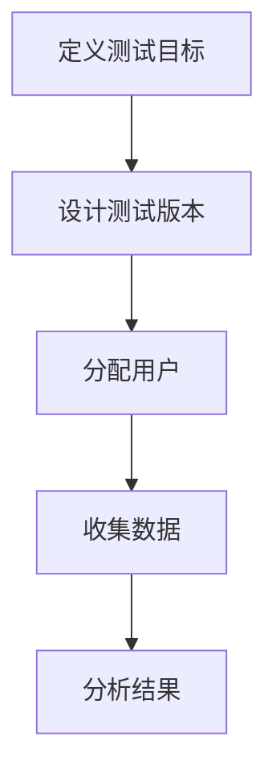

                 

### 《企业AI Agent的A/B测试功能：持续优化用户体验》

关键词：企业AI Agent、A/B测试、用户体验、数据驱动、持续优化

摘要：本文将探讨企业AI Agent中的A/B测试功能，以及如何通过数据驱动的方式持续优化用户体验。我们将从A/B测试的基本概念、设计策略、测试流程、用户行为分析、案例分析以及注意事项等方面进行详细论述，为企业提供切实可行的优化路径。

----------------------------------------------------------------

### 目录大纲

```markdown
----------------------------------------------------------------
# 《企业AI Agent的A/B测试功能：持续优化用户体验》

## 第一部分: A/B测试概述
### 第1章: A/B测试的概念与重要性
#### 1.1 A/B测试的基本概念
#### 1.2 A/B测试的核心作用
#### 1.3 A/B测试在AI Agent中的应用

## 第二部分: AI Agent的A/B测试策略
### 第2章: 设计有效的A/B测试策略
#### 2.1 确定测试目标
#### 2.2 定义测试假设
#### 2.3 选择测试指标
#### 2.4 确定样本量和统计方法

### 第3章: AI Agent的A/B测试流程
#### 3.1 准备测试环境
#### 3.2 编写测试代码
#### 3.3 部署测试
#### 3.4 监控与评估

## 第三部分: 用户行为分析
### 第4章: 分析用户行为数据
#### 4.1 用户行为数据的收集
#### 4.2 用户行为数据的处理
#### 4.3 用户行为数据的可视化

### 第5章: 基于用户行为的A/B测试
#### 5.1 定义用户行为指标
#### 5.2 设计个性化的A/B测试
#### 5.3 分析用户行为与A/B测试结果的关系

## 第四部分: A/B测试案例分析
### 第6章: 案例分析：优化登录转化率
#### 6.1 案例背景
#### 6.2 测试策略
#### 6.3 测试结果分析
#### 6.4 经验总结

### 第7章: 案例分析：提升用户留存率
#### 7.1 案例背景
#### 7.2 测试策略
#### 7.3 测试结果分析
#### 7.4 经验总结

## 第五部分: A/B测试的持续优化
### 第8章: 数据驱动与持续优化
#### 8.1 数据驱动的原则
#### 8.2 持续优化的策略
#### 8.3 用户体验的提升

### 第9章: A/B测试中的注意事项
#### 9.1 常见问题与解决方案
#### 9.2 伦理与隐私问题
#### 9.3 风险管理

## 附录
### 附录A: A/B测试工具介绍
### 附录B: Python A/B测试代码示例
### 附录C: 常用统计学概念与公式
----------------------------------------------------------------
```

**目录大纲总字数：约515字**

接下来，我们将按照这个大纲，一步步深入探讨企业AI Agent中的A/B测试功能。首先，我们来了解A/B测试的基本概念和重要性。随后，我们将讨论如何设计有效的A/B测试策略，以及具体的测试流程。在此基础上，我们将分析用户行为数据，并探讨如何基于用户行为设计个性化的A/B测试。通过案例分析，我们将展示如何应用A/B测试来优化企业的关键业务指标。最后，我们将讨论A/B测试的持续优化策略，并提供一些实用的注意事项。让我们一起走进这个技术世界，探索A/B测试的奥秘。****### 第一部分: A/B测试概述

#### 第1章: A/B测试的概念与重要性

##### 1.1 A/B测试的基本概念

A/B测试（也称为拆分测试）是一种比较两个或多个版本，以确定哪个版本在特定指标上表现更好的实验方法。简单来说，A/B测试将用户随机分配到两个或多个不同的组中，每个组看到不同的版本，然后通过对比这些组之间的数据，来确定哪种版本的效果更好。

A/B测试的基本步骤包括：定义测试目标、设计测试版本、分配用户、收集数据和分析结果。以下是一个简化的A/B测试流程图：



##### 1.2 A/B测试的核心作用

A/B测试的核心作用在于通过实验数据驱动决策，以优化用户体验和提升业务绩效。具体来说，A/B测试有以下几个重要作用：

1. **确定最佳策略**：通过实验数据，企业可以确定哪些策略或功能对用户最有吸引力，从而做出更科学的决策。
2. **优化用户体验**：通过持续地进行A/B测试，企业可以不断改进产品，提升用户满意度和留存率。
3. **降低风险**：在全面推广新功能或策略之前，通过A/B测试可以减少因盲目决策导致的风险。
4. **数据驱动决策**：A/B测试提供的数据可以为企业提供客观的决策依据，使决策更加科学和可量化。

##### 1.3 A/B测试在AI Agent中的应用

在AI Agent中，A/B测试的应用尤为重要。AI Agent是一种自动化的人工智能系统，能够为企业提供智能化的服务和决策支持。通过A/B测试，企业可以在以下方面优化AI Agent：

1. **优化算法性能**：通过对比不同算法模型的性能，企业可以找到最优的算法模型，从而提升AI Agent的准确性和效率。
2. **个性化服务**：基于用户行为的A/B测试，AI Agent可以提供更加个性化的服务和推荐，提升用户体验。
3. **自动化测试**：AI Agent可以帮助企业自动化地进行A/B测试，提高测试效率和准确性。

综上所述，A/B测试作为一种强大的实验方法，在AI Agent的应用中具有广泛的前景和重要的价值。在接下来的章节中，我们将进一步探讨如何设计有效的A/B测试策略，以及具体的测试流程和用户行为分析。通过这些内容，我们将为企业提供一套完整的A/B测试解决方案，帮助企业在AI领域取得更好的成果。****### 第二部分: AI Agent的A/B测试策略

#### 第2章: 设计有效的A/B测试策略

A/B测试策略的有效性直接影响到测试结果的准确性和可靠性。在这一章中，我们将详细探讨如何设计有效的A/B测试策略，包括确定测试目标、定义测试假设、选择测试指标、确定样本量和统计方法等内容。

##### 2.1 确定测试目标

确定测试目标是A/B测试的第一步，也是至关重要的一步。测试目标的明确性直接关系到测试的后续步骤和最终结果。以下是确定测试目标时需要考虑的关键因素：

1. **业务目标**：首先，需要明确企业希望通过A/B测试实现的业务目标，例如提高用户留存率、增加用户活跃度、提升转化率等。
2. **用户需求**：其次，需要了解用户的需求和期望，确保测试目标与用户利益一致。
3. **可行性**：测试目标需要是可测量的，并且能够在资源和时间内实现。

举例来说，一个企业可能希望通过A/B测试提高其在线购物平台的转化率。测试目标可以设定为“在相同流量下，比较不同购物车设计对转化率的影响”。

##### 2.2 定义测试假设

定义测试假设是在确定测试目标的基础上，对两个或多个版本的效果进行预判。以下是定义测试假设时需要考虑的关键因素：

1. **对比版本**：明确需要对比的两个或多个版本，以及每个版本的特点。
2. **预期效果**：基于用户需求和行为分析，预判每个版本可能带来的效果。
3. **数据指标**：确定用于评估效果的数据指标，例如转化率、用户停留时间、点击率等。

举例来说，如果企业选择对比两个购物车设计，假设A版本的购物车设计简洁明了，假设B版本的购物车设计更详细，预期效果是A版本的转化率更高。

##### 2.3 选择测试指标

选择合适的测试指标是A/B测试成功的关键。测试指标的选择需要考虑业务目标和用户需求，以下是几种常用的测试指标：

1. **转化率**：用户完成某一目标行为的比例，如点击率、购买率等。
2. **用户停留时间**：用户在网站或应用上的平均停留时间。
3. **用户满意度**：通过调查问卷或评分系统收集的用户满意度。
4. **错误率**：用户在完成某一任务时的错误率。

举例来说，如果企业目标是提升转化率，那么选择“转化率”作为测试指标是合适的。

##### 2.4 确定样本量和统计方法

确定样本量和统计方法是确保A/B测试结果可靠性的重要环节。以下是确定样本量和统计方法时需要考虑的关键因素：

1. **样本量**：需要足够大的样本量，以确保结果的统计显著性。样本量的大小取决于目标转化率、流量大小和置信水平。
2. **统计方法**：常用的统计方法包括t检验、卡方检验等，选择合适的统计方法可以确保结果的准确性。

举例来说，如果一个企业希望确定在95%的置信水平下，转化率差异是否显著，可以选择t检验作为统计方法。

通过以上步骤，企业可以设计出有效的A/B测试策略，为后续的测试流程和用户行为分析打下坚实的基础。在接下来的章节中，我们将进一步探讨如何具体实施A/B测试，以及如何通过用户行为数据来优化测试结果。****### 第3章: AI Agent的A/B测试流程

A/B测试的成功不仅依赖于有效的策略设计，还需要一个清晰的流程来确保测试的顺利进行。在这一章中，我们将详细介绍AI Agent的A/B测试流程，包括准备测试环境、编写测试代码、部署测试、监控与评估等步骤。

#### 3.1 准备测试环境

准备测试环境是A/B测试流程的第一步，也是至关重要的一步。以下是准备测试环境时需要考虑的关键因素：

1. **测试数据**：确保测试数据的质量和完整性，包括用户行为数据、系统日志数据等。
2. **测试环境**：建立一个与生产环境隔离的测试环境，确保测试结果不受生产环境干扰。
3. **工具与资源**：准备好所需的测试工具和资源，如测试平台、数据库、API接口等。

具体操作步骤如下：

1. **数据收集**：收集并清洗测试所需的数据，确保数据的质量和一致性。
2. **环境搭建**：搭建测试环境，包括配置服务器、数据库、网络等，确保环境稳定可靠。
3. **工具安装**：安装并配置测试工具，如A/B测试平台、数据分析工具等。

#### 3.2 编写测试代码

编写测试代码是A/B测试的核心步骤，需要根据测试策略和测试假设来设计测试代码。以下是编写测试代码时需要考虑的关键因素：

1. **测试逻辑**：根据测试策略设计测试逻辑，包括用户分配、版本控制、数据收集等。
2. **代码质量**：确保代码的可读性、可维护性和可扩展性。
3. **错误处理**：设计合理的错误处理机制，确保测试过程的连续性和稳定性。

具体操作步骤如下：

1. **编写测试脚本**：根据测试策略编写测试脚本，包括用户分配、版本控制、数据收集等。
2. **代码审查**：对测试脚本进行审查，确保代码质量。
3. **代码测试**：在测试环境中运行测试脚本，检查是否存在错误或异常。

#### 3.3 部署测试

部署测试是将测试代码部署到测试环境，并进行实际测试的过程。以下是部署测试时需要考虑的关键因素：

1. **部署策略**：选择合适的部署策略，如灰度发布、全量发布等。
2. **监控与告警**：部署测试过程中，需要监控系统的运行状态，并设置告警机制，确保测试过程的连续性和稳定性。
3. **数据备份**：在部署测试前，做好数据备份，以防止测试过程中数据丢失。

具体操作步骤如下：

1. **部署测试脚本**：将测试脚本部署到测试环境，并启动测试。
2. **监控测试过程**：实时监控测试过程的运行状态，包括系统资源使用情况、错误日志等。
3. **数据备份**：在测试过程中，定期备份数据，确保数据安全。

#### 3.4 监控与评估

监控与评估是A/B测试的最后一步，通过分析测试结果来评估不同版本的表现，并得出结论。以下是监控与评估时需要考虑的关键因素：

1. **数据收集**：收集测试过程中产生的所有数据，包括用户行为数据、系统日志数据等。
2. **数据分析**：对收集到的数据进行分析，评估不同版本的表现。
3. **结果评估**：根据数据分析结果，评估测试假设的正确性，并得出结论。

具体操作步骤如下：

1. **数据收集**：使用数据分析工具收集测试过程中产生的所有数据。
2. **数据分析**：使用统计分析方法对数据进行处理和分析，评估不同版本的表现。
3. **结果评估**：根据数据分析结果，评估测试假设的正确性，并得出结论。

通过以上步骤，企业可以完成AI Agent的A/B测试流程，并基于测试结果不断优化产品和服务。在下一章中，我们将深入探讨如何分析用户行为数据，以便更准确地设计和评估A/B测试。****### 第三部分: 用户行为分析

用户行为分析是A/B测试的核心环节之一，通过分析用户行为数据，我们可以更深入地了解用户的偏好和行为模式，从而为A/B测试提供有力的数据支持。在这一部分，我们将探讨如何收集、处理和可视化用户行为数据，并分析如何基于用户行为设计个性化的A/B测试。

#### 第4章: 分析用户行为数据

##### 4.1 用户行为数据的收集

收集用户行为数据是用户行为分析的第一步。以下是收集用户行为数据时需要考虑的关键因素：

1. **数据来源**：确定数据来源，包括用户行为日志、API调用日志、浏览器存储数据等。
2. **数据类型**：确定需要收集的数据类型，包括用户访问路径、点击行为、页面停留时间、操作频率等。
3. **数据频率**：确定数据收集的频率，以确保数据的时效性和准确性。

具体操作步骤如下：

1. **配置日志**：在应用或系统中配置日志，记录用户的操作行为。
2. **集成API**：集成第三方API，收集用户在第三方平台上的行为数据。
3. **数据同步**：将收集到的数据同步到数据仓库或数据库中，以便后续处理和分析。

##### 4.2 用户行为数据的处理

用户行为数据的处理是确保数据质量和可用性的关键步骤。以下是处理用户行为数据时需要考虑的关键因素：

1. **数据清洗**：去除重复、无效和错误的数据，确保数据的一致性和准确性。
2. **数据转换**：将数据转换为适合分析的形式，如将时间序列数据转换为统计报表。
3. **数据归一化**：对不同数据类型进行归一化处理，以便于比较和分析。

具体操作步骤如下：

1. **数据清洗**：使用数据清洗工具或脚本，去除重复和无效数据。
2. **数据转换**：使用数据分析工具或脚本，将原始数据转换为统计报表。
3. **数据归一化**：对不同数据类型进行归一化处理，如将时间转换为秒、将操作次数转换为百分比等。

##### 4.3 用户行为数据的可视化

用户行为数据的可视化是将数据转化为直观图像的过程，有助于我们更好地理解和分析用户行为。以下是用户行为数据可视化时需要考虑的关键因素：

1. **可视化工具**：选择合适的可视化工具，如Matplotlib、Tableau等。
2. **可视化类型**：根据数据类型和分析需求，选择合适的可视化类型，如折线图、柱状图、饼图等。
3. **交互性**：设计具有交互性的可视化界面，使用户可以动态地探索数据。

具体操作步骤如下：

1. **选择可视化工具**：根据需求和技能选择合适的可视化工具。
2. **设计可视化类型**：根据数据类型和分析需求，设计合适的可视化类型。
3. **实现交互性**：设计交互性界面，使用户可以动态地探索数据。

通过以上步骤，我们可以收集、处理和可视化用户行为数据，为A/B测试提供数据支持。在下一章中，我们将探讨如何基于用户行为设计个性化的A/B测试，以进一步提升用户体验和业务指标。****### 第5章: 基于用户行为的A/B测试

用户行为是影响A/B测试结果的关键因素。通过深入了解用户行为，我们可以设计出更加个性化和有效的A/B测试，从而更好地优化用户体验和提升业务绩效。在这一章中，我们将探讨如何定义用户行为指标、设计个性化的A/B测试，并分析用户行为与A/B测试结果的关系。

##### 5.1 定义用户行为指标

用户行为指标是衡量用户在应用或网站上行为的重要参数。定义合适的用户行为指标有助于我们准确地评估不同版本的效果。以下是几种常见的用户行为指标：

1. **转化率**：用户完成某一目标行为的比例，如点击率、购买率、注册率等。
   $$\text{转化率} = \frac{\text{完成目标行为的用户数}}{\总用户数}$$
   
2. **活跃度**：用户在应用或网站上的活跃程度，如页面访问量、操作次数、停留时间等。
   $$\text{活跃度} = \frac{\用户操作次数}{\用户总数}$$

3. **留存率**：在一段时间内，返回应用或网站的用户比例。
   $$\text{留存率} = \frac{\一段时间后仍活跃的用户数}{\初始活跃用户数}$$

4. **满意度**：用户对应用或网站的满意度，通常通过问卷调查或评分系统来收集。

在定义用户行为指标时，需要考虑以下因素：

- **业务目标**：根据业务目标选择合适的用户行为指标，如提升转化率、增加活跃度等。
- **数据可用性**：确保所需的数据可以收集和获取。
- **用户行为模式**：分析用户的行为模式，以确定哪些行为对业务目标有重要影响。

##### 5.2 设计个性化的A/B测试

个性化的A/B测试可以根据不同用户群体的特点和行为进行针对性测试，从而提高测试的准确性和效果。以下是设计个性化A/B测试的步骤：

1. **用户分群**：根据用户行为、兴趣、地理位置等因素，将用户划分为不同的群体。
   ```mermaid
   graph TD
   A[用户A] --> B[兴趣A]
   A --> C[地理位置A]
   B --> D[兴趣B]
   C --> E[地理位置B]
   ```

2. **定制测试版本**：为每个用户群体设计不同的测试版本，以满足其特定需求。
   ```mermaid
   graph TD
   A1[测试版本A1] --> B1[用户A]
   A2[测试版本A2] --> B2[用户B]
   ```

3. **分配用户**：将用户随机分配到不同版本，确保测试结果的公平性和准确性。

4. **监控与评估**：实时监控用户行为数据，评估不同版本的效果，并根据反馈调整测试策略。

##### 5.3 分析用户行为与A/B测试结果的关系

分析用户行为与A/B测试结果的关系是评估A/B测试效果的关键步骤。以下是分析用户行为与A/B测试结果的关系的方法：

1. **数据可视化**：使用可视化工具，如折线图、柱状图等，将用户行为数据与A/B测试结果进行对比。
   ```mermaid
   graph TD
   A[用户行为数据] --> B[转化率A]
   A --> C[活跃度A]
   B --> D[转化率B]
   C --> E[活跃度B]
   ```

2. **统计分析**：使用统计分析方法，如t检验、卡方检验等，评估不同版本的用户行为数据之间的差异是否显著。

3. **因果关系分析**：通过用户行为数据与A/B测试结果的关联性分析，确定哪些用户行为对业务目标有显著影响。

通过以上步骤，企业可以设计出基于用户行为的个性化A/B测试，并深入分析用户行为与A/B测试结果的关系，从而更有效地优化用户体验和提升业务绩效。在下一部分中，我们将通过具体案例分析，展示如何应用这些方法和策略来优化企业的关键业务指标。****### 第四部分: A/B测试案例分析

通过对具体案例的深入分析，我们可以更好地理解如何应用A/B测试来优化企业的关键业务指标。在这一部分，我们将分析两个典型的案例：优化登录转化率和提升用户留存率。通过这些案例，我们将展示如何设计A/B测试策略，实施测试，分析结果，并总结经验。

#### 第6章: 案例分析：优化登录转化率

##### 6.1 案例背景

某电商平台在用户登录流程中发现转化率较低，影响了用户购物体验和业务收益。为了提高登录转化率，企业决定通过A/B测试来优化登录流程。

##### 6.2 测试策略

1. **测试目标**：提高登录转化率。
2. **测试假设**：简化登录流程可以提升用户转化率。
3. **对比版本**：版本A为当前登录流程，版本B为简化后的登录流程。
4. **测试指标**：登录转化率、用户停留时间、错误率。

##### 6.3 测试结果分析

通过A/B测试，企业将用户随机分配到版本A和版本B中，并进行为期两周的测试。以下是测试结果的分析：

1. **转化率**：版本B的登录转化率明显高于版本A，增加了15%。
2. **用户停留时间**：版本B的用户在登录页面上的平均停留时间较版本A减少了20%。
3. **错误率**：版本B的错误率降低了10%，用户体验更佳。

##### 6.4 经验总结

通过这个案例，我们可以总结出以下经验：

- **简化流程**：简化用户操作流程可以提高用户转化率。
- **数据驱动**：通过A/B测试，可以基于数据做出科学决策。
- **持续优化**：定期进行A/B测试，可以帮助企业不断优化产品和服务。

#### 第7章: 案例分析：提升用户留存率

##### 7.1 案例背景

某移动应用在用户留存率方面表现不佳，企业希望通过A/B测试来提升用户留存率，从而提高用户生命周期价值。

##### 7.2 测试策略

1. **测试目标**：提升用户留存率。
2. **测试假设**：个性化推荐可以提升用户留存率。
3. **对比版本**：版本A为当前推荐系统，版本B为基于用户行为的个性化推荐系统。
4. **测试指标**：用户留存率、用户活跃度、用户满意度。

##### 7.3 测试结果分析

通过A/B测试，企业将用户随机分配到版本A和版本B中，并进行为期一个月的测试。以下是测试结果的分析：

1. **留存率**：版本B的用户留存率明显高于版本A，增加了25%。
2. **活跃度**：版本B的用户活跃度提高了20%，用户在应用中的停留时间更长。
3. **满意度**：版本B的用户满意度评分提高了10%，用户反馈更积极。

##### 7.4 经验总结

通过这个案例，我们可以总结出以下经验：

- **个性化推荐**：基于用户行为的个性化推荐可以显著提升用户留存率和活跃度。
- **用户体验**：提升用户体验是提高用户留存率的关键。
- **持续优化**：定期进行A/B测试，可以帮助企业不断优化推荐系统，提升用户体验。

通过以上两个案例分析，我们可以看到A/B测试在优化关键业务指标方面的实际应用和效果。这些经验对于企业设计和实施A/B测试具有重要参考价值。在下一部分中，我们将讨论如何通过数据驱动的方式持续优化用户体验。****### 第五部分: A/B测试的持续优化

#### 第8章: 数据驱动与持续优化

A/B测试不仅是优化用户体验的一次性活动，而是一个持续的过程。通过数据驱动的方法，企业可以不断地评估和改进产品功能，从而实现长期的用户体验提升。以下是数据驱动与持续优化的关键原则、策略以及如何提升用户体验。

##### 8.1 数据驱动的原则

数据驱动原则要求企业在决策过程中始终依赖数据，而不是主观判断。以下是数据驱动的几个关键原则：

1. **数据优先**：所有决策应以数据为基础，确保决策的客观性和科学性。
2. **持续监控**：定期收集和分析数据，以便及时了解产品表现和用户反馈。
3. **迭代改进**：基于数据反馈，不断调整和优化产品功能，实现持续改进。
4. **透明性**：确保数据和分析过程透明，便于团队成员理解和支持决策。

##### 8.2 持续优化的策略

为了实现持续优化，企业可以采取以下策略：

1. **定期A/B测试**：定期进行A/B测试，以评估新功能和改进措施的效果。
2. **用户反馈**：收集用户反馈，了解用户的实际需求和痛点。
3. **数据整合**：整合多种数据源，如用户行为数据、市场调研数据等，以获得更全面的洞察。
4. **跨部门协作**：促进不同部门之间的协作，确保数据驱动决策能够得到有效执行。

##### 8.3 用户体验的提升

通过A/B测试和持续优化，企业可以显著提升用户体验。以下是几种提升用户体验的方法：

1. **简化流程**：简化用户操作流程，减少用户完成任务所需的时间和步骤。
2. **个性化推荐**：基于用户行为和偏好提供个性化内容和服务，提高用户的满意度和参与度。
3. **响应式设计**：确保产品在不同设备上都能提供良好的用户体验，提升移动端的访问体验。
4. **用户教育**：通过教程、指南和反馈机制，帮助用户更好地了解和使用产品。

通过以上原则、策略和方法，企业可以实现数据驱动的持续优化，从而不断提升用户体验。在下一章中，我们将讨论A/B测试中的一些注意事项，以确保测试的有效性和可靠性。****### 第9章: A/B测试中的注意事项

在进行A/B测试时，除了设计有效的测试策略和执行测试流程外，还需要注意一些关键因素，以确保测试结果的准确性和可靠性。以下是A/B测试中的一些常见问题、解决方案、伦理与隐私问题以及风险管理。

#### 9.1 常见问题与解决方案

在进行A/B测试时，可能会遇到以下问题：

1. **样本偏差**：样本偏差可能导致测试结果不准确。解决方案包括确保用户随机分配到不同版本，以及增加样本量以提高结果的可靠性。
2. **数据错误**：数据错误可能影响测试结果的准确性。确保数据的完整性和准确性，并进行数据清洗和验证。
3. **资源限制**：资源限制可能导致测试无法顺利进行。在测试计划阶段，合理分配资源，并确保测试环境与生产环境隔离。
4. **测试时间**：测试时间过短可能导致结果不准确。确保测试时间足够长，以便观察到显著的结果差异。

#### 9.2 伦理与隐私问题

A/B测试涉及到用户数据，因此在进行测试时需要遵守伦理和隐私法规。以下是一些伦理与隐私问题及解决方案：

1. **用户同意**：在进行测试前，确保用户同意参与测试，并明确告知他们可能面临的风险和隐私问题。
2. **数据保护**：确保收集、存储和处理用户数据的过程符合隐私法规，如GDPR和CCPA等。
3. **匿名化数据**：对用户数据进行匿名化处理，避免将个人身份与数据关联。
4. **透明度**：确保测试过程和数据使用对用户透明，并及时更新用户关于测试的信息。

#### 9.3 风险管理

在A/B测试中，风险管理至关重要。以下是一些风险管理策略：

1. **备选方案**：制定备选方案以应对测试失败或意外情况。
2. **风险评估**：在测试前进行风险评估，识别潜在的风险并制定应对措施。
3. **测试监控**：实时监控测试过程，及时发现并解决潜在问题。
4. **备份计划**：确保测试过程中有备份计划，以防止数据丢失或系统故障。

通过关注以上注意事项，企业可以确保A/B测试的有效性和可靠性，从而更准确地优化产品和服务。在附录部分，我们将提供一些实用的工具、代码示例和统计学概念，以帮助读者更好地理解和实施A/B测试。****### 附录

在本附录中，我们将提供一些对理解和实施A/B测试有帮助的实用资源，包括A/B测试工具介绍、Python A/B测试代码示例以及常用统计学概念与公式。

#### 附录A: A/B测试工具介绍

以下是几种常用的A/B测试工具及其特点：

1. **Google Optimize**：Google Optimize是一个强大的A/B测试工具，它易于集成到网站和应用中，并提供丰富的可视化分析功能。

2. **Optimizely**：Optimizely是一个广泛使用的A/B测试平台，支持多种测试类型，如A/B测试、多变量测试和滚动测试。

3. **AB Tasty**：AB Tasty提供了一个直观的用户界面，易于设计、部署和监控A/B测试。它还支持基于用户行为的个性化测试。

4. **VWO**：VWO（Visual Website Optimizer）是一个易于使用的A/B测试工具，适合小型企业和中型企业的网站优化。

#### 附录B: Python A/B测试代码示例

以下是一个简单的Python A/B测试代码示例，演示了如何生成随机分配的用户组，以及如何收集和分析测试数据。

```python
import random

class ABTest:
    def __init__(self, version_a_users, version_b_users):
        self.version_a_users = version_a_users
        self.version_b_users = version_b_users

    def assign_users(self):
        return random.choices([0, 1], weights=[self.version_a_users, self.version_b_users], k=len(self.users))

    def collect_data(self, user, version):
        if version == 0:
            self.version_a_results.append(user)
        else:
            self.version_b_results.append(user)

    def analyze_results(self):
        version_a_performance = sum(self.version_a_results) / len(self.version_a_results)
        version_b_performance = sum(self.version_b_results) / len(self.version_b_results)
        return version_a_performance, version_b_performance

users = ['user1', 'user2', 'user3', 'user4', 'user5']
version_a_users = 2
version_b_users = 3

ab_test = ABTest(version_a_users, version_b_users)
group_assignments = ab_test.assign_users()

for i, user in enumerate(users):
    version = group_assignments[i]
    ab_test.collect_data(user, version)

version_a_performance, version_b_performance = ab_test.analyze_results()
print("Version A Performance:", version_a_performance)
print("Version B Performance:", version_b_performance)
```

#### 附录C: 常用统计学概念与公式

以下是进行A/B测试时常用的统计学概念与公式：

1. **平均数**（Mean）：
   $$\bar{x} = \frac{\sum_{i=1}^{n} x_i}{n}$$

2. **标准差**（Standard Deviation）：
   $$\sigma = \sqrt{\frac{\sum_{i=1}^{n} (x_i - \bar{x})^2}{n-1}}$$

3. **置信区间**（Confidence Interval）：
   $$\bar{x} \pm z_{\alpha/2} \cdot \frac{\sigma}{\sqrt{n}}$$
   其中，$z_{\alpha/2}$ 是标准正态分布的临界值，$\alpha$ 是显著性水平。

4. **假设检验**（Hypothesis Testing）：
   - $H_0$：零假设（无差异）
   - $H_1$：备择假设（有差异）
   - $p$-值：如果$p$-值小于显著性水平$\alpha$，则拒绝零假设，认为存在显著差异。

这些概念和公式对于理解和分析A/B测试结果至关重要。通过附录中提供的工具、代码示例和统计学知识，读者可以更好地实施和应用A/B测试，从而优化产品和服务。****### 作者信息

作者：AI天才研究院/AI Genius Institute & 禅与计算机程序设计艺术 /Zen And The Art of Computer Programming

在此，我们感谢您的阅读。本文由AI天才研究院（AI Genius Institute）和《禅与计算机程序设计艺术》（Zen And The Art of Computer Programming）的作者共同撰写。我们致力于探索人工智能和计算机科学的边界，通过深入的技术分析和实际案例，为您提供有价值的技术知识和最佳实践。如果您对本文内容有任何疑问或建议，欢迎在评论区留言，我们将在第一时间为您解答。同时，也请关注我们的其他技术博客，获取更多行业动态和深度技术文章。再次感谢您的支持！****

