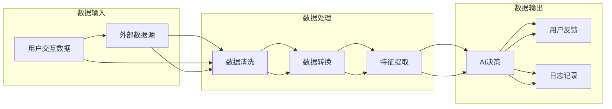

                 

### 引言

随着人工智能技术的迅猛发展，AI Agent作为人工智能领域的重要分支，逐渐成为现代企业提升运营效率、优化业务流程的核心工具。AI Agent，即人工智能代理，是一种能够自主执行任务、进行决策的智能系统，它通过学习、推理和自动化操作，为企业提供智能化服务和支持。在数据驱动和自动化需求的推动下，企业对AI Agent的需求日益增长，AI Agent的应用场景也不断扩大，从简单的客服机器人到复杂的自动化生产线控制，AI Agent已经成为企业数字化转型的重要组成部分。

DevOps作为软件开发和运维领域的一种新兴实践方法，通过促进开发与运维团队之间的协作，实现了从代码编写到产品交付的快速、高效流程。DevOps的核心理念包括持续集成（CI）、持续部署（CD）、基础设施即代码（IaC）、微服务架构等，这些理念与AI Agent的开发和部署有着密切的关联。传统的软件开发和运维模式往往存在效率低下、沟通不畅、故障频发等问题，而DevOps通过自动化工具和流程，能够显著提高AI Agent的开发、测试和部署效率，降低故障率，提高系统的可靠性和可维护性。

本篇文章将围绕“企业AI Agent的DevOps实践”这一主题，逐步探讨AI Agent与DevOps的融合应用。文章的结构如下：

- **第一部分：引言**：介绍AI Agent和DevOps的基本概念、定义及其在现代企业中的作用和重要性。
- **第二部分：核心概念与相关技术**：深入讲解AI Agent和DevOps的核心概念、相关技术，包括机器学习、深度学习、自然语言处理等。
- **第三部分：企业AI Agent开发**：讨论企业AI Agent的需求分析、系统设计、开发与测试流程。
- **第四部分：部署与维护**：介绍企业AI Agent的部署策略、性能优化以及维护方法。
- **第五部分：案例研究与最佳实践**：通过具体案例分析和最佳实践，提供企业AI Agent的DevOps实施的参考。
- **第六部分：总结与展望**：总结文章的主要内容和贡献，展望AI Agent和DevOps的未来发展趋势。

本文旨在通过逻辑清晰、结构紧凑的分析和讲解，帮助读者全面理解企业AI Agent的DevOps实践，掌握相关技术要点和实践方法，为企业的智能化转型提供有力支持。

#### 关键词

- AI Agent
- DevOps
- 持续集成
- 持续部署
- 企业智能化
- 自动化运维

#### 摘要

本文全面探讨了企业AI Agent的DevOps实践，涵盖了AI Agent的基本概念、DevOps的核心原理及其在现代企业中的应用。首先，介绍了AI Agent和DevOps的定义、作用和重要性，然后深入分析了AI Agent和DevOps的核心概念和技术，包括机器学习、深度学习和自然语言处理等。接下来，文章详细讨论了企业AI Agent的需求分析、系统设计、开发与测试流程，以及部署与维护策略。通过具体案例分析和最佳实践，本文提供了企业AI Agent的DevOps实施的详细参考。最后，总结了文章的主要内容和贡献，并对AI Agent和DevOps的未来发展趋势进行了展望。本文旨在帮助读者全面理解企业AI Agent的DevOps实践，提升企业的智能化水平和运营效率。

## 第一部分：引言

### 1.1 AI Agent的定义与作用

AI Agent，即人工智能代理，是指一种能够在特定环境下自主执行任务、进行决策的智能系统。它结合了人工智能、自然语言处理、机器学习等技术，通过不断学习和优化，能够模拟人类的思考和行为，完成复杂且重复性的任务。AI Agent在技术层面上可以看作是一个智能体，具有感知、决策和行动的能力。感知能力使其能够从环境中获取信息，决策能力使其能够根据当前状态和目标选择最佳行动方案，行动能力则使其能够执行这些决策。

AI Agent的应用领域非常广泛，几乎涵盖了现代企业的各个业务环节。以下是一些典型的应用场景：

1. **客户服务**：AI Agent可以扮演智能客服的角色，通过自然语言处理技术，理解并回应客户的提问，提供24/7的客户服务。这不仅提高了服务效率，还降低了人力成本。

2. **业务自动化**：AI Agent可以自动处理各种业务流程，如订单处理、库存管理、财务报表等。通过自动化操作，减少了人为错误，提高了业务处理速度。

3. **数据分析**：AI Agent能够从大量数据中提取有价值的信息，进行预测分析，帮助企业做出更加科学的决策。

4. **生产优化**：在制造业中，AI Agent可以监控生产线，预测设备故障，优化生产流程，提高生产效率和产品质量。

5. **安全监控**：AI Agent可以实时监控企业网络和系统，检测潜在的安全威胁，并提供预警和防护措施。

6. **智能推荐**：在电子商务领域，AI Agent可以根据用户的历史行为和偏好，提供个性化的产品推荐，提升用户满意度和转化率。

AI Agent在现代企业中的作用主要体现在以下几个方面：

- **提高效率**：通过自动化操作，减少重复性、繁琐的工作，提高整体工作效率。

- **降低成本**：减少对人工的依赖，降低人力成本和运营成本。

- **提升服务质量**：提供24/7的高质量服务，提升客户满意度和用户体验。

- **增强决策能力**：通过数据分析和预测，为企业的战略决策提供科学依据。

- **优化业务流程**：识别和优化业务中的瓶颈，提高业务流程的效率和灵活性。

### 1.2 DevOps的定义与重要性

DevOps是一种软件开发和运维的集成实践方法，旨在通过促进开发（Development）和运维（Operations）团队之间的协作，实现更高效、更可靠的应用交付。DevOps的核心原则包括自动化、持续集成（CI）、持续部署（CD）、基础设施即代码（IaC）和微服务架构等。这些原则不仅改变了传统的开发与运维模式，还重新定义了软件开发的流程和交付方式。

#### DevOps的理念与原则

1. **自动化**：通过自动化工具和流程，减少手动操作，提高开发、测试和部署的效率。
2. **持续集成（CI）**：将代码更改频繁地集成到主分支，通过自动化测试确保代码质量。
3. **持续部署（CD）**：自动将经过测试的代码部署到生产环境，实现快速、可靠的软件交付。
4. **基础设施即代码（IaC）**：使用代码定义和管理基础设施，确保基础设施的版本控制和可重复性。
5. **微服务架构**：将大型应用拆分为多个小型、独立的服务，提高系统的灵活性和可维护性。

#### DevOps对AI Agent开发的影响

DevOps的引入，对AI Agent的开发和部署带来了深远的影响：

1. **提高开发效率**：通过自动化工具，AI Agent的开发流程变得更加高效，代码变更可以快速集成、测试和部署，缩短了开发周期。

2. **确保代码质量**：通过持续集成和自动化测试，确保每次代码变更都不会引入新的错误，提高了系统的稳定性和可靠性。

3. **加快部署速度**：通过持续部署，AI Agent的更新和迭代可以更加频繁，快速响应业务需求和市场变化。

4. **降低运维成本**：使用基础设施即代码，AI Agent的基础设施可以自动化管理，减少了运维的工作量，降低了运维成本。

5. **提高用户体验**：通过快速迭代和及时更新，AI Agent可以更快地响应用户需求，提升用户体验。

总之，DevOps不仅改变了AI Agent的开发和运维方式，还推动了企业整体数字化转型，为企业带来了更高的效率和竞争力。

### 1.3 本书的目标与结构

本书旨在全面探讨企业AI Agent的DevOps实践，帮助读者深入理解AI Agent和DevOps的核心概念、技术要点，并掌握其实际应用方法。具体目标如下：

- **深入理解AI Agent和DevOps的基本概念**：介绍AI Agent的定义、组成部分和应用场景，详细解释DevOps的理念和核心原则。
- **掌握AI Agent和DevOps的技术要点**：讲解机器学习、深度学习、自然语言处理等关键技术在AI Agent中的应用，探讨DevOps在AI Agent开发、测试和部署中的实际应用。
- **学习企业AI Agent的开发流程**：通过实际案例，详细描述AI Agent的需求分析、系统设计、开发与测试流程。
- **掌握AI Agent的部署与维护方法**：介绍AI Agent的部署策略、性能优化和维护方法，提供最佳实践和经验总结。
- **实现企业AI Agent的DevOps实践**：通过具体案例和最佳实践，展示如何在实际企业环境中实施AI Agent的DevOps实践。

本书的结构分为六个部分：

1. **引言**：介绍AI Agent和DevOps的基本概念及其重要性。
2. **核心概念与相关技术**：深入分析AI Agent和DevOps的核心概念和技术。
3. **企业AI Agent开发**：讨论AI Agent的需求分析、系统设计和开发测试流程。
4. **部署与维护**：介绍AI Agent的部署策略、性能优化和维护方法。
5. **案例研究与最佳实践**：通过具体案例分析和最佳实践，提供AI Agent的DevOps实施参考。
6. **总结与展望**：总结全书主要内容，展望AI Agent和DevOps的未来发展趋势。

通过本书的系统性学习和实践，读者将能够全面掌握企业AI Agent的DevOps实践，提升企业的智能化水平和运营效率。

### 第二部分：核心概念与相关技术

#### 第2章 AI Agent基础

AI Agent，即人工智能代理，是人工智能领域中的一种重要概念。它是一种能够模拟人类智能行为的计算实体，通过感知、思考、决策和行动，在特定环境中完成特定任务。为了深入理解AI Agent，我们需要先了解其组成部分、技术基础和应用场景。

#### 2.1 AI Agent的组成部分

AI Agent通常由以下几个核心组件构成：

1. **感知器**：用于感知外部环境的信息，如传感器、摄像头、麦克风等。感知器将物理信号转换为数字信号，为AI Agent提供输入数据。

2. **知识库**：存储AI Agent所需的知识和规则，包括事实、经验、模型等。知识库是AI Agent进行推理和决策的基础。

3. **推理机**：负责根据感知器获取的信息和知识库中的知识，进行逻辑推理，生成行动方案。推理机通常采用规则推理、模糊推理、统计推理等方法。

4. **执行器**：用于执行推理机生成的行动方案，如机械臂、电机、屏幕等。执行器将AI Agent的决策转化为物理行动。

5. **学习模块**：负责AI Agent的学习和自我优化，通过机器学习、深度学习等技术，从环境中获取新的知识和经验，提升性能。

#### 2.2 AI Agent的技术基础

AI Agent的技术基础涵盖了多个领域，主要包括：

1. **机器学习**：机器学习是一种让计算机从数据中自动学习和改进的方法。在AI Agent中，机器学习用于训练模型，使Agent能够从历史数据中学习规律，并预测未来行为。

2. **深度学习**：深度学习是机器学习的一个分支，通过神经网络结构，实现复杂的数据处理和模式识别。深度学习在图像识别、语音识别等领域有广泛应用，是AI Agent的重要组成部分。

3. **自然语言处理（NLP）**：自然语言处理是使计算机能够理解和生成自然语言的技术。在AI Agent中，NLP用于理解和生成人类语言，实现人机交互。

4. **强化学习**：强化学习是一种通过奖励机制，使Agent在与环境的交互中不断学习和优化的方法。在AI Agent中，强化学习用于决策和行动，以实现最佳效果。

5. **计算机视觉**：计算机视觉是使计算机能够“看到”和理解图像的技术。在AI Agent中，计算机视觉用于环境感知和目标识别。

#### 2.3 AI Agent的应用场景

AI Agent的应用场景非常广泛，以下是一些典型的应用：

1. **智能客服**：通过自然语言处理技术，AI Agent能够理解用户的提问并给出合适的回答，提供24/7的客户服务。

2. **自动化生产线**：AI Agent可以监控生产线，预测设备故障，优化生产流程，提高生产效率和产品质量。

3. **智能推荐系统**：通过分析用户的行为和偏好，AI Agent能够提供个性化的产品推荐，提升用户体验和转化率。

4. **自动驾驶**：AI Agent通过计算机视觉和深度学习技术，实现自动驾驶，提高交通效率和安全性。

5. **金融风控**：AI Agent可以分析大量金融数据，预测市场走势，提供投资建议，降低金融风险。

6. **医疗诊断**：AI Agent可以通过分析医学影像和病历数据，辅助医生进行疾病诊断，提高诊断准确率。

#### 2.4 AI Agent的核心概念属性特征对比表格

为了更好地理解AI Agent的核心概念属性特征，我们可以通过一个对比表格来展示不同类型的AI Agent在感知、决策、执行和学习方面的特点：

| AI Agent类型 | 感知 | 决策 | 执行 | 学习 |
| :--- | :--- | :--- | :--- | :--- |
| 智能客服 | 自然语言处理、语音识别 | 模式识别、规则推理 | 文本生成、语音合成 | 数据分析、机器学习 |
| 自动化生产线 | 计算机视觉、传感器数据 | 统计模型、优化算法 | 机械臂、电机控制 | 强化学习、深度学习 |
| 智能推荐系统 | 用户行为分析、数据分析 | 协同过滤、基于内容的推荐 | 产品推荐、广告投放 | 机器学习、深度学习 |
| 自动驾驶 | 计算机视觉、传感器融合 | 强化学习、深度学习 | 自动驾驶控制、导航系统 | 传感器数据处理、多模态学习 |
| 金融风控 | 数据分析、机器学习 | 统计模型、规则推理 | 投资决策、风险控制 | 强化学习、深度学习 |
| 医疗诊断 | 医学影像分析、病历数据 | 医学知识图谱、推理机 | 医疗决策支持、诊断辅助 | 强化学习、深度学习 |

#### 2.5 AI Agent的ER实体关系图架构

为了更清晰地展示AI Agent的组件和关系，我们可以使用ER实体关系图（Entity-Relationship Diagram）来描述其架构。以下是一个简化的ER实体关系图：

```mermaid
erDiagram
  AI_Agent ||--|{ 感知器 }
  AI_Agent ||--|{ 知识库 }
  AI_Agent ||--|{ 推理机 }
  AI_Agent ||--|{ 执行器 }
  AI_Agent ||--|{ 学习模块 }
  感知器 ||--|{ 传感器 }
  知识库 ||--|{ 规则 }
  知识库 ||--|{ 模型 }
  推理机 ||--|{ 逻辑推理 }
  推理机 ||--|{ 统计模型 }
  执行器 ||--|{ 机械臂 }
  执行器 ||--|{ 电机控制 }
  学习模块 ||--|{ 机器学习 }
  学习模块 ||--|{ 深度学习 }
```

通过这个ER实体关系图，我们可以看到AI Agent的各个组件及其相互之间的关系，这有助于我们更好地理解AI Agent的组成和工作原理。

#### 第3章 DevOps实践

### 3.1 DevOps流程

DevOps流程是软件开发和运维的基本框架，通过自动化、持续集成和持续部署等实践方法，实现高效的软件交付。下面将详细讲解DevOps的基本流程和关键环节。

#### 3.1.1 流程概述

DevOps流程主要包括以下几个关键环节：

1. **需求收集与分析**：与利益相关者沟通，明确软件需求和目标。
2. **设计**：制定系统架构和设计，包括数据库、API接口、前端和后端等。
3. **编码**：开发人员根据设计文档编写代码，实现功能模块。
4. **测试**：对代码进行单元测试、集成测试和系统测试，确保质量。
5. **集成**：将多个模块集成在一起，进行集成测试和验证。
6. **部署**：将测试通过的应用部署到生产环境。
7. **监控**：实时监控系统的运行状态，确保系统稳定性和性能。
8. **反馈与改进**：收集用户反馈，持续优化和改进系统。

#### 3.1.2 流程与工具

DevOps流程的自动化是实现高效交付的关键。以下是一些常用的工具和平台：

1. **Jenkins**：自动化的持续集成和持续部署工具，支持多种插件，可集成到多种开发环境中。
2. **GitLab**：结合Git版本控制和持续集成功能，支持自动化构建、测试和部署。
3. **Docker**：容器化技术，用于打包、交付和运行应用，提高开发效率和可移植性。
4. **Kubernetes**：容器编排和管理平台，用于自动化部署、扩展和管理容器化应用。
5. **Ansible**：自动化部署和配置管理工具，用于自动化部署和管理基础设施。
6. **Nagios**：监控系统，用于实时监控服务器、应用程序和网络设备的运行状态。
7. **Prometheus**：监控解决方案，用于收集和存储时间序列数据，提供数据可视化和分析。

#### 3.2 持续集成与持续部署

持续集成（Continuous Integration，CI）和持续部署（Continuous Deployment，CD）是DevOps的核心实践，通过自动化和频繁的代码集成、测试和部署，确保软件的高质量和高可靠性。

#### 3.2.1 CI/CD的概念

1. **持续集成（CI）**：持续集成是指将代码频繁地合并到主分支，每次提交都会触发自动化测试和构建，确保代码的质量和一致性。CI的主要目标是尽早发现和解决集成问题，防止代码库变得混乱。

2. **持续部署（CD）**：持续部署是指将经过测试的代码自动部署到生产环境，实现快速、可靠的软件交付。CD的主要目标是减少部署风险，提高交付速度和可靠性。

#### 3.2.2 CI/CD的实施

实施CI/CD通常包括以下几个步骤：

1. **代码仓库管理**：使用Git等版本控制系统管理代码仓库，确保代码的一致性和可追溯性。
2. **构建和测试**：使用Jenkins、GitLab CI等工具，自动化构建和测试代码，确保每次集成都是高质量的。
3. **自动化部署**：使用Docker、Kubernetes等工具，自动化部署应用，确保部署过程的高效和可重复性。
4. **监控和反馈**：使用Nagios、Prometheus等工具，实时监控系统性能和健康状态，收集反馈，持续优化系统。

#### 3.2.3 CI/CD工具的选择与应用

不同的CI/CD工具适用于不同的场景，选择合适的工具是成功实施CI/CD的关键。以下是一些常见CI/CD工具的选择和应用：

1. **Jenkins**：适合中大型项目和多种开发语言，可以通过插件扩展功能，支持多种CI/CD流程。
2. **GitLab CI**：适合GitLab用户，集成版本控制、代码审查和持续集成，易于配置和管理。
3. **Docker**：用于容器化应用，提高部署效率和可移植性，与CI/CD工具结合使用，实现快速交付。
4. **Kubernetes**：用于容器编排和管理，确保应用的高可用性和弹性，与CI/CD工具集成，实现自动化部署和管理。
5. **Ansible**：用于自动化部署和管理基础设施，简化环境配置和部署过程。

通过以上步骤和工具，企业可以实现高效的CI/CD流程，提高软件交付质量和速度，降低部署风险和运维成本。

### 第4章 企业AI Agent需求分析

#### 4.1 业务需求分析

在开发企业AI Agent之前，明确业务需求是至关重要的。业务需求分析包括了解企业的业务目标、流程和用户需求，从而确定AI Agent的功能和性能要求。

#### 4.1.1 企业业务目标

企业的业务目标通常包括提高运营效率、降低成本、提升客户满意度和增强竞争力。例如，某电商企业希望通过AI Agent实现以下目标：

- 提高客户服务效率，减少客服人工成本。
- 自动化订单处理和库存管理，减少人为错误。
- 提供个性化的产品推荐，提升用户转化率。
- 实时监控库存和销售数据，优化库存管理和营销策略。

#### 4.1.2 企业业务流程

企业业务流程是AI Agent需要参与和优化的环节。以下是一个典型的电商企业业务流程：

1. **客户咨询**：客户通过网站、电话或在线聊天与客服沟通。
2. **订单处理**：客户下单后，系统自动生成订单，并分配给相应的仓库进行发货。
3. **库存管理**：系统实时监控库存情况，确保产品供应充足。
4. **物流跟踪**：系统跟踪物流信息，并及时通知客户。
5. **售后支持**：客户在购买后如有问题，系统提供售后服务。

#### 4.1.3 用户需求

了解用户需求是确保AI Agent有效性的关键。用户需求可能包括：

- **便捷的客户服务**：用户希望得到快速、准确的答案和解决方案。
- **个性化的产品推荐**：用户希望根据个人偏好和购买历史得到个性化的产品推荐。
- **高效的订单处理**：用户希望订单能够快速处理并准时发货。
- **透明的物流信息**：用户希望实时了解订单状态和物流信息。

#### 4.2 技术需求分析

在明确业务需求后，需要进一步分析AI Agent所需的技术支持，确保其能够满足业务需求并实现预期的功能。

#### 4.2.1 机器学习技术

AI Agent需要使用机器学习技术进行数据分析和预测。以下是一些常用的机器学习技术：

1. **分类算法**：用于将数据划分为不同的类别，例如客户流失预测、产品分类等。
2. **回归算法**：用于预测数值，例如销量预测、库存水平预测等。
3. **聚类算法**：用于发现数据中的模式，例如用户群体细分、商品关联分析等。
4. **时间序列分析**：用于分析时间相关的数据，例如销售趋势分析、库存需求预测等。

#### 4.2.2 自然语言处理（NLP）技术

NLP技术在AI Agent中用于处理和理解自然语言，使其能够与用户进行交互。以下是一些常用的NLP技术：

1. **文本分类**：用于将文本数据分类到不同的类别，例如情感分析、新闻分类等。
2. **命名实体识别**：用于识别文本中的特定实体，例如人名、地名、产品名等。
3. **情感分析**：用于分析文本中的情感倾向，例如客户反馈分析、评论情感分类等。
4. **对话系统**：用于构建自然语言交互界面，例如智能客服、语音助手等。

#### 4.2.3 计算机视觉技术

计算机视觉技术在AI Agent中用于图像识别和图像处理。以下是一些常用的计算机视觉技术：

1. **图像分类**：用于将图像分类到不同的类别，例如商品识别、故障检测等。
2. **目标检测**：用于识别图像中的特定目标，例如人脸识别、车辆检测等。
3. **图像分割**：用于将图像分割成多个区域，例如图像标注、图像去噪等。
4. **图像增强**：用于改善图像质量，例如图像锐化、图像增强等。

通过上述技术需求分析，企业可以确定AI Agent所需的技术栈，并选择合适的技术方案和工具，以确保AI Agent能够有效满足业务需求。

#### 4.3 AI Agent的功能需求分析

在明确了业务和技术需求后，需要进一步分析AI Agent的具体功能需求，确保其能够满足企业的业务目标。以下是一个企业AI Agent的功能需求分析：

1. **智能客服**：通过自然语言处理技术，实现与客户的实时交互，自动回答常见问题，提供个性化服务。
   - **功能**：问题识别、回答生成、多轮对话管理。
   - **技术**：NLP、机器学习、对话系统。

2. **订单处理**：自动化处理订单，包括订单生成、订单跟踪和订单管理等。
   - **功能**：订单生成、订单状态更新、库存检查、物流跟踪。
   - **技术**：数据库操作、API集成、机器学习。

3. **库存管理**：实时监控库存水平，预测库存需求，优化库存管理。
   - **功能**：库存监控、需求预测、库存补货。
   - **技术**：时间序列分析、数据库操作、机器学习。

4. **个性化推荐**：根据用户行为和偏好，提供个性化的产品推荐，提升转化率。
   - **功能**：用户行为分析、产品推荐、广告投放。
   - **技术**：NLP、机器学习、推荐系统。

5. **销售预测**：分析历史销售数据，预测未来销售趋势，帮助企业制定销售策略。
   - **功能**：销售数据收集、趋势分析、预测模型。
   - **技术**：时间序列分析、机器学习、数据分析。

6. **售后支持**：提供自动化售后服务，处理客户反馈和投诉。
   - **功能**：反馈收集、问题解决、投诉处理。
   - **技术**：NLP、机器学习、反馈分析。

通过上述功能需求分析，企业可以明确AI Agent所需的功能模块，并针对性地选择和开发相关技术，确保AI Agent能够有效满足业务需求。

### 第5章 系统设计

#### 5.1 系统架构设计

为了确保AI Agent系统的稳定性和扩展性，我们需要进行系统架构设计。系统架构设计包括硬件架构、软件架构以及各个组件之间的关系。以下是一个典型的企业AI Agent系统架构设计：

#### 5.1.1 硬件架构

1. **服务器**：用于运行AI Agent的应用程序和后台服务，需要具备高性能、高可靠性和高扩展性。
2. **存储设备**：用于存储AI Agent的数据，包括用户数据、训练数据和日志文件等，需要具备高速读写性能和冗余备份。
3. **网络设备**：用于连接各个服务器和存储设备，确保数据传输的高效性和安全性。

#### 5.1.2 软件架构

1. **前端**：用于与用户交互，提供用户界面和交互体验。通常使用Web前端框架，如React或Vue.js，实现动态、响应式的用户界面。
2. **后端**：用于处理业务逻辑和数据存储，通常使用Spring Boot、Django等框架，实现RESTful API和服务端逻辑。
3. **AI引擎**：用于运行AI模型和算法，实现智能推理和决策。可以使用TensorFlow、PyTorch等深度学习框架，实现模型的训练和推理。
4. **数据库**：用于存储AI Agent的数据，包括用户数据、训练数据和日志文件等。可以使用关系型数据库（如MySQL、PostgreSQL）或NoSQL数据库（如MongoDB、Redis），根据实际需求选择合适的数据库。

#### 5.1.3 组件关系

1. **前端与后端**：前端通过HTTP请求与后端进行通信，后端通过API接口提供数据和服务。
2. **AI引擎与后端**：后端通过调用AI引擎的API，实现AI模型的推理和决策。
3. **后端与数据库**：后端通过数据库进行数据存储和查询，实现数据的持久化和管理。

#### 5.2 数据流程设计

数据流程设计是系统设计的重要组成部分，它定义了数据从输入到处理再到输出的整个过程。以下是企业AI Agent的数据流程设计：

#### 5.2.1 数据输入

1. **用户交互数据**：前端用户界面收集的用户输入数据，包括文本、图像、语音等。
2. **外部数据源**：从其他系统或API获取的数据，如用户行为数据、销售数据、库存数据等。

#### 5.2.2 数据处理

1. **数据清洗**：对输入的数据进行清洗和预处理，去除噪声和异常值，保证数据质量。
2. **数据转换**：将输入数据转换为AI模型所需的格式，如文本向量化、图像预处理等。
3. **特征提取**：从数据中提取重要的特征信息，用于训练模型和进行后续分析。

#### 5.2.3 数据输出

1. **AI决策**：基于训练好的模型，对输入数据进行推理和决策，生成输出结果，如推荐商品、订单处理结果等。
2. **用户反馈**：将AI决策结果返回给用户，实现与用户的交互和反馈。
3. **日志记录**：记录AI Agent的运行日志，用于监控、调试和优化系统。

#### 5.2.4 数据流程图

以下是一个简化的数据流程图，展示了AI Agent系统的数据流动过程：



通过上述系统架构和数据流程设计，企业AI Agent系统能够高效地处理和利用数据，实现智能化的业务流程优化和用户服务。

### 第6章 开发与测试

#### 6.1 开发流程

企业AI Agent的开发流程是一个系统化、规范化的过程，确保从需求分析到最终产品交付的每一步都能顺利进行。以下是企业AI Agent的开发流程，包括主要阶段和关键步骤。

#### 6.1.1 需求分析

需求分析是整个开发流程的起点，目的是明确系统的功能和性能要求。主要步骤如下：

- **需求调研**：与利益相关者进行沟通，了解业务需求和用户需求。
- **需求文档编写**：编写详细的系统需求文档，包括功能需求、性能需求和安全需求等。
- **需求评审**：对需求文档进行评审，确保需求完整、明确、可实施。

#### 6.1.2 设计阶段

设计阶段是开发流程的核心，主要包括以下步骤：

- **系统设计**：设计系统的整体架构，包括硬件架构、软件架构和组件关系等。
- **数据库设计**：设计数据库的表结构、字段和关系，确保数据的完整性和一致性。
- **API设计**：设计API接口，定义接口的URL、参数和返回值，确保前后端的数据交互。

#### 6.1.3 编码阶段

编码阶段是将设计转化为实际代码的过程，主要步骤如下：

- **模块划分**：将系统划分为多个模块，每个模块负责特定的功能。
- **编写代码**：按照设计文档编写代码，实现系统的各个模块。
- **代码审查**：进行代码审查，确保代码质量，防止潜在的错误和漏洞。

#### 6.1.4 测试阶段

测试阶段是确保系统功能和性能满足需求的最后一步，主要步骤如下：

- **单元测试**：对单个模块进行测试，验证其功能和性能。
- **集成测试**：将多个模块集成在一起，进行系统级的测试，确保模块之间的协同工作。
- **性能测试**：对系统进行性能测试，评估其响应时间、吞吐量和并发能力。

#### 6.1.5 部署和运维

部署阶段是将系统部署到生产环境的过程，主要步骤如下：

- **环境搭建**：搭建测试和生产环境，确保系统的稳定运行。
- **部署**：将系统部署到生产环境，进行最后的测试和调试。
- **运维**：监控系统运行状态，及时处理故障和问题。

#### 6.2 测试与质量保证

测试和质量保证是开发流程的重要组成部分，确保系统在交付前达到预期的质量标准。以下是企业AI Agent的测试和质量保证方法：

#### 6.2.1 单元测试

单元测试是针对单个模块进行的测试，验证其功能和性能。主要方法包括：

- **白盒测试**：通过查看代码逻辑，编写测试用例，覆盖所有的代码路径。
- **黑盒测试**：不查看代码逻辑，仅通过输入输出验证模块的功能。

#### 6.2.2 集成测试

集成测试是将多个模块集成在一起，进行系统级的测试，确保模块之间的协同工作。主要方法包括：

- **功能测试**：验证系统的各个功能是否正常工作。
- **性能测试**：评估系统的响应时间、吞吐量和并发能力。

#### 6.2.3 性能测试

性能测试是评估系统的性能，包括响应时间、吞吐量和并发能力。主要方法包括：

- **负载测试**：模拟多用户并发访问，评估系统的性能。
- **压力测试**：对系统施加超出正常工作范围的压力，评估其稳定性和可靠性。

#### 6.2.4 质量保证

质量保证是通过一系列措施确保系统达到预期质量的过程，包括：

- **代码审查**：定期进行代码审查，确保代码质量。
- **文档审查**：审查系统文档，确保其完整性和准确性。
- **定期回顾**：定期进行项目回顾，总结经验教训，改进开发流程。

通过以上开发流程和测试方法，企业AI Agent系统能够高效、高质量地完成开发，确保其在实际应用中的稳定运行。

### 第7章 部署策略

#### 7.1 部署流程

企业AI Agent的部署流程是实现系统从开发环境到生产环境平稳过渡的关键步骤。以下是详细的部署流程，包括各个环节和操作。

#### 7.1.1 准备工作

在开始部署之前，需要进行充分的准备工作，确保环境稳定、资源充足。主要步骤如下：

- **环境检查**：检查服务器、网络设备和存储设备的状态，确保其正常运行。
- **资源分配**：根据系统需求，分配计算资源、存储资源和网络资源，确保系统有足够的资源支持。
- **备份**：在部署之前，对现有系统进行备份，以防部署过程中出现意外导致数据丢失。

#### 7.1.2 部署脚本编写

编写部署脚本用于自动化部署过程，提高部署效率和一致性。主要步骤如下：

- **编写Dockerfile**：为AI Agent编写Dockerfile，定义容器的构建过程，包括依赖库的安装、应用程序的复制等。
- **编写Kubernetes配置文件**：为AI Agent编写Kubernetes配置文件，定义部署策略、服务配置和资源限制等。
- **脚本测试**：在本地环境中测试部署脚本，确保脚本能够正常运行并执行预期操作。

#### 7.1.3 部署到容器化环境

使用容器化技术（如Docker和Kubernetes）进行部署，实现应用与环境的解耦，提高系统的可移植性和可维护性。主要步骤如下：

- **构建容器镜像**：使用Dockerfile构建容器镜像，包含AI Agent的应用程序及其依赖库。
- **上传容器镜像**：将构建好的容器镜像上传到镜像仓库，如Docker Hub或私有镜像仓库。
- **部署容器**：使用Kubernetes配置文件，在Kubernetes集群中部署容器，确保容器的运行状态和健康检查。

#### 7.1.4 部署到生产环境

将AI Agent部署到生产环境，确保系统能够稳定运行并提供服务。主要步骤如下：

- **部署前验证**：在部署前进行一次全面的验证，包括镜像版本、配置文件和依赖库等。
- **手动部署**：通过Kubernetes的kubectl命令行工具或GUI界面，手动部署AI Agent到生产环境。
- **部署监控**：部署完成后，实时监控系统的运行状态，确保系统正常启动并运行。

#### 7.2 部署工具与应用

在实际部署过程中，选择合适的工具和应用是确保部署过程高效、稳定的关键。以下是一些常用的部署工具和应用：

1. **Docker**：用于容器化应用，提供轻量级、可移植的容器化解决方案。
2. **Kubernetes**：用于容器编排和管理，提供自动化部署、扩展和管理容器化应用的功能。
3. **Ansible**：用于自动化部署和配置管理，可以自动化管理服务器和基础设施。
4. **Jenkins**：用于持续集成和持续部署，可以自动化构建、测试和部署应用程序。
5. **GitLab CI/CD**：与GitLab集成，提供持续集成和持续部署功能，支持自动化构建和部署。

通过上述部署流程和工具应用，企业可以确保AI Agent系统的高效、稳定部署，提高系统的可维护性和可扩展性。

### 第8章 性能优化

#### 8.1 性能监测

企业AI Agent的性能监测是确保系统在高负载情况下仍能保持高效运行的关键。以下介绍如何设置性能监测指标，包括系统性能指标和AI模型性能指标。

#### 8.1.1 系统性能指标

1. **CPU使用率**：监测CPU的利用率，确保没有过高的CPU占用率影响系统性能。
2. **内存使用率**：监测内存的使用情况，防止内存不足导致系统崩溃。
3. **磁盘I/O**：监测磁盘的读写速度和I/O负载，确保磁盘操作不会成为系统性能瓶颈。
4. **网络带宽**：监测网络的带宽使用情况，确保网络延迟和丢包率在可接受范围内。
5. **队列长度**：监测系统的队列长度，如任务队列、请求队列等，确保队列长度不会过高导致系统响应延迟。

#### 8.1.2 AI模型性能指标

1. **准确率**：监测AI模型的预测准确性，确保模型能够准确识别和分类。
2. **召回率**：监测AI模型在识别正例样本时的召回率，确保不会漏掉重要样本。
3. **F1分数**：综合准确率和召回率，评估模型的整体性能。
4. **响应时间**：监测模型预测的响应时间，确保模型能够在合理时间内返回结果。
5. **资源消耗**：监测模型训练和推理过程中使用的计算资源和内存消耗，确保资源合理分配。

#### 8.2 性能优化策略

在了解系统性能监测指标后，需要制定相应的性能优化策略，以提高AI Agent系统的整体性能。

#### 8.2.1 系统级优化

1. **垂直扩展**：增加服务器的CPU、内存和存储容量，提升硬件性能。
2. **水平扩展**：通过增加服务器节点，实现负载均衡，提高系统的处理能力。
3. **缓存策略**：使用缓存技术，如Redis或Memcached，减少数据库的访问压力，提高响应速度。
4. **数据库优化**：对数据库进行索引优化、查询优化和分库分表，提高数据读写效率。
5. **网络优化**：优化网络配置，如调整TCP参数、使用负载均衡器等，减少网络延迟和丢包率。

#### 8.2.2 AI模型优化

1. **模型压缩**：使用模型压缩技术，如剪枝、量化等，减少模型的参数数量和计算量，提高模型推理速度。
2. **模型更新**：定期更新AI模型，使用最新的训练数据和优化算法，提高模型性能。
3. **模型并行化**：使用多线程或多GPU训练，提高模型训练速度。
4. **模型缓存**：对常用模型的预测结果进行缓存，减少重复计算，提高响应速度。
5. **资源调度**：优化资源分配，确保模型训练和推理过程中有足够的计算资源和内存。

#### 8.2.3 调试和监控

1. **日志分析**：通过分析系统日志和AI模型日志，识别性能瓶颈和潜在问题。
2. **性能测试**：定期进行性能测试，模拟高负载场景，评估系统性能。
3. **实时监控**：使用性能监测工具，实时监控系统性能指标，及时发现和解决问题。

通过上述性能优化策略，企业AI Agent系统可以显著提高性能，确保在高负载情况下仍能稳定运行，提供高质量的服务。

### 第9章 案例研究

#### 9.1 案例一：XX企业的AI Agent部署实践

在当前数字化转型的浪潮中，XX企业作为一家大型电商平台，积极探索AI技术在业务中的应用。为了提升客户服务和运营效率，XX企业决定部署一款智能客服AI Agent。以下是该企业在AI Agent部署过程中的一些实践和经验。

#### 9.1.1 项目背景

随着电商平台的业务规模不断扩大，客户咨询量和订单量显著增加，传统的人工客服模式已无法满足用户需求。为了提供24/7的高质量客户服务，降低人力成本，提高服务效率，XX企业决定引入AI Agent作为智能客服系统。

#### 9.1.2 需求分析

在需求分析阶段，XX企业明确了以下关键需求：

- **高响应速度**：AI Agent需要能够在短时间内响应用户提问，提供准确的信息和解决方案。
- **自然语言理解**：AI Agent需要具备强大的自然语言理解能力，能够理解复杂、模糊的用户提问。
- **个性化服务**：AI Agent需要能够根据用户的历史行为和偏好，提供个性化的推荐和服务。
- **扩展性**：AI Agent需要具备良好的扩展性，能够支持不断新增的业务功能和数据接口。

#### 9.1.3 技术选型

为了满足上述需求，XX企业在技术选型上进行了如下考虑：

- **机器学习框架**：选择TensorFlow作为机器学习框架，因为它支持广泛的算法和应用场景，且具有良好的社区支持。
- **自然语言处理（NLP）库**：选择NLTK和spaCy作为NLP工具，用于文本处理和情感分析。
- **容器化技术**：采用Docker进行应用容器化，确保应用的轻量化和可移植性。
- **服务编排工具**：使用Kubernetes进行服务编排和管理，实现自动化部署和扩展。

#### 9.1.4 部署流程

在部署AI Agent过程中，XX企业遵循以下步骤：

1. **开发与测试**：在本地环境中进行开发，使用Jenkins进行自动化测试，确保代码质量和功能完整性。
2. **容器化应用**：使用Docker将AI Agent应用程序容器化，生成Docker镜像。
3. **上传镜像**：将Docker镜像上传到私有镜像仓库，供Kubernetes使用。
4. **部署到Kubernetes集群**：使用Kubernetes配置文件，将AI Agent部署到Kubernetes集群，实现自动化部署和扩展。
5. **监控与运维**：使用Prometheus和Grafana进行实时监控，确保系统的稳定性和性能。

#### 9.1.5 部署效果

AI Agent部署上线后，XX企业取得了显著的效果：

- **客户满意度提升**：AI Agent能够快速、准确地响应客户提问，提高了用户满意度。
- **服务效率提升**：AI Agent实现了24/7的全天候服务，显著降低了人力成本。
- **业务流程优化**：AI Agent通过自然语言理解和个性化推荐，优化了客户服务流程和运营策略。

#### 9.2 案例二：YY企业的AI Agent性能优化实践

YY企业是一家专注于智能制造的科技公司，其生产线采用AI Agent进行监控和优化。随着生产规模的扩大，AI Agent的性能逐渐成为瓶颈。为了提升系统性能，YY企业进行了深入的优化实践。

#### 9.2.1 项目背景

YY企业的生产线涵盖多个制造环节，设备繁多，数据量大。AI Agent负责实时监控设备状态、预测设备故障和优化生产流程。然而，随着生产负荷的增加，AI Agent的响应速度和准确性开始下降，影响了生产效率和设备利用率。

#### 9.2.2 性能问题

在性能优化前，YY企业发现以下问题：

- **响应时间过长**：AI Agent在处理大量数据时，响应时间显著增加，导致生产流程停滞。
- **资源消耗高**：AI Agent在训练和推理过程中，计算资源和内存消耗过高，导致服务器负载过高。
- **预测准确性下降**：随着数据量的增加，AI模型的预测准确性下降，影响了设备故障预测和生产线优化。

#### 9.2.3 性能优化策略

为了解决上述性能问题，YY企业采取了以下优化策略：

1. **模型压缩**：使用模型压缩技术，如剪枝和量化，减少模型的参数数量和计算量，提高模型推理速度。
2. **分布式训练**：采用分布式训练技术，将数据分布在多个服务器上，提高训练效率。
3. **资源调度优化**：优化资源分配，确保模型训练和推理过程中有足够的计算资源和内存。
4. **缓存策略**：使用缓存技术，减少重复计算，提高响应速度。
5. **数据库优化**：对数据库进行索引优化和分库分表，提高数据读写效率。

#### 9.2.4 优化效果

通过实施上述性能优化策略，YY企业取得了显著的优化效果：

- **响应时间缩短**：AI Agent的响应时间显著缩短，生产流程更加流畅。
- **资源消耗降低**：AI Agent的资源消耗降低，服务器负载减轻。
- **预测准确性提高**：AI模型的预测准确性提高，设备故障预测和生产线优化更加准确。

#### 9.2.5 经验总结

YY企业的性能优化实践为其他企业提供了宝贵的经验：

- **持续监控和优化**：定期监控系统性能，发现并解决问题。
- **资源合理分配**：合理分配计算资源和内存，确保系统稳定运行。
- **技术选型和更新**：选择合适的工具和技术，并不断更新和优化。

通过上述案例研究，我们可以看到企业AI Agent在实际部署和应用中的具体实践和优化策略，这些经验对于其他企业具有重要的参考价值。

### 第10章 最佳实践与经验总结

#### 10.1 最佳实践总结

在企业AI Agent的DevOps实践中，通过具体案例的分析和总结，我们可以提炼出一系列最佳实践和经验，这些实践对于其他企业在实施类似项目时具有重要指导意义。

**1. 明确业务需求**

在AI Agent的开发和部署过程中，明确业务需求是至关重要的一步。通过深入的需求调研和分析，确保AI Agent的功能和性能设计符合企业的实际业务需求，从而实现预期的业务价值。

**2. 技术选型与优化**

选择合适的技术栈是实现高效开发的关键。例如，选择适合AI模型的机器学习框架，如TensorFlow或PyTorch，同时采用容器化技术（如Docker和Kubernetes）提高系统的可移植性和可扩展性。在性能优化方面，可以采用模型压缩、分布式训练和缓存策略等技术，提高AI Agent的响应速度和资源利用率。

**3. 自动化与持续集成**

通过引入自动化工具和持续集成（CI/CD）流程，可以显著提高开发、测试和部署的效率。自动化部署工具（如Jenkins、GitLab CI）的使用，可以确保代码变更能够快速集成、测试和部署到生产环境，减少人为错误，提高系统的稳定性和可靠性。

**4. 性能监控与优化**

性能监控是确保AI Agent系统在高负载情况下稳定运行的重要手段。通过设置系统性能指标和AI模型性能指标，实时监控系统的运行状态，及时发现并解决问题。同时，通过优化策略（如缓存、数据库优化、资源调度等）提高系统的整体性能。

**5. 团队协作与沟通**

AI Agent的开发和部署涉及多个团队和角色，包括开发、运维、数据科学等。有效的团队协作和沟通是确保项目顺利进行的关键。通过建立清晰的职责分工、定期会议和高效的沟通渠道，可以促进各团队的协同工作，提高项目的执行效率。

**6. 经验反馈与持续改进**

在项目实施过程中，及时收集用户反馈和项目经验，进行总结和反思，持续改进开发流程和系统设计。通过定期回顾和优化，不断提升AI Agent的性能和用户体验。

#### 10.2 遇到的挑战与解决方法

在企业AI Agent的DevOps实践中，我们也遇到了一些挑战，以下是一些常见的挑战及其解决方法：

**1. 数据质量与隐私保护**

AI Agent的性能依赖于高质量的数据，然而在实际操作中，数据质量问题（如缺失值、异常值、噪声等）可能会严重影响模型的性能。为了解决数据质量问题，可以采用数据清洗、去噪和增强技术。此外，为了保护用户隐私，需要采用数据脱敏、加密等技术，确保数据安全。

**2. 模型解释性不足**

AI模型的“黑盒”特性导致其预测结果难以解释，这在某些业务场景中（如金融风控、医疗诊断等）可能成为问题。为了提高模型的可解释性，可以采用可解释的机器学习（XAI）技术，如LIME、SHAP等，通过局部解释方法提供对模型预测结果的详细解释。

**3. 系统稳定性和可扩展性**

在高并发和高负载情况下，系统可能会出现稳定性问题，影响用户体验。为了解决稳定性问题，可以采用分布式架构、负载均衡和自动扩缩容等技术。同时，通过编写高效的代码、优化数据库查询和缓存策略，可以提高系统的可扩展性。

**4. 资源管理和成本控制**

AI Agent开发和部署过程中，计算资源和存储资源的需求较大，如何有效管理和控制成本成为重要问题。通过资源调度优化、自动化运维和云计算服务的合理使用，可以有效降低成本。

通过上述挑战和解决方法的总结，企业可以在实施AI Agent的DevOps实践过程中，更好地应对各种挑战，提高系统的性能和稳定性。

### 第11章 总结

#### 11.1 主要内容回顾

本文全面探讨了企业AI Agent的DevOps实践，包括AI Agent的定义、作用和组成部分，DevOps的基本概念、核心原则和实现方法，以及企业AI Agent的需求分析、系统设计、开发与测试、部署与维护等关键环节。通过具体案例分析和最佳实践总结，本文展示了企业AI Agent在业务中的应用和优化策略，为企业的智能化转型提供了有力支持。

#### 11.2 贡献与不足

本文的主要贡献在于：

1. **系统性地阐述了AI Agent和DevOps的核心概念和技术要点**：通过详细讲解AI Agent的组成部分和技术基础，以及DevOps的流程和工具，为读者提供了全面的理论基础。
2. **提供了实用的案例和最佳实践**：通过实际案例分析和最佳实践总结，展示了企业AI Agent的DevOps实施方法，为读者提供了具体的操作指南。
3. **强调了团队协作和持续改进的重要性**：通过强调团队协作和经验反馈，提出了持续改进的方法，有助于企业不断提升AI Agent的性能和用户体验。

然而，本文也存在一些不足之处：

1. **案例和实践的深度有限**：由于篇幅和内容的限制，本文只能提供一些典型的案例和实践，未能深入探讨更多具体场景下的实施细节。
2. **技术的最新发展未能完全涵盖**：随着人工智能和DevOps技术的快速演进，本文的部分内容可能未能涵盖最新的技术动态和趋势。
3. **对特定行业的应用分析不足**：本文主要关注通用企业场景，对特定行业的AI Agent应用和DevOps实践分析不够深入，未来可以进一步细化。

总之，本文通过逻辑清晰、结构紧凑的分析，力求为读者提供一份全面而实用的企业AI Agent的DevOps实践指南，期望能够对企业的智能化转型提供有益的参考。

### 第12章 未来展望

#### 12.1 AI Agent的发展趋势

随着人工智能技术的不断进步，AI Agent将在多个领域展现出更为广泛的应用前景。以下是一些AI Agent未来的发展趋势：

1. **更加智能的交互**：未来的AI Agent将具备更高级的自然语言理解和生成能力，能够与人类进行更自然的对话，提供更加个性化的服务。
2. **泛在化的应用**：AI Agent将在更多行业和场景中得以应用，从金融、医疗到教育、零售，AI Agent将深入到各个业务流程中，提升效率和质量。
3. **智能协作**：AI Agent将与人类工作者紧密协作，共同完成复杂的任务，实现智能协同工作。
4. **边缘计算**：随着5G和边缘计算技术的发展，AI Agent将能够在边缘设备上实时处理和决策，减少延迟，提高响应速度。
5. **更广泛的数据来源**：AI Agent将能够接入更多数据源，包括物联网设备、社交媒体、卫星图像等，获取更丰富的数据，提升模型的预测和决策能力。

#### 12.2 DevOps在AI Agent开发中的应用

DevOps在AI Agent开发中的应用将进一步深化，以下是几个关键方向：

1. **自动化与持续集成**：随着AI Agent的复杂性增加，自动化和持续集成（CI/CD）将变得更加重要。通过自动化工具，AI Agent的开发、测试和部署将更加高效和可靠。
2. **模型治理**：AI Agent模型的治理和版本管理将成为重点，确保模型的透明性和可追溯性，提高模型的可靠性和可信度。
3. **数据管道**：建立高效的数据管道，确保数据从采集到处理再到训练的每个环节都能顺畅运行，提高AI Agent的性能和效率。
4. **实时反馈与优化**：通过实时监控和反馈机制，AI Agent将能够不断自我优化，适应不断变化的环境和需求。
5. **安全性和合规性**：随着AI Agent在关键业务中的应用，安全性和合规性将受到更高重视，确保AI Agent的安全运行和符合相关法律法规。

#### 12.3 AI Agent与DevOps的未来发展

AI Agent与DevOps的结合将推动企业智能化和自动化水平的进一步提升，具体体现在：

1. **业务流程优化**：AI Agent将深入企业各个业务流程，通过智能分析和决策，优化业务流程，提高运营效率。
2. **用户体验提升**：AI Agent将提供更加个性化、智能化的服务，提升用户满意度和忠诚度。
3. **数据驱动决策**：AI Agent将通过数据分析和预测，为企业的战略决策提供有力支持，实现数据驱动管理。
4. **创新应用场景**：AI Agent与DevOps的结合将创造出更多的创新应用场景，推动企业不断探索和应用新技术。
5. **产业升级**：AI Agent和DevOps的深度融合将推动产业升级和数字化转型，为企业带来新的商业模式和价值创造。

总之，AI Agent与DevOps的结合将为企业带来巨大的变革和发展机遇，助力企业在未来的竞争中取得优势。

### 附录A：工具与资源列表

#### 附录A.1 常用工具

在实施企业AI Agent的DevOps实践过程中，使用以下工具将有助于提高开发、测试和部署的效率：

- **Jenkins**：持续集成和持续部署（CI/CD）工具，支持多种插件和集成。
- **GitLab**：代码托管平台，提供内置的CI/CD功能。
- **Docker**：容器化技术，用于打包、交付和运行应用程序。
- **Kubernetes**：容器编排平台，用于自动化部署和管理容器化应用。
- **Ansible**：自动化部署和配置管理工具，适用于自动化管理服务器和基础设施。
- **TensorFlow**：开源机器学习框架，用于构建和训练AI模型。
- **PyTorch**：开源机器学习库，用于AI模型的开发和研究。
- **spaCy**：自然语言处理（NLP）库，用于文本处理和分析。
- **NLTK**：自然语言处理（NLP）库，提供多种文本处理功能。
- **Prometheus**：监控系统，用于收集和存储时间序列数据，提供数据可视化和分析。
- **Grafana**：数据可视化和监控工具，与Prometheus集成，提供丰富的仪表盘和报告。

#### 附录A.2 资源链接

以下是一些在线资源，提供进一步学习和实践企业AI Agent的DevOps实践：

- **Jenkins官方文档**：[https://www.jenkins.io/doc/](https://www.jenkins.io/doc/)
- **GitLab官方文档**：[https://docs.gitlab.com/](https://docs.gitlab.com/)
- **Docker官方文档**：[https://docs.docker.com/](https://docs.docker.com/)
- **Kubernetes官方文档**：[https://kubernetes.io/docs/](https://kubernetes.io/docs/)
- **Ansible官方文档**：[https://docs.ansible.com/ansible/](https://docs.ansible.com/ansible/)
- **TensorFlow官方文档**：[https://www.tensorflow.org/docs/](https://www.tensorflow.org/docs/)
- **PyTorch官方文档**：[https://pytorch.org/docs/](https://pytorch.org/docs/)
- **spaCy官方文档**：[https://spacy.io/usage/spacy-in-5-minutes](https://spacy.io/usage/spacy-in-5-minutes)
- **NLTK官方文档**：[https://www.nltk.org/](https://www.nltk.org/)
- **Prometheus官方文档**：[https://prometheus.io/docs/](https://prometheus.io/docs/)
- **Grafana官方文档**：[https://grafana.com/docs/](https://grafana.com/docs/)

通过以上工具和资源，读者可以更加深入地了解和掌握企业AI Agent的DevOps实践，提升自身的技术能力和实践水平。

### 附录B：常见问题解答

#### 附录B.1 常见问题

在企业AI Agent的DevOps实践中，可能会遇到以下常见问题：

1. **如何确保数据隐私和安全？**
2. **如何处理数据缺失和异常值？**
3. **如何进行AI模型的监控和优化？**
4. **如何确保AI Agent系统的可扩展性和稳定性？**
5. **如何有效地进行团队协作和沟通？**

#### 附录B.2 问题解答

**1. 如何确保数据隐私和安全？**

- **数据加密**：在数据传输和存储过程中使用加密技术，确保数据在传输过程中不会被窃取或篡改。
- **数据脱敏**：对敏感数据（如个人身份信息）进行脱敏处理，减少数据泄露的风险。
- **访问控制**：设置严格的访问控制策略，确保只有授权用户才能访问敏感数据。
- **合规性检查**：定期进行合规性检查，确保数据处理和存储符合相关法律法规要求。

**2. 如何处理数据缺失和异常值？**

- **数据清洗**：使用数据清洗工具和方法，识别和填补缺失值，去除异常值。
- **数据增强**：通过数据增强技术，如生成对抗网络（GAN），生成更多的训练数据，提高模型的泛化能力。
- **鲁棒性设计**：在设计AI模型时，考虑数据的不完美性，提高模型的鲁棒性。

**3. 如何进行AI模型的监控和优化？**

- **性能监控**：使用监控系统（如Prometheus和Grafana）实时监控模型的运行状态，包括预测准确性、响应时间等。
- **定期评估**：定期评估模型的性能，识别性能瓶颈，采取优化措施。
- **持续学习**：通过持续学习（如在线学习），模型能够不断适应新的数据和业务需求。

**4. 如何确保AI Agent系统的可扩展性和稳定性？**

- **分布式架构**：采用分布式架构，实现系统的横向扩展，提高系统的处理能力和可扩展性。
- **自动化运维**：使用自动化工具（如Ansible和Jenkins）进行系统部署和运维，确保系统的稳定性和可靠性。
- **负载均衡**：使用负载均衡器（如Nginx和Kubernetes）实现请求的合理分配，防止单点故障。

**5. 如何有效地进行团队协作和沟通？**

- **明确的职责分工**：确保团队成员对各自的职责有清晰的认识，避免职责重叠和冲突。
- **定期会议**：定期召开团队会议，讨论项目进度、问题和解决方案。
- **沟通工具**：使用高效的沟通工具（如Slack和Microsoft Teams），确保团队成员之间的即时沟通和协作。
- **反馈机制**：建立有效的反馈机制，鼓励团队成员提出问题和建议，不断改进工作流程。

通过上述措施，企业可以更好地应对AI Agent的DevOps实践中的常见问题，确保系统的安全、高效运行。

### 作者信息

**作者：** AI天才研究院/AI Genius Institute & 禅与计算机程序设计艺术 /Zen And The Art of Computer Programming

AI天才研究院（AI Genius Institute）专注于人工智能领域的研究、开发和应用，致力于推动人工智能技术的创新和发展。我们的专家团队在计算机科学、机器学习、深度学习和自然语言处理等领域拥有深厚的理论知识和丰富的实践经验。

《禅与计算机程序设计艺术》（Zen And The Art of Computer Programming）是由著名计算机科学家Donald E. Knuth撰写的一套经典编程书籍，它倡导程序员在编程过程中追求简洁和优雅，注重程序的可读性和可维护性。我们团队秉持这一理念，致力于编写高质量的技术博客，分享在AI Agent和DevOps实践中的经验和见解，旨在为读者提供有深度、有思考、有见解的专业知识。

