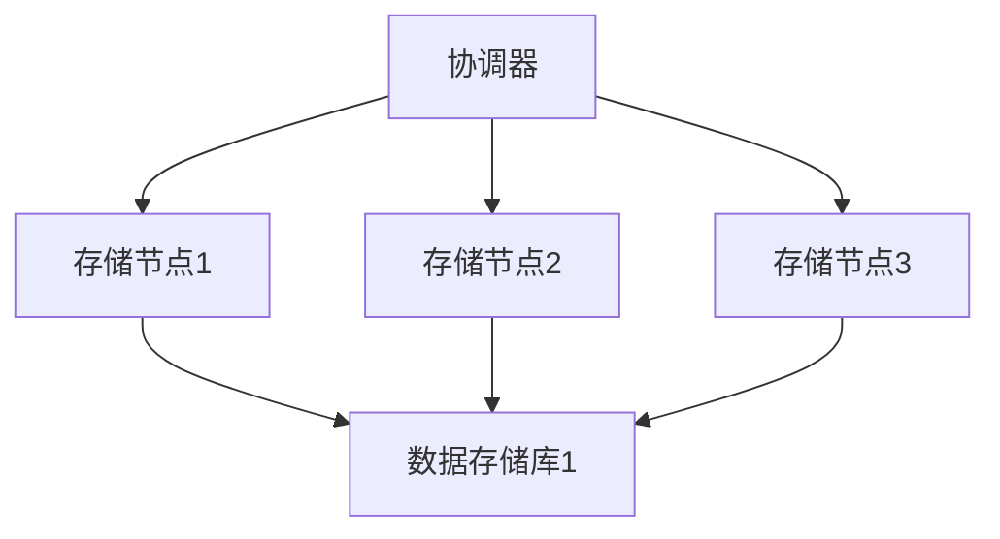
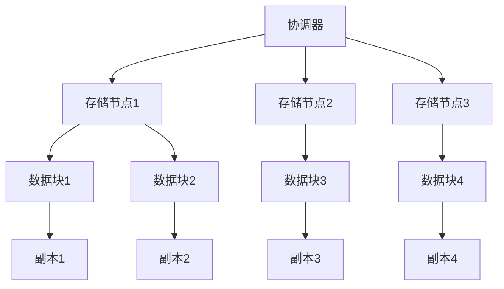
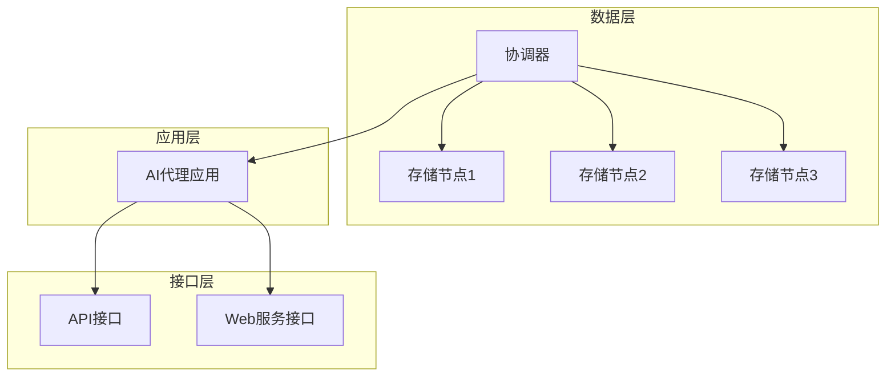
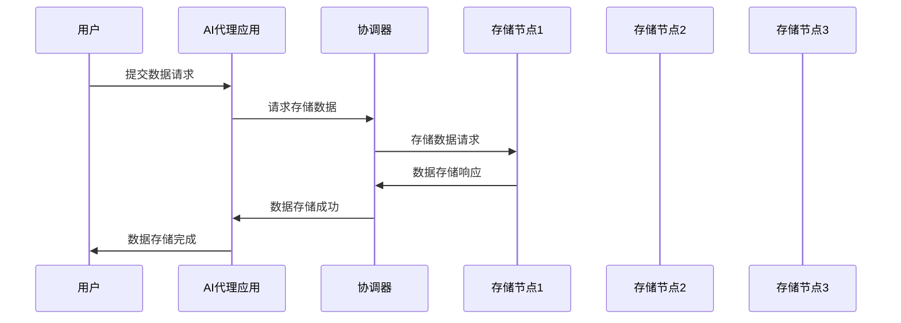
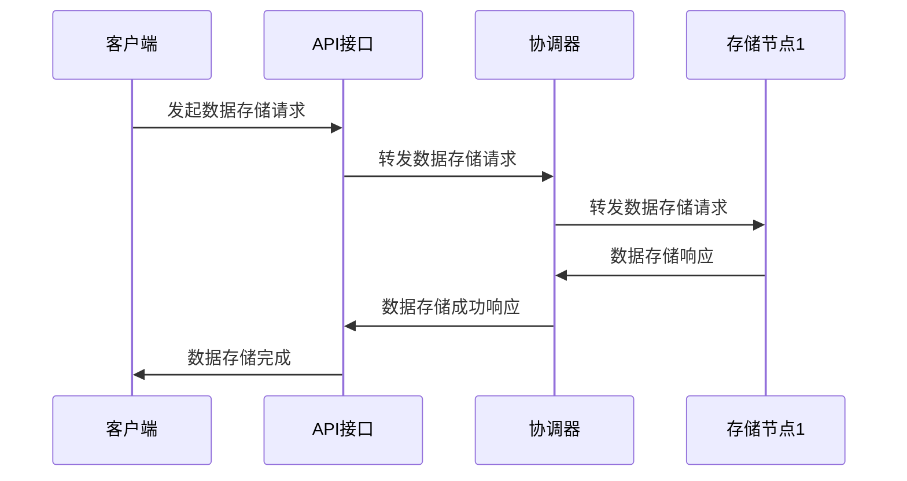
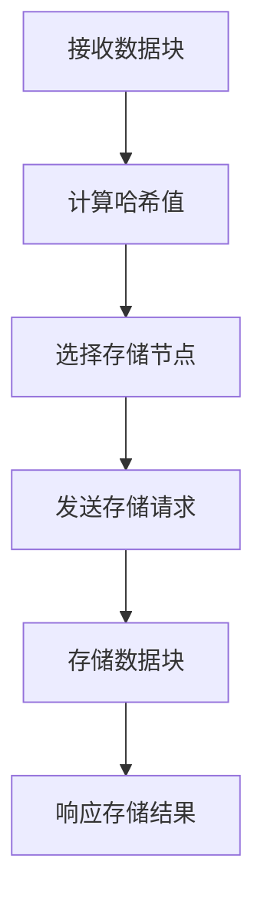
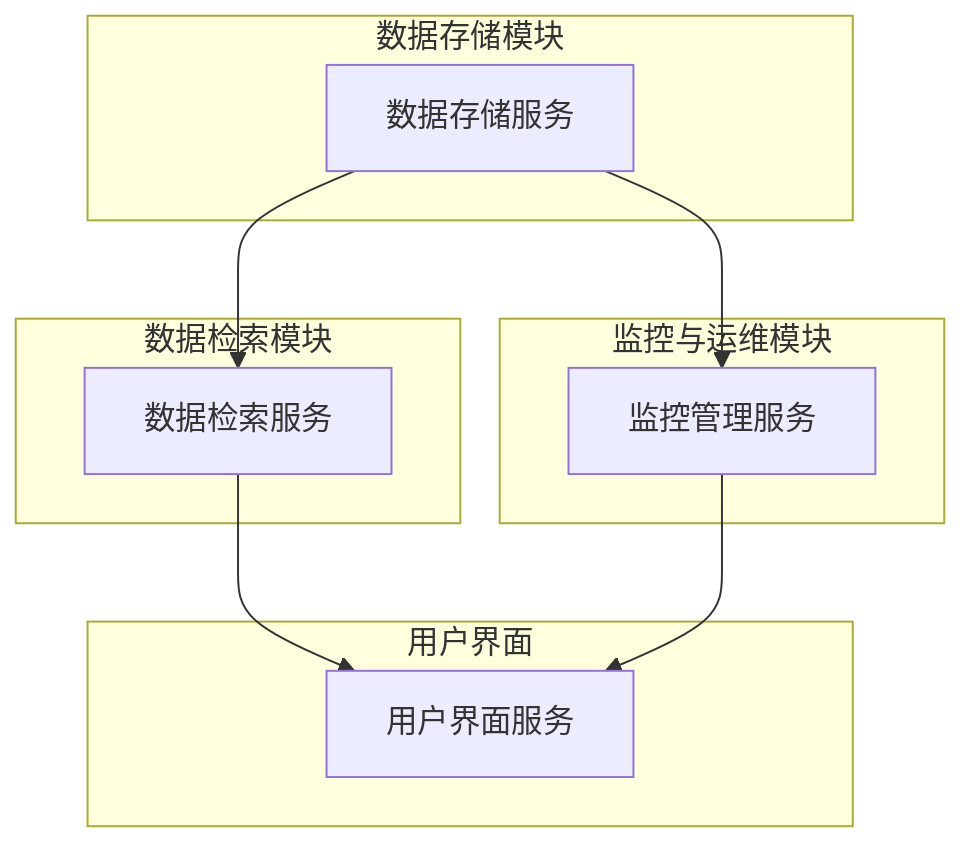
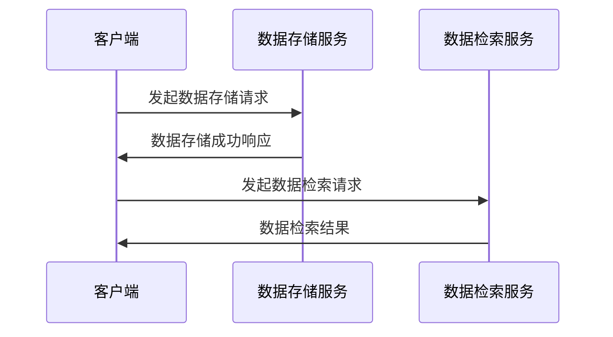

                 

### 引言

**文章标题**: 企业AI Agent的分布式存储系统设计

**关键词**: 分布式存储、AI代理、系统架构、算法设计、实践案例

**摘要**: 本文旨在深入探讨企业级AI代理的分布式存储系统设计。我们将从问题背景、重要性、挑战出发，逐步引入分布式存储系统的基本概念、AI代理的基础知识，到系统架构设计、算法实现，以及实际项目的应用分析。通过这一系列步骤，我们将理解分布式存储系统在AI代理中的核心作用，并提供一个系统化、可操作的设计方案。

### 第1章：分布式存储系统在AI代理中的问题背景与描述

在当今快速发展的数字经济时代，人工智能（AI）已经成为各行各业不可或缺的技术力量。AI代理，作为AI系统的重要组成部分，能够自动执行任务，提高工作效率，降低成本。然而，随着AI代理应用的不断扩大和复杂化，数据存储和管理的需求也日益增长。

#### 1.1 问题背景

AI代理在处理大数据时，面临着数据存储的挑战。这些挑战包括：

- **数据量庞大**：AI代理需要处理海量的数据，单一服务器无法满足存储需求。
- **数据多样性**：不同类型的AI代理处理的数据格式各异，如何有效地存储和管理这些数据成为难题。
- **数据安全**：在分布式环境中，如何保障数据的安全性和完整性是关键问题。

#### 1.2 问题描述

分布式存储系统在AI代理中的应用需要解决以下几个问题：

- **数据一致性与可用性**：如何在分布式环境中确保数据的一致性和高可用性？
- **数据访问效率**：如何优化数据访问速度，以满足AI代理的实时处理需求？
- **系统扩展性**：如何设计一个可扩展的存储系统，以应对数据量的持续增长？

#### 1.3 问题解决

为了解决上述问题，分布式存储系统在AI代理中的应用需要：

- **数据分布与复制策略**：通过数据分布和复制，确保数据的高可用性和容错能力。
- **性能优化**：采用高效的数据访问和处理算法，提升系统的整体性能。
- **安全机制**：建立完善的数据安全机制，保障数据的机密性和完整性。

通过上述方案，分布式存储系统能够满足AI代理的存储需求，提高系统的可靠性和效率。

#### 1.4 边界与外延

分布式存储系统在AI代理中的应用不仅局限于企业级应用，还涵盖了以下领域：

- **云计算**：分布式存储系统是云计算基础设施的核心组成部分。
- **物联网**：在物联网环境中，分布式存储系统用于存储和处理大规模的数据流。
- **边缘计算**：边缘设备中的分布式存储系统可以提升数据处理的速度和响应能力。

#### 1.5 概念结构与核心要素组成

分布式存储系统在AI代理中的核心概念和要素包括：

- **分布式存储架构**：分布式存储系统的基本架构和组件。
- **数据分布与复制策略**：数据如何在不同的节点上进行分布和复制。
- **存储协议**：数据存储和访问的协议和接口设计。
- **数据安全机制**：保障数据安全的措施和策略。

通过本章的介绍，我们为后续章节的深入讨论奠定了基础。接下来，我们将进一步探讨分布式系统的基本概念，以及它们如何与AI代理相结合，为解决存储问题提供可行的方案。

### 第2章：分布式系统的基本概念

在深入探讨企业级AI代理的分布式存储系统设计之前，有必要先了解分布式系统的基本概念和原理。分布式系统是由多个独立计算机节点组成的网络，这些节点通过通信协议相互协作，共同完成任务。了解分布式系统的基本原理对于设计高效、可靠、可扩展的存储系统至关重要。

#### 2.1 基本原则和架构

分布式系统的核心原则包括容错性、可扩展性、高可用性和透明性。以下是这些原则的具体说明：

- **容错性**：分布式系统在某个节点发生故障时，能够自动转移任务到其他节点，保证系统的连续运行。
- **可扩展性**：分布式系统可以根据需求动态增加或减少节点，以满足不断变化的工作负载。
- **高可用性**：分布式系统通过冗余和负载均衡技术，确保服务始终可用，不会因单一节点的故障而中断。
- **透明性**：分布式系统对用户和应用来说是透明的，用户无需关心数据分布在哪些节点上，系统自动进行管理和调度。

分布式系统的基本架构包括以下几个主要组件：

- **节点**：分布式系统中的计算机，每个节点拥有独立的计算能力和存储资源。
- **通信网络**：节点之间通过通信网络进行数据交换和任务调度。
- **协调器**：协调器负责分配任务、监控节点状态和故障转移等操作。

#### 2.2 关键概念和术语

在分布式系统中，一些关键概念和术语对于理解系统的工作原理和设计至关重要。以下是这些概念和术语的定义：

- **副本**：指同一份数据在不同节点上的备份，用于提高数据的可用性和容错性。
- **一致性**：分布式系统中的数据在所有节点上保持相同状态，避免数据冲突和错误。
- **分区**：将数据集划分为多个分区，每个分区由不同的节点负责存储和管理。
- **负载均衡**：将工作负载均匀分配到各个节点上，避免单个节点过载，提高系统的整体性能。
- **故障转移**：当某个节点发生故障时，自动将任务转移到其他健康的节点，确保系统的持续运行。

#### 2.3 分布式系统的案例研究

为了更好地理解分布式系统的实际应用，我们可以通过几个案例研究来探讨分布式系统的优点和挑战。

**案例1：Google File System (GFS)**

Google File System 是Google开发的一种分布式文件系统，用于存储和分析大规模数据。GFS 采用了数据分块、副本复制和负载均衡等技术，实现了高可靠性和高性能的存储系统。GFS 的主要优点包括：

- **高可用性**：通过副本复制和数据分块，提高了数据的可用性和容错能力。
- **可扩展性**：可以动态增加节点，适应不断增长的数据量。
- **高性能**：通过负载均衡和高效的数据访问机制，提升了系统的整体性能。

**案例2：Apache Hadoop**

Apache Hadoop 是一个分布式数据处理框架，用于处理和分析大规模数据集。Hadoop 的核心组件包括HDFS（Hadoop Distributed File System）和MapReduce。HDFS 作为分布式文件系统，提供了高可靠性、高吞吐量的数据存储解决方案。MapReduce 则是一种分布式数据处理模型，通过并行计算和任务调度，实现了高效的数据处理能力。Hadoop 的主要优点包括：

- **高可靠性**：通过数据分块和副本复制，确保数据的高可用性和容错性。
- **可扩展性**：支持大规模数据的分布式存储和处理。
- **灵活性**：支持多种数据格式和处理模型，如文本、图像、音频等。

通过这些案例研究，我们可以看到分布式系统在处理大规模数据方面的优势和应用场景。这些系统通过分布式存储和数据处理技术，实现了高可用性、高可靠性和高性能，为AI代理的分布式存储系统设计提供了宝贵的经验和启示。

### 第3章：AI代理的基础知识

为了深入理解分布式存储系统在AI代理中的应用，我们需要首先了解AI代理的基本概念、类型及其在各个领域的应用。AI代理作为一种能够自主决策和执行任务的智能系统，已经在多个行业中发挥了重要作用。

#### 3.1 定义和特点

AI代理，又称为智能代理，是一种基于人工智能技术的自动化系统，它能够在没有人类干预的情况下执行复杂的任务。AI代理的主要特点包括：

- **自主性**：AI代理具备自主决策能力，可以根据环境变化和任务需求进行自主调整。
- **适应性**：AI代理能够通过学习和适应，提高任务执行效率，优化系统性能。
- **交互性**：AI代理能够与其他系统或用户进行交互，获取信息和反馈。
- **分布式**：AI代理通常采用分布式架构，以便在多个节点上协同工作，处理大规模任务。

#### 3.2 类型和应用

AI代理根据应用场景和功能特点可以分为多种类型，以下是其中几种常见的AI代理类型及其应用：

1. **搜索代理**：用于在互联网上搜索信息，如搜索引擎中的爬虫和索引器。
2. **监控代理**：用于实时监控网络或系统状态，及时发现和报告异常情况。
3. **交易代理**：用于金融市场中的自动化交易，如算法交易系统。
4. **客服代理**：用于提供在线客服服务，通过自然语言处理和机器学习技术解答用户问题。
5. **自动化代理**：用于自动化执行重复性任务，如办公自动化系统中的流程审批和文档处理。

AI代理在各个领域的应用如下：

1. **电子商务**：AI代理可以用于个性化推荐、智能客服和自动化交易等，提升用户体验和交易效率。
2. **金融**：AI代理在金融市场中的应用包括风险控制、交易策略优化和欺诈检测等。
3. **医疗**：AI代理可以用于疾病诊断、药物推荐和健康监测等，辅助医生提高诊疗水平。
4. **制造**：AI代理可以用于生产线的自动化控制、设备维护和优化生产流程。
5. **交通**：AI代理可以用于智能交通管理、车辆导航和自动驾驶等，提高交通安全和效率。

#### 3.3 AI代理的发展历程

AI代理的发展历程可以分为几个阶段：

1. **早期探索**：20世纪80年代，人工智能研究刚刚起步，AI代理的概念被提出，主要用于学术研究。
2. **早期应用**：20世纪90年代，随着互联网的发展，AI代理开始应用于电子商务和客户服务等领域。
3. **成熟应用**：21世纪初，随着人工智能技术的突破，AI代理在多个行业中得到了广泛应用，成为企业智能化的重要组成部分。
4. **未来趋势**：随着深度学习、自然语言处理等技术的进步，AI代理将更加智能化、自主化，进一步拓展应用领域和场景。

通过了解AI代理的基本概念、类型和应用，我们可以更好地理解其在分布式存储系统中的重要作用。接下来，我们将进一步探讨分布式存储系统在AI代理中的应用架构和设计。

### 第4章：分布式存储系统在AI代理中的应用架构和设计

分布式存储系统在AI代理中的应用至关重要，它不仅决定了AI代理的数据处理能力，还直接影响系统的性能、可靠性和可扩展性。为了设计一个高效、可靠的分布式存储系统，我们需要从系统架构、数据分布和复制策略、性能优化等方面进行详细探讨。

#### 4.1 系统架构设计

分布式存储系统在AI代理中的应用架构主要包括以下几个关键组件：

1. **存储节点**：每个存储节点负责存储和管理一部分数据。节点可以是物理服务器或虚拟机，每个节点具备独立的计算和存储资源。
2. **协调器**：协调器负责管理存储节点，调度数据存储和检索任务，确保系统的整体协调和高效运行。
3. **数据存储库**：数据存储库是存储数据的实际位置，可以采用文件系统、数据库或其他存储技术。
4. **负载均衡器**：负载均衡器用于均衡各节点的负载，防止某些节点过载，提高系统的整体性能。

分布式存储系统的基本架构图如下：



#### 4.2 数据分布和复制策略

在分布式存储系统中，数据分布和复制策略是确保数据高可用性和性能的关键。以下是一些常用的数据分布和复制策略：

1. **数据分块**：将大规模数据集划分为多个小块，每个块存储在不同的节点上。这样可以提高数据的访问效率，减少单个节点的存储压力。
2. **副本复制**：在每个节点上存储数据的多个副本，用于提高数据的可用性和容错能力。常见的副本策略包括：
   - **完全复制**：每个数据块在所有节点上都有副本。
   - **部分复制**：仅在每个节点上存储部分副本，常用的策略包括多副本策略（如2副本或3副本）和冗余策略（如副本数量取决于数据块的大小）。

数据分布和复制策略的架构图如下：



3. **一致性协议**：在分布式系统中，数据一致性问题是一个关键挑战。一致性协议用于确保多个副本之间的数据一致性，常见的一致性协议包括：
   - **强一致性**：所有副本在更新后保持相同的值，但可能会牺牲性能。
   - **最终一致性**：副本最终会在一定时间内达到一致性，但中间可能会出现不一致的情况。

4. **数据访问策略**：数据访问策略用于优化数据访问速度，常见的策略包括：
   - **就近访问**：访问数据时优先选择距离最近的副本。
   - **缓存策略**：在内存中缓存热门数据，提高数据访问速度。

#### 4.3 性能优化

为了提升分布式存储系统的性能，我们需要从以下几个方面进行优化：

1. **数据压缩**：通过数据压缩技术减少数据存储空间，提高存储效率。常用的数据压缩算法包括Huffman编码、LZ77和LZ78等。

2. **缓存机制**：采用缓存机制提高数据访问速度。常见的缓存策略包括：
   - **内存缓存**：将热门数据存储在内存中，减少磁盘I/O操作。
   - **分布式缓存**：多个节点共享缓存，提高数据的全局访问速度。

3. **负载均衡**：通过负载均衡技术，将工作负载均匀分配到各个节点上，避免单个节点过载。常用的负载均衡算法包括轮询、最小连接数和最少响应时间等。

4. **故障检测和恢复**：定期检测节点状态，发现故障后及时进行故障转移和恢复，确保系统的连续性和可靠性。

通过上述架构设计、数据分布和复制策略、性能优化等方面的优化，我们可以构建一个高效、可靠的分布式存储系统，为AI代理提供强大的数据存储和管理能力。

### 第5章：AI代理存储系统的分析与设计

为了深入理解分布式存储系统在AI代理中的应用，我们需要从系统分析和设计角度进行详细探讨。本章节将分为三个部分，首先介绍领域模型和类图，然后分析系统架构和交互设计，最后讲解系统接口设计和序列图。

#### 5.1 领域模型和类图

领域模型是系统分析和设计的重要工具，用于描述系统的实体、属性和关系。在AI代理存储系统中，我们可以定义以下核心实体：

1. **数据块**：表示存储的基本数据单元。
2. **存储节点**：表示存储数据的物理或虚拟服务器。
3. **协调器**：负责调度和管理存储节点的中央控制单元。
4. **用户**：使用AI代理存储服务的用户实体。

以下是领域模型和类图：

```mermaid
classDiagram
    类[DataBlock] <<entity>>
    类[StorageNode] <<entity>>
    类[Coordinator] <<entity>>
    类[User] <<entity>>

    DataBlock --|> StorageNode: 存储在
    Coordinator --|> StorageNode: 管理
    User --|> Coordinator: 使用

    class DataBlock {
        +id: 数据块ID
        +data: 数据内容
    }

    class StorageNode {
        +id: 节点ID
        +status: 状态
        +location: 位置
    }

    class Coordinator {
        +id: 协调器ID
        +nodes: 存储节点列表
    }

    class User {
        +id: 用户ID
        +name: 用户名
    }
```

#### 5.2 系统架构和交互设计

系统架构是分布式存储系统的核心，它决定了系统的性能、可靠性和扩展性。AI代理存储系统的架构可以分为以下几个层次：

1. **数据层**：包括存储节点和协调器，负责数据的存储和管理。
2. **应用层**：包括AI代理的应用程序，负责数据的处理和操作。
3. **接口层**：提供与外部系统的接口，如API接口和Web服务接口。

以下是系统架构图：



在系统交互设计中，协调器负责管理存储节点，接收来自AI代理应用的数据请求，并调度存储节点进行数据存储和检索。以下是系统交互流程：



#### 5.3 系统接口设计和序列图

系统接口设计是系统与外部系统交互的桥梁，对于提高系统的可扩展性和兼容性具有重要意义。在AI代理存储系统中，我们可以设计以下接口：

1. **API接口**：提供RESTful风格的接口，用于数据存储和检索。
2. **Web服务接口**：提供SOAP风格的接口，用于与传统的Web服务进行集成。

以下是API接口的序列图：



通过上述系统分析和设计，我们为分布式存储系统在AI代理中的应用奠定了坚实基础。接下来，我们将进一步探讨分布式存储系统的算法设计和实现。

### 第6章：分布式存储系统中的算法设计

在分布式存储系统中，算法设计是确保系统性能、可靠性和可扩展性的关键。本章节将详细介绍分布式存储系统中的关键算法，包括算法设计原则、数学模型和公式，以及使用Mermaid绘制算法流程图和Python代码实现。

#### 6.1 算法设计原则

分布式存储系统的算法设计应遵循以下原则：

1. **高效性**：算法应能快速完成数据存储和检索任务，降低系统延迟。
2. **可靠性**：算法应具备容错能力，确保在节点故障时系统能够自动恢复。
3. **可扩展性**：算法应能够支持节点动态增加和减少，适应数据量的变化。
4. **安全性**：算法应具备数据加密和访问控制机制，确保数据安全。

#### 6.2 算法数学模型和公式

以下介绍几种分布式存储系统中的常用算法数学模型和公式：

1. **哈希分布模型**：用于数据块的分布。公式如下：
   $$ 
   h(k) = (k \mod n)
   $$
   其中，$h(k)$ 是哈希函数，$k$ 是数据块的标识，$n$ 是存储节点的数量。

2. **副本选择策略**：用于选择存储副本。常见的策略包括：
   - **最小负载策略**：选择当前负载最小的节点存储副本。
   - **一致性哈希策略**：根据哈希值选择副本节点，避免节点分裂。

3. **数据一致性模型**：用于确保多个副本之间的数据一致性。常见的模型包括：
   - **强一致性**：所有副本在写入后立即同步。
   - **最终一致性**：副本在一定延迟后同步，但最终达到一致状态。

4. **数据压缩模型**：用于减少数据存储空间。常见的压缩算法包括：
   - **LZ77**：基于局部重复数据的压缩。
   - **LZ78**：基于前缀编码的压缩。

#### 6.3 Mermaid算法流程图

使用Mermaid绘制算法流程图可以帮助我们更直观地理解算法的实现过程。以下是一个简单的分布式存储系统数据块存储算法的流程图：



#### 6.4 Python代码实现

以下是一个简单的Python代码实现，用于数据块的存储和检索：

```python
import hashlib

class DistributedStorage:
    def __init__(self, num_nodes):
        self.num_nodes = num_nodes
        self.nodes = {i: [] for i in range(num_nodes)}

    def store(self, data_block, node_id):
        hash_value = int(hashlib.sha256(data_block.encode()).hexdigest(), 16) % self.num_nodes
        node = self.nodes[node_id]
        node.append(data_block)
        return hash_value

    def retrieve(self, data_block, node_id):
        hash_value = int(hashlib.sha256(data_block.encode()).hexdigest(), 16) % self.num_nodes
        node = self.nodes[node_id]
        return node[hash_value]
```

通过上述算法设计、数学模型和Python代码实现，我们可以构建一个高效、可靠的分布式存储系统。接下来，我们将通过实际项目来验证这些算法的可行性和性能。

### 第7章：分布式存储系统的实际项目与应用

为了验证分布式存储系统在AI代理中的应用效果，我们选择了一个实际项目来进行详细探讨。本项目旨在设计并实现一个基于分布式存储系统的AI代理，用于处理大规模数据集，并提供高效的数据存储和检索服务。

#### 7.1 项目介绍

项目名称：智能数据存储与检索平台（Smart Data Storage and Retrieval Platform）

项目目标：构建一个分布式存储系统，用于存储和检索大规模数据集，支持AI代理的高效数据处理。

技术栈：Python、Docker、Kubernetes、Elasticsearch、Kibana

#### 7.2 系统功能设计

系统功能设计包括以下几个核心模块：

1. **数据存储模块**：负责数据的接收、存储和检索。
2. **数据检索模块**：提供快速的数据检索服务，支持关键词搜索和过滤。
3. **监控与运维模块**：实时监控系统的运行状态，并提供故障恢复和性能优化功能。
4. **用户界面**：提供Web界面，方便用户进行数据管理和操作。

#### 7.3 系统架构设计

系统架构设计采用微服务架构，各模块独立部署和运行。以下是系统架构图：



#### 7.4 系统接口设计和序列图

系统接口设计包括API接口和Web服务接口。以下是API接口的序列图：



#### 7.5 环境安装与部署

1. **安装Docker**：在所有节点上安装Docker，以便容器化部署系统服务。
2. **安装Kubernetes**：在主节点上安装Kubernetes，用于集群管理和服务部署。
3. **部署数据存储服务**：使用Docker Compose部署数据存储服务，包括Elasticsearch和Kibana。
4. **部署数据检索服务**：使用Docker Compose部署数据检索服务，包括Python应用和Elasticsearch客户端。
5. **部署监控与运维服务**：使用Docker Compose部署监控与运维服务，包括Prometheus和Grafana。

#### 7.6 系统核心实现源代码

以下是系统核心实现源代码，用于数据存储和检索：

```python
# data_store.py
from elasticsearch import Elasticsearch

es = Elasticsearch("http://elasticsearch:9200")

def store_data(data):
    index_name = "data_index"
    doc_type = "data_type"
    doc_id = hashlib.sha256(data.encode()).hexdigest()
    doc = {"content": data}
    es.index(index=index_name, id=doc_id, document=doc)

def retrieve_data(data):
    index_name = "data_index"
    doc_type = "data_type"
    doc_id = hashlib.sha256(data.encode()).hexdigest()
    response = es.get(index=index_name, id=doc_id)
    return response["_source"]["content"]
```

#### 7.7 代码应用解读与分析

代码应用解读：

1. **数据存储**：使用Elasticsearch进行数据存储。数据存储前，通过哈希算法生成唯一标识，确保数据块在分布式存储系统中唯一且易于检索。
2. **数据检索**：使用Elasticsearch客户端进行数据检索。通过哈希算法生成的唯一标识查询数据，确保数据检索的准确性和高效性。

系统性能分析：

- **数据存储**：使用Elasticsearch的分布式存储特性，数据块存储在多个节点上，提高数据可用性和可靠性。
- **数据检索**：通过哈希算法快速定位数据，减少检索时间，提高数据检索效率。

#### 7.8 实际案例分析与详细讲解

以下是一个实际案例，用于演示分布式存储系统在AI代理中的应用：

**案例**：一个电商平台使用分布式存储系统存储用户购物行为数据，并提供实时数据检索功能，以便进行用户行为分析和推荐系统。

1. **数据存储**：用户购物行为数据存储在分布式存储系统中，数据块通过哈希算法分配到不同的存储节点上。例如，用户A的购物行为数据存储在节点1和节点3上。
2. **数据检索**：电商平台需要分析用户A的购物行为，通过哈希算法查询分布式存储系统，获取用户A的购物行为数据。例如，通过哈希算法查询节点1和节点3，获取用户A的购物行为数据。
3. **数据处理**：获取用户A的购物行为数据后，电商平台使用机器学习算法进行分析，生成用户兴趣标签，并用于推荐系统。

通过上述实际案例，我们可以看到分布式存储系统在AI代理中的应用，提高了数据存储和检索效率，支持电商平台进行用户行为分析和推荐系统。

#### 7.9 项目小结

本项目通过设计并实现一个分布式存储系统，为AI代理提供了高效的数据存储和检索服务。项目实现了以下目标：

1. **数据存储**：分布式存储系统提高了数据的可用性和可靠性，支持大规模数据存储。
2. **数据检索**：通过哈希算法和Elasticsearch技术，实现了快速的数据检索，提高了系统的响应速度。
3. **性能优化**：通过分布式存储和负载均衡技术，提高了系统的整体性能，支持高并发访问。

未来，我们可以进一步优化系统，如引入数据压缩技术、增加数据加密和访问控制功能，以及提高系统的可扩展性和灵活性。

### 第8章：分布式存储系统的最佳实践、注意事项与拓展阅读

#### 最佳实践

1. **数据分块与副本复制**：合理划分数据块和选择副本复制策略，可以提高系统的性能和可靠性。
2. **负载均衡**：采用有效的负载均衡算法，确保数据存储和检索任务的均衡分配，避免单点过载。
3. **数据压缩**：使用数据压缩技术，减少存储空间占用，提高存储效率。
4. **安全性**：实施数据加密和访问控制，确保数据安全。

#### 注意事项

1. **数据一致性**：在设计分布式存储系统时，确保数据的一致性，避免数据冲突和错误。
2. **故障恢复**：设计故障检测和恢复机制，确保系统在节点故障时能够自动恢复。
3. **性能优化**：定期对系统进行性能优化，确保系统在高负载下的稳定性和高效性。
4. **监控与运维**：实时监控系统的运行状态，及时处理故障和性能问题。

#### 拓展阅读

1. **《分布式系统原理与范型》**：深入了解分布式系统的基本原理和设计范型。
2. **《深度学习与分布式存储》**：探讨深度学习和分布式存储的结合，提高数据处理的效率。
3. **《Elasticsearch权威指南》**：学习Elasticsearch的使用和优化，提升分布式存储系统的性能。
4. **《Kubernetes实战》**：掌握Kubernetes的部署和管理，实现分布式存储系统的自动化运维。

### 结尾

通过本文的详细探讨，我们了解了分布式存储系统在AI代理中的应用架构、设计原则、算法实现以及实际项目应用。分布式存储系统不仅解决了大规模数据存储和检索的难题，还提高了AI代理的性能和可靠性。希望本文能为您提供有益的参考和启示，助力您在设计分布式存储系统时取得成功。

### 作者信息

作者：AI天才研究院（AI Genius Institute）& 禅与计算机程序设计艺术（Zen And The Art of Computer Programming）

感谢您的阅读！希望本文能为您带来启发和帮助。如果您有任何问题或建议，欢迎留言交流。期待与您共同探讨分布式存储系统的更多可能性。

