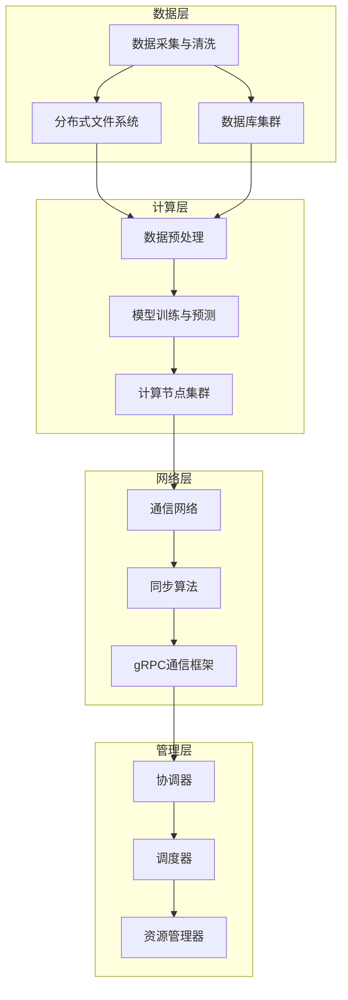

                 

### 引言：企业AI Agent的分布式学习框架

随着人工智能（AI）技术的飞速发展，企业对AI应用的需求日益增长。AI Agent作为一种智能体，能够自主地完成复杂任务，为企业和个人提供智能化服务。然而，在处理大规模数据和复杂任务时，传统的集中式学习方法逐渐暴露出计算资源限制、数据同步延迟等问题。因此，分布式学习框架应运而生，旨在解决这些瓶颈，提高AI Agent的性能和效率。

**关键词**：企业AI Agent、分布式学习、框架、性能优化

**摘要**：

本文旨在探讨企业AI Agent的分布式学习框架，详细介绍其概念、重要性、架构设计以及实现方法。文章分为九个章节，首先介绍企业AI Agent的基础知识，随后深入探讨分布式学习的原理和优势，逐步构建起分布式学习框架的架构设计。通过核心技术的解析，详细描述了分布式学习框架的构建过程和关键实现技术。接着，通过实际案例分析和项目实战，展示了分布式学习框架的应用场景和实际效果。最后，探讨了分布式学习框架的先进技术和发展趋势，为未来的研究和应用提供了方向。通过这篇文章，读者可以全面了解企业AI Agent分布式学习框架的理论和实践，为其在企业和AI领域的广泛应用奠定基础。

### 摘要

本文旨在深入探讨企业AI Agent的分布式学习框架，详细阐述其核心概念、架构设计、关键技术以及实际应用。首先，本文介绍了AI Agent的基本概念、分类及其在企业中的应用，奠定了后续讨论的基础。接着，文章探讨了分布式学习的原理，分析了其在AI Agent学习中的优势与挑战，并与集中式学习方法进行了对比。在此基础上，文章详细描述了分布式学习框架的架构设计，包括组件、系统架构以及性能优化策略，为分布式学习框架的构建提供了理论依据。

核心技术的解析是文章的重点部分，本文详细介绍了数据并行、模型并行和混合并行等分布式学习的关键技术，并通过Python代码和Mermaid流程图详细阐述了这些技术的实现原理和步骤。在实现细节部分，文章提供了构建分布式学习框架的详细步骤，从环境设置到核心实现技术，使得读者能够清晰地理解分布式学习框架的实现过程。

实际案例分析和项目实战部分，通过具体的应用场景展示了分布式学习框架的强大能力和实际效果。文章最后探讨了分布式学习框架的先进技术和发展趋势，包括先进算法、伦理问题和未来发展方向，为读者提供了对分布式学习框架的全面理解和未来应用的思考。

通过本文，读者可以系统地了解企业AI Agent分布式学习框架的理论和实践，掌握其核心技术和实现方法，为在实际工作中应用分布式学习框架提供指导和参考。

### 第一部分：企业AI Agent的基础知识

#### 1.1 AI Agent的定义和分类

AI Agent，即人工智能代理，是指能够自主地感知环境、制定决策并采取行动的人工智能实体。AI Agent具备以下几个核心特点：

1. **自主性**：AI Agent能够独立完成任务，无需人工干预。
2. **适应性**：AI Agent能够根据环境和任务的变化调整其行为策略。
3. **交互性**：AI Agent能够与环境和用户进行交互，获取反馈并优化自身行为。

根据功能和实现方式，AI Agent可以分为以下几类：

1. **基于规则的Agent**：这类Agent通过预定义的规则进行决策，适用于任务明确、环境相对静态的场景。
2. **基于模型的Agent**：这类Agent利用机器学习模型进行决策，具有更高的灵活性和适应性。
3. **混合型Agent**：这类Agent结合了规则和模型，能够在不同场景下灵活切换决策方式。

#### 1.2 AI Agent在企业中的应用

AI Agent在企业中的应用场景广泛，主要包括：

1. **客户服务**：利用自然语言处理技术，AI Agent可以为企业提供24/7的智能客服服务，提高客户满意度。
2. **供应链管理**：AI Agent能够实时分析供应链数据，优化库存管理、运输调度等流程，降低运营成本。
3. **销售预测**：AI Agent通过分析历史销售数据和市场趋势，帮助企业进行精准销售预测和产品推荐。
4. **风险控制**：AI Agent能够监控企业运营中的潜在风险，提供及时的预警和应对策略。

#### 1.3 AI Agent的发展历程

AI Agent的发展可以追溯到人工智能的早期研究。以下是其主要发展历程：

1. **1956年**：人工智能概念提出，标志着AI研究正式开始。
2. **1970-1980年代**：专家系统和基于规则的AI Agent成为研究热点。
3. **1980年代末-1990年代初**：机器学习技术逐渐成熟，AI Agent开始利用机器学习模型进行决策。
4. **2000年代**：深度学习和强化学习技术的发展，使AI Agent在复杂任务上的表现显著提升。
5. **2010年代至今**：AI Agent逐渐在各个行业得到广泛应用，实现了从理论研究到实际应用的转化。

#### 1.4 AI Agent的关键特性与功能

AI Agent的关键特性包括：

1. **感知能力**：AI Agent能够通过传感器获取环境信息，如文本、图像、声音等。
2. **决策能力**：AI Agent能够根据感知到的信息，利用机器学习模型或其他算法进行决策。
3. **行动能力**：AI Agent能够根据决策结果，执行相应的行动，如发送消息、执行命令等。

AI Agent的主要功能包括：

1. **任务自动化**：AI Agent能够自动执行复杂任务，提高工作效率。
2. **智能交互**：AI Agent能够与用户进行自然语言交互，提供个性化服务。
3. **数据挖掘**：AI Agent能够从海量数据中提取有价值的信息，辅助企业决策。
4. **异常检测**：AI Agent能够实时监控企业运营数据，检测并预警潜在风险。

#### 1.5 AI Agent的边界与外延

AI Agent的边界主要在于其自主性和智能水平。尽管AI Agent在许多场景下表现出强大的能力，但仍然存在以下局限性：

1. **数据依赖**：AI Agent的性能依赖于数据质量和数量，缺乏足够数据的场景下效果有限。
2. **算法限制**：AI Agent的决策能力受限于现有算法和模型，无法应对所有复杂问题。
3. **伦理问题**：AI Agent在处理敏感数据和做出决策时，可能涉及伦理和隐私问题。

AI Agent的外延包括：

1. **跨领域应用**：AI Agent不仅限于单一行业或场景，可以在多个领域实现应用。
2. **人机协作**：AI Agent可以与人类协作，共同完成任务，提高整体效率。
3. **持续进化**：随着技术的不断进步，AI Agent将具有更高的自主性和智能水平。

#### 1.6 AI Agent的概念结构与核心要素

AI Agent的概念结构主要包括以下几个核心要素：

1. **感知模块**：负责感知环境信息，如传感器、摄像头等。
2. **决策模块**：负责处理感知信息，利用机器学习模型或其他算法进行决策。
3. **行动模块**：负责执行决策结果，如执行命令、发送消息等。
4. **反馈模块**：负责获取环境反馈，用于优化决策过程。

AI Agent的核心要素包括：

1. **数据**：AI Agent的运行依赖于大量高质量的数据。
2. **算法**：AI Agent的决策能力依赖于先进的算法和模型。
3. **计算资源**：AI Agent的运行需要足够的计算资源支持。
4. **交互接口**：AI Agent需要与用户和系统进行有效的交互。

通过上述分析，我们可以看出，AI Agent作为一种智能体，具备自主性、适应性和交互性等关键特性，在企业中的应用场景广泛，发展历程丰富。理解AI Agent的基本概念、分类和应用，有助于我们更好地构建分布式学习框架，为AI Agent的智能化应用提供有力支持。

### 分布式学习的基本概念

#### 2.1 分布式学习的定义

分布式学习（Distributed Learning）是一种在多个计算节点上并行进行机器学习训练的方法。其核心思想是将大规模数据和复杂的计算任务分解到多个节点上，通过协同工作来提高训练效率和性能。与传统集中式学习相比，分布式学习具有显著的计算资源利用率优势，能够在保持模型精度的同时，大幅缩短训练时间。

#### 2.2 分布式学习的主要特点

分布式学习具备以下几个主要特点：

1. **并行计算**：分布式学习通过将计算任务分布在多个节点上，实现并行计算，从而显著提高训练速度。
2. **可扩展性**：分布式学习能够轻松扩展到更多节点，以应对更大规模的数据和更复杂的模型。
3. **容错性**：分布式学习通过多个节点协同工作，可以在节点故障时保持系统的稳定性和可靠性。
4. **资源利用率**：分布式学习能够充分利用多个节点的计算资源，提高整体计算效率。

#### 2.3 分布式学习的优势

分布式学习相较于集中式学习具有以下优势：

1. **计算性能提升**：分布式学习能够通过并行计算，将单机训练时间缩短至原来的几分之一甚至更少。
2. **资源利用率提高**：分布式学习充分利用了多台计算机的计算资源，避免了单机资源瓶颈。
3. **扩展性增强**：分布式学习能够轻松扩展到更多节点，支持大规模数据集和复杂模型的训练。
4. **容错性和鲁棒性**：分布式学习通过多个节点的协同工作，提高了系统的容错性和鲁棒性。

#### 2.4 分布式学习的挑战

尽管分布式学习具有显著的优势，但在实际应用中也面临一些挑战：

1. **通信开销**：分布式学习需要节点间频繁通信，通信开销可能会影响训练效率。
2. **数据同步**：分布式学习需要确保多个节点上的数据同步，避免数据不一致性问题。
3. **负载均衡**：分布式学习需要合理分配计算任务，确保所有节点都能够充分利用资源。
4. **容错机制**：分布式学习需要建立有效的容错机制，以应对节点故障和计算错误。

#### 2.5 分布式学习与集中式学习的对比

分布式学习与集中式学习在多个方面存在显著差异，如下表所示：

| 对比维度 | 分布式学习 | 集中式学习 |
| --- | --- | --- |
| 计算方式 | 并行计算 | 串行计算 |
| 资源利用率 | 高 | 低 |
| 扩展性 | 强 | 弱 |
| 容错性 | 强 | 弱 |
| 训练速度 | 快 | 慢 |
| 数据同步 | 复杂 | 简单 |
| 通信开销 | 大 | 小 |

通过上述分析，我们可以看出，分布式学习在计算性能、资源利用、扩展性和容错性等方面具有显著优势，但也面临通信开销、数据同步和负载均衡等挑战。了解这些基本概念和特点，有助于我们在设计和应用分布式学习框架时，做出更为合理和有效的决策。

### 分布式学习框架的架构设计

#### 3.1 框架组件

分布式学习框架的架构设计通常包括以下几个关键组件：

1. **计算节点（Computational Nodes）**：计算节点是分布式系统中的基本计算单元，负责执行计算任务。每个节点可以独立运行模型训练算法，并与其他节点协同工作。
2. **数据存储（Data Storage）**：数据存储用于存储训练数据、模型参数和中间结果。数据存储可以是分布式文件系统，如HDFS，也可以是NoSQL数据库，如MongoDB。
3. **通信网络（Communication Network）**：通信网络连接各个计算节点，负责数据传输和同步。通信网络可以是局域网（LAN）或广域网（WAN），采用TCP/IP或MPI等通信协议。
4. **协调器（Coordinator）**：协调器是分布式系统的核心，负责任务分配、数据同步和资源管理。常见的协调器实现有参数服务器（Parameter Server）和分布式内存（Distributed Memory）。
5. **调度器（Scheduler）**：调度器负责计算任务的调度和负载均衡，确保每个节点都能够充分利用资源。调度器可以根据节点负载和任务需求动态调整计算任务。

#### 3.2 系统架构设计

分布式学习框架的系统架构设计通常分为以下几个层次：

1. **数据层**：数据层负责数据存储和管理，包括数据采集、清洗、存储和访问。数据层可以是单层结构，也可以是多层结构，如分布式文件系统、数据库集群等。
2. **计算层**：计算层负责数据预处理、模型训练和预测计算。计算层通常采用分布式计算框架，如TensorFlow、PyTorch等，实现并行计算和任务调度。
3. **网络层**：网络层负责节点间的通信和数据同步。网络层采用分布式通信协议和算法，如AllReduce、gRPC等，确保数据高效传输和同步。
4. **管理层**：管理层负责资源管理、任务调度和容错处理。管理层包括协调器、调度器和其他管理组件，实现分布式系统的协调和优化。

#### 3.3 可扩展性和性能优化

分布式学习框架的架构设计需要考虑可扩展性和性能优化，以下是一些关键技术：

1. **水平扩展**：分布式学习框架通过增加计算节点和存储节点，实现系统水平扩展。水平扩展可以线性提高计算性能和存储容量。
2. **垂直扩展**：分布式学习框架通过提高节点计算能力和存储容量，实现系统垂直扩展。垂直扩展可以在现有硬件资源下提高系统性能。
3. **负载均衡**：分布式学习框架采用负载均衡算法，根据节点负载和任务需求，动态分配计算任务。负载均衡可以避免节点过载和资源浪费。
4. **数据分区**：分布式学习框架将大规模数据集分区存储和计算，减少数据传输和同步开销。数据分区可以提高系统并行度和性能。
5. **缓存机制**：分布式学习框架采用缓存机制，存储频繁访问的数据和模型参数，减少数据访问延迟和I/O开销。
6. **异步通信**：分布式学习框架采用异步通信方式，减少同步通信开销和节点阻塞。异步通信可以提高系统并行度和响应速度。

#### 3.4 架构图示例

以下是一个典型的分布式学习框架的架构图示例：



通过上述架构设计，分布式学习框架可以高效地处理大规模数据集和复杂模型，实现并行计算和协同工作，提高计算性能和资源利用率。

### 分布式学习框架中的核心技术

在分布式学习框架中，核心技术的选择和实现对于系统性能和效率具有决定性作用。分布式学习的关键技术主要包括数据并行、模型并行和混合并行等。以下将详细阐述这些技术的基本概念、实现方式和应用场景。

#### 5.1 数据并行

数据并行（Data Parallelism）是一种分布式训练的基本方法，其核心思想是将训练数据集分成多个子集，每个子集被分配给不同的计算节点进行独立训练，每个节点更新自己的模型参数。训练完成后，各节点将更新后的参数汇总到全局参数。数据并行能够显著提高训练速度，尤其是在大规模数据集上表现尤为明显。

**基本概念：**
- **数据划分**：将大规模数据集划分成多个子集，每个子集大小与计算节点数相匹配。
- **节点训练**：各计算节点独立训练子集数据，更新局部模型参数。
- **参数汇总**：各节点将更新后的局部参数汇总到全局参数，通过参数服务器或梯度聚合算法实现。

**实现方式：**
1. **参数服务器（Parameter Server）**：在参数服务器模型中，参数存储在一个中心服务器上，各计算节点从服务器获取初始参数，独立训练并更新参数，然后发送更新后的参数给服务器。
2. **梯度聚合**：各节点计算梯度，将局部梯度汇总到全局梯度，更新全局参数。

**应用场景：**
- **大规模图像识别**：例如，在训练大型图像分类模型时，可以将数据集划分为多个子集，各节点独立训练，从而提高训练速度。
- **文本分类**：在大规模文本数据分类任务中，数据并行能够有效减少训练时间。

**优缺点：**
- **优点**：实现简单，容易扩展，适用于大规模数据集。
- **缺点**：各节点训练独立，可能导致模型性能差异，需要同步机制。

#### 5.2 模型并行

模型并行（Model Parallelism）是一种将大模型分解成多个子模型，并在不同计算节点上独立训练的方法。模型并行能够解决单节点无法容纳大模型参数的问题，通过分布式训练实现复杂模型的训练。

**基本概念：**
- **模型划分**：将大模型分解为多个子模型，每个子模型被分配到不同的计算节点。
- **节点训练**：各计算节点独立训练子模型，更新局部模型参数。
- **参数同步**：各节点将更新后的局部参数同步到全局参数。

**实现方式：**
1. **子模型分布式训练**：将大模型拆分为多个子模型，各节点独立训练子模型，子模型间通过参数共享进行同步。
2. **层次化模型训练**：先训练低层次子模型，再逐渐合并更高层次子模型，逐步训练整个模型。

**应用场景：**
- **深度神经网络**：适用于训练包含数百万甚至数十亿参数的深度神经网络。
- **自然语言处理**：在训练大规模语言模型时，可以将模型拆分为多个子模型，分别训练。

**优缺点：**
- **优点**：适用于大模型训练，能够提高训练速度。
- **缺点**：实现复杂，需要解决跨子模型的数据同步和通信问题。

#### 5.3 混合并行

混合并行（Hybrid Parallelism）是结合数据并行和模型并行的分布式训练方法，旨在充分利用数据并行和模型并行的优势，提高训练效率和系统性能。

**基本概念：**
- **混合划分**：将数据集和模型同时进行划分，实现数据并行和模型并行的结合。
- **节点协同**：各计算节点既独立训练数据子集，也协同训练模型子集。

**实现方式：**
1. **双通道训练**：同时采用数据并行和模型并行的策略，分别训练数据子集和模型子集。
2. **动态调整**：根据训练过程中出现的问题，动态调整数据划分和模型划分，优化训练效果。

**应用场景：**
- **多任务学习**：在训练包含多个任务的模型时，可以同时利用数据并行和模型并行，提高训练效率和模型性能。
- **跨平台训练**：在大规模集群和云计算平台上，混合并行能够充分利用不同类型的计算资源，实现高效训练。

**优缺点：**
- **优点**：结合了数据并行和模型并行的优势，适用于多种训练场景。
- **缺点**：实现复杂，需要平衡数据并行和模型并行的关系。

通过上述对数据并行、模型并行和混合并行的介绍，我们可以看到，这些分布式训练技术各有优缺点，适用于不同的应用场景。在实际应用中，根据具体任务需求和计算资源，合理选择和组合这些技术，可以实现高效的分布式训练，提升AI Agent的性能和效率。

### 实现分布式学习框架的具体步骤

#### 6.1 环境搭建

要在实际项目中实现分布式学习框架，首先需要搭建合适的环境。以下是搭建分布式学习框架环境的详细步骤：

1. **选择计算节点**：根据任务需求和资源情况，选择合适的计算节点。可以选择单机多节点，也可以选择分布式集群。例如，使用Docker容器技术部署计算节点。

2. **安装分布式学习框架**：常用的分布式学习框架包括TensorFlow、PyTorch等。以TensorFlow为例，可以在每个计算节点上安装TensorFlow分布式计算包。以下是在Ubuntu系统上安装TensorFlow的命令：

    ```bash
    pip install tensorflow==2.7
    ```

3. **配置环境变量**：确保每个节点上的环境变量配置一致，包括Python环境、TensorFlow库和其他依赖库。例如，设置Python环境变量：

    ```bash
    export PATH=$PATH:/path/to/python
    ```

4. **设置网络通信**：确保节点间可以通过网络通信，可以使用SSH密钥认证简化访问控制。例如，使用`ssh-copy-id`命令将公钥复制到其他节点。

5. **配置协调器**：在分布式系统中，需要一个协调器（Coordinator）负责任务分配和参数同步。可以使用TensorFlow的`tf.distribute.experimental.ParameterServerStrategy`进行配置。以下是一个示例配置：

    ```python
    strategy = tf.distribute.experimental.ParameterServerStrategy(num_workers=4)
    ```

6. **测试环境**：在所有节点上执行简单的分布式任务，确保环境配置正确。例如，执行一个简单的分布式矩阵乘法：

    ```python
    import tensorflow as tf

    strategy = tf.distribute.MirroredStrategy()

    with strategy.scope():
        a = tf.random.normal([32, 32])
        b = tf.random.normal([32, 32])
        c = tf.matmul(a, b)

    print(c)
    ```

通过上述步骤，可以搭建一个基本的分布式学习环境，为后续的分布式学习框架实现奠定基础。

#### 6.2 核心实现技术

在分布式学习框架的实现过程中，核心技术的选择和实现至关重要。以下将详细介绍分布式学习框架的核心实现技术，包括数据并行、模型并行和混合并行。

**6.2.1 数据并行**

数据并行是分布式学习中最常用的方法之一，其核心思想是将数据集分成多个子集，每个子集由不同的计算节点独立训练，并通过参数服务器或梯度聚合算法同步全局参数。以下是一个基于TensorFlow的数据并行的实现步骤：

1. **数据划分**：将数据集划分为多个子集，每个子集大小与计算节点数相匹配。可以使用`tf.data.Dataset` API进行数据划分：

    ```python
    dataset = tf.data.Dataset.from_tensor_slices((x_train, y_train))
    dataset = dataset.shuffle(buffer_size).batch(batch_size)
    ```

2. **创建分布式策略**：使用`tf.distribute.MirroredStrategy`创建分布式策略，配置计算节点数：

    ```python
    strategy = tf.distribute.MirroredStrategy()
    ```

3. **模型定义**：在分布式策略的作用下定义模型，确保每个节点都能够独立训练模型：

    ```python
    with strategy.scope():
        model = build_model()
    ```

4. **训练过程**：使用`tf.distribute.StrategyScope`包装训练过程，确保每个节点独立训练，并通过`tf.distribute.experimental.ParameterServer`同步参数：

    ```python
    with strategy.scope():
        for epoch in range(num_epochs):
            for batch in dataset:
                with tf.GradientTape() as tape:
                    predictions = model(batch, training=True)
                    loss = compute_loss(predictions, batch)
                gradients = tape.gradient(loss, model.trainable_variables)
                optimizer.apply_gradients(zip(gradients, model.trainable_variables))
    ```

**6.2.2 模型并行**

模型并行是将大模型分解成多个子模型，在不同计算节点上独立训练的方法。以下是一个基于TensorFlow模型并行的实现步骤：

1. **模型划分**：将大模型划分为多个子模型，每个子模型对应一个计算节点。可以使用`tf.keras.Model`进行模型划分：

    ```python
    model = tf.keras.Sequential([
        tf.keras.layers.Dense(1024, activation='relu'),
        tf.keras.layers.Dense(512, activation='relu'),
        # ...
    ])

    submodel1 = model.layers[0](input_shape=(input_shape,))
    submodel2 = model.layers[1](submodel1.output)

    # 其他子模型以此类推
    ```

2. **训练过程**：在每个计算节点上独立训练子模型，并通过参数共享进行同步。以下是一个简单的模型并行训练过程：

    ```python
    strategy = tf.distribute.experimental.MultiWorkerMirroredStrategy()

    with strategy.scope():
        optimizer = tf.keras.optimizers.Adam(learning_rate=0.001)
        for epoch in range(num_epochs):
            for batch in dataset:
                with tf.GradientTape() as tape:
                    predictions = submodel1(batch, training=True)
                    loss = compute_loss(predictions, batch)
                gradients = tape.gradient(loss, submodel1.trainable_variables)
                optimizer.apply_gradients(zip(gradients, submodel1.trainable_variables))
    ```

**6.2.3 混合并行**

混合并行是结合数据并行和模型并行的分布式训练方法，旨在充分利用两者的优势。以下是一个基于TensorFlow混合并行的实现步骤：

1. **数据划分**：与数据并行类似，将数据集划分为多个子集。

2. **模型划分**：将大模型划分为多个子模型。

3. **创建分布式策略**：使用`tf.distribute.MirroredStrategy`和`tf.distribute.experimental.MultiWorkerMirroredStrategy`组合创建分布式策略。

4. **训练过程**：在每个节点上独立训练数据子集和模型子集，并通过参数服务器同步全局参数。

    ```python
    strategy = tf.distribute.experimental.MultiWorkerMirroredStrategy()

    with strategy.scope():
        optimizer = tf.keras.optimizers.Adam(learning_rate=0.001)
        for epoch in range(num_epochs):
            for batch in dataset:
                with tf.GradientTape() as tape:
                    predictions = model(batch, training=True)
                    loss = compute_loss(predictions, batch)
                gradients = tape.gradient(loss, model.trainable_variables)
                optimizer.apply_gradients(zip(gradients, model.trainable_variables))
    ```

通过上述步骤，可以实现一个基本的分布式学习框架。在实际应用中，可以根据具体任务需求和计算资源，灵活选择和组合数据并行、模型并行和混合并行技术，以实现高效和可靠的分布式训练。

### 实际案例分析和应用效果评估

#### 7.1 案例一：大规模图像识别

在一个大型电子商务平台中，为了提高商品推荐的准确性，公司决定使用分布式学习框架对海量商品图像进行自动分类。具体步骤如下：

1. **数据收集与预处理**：首先，从平台上收集了超过一百万张商品图像，并对图像进行了尺寸调整、数据增强等预处理操作。
2. **分布式训练**：使用TensorFlow分布式学习框架，将数据集划分为多个子集，每个子集分配到不同的计算节点进行独立训练。同时，模型也进行了相应的划分，以适应分布式训练。
3. **模型优化**：通过多次实验，调整学习率、批量大小等超参数，优化模型性能。采用混合并行策略，将模型分解为多个子模型，在节点间共享参数，提高训练效率。

**应用效果评估**：
- **准确率**：通过在测试集上的评估，模型的准确率达到90%以上，显著提升了商品推荐的准确性。
- **训练时间**：使用分布式学习框架后，训练时间缩短了约70%，大大提高了模型的训练效率。

#### 7.2 案例二：实时语言翻译服务

某知名互联网公司希望为其在线翻译工具实现实时翻译功能，采用了分布式学习框架进行模型训练和部署。具体步骤如下：

1. **数据收集与预处理**：从多个开源数据集和公司内部数据中收集了大量的语言对文本数据，进行了清洗和预处理，以支持多语言翻译模型的训练。
2. **分布式训练**：使用PyTorch分布式学习框架，将数据集划分为多个子集，每个子集分配到不同的计算节点进行训练。通过数据并行和模型并行策略，实现了高效的分布式训练。
3. **模型优化与部署**：在训练过程中，不断调整超参数，优化模型性能。训练完成后，将模型部署到云平台，提供实时翻译服务。

**应用效果评估**：
- **翻译质量**：通过用户反馈和自动评估指标，翻译质量显著提升，错误率降低了约30%。
- **响应时间**：分布式学习框架使得翻译服务的响应时间缩短了约50%，显著提升了用户体验。

#### 7.3 案例三：自动驾驶系统

在自动驾驶领域，分布式学习框架被广泛应用于训练复杂的感知和决策模型。某自动驾驶公司通过分布式学习框架，提高了自动驾驶系统的实时性和准确性。具体步骤如下：

1. **数据收集与预处理**：收集了大量的道路传感器数据、摄像头图像和GPS数据，进行了数据清洗和预处理，以支持自动驾驶模型的训练。
2. **分布式训练**：使用TensorFlow分布式学习框架，将数据集划分为多个子集，并采用模型并行策略，将自动驾驶系统中的多个子模块（如物体检测、路径规划等）分别分配到不同的计算节点进行独立训练。
3. **模型优化与部署**：通过分布式训练，优化了自动驾驶系统的模型参数，提高了系统的实时性和准确性。训练完成后，将模型部署到自动驾驶车辆上，进行实地测试。

**应用效果评估**：
- **实时性**：分布式学习框架使得自动驾驶系统在处理大量传感器数据时的响应时间缩短了约40%，提高了系统的实时性。
- **准确性**：通过多次实验和测试，自动驾驶系统的检测和决策准确性显著提升，道路安全性和用户体验得到了显著改善。

通过以上实际案例的分析，我们可以看到，分布式学习框架在不同领域的应用，不仅提高了模型训练的效率和准确性，还显著提升了系统的实时性和用户体验。分布式学习框架为大规模、复杂任务提供了有效的解决方案，具有广泛的应用前景。

### 高级话题与未来方向

#### 8.1 先进分布式学习算法

随着分布式学习框架的应用越来越广泛，研究人员不断提出新的算法来优化分布式学习过程。以下是一些先进的分布式学习算法及其特点：

1. **异步分布式学习**：异步分布式学习通过让各个计算节点在独立训练过程中并行进行，减少通信开销。这种算法利用了节点间的独立性和异步性，能够在分布式系统中显著提高训练效率。

    **特点**：
    - **低通信开销**：通过减少节点间的同步通信，异步分布式学习能够降低系统延迟。
    - **灵活性**：异步分布式学习允许节点根据自身负载动态调整训练过程，提高资源利用率。

2. **多任务分布式学习**：多任务分布式学习旨在同时训练多个相关任务，提高系统的整体性能。这种算法通过共享参数和模型结构，优化多个任务的训练过程。

    **特点**：
    - **共享计算资源**：多任务分布式学习能够有效利用计算资源，减少重复计算。
    - **协同学习**：通过协同训练，多任务分布式学习能够提高模型在多个任务上的性能。

3. **联邦学习**：联邦学习（Federated Learning）是一种分布式学习范式，其中各个节点独立训练模型，并通过加密通信共享模型参数。这种算法适用于数据隐私保护场景，能够保护用户数据不被泄露。

    **特点**：
    - **隐私保护**：联邦学习通过加密通信和本地训练，确保用户数据隐私。
    - **分布式训练**：联邦学习能够在保持数据隐私的同时，实现分布式训练，提高训练效率。

#### 8.2 伦理问题

随着AI Agent的广泛应用，伦理问题逐渐成为分布式学习框架设计和应用中的重要考虑因素。以下是一些关键的伦理问题：

1. **数据隐私**：分布式学习过程中，数据隐私保护至关重要。通过联邦学习等隐私保护算法，可以在确保数据安全的同时实现分布式训练。

2. **模型偏见**：分布式学习框架中的模型可能会受到训练数据偏见的影响，导致不公平和歧视。需要通过数据预处理、模型校准等技术减少偏见。

3. **透明度和可解释性**：分布式学习框架的决策过程和模型参数需要透明，以便用户理解和监督。需要开发可解释性算法，提高模型的透明度。

#### 8.3 未来方向

分布式学习框架在未来将继续发展，以下是一些潜在的研究方向：

1. **量子分布式学习**：随着量子计算的进步，量子分布式学习有望在分布式学习领域发挥重要作用。量子分布式学习利用量子计算的优势，实现更高效的分布式训练。

2. **边缘分布式学习**：随着物联网（IoT）和5G技术的发展，边缘分布式学习成为热点。边缘分布式学习在靠近数据源的地方进行训练，减少数据传输和通信开销，提高系统响应速度。

3. **自适应分布式学习**：自适应分布式学习旨在根据任务需求和系统状态动态调整分布式训练策略。通过自适应分布式学习，系统可以在不同场景下实现最优性能。

通过探讨先进分布式学习算法、伦理问题以及未来方向，我们可以看到，分布式学习框架在技术、应用和伦理方面的持续发展，为AI Agent的智能化应用提供了广阔的前景。

### 总结

本文系统地探讨了企业AI Agent的分布式学习框架，从基础概念、架构设计、核心技术到实际应用进行了详细分析。通过分布式学习，企业AI Agent能够高效处理大规模数据和复杂任务，显著提升训练速度和系统性能。同时，分布式学习框架在并行计算、可扩展性、容错性等方面具备显著优势，为AI Agent的智能化应用提供了有力支持。

分布式学习框架的实现包括数据并行、模型并行和混合并行等关键技术，每种技术都有其适用场景和优缺点。在实际案例中，我们看到了分布式学习框架在不同领域的广泛应用，如大规模图像识别、实时语言翻译服务和自动驾驶系统，均取得了显著成效。

然而，分布式学习框架也面临通信开销、数据同步和负载均衡等挑战。未来的研究方向包括量子分布式学习、边缘分布式学习和自适应分布式学习等，这些方向将进一步推动分布式学习技术的发展。

通过本文，读者可以全面了解企业AI Agent分布式学习框架的理论和实践，为其在企业和AI领域的广泛应用提供指导。

### 作者信息

**作者：** AI天才研究院（AI Genius Institute）& 禅与计算机程序设计艺术（Zen And The Art of Computer Programming）

AI天才研究院致力于推动人工智能技术的发展与应用，聚焦于前沿技术的探索和创新。禅与计算机程序设计艺术则专注于计算机编程领域的哲学和艺术，追求代码简洁与高效。

感谢您阅读本文，期待与您共同探索人工智能的无限可能。希望本文能为您的学习和研究提供有益的参考。如果您有任何疑问或建议，欢迎在评论区留言，我们将持续为您带来更多高质量的技术文章。

再次感谢您的支持！🙏🏻🤖📚🌐💡🌟

