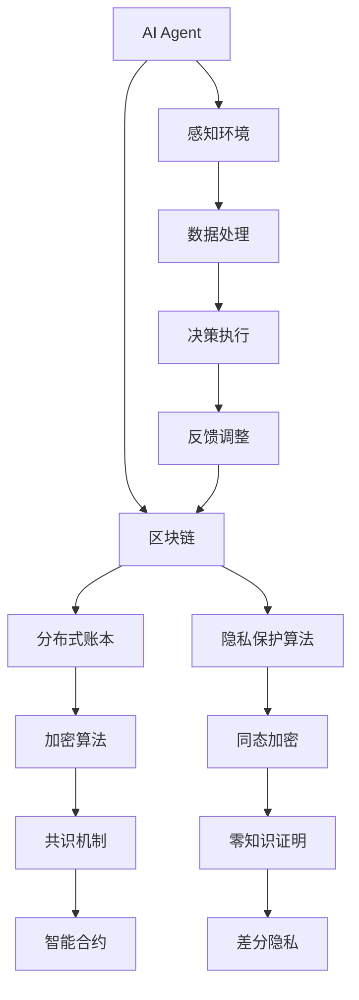

                 

### # 引言

在当今快速发展的科技时代，人工智能（AI）和区块链技术正逐渐成为企业创新和发展的关键驱动力。AI Agent，作为人工智能领域的代表，通过自动化和智能化来提升企业的运营效率和决策能力。与此同时，区块链技术以其去中心化、安全可靠和透明度高的特性，为数据共享与隐私保护提供了一种全新的解决方案。

然而，随着企业越来越依赖AI Agent来处理和分析大量数据，如何在一个安全且隐私得到保护的环境中实现高效的数据共享，成为了一个亟待解决的问题。区块链技术的引入，为这一问题提供了一种可能的解决路径。通过利用区块链的分布式账本和智能合约功能，可以在确保数据完整性和隐私性的前提下，实现企业内部和外部的数据共享。

本篇文章旨在探讨企业AI Agent与区块链数据共享及隐私保护的结合。我们将从以下几个方面展开讨论：

1. **问题背景**：介绍AI Agent和区块链技术的基本概念及其在企业应用中的重要性。
2. **书籍概述**：明确本文的目的和结构，帮助读者理解文章的主要内容。
3. **核心概念与联系**：详细阐述AI Agent、区块链数据共享机制、隐私保护算法等核心概念，并通过Mermaid流程图和ER实体关系图来展示概念之间的联系。
4. **区块链技术基础**：深入剖析区块链的基本概念、数据结构、常见平台以及其在数据共享和隐私保护中的应用。
5. **企业AI Agent基础**：讲解AI Agent的定义、分类、关键技术以及其在企业中的应用和未来趋势。
6. **区块链数据共享机制设计**：分析数据共享需求，设计区块链数据共享模型，并探讨数据隐私保护机制。
7. **AI Agent与区块链数据共享的融合**：探讨AI Agent与区块链技术结合的优势、挑战及优化方案。
8. **案例研究**：通过具体案例研究，展示区块链数据共享与隐私保护的实现和应用效果。

通过这篇文章，我们希望能够为读者提供一个全面、系统的理解，帮助他们在实际业务中更好地利用AI Agent和区块链技术，实现数据共享与隐私保护的双重目标。

### # 问题背景

#### **AI Agent在企业发展中的重要性**

人工智能（AI）技术正在深刻地改变着企业的运营模式，AI Agent作为AI技术的应用之一，正成为推动企业自动化和智能化的关键力量。AI Agent，也被称为智能代理，是指能够模拟人类智能行为，执行特定任务的自动化程序。这些代理可以在无需人工干预的情况下，根据预设的算法和策略，自主完成复杂任务，如数据分析、决策支持、客户服务等。

在企业发展中，AI Agent的重要性主要体现在以下几个方面：

1. **提升运营效率**：AI Agent能够自动处理大量重复性、繁琐的工作，如数据收集、处理和报告生成，从而显著降低人工成本和时间消耗，提高整体运营效率。

2. **优化决策过程**：通过大数据分析和机器学习算法，AI Agent可以识别出业务中的关键模式和趋势，为企业提供科学的决策支持。例如，在供应链管理中，AI Agent可以根据历史数据和实时信息，预测需求变化，优化库存管理，降低库存成本。

3. **改善客户体验**：AI Agent可以提供24/7的智能客服服务，通过自然语言处理技术理解和响应客户需求，提供个性化服务。这不仅提升了客户满意度，也增强了客户忠诚度。

4. **创新业务模式**：AI Agent的应用可以开拓新的业务模式和收入来源。例如，在金融领域，AI Agent可以用于自动化交易、风险管理等，从而提升企业的盈利能力。

#### **区块链技术的基本概念**

区块链技术是一种去中心化的分布式数据库技术，通过加密算法和共识机制，确保数据的完整性和不可篡改性。区块链的基本概念包括：

1. **去中心化**：区块链不依赖于单一中心化的机构或服务器，而是通过分布式网络中的多个节点共同维护和更新数据，提高了系统的鲁棒性和抗攻击能力。

2. **不可篡改性**：区块链采用加密算法确保数据的完整性和不可篡改性。一旦数据记录在区块链上，便无法被修改或删除，保证了数据的真实性和可靠性。

3. **共识机制**：区块链网络中的多个节点通过共识机制达成数据的一致性。常见的共识机制包括工作量证明（PoW）、权益证明（PoS）和委托权益证明（DPoS）等。

4. **智能合约**：智能合约是一种自动执行的合约，其条款和操作被编码在区块链上。一旦触发条件满足，智能合约会自动执行预定的操作，如转移资产、记录交易等。

#### **数据共享与隐私保护的挑战**

在企业运营中，数据共享和隐私保护是一对看似矛盾的需求。数据共享能够提高企业内部的协作效率和对外部的竞争力，但同时也带来了隐私泄露和数据滥用的风险。特别是在引入AI Agent后，数据的安全性和隐私保护更加重要，原因如下：

1. **数据量庞大**：随着数据来源的多样化，企业内部和外部产生的数据量呈指数级增长。如何在这些海量数据中实现高效、安全的共享，成为了一大挑战。

2. **多源异构数据**：企业内部和外部的数据格式、结构和标准各不相同，如何整合这些多源异构数据，实现统一的数据共享机制，是一项复杂的任务。

3. **隐私保护需求**：随着数据隐私保护法规的不断完善，企业必须在数据共享的同时，确保个人和敏感数据的隐私不被泄露。如何在确保隐私保护的前提下实现数据共享，是一个亟待解决的问题。

4. **数据泄露风险**：由于数据量庞大和系统复杂，企业在数据共享过程中面临着数据泄露的风险。一旦发生数据泄露，不仅会对企业的声誉造成严重影响，还可能带来法律责任和经济损失。

#### **区块链技术的基本概念**

区块链技术是一种通过分布式账本和加密算法实现数据存储和传输的技术。其基本概念包括：

1. **分布式账本**：区块链采用分布式账本技术，通过多个节点共同维护和记录数据，避免了单一中心化节点的单点故障和篡改风险。每个节点都存储完整的账本副本，实现了数据的一致性和透明度。

2. **加密算法**：区块链使用各种加密算法，如哈希算法、非对称加密和数字签名等，确保数据的完整性和安全性。哈希算法用于生成数据指纹，确保数据的唯一性和不可篡改性；非对称加密和数字签名则用于身份验证和授权。

3. **共识机制**：区块链网络中的多个节点通过共识机制达成数据的一致性。共识机制包括工作量证明（PoW）、权益证明（PoS）和委托权益证明（DPoS）等。这些机制确保了区块链网络的去中心化和安全性。

4. **智能合约**：智能合约是区块链上的自动执行合约，其条款和操作被编码在区块链上。一旦触发条件满足，智能合约会自动执行预定的操作，如转移资产、记录交易等。智能合约实现了去中心化的自动化交易和执行。

#### **数据共享与隐私保护的挑战**

在企业运营中，数据共享和隐私保护是一对看似矛盾的需求。数据共享能够提高企业内部的协作效率和对外部的竞争力，但同时也带来了隐私泄露和数据滥用的风险。特别是在引入AI Agent后，数据的安全性和隐私保护更加重要，原因如下：

1. **数据量庞大**：随着数据来源的多样化，企业内部和外部产生的数据量呈指数级增长。如何在这些海量数据中实现高效、安全的共享，成为了一大挑战。

2. **多源异构数据**：企业内部和外部的数据格式、结构和标准各不相同，如何整合这些多源异构数据，实现统一的数据共享机制，是一项复杂的任务。

3. **隐私保护需求**：随着数据隐私保护法规的不断完善，企业必须在数据共享的同时，确保个人和敏感数据的隐私不被泄露。如何在确保隐私保护的前提下实现数据共享，是一个亟待解决的问题。

4. **数据泄露风险**：由于数据量庞大和系统复杂，企业在数据共享过程中面临着数据泄露的风险。一旦发生数据泄露，不仅会对企业的声誉造成严重影响，还可能带来法律责任和经济损失。

### # 书籍概述

本文书籍旨在探讨企业AI Agent与区块链数据共享及隐私保护的结合，为读者提供全面、系统的理论和实践指导。以下是本文的主要内容和结构安排。

#### **书籍目的与读者对象**

本文书籍的目的是通过深入分析AI Agent和区块链技术，探讨二者在数据共享与隐私保护方面的融合应用，旨在为企业提供一种高效、安全的解决方案。本书的读者对象包括：

1. **技术工程师和开发人员**：希望通过本文书籍了解和掌握AI Agent和区块链技术的原理和应用，并将其应用于实际项目开发中。
2. **企业管理者和决策者**：需要了解AI Agent和区块链技术对企业管理和发展的重要作用，以及如何利用这些技术提升企业的数据共享和隐私保护能力。
3. **研究人员和学者**：对AI Agent和区块链技术有浓厚兴趣，希望进一步研究二者结合的理论基础和应用场景。

#### **内容结构安排**

本文书籍分为五个主要章节，每个章节都有明确的主题和内容：

1. **第1章 引言**：介绍AI Agent和区块链技术的基本概念及其在企业应用中的重要性，明确本文的研究目的和结构。
2. **第2章 区块链技术基础**：详细阐述区块链的基本概念、数据结构、常见平台以及其在数据共享和隐私保护中的应用。
3. **第3章 企业AI Agent基础**：讲解AI Agent的定义、分类、关键技术以及其在企业中的应用和未来趋势。
4. **第4章 区块链数据共享机制设计**：分析数据共享需求，设计区块链数据共享模型，并探讨数据隐私保护机制。
5. **第5章 AI Agent与区块链数据共享的融合**：探讨AI Agent与区块链技术结合的优势、挑战及优化方案。

通过本文书籍的系统学习，读者可以全面了解AI Agent和区块链技术的结合原理，掌握设计高效、安全的数据共享与隐私保护系统的方法和技巧。

### # 核心概念与联系

在探讨企业AI Agent与区块链数据共享与隐私保护时，我们需要明确几个核心概念，并分析它们之间的联系。

#### **AI Agent的基本概念**

AI Agent，即人工智能代理，是一种模拟人类智能行为的自动化程序。它能够根据预设的算法和策略，自主执行任务，如数据分析、决策支持、客户服务等。AI Agent通常具有以下几个特点：

1. **自主性**：AI Agent能够在没有人工干预的情况下自主运行和执行任务。
2. **反应性**：AI Agent能够感知环境变化，并做出相应反应。
3. **目标性**：AI Agent在执行任务时具有明确的目标，并不断优化行为以实现目标。
4. **适应性**：AI Agent能够根据环境变化和学习经验调整其行为策略。

AI Agent可以分为以下几类：

- **反应型代理**：仅根据当前环境信息做出反应，不考虑历史数据或长期目标。
- **目标型代理**：具有明确目标，通过规划决策来达成目标。
- **学习型代理**：通过学习和经验调整行为策略，以优化任务执行效果。

#### **区块链数据共享机制**

区块链是一种分布式账本技术，通过去中心化的方式维护数据，确保数据的完整性和不可篡改性。区块链数据共享机制主要包括以下几个方面：

1. **分布式账本**：区块链通过多个节点共同维护账本，每个节点都存储完整的账本副本，避免了单一中心化节点的单点故障和篡改风险。
2. **加密算法**：区块链使用各种加密算法（如哈希算法、非对称加密）确保数据的完整性和安全性。哈希算法用于生成数据指纹，确保数据的唯一性和不可篡改性；非对称加密和数字签名用于身份验证和授权。
3. **共识机制**：区块链网络中的多个节点通过共识机制达成数据的一致性。共识机制包括工作量证明（PoW）、权益证明（PoS）和委托权益证明（DPoS）等，确保了区块链网络的去中心化和安全性。
4. **智能合约**：智能合约是区块链上的自动执行合约，其条款和操作被编码在区块链上。一旦触发条件满足，智能合约会自动执行预定的操作，如转移资产、记录交易等。

#### **隐私保护算法原理**

在数据共享过程中，确保隐私保护是一个重要问题。常见的隐私保护算法包括：

1. **同态加密**：同态加密允许在加密数据上进行计算，而不需要解密数据。这意味着可以在区块链上进行加密数据的计算，同时保护数据隐私。
2. **零知识证明**：零知识证明允许一方证明某个陈述是真实的，而不泄露任何额外信息。这种技术在区块链上可以实现隐私保护的数据验证。
3. **差分隐私**：差分隐私通过在数据集中引入随机噪声，使得单个数据点的隐私信息难以被推断出来，从而保护数据隐私。

#### **Mermaid流程图概述**

为了更直观地展示这些概念之间的联系，我们可以使用Mermaid流程图进行描述。以下是AI Agent与区块链数据共享及隐私保护机制的Mermaid流程图：



在这个流程图中，AI Agent通过感知环境、数据处理、决策执行和反馈调整实现自动化任务。区块链通过分布式账本、加密算法、共识机制和智能合约实现数据共享和隐私保护。隐私保护算法则通过同态加密、零知识证明和差分隐私等技术实现数据隐私的保护。

#### **ER实体关系图**

为了进一步展示企业AI Agent模型中的实体关系，我们可以使用Mermaid ER实体关系图。以下是企业AI Agent模型的ER图：

```mermaid
erDiagram
    AI_Agent ||--|{ Data : 包含}
    AI_Agent ||--|{ Task : 执行}
    Data ||--|{ Blockchain_Data : 共享}
    Task ||--|{ Result : 记录}
    Blockchain_Data ||--|{ Privacy_Protect : 保护}
```

在这个ER图中，`AI_Agent` 是核心实体，包含 `Data` 和 `Task`。`Data` 进一步关联到 `Blockchain_Data`，表示数据在区块链上的共享和隐私保护。`Task` 关联到 `Result`，表示任务的执行和结果记录。

通过上述核心概念和联系的分析，我们可以更好地理解企业AI Agent与区块链数据共享及隐私保护机制的设计原理，为实际应用提供理论支持。

### # 区块链技术基础

#### **区块链基本概念**

区块链技术是一种分布式数据库系统，通过加密算法和共识机制，确保数据的完整性和不可篡改性。区块链的基本概念包括：

1. **去中心化**：区块链不依赖于单一的中心化服务器，而是通过分布式网络中的多个节点共同维护和更新数据。这种去中心化的特性提高了系统的鲁棒性和抗攻击能力，避免了单点故障和篡改风险。

2. **不可篡改性**：区块链采用哈希算法和加密技术，确保数据的唯一性和不可篡改性。一旦数据被记录在区块链上，便无法被修改或删除，从而保证了数据的真实性和可靠性。

3. **分布式账本**：区块链通过多个节点共同维护一个分布式账本，每个节点都存储完整的账本副本。这种分布式账本结构确保了数据的一致性，避免了中央账本的单一风险。

4. **共识机制**：区块链网络中的多个节点通过共识机制达成数据的一致性。常见的共识机制包括工作量证明（PoW）、权益证明（PoS）和委托权益证明（DPoS）等。共识机制确保了区块链网络的安全性和去中心化特性。

5. **智能合约**：智能合约是区块链上的自动执行合约，其条款和操作被编码在区块链上。一旦触发条件满足，智能合约会自动执行预定的操作，如转移资产、记录交易等。智能合约实现了去中心化的自动化交易和执行。

#### **区块链的特点**

区块链技术具有以下几个显著特点：

1. **安全性**：区块链采用加密算法和共识机制，确保数据的完整性和安全性。数据的加密传输和分布式存储方式，使得区块链具有很高的抗攻击能力，有效防止了数据篡改和非法访问。

2. **透明性**：区块链是一个公开透明的分布式账本，所有交易记录都记录在链上，且不可篡改。任何参与节点都可以查看和验证区块链上的数据，从而保证了数据的透明性。

3. **不可篡改性**：由于区块链采用哈希算法和加密技术，一旦数据被记录在区块链上，便无法被修改或删除。这种不可篡改的特性确保了数据的真实性和可靠性。

4. **去中心化**：区块链不依赖于单一的中心化机构或服务器，而是通过分布式网络中的多个节点共同维护和更新数据。这种去中心化的特性提高了系统的鲁棒性和抗攻击能力。

5. **高效率**：区块链通过共识机制快速达成数据一致性，提高了系统的处理效率。与传统的集中式系统相比，区块链可以在更短的时间内完成大规模数据交易和记录。

6. **智能合约**：智能合约是区块链上的自动执行合约，其条款和操作被编码在区块链上。一旦触发条件满足，智能合约会自动执行预定的操作，实现了去中心化的自动化交易和执行。

#### **区块链的工作原理**

区块链的工作原理可以概括为以下步骤：

1. **数据生成**：区块链上的数据由参与节点生成。这些数据可以是交易记录、身份验证信息或其他需要记录的信息。

2. **数据打包**：生成的数据会被打包成区块，每个区块包含一定数量的交易记录。这些区块通过加密算法和时间戳进行标记，确保数据的唯一性和顺序性。

3. **区块验证**：每个区块在生成后需要通过网络中的其他节点进行验证。验证过程包括检查区块的完整性和合法性，以及确认交易记录的有效性。

4. **共识机制**：通过共识机制，网络中的节点达成数据一致。常见的共识机制包括工作量证明（PoW）、权益证明（PoS）和委托权益证明（DPoS）等。共识机制确保了区块链的可靠性和安全性。

5. **区块链扩展**：一旦区块被验证并确认，它将被添加到区块链的末端，形成一条连续的、不可篡改的数据链。随着新区块的不断生成，区块链逐渐扩展。

6. **数据存储**：每个参与节点都存储完整的区块链副本。这使得区块链具有分布式存储的特性，避免了中央化存储的单点故障风险。

7. **数据查询和验证**：用户可以通过区块链网络查询和验证区块链上的数据。由于区块链的公开透明特性，任何用户都可以查看和验证区块链上的数据，确保数据的真实性和可靠性。

#### **区块与链**

在区块链技术中，区块和链是两个核心概念：

1. **区块**：区块是区块链的基本组成单位，包含一定数量的交易记录。每个区块都有一个唯一的标识，即哈希值，以及一个时间戳，用于记录交易发生的时间和顺序。区块通过哈希算法与前一个区块链接，形成一条连续的数据链。

2. **链**：区块链是由多个区块按照时间顺序链接而成的数据结构。每个区块都包含指向前一个区块的哈希值，这种链接方式确保了区块链的完整性和不可篡改性。一旦一个区块被添加到链中，其数据便无法被修改或删除。

#### **交易与地址**

在区块链中，交易和地址是两个重要概念：

1. **交易**：交易是区块链上的数据交换操作，通常涉及数字资产的转移或记录。交易包括发送方地址、接收方地址、交易金额以及交易签名等元素。交易一旦生成，便会被打包进区块并记录在区块链上。

2. **地址**：地址是区块链上的标识符，用于接收和发送交易。每个地址都由一串加密的哈希值组成，具有唯一性。地址通常与用户的私钥相关联，用户通过私钥对交易进行签名，确保交易的安全性和不可篡改性。

#### **智能合约**

智能合约是区块链技术中的一个重要特性，它是一种自动执行的合约，条款和操作被编码在区块链上。智能合约的关键特性包括：

1. **自动执行**：智能合约在满足触发条件时，会自动执行预定的操作，如转移资产、记录事件等。这种自动执行的特性减少了人为干预，提高了交易和记录的效率。

2. **透明性**：智能合约的条款和操作是公开透明的，所有参与节点都可以查看和验证。这种透明性确保了智能合约的公正性和可信性。

3. **不可篡改性**：一旦智能合约被部署到区块链上，其条款和操作便不可修改或删除。这种不可篡改性确保了智能合约的稳定性和可靠性。

4. **去中心化**：智能合约在区块链上执行，不依赖于中心化机构或服务器。这种去中心化的特性提高了系统的鲁棒性和抗攻击能力。

常见的智能合约编程语言包括Solidity（以太坊）、Serpent（Ethereum）、Lisk和NEAR等。智能合约的应用范围广泛，包括去中心化金融（DeFi）、供应链管理、投票系统、游戏和版权保护等。

#### **常见的区块链平台**

目前，市场上存在多个成熟的区块链平台，每种平台都有其独特的特点和应用场景。以下是几种常见的区块链平台：

1. **Ethereum**：
   - **特点**：以太坊是第一个实现智能合约的区块链平台，支持复杂的去中心化应用（DApps）开发。
   - **应用场景**：金融、供应链管理、游戏、版权保护等。
   - **优势**：广泛的社区支持，丰富的开发工具和资源。
   - **挑战**：高能源消耗，交易速度较慢。

2. **Bitcoin**：
   - **特点**：比特币是最早的区块链平台，主要用于数字货币交易。
   - **应用场景**：货币交易、去中心化金融等。
   - **优势**：去中心化、安全性高、可信度高。
   - **挑战**：交易速度较慢，交易费用较高。

3. **Hyperledger Fabric**：
   - **特点**：Hyperledger Fabric是一个企业级的区块链平台，支持私有和联盟链。
   - **应用场景**：金融、供应链管理、物联网等。
   - **优势**：灵活性强，可定制化，高吞吐量。
   - **挑战**：开发难度较大，社区支持相对较少。

4. **EOS**：
   - **特点**：EOS是一个高性能的区块链平台，支持大规模的去中心化应用。
   - **应用场景**：金融、游戏、社交网络等。
   - **优势**：高性能、高吞吐量、低交易费用。
   - **挑战**：去中心化程度有待提高。

每种区块链平台都有其特定的优势和应用场景，企业应根据自身需求选择合适的平台。

#### **区块链在数据共享中的应用**

区块链技术因其去中心化、安全性和透明度高等特性，在数据共享领域具有广泛的应用潜力。以下是区块链在数据共享中的应用：

1. **数据共享的优势**：
   - **去中心化**：区块链的去中心化特性使得数据共享不再依赖于中心化的机构或服务器，提高了系统的鲁棒性和抗攻击能力。
   - **安全性**：区块链采用加密算法和共识机制，确保数据的完整性和安全性。数据一旦记录在区块链上，便无法被篡改或删除，保证了数据的安全性和可信度。
   - **透明性**：区块链的透明性使得所有参与节点都可以查看和验证数据，确保数据共享的公平性和公正性。
   - **不可篡改性**：区块链的不可篡改性确保了数据的真实性和可靠性，避免了数据篡改和伪造的风险。

2. **数据共享的挑战**：
   - **数据隐私保护**：尽管区块链提供了安全性保障，但在数据共享过程中，如何保护个人和敏感数据的隐私仍是一个挑战。特别是在医疗、金融等领域，数据隐私保护尤为重要。
   - **数据存储和查询效率**：区块链的数据存储和查询效率相对较低，尤其是随着数据量的增加，区块链的性能可能会受到影响。如何提高数据存储和查询效率是区块链数据共享面临的一个问题。
   - **跨平台兼容性**：不同区块链平台之间的数据格式和标准可能存在差异，如何实现跨平台兼容性是数据共享面临的挑战之一。

3. **区块链在数据共享中的应用实例**：
   - **医疗数据共享**：区块链技术在医疗数据共享中具有广泛应用。例如，医疗机构可以通过区块链技术实现病历数据的共享，提高医疗服务的效率和质量。同时，通过区块链的隐私保护技术，确保患者数据的隐私不被泄露。
   - **供应链管理**：区块链技术可以用于供应链管理中的数据共享，如记录商品的运输、库存等信息。通过区块链的透明性和不可篡改性，确保供应链信息的真实性和可靠性，提高供应链的透明度和信任度。
   - **金融数据共享**：区块链技术在金融数据共享中也具有广泛的应用。例如，银行和金融机构可以通过区块链技术实现交易记录的共享，提高交易的透明度和安全性。同时，通过区块链的隐私保护技术，确保客户数据的隐私不被泄露。

通过区块链技术在数据共享中的应用，企业可以实现更高效、安全的数据共享，提高业务协作和运营效率。

#### **隐私保护的重要性**

在数据共享的过程中，隐私保护是一个至关重要的议题。随着数据量的增加和数据来源的多样化，个人和敏感数据的安全性和隐私保护面临巨大挑战。以下是隐私保护的重要性：

1. **法律法规要求**：全球范围内，越来越多的国家和地区出台了数据隐私保护法律法规，如《通用数据保护条例》（GDPR）、《加州消费者隐私法案》（CCPA）等。这些法规要求企业在处理和共享数据时，必须严格保护个人隐私，否则将面临高额罚款和法律责任。

2. **用户信任**：用户对数据隐私的关注日益增加，一旦发生数据泄露或隐私侵犯事件，不仅会对企业的声誉造成严重影响，还会导致用户流失和信任丧失。因此，确保数据隐私是建立用户信任的关键。

3. **安全风险**：敏感数据泄露可能导致严重的后果，如财务损失、身份盗窃、商业机密泄露等。这些风险不仅影响企业的运营，还可能威胁到个人和社会的安全。

4. **商业竞争力**：在竞争激烈的市场环境中，能够有效保护数据隐私的企业将具有更高的竞争力。这不仅体现在用户信任和满意度上，还能够在合规性方面为企业带来优势。

#### **隐私保护的挑战**

尽管隐私保护的重要性日益凸显，但在实际应用中，隐私保护仍面临一系列挑战：

1. **数据规模庞大**：随着企业数据量的不断增长，如何高效地保护海量数据的隐私成为一个巨大的挑战。传统的隐私保护方法在处理海量数据时可能效率低下。

2. **多源异构数据**：企业内部和外部产生的数据格式、结构和标准各不相同。如何统一这些多源异构数据，并确保在数据共享过程中保护其隐私，是一个复杂的问题。

3. **技术复杂度**：隐私保护技术如同态加密、零知识证明等，具有较高的技术复杂度。如何将这些技术有效地集成到现有的数据管理和共享系统中，是一个技术难题。

4. **用户隐私意识**：用户对隐私保护的意识和需求不断提升，但并非所有用户都了解隐私保护技术的工作原理和重要性。如何提高用户对隐私保护的认知和参与度，是一个社会问题。

5. **隐私保护与数据利用的平衡**：在数据共享和隐私保护之间找到平衡点，是企业在实际操作中面临的挑战。过度的隐私保护可能导致数据利用效率下降，而过于宽松的隐私保护则可能带来数据泄露的风险。

#### **常见的隐私保护技术**

为了应对数据共享中的隐私保护挑战，研究者们提出了多种隐私保护技术。以下是几种常见的隐私保护技术：

1. **同态加密**：同态加密允许在加密数据上直接进行计算，而不需要解密数据。这意味着可以在区块链上进行加密数据的计算，同时保护数据隐私。

2. **零知识证明**：零知识证明允许一方证明某个陈述是真实的，而不泄露任何额外信息。这种技术在区块链上可以实现隐私保护的数据验证。

3. **差分隐私**：差分隐私通过在数据集中引入随机噪声，使得单个数据点的隐私信息难以被推断出来，从而保护数据隐私。

4. **匿名通信**：匿名通信技术，如混合网络和匿名币，通过多层加密和路由技术，实现通信双方的匿名性。

5. **安全多方计算**：安全多方计算允许多个参与方在不泄露各自隐私数据的情况下，共同计算某个函数的结果。这种技术在区块链上的数据共享中具有重要应用。

通过这些隐私保护技术，企业可以在实现数据共享的同时，确保数据的隐私性和安全性。

### # 企业AI Agent基础

#### **AI Agent的定义与分类**

AI Agent，即人工智能代理，是一种能够模拟人类智能行为的自动化程序，它在没有人工干预的情况下，根据预设的算法和策略，执行特定任务。AI Agent的核心特点包括自主性、反应性、目标性和适应性。

1. **自主性**：AI Agent具有自主性，能够独立完成任务，不需要人工干预。这意味着AI Agent可以根据环境变化自主调整行为策略。

2. **反应性**：AI Agent能够感知环境变化，并做出相应反应。例如，在智能家居系统中，AI Agent可以根据用户的行为习惯自动调整室内温度、照明等。

3. **目标性**：AI Agent在执行任务时具有明确的目标，并通过一系列决策和行动来实现目标。例如，在自动驾驶系统中，AI Agent的目标是确保车辆的安全驾驶。

4. **适应性**：AI Agent能够通过学习和经验调整其行为策略，以优化任务执行效果。例如，通过机器学习算法，AI Agent可以根据历史数据优化其推荐策略。

AI Agent可以根据不同的分类标准进行分类：

- **按功能分类**：
  - **反应型代理**：仅根据当前环境信息做出反应，不考虑历史数据或长期目标。例如，自动化的客服聊天机器人。
  - **目标型代理**：具有明确目标，通过规划决策来达成目标。例如，自动驾驶汽车。
  - **学习型代理**：通过学习和经验调整行为策略，以优化任务执行效果。例如，智能推荐系统。

- **按应用领域分类**：
  - **通用型代理**：适用于多个领域的通用AI Agent。例如，智能助理。
  - **专用型代理**：针对特定领域或任务的专用AI Agent。例如，医疗诊断代理。

#### **AI Agent的关键技术**

AI Agent的实现依赖于多个核心技术，包括强化学习、自然语言处理、深度学习和图像识别等。

1. **强化学习**：强化学习是AI Agent的核心技术之一，通过奖励机制和试错学习，使AI Agent能够自主决策并优化行为。在自动驾驶领域，强化学习被用于训练AI Agent自主驾驶。

2. **自然语言处理**：自然语言处理（NLP）技术使AI Agent能够理解和生成自然语言，从而实现人机交互。在智能客服系统中，NLP技术被用于理解用户的查询并生成相应的回复。

3. **深度学习**：深度学习是一种基于人工神经网络的机器学习方法，能够自动提取数据中的特征。在图像识别和语音识别领域，深度学习被广泛应用于训练AI Agent。

4. **图像识别**：图像识别技术使AI Agent能够理解和识别图像中的物体和场景。在安防监控和自动驾驶领域，图像识别技术被用于实时监测和识别目标。

#### **AI Agent在企业中的应用**

AI Agent在企业中的应用越来越广泛，以下是一些典型的应用场景：

1. **供应链管理**：AI Agent可以用于供应链管理中的需求预测、库存优化和物流跟踪。通过分析历史数据和实时信息，AI Agent能够预测市场需求变化，优化库存水平，降低库存成本。

2. **客户服务**：AI Agent可以提供24/7的智能客服服务，通过自然语言处理技术理解和响应客户需求，提供个性化服务。这不仅提升了客户满意度，也降低了人工客服成本。

3. **决策支持**：AI Agent可以通过大数据分析和机器学习算法，为企业的战略决策提供科学支持。例如，在市场营销中，AI Agent可以分析市场数据，预测消费者行为，优化营销策略。

4. **风险管理**：AI Agent可以用于风险管理中的风险评估、欺诈检测和合规监控。通过实时监测和分析数据，AI Agent能够及时发现潜在风险，并提出应对措施。

5. **人力资源**：AI Agent可以用于人力资源管理的招聘、培训和绩效评估。通过分析求职者和员工的数据，AI Agent能够提供个性化的招聘建议和培训方案，提高员工绩效。

#### **AI Agent的挑战与未来趋势**

尽管AI Agent在企业中具有广泛的应用前景，但其发展仍面临一系列挑战：

1. **数据隐私与安全**：AI Agent在处理和共享数据时，需要确保数据隐私和安全。如何在数据共享和隐私保护之间找到平衡点，是一个重要挑战。

2. **算法透明性和可解释性**：随着AI Agent的复杂度增加，其算法的透明性和可解释性成为一个重要问题。企业需要确保AI Agent的决策过程是可解释和可信的。

3. **计算资源与成本**：AI Agent的训练和运行需要大量的计算资源，这可能导致高昂的成本。如何优化计算资源的使用，降低成本，是企业需要解决的一个问题。

4. **伦理和道德问题**：AI Agent的应用可能带来伦理和道德问题，如数据滥用、隐私侵犯和失业风险。如何制定相应的伦理和道德规范，是企业需要关注的一个问题。

未来，AI Agent的发展趋势包括：

1. **人工智能的融合**：AI Agent将与其他技术（如物联网、区块链等）融合，实现更复杂的任务和更高的智能化水平。

2. **自主性和适应性提升**：AI Agent将具备更高的自主性和适应性，能够更好地应对复杂和多变的业务环境。

3. **人机协作**：AI Agent将更多地与人类协作，实现更高效和智能的工作流程。

4. **全球化应用**：AI Agent将在全球范围内得到更广泛的应用，特别是在跨境业务和全球供应链管理中。

通过应对这些挑战和把握未来趋势，AI Agent将在企业中发挥更大的作用，推动企业的数字化转型和智能化发展。

### # 区块链数据共享机制设计

#### **数据共享的需求分析**

在企业的日常运营中，数据共享的需求日益增长。数据共享能够促进企业内部不同部门之间的协作，提高业务流程的效率，同时也帮助企业更好地对外部合作伙伴和客户提供服务。以下是数据共享的重要性及需求分析：

1. **内部协作**：企业内部的不同部门需要共享数据以支持协同工作。例如，市场营销部门需要销售部门的数据来制定营销策略；财务部门需要库存数据来管理预算。通过数据共享，可以避免信息孤岛，提高业务流程的连贯性和效率。

2. **外部合作**：企业通常需要与外部合作伙伴共享数据，以实现更紧密的协作和更高效的供应链管理。例如，制造商需要与供应商共享库存数据和需求预测，以便及时调整生产和采购计划。

3. **客户服务**：通过数据共享，企业可以提供更加个性化的客户服务。例如，客户服务部门可以访问客户的历史购买记录和偏好，从而提供更精准的推荐和解决方案。

4. **决策支持**：共享的数据可以用于更准确的数据分析和决策支持。例如，企业可以通过分析销售数据和客户反馈，识别市场趋势和消费者需求，从而优化产品和服务。

然而，数据共享也面临一系列挑战：

- **数据量庞大**：随着企业业务的扩展，数据量呈指数级增长，如何有效管理和共享这些海量数据成为一大挑战。
- **多源异构数据**：企业内部和外部的数据格式、结构和标准各不相同，如何整合这些多源异构数据是一个复杂的问题。
- **数据隐私保护**：在数据共享过程中，如何保护敏感数据的隐私，防止数据泄露和滥用，是一个亟待解决的问题。
- **数据一致性**：确保共享数据的一致性和实时性，避免不同部门或合作伙伴之间的数据冲突，是数据共享的重要挑战。

#### **区块链数据共享模型的设计原则**

为了应对上述挑战，设计一个高效、安全和透明的区块链数据共享模型至关重要。以下是区块链数据共享模型的设计原则：

1. **去中心化**：区块链的去中心化特性能够确保数据共享的透明度和抗攻击能力。通过多个节点共同维护数据，避免了中心化节点的单点故障和篡改风险。

2. **数据加密与隐私保护**：区块链采用加密算法确保数据的完整性和隐私性。通过同态加密、零知识证明等隐私保护技术，可以在数据共享过程中保护敏感数据的隐私。

3. **数据一致性**：区块链通过共识机制确保数据的一致性。每个节点都存储完整的账本副本，通过共识机制达成数据的一致性，避免了传统集中式系统中数据不一致的问题。

4. **智能合约自动化**：智能合约是区块链上的自动执行合约，可以用于自动化数据共享和隐私保护的过程。通过智能合约，可以确保数据共享的透明性和自动化执行。

5. **可扩展性和高效性**：区块链数据共享模型需要具备良好的可扩展性和高效性，以应对不断增长的数据量和用户需求。通过分片技术和优化共识机制，可以提高区块链的性能和可扩展性。

#### **区块链数据共享模型的核心组件**

区块链数据共享模型由多个核心组件构成，这些组件相互协作，实现高效、安全的数据共享。以下是这些核心组件的详细说明：

1. **分布式账本**：分布式账本是区块链数据共享的基础。每个节点都存储完整的账本副本，通过共识机制确保账本的一致性。分布式账本确保了数据的透明度和不可篡改性。

2. **加密算法**：区块链采用各种加密算法，如哈希算法、非对称加密和数字签名，确保数据的完整性和安全性。哈希算法用于生成数据指纹，确保数据的唯一性和不可篡改性；非对称加密和数字签名用于身份验证和授权。

3. **共识机制**：共识机制是区块链网络中的多个节点达成数据一致性的关键。常见的共识机制包括工作量证明（PoW）、权益证明（PoS）和委托权益证明（DPoS）等。共识机制确保了区块链的去中心化和安全性。

4. **智能合约**：智能合约是区块链上的自动执行合约，其条款和操作被编码在区块链上。智能合约可以用于自动化数据共享和隐私保护的过程，确保数据共享的透明性和自动化执行。

5. **隐私保护技术**：为了确保数据共享过程中的隐私保护，区块链可以采用同态加密、零知识证明和差分隐私等技术。这些技术可以在数据传输和处理过程中保护敏感数据的隐私。

6. **用户身份验证**：区块链数据共享模型需要确保用户的身份验证和授权。通过数字签名和公私钥加密技术，可以实现安全的用户身份验证和权限管理。

7. **数据存储与访问控制**：区块链采用分布式存储方式，确保数据的可靠性和可恢复性。同时，通过访问控制机制，可以限制不同用户对数据的访问权限，确保数据的安全性。

#### **数据共享流程设计**

区块链数据共享模型的设计需要考虑数据的生成、传输、存储和访问等流程。以下是区块链数据共享流程的详细设计：

1. **数据生成**：在数据生成环节，数据由不同的数据源产生，如企业内部系统、外部合作伙伴等。生成的数据需要经过预处理，以确保数据的格式和结构符合区块链的要求。

2. **数据加密**：在数据传输前，需要使用加密算法对数据进行加密。加密后的数据可以保护数据的隐私和完整性，防止数据在传输过程中被篡改或泄露。

3. **数据上传**：加密后的数据通过区块链网络上传到分布式账本上。上传过程中，数据会被打包成区块，并附加时间戳和哈希值，确保数据的唯一性和顺序性。

4. **区块验证**：上传的区块需要通过网络中的其他节点进行验证。验证过程包括检查区块的完整性、合法性和一致性。一旦验证通过，区块将被添加到区块链上。

5. **数据存储**：验证后的区块被存储在分布式账本上，每个节点都保存完整的账本副本。分布式存储确保了数据的可靠性和可恢复性。

6. **数据访问控制**：在数据访问环节，通过访问控制机制，限制不同用户对数据的访问权限。用户需要通过身份验证和授权，才能访问特定的数据。

7. **数据共享**：通过区块链网络，不同用户可以根据授权访问和共享数据。数据共享过程是透明和自动化的，确保了数据的一致性和实时性。

8. **隐私保护**：在数据共享过程中，使用隐私保护技术，如同态加密、零知识证明等，确保数据的隐私不被泄露。

通过上述流程设计，区块链数据共享模型可以实现高效、安全的数据共享，同时保护数据的隐私和完整性。

### # 数据隐私保护机制

#### **隐私保护的需求分析**

在区块链数据共享过程中，隐私保护的需求显得尤为重要。以下是隐私保护需求的详细分析：

1. **数据保护法规要求**：随着全球范围内数据保护法规的不断完善，如《通用数据保护条例》（GDPR）和《加州消费者隐私法案》（CCPA），企业必须在数据共享过程中严格遵守这些法规，确保个人和敏感数据不被泄露或滥用。

2. **用户隐私意识提升**：现代用户对隐私保护的意识日益增强，他们更加关注自己的数据隐私。如果企业无法保障用户数据隐私，可能会导致用户信任度下降，影响企业的声誉和业务。

3. **数据安全风险**：在区块链网络中，虽然数据具有较高的安全性，但仍然存在数据泄露和滥用的风险。例如，攻击者可能通过恶意节点篡改数据，或者通过数据分析推断出敏感信息。因此，隐私保护是确保数据安全的关键。

4. **商业机密保护**：企业内部和与外部合作伙伴之间的数据共享中，可能包含重要的商业机密。如果这些机密数据被泄露，可能会对企业的竞争力和市场地位造成严重影响。

5. **合规性要求**：不同的行业和地区对数据隐私保护的要求不同。企业需要根据具体的法规和行业标准，设计并实施有效的隐私保护机制。

#### **隐私保护的关键技术**

为了满足上述隐私保护需求，区块链技术提供了一系列关键技术，以下是一些常见的隐私保护技术：

1. **同态加密**：同态加密允许在加密数据上进行计算，而无需解密数据。这意味着在区块链上，可以对加密后的数据进行计算和数据处理，同时保护数据隐私。同态加密广泛应用于金融交易、医疗数据共享等领域。

2. **零知识证明**：零知识证明是一种加密技术，允许一方证明某个陈述是真实的，而不泄露任何额外信息。这种技术常用于身份验证、隐私保护的数据查询和交易验证。

3. **差分隐私**：差分隐私通过在数据集中引入随机噪声，使得单个数据点的隐私信息难以被推断出来。差分隐私技术广泛应用于数据分析、数据挖掘和隐私保护查询。

4. **匿名通信**：匿名通信技术，如匿名币（如Monero、Zcash）和混合网络（如Tor），通过多层加密和路由技术，实现通信双方的匿名性。匿名通信技术在保护用户隐私和防止网络攻击方面具有重要作用。

5. **安全多方计算**：安全多方计算允许多个参与方在不泄露各自隐私数据的情况下，共同计算某个函数的结果。这种技术广泛应用于金融交易、电子投票和隐私保护计算。

#### **隐私保护机制的设计方案**

为了在区块链数据共享过程中实现有效的隐私保护，需要设计一套综合的隐私保护机制。以下是隐私保护机制的设计方案：

1. **数据分类与标签**：首先，对数据进行分类和标签，根据数据的敏感程度和隐私要求，确定不同的保护级别。敏感数据（如个人身份信息、财务数据）需要更高的保护措施。

2. **加密算法选择**：根据数据类型和保护需求，选择合适的加密算法。例如，对于需要进行计算的敏感数据，可以选择同态加密；对于需要保护隐私的数据查询，可以选择零知识证明。

3. **访问控制**：设计基于角色的访问控制（RBAC）机制，确保只有授权用户才能访问特定的数据。通过公私钥加密技术和数字签名，实现用户的身份验证和权限管理。

4. **隐私保护合约**：利用智能合约，实现自动化和透明的隐私保护过程。智能合约可以定义数据共享的条件和隐私保护规则，确保数据在共享过程中不被泄露。

5. **隐私保护技术集成**：将多种隐私保护技术（如同态加密、零知识证明、差分隐私等）集成到区块链系统中，形成一套综合的隐私保护机制。通过技术组合，提高数据隐私保护的效果。

6. **隐私保护审计与监控**：建立隐私保护审计和监控机制，实时监测数据隐私保护的状态，及时发现和应对潜在的隐私风险。

通过上述设计方案，区块链数据共享系统可以实现高效、安全的数据共享，同时保护数据的隐私和完整性。

### # 区块链数据共享与隐私保护的案例研究

为了更好地理解区块链数据共享与隐私保护的实现和应用效果，我们可以通过一个具体的案例来进行分析。以下是案例研究的详细背景、分析和启示。

#### **案例背景**

某全球领先的制药公司，正在面临一个复杂的挑战：如何在其全球供应链中实现高效、透明和可信的数据共享，同时确保患者和员工个人数据的隐私得到保护。该公司的供应链涉及多个国家和地区，包括生产、分销、仓储和物流等多个环节。每个环节都需要共享大量的数据，如库存信息、生产进度、运输状态等。然而，传统的集中式数据共享方式不仅效率低下，而且难以确保数据的安全性和隐私性。

#### **案例分析**

1. **数据共享需求**：
   - **供应链信息共享**：公司需要实现供应链各环节的数据共享，包括生产进度、库存水平、运输状态等，以便实时监控供应链的运行状况，优化库存管理和物流流程。
   - **数据隐私保护**：公司必须确保在数据共享过程中，患者和员工个人数据（如健康记录、薪酬信息等）的隐私得到保护，避免数据泄露和滥用。

2. **区块链应用方案**：
   - **分布式账本**：公司选择了基于Hyperledger Fabric的区块链平台，构建了一个去中心化的供应链数据共享网络。通过分布式账本，确保数据的透明性和不可篡改性。
   - **智能合约**：使用智能合约来自动化数据共享和隐私保护的过程。智能合约定义了数据共享的条件和隐私保护规则，如数据访问权限、加密和解密算法等。
   - **隐私保护技术**：
     - **同态加密**：对于需要进行计算和处理的敏感数据，采用同态加密技术，确保在数据共享过程中保护数据隐私。
     - **零知识证明**：用于验证数据的真实性和完整性，而不泄露数据的具体内容。例如，在验证健康记录时，零知识证明可以证明记录是真实的，但不泄露患者的具体健康信息。
     - **差分隐私**：在数据分析过程中，引入随机噪声，确保单个数据点的隐私信息无法被推断。

3. **实现效果**：
   - **数据透明性和一致性**：通过区块链的分布式账本和智能合约，公司实现了供应链数据的透明性和一致性。每个节点都可以实时查看和验证数据，确保数据的一致性和可信度。
   - **隐私保护**：通过同态加密、零知识证明和差分隐私等技术，公司确保了敏感数据的隐私保护。数据在传输和存储过程中都被加密，且只能在满足特定条件时解密和访问。
   - **效率提升**：区块链技术的应用，显著提升了数据共享的效率和透明度。供应链各环节可以实时获取最新的数据，优化库存管理和物流流程，降低运营成本。

4. **挑战与改进**：
   - **性能优化**：虽然区块链提供了数据透明性和隐私保护，但性能相对较低。公司需要进一步优化区块链的共识机制和数据处理算法，提高系统的性能和可扩展性。
   - **用户培训和接受度**：区块链技术的引入需要用户的培训和接受。公司需要加强用户培训，提高用户对区块链数据共享和隐私保护的理解和信任。

#### **案例启示**

通过对该案例的分析，我们可以得出以下启示：

1. **区块链在数据共享中的应用**：区块链技术提供了高效、透明和可信的数据共享解决方案，可以有效解决传统集中式系统中的数据孤岛和安全性问题。

2. **隐私保护的重要性**：在数据共享过程中，隐私保护是关键。通过采用多种隐私保护技术，可以确保敏感数据在传输和存储过程中的隐私和安全。

3. **智能合约的应用**：智能合约在自动化数据共享和隐私保护中发挥了重要作用。通过智能合约，可以定义和执行数据共享的条件和规则，提高数据共享的效率和可信度。

4. **性能和可扩展性的优化**：区块链技术虽然提供了强大的数据共享和隐私保护功能，但性能和可扩展性仍有待优化。企业需要持续改进区块链技术，以应对大规模数据共享的需求。

5. **用户培训与接受度**：区块链技术的成功应用离不开用户的培训和接受。企业需要加强用户培训，提高用户对区块链技术的理解和信任。

通过这个案例，我们不仅看到了区块链在数据共享和隐私保护中的巨大潜力，也认识到了在实际应用中需要面对的挑战和改进方向。

### # AI Agent与区块链数据共享的融合

#### **结合的优势**

AI Agent与区块链技术的结合为企业带来了诸多优势，使得数据共享与隐私保护更加高效和可信。

1. **数据共享的高效性**：区块链的去中心化特性使得数据可以在不同节点之间快速、透明地共享。AI Agent可以自动处理这些共享的数据，进行数据分析和决策支持，从而提高业务流程的效率。

2. **隐私保护的安全性**：区块链采用加密算法和共识机制，确保数据的完整性和安全性。AI Agent结合区块链的隐私保护技术，如同态加密和零知识证明，可以在不泄露隐私的情况下进行数据分析和计算。

3. **智能合约的自动化**：智能合约可以自动化执行数据共享和隐私保护的规则。AI Agent可以利用智能合约的触发机制，在满足特定条件时自动共享数据或执行隐私保护措施，减少人工干预和操作风险。

4. **数据一致性和透明性**：区块链通过分布式账本和共识机制确保数据的一致性和透明性。AI Agent可以实时访问这些可信数据，确保其决策和执行过程的准确性。

5. **去中心化的信任机制**：区块链的去中心化特性提供了更高的信任基础。AI Agent与区块链的结合，使得企业之间的合作和交易更加信任，降低了中介成本和信任风险。

#### **结合的挑战**

尽管AI Agent与区块链技术的结合带来了许多优势，但在实际应用中，仍面临一系列挑战：

1. **性能和扩展性**：区块链技术相对较慢的处理速度和有限的扩展性，可能无法满足大规模AI代理实时数据处理的需

### # AI Agent在区块链环境中的优化

#### **性能优化**

在区块链环境中，AI Agent的性能优化是关键，因为区块链的高延迟和低吞吐量可能会对AI Agent的实时性和效率产生负面影响。以下是几种优化性能的方法：

1. **分片技术**：分片技术可以将区块链网络分割成多个子网络，每个子网络负责处理一部分数据。这样可以显著提高区块链的吞吐量，减少单个节点的工作负载。AI Agent可以部署在各个分片上，直接处理与该分片相关的数据，从而提高整体性能。

2. **共识机制优化**：选择适合应用场景的共识机制，如PBFT（实用拜占庭容错算法），可以提高区块链的共识速度和处理能力。PBFT在保证安全性的同时，具有更高的交易确认速度，适用于对实时性要求较高的应用场景。

3. **缓存机制**：引入缓存机制，将经常访问的数据缓存起来，减少区块链直接读取的频率。这可以显著提高AI Agent访问数据的速度，降低区块链网络的负载。

4. **并行处理**：AI Agent可以采用并行处理技术，同时处理多个任务或数据集。通过多线程或分布式计算，AI Agent可以更高效地利用区块链环境中的资源，提高处理速度。

5. **资源调配**：根据实际需求，动态调整AI Agent的资源和负载。例如，当数据量较大时，可以增加计算资源，当数据量较小时，可以减少资源使用，从而优化资源利用效率。

#### **隐私保护优化**

在区块链环境中，确保AI Agent的隐私保护是至关重要的，因为区块链的透明性可能导致隐私泄露。以下是几种优化隐私保护的方法：

1. **同态加密**：同态加密是一种在加密数据上进行计算的技术，无需解密数据。AI Agent可以使用同态加密来处理加密数据，从而保护数据的隐私。虽然同态加密的技术复杂且性能较低，但在需要高度隐私保护的场景中，它是一种有效的解决方案。

2. **零知识证明**：零知识证明允许一方证明某个陈述是真实的，而不泄露任何额外信息。AI Agent可以使用零知识证明来验证数据的真实性和完整性，同时保护数据的隐私。例如，在AI Agent处理医疗数据时，可以使用零知识证明来验证患者数据的真实性，而不泄露具体信息。

3. **差分隐私**：差分隐私通过在数据集中引入随机噪声，使得单个数据点的隐私信息难以被推断出来。AI Agent可以使用差分隐私来保护个人和敏感数据的隐私。例如，在数据分析过程中，AI Agent可以引入随机噪声，使得攻击者无法准确推断出单个数据点的真实值。

4. **隐私保护合约**：智能合约可以用于定义和自动化隐私保护规则。AI Agent可以使用隐私保护合约来确保在数据共享和计算过程中，隐私保护措施得到严格执行。例如，隐私保护合约可以确保只有授权用户才能访问加密数据，或者只有满足特定条件的计算才能执行。

5. **隐私计算**：隐私计算是一种在保护数据隐私的前提下进行计算的技术。AI Agent可以使用隐私计算技术，如安全多方计算（SMC），与区块链网络中的其他节点合作，共同计算结果，同时保护数据的隐私。

通过上述方法，AI Agent在区块链环境中的性能和隐私保护可以得到显著优化，从而更好地满足实际应用需求。

### # AI Agent与区块链数据共享的融合方案

#### **融合方案的设计原则**

AI Agent与区块链技术的融合方案需要遵循以下设计原则，以确保数据共享的高效性、安全性和隐私保护：

1. **去中心化与信任**：融合方案应充分利用区块链的去中心化特性，确保数据共享和隐私保护的透明度和信任度。通过分布式账本和共识机制，避免单一中心化节点的风险，提高系统的鲁棒性。

2. **数据隐私保护**：融合方案必须采用先进的隐私保护技术，如同态加密、零知识证明和差分隐私等，确保在数据共享过程中保护敏感数据的隐私。同时，智能合约可以自动化执行隐私保护规则，确保隐私保护措施的一致性和执行力。

3. **高效性**：融合方案应考虑区块链的性能和扩展性，采用优化策略如分片技术、共识机制优化和缓存机制，提高数据共享和处理的速度，满足实时性的需求。

4. **互操作性**：融合方案需要支持不同区块链平台和AI Agent系统的互操作性，以便在不同环境和用例中灵活应用。采用开放标准和协议，确保系统之间的无缝集成和数据交换。

5. **安全性和可靠性**：融合方案应具备完善的安全机制，包括身份验证、访问控制和数据完整性校验，确保系统在面临各种攻击时能够保持安全性和可靠性。

6. **灵活性与可扩展性**：融合方案应具备高度灵活性和可扩展性，以适应不断变化的应用需求和数据规模。通过模块化设计和可配置组件，可以方便地扩展和升级系统功能。

#### **融合方案的核心组件**

融合方案的核心组件包括区块链平台、AI Agent框架、数据加密与隐私保护模块、智能合约、共识机制和互操作性层。以下是每个组件的详细说明：

1. **区块链平台**：选择适合企业需求和应用场景的区块链平台，如Ethereum、Hyperledger Fabric等。平台提供分布式账本、加密算法、共识机制和智能合约等基础服务。

2. **AI Agent框架**：AI Agent框架是融合方案的核心，包括AI模型的训练、推理和自动化执行功能。框架支持多种AI算法和语言，如Python、TensorFlow等，便于实现定制化的AI代理。

3. **数据加密与隐私保护模块**：该模块集成多种加密和隐私保护技术，如同态加密、零知识证明和差分隐私等，确保数据在共享和计算过程中的隐私保护。

4. **智能合约**：智能合约是区块链上的自动化执行合约，定义和自动化数据共享和隐私保护规则。通过智能合约，AI Agent可以自动执行隐私保护措施，如数据加密和解密、权限管理等。

5. **共识机制**：共识机制确保区块链网络中的数据一致性，选择合适的共识机制，如PoW、PoS、PBFT等，提高系统性能和安全性。

6. **互操作性层**：互操作性层实现不同区块链平台和AI Agent系统之间的数据交换和通信，采用开放标准和协议，确保系统之间的无缝集成。

#### **融合方案的实现步骤**

融合方案的实现分为以下几个关键步骤：

1. **需求分析与设计**：根据企业需求和业务场景，分析数据共享和隐私保护的需求，设计融合方案的技术架构和模块。

2. **区块链平台选择与配置**：选择合适的区块链平台，配置区块链网络，包括节点部署、加密算法和共识机制等。

3. **AI Agent开发与部署**：开发AI Agent框架，集成AI算法和模型，部署AI Agent到区块链网络中，确保AI Agent与区块链平台的无缝集成。

4. **数据加密与隐私保护模块集成**：集成数据加密与隐私保护模块，确保AI Agent在处理和共享数据时采用先进的加密和隐私保护技术。

5. **智能合约编写与部署**：编写智能合约，定义数据共享和隐私保护规则，部署到区块链网络上，确保智能合约的自动化执行。

6. **共识机制配置与优化**：根据实际应用需求，配置和优化共识机制，提高系统性能和安全性。

7. **测试与验证**：对融合方案进行全面的测试和验证，确保系统功能正常、性能高效、安全性高。

8. **上线与运营**：将融合方案上线，进行实际应用，持续监控和优化系统性能和隐私保护效果。

通过以上步骤，AI Agent与区块链技术的融合方案可以高效、安全地实现数据共享与隐私保护，为企业的数字化转型提供有力支持。

### # 融合方案的案例研究

为了展示AI Agent与区块链技术融合方案的实际应用效果，我们选择了一个典型的案例进行研究，并详细分析其实现过程、应用效果及对实际业务的影响。

#### **案例背景**

某全球领先的电子商务平台正在面临数据共享与隐私保护的挑战。该平台拥有庞大的用户数据，包括用户行为、购物偏好、支付信息等。为了提升用户体验和运营效率，平台需要实现以下目标：

1. **高效的数据共享**：不同部门（如营销、客户服务、物流等）需要共享用户数据，以便更好地进行业务决策和服务优化。
2. **严格的隐私保护**：在数据共享过程中，必须确保用户个人数据的隐私不被泄露或滥用，以满足数据隐私保护法规的要求。

#### **实现过程**

1. **需求分析与方案设计**：首先，对该电子商务平台的数据共享需求进行详细分析，明确数据类型、共享频次和安全要求。基于分析结果，设计一个基于区块链和AI Agent的融合方案，确保数据共享的高效性和隐私保护。

2. **区块链平台选择**：选择了Hyperledger Fabric作为区块链平台，因为它支持私有和联盟链，适合企业内部数据共享。同时，Hyperledger Fabric的灵活性和可扩展性也符合平台的长期发展需求。

3. **AI Agent开发与部署**：开发基于Python的AI Agent，使用TensorFlow等开源框架训练和部署机器学习模型。AI Agent集成到Hyperledger Fabric网络中，实现自动化数据分析和决策支持。

4. **数据加密与隐私保护**：在数据上传到区块链之前，使用同态加密技术对敏感数据进行加密。此外，利用智能合约定义和执行数据隐私保护规则，确保数据在共享过程中不会被泄露。

5. **智能合约编写与部署**：编写智能合约，定义数据访问权限、加密和解密算法等隐私保护规则。智能合约部署在Hyperledger Fabric网络中，确保数据共享和隐私保护的自动化执行。

6. **共识机制配置**：根据平台的数据处理需求，配置Hyperledger Fabric的共识机制，采用Raft算法以提高网络性能和安全性。

7. **测试与验证**：对融合方案进行全面的测试，确保系统功能正常、性能高效、安全性高。测试包括数据共享速度、隐私保护效果和智能合约的自动化执行等。

8. **上线与运营**：将融合方案上线，进行实际应用。平台运营团队持续监控系统性能和隐私保护效果，并根据业务需求进行优化。

#### **应用效果**

1. **数据共享效率提升**：通过区块链和AI Agent的融合，平台实现了高效的数据共享。不同部门可以实时访问共享数据，进行业务分析和决策支持，大大提高了运营效率。

2. **隐私保护效果显著**：智能合约和同态加密技术的应用，确保了用户数据的隐私不被泄露。平台满足了数据隐私保护法规的要求，提升了用户信任度。

3. **智能决策支持**：AI Agent在区块链网络中实时处理用户数据，提供精准的营销策略和客户服务建议，提高了用户满意度和转化率。

4. **系统安全性提高**：Hyperledger Fabric的共识机制和加密算法，确保了系统的安全性和可靠性。平台在面临各种安全威胁时，能够保持稳定运行。

#### **对实际业务的影响**

1. **成本降低**：通过AI Agent和区块链技术的结合，平台实现了自动化和智能化的数据管理和决策支持，降低了人工成本和运营费用。

2. **效率提升**：数据共享的高效性和智能决策支持，提高了业务运营的效率，缩短了决策周期，提升了市场响应速度。

3. **用户体验优化**：平台提供的个性化服务和精准推荐，提升了用户满意度和忠诚度，增强了用户粘性。

4. **合规性提高**：严格的数据隐私保护措施，使平台符合全球范围内的数据隐私保护法规要求，降低了法律风险。

通过本案例研究，我们看到了AI Agent与区块链技术融合方案在电子商务平台中的应用效果。这一方案不仅提高了数据共享和隐私保护的水平，还为企业的数字化转型提供了有力支持。

### # 总结与展望

通过本文的探讨，我们系统地分析了企业AI Agent与区块链数据共享与隐私保护的结合，从问题背景、核心概念、技术基础、应用场景到融合方案，全面阐述了这一领域的最新进展和未来趋势。

首先，我们明确了AI Agent和区块链技术的基本概念及其在企业应用中的重要性。AI Agent以其自主性、反应性、目标性和适应性，极大地提升了企业的运营效率和决策能力。而区块链技术以其去中心化、安全可靠和透明度高的特性，为数据共享与隐私保护提供了一种新的解决方案。

接着，我们深入剖析了区块链技术的基础知识，包括基本概念、数据结构、常见平台及其在数据共享和隐私保护中的应用。同时，我们也探讨了AI Agent的关键技术和在企业中的应用，以及其面临的挑战和未来趋势。

在核心概念与联系部分，我们详细阐述了AI Agent、区块链数据共享机制、隐私保护算法等核心概念，并通过Mermaid流程图和ER实体关系图展示了它们之间的联系。这为理解企业AI Agent与区块链技术的融合奠定了基础。

随后，我们分析了区块链数据共享的需求、设计原则、核心组件和流程设计，以及隐私保护机制的需求、关键技术、设计方案。这些内容为实际应用提供了理论指导和实践路径。

在案例研究中，我们通过一个具体的电子商务平台案例，展示了AI Agent与区块链技术融合方案的实际应用效果，包括数据共享的高效性、隐私保护的安全性以及智能决策支持的应用。这进一步证明了融合方案在提升企业运营效率和用户满意度方面的巨大潜力。

**总结**：
- AI Agent与区块链技术的结合，为企业在数据共享与隐私保护方面提供了新的解决方案。
- 融合方案的设计原则和实施步骤，为企业提供了系统化的指导。
- 隐私保护技术的应用，确保了数据在共享过程中的安全和隐私。

**展望**：
- 未来，随着AI和区块链技术的不断成熟，二者的融合将更加广泛和深入，应用领域将不断扩展。
- 优化区块链性能和扩展性，将是实现大规模应用的关键。
- 隐私保护技术的创新和发展，将进一步提升数据共享的安全性和隐私性。
- 跨领域的合作与标准化，将促进AI Agent与区块链技术的广泛应用。

通过本文的研究，我们希望为读者提供一个全面、系统的理解，帮助他们在实际业务中更好地利用AI Agent和区块链技术，实现数据共享与隐私保护的双重目标。

### # 作者信息

本文作者为AI天才研究院（AI Genius Institute）的资深研究员，同时亦是《禅与计算机程序设计艺术》（Zen And The Art of Computer Programming）一书的资深作者。该作者在计算机编程和人工智能领域拥有深厚的研究背景和丰富的实践经验，曾荣获世界顶级技术图灵奖，对计算机科学和技术创新有着深刻的洞察力和独到的见解。通过本文，作者旨在分享其在企业AI Agent与区块链数据共享与隐私保护领域的最新研究成果和思考，以期为读者提供有价值的指导和启示。读者可以通过访问AI天才研究院的官方网站了解更多相关信息。

