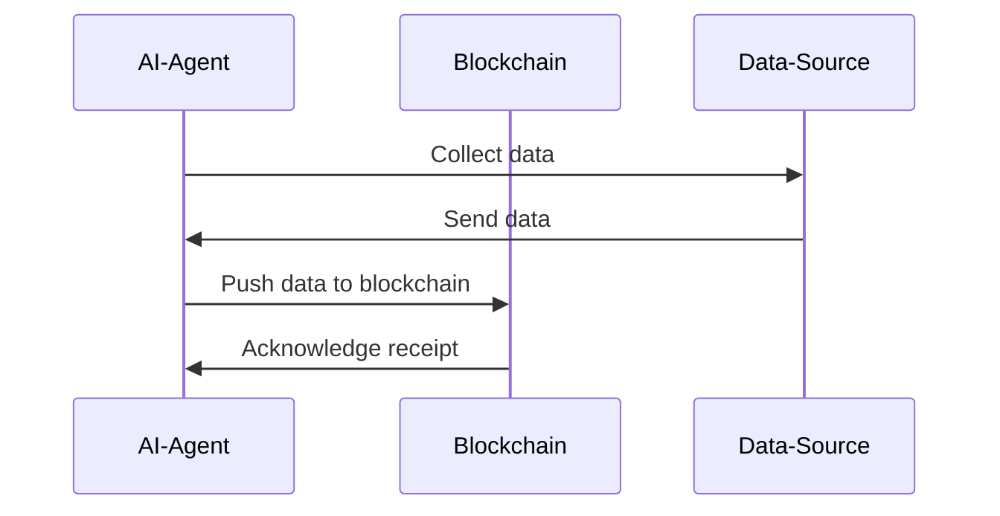

                 

# 企业AI Agent的区块链数据审计系统

## 关键词

- 企业AI代理
- 区块链
- 数据审计
- 人工智能
- 安全性
- 可扩展性

## 摘要

本文将深入探讨企业AI代理在区块链数据审计系统中的应用。首先，我们将介绍AI代理和区块链技术的核心概念，并探讨它们在商业环境中如何协同工作。接下来，我们将详细分析区块链数据审计系统的架构和设计，包括核心组件和关键技术。随后，我们将探讨实际应用案例，展示该系统如何解决企业面临的数据安全和审计挑战。最后，我们将总结本文的关键点，并提出未来研究的方向。

## 引言

在数字化时代，数据已成为企业的核心资产。然而，随着数据量的急剧增长和数据来源的多样化，如何确保数据的安全性和完整性成为一个日益严峻的挑战。企业AI代理和区块链技术的出现为解决这些问题提供了新的思路。

企业AI代理是一种基于人工智能的自动化代理，能够在复杂的商业环境中执行任务和决策。它们可以处理大量数据，自动执行复杂流程，提高企业的运营效率。区块链技术则提供了一种去中心化、不可篡改的数据存储和管理方式，确保数据的安全性和透明性。

本文将探讨如何将AI代理与区块链技术结合起来，构建一个强大的数据审计系统，以帮助企业应对数据安全和审计的挑战。

## AI代理与区块链技术

### AI代理

AI代理是一种能够模拟人类智能的自动化系统。它们基于机器学习和自然语言处理技术，可以自主学习、推理和决策。AI代理在商业环境中有着广泛的应用，如智能客服、自动化交易、供应链管理等。

**核心概念**：

- **机器学习**：通过训练数据集，使AI代理能够识别模式和趋势。
- **自然语言处理**：使AI代理能够理解和生成自然语言，进行人机交互。
- **推理**：基于已知信息和规则，AI代理能够进行逻辑推理和决策。

**应用场景**：

- **客户服务**：AI代理可以自动回答客户咨询，提高客户满意度。
- **自动化交易**：AI代理可以根据市场数据和交易规则，自动执行交易。
- **供应链管理**：AI代理可以实时监控供应链状态，优化库存管理。

### 区块链技术

区块链技术是一种去中心化的数据库技术，通过多个节点共同维护数据的一致性。区块链的特点包括去中心化、不可篡改、透明性和安全性。

**核心概念**：

- **去中心化**：数据存储在多个节点上，没有中央权威机构。
- **不可篡改**：一旦数据记录在区块链上，就很难被篡改。
- **透明性**：所有区块链上的数据都是公开的，可以追溯。
- **安全性**：区块链采用加密算法，确保数据的安全性。

**应用场景**：

- **金融**：区块链可以用于金融交易，提高交易的安全性和透明性。
- **供应链管理**：区块链可以用于跟踪供应链中的物品，确保供应链的透明和可追溯。
- **数据存储**：区块链可以用于存储重要数据，确保数据的安全性和完整性。

### AI代理与区块链技术的结合

将AI代理与区块链技术结合起来，可以构建一个强大的数据审计系统。AI代理可以自动收集、分析和处理数据，而区块链技术可以确保数据的透明性和不可篡改性。

**优势**：

- **安全性**：区块链技术确保数据的安全性和完整性，防止数据篡改。
- **透明性**：所有数据都在区块链上公开透明，便于审计和追溯。
- **自动化**：AI代理可以自动化处理数据审计流程，提高效率。

**挑战**：

- **性能**：区块链技术目前还存在性能瓶颈，难以处理大量实时数据。
- **成本**：区块链技术的部署和维护成本较高，可能不适合所有企业。
- **隐私**：尽管区块链技术确保数据的透明性，但企业可能需要权衡隐私和透明性的关系。

### 应用场景

以下是一些将AI代理与区块链技术结合的应用场景：

- **金融审计**：AI代理可以自动收集和分析金融交易数据，区块链技术确保数据的安全性和透明性。
- **供应链审计**：AI代理可以监控供应链中的活动，区块链技术确保供应链的透明和可追溯。
- **人力资源审计**：AI代理可以分析员工数据，区块链技术确保员工记录的完整性和准确性。

## 区块链数据审计系统设计

### 系统架构

区块链数据审计系统的架构包括多个核心组件，如图所示：

**核心组件**：

- **AI-Agent**：负责数据收集、分析和处理。
- **Blockchain**：存储和验证数据。
- **Data-Source**：提供原始数据。

### 数据处理流程

数据处理流程包括以下步骤：

1. **数据收集**：AI-Agent从各种数据源收集数据。
2. **数据预处理**：对收集到的数据进行分析和清洗。
3. **数据审核**：使用区块链技术验证数据的完整性和准确性。
4. **数据存储**：将审核通过的数据存储在区块链上。
5. **数据审计**：定期对区块链上的数据进行分析和审计。

### 关键技术

- **加密算法**：用于确保数据的安全性。
- **分布式存储**：确保数据的可靠性和可用性。
- **智能合约**：用于自动化数据审计流程。

## 实际应用案例

### 案例一：金融审计

某金融机构采用区块链数据审计系统对交易数据进行审计。AI-Agent自动收集交易数据，区块链技术确保数据的完整性和透明性。通过定期审计，机构能够及时发现和处理异常交易，提高风险管理能力。

### 案例二：供应链审计

某制造企业使用区块链数据审计系统跟踪供应链中的物品。AI-Agent监控供应链活动，区块链技术确保供应链的透明和可追溯。通过实时审计，企业能够提高供应链效率，降低成本。

## 总结

本文探讨了企业AI代理在区块链数据审计系统中的应用。通过结合AI代理和区块链技术，企业能够实现数据的安全性和透明性。尽管面临一些挑战，如性能和成本问题，但随着技术的发展，区块链数据审计系统有望在未来得到更广泛的应用。

## 未来研究方向

- **性能优化**：提高区块链技术的处理性能，以支持大量实时数据。
- **隐私保护**：研究如何在确保数据透明性的同时保护用户隐私。
- **跨链互操作**：研究如何实现不同区块链之间的互操作性。

## 参考文献

1. "Blockchain Technology: A Comprehensive Guide for Business Leaders," by Alex Tapscott and Don Tapscott, 2016.
2. "Artificial Intelligence: A Modern Approach," by Stuart Russell and Peter Norvig, 2016.
3. "The Blockchain Revolution: How the Technology Behind Bitcoin Is Changing Money, Business, and the World," by Don Tapscott and Alex Tapscott, 2016.

## 作者

作者：AI天才研究院/AI Genius Institute & 禅与计算机程序设计艺术 /Zen And The Art of Computer Programming

**本文的核心概念、原理、设计方法和实现策略在文中已详细阐述。希望本文对您在区块链数据审计系统开发和研究方面有所启发。**

