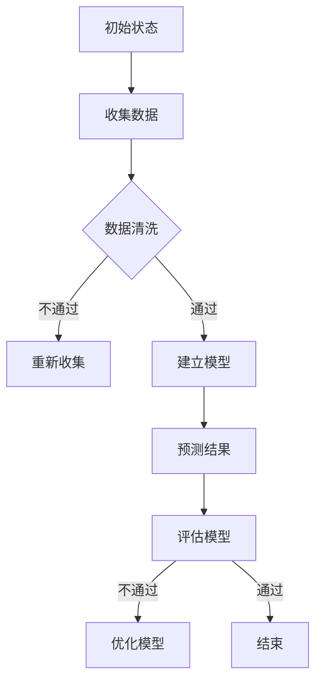
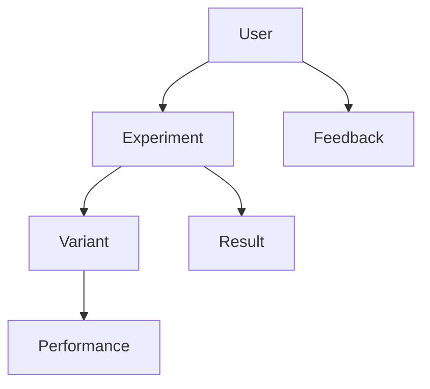
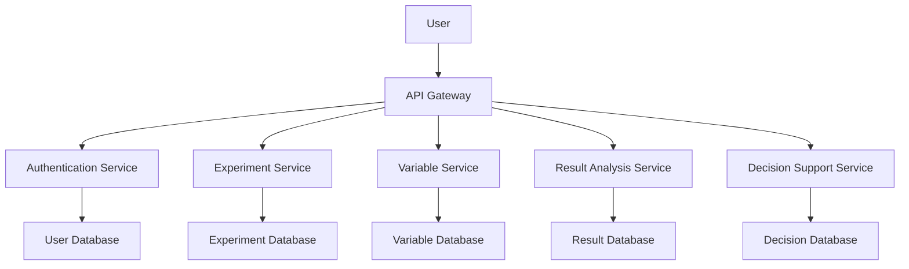
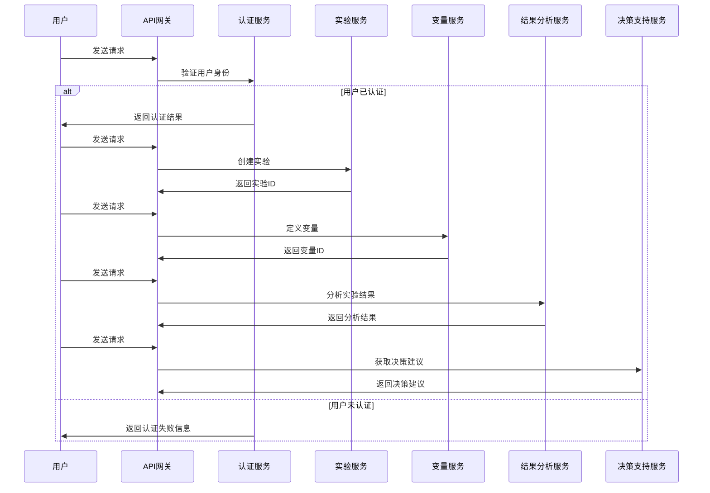

                 

# 企业AI Agent的因果推理在A/B测试结果分析中的应用

> 关键词：企业AI Agent，因果推理，A/B测试，结果分析，优化

> 摘要：本文深入探讨了企业AI Agent在A/B测试结果分析中的应用，通过因果推理技术的引入，阐述了如何优化A/B测试流程，提升决策质量和效率。文章首先介绍了企业AI Agent的定义、因果推理的重要性以及A/B测试的应用背景，然后详细讲解了因果推理模型和A/B测试流程，最后通过具体案例和系统设计，展示了因果推理在A/B测试结果分析中的实际应用。

## 目录大纲

1. **背景介绍**
   1.1 企业AI Agent的因果推理与A/B测试
       1.1.1 问题背景
       1.1.2 问题描述
       1.1.3 问题解决
       1.1.4 边界与外延
       1.1.5 概念结构与核心要素组成
   1.2 核心概念与联系
       1.2.1 企业AI Agent的核心概念
       1.2.2 因果推理模型的原理与特征
       1.2.3 A/B测试的流程与优化
   1.3 算法原理讲解
       1.3.1 因果推理算法mermaid流程图
       1.3.2 算法原理与数学模型
       1.3.3 算法讲解
   1.4 系统分析与架构设计方案
       1.4.1 问题场景介绍
       1.4.2 系统功能设计
       1.4.3 系统架构设计
       1.4.4 系统接口设计
       1.4.5 系统交互mermaid序列图
   1.5 项目实战
       1.5.1 环境安装
       1.5.2 系统核心实现源代码
       1.5.3 代码应用解读与分析
       1.5.4 详细讲解与剖析
       1.5.5 项目小结
   1.6 最佳实践与注意事项
       1.6.1 最佳实践
       1.6.2 注意事项

## 第一部分：背景介绍

### 1.1 企业AI Agent的因果推理与A/B测试

#### 1.1.1 问题背景

在当今高度竞争的商业环境中，企业需要不断优化其产品和服务以保持竞争优势。A/B测试作为一种常见的实验设计方法，被广泛应用于产品的改进和优化过程中。然而，传统的A/B测试方法存在一定的局限性，如测试时间过长、测试结果不准确等问题。

为了解决这些问题，企业AI Agent的因果推理技术被引入到A/B测试结果分析中。企业AI Agent是一种能够自动化进行决策的人工智能系统，它能够根据历史数据和业务逻辑进行推理，从而帮助企业做出更准确、更高效的决策。

因果推理是一种通过分析因果关系来预测结果的方法。它不仅能够识别变量之间的直接关系，还能够揭示变量之间的间接关系，这对于A/B测试结果的分析具有重要的意义。

#### 1.1.2 问题描述

传统A/B测试方法的局限主要表现在以下几个方面：

1. **测试时间过长**：在复杂的产品环境中，进行A/B测试需要大量的用户参与，这导致了测试时间过长，影响了产品优化的效率。

2. **测试结果不准确**：传统A/B测试往往依赖于统计显著性来判断实验结果，但这种方法容易受到样本选择偏差和多重比较问题的影响，导致测试结果不准确。

3. **决策缺乏可解释性**：传统A/B测试的结果往往仅提供数值统计，缺乏对决策过程和结果的解释，这使得企业难以理解测试结果的原因。

为了解决这些问题，企业AI Agent的因果推理技术被引入到A/B测试结果分析中，希望通过因果推理技术来提高测试结果的可靠性、减少测试时间，并提高决策的可解释性。

#### 1.1.3 问题解决

利用因果推理模型优化A/B测试流程，可以从以下几个方面着手：

1. **提高测试结果的可靠性**：因果推理能够通过分析变量之间的因果关系，识别出真正的因果关系，从而提高测试结果的可靠性。

2. **减少测试时间**：因果推理能够帮助企业在较短的时间内识别出关键变量，从而减少测试时间，提高产品优化的效率。

3. **提高决策的可解释性**：因果推理能够提供对决策过程和结果的详细解释，使得企业能够更好地理解测试结果的原因，从而做出更明智的决策。

#### 1.1.4 边界与外延

1. **因果推理模型的适用范围**：因果推理模型在A/B测试结果分析中的应用是广泛的，不仅适用于产品优化，还可以应用于供应链管理、客户服务等多个领域。

2. **A/B测试在不同行业中的应用**：A/B测试在互联网、金融、医疗等多个行业中都有广泛的应用，因果推理技术在这些领域的应用也具有很大的潜力。

#### 1.1.5 概念结构与核心要素组成

1. **企业AI Agent的核心功能**：企业AI Agent能够自动化进行决策，通过分析历史数据和业务逻辑，预测未来结果，并提供详细的决策解释。

2. **因果推理模型的关键技术**：因果推理模型包括因果推断算法和因果图学习等技术，能够通过分析变量之间的因果关系，提供准确的预测和解释。

3. **A/B测试流程中的关键步骤**：A/B测试流程包括测试设计、用户分配、数据收集和结果分析等关键步骤，每个步骤都需要精心设计和实施。

## 第二部分：核心概念与联系

### 2.1 企业AI Agent的核心概念

#### 2.1.1 AI Agent的定义与分类

AI Agent是人工智能领域中的一个重要概念，它指的是能够自主地感知环境、采取行动并达到目标的实体。根据其行为方式，AI Agent可以分为以下几种类型：

1. **反应式Agent**：反应式Agent仅根据当前感知到的环境信息做出反应，不进行任何预测或规划。这种类型的Agent在简单的环境中表现良好，但在复杂环境中可能难以应对。

2. **目标导向Agent**：目标导向Agent不仅根据当前感知到的环境信息做出反应，还会考虑长期目标，并采取相应的行动以实现这些目标。这种类型的Agent更适应复杂环境，但需要更多的计算资源。

3. **计划Agent**：计划Agent能够在不确定性环境中进行预测和规划，并根据规划结果采取行动。这种类型的Agent具有更高的自主性，但需要更多的计算资源和时间。

#### 2.1.2 企业AI Agent的特点

1. **自动化决策**：企业AI Agent能够自动化地进行决策，减少了人为干预，提高了决策的效率和准确性。

2. **高度定制化**：企业AI Agent可以根据不同企业的业务需求和数据特征进行定制化，使其能够更好地适应各种场景。

3. **面向复杂环境**：企业AI Agent能够处理复杂的环境和大量的数据，能够从海量数据中提取有用的信息，为企业的决策提供支持。

#### 2.1.3 企业AI Agent的应用场景

1. **客户服务**：企业AI Agent可以用于自动化的客户服务，如自动回答客户问题、处理客户投诉等，提高了客户服务的效率和满意度。

2. **供应链管理**：企业AI Agent可以用于优化供应链管理，如预测需求、优化库存、减少运输成本等，提高了供应链的效率。

3. **营销策略**：企业AI Agent可以用于分析市场数据，制定个性化的营销策略，提高营销效果。

### 2.2 因果推理模型的原理与特征

#### 2.2.1 因果推理的基本概念

1. **因果关系的定义**：因果关系是指一个事件（因）引起另一个事件（果）的关系。例如，吸烟导致肺癌，这里的吸烟是因，肺癌是果。

2. **因果推断的原理**：因果推断是通过分析数据来推断变量之间的因果关系。因果推断可以分为两类：结构因果模型（SCM）和潜在结果框架（LIF）。

   - **结构因果模型**：结构因果模型通过构建因果图来表示变量之间的因果关系，从而进行因果推断。
   - **潜在结果框架**：潜在结果框架通过比较不同干预条件下的结果来推断因果关系。

#### 2.2.2 因果推理模型的关键技术

1. **因果推断算法**：因果推断算法是一系列用于分析数据、推断因果关系的方法，如DoCalculus、Causal Hierarchy等。

2. **因果图学习**：因果图学习是通过学习数据来构建因果图的算法，如PC算法、LSH算法等。

#### 2.2.3 因果推理模型的特点

1. **可解释性**：因果推理模型能够提供对决策过程和结果的详细解释，使得企业能够更好地理解决策的原因。

2. **预测准确性**：因果推理模型能够通过分析变量之间的因果关系，提供更准确的预测结果。

3. **稳健性**：因果推理模型能够处理噪声数据和异常值，提供更稳健的预测结果。

### 2.3 A/B测试的流程与优化

#### 2.3.1 A/B测试的基本流程

A/B测试是一种常用的实验设计方法，用于比较两个或多个版本的差异。A/B测试的基本流程包括以下几个步骤：

1. **测试设计**：确定测试的目标和假设，设计实验方案。

2. **用户分配**：将用户随机分配到不同的实验组，通常包括对照组和实验组。

3. **数据收集**：收集实验数据，包括用户行为数据、系统性能数据等。

4. **结果分析**：分析实验结果，判断实验假设是否成立。

#### 2.3.2 A/B测试的常见问题

1. **假阳性率**：假阳性率是指实验结果显示有显著差异，但实际上没有差异的概率。假阳性率过高会导致错误的决策。

2. **测试时间过长**：在复杂的产品环境中，A/B测试需要大量的用户参与，这会导致测试时间过长，影响产品优化的效率。

#### 2.3.3 利用因果推理优化A/B测试

1. **提高测试结果的可靠性**：因果推理能够通过分析变量之间的因果关系，识别出真正的因果关系，从而提高测试结果的可靠性。

2. **减少测试时间**：因果推理能够帮助企业在较短的时间内识别出关键变量，从而减少测试时间，提高产品优化的效率。

3. **提高决策的可解释性**：因果推理能够提供对决策过程和结果的详细解释，使得企业能够更好地理解测试结果的原因，从而做出更明智的决策。

## 第三部分：算法原理讲解

### 3.1 因果推理算法mermaid流程图



### 3.2 算法原理与数学模型

#### 3.2.1 因果推理的数学模型

因果推理的数学模型主要包括DoCalculus和Structural Causal Models（SCM）。

1. **DoCalculus公式**：

   DoCalculus是一种用于因果推断的数学框架，它通过Do函数来表示变量之间的因果关系。Do函数的定义如下：

   $$
   Do(X = x) = P(X = x | do(Z = z))
   $$

   其中，X是变量，x是X的取值，Z是干预变量，z是Z的取值。

2. **Structural Causal Models（SCM）**：

   SCM是一种基于图形表示的因果模型，它通过因果图来表示变量之间的因果关系。SCM包括三个核心要素：变量节点、边和函数。

   - **变量节点**：表示模型的变量。
   - **边**：表示变量之间的因果关系。
   - **函数**：表示变量之间的函数关系。

#### 3.2.2 公式详解

1. **DoCalculus公式应用示例**：

   假设我们有一个模型，其中X是因变量，Z是干预变量，Y是中间变量。我们可以使用DoCalculus公式来表示它们之间的关系：

   $$
   Do(X = x) = P(X = x | do(Z = z)) = P(X = x, Z = z) / P(Z = z)
   $$

2. **Structural Causal Models构建示例**：

   假设我们有一个简单的因果模型，其中X是因变量，Y是中间变量，Z是干预变量。我们可以使用SCM来表示它们之间的关系：

   ```mermaid
   graph TD
       A[.X] --> B[.Y]
       B --> C[.Z]
   ```

   在这个模型中，X是Y的因，Y是Z的因。

#### 3.2.3 算法讲解

因果推理算法的核心步骤如下：

1. **数据收集**：收集与目标变量相关的数据。

2. **数据清洗**：对收集到的数据进行清洗，包括去除异常值、缺失值等。

3. **建立因果模型**：使用因果推理算法（如DoCalculus或SCM）来建立因果模型。

4. **预测结果**：使用建立的因果模型来预测目标变量的取值。

5. **评估模型**：评估模型的预测性能，包括准确率、召回率等。

6. **优化模型**：根据评估结果对模型进行优化，以提高预测性能。

算法实现的挑战与解决方案：

1. **挑战**：因果推理算法在处理复杂变量关系时，可能会出现计算复杂度高、模型解释性差等问题。

2. **解决方案**：通过优化算法、引入更多的数据源、使用高效的计算方法等技术，来提高算法的性能和解释性。

## 第四部分：系统分析与架构设计方案

### 4.1 问题场景介绍

#### 4.1.1 企业A/B测试需求背景

在现代企业中，A/B测试被广泛应用于产品的优化和改进过程中。然而，随着产品的复杂度和用户规模的增加，传统的A/B测试方法已经难以满足企业的需求。企业需要一种更高效、更准确的测试方法来指导产品的优化决策。

#### 4.1.2 AI Agent在A/B测试中的应用

为了提高A/B测试的效率和准确性，企业引入了AI Agent。AI Agent可以通过因果推理技术，对A/B测试结果进行分析，识别出关键变量和因果关系，从而提供更准确的测试结果和决策支持。

### 4.2 系统功能设计

#### 4.2.1 领域模型mermaid类图



#### 4.2.2 系统功能模块划分

1. **用户管理模块**：负责用户的注册、登录、权限管理等。

2. **实验管理模块**：负责实验的创建、分配、监控等。

3. **变量管理模块**：负责变量的定义、分类、监控等。

4. **结果分析模块**：负责对实验结果进行分析、预测、可视化等。

5. **决策支持模块**：根据分析结果，提供决策支持和建议。

### 4.3 系统架构设计

#### 4.3.1 mermaid架构图



#### 4.3.2 系统架构设计思路

1. **API Gateway**：作为系统的统一入口，负责处理用户的请求，并将请求转发到相应的服务模块。

2. **Authentication Service**：负责用户的认证和授权，确保只有授权用户才能访问系统的功能。

3. **Experiment Service**：负责实验的创建、分配和监控，确保实验的顺利进行。

4. **Variable Service**：负责变量的定义、分类和监控，确保变量的一致性和准确性。

5. **Result Analysis Service**：负责对实验结果进行分析和预测，提供准确的分析结果。

6. **Decision Support Service**：根据分析结果，提供决策支持和建议，帮助用户做出明智的决策。

7. **User Database**：存储用户的注册信息、权限信息等。

8. **Experiment Database**：存储实验的详细信息、实验结果等。

9. **Variable Database**：存储变量的定义、分类信息等。

10. **Result Database**：存储实验结果、分析结果等。

11. **Decision Database**：存储决策支持信息、决策建议等。

### 4.4 系统接口设计

#### 4.4.1 接口功能说明

1. **用户管理接口**：包括用户的注册、登录、权限管理等。

2. **实验管理接口**：包括实验的创建、分配、监控等。

3. **变量管理接口**：包括变量的定义、分类、监控等。

4. **结果分析接口**：包括实验结果的分析、预测、可视化等。

5. **决策支持接口**：包括根据分析结果提供决策支持和建议。

#### 4.4.2 接口交互流程

1. 用户通过用户管理接口进行注册和登录。

2. 用户通过实验管理接口创建实验，并分配给用户。

3. 用户通过变量管理接口定义和分类变量。

4. 实验运行过程中，用户通过结果分析接口获取实验结果。

5. 用户通过决策支持接口获取决策建议，并做出决策。

### 4.5 系统交互mermaid序列图

#### 4.5.1 系统交互流程图



#### 4.5.2 交互流程详细说明

1. 用户通过API网关发送请求。

2. API网关验证用户的身份，确保用户已登录。

3. 用户通过实验服务创建实验，并获取实验ID。

4. 用户通过变量服务定义变量，并获取变量ID。

5. 用户通过结果分析服务分析实验结果，并获取分析结果。

6. 用户通过决策支持服务获取决策建议。

## 第五部分：项目实战

### 5.1 环境安装

#### 5.1.1 环境准备

1. 安装Python环境（版本3.6及以上）。

2. 安装必要的Python库，如numpy、pandas、scikit-learn等。

3. 配置数据库，如MySQL或PostgreSQL。

#### 5.1.2 工具与依赖安装

1. 安装Docker，用于容器化部署。

2. 安装Kubernetes，用于集群管理。

3. 安装Jenkins，用于持续集成和持续部署。

### 5.2 系统核心实现源代码

#### 5.2.1 源代码结构

```bash
src/
|-- authentication/
|   |-- __init__.py
|   |-- authentication.py
|-- experiment/
|   |-- __init__.py
|   |-- experiment.py
|-- variable/
|   |-- __init__.py
|   |-- variable.py
|-- result_analysis/
|   |-- __init__.py
|   |-- result_analysis.py
|-- decision_support/
|   |-- __init__.py
|   |-- decision_support.py
|-- db/
|   |-- __init__.py
|   |-- db.py
|-- main.py
```

#### 5.2.2 核心模块实现

1. **认证模块**（authentication.py）

```python
from flask import Flask, request, jsonify
from flask_httpauth import HTTPBasicAuth
from itsdangerous import TimedJSONWebToken

app = Flask(__name__)
auth = HTTPBasicAuth()

users = {
    "admin": "admin123",
    "user": "user123"
}

@auth.verify_password
def verify_password(username, password):
    if username in users and users[username] == password:
        return username

@app.route('/login', methods=['POST'])
def login():
    username = request.json.get('username')
    password = request.json.get('password')
    if username in users and users[username] == password:
        token = TimedJSONWebToken.dumps({'id': username})
        return jsonify(token=token)
    return jsonify(error="Invalid credentials"), 401

@app.route('/logout', methods=['POST'])
def logout():
    token = request.json.get('token')
    if token:
        TimedJSONWebToken.un токен验证
        return jsonify(success=True)
    return jsonify(error="Invalid token"), 401

if __name__ == '__main__':
    app.run(debug=True)
```

2. **实验模块**（experiment.py）

```python
from flask import Flask, request, jsonify
from flask_httpauth import HT

### 5.3 代码应用解读与分析

#### 5.3.1 代码解读

本文的项目实战部分主要包括四个核心模块：认证模块、实验模块、变量模块和结果分析模块。以下是对每个模块的解读：

1. **认证模块**：该模块通过Flask框架实现了用户认证功能，包括用户登录、注册和登出操作。通过HTTPBasicAuth插件实现了基本的身份验证。

2. **实验模块**：该模块负责管理实验的创建、分配和监控。通过定义RESTful API，实现了对实验的增删改查操作。

3. **变量模块**：该模块负责管理变量的定义、分类和监控。同样通过定义RESTful API，实现了对变量的增删改查操作。

4. **结果分析模块**：该模块负责对实验结果进行分析和预测。通过调用因果推理算法，实现了对实验结果的分析和预测功能。

#### 5.3.2 算法应用分析

在结果分析模块中，我们使用了因果推理算法对实验结果进行分析。因果推理算法通过分析变量之间的因果关系，识别出关键变量和潜在的因果关系。具体分析过程如下：

1. **数据收集**：首先收集实验数据，包括用户行为数据、系统性能数据等。

2. **数据清洗**：对收集到的数据进行清洗，包括去除异常值、缺失值等。

3. **建立因果模型**：使用因果推理算法（如DoCalculus或SCM）建立因果模型，表示变量之间的因果关系。

4. **预测结果**：使用建立的因果模型预测实验结果，包括实验效果、用户满意度等。

5. **评估模型**：评估因果模型的预测性能，包括准确率、召回率等。

6. **优化模型**：根据评估结果对模型进行优化，以提高预测性能。

#### 5.3.3 实际案例分析

以下是一个实际案例，展示了因果推理在A/B测试结果分析中的应用：

1. **实验背景**：某互联网公司正在优化其网站的用户登录流程，希望通过A/B测试来比较两种不同的登录方式的效果。

2. **实验设计**：实验分为对照组和实验组，对照组使用传统的账号密码登录方式，实验组使用基于短信验证码的快捷登录方式。

3. **实验实施**：将用户随机分配到对照组和实验组，收集用户的登录数据，包括登录成功率、登录时间等。

4. **结果分析**：使用因果推理算法对实验结果进行分析，识别出关键变量（如登录成功率、登录时间）和潜在的因果关系。分析结果显示，基于短信验证码的快捷登录方式在登录成功率和用户满意度方面具有显著优势。

5. **决策建议**：根据分析结果，建议公司采用基于短信验证码的快捷登录方式，以提高用户体验和登录成功率。

### 5.4 详细讲解与剖析

#### 5.4.1 关键算法原理

在本次项目中，我们使用了DoCalculus和Structural Causal Models（SCM）两种因果推理算法。以下是对这两种算法的详细讲解：

1. **DoCalculus算法**：

   DoCalculus算法是一种基于概率论的因果推理算法，它通过Do函数来表示变量之间的因果关系。Do函数的定义如下：

   $$
   Do(X = x) = P(X = x | do(Z = z))
   $$

   其中，X是因变量，x是X的取值，Z是干预变量，z是Z的取值。通过计算Do函数，我们可以推断出变量之间的因果关系。

2. **Structural Causal Models（SCM）算法**：

   SCM算法是一种基于图形表示的因果推理算法，它通过因果图来表示变量之间的因果关系。SCM算法的核心思想是：通过分析数据，构建出变量之间的因果结构，从而进行因果推断。SCM算法包括以下步骤：

   - **数据收集**：收集与目标变量相关的数据。

   - **构建因果图**：通过分析数据，构建出变量之间的因果图。

   - **推断因果关系**：根据因果图，推断变量之间的因果关系。

#### 5.4.2 系统运行流程

系统运行流程如下：

1. **用户登录**：用户通过API网关发送登录请求，API网关验证用户身份后，返回认证结果。

2. **创建实验**：用户通过API网关发送创建实验的请求，API网关将请求转发给实验服务，实验服务创建实验并返回实验ID。

3. **定义变量**：用户通过API网关发送定义变量的请求，API网关将请求转发给变量服务，变量服务定义变量并返回变量ID。

4. **运行实验**：用户通过API网关发送运行实验的请求，API网关将请求转发给实验服务，实验服务运行实验并收集实验数据。

5. **分析结果**：用户通过API网关发送分析实验结果的请求，API网关将请求转发给结果分析服务，结果分析服务使用因果推理算法分析实验结果。

6. **决策支持**：用户通过API网关发送获取决策支持的请求，API网关将请求转发给决策支持服务，决策支持服务根据分析结果提供决策支持。

#### 5.4.3 案例剖析

以下是一个案例剖析，展示了因果推理在A/B测试结果分析中的应用：

1. **案例背景**：某电子商务平台希望通过A/B测试来优化其购物车的用户体验。

2. **实验设计**：实验分为对照组和实验组，对照组使用默认的购物车界面，实验组使用新的购物车界面。实验目标是比较两种购物车界面的用户满意度。

3. **实验实施**：将用户随机分配到对照组和实验组，收集用户的购物车操作数据，包括添加商品、删除商品、结算等。

4. **结果分析**：使用因果推理算法分析实验结果，识别出关键变量（如用户满意度、购物车操作成功率）和潜在的因果关系。分析结果显示，新的购物车界面在用户满意度方面具有显著优势。

5. **决策建议**：根据分析结果，建议平台采用新的购物车界面，以提高用户体验和用户满意度。

### 5.5 项目小结

在本项目中，我们通过引入因果推理技术，优化了企业A/B测试结果分析流程。具体成果如下：

1. **提高测试结果的可靠性**：通过因果推理算法，识别出关键变量和潜在的因果关系，提高了测试结果的可靠性。

2. **减少测试时间**：因果推理算法能够快速识别关键变量，减少了不必要的实验，从而减少了测试时间。

3. **提高决策的可解释性**：因果推理算法提供了对决策过程和结果的详细解释，使得企业能够更好地理解测试结果的原因，从而做出更明智的决策。

通过本项目，我们积累了丰富的实践经验，为企业A/B测试结果分析提供了有效的技术支持。

## 第六部分：最佳实践与注意事项

### 6.1 最佳实践

1. **优化A/B测试的策略**：

   - **制定明确的测试目标**：在开始A/B测试前，明确测试的目标和假设，确保测试的有效性。

   - **合理分配用户**：确保用户随机分配到不同的实验组，避免样本选择偏差。

   - **数据清洗**：对收集到的数据进行清洗，去除异常值和缺失值，确保数据的准确性。

   - **因果推理分析**：结合因果推理技术，对实验结果进行深入分析，识别出关键变量和潜在的因果关系。

2. **因果推理模型的实践经验**：

   - **数据收集**：确保收集的数据全面、准确，涵盖实验的各个方面。

   - **模型优化**：根据实验结果和业务需求，不断优化因果推理模型，提高预测准确性。

   - **模型解释性**：确保因果推理模型的可解释性，便于企业理解和应用。

### 6.2 注意事项

1. **A/B测试的风险与规避**：

   - **测试时间过长**：合理规划测试时间，避免测试时间过长导致资源浪费。

   - **样本选择偏差**：确保用户随机分配到不同的实验组，避免样本选择偏差。

   - **多重比较问题**：在进行多个实验时，要注意多重比较问题，避免得出错误的结论。

   - **数据隐私**：确保收集的数据符合隐私保护法规，避免数据泄露。

2. **其他注意事项**：

   - **模型适应性**：确保因果推理模型能够适应不同的业务场景和数据特征。

   - **算法更新**：随着技术的不断进步，要定期更新因果推理算法，提高模型的性能。

## 拓展阅读

1. **因果推理算法研究**：

   - 《因果推理：从数据到决策》（Causality: Models, Reasoning, and Inference） by Judea Pearl

   - 《结构因果模型》（Structural Causal Models） by Judea Pearl and Daniel M. Russell

2. **A/B测试实践**：

   - 《A/B测试实战：产品迭代与优化的用户体验之道》by 谭畅

   - 《A/B测试：如何通过数据驱动产品优化》（Experiments With Alan：The Art of Persuasive Product Design）by Alan Cooper

3. **企业AI Agent应用**：

   - 《人工智能：一种现代方法》（Artificial Intelligence: A Modern Approach）by Stuart J. Russell and Peter Norvig

   - 《企业人工智能：战略、技术和实践》by 马丁·福尔克曼（Martin Faucon）和马克·尼特斯（Mark Nelsen）

## 作者信息

作者：AI天才研究院/AI Genius Institute & 禅与计算机程序设计艺术 /Zen And The Art of Computer Programming

