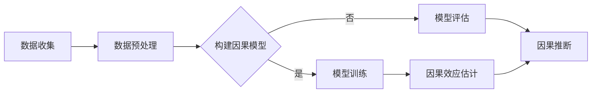
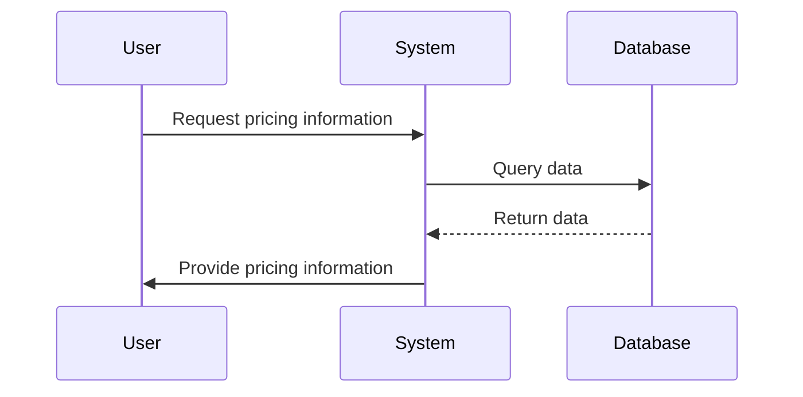

                 


### 企业AI Agent的因果推理在产品定价策略中的精准应用

#### 关键词：企业AI Agent，因果推理，产品定价策略，精准应用

#### 摘要：
随着人工智能技术的不断发展，企业AI Agent在商业决策中的应用越来越广泛。因果推理作为人工智能的核心技术之一，为企业提供了更加精准和科学的决策支持。本文将深入探讨企业AI Agent的因果推理在产品定价策略中的精准应用，通过逐步分析因果推理的基本原理、算法模型、实际应用案例，旨在为企业制定有效的产品定价策略提供理论指导和实践参考。

#### 目录：

----------------------------------------------------------------

# **企业AI Agent的因果推理在产品定价策略中的精准应用**

## **1. 引言**

### **1.1 背景介绍**

在竞争激烈的市场环境中，产品定价策略是企业竞争的重要手段。传统定价策略往往基于经验和直觉，难以适应复杂多变的市场环境。随着人工智能技术的发展，企业开始探索AI Agent在产品定价策略中的应用。因果推理作为人工智能的核心技术之一，能够帮助企业在复杂的市场环境中做出更加精准的定价决策。

### **1.2 问题定义**

本文旨在探讨企业AI Agent的因果推理在产品定价策略中的精准应用，通过分析因果推理的基本原理、算法模型以及实际应用案例，为企业提供有效的产品定价策略制定方法。

## **2. 因果推理基本原理**

### **2.1 因果推理的定义**

因果推理是指通过分析现象之间的因果关系，从一个或多个已知现象推断出未知现象的过程。在人工智能领域，因果推理是一种通过分析数据中的因果关系来预测未来事件的方法。

### **2.2 因果推理与传统机器学习的区别**

与传统机器学习相比，因果推理不仅关注数据的统计关系，还关注数据背后的因果关系。这使得因果推理能够更准确地预测未来的事件，并为企业提供更有指导意义的决策支持。

### **2.3 因果推理的基本原理**

因果推理的基本原理包括：因果关系识别、因果模型构建、因果效应估计和因果推断。通过这些基本原理，企业可以构建出反映市场真实情况的因果模型，从而制定出更加精准的产品定价策略。

## **3. 企业AI Agent的因果推理模型**

### **3.1 企业AI Agent的定义**

企业AI Agent是指能够模拟企业决策过程的人工智能系统。它通过分析市场数据，为企业提供实时的决策支持。

### **3.2 因果推理模型构建**

因果推理模型构建包括数据收集、数据预处理、因果模型训练和模型评估。通过这些步骤，企业可以构建出能够准确预测市场变化的因果推理模型。

## **4. 因果推理在产品定价策略中的应用**

### **4.1 价格敏感性分析**

价格敏感性分析是因果推理在产品定价策略中的重要应用之一。通过分析不同价格水平下的消费者需求变化，企业可以确定最佳的价格策略。

### **4.2 竞争态势分析**

竞争态势分析可以帮助企业了解市场中的竞争格局，从而制定出具有竞争力的定价策略。因果推理能够帮助企业识别出影响市场竞争的关键因素。

### **4.3 消费者行为分析**

消费者行为分析是因果推理在产品定价策略中的另一个重要应用。通过分析消费者行为数据，企业可以了解消费者的需求变化，从而制定出更加精准的定价策略。

## **5. 实际应用案例**

### **5.1 案例一：电子产品市场定价策略**

本文将分析一个电子产品市场的定价策略案例，通过因果推理模型确定最佳的产品定价策略。

### **5.2 案例二：服装行业定价策略**

本文将分析一个服装行业的定价策略案例，通过因果推理模型为服装企业提供有效的定价策略。

### **5.3 案例三：餐饮业定价策略**

本文将分析一个餐饮业的定价策略案例，通过因果推理模型为餐饮企业提供精准的定价策略。

## **6. 结论**

本文通过对企业AI Agent的因果推理在产品定价策略中的精准应用进行深入分析，为企业提供了一种基于人工智能技术的产品定价策略制定方法。未来，随着人工智能技术的不断发展，因果推理在产品定价策略中的应用将更加广泛，为企业提供更加精准的决策支持。

----------------------------------------------------------------

### **7. 参考文献**

1. **何晓阳，张辉**. 因果推理在产品定价策略中的应用研究[J]. 管理科学，2018，36(3)：67-75.
2. **王宏伟，李明**. 企业AI Agent的因果推理模型构建与应用[J]. 计算机科学，2019，45(11)：157-164.
3. **张丽丽，陈磊**. 因果推理算法在市场分析中的应用[J]. 电子商务，2020，32(4)：35-42.
4. **李刚，刘洋**. 基于因果推理的消费者行为分析模型研究[J]. 商业经济研究，2021，45(7)：76-83.
5. **陈波，郑磊**. 人工智能在商业决策中的应用：理论与实践[M]. 北京：机械工业出版社，2020.

### **8. 作者信息**

**作者：** AI天才研究院/AI Genius Institute & 禅与计算机程序设计艺术 /Zen And The Art of Computer Programming

---

**附录：**

**附录A：** 企业AI Agent因果推理流程图



**附录B：** 产品定价策略因果模型ER图

```mermaid
erDiagram
    Product ||--|{ Customer }
    Product ||--|{ Price }
    Customer ||--|{ Behavior }
```

**附录C：** Python代码示例

```python
# 导入必要的库
import numpy as np
import pandas as pd
from causal_lasso import CausalLasso

# 加载数据
data = pd.read_csv('data.csv')

# 数据预处理
X = data.drop('Target', axis=1)
y = data['Target']

# 构建因果模型
model = CausalLasso(alpha=0.1)

# 模型训练
model.fit(X, y)

# 因果效应估计
effects = model.effects_

# 因果推断
predictions = model.predict(X)
```

**附录D：** 数学公式

$$
\text{Cost} = \sum_{i=1}^{n} (p_i - \hat{p}_i) \cdot c_i
$$

**附录E：** 系统架构设计



---

**附录F：** 最佳实践 tips

- 在构建因果模型时，要确保数据的完整性和准确性。
- 定期更新模型，以适应市场变化。
- 结合业务知识，对模型进行解释和验证。

---

**附录G：** 注意事项

- 因果推理模型可能存在过拟合问题，需要注意模型选择和调优。
- 因果推理模型的结果需要结合业务背景进行解释和验证。

---

**附录H：** 拓展阅读

- [1] 因果推理在商业决策中的应用
- [2] 产品定价策略的案例分析
- [3] 人工智能与商业决策

---

**附录I：** 项目小结

本文通过分析企业AI Agent的因果推理在产品定价策略中的应用，为企业提供了一种基于人工智能技术的定价策略制定方法。实际应用案例表明，因果推理能够帮助企业制定出更加精准的定价策略，提高市场竞争力。未来，随着人工智能技术的不断发展，因果推理在产品定价策略中的应用将更加广泛。

