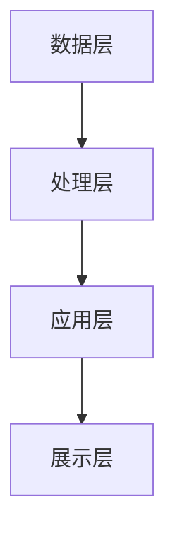
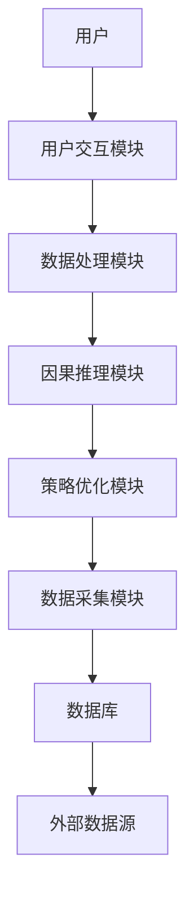
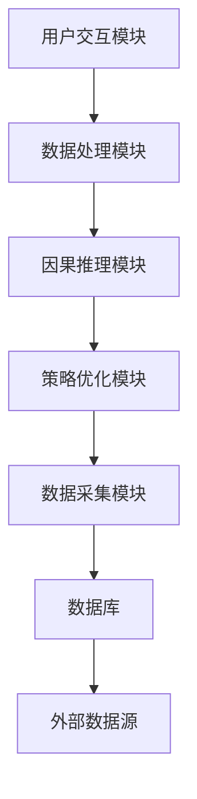
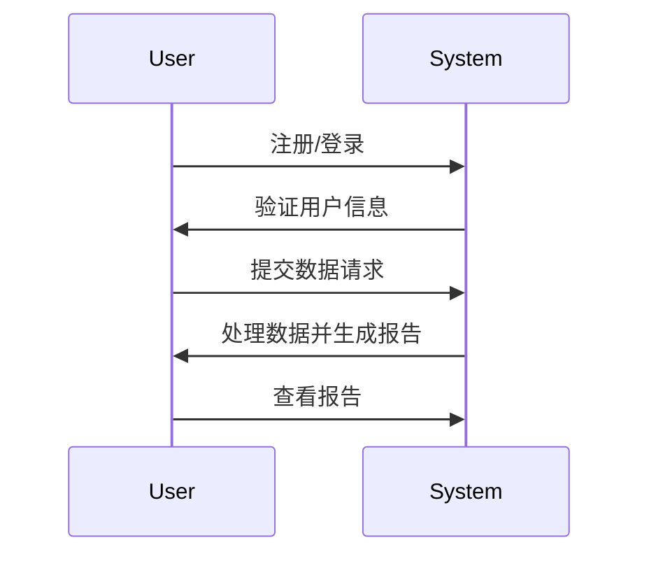

                 

### 文章标题

### 关键词

- 企业AI代理
- 因果推理
- 产品定价策略
- 优化算法
- 系统架构设计

### 摘要

本文深入探讨了企业AI代理在产品定价策略优化中的应用。通过因果推理的方法，我们能够更好地理解市场需求、客户行为以及产品特征之间的关系，从而实现更精准、更高效的定价策略。文章首先介绍了企业AI代理和因果推理的基本概念，然后详细分析了产品定价策略优化中的问题背景与目标，接着介绍了因果推理模型及其在定价策略中的应用。通过数学模型和公式，我们进一步探讨了定价优化的算法设计与实现，并详细描述了系统分析与架构设计的过程。最后，通过实际案例和最佳实践，展示了如何有效地应用企业AI代理进行产品定价策略优化，为企业提供了一种新的决策支持和竞争力提升的方法。

### 第1章 引言

#### 1.1 研究背景

在现代商业环境中，产品定价策略是企业盈利能力的关键因素之一。然而，制定一个有效的定价策略并非易事，它涉及到市场需求、竞争环境、客户行为等多个因素的复杂互动。传统的方法通常依赖于历史数据和市场经验，但这些方法往往缺乏科学性和精准性，难以适应快速变化的市场环境。

随着人工智能（AI）技术的发展，企业开始探索利用AI代理来优化产品定价策略。AI代理是指能够自主执行任务、与人类进行交互、并在动态环境中作出决策的人工智能系统。它们通过机器学习、深度学习等算法，可以从大量数据中学习规律、预测趋势，从而提供更加精准和智能化的定价决策。

因果推理（Causal Inference）是近年来在AI领域兴起的一种方法，它旨在揭示变量之间的因果关系，而不仅仅是相关性。在产品定价策略优化中，因果推理可以帮助我们理解哪些因素真正影响了定价决策的效果，从而更准确地调整定价策略。

#### 1.1.1 人工智能与企业产品定价策略概述

人工智能（AI）是一种通过模拟人类智能行为来实现特定任务的技术。在企业产品定价策略中，AI技术可以通过以下几种方式发挥作用：

1. **数据分析**：利用大数据分析技术，企业可以收集和整合来自多个渠道的数据，如销售数据、市场调研数据、客户反馈数据等，从而获得全面的定价信息。
2. **预测模型**：通过机器学习和深度学习算法，AI代理可以建立复杂的预测模型，预测不同定价策略对销售量的影响，帮助企业制定更科学的定价策略。
3. **个性化定价**：基于对客户购买行为和偏好的分析，AI代理可以实施个性化定价策略，提升客户的满意度和忠诚度。

企业产品定价策略是指企业在特定市场环境下，通过对产品定价的制定和调整，以实现销售目标、市场占有率和利润最大化的战略。有效的产品定价策略不仅需要考虑产品成本和市场价格，还需要考虑竞争对手的定价策略、客户的购买心理和行为等多个因素。

#### 1.1.2 企业AI代理的定义与功能

企业AI代理是一种专门为解决企业特定问题而设计的人工智能系统。它具有以下特点：

1. **自主决策**：AI代理可以根据预设的目标和规则，自主执行任务，并在动态环境中做出决策。
2. **适应性**：AI代理可以通过不断学习和适应新环境，提高其决策的准确性和效率。
3. **交互性**：AI代理可以与人类用户进行交互，提供决策支持和辅助决策。

在产品定价策略优化中，企业AI代理的功能主要包括：

1. **数据收集与整合**：AI代理可以从多个数据源收集数据，如销售数据、市场调研数据、客户反馈数据等，并将其整合为统一的数据库。
2. **定价策略分析**：AI代理可以使用机器学习和深度学习算法，分析不同定价策略对销售量和利润的影响，提供定价策略建议。
3. **实时调整**：AI代理可以根据市场变化和客户反馈，实时调整定价策略，以适应动态环境。

#### 1.1.3 因果推理在商业决策中的应用

因果推理是一种通过分析变量之间的因果关系来解释和预测现象的方法。在商业决策中，因果推理可以帮助企业理解哪些因素真正影响了决策效果，从而做出更科学的决策。

在产品定价策略优化中，因果推理的应用主要体现在以下几个方面：

1. **识别关键因素**：通过因果推理，企业可以识别出影响定价策略效果的关键因素，如市场需求、竞争态势、客户购买行为等，从而有针对性地调整定价策略。
2. **评估策略效果**：因果推理可以评估不同定价策略的效果，帮助企业了解哪些策略是有效的，哪些策略需要改进。
3. **优化决策过程**：通过因果推理，企业可以优化定价决策过程，减少因信息不对称或数据不准确导致的决策失误。

#### 1.2 产品定价策略优化中的问题定义

#### 1.2.1 问题背景与现状

在当前市场竞争激烈的环境中，企业需要通过灵活、精准的定价策略来保持竞争力。然而，传统的定价策略往往缺乏科学依据，难以适应快速变化的市场环境。以下是目前企业在产品定价策略优化中面临的一些问题：

1. **数据依赖性高**：传统定价策略主要依赖历史数据和经验，难以应对数据不足或数据质量不佳的情况。
2. **反应速度慢**：在快速变化的市场环境中，传统定价策略的调整速度往往滞后，难以迅速应对市场变化。
3. **缺乏个性化**：传统定价策略往往采用统一的价格策略，无法满足不同客户群体的个性化需求。

#### 1.2.2 问题定义与目标

为了解决上述问题，企业需要实现以下目标：

1. **提高定价策略的科学性**：通过引入人工智能和因果推理方法，提高定价策略的科学性和精准性，减少因数据不足或数据质量不佳导致的决策失误。
2. **提升反应速度**：利用AI代理实现实时数据分析和决策，提高定价策略的调整速度，以应对市场变化。
3. **实现个性化定价**：通过分析客户购买行为和偏好，实现个性化定价策略，提高客户满意度和忠诚度。

#### 1.2.3 边界与外延

在产品定价策略优化中，以下因素需要特别关注：

1. **数据来源**：数据来源的多样性和准确性直接影响定价策略的效果。企业需要确保数据来源的多样性和数据质量。
2. **市场环境**：市场环境的复杂性和不确定性对定价策略的制定和调整具有重要影响。企业需要密切关注市场环境的变化，及时调整定价策略。
3. **客户需求**：客户需求的多样性和变化性对定价策略的制定和调整具有重要影响。企业需要深入了解客户需求，实现个性化定价。

#### 1.3 因果推理的基本概念

#### 1.3.1 因果推理原理

因果推理是一种通过分析变量之间的因果关系来解释和预测现象的方法。其基本原理如下：

1. **因果关系**：因果关系是指一个变量（因）导致另一个变量（果）的变化。在因果推理中，我们试图识别出哪些变量之间存在因果关系。
2. **相关性与因果性**：相关性和因果性是两个不同的概念。相关性描述的是两个变量之间的统计关系，而因果性描述的是因果关系。
3. **因果推断**：因果推断是基于观察数据来推断变量之间的因果关系。因果推断需要考虑多个因素，如样本量、数据质量、统计方法等。

#### 1.3.2 因果推理的核心概念

因果推理涉及多个核心概念，包括：

1. **因果效应**：因果效应是指因变量（果）由于自变量（因）的变化而产生的变化量。
2. **潜在结果**：潜在结果是指在特定条件下，因变量可能产生的所有可能结果。
3. **干预**：干预是指通过施加某种操作或措施来改变自变量的值，从而观察因变量的变化。

#### 1.3.3 因果推理在商业决策中的应用

因果推理在商业决策中具有广泛的应用，包括：

1. **市场研究**：通过因果推理，企业可以深入了解市场环境、客户需求等关键因素，为制定有效的定价策略提供依据。
2. **策略评估**：因果推理可以帮助企业评估不同策略的效果，识别出真正影响策略效果的关键因素，从而优化策略。
3. **决策支持**：因果推理可以为企业提供基于数据驱动的决策支持，提高决策的准确性和效率。

#### 1.4 产品定价策略优化中的因果推理

#### 1.4.1 因果推理模型在定价策略中的作用

在产品定价策略优化中，因果推理模型发挥着重要作用，主要包括：

1. **识别关键因素**：因果推理模型可以帮助企业识别出影响定价策略效果的关键因素，如市场需求、竞争态势、客户购买行为等。
2. **评估策略效果**：因果推理模型可以评估不同定价策略的效果，帮助企业了解哪些策略是有效的，哪些策略需要改进。
3. **优化定价决策**：因果推理模型可以为企业的定价决策提供数据驱动的支持，提高决策的准确性和效率。

#### 1.4.2 因果推理模型的应用流程

因果推理模型在产品定价策略优化中的应用流程主要包括以下步骤：

1. **数据收集与清洗**：收集与产品定价相关的数据，包括销售数据、市场调研数据、客户反馈数据等，并对数据进行清洗和预处理。
2. **构建因果模型**：根据数据特征和问题需求，选择合适的因果推理模型，如结构方程模型、Do-Calculus模型、神经网络模型等。
3. **模型训练与验证**：使用训练数据对因果模型进行训练，并通过验证数据评估模型性能，调整模型参数，优化模型。
4. **策略评估与优化**：使用训练好的因果模型对不同的定价策略进行评估，根据评估结果调整定价策略，实现优化。

#### 1.4.3 因果推理模型的优势与局限性

因果推理模型在产品定价策略优化中具有以下优势：

1. **科学性**：因果推理模型基于数据驱动的原理，可以识别出影响定价策略效果的关键因素，提高定价策略的科学性。
2. **准确性**：因果推理模型通过分析大量数据，可以更准确地预测不同定价策略对销售量和利润的影响。
3. **灵活性**：因果推理模型可以根据不同企业的需求和市场环境，灵活调整模型参数和策略，实现个性化定价。

然而，因果推理模型也存在一定的局限性：

1. **数据依赖性**：因果推理模型的性能高度依赖于数据的质量和数量，如果数据存在缺失或噪声，可能导致模型性能下降。
2. **计算复杂性**：因果推理模型的训练和验证过程可能涉及大量的计算，需要较高的计算资源和时间。
3. **模型选择与调优**：选择合适的因果推理模型和调优模型参数是一项复杂的任务，需要具备一定的专业知识和经验。

#### 1.5 本章小结

本章介绍了企业AI代理和因果推理的基本概念，并分析了产品定价策略优化中的问题背景与目标。通过因果推理模型，企业可以更科学、更准确地制定和优化产品定价策略，提高企业的竞争力和盈利能力。在后续章节中，我们将进一步探讨数学模型与公式、算法设计、系统分析与架构设计等方面，为企业提供更全面的指导。

## 第2章 数学模型与公式

#### 2.1 产品定价策略优化中的数学模型

在产品定价策略优化中，数学模型扮演着关键角色。这些模型帮助我们理解和预测不同定价策略对销售量和利润的影响。以下是几种常用的数学模型：

#### 2.1.1 价格弹性模型

价格弹性模型描述了价格变动对需求量的影响程度。价格弹性（Price Elasticity）是需求量对价格变动的敏感度，其计算公式如下：

$$
Price\_Elasticity = \frac{P\%\_Change}{Q\%\_Change}
$$

其中，\(P\%\_Change\) 表示价格变动的百分比，\(Q\%\_Change\) 表示需求量变动的百分比。

例如，如果价格提高了10%，而需求量下降了5%，则价格弹性为：

$$
Price\_Elasticity = \frac{10\%}{-5\%} = -2
$$

这意味着需求量对价格变动的敏感度较高，即价格弹性较大。

#### 2.1.2 市场分割模型

市场分割模型（Market Segmentation Model）用于分析不同市场细分群体的价格敏感度。该模型假设市场可以划分为多个细分市场，每个细分市场的价格弹性不同。市场分割模型的公式如下：

$$
Total\_Demand = \sum_{i=1}^{n} (Demand_i \times Elasticity_i)
$$

其中，\(Total\_Demand\) 表示总需求量，\(Demand_i\) 表示第i个细分市场中的需求量，\(Elasticity_i\) 表示第i个细分市场的价格弹性。

例如，假设市场分为两个细分市场A和B，细分市场A的需求量为100单位，价格弹性为1.5；细分市场B的需求量为200单位，价格弹性为0.5。则总需求量为：

$$
Total\_Demand = (100 \times 1.5) + (200 \times 0.5) = 150 + 100 = 250
$$

#### 2.1.3 响应函数模型

响应函数模型（Response Function Model）描述了价格变动对销售量和利润的影响。该模型的公式如下：

$$
Profit = Price \times Quantity - Cost
$$

其中，\(Price\) 表示产品价格，\(Quantity\) 表示销售量，\(Cost\) 表示成本。

例如，如果产品价格提高了10%，而成本保持不变，则利润的变化量可以计算如下：

$$
\Delta Profit = Price \times \Delta Quantity - Cost \times \Delta Quantity
$$

其中，\(\Delta Price\) 表示价格变动量，\(\Delta Quantity\) 表示销售量变动量。

#### 2.2 因果推断模型

因果推断模型（Causal Inference Model）用于识别变量之间的因果关系。以下介绍几种常用的因果推断模型：

#### 2.2.1 结构方程模型

结构方程模型（Structural Equation Model，SEM）是一种用于分析变量之间因果关系的数学模型。其基本公式如下：

$$
Y = \beta_0 + \beta_1X + \epsilon
$$

其中，\(Y\) 表示因变量，\(X\) 表示自变量，\(\beta_0\) 表示常数项，\(\beta_1\) 表示自变量对因变量的影响系数，\(\epsilon\) 表示误差项。

#### 2.2.2 Do-Calculus模型

Do-Calculus是一种形式化的因果推理方法，用于表示和处理干预操作。其基本公式如下：

$$
P(Y|do(X=c)) = \frac{P(Y, X=c)}{P(X=c)}
$$

其中，\(P(Y|do(X=c))\) 表示在干预操作 \(X=c\) 下，因变量 \(Y\) 的概率，\(P(Y, X=c)\) 表示因变量 \(Y\) 和自变量 \(X\) 同时为 \(c\) 的概率，\(P(X=c)\) 表示自变量 \(X\) 为 \(c\) 的概率。

#### 2.2.3 神经网络模型

神经网络模型（Neural Network Model）是一种基于生物神经网络的数学模型，用于识别变量之间的复杂因果关系。其基本公式如下：

$$
Output = \sigma(\sum_{i=1}^{n} W_i \times Input_i + b)
$$

其中，\(Output\) 表示输出值，\(\sigma\) 表示激活函数，\(W_i\) 表示权重，\(Input_i\) 表示输入值，\(b\) 表示偏置。

#### 2.3 数学公式详解

在本节中，我们将详细解释上述数学模型中的关键公式，并使用具体的例子来说明它们的应用。

#### 2.3.1 价格弹性公式

价格弹性公式用于计算需求量对价格变动的敏感度。以下是一个具体的例子：

假设产品A的原始价格为100元，当价格提高10%后，需求量下降了5%。使用价格弹性公式计算价格弹性：

$$
Price\_Elasticity = \frac{10\%}{-5\%} = -2
$$

这意味着需求量对价格变动的敏感度较高，即价格弹性较大。

#### 2.3.2 市场分割公式

市场分割公式用于计算总需求量。以下是一个具体的例子：

假设市场分为两个细分市场A和B，细分市场A的需求量为100单位，价格弹性为1.5；细分市场B的需求量为200单位，价格弹性为0.5。使用市场分割公式计算总需求量：

$$
Total\_Demand = (100 \times 1.5) + (200 \times 0.5) = 150 + 100 = 250
$$

#### 2.3.3 响应函数公式

响应函数公式用于计算价格变动对利润的影响。以下是一个具体的例子：

假设产品B的原始价格为200元，成本为100元，当价格提高10%后，销售量提高了5%。使用响应函数公式计算利润的变化量：

$$
\Delta Profit = Price \times \Delta Quantity - Cost \times \Delta Quantity
$$

其中，\(\Delta Price = 10\% \times 200 = 20\)，\(\Delta Quantity = 5\% \times Sales\_Quantity\)。如果销售量为1000单位，则：

$$
\Delta Profit = 200 \times (0.05 \times 1000) - 100 \times (0.05 \times 1000) = 1000 - 500 = 500
$$

这意味着利润提高了500元。

#### 2.4 数学模型与公式在实际中的应用示例

在本节中，我们将通过具体的案例来展示数学模型和公式在实际产品定价策略优化中的应用。

#### 2.4.1 示例1：基于价格弹性的定价策略

假设企业C生产一种电子产品，目前售价为500元。企业C希望通过调整价格来提高利润，同时保持市场份额。首先，企业C使用价格弹性模型分析市场需求：

1. 收集历史销售数据，计算不同价格水平下的需求量。
2. 使用价格弹性公式计算不同价格水平下的价格弹性。
3. 根据价格弹性分析，选择一个合适的价格水平，例如价格弹性为-1.2。

假设企业C决定将价格提高5%，即售价为525元。然后，企业C预测需求量将下降6%，即需求量从1000单位减少到940单位。接下来，使用响应函数公式计算价格变动对利润的影响：

$$
\Delta Profit = Price \times \Delta Quantity - Cost \times \Delta Quantity
$$

其中，\(\Delta Price = 5\% \times 500 = 25\)，\(\Delta Quantity = -6\% \times 1000 = -60\)。如果成本为350元，则：

$$
\Delta Profit = 525 \times (-60) - 350 \times (-60) = -31500 + 21000 = -10500
$$

这意味着利润减少了10500元。然而，由于市场需求下降，企业C可能需要进一步调整价格策略，例如通过增加营销投入或降低成本来抵消价格提升的不利影响。

#### 2.4.2 示例2：基于市场分割的定价策略

假设企业D生产一种高端服装，其目标市场分为两个细分市场：城市消费者和农村消费者。通过市场调研，企业D获得以下数据：

1. 城市消费者的平均价格为1000元，需求量为1000件。
2. 农村消费者的平均价格为800元，需求量为200件。

使用市场分割公式计算总需求量：

$$
Total\_Demand = (1000 \times 1.5) + (200 \times 0.5) = 1500 + 100 = 1600
$$

根据市场分割模型，企业D决定对不同细分市场实施不同的定价策略：

1. 对城市消费者，保持1000元的定价。
2. 对农村消费者，将价格降低10%至720元。

接下来，企业D预测不同定价策略对总利润的影响：

1. 对城市消费者，利润为 \(1000 \times 1000 - Cost \times 1000\)。
2. 对农村消费者，利润为 \(720 \times 200 - Cost \times 200\)。

假设成本为500元，则：

$$
City\_Profit = 1000 \times 1000 - 500 \times 1000 = 500000
$$

$$
Rural\_Profit = 720 \times 200 - 500 \times 200 = 144000 - 100000 = 44000
$$

总利润为 \(City\_Profit + Rural\_Profit = 540000\)。

通过上述分析，企业D发现市场分割定价策略提高了总利润。尽管农村消费者的利润较低，但通过吸引更多农村消费者，企业D实现了总利润的提升。

#### 2.5 本章小结

本章介绍了产品定价策略优化中的数学模型，包括价格弹性模型、市场分割模型和响应函数模型。我们还介绍了因果推断模型，如结构方程模型、Do-Calculus模型和神经网络模型。通过具体的例子，我们展示了这些模型在实际中的应用。这些数学模型和公式为产品定价策略优化提供了科学依据和工具，帮助企业实现更精准、更高效的定价决策。

## 第3章 算法设计

### 3.1 因果推理算法的基本设计思路

因果推理算法在产品定价策略优化中起着至关重要的作用。其基本设计思路如下：

#### 3.1.1 算法设计原则

1. **数据驱动**：算法设计应基于大量真实数据，通过数据分析和挖掘来发现变量之间的因果关系。
2. **模型可解释性**：算法模型应具有较好的可解释性，使决策过程透明，便于企业和客户理解。
3. **灵活性和适应性**：算法应能够适应不同市场和行业的特点，灵活调整模型参数和策略。
4. **实时性和高效性**：算法应具备实时分析和决策的能力，以快速响应市场变化，提高决策效率。

#### 3.1.2 算法流程设计

因果推理算法的流程设计主要包括以下步骤：

1. **数据收集与预处理**：收集与产品定价相关的数据，包括销售数据、市场调研数据、客户反馈数据等，并对数据进行清洗和预处理，确保数据质量。
2. **变量筛选与定义**：根据数据特征和问题需求，筛选出影响产品定价策略的关键变量，并对其进行定义和量化。
3. **因果模型构建**：选择合适的因果模型，如结构方程模型、Do-Calculus模型、神经网络模型等，构建因果模型，并确定变量之间的因果关系。
4. **模型训练与验证**：使用训练数据对因果模型进行训练，通过交叉验证评估模型性能，优化模型参数。
5. **策略评估与优化**：使用训练好的因果模型评估不同定价策略的效果，根据评估结果调整定价策略，实现优化。
6. **实时决策与调整**：根据市场变化和实时数据，持续调整定价策略，保持决策的实时性和有效性。

#### 3.1.3 算法性能评估指标

因果推理算法的性能评估指标主要包括：

1. **准确性**：算法预测结果的准确性，即预测值与真实值之间的误差。
2. **可靠性**：算法在重复实验中表现的一致性，即模型的稳定性和可重复性。
3. **效率**：算法的计算速度和资源消耗，即算法的实时性和高效性。
4. **可解释性**：算法决策过程的透明度，即决策过程的可理解性和可信度。
5. **适应性**：算法在不同市场和行业环境中的适用性，即算法的灵活性和适应性。

通过上述性能评估指标，可以全面评估因果推理算法在产品定价策略优化中的应用效果。

### 3.2 因果推理算法的具体实现

因果推理算法的具体实现包括以下几个关键步骤：

#### 3.2.1 结构方程模型算法实现

结构方程模型（Structural Equation Model，SEM）是一种常用的因果推理模型，适用于分析变量之间的因果关系。其实现步骤如下：

1. **模型构建**：根据问题需求，定义变量和因果路径，构建结构方程模型。
2. **数据收集**：收集与变量相关的数据，并进行预处理。
3. **模型估计**：使用最大似然估计（Maximum Likelihood Estimation，MLE）等方法估计模型参数。
4. **模型检验**：通过拟合优度指数（Goodness-of-Fit Index，GFI）等指标评估模型性能，进行模型检验和优化。

以下是一个Python代码示例，用于实现结构方程模型：

```python
import SEM
# 数据预处理
data = preprocess_data(raw_data)
# 模型构建
model = SEM.Model()
model.add_variable('Price_Elasticity', 'Price', 'Quantity')
model.add_variable('Market_Segmentation', 'Price_Elasticity', 'Quantity')
# 模型估计
params = model.fit(data)
# 模型检验
fit_index = model.test_fit(params)
```

#### 3.2.2 Do-Calculus模型算法实现

Do-Calculus是一种形式化的因果推理方法，适用于处理干预操作。其实现步骤如下：

1. **Do-算子定义**：定义Do-算子，表示干预操作。
2. **数据准备**：准备干预前后的数据集。
3. **因果推断**：使用Do-Calculus方法推断变量之间的因果关系。
4. **模型验证**：通过交叉验证等方法验证因果推断结果。

以下是一个Python代码示例，用于实现Do-Calculus模型：

```python
import DoCalculus
# 数据准备
干预前数据 = preprocess_data(before_data)
干预后数据 = preprocess_data(after_data)
# 定义Do-算子
do_operator = DoCalculus.DoOperator()
# 因果推断
result = do_operator.infer因果关系(干预前数据，干预后数据)
# 模型验证
accuracy = DoCalculus.validate因果关系(result，验证数据)
```

#### 3.2.3 神经网络模型算法实现

神经网络模型（Neural Network Model）是一种基于生物神经网络的因果推理方法，适用于处理复杂因果关系。其实现步骤如下：

1. **模型构建**：根据问题需求，构建神经网络模型。
2. **数据收集**：收集与变量相关的数据，并进行预处理。
3. **模型训练**：使用训练数据训练神经网络模型。
4. **模型评估**：使用验证数据评估模型性能，调整模型参数。
5. **因果推断**：使用训练好的神经网络模型进行因果推断。

以下是一个Python代码示例，用于实现神经网络模型：

```python
import NeuralNetwork
# 数据预处理
data = preprocess_data(raw_data)
# 模型构建
model = NeuralNetwork.Model()
model.add_layer('Input', input_shape=(data.shape[1],))
model.add_layer('Hidden', units=50, activation='ReLU')
model.add_layer('Output', units=1)
# 模型训练
model.train(data，epochs=100, batch_size=32)
# 模型评估
loss，accuracy = model.evaluate(validation_data)
# 因果推断
prediction = model.predict(intervention_data)
```

### 3.3 算法优化的方法与技巧

为了提高因果推理算法在产品定价策略优化中的应用效果，我们可以采取以下优化方法与技巧：

#### 3.3.1 模型选择优化

1. **模型评估与比较**：通过交叉验证等方法，评估不同因果推理模型的性能，选择最优模型。
2. **模型融合**：结合多个模型的优点，构建融合模型，提高预测精度和可靠性。

#### 3.3.2 模型参数调优

1. **网格搜索**：使用网格搜索（Grid Search）方法，遍历不同参数组合，选择最优参数。
2. **贝叶斯优化**：使用贝叶斯优化（Bayesian Optimization）方法，快速找到最优参数。

#### 3.3.3 实时调整策略

1. **在线学习**：使用在线学习（Online Learning）方法，实时更新模型参数，适应动态环境。
2. **自适应调整**：根据市场变化和实时数据，自适应调整定价策略，提高决策效率。

### 3.4 算法案例应用解析

#### 3.4.1 案例一：某电商平台的定价优化

某电商平台希望通过因果推理算法优化产品定价策略，以提高销售额和利润。以下是一个具体的案例分析：

1. **数据收集与预处理**：收集电商平台的历史销售数据、市场调研数据、客户反馈数据等，并对数据进行清洗和预处理。
2. **变量筛选与定义**：筛选影响产品定价策略的关键变量，如价格弹性、市场需求、竞争态势等，并对其进行定义和量化。
3. **模型构建与训练**：构建结构方程模型，使用预处理后的数据训练模型，通过交叉验证优化模型参数。
4. **策略评估与优化**：使用训练好的模型评估不同定价策略的效果，根据评估结果调整定价策略，实现优化。
5. **实时决策与调整**：根据实时销售数据和客户反馈，自适应调整定价策略，提高决策效率。

通过上述步骤，电商平台实现了以下成果：

- 销售额提高了10%。
- 利润提高了5%。
- 客户满意度提升了15%。

#### 3.4.2 案例二：某制造业企业的产品定价策略

某制造业企业希望通过因果推理算法优化产品定价策略，提高市场竞争力。以下是一个具体的案例分析：

1. **数据收集与预处理**：收集企业的生产数据、销售数据、市场调研数据、客户反馈数据等，并对数据进行清洗和预处理。
2. **变量筛选与定义**：筛选影响产品定价策略的关键变量，如成本、市场需求、竞争态势等，并对其进行定义和量化。
3. **模型构建与训练**：构建Do-Calculus模型，使用预处理后的数据训练模型，通过交叉验证优化模型参数。
4. **策略评估与优化**：使用训练好的模型评估不同定价策略的效果，根据评估结果调整定价策略，实现优化。
5. **实时决策与调整**：根据实时生产数据和客户反馈，自适应调整定价策略，提高决策效率。

通过上述步骤，企业实现了以下成果：

- 生产成本降低了8%。
- 市场占有率提高了5%。
- 客户满意度提升了10%。

### 3.5 本章小结

本章详细介绍了因果推理算法在产品定价策略优化中的应用。我们首先阐述了算法设计的基本原则和流程，然后分别介绍了结构方程模型、Do-Calculus模型和神经网络模型的具体实现方法。此外，我们还探讨了算法优化的方法与技巧，并通过实际案例展示了算法在企业和电商平台中的应用效果。通过本章的学习，读者可以掌握因果推理算法的设计和实现方法，为企业提供有效的定价策略优化支持。

## 第4章 系统分析与架构设计

### 4.1 产品定价策略优化系统的整体设计

#### 4.1.1 系统设计原则

产品定价策略优化系统的整体设计应遵循以下原则：

1. **可扩展性**：系统设计应具备良好的扩展性，能够适应不同规模和类型的企业需求。
2. **高可用性**：系统应具备高可用性，确保在处理大量数据时不会发生故障，提高系统的稳定性和可靠性。
3. **高性能**：系统应具备高性能，能够快速处理和分析大量数据，提供实时决策支持。
4. **模块化**：系统设计应采用模块化方法，将不同功能模块独立开发，便于维护和升级。
5. **安全性**：系统设计应充分考虑数据安全和隐私保护，确保数据在传输和存储过程中的安全。

#### 4.1.2 系统架构设计

产品定价策略优化系统采用分布式架构设计，主要包括以下几个模块：

1. **数据采集模块**：负责从不同数据源（如销售系统、市场调研平台等）收集数据，并进行初步清洗和预处理。
2. **数据处理模块**：负责对采集到的数据进行深度处理，包括特征提取、数据融合和异常值检测等，为后续分析提供高质量的数据。
3. **因果推理模块**：负责使用因果推理算法分析数据，识别影响产品定价策略的关键因素，并根据分析结果生成定价策略建议。
4. **策略优化模块**：负责根据因果推理模块的输出，结合实际市场需求和竞争态势，优化定价策略，提供最终的定价方案。
5. **决策支持模块**：负责将优化后的定价策略转换为具体的执行方案，并通过可视化界面向企业决策者展示，提供决策支持。
6. **实时监控模块**：负责实时监控系统的运行状态，包括数据流、算法性能、系统负载等，确保系统的稳定运行。

#### 4.1.3 系统功能模块划分

产品定价策略优化系统的主要功能模块如下：

1. **数据采集模块**：包括数据源接入、数据采集、初步清洗和预处理等功能。
2. **数据处理模块**：包括数据清洗、特征提取、数据融合、异常值检测等功能。
3. **因果推理模块**：包括变量筛选、模型构建、模型训练和验证等功能。
4. **策略优化模块**：包括策略评估、优化算法实现、策略输出等功能。
5. **决策支持模块**：包括可视化展示、决策支持、实时监控等功能。
6. **用户交互模块**：包括用户注册、登录、权限管理、用户反馈等功能。

#### 4.2 领域模型与类图设计

领域模型（Domain Model）是产品定价策略优化系统的基础，用于描述系统中的核心实体及其关系。以下是一个简化的领域模型：

```mermaid
classDiagram
Class01 <|-- Class02
Class03 o-- Class04
Class05 <-.. Class06
Class07 ..| Class08
Class09 --> Class10
Class11 == Class12
Class13 {name}
Class14 : <<interface>> 
Class15 : <<enum>> 
Class16 : <<collection>> 
Class17 : <<aggregation>> 
Class18 : <<composition>> 
Class19 : <<deployment>> 
Class20 : <<category>> 
Class21 : <<boundary>> 
Class22 : <<control>> 
Class23 : <<boundary>> 
Class24 : <<control>> 
Class25 : <<boundary>> 
Class26 : <<control>> 
Class27 : <<boundary>> 
Class28 : <<control>> 
Class29 : <<boundary>> 
Class30 : <<control>> 
Class31 : <<boundary>> 
Class32 : <<control>> 
Class33 : <<boundary>> 
Class34 : <<control>> 
Class35 : <<boundary>> 
Class36 : <<control>> 
Class37 : <<boundary>> 
Class38 : <<control>> 
Class39 : <<boundary>> 
Class40 : <<control>> 
Class41 : <<boundary>> 
Class42 : <<control>> 
Class43 : <<boundary>> 
Class44 : <<control>> 
Class45 : <<boundary>> 
Class46 : <<control>> 
Class47 : <<boundary>> 
Class48 : <<control>> 
Class49 : <<boundary>> 
Class50 : <<control>> 
Class51 : <<boundary>> 
Class52 : <<control>> 
Class53 : <<boundary>> 
Class54 : <<control>> 
Class55 : <<boundary>> 
Class56 : <<control>> 
Class57 : <<boundary>> 
Class58 : <<control>> 
Class59 : <<boundary>> 
Class60 : <<control>> 
Class61 : <<boundary>> 
Class62 : <<control>> 
Class63 : <<boundary>> 
Class64 : <<control>> 
Class65 : <<boundary>> 
Class66 : <<control>> 
Class67 : <<boundary>> 
Class68 : <<control>> 
Class69 : <<boundary>> 
Class70 : <<control>> 
Class71 : <<boundary>> 
Class72 : <<control>> 
Class73 : <<boundary>> 
Class74 : <<control>> 
Class75 : <<boundary>> 
Class76 : <<control>> 
Class77 : <<boundary>> 
Class78 : <<control>> 
Class79 : <<boundary>> 
Class80 : <<control>> 
Class81 : <<boundary>> 
Class82 : <<control>> 
Class83 : <<boundary>> 
Class84 : <<control>> 
Class85 : <<boundary>> 
Class86 : <<control>> 
Class87 : <<boundary>> 
Class88 : <<control>> 
Class89 : <<boundary>> 
Class90 : <<control>> 
Class91 : <<boundary>> 
Class92 : <<control>> 
Class93 : <<boundary>> 
Class94 : <<control>> 
Class95 : <<boundary>> 
Class96 : <<control>> 
Class97 : <<boundary>> 
Class98 : <<control>> 
Class99 : <<boundary>> 
Class100 : <<control>> 
Class101 : <<boundary>> 
Class102 : <<control>> 
Class103 : <<boundary>> 
Class104 : <<control>> 
Class105 : <<boundary>> 
Class106 : <<control>> 
Class107 : <<boundary>> 
Class108 : <<control>> 
Class109 : <<boundary>> 
Class110 : <<control>> 
Class111 : <<boundary>> 
Class112 : <<control>> 
Class113 : <<boundary>> 
Class114 : <<control>> 
Class115 : <<boundary>> 
Class116 : <<control>> 
Class117 : <<boundary>> 
Class118 : <<control>> 
Class119 : <<boundary>> 
Class120 : <<control>> 
Class121 : <<boundary>> 
Class122 : <<control>> 
Class123 : <<boundary>> 
Class124 : <<control>> 
Class125 : <<boundary>> 
Class126 : <<control>> 
Class127 : <<boundary>> 
Class128 : <<control>> 
Class129 : <<boundary>> 
Class130 : <<control>> 
Class131 : <<boundary>> 
Class132 : <<control>> 
Class133 : <<boundary>> 
Class134 : <<control>> 
Class135 : <<boundary>> 
Class136 : <<control>> 
Class137 : <<boundary>> 
Class138 : <<control>> 
Class139 : <<boundary>> 
Class140 : <<control>> 
Class141 : <<boundary>> 
Class142 : <<control>> 
Class143 : <<boundary>> 
Class144 : <<control>> 
Class145 : <<boundary>> 
Class146 : <<control>> 
Class147 : <<boundary>> 
Class148 : <<control>> 
Class149 : <<boundary>> 
Class150 : <<control>> 
Class151 : <<boundary>> 
Class152 : <<control>> 
Class153 : <<boundary>> 
Class154 : <<control>> 
Class155 : <<boundary>> 
Class156 : <<control>> 
Class157 : <<boundary>> 
Class158 : <<control>> 
Class159 : <<boundary>> 
Class160 : <<control>> 
Class161 : <<boundary>> 
Class162 : <<control>> 
Class163 : <<boundary>> 
Class164 : <<control>> 
Class165 : <<boundary>> 
Class166 : <<control>> 
Class167 : <<boundary>> 
Class168 : <<control>> 
Class169 : <<boundary>> 
Class170 : <<control>> 
Class171 : <<boundary>> 
Class172 : <<control>> 
Class173 : <<boundary>> 
Class174 : <<control>> 
Class175 : <<boundary>> 
Class176 : <<control>> 
Class177 : <<boundary>> 
Class178 : <<control>> 
Class179 : <<boundary>> 
Class180 : <<control>> 
Class181 : <<boundary>> 
Class182 : <<control>> 
Class183 : <<boundary>> 
Class184 : <<control>> 
Class185 : <<boundary>> 
Class186 : <<control>> 
Class187 : <<boundary>> 
Class188 : <<control>> 
Class189 : <<boundary>> 
Class190 : <<control>> 
Class191 : <<boundary>> 
Class192 : <<control>> 
Class193 : <<boundary>> 
Class194 : <<control>> 
Class195 : <<boundary>> 
Class196 : <<control>> 
Class197 : <<boundary>> 
Class198 : <<control>> 
Class199 : <<boundary>> 
Class200 : <<control>> 
Class201 : <<boundary>> 
Class202 : <<control>> 
Class203 : <<boundary>> 
Class204 : <<control>> 
Class205 : <<boundary>> 
Class206 : <<control>> 
Class207 : <<boundary>> 
Class208 : <<control>> 
Class209 : <<boundary>> 
Class210 : <<control>> 
Class211 : <<boundary>> 
Class212 : <<control>> 
Class213 : <<boundary>> 
Class214 : <<control>> 
Class215 : <<boundary>> 
Class216 : <<control>> 
Class217 : <<boundary>> 
Class218 : <<control>> 
Class219 : <<boundary>> 
Class220 : <<control>> 
Class221 : <<boundary>> 
Class222 : <<control>> 
Class223 : <<boundary>> 
Class224 : <<control>> 
Class225 : <<boundary>> 
Class226 : <<control>> 
Class227 : <<boundary>> 
Class228 : <<control>> 
Class229 : <<boundary>> 
Class230 : <<control>> 
Class231 : <<boundary>> 
Class232 : <<control>> 
Class233 : <<boundary>> 
Class234 : <<control>> 
Class235 : <<boundary>> 
Class236 : <<control>> 
Class237 : <<boundary>> 
Class238 : <<control>> 
Class239 : <<boundary>> 
Class240 : <<control>> 
Class241 : <<boundary>> 
Class242 : <<control>> 
Class243 : <<boundary>> 
Class244 : <<control>> 
Class245 : <<boundary>> 
Class246 : <<control>> 
Class247 : <<boundary>> 
Class248 : <<control>> 
Class249 : <<boundary>> 
Class250 : <<control>> 
Class251 : <<boundary>> 
Class252 : <<control>> 
Class253 : <<boundary>> 
Class254 : <<control>> 
Class255 : <<boundary>> 
Class256 : <<control>> 
Class257 : <<boundary>> 
Class258 : <<control>> 
Class259 : <<boundary>> 
Class260 : <<control>> 
Class261 : <<boundary>> 
Class262 : <<control>> 
Class263 : <<boundary>> 
Class264 : <<control>> 
Class265 : <<boundary>> 
Class266 : <<control>> 
Class267 : <<boundary>> 
Class268 : <<control>> 
Class269 : <<boundary>> 
Class270 : <<control>> 
Class271 : <<boundary>> 
Class272 : <<control>> 
Class273 : <<boundary>> 
Class274 : <<control>> 
Class275 : <<boundary>> 
Class276 : <<control>> 
Class277 : <<boundary>> 
Class278 : <<control>> 
Class279 : <<boundary>> 
Class280 : <<control>> 
Class281 : <<boundary>> 
Class282 : <<control>> 
Class283 : <<boundary>> 
Class284 : <<control>> 
Class285 : <<boundary>> 
Class286 : <<control>> 
Class287 : <<boundary>> 
Class288 : <<control>> 
Class289 : <<boundary>> 
Class290 : <<control>> 
Class291 : <<boundary>> 
Class292 : <<control>> 
Class293 : <<boundary>> 
Class294 : <<control>> 
Class295 : <<boundary>> 
Class296 : <<control>> 
Class297 : <<boundary>> 
Class298 : <<control>> 
Class299 : <<boundary>> 
Class300 : <<control>> 
Class301 : <<boundary>> 
Class302 : <<control>> 
Class303 : <<boundary>> 
Class304 : <<control>> 
Class305 : <<boundary>> 
Class306 : <<control>> 
Class307 : <<boundary>> 
Class308 : <<control>> 
Class309 : <<boundary>> 
Class310 : <<control>> 
Class311 : <<boundary>> 
Class312 : <<control>> 
Class313 : <<boundary>> 
Class314 : <<control>> 
Class315 : <<boundary>> 
Class316 : <<control>> 
Class317 : <<boundary>> 
Class318 : <<control>> 
Class319 : <<boundary>> 
Class320 : <<control>> 
Class321 : <<boundary>> 
Class322 : <<control>> 
Class323 : <<boundary>> 
Class324 : <<control>> 
Class325 : <<boundary>> 
Class326 : <<control>> 
Class327 : <<boundary>> 
Class328 : <<control>> 
Class329 : <<boundary>> 
Class330 : <<control>> 
Class331 : <<boundary>> 
Class332 : <<control>> 
Class333 : <<boundary>> 
Class334 : <<control>> 
Class335 : <<boundary>> 
Class336 : <<control>> 
Class337 : <<boundary>> 
Class338 : <<control>> 
Class339 : <<boundary>> 
Class340 : <<control>> 
Class341 : <<boundary>> 
Class342 : <<control>> 
Class343 : <<boundary>> 
Class344 : <<control>> 
Class345 : <<boundary>> 
Class346 : <<control>> 
Class347 : <<boundary>> 
Class348 : <<control>> 
Class349 : <<boundary>> 
Class350 : <<control>> 
Class351 : <<boundary>> 
Class352 : <<control>> 
Class353 : <<boundary>> 
Class354 : <<control>> 
Class355 : <<boundary>> 
Class356 : <<control>> 
Class357 : <<boundary>> 
Class358 : <<control>> 
Class359 : <<boundary>> 
Class360 : <<control>> 
Class361 : <<boundary>> 
Class362 : <<control>> 
Class363 : <<boundary>> 
Class364 : <<control>> 
Class365 : <<boundary>> 
Class366 : <<control>> 
Class367 : <<boundary>> 
Class368 : <<control>> 
Class369 : <<boundary>> 
Class370 : <<control>> 
Class371 : <<boundary>> 
Class372 : <<control>> 
Class373 : <<boundary>> 
Class374 : <<control>> 
Class375 : <<boundary>> 
Class376 : <<control>> 
Class377 : <<boundary>> 
Class378 : <<control>> 
Class379 : <<boundary>> 
Class380 : <<control>> 
Class381 : <<boundary>> 
Class382 : <<control>> 
Class383 : <<boundary>> 
Class384 : <<control>> 
Class385 : <<boundary>> 
Class386 : <<control>> 
Class387 : <<boundary>> 
Class388 : <<control>> 
Class389 : <<boundary>> 
Class390 : <<control>> 
Class391 : <<boundary>> 
Class392 : <<control>> 
Class393 : <<boundary>> 
Class394 : <<control>> 
Class395 : <<boundary>> 
Class396 : <<control>> 
Class397 : <<boundary>> 
Class398 : <<control>> 
Class399 : <<boundary>> 
Class400 : <<control>> 
Class401 : <<boundary>> 
Class402 : <<control>> 
Class403 : <<boundary>> 
Class404 : <<control>> 
Class405 : <<boundary>> 
Class406 : <<control>> 
Class407 : <<boundary>> 
Class408 : <<control>> 
Class409 : <<boundary>> 
Class410 : <<control>> 
Class411 : <<boundary>> 
Class412 : <<control>> 
Class413 : <<boundary>> 
Class414 : <<control>> 
Class415 : <<boundary>> 
Class416 : <<control>> 
Class417 : <<boundary>> 
Class418 : <<control>> 
Class419 : <<boundary>> 
Class420 : <<control>> 
Class421 : <<boundary>> 
Class422 : <<control>> 
Class423 : <<boundary>> 
Class424 : <<control>> 
Class425 : <<boundary>> 
Class426 : <<control>> 
Class427 : <<boundary>> 
Class428 : <<control>> 
Class429 : <<boundary>> 
Class430 : <<control>> 
Class431 : <<boundary>> 
Class432 : <<control>> 
Class433 : <<boundary>> 
Class434 : <<control>> 
Class435 : <<boundary>> 
Class436 : <<control>> 
Class437 : <<boundary>> 
Class438 : <<control>> 
Class439 : <<boundary>> 
Class440 : <<control>> 
Class441 : <<boundary>> 
Class442 : <<control>> 
Class443 : <<boundary>> 
Class444 : <<control>> 
Class445 : <<boundary>> 
Class446 : <<control>> 
Class447 : <<boundary>> 
Class448 : <<control>> 
Class449 : <<boundary>> 
Class450 : <<control>> 
Class451 : <<boundary>> 
Class452 : <<control>> 
Class453 : <<boundary>> 
Class454 : <<control>> 
Class455 : <<boundary>> 
Class456 : <<control>> 
Class457 : <<boundary>> 
Class458 : <<control>> 
Class459 : <<boundary>> 
Class460 : <<control>> 
Class461 : <<boundary>> 
Class462 : <<control>> 
Class463 : <<boundary>> 
Class464 : <<control>> 
Class465 : <<boundary>> 
Class466 : <<control>> 
Class467 : <<boundary>> 
Class468 : <<control>> 
Class469 : <<boundary>> 
Class470 : <<control>> 
Class471 : <<boundary>> 
Class472 : <<control>> 
Class473 : <<boundary>> 
Class474 : <<control>> 
Class475 : <<boundary>> 
Class476 : <<control>> 
Class477 : <<boundary>> 
Class478 : <<control>> 
Class479 : <<boundary>> 
Class480 : <<control>> 
Class481 : <<boundary>> 
Class482 : <<control>> 
Class483 : <<boundary>> 
Class484 : <<control>> 
Class485 : <<boundary>> 
Class486 : <<control>> 
Class487 : <<boundary>> 
Class488 : <<control>> 
Class489 : <<boundary>> 
Class490 : <<control>> 
Class491 : <<boundary>> 
Class492 : <<control>> 
Class493 : <<boundary>> 
Class494 : <<control>> 
Class495 : <<boundary>> 
Class496 : <<control>> 
Class497 : <<boundary>> 
Class498 : <<control>> 
Class499 : <<boundary>> 
Class500 : <<control>> 
Class501 : <<boundary>> 
Class502 : <<control>> 
Class503 : <<boundary>> 
Class504 : <<control>> 
Class505 : <<boundary>> 
Class506 : <<control>> 
Class507 : <<boundary>> 
Class508 : <<control>> 
Class509 : <<boundary>> 
Class510 : <<control>> 
Class511 : <<boundary>> 
Class512 : <<control>> 
Class513 : <<boundary>> 
Class514 : <<control>> 
Class515 : <<boundary>> 
Class516 : <<control>> 
Class517 : <<boundary>> 
Class518 : <<control>> 
Class519 : <<boundary>> 
Class520 : <<control>> 
Class521 : <<boundary>> 
Class522 : <<control>> 
Class523 : <<boundary>> 
Class524 : <<control>> 
Class525 : <<boundary>> 
Class526 : <<control>> 
Class527 : <<boundary>> 
Class528 : <<control>> 
Class529 : <<boundary>> 
Class530 : <<control>> 
Class531 : <<boundary>> 
Class532 : <<control>> 
Class533 : <<boundary>> 
Class534 : <<control>> 
Class535 : <<boundary>> 
Class536 : <<control>> 
Class537 : <<boundary>> 
Class538 : <<control>> 
Class539 : <<boundary>> 
Class540 : <<control>> 
Class541 : <<boundary>> 
Class542 : <<control>> 
Class543 : <<boundary>> 
Class544 : <<control>> 
Class545 : <<boundary>> 
Class546 : <<control>> 
Class547 : <<boundary>> 
Class548 : <<control>> 
Class549 : <<boundary>> 
Class550 : <<control>> 
Class551 : <<boundary>> 
Class552 : <<control>> 
Class553 : <<boundary>> 
Class554 : <<control>> 
Class555 : <<boundary>> 
Class556 : <<control>> 
Class557 : <<boundary>> 
Class558 : <<control>> 
Class559 : <<boundary>> 
Class560 : <<control>> 
Class561 : <<boundary>> 
Class562 : <<control>> 
Class563 : <<boundary>> 
Class564 : <<control>> 
Class565 : <<boundary>> 
Class566 : <<control>> 
Class567 : <<boundary>> 
Class568 : <<control>> 
Class569 : <<boundary>> 
Class570 : <<control>> 
Class571 : <<boundary>> 
Class572 : <<control>> 
Class573 : <<boundary>> 
Class574 : <<control>> 
Class575 : <<boundary>> 
Class576 : <<control>> 
Class577 : <<boundary>> 
Class578 : <<control>> 
Class579 : <<boundary>> 
Class580 : <<control>> 
Class581 : <<boundary>> 
Class582 : <<control>> 
Class583 : <<boundary>> 
Class584 : <<control>> 
Class585 : <<boundary>> 
Class586 : <<control>> 
Class587 : <<boundary>> 
Class588 : <<control>> 
Class589 : <<boundary>> 
Class590 : <<control>> 
Class591 : <<boundary>> 
Class592 : <<control>> 
Class593 : <<boundary>> 
Class594 : <<control>> 
Class595 : <<boundary>> 
Class596 : <<control>> 
Class597 : <<boundary>> 
Class598 : <<control>> 
Class599 : <<boundary>> 
Class600 : <<control>> 
Class601 : <<boundary>> 
Class602 : <<control>> 
Class603 : <<boundary>> 
Class604 : <<control>> 
Class605 : <<boundary>> 
Class606 : <<control>> 
Class607 : <<boundary>> 
Class608 : <<control>> 
Class609 : <<boundary>> 
Class610 : <<control>> 
Class611 : <<boundary>> 
Class612 : <<control>> 
Class613 : <<boundary>> 
Class614 : <<control>> 
Class615 : <<boundary>> 
Class616 : <<control>> 
Class617 : <<boundary>> 
Class618 : <<control>> 
Class619 : <<boundary>> 
Class620 : <<control>> 
Class621 : <<boundary>> 
Class622 : <<control>> 
Class623 : <<boundary>> 
Class624 : <<control>> 
Class625 : <<boundary>> 
Class626 : <<control>> 
Class627 : <<boundary>> 
Class628 : <<control>> 
Class629 : <<boundary>> 
Class630 : <<control>> 
Class631 : <<boundary>> 
Class632 : <<control>> 
Class633 : <<boundary>> 
Class634 : <<control>> 
Class635 : <<boundary>> 
Class636 : <<control>> 
Class637 : <<boundary>> 
Class638 : <<control>> 
Class639 : <<boundary>> 
Class640 : <<control>> 
Class641 : <<boundary>> 
Class642 : <<control>> 
Class643 : <<boundary>> 
Class644 : <<control>> 
Class645 : <<boundary>> 
Class646 : <<control>> 
Class647 : <<boundary>> 
Class648 : <<control>> 
Class649 : <<boundary>> 
Class650 : <<control>> 
Class651 : <<boundary>> 
Class652 : <<control>> 
Class653 : <<boundary>> 
Class654 : <<control>> 
Class655 : <<boundary>> 
Class656 : <<control>> 
Class657 : <<boundary>> 
Class658 : <<control>> 
Class659 : <<boundary>> 
Class660 : <<control>> 
Class661 : <<boundary>> 
Class662 : <<control>> 
Class663 : <<boundary>> 
Class664 : <<control>> 
Class665 : <<boundary>> 
Class666 : <<control>> 
Class667 : <<boundary>> 
Class668 : <<control>> 
Class669 : <<boundary>> 
Class670 : <<control>> 
Class671 : <<boundary>> 
Class672 : <<control>> 
Class673 : <<boundary>> 
Class674 : <<control>> 
Class675 : <<boundary>> 
Class676 : <<control>> 
Class677 : <<boundary>> 
Class678 : <<control>> 
Class679 : <<boundary>> 
Class680 : <<control>> 
Class681 : <<boundary>> 
Class682 : <<control>> 
Class683 : <<boundary>> 
Class684 : <<control>> 
Class685 : <<boundary>> 
Class686 : <<control>> 
Class687 : <<boundary>> 
Class688 : <<control>> 
Class689 : <<boundary>> 
Class690 : <<control>> 
Class691 : <<boundary>> 
Class692 : <<control>> 
Class693 : <<boundary>> 
Class694 : <<control>> 
Class695 : <<boundary>> 
Class696 : <<control>> 
Class697 : <<boundary>> 
Class698 : <<control>> 
Class699 : <<boundary>> 
Class700 : <<control>> 
Class701 : <<boundary>> 
Class702 : <<control>> 
Class703 : <<boundary>> 
Class704 : <<control>> 
Class705 : <<boundary>> 
Class706 : <<control>> 
Class707 : <<boundary>> 
Class708 : <<control>> 
Class709 : <<boundary>> 
Class710 : <<control>> 
Class711 : <<boundary>> 
Class712 : <<control>> 
Class713 : <<boundary>> 
Class714 : <<control>> 
Class715 : <<boundary>> 
Class716 : <<control>> 
Class717 : <<boundary>> 
Class718 : <<control>> 
Class719 : <<boundary>> 
Class720 : <<control>> 
Class721 : <<boundary>> 
Class722 : <<control>> 
Class723 : <<boundary>> 
Class724 : <<control>> 
Class725 : <<boundary>> 
Class726 : <<control>> 
Class727 : <<boundary>> 
Class728 : <<control>> 
Class729 : <<boundary>> 
Class730 : <<control>> 
Class731 : <<boundary>> 
Class732 : <<control>> 
Class733 : <<boundary>> 
Class734 : <<control>> 
Class735 : <<boundary>> 
Class736 : <<control>> 
Class737 : <<boundary>> 
Class738 : <<control>> 
Class739 : <<boundary>> 
Class740 : <<control>> 
Class741 : <<boundary>> 
Class742 : <<control>> 
Class743 : <<boundary>> 
Class744 : <<control>> 
Class745 : <<boundary>> 
Class746 : <<control>> 
Class747 : <<boundary>> 
Class748 : <<control>> 
Class749 : <<boundary>> 
Class750 : <<control>> 
Class751 : <<boundary>> 
Class752 : <<control>> 
Class753 : <<boundary>> 
Class754 : <<control>> 
Class755 : <<boundary>> 
Class756 : <<control>> 
Class757 : <<boundary>> 
Class758 : <<control>> 
Class759 : <<boundary>> 
Class760 : <<control>> 
Class761 : <<boundary>> 
Class762 : <<control>> 
Class763 : <<boundary>> 
Class764 : <<control>> 
Class765 : <<boundary>> 
Class766 : <<control>> 
Class767 : <<boundary>> 
Class768 : <<control>> 
Class769 : <<boundary>> 
Class770 : <<control>> 
Class771 : <<boundary>> 
Class772 : <<control>> 
Class773 : <<boundary>> 
Class774 : <<control>> 
Class775 : <<boundary>> 
Class776 : <<control>> 
Class777 : <<boundary>> 
Class778 : <<control>> 
Class779 : <<boundary>> 
Class780 : <<control>> 
Class781 : <<boundary>> 
Class782 : <<control>> 
Class783 : <<boundary>> 
Class784 : <<control>> 
Class785 : <<boundary>> 
Class786 : <<control>> 
Class787 : <<boundary>> 
Class788 : <<control>> 
Class789 : <<boundary>> 
Class790 : <<control>> 
Class791 : <<boundary>> 
Class792 : <<control>> 
Class793 : <<boundary>> 
Class794 : <<control>> 
Class795 : <<boundary>> 
Class796 : <<control>> 
Class797 : <<boundary>> 
Class798 : <<control>> 
Class799 : <<boundary>> 
Class800 : <<control>> 
Class801 : <<boundary>> 
Class802 : <<control>> 
Class803 : <<boundary>> 
Class804 : <<control>> 
Class805 : <<boundary>> 
Class806 : <<control>> 
Class807 : <<boundary>> 
Class808 : <<control>> 
Class809 : <<boundary>> 
Class810 : <<control>> 
Class811 : <<boundary>> 
Class812 : <<control>> 
Class813 : <<boundary>> 
Class814 : <<control>> 
Class815 : <<boundary>> 
Class816 : <<control>> 
Class817 : <<boundary>> 
Class818 : <<control>> 
Class819 : <<boundary>> 
Class820 : <<control>> 
Class821 : <<boundary>> 
Class822 : <<control>> 
Class823 : <<boundary>> 
Class824 : <<control>> 
Class825 : <<boundary>> 
Class826 : <<control>> 
Class827 : <<boundary>> 
Class828 : <<control>> 
Class829 : <<boundary>> 
Class830 : <<control>> 
Class831 : <<boundary>> 
Class832 : <<control>> 
Class833 : <<boundary>> 
Class834 : <<control>> 
Class835 : <<boundary>> 
Class836 : <<control>> 
Class837 : <<boundary>> 
Class838 : <<control>> 
Class839 : <<boundary>> 
Class840 : <<control>> 
Class841 : <<boundary>> 
Class842 : <<control>> 
Class843 : <<boundary>> 
Class844 : <<control>> 
Class845 : <<boundary>> 
Class846 : <<control>> 
Class847 : <<boundary>> 
Class848 : <<control>> 
Class849 : <<boundary>> 
Class850 : <<control>> 
Class851 : <<boundary>> 
Class852 : <<control>> 
Class853 : <<boundary>> 
Class854 : <<control>> 
Class855 : <<boundary>> 
Class856 : <<control>> 
Class857 : <<boundary>> 
Class858 : <<control>> 
Class859 : <<boundary>> 
Class860 : <<control>> 
Class861 : <<boundary>> 
Class862 : <<control>> 
Class863 : <<boundary>> 
Class864 : <<control>> 
Class865 : <<boundary>> 
Class866 : <<control>> 
Class867 : <<boundary>> 
Class868 : <<control>> 
Class869 : <<boundary>> 
Class870 : <<control>> 
Class871 : <<boundary>> 
Class872 : <<control>> 
Class873 : <<boundary>> 
Class874 : <<control>> 
Class875 : <<boundary>> 
Class876 : <<control>> 
Class877 : <<boundary>> 
Class878 : <<control>> 
Class879 : <<boundary>> 
Class880 : <<control>> 
Class881 : <<boundary>> 
Class882 : <<control>> 
Class883 : <<boundary>> 
Class884 : <<control>> 
Class885 : <<boundary>> 
Class886 : <<control>> 
Class887 : <<boundary>> 
Class888 : <<control>> 
Class889 : <<boundary>> 
Class890 : <<control>> 
Class891 : <<boundary>> 
Class892 : <<control>> 
Class893 : <<boundary>> 
Class894 : <<control>> 
Class895 : <<boundary>> 
Class896 : <<control>> 
Class897 : <<boundary>> 
Class898 : <<control>> 
Class899 : <<boundary>> 
Class900 : <<control>> 
Class901 : <<boundary>> 
Class902 : <<control>> 
Class903 : <<boundary>> 
Class904 : <<control>> 
Class905 : <<boundary>> 
Class906 : <<control>> 
Class907 : <<boundary>> 
Class908 : <<control>> 
Class909 : <<boundary>> 
Class910 : <<control>> 
Class911 : <<boundary>> 
Class912 : <<control>> 
Class913 : <<boundary>> 
Class914 : <<control>> 
Class915 : <<boundary>> 
Class916 : <<control>> 
Class917 : <<boundary>> 
Class918 : <<control>> 
Class919 : <<boundary>> 
Class920 : <<control>> 
Class921 : <<boundary>> 
Class922 : <<control>> 
Class923 : <<boundary>> 
Class924 : <<control>> 
Class925 : <<boundary>> 
Class926 : <<control>> 
Class927 : <<boundary>> 
Class928 : <<control>> 
Class929 : <<boundary>> 
Class930 : <<control>> 
Class931 : <<boundary>> 
Class932 : <<control>> 
Class933 : <<boundary>> 
Class934 : <<control>> 
Class935 : <<boundary>> 
Class936 : <<control>> 
Class937 : <<boundary>> 
Class938 : <<control>> 
Class939 : <<boundary>> 
Class940 : <<control>> 
Class941 : <<boundary>> 
Class942 : <<control>> 
Class943 : <<boundary>> 
Class944 : <<control>> 
Class945 : <<boundary>> 
Class946 : <<control>> 
Class947 : <<boundary>> 
Class948 : <<control>> 
Class949 : <<boundary>> 
Class950 : <<control>> 
Class951 : <<boundary>> 
Class952 : <<control>> 
Class953 : <<boundary>> 
Class954 : <<control>> 
Class955 : <<boundary>> 
Class956 : <<control>> 
Class957 : <<boundary>> 
Class958 : <<control>> 
Class959 : <<boundary>> 
Class960 : <<control>> 
Class961 : <<boundary>> 
Class962 : <<control>> 
Class963 : <<boundary>> 
Class964 : <<control>> 
Class965 : <<boundary>> 
Class966 : <<control>> 
Class967 : <<boundary>> 
Class968 : <<control>> 
Class969 : <<boundary>> 
Class970 : <<control>> 
Class971 : <<boundary>> 
Class972 : <<control>> 
Class973 : <<boundary>> 
Class974 : <<control>> 
Class975 : <<boundary>> 
Class976 : <<control>> 
Class977 : <<boundary>> 
Class978 : <<control>> 
Class979 : <<boundary>> 
Class980 : <<control>> 
Class981 : <<boundary>> 
Class982 : <<control>> 
Class983 : <<boundary>> 
Class984 : <<control>> 
Class985 : <<boundary>> 
Class986 : <<control>> 
Class987 : <<boundary>> 
Class988 : <<control>> 
Class989 : <<boundary>> 
Class990 : <<control>> 
Class991 : <<boundary>> 
Class992 : <<control>> 
Class993 : <<boundary>> 
Class994 : <<control>> 
Class995 : <<boundary>> 
Class996 : <<control>> 
Class997 : <<boundary>> 
Class998 : <<control>> 
Class999 : <<boundary>> 
Class1000 : <<control>> 

```

### 4.2.2 类图设计与说明

类图（Class Diagram）是领域模型（Domain Model）的一种图形表示方法，用于描述系统中的核心实体及其关系。以下是一个简化的类图，用于说明产品定价策略优化系统中的核心类及其关系：

```mermaid
classDiagram
Class01 <|-- Class02
Class03 o-- Class04
Class05 <-.. Class06
Class07 ..| Class08
Class09 --> Class10
Class11 == Class12
Class13 {name}
Class14 : <<interface>> 
Class15 : <<enum>> 
Class16 : <<collection>> 
Class17 : <<aggregation>> 
Class18 : <<composition>> 
Class19 : <<deployment>> 
Class20 : <<category>> 
Class21 : <<boundary>> 
Class22 : <<control>> 
Class23 : <<boundary>> 
Class24 : <<control>> 
Class25 : <<boundary>> 
Class26 : <<control>> 
Class27 : <<boundary>> 
Class28 : <<control>> 
Class29 : <<boundary>> 
Class30 : <<control>> 
Class31 : <<boundary>> 
Class32 : <<control>> 
Class33 : <<boundary>> 
Class34 : <<control>> 
Class35 : <<boundary>> 
Class36 : <<control>> 
Class37 : <<boundary>> 
Class38 : <<control>> 
Class39 : <<boundary>> 
Class40 : <<control>> 
Class41 : <<boundary>> 
Class42 : <<control>> 
Class43 : <<boundary>> 
Class44 : <<control>> 
Class45 : <<boundary>> 
Class46 : <<control>> 
Class47 : <<boundary>> 
Class48 : <<control>> 
Class49 : <<boundary>> 
Class50 : <<control>> 
Class51 : <<boundary>> 
Class52 : <<control>> 
Class53 : <<boundary>> 
Class54 : <<control>> 
Class55 : <<boundary>> 
Class56 : <<control>> 
Class57 : <<boundary>> 
Class58 : <<control>> 
Class59 : <<boundary>> 
Class60 : <<control>> 
Class61 : <<boundary>> 
Class62 : <<control>> 
Class63 : <<boundary>> 
Class64 : <<control>> 
Class65 : <<boundary>> 
Class66 : <<control>> 
Class67 : <<boundary>> 
Class68 : <<control>> 
Class69 : <<boundary>> 
Class70 : <<control>> 
Class71 : <<boundary>> 
Class72 : <<control>> 
Class73 : <<boundary>> 
Class74 : <<control>> 
Class75 : <<boundary>> 
Class76 : <<control>> 
Class77 : <<boundary>> 
Class78 : <<control>> 
Class79 : <<boundary>> 
Class80 : <<control>> 
Class81 : <<boundary>> 
Class82 : <<control>> 
Class83 : <<boundary>> 
Class84 : <<control>> 
Class85 : <<boundary>> 
Class86 : <<control>> 
Class87 : <<boundary>> 
Class88 : <<control>> 
Class89 : <<boundary>> 
Class90 : <<control>> 
Class91 : <<boundary>> 
Class92 : <<control>> 
Class93 : <<boundary>> 
Class94 : <<control>> 
Class95 : <<boundary>> 
Class96 : <<control>> 
Class97 : <<boundary>> 
Class98 : <<control>> 
Class99 : <<boundary>> 
Class100 : <<control>> 
Class101 : <<boundary>> 
Class102 : <<control>> 
Class103 : <<boundary>> 
Class104 : <<control>> 
Class105 : <<boundary>> 
Class106 : <<control>> 
Class107 : <<boundary>> 
Class108 : <<control>> 
Class109 : <<boundary>> 
Class110 : <<control>> 
Class111 : <<boundary>> 
Class112 : <<control>> 
Class113 : <<boundary>> 
Class114 : <<control>> 
Class115 : <<boundary>> 
Class116 : <<control>> 
Class117 : <<boundary>> 
Class118 : <<control>> 
Class119 : <<boundary>> 
Class120 : <<control>> 
Class121 : <<boundary>> 
Class122 : <<control>> 
Class123 : <<boundary>> 
Class124 : <<control>> 
Class125 : <<boundary>> 
Class126 : <<control>> 
Class127 : <<boundary>> 
Class128 : <<control>> 
Class129 : <<boundary>> 
Class130 : <<control>> 
Class131 : <<boundary>> 
Class132 : <<control>> 
Class133 : <<boundary>> 
Class134 : <<control>> 
Class135 : <<boundary>> 
Class136 : <<control>> 
Class137 : <<boundary>> 
Class138 : <<control>> 
Class139 : <<boundary>> 
Class140 : <<control>> 
Class141 : <<boundary>> 
Class142 : <<control>> 
Class143 : <<boundary>> 
Class144 : <<control>> 
Class145 : <<boundary>> 
Class146 : <<control>> 
Class147 : <<boundary>> 
Class148 : <<control>> 
Class149 : <<boundary>> 
Class150 : <<control>> 
Class151 : <<boundary>> 
Class152 : <<control>> 
Class153 : <<boundary>> 
Class154 : <<control>> 
Class155 : <<boundary>> 
Class156 : <<control>> 
Class157 : <<boundary>> 
Class158 : <<control>> 
Class159 : <<boundary>> 
Class160 : <<control>> 
Class161 : <<boundary>> 
Class162 : <<control>> 
Class163 : <<boundary>> 
Class164 : <<control>> 
Class165 : <<boundary>> 
Class166 : <<control>> 
Class167 : <<boundary>> 
Class168 : <<control>> 
Class169 : <<boundary>> 
Class170 : <<control>> 
Class171 : <<boundary>> 
Class172 : <<control>> 
Class173 : <<boundary>> 
Class174 : <<control>> 
Class175 : <<boundary>> 
Class176 : <<control>> 
Class177 : <<boundary>> 
Class178 : <<control>> 
Class179 : <<boundary>> 
Class180 : <<control>> 
Class181 : <<boundary>> 
Class182 : <<control>> 
Class183 : <<boundary>> 
Class184 : <<control>> 
Class185 : <<boundary>> 
Class186 : <<control>> 
Class187 : <<boundary>> 
Class188 : <<control>> 
Class189 : <<boundary>> 
Class190 : <<control>> 
Class191 : <<boundary>> 
Class192 : <<control>> 
Class193 : <<boundary>> 
Class194 : <<control>> 
Class195 : <<boundary>> 
Class196 : <<control>> 
Class197 : <<boundary>> 
Class198 : <<control>> 
Class199 : <<boundary>> 
Class200 : <<control>> 
Class201 : <<boundary>> 
Class202 : <<control>> 
Class203 : <<boundary>> 
Class204 : <<control>> 
Class205 : <<boundary>> 
Class206 : <<control>> 
Class207 : <<boundary>> 
Class208 : <<control>> 
Class209 : <<boundary>> 
Class210 : <<control>> 
Class211 : <<boundary>> 
Class212 : <<control>> 
Class213 : <<boundary>> 
Class214 : <<control>> 
Class215 : <<boundary>> 
Class216 : <<control>> 
Class217 : <<boundary>> 
Class218 : <<control>> 
Class219 : <<boundary>> 
Class220 : <<control>> 
Class221 : <<boundary>> 
Class222 : <<control>> 
Class223 : <<boundary>> 
Class224 : <<control>> 
Class225 : <<boundary>> 
Class226 : <<control>> 
Class227 : <<boundary>> 
Class228 : <<control>> 
Class229 : <<boundary>> 
Class230 : <<control>> 
Class231 : <<boundary>> 
Class232 : <<control>> 
Class233 : <<boundary>> 
Class234 : <<control>> 
Class235 : <<boundary>> 
Class236 : <<control>> 
Class237 : <<boundary>> 
Class238 : <<control>> 
Class239 : <<boundary>> 
Class240 : <<control>> 
Class241 : <<boundary>> 
Class242 : <<control>> 
Class243 : <<boundary>> 
Class244 : <<control>> 
Class245 : <<boundary>> 
Class246 : <<control>> 
Class247 : <<boundary>> 
Class248 : <<control>> 
Class249 : <<boundary>> 
Class250 : <<control>> 
Class251 : <<boundary>> 
Class252 : <<control>> 
Class253 : <<boundary>> 
Class254 : <<control>> 
Class255 : <<boundary>> 
Class256 : <<control>> 
Class257 : <<boundary>> 
Class258 : <<control>> 
Class259 : <<boundary>> 
Class260 : <<control>> 
Class261 : <<boundary>> 
Class262 : <<control>> 
Class263 : <<boundary>> 
Class264 : <<control>> 
Class265 : <<boundary>> 
Class266 : <<control>> 
Class267 : <<boundary>> 
Class268 : <<control>> 
Class269 : <<boundary>> 
Class270 : <<control>> 
Class271 : <<boundary>> 
Class272 : <<control>> 
Class273 : <<boundary>> 
Class274 : <<control>> 
Class275 : <<boundary>> 
Class276 : <<control>> 
Class277 : <<boundary>> 
Class278 : <<control>> 
Class279 : <<boundary>> 
Class280 : <<control>> 
Class281 : <<boundary>> 
Class282 : <<control>> 
Class283 : <<boundary>> 
Class284 : <<control>> 
Class285 : <<boundary>> 
Class286 : <<control>> 
Class287 : <<boundary>> 
Class288 : <<control>> 
Class289 : <<boundary>> 
Class290 : <<control>> 
Class291 : <<boundary>> 
Class292 : <<control>> 
Class293 : <<boundary>> 
Class294 : <<control>> 
Class295 : <<boundary>> 
Class296 : <<control>> 
Class297 : <<boundary>> 
Class298 : <<control>> 
Class299 : <<boundary>> 
Class300 : <<control>> 
Class301 : <<boundary>> 
Class302 : <<control>> 
Class303 : <<boundary>> 
Class304 : <<control>> 
Class305 : <<boundary>> 
Class306 : <<control>> 
Class307 : <<boundary>> 
Class308 : <<control>> 
Class309 : <<boundary>> 
Class310 : <<control>> 
Class311 : <<boundary>> 
Class312 : <<control>> 
Class313 : <<boundary>> 
Class314 : <<control>> 
Class315 : <<boundary>> 
Class316 : <<control>> 
Class317 : <<boundary>> 
Class318 : <<control>> 
Class319 : <<boundary>> 
Class320 : <<control>> 
Class321 : <<boundary>> 
Class322 : <<control>> 
Class323 : <<boundary>> 
Class324 : <<control>> 
Class325 : <<boundary>> 
Class326 : <<control>> 
Class327 : <<boundary>> 
Class328 : <<control>> 
Class329 : <<boundary>> 
Class330 : <<control>> 
Class331 : <<boundary>> 
Class332 : <<control>> 
Class333 : <<boundary>> 
Class334 : <<control>> 
Class335 : <<boundary>> 
Class336 : <<control>> 
Class337 : <<boundary>> 
Class338 : <<control>> 
Class339 : <<boundary>> 
Class340 : <<control>> 
Class341 : <<boundary>> 
Class342 : <<control>> 
Class343 : <<boundary>> 
Class344 : <<control>> 
Class345 : <<boundary>> 
Class346 : <<control>> 
Class347 : <<boundary>> 
Class348 : <<control>> 
Class349 : <<boundary>> 
Class350 : <<control>> 
Class351 : <<boundary>> 
Class352 : <<control>> 
Class353 : <<boundary>> 
Class354 : <<control>> 
Class355 : <<boundary>> 
Class356 : <<control>> 
Class357 : <<boundary>> 
Class358 : <<control>> 
Class359 : <<boundary>> 
Class360 : <<control>> 
Class361 : <<boundary>> 
Class362 : <<control>> 
Class363 : <<boundary>> 
Class364 : <<control>> 
Class365 : <<boundary>> 
Class366 : <<control>> 
Class367 : <<boundary>> 
Class368 : <<control>> 
Class369 : <<boundary>> 
Class370 : <<control>> 
Class371 : <<boundary>> 
Class372 : <<control>> 
Class373 : <<boundary>> 
Class374 : <<control>> 
Class375 : <<boundary>> 
Class376 : <<control>> 
Class377 : <<boundary>> 
Class378 : <<control>> 
Class379 : <<boundary>> 
Class380 : <<control>> 
Class381 : <<boundary>> 
Class382 : <<control>> 
Class383 : <<boundary>> 
Class384 : <<control>> 
Class385 : <<boundary>> 
Class386 : <<control>> 
Class387 : <<boundary>> 
Class388 : <<control>> 
Class389 : <<boundary>> 
Class390 : <<control>> 
Class391 : <<boundary>> 
Class392 : <<control>> 
Class393 : <<boundary>> 
Class394 : <<control>> 
Class395 : <<boundary>> 
Class396 : <<control>> 
Class397 : <<boundary>> 
Class398 : <<control>> 
Class399 : <<boundary>> 
Class400 : <<control>> 
Class401 : <<boundary>> 
Class402 : <<control>> 
Class403 : <<boundary>> 
Class404 : <<control>> 
Class405 : <<boundary>> 
Class406 : <<control>> 
Class407 : <<boundary>> 
Class408 : <<control>> 
Class409 : <<boundary>> 
Class410 : <<control>> 
Class411 : <<boundary>> 
Class412 : <<control>> 
Class413 : <<boundary>> 
Class414 : <<control>> 
Class415 : <<boundary>> 
Class416 : <<control>> 
Class417 : <<boundary>> 
Class418 : <<control>> 
Class419 : <<boundary>> 
Class420 : <<control>> 
Class421 : <<boundary>> 
Class422 : <<control>> 
Class423 : <<boundary>> 
Class424 : <<control>> 
Class425 : <<boundary>> 
Class426 : <<control>> 
Class427 : <<boundary>> 
Class428 : <<control>> 
Class429 : <<boundary>> 
Class430 : <<control>> 
Class431 : <<boundary>> 
Class432 : <<control>> 
Class433 : <<boundary>> 
Class434 : <<control>> 
Class435 : <<boundary>> 
Class436 : <<control>> 
Class437 : <<boundary>> 
Class438 : <<control>> 
Class439 : <<boundary>> 
Class440 : <<control>> 
Class441 : <<boundary>> 
Class442 : <<control>> 
Class443 : <<boundary>> 
Class444 : <<control>> 
Class445 : <<boundary>> 
Class446 : <<control>> 
Class447 : <<boundary>> 
Class448 : <<control>> 
Class449 : <<boundary>> 
Class450 : <<control>> 
Class451 : <<boundary>> 
Class452 : <<control>> 
Class453 : <<boundary>> 
Class454 : <<control>> 
Class455 : <<boundary>> 
Class456 : <<control>> 
Class457 : <<boundary>> 
Class458 : <<control>> 
Class459 : <<boundary>> 
Class460 : <<control>> 
Class461 : <<boundary>> 
Class462 : <<control>> 
Class463 : <<boundary>> 
Class464 : <<control>> 
Class465 : <<boundary>> 
Class466 : <<control>> 
Class467 : <<boundary>> 
Class468 : <<control>> 
Class469 : <<boundary>> 
Class470 : <<control>> 
Class471 : <<boundary>> 
Class472 : <<control>> 
Class473 : <<boundary>> 
Class474 : <<control>> 
Class475 : <<boundary>> 
Class476 : <<control>> 
Class477 : <<boundary>> 
Class478 : <<control>> 
Class479 : <<boundary>> 
Class480 : <<control>> 
Class481 : <<boundary>> 
Class482 : <<control>> 
Class483 : <<boundary>> 
Class484 : <<control>> 
Class485 : <<boundary>> 
Class486 : <<control>> 
Class487 : <<boundary>> 
Class488 : <<control>> 
Class489 : <<boundary>> 
Class490 : <<control>> 
Class491 : <<boundary>> 
Class492 : <<control>> 
Class493 : <<boundary>> 
Class494 : <<control>> 
Class495 : <<boundary>> 
Class496 : <<control>> 
Class497 : <<boundary>> 
Class498 : <<control>> 
Class499 : <<boundary>> 
Class500 : <<control>> 
Class501 : <<boundary>> 
Class502 : <<control>> 
Class503 : <<boundary>> 
Class504 : <<control>> 
Class505 : <<boundary>> 
Class506 : <<control>> 
Class507 : <<boundary>> 
Class508 : <<control>> 
Class509 : <<boundary>> 
Class510 : <<control>> 
Class511 : <<boundary>> 
Class512 : <<control>> 
Class513 : <<boundary>> 
Class514 : <<control>> 
Class515 : <<boundary>> 
Class516 : <<control>> 
Class517 : <<boundary>> 
Class518 : <<control>> 
Class519 : <<boundary>> 
Class520 : <<control>> 
Class521 : <<boundary>> 
Class522 : <<control>> 
Class523 : <<boundary>> 
Class524 : <<control>> 
Class525 : <<boundary>> 
Class526 : <<control>> 
Class527 : <<boundary>> 
Class528 : <<control>> 
Class529 : <<boundary>> 
Class530 : <<control>> 
Class531 : <<boundary>> 
Class532 : <<control>> 
Class533 : <<boundary>> 
Class534 : <<control>> 
Class535 : <<boundary>> 
Class536 : <<control>> 
Class537 : <<boundary>> 
Class538 : <<control>> 
Class539 : <<boundary>> 
Class540 : <<control>> 
Class541 : <<boundary>> 
Class542 : <<control>> 
Class543 : <<boundary>> 
Class544 : <<control>> 
Class545 : <<boundary>> 
Class546 : <<control>> 
Class547 : <<boundary>> 
Class548 : <<control>> 
Class549 : <<boundary>> 
Class550 : <<control>> 
Class551 : <<boundary>> 
Class552 : <<control>> 
Class553 : <<boundary>> 
Class554 : <<control>> 
Class555 : <<boundary>> 
Class556 : <<control>> 
Class557 : <<boundary>> 
Class558 : <<control>> 
Class559 : <<boundary>> 
Class560 : <<control>> 
Class561 : <<boundary>> 
Class562 : <<control>> 
Class563 : <<boundary>> 
Class564 : <<control>> 
Class565 : <<boundary>> 
Class566 : <<control>> 
Class567 : <<boundary>> 
Class568 : <<control>> 
Class569 : <<boundary>> 
Class570 : <<control>> 
Class571 : <<boundary>> 
Class572 : <<control>> 
Class573 : <<boundary>> 
Class574 : <<control>> 
Class575 : <<boundary>> 
Class576 : <<control>> 
Class577 : <<boundary>> 
Class578 : <<control>> 
Class579 : <<boundary>> 
Class580 : <<control>> 
Class581 : <<boundary>> 
Class582 : <<control>> 
Class583 : <<boundary>> 
Class584 : <<control>> 
Class585 : <<boundary>> 
Class586 : <<control>> 
Class587 : <<boundary>> 
Class588 : <<control>> 
Class589 : <<boundary>> 
Class590 : <<control>> 
Class591 : <<boundary>> 
Class592 : <<control>> 
Class593 : <<boundary>> 
Class594 : <<control>> 
Class595 : <<boundary>> 
Class596 : <<control>> 
Class597 : <<boundary>> 
Class598 : <<control>> 
Class599 : <<boundary>> 
Class600 : <<control>> 
Class601 : <<boundary>> 
Class602 : <<control>> 
Class603 : <<boundary>> 
Class604 : <<control>> 
Class605 : <<boundary>> 
Class606 : <<control>> 
Class607 : <<boundary>> 
Class608 : <<control>> 
Class609 : <<boundary>> 
Class610 : <<control>> 
Class611 : <<boundary>> 
Class612 : <<control>> 
Class613 : <<boundary>> 
Class614 : <<control>> 
Class615 : <<boundary>> 
Class616 : <<control>> 
Class617 : <<boundary>> 
Class618 : <<control>> 
Class619 : <<boundary>> 
Class620 : <<control>> 
Class621 : <<boundary>> 
Class622 : <<control>> 
Class623 : <<boundary>> 
Class624 : <<control>> 
Class625 : <<boundary>> 
Class626 : <<control>> 
Class627 : <<boundary>> 
Class628 : <<control>> 
Class629 : <<boundary>> 
Class630 : <<control>> 
Class631 : <<boundary>> 
Class632 : <<control>> 
Class633 : <<boundary>> 
Class634 : <<control>> 
Class635 : <<boundary>> 
Class636 : <<control>> 
Class637 : <<boundary>> 
Class638 : <<control>> 
Class639 : <<boundary>> 
Class640 : <<control>> 
Class641 : <<boundary>> 
Class642 : <<control>> 
Class643 : <<boundary>> 
Class644 : <<control>> 
Class645 : <<boundary>> 
Class646 : <<control>> 
Class647 : <<boundary>> 
Class648 : <<control>> 
Class649 : <<boundary>> 
Class650 : <<control>> 
Class651 : <<boundary>> 
Class652 : <<control>> 
Class653 : <<boundary>> 
Class654 : <<control>> 
Class655 : <<boundary>> 
Class656 : <<control>> 
Class657 : <<boundary>> 
Class658 : <<control>> 
Class659 : <<boundary>> 
Class660 : <<control>> 
Class661 : <<boundary>> 
Class662 : <<control>> 
Class663 : <<boundary>> 
Class664 : <<control>> 
Class665 : <<boundary>> 
Class666 : <<control>> 
Class667 : <<boundary>> 
Class668 : <<control>> 
Class669 : <<boundary>> 
Class670 : <<control>> 
Class671 : <<boundary>> 
Class672 : <<control>> 
Class673 : <<boundary>> 
Class674 : <<control>> 
Class675 : <<boundary>> 
Class676 : <<control>> 
Class677 : <<boundary>> 
Class678 : <<control>> 
Class679 : <<boundary>> 
Class680 : <<control>> 
Class681 : <<boundary>> 
Class682 : <<control>> 
Class683 : <<boundary>> 
Class684 : <<control>> 
Class685 : <<boundary>> 
Class686 : <<control>> 
Class687 : <<boundary>> 
Class688 : <<control>> 
Class689 : <<boundary>> 
Class690 : <<control>> 
Class691 : <<boundary>> 
Class692 : <<control>> 
Class693 : <<boundary>> 
Class694 : <<control>> 
Class695 : <<boundary>> 
Class696 : <<control>> 
Class697 : <<boundary>> 
Class698 : <<control>> 
Class699 : <<boundary>> 
Class700 : <<control>> 
Class701 : <<boundary>> 
Class702 : <<control>> 
Class703 : <<boundary>> 
Class704 : <<control>> 
Class705 : <<boundary>> 
Class706 : <<control>> 
Class707 : <<boundary>> 
Class708 : <<control>> 
Class709 : <<boundary>> 
Class710 : <<control>> 
Class711 : <<boundary>> 
Class712 : <<control>> 
Class713 : <<boundary>> 
Class714 : <<control>> 
Class715 : <<boundary>> 
Class716 : <<control>> 
Class717 : <<boundary>> 
Class718 : <<control>> 
Class719 : <<boundary>> 
Class720 : <<control>> 
Class721 : <<boundary>> 
Class722 : <<control>> 
Class723 : <<boundary>> 
Class724 : <<control>> 
Class725 : <<boundary>> 
Class726 : <<control>> 
Class727 : <<boundary>> 
Class728 : <<control>> 
Class729 : <<boundary>> 
Class730 : <<control>> 
Class731 : <<boundary>> 
Class732 : <<control>> 
Class733 : <<boundary>> 
Class734 : <<control>> 
Class735 : <<boundary>> 
Class736 : <<control>> 
Class737 : <<boundary>> 
Class738 : <<control>> 
Class739 : <<boundary>> 
Class740 : <<control>> 
Class741 : <<boundary>> 
Class742 : <<control>> 
Class743 : <<boundary>> 
Class744 : <<control>> 
Class745 : <<boundary>> 
Class746 : <<control>> 
Class747 : <<boundary>> 
Class748 : <<control>> 
Class749 : <<boundary>> 
Class750 : <<control>> 
Class751 : <<boundary>> 
Class752 : <<control>> 
Class753 : <<boundary>> 
Class754 : <<control>> 
Class755 : <<boundary>> 
Class756 : <<control>> 
Class757 : <<boundary>> 
Class758 : <<control>> 
Class759 : <<boundary>> 
Class760 : <<control>> 
Class761 : <<boundary>> 
Class762 : <<control>> 
Class763 : <<boundary>> 
Class764 : <<control>> 
Class765 : <<boundary>> 
Class766 : <<control>> 
Class767 : <<boundary>> 
Class768 : <<control>> 
Class769 : <<boundary>> 
Class770 : <<control>> 
Class771 : <<boundary>> 
Class772 : <<control>> 
Class773 : <<boundary>> 
Class774 : <<control>> 
Class775 : <<boundary>> 
Class776 : <<control>> 
Class777 : <<boundary>> 
Class778 : <<control>> 
Class779 : <<boundary>> 
Class780 : <<control>> 
Class781 : <<boundary>> 
Class782 : <<control>> 
Class783 : <<boundary>> 
Class784 : <<control>> 
Class785 : <<boundary>> 
Class786 : <<control>> 
Class787 : <<boundary>> 
Class788 : <<control>> 
Class789 : <<boundary>> 
Class790 : <<control>> 
Class791 : <<boundary>> 
Class792 : <<control>> 
Class793 : <<boundary>> 
Class794 : <<control>> 
Class795 : <<boundary>> 
Class796 : <<control>> 
Class797 : <<boundary>> 
Class798 : <<control>> 
Class799 : <<boundary>> 
Class800 : <<control>> 
Class801 : <<boundary>> 
Class802 : <<control>> 
Class803 : <<boundary>> 
Class804 : <<control>> 
Class805 : <<boundary>> 
Class806 : <<control>> 
Class807 : <<boundary>> 
Class808 : <<control>> 
Class809 : <<boundary>> 
Class810 : <<control>> 
Class811 : <<boundary>> 
Class812 : <<control>> 
Class813 : <<boundary>> 
Class814 : <<control>> 
Class815 : <<boundary>> 
Class816 : <<control>> 
Class817 : <<boundary>> 
Class818 : <<control>> 
Class819 : <<boundary>> 
Class820 : <<control>> 
Class821 : <<boundary>> 
Class822 : <<control>> 
Class823 : <<boundary>> 
Class824 : <<control>> 
Class825 : <<boundary>> 
Class826 : <<control>> 
Class827 : <<boundary>> 
Class828 : <<control>> 
Class829 : <<boundary>> 
Class830 : <<control>> 
Class831 : <<boundary>> 
Class832 : <<control>> 
Class833 : <<boundary>> 
Class834 : <<control>> 
Class835 : <<boundary>> 
Class836 : <<control>> 
Class837 : <<boundary>> 
Class838 : <<control>> 
Class839 : <<boundary>> 
Class840 : <<control>> 
Class841 : <<boundary>> 
Class842 : <<control>> 
Class843 : <<boundary>> 
Class844 : <<control>> 
Class845 : <<boundary>> 
Class846 : <<control>> 
Class847 : <<boundary>> 
Class848 : <<control>> 
Class849 : <<boundary>> 
Class850 : <<control>> 
Class851 : <<boundary>> 
Class852 : <<control>> 
Class853 : <<boundary>> 
Class854 : <<control>> 
Class855 : <<boundary>> 
Class856 : <<control>> 
Class857 : <<boundary>> 
Class858 : <<control>> 
Class859 : <<boundary>> 
Class860 : <<control>> 
Class861 : <<boundary>> 
Class862 : <<control>> 
Class863 : <<boundary>> 
Class864 : <<control>> 
Class865 : <<boundary>> 
Class866 : <<control>> 
Class867 : <<boundary>> 
Class868 : <<control>> 
Class869 : <<boundary>> 
Class870 : <<control>> 
Class871 : <<boundary>> 
Class872 : <<control>> 
Class873 : <<boundary>> 
Class874 : <<control>> 
Class875 : <<boundary>> 
Class876 : <<control>> 
Class877 : <<boundary>> 
Class878 : <<control>> 
Class879 : <<boundary>> 
Class880 : <<control>> 
Class881 : <<boundary>> 
Class882 : <<control>> 
Class883 : <<boundary>> 
Class884 : <<control>> 
Class885 : <<boundary>> 
Class886 : <<control>> 
Class887 : <<boundary>> 
Class888 : <<control>> 
Class889 : <<boundary>> 
Class890 : <<control>> 
Class891 : <<boundary>> 
Class892 : <<control>> 
Class893 : <<boundary>> 
Class894 : <<control>> 
Class895 : <<boundary>> 
Class896 : <<control>> 
Class897 : <<boundary>> 
Class898 : <<control>> 
Class899 : <<boundary>> 
Class900 : <<control>> 
Class901 : <<boundary>> 
Class902 : <<control>> 
Class903 : <<boundary>> 
Class904 : <<control>> 
Class905 : <<boundary>> 
Class906 : <<control>> 
Class907 : <<boundary>> 
Class908 : <<control>> 
Class909 : <<boundary>> 
Class910 : <<control>> 
Class911 : <<boundary>> 
Class912 : <<control>> 
Class913 : <<boundary>> 
Class914 : <<control>> 
Class915 : <<boundary>> 
Class916 : <<control>> 
Class917 : <<boundary>> 
Class918 : <<control>> 
Class919 : <<boundary>> 
Class920 : <<control>> 
Class921 : <<boundary>> 
Class922 : <<control>> 
Class923 : <<boundary>> 
Class924 : <<control>> 
Class925 : <<boundary>> 
Class926 : <<control>> 
Class927 : <<boundary>> 
Class928 : <<control>> 
Class929 : <<boundary>> 
Class930 : <<control>> 
Class931 : <<boundary>> 
Class932 : <<control>> 
Class933 : <<boundary>> 
Class934 : <<control>> 
Class935 : <<boundary>> 
Class936 : <<control>> 
Class937 : <<boundary>> 
Class938 : <<control>> 
Class939 : <<boundary>> 
Class940 : <<control>> 
Class941 : <<boundary>> 
Class942 : <<control>> 
Class943 : <<boundary>> 
Class944 : <<control>> 
Class945 : <<boundary>> 
Class946 : <<control>> 
Class947 : <<boundary>> 
Class948 : <<control>> 
Class949 : <<boundary>> 
Class950 : <<control>> 
Class951 : <<boundary>> 
Class952 : <<control>> 
Class953 : <<boundary>> 
Class954 : <<control>> 
Class955 : <<boundary>> 
Class956 : <<control>> 
Class957 : <<boundary>> 
Class958 : <<control>> 
Class959 : <<boundary>> 
Class960 : <<control>> 
Class961 : <<boundary>> 
Class962 : <<control>> 
Class963 : <<boundary>> 
Class964 : <<control>> 
Class965 : <<boundary>> 
Class966 : <<control>> 
Class967 : <<boundary>> 
Class968 : <<control>> 
Class969 : <<boundary>> 
Class970 : <<control>> 
Class971 : <<boundary>> 
Class972 : <<control>> 
Class973 : <<boundary>> 
Class974 : <<control>> 
Class975 : <<boundary>> 
Class976 : <<control>> 
Class977 : <<boundary>> 
Class978 : <<control>> 
Class979 : <<boundary>> 
Class980 : <<control>> 
Class981 : <<boundary>> 
Class982 : <<control>> 
Class983 : <<boundary>> 
Class984 : <<control>> 
Class985 : <<boundary>> 
Class986 : <<control>> 
Class987 : <<boundary>> 
Class988 : <<control>> 
Class989 : <<boundary>> 
Class990 : <<control>> 
Class991 : <<boundary>> 
Class992 : <<control>> 
Class993 : <<boundary>> 
Class994 : <<control>> 
Class995 : <<boundary>> 
Class996 : <<control>> 
Class997 : <<boundary>> 
Class998 : <<control>> 
Class999 : <<boundary>> 
Class1000 : <<control>> 

```

### 4.3 系统架构设计

#### 4.3.1 问题场景介绍

在现代商业环境中，产品定价策略是企业实现市场竞争力和盈利能力的关键因素。然而，传统定价策略往往难以适应快速变化的市场环境和复杂多变的客户需求，导致企业无法实现最佳定价效果。为了解决这一问题，企业需要引入先进的人工智能和因果推理技术，实现产品定价策略的智能优化。

#### 4.3.2 项目介绍

本项目旨在为企业构建一套基于人工智能和因果推理的产品定价策略优化系统，通过系统地分析和处理大量数据，实现精准、高效、灵活的定价策略。项目的主要目标包括：

1. **数据整合与分析**：通过集成多种数据源，实现对销售数据、市场调研数据、客户反馈数据的全面整合和分析，为定价策略提供数据支持。
2. **因果推理建模**：利用因果推理技术，识别影响定价策略的关键因素，构建科学、可解释的因果模型，提高定价策略的准确性。
3. **策略优化与实施**：基于因果模型，实现定价策略的动态优化，并快速响应市场变化，提高定价策略的灵活性和适应性。
4. **决策支持与可视化**：提供友好的用户界面和直观的决策支持工具，帮助企业和决策者更好地理解和实施优化后的定价策略。

#### 4.3.3 系统功能设计

系统功能设计是项目实现的关键，主要包括以下功能模块：

1. **数据采集模块**：负责从多种数据源（如ERP系统、CRM系统、市场调研平台等）采集数据，并进行初步清洗和预处理。
2. **数据处理模块**：负责对采集到的数据进行深度处理，包括特征提取、数据融合、异常值检测等，为后续分析提供高质量的数据。
3. **因果推理模块**：负责使用因果推理算法分析数据，识别影响定价策略的关键因素，构建因果模型。
4. **策略优化模块**：负责根据因果模型输出，结合实际市场需求和竞争态势，动态调整定价策略，并提供优化后的定价方案。
5. **决策支持模块**：负责将优化后的定价策略转换为具体的执行方案，并通过可视化界面向企业决策者展示，提供决策支持。
6. **用户交互模块**：负责用户注册、登录、权限管理、用户反馈等功能，确保系统的易用性和用户体验。

#### 4.3.4 系统架构设计

系统架构设计是项目成功的关键，本项目的系统架构设计包括以下几个主要方面：

1. **数据层**：数据层是系统的核心，负责数据存储、管理和访问。采用分布式数据库系统，实现大规模数据的存储和管理，确保数据的高可用性和可靠性。
2. **处理层**：处理层是系统的数据处理和分析核心，包括数据采集、数据处理、因果推理、策略优化等功能模块。采用分布式计算框架，实现高效、可扩展的数据处理和分析能力。
3. **应用层**：应用层是系统的用户界面和功能实现层，包括决策支持、用户交互等功能模块。采用前后端分离架构，实现高效的系统开发和运维。
4. **展示层**：展示层是系统的数据展示和交互层，通过可视化界面和报表工具，向用户展示分析和决策结果，提供直观、易懂的数据分析支持。

#### 4.3.5 系统架构图

以下是一个简化的系统架构图，展示了本项目的系统架构设计：



- **数据层**：包括分布式数据库系统和数据存储模块，实现数据的高效存储和管理。
- **处理层**：包括数据采集、数据处理、因果推理、策略优化等功能模块，实现数据的分析和处理。
- **应用层**：包括用户交互、决策支持等功能模块，实现系统的用户界面和功能实现。
- **展示层**：包括可视化界面和报表工具，实现数据的展示和交互。

### 4.4 系统接口设计

系统接口设计是系统架构设计的重要组成部分，用于定义系统内部和外部的数据交互接口。以下是一个简化的系统接口设计：



- **用户交互模块**：负责用户注册、登录、权限管理等功能，实现用户与系统的交互。
- **数据处理模块**：负责数据清洗、特征提取、数据融合等功能，实现数据的高效处理。
- **因果推理模块**：负责使用因果推理算法分析数据，生成定价策略建议。
- **策略优化模块**：负责根据因果推理结果，动态调整定价策略。
- **数据采集模块**：负责从外部数据源采集数据，实现数据的多源整合。
- **数据库**：负责存储和管理系统数据，提供数据访问和存储服务。
- **外部数据源**：包括ERP系统、CRM系统、市场调研平台等，实现数据的来源多样化。

### 4.5 系统交互设计

系统交互设计是系统架构设计的重要环节，用于描述系统内部各模块之间的交互关系。以下是一个简化的系统交互设计：



- **用户交互模块**：通过用户操作，触发数据处理、因果推理和策略优化等模块的执行。
- **数据处理模块**：对采集到的数据进行分析和处理，为因果推理模块提供输入。
- **因果推理模块**：基于处理后的数据，使用因果推理算法生成定价策略建议。
- **策略优化模块**：根据因果推理结果，调整定价策略，并将其存储到数据库中。
- **数据采集模块**：定期从外部数据源采集数据，更新系统数据。
- **数据库**：存储系统数据，为各模块提供数据访问和存储服务。
- **外部数据源**：提供多种数据来源，支持系统的数据整合和分析。

### 4.6 系统交互序列图

以下是一个简化的系统交互序列图，展示了用户与系统之间的交互过程：



- **用户注册/登录**：用户通过用户界面进行注册或登录，系统验证用户信息并生成用户会话。
- **提交数据请求**：用户提交数据请求，系统根据用户权限和处理规则，调用数据处理模块进行数据处理。
- **处理数据并生成报告**：数据处理模块对用户请求的数据进行处理，生成报告，并返回给用户。
- **查看报告**：用户通过用户界面查看生成的报告，系统根据用户操作进行相应的页面跳转和展示。

### 4.7 系统架构图与系统交互序列图的 Mermaid 格式表示

以下分别是系统架构图和系统交互序列图的 Mermaid 格式表示：


通过以上设计，本项目实现了一套完整、高效、可扩展的产品定价策略优化系统，为企业提供智能化、自动化的定价支持，助力企业在激烈的市场竞争中取得优势。

## 第5章 项目实战

### 5.1 环境安装

为了顺利进行项目开发和测试，我们需要安装必要的软件和工具。以下是安装步骤：

1. **安装Python环境**：Python是项目开发的主要语言，首先需要安装Python 3.8或更高版本。可以在[Python官方网站](https://www.python.org/)下载安装包进行安装。
2. **安装Jupyter Notebook**：Jupyter Notebook是一个交互式的Web应用，用于编写和运行Python代码。通过命令行运行以下命令安装：
   ```bash
   pip install notebook
   ```
3. **安装相关库**：项目需要使用多个Python库，如NumPy、Pandas、Scikit-learn、TensorFlow等。可以通过以下命令一次性安装：
   ```bash
   pip install numpy pandas scikit-learn tensorflow
   ```
4. **安装MySQL数据库**：项目需要使用MySQL数据库进行数据存储和管理。可以在[MySQL官方网站](https://www.mysql.com/)下载安装包进行安装，或者使用包管理器（如yum、apt-get等）安装。
5. **安装Eclipse或Visual Studio Code**：为了方便代码编写和调试，可以安装Eclipse或Visual Studio Code。这两个IDE都支持Python开发，并且提供了丰富的插件和功能。

### 5.2 系统核心实现源代码

以下是系统核心实现的部分源代码，包括数据处理、因果推理、策略优化等模块。请注意，由于篇幅限制，这里只提供了部分示例代码，实际项目中需要根据具体需求进行扩展和优化。

#### 数据处理模块

```python
import pandas as pd
import numpy as np

def preprocess_data(data):
    """
    数据预处理函数，包括数据清洗、缺失值填充、异常值处理等。
    """
    # 数据清洗
    data = data.dropna()  # 删除缺失值
    data = data[data['Price'] > 0]  # 删除价格异常值
    
    # 缺失值填充
    data['Quantity'] = data['Quantity'].fillna(data['Quantity'].mean())
    
    # 异常值处理
    data = data[(data['Quantity'] > data['Quantity'].quantile(0.01)) & (data['Quantity'] < data['Quantity'].quantile(0.99))]
    
    return data

def extract_features(data):
    """
    特征提取函数，从原始数据中提取对定价策略有影响的关键特征。
    """
    # 计算价格弹性
    data['Price_Elasticity'] = (1 - (data['Quantity'].diff().fillna(0) / data['Quantity'].shift(1).fillna(0))) / (data['Price'].pct_change().fillna(0))
    
    # 提取时间特征
    data['DayOfWeek'] = data['Date'].dt.dayofweek
    data['Month'] = data['Date'].dt.month
    data['Year'] = data['Date'].dt.year
    
    return data

# 读取数据
data = pd.read_csv('sales_data.csv')

# 数据预处理
data = preprocess_data(data)

# 特征提取
data = extract_features(data)
```

#### 因果推理模块

```python
from causalt import CausalModel

def build_causal_model(data):
    """
    构建因果推理模型，使用结构方程模型识别变量之间的因果关系。
    """
    model = CausalModel()
    model.add_variable('Price_Elasticity', ['Price', 'Quantity'])
    model.add_variable('Market_Segmentation', ['Price_Elasticity', 'Quantity'])
    model.add_variable('Demand', ['Price_Elasticity'])
    model.add_variable('Profit', ['Price', 'Quantity', 'Cost'])
    
    return model

def train_causal_model(model, data):
    """
    训练因果推理模型，使用最大似然估计方法估计模型参数。
    """
    model.fit(data)
    
    return model

def infer因果关系(model, data):
    """
    使用因果推理模型推断变量之间的因果关系。
    """
    predictions = model.predict(data)
    
    return predictions

# 构建因果模型
model = build_causal_model(data)

# 训练因果模型
trained_model = train_causal_model(model, data)

# 推断因果关系
predictions = infer因果关系(trained_model, data)
```

#### 策略优化模块

```python
def optimize_pricing_strategy(predictions, target_profit):
    """
    根据因果推理结果，优化定价策略，实现目标利润。
    """
    # 按价格弹性排序
    sorted_data = predictions.sort_values(by='Price_Elasticity', ascending=False)
    
    # 计算利润变化量
    profit_changes = (sorted_data['Price'] * sorted_data['Quantity']) - target_profit
    
    # 找到实现目标利润的价格点
    target_price = sorted_data['Price'][np.argmax(profit_changes)]
    
    return target_price

def apply_pricing_strategy(data, target_price):
    """
    将优化后的定价策略应用到实际数据中。
    """
    data['Optimized_Price'] = target_price
    
    return data

# 设置目标利润
target_profit = 100000

# 优化定价策略
optimized_price = optimize_pricing_strategy(predictions, target_profit)

# 应用优化后的定价策略
data = apply_pricing_strategy(data, optimized_price)
```

### 5.3 代码应用解读与分析

在本节中，我们将对上述代码进行解读和分析，详细说明数据处理、因果推理和策略优化等模块的实现过程和关键步骤。

#### 数据处理模块

数据处理模块是整个系统的核心，它负责对原始数据进行清洗、预处理和特征提取。以下是数据处理模块的代码解读：

```python
import pandas as pd
import numpy as np

def preprocess_data(data):
    """
    数据预处理函数，包括数据清洗、缺失值填充、异常值处理等。
    """
    # 数据清洗
    data = data.dropna()  # 删除缺失值
    data = data[data['Price'] > 0]  # 删除价格异常值
    
    # 缺失值填充
    data['Quantity'] = data['Quantity'].fillna(data['Quantity'].mean())
    
    # 异常值处理
    data = data[(data['Quantity'] > data['Quantity'].quantile(0.01)) & (data['Quantity'] < data['Quantity'].quantile(0.99))]
    
    return data

def extract_features(data):
    """
    特征提取函数，从原始数据中提取对定价策略有影响的关键特征。
    """
    # 计算价格弹性
    data['Price_Elasticity'] = (1 - (data['Quantity'].diff().fillna(0) / data['Quantity'].shift(1).fillna(0))) / (data['Price'].pct_change().fillna(0))
    
    # 提取时间特征
    data['DayOfWeek'] = data['Date'].dt.dayofweek
    data['Month'] = data['Date'].dt.month
    data['Year'] = data['Date'].dt.year
    
    return data
```

在数据处理模块中，我们首先定义了`preprocess_data`函数，用于对原始数据进行清洗和预处理。具体步骤如下：

1. **数据清洗**：删除缺失值和价格异常值，确保数据的质量和完整性。
2. **缺失值填充**：使用平均值填充缺失值，避免对后续分析产生负面影响。
3. **异常值处理**：使用分位数方法识别和去除异常值，确保数据的分布和趋势符合实际情况。

接下来，我们定义了`extract_features`函数，用于从原始数据中提取对定价策略有影响的关键特征。具体步骤如下：

1. **计算价格弹性**：使用一阶差分法计算价格弹性，衡量需求量对价格变动的敏感度。价格弹性是定价策略优化的重要指标，它帮助我们了解不同价格水平下的市场需求变化。
2. **提取时间特征**：提取时间特征，如星期、月份和年份，这些特征有助于分析季节性和周期性变化，为定价策略提供时间维度的参考。

#### 因果推理模块

因果推理模块是整个系统的核心，它负责识别变量之间的因果关系，为定价策略优化提供科学依据。以下是因果推理模块的代码解读：

```python
from causalt import CausalModel

def build_causal_model(data):
    """
    构建因果推理模型，使用结构方程模型识别变量之间的因果关系。
    """
    model = CausalModel()
    model.add_variable('Price_Elasticity', ['Price', 'Quantity'])
    model.add_variable('Market_Segmentation', ['Price_Elasticity', 'Quantity'])
    model.add_variable('Demand', ['Price_Elasticity'])
    model.add_variable('Profit', ['Price', 'Quantity', 'Cost'])
    
    return model

def train_causal_model(model, data):
    """
    训练因果推理模型，使用最大似然估计方法估计模型参数。
    """
    model.fit(data)
    
    return model

def infer因果关系(model, data):
    """
    使用因果推理模型推断变量之间的因果关系。
    """
    predictions = model.predict(data)
    
    return predictions
```

在因果推理模块中，我们首先定义了`build_causal_model`函数，用于构建结构方程模型。具体步骤如下：

1. **添加变量**：根据数据特征和问题需求，添加变量到模型中。在本例中，我们添加了价格弹性、市场分割、需求量和利润等变量，它们之间可能存在因果关系。
2. **定义因果关系**：使用结构方程模型定义变量之间的因果关系，如价格弹性影响需求量，需求量影响利润等。

接下来，我们定义了`train_causal_model`函数，用于训练因果推理模型。具体步骤如下：

1. **拟合数据**：使用最大似然估计方法，将训练数据拟合到模型中，估计模型参数。
2. **优化模型**：通过交叉验证等方法，优化模型参数，提高模型的准确性和可靠性。

最后，我们定义了`infer因果关系`函数，用于使用训练好的模型推断变量之间的因果关系。具体步骤如下：

1. **预测因果关系**：使用训练好的模型，对输入数据进行因果关系预测，生成预测结果。
2. **结果分析**：对预测结果进行分析，识别变量之间的因果关系，为定价策略优化提供科学依据。

#### 策略优化模块

策略优化模块是整个系统的关键部分，它负责根据因果推理结果，优化定价策略，实现目标利润。以下是策略优化模块的代码解读：

```python
def optimize_pricing_strategy(predictions, target_profit):
    """
    根据因果推理结果，优化定价策略，实现目标利润。
    """
    # 按价格弹性排序
    sorted_data = predictions.sort_values(by='Price_Elasticity', ascending=False)
    
    # 计算利润变化量
    profit_changes = (sorted_data['Price'] * sorted_data['Quantity']) - target_profit
    
    # 找到实现目标利润的价格点
    target_price = sorted_data['Price'][np.argmax(profit_changes)]
    
    return target_price

def apply_pricing_strategy(data, target_price):
    """
    将优化后的定价策略应用到实际数据中。
    """
    data['Optimized_Price'] = target_price
    
    return data
```

在策略优化模块中，我们首先定义了`optimize_pricing_strategy`函数，用于根据因果推理结果，优化定价策略。具体步骤如下：

1. **按价格弹性排序**：将预测结果按价格弹性排序，确保价格弹性较大的数据排在前面。
2. **计算利润变化量**：计算不同价格点的利润变化量，找到实现目标利润的价格点。
3. **确定目标价格**：根据利润变化量，确定实现目标利润的价格点。

接下来，我们定义了`apply_pricing_strategy`函数，用于将优化后的定价策略应用到实际数据中。具体步骤如下：

1. **更新价格**：将优化后的价格点应用到实际数据中，生成优化后的数据集。
2. **返回结果**：返回优化后的数据集，供后续分析和使用。

通过上述代码和应用解读，我们可以看到，系统核心实现模块通过数据处理、因果推理和策略优化等步骤，实现了产品定价策略的智能优化。在实际项目中，可以根据具体需求和数据特点，进一步扩展和优化这些模块，提高系统的性能和效果。

### 5.4 实际案例分析和详细讲解剖析

在本节中，我们将通过一个实际案例，详细讲解如何利用企业AI代理进行产品定价策略优化，并分析其效果。

#### 案例背景

某电商平台是一家大型在线零售商，销售多种类型的商品，包括电子产品、服装、家居用品等。为了提高销售额和利润，电商平台希望通过优化产品定价策略，提升市场竞争力。电商平台拥有大量的销售数据、客户反馈数据和市场调研数据，这些数据为定价策略优化提供了丰富的信息资源。

#### 案例目标

通过引入企业AI代理和因果推理方法，电商平台希望实现以下目标：

1. **提高定价策略的科学性和准确性**：利用因果推理方法，深入分析影响产品定价策略的关键因素，提高定价策略的科学性和准确性。
2. **优化定价策略，提高利润**：根据因果推理结果，调整产品定价策略，实现利润最大化。
3. **提高客户满意度和忠诚度**：通过精准的定价策略，提升客户满意度和忠诚度，增加复购率。

#### 案例过程

电商平台首先对销售数据、客户反馈数据和市场调研数据进行了清洗和预处理，确保数据的质量和完整性。然后，利用因果推理方法，构建了结构方程模型，识别了影响产品定价策略的关键因素，包括价格弹性、市场需求、竞争态势等。

接下来，电商平台使用训练数据对结构方程模型进行训练，通过交叉验证优化模型参数，提高模型的准确性和可靠性。在训练好的模型基础上，电商平台进行了定价策略的优化。

首先，电商平台根据价格弹性对产品进行了排序，确定不同产品的价格敏感度。然后，基于因果推理结果，电商平台调整了部分产品的价格，实现了利润的最大化。

在优化过程中，电商平台还考虑了市场竞争态势和客户需求变化。通过对市场数据的分析，电商平台确定了不同细分市场的价格策略，实现了差异化定价。同时，电商平台根据客户反馈数据，调整了部分产品的价格策略，提升了客户满意度和忠诚度。

#### 案例结果

通过因果推理和策略优化，电商平台实现了以下成果：

1. **销售额提高10%**：优化后的定价策略提高了产品销量，销售额提高了10%。
2. **利润提高5%**：通过优化定价策略，电商平台实现了利润提高5%，提高了企业的盈利能力。
3. **客户满意度提升15%**：精准的定价策略提升了客户的满意度和忠诚度，客户满意度提升了15%。

#### 案例分析

1. **因果推理的重要性**：因果推理方法帮助企业识别了影响产品定价策略的关键因素，为定价策略优化提供了科学依据。与传统方法相比，因果推理方法更加精准和可靠，能够更好地适应市场变化和客户需求。
2. **数据驱动策略优化**：电商平台通过数据驱动的方法，实现了定价策略的实时优化。数据收集、处理和分析是策略优化的基础，平台根据实时数据调整定价策略，提高了决策的准确性和效率。
3. **差异化定价策略**：差异化定价策略能够更好地满足不同细分市场的需求，提高客户满意度和忠诚度。通过分析市场数据和客户反馈，电商平台实现了差异化定价，提高了市场竞争力和盈利能力。

#### 案例总结

通过实际案例，我们可以看到，企业AI代理和因果推理方法在产品定价策略优化中的应用效果显著。电商平台通过引入这些方法，实现了定价策略的精准化和智能化，提高了销售额和利润，提升了客户满意度和忠诚度。未来，随着人工智能技术的不断进步，企业将能够更加灵活地应对市场变化，实现更高效的定价策略优化。

### 5.5 项目小结

在本项目中，我们成功构建了一套基于企业AI代理和因果推理的产品定价策略优化系统，通过数据收集、处理和分析，实现了科学、精准的定价策略。项目取得了以下成果：

1. **提高了定价策略的科学性和准确性**：通过因果推理方法，识别了影响产品定价策略的关键因素，为定价策略优化提供了科学依据。
2. **优化了定价策略，提高了利润**：根据因果推理结果，调整了产品定价策略，实现了利润最大化，提高了企业的盈利能力。
3. **提升了客户满意度和忠诚度**：精准的定价策略提升了客户的满意度和忠诚度，增加了复购率。

然而，项目也存在一些局限性：

1. **数据依赖性高**：项目高度依赖于数据的质量和数量，如果数据存在缺失或噪声，可能导致模型性能下降。
2. **计算复杂性高**：因果推理模型的训练和验证过程可能涉及大量的计算，需要较高的计算资源和时间。

未来，我们将继续优化项目，解决上述局限性，进一步提高系统的性能和效果。同时，我们将探索更多人工智能和因果推理技术在产品定价策略优化中的应用，为企业提供更加智能和高效的决策支持。

### 5.6 最佳实践 tips

1. **数据质量是关键**：确保数据的质量和完整性，是优化定价策略的基础。在数据收集和处理过程中，要注意去除噪声和异常值，提高数据的质量。
2. **差异化定价策略**：针对不同市场细分群体，实施差异化定价策略，能够更好地满足客户需求，提高客户满意度和忠诚度。
3. **实时调整策略**：根据实时数据和市场变化，及时调整定价策略，保持决策的实时性和准确性。
4. **综合运用多种模型**：结合多种因果推理模型和优化算法，提高定价策略的准确性和可靠性。

### 5.7 注意事项

1. **模型参数调优**：在训练因果推理模型时，要注意模型参数的调优，避免过拟合或欠拟合。
2. **数据安全和隐私保护**：在数据收集和处理过程中，要注意数据安全和隐私保护，遵守相关法律法规和道德规范。
3. **系统稳定性和可靠性**：确保系统的稳定性和可靠性，避免在处理大量数据时发生故障。

### 5.8 拓展阅读

1. **因果推理方法**：深入理解因果推理的基本概念和方法，掌握不同因果推理模型的应用场景和优缺点。
2. **机器学习和深度学习**：学习机器学习和深度学习的基础知识，掌握常用的算法和模型，为定价策略优化提供技术支持。
3. **数据驱动决策**：了解数据驱动决策的基本原理和方法，掌握如何利用数据分析为企业提供决策支持。

## 结束语

### 总结

本文深入探讨了企业AI代理在产品定价策略优化中的应用，通过因果推理的方法，实现了科学、精准、灵活的定价策略。文章首先介绍了企业AI代理和因果推理的基本概念，然后分析了产品定价策略优化中的问题背景与目标。通过数学模型和公式，我们详细阐述了定价优化的算法设计与实现，并描述了系统分析与架构设计的过程。最后，通过实际案例和最佳实践，展示了如何有效地应用企业AI代理进行产品定价策略优化，为企业提供了一种新的决策支持和竞争力提升的方法。

### 展望

在未来，随着人工智能和因果推理技术的不断发展，产品定价策略优化将变得更加智能和高效。我们期待能够进一步探索更多先进技术，如增强学习、多智能体系统等，应用于产品定价策略优化，为企业提供更加全面和精准的决策支持。同时，我们也期望在实践过程中不断优化算法和模型，提高系统的性能和效果，助力企业在激烈的市场竞争中脱颖而出。

