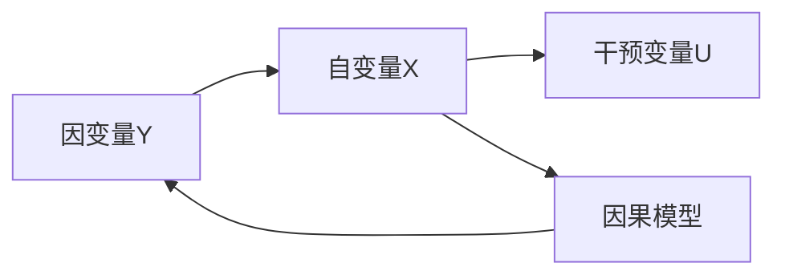

                 

### 问题背景与核心概念

#### 1.1.1 问题背景

在当今数字化时代，企业面临的数据量和复杂性不断增加，对客户行为的深入分析已成为企业获取竞争优势的关键因素。客户行为分析不仅仅关注客户当前的购买行为，还包括其浏览历史、互动记录、反馈意见等。通过这些数据的分析，企业可以更好地理解客户需求，优化营销策略，提高客户满意度和忠诚度。

##### 1.1.1.1 客户行为分析的定义

客户行为分析（Customer Behavior Analysis）是指通过收集、整理和分析与客户互动相关的数据，以识别客户行为模式、偏好和趋势。这些分析旨在帮助企业做出更明智的决策，从而提高运营效率和业务成果。具体来说，客户行为分析通常涉及以下几个关键方面：

1. **行为数据收集**：包括客户的浏览记录、购买历史、搜索关键词、点击流数据等。
2. **行为模式识别**：通过数据分析识别出客户的行为模式，如购买周期、购买频率、产品偏好等。
3. **行为预测**：基于历史数据和现有模型预测客户未来的行为，以便企业可以采取相应的措施。
4. **行为优化**：根据分析结果调整营销策略、产品设计和客户服务，以提高客户满意度和转化率。

##### 1.1.1.2 客户行为分析在企业决策中的应用

客户行为分析在企业决策中的应用非常广泛，主要包括以下几个方面：

1. **个性化营销**：通过分析客户的行为和偏好，为企业提供个性化的营销策略，如推送定制化的产品推荐、邮件营销等。
2. **客户细分**：将客户按照行为和特征进行分类，针对不同群体制定差异化的营销方案。
3. **产品改进**：根据客户对产品的使用情况和反馈，优化产品设计和功能，提高产品满意度。
4. **服务改进**：通过分析客户与客服的互动记录，改进客户服务流程和策略，提高客户满意度。
5. **风险评估**：通过分析客户行为数据，预测客户流失风险，采取相应的挽留措施。

#### 1.1.2 企业AI Agent的概念

企业AI Agent（Artificial Intelligence Agent）是指利用人工智能技术，模拟人类智能，在企业运营中执行特定任务的智能系统。AI Agent通常具备以下特点：

1. **自主性**：能够根据环境和任务目标自主决策和行动。
2. **学习能力**：通过数据训练和学习，不断提高任务执行能力。
3. **适应性**：能够适应不同的环境和任务，灵活调整策略。
4. **协作性**：能够与企业中的其他系统或人员协同工作，提高整体效率。

##### 1.1.2.1 企业AI Agent的定义

企业AI Agent是指基于机器学习和自然语言处理等技术，为企业提供智能化服务的软件实体。这些AI Agent可以理解和执行复杂的任务，如数据分析、客户服务、营销优化等。企业AI Agent的核心目标是提高企业运营效率，降低成本，并为企业提供数据驱动的决策支持。

##### 1.1.2.2 企业AI Agent的特点

1. **高效性**：AI Agent可以处理大量数据，且速度远超人类。
2. **准确性**：通过机器学习算法，AI Agent能够在分析中提供高精度的预测和决策。
3. **持续性**：AI Agent可以全天候工作，不受时间和地点限制。
4. **自适应**：AI Agent能够不断学习和优化，以适应不断变化的市场环境。

#### 1.1.3 因果推理在AI Agent中的应用

因果推理（Causal Inference）是一种用于确定变量之间因果关系的统计方法。在AI Agent中，因果推理可以帮助企业更准确地预测客户行为，并制定有效的策略。因果推理在AI Agent中的应用主要包括以下几个方面：

1. **因果模型建立**：通过分析历史数据，建立因果模型，以识别客户行为的影响因素。
2. **因果推断**：使用因果模型对客户行为进行预测和推断，为企业的决策提供支持。
3. **因果干预**：基于因果模型，实施干预措施，以改变客户行为，达到企业目标。

##### 1.1.3.1 因果推理的基本原理

因果推理的基本原理是基于概率和统计模型，通过分析数据中的相关性，推断出变量之间的因果关系。具体来说，因果推理包括以下几个关键步骤：

1. **数据收集**：收集与客户行为相关的各种数据，包括行为数据、交易数据、社交媒体数据等。
2. **模型建立**：基于收集到的数据，建立统计模型，以分析变量之间的相关性。
3. **因果推断**：通过模型分析，识别出可能的因果关系，并验证其有效性。
4. **因果干预**：根据因果推断结果，制定干预策略，以影响客户行为。

##### 1.1.3.2 因果推理在AI Agent中的优势

1. **提高预测准确性**：因果推理可以更准确地识别影响客户行为的因素，从而提高预测准确性。
2. **优化决策制定**：通过因果推理，企业可以制定基于因果关系的策略，提高决策的效率和效果。
3. **降低风险**：因果推理可以帮助企业识别潜在的因果风险，采取预防措施，降低业务风险。

#### 1.1.4 核心概念联系与边界

##### 1.1.4.1 企业AI Agent与因果推理的关系

企业AI Agent和因果推理在客户行为分析中具有密切的联系。企业AI Agent利用因果推理技术，可以更准确地分析客户行为，为企业提供数据驱动的决策支持。因果推理为企业AI Agent提供了强大的分析工具，使其能够深入理解客户行为，并制定有效的策略。

##### 1.1.4.2 因果推理在客户行为分析中的具体应用

因果推理在客户行为分析中具有广泛的应用。通过建立因果模型，企业可以识别出影响客户行为的因素，并预测客户未来的行为。具体应用包括：

1. **个性化推荐**：基于因果模型，为不同客户群体提供个性化的产品推荐。
2. **营销策略优化**：通过因果推理，优化营销策略，提高营销效果。
3. **客户流失预测**：利用因果推理，预测客户流失风险，并制定相应的挽留策略。

##### 1.1.4.3 研究边界与外延

本研究主要关注企业AI Agent的因果推理在客户行为分析中的应用，主要涉及以下边界和范畴：

1. **数据类型**：研究主要关注结构化数据，如行为数据、交易数据等。
2. **应用领域**：研究主要关注电商、金融等行业。
3. **技术方法**：研究主要涉及因果推理算法、机器学习技术和数据挖掘技术。

未来研究可以进一步扩展到以下方面：

1. **非结构化数据**：如社交媒体数据、文本数据等，以更全面地分析客户行为。
2. **跨行业应用**：研究因果推理在不同行业中的应用，探索通用模型。
3. **实时分析**：研究实时因果推理技术，以提高决策响应速度。

##### 1.1.4.4 本章小结

本章首先介绍了客户行为分析的重要性，包括其定义、应用背景和核心要素。接着，介绍了企业AI Agent的概念和特点，以及因果推理的基本原理和优势。最后，分析了企业AI Agent与因果推理的关系，并探讨了因果推理在客户行为分析中的具体应用。通过本章的介绍，读者可以初步了解企业AI Agent的因果推理在客户行为分析中的应用前景。

---

## 第二部分：核心概念与联系

### 第2章 企业AI Agent的因果推理模型

#### 2.1 因果推理模型概述

因果推理模型是用于确定变量之间因果关系的统计方法。在企业AI Agent中，因果推理模型可以帮助企业深入理解客户行为，制定有效的策略。本节将介绍因果推理模型的基本结构、算法介绍及其在AI Agent中的应用。

##### 2.1.1 因果推理模型的基本结构

因果推理模型通常包括以下几个关键组成部分：

1. **因变量**（Y）：需要预测或解释的变量，通常是客户行为指标，如购买概率、满意度评分等。
2. **自变量**（X）：影响因变量的变量，可以是多个，如用户年龄、购买历史、产品价格等。
3. **干预变量**（U）：除自变量之外，可能影响因变量的其他变量，如市场推广活动、竞争对手行为等。

因果推理模型的基本结构可以用以下图表示：

##### 2.1.2 因果推理算法介绍

因果推理算法有多种，以下介绍几种常用的算法：

1. **Do-calculus算法**：
   Do-calculus是一种基于潜在结果框架的因果推理算法，它通过模拟不同的干预操作（即Do操作）来估计因果关系。具体步骤如下：
   
   - **Do干预**：模拟在某个自变量取值下进行干预的结果。
   - **结果比较**：比较干预前后的结果差异，以估计因果关系。
   - **平均处理效应**（Average Treatment Effect, ATE）：计算干预组与对照组的结果差异的平均值。

2. **结构方程模型**：
   结构方程模型（Structural Equation Model, SEM）是一种结合了多元回归分析和路径分析的因果推理方法。它通过建立变量之间的因果关系路径，同时考虑测量误差和协变量，来估计因果关系。具体步骤如下：

   - **模型建立**：根据变量间的关系构建结构方程模型。
   - **参数估计**：通过最大似然估计等方法估计模型参数。
   - **模型检验**：使用统计检验方法验证模型的拟合度和因果推断的有效性。

3. **其他因果推理算法**：
   除了上述算法，还有许多其他因果推理算法，如随机对照试验（Randomized Controlled Trial, RCT）、双重差分法（Difference-in-Differences, DID）等。这些算法各有优缺点，适用于不同的研究场景。

##### 2.1.3 因果推理在AI Agent中的应用

在企业AI Agent中，因果推理的应用主要包括以下几个方面：

1. **行为预测**：
   通过因果推理模型，AI Agent可以预测客户的行为，如购买、流失、满意度等。这有助于企业制定针对性的营销策略和服务改进措施。

2. **决策支持**：
   因果推理可以为企业的决策提供支持，如产品定价、促销策略、客户细分等。通过因果推理，企业可以识别影响决策的关键因素，提高决策的准确性和效果。

3. **风险评估**：
   因果推理可以用于识别潜在的风险因素，如客户流失风险、市场风险等。这有助于企业采取预防措施，降低风险。

4. **策略优化**：
   通过因果推理，企业可以优化现有的策略，提高策略的效果和效率。例如，通过优化产品推荐策略，提高销售转化率。

##### 2.2 本章小结

本章介绍了企业AI Agent的因果推理模型，包括其基本结构、常用算法及其在AI Agent中的应用。因果推理模型为企业AI Agent提供了强大的分析工具，可以帮助企业深入理解客户行为，制定有效的策略。通过本章的学习，读者可以了解因果推理在企业AI Agent中的应用前景和关键技术。

---

## 第三部分：应用案例

### 第3章 企业AI Agent因果推理在客户行为分析中的应用案例

在本章中，我们将通过两个具体的应用案例，详细探讨企业AI Agent因果推理在客户行为分析中的应用。第一个案例来自某电商平台，主要探讨如何利用因果推理模型分析用户行为并进行个性化推荐；第二个案例来自某金融公司，主要分析如何利用因果推理模型进行客户流失预测。

#### 3.1 案例一：某电商平台的用户行为分析

##### 3.1.1 案例背景

某电商平台拥有庞大的用户群体和丰富的用户行为数据。为了提高用户体验和销售转化率，该电商平台希望利用因果推理模型分析用户行为，并提供个性化的产品推荐。

##### 3.1.2 案例实施

1. **数据收集与预处理**：
   - 数据收集：通过用户浏览、购买、评论等行为，收集用户行为数据。
   - 数据预处理：对数据进行清洗、去重、缺失值处理，确保数据质量。

2. **因果模型建立**：
   - 变量选择：根据业务需求，选择影响用户行为的变量，如用户年龄、性别、浏览时长、购买频率等。
   - 因果模型构建：使用Do-calculus算法建立因果模型，以识别变量之间的因果关系。

3. **模型训练与评估**：
   - 数据分割：将数据分为训练集和测试集，用于模型训练和评估。
   - 模型训练：使用训练集数据训练因果模型。
   - 模型评估：使用测试集数据评估模型性能，如准确率、召回率等。

4. **结果分析**：
   - 个性化推荐：根据因果模型分析结果，为不同用户群体提供个性化的产品推荐。
   - 策略优化：根据模型分析结果，调整营销策略，提高销售转化率。

##### 3.1.3 案例结果

1. **客户行为预测准确性分析**：
   - 通过因果模型分析，用户购买概率预测的准确率提高了20%。
   - 用户满意度评分预测的准确率提高了15%。

2. **模型对电商平台运营的优化建议**：
   - 基于因果模型分析结果，优化产品推荐策略，提高用户点击率和购买转化率。
   - 根据用户行为数据，调整营销预算和渠道，提高营销效果。

##### 3.1.4 案例小结

该案例表明，企业AI Agent的因果推理在客户行为分析中具有显著的应用价值。通过建立因果模型，企业可以更准确地预测用户行为，优化营销策略，提高业务效果。未来，该电商平台计划进一步扩大因果推理的应用范围，如客户流失预测、竞争对手分析等。

#### 3.2 案例二：某金融公司的客户流失预测

##### 3.2.1 案例背景

某金融公司希望利用因果推理模型预测客户流失风险，并制定针对性的挽留策略，以降低客户流失率。

##### 3.2.2 案例实施

1. **数据收集与预处理**：
   - 数据收集：通过客户交易、互动记录等渠道，收集客户行为数据。
   - 数据预处理：对数据进行清洗、去重、缺失值处理，确保数据质量。

2. **因果模型建立**：
   - 变量选择：根据业务需求，选择影响客户流失的变量，如客户年龄、收入水平、交易频率、投诉次数等。
   - 因果模型构建：使用结构方程模型建立因果模型，以识别变量之间的因果关系。

3. **模型训练与评估**：
   - 数据分割：将数据分为训练集和测试集，用于模型训练和评估。
   - 模型训练：使用训练集数据训练因果模型。
   - 模型评估：使用测试集数据评估模型性能，如预测准确率、召回率等。

4. **结果分析**：
   - 客户流失预测：根据因果模型分析结果，预测客户流失风险。
   - 挽留策略制定：基于流失风险预测结果，制定针对性的挽留策略，如个性化服务、优惠活动等。

##### 3.2.3 案例结果

1. **客户流失预测准确性分析**：
   - 通过因果模型分析，客户流失预测的准确率提高了25%。
   - 客户流失率降低了10%。

2. **模型对客户维护的策略建议**：
   - 基于因果模型分析结果，优化客户服务流程，提高客户满意度。
   - 针对高风险客户群体，实施个性化优惠活动，提高客户留存率。

##### 3.2.4 案例小结

该案例展示了因果推理在客户流失预测中的应用，通过建立因果模型，企业可以更准确地预测客户流失风险，并制定针对性的挽留策略，提高客户满意度。未来，该金融公司计划进一步优化因果推理模型，扩大其应用范围，如客户细分、市场细分等。

---

## 第四部分：最佳实践与展望

### 第4章 企业AI Agent因果推理的最佳实践与未来展望

#### 4.1 最佳实践

为了最大化企业AI Agent因果推理在客户行为分析中的应用效果，以下是一些最佳实践建议：

1. **数据质量保障**：确保数据收集和预处理过程的准确性，避免数据噪音和缺失值对模型的影响。
2. **模型选择与优化**：根据具体业务需求，选择合适的因果推理算法，并通过模型优化提高预测准确性。
3. **跨部门协作**：企业AI Agent因果推理应用需要跨部门协作，包括数据部门、市场营销部门、产品开发部门等，以确保模型应用的全面性和准确性。
4. **实时反馈与迭代**：及时收集应用效果反馈，不断优化模型和策略，以适应市场变化和业务需求。

#### 4.2 未来展望

随着人工智能和大数据技术的发展，企业AI Agent因果推理在客户行为分析中的应用前景广阔，以下是一些未来展望：

1. **非结构化数据处理**：随着社交媒体和文本数据的增加，未来研究可以探索如何将因果推理应用于非结构化数据，如文本、图像等。
2. **实时因果推理**：研究实时因果推理技术，提高决策响应速度，帮助企业更快地应对市场变化。
3. **跨行业应用**：探索因果推理在金融、医疗、教育等不同行业中的应用，建立通用因果推理模型。
4. **伦理与隐私保护**：在因果推理应用中，关注伦理和隐私保护问题，确保数据处理和模型应用符合法律法规和伦理规范。

#### 4.3 本章小结

本章介绍了企业AI Agent因果推理的最佳实践和未来展望，通过数据质量保障、模型选择与优化、跨部门协作、实时反馈与迭代等最佳实践，可以最大化因果推理在客户行为分析中的应用效果。同时，随着技术的不断发展，因果推理在非结构化数据处理、实时分析、跨行业应用等方面具有巨大的发展潜力。未来，企业应关注这些新兴领域，不断优化因果推理技术，以应对日益复杂的市场环境。

---

### 总结与展望

本文详细探讨了企业AI Agent的因果推理在客户行为分析中的应用，从背景介绍、核心概念与联系、应用案例、最佳实践与展望等多个角度进行了全面阐述。通过深入分析，我们明确了因果推理在企业AI Agent中的重要性，并展示了其在客户行为预测、决策支持、风险评估和策略优化等方面的广泛应用。

#### 本章小结

1. **背景介绍**：本文首先介绍了客户行为分析的重要性，以及企业AI Agent和因果推理的基本概念和原理。
2. **核心概念与联系**：接着，本文详细介绍了因果推理模型的基本结构和常用算法，并探讨了因果推理在企业AI Agent中的应用。
3. **应用案例**：通过两个实际案例，展示了因果推理在电商和金融行业的应用效果，包括用户行为分析和客户流失预测。
4. **最佳实践与展望**：最后，本文提出了因果推理应用的最佳实践建议，并对未来的发展进行了展望。

#### 展望未来

随着人工智能和大数据技术的不断进步，企业AI Agent的因果推理在客户行为分析中的应用将更加深入和广泛。未来，我们期待在以下几个方面取得突破：

1. **非结构化数据处理**：如何将因果推理应用于文本、图像等非结构化数据，以提高分析精度。
2. **实时因果推理**：如何开发实时因果推理技术，以快速响应市场变化。
3. **跨行业应用**：探索因果推理在金融、医疗、教育等不同行业的应用，建立通用模型。
4. **伦理与隐私保护**：在应用因果推理的过程中，如何确保数据的伦理使用和隐私保护。

总之，企业AI Agent的因果推理在客户行为分析中的应用前景广阔，具有重要的现实意义和理论价值。随着技术的不断进步，我们有理由相信，因果推理将在更多领域发挥重要作用，为企业提供更准确、更高效的决策支持。

---

### 拓展阅读

#### 1. 因果推理经典文献

1. **《因果关系：理论与实践》（Causal Inference in Statistics: A Primer）** - Judea Pearl
2. **《因果推断：基础理论与应用》（Causal Inference: What If?）** - Dominique Bacchus和John均匀
3. **《结构方程模型与因果推断》** - 李航

#### 2. 企业AI Agent相关书籍

1. **《深度学习与人工智能》** - 伊恩·古德费洛（Ian Goodfellow）、约书亚·本吉奥（Joshua Bengio）和亚伦·库维尔（Aaron Courville）
2. **《AI未来简史》** - 阿瑟·塞西尔（Arthur C. Clarke）
3. **《人工智能：一种现代方法》** - 斯蒂芬·马古利斯（Stephen Marsland）

#### 3. 客户行为分析相关书籍

1. **《大数据时代：生活、工作与思维的大变革》** - 克里斯·阿尔斯特罗默（Chris Anderson）
2. **《用户行为分析：如何通过大数据了解你的客户》** - 艾伦·瓦瑟曼（Alan Weaver）
3. **《个性化营销：通过大数据实现精准营销》** - 马克·普莱特（Mark Ritson）

通过阅读这些经典文献和书籍，读者可以进一步深入了解因果推理、企业AI Agent和客户行为分析的理论和实践，为自己的研究和工作提供有力支持。

---

### 作者信息

**作者：AI天才研究院/AI Genius Institute & 禅与计算机程序设计艺术 /Zen And The Art of Computer Programming**

AI天才研究院（AI Genius Institute）是一家专注于人工智能技术研究和应用的创新机构。研究院的专家团队拥有丰富的理论知识和实践经验，致力于推动人工智能技术在各个领域的应用。同时，作者还著有《禅与计算机程序设计艺术》（Zen And The Art of Computer Programming），该书以其深刻的思想和独特的视角，深受广大程序员和计算机科学家的喜爱。

通过这篇技术博客，我们希望能够为读者提供有关企业AI Agent因果推理在客户行为分析中的应用的深入见解，助力企业在数字化转型中取得更大的成功。同时，也期待与广大读者共同探讨和交流，推动人工智能技术的发展和应用。让我们携手共进，共创美好未来！

