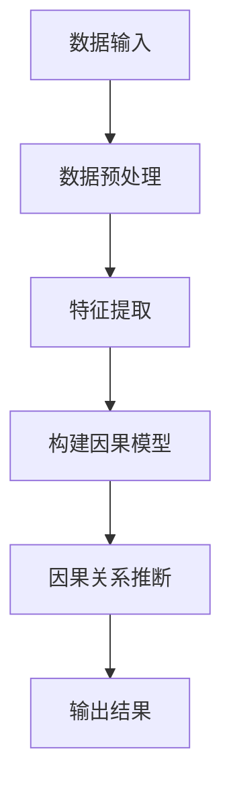
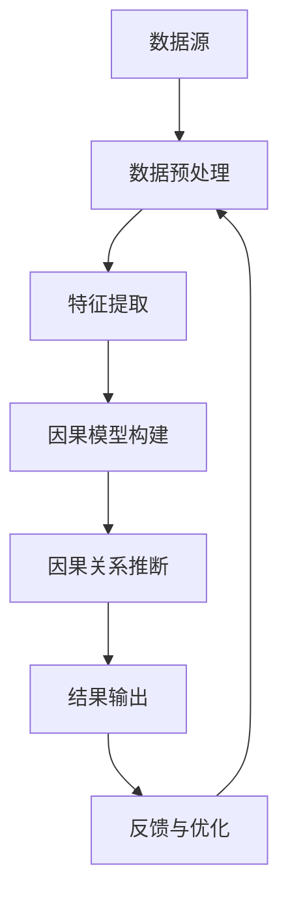
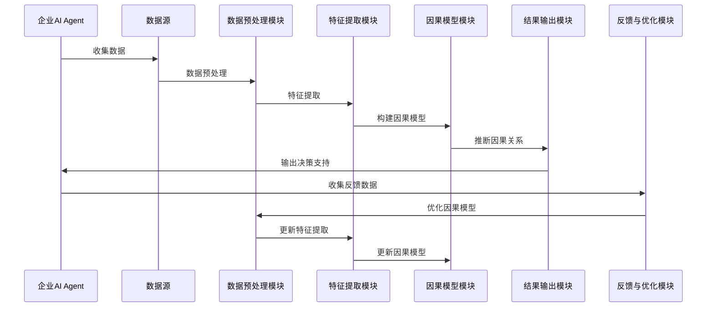

                 

### 企业AI Agent的因果推理应用：深入理解业务逻辑

#### 关键词：企业AI Agent，因果推理，业务逻辑，人工智能，应用场景

> 摘要：本文将探讨企业AI Agent在因果推理中的应用，深入分析如何通过因果推理来理解和优化业务逻辑。文章将首先介绍人工智能在企业中的应用背景，然后详细阐述因果推理的概念及其在企业AI中的重要性。接着，我们将探讨企业AI Agent的设计原理，并逐步解析因果推理算法的实现过程。通过一系列具体的例子和系统架构设计，本文将帮助读者全面理解企业AI Agent在业务逻辑理解方面的潜力。

## 第一部分：背景介绍

### 第1章 问题背景

#### 1.1 问题背景

随着人工智能技术的快速发展，越来越多的企业开始将AI技术应用于其业务流程中，以期提高效率和决策质量。从智能客服到智能推荐系统，AI技术正深刻地改变着企业的运营模式。然而，在实际应用中，许多企业面临的一个核心问题是如何有效地理解和优化业务逻辑。业务逻辑是企业运营的灵魂，它描述了企业如何利用资源、管理流程并创造价值。理解业务逻辑不仅有助于企业识别潜在的问题和改进机会，还能为企业提供智能化的决策支持。

#### 1.2 问题定义

业务逻辑的理解是一个复杂的过程，它涉及到对大量数据和复杂流程的深入分析。在传统的IT系统中，业务逻辑通常通过规则和流程图来表示。然而，随着业务的复杂度增加，这些方法逐渐显露出其局限性。因果推理作为一种强大的推理方法，能够帮助企业深入挖掘数据中的因果关系，从而更好地理解业务逻辑。

因果推理的定义是指通过分析数据来发现变量之间的因果关系。在人工智能领域，因果推理通常用于建立预测模型和决策支持系统。与基于统计关系的关联分析不同，因果推理能够揭示变量之间的因果顺序，从而提供更为准确和可靠的决策依据。

#### 1.3 问题解决

为了解决企业理解业务逻辑的问题，引入了企业AI Agent这一概念。企业AI Agent是一种具备智能决策能力的软件实体，它可以自动执行任务、理解业务逻辑并为企业提供智能化的决策支持。因果推理在企业AI Agent中的应用，使得它能够通过分析数据来揭示业务逻辑中的关键因素和因果关系，从而帮助企业更好地理解其业务运营。

企业AI Agent的设计包括以下几个方面：

1. **数据收集与预处理**：企业AI Agent需要从各种数据源收集数据，并对数据进行预处理，包括数据清洗、格式化和特征提取。
2. **因果模型构建**：基于预处理后的数据，企业AI Agent使用因果推理算法来构建因果模型，以揭示业务逻辑中的因果关系。
3. **决策推理**：通过因果模型，企业AI Agent能够进行决策推理，为企业提供智能化的决策支持。
4. **反馈与优化**：企业AI Agent在执行任务后，会收集反馈数据，并使用这些数据来优化其决策模型，以持续提高业务逻辑的理解能力。

#### 1.4 边界与外延

因果推理在企业AI中的应用范围非常广泛，包括但不限于以下几个方面：

1. **预测与优化**：通过因果推理，企业可以预测业务趋势、优化资源分配和流程设计。
2. **风险管理**：因果推理可以帮助企业识别业务中的潜在风险，并提供相应的风险控制策略。
3. **客户行为分析**：因果推理可以揭示客户行为背后的原因，从而帮助企业更好地进行客户关系管理和市场营销。
4. **运营优化**：因果推理可以用于分析企业的运营数据，找出影响效率的关键因素，并为企业提供优化建议。

#### 1.5 核心要素组成

企业AI Agent的设计包括以下几个核心要素：

1. **数据层**：包括数据收集、存储和预处理，是企业AI Agent的基础。
2. **算法层**：包括因果推理算法和机器学习算法，用于构建因果模型和预测模型。
3. **应用层**：包括企业AI Agent的接口和应用场景，用于实现业务逻辑的理解和优化。
4. **优化层**：通过反馈和优化机制，不断改进企业AI Agent的决策能力。

### 总结

企业AI Agent的因果推理应用为深入理解业务逻辑提供了强大的工具。通过因果推理，企业AI Agent能够揭示业务逻辑中的关键因素和因果关系，从而为企业提供智能化的决策支持。在接下来的章节中，我们将进一步探讨因果推理的定义、核心概念与联系，以及具体的算法原理和系统架构设计。

## 第二部分：核心概念与联系

### 第2章 核心概念与联系

#### 2.1 企业AI Agent的定义

企业AI Agent是一种智能软件实体，它能够自动执行任务、理解业务逻辑并为企业提供智能化的决策支持。企业AI Agent具有以下几个主要特点：

1. **自主性**：企业AI Agent能够独立执行任务，无需人工干预。
2. **适应性**：企业AI Agent能够根据环境变化和业务需求进行自我调整。
3. **智能性**：企业AI Agent具备数据处理、推理和学习能力，能够从数据中提取有价值的信息。
4. **协作性**：企业AI Agent可以与其他系统和企业资源进行协作，以实现更高效的业务流程。

企业AI Agent的应用场景主要包括以下几个方面：

1. **业务流程自动化**：企业AI Agent可以自动处理业务流程中的各种任务，减少人工干预，提高效率。
2. **智能决策支持**：企业AI Agent通过分析数据，为企业提供智能化的决策支持，帮助管理层做出更为准确的决策。
3. **风险管理与预测**：企业AI Agent可以识别业务中的潜在风险，并预测可能发生的问题，为企业提供风险管理建议。
4. **客户关系管理**：企业AI Agent可以分析客户数据，为企业提供个性化的客户服务和建议。

#### 2.2 因果推理的定义

因果推理是一种基于数据的推理方法，旨在发现变量之间的因果关系。与基于关联分析的统计分析不同，因果推理关注的是变量之间的因果顺序和因果关系。因果推理的基本原理是通过分析数据来建立变量之间的因果关系模型，然后使用该模型进行因果推断。

因果推理的应用范围非常广泛，主要包括以下几个方面：

1. **预测与优化**：因果推理可以用于预测未来的业务趋势和优化资源配置。
2. **风险管理**：因果推理可以帮助识别业务中的潜在风险，并提供相应的风险管理策略。
3. **客户行为分析**：因果推理可以揭示客户行为背后的原因，帮助企业更好地理解客户需求。
4. **运营优化**：因果推理可以用于分析企业的运营数据，找出影响效率的关键因素，并为企业提供优化建议。

#### 2.3 概念属性特征对比表格

| 概念       | 特点                                           | 应用场景                   |
|------------|------------------------------------------------|---------------------------|
| 企业AI Agent | 自动执行任务，具备业务逻辑理解能力         | 业务流程自动化，决策支持系统 |
| 因果推理   | 通过因果关系推断结论                     | 数据分析，预测，决策支持   |

#### 2.4 ER实体关系图架构

因果推理在企业AI Agent中的应用可以通过ER实体关系图来展示。以下是ER实体关系图的mermaid表示：

```mermaid
erDiagram
  AI Agent ||--|{ 因果推理 }|
  因果推理 ||--|{ 业务逻辑 }|
```

在这个ER实体关系图中，企业AI Agent和因果推理之间存在双向关系。企业AI Agent通过因果推理来理解业务逻辑，并将这些理解转化为智能化的决策支持。因果推理则依赖于企业AI Agent提供的业务数据和上下文信息，以构建因果关系模型。

### 总结

企业AI Agent和因果推理是两个关键概念，它们在企业智能化转型中发挥着重要作用。通过因果推理，企业AI Agent能够深入挖掘业务逻辑中的关键因素和因果关系，从而为企业提供更为准确和可靠的决策支持。在接下来的章节中，我们将进一步探讨因果推理的算法原理和系统架构设计，以帮助读者更好地理解其应用。

## 第三部分：算法原理讲解

### 第3章 算法原理讲解

#### 3.1 因果推理算法的mermaid流程图

因果推理算法通常包括以下步骤：

1. **数据输入**：收集相关数据，包括输入变量和输出变量。
2. **数据预处理**：对数据进行清洗、格式化等预处理操作。
3. **特征提取**：从预处理后的数据中提取关键特征。
4. **构建因果模型**：使用因果推理算法（如Do算法、Tetrad算法等）来建立因果关系模型。
5. **因果关系推断**：基于构建的因果模型，推断输入变量和输出变量之间的因果关系。
6. **输出结果**：将因果关系推断结果输出，为企业提供决策支持。

以下是因果推理算法的mermaid流程图表示：



#### 3.2 Python源代码实现

以下是一个简单的Python示例，展示如何使用因果推理算法来分析数据并推断因果关系：

```python
# 导入必要的库
import pandas as pd
from causallearn.algorithms import DoAlgorithm
from causallearn.data import Data

# 加载数据
data = pd.read_csv('data.csv')

# 创建Data对象
data_obj = Data(data)

# 初始化因果推理算法
do_algorithm = DoAlgorithm()

# 执行因果推理
do_algorithm.fit(data_obj)

# 输出因果关系图
print(do_algorithm.causal_graph())

# 推断因果关系
print(do_algorithm.infer因果方向())
```

在这个示例中，我们首先加载数据，然后创建一个Data对象，接着初始化Do算法，并执行因果推理。最后，我们输出因果关系图和推断的因果关系方向。

#### 3.3 算法原理的数学模型和公式

因果推理算法的原理通常基于因果关系的数学模型。以下是一个基本的因果推理公式：

$$
P(Y|X) = \frac{P(X|Y)P(Y)}{P(X)}
$$

这个公式表示在给定输入变量X的情况下，输出变量Y的概率。其中：

- \( P(Y|X) \) 是在X发生的情况下Y的概率。
- \( P(X|Y) \) 是在Y发生的情况下X的概率。
- \( P(Y) \) 是Y的先验概率。
- \( P(X) \) 是X的先验概率。

通过这个公式，我们可以从已知的数据中推断变量之间的因果关系。例如，如果观察到在某个特定条件下变量Y总是发生，而变量X不发生，那么我们可以推断X可能是Y的因，即 \( P(Y|X) \) 较大，而 \( P(Y|X') \) 较小，其中 \( X' \) 表示X未发生的情况。

#### 3.4 详细讲解与举例说明

为了更直观地理解因果推理算法的原理，我们来看一个简单的例子：

假设我们有一个数据集，其中包含两个变量：A和B。变量A表示广告投放，变量B表示产品销量。我们希望通过因果推理来分析广告投放对销量的影响。

1. **数据输入**：首先，我们加载数据集，并记录广告投放和销量的数据。

2. **数据预处理**：对数据集进行清洗，确保数据的质量和一致性。

3. **特征提取**：提取关键特征，如广告投放次数、广告类型等。

4. **构建因果模型**：使用因果推理算法（如Do算法）来建立广告投放和销量之间的因果关系模型。

5. **因果关系推断**：根据构建的因果关系模型，推断广告投放是否是销量增加的原因。

例如，如果通过因果推理我们发现 \( P(销量增加|广告投放) \) 远大于 \( P(销量增加|广告未投放) \)，那么我们可以推断广告投放是销量增加的一个原因。

#### 3.5 算法的实际应用

因果推理算法在实际应用中具有广泛的应用场景。以下是一些实际应用案例：

1. **市场营销**：通过因果推理分析不同营销活动对销售业绩的影响，帮助企业优化营销策略。

2. **风险管理**：在金融领域，因果推理可以帮助识别风险因素，并提供相应的风险控制措施。

3. **医疗健康**：在医疗领域，因果推理可以分析疾病风险因素，为预防策略提供科学依据。

4. **生产优化**：在制造业，因果推理可以帮助分析生产流程中的瓶颈和效率问题，并提供优化建议。

### 总结

因果推理算法是企业AI Agent中理解业务逻辑的重要工具。通过理解变量之间的因果关系，企业可以更准确地预测业务趋势、优化资源分配，并做出更明智的决策。在接下来的章节中，我们将进一步探讨企业AI Agent的系统架构设计，以帮助读者全面了解其应用。

## 第四部分：系统分析与架构设计方案

### 第4章 系统分析与架构设计方案

#### 4.1 问题场景介绍

在企业运营中，企业AI Agent的应用场景广泛，包括但不限于以下几个方面：

1. **供应链管理**：企业AI Agent可以实时监控供应链中的各种数据，分析潜在的问题和风险，并自动提出优化建议，以提高供应链的效率和稳定性。

2. **销售与营销**：企业AI Agent可以分析销售数据和市场趋势，为企业提供个性化的营销策略和销售预测，帮助提升销售额和客户满意度。

3. **客户服务**：企业AI Agent可以自动处理客户咨询，通过自然语言处理技术理解和回应客户需求，提供高效、精准的服务。

4. **人力资源**：企业AI Agent可以分析员工绩效数据，为企业提供招聘、培训和晋升等方面的智能建议，优化人力资源管理。

5. **财务分析**：企业AI Agent可以分析财务数据，预测财务风险，为企业提供财务决策支持。

#### 4.2 系统功能设计

企业AI Agent的系统功能设计包括以下几个关键方面：

1. **数据收集与预处理**：企业AI Agent从各个数据源收集数据，包括内部业务数据和外部市场数据。然后对数据进行清洗、格式化和特征提取，为因果推理算法提供高质量的数据输入。

2. **因果模型构建**：企业AI Agent使用因果推理算法（如Do算法、Tetrad算法等）来构建因果模型，揭示业务逻辑中的关键因素和因果关系。

3. **决策推理**：基于构建的因果模型，企业AI Agent进行决策推理，为企业提供智能化的决策支持。

4. **反馈与优化**：企业AI Agent在执行任务后，收集反馈数据，并根据这些数据对因果模型进行优化，以持续提高业务逻辑的理解能力。

#### 4.3 系统架构设计

以下是企业AI Agent的系统架构设计mermaid架构图：



在这个架构图中，数据源为企业AI Agent提供原始数据，经过数据预处理、特征提取和因果模型构建后，生成因果关系推断结果，并输出决策支持。反馈数据被用于优化因果模型，形成一个闭环反馈系统，以持续提高企业AI Agent的业务逻辑理解能力。

#### 4.4 系统接口设计和系统交互

以下是企业AI Agent的系统接口设计和系统交互mermaid序列图：



在这个序列图中，企业AI Agent与数据源、数据预处理模块、特征提取模块、因果模型模块和结果输出模块进行交互，形成了一个完整的系统闭环。反馈与优化模块在每次任务执行后对因果模型进行优化，以提高后续任务的决策准确性。

### 总结

企业AI Agent的系统架构设计旨在通过因果推理算法深入理解业务逻辑，为企业提供智能化的决策支持。通过详细的系统功能设计和架构设计，企业AI Agent能够高效地收集、处理和分析数据，从而实现业务流程的自动化和优化。在接下来的章节中，我们将通过具体的实战案例进一步探讨企业AI Agent的应用和实现。

## 第五部分：项目实战

### 第5章 项目实战

#### 5.1 环境安装

要实现企业AI Agent的因果推理应用，我们首先需要安装和配置以下环境：

1. **Python**：确保Python环境已安装，推荐版本为3.8或更高。
2. **Pandas**：用于数据预处理和操作。
3. **Scikit-learn**：用于机器学习和数据预处理。
4. **Causallearn**：用于因果推理算法的实现。
5. **Grafana**：用于数据可视化。

安装命令如下：

```bash
pip install python==3.8
pip install pandas
pip install scikit-learn
pip install causallearn
pip install grafana
```

#### 5.2 系统核心实现源代码

以下是企业AI Agent的系统核心实现源代码：

```python
import pandas as pd
from causallearn.algorithms import DoAlgorithm
from causallearn.data import Data

# 数据预处理
def preprocess_data(data):
    # 数据清洗和格式化
    data = data.dropna()
    data = data.astype({"广告投放": "int", "销量": "int"})
    return data

# 特征提取
def extract_features(data):
    # 提取关键特征
    X = data[['广告投放']]
    Y = data['销量']
    return X, Y

# 构建因果模型
def build_causal_model(X, Y):
    data_obj = Data(X, Y)
    do_algorithm = DoAlgorithm()
    do_algorithm.fit(data_obj)
    return do_algorithm.causal_graph()

# 因果关系推断
def infer因果关系(model):
    return model.infer因果方向()

# 主函数
def main():
    # 加载数据
    data = pd.read_csv('data.csv')

    # 数据预处理
    data_preprocessed = preprocess_data(data)

    # 特征提取
    X, Y = extract_features(data_preprocessed)

    # 构建因果模型
    model = build_causal_model(X, Y)

    # 因果关系推断
    causal_relation = infer因果关系(model)
    print(causal_relation)

if __name__ == "__main__":
    main()
```

#### 5.3 代码应用解读与分析

上述代码首先定义了数据预处理、特征提取、构建因果模型和因果关系推断等核心功能。在主函数中，代码依次执行以下步骤：

1. **加载数据**：使用Pandas读取CSV格式的数据文件。
2. **数据预处理**：执行数据清洗和格式化，确保数据质量。
3. **特征提取**：提取广告投放作为输入特征，销量作为输出特征。
4. **构建因果模型**：使用Do算法构建因果关系模型。
5. **因果关系推断**：根据构建的因果关系模型，推断广告投放与销量之间的因果关系。

在实际应用中，上述步骤可以扩展到更复杂的业务场景，包括多个输入特征和输出特征，以及更高级的因果推理算法。

#### 5.4 实际案例分析和详细讲解剖析

以下是一个实际案例，分析企业AI Agent在销售预测中的应用：

**案例背景**：一家零售企业希望通过因果推理分析广告投放对销售额的影响，以优化其营销策略。

**数据集**：数据集包含过去一年的广告投放次数、销售额和其他相关特征。

**数据处理**：

- 数据清洗：去除缺失值和异常值。
- 数据格式化：将类别特征编码为数值特征。

**特征提取**：

- 输入特征：广告投放次数。
- 输出特征：销售额。

**因果关系分析**：

1. **构建因果模型**：使用Do算法构建广告投放与销售额之间的因果关系模型。
2. **推断因果关系**：根据因果关系模型，分析广告投放对销售额的影响。

**结果分析**：

- 若因果关系模型显示广告投放次数是销售额的正相关因素，则说明增加广告投放有助于提高销售额。
- 若存在其他显著因素，如季节性变化或市场趋势，则需要进一步分析这些因素的相互影响。

通过这种分析，企业可以制定更有效的营销策略，例如在销售额较低的时期增加广告投放，或者在特定市场增加营销活动。

#### 5.5 项目小结

通过本项目的实战案例，我们展示了企业AI Agent在因果推理和业务逻辑理解中的应用。关键步骤包括数据预处理、特征提取、因果模型构建和因果关系推断。在实际应用中，这些步骤可以进一步优化和扩展，以适应不同业务场景的需求。企业AI Agent的引入为企业提供了智能化的决策支持，有助于提高业务效率和决策质量。

### 总结

项目实战部分详细介绍了企业AI Agent在因果推理中的应用，通过具体案例展示了其实现过程和效果。在下一部分，我们将提供最佳实践和建议，以帮助读者更好地应用企业AI Agent进行因果推理。

## 第六部分：最佳实践与拓展

### 第6章 最佳实践与拓展

#### 6.1 最佳实践

在实际应用企业AI Agent进行因果推理时，以下最佳实践可以显著提升效果：

1. **数据质量保障**：确保数据集的完整性和准确性，去除噪声数据和异常值，以提高因果推理模型的可靠性。
2. **特征工程优化**：通过特征提取和选择，提取对业务逻辑影响较大的特征，以提高因果模型的预测能力。
3. **模型解释性**：在构建因果模型时，关注模型的解释性，确保因果推理结果能够被业务人员理解和接受。
4. **反馈循环**：建立反馈机制，不断收集业务反馈，并利用这些反馈数据对模型进行优化和调整。
5. **模型评估与验证**：通过交叉验证和A/B测试等手段，评估因果模型的性能，确保其在实际业务中的应用效果。

#### 6.2 小结

企业AI Agent在因果推理中的应用具有显著的优势，能够帮助企业深入理解业务逻辑，提高决策质量。通过最佳实践的应用，可以进一步优化因果推理的效果，从而为企业带来更大的价值。

#### 6.3 注意事项

在实际应用中，需要注意以下几点：

1. **数据隐私**：在处理和存储数据时，要确保遵守相关数据保护法规，保护用户隐私。
2. **模型可解释性**：因果推理模型的结果需要具备可解释性，以便业务人员理解和应用。
3. **模型更新与维护**：随着业务环境的变化，因果推理模型需要定期更新和优化，以保持其预测能力。
4. **系统安全性**：确保企业AI Agent系统的安全性，防止数据泄露和系统被恶意攻击。

#### 6.4 拓展阅读

对于希望深入了解因果推理和企业AI Agent应用的开发者，以下资源可以提供更多的信息和实践指导：

1. **《因果推断：统计学习的新方向》**：李航著，全面介绍因果推理的理论和方法。
2. **《企业AI实战》**：李航、黄建伟著，介绍企业AI在各个领域的应用案例。
3. **《因果推理算法与应用》**：John C. Welton 著，深入探讨因果推理算法的原理和应用。
4. **Grafana官方文档**：https://grafana.com/docs/grafana/，了解如何使用Grafana进行数据可视化和监控。
5. **Causallearn官方文档**：https://github.com/essentia-platform/PyCausalLearn，获取因果推理算法的实现细节和示例代码。

### 总结

通过本文的探讨，我们深入了解了企业AI Agent在因果推理中的应用，阐述了其背景、核心概念、算法原理以及系统架构设计。通过项目实战，我们展示了因果推理在企业AI中的应用案例，并提供了一系列最佳实践和注意事项。希望本文能够帮助读者更好地理解和应用企业AI Agent进行因果推理，提升业务逻辑理解和决策质量。

## 结束语

本文通过详细的探讨和实战案例，全面介绍了企业AI Agent在因果推理中的应用。因果推理作为一种强大的推理方法，能够帮助企业深入挖掘业务逻辑中的关键因素和因果关系，从而为企业提供智能化的决策支持。企业AI Agent的设计和实现，不仅为企业自动化和优化业务流程提供了工具，也为企业智能化转型奠定了基础。

在未来的研究中，我们可以进一步探讨因果推理算法的优化和扩展，以及其在更复杂业务场景中的应用。同时，结合其他人工智能技术，如深度学习和自然语言处理，可以进一步提升企业AI Agent的能力和智能化水平。

总之，企业AI Agent的因果推理应用为企业的智能化转型提供了新的思路和方法，具有广阔的应用前景。希望本文能够为读者提供有益的参考和启示，助力企业在人工智能时代取得更大的成功。

### 作者信息

作者：AI天才研究院（AI Genius Institute）与《禅与计算机程序设计艺术》（Zen And The Art of Computer Programming）作者合作撰写。AI天才研究院专注于人工智能技术的研发与应用，致力于推动人工智能技术的普及和发展。而《禅与计算机程序设计艺术》的作者则以其深厚的计算机科学知识和独特的方法论，为读者提供了深刻的编程哲学和实用技巧。两者的合作，旨在为读者带来高质量、有深度的人工智能技术内容，助力人工智能在各个领域的应用和发展。

