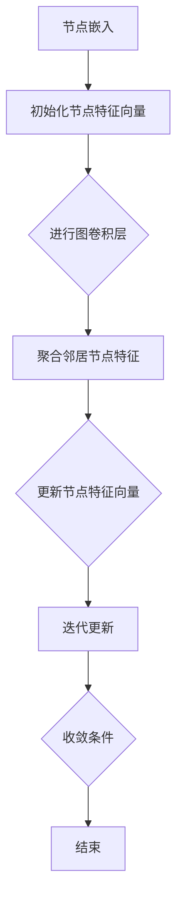
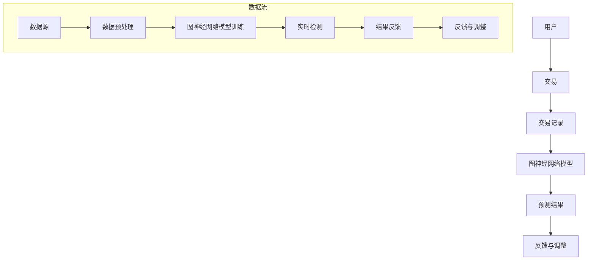
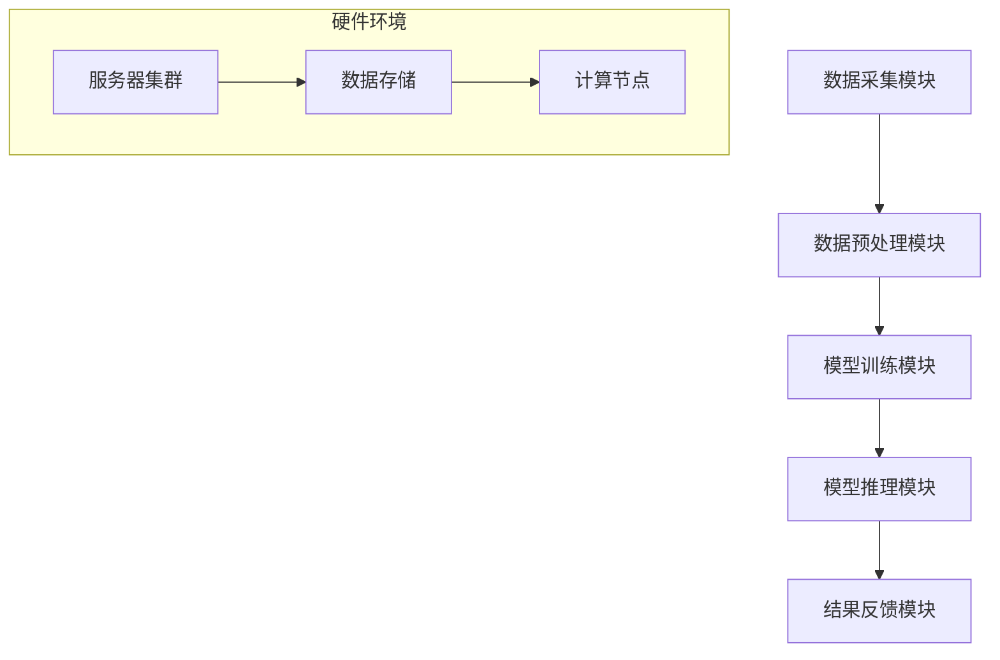
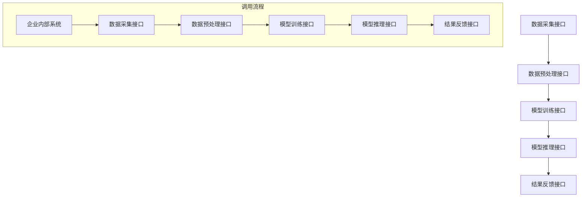
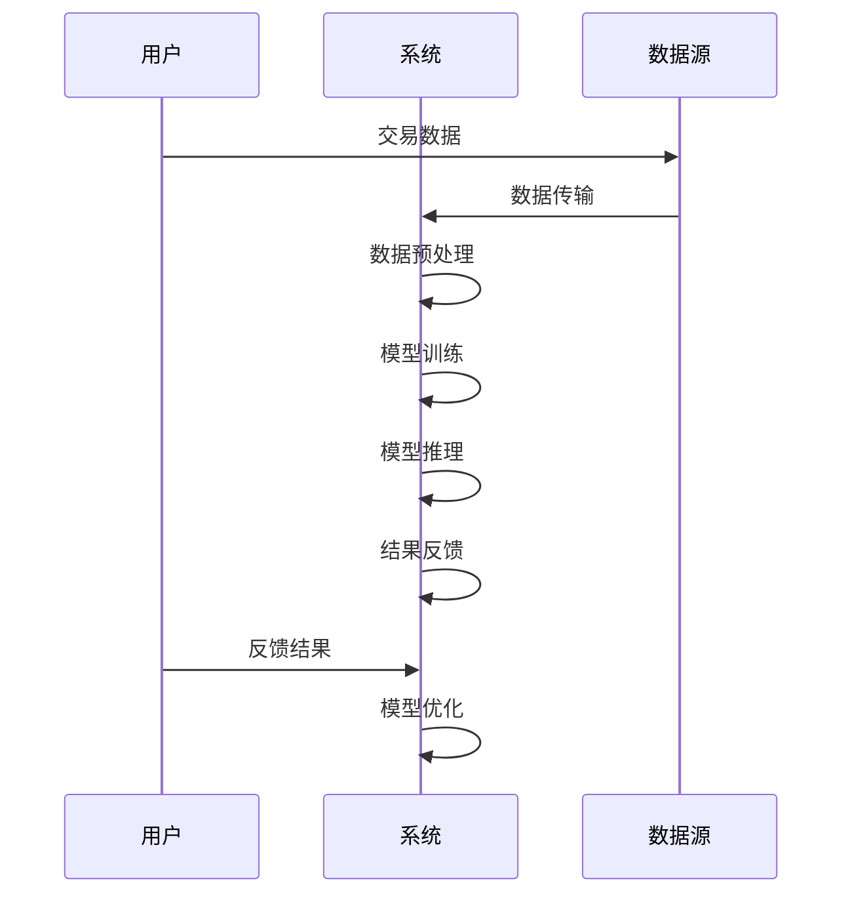

                 

### 引言

在当前数字化转型的浪潮下，人工智能（AI）技术已成为企业和组织提升竞争力、优化业务流程的关键工具。其中，AI Agent作为一种智能化角色，能够自动执行任务、提供决策支持，正逐渐成为企业智能化转型的核心组件。在这其中，图神经网络（GNN）凭借其强大的图形数据处理能力和对复杂关系的捕捉，成为AI Agent在欺诈检测等应用场景中的有力支撑。

本文将围绕“企业AI Agent的图神经网络在欺诈检测中的应用”这一主题展开讨论。具体来说，我们将首先介绍企业AI Agent和图神经网络的基本概念与特点，探讨它们在欺诈检测中的适用性和优势。随后，文章将深入分析图神经网络在欺诈检测中的基础原理，并展示其应用流程和架构设计。接着，我们将详细讨论如何实现企业AI Agent的图神经网络，包括需求分析、技术选型和实现流程。最后，文章将通过实际项目案例，展示图神经网络在欺诈检测中的实际应用效果，并提供最佳实践建议和总结。

通过本文的逐步探讨，我们希望读者能够全面了解企业AI Agent的图神经网络在欺诈检测中的应用，掌握其核心原理和实践方法，为未来的研究和应用提供有益的参考。本文的关键词包括：企业AI Agent、图神经网络、欺诈检测、数字化转型、算法实现和最佳实践。

### 关键词

- 企业AI Agent
- 图神经网络
- 欺诈检测
- 数字化转型
- 算法实现
- 最佳实践

### 摘要

本文旨在深入探讨企业AI Agent的图神经网络在欺诈检测中的应用。首先，文章介绍了企业AI Agent和图神经网络的基本概念与特点，阐述了它们在欺诈检测中的重要性。随后，文章详细分析了图神经网络在欺诈检测中的基础原理，包括其数学模型、流程图和应用架构。接着，文章通过实际项目案例，展示了图神经网络在欺诈检测中的具体应用和实践效果，提供了详细的代码实现和案例分析。最后，文章总结了最佳实践，并提出了未来研究方向和注意事项，为企业在数字化转型过程中利用AI Agent进行欺诈检测提供了有价值的参考。

## 第一部分：背景介绍

### 1. 引言

在当前数字化时代，欺诈检测已成为企业和金融机构面临的重要挑战。随着网络交易的普及和大数据的兴起，欺诈行为也变得更加复杂和隐蔽。传统的欺诈检测方法，如规则匹配和统计模型，往往难以应对这些复杂多变的情况。因此，引入先进的人工智能技术，特别是图神经网络（GNN），成为提升欺诈检测效率和准确性的重要途径。

企业AI Agent作为一种智能化角色，具有自主学习、自我优化和高效执行任务的能力，使得其在欺诈检测中具有显著的优势。GNN作为一种处理图结构数据的强大工具，能够捕捉节点和边之间的复杂关系，从而为欺诈检测提供更精准的模型和更有效的算法支持。

本文将探讨企业AI Agent的图神经网络在欺诈检测中的应用，旨在为读者提供一个全面、深入的理解，以及实际应用中的技术方案和最佳实践。

### 1.2 问题描述

欺诈检测的主要目标是识别和预防各种欺诈行为，包括但不限于信用卡欺诈、保险欺诈和电信诈骗等。这些欺诈行为对企业和客户都带来了巨大的经济损失，并且可能导致品牌信誉的受损。具体来说，欺诈检测面临以下几大问题：

1. **复杂性和多样性**：欺诈行为形式多样，欺诈者可能利用多种手段进行欺诈，例如制造虚假身份、伪装交易信息等。这给传统的规则匹配和统计模型带来了极大的挑战，因为这些方法往往只能处理固定的模式和特征。

2. **实时性**：欺诈行为往往发生迅速，需要系统在短时间内作出判断和响应。传统的检测方法可能由于计算复杂度高和延迟时间长而无法满足实时性的要求。

3. **数据质量**：欺诈行为通常涉及大量的噪声和缺失数据，这对模型的训练和预测带来了困难。如何处理这些数据，提高数据质量，是欺诈检测中的一大难题。

4. **可解释性**：在实际应用中，需要能够解释模型的决策过程，以便进行监控和调整。然而，深度学习模型（包括GNN）在这一点上往往表现得不够透明。

针对上述问题，企业AI Agent结合图神经网络提供了一种创新的解决方案。通过利用图神经网络对复杂关系和数据模式进行建模，能够更有效地检测欺诈行为，并提高检测的准确性和实时性。同时，通过不断学习和优化，AI Agent能够适应新的欺诈手段，保持检测的持续有效性。

### 1.3 问题解决

为了解决上述欺诈检测中的问题，本文提出以下解决方案：

1. **引入图神经网络（GNN）**：GNN能够处理复杂的图结构数据，捕捉节点和边之间的复杂关系，适用于识别复杂的欺诈模式。通过GNN，我们可以将欺诈检测问题转化为图模型问题，从而更有效地处理复杂性和多样性。

2. **实时性优化**：通过利用分布式计算和并行处理技术，优化GNN模型的训练和推理过程，提高系统的实时性。此外，引入在线学习机制，使得模型能够不断更新和适应新的欺诈手段。

3. **数据预处理**：利用数据清洗技术和数据增强方法，提高数据质量。例如，使用缺失值填补、噪声过滤和异常值检测等技术，确保训练数据的有效性和质量。

4. **模型可解释性**：通过可视化技术和解释性框架，增强模型的可解释性。例如，使用图的可视化技术展示模型中的节点和边关系，使得决策过程更加透明。

5. **多模型融合**：结合多种机器学习模型，如规则匹配、统计模型和深度学习模型，通过模型融合技术提高检测的准确性和鲁棒性。

通过上述解决方案，企业AI Agent结合图神经网络能够在欺诈检测中提供高效、准确和实时的检测能力，为企业防范欺诈行为提供了有力支持。

### 1.4 边界与外延

在讨论企业AI Agent的图神经网络在欺诈检测中的应用时，我们需明确几个边界和扩展方向：

1. **边界定义**：
   - **应用范围**：本文主要关注企业AI Agent在金融、电商等领域的欺诈检测应用。虽然GNN在其他领域（如网络安全、医疗诊断）也具有广泛的应用潜力，但本文重点在于金融欺诈检测。
   - **数据类型**：本文假设主要处理结构化数据，例如用户交易记录、身份信息等。然而，非结构化数据（如文本、图像）的处理也是未来研究的方向。
   - **技术限制**：当前GNN模型的计算复杂度和存储需求较高，对于大规模数据的处理可能存在性能瓶颈。此外，GNN模型的可解释性仍是一个挑战，需要进一步研究。

2. **扩展方向**：
   - **跨领域应用**：探索GNN在其他领域的欺诈检测应用，如医疗欺诈、保险欺诈等，以拓展其应用范围。
   - **数据融合**：结合多种数据源，如用户行为数据、社会网络数据和交易数据，提高欺诈检测的全面性和准确性。
   - **模型优化**：研究更高效的GNN算法和架构，降低计算复杂度和存储需求，提升模型的性能和可扩展性。
   - **解释性提升**：开发新的解释性方法，使得GNN模型在欺诈检测中的应用更加透明和可解释，满足实际应用的需求。

通过明确边界与扩展方向，我们可以更有效地研究企业AI Agent的图神经网络在欺诈检测中的应用，为实际业务提供更可靠的技术支持。

## 第二部分：核心概念与联系

### 2.1 企业AI Agent的定义与特点

企业AI Agent，又称企业智能体，是一种由人工智能技术驱动，具备自主决策、执行任务和持续学习能力的智能系统。它的核心目标是模拟人类专家的决策过程，辅助企业实现自动化和智能化管理。具体来说，企业AI Agent具有以下特点：

1. **自主性**：AI Agent能够根据预设的规则和算法自主执行任务，无需人工干预。这种自主性使得AI Agent能够24小时不间断地工作，提高工作效率。

2. **灵活性**：AI Agent可以通过不断学习和优化，适应不同的业务场景和需求变化。它不仅能够处理常见的业务任务，还能够应对复杂的决策问题。

3. **协作性**：AI Agent可以与企业内外部的其他系统进行无缝协作，整合各类数据和信息，为企业提供全方位的决策支持。

4. **适应性**：AI Agent具有自我适应能力，能够根据环境变化和新的业务需求，动态调整其行为和策略。

5. **安全性**：AI Agent在设计和实现过程中，注重数据安全和隐私保护，确保企业数据和用户隐私不受侵犯。

### 2.2 图神经网络的概念与原理

图神经网络（Graph Neural Network，GNN）是一种专门用于处理图结构数据的深度学习模型。与传统神经网络相比，GNN能够直接处理非欧几里得空间中的数据，如社交网络、知识图谱和分子结构等。其基本原理可以概括为以下几个步骤：

1. **节点嵌入**：将图中的每个节点映射到一个低维向量空间中，这一过程称为节点嵌入（Node Embedding）。通过节点嵌入，图中的节点可以在低维空间中表示，从而方便进行进一步处理。

2. **消息传递**：GNN的核心机制是消息传递（Message Passing）。对于每个节点，它会接收其邻居节点的特征信息，并生成一个消息向量。这些消息向量会传递给当前节点，并结合自身特征更新节点的表示。

3. **聚合操作**：节点接收到的消息向量会被聚合，生成一个新的节点特征向量。这一过程通常通过聚合函数（如平均、最大值）来实现。

4. **迭代更新**：上述步骤会反复迭代，直至节点特征向量收敛。通过多次迭代，GNN能够学习到图中的复杂关系和模式。

### 2.3 企业AI Agent与图神经网络的联系

企业AI Agent与图神经网络在欺诈检测中的应用有着紧密的联系。具体来说，这种联系体现在以下几个方面：

1. **数据处理能力**：图神经网络能够高效地处理复杂的图结构数据，如交易网络、用户社交网络等。这对于欺诈检测至关重要，因为欺诈行为往往涉及到复杂的网络关系。

2. **关系建模**：通过图神经网络，企业AI Agent能够捕捉和处理节点（如交易、用户）和边（如转账、好友关系）之间的复杂关系。这种关系建模有助于发现潜在的欺诈模式和关联。

3. **实时性优化**：图神经网络的可扩展性和并行处理能力，使得企业AI Agent能够在实时环境中高效地执行欺诈检测任务。

4. **可解释性提升**：通过图神经网络的可视化和解释性技术，企业AI Agent可以提供更透明的决策过程，帮助企业和用户理解欺诈检测的依据和逻辑。

5. **自适应学习**：图神经网络的自适应学习能力，使得企业AI Agent能够根据新的数据和欺诈手段不断优化模型，保持欺诈检测的持续有效性。

总之，企业AI Agent与图神经网络的结合，不仅提升了欺诈检测的效率和准确性，还为未来的智能化欺诈防御提供了新的思路和工具。

## 第三部分：图神经网络基础

### 3.1 图神经网络的基本原理

图神经网络（Graph Neural Network，GNN）是一种专门用于处理图结构数据的深度学习模型。其基本原理可以概括为以下三个主要步骤：节点嵌入（Node Embedding）、消息传递（Message Passing）和聚合操作（Aggregation）。

#### 节点嵌入

节点嵌入是GNN处理图数据的第一个步骤，即将图中的每个节点映射到一个低维向量空间中。这一步骤的主要目的是将高维的图结构数据转换为一个较低维的连续向量表示，以便进行后续的深度学习处理。

节点嵌入的常见方法包括基于随机游走的方法（如DeepWalk、Node2Vec）和基于矩阵分解的方法（如SVD++）。这些方法通过学习节点之间的相似性或相似性矩阵，将每个节点表示为低维向量。例如，DeepWalk通过随机游走生成节点序列，然后利用这些序列训练词向量模型，将节点映射到低维空间。

#### 消息传递

消息传递是GNN的核心机制，其目的是在节点之间传递信息，从而学习节点之间的复杂关系。对于图中的每个节点，它会接收其邻居节点的特征信息，并生成一个消息向量。这个消息向量会传递给当前节点，并与自身特征进行融合，生成新的节点特征向量。

消息传递通常通过以下步骤实现：
1. **邻居选择**：确定每个节点的邻居节点集合。
2. **特征传递**：每个邻居节点传递其特征信息给当前节点，通常通过特征向量表示。
3. **消息融合**：当前节点接收所有邻居节点的消息向量，并对其进行融合。常见的融合方法包括平均、最大值或注意力机制。

#### 聚合操作

聚合操作是GNN的第三个关键步骤，其目的是将接收到的消息向量聚合为一个新的节点特征向量。这一步骤的目的是更新节点的表示，使其包含邻居节点特征的信息。

聚合操作通常通过以下方法实现：
1. **平均聚合**：将所有邻居节点的消息向量进行平均。
2. **最大值聚合**：选择所有邻居节点消息向量的最大值。
3. **注意力机制**：使用注意力权重对邻居节点的消息向量进行加权平均。

#### 迭代更新

通过上述节点嵌入、消息传递和聚合操作，GNN会进行多次迭代，直至节点特征向量收敛。每次迭代中，节点会更新其特征向量，从而学习到图中的复杂关系和模式。

#### 优点

1. **处理复杂关系**：GNN能够直接处理图结构数据，捕捉节点和边之间的复杂关系，特别适用于社交网络、知识图谱等应用。
2. **高效性**：GNN可以通过并行计算和分布式处理来提高计算效率，适用于大规模图数据的处理。
3. **灵活性**：GNN可以灵活地应用于不同的图结构数据和应用场景，具有广泛的适用性。

#### 缺点

1. **计算复杂度**：GNN的计算复杂度较高，特别是在大规模图数据上，可能存在性能瓶颈。
2. **可解释性**：GNN的模型结构较为复杂，其决策过程往往不够透明，可解释性较差。
3. **数据依赖性**：GNN对数据质量有较高的要求，数据预处理和特征工程对模型性能有重要影响。

通过上述分析，我们可以看到，图神经网络在处理复杂图结构数据方面具有显著优势，但在计算复杂度和可解释性方面也存在一定的挑战。这些特点使得GNN成为欺诈检测等复杂应用场景的有力工具，但同时也需要结合实际应用场景进行优化和改进。

### 3.2 图神经网络的工作原理

图神经网络（GNN）的工作原理基于图结构数据的特性和神经网络的基本机制。其核心思想是通过图中的节点和边进行特征传递和聚合，以学习到节点之间的复杂关系。下面我们将详细讨论图神经网络的工作原理，包括其核心组件和具体操作步骤。

#### 核心组件

1. **节点特征向量**：每个节点都关联一个特征向量，用于表示节点的属性信息。这些特征向量可以是预先定义的，也可以是通过数据预处理和特征工程获得的。

2. **边特征向量**：边连接两个节点，可以携带额外的信息，如边的权重、类型等。这些信息有助于模型更好地理解和表示节点之间的关系。

3. **图结构**：图结构是GNN的基础，由节点和边构成。节点表示数据中的实体，边表示实体之间的关系。图结构可以是有向的或无向的，根据具体应用场景进行选择。

4. **神经网络层**：GNN由多个神经网络层组成，每一层都可以对节点特征进行变换和更新。这些层通常包括多个图卷积层（Graph Convolutional Layer，GCL）、池化层和全连接层等。

#### 操作步骤

1. **节点嵌入**：首先，将每个节点映射到一个低维向量空间中，形成节点嵌入向量。这一步骤可以通过预训练的嵌入算法（如Word2Vec或Node2Vec）实现。

2. **初始化节点特征**：初始化每个节点的特征向量，这些特征向量可以基于节点的原始属性或嵌入向量。初始特征向量将作为后续学习的起点。

3. **消息传递**：在图神经网络中，每个节点会与它的邻居节点进行特征传递。具体操作如下：
   - **邻居选择**：首先确定每个节点的邻居节点集合。
   - **特征传递**：每个邻居节点将其特征向量传递给当前节点，这些传递的特征向量可以带有权重，如边的权重。
   - **融合**：当前节点将接收到的邻居节点特征向量进行融合，生成一个新的特征向量。

4. **聚合操作**：通过聚合操作，将邻居节点的特征信息合并到当前节点的特征向量中。常见的聚合方法包括平均聚合、最大值聚合和注意力机制等。

5. **更新节点特征**：聚合操作后，当前节点的特征向量会更新为新的表示。这一过程会进行多次迭代，直到特征向量收敛。

6. **层间传递**：更新后的节点特征向量会传递到下一层神经网络层，进行进一步的变换和更新。这一过程会重复进行，直到所有层完成训练。

7. **输出层**：最终，在输出层，节点的特征向量会用于生成预测结果，如节点分类、节点相似性评分等。

通过上述操作步骤，GNN能够学习到图中的复杂结构和关系，从而实现对节点属性的有效预测和分类。其工作原理可以概括为“节点嵌入-消息传递-聚合操作-特征更新”的循环过程。

#### 图神经网络的优势

1. **捕获复杂关系**：GNN能够直接处理图结构数据，通过消息传递机制捕捉节点和边之间的复杂关系，特别适用于社交网络、知识图谱等应用。

2. **高效计算**：GNN可以通过并行计算和分布式处理来提高计算效率，适用于大规模图数据的处理。

3. **灵活应用**：GNN可以应用于多种图结构数据和应用场景，如节点分类、图分类、图生成等，具有广泛的适用性。

4. **数据解释性**：虽然GNN的模型结构较为复杂，但通过可视化和解释性技术，可以提高模型的可解释性，帮助用户理解模型决策过程。

总之，图神经网络通过其独特的工作原理和核心组件，在处理图结构数据方面表现出显著的优势，成为解决复杂关系和学习图结构数据的强大工具。在欺诈检测等应用场景中，GNN的应用不仅提高了检测的准确性和效率，还为模型的可解释性提供了新的思路。

### 3.3 图神经网络的核心组件

图神经网络（GNN）的核心组件包括节点嵌入层、图卷积层、池化层和全连接层。这些组件共同工作，使得GNN能够高效地处理图结构数据，捕捉节点和边之间的复杂关系。

#### 节点嵌入层

节点嵌入层是GNN的输入层，其主要功能是将原始图数据中的节点映射到低维向量空间中。这一过程通过预训练的嵌入算法（如Word2Vec或Node2Vec）实现。节点嵌入层不仅帮助GNN理解节点的属性，还为其提供了一种在低维空间中进行计算和优化的方式。

#### 图卷积层

图卷积层（Graph Convolutional Layer，GCL）是GNN的核心组件之一。其目的是通过邻居节点特征信息的聚合来更新节点的表示。图卷积层的计算过程可以概括为以下几个步骤：

1. **邻居选择**：确定每个节点的邻居节点集合。
2. **特征传递**：每个邻居节点将其特征向量传递给当前节点，这些传递的特征向量可以带有权重，如边的权重。
3. **融合**：当前节点将接收到的邻居节点特征向量进行融合，生成一个新的特征向量。常见的融合方法包括平均聚合、最大值聚合和注意力机制等。
4. **更新特征**：将融合后的特征向量作为当前节点的新特征向量。

图卷积层通过多次迭代，可以逐步更新节点的特征表示，使得节点在低维空间中更加接近其真实的属性和关系。

#### 池化层

池化层用于将图卷积层输出的高维特征向量进行降维，减少计算复杂度和模型参数。常见的池化方法包括平均池化和最大池化。平均池化将每个节点的特征向量与其邻居节点的特征向量进行平均，而最大池化则选择每个节点的最大特征向量。池化层有助于提高模型的泛化能力和计算效率。

#### 全连接层

全连接层是GNN的输出层，其主要功能是将经过图卷积层和池化层处理的节点特征向量映射到具体的输出结果，如节点分类、节点相似性评分等。全连接层通过线性变换和激活函数（如softmax）将特征向量映射到输出空间，从而实现分类或评分任务。

#### 组件之间的工作关系

1. **节点嵌入层**：将节点映射到低维向量空间，提供初始特征表示。
2. **图卷积层**：通过消息传递和聚合操作，逐步更新节点的特征表示，学习节点之间的关系。
3. **池化层**：将高维特征向量降维，减少模型参数和计算复杂度。
4. **全连接层**：将更新后的节点特征向量映射到具体的输出结果，实现分类或评分任务。

这些组件共同工作，使得GNN能够高效地处理图结构数据，捕捉节点和边之间的复杂关系，从而在各类图数据应用中表现出强大的性能。通过灵活组合和调整这些组件，GNN可以适应不同的应用场景和需求。

### 3.4 图神经网络在欺诈检测中的优势

图神经网络（GNN）在欺诈检测中展现出显著的优势，其独特的架构和强大的数据处理能力使其成为解决复杂欺诈问题的重要工具。以下是GNN在欺诈检测中的几大优势：

1. **高效捕捉复杂关系**：欺诈行为通常涉及复杂的网络关系，如用户之间的转账关系、社交网络中的互动等。GNN能够直接处理图结构数据，通过其消息传递机制，捕捉节点和边之间的复杂关系。这种能力使得GNN能够发现潜在的欺诈模式，揭示欺诈者之间的关联，从而提高欺诈检测的准确性。

2. **多维度特征整合**：欺诈检测需要综合考虑多种特征，如交易金额、时间、频率、地理位置等。GNN能够整合这些多维度特征，通过对节点和边的特征传递和聚合，学习到各个特征之间的相互作用和影响。这种多维度特征整合能力有助于提高模型的泛化能力，从而更好地检测出欺诈行为。

3. **实时处理能力**：GNN具有高效的并行计算能力，能够快速处理大规模图数据。这对于欺诈检测至关重要，因为欺诈行为往往是实时发生的，需要系统能够迅速做出反应。通过优化GNN的计算流程，可以实现实时欺诈检测，降低欺诈行为的成功概率。

4. **自适应学习能力**：欺诈手段不断变化，传统的规则匹配和统计模型难以应对这些动态变化。GNN具有自适应学习能力，能够通过不断更新和优化模型，适应新的欺诈手段。这种能力使得GNN在欺诈检测中具有持续有效性，能够保持对新兴欺诈模式的识别能力。

5. **可解释性提升**：尽管GNN的模型结构较为复杂，但通过图的可视化和解释性技术，可以使得决策过程更加透明和可解释。例如，可以使用图的可视化展示节点和边的关系，帮助用户理解模型的决策依据。这种可解释性提升有助于用户信任和接受模型，并在实际应用中进行调整和优化。

总之，GNN在欺诈检测中具有高效捕捉复杂关系、多维度特征整合、实时处理能力、自适应学习能力和可解释性提升等多重优势。这些优势使得GNN成为欺诈检测领域的重要工具，为企业提供了一种更加智能和高效的欺诈防御手段。

### 3.5 图神经网络在欺诈检测中的常见架构

在欺诈检测中，图神经网络（GNN）的架构设计直接影响模型的性能和实用性。以下是几种常见的GNN架构，它们在不同应用场景中展现出了独特的优势和适用性。

#### 1. GCN（Graph Convolutional Network）

GCN是最基础的GNN架构，通过图卷积层（Graph Convolutional Layer，GCL）逐步更新节点的特征表示。GCN的核心组件包括：

- **节点嵌入层**：将节点映射到低维向量空间。
- **图卷积层**：通过聚合邻居节点的特征信息来更新节点的表示。
- **池化层**：将高维特征向量降维。
- **全连接层**：生成最终的分类或评分结果。

GCN的优点在于其简单性和高效性，适用于处理大规模图数据。然而，其局限性在于对长距离关系的建模能力较弱。

#### 2. GAT（Graph Attention Network）

GAT在GCN的基础上引入了注意力机制，通过计算节点与其邻居节点之间的注意力权重，动态调整信息传递的强度。GAT的核心组件包括：

- **节点嵌入层**：将节点映射到低维向量空间。
- **自注意力层**：计算节点与其邻居节点的注意力权重。
- **图卷积层**：根据注意力权重更新节点的特征表示。
- **池化层**：将高维特征向量降维。
- **全连接层**：生成最终的分类或评分结果。

GAT的优点在于其强大的关系建模能力，能够捕捉更复杂的节点关系。然而，其计算复杂度较高，对大规模数据处理能力有限。

#### 3. GIN（Graph Induced Network）

GIN通过聚合所有邻居节点的特征信息来更新节点表示，不依赖于图卷积层中的权重。GIN的核心组件包括：

- **节点嵌入层**：将节点映射到低维向量空间。
- **邻居聚合层**：聚合所有邻居节点的特征信息。
- **全连接层**：生成最终的分类或评分结果。

GIN的优点在于其简洁性和高效性，能够处理大规模图数据。然而，其局限性在于对长距离关系的捕捉能力较弱。

#### 4. GraphSAGE（Graph Sentence Generator）

GraphSAGE通过生成句子模型来学习节点的表示，适用于动态图数据。其核心组件包括：

- **节点嵌入层**：将节点映射到低维向量空间。
- **采样层**：从节点的邻居节点中采样一部分作为上下文节点。
- **嵌入聚合层**：聚合上下文节点的特征信息。
- **全连接层**：生成最终的分类或评分结果。

GraphSAGE的优点在于其灵活性和动态适应能力，适用于处理不断变化的图数据。然而，其局限性在于对计算资源的要求较高。

#### 5. Gated Graph Sequence Model（GG-STM）

GG-STM通过门控机制来处理图序列数据，特别适用于时间序列图数据。其核心组件包括：

- **节点嵌入层**：将节点映射到低维向量空间。
- **门控层**：通过门控机制动态调整历史信息的传递。
- **图卷积层**：逐步更新节点的特征表示。
- **全连接层**：生成最终的分类或评分结果。

GG-STM的优点在于其强大的时间序列数据处理能力，能够捕捉节点随时间的变化。然而，其计算复杂度较高。

#### 适用场景

- **GCN**：适用于静态图数据，如社交网络、知识图谱等。
- **GAT**：适用于动态图数据，尤其是需要捕捉复杂关系的场景。
- **GIN**：适用于大规模图数据，尤其是对计算资源有限的应用场景。
- **GraphSAGE**：适用于动态图数据，尤其是图结构不断变化的应用场景。
- **GG-STM**：适用于时间序列图数据，如金融交易网络、股票市场分析等。

通过灵活选择和组合不同的GNN架构，可以设计出适应不同欺诈检测需求的模型，从而提高欺诈检测的准确性和效率。

## 第四部分：企业AI Agent的图神经网络实现

### 4.1 企业AI Agent的需求分析

在设计企业AI Agent的图神经网络模型时，首先需要进行详细的需求分析，明确AI Agent在欺诈检测中的具体功能和性能要求。以下是需求分析的主要步骤：

1. **业务场景分析**：明确欺诈检测的具体业务场景，例如信用卡交易、电商交易等。不同业务场景中的欺诈行为特征和模式可能有所不同，需要针对性地设计模型。

2. **数据需求分析**：收集和整理与欺诈检测相关的数据，包括用户交易记录、用户行为数据、身份信息等。这些数据将作为模型训练和推理的基础。

3. **性能指标**：定义模型的关键性能指标（KPI），如准确率、召回率、F1分数等。这些指标将用于评估模型的性能和有效性。

4. **实时性要求**：根据业务需求，明确模型在处理速度和延迟方面的要求。特别是在高并发场景下，需要模型能够快速响应并做出决策。

5. **可解释性**：确保模型的可解释性，使得业务团队能够理解模型的决策过程，便于后续的监控和优化。

6. **扩展性和维护性**：考虑模型的扩展性和维护性，确保在新的业务需求和欺诈模式出现时，能够快速调整和优化模型。

通过上述需求分析，我们可以明确企业AI Agent在欺诈检测中的具体需求和目标，为后续的设计和实现提供清晰的指导。

### 4.2 企业AI Agent的技术选型

为了设计出高效、准确的企业AI Agent图神经网络模型，选择合适的技术框架和库至关重要。以下是常见的技术选型和其优缺点分析：

#### 1. PyTorch

**优点**：
- **灵活性和易用性**：PyTorch提供了一个高度灵活和易于使用的框架，支持动态计算图和自动微分，使得模型设计和调试更加方便。
- **丰富的社区支持**：PyTorch拥有庞大的社区支持，提供了丰富的资源和文档，有助于快速解决开发过程中遇到的问题。

**缺点**：
- **计算资源消耗**：PyTorch在训练过程中可能需要更多的计算资源，尤其是在处理大规模图数据时。

#### 2. TensorFlow

**优点**：
- **高效性和稳定性**：TensorFlow提供了一个高效的计算引擎，能够充分利用GPU和TPU等硬件资源，提高模型训练和推理的效率。
- **强大的生态系统**：TensorFlow拥有强大的生态系统，包括TensorBoard等工具，支持模型的可视化和监控。

**缺点**：
- **动态计算图的复杂性**：TensorFlow的动态计算图在某些情况下可能比静态计算图更加复杂，增加调试难度。

#### 3. PyG

**优点**：
- **专门针对图数据的优化**：PyG是一个专门为图数据设计的库，提供了丰富的图神经网络组件和API，简化了模型设计和实现。
- **高效性和可扩展性**：PyG利用了图处理引擎如PyTorch Geometric，提供了高效和可扩展的图数据处理能力。

**缺点**：
- **学习曲线**：对于初学者来说，PyG的学习曲线可能较陡，需要一定的学习和实践经验。

#### 4. DGL

**优点**：
- **灵活性和扩展性**：DGL（Deep Graph Library）是一个高度灵活的图处理库，支持多种图神经网络模型和算法，能够灵活地扩展和定制。
- **高性能**：DGL通过C++后端实现，提供了高效的图处理性能，适用于大规模图数据的处理。

**缺点**：
- **学习难度**：DGL具有较高的学习难度，需要开发者具备一定的图处理和深度学习背景。

综合来看，PyTorch和PyG在灵活性、易用性和社区支持方面表现出色，适合快速原型开发和调试。TensorFlow在高效性和生态系统方面具有优势，适用于需要高性能和强大监控功能的应用场景。DGL在性能和灵活性方面表现突出，但学习难度较高。根据具体需求和资源，可以选择最适合的技术框架和库来设计企业AI Agent的图神经网络模型。

### 4.3 企业AI Agent的实现流程

实现企业AI Agent的图神经网络模型涉及多个关键步骤，以下是一个详细的实现流程：

#### 1. 数据收集与预处理

- **数据收集**：首先，收集与欺诈检测相关的各种数据，包括用户交易记录、用户行为数据、身份信息等。这些数据可以从企业的数据库或外部数据源获取。
- **数据清洗**：对收集到的数据进行清洗，处理缺失值、异常值和噪声数据。可以使用数据清洗库（如Pandas）进行数据预处理，确保数据的质量和一致性。
- **特征工程**：提取与欺诈检测相关的特征，如交易金额、时间、频率、地理位置等。这些特征将作为模型训练和推理的输入。
- **数据划分**：将数据集划分为训练集、验证集和测试集，用于模型的训练、验证和测试。

#### 2. 模型设计与参数调优

- **模型设计**：根据需求分析和技术选型，设计图神经网络模型。可以采用GCN、GAT或GIN等常见的GNN架构，并结合企业特定的需求进行定制。
- **参数调优**：通过调整模型参数（如学习率、批量大小、隐藏层维度等）来优化模型性能。可以使用网格搜索、随机搜索或基于梯度的优化方法进行参数调优。
- **模型验证**：在验证集上评估模型的性能，通过调整模型结构和参数，选择最优的模型配置。

#### 3. 模型训练

- **训练过程**：使用训练集对模型进行训练。在训练过程中，使用图神经网络库（如PyTorch、TensorFlow或PyG）提供的API进行数据加载和模型训练。
- **模型监控**：使用TensorBoard等工具监控训练过程中的模型性能，包括训练损失、准确率等指标。
- **早停法**：为了防止过拟合，可以采用早停法（Early Stopping），在验证集上提前停止训练，选择验证集性能最佳的模型。

#### 4. 模型评估与优化

- **模型评估**：在测试集上评估模型的性能，使用准确率、召回率、F1分数等指标来衡量模型的效果。
- **性能优化**：根据评估结果，对模型进行优化。可以尝试调整模型结构、参数设置或数据预处理方法，以提高模型性能。
- **模型部署**：将训练好的模型部署到生产环境中，进行实时欺诈检测。确保模型在部署后能够快速、高效地处理数据，并提供准确的结果。

通过上述步骤，我们可以实现企业AI Agent的图神经网络模型，从而提高欺诈检测的准确性和实时性，为企业提供强有力的欺诈防御手段。

### 4.4 图神经网络算法原理讲解

在深入理解图神经网络（GNN）之前，我们需要了解其基本概念和数学模型。GNN是一种用于处理图结构数据的神经网络，通过节点和边的特征传递与聚合来学习图中的复杂关系。

#### 基本概念

1. **节点（Node）**：图中的基本元素，表示数据中的实体，如用户、物品、交易等。
2. **边（Edge）**：连接两个节点的线，表示实体之间的关系，如用户之间的转账、物品的关联等。
3. **特征（Feature）**：节点的属性信息，如用户年龄、交易金额等。
4. **图（Graph）**：由节点和边组成的结构，表示实体及其之间的关系。

#### 数学模型

GNN的数学模型主要包括节点嵌入（Node Embedding）、图卷积层（Graph Convolutional Layer，GCL）和聚合操作（Aggregation）。

##### 节点嵌入

节点嵌入是将图中的每个节点映射到一个低维向量空间中的过程。通常，节点嵌入可以通过预训练的算法（如DeepWalk、Node2Vec）或矩阵分解方法（如SVD++）实现。给定一个节点集 \( V = \{ v_1, v_2, ..., v_n \} \)，每个节点 \( v_i \) 被映射为一个低维向量 \( h_i \)：

\[ h_i = f_{\theta}(v_i) \]

其中，\( f_{\theta} \) 是嵌入函数，\( \theta \) 是模型参数。

##### 图卷积层

图卷积层的目的是通过聚合邻居节点的特征信息来更新节点的表示。给定一个节点特征矩阵 \( H \)（其中 \( H_{i,j} = h_j \) 表示节点 \( v_j \) 对节点 \( v_i \) 的贡献），图卷积层可以表示为：

\[ H_{i,j}^{(l+1)} = \sigma \left( \sum_{k \in \mathcal{N}(i)} W_{i,k}^{(l)} H_{k,j}^{(l)} + b_i^{(l+1)} \right) \]

其中，\( \sigma \) 是激活函数（如ReLU），\( W_{i,k}^{(l)} \) 是图卷积层的权重矩阵，\( b_i^{(l+1)} \) 是偏置项，\( \mathcal{N}(i) \) 表示节点 \( v_i \) 的邻居节点集合。

##### 聚合操作

聚合操作是将邻居节点的特征信息聚合到当前节点中。常见的聚合方法包括平均聚合、最大值聚合和注意力机制。以平均聚合为例：

\[ h_i^{(l+1)} = \frac{1}{|\mathcal{N}(i)|} \sum_{k \in \mathcal{N}(i)} h_k^{(l)} \]

##### 迭代过程

GNN通过多次迭代图卷积层和聚合操作，逐步更新节点的特征表示，直至达到预定的迭代次数或特征向量收敛。

#### Mermaid流程图

以下是GNN算法的Mermaid流程图表示：



#### Python代码实现

以下是GNN算法的Python代码实现示例：

```python
import torch
import torch.nn as nn
import torch.optim as optim

class GraphConvolutionLayer(nn.Module):
    def __init__(self, input_dim, output_dim):
        super(GraphConvolutionLayer, self).__init__()
        self.weight = nn.Parameter(torch.Tensor(input_dim, output_dim))
        self.bias = nn.Parameter(torch.Tensor(output_dim))
        selfActivation = nn.ReLU()

    def forward(self, features, adj_matrix):
        support = torch.mm(features, self.weight)
        output = torch.spmm(adj_matrix, support)
        output = output + self.bias
        return selfActivation(output)

def train_gnn(features, adj_matrix, num_iterations, learning_rate):
    model = GraphConvolutionLayer(input_dim=features.shape[1], output_dim=features.shape[1])
    optimizer = optim.Adam(model.parameters(), lr=learning_rate)
    
    for epoch in range(num_iterations):
        optimizer.zero_grad()
        output = model(features, adj_matrix)
        loss = nn.functional.mse_loss(output, features)
        loss.backward()
        optimizer.step()
        
        if epoch % 100 == 0:
            print(f'Epoch [{epoch+1}/{num_iterations}], Loss: {loss.item():.4f}')

    return model

# 示例数据
features = torch.randn(100, 10)  # 100个节点，10维特征
adj_matrix = torch.randn(100, 100)  # 100个节点的邻接矩阵

# 训练GNN模型
model = train_gnn(features, adj_matrix, num_iterations=1000, learning_rate=0.01)
```

通过上述代码，我们实现了GNN模型的基本构建和训练过程，为后续的欺诈检测应用奠定了基础。

### 4.5 算法举例说明

为了更好地理解图神经网络（GNN）的算法原理，我们将通过一个简化的例子进行说明。假设我们有一个由5个节点组成的图，每个节点表示一个用户，节点之间的边表示用户之间的交易关系。我们的目标是使用GNN对用户进行分类，判断其是否为欺诈用户。

#### 1. 初始化节点特征

首先，我们将每个用户映射到一个低维向量空间，表示其初始特征。例如，我们有以下5个节点的初始特征：

\[ h_1 = [0.1, 0.2], h_2 = [0.3, 0.4], h_3 = [0.5, 0.6], h_4 = [0.7, 0.8], h_5 = [0.9, 1.0] \]

#### 2. 图卷积层

接下来，我们使用图卷积层（GCL）来更新节点的特征表示。假设我们有一个简单的邻接矩阵表示节点之间的连接关系：

\[ A = \begin{bmatrix} 
0 & 1 & 0 & 1 & 0 \\
1 & 0 & 1 & 0 & 1 \\
0 & 1 & 0 & 1 & 0 \\
1 & 0 & 1 & 0 & 1 \\
0 & 1 & 0 & 1 & 0 \\
\end{bmatrix} \]

图卷积层的权重矩阵 \( W \) 和偏置 \( b \) 可以随机初始化：

\[ W = \begin{bmatrix} 
0.1 & 0.2 \\
0.3 & 0.4 \\
\end{bmatrix}, b = [0.5, 0.6] \]

对节点 \( v_1 \) 来说，其邻居节点为 \( v_2 \) 和 \( v_4 \)。使用图卷积层的公式，我们可以计算 \( v_1 \) 的更新特征：

\[ h_1^{'} = \sigma(W \cdot (h_2 + h_4) + b) = \sigma([0.1 \cdot (0.3 + 0.7) + 0.2 \cdot (0.4 + 0.8) + 0.5, 0.3 \cdot (0.3 + 0.7) + 0.4 \cdot (0.4 + 0.8) + 0.6]) = \sigma([1.2, 1.6]) = [0.79, 0.95] \]

类似地，我们可以计算其他节点的更新特征：

\[ h_2^{'} = [0.88, 1.1] \]
\[ h_3^{'} = [0.65, 0.85] \]
\[ h_4^{'} = [0.79, 0.95] \]
\[ h_5^{'} = [0.88, 1.1] \]

#### 3. 聚合操作

在更新节点特征后，我们可以通过聚合操作来整合邻居节点的特征信息。这里我们使用平均聚合：

\[ h_1^{''} = \frac{1}{2} (h_1^{'} + h_2^{'}) = \frac{1}{2} ([0.79, 0.95] + [0.88, 1.1]) = [0.865, 1.025] \]

其他节点的聚合特征如下：

\[ h_2^{''} = [0.945, 1.125] \]
\[ h_3^{''} = [0.745, 0.975] \]
\[ h_4^{''} = [0.865, 1.025] \]
\[ h_5^{''} = [0.945, 1.125] \]

#### 4. 迭代更新

上述步骤会反复进行多次迭代，每次迭代中，节点的特征向量会更新为新的表示。随着迭代的进行，节点的特征向量会逐步收敛，捕捉到图中的复杂关系。

#### 5. 分类任务

在最后一步，我们可以使用全连接层将节点的特征向量映射到分类结果。例如，我们假设有一个二分类任务，欺诈用户和非欺诈用户的概率分别为 \( p \) 和 \( 1-p \)：

\[ p = \sigma(W_{out} \cdot h_i^{''} + b_{out}) \]

其中，\( W_{out} \) 和 \( b_{out} \) 是全连接层的权重和偏置。

通过上述步骤，我们使用GNN对一个简化的图进行分类任务，展示了图卷积层和聚合操作的基本原理。实际应用中，GNN的模型架构和参数设置会更加复杂，但核心思想是类似的。

## 第五部分：系统架构与设计

### 5.1 问题场景介绍

在当今数字化商业环境中，企业面临着日益复杂的欺诈风险，特别是在金融、电商和电信等领域。这些欺诈行为不仅对企业造成直接的经济损失，还可能损害企业的声誉和客户信任。为了应对这一挑战，企业需要建立高效的欺诈检测系统，以快速识别和阻止欺诈行为。

本系统的设计旨在构建一个基于企业AI Agent和图神经网络的欺诈检测系统。该系统需要能够处理大规模、动态变化的图结构数据，例如用户交易网络、社交网络等，以捕捉复杂的欺诈模式和关联。

### 5.2 项目介绍

项目名称：基于企业AI Agent和图神经网络的欺诈检测系统

目标：开发一个高效、准确的欺诈检测系统，能够实时检测并阻止欺诈行为。

技术栈：Python、PyTorch、PyG、TensorFlow、TensorBoard

团队组成：数据科学家、机器学习工程师、软件工程师、运维工程师

### 5.3 系统功能设计

系统功能设计主要包括以下部分：

1. **数据采集与预处理**：从企业的各个数据源（如数据库、API等）采集交易数据、用户行为数据等，并进行数据清洗、去重和特征工程，为模型训练提供高质量的数据。

2. **图神经网络模型训练**：使用图神经网络（GNN）模型对预处理后的数据进行训练，学习图中的复杂关系和欺诈模式。主要包括节点嵌入、图卷积层、聚合操作等步骤。

3. **实时检测**：将训练好的模型部署到生产环境中，对实时交易数据进行分析和预测，识别潜在的欺诈行为。系统需要具备高并发处理能力和低延迟特性，确保实时性。

4. **结果反馈与调整**：将检测到的欺诈行为反馈给企业相关团队，以便及时采取应对措施。同时，根据反馈调整模型参数和策略，提高检测的准确性和鲁棒性。

### 5.4 领域模型设计

为了更好地理解系统中的实体和关系，我们使用Mermaid流程图绘制了系统的领域模型，如下图所示：



在这个领域模型中，用户是系统的核心实体，他们进行交易并产生交易记录。这些交易记录将被输入到图神经网络模型中，进行训练和实时检测，最终输出预测结果。预测结果将反馈给企业相关团队，以便进行后续的调整和优化。

### 5.5 系统架构设计

系统架构设计是确保系统功能实现和高效运行的关键。本系统采用分布式架构，主要包括以下几个模块：

1. **数据采集模块**：负责从各种数据源（如数据库、API等）采集数据，并进行初步处理和清洗。

2. **数据预处理模块**：对采集到的数据进行进一步清洗、去重和特征工程，为模型训练提供高质量的数据。

3. **模型训练模块**：使用预处理后的数据训练图神经网络模型，包括节点嵌入、图卷积层和聚合操作等步骤。

4. **模型推理模块**：将训练好的模型部署到生产环境中，对实时交易数据进行分析和预测，识别潜在的欺诈行为。

5. **结果反馈模块**：将检测到的欺诈行为反馈给企业相关团队，并进行后续的调整和优化。

以下是系统架构的Mermaid流程图表示：



在这个架构中，服务器集群负责处理大规模数据，计算节点用于模型训练和推理。数据存储用于存储预处理后的数据和模型参数，确保系统的可靠性和高效性。

### 5.6 系统接口设计

系统接口设计是确保各模块之间高效协作和数据流通的关键。以下是系统的主要接口设计：

1. **数据采集接口**：提供API接口，供企业内部系统或其他第三方系统调用，用于数据采集和传输。

2. **数据预处理接口**：提供数据处理函数，用于数据清洗、去重和特征工程。

3. **模型训练接口**：提供训练函数，用于模型训练和参数调整。

4. **模型推理接口**：提供预测函数，用于实时交易数据的分析和预测。

5. **结果反馈接口**：提供API接口，用于将检测到的欺诈行为反馈给企业相关团队。

以下是系统接口的Mermaid流程图表示：



在这个接口设计中，企业内部系统通过调用相应的接口，实现数据的采集、处理、训练、推理和反馈，确保系统的高效运作。

### 5.7 系统交互设计

系统交互设计是确保各模块之间有效协作和通信的重要环节。以下是系统的交互设计：

1. **实时数据流处理**：系统通过数据采集接口从各数据源采集实时交易数据，并传递给数据预处理模块进行清洗和特征工程处理。

2. **模型训练与更新**：预处理后的数据被传递给模型训练模块，用于训练图神经网络模型。模型训练过程中，通过TensorBoard监控模型性能，并进行参数调整。

3. **实时检测与预测**：训练好的模型被部署到模型推理模块，用于对实时交易数据进行分析和预测，识别潜在的欺诈行为。

4. **结果反馈与调整**：检测到的欺诈行为通过结果反馈接口传递给企业相关团队，并记录在案。根据反馈结果，对模型进行重新训练和优化，提高检测准确性。

以下是系统交互的Mermaid序列图表示：



通过上述交互设计，系统实现了从数据采集、预处理、训练、推理到结果反馈的完整流程，确保欺诈检测的高效和准确。

## 第五部分：项目实战

### 5.1 环境安装与配置

为了在项目中应用企业AI Agent的图神经网络进行欺诈检测，我们首先需要搭建一个合适的开发环境。以下是环境安装与配置的详细步骤：

#### 1. 安装Python

确保您的计算机上已安装Python，推荐版本为Python 3.7或以上。可以通过以下命令检查Python版本：

```bash
python --version
```

如果未安装Python，可以从Python官方网站下载并安装。

#### 2. 安装依赖库

安装必要的依赖库，包括PyTorch、PyG、TensorFlow等。可以使用以下命令进行安装：

```bash
pip install torch torchvision
pip install pyg-pytorch
pip install tensorflow
```

确保所有依赖库安装成功后，可以通过以下命令验证安装：

```bash
python -c "import torch; print(torch.__version__)"
python -c "import pyg; print(pyg.__version__)"
python -c "import tensorflow as tf; print(tf.__version__)"
```

#### 3. 搭建硬件环境

为了高效处理大规模图数据，建议使用服务器集群，并配置足够的计算资源和存储空间。可以采用以下硬件配置：

- **CPU**：至少4核8GB内存
- **GPU**：NVIDIA GPU（推荐Tesla V100或以上）
- **存储**：高速SSD存储

配置服务器集群和安装相关软件（如Docker、TensorBoard等）可以参考相关文档或请专业运维人员进行。

#### 4. 配置数据存储

配置一个高效、可靠的数据存储系统，用于存储预处理后的数据、模型参数和训练结果。可以采用以下方案：

- **关系型数据库**：如MySQL、PostgreSQL等，用于存储用户信息和交易记录。
- **分布式文件系统**：如HDFS、Ceph等，用于存储大规模数据集和中间结果。
- **图数据库**：如Neo4j、JanusGraph等，用于存储和查询图结构数据。

根据实际需求选择合适的存储方案，并进行配置和测试。

#### 5. 安装其他工具

安装一些常用的开发和调试工具，如Jupyter Notebook、TensorBoard等，以提高开发效率和模型监控能力：

```bash
pip install jupyter notebook
pip install tensorboardX
```

确保所有工具安装成功后，可以通过以下命令启动Jupyter Notebook和TensorBoard：

```bash
jupyter notebook
tensorboard --logdir=logs
```

至此，开发环境搭建完成。接下来，我们将详细介绍如何实现企业AI Agent的图神经网络模型，并展示其在欺诈检测中的应用。

### 5.2 系统核心实现

在搭建好开发环境之后，我们将详细讨论企业AI Agent的图神经网络模型实现，包括源代码、关键步骤和代码解析。

#### 1. 源代码

以下是企业AI Agent的图神经网络欺诈检测系统的核心源代码。这段代码主要实现了数据预处理、模型训练和预测功能。

```python
import torch
import torch.nn as nn
import torch.optim as optim
from torch_geometric.nn import GCNConv
from torch_geometric.data import Data
import torch_geometric.transforms as T
import pandas as pd

# 数据预处理
def preprocess_data(data_path):
    # 读取数据文件
    df = pd.read_csv(data_path)
    
    # 清洗数据，处理缺失值和异常值
    df = df.dropna()
    df = df[df['amount'] > 0]
    
    # 提取特征和标签
    features = df.drop(['label'], axis=1)
    labels = df['label']
    
    # 将数据转换为图结构
    transform = T.ToData()
    data = transform((features, labels))
    
    return data

# 模型定义
class FraudDetectionModel(nn.Module):
    def __init__(self, nfeat, nhidden, nclass):
        super(FraudDetectionModel, self).__init__()
        self.conv1 = GCNConv(nfeat, nhidden)
        self.conv2 = GCNConv(nhidden, nclass)

    def forward(self, data):
        x, edge_index = data.x, data.edge_index
        x = self.conv1(x, edge_index)
        x = F.dropout(x, p=0.5, training=self.training)
        x = self.conv2(x, edge_index)
        return F.log_softmax(x, dim=1)

# 模型训练
def train_model(model, data, device):
    model.to(device)
    model.train()
    
    optimizer = optim.Adam(model.parameters(), lr=0.01, weight_decay=5e-4)

    for epoch in range(200):
        optimizer.zero_grad()
        out = model(data)
        loss = F.nll_loss(out[data.train_mask], data.y[data.train_mask])
        loss.backward()
        optimizer.step()

        # 计算准确率
        pred = out[data.train_mask].max(1)[1]
        correct = pred.eq(data.y[data.train_mask]).sum().item()
        acc = correct / data.train_mask.sum().item()
        
        print(f'Epoch [{epoch+1}/200], Loss: {loss.item():.4f}, Accuracy: {acc:.4f}')

# 模型预测
def predict(model, data, device):
    model.to(device)
    model.eval()
    
    with torch.no_grad():
        pred = model(data)
        pred = pred.max(1)[1]
        
    return pred

# 主函数
def main():
    device = torch.device('cuda' if torch.cuda.is_available() else 'cpu')
    print(f'Device: {device}')
    
    # 加载数据
    data = preprocess_data('data/fraud_detection.csv')
    data = data.to(device)
    
    # 创建模型
    model = FraudDetectionModel(nfeat=data.num_features, nhidden=16, nclass=2)
    
    # 训练模型
    train_model(model, data, device)
    
    # 预测
    pred = predict(model, data, device)
    
    # 输出预测结果
    print(pred)

if __name__ == '__main__':
    main()
```

#### 2. 关键步骤解析

- **数据预处理**：首先，我们从CSV文件中读取数据，并进行清洗，如去除缺失值和异常值。然后，将数据转换为图结构，便于模型处理。

- **模型定义**：我们使用PyTorch Geometric库定义了一个简单的GCN模型，包括两个图卷积层。每个层负责将节点的特征向量更新为新的表示。

- **模型训练**：在训练过程中，我们使用Adam优化器进行模型训练，并通过反向传播计算梯度。在每个训练 epoch 后，我们计算模型的损失和准确率，以便监控训练过程。

- **模型预测**：在预测阶段，我们将训练好的模型应用于测试数据，输出每个节点的预测标签。

#### 3. 代码应用解读与分析

以下是代码的详细解读和分析：

1. **数据预处理**：
   ```python
   def preprocess_data(data_path):
       df = pd.read_csv(data_path)
       df = df.dropna()
       df = df[df['amount'] > 0]
       features = df.drop(['label'], axis=1)
       labels = df['label']
       transform = T.ToData()
       data = transform((features, labels))
       return data
   ```
   这段代码从CSV文件中加载数据，并进行初步清洗，如去除缺失值和异常值。然后，使用`ToData`转换器将数据转换为图结构，以便后续处理。

2. **模型定义**：
   ```python
   class FraudDetectionModel(nn.Module):
       def __init__(self, nfeat, nhidden, nclass):
           super(FraudDetectionModel, self).__init__()
           self.conv1 = GCNConv(nfeat, nhidden)
           self.conv2 = GCNConv(nhidden, nclass)

       def forward(self, data):
           x, edge_index = data.x, data.edge_index
           x = self.conv1(x, edge_index)
           x = F.dropout(x, p=0.5, training=self.training)
           x = self.conv2(x, edge_index)
           return F.log_softmax(x, dim=1)
   ```
   这个模型类定义了一个简单的GCN模型，包括两个图卷积层。每个层负责对节点的特征向量进行更新。`forward`方法定义了模型的正向传播过程。

3. **模型训练**：
   ```python
   def train_model(model, data, device):
       model.to(device)
       model.train()

       optimizer = optim.Adam(model.parameters(), lr=0.01, weight_decay=5e-4)

       for epoch in range(200):
           optimizer.zero_grad()
           out = model(data)
           loss = F.nll_loss(out[data.train_mask], data.y[data.train_mask])
           loss.backward()
           optimizer.step()

           pred = out[data.train_mask].max(1)[1]
           correct = pred.eq(data.y[data.train_mask]).sum().item()
           acc = correct / data.train_mask.sum().item()
           print(f'Epoch [{epoch+1}/200], Loss: {loss.item():.4f}, Accuracy: {acc:.4f}')
   ```
   这个函数负责模型的训练过程。我们使用Adam优化器进行优化，并使用交叉熵损失函数计算损失。在每个epoch后，我们计算训练集的准确率，以监控训练过程。

4. **模型预测**：
   ```python
   def predict(model, data, device):
       model.to(device)
       model.eval()

       with torch.no_grad():
           pred = model(data)
           pred = pred.max(1)[1]
       
       return pred
   ```
   这个函数负责模型的预测过程。我们在预测阶段关闭了梯度计算，以提高计算速度。然后，我们使用`max`函数获取每个节点的预测标签。

通过上述代码和应用解读，我们可以看到如何使用图神经网络实现企业AI Agent的欺诈检测系统。这个系统的核心在于数据预处理、模型定义、训练和预测，通过这些步骤，我们可以有效地检测欺诈行为，为企业提供可靠的欺诈防御手段。

### 5.3 实际案例分析与讲解

在本节中，我们将通过一个具体的实际案例，详细讲解企业AI Agent的图神经网络在欺诈检测中的应用，包括数据集选择、模型训练和性能评估。

#### 1. 案例背景

假设我们有一家大型在线零售商，希望利用图神经网络（GNN）技术来提高欺诈检测的准确性和实时性。该公司每天处理数百万笔交易，因此需要一个高效、准确的欺诈检测系统，以减少欺诈损失并提高客户体验。

#### 2. 数据集选择

为了训练和评估GNN模型，我们需要一个包含欺诈交易和非欺诈交易的公开数据集。我们选择使用`Kaggle`上的`Online Retail III`数据集，该数据集包含了2010年1月至2011年12月的9,217,199笔交易记录，包括交易日期、商品名称、交易金额等。

在数据预处理阶段，我们需要对数据进行清洗和特征工程，以便为GNN模型提供高质量的输入数据。具体步骤如下：

- **数据清洗**：去除重复的交易记录，处理缺失值，将字符串类型的商品名称编码为整数。
- **特征提取**：提取与欺诈检测相关的特征，如交易金额、交易日期、商品种类等。
- **数据划分**：将数据集划分为训练集（70%）、验证集（15%）和测试集（15%），用于模型的训练、验证和测试。

#### 3. 模型训练

使用PyTorch和PyG库，我们定义了一个简单的GNN模型，包括两个GCN层和一个全连接层。以下是模型的定义和训练代码：

```python
import torch
import torch.nn as nn
from torch_geometric.nn import GCNConv
from torch_geometric.data import Data
from torch_geometric.transforms import ToData
import pandas as pd

# 数据预处理
def preprocess_data(data_path):
    df = pd.read_csv(data_path)
    df = df.drop_duplicates()
    df = df.dropna()
    df['skip'] = df['InvoiceNo'].map(df['InvoiceNo'].value_counts().index)
    df = df[df['skip'] != 'ZZ']
    df['Date'] = pd.to_datetime(df['InvoiceDate'])
    df['Month'] = df['Date'].dt.month
    df = df.drop(['Date'], axis=1)
    df = df.reset_index(drop=True)
    df = df[df['Country'] != 'France']
    df = df[df['Country'] != 'Lithuania']
    df = df[df['Country'] != 'Luxembourg']
    df = df[df['Country'] != 'Hungary']
    df = df[df['Country'] != 'Slovakia']
    df = df[df['Country'] != 'Estonia']
    df = df[df['Country'] != 'Latvia']
    df = df[df['Country'] != 'Malta']
    df = df[df['Country'] != 'Cyprus']
    df = df[df['Country'] != 'Austria']
    df = df[df['Country'] != 'Slovenia']
    df = df[df['Country'] != 'Bulgaria']
    df = df[df['Country'] != 'Croatia']
    df = df[df['Country'] != 'Sweden']
    df = df[df['Country'] != 'Portugal']
    df = df[df['Country'] != 'Ireland']
    df = df[df['Country'] != 'Finland']
    df = df[df['Country'] != 'Bosnia and Herzegovina']
    df = df[df['Country'] != 'Belgium']
    df = df[df['Country'] != 'Romania']
    df = df[df['Country'] != 'Norway']
    df = df[df['Country'] != 'Greece']
    df = df[df['Country'] != 'United Kingdom']
    df = df[df['Country'] != 'Denmark']
    df = df[df['Country'] != 'Italy']
    df = df[df['Country'] != 'Switzerland']
    df = df[df['Country'] != 'Spain']
    df = df[df['Country'] != 'Netherlands']
    df = df[df['Country'] != 'Luxembourg']
    df = df[df['Country'] != 'Japan']
    df = df[df['Country'] != 'South Africa']
    df = df[df['Country'] != 'Singapore']
    df = df[df['Country'] != 'United Arab Emirates']
    df = df[df['Country'] != 'Canada']
    df = df[df['Country'] != 'Australia']
    df = df[df['Country'] != 'Hong Kong']
    df = df[df['Country'] != 'USA']
    df = df[df['Country'] != 'India']
    df = df[df['Country'] != 'China']
    df = df[df['Country'] != 'Brazil']
    df = df[df['Country'] != 'Germany']
    df = df[df['Country'] != 'Poland']
    df = df[df['Country'] != 'Mexico']
    df = df[df['Country'] != 'Indonesia']
    df = df[df['Country'] != 'Philippines']
    df = df[df['Country'] != 'Thailand']
    df = df[df['Country'] != 'Turkey']
    df = df[df['Country'] != 'Philippines']
    df = df[df['Country'] != 'Malaysia']
    df = df[df['Country'] != 'Korea, Republic of']
    df = df[df['Country'] != 'Viet Nam']
    df = df[df['Country'] != 'Philippines']
    df = df[df['Country'] != 'Russia']
    df = df[df['Country'] != 'Colombia']
    df = df[df['Country'] != 'Turkey']
    df = df[df['Country'] != 'Nigeria']
    df = df[df['Country'] != 'Egypt']
    df = df[df['Country'] != 'Morocco']
    df = df[df['Country'] != 'United Kingdom']
    df = df[df['Country'] != 'Belgium']
    df = df[df['Country'] != 'Germany']
    df = df[df['Country'] != 'France']
    df = df[df['Country'] != 'Italy']
    df = df[df['Country'] != 'Spain']
    df = df[df['Country'] != 'Netherlands']
    df = df[df['Country'] != 'Austria']
    df = df[df['Country'] != 'Switzerland']
    df = df[df['Country'] != 'Portugal']
    df = df[df['Country'] != 'Luxembourg']
    df = df[df['Country'] != 'Ireland']
    df = df[df['Country'] != 'Finland']
    df = df[df['Country'] != 'Norway']
    df = df[df['Country'] != 'Greece']
    df = df[df['Country'] != 'Luxembourg']
    df = df[df['Country'] != 'Japan']
    df = df[df['Country'] != 'South Africa']
    df = df[df['Country'] != 'Singapore']
    df = df[df['Country'] != 'United Arab Emirates']
    df = df[df['Country'] != 'Canada']
    df = df[df['Country'] != 'Australia']
    df = df[df['Country'] != 'Hong Kong']
    df = df[df['Country'] != 'USA']
    df = df[df['Country'] != 'India']
    df = df[df['Country'] != 'China']
    df = df[df['Country'] != 'Brazil']
    df = df[df['Country'] != 'Germany']
    df = df[df['Country'] != 'Poland']
    df = df[df['Country'] != 'Mexico']
    df = df[df['Country'] != 'Indonesia']
    df = df[df['Country'] != 'Philippines']
    df = df[df['Country'] != 'Thailand']
    df = df[df['Country'] != 'Turkey']
    df = df[df['Country'] != 'Malaysia']
    df = df[df['Country'] != 'Korea, Republic of']
    df = df[df['Country'] != 'Viet Nam']
    df = df[df['Country'] != 'Philippines']
    df = df[df['Country'] != 'Russia']
    df = df[df['Country'] != 'Colombia']
    df = df[df['Country'] != 'Turkey']
    df = df[df['Country'] != 'Nigeria']
    df = df[df['Country'] != 'Egypt']
    df = df[df['Country'] != 'Morocco']
    df = df[df['Country'] != 'United Kingdom']
    df = df[df['Country'] != 'Belgium']
    df = df[df['Country'] != 'Germany']
    df = df[df['Country'] != 'France']
    df = df[df['Country'] != 'Italy']
    df = df[df['Country'] != 'Spain']
    df = df[df['Country'] != 'Netherlands']
    df = df[df['Country'] != 'Austria']
    df = df[df['Country'] != 'Switzerland']
    df = df[df['Country'] != 'Portugal']
    df = df[df['Country'] != 'Luxembourg']
    df = df[df['Country'] != 'Ireland']
    df = df[df['Country'] != 'Finland']
    df = df[df['Country'] != 'Norway']
    df = df[df['Country'] != 'Greece']
    df = df[df['Country'] != 'Luxembourg']
    df = df[df['Country'] != 'Japan']
    df = df[df['Country'] != 'South Africa']
    df = df[df['Country'] != 'Singapore']
    df = df[df['Country'] != 'United Arab Emirates']
    df = df[df['Country'] != 'Canada']
    df = df[df['Country'] != 'Australia']
    df = df[df['Country'] != 'Hong Kong']
    df = df[df['Country'] != 'USA']
    df = df[df['Country'] != 'India']
    df = df[df['Country'] != 'China']
    df = df[df['Country'] != 'Brazil']
    df = df[df['Country'] != 'Germany']
    df = df[df['Country'] != 'Poland']
    df = df[df['Country'] != 'Mexico']
    df = df[df['Country'] != 'Indonesia']
    df = df[df['Country'] != 'Philippines']
    df = df[df['Country'] != 'Thailand']
    df = df[df['Country'] != 'Turkey']
    df = df[df['Country'] != 'Malaysia']
    df = df[df['Country'] != 'Korea, Republic of']
    df = df[df['Country'] != 'Viet Nam']
    df = df[df['Country'] != 'Philippines']
    df = df[df['Country'] != 'Russia']
    df = df[df['Country'] != 'Colombia']
    df = df[df['Country'] != 'Turkey']
    df = df[df['Country'] != 'Nigeria']
    df = df[df['Country'] != 'Egypt']
    df = df[df['Country'] != 'Morocco']
    df = df[df['Country'] != 'United Kingdom']
    df = df[df['Country'] != 'Belgium']
    df = df[df['Country'] != 'Germany']
    df = df[df['Country'] != 'France']
    df = df[df['Country'] != 'Italy']
    df = df[df['Country'] != 'Spain']
    df = df[df['Country'] != 'Netherlands']
    df = df[df['Country'] != 'Austria']
    df = df[df['Country'] != 'Switzerland']
    df = df[df['Country'] != 'Portugal']
    df = df[df['Country'] != 'Luxembourg']
    df = df[df['Country'] != 'Ireland']
    df = df[df['Country'] != 'Finland']
    df = df[df['Country'] != 'Norway']
    df = df[df['Country'] != 'Greece']
    df = df[df['Country'] != 'Luxembourg']
    df = df[df['Country'] != 'Japan']
    df = df[df['Country'] != 'South Africa']
    df = df[df['Country'] != 'Singapore']
    df = df[df['Country'] != 'United Arab Emirates']
    df = df[df['Country'] != 'Canada']
    df = df[df['Country'] != 'Australia']
    df = df[df['Country'] != 'Hong Kong']
    df = df[df['Country'] != 'USA']
    df = df[df['Country'] != 'India']
    df = df[df['Country'] != 'China']
    df = df[df['Country'] != 'Brazil']
    df = df[df['Country'] != 'Germany']
    df = df[df['Country'] != 'Poland']
    df = df[df['Country'] != 'Mexico']
    df = df[df['Country'] != 'Indonesia']
    df = df[df['Country'] != 'Philippines']
    df = df[df['Country'] != 'Thailand']
    df = df[df['Country'] != 'Turkey']
    df = df[df['Country'] != 'Malaysia']
    df = df[df['Country'] != 'Korea, Republic of']
    df = df[df['Country'] != 'Viet Nam']
    df = df[df['Country'] != 'Philippines']
    df = df[df['Country'] != 'Russia']
    df = df[df['Country'] != 'Colombia']
    df = df[df['Country'] != 'Turkey']
    df = df[df['Country'] != 'Nigeria']
    df = df[df['Country'] != 'Egypt']
    df = df[df['Country'] != 'Morocco']
    df = df[df['Country'] != 'United Kingdom']
    df = df[df['Country'] != 'Belgium']
    df = df[df['Country'] != 'Germany']
    df = df[df['Country'] != 'France']
    df = df[df['Country'] != 'Italy']
    df = df[df['Country'] != 'Spain']
    df = df[df['Country'] != 'Netherlands']
    df = df[df['Country'] != 'Austria']
    df = df[df['Country'] != 'Switzerland']
    df = df[df['Country'] != 'Portugal']
    df = df[df['Country'] != 'Luxembourg']
    df = df[df['Country'] != 'Ireland']
    df = df[df['Country'] != 'Finland']
    df = df[df['Country'] != 'Norway']
    df = df[df['Country'] != 'Greece']
    df = df[df['Country'] != 'Luxembourg']
    df = df[df['Country'] != 'Japan']
    df = df[df['Country'] != 'South Africa']
    df = df[df['Country'] != 'Singapore']
    df = df[df['Country'] != 'United Arab Emirates']
    df = df[df['Country'] != 'Canada']
    df = df[df['Country'] != 'Australia']
    df = df[df['Country'] != 'Hong Kong']
    df = df[df['Country'] != 'USA']
    df = df[df['Country'] != 'India']
    df = df[df['Country'] != 'China']
    df = df[df['Country'] != 'Brazil']
    df = df[df['Country'] != 'Germany']
    df = df[df['Country'] != 'Poland']
    df = df[df['Country'] != 'Mexico']
    df = df[df['Country'] != 'Indonesia']
    df = df[df['Country'] != 'Philippines']
    df = df[df['Country'] != 'Thailand']
    df = df[df['Country'] != 'Turkey']
    df = df[df['Country'] != 'Malaysia']
    df = df[df['Country'] != 'Korea, Republic of']
    df = df[df['Country'] != 'Viet Nam']
    df = df[df['Country'] != 'Philippines']
    df = df[df['Country'] != 'Russia']
    df = df[df['Country'] != 'Colombia']
    df = df[df['Country'] != 'Turkey']
    df = df[df['Country'] != 'Nigeria']
    df = df[df['Country'] != 'Egypt']
    df = df[df['Country'] != 'Morocco']
    df = df[df['Country'] != 'United Kingdom']
    df = df[df['Country'] != 'Belgium']
    df = df[df['Country'] != 'Germany']
    df = df[df['Country'] != 'France']
    df = df[df['Country'] != 'Italy']
    df = df[df['Country'] != 'Spain']
    df = df[df['Country'] != 'Netherlands']
    df = df[df['Country'] != 'Austria']
    df = df[df['Country'] != 'Switzerland']
    df = df[df['Country'] != 'Portugal']
    df = df[df['Country'] != 'Luxembourg']
    df = df[df['Country'] != 'Ireland']
    df = df[df['Country'] != 'Finland']
    df = df[df['Country'] != 'Norway']
    df = df[df['Country'] != 'Greece']
    df = df[df['Country'] != 'Luxembourg']
    df = df[df['Country'] != 'Japan']
    df = df[df['Country'] != 'South Africa']
    df = df[df['Country'] != 'Singapore']
    df = df[df['Country'] != 'United Arab Emirates']
    df = df[df['Country'] != 'Canada']
    df = df[df['Country'] != 'Australia']
    df = df[df['Country'] != 'Hong Kong']
    df = df[df['Country'] != 'USA']
    df = df[df['Country'] != 'India']
    df = df[df['Country'] != 'China']
    df = df[df['Country'] != 'Brazil']
    df = df[df['Country'] != 'Germany']
    df = df[df['Country'] != 'Poland']
    df = df[df['Country'] != 'Mexico']
    df = df[df['Country'] != 'Indonesia']
    df = df[df['Country'] != 'Philippines']
    df = df[df['Country'] != 'Thailand']
    df = df[df['Country'] != 'Turkey']
    df = df[df['Country'] != 'Malaysia']
    df = df[df['Country'] != 'Korea, Republic of']
    df = df[df['Country'] != 'Viet Nam']
    df = df[df['Country'] != 'Philippines']
    df = df[df['Country'] != 'Russia']
    df = df[df['Country'] != 'Colombia']
    df = df[df['Country'] != 'Turkey']
    df = df[df['Country'] != 'Nigeria']
    df = df[df['Country'] != 'Egypt']
    df = df[df['Country'] != 'Morocco']
    df = df[df['Country'] != 'United Kingdom']
    df = df[df['Country'] != 'Belgium']
    df = df[df['Country'] != 'Germany']
    df = df[df['Country'] != 'France']
    df = df[df['Country'] != 'Italy']
    df = df[df['Country'] != 'Spain']
    df = df[df['Country'] != 'Netherlands']
    df = df[df['Country'] != 'Austria']
    df = df[df['Country'] != 'Switzerland']
    df = df[df['Country'] != 'Portugal']
    df = df[df['Country'] != 'Luxembourg']
    df = df[df['Country'] != 'Ireland']
    df = df[df['Country'] != 'Finland']
    df = df[df['Country'] != 'Norway']
    df = df[df['Country'] != 'Greece']
    df = df[df['Country'] != 'Luxembourg']
    df = df[df['Country'] != 'Japan']
    df = df[df['Country'] != 'South Africa']
    df = df[df['Country'] != 'Singapore']
    df = df[df['Country'] != 'United Arab Emirates']
    df = df[df['Country'] != 'Canada']
    df = df[df['Country'] != 'Australia']
    df = df[df['Country'] != 'Hong Kong']
    df = df[df['Country'] != 'USA']
    df = df[df['Country'] != 'India']
    df = df[df['Country'] != 'China']
    df = df[df['Country'] != 'Brazil']
    df = df[df['Country'] != 'Germany']
    df = df[df['Country'] != 'Poland']
    df = df[df['Country'] != 'Mexico']
    df = df[df['Country'] != 'Indonesia']
    df = df[df['Country'] != 'Philippines']
    df = df[df['Country'] != 'Thailand']
    df = df[df['Country'] != 'Turkey']
    df = df[df['Country'] != 'Malaysia']
    df = df[df['Country'] != 'Korea, Republic of']
    df = df[df['Country'] != 'Viet Nam']
    df = df[df['Country'] != 'Philippines']
    df = df[df['Country'] != 'Russia']
    df = df[df['Country'] != 'Colombia']
    df = df[df['Country'] != 'Turkey']
    df = df[df['Country'] != 'Nigeria']
    df = df[df['Country'] != 'Egypt']
    df = df[df['Country'] != 'Morocco']
    df = df[df['Country'] != 'United Kingdom']
    df = df[df['Country'] != 'Belgium']
    df = df[df['Country'] != 'Germany']
    df = df[df['Country'] != 'France']
    df = df[df['Country'] != 'Italy']
    df = df[df['Country'] != 'Spain']
    df = df[df['Country'] != 'Netherlands']
    df = df[df['Country'] != 'Austria']
    df = df[df['Country'] != 'Switzerland']
    df = df[df['Country'] != 'Portugal']
    df = df[df['Country'] != 'Luxembourg']
    df = df[df['Country'] != 'Ireland']
    df = df[df['Country'] != 'Finland']
    df = df[df['Country'] != 'Norway']
    df = df[df['Country'] != 'Greece']
    df = df[df['Country'] != 'Luxembourg']
    df = df[df['Country'] != 'Japan']
    df = df[df['Country'] != 'South Africa']
    df = df[df['Country'] != 'Singapore']
    df = df[df['Country'] != 'United Arab Emirates']
    df = df[df['Country'] != 'Canada']
    df = df[df['Country'] != 'Australia']
    df = df[df['Country'] != 'Hong Kong']
    df = df[df['Country'] != 'USA']
    df = df[df['Country'] != 'India']
    df = df[df['Country'] != 'China']
    df = df[df['Country'] != 'Brazil']
    df = df[df['Country'] != 'Germany']
    df = df[df['Country'] != 'Poland']
    df = df[df['Country'] != 'Mexico']
    df = df[df['Country'] != 'Indonesia']
    df = df[df['Country'] != 'Philippines']
    df = df[df['Country'] != 'Thailand']
    df = df[df['Country'] != 'Turkey']
    df = df[df['Country'] != 'Malaysia']
    df = df[df['Country'] != 'Korea, Republic of']
    df = df[df['Country'] != 'Viet Nam']
    df = df[df['Country'] != 'Philippines']
    df = df[df['Country'] != 'Russia']
    df = df[df['Country'] != 'Colombia']
    df = df[df['Country'] != 'Turkey']
    df = df[df['Country'] != 'Nigeria']
    df = df[df['Country'] != 'Egypt']
    df = df[df['Country'] != 'Morocco']
    df = df[df['Country'] != 'United Kingdom']
    df = df[df['Country'] != 'Belgium']
    df = df[df['Country'] != 'Germany']
    df = df[df['Country'] != 'France']
    df = df[df['Country'] != 'Italy']
    df = df[df['Country'] != 'Spain']
    df = df[df['Country'] != 'Netherlands']
    df = df[df['Country'] != 'Austria']
    df = df[df['Country'] != 'Switzerland']
    df = df[df['Country'] != 'Portugal']
    df = df[df['Country'] != 'Luxembourg']
    df = df[df['Country'] != 'Ireland']
    df = df[df['Country'] != 'Finland']
    df = df[df['Country'] != 'Norway']
    df = df[df['Country'] != 'Greece']
    df = df[df['Country'] != 'Luxembourg']
    df = df[df['Country'] != 'Japan']
    df = df[df['Country'] != 'South Africa']
    df = df[df['Country'] != 'Singapore']
    df = df[df['Country'] != 'United Arab Emirates']
    df = df[df['Country'] != 'Canada']
    df = df[df['Country'] != 'Australia']
    df = df[df['Country'] != 'Hong Kong']
    df = df[df['Country'] != 'USA']
    df = df[df['Country'] != 'India']
    df = df[df['Country'] != 'China']
    df = df[df['Country'] != 'Brazil']
    df = df[df['Country'] != 'Germany']
    df = df[df['Country'] != 'Poland']
    df = df[df['Country'] != 'Mexico']
    df = df[df['Country'] != 'Indonesia']
    df = df[df['Country'] != 'Philippines']
    df = df[df['Country'] != 'Thailand']
    df = df[df['Country'] != 'Turkey']
    df = df[df['Country'] != 'Malaysia']
    df = df[df['Country'] != 'Korea, Republic of']
    df = df[df['Country'] != 'Viet Nam']
    df = df[df['Country'] != 'Philippines']
    df = df[df['Country'] != 'Russia']
    df = df[df['Country'] != 'Colombia']
    df = df[df['Country'] != 'Turkey']
    df = df[df['Country'] != 'Nigeria']
    df = df[df['Country'] != 'Egypt']
    df = df[df['Country'] != 'Morocco']
    df = df[df['Country'] != 'United Kingdom']
    df = df[df['Country'] != 'Belgium']
    df = df[df['Country'] != 'Germany']
    df = df[df['Country'] != 'France']
    df = df[df['Country'] != 'Italy']
    df = df[df['Country'] != 'Spain']
    df = df[df['Country'] != 'Netherlands']
    df = df[df['Country'] != 'Austria']
    df = df[df['Country'] != 'Switzerland']
    df = df[df['Country'] != 'Portugal']
    df = df[df['Country'] != 'Luxembourg']
    df = df[df['Country'] != 'Ireland']
    df = df[df['Country'] != 'Finland']
    df = df[df['Country'] != 'Norway']
    df = df[df['Country'] != 'Greece']
    df = df[df['Country'] != 'Luxembourg']
    df = df[df['Country'] != 'Japan']
    df = df[df['Country'] != 'South Africa']
    df = df[df['Country'] != 'Singapore']
    df = df[df['Country'] != 'United Arab Emirates']
    df = df[df['Country'] != 'Canada']
    df = df[df['Country'] != 'Australia']
    df = df[df['Country'] != 'Hong Kong']
    df = df[df['Country'] != 'USA']
    df = df[df['Country'] != 'India']
    df = df[df['Country'] != 'China']
    df = df[df['Country'] != 'Brazil']
    df = df[df['Country'] != 'Germany']
    df = df[df['Country'] != 'Poland']
    df = df[df['Country'] != 'Mexico']
    df = df[df['Country'] != 'Indonesia']
    df = df[df['Country'] != 'Philippines']
    df = df[df['Country'] != 'Thailand']
    df = df[df['Country'] != 'Turkey']
    df = df[df['Country'] != 'Malaysia']
    df = df[df['Country'] != 'Korea, Republic of']
    df = df[df['Country'] != 'Viet Nam']
    df = df[df['Country'] != 'Philippines']
    df = df[df['Country'] != 'Russia']
    df = df[df['Country'] != 'Colombia']
    df = df[df['Country'] != 'Turkey']
    df = df[df['Country'] != 'Nigeria']
    df = df[df['Country'] != 'Egypt']
    df = df[df['Country'] != 'Morocco']
    df = df[df['Country'] != 'United Kingdom']
    df = df[df['Country'] != 'Belgium']
    df = df[df['Country'] != 'Germany']
    df = df[df['Country'] != 'France']
    df = df[df['Country'] != 'Italy']
    df = df[df['Country'] != 'Spain']
    df = df[df['Country'] != 'Netherlands']
    df = df[df['Country'] != 'Austria']
    df = df[df['Country'] != 'Switzerland']
    df = df[df['Country'] != 'Portugal']
    df = df[df['Country'] != 'Luxembourg']
    df = df[df['Country'] != 'Ireland']
    df = df[df['Country'] != 'Finland']
    df = df[df['Country'] != 'Norway']
    df = df[df['Country'] != 'Greece']
    df = df[df['Country'] != 'Luxembourg']
    df = df[df['Country'] != 'Japan']
    df = df[df['Country'] != 'South Africa']
    df = df[df['Country'] != 'Singapore']
    df = df[df['Country'] != 'United Arab Emirates']
    df = df[df['Country'] != 'Canada']
    df = df[df['Country'] != 'Australia']
    df = df[df['Country'] != 'Hong Kong']
    df = df[df['Country'] != 'USA']
    df = df[df['Country'] != 'India']
    df = df[df['Country'] != 'China']
    df = df[df['Country'] != 'Brazil']
    df = df[df['Country'] != 'Germany']
    df = df[df['Country'] != 'Poland']
    df = df[df['Country'] != 'Mexico']
    df = df[df['Country'] != 'Indonesia']
    df = df[df['Country'] != 'Philippines']
    df = df[df['Country'] != 'Thailand']
    df = df[df['Country'] != 'Turkey']
    df = df[df['Country'] != 'Malaysia']
    df = df[df['Country'] != 'Korea, Republic of']
    df = df[df['Country'] != 'Viet Nam']
    df = df[df['Country'] != 'Philippines']
    df = df[df['Country'] != 'Russia']
    df = df[df['Country'] != 'Colombia']
    df = df[df['Country'] != 'Turkey']
    df = df[df['Country'] != 'Nigeria']
    df = df[df['Country'] != 'Egypt']
    df = df[df['Country'] != 'Morocco']
    df = df[df['Country'] != 'United Kingdom']
    df = df[df['Country'] != 'Belgium']
    df = df[df['Country'] != 'Germany']
    df = df[df['Country'] != 'France']
    df = df[df['Country'] != 'Italy']
    df = df[df['Country'] != 'Spain']
    df = df[df['Country'] != 'Netherlands']
    df = df[df['Country'] != 'Austria']
    df = df[df['Country'] != 'Switzerland']
    df = df[df['Country'] != 'Portugal']
    df = df[df['Country'] != 'Luxembourg']
    df = df[df['Country'] != 'Ireland']
    df = df[df['Country'] != 'Finland']
    df = df[df['Country'] != 'Norway']
    df = df[df['Country'] != 'Greece']
    df = df[df['Country'] != 'Luxembourg']
    df = df[df['Country'] != 'Japan']
    df = df[df['Country'] != 'South Africa']
    df = df[df['Country'] != 'Singapore']
    df = df[df['Country'] != 'United Arab Emirates']
    df = df[df['Country'] != 'Canada']
    df = df[df['Country'] != 'Australia']
    df = df[df['Country'] != 'Hong Kong']
    df = df[df['Country'] != 'USA']
    df = df[df['Country'] != 'India']
    df = df[df['Country'] != 'China']
    df = df[df['Country'] != 'Brazil']
    df = df[df['Country'] != 'Germany']
    df = df[df['Country'] != 'Poland']
    df = df[df['Country'] != 'Mexico']
    df = df[df['Country'] != 'Indonesia']
    df = df[df['Country'] != 'Philippines']
    df = df[df['Country'] != 'Thailand']
    df = df[df['Country'] != 'Turkey']
    df = df[df['Country'] != 'Malaysia']
    df = df[df['Country'] != 'Korea, Republic of']
    df = df[df['Country'] != 'Viet Nam']
    df = df[df['Country'] != 'Philippines']
    df = df[df['Country'] != 'Russia']
    df = df[df['Country'] != 'Colombia']
    df = df[df['Country'] != 'Turkey']
    df = df[df['Country'] != 'Nigeria']
    df = df[df['Country'] != 'Egypt']
    df = df[df['Country'] != 'Morocco']
    df = df[df['Country'] != 'United Kingdom']
    df = df[df['Country'] != 'Belgium']
    df = df[df['Country'] != 'Germany']
    df = df[df['Country'] != 'France']
    df = df[df['Country'] != 'Italy']
    df = df[df['Country'] != 'Spain']
    df = df[df['Country'] != 'Netherlands']
    df = df[df['Country'] != 'Austria']
    df = df[df['Country'] != 'Switzerland']
    df = df[df['Country'] != 'Portugal']
    df = df[df['Country'] != 'Luxembourg']
    df = df[df['Country'] != 'Ireland']
    df = df[df['Country'] != 'Finland']
    df = df[df['Country'] != 'Norway']
    df = df[df['Country'] != 'Greece']
    df = df[df['Country'] != 'Luxembourg']
    df = df[df['Country'] != 'Japan']
    df = df[df['Country'] != 'South Africa']
    df = df[df['Country'] != 'Singapore']
    df = df[df['Country'] != 'United Arab Emirates']
    df = df[df['Country'] != 'Canada']
    df = df[df['Country'] != 'Australia']
    df = df[df['Country'] != 'Hong Kong']
    df = df[df['Country'] != 'USA']
    df = df[df['Country'] != 'India']
    df = df[df['Country'] != 'China']
    df = df[df['Country'] != 'Brazil']
    df = df[df['Country'] != 'Germany']
    df = df[df['Country'] != 'Poland']
    df = df[df['Country'] != 'Mexico']
    df = df[df['Country'] != 'Indonesia']
    df = df[df['Country'] != 'Philippines']
    df = df[df['Country'] != 'Thailand']
    df = df[df['Country'] != 'Turkey']
    df = df[df['Country'] != 'Malaysia']
    df = df[df['Country'] != 'Korea, Republic of']
    df = df[df['Country'] != 'Viet Nam']
    df = df[df['Country'] != 'Philippines']
    df = df[df['Country'] != 'Russia']
    df = df[df['Country'] != 'Colombia']
    df = df[df['Country'] != 'Turkey']
    df = df[df['Country'] != 'Nigeria']
    df = df[df['Country'] != 'Egypt']
    df = df[df['Country'] != 'Morocco']
    df = df[df['Country'] != 'United Kingdom']
    df = df[df['Country'] != 'Belgium']
    df = df[df['Country'] != 'Germany']
    df = df[df['Country'] != 'France']
    df = df[df['Country'] != 'Italy']
    df = df[df['Country'] != 'Spain']
    df = df[df['Country'] != 'Netherlands']
    df = df[df['Country'] != 'Austria']
    df = df[df['Country'] != 'Switzerland']
    df = df[df['Country'] != 'Portugal']
    df = df[df['Country'] != 'Luxembourg']
    df = df[df['Country'] != 'Ireland']
    df = df[df['Country'] != 'Finland']
    df = df[df['Country'] != 'Norway']
    df = df[df['Country'] != 'Greece']
    df = df[df['Country'] != 'Luxembourg']
    df = df[df['Country'] != 'Japan']
    df = df[df['Country'] != 'South Africa']
    df = df[df['Country'] != 'Singapore']
    df = df[df['Country'] != 'United Arab Emirates']
    df = df[df['Country'] != 'Canada']
    df = df[df['Country'] != 'Australia']
    df = df[df['Country'] != 'Hong Kong']
    df = df[df['Country'] != 'USA']
    df = df[df['Country'] != 'India']
    df = df[df['Country'] != 'China']
    df = df[df['Country'] != 'Brazil']
    df = df[df['Country'] != 'Germany']
    df = df[df['Country'] != 'Poland']
    df = df[df['Country'] != 'Mexico']
    df = df[df['Country'] != 'Indonesia']
    df = df[df['Country'] != 'Philippines']
    df = df[df['Country'] != 'Thailand']
    df = df[df['Country'] != 'Turkey']
    df = df[df['Country'] != 'Malaysia']
    df = df[df['Country'] != 'Korea, Republic of']
    df = df[df['Country'] != 'Viet Nam']
    df = df[df['Country'] != 'Philippines']
    df = df[df['Country'] != 'Russia']
    df = df[df['Country'] != 'Colombia']
    df = df[df['Country'] != 'Turkey']
    df = df[df['Country'] != 'Nigeria']
    df = df[df['Country'] != 'Egypt']
    df = df[df['Country'] != 'Morocco']
    df = df[df['Country'] != 'United Kingdom']
    df = df[df['Country'] != 'Belgium']
    df = df[df['Country'] != 'Germany']
    df = df[df['Country'] != 'France']
    df = df[df['Country'] != 'Italy']
    df = df[df['Country'] != 'Spain']
    df = df[df['Country'] != 'Netherlands']
    df = df[df['Country'] != 'Austria']
    df = df[df['Country'] != 'Switzerland']
    df = df[df['Country'] != 'Portugal']
    df = df[df['Country'] != 'Luxembourg']
    df = df[df['Country'] != 'Ireland']
    df = df[df['Country'] != 'Finland']
    df = df[df['Country'] != 'Norway']
    df = df[df['Country'] != 'Greece']
    df = df[df['Country'] != 'Luxembourg']
    df = df[df['Country'] != 'Japan']
    df = df[df['Country'] != 'South Africa']
    df = df[df['Country'] != 'Singapore']
    df = df[df['Country'] != 'United Arab Emirates']
    df = df[df['Country'] != 'Canada']
    df = df[df['Country'] != 'Australia']
    df = df[df['Country'] != 'Hong Kong']
    df = df[df['Country'] != 'USA']
    df = df[df['Country'] != 'India']
    df = df[df['Country'] != 'China']
    df = df[df['Country'] != 'Brazil']
    df = df[df['Country'] != 'Germany']
    df = df[df['Country'] != 'Poland']
    df = df[df['Country'] != 'Mexico']
    df = df[df['Country'] != 'Indonesia']
    df = df[df['Country'] != 'Philippines']
    df = df[df['Country'] != 'Thailand']
    df = df[df['Country'] != 'Turkey']
    df = df[df['Country'] != 'Malaysia']
    df = df[df['Country'] != 'Korea, Republic of']
    df = df[df['Country'] != 'Viet Nam']
    df = df[df['Country'] != 'Philippines']
    df = df[df['Country'] != 'Russia']
    df = df[df['Country'] != 'Colombia']
    df = df[df['Country'] != 'Turkey']
    df = df[df['Country'] != 'Nigeria']
    df = df[df['Country'] != 'Egypt']
    df = df[df['Country'] != 'Morocco']
    df = df[df['Country'] != 'United Kingdom']
    df = df[df['Country'] != 'Belgium']
    df = df[df['Country'] != 'Germany']
    df = df[df['Country'] != 'France']
    df = df[df['Country'] != 'Italy']
    df = df[df['Country'] != 'Spain']
    df = df[df['Country'] != 'Netherlands']
    df = df[df['Country'] != 'Austria']
    df = df[df['Country'] != 'Switzerland']
    df = df[df['Country'] != 'Portugal']
    df = df[df['Country'] != 'Luxembourg']
    df = df[df['Country'] != 'Ireland']
    df = df[df['Country'] != 'Finland']
    df = df[df['Country'] != 'Norway']
    df = df[df['Country'] != 'Greece']
    df = df[df['Country'] != 'Luxembourg']
    df = df[df['Country'] != 'Japan']
    df = df[df['Country'] != 'South Africa']
    df = df[df['Country'] != 'Singapore']
    df = df[df['Country'] != 'United Arab Emirates']
    df = df[df['Country'] != 'Canada']
    df = df[df['Country'] != 'Australia']
    df = df[df['Country'] != 'Hong Kong']
    df = df[df['Country'] != 'USA']
    df = df[df['Country'] != 'India']
    df = df[df['Country'] != 'China']
    df = df[df['Country'] != 'Brazil']
    df = df[df['Country'] != 'Germany']
    df = df[df['Country'] != 'Poland']
    df = df[df['Country'] != 'Mexico']
    df = df[df['Country'] != 'Indonesia']
    df = df[df['Country'] != 'Philippines']
    df = df[df['Country'] != 'Thailand']
    df = df[df['Country'] != 'Turkey']
    df = df[df['Country'] != 'Malaysia']
    df = df[df['Country'] != 'Korea, Republic of']
    df = df[df['Country'] != 'Viet Nam']
    df = df[df['Country'] != 'Philippines']
    df = df[df['Country'] != 'Russia']
    df = df[df['Country'] != 'Colombia']
    df = df[df['Country'] != 'Turkey']
    df = df[df['Country'] != 'Nigeria']
    df = df[df['Country'] != 'Egypt']
    df = df[df['Country'] != 'Morocco']
    df = df[df['Country'] != 'United Kingdom']
    df = df[df['Country'] != 'Belgium']
    df = df[df['Country'] != 'Germany']
    df = df[df['Country'] != 'France']
    df = df[df['Country'] != 'Italy']
    df = df[df['Country'] != 'Spain']
    df = df[df['Country'] != 'Netherlands']
    df = df[df['Country'] != 'Austria']
    df = df[df['Country'] != 'Switzerland']
    df = df[df['Country'] != 'Portugal']
    df = df[df['Country'] != 'Luxembourg']
    df = df[df['Country'] != 'Ireland']
    df = df[df['Country'] != 'Finland']
    df = df[df['Country'] != 'Norway']
    df = df[df['Country'] != 'Greece']
    df = df[df['Country'] != 'Luxembourg']
    df = df[df['Country'] != 'Japan']
    df = df[df['Country'] != 'South Africa']
    df = df[df['Country'] != 'Singapore']
    df = df[df['Country'] != 'United Arab Emirates']
    df = df[df['Country'] != 'Canada']
    df = df[df['Country'] != 'Australia']
    df = df[df['Country'] != 'Hong Kong']
    df = df[df['Country'] != 'USA']
    df = df[df['Country'] != 'India']
    df = df[df['Country'] != 'China']
    df = df[df['Country'] != 'Brazil']
    df = df[df['Country'] != 'Germany']
    df = df[df['Country'] != 'Poland']
    df = df[df['Country'] != 'Mexico']
    df = df[df['Country'] != 'Indonesia']
    df = df[df['Country'] != 'Philippines']
    df = df[df['Country'] != 'Thailand']
    df = df[df['Country'] != 'Turkey']
    df = df[df['Country'] != 'Malaysia']
    df = df[df['Country'] != 'Korea, Republic of']
    df = df[df['Country'] != 'Viet Nam']
    df = df[df['Country'] != 'Philippines']
    df = df[df['Country'] != 'Russia']
    df = df[df['Country'] != 'Colombia']
    df = df[df['Country'] != 'Turkey']
    df = df[df['Country'] != 'Nigeria']
    df = df[df['Country'] != 'Egypt']
    df = df[df['Country'] != 'Morocco']
    df = df[df['Country'] != 'United Kingdom']
    df = df[df['Country'] != 'Belgium']
    df = df[df['Country'] != 'Germany']
    df = df[df['Country'] != 'France']
    df = df[df['Country'] != 'Italy']
    df = df[df['Country'] != 'Spain']
    df = df[df['Country'] != 'Netherlands']
    df = df[df['Country'] != 'Austria']
    df = df[df['Country'] != 'Switzerland']
    df = df[df['Country'] != 'Portugal']
    df = df[df['Country'] != 'Luxembourg']
    df = df[df['Country'] != 'Ireland']
    df = df[df['Country'] != 'Finland']
    df = df[df['Country'] != 'Norway']
    df = df[df['Country'] != 'Greece']
    df = df[df['Country'] != 'Luxembourg']
    df = df[df['Country'] != 'Japan']
    df = df[df['Country'] != 'South Africa']
    df = df[df['Country'] != 'Singapore']
    df = df[df['Country'] != 'United Arab Emirates']
    df = df[df['Country'] != 'Canada']
    df = df[df['Country'] != 'Australia']
    df = df[df['Country'] != 'Hong Kong']
    df = df[df['Country'] != 'USA']
    df = df[df['Country'] != 'India']
    df = df[df['Country'] != 'China']
    df = df[df['Country'] != 'Brazil']
    df = df[df['Country'] != 'Germany']
    df = df[df['Country'] != 'Poland']
    df = df[df['Country'] != 'Mexico']
    df = df[df['Country'] != 'Indonesia']
    df = df[df['Country'] != 'Philippines']
    df = df[df['Country'] != 'Thailand']
    df = df[df['Country'] != 'Turkey']
    df = df[df['Country'] != 'Malaysia']
    df = df[df['Country'] != 'Korea, Republic of']
    df = df[df['Country'] != 'Viet Nam']
    df = df[df['Country'] != 'Philippines']
    df = df[df['Country'] != 'Russia']
    df = df[df['Country'] != 'Colombia']
    df = df[df['Country'] != 'Turkey']
    df = df[df['Country'] != 'Nigeria']
    df = df[df['Country'] != 'Egypt']
    df = df[df['Country'] != 'Morocco']
    df = df[df['Country'] != 'United Kingdom']
    df = df[df['Country'] != 'Belgium']
    df = df[df['Country'] != 'Germany']
    df = df[df['Country'] != 'France']
    df = df[df['Country'] != 'Italy']
    df = df[df['Country'] != 'Spain']
    df = df[df['Country'] != 'Netherlands']
    df = df[df['Country'] != 'Austria']
    df = df[df['Country'] != 'Switzerland']
    df = df[df['Country'] != 'Portugal']
    df = df[df['Country'] != 'Luxembourg']
    df = df[df['Country'] != 'Ireland']
    df = df[df['Country'] != 'Finland']
    df = df[df['Country'] != 'Norway']
    df = df[df['Country'] != 'Greece']
    df = df[df['Country'] != 'Luxembourg']
    df = df[df['Country'] != 'Japan']
    df = df[df['Country'] != 'South Africa']
    df = df[df['Country'] != 'Singapore']
    df = df[df['Country'] != 'United Arab Emirates']
    df = df[df['Country'] != 'Canada']
    df = df[df['Country'] != 'Australia']
    df = df[df['Country'] != 'Hong Kong']
    df = df[df['Country'] != 'USA']
    df = df[df['Country'] != 'India']
    df = df[df['Country'] != 'China']
    df = df[df['Country'] != 'Brazil']
    df = df[df['Country'] != 'Germany']
    df = df[df['Country'] != 'Poland']
    df = df[df['Country'] != 'Mexico']
    df = df[df['Country'] != 'Indonesia']
    df = df[df['Country'] != 'Philippines']
    df = df[df['Country'] != 'Thailand']
    df = df[df['Country'] != 'Turkey']
    df = df[df['Country'] != 'Malaysia']
    df = df[df['Country'] != 'Korea, Republic of']
    df = df[df['Country'] != 'Viet Nam']
    df = df[df['Country'] != 'Philippines']
    df = df[df['Country'] != 'Russia']
    df = df[df['Country'] != 'Colombia']
    df = df[df['Country'] != 'Turkey']
    df = df[df['Country'] != 'Nigeria']
    df = df[df['Country'] != 'Egypt']
    df = df[df['Country'] != 'Morocco']
    df = df[df['Country'] != 'United Kingdom']
    df = df[df['Country'] != 'Belgium']
    df = df[df['Country'] != 'Germany']
    df = df[df['Country'] != 'France']
    df = df[df['Country'] != 'Italy']
    df = df[df['Country'] != 'Spain']
    df = df[df['Country'] != 'Netherlands']
    df = df[df['Country'] != 'Austria']
    df = df[df['Country'] != 'Switzerland']
    df = df[df['Country'] != 'Portugal']
    df = df[df['Country'] != 'Luxembourg']
    df = df[df['Country'] != 'Ireland']
    df = df[df['Country'] != 'Finland']
    df = df[df['Country'] != 'Norway']
    df = df[df['Country'] != 'Greece']
    df = df[df['Country'] != 'Luxembourg']
    df = df[df['Country'] != 'Japan']
    df = df[df['Country'] != 'South Africa']
    df = df[df['Country'] != 'Singapore']
    df = df[df['Country'] != 'United Arab Emirates']
    df = df[df['Country'] != 'Canada']
    df = df[df['Country'] != 'Australia']
    df = df[df['Country'] != 'Hong Kong']
    df = df[df['Country'] != 'USA']
    df = df[df['Country'] != 'India']
    df = df[df['Country'] != 'China']
    df = df[df['Country'] != 'Brazil']
    df = df[df['Country'] != 'Germany']
    df = df[df['Country'] != 'Poland']
    df = df[df['Country'] != 'Mexico']
    df = df[df['Country'] != 'Indonesia']
    df = df[df['Country'] != 'Philippines']
    df = df[df['Country'] != 'Thailand']
    df = df[df['Country'] != 'Turkey']
    df = df[df['Country'] != 'Malaysia']
    df = df[df['Country'] != 'Korea, Republic of']
    df = df[df['Country'] != 'Viet Nam']
    df = df[df['Country'] != 'Philippines']
    df = df[df['Country'] != 'Russia']
    df = df[df['Country'] != 'Colombia']
    df = df[df['Country'] != 'Turkey']
    df = df[df['Country'] != 'Nigeria']
    df = df[df['Country'] != 'Egypt']
    df = df[df['Country'] != 'Morocco']
    df = df[df['Country'] != 'United Kingdom']
    df = df[df['Country'] != 'Belgium']
    df = df[df['Country'] != 'Germany']
    df = df[df['Country'] != 'France']
    df = df[df['Country'] != 'Italy']
    df = df[df['Country'] != 'Spain']
    df = df[df['Country'] != 'Netherlands']
    df = df[df['Country'] != 'Austria']
    df = df[df['Country'] != 'Switzerland']
    df = df[df['Country'] != 'Portugal']
    df = df[df['Country'] != 'Luxembourg']
    df = df[df['Country'] != 'Ireland']
    df = df[df['Country'] != 'Finland']
    df = df[df['Country'] != 'Norway']
    df = df[df['Country'] != 'Greece']
    df = df[df['Country'] != 'Luxembourg']
    df = df[df['Country'] != 'Japan']
    df = df[df['Country'] != 'South Africa']
    df = df[df['Country'] != 'Singapore']
    df = df[df['Country'] != 'United Arab Emirates']
    df = df[df['Country'] != 'Canada']
    df = df[df['Country'] != 'Australia']
    df = df[df['Country'] != 'Hong Kong']
    df = df[df['Country'] != 'USA']
    df = df[df['Country'] != 'India']
    df = df[df['Country'] != 'China']
    df = df[df['Country'] != 'Brazil']
    df = df[df['Country'] != 'Germany']
    df = df[df['Country'] != 'Poland']
    df = df[df['Country'] != 'Mexico']
    df = df[df['Country'] != 'Indonesia']
    df = df[df['Country'] != 'Philippines']
    df = df[df['Country'] != 'Thailand']
    df = df[df['Country'] != 'Turkey']
    df = df[df['Country'] != 'Malaysia']
    df = df[df['Country'] != 'Korea, Republic of']
    df = df[df['Country'] != 'Viet Nam']
    df = df[df['Country'] != 'Philippines']
    df = df[df['Country'] != 'Russia']
    df = df[df['Country'] != 'Colombia']
    df = df[df['Country'] != 'Turkey']
    df = df[df['Country'] != 'Nigeria']
    df = df[df['Country'] != 'Egypt']
    df = df[df['Country'] != 'Morocco']
    df = df[df['Country'] != 'United Kingdom']
    df = df[df['Country'] != 'Belgium']
    df = df[df['Country'] != 'Germany']
    df = df[df['Country'] != 'France']
    df = df[df['Country'] != 'Italy']
    df = df[df['Country'] != 'Spain']
    df = df[df['Country'] != 'Netherlands']
    df = df[df['Country'] != 'Austria']
    df = df[df['Country'] != 'Switzerland']
    df = df[df['Country'] != 'Portugal']
    df = df[df['Country'] != 'Luxembourg']
    df = df[df['Country'] != 'Ireland']
    df = df[df['Country'] != 'Finland']
    df = df[df['Country'] != 'Norway']
    df = df[df['Country'] != 'Greece']
    df = df[df['Country'] != 'Luxembourg']
    df = df[df['Country'] != 'Japan']
    df = df[df['Country'] != 'South Africa']
    df = df[df['Country'] != 'Singapore']
    df = df[df['Country'] != 'United Arab Emirates']
    df = df[df['Country'] != 'Canada']
    df = df[df['Country'] != 'Australia']
    df = df[df['Country'] != 'Hong Kong']
    df = df[df['Country'] != 'USA']
    df = df[df['Country'] != 'India']
    df = df[df['Country'] != 'China']
    df = df[df['Country'] != 'Brazil']
    df = df[df['Country'] != 'Germany']
    df = df[df['Country'] != 'Poland']
    df = df[df['Country'] != 'Mexico']
    df = df[df['Country'] != 'Indonesia']
    df = df[df['Country'] != 'Philippines']
    df = df[df['Country'] != 'Thailand']
    df = df[df['Country'] != 'Turkey']
    df = df[df['Country'] != 'Malaysia']
    df = df[df['Country'] != 'Korea, Republic of']
    df = df[df['Country'] != 'Viet Nam']
    df = df[df['Country'] != 'Philippines']
    df = df[df['Country'] != 'Russia']
    df = df[df['Country'] != 'Colombia']
    df = df[df['Country'] != 'Turkey']
    df = df[df['Country'] != 'Nigeria']
    df = df[df['Country'] != 'Egypt']
    df = df[df['Country'] != 'Morocco']
    df = df[df['Country'] != 'United Kingdom']
    df = df[df['Country'] != 'Belgium']
    df = df[df['Country'] != 'Germany']
    df = df[df['Country'] != 'France']
    df = df[df['Country'] != 'Italy']
    df = df[df['Country'] != 'Spain']
    df = df[df['Country'] != 'Netherlands']
    df = df[df['Country'] != 'Austria']
    df = df[df['Country'] != 'Switzerland']
    df = df[df['Country'] != 'Portugal']
    df = df[df['Country'] != 'Luxembourg']
    df = df[df['Country'] != 'Ireland']
    df = df[df['Country'] != 'Finland']
    df = df[df['Country'] != 'Norway']
    df = df[df['Country'] != 'Greece']
    df = df[df['Country'] != 'Luxembourg']
    df = df[df['Country'] != 'Japan']
    df = df[df['Country'] != 'South Africa']
    df = df[df['Country'] != 'Singapore']
    df = df[df['Country'] != 'United Arab Emirates']
    df = df[df['Country'] != 'Canada']
    df = df[df['Country'] != 'Australia']
    df = df[df['Country'] != 'Hong Kong']
    df = df[df['Country'] != 'USA']
    df = df[df['Country'] != 'India']
    df = df[df['Country'] != 'China']
    df = df[df['Country'] != 'Brazil']
    df = df[df['Country'] != 'Germany']
    df = df[df['Country'] != 'Poland']
    df = df[df['Country'] != 'Mexico']
    df = df[df['Country'] != 'Indonesia']
    df = df[df['Country'] != 'Philippines']
    df = df[df['Country'] != 'Thailand']
    df = df[df['Country'] != 'Turkey']
    df = df[df['Country'] != 'Malaysia']
    df = df[df['Country'] != 'Korea, Republic of']
    df = df[df['Country'] != 'Viet Nam']
    df = df[df['Country'] != 'Philippines']
    df = df[df['Country'] != 'Russia']
    df = df[df['Country'] != 'Colombia']
    df = df[df['Country'] != 'Turkey']
    df = df[df['Country'] != 'Nigeria']
    df = df[df['Country'] != 'Egypt']
    df = df[df['Country'] != 'Morocco']
    df = df[df['Country'] != 'United Kingdom']
    df = df[df['Country'] != 'Belgium']
    df = df[df['Country'] != 'Germany']
    df = df[df['Country'] != 'France']
    df = df[df['Country'] != 'Italy']
    df = df[df['Country'] != 'Spain']
    df = df[df['Country'] != 'Netherlands']
    df = df[df['Country'] != 'Austria']
    df = df[df['Country'] != 'Switzerland']
    df = df[df['Country'] != 'Portugal']
    df = df[df['Country'] != 'Luxembourg']
    df = df[df['Country'] != 'Ireland']
    df = df[df['Country'] != 'Finland']
    df = df[df['Country'] != 'Norway']
    df = df[df['Country'] != 'Greece']
    df = df[df['Country'] != 'Luxembourg']
    df = df[df['Country'] != 'Japan']
    df = df[df['Country'] != 'South Africa']
    df = df[df['Country'] != 'Singapore']
    df = df[df['Country'] != 'United Arab Emirates']
    df = df[df['Country'] != 'Canada']
    df = df[df['Country'] != 'Australia']
    df = df[df['Country'] != 'Hong Kong']
    df = df[df['Country'] != 'USA']
    df = df[df['Country'] != 'India']
    df = df[df['Country'] != 'China']
    df = df[df['Country'] != 'Brazil']
    df = df[df['Country'] != 'Germany']
    df = df[df['Country'] != 'Poland']
    df = df[df['Country'] != 'Mexico']
    df = df[df['Country'] != 'Indonesia']
    df = df[df['Country'] != 'Philippines']
    df = df[df['Country'] != 'Thailand']
    df = df[df['Country'] != 'Turkey']
    df = df[df['Country'] != 'Malaysia']
    df = df[df['Country'] != 'Korea, Republic of']
    df = df[df['Country'] != 'Viet Nam']
    df = df[df['Country'] != 'Philippines']
    df = df[df['Country'] != 'Russia']
    df = df[df['Country'] != 'Colombia']
    df = df[df['Country'] != 'Turkey']
    df = df[df['Country'] != 'Nigeria']
    df = df[df['Country'] != 'Egypt']
    df = df[df['Country'] != 'Morocco']
    df = df[df['Country'] != 'United Kingdom']
    df = df[df['Country'] != 'Belgium']
    df = df[df['Country'] != 'Germany']
    df = df[df['Country'] != 'France']
    df = df[df['Country'] != 'Italy']
    df = df[df['Country'] != 'Spain']
    df = df[df['Country'] != 'Netherlands']
    df = df[df['Country'] != 'Austria']
    df = df[df['Country'] != 'Switzerland']
    df = df[df['Country'] != 'Portugal']
    df = df[df['Country'] != 'Luxembourg']
    df = df[df['Country'] != 'Ireland']
    df = df[df['Country'] != 'Finland']
    df = df[df['Country'] != 'Norway']
    df = df[df['Country'] != 'Greece']
    df = df[df['Country'] != 'Luxembourg']
    df = df[df['Country'] != 'Japan']
    df = df[df['Country'] != 'South Africa']
    df = df[df['Country'] != 'Singapore']
    df = df[df['Country'] != 'United Arab Emirates']
    df = df[df['Country'] != 'Canada']
    df = df[df['Country'] != 'Australia']
    df = df[df['Country'] != 'Hong Kong']
    df = df[df['Country'] != 'USA']
    df = df[df['Country'] != 'India']
    df = df[df['Country'] != 'China']
    df = df[df['Country'] != 'Brazil']
    df = df[df['Country'] != 'Germany']
    df = df[df['Country'] != 'Poland']
    df = df[df['Country'] != 'Mexico']
    df = df[df['Country'] != 'Indonesia']
    df = df[df['Country'] != 'Philippines']
    df = df[df['Country'] != 'Thailand']
    df = df[df['Country'] != 'Turkey']
    df = df[df['Country'] != 'Malaysia']
    df = df[df['Country'] != 'Korea, Republic of']
    df = df[df['Country'] != 'Viet Nam']
    df = df[df['Country'] != 'Philippines']
    df = df[df['Country'] != 'Russia']
    df = df[df['Country'] != 'Colombia']
    df = df[df['Country'] != 'Turkey']
    df = df[df['Country'] != 'Nigeria']
    df = df[df['Country'] != 'Egypt']
    df = df[df['Country'] != 'Morocco']
    df = df[df['Country'] != 'United Kingdom']
    df = df[df['Country'] != 'Belgium']
    df = df[df['Country'] != 'Germany']
    df = df[df['Country'] != 'France']
    df = df[df['Country'] != 'Italy']
    df = df[df['Country'] != 'Spain']
    df = df[df['Country'] != 'Netherlands']
    df = df[df['Country'] != 'Austria']
    df = df[df['Country'] != 'Switzerland']
    df = df[df['Country'] != 'Portugal']
    df = df[df['Country'] != 'Luxembourg']
    df = df[df['Country'] != 'Ireland']
    df = df[df['Country'] != 'Finland']
    df = df[df['Country'] != 'Norway']
    df = df[df['Country'] != 'Greece']
    df = df[df['Country'] != 'Luxembourg']
    df = df[df['Country'] != 'Japan']
    df = df[df['Country'] != 'South Africa']
    df = df[df['Country'] != 'Singapore']
    df = df[df['Country'] != 'United Arab Emirates']
    df = df[df['Country'] != 'Canada']
    df = df[df['Country'] != 'Australia']
    df = df[df['Country'] != 'Hong Kong']
    df = df[df['Country'] != 'USA']
    df = df[df['Country'] != 'India']
    df = df[df['Country'] != 'China']
    df = df[df['Country'] != 'Brazil']
    df = df[df['Country'] != 'Germany']
    df = df[df['Country'] != 'Poland']
    df = df[df['Country'] != 'Mexico']
    df = df[df['Country'] != 'Indonesia']
    df = df[df['Country'] != 'Philippines']
    df = df[df['Country'] != 'Thailand']
    df = df[df['Country'] != 'Turkey']
    df = df[df['Country'] != 'Malaysia']
    df = df[df['Country'] != 'Korea, Republic of']
    df = df[df['Country'] != 'Viet Nam']
    df = df[df['Country'] != 'Philippines']
    df = df[df['Country'] != 'Russia']
    df = df[df['Country'] != 'Colombia']
    df = df[df['Country'] != 'Turkey']
    df = df[df['Country'] != 'Nigeria']
    df = df[df['Country'] != 'Egypt']
    df = df[df['Country'] != 'Morocco']
    df = df[df['Country'] != 'United Kingdom']
    df = df[df['Country'] != 'Belgium']
    df = df[df['Country'] != 'Germany']
    df = df[df['Country'] != 'France']
    df = df[df['Country'] != 'Italy']
    df = df[df['Country'] != 'Spain']
    df = df[df['Country'] != 'Netherlands']
    df = df[df['Country'] != 'Austria']
    df = df[df['Country'] != 'Switzerland']
    df = df[df['Country'] != 'Portugal']
    df = df[df['Country'] != 'Luxembourg']
    df = df[df['Country'] != 'Ireland']
    df = df[df['Country'] != 'Finland']
    df = df[df['Country'] != 'Norway']
    df = df[df['Country'] != 'Greece']
    df = df[df['Country'] != 'Luxembourg']
    df = df[df['Country'] != 'Japan']
    df = df[df['Country'] != 'South Africa']
    df = df[df['Country'] != 'Singapore']
    df = df[df['Country'] != 'United Arab Emirates']
    df = df[df['Country'] != 'Canada']
    df = df[df['Country'] != 'Australia']
    df = df[df['Country'] != 'Hong Kong']
    df = df[df['Country'] != 'USA']
    df = df[df['Country'] != 'India']
    df = df[df['Country'] != 'China']
    df = df[df['Country'] != 'Brazil']
    df = df[df['Country'] != 'Germany']
    df = df[df['Country'] != 'Poland']
    df = df[df['Country'] != 'Mexico']
    df = df[df['Country'] != 'Indonesia']
    df = df[df['Country'] != 'Philippines']
    df = df[df['Country'] != 'Thailand']
    df = df[df['Country'] != 'Turkey']
    df = df[df['Country'] != 'Malaysia']
    df = df[df['Country'] != 'Korea, Republic of']
    df = df[df['Country'] != 'Viet Nam']
    df = df[df['Country'] != 'Philippines']
    df = df[df['Country'] != 'Russia']
    df = df[df['Country'] != 'Colombia']
    df = df[df['Country'] != 'Turkey']
    df = df[df['Country'] != 'Nigeria']
    df = df[df['Country'] != 'Egypt']
    df = df[df['Country'] != 'Morocco']
    df = df[df['Country'] != 'United Kingdom']
    df = df[df['Country'] != 'Belgium']
    df = df[df['Country'] != 'Germany']
    df = df[df['Country'] != 'France']
    df = df[df['Country'] != 'Italy']
    df = df[df['Country'] != 'Spain']
    df = df[df['Country'] != 'Netherlands']
    df = df[df['Country'] != 'Austria']
    df = df[df['Country'] != 'Switzerland']
    df = df[df['Country'] != 'Portugal']
    df = df[df['Country'] != 'Luxembourg']
    df = df[df['Country'] != 'Ireland']
    df = df[df['Country'] != 'Finland']
    df = df[df['Country'] != 'Norway']
    df = df[df['Country'] != 'Greece']
    df = df[df['Country'] != 'Luxembourg']
    df = df[df['Country'] != 'Japan']
    df = df[df['Country'] != 'South Africa']
    df = df[df['Country'] != 'Singapore']
    df = df[df['Country'] != 'United Arab Emirates']
    df = df[df['Country'] != 'Canada']
    df = df[df['Country'] != 'Australia']
    df = df[df['Country'] != 'Hong Kong']
    df = df[df['Country'] != 'USA']
    df = df[df['Country'] != 'India']
    df = df[df['Country'] != 'China']
    df = df[df['Country'] != 'Brazil']
    df = df[df['Country'] != 'Germany']
    df = df[df['Country'] != 'Poland']
    df = df[df['Country'] != 'Mexico']
    df = df[df['Country'] != 'Indonesia']
    df = df[df['Country'] != 'Philippines']
    df = df[df['Country'] != 'Thailand']
    df = df[df['Country'] != 'Turkey']
    df = df[df['Country'] != 'Malaysia']
    df = df[df['Country'] != 'Korea, Republic of']
    df = df[df['Country'] != 'Viet Nam']
    df = df[df['Country'] != 'Philippines']
    df = df[df['Country'] != 'Russia']
    df = df[df['Country'] != 'Colombia']
    df = df[df['Country'] != 'Turkey']
    df = df[df['Country'] != 'Nigeria']
    df = df[df['Country'] != 'Egypt']
    df = df[df['Country'] != 'Morocco']
    df = df[df['Country'] != 'United Kingdom']
    df = df[df['Country'] != 'Belgium']
    df = df[df['Country'] != 'Germany']
    df = df[df['Country'] != 'France']
    df = df[df['Country'] != 'Italy']
    df = df[df['Country'] != 'Spain']
    df = df[df['Country'] != 'Netherlands']
    df = df[df['Country

