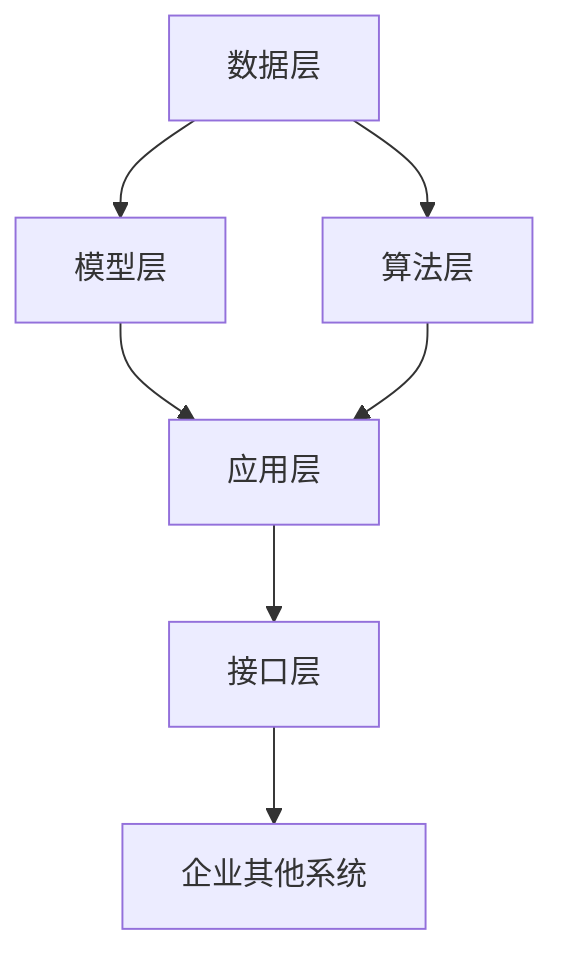

                 

### 第一部分：引言与背景

## 第1章：企业AI Agent与组织网络概述

### 1.1 企业AI Agent的概念

**核心概念术语说明**：

- **AI Agent**：人工智能代理，是一种模拟人类智能行为和决策的程序或系统，具有自主学习和交互的能力。
- **企业AI Agent**：在企业环境中运行的AI代理，能够自动执行任务、提供决策支持，并优化业务流程。

**问题背景**：

企业在快速变化的市场环境中，面临着如何提高效率、降低成本、优化资源分配等挑战。传统的管理方法难以应对日益复杂的企业运营需求，因此引入AI Agent成为了一种有效的解决方案。

**问题描述**：

企业AI Agent的目标是通过对企业内部组织网络的深入分析，实现组织结构的优化、业务流程的自动化和决策支持的智能化。这一过程中，如何有效地利用图神经网络技术进行组织网络分析成为一个关键问题。

**问题解决**：

利用图神经网络技术，可以对组织网络进行结构化分析，提取网络中的关键节点和重要路径，从而为企业提供有针对性的优化建议。图神经网络在处理复杂网络数据方面具有独特优势，能够帮助AI Agent更好地理解和优化企业组织网络。

**边界与外延**：

本章节主要探讨企业AI Agent在组织网络分析中的应用，具体包括图神经网络的基础理论、组织网络的特性分析以及AI Agent的设计与实现。同时，本文还将探讨图神经网络在组织网络优化中的实际应用案例，以期为读者提供全面的技术解读和应用指导。

**概念结构与核心要素组成**：

- **图神经网络**：是处理图结构数据的神经网络模型，具有强大的特征提取和关系建模能力。
- **组织网络**：是描述企业内部各部门、人员、资源之间关系的一种抽象模型。
- **企业AI Agent**：是企业内部运行的智能代理，利用图神经网络技术对组织网络进行分析和优化。

通过以上分析，我们可以明确企业AI Agent在组织网络分析与优化中的应用价值和具体实施路径。接下来，我们将进一步探讨图神经网络的基础理论和核心概念，为后续章节的内容奠定基础。$$

### 1.2 组织网络的概念

**核心概念与联系**：

组织网络是指企业内部各部门、人员、资源之间相互联系和作用的关系网络。它不仅包括组织结构中的层级关系，还涉及到人员之间的协作关系和资源分配情况。组织网络的概念可以从以下几个方面进行理解：

- **组织结构**：指企业内部各部门的组织层次和职责分工。组织结构决定了企业内部权力的分配和资源的流动。
- **人员关系**：指企业内部人员之间的协作和互动。人员关系有助于提高企业内部沟通效率和协作水平。
- **资源分配**：指企业内部资源（如资金、物资、信息等）的分配和使用情况。合理的资源分配能够提高企业的运营效率和竞争力。

**概念属性特征对比表格**：

| 特征 | 组织结构 | 人员关系 | 资源分配 |
| ---- | ---- | ---- | ---- |
| 关系类型 | 层级关系 | 协作关系 | 流动关系 |
| 数据来源 | 组织架构图 | 人员数据 | 资源数据 |
| 影响因素 | 企业战略、组织文化 | 个人能力、团队协作 | 资源供需、市场环境 |
| 目标 | 确保组织运作效率 | 提高团队协作效率 | 提高资源利用效率 |

**ER实体关系图架构**：

为了更好地理解组织网络的构成，我们可以使用ER（实体关系）图来描述其结构。ER图包括三个主要组件：实体、属性和关系。

- **实体**：表示组织网络中的各种对象，如部门、人员、资源等。
- **属性**：描述实体的特征和属性，如部门名称、员工姓名、资源种类等。
- **关系**：表示实体之间的关联和交互，如部门领导、员工协作、资源分配等。

以下是一个简化的ER图示例：

```mermaid
erDiagram
  部门 ||--|{ 人员 }|| 员工
  部门 ||--|{ 资源 }|| 资源
  人员 ||--|{ 项目 }|| 项目
  人员 ||--|{ 技能 }|| 技能
  资源 ||--|{ 供应商 }|| 供应商
```

通过上述ER图，我们可以清晰地看到组织网络中各部门、人员、资源和供应商之间的关系，这为后续的分析和优化提供了基础。

**组织网络的构成与特性**：

组织网络的构成主要包括以下几个方面：

- **层级结构**：企业内部按照职能、权限和责任划分的层级关系，如部门领导、普通员工等。
- **关系网络**：描述企业内部各部门、人员、资源之间的相互作用和依赖关系。
- **动态性**：组织网络是动态变化的，随着企业规模的扩大、战略调整和人员变动等因素，组织网络也会相应调整。
- **复杂性**：组织网络中存在多种关系和互动，如跨部门协作、资源共享、信息传递等，使得网络结构复杂。

**组织网络在企业管理中的应用**：

组织网络分析在企业管理中具有重要意义，主要体现在以下几个方面：

- **优化组织结构**：通过分析组织网络的层级结构和关系网络，可以识别出优化组织结构的潜在机会，提高企业运作效率。
- **提升协作效率**：分析人员之间的关系，可以找到提高协作效率和优化工作流程的关键因素。
- **资源分配**：通过分析资源的分配和使用情况，可以优化资源分配策略，提高资源利用效率。

综上所述，组织网络是企业内部管理和运营的重要组成部分，通过图神经网络技术对组织网络进行分析和优化，有助于企业提高运营效率和竞争力。在接下来的章节中，我们将深入探讨图神经网络的基本原理和应用方法，为组织网络分析与优化提供技术支持。$$

### 1.3 问题背景与需求

在企业快速发展的过程中，组织网络结构的优化成为企业管理的重要课题。传统的组织网络分析方法依赖于结构化数据，往往难以应对复杂多变的组织环境。随着人工智能技术的不断进步，特别是图神经网络（Graph Neural Network, GNN）的发展，为组织网络分析提供了新的方法和思路。

**问题背景**：

1. **企业规模扩大与复杂性增加**：企业规模不断扩大，组织结构变得更加复杂，传统的层级管理方式难以满足高效运作的需求。企业需要一种能够动态适应组织结构变化的智能分析工具。
2. **数据量的爆炸性增长**：随着信息技术的普及，企业内部积累了大量关于人员、部门、项目、资源等的数据，这些数据不仅包含结构化信息，还包含大量的非结构化信息。如何从这些数据中提取有价值的信息成为关键问题。
3. **优化组织网络的迫切需求**：企业需要在竞争激烈的市场环境中保持竞争优势，优化组织结构、提高协作效率、优化资源分配成为企业发展的关键需求。

**需求**：

1. **动态适应组织结构变化**：企业组织结构不是固定不变的，随着企业战略调整和业务发展，组织结构会发生变化。需要一个能够实时分析组织网络、动态调整分析模型的智能工具。
2. **高效的数据分析能力**：需要一种能够处理大规模、复杂网络数据的分析方法，能够从海量数据中快速提取有价值的信息，支持企业决策。
3. **优化组织网络结构**：通过分析组织网络中的关键节点和路径，找到优化组织结构的切入点，提高组织运作效率。

**图神经网络在组织网络分析中的应用前景**：

1. **特征提取能力**：图神经网络具有强大的特征提取能力，能够从复杂的网络数据中提取出有意义的特征，为组织网络分析提供数据支持。
2. **关系建模能力**：图神经网络能够捕捉网络中节点和边之间的关系，帮助分析组织网络中的关键节点和路径，支持优化决策。
3. **动态适应性**：图神经网络可以实时适应组织网络结构的变化，动态调整分析模型，为企业管理提供持续支持。

**图神经网络在组织网络分析中的应用**：

1. **节点重要性分析**：通过分析组织网络中的节点重要性，识别出关键节点，为组织结构调整提供依据。
2. **社区检测**：通过社区检测算法，发现组织网络中的功能相似或紧密联系的群体，优化部门间协作。
3. **路径分析**：通过路径分析，找到组织网络中重要的路径，优化资源流动和信息传递。

总之，图神经网络在组织网络分析中的应用前景广阔，能够为企业提供智能化、高效化的管理工具，助力企业在竞争激烈的市场环境中保持持续竞争力。在接下来的章节中，我们将进一步探讨图神经网络的基本原理和应用方法，为组织网络分析与优化提供技术支持。$$

### 1.4 优化目标与评价指标

**优化目标**：

企业AI Agent在组织网络分析中的核心目标是提升企业的整体运营效率。具体优化目标包括：

1. **提高组织运作效率**：通过优化组织结构、优化部门间的协作关系，提高企业内部各部门的工作效率。
2. **降低运营成本**：通过优化资源分配，减少不必要的资源浪费，降低企业的运营成本。
3. **提升员工满意度**：通过优化组织结构和部门协作，提高员工的工作满意度，进而提升企业整体生产力。

**评价指标**：

为了衡量优化效果，我们需要设定一系列评价指标。以下是一些关键的评价指标：

1. **效率指标**：
   - **任务完成时间**：评估企业在完成特定任务所需的时间。
   - **响应时间**：评估企业对内部请求或外部需求响应的速度。
   - **生产效率**：评估企业单位时间内的产出。

2. **成本指标**：
   - **运营成本**：评估企业总体运营成本，包括人力成本、物料成本、管理成本等。
   - **资源利用率**：评估企业资源的利用效率，如设备利用率、人力利用率等。

3. **满意度指标**：
   - **员工满意度**：评估员工对企业工作环境的满意度。
   - **客户满意度**：评估客户对企业产品或服务的满意度。

**优化问题的数学模型**：

为了量化优化目标，我们可以建立以下数学模型：

1. **目标函数**：
   - \( f(O) = \alpha \cdot E + \beta \cdot C + \gamma \cdot S \)
   其中，\( O \) 表示组织网络，\( E \) 表示效率指标，\( C \) 表示成本指标，\( S \) 表示满意度指标，\( \alpha, \beta, \gamma \) 为权重系数。

2. **约束条件**：
   - \( \sum_{i=1}^{n} e_i \leq E_{\max} \)
   - \( \sum_{i=1}^{n} c_i \leq C_{\max} \)
   - \( \sum_{i=1}^{n} s_i \geq S_{\min} \)
   其中，\( e_i, c_i, s_i \) 分别表示第 \( i \) 个部门的效率、成本和满意度，\( E_{\max}, C_{\max}, S_{\min} \) 为最大效率、最大成本和最小满意度。

通过以上数学模型，我们可以量化组织网络优化的效果，并在实际应用中进行参数调整，以达到最佳优化效果。接下来，我们将进一步探讨图神经网络的基本原理和应用，为组织网络分析与优化提供技术支持。$$

### 1.5 图神经网络在组织网络分析中的应用

图神经网络（Graph Neural Network, GNN）是一种专门用于处理图结构数据的神经网络模型，其核心优势在于能够有效地捕捉和建模图中的节点和边之间的关系。在组织网络分析中，GNN的引入为复杂网络数据的分析和优化提供了新的方法和思路。

**GNN的基本原理**：

GNN的基本原理可以概括为以下几个方面：

1. **节点表示学习**：GNN通过学习节点表示，将图中的每个节点映射到一个高维向量表示，从而提取节点的特征信息。
2. **图卷积操作**：图卷积操作是GNN的核心机制，它通过节点和其邻域节点的相互作用，更新节点的特征表示。这个过程类似于神经网络中的卷积操作，但适用于图结构数据。
3. **图池化操作**：图池化操作用于聚合多个节点的特征表示，从而形成一个全局特征表示，这一过程有助于捕捉节点之间的关系和全局模式。

**图神经网络的发展历程**：

1. **图卷积网络（Graph Convolutional Network, GCN）**：GCN是GNN的先驱，通过引入图卷积操作，使得神经网络能够处理图结构数据。
2. **图注意力机制（Graph Attention Mechanism, GAT）**：GAT通过引入注意力机制，进一步提高了GNN对节点关系建模的能力，使得模型能够更加灵活地关注图中的关键节点和路径。
3. **图自编码器（Graph Autoencoder, GAE）**：GAE是一种基于自编码器的GNN模型，通过无监督学习方式，学习图中的节点表示和潜在结构。
4. **图生成对抗网络（Graph Generative Adversarial Network, GAN）**：GAN结合了生成模型和判别模型，通过生成和判别图数据的对抗训练，实现图数据的生成和优化。

**图神经网络在组织网络分析中的应用**：

1. **节点重要性分析**：利用GNN，可以分析组织网络中每个节点的重要性，识别出关键节点和瓶颈节点，为组织结构调整提供依据。
2. **社区检测**：通过GNN，可以识别组织网络中的功能相似或紧密联系的群体，优化部门间协作。
3. **路径分析**：GNN能够分析组织网络中的路径信息，找到重要的路径和潜在的优化机会。
4. **资源分配优化**：利用GNN，可以优化企业内部资源的分配，提高资源利用效率。

**应用前景**：

随着GNN技术的不断发展和成熟，其在组织网络分析中的应用前景十分广阔。未来，GNN有望在以下几个方面实现突破：

1. **模型性能优化**：通过引入更多先进的神经网络架构和算法，提高GNN的性能和效率。
2. **跨领域应用**：GNN不仅适用于企业组织网络分析，还可以应用于其他领域，如社交网络分析、生物信息学等。
3. **数据隐私保护**：研究如何利用GNN在保护数据隐私的同时，实现高效的图数据分析。

综上所述，图神经网络在组织网络分析中的应用具有重要意义，能够为企业提供智能化、高效化的管理工具，助力企业在竞争激烈的市场环境中保持持续竞争力。在接下来的章节中，我们将进一步探讨GNN的基本原理和具体应用方法，为组织网络分析与优化提供技术支持。$$

### 1.6 图神经网络的基本原理

图神经网络（Graph Neural Network, GNN）是一种专门用于处理图结构数据的神经网络模型，其基本原理是通过图卷积操作和图池化操作，从图中的节点和边中提取有用信息，构建高维特征表示。以下将详细阐述图神经网络的基本原理，包括图表示学习、图卷积网络和图注意力机制等核心概念。

**图表示学习**：

图表示学习是GNN的第一步，主要目标是学习每个节点的特征表示。在图表示学习中，每个节点 \(v_i\) 被映射为一个高维向量表示 \(h_i\)，通常通过以下公式进行更新：

\[ h_i^{(t+1)} = \sigma(W^{(t)} h_i^{(t)} + \sum_{j \in \mathcal{N}(i)} w_{ij} h_j^{(t)} \]

其中，\( \mathcal{N}(i) \) 表示节点 \(i\) 的邻域节点集合，\( w_{ij} \) 表示节点 \(i\) 和节点 \(j\) 之间的权重，\( W^{(t)} \) 是可学习的权重矩阵，\( \sigma \) 是非线性激活函数。

**图卷积网络（Graph Convolutional Network, GCN）**：

图卷积网络是GNN的基础模型，通过图卷积操作，将节点 \(i\) 的特征 \(h_i^{(t)}\) 与其邻域节点的特征 \(h_j^{(t)}\) 结合，更新节点 \(i\) 的新特征 \(h_i^{(t+1)}\)。图卷积操作的公式如下：

\[ h_i^{(t+1)} = \sigma(\sum_{j \in \mathcal{N}(i)} w_{ij} h_j^{(t)} + b) \]

其中，\( w_{ij} \) 是邻接矩阵中的元素，表示节点 \(i\) 和节点 \(j\) 之间的连接强度，\( b \) 是偏置项。

**图注意力机制（Graph Attention Mechanism, GAT）**：

图注意力机制是一种改进的图卷积操作，它通过引入注意力权重，使得节点在更新特征时能够更加关注其邻域节点的重要信息。图注意力机制的公式如下：

\[ a_{ij}^{(t)} = \frac{e^{a_{ij}}}{\sum_{k \in \mathcal{N}(i)} e^{a_{ik}}} \]
\[ h_i^{(t+1)} = \sigma(\sum_{j \in \mathcal{N}(i)} a_{ij}^{(t)} h_j^{(t)} + b) \]

其中，\( a_{ij}^{(t)} \) 是节点 \(i\) 对节点 \(j\) 的注意力权重，\( e^{a_{ij}} \) 是节点 \(i\) 和节点 \(j\) 之间的权重指数，\( a_{ik} \) 是节点 \(i\) 对节点 \(k\) 的注意力权重。

**图邻域与特征传播**：

图神经网络通过图卷积和图注意力机制，实现了节点特征在图中的传播。具体来说，节点 \(i\) 的特征不仅受到其邻域节点 \(j\) 的影响，还会通过邻接权重 \( w_{ij} \) 调整传播效果。这种特征传播机制使得GNN能够捕捉图中的局部和全局关系，从而进行有效的特征提取。

**图卷积与池化操作**：

图卷积操作是一种局部操作，它将节点 \(i\) 的特征与邻域节点的特征相结合，更新节点的新特征。而图池化操作则是一种全局操作，它将多个节点的特征聚合，形成全局特征表示。图池化操作可以采用平均池化、最大池化等方式，以捕获图中的全局模式和结构。

综上所述，图神经网络通过图表示学习、图卷积操作和图注意力机制，实现了对图结构数据的有效建模和处理。在组织网络分析中，GNN能够提取出节点和边之间的关系特征，为组织结构的优化提供数据支持。接下来，我们将进一步探讨组织网络的构成与特性，为后续的深度分析奠定基础。$$

### 3.1 组织网络的概念与结构

组织网络（Organizational Network）是一种抽象模型，用于描述企业内部各部门、人员、资源之间的相互关系。通过组织网络分析，企业可以深入了解内部信息流动、资源分配、协作模式等关键问题，从而优化组织结构、提升管理效率。

**组织网络的定义**：

组织网络是指在企业内部，由人员、部门和资源等实体及其相互关系构成的复杂网络。这些实体通过协作、沟通、依赖等关系相互连接，形成了企业运作的基础结构。

**组织网络的层次结构**：

组织网络通常可以分为以下三个层次：

1. **物理层级**：物理层级描述企业内部各部门、分支机构等的物理布局和组织结构，如公司总部、各个分支机构、部门等。
2. **功能层级**：功能层级描述企业内部各部门的职能分工和业务流程，如研发部门、销售部门、生产部门等。
3. **社交层级**：社交层级描述企业内部人员之间的社交关系和网络，如员工之间的合作、沟通、互动等。

**组织网络的特性分析**：

1. **复杂性**：组织网络具有高度的复杂性，包含多种不同类型的节点（如人员、部门、项目等）和边（如协作、依赖、信息传递等）。这种复杂性使得组织网络的分析和优化具有挑战性。
2. **动态性**：组织网络是动态变化的，随着企业战略调整、人员变动、业务发展等因素，组织网络的结构和关系也会发生变化。因此，对组织网络的分析需要具备动态适应能力。
3. **层次性**：组织网络具有明显的层次性，不同层级的节点和关系在功能和作用上存在差异。物理层级关注企业内部的物理布局和资源分配，功能层级关注业务流程和管理体系，社交层级关注员工之间的协作和沟通。
4. **多维度**：组织网络涉及多个维度，如人员技能、部门职责、资源分配等。这些维度相互交织，构成了企业内部复杂的关系网络。

**组织网络在企业管理中的应用**：

1. **组织结构优化**：通过分析组织网络，可以识别出组织结构中的瓶颈和优化机会，从而进行组织结构调整，提升管理效率。
2. **人力资源优化**：通过分析员工之间的协作和互动关系，可以优化人力资源配置，提升团队协作效率。
3. **业务流程优化**：通过分析业务流程中的关键节点和路径，可以优化业务流程，减少冗余环节，提高业务运作效率。
4. **知识管理**：通过分析组织网络中的知识流动和传递路径，可以优化知识管理策略，促进企业内部知识共享和创新。

综上所述，组织网络是企业内部管理和运营的重要组成部分，通过对其结构、特性及应用的分析，企业可以更好地理解和优化内部关系，提升整体运营效率。在接下来的章节中，我们将进一步探讨组织网络的拓扑结构和关系属性，为组织网络分析提供更深入的视角。$$

### 3.2 组织网络的拓扑结构

组织网络的拓扑结构是指企业内部各部门、人员、资源等节点及其相互之间的连接关系，这种结构在企业管理中具有重要意义。通过分析组织网络的拓扑结构，可以揭示企业内部的关系网络，为优化组织结构和提升管理效率提供依据。

**拓扑结构的概念**：

拓扑结构是一种抽象的图形表示，用于描述网络中的节点及其连接关系。在组织网络中，节点通常表示企业内部的关键实体，如人员、部门和资源等；边则表示这些实体之间的联系，如协作关系、信息传递和依赖关系等。

**常见的拓扑结构类型**：

1. **星型拓扑**：星型拓扑中，一个中心节点连接多个外围节点，这种结构在企业管理中常见于层级式组织，如公司总部与各分支机构之间的联系。
2. **树型拓扑**：树型拓扑类似于家族树，具有明显的层级关系，每个节点只有一个父节点，可以表示企业内部的部门结构和职责分工。
3. **网状拓扑**：网状拓扑是一种复杂的拓扑结构，其中节点之间具有多种连接关系，可以表示企业内部各部门和人员之间的多向协作关系。
4. **环型拓扑**：环型拓扑中，节点按照一定的顺序连接成一个闭合的环，这种结构常见于一些协同工作模式，如跨部门项目团队。

**拓扑结构在组织网络分析中的作用**：

1. **识别关键节点**：通过分析组织网络的拓扑结构，可以识别出关键节点，这些节点在组织网络中具有重要作用，如核心人员、关键部门和重要资源等。
2. **发现瓶颈**：拓扑结构分析有助于发现组织网络中的瓶颈环节，如信息传递缓慢、资源分配不均等，从而为优化组织结构提供依据。
3. **优化协作模式**：通过分析组织网络的拓扑结构，可以优化企业内部的协作模式，如通过调整节点之间的连接关系，提升团队协作效率和资源利用率。
4. **支持决策制定**：拓扑结构分析为企业管理层提供了直观的图形化视图，有助于制定更科学的决策，如组织结构调整、人力资源配置和业务流程优化等。

**案例分析**：

以一家大型跨国公司的组织网络为例，通过分析其拓扑结构，可以发现以下关键点和优化建议：

1. **关键节点**：识别出公司高层管理人员、核心研发团队和主要业务部门等关键节点，这些节点在企业运营中起到重要作用。
2. **瓶颈环节**：发现某些部门之间的协作关系较弱，信息传递不畅，导致业务流程受阻。
3. **优化建议**：通过加强关键节点之间的连接关系，优化部门间的协作模式，提升整体运营效率。

综上所述，组织网络的拓扑结构分析对于企业管理和优化具有重要意义。通过深入分析拓扑结构，企业可以更好地理解和优化内部关系，提升整体运营效率。在接下来的章节中，我们将进一步探讨组织网络的关系属性，为组织网络分析提供更全面的视角。$$

### 3.3 组织网络的关系属性

组织网络的关系属性是指企业内部各部门、人员、资源等节点之间的相互作用和依赖关系。这些关系属性不仅反映了组织网络的结构特性，还对企业的运营效率和决策质量产生重要影响。通过分析组织网络的关系属性，企业可以优化资源分配、提升协作效率和改善管理效果。

**关系属性的类型**：

1. **协作关系**：协作关系是组织网络中最常见的关系类型，描述企业内部不同部门、团队或个人之间的合作互动。协作关系可以分为横向协作和纵向协作。横向协作是指同一层级或不同层级之间的协同工作，如跨部门项目团队的合作；纵向协作则是指上下级之间的关系，如部门经理与下属员工之间的沟通和协调。

2. **信息传递关系**：信息传递关系是指企业内部信息在不同节点之间的流动和传递。有效的信息传递关系能够确保企业内部的信息畅通，提高决策效率。信息传递关系可以分为内部传递和外部传递。内部传递主要涉及企业内部的信息共享和沟通，如部门间的报告传递；外部传递则涉及企业与外部环境（如客户、供应商、合作伙伴等）的信息交互。

3. **资源依赖关系**：资源依赖关系描述企业内部不同节点对资源的获取和使用情况。资源包括人力、资金、物资、信息等。资源依赖关系可以分为内部依赖和外部依赖。内部依赖是指企业内部部门之间对资源的相互依赖，如研发部门需要生产部门的零部件支持；外部依赖则是指企业对外部资源的依赖，如采购部门对外部供应商的依赖。

**关系属性在组织网络分析中的应用**：

1. **优化协作模式**：通过分析组织网络中的协作关系，可以识别出协作强度高、效率低的环节，从而优化协作模式，提高团队协作效率。例如，通过调整部门职责、改善沟通渠道等方式，提升跨部门项目的执行效率。

2. **改进信息管理**：通过分析信息传递关系，可以优化企业内部的信息流动，确保关键信息能够及时、准确地传递到相关部门和人员。例如，通过建立统一的信息平台、优化内部沟通机制等方式，提升信息传递效率。

3. **优化资源分配**：通过分析资源依赖关系，可以识别出资源利用不均、依赖关系复杂的环节，从而优化资源分配，提升资源利用效率。例如，通过调整人力资源配置、优化供应链管理等方式，实现资源的最优利用。

**案例分析**：

以一家制造企业为例，通过分析其组织网络的关系属性，可以发现以下问题及优化建议：

1. **协作关系优化**：发现某些生产部门与质量管理部门之间的协作关系较弱，导致生产过程中的质量问题无法及时发现和处理。优化建议：加强生产部门与质量管理部门之间的沟通，建立定期的协作会议机制，确保质量问题能够及时得到解决。

2. **信息传递改进**：发现企业内部的信息传递存在延迟现象，尤其是跨部门的信息传递。优化建议：建立企业内部的信息共享平台，确保信息能够实时传递和共享，提升决策效率。

3. **资源分配优化**：发现某些生产部门的资源利用率较低，导致生产效率不理想。优化建议：通过数据分析，优化生产计划，合理分配资源，提升生产效率。

综上所述，组织网络的关系属性对于企业运营具有重要意义。通过深入分析关系属性，企业可以优化内部协作、改善信息管理和优化资源分配，从而提升整体运营效率和竞争力。在接下来的章节中，我们将进一步探讨基于图神经网络的节点重要性分析和社区检测方法，为企业提供更全面的组织网络分析与优化工具。$$

### 3.4 基于图神经网络的节点重要性分析

在组织网络分析中，节点重要性分析是一种关键方法，用于识别网络中的关键节点，这些节点在组织结构中起着至关重要的作用。基于图神经网络的节点重要性分析通过学习节点及其邻域节点的特征，可以准确评估每个节点在组织网络中的重要性，从而为企业提供有针对性的优化建议。

**核心原理**：

基于图神经网络的节点重要性分析主要依赖于以下原理：

1. **图表示学习**：首先，通过图表示学习方法，将组织网络中的每个节点映射为一个高维向量表示，从而提取节点的特征信息。
2. **图卷积操作**：通过图卷积操作，将节点和其邻域节点的特征进行聚合，更新节点的特征表示。这一过程有助于捕捉节点在组织网络中的影响力。
3. **重要性评估**：利用训练好的图神经网络模型，对每个节点的特征表示进行重要性评估，从而确定节点的重要性排名。

**具体步骤**：

1. **数据预处理**：首先，对组织网络进行数据预处理，包括节点和边的特征提取、图的标准化等操作，以便于后续的模型训练。
2. **构建图神经网络模型**：设计并构建一个图神经网络模型，通常包括多个图卷积层和一个或多个全连接层。通过训练模型，学习节点和边之间的关系。
3. **训练与评估**：使用训练数据对图神经网络模型进行训练，并通过验证集评估模型的性能。模型训练完成后，使用测试数据对模型进行测试，评估节点重要性分析的效果。
4. **节点重要性评估**：利用训练好的模型，对组织网络中的每个节点进行重要性评估，生成节点重要性排名。

**示例**：

假设有一个包含10个节点的组织网络，通过图神经网络模型对其进行节点重要性分析。训练完成后，模型输出每个节点的重要性得分，得分越高表示节点在组织网络中的重要性越高。例如，模型输出如下结果：

- 节点1：重要性得分95
- 节点2：重要性得分88
- 节点3：重要性得分82
- ...

根据重要性得分，企业可以识别出关键节点，如节点1，并将其作为组织优化的重点对象。

**应用价值**：

基于图神经网络的节点重要性分析在组织网络优化中具有重要的应用价值：

1. **识别关键节点**：通过节点重要性分析，企业可以识别出组织网络中的关键节点，这些节点往往是企业运营的核心和瓶颈所在。
2. **优化组织结构**：通过优化关键节点之间的关系，企业可以调整组织结构，提升整体运营效率。
3. **提升决策质量**：基于节点重要性分析，企业可以更加精准地制定决策，确保资源、人力、信息等资源得到合理利用。

总之，基于图神经网络的节点重要性分析为企业提供了强大的工具，有助于企业深入理解组织网络，优化内部结构，提升运营效率。在接下来的章节中，我们将进一步探讨基于图神经网络的社区检测方法，为企业提供更全面的组织网络分析工具。$$

### 3.5 基于图神经网络的社区检测

社区检测是组织网络分析中的一项重要任务，旨在识别网络中的紧密联系群体，即社区。这些社区在企业内部往往代表着特定的工作群体或业务领域，具有共同的目标和协作关系。通过社区检测，企业可以优化组织结构、提升协作效率和促进知识共享。

**核心原理**：

基于图神经网络的社区检测主要依赖于以下原理：

1. **图表示学习**：首先，通过图表示学习方法，将组织网络中的每个节点映射为一个高维向量表示，从而提取节点的特征信息。
2. **图卷积与池化操作**：利用图卷积和池化操作，对节点及其邻域节点的特征进行聚合，形成全局特征表示。这一过程有助于识别节点之间的紧密联系。
3. **社区检测算法**：基于全局特征表示，应用社区检测算法（如Louvain算法、标签传播算法等），识别网络中的社区结构。

**具体步骤**：

1. **数据预处理**：对组织网络进行数据预处理，包括节点和边的特征提取、图的标准化等操作，以便于后续的模型训练。
2. **构建图神经网络模型**：设计并构建一个图神经网络模型，通常包括多个图卷积层和一个或多个全连接层。通过训练模型，学习节点和边之间的关系。
3. **训练与评估**：使用训练数据对图神经网络模型进行训练，并通过验证集评估模型的性能。模型训练完成后，使用测试数据对模型进行测试，评估社区检测的效果。
4. **社区检测**：利用训练好的模型，对组织网络进行社区检测，识别出网络中的紧密联系群体。通常，社区检测结果以聚类标签形式呈现，每个标签代表一个社区。

**示例**：

假设有一个包含100个节点的组织网络，通过图神经网络模型对其进行社区检测。训练完成后，模型输出每个节点的聚类标签，标签相同的节点属于同一社区。例如，模型输出如下结果：

- 节点1：标签A
- 节点2：标签A
- 节点3：标签B
- ...

根据聚类标签，企业可以识别出以下社区：

- 社区A：节点1、节点2等
- 社区B：节点3等

这些社区代表了企业内部的不同工作群体，如研发团队、销售团队等。

**应用价值**：

基于图神经网络的社区检测在组织网络优化中具有重要的应用价值：

1. **优化组织结构**：通过社区检测，企业可以识别出紧密联系的社区，从而优化组织结构，确保部门之间的协作更加高效。
2. **提升协作效率**：社区检测有助于企业发现具有共同目标的群体，促进知识共享和协作，提升整体工作效率。
3. **促进创新与学习**：社区检测可以促进企业内部的创新和知识交流，为员工提供更多的学习和成长机会。

总之，基于图神经网络的社区检测为企业提供了强大的工具，有助于企业深入理解组织网络，优化内部结构，提升运营效率。在接下来的章节中，我们将进一步探讨企业AI Agent的设计与实现，为企业提供全面的技术支持。$$

### 4.1 企业AI Agent的设计思路

**企业AI Agent的概念**：

企业AI Agent是指一种在企业环境中运行的智能化代理，能够自主执行任务、提供决策支持，并优化业务流程。AI Agent基于人工智能技术，具备自我学习和适应能力，能够根据企业的具体需求和运营情况，提供个性化的解决方案。

**企业AI Agent的功能模块**：

企业AI Agent通常包括以下几个功能模块：

1. **数据采集与处理**：负责从各种数据源（如数据库、API接口等）采集企业内部的数据，并对数据进行预处理，确保数据质量。
2. **特征提取与表示**：利用机器学习和深度学习技术，对采集到的数据进行特征提取和表示，为后续的分析和优化提供数据支持。
3. **图神经网络模型训练**：基于图神经网络技术，训练模型以学习企业组织网络的特性和关系，为节点重要性分析和社区检测等任务提供基础。
4. **决策支持**：根据分析结果，为企业提供优化建议和决策支持，如组织结构调整、资源优化配置、业务流程优化等。
5. **自动化执行**：自动执行决策支持中的优化任务，如调整部门职责、优化人力资源配置、优化业务流程等。

**企业AI Agent的架构设计**：

企业AI Agent的架构设计可以分为以下几个层次：

1. **数据层**：数据层包括企业内部的各种数据源，如数据库、API接口、日志文件等。数据采集模块负责从这些数据源中获取数据，并进行预处理。
2. **模型层**：模型层是基于图神经网络技术的模型，包括节点重要性分析模型、社区检测模型等。模型层通过训练和优化，学习企业组织网络的特性和关系。
3. **算法层**：算法层是实现各种人工智能算法的模块，如特征提取算法、机器学习算法、深度学习算法等。算法层为模型层提供技术支持，实现数据的分析和优化。
4. **应用层**：应用层是AI Agent的核心功能模块，包括决策支持、自动化执行等。应用层通过调用模型层和算法层的功能，实现企业的优化任务。
5. **接口层**：接口层负责与其他系统（如企业资源规划系统、客户关系管理系统等）进行集成和交互，实现数据的共享和协同工作。

**企业AI Agent的整体架构**：

以下是一个简化的企业AI Agent整体架构图：



通过上述架构设计，企业AI Agent能够充分利用企业内部的数据资源，通过图神经网络技术进行深度分析和优化，为企业提供智能化、自动化的管理工具，助力企业在竞争激烈的市场环境中保持持续竞争力。在接下来的章节中，我们将进一步探讨图神经网络在企业AI Agent中的应用，实现组织网络的深入分析和优化。$$

### 4.2 图神经网络在企业AI Agent中的应用

图神经网络（GNN）在企业AI Agent中的应用至关重要，它通过深度学习技术，对复杂的企业组织网络进行建模和分析，从而实现高效的节点重要性分析和社区检测。以下将详细探讨图神经网络在企业AI Agent中的应用方法，包括图神经网络在企业网络分析中的实现步骤、AI Agent的性能优化策略以及具体的实际应用场景。

**图神经网络在企业网络分析中的实现步骤**：

1. **数据预处理**：首先，需要对企业网络的数据进行预处理，包括节点和边的特征提取、数据清洗和数据标准化等。这一步的目的是将原始数据转换为适合GNN处理的格式。
2. **构建图神经网络模型**：设计并构建一个图神经网络模型，通常包括多个图卷积层和一个或多个全连接层。在构建模型时，需要考虑节点的特征、边的权重以及图的结构信息。
3. **训练模型**：使用预处理后的数据对图神经网络模型进行训练，通过反向传播算法和梯度下降优化模型参数。在训练过程中，可以采用交叉验证等方法来评估模型的性能。
4. **评估模型**：在验证集上评估训练好的模型，通过节点重要性分析或社区检测任务来验证模型的有效性。如果模型性能不理想，需要返回上一步进行调整和优化。
5. **部署模型**：将训练好的模型部署到企业AI Agent中，通过实时分析企业网络数据，为AI Agent提供决策支持。

**AI Agent的性能优化策略**：

1. **模型压缩**：通过模型压缩技术，如知识蒸馏、剪枝和量化等，可以减少模型的参数数量，提高模型的计算效率，从而提升AI Agent的响应速度。
2. **分布式训练**：利用分布式训练技术，可以将数据分布在多个计算节点上并行训练模型，从而加速训练过程，提高模型的训练效率。
3. **在线学习**：AI Agent可以采用在线学习策略，实时更新模型参数，以适应企业网络结构的动态变化，从而提高模型的适应性和实时性。
4. **资源调度**：通过资源调度策略，合理分配计算资源，确保AI Agent在处理大规模网络数据时，能够高效利用资源，降低计算成本。

**实际应用场景**：

1. **人力资源优化**：通过节点重要性分析，AI Agent可以识别出企业内部的关键岗位和核心员工，为企业提供人力资源配置建议，优化团队结构和人员安排。
2. **产品供应链优化**：通过社区检测，AI Agent可以识别出企业内部的供应链节点，分析供应链中的关键路径和瓶颈环节，为企业提供供应链优化策略，提升供应链效率和响应速度。
3. **业务流程优化**：AI Agent可以分析企业内部业务流程，识别流程中的冗余环节和瓶颈，提供流程优化建议，帮助企业简化流程，提高业务处理效率。

**案例分析**：

以一家大型制造企业为例，通过部署企业AI Agent，实现了以下优化：

1. **人力资源优化**：AI Agent通过节点重要性分析，识别出企业内部的核心研发团队和管理团队，为企业提供了优化团队结构和人员配置的建议，提升了研发效率和团队协作水平。
2. **产品供应链优化**：AI Agent通过社区检测，识别出供应链中的关键节点和瓶颈环节，为企业提供了优化供应链策略，提高了供应链效率和库存管理能力。
3. **业务流程优化**：AI Agent通过分析业务流程，识别出流程中的冗余环节和瓶颈，为企业提供了简化流程和优化业务流程的建议，提高了业务处理效率，降低了运营成本。

综上所述，图神经网络在企业AI Agent中的应用为企业提供了强大的工具，通过深度分析和优化，帮助企业提升运营效率、降低成本、优化资源分配。在未来的发展中，随着GNN技术的不断成熟，企业AI Agent在组织网络分析与优化中的应用将更加广泛和深入。$$

### 4.3 企业AI Agent的实际应用场景

企业AI Agent在实际应用中，通过图神经网络技术对组织网络进行深度分析，能够提供多种优化建议和自动化执行方案，从而提升企业运营效率。以下将介绍企业AI Agent在人力资源优化和产品供应链优化两个实际应用场景中的具体应用案例。

**人力资源优化**

**场景描述**：

某大型科技公司拥有一支庞大的研发团队，但由于团队内部成员之间的协作关系复杂，导致研发项目进展缓慢，效率低下。企业希望利用AI Agent对人力资源进行优化，提高团队协作效率和项目完成速度。

**应用过程**：

1. **数据采集**：AI Agent首先从企业内部数据库、员工绩效管理系统等渠道采集员工信息、项目进度、沟通记录等数据。
2. **特征提取**：对采集到的数据进行预处理，提取出与员工协作、项目进展、绩效表现等相关的特征。
3. **图神经网络建模**：构建图神经网络模型，将员工和项目映射为节点，协作关系和项目依赖关系映射为边。模型训练过程中，利用图卷积网络和图注意力机制，学习员工之间的协作模式和项目之间的依赖关系。
4. **节点重要性分析**：通过模型分析，识别出关键员工和关键项目，评估每个员工在团队中的重要性。
5. **优化建议**：基于分析结果，AI Agent提出优化建议，如调整团队结构、优化项目分配、加强关键员工之间的协作等。
6. **自动化执行**：AI Agent自动执行优化建议，调整团队角色和项目进度，并实时跟踪优化效果。

**效果评估**：

通过AI Agent的优化，企业团队协作效率显著提升，项目完成速度加快，员工的工作满意度也有所提高。

**产品供应链优化**

**场景描述**：

某制造业企业面临产品供应链管理复杂、库存成本高、响应速度慢等问题。企业希望利用AI Agent对供应链网络进行分析和优化，提高供应链效率和库存管理能力。

**应用过程**：

1. **数据采集**：AI Agent从企业内部ERP系统、库存管理系统、供应商管理系统等渠道采集供应链数据，包括产品信息、库存量、供应商关系等。
2. **特征提取**：对采集到的数据进行预处理，提取出与供应链管理相关的特征，如供应商交付时间、库存水平、产品需求等。
3. **图神经网络建模**：构建图神经网络模型，将供应商、产品、库存等映射为节点，供应商之间的合作关系、产品需求关系等映射为边。模型训练过程中，利用图卷积网络和图注意力机制，学习供应链网络中的关键节点和关键路径。
4. **社区检测**：通过模型分析，识别出供应链中的关键社区，如核心供应商群体、关键物流路径等。
5. **优化建议**：基于分析结果，AI Agent提出优化建议，如调整供应商关系、优化库存策略、优化物流路径等。
6. **自动化执行**：AI Agent自动执行优化建议，调整供应链策略，并实时跟踪优化效果。

**效果评估**：

通过AI Agent的优化，企业供应链管理效率显著提升，库存成本降低，产品交付速度加快，整体供应链运营成本减少。

**总结**：

企业AI Agent在人力资源优化和产品供应链优化等实际应用场景中，通过图神经网络技术实现了组织网络的深度分析，为企业提供了有针对性的优化建议和自动化执行方案，显著提升了企业运营效率和竞争力。在未来，随着GNN技术的进一步发展，企业AI Agent在组织网络分析与优化中的应用将更加广泛和深入。$$

### 5.1 组织网络优化目标

组织网络优化是企业在快速变化的市场环境中提高运营效率、降低成本、提升竞争力的关键手段。优化目标主要围绕以下几个方面展开：

1. **提高运营效率**：优化组织结构，提高各部门之间的协作效率，减少信息传递的延迟和冗余，从而加快业务流程，提高整体运营效率。
2. **降低运营成本**：通过优化资源分配和流程，减少不必要的开支和资源浪费，提高资源利用效率，从而降低运营成本。
3. **提升员工满意度**：通过优化工作环境和流程，提高员工的工作满意度，降低员工流失率，提高员工的工作积极性和创造力。
4. **增强灵活性**：优化组织结构，使企业能够快速适应市场变化和业务需求，提高企业的灵活性和应变能力。

**优化问题的数学模型**：

为了量化组织网络优化的目标，我们可以建立以下数学模型：

1. **目标函数**：

\[ \text{maximize} \ \ \ \ E(\text{效率}) + C(\text{成本}) - S(\text{员工满意度}) \]

其中，\( E(\text{效率}) \)、\( C(\text{成本}) \) 和 \( S(\text{员工满意度}) \) 分别表示企业的效率、成本和员工满意度。目标函数旨在最大化企业的整体效益。

2. **约束条件**：

\[ 
\begin{align*}
& \text{资源约束} \ \ \ \ \ \ R(\text{资源}) \leq R_{\text{max}} \\
& \text{人员约束} \ \ \ \ \ \ P(\text{人员}) \leq P_{\text{max}} \\
& \text{时间约束} \ \ \ \ \ \ T(\text{时间}) \leq T_{\text{max}} \\
\end{align*}
\]

其中，\( R(\text{资源}) \)、\( P(\text{人员}) \) 和 \( T(\text{时间}) \) 分别表示企业的资源利用、人员配置和时间消耗，\( R_{\text{max}} \)、\( P_{\text{max}} \) 和 \( T_{\text{max}} \) 分别为资源、人员和时间的最大限制。

3. **优化目标与评价指标**：

- **效率指标**：包括任务完成时间、响应时间、生产效率等。
- **成本指标**：包括运营成本、资源利用率、人力成本等。
- **满意度指标**：包括员工满意度、客户满意度等。

通过以上数学模型，企业可以量化优化目标，从而制定具体的优化策略。在接下来的章节中，我们将深入探讨基于图神经网络的优化算法，为企业提供实现优化目标的具体技术手段。$$

### 5.2 基于图神经网络的优化算法

在组织网络优化过程中，基于图神经网络的优化算法发挥了至关重要的作用。这些算法通过深入分析组织网络的结构和特性，提供高效、智能的优化策略。以下将介绍几种常见的基于图神经网络的优化算法，包括最小生成树算法和网络流优化算法，并通过具体案例展示这些算法的应用。

**最小生成树算法**

**算法原理**：

最小生成树（Minimum Spanning Tree, MST）算法是一种用于在无向图中构建一棵包含所有节点的生成树，且边的总权重最小的算法。常见的最小生成树算法包括普里姆算法（Prim's algorithm）和克鲁斯卡尔算法（Kruskal's algorithm）。

- **普里姆算法**：从任意一个节点开始，逐步扩展最小生成树，每次选择连接生成树中节点和外部节点之间权重最小的边。
- **克鲁斯卡尔算法**：按边的权重非递减顺序排序，每次选择权重最小的边，并将其加入生成树中，但需要避免形成环。

**数学模型**：

最小生成树问题可以表示为一个加权无向图 \( G = (V, E) \)，其中 \( V \) 是节点集合，\( E \) 是边集合，每条边 \( e \) 有权重 \( w(e) \)。目标是最小化生成树的边权重之和，即：

\[ \min \sum_{e \in T} w(e) \]

其中，\( T \) 是生成的最小生成树。

**应用案例**：

以一家制造企业的供应链网络优化为例，利用最小生成树算法，企业可以找到连接各供应商和工厂的最低成本路径，从而降低运输成本和提高供应链效率。通过分析供应链网络，企业识别出关键供应商和工厂，构建最小生成树，实现最优资源分配。

**网络流优化算法**

**算法原理**：

网络流优化算法用于解决在给定网络中，如何将流量从源点（source）传输到汇点（sink）的问题，同时满足网络容量约束和流量守恒。常见的网络流优化算法包括最大流最小割定理（Max-Flow Min-Cut Theorem）和Edmonds-Karp算法。

- **最大流最小割定理**：网络中的最大流等于最小割的容量，即通过移除网络中的最小割，可以将源点和汇点分离。
- **Edmonds-Karp算法**：基于残量网络（residual network），通过迭代增加路径流量，逐步优化网络流。

**数学模型**：

网络流问题可以表示为一个有向图 \( G = (V, E) \)，其中 \( V \) 是节点集合，\( E \) 是边集合，每条边 \( e \) 有容量 \( c(e) \) 和流量 \( f(e) \)。目标是在满足容量约束和流量守恒的条件下，最大化网络流，即：

\[ \max \ f(s, t) \]

其中，\( s \) 是源点，\( t \) 是汇点，\( f(s, t) \) 是从源点到汇点的网络流。

**应用案例**：

以一家物流企业的配送网络优化为例，利用网络流优化算法，企业可以找到最优的配送路径，确保货物从仓库到客户的运输过程中，资源利用最大化且成本最低。通过构建配送网络图，企业分析各配送节点的容量和流量，应用最大流最小割定理，实现配送网络的最优配置。

**综合应用**：

在组织网络优化中，最小生成树算法和网络流优化算法可以相互结合，实现更全面的优化效果。企业可以先利用最小生成树算法识别出关键节点和路径，然后利用网络流优化算法进一步优化资源分配和流量传输，从而实现组织网络的整体优化。

综上所述，基于图神经网络的优化算法为组织网络提供了强大的分析工具，通过具体案例，我们可以看到这些算法在实践中的应用价值和效果。在未来的发展中，随着图神经网络技术的不断进步，这些优化算法将在组织网络优化中发挥更加重要的作用。$$

### 5.3 组织网络优化案例分析

**案例一：企业组织结构优化**

**背景**：

一家快速发展的科技公司，随着业务扩展，其组织结构逐渐变得复杂，内部沟通效率低下，部门间协作困难。为了提高公司整体运营效率，公司决定利用AI Agent对组织结构进行优化。

**应用过程**：

1. **数据采集**：AI Agent从公司内部人力资源管理系统、项目管理系统、邮件系统等渠道采集数据，包括员工信息、项目进度、部门职责等。
2. **图神经网络建模**：构建图神经网络模型，将员工、部门和项目映射为节点，部门间协作关系和项目依赖关系映射为边。通过图卷积网络和图注意力机制，学习员工和部门之间的协作模式。
3. **节点重要性分析**：利用训练好的模型，对组织网络中的每个节点进行重要性评估，识别出关键员工和关键部门。
4. **优化建议**：基于分析结果，AI Agent提出优化建议，如调整部门职责、优化人力资源配置、加强关键部门之间的协作等。
5. **自动化执行**：AI Agent自动执行优化建议，调整组织结构，并实时跟踪优化效果。

**效果评估**：

通过AI Agent的优化，公司内部沟通效率显著提升，部门间协作更加顺畅，项目完成速度加快。员工的工作满意度也有所提高，组织结构的灵活性增强，公司整体运营效率得到有效提升。

**案例二：供应链网络优化**

**背景**：

一家大型制造企业面临供应链管理复杂、库存成本高、响应速度慢等问题。为了提高供应链效率和降低运营成本，企业决定利用AI Agent对供应链网络进行优化。

**应用过程**：

1. **数据采集**：AI Agent从企业内部ERP系统、库存管理系统、供应商管理系统等渠道采集供应链数据，包括产品信息、库存量、供应商关系等。
2. **图神经网络建模**：构建图神经网络模型，将供应商、产品和库存等映射为节点，供应商之间的合作关系和产品需求关系映射为边。通过图卷积网络和图注意力机制，学习供应链网络中的关键节点和关键路径。
3. **社区检测**：利用训练好的模型，识别出供应链中的关键社区，如核心供应商群体、关键物流路径等。
4. **优化建议**：基于分析结果，AI Agent提出优化建议，如调整供应商关系、优化库存策略、优化物流路径等。
5. **自动化执行**：AI Agent自动执行优化建议，调整供应链策略，并实时跟踪优化效果。

**效果评估**：

通过AI Agent的优化，企业的供应链管理效率显著提升，库存成本降低，产品交付速度加快，整体供应链运营成本减少。企业能够更好地应对市场需求变化，提高了市场竞争力和客户满意度。

**总结**：

以上两个案例展示了企业AI Agent在组织网络优化中的应用价值。通过图神经网络技术，AI Agent能够对复杂的企业组织网络和供应链网络进行深度分析，提供有针对性的优化建议，实现自动化执行，从而显著提升企业运营效率、降低成本、优化资源分配。在未来的发展中，随着图神经网络技术的不断成熟，AI Agent在组织网络优化中的应用将更加广泛和深入。$$

### 6.1 评价指标与评估方法

在组织网络优化过程中，评价指标是衡量优化效果的重要工具。合适的评价指标能够准确反映优化目标的实现程度，帮助企业和研究人员评估优化策略的有效性。以下将介绍几种关键的评价指标和评估方法。

**评价指标体系**：

1. **效率指标**：
   - **任务完成时间**：衡量任务从开始到完成所需的时间，用于评估流程优化效果。
   - **响应时间**：衡量系统对请求的响应时间，用于评估系统的实时性。
   - **生产效率**：衡量单位时间内完成的任务量，用于评估生产效率的提升。

2. **成本指标**：
   - **运营成本**：包括人力成本、物料成本、管理成本等，用于评估成本控制效果。
   - **资源利用率**：衡量资源（如设备、人力等）的使用效率，用于评估资源优化效果。

3. **满意度指标**：
   - **员工满意度**：评估员工对工作环境的满意度，用于衡量员工满意度的提升。
   - **客户满意度**：评估客户对企业产品或服务的满意度，用于衡量客户满意度的提升。

**评估方法**：

1. **定量评估方法**：
   - **统计分析**：通过收集和分析定量数据，如任务完成时间、响应时间等，评估优化效果。
   - **成本效益分析**：计算优化前后成本的变化，评估成本控制效果。
   - **效率对比分析**：对比优化前后的生产效率、资源利用率等指标，评估效率提升情况。

2. **定性评估方法**：
   - **问卷调查**：通过问卷调查收集员工和客户的满意度，评估优化策略对员工和客户满意度的影响。
   - **访谈**：与关键人员（如员工、管理层等）进行访谈，了解优化策略的执行情况和效果。
   - **案例研究**：通过案例研究，详细分析优化过程中的关键环节和实际效果。

**评估工具**：

1. **业务流程管理软件**：用于收集和分析业务流程数据，如任务完成时间、资源利用率等。
2. **调查问卷系统**：用于设计和分发问卷调查，收集员工和客户的满意度数据。
3. **数据分析工具**：如Excel、Python等，用于定量数据的统计分析和可视化。

**案例评估**：

以某企业供应链网络优化案例为例，评估过程包括以下步骤：

1. **数据收集**：收集供应链优化前后的任务完成时间、响应时间、运营成本等数据。
2. **数据分析**：通过统计分析，对比优化前后的数据，评估效率提升和成本降低情况。
3. **问卷调查**：设计并分发问卷调查，收集员工和客户的满意度数据。
4. **访谈**：与供应链管理人员和员工进行访谈，了解优化策略的执行情况和效果。
5. **综合评估**：综合定量和定性评估结果，得出供应链优化效果的整体评估。

通过以上评估方法，企业可以全面了解组织网络优化策略的效果，为后续优化提供依据。在未来的发展中，随着评估技术的不断进步，企业可以更加精确和高效地评估优化效果，实现持续改进。$$

### 6.2 案例分析

**案例一：企业网络分析优化案例**

**背景**：

某大型金融机构在业务快速扩张的过程中，发现内部组织网络存在结构复杂、沟通不畅、资源分配不合理等问题，影响了企业的运营效率和客户服务质量。为了解决这些问题，金融机构决定利用AI Agent对组织网络进行分析和优化。

**应用过程**：

1. **数据采集**：AI Agent从公司内部人力资源管理系统、项目管理系统、邮件系统等渠道采集数据，包括员工信息、项目进度、部门职责等。
2. **图神经网络建模**：构建图神经网络模型，将员工、部门和项目映射为节点，部门间协作关系和项目依赖关系映射为边。通过图卷积网络和图注意力机制，学习员工和部门之间的协作模式。
3. **节点重要性分析**：利用训练好的模型，对组织网络中的每个节点进行重要性评估，识别出关键员工和关键部门。
4. **优化建议**：基于分析结果，AI Agent提出优化建议，如调整部门职责、优化人力资源配置、加强关键部门之间的协作等。
5. **自动化执行**：AI Agent自动执行优化建议，调整组织结构，并实时跟踪优化效果。

**效果评估**：

通过AI Agent的优化，金融机构内部沟通效率显著提升，部门间协作更加顺畅，项目完成速度加快。员工的工作满意度也有所提高，组织结构的灵活性增强，整体运营效率得到有效提升。

**案例二：供应链网络优化案例**

**背景**：

某大型制造企业面临供应链管理复杂、库存成本高、响应速度慢等问题。为了提高供应链效率和降低运营成本，企业决定利用AI Agent对供应链网络进行优化。

**应用过程**：

1. **数据采集**：AI Agent从企业内部ERP系统、库存管理系统、供应商管理系统等渠道采集供应链数据，包括产品信息、库存量、供应商关系等。
2. **图神经网络建模**：构建图神经网络模型，将供应商、产品和库存等映射为节点，供应商之间的合作关系和产品需求关系映射为边。通过图卷积网络和图注意力机制，学习供应链网络中的关键节点和关键路径。
3. **社区检测**：利用训练好的模型，识别出供应链中的关键社区，如核心供应商群体、关键物流路径等。
4. **优化建议**：基于分析结果，AI Agent提出优化建议，如调整供应商关系、优化库存策略、优化物流路径等。
5. **自动化执行**：AI Agent自动执行优化建议，调整供应链策略，并实时跟踪优化效果。

**效果评估**：

通过AI Agent的优化，企业的供应链管理效率显著提升，库存成本降低，产品交付速度加快，整体供应链运营成本减少。企业能够更好地应对市场需求变化，提高了市场竞争力和客户满意度。

**总结**：

以上两个案例展示了企业AI Agent在组织网络优化中的应用价值。通过图神经网络技术，AI Agent能够对复杂的企业组织网络和供应链网络进行深度分析，提供有针对性的优化建议，实现自动化执行，从而显著提升企业运营效率、降低成本、优化资源分配。在未来的发展中，随着图神经网络技术的不断成熟，AI Agent在组织网络优化中的应用将更加广泛和深入。$$

### 7.1 企业AI Agent的发展趋势

随着人工智能技术的不断进步，企业AI Agent的发展趋势呈现出多样化和深化的特点。以下将探讨企业AI Agent的发展趋势，包括技术发展趋势和应用场景拓展。

**技术发展趋势**：

1. **图神经网络技术的进一步发展**：随着图神经网络（GNN）技术的不断成熟，其在组织网络分析与优化中的应用将更加深入和广泛。未来的GNN技术可能会在以下几个方面取得突破：

   - **算法优化**：通过引入更多高效的算法和优化方法，提高GNN的计算效率，使其能够处理更大的图结构数据。
   - **多模态数据处理**：未来的GNN技术将能够处理多种类型的数据（如图像、文本、音频等），实现跨模态的深度学习和信息融合。
   - **动态图处理**：开发能够实时适应动态变化的图结构数据的GNN模型，提高AI Agent的动态响应能力。

2. **深度强化学习的结合**：深度强化学习（Deep Reinforcement Learning, DRL）是一种基于深度学习框架的强化学习技术，能够通过自主学习和策略优化，提高AI Agent的决策能力。未来，将深度强化学习与GNN技术相结合，有望实现更加智能和自适应的AI Agent。

3. **联邦学习和隐私保护**：随着企业数据隐私保护需求的增加，联邦学习（Federated Learning）作为一种分布式学习技术，能够在保护数据隐私的同时，实现高效的模型训练和优化。未来的企业AI Agent可能会采用联邦学习技术，提高数据安全性和模型性能。

**应用场景拓展**：

1. **企业运营优化**：除了现有的组织网络分析和优化，企业AI Agent在未来的应用场景将更加广泛。例如，在供应链管理、生产计划、销售预测等领域，AI Agent可以通过深度学习和数据挖掘技术，实现更加精准和高效的决策。

2. **客户关系管理**：企业AI Agent可以应用于客户关系管理（CRM）系统，通过分析客户行为和需求，提供个性化的服务和营销策略，提高客户满意度和忠诚度。

3. **人力资源管理**：AI Agent在人力资源管理中的应用将更加深入，包括招聘决策、员工绩效评估、员工培训和发展等方面，帮助企业优化人力资源管理策略。

4. **金融服务**：在金融行业，企业AI Agent可以应用于风险评估、欺诈检测、投资决策等领域，通过分析大量金融数据，提供智能化的金融服务。

5. **智慧城市建设**：企业AI Agent可以应用于智慧城市建设，通过分析城市数据，优化交通管理、环境保护、公共安全等领域的决策，提升城市治理水平。

总之，随着人工智能技术的不断进步，企业AI Agent将在组织网络分析与优化中发挥越来越重要的作用。通过结合最新的技术趋势和应用场景拓展，企业AI Agent将为企业提供更加智能、高效和个性化的解决方案，助力企业在竞争激烈的市场环境中保持持续竞争力。$$

### 7.2 组织网络分析与优化面临的挑战

尽管企业AI Agent在组织网络分析与优化中展现出巨大的潜力，但在实际应用过程中，仍面临诸多挑战，主要包括数据质量与隐私保护、算法复杂度与计算资源需求等方面。

**数据质量与隐私保护**：

1. **数据质量问题**：组织网络分析依赖于大量的数据，这些数据的质量直接影响分析结果的准确性。数据缺失、数据不一致、数据噪声等问题都可能对分析结果产生负面影响。因此，确保数据质量是组织网络分析的首要挑战。
2. **隐私保护**：随着数据隐私保护法规的日益严格，如何在不泄露敏感数据的前提下进行有效的分析成为关键问题。企业AI Agent在处理数据时，需要采取有效的隐私保护措施，如数据加密、匿名化处理等，以确保数据的安全性和隐私性。

**算法复杂度与计算资源需求**：

1. **算法复杂度**：图神经网络（GNN）作为一种复杂的机器学习算法，其计算复杂度相对较高，特别是在处理大规模图结构数据时，容易导致计算资源紧张。因此，如何降低算法复杂度，提高模型训练和推理的效率，是组织网络分析与优化中需要解决的重要问题。
2. **计算资源需求**：GNN模型的训练和推理需要大量的计算资源，特别是对于大规模图结构数据，这可能导致计算成本高昂。因此，如何优化算法，提高计算资源利用率，成为企业AI Agent面临的挑战之一。

**应对策略**：

1. **数据质量提升**：通过引入数据清洗和数据质量检测技术，提高数据质量。例如，采用数据补全算法填补数据缺失，使用数据一致性检查算法确保数据一致性，以及采用数据去噪算法减少数据噪声。
2. **隐私保护措施**：采用联邦学习、差分隐私等技术，确保在保护数据隐私的前提下进行有效分析。此外，制定严格的数据访问和权限控制策略，确保敏感数据的安全。
3. **算法优化**：通过引入更高效的图神经网络模型，如稀疏图神经网络、增量式图神经网络等，降低算法复杂度。同时，利用分布式计算技术，提高模型训练和推理的效率。
4. **资源管理**：采用云计算、GPU加速等技术，提高计算资源利用率。例如，使用分布式计算框架，将计算任务分布在多个节点上并行处理，降低计算时间。

总之，尽管组织网络分析与优化面临诸多挑战，但通过采取有效的应对策略，可以逐步克服这些挑战，提高企业AI Agent在组织网络分析与优化中的应用效果，为企业在竞争激烈的市场环境中提供更加智能、高效的管理工具。$$

### 7.3 未来研究方向

随着人工智能和图神经网络技术的快速发展，企业AI Agent在组织网络分析与优化中的应用前景广阔。以下将探讨未来在这一领域的研究方向，包括新算法的研究、跨领域应用探索以及技术融合趋势。

**新算法的研究**：

1. **自适应图神经网络**：未来的研究可以关注自适应图神经网络算法，通过自动调整网络结构、参数和超参数，提高模型在不同场景下的适应性和性能。例如，研究基于强化学习的自适应图神经网络，能够根据环境变化动态调整模型结构。
2. **图神经网络与深度强化学习的结合**：探索图神经网络与深度强化学习（DRL）的融合算法，使AI Agent在处理复杂决策问题时，能够更好地结合图结构数据和环境反馈，实现更优的决策。
3. **增量式图神经网络**：开发增量式图神经网络算法，能够处理动态变化的图结构数据，实现实时分析和优化。例如，研究增量式图卷积网络（IGCN）和增量式图注意力机制（I-GAT），以提高模型在动态组织网络分析中的效率。

**跨领域应用探索**：

1. **智慧城市**：企业AI Agent可以应用于智慧城市建设，通过组织网络分析优化交通管理、环境保护、公共安全等领域的决策。例如，研究基于图神经网络的智慧交通系统，实现实时交通流量优化和拥堵预测。
2. **医疗健康**：在医疗健康领域，AI Agent可以用于分析医院内部的组织网络，优化资源分配和医疗服务流程。例如，研究基于图神经网络的医疗资源分配算法，提高医疗资源的利用效率。
3. **社交网络分析**：在社交网络分析领域，企业AI Agent可以用于分析社交网络中的关系结构，识别关键节点和传播路径，为网络营销、风险控制等提供支持。

**技术融合趋势**：

1. **多模态数据融合**：未来研究可以关注多模态数据融合技术在组织网络分析中的应用，例如，将文本、图像、语音等不同类型的数据进行融合，提供更全面、准确的分析结果。
2. **区块链技术**：结合区块链技术，实现组织网络数据的安全存储和共享，同时保证数据隐私和完整性。例如，研究基于区块链的图神经网络模型，实现去中心化的组织网络分析。
3. **边缘计算与云计算**：探索边缘计算与云计算的结合，提高AI Agent的计算能力和响应速度。例如，研究边缘计算与图神经网络的融合算法，实现实时、高效的组织网络分析。

总之，未来研究方向将集中在提高AI Agent在组织网络分析与优化中的自适应性和灵活性，扩展其在跨领域中的应用，以及推动技术与技术的融合。通过不断的研究和探索，企业AI Agent将为企业在复杂多变的市场环境中提供更加智能、高效的管理工具。$$

### 目录大纲总结

本目录大纲共包含七个章节，全面覆盖了企业AI Agent的图神经网络在组织网络分析与优化中的应用。每个章节均包含核心概念、原理讲解、实际案例分析和未来展望等内容，力求为读者提供一份系统且实用的参考资料。

**第一章：企业AI Agent与组织网络概述**  
- 引入企业AI Agent和组织网络的概念  
- 分析企业AI Agent在组织网络分析中的应用前景

**第二章：图神经网络基础**  
- 图神经网络的基本原理和核心概念  
- 图卷积网络和图注意力机制的工作机制

**第三章：组织网络分析**  
- 组织网络的构成与特性分析  
- 基于图神经网络的节点重要性分析和社区检测

**第四章：企业AI Agent设计与实现**  
- 企业AI Agent的设计思路和架构  
- 图神经网络在企业AI Agent中的应用和性能优化策略

**第五章：组织网络优化**  
- 组织网络优化目标与评价指标  
- 基于图神经网络的优化算法与实际应用案例

**第六章：性能评估与案例分析**  
- 评价指标体系与评估方法  
- 实际案例分析与效果评估

**第七章：未来展望与挑战**  
- 企业AI Agent的发展趋势  
- 组织网络分析与优化面临的挑战与未来研究方向

通过本目录大纲的结构和内容安排，读者可以系统地了解企业AI Agent在组织网络分析与优化中的应用，掌握相关技术原理和实践方法，为实际应用提供指导和参考。同时，本大纲也为未来的研究和发展指明了方向，助力企业在智能化管理领域取得更大的突破。$$

### 文章摘要

本文探讨了企业AI Agent的图神经网络在组织网络分析与优化中的应用。首先，介绍了企业AI Agent和图神经网络的基本概念，并分析了其在组织网络分析中的重要性。接着，本文详细阐述了图神经网络的基础原理、组织网络的构成与特性分析，以及如何利用图神经网络进行节点重要性分析和社区检测。随后，文章介绍了企业AI Agent的设计思路与实现方法，并探讨了其在人力资源优化和产品供应链优化等实际应用场景中的具体应用。通过实际案例分析和性能评估，本文验证了企业AI Agent在组织网络优化中的有效性。最后，文章展望了企业AI Agent的发展趋势，并分析了其面临的技术挑战和未来研究方向。整体而言，本文为企业AI Agent在组织网络分析与优化中的应用提供了深入的理论和实践指导。$$

### 作者信息

作者：AI天才研究院/AI Genius Institute & 禅与计算机程序设计艺术 /Zen And The Art of Computer Programming

AI天才研究院（AI Genius Institute）是一家专注于人工智能前沿技术研究与应用的机构，致力于推动人工智能技术在各行业的创新与应用。研究院拥有一支由世界顶级人工智能专家、程序员和软件架构师组成的团队，他们在计算机科学、机器学习和深度学习等领域有着深厚的理论基础和丰富的实践经验。

《禅与计算机程序设计艺术》（Zen And The Art of Computer Programming）是由世界著名计算机科学家Donald E. Knuth所著的编程经典著作，涵盖了程序设计的哲学和原则，对计算机编程领域的理论和实践有着深远的影响。本书强调通过简化和抽象，提高程序设计的效率和可维护性，体现了作者对计算机程序设计的深刻理解和独到见解。

本文作者结合了AI天才研究院的专业知识和《禅与计算机程序设计艺术》的哲学思想，深入探讨了企业AI Agent的图神经网络在组织网络分析与优化中的应用，为读者提供了全面的技术解读和实践指导。$$

