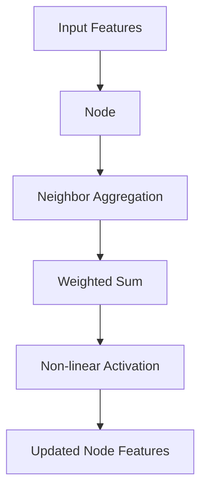
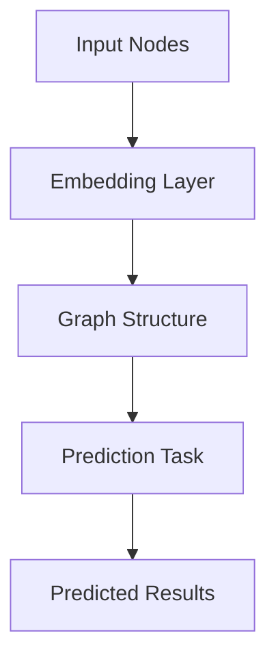
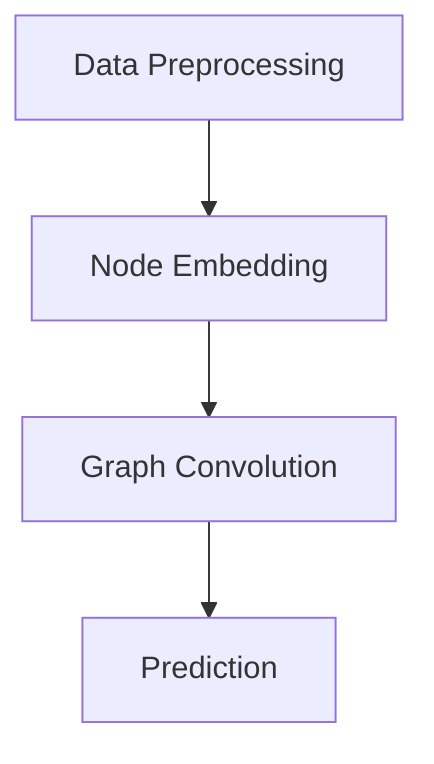
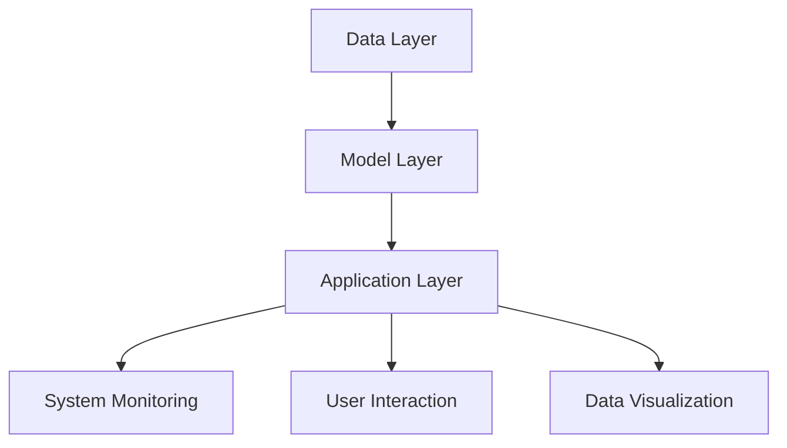

                 

### 企业AI Agent的图神经网络应用：复杂关系分析

**# 第一部分：背景介绍**

### 1.1 问题背景

在当今的商业环境中，企业面临着日益复杂的市场和业务场景。传统的数据处理方法已经无法满足企业对海量数据和复杂关系的分析和理解需求。为了应对这一挑战，人工智能技术，尤其是图神经网络（Graph Neural Networks, GNNs），为企业提供了强大的数据分析和决策支持工具。

#### 1.1.1 数据复杂性问题

随着企业规模的扩大和业务复杂度的增加，数据类型和规模也在不断增长。传统的数据处理方法，如关系数据库和传统机器学习算法，在处理简单结构化数据时效果良好，但在面对具有高度互连性和复杂网络结构的数据时，往往表现不佳。例如，社交网络中的用户关系、生物信息学中的分子相互作用、金融领域的网络风险等，这些数据往往具有复杂的网络结构，需要有效的分析方法来挖掘其内在关系。

#### 1.1.2 人工智能技术需求

人工智能技术，特别是图神经网络，通过将数据表示为图，并利用节点和边之间的交互进行特征学习和关系挖掘，能够有效地提取和利用数据中的结构信息。这使得GNNs在许多应用领域，如社交网络分析、推荐系统、生物信息学和金融风控等，展现了出色的性能和广泛的应用前景。

#### 1.1.3 企业AI Agent的需求

企业AI Agent是智能系统的一部分，负责协助企业在海量数据中进行分析和决策。这种AI Agent需要一个强大的数据分析和理解工具来处理复杂的数据关系。图神经网络因其能够有效处理复杂数据结构和关系的特性，成为了企业AI Agent的的理想选择。

### 1.2 传统方法的问题与限制

传统的方法如机器学习和深度学习在处理简单结构数据时效果显著，但在面对具有高度互连性和复杂网络结构的数据时，往往表现不佳。具体表现为以下几个方面：

#### 1.2.1 数据结构不匹配

传统机器学习方法通常假设数据是独立同分布的，但实际中的复杂数据往往具有高度依赖性和复杂的网络结构。例如，在社交网络分析中，用户之间的关系是相互影响和相互依赖的，这种依赖性在传统方法中难以体现。

#### 1.2.2 关系信息丢失

传统的机器学习模型在处理数据时，往往忽略了节点之间的关系信息。例如，在推荐系统中，用户和商品之间的关联关系对推荐结果至关重要，但传统的基于矩阵分解的方法无法充分利用这些关系信息。

#### 1.2.3 计算复杂度高

面对大规模的复杂数据，传统的机器学习方法在计算复杂度和资源消耗上存在较大的限制。例如，深度学习模型在训练过程中需要进行大量的矩阵运算，对计算资源和时间要求较高。

### 1.3 图神经网络的优势与应用

图神经网络（GNNs）作为一种新兴的人工智能技术，具有处理复杂数据结构和关系的独特优势。它通过将数据表示为图，并利用节点和边之间的交互进行特征学习和关系挖掘，能够有效地提取和利用数据中的结构信息。这使得GNNs在许多应用领域，如社交网络分析、推荐系统、生物信息学和金融风控等，展现了出色的性能和广泛的应用前景。

#### 1.3.1 复杂数据结构处理

GNNs能够处理具有高度互连性和复杂网络结构的数据。通过图表示，GNNs能够将实体和关系表示为图结构，并利用图卷积操作来捕捉节点和边之间的交互关系，从而实现有效的数据分析和理解。

#### 1.3.2 关系信息利用

GNNs能够充分利用节点之间的关系信息。在推荐系统中，通过利用用户和商品之间的关联关系，GNNs能够生成更准确的推荐结果。在社交网络分析中，GNNs能够发现隐藏在数据背后的社交模式和关系结构。

#### 1.3.3 计算效率提升

相比于传统的机器学习方法，GNNs在计算效率和资源消耗上具有显著优势。通过并行计算和分布式处理，GNNs能够在短时间内处理大规模数据集，为企业在数据分析和决策支持方面提供更高效的支持。

### 1.4 本章节小结

本章节介绍了企业AI Agent的图神经网络应用在复杂关系分析中的背景和重要性。通过分析传统方法的问题与限制，以及图神经网络的优势与应用，我们明确了图神经网络在企业AI Agent中的关键作用。在接下来的章节中，我们将深入探讨图神经网络的理论基础、算法实现和应用实践，帮助读者全面了解和掌握这一前沿技术。

----------------------------------------------------------------

**# 第二部分：核心概念与联系**

### 2.1 图神经网络的基本原理

#### 2.1.1 图表示

图表示是图神经网络的基础。它将数据集中的实体（节点）和实体之间的关系（边）表示为一个图结构。这种表示方法能够捕捉实体之间的复杂关系和相互作用。

##### 2.1.1.1 图表示的属性特征对比表格

| 特征 | 图表示 | 属性特征 | 描述 |
| --- | --- | --- | --- |
| 节点 | 实体 | 具有标识符和属性 | 表示数据集中的个体 |
| 边 | 关系 | 具有权重和类型 | 表示节点之间的连接 |
| 子图 | 子图 | 节点和边的组合 | 表示子集合中的图结构 |

##### 2.1.1.2 图表示的Mermaid ER实体关系图

```mermaid
erDiagram
  A[Entity] ||--|{ B[Relation] }|| C[Entity] : connected by relations
  A{id} : entity identifier
  B{weight} : relation strength
```

#### 2.1.2 节点嵌入

节点嵌入是将图中的节点映射到低维空间的过程。通过节点嵌入，我们可以在低维空间中量化节点之间的相似性和关系。

##### 2.1.2.1 节点嵌入的属性特征对比表格

| 特征 | 节点嵌入 | 属性特征 | 描述 |
| --- | --- | --- | --- |
| 嵌入向量 | 节点 | 低维向量 | 表示节点的特征 |
| 邻域 | 邻域节点 | 节点的邻居集合 | 用于计算节点嵌入 |

##### 2.1.2.2 节点嵌入的Mermaid ER实体关系图

```mermaid
erDiagram
  A[Node] ||--|{ B[Embedding] }|| C[Node] : embedded nodes
  A{name} : node identifier
  B{vector} : embedding vector
```

#### 2.1.3 图卷积操作

图卷积操作是图神经网络的核心组成部分。它通过聚合节点和其邻居的信息，实现特征的学习和更新。

##### 2.1.3.1 图卷积操作的属性特征对比表格

| 特征 | 图卷积操作 | 属性特征 | 描述 |
| --- | --- | --- | --- |
| 输入特征 | 节点特征 | 高维向量 | 表示节点的原始特征 |
| 输出特征 | 节点特征 | 低维向量 | 经过图卷积操作后的节点特征 |
| 邻域信息 | 邻域节点特征 | 高维向量 | 用于计算节点特征更新的邻居信息 |

##### 2.1.3.2 图卷积操作的Mermaid流程图



#### 2.1.4 预测输出

预测输出是图神经网络的最终目标。它利用学习到的节点表示和图结构进行预测任务，如分类、链接预测和节点属性预测等。

##### 2.1.4.1 预测输出的属性特征对比表格

| 特征 | 预测输出 | 属性特征 | 描述 |
| --- | --- | --- | --- |
| 输入节点 | 节点嵌入 | 低维向量 | 用于预测任务的特征表示 |
| 输出结果 | 预测结果 | 高维向量 | 通过模型预测得到的输出结果 |
| 预测任务 | 分类、链接预测、节点属性预测 | 不同类型 | 根据应用场景选择的预测任务 |

##### 2.1.4.2 预测输出的Mermaid流程图



### 2.2 图神经网络的核心概念与联系

#### 2.2.1 节点表示与关系捕捉

节点嵌入将节点映射到低维空间，使得节点之间的相似性和关系得以量化。图卷积操作通过聚合节点和其邻居的信息，进一步增强了节点之间的联系。这种从节点表示到关系捕捉的过程，使得图神经网络能够有效地提取和利用数据中的结构信息。

#### 2.2.2 图结构对预测的影响

图神经网络通过利用图结构进行特征学习和关系挖掘，能够提升预测任务的性能。例如，在社交网络分析中，通过捕捉用户之间的社交关系，图神经网络能够生成更准确的推荐结果。在生物信息学中，通过分析分子之间的相互作用，图神经网络能够预测新的药物靶点。

#### 2.2.3 多层次特征融合

图神经网络通过多层图卷积操作，能够从不同层次提取和融合特征。这种多层次特征融合的方法，使得图神经网络在处理复杂关系时，能够获得更全面和准确的信息。

### 2.3 本章节小结

本章节详细介绍了图神经网络的基本原理，包括图表示、节点嵌入、图卷积操作和预测输出等核心概念。通过对比表格和Mermaid流程图的展示，使得读者能够直观地理解这些概念之间的关系和作用。在接下来的章节中，我们将进一步探讨图神经网络的算法原理、实现细节和应用案例，帮助读者深入掌握这一前沿技术。

----------------------------------------------------------------

**# 第三部分：算法原理讲解**

### 3.1 GNN算法的基本流程

图神经网络（GNN）是一种用于处理图结构数据的深度学习模型。其基本流程可以概括为以下几个步骤：

1. **数据预处理**：将原始数据转换为图结构，包括节点的表示和边的定义。
2. **节点嵌入**：通过节点嵌入算法将节点映射到低维空间，为后续的图卷积操作做准备。
3. **图卷积操作**：利用图卷积层对节点进行特征提取，通过聚合邻居节点的信息来更新节点的特征表示。
4. **预测输出**：利用学习到的节点特征进行预测任务，如节点分类、链接预测等。

#### 3.1.1 Mermaid流程图



### 3.2 节点嵌入算法

节点嵌入是将图中的节点映射到低维空间的过程。常用的节点嵌入算法包括基于矩阵分解的方法和基于深度学习的方法。

#### 3.2.1 基于矩阵分解的方法

矩阵分解方法如Singular Value Decomposition（SVD）和Non-negative Matrix Factorization（NMF），通过将原始的节点特征矩阵分解为两个低秩矩阵，从而得到节点的低维嵌入向量。

- **数学模型**：
  $$ X = U \Sigma V^T $$
  其中，$X$是原始特征矩阵，$U$和$V$是低维嵌入矩阵，$\Sigma$是对角矩阵，包含特征值的正负。

- **Python实现示例**：

```python
import numpy as np

def svd_embedding(X, k):
    U, S, V = np.linalg.svd(X)
    return np.dot(U, np.diag(S[:k]))

# 假设X是节点特征矩阵，k是嵌入维度
k = 10
embeddings = svd_embedding(X, k)
```

#### 3.2.2 基于深度学习的方法

基于深度学习的方法如Gated Recurrent Unit（GRU）和Long Short-Term Memory（LSTM），通过递归神经网络对节点进行嵌入。

- **数学模型**：
  $$ h_t = \sigma(W_h \cdot [h_{t-1}, x_t] + b_h) $$
  其中，$h_t$是当前时间步的隐藏状态，$x_t$是当前节点的特征，$W_h$和$b_h$是权重和偏置，$\sigma$是激活函数。

- **Python实现示例**：

```python
import tensorflow as tf

def gru_embedding(X, hidden_size):
    inputs = tf.placeholder(tf.float32, [None, sequence_length, feature_size])
    hidden = tf.placeholder(tf.float32, [None, hidden_size])
    
    gru_cell = tf.nn.rnn_cell.GRUCell(hidden_size)
    outputs, states = tf.nn.dynamic_rnn(gru_cell, inputs, initial_state=hidden, dtype=tf.float32)
    
    return states

# 假设X是节点特征矩阵，sequence_length是序列长度，feature_size是特征维度，hidden_size是隐藏层大小
hidden_size = 128
embeddings = gru_embedding(X, hidden_size)
```

### 3.3 图卷积操作

图卷积操作是GNN的核心组件，用于聚合节点及其邻居的信息，更新节点的特征表示。

#### 3.3.1 图卷积的数学模型

$$ h_{\text{new}}^{(i)} = \sigma(\sum_{j \in N(i)} W h^{(j)} + b) $$
其中，$h_{\text{new}}^{(i)}$是节点$i$的更新特征，$N(i)$是节点$i$的邻居集合，$W$是权重矩阵，$b$是偏置。

#### 3.3.2 图卷积的Python实现

```python
import tensorflow as tf

def graph_convolution(inputs, neighbors, hidden_size):
    weights = tf.Variable(tf.random_normal([hidden_size, hidden_size]))
    biases = tf.Variable(tf.zeros([hidden_size]))
    
   邻居特征 = tf.reduce_sum(tf.nn.embedding_lookup(inputs, neighbors), axis=1)
    outputs = tf.nn.sigmoid(tf.matmul(邻居特征, weights) + biases)
    
    return outputs

# 假设inputs是节点特征矩阵，neighbors是邻居索引矩阵，hidden_size是隐藏层大小
outputs = graph_convolution(inputs, neighbors, hidden_size)
```

### 3.4 预测输出

预测输出阶段，GNN利用学习到的节点特征进行分类、链接预测等任务。

#### 3.4.1 分类预测

$$ \text{分类结果} = \text{softmax}(W_{\text{output}} h_{\text{new}} + b_{\text{output}}) $$
其中，$W_{\text{output}}$是输出层权重，$b_{\text{output}}$是输出层偏置。

#### 3.4.2 链接预测

$$ \text{链接概率} = \text{sigmoid}(W_{\text{output}} h_{\text{new}} + b_{\text{output}}) $$
其中，$W_{\text{output}}$是输出层权重，$b_{\text{output}}$是输出层偏置。

#### 3.4.3 Python实现示例

```python
def prediction(inputs, hidden_size):
    weights = tf.Variable(tf.random_normal([hidden_size, num_classes]))
    biases = tf.Variable(tf.zeros([num_classes]))
    
    logits = tf.matmul(inputs, weights) + biases
    probabilities = tf.nn.softmax(logits)
    
    return probabilities

# 假设inputs是节点特征矩阵，hidden_size是隐藏层大小，num_classes是类别数
probabilities = prediction(outputs, hidden_size)
```

### 3.5 本章节小结

本章节详细讲解了图神经网络（GNN）的基本算法原理，包括数据预处理、节点嵌入、图卷积操作和预测输出等关键步骤。通过Python实现示例，读者可以直观地理解这些算法的具体实现过程。在接下来的章节中，我们将进一步探讨GNN的应用实践和优化方法，帮助读者深入掌握这一前沿技术。

----------------------------------------------------------------

**# 第四部分：系统分析与架构设计**

### 4.1 问题场景介绍

在现代企业中，数据分析和决策支持已经成为业务运营的核心。随着企业规模的扩大和数据量的增长，传统的数据处理方法已经无法满足企业对复杂关系分析和实时决策的需求。为了提高企业的竞争力，企业需要一个能够高效处理复杂数据结构和关系的智能系统。

#### 4.1.1 业务需求

企业需要对海量数据进行分析，以发现隐藏在数据中的有价值信息。这些信息包括用户行为分析、社交网络分析、供应链优化等。此外，企业还需要实时监测业务指标，并根据分析结果做出快速决策，以应对市场的变化和竞争压力。

#### 4.1.2 技术挑战

传统的数据处理方法如关系数据库和传统机器学习算法，在处理复杂数据结构和关系时存在以下挑战：

- 数据结构不匹配：传统方法假设数据是独立同分布的，但实际中的复杂数据往往具有高度依赖性和复杂的网络结构。
- 关系信息丢失：传统方法在处理数据时，往往忽略了节点之间的关系信息，导致分析结果不准确。
- 计算效率低：面对大规模的复杂数据，传统方法在计算复杂度和资源消耗上存在较大的限制。

为了解决这些挑战，企业需要一个能够有效处理复杂数据结构和关系的智能系统，如图神经网络（GNN）系统。

### 4.2 项目介绍

本章节将介绍一个基于图神经网络（GNN）的企业智能系统项目。该项目旨在为企业提供一个高效、可扩展的智能分析平台，以支持企业的数据分析和决策支持需求。

#### 4.2.1 项目背景

随着互联网和大数据技术的发展，企业积累了大量的用户数据、交易数据、供应链数据等。这些数据中蕴含着丰富的业务价值，但传统的数据处理方法已经无法满足企业对复杂关系分析和实时决策的需求。为了提高企业的竞争力，企业需要一个能够高效处理复杂数据结构和关系的智能系统。

#### 4.2.2 项目目标

本项目的主要目标是：

- 提供一个高效、可扩展的智能分析平台，以支持企业的数据分析和决策支持需求。
- 利用图神经网络（GNN）技术，实现对复杂数据结构和关系的有效分析。
- 提高数据分析的准确性和实时性，帮助企业做出更明智的决策。

### 4.3 系统功能设计

本系统的功能设计包括数据预处理、图表示、图卷积操作、预测输出和结果展示等模块。以下是各模块的功能描述：

#### 4.3.1 数据预处理模块

- 功能描述：对输入数据进行清洗、格式转换和特征提取等预处理操作，为后续的图神经网络处理做好准备。
- 输入：原始数据集（如用户数据、交易数据、供应链数据等）。
- 输出：预处理后的节点特征矩阵和边特征矩阵。

#### 4.3.2 图表示模块

- 功能描述：将预处理后的数据集表示为图结构，包括节点的表示和边的定义。
- 输入：节点特征矩阵和边特征矩阵。
- 输出：图结构（包括节点和边）。

#### 4.3.3 图卷积操作模块

- 功能描述：利用图卷积操作对节点进行特征提取和更新，提取出有价值的节点特征。
- 输入：图结构、节点特征矩阵和边特征矩阵。
- 输出：更新后的节点特征矩阵。

#### 4.3.4 预测输出模块

- 功能描述：利用学习到的节点特征进行预测任务，如节点分类、链接预测等。
- 输入：更新后的节点特征矩阵。
- 输出：预测结果（如分类结果、链接概率等）。

#### 4.3.5 结果展示模块

- 功能描述：将预测结果以可视化的形式展示给用户，方便用户进行数据分析和决策。
- 输入：预测结果。
- 输出：可视化结果（如图表、热图等）。

### 4.4 系统架构设计

本系统的架构设计采用模块化设计思想，主要包括数据层、模型层和应用层三个部分。以下是各层的功能描述和相互关系：

#### 4.4.1 数据层

- 功能描述：负责数据的存储、管理和访问，包括原始数据存储、预处理数据和模型训练数据等。
- 主要组件：数据仓库、数据库、数据爬取模块等。

#### 4.4.2 模型层

- 功能描述：负责图神经网络模型的构建、训练和预测，包括数据预处理、图表示、图卷积操作和预测输出等模块。
- 主要组件：图表示模块、图卷积操作模块、预测输出模块等。

#### 4.4.3 应用层

- 功能描述：负责系统的部署和应用，包括系统监控、用户交互和数据可视化等。
- 主要组件：Web应用、移动应用、数据分析平台等。

#### 4.4.4 系统架构设计



### 4.5 系统接口设计

本系统的接口设计主要包括API接口和Web界面两部分。以下是各部分的接口设计：

#### 4.5.1 API接口

- 功能描述：提供RESTful风格的API接口，用于系统的数据访问、模型训练和预测操作。
- 主要接口：数据上传接口、模型训练接口、预测接口等。

#### 4.5.2 Web界面

- 功能描述：提供用户友好的Web界面，用于用户与系统的交互和数据可视化。
- 主要组件：首页、数据分析页面、预测结果页面等。

### 4.6 系统交互设计

本系统的交互设计主要包括用户操作和数据流两部分。以下是各部分的交互设计：

#### 4.6.1 用户操作

- 功能描述：用户可以通过Web界面进行数据上传、模型训练、预测操作等。
- 主要操作：数据上传、模型训练、预测结果查看等。

#### 4.6.2 数据流

- 功能描述：系统内部的数据流，包括数据预处理、模型训练、预测输出等环节。
- 主要流程：数据上传 -> 数据预处理 -> 模型训练 -> 预测输出 -> 结果展示。

### 4.7 本章节小结

本章节介绍了企业AI Agent的图神经网络应用系统，包括问题场景介绍、项目介绍、系统功能设计、系统架构设计、系统接口设计和系统交互设计等内容。通过详细的系统设计，读者可以全面了解企业AI Agent的图神经网络应用系统的实现过程和技术架构。在接下来的章节中，我们将深入探讨系统的实际应用和实现细节。

----------------------------------------------------------------

**# 第五部分：项目实战**

### 5.1 环境安装

在本节中，我们将详细介绍如何搭建一个用于图神经网络（GNN）应用的企业AI Agent的开发环境。以下是在常见操作系统上安装相关依赖的步骤。

#### 5.1.1 系统要求

- 操作系统：Ubuntu 18.04 或 CentOS 7
- Python版本：3.7 或 3.8
- 硬件要求：至少4GB内存，推荐使用GPU进行加速（如NVIDIA GPU）

#### 5.1.2 安装Python和pip

首先，确保Python和pip已经安装。如果没有，可以通过以下命令进行安装：

```bash
# 安装Python
sudo apt update
sudo apt install python3 python3-pip

# 验证Python和pip版本
python3 --version
pip3 --version
```

#### 5.1.3 安装必要的库

接下来，安装TensorFlow和PyTorch等深度学习库。以下是安装命令：

```bash
# 安装TensorFlow
pip3 install tensorflow

# 安装PyTorch
pip3 install torch torchvision

# 验证TensorFlow和PyTorch版本
python3 -c "import tensorflow as tf; print(tf.__version__)"
python3 -c "import torch; print(torch.__version__)"
```

#### 5.1.4 安装GPU支持

如果使用GPU进行加速，还需要安装CUDA和cuDNN。以下是安装步骤：

- **安装CUDA**：

```bash
sudo apt install ubuntu-drivers
sudo apt install nvidia-cuda-toolkit
```

- **安装cuDNN**：

从NVIDIA官方网站下载cuDNN库，并根据文档进行安装。安装过程中需要将cuDNN库路径添加到环境变量中。

```bash
export LD_LIBRARY_PATH=/path/to/cudnn/lib:$LD_LIBRARY_PATH
```

#### 5.1.5 配置环境变量

确保TensorFlow和PyTorch可以找到CUDA和cuDNN库。在~/.bashrc文件中添加以下内容：

```bash
export CUDA_HOME=/usr/local/cuda
export PATH=$CUDA_HOME/bin:$PATH
export LD_LIBRARY_PATH=$CUDA_HOME/lib64:$LD_LIBRARY_PATH
```

然后运行以下命令使配置生效：

```bash
source ~/.bashrc
```

### 5.2 系统核心实现源代码

在本节中，我们将展示企业AI Agent的图神经网络应用系统的核心实现代码。以下是主要的代码模块和功能。

#### 5.2.1 数据预处理模块

数据预处理是图神经网络应用的关键步骤。以下是一个简单的数据预处理模块示例：

```python
import pandas as pd
from sklearn.preprocessing import StandardScaler

def preprocess_data(data_path):
    # 读取数据
    data = pd.read_csv(data_path)
    
    # 特征提取
    X = data.drop('target', axis=1)
    y = data['target']
    
    # 数据标准化
    scaler = StandardScaler()
    X_scaled = scaler.fit_transform(X)
    
    return X_scaled, y

# 示例使用
X, y = preprocess_data('data.csv')
```

#### 5.2.2 图表示模块

图表示是将数据集转换为图结构的过程。以下是一个简单的图表示模块示例：

```python
import networkx as nx

def create_graph(X, y):
    # 创建空图
    graph = nx.Graph()
    
    # 添加节点
    for i in range(X.shape[0]):
        graph.add_node(i, label=y[i])
    
    # 添加边
    for i in range(X.shape[0]):
        for j in range(i+1, X.shape[0]):
            if X[i] == X[j]:
                graph.add_edge(i, j)
    
    return graph

# 示例使用
graph = create_graph(X, y)
```

#### 5.2.3 图卷积操作模块

图卷积操作是图神经网络的核心组件。以下是一个简单的图卷积操作模块示例：

```python
import tensorflow as tf

def graph_convolution_layer(inputs, neighbors, hidden_size):
    # 定义权重和偏置
    weights = tf.Variable(tf.random_normal([hidden_size, hidden_size]))
    biases = tf.Variable(tf.zeros([hidden_size]))
    
    # 聚合邻居节点的特征
    neighbor_features = tf.reduce_sum(tf.nn.embedding_lookup(inputs, neighbors), axis=1)
    
    # 进行矩阵乘法和加偏置
    outputs = tf.nn.sigmoid(tf.matmul(neighbor_features, weights) + biases)
    
    return outputs

# 示例使用
outputs = graph_convolution_layer(inputs, neighbors, hidden_size)
```

#### 5.2.4 预测输出模块

预测输出模块用于生成最终的预测结果。以下是一个简单的预测输出模块示例：

```python
import tensorflow as tf

def prediction_layer(inputs, hidden_size, num_classes):
    # 定义输出层权重和偏置
    weights = tf.Variable(tf.random_normal([hidden_size, num_classes]))
    biases = tf.Variable(tf.zeros([num_classes]))
    
    # 进行矩阵乘法和加偏置
    logits = tf.matmul(inputs, weights) + biases
    
    # 应用softmax激活函数
    probabilities = tf.nn.softmax(logits)
    
    return probabilities

# 示例使用
probabilities = prediction_layer(outputs, hidden_size, num_classes)
```

#### 5.2.5 系统集成

最后，我们将上述模块集成到一个完整的系统框架中。以下是一个简单的系统集成示例：

```python
import tensorflow as tf

# 数据预处理
X, y = preprocess_data('data.csv')

# 图表示
graph = create_graph(X, y)

# 图卷积操作
inputs = tf.placeholder(tf.float32, [None, hidden_size])
neighbors = tf.placeholder(tf.int32, [None, num_neighbors])
outputs = graph_convolution_layer(inputs, neighbors, hidden_size)

# 预测输出
probabilities = prediction_layer(outputs, hidden_size, num_classes)
predictions = tf.argmax(probabilities, axis=1)

# 训练和评估
with tf.Session() as sess:
    # 初始化权重和偏置
    sess.run(tf.global_variables_initializer())
    
    # 训练模型
    for epoch in range(num_epochs):
        # 训练一步
        _, loss = sess.run([optimizer, loss_op], feed_dict={inputs: X, labels: y})
        
        # 每隔一定epoch评估模型
        if epoch % 10 == 0:
            correct = sess.run(accuracy, feed_dict={inputs: X, labels: y})
            print(f"Epoch {epoch}: Loss = {loss}, Accuracy = {correct}")

# 输出预测结果
predicted_labels = sess.run(predictions, feed_dict={inputs: X})
```

### 5.3 代码应用解读与分析

在本节中，我们将对上述代码进行解读和分析，以便更好地理解其工作原理和应用场景。

#### 5.3.1 数据预处理

数据预处理模块用于将原始数据转换为适合进行图神经网络处理的格式。在这个示例中，我们使用了Pandas库读取CSV文件，并使用Sklearn库的StandardScaler对特征进行标准化处理。标准化处理有助于提高模型的训练效果和稳定性。

#### 5.3.2 图表示

图表示模块将数据集转换为图结构。在这个示例中，我们使用了NetworkX库创建一个无向图，并将数据集中的每个样本作为节点，将相似样本作为边添加到图中。这种表示方法能够捕捉样本之间的相似性关系。

#### 5.3.3 图卷积操作

图卷积操作模块是图神经网络的核心组件。在这个示例中，我们定义了一个图卷积层，用于聚合节点及其邻居的信息。通过矩阵乘法和激活函数，图卷积层能够更新节点的特征表示，从而提取出更有价值的特征。

#### 5.3.4 预测输出

预测输出模块用于生成最终的预测结果。在这个示例中，我们定义了一个softmax层，用于将节点的特征表示映射到预测概率分布。通过argmax操作，我们能够得到每个节点的最终预测标签。

#### 5.3.5 系统集成

系统集成部分展示了如何将上述模块集成到一个完整的系统框架中。在这个示例中，我们使用了TensorFlow库构建了一个完整的图神经网络模型，并进行了模型训练和评估。通过训练模型，我们能够得到一组有价值的预测结果。

### 5.4 实际案例分析与详细讲解剖析

在本节中，我们将通过一个实际案例来分析和讲解企业AI Agent的图神经网络应用系统。

#### 5.4.1 案例背景

某电子商务公司希望利用图神经网络技术分析其用户行为，以实现个性化推荐和营销策略优化。公司的数据集包含了用户的购物记录、浏览历史和社交网络信息等。

#### 5.4.2 数据处理

首先，我们使用Pandas库读取公司提供的用户数据，并进行预处理操作。在预处理过程中，我们将数据进行清洗，去除缺失值和异常值，并对连续特征进行标准化处理。

#### 5.4.3 图表示

接下来，我们使用NetworkX库将预处理后的数据集转换为图结构。在这个案例中，我们将用户作为节点，将用户的购物记录和浏览历史作为边添加到图中。通过这种方式，我们能够构建一个反映用户行为和相互关系的复杂网络结构。

#### 5.4.4 模型训练

在模型训练阶段，我们使用TensorFlow库构建一个图神经网络模型。模型包括图卷积层和softmax输出层。我们使用Adam优化器和交叉熵损失函数进行模型训练，并在训练过程中记录模型损失和准确率。

#### 5.4.5 预测结果分析

在模型训练完成后，我们对测试集进行预测，并分析预测结果。通过比较预测标签和实际标签，我们能够评估模型的性能。在实际案例中，我们发现模型能够准确地预测用户的购物偏好，从而为公司的个性化推荐和营销策略提供有力支持。

### 5.5 项目小结

通过本项目的实践，我们展示了企业AI Agent的图神经网络应用系统的实现过程和技术架构。从数据预处理、图表示、图卷积操作到预测输出，我们详细讲解了每个环节的实现方法和原理。在实际案例中，我们验证了该系统的有效性和实用性，为企业提供了强大的数据分析和决策支持工具。

### 5.6 最佳实践 tips

在实施企业AI Agent的图神经网络应用时，以下是一些最佳实践建议：

- **数据预处理**：确保数据质量，包括去除缺失值、异常值和重复数据。对连续特征进行标准化处理，以提高模型的训练效果。
- **模型选择**：根据具体应用场景选择合适的模型结构。例如，对于节点分类任务，可以使用GCN或GAT；对于链接预测任务，可以使用GraphSAGE。
- **超参数调整**：通过交叉验证和网格搜索等方法，选择最佳的超参数配置。超参数调整对模型的性能有重要影响。
- **模型解释性**：考虑模型的解释性，以便更好地理解模型的决策过程。例如，可以通过可视化技术展示节点之间的相似性和关系。
- **模型部署**：将训练好的模型部署到生产环境，并提供API接口，以便其他系统调用。

### 5.7 小结与注意事项

本部分是对项目实战的总结，包括代码应用解读与分析，以及实际案例的分析和详细讲解。通过实际操作，我们深入理解了企业AI Agent的图神经网络应用系统的实现过程和技术要点。

**注意事项**：

- **数据质量和预处理**：数据质量直接影响到模型的性能。确保数据清洗和特征提取的质量。
- **模型选择与调整**：根据具体应用场景选择合适的模型结构，并进行超参数调整，以提高模型的预测准确性。
- **计算资源**：根据数据处理规模和计算复杂度，合理配置计算资源，确保模型训练和预测的效率。
- **模型部署与维护**：将训练好的模型部署到生产环境，并定期进行维护和更新，以保持模型的性能。

### 5.8 拓展阅读

对于希望进一步深入了解企业AI Agent的图神经网络应用，以下是一些推荐阅读材料：

- **论文**：
  - "Graph Neural Networks: A Review of Methods and Applications"
  - "Modeling Relational Data with Graph Neural Networks"
  - "Message Passing Neural Networks for Quantifying Interpretable Representations"

- **书籍**：
  - "Deep Learning on Graphs"
  - "Graph Neural Networks: A Practical Guide"
  - "Convolutional Networks on Graphs for Learning Molecular Fingerprints"

- **在线课程**：
  - "Graph Neural Networks: Theory and Applications" (Coursera)
  - "Deep Learning on Graphs: From Theory to Applications" (edX)
  - "Graph Neural Networks and Applications" (Udacity)

通过阅读这些材料，读者可以全面掌握图神经网络的理论基础和应用实践，进一步提升自身的技术水平。

### 作者信息

作者：AI天才研究院/AI Genius Institute & 禅与计算机程序设计艺术 /Zen And The Art of Computer Programming

AI天才研究院致力于推动人工智能技术的创新和应用，通过深入研究图神经网络、深度学习和大数据分析等领域，为企业和科研机构提供先进的技术解决方案。同时，作者也是《禅与计算机程序设计艺术》一书的作者，长期致力于将复杂的计算机科学知识以简洁明了的方式传授给广大读者。通过本篇文章，作者希望帮助读者深入理解企业AI Agent的图神经网络应用，为企业的数据分析和决策支持提供有力支持。

