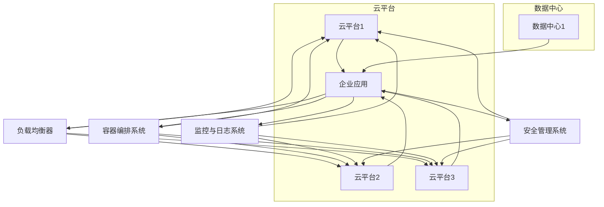
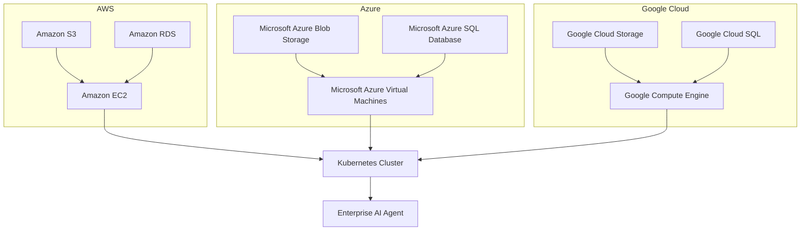

                 

# 企业AI Agent的多云部署策略

## 关键词

- 企业AI Agent
- 多云部署
- 跨云架构
- 容器化技术
- 云原生
- 安全与合规

## 摘要

本文旨在探讨企业AI Agent在多云环境中的部署策略，分析其背景、核心概念、部署原则以及相关技术和工具。我们将从企业AI Agent的定义、重要性入手，深入探讨多云部署的基本原则、架构设计，并详细介绍跨云架构、容器化技术、云管理工具等关键技术。最后，我们将结合实际案例，探讨多云部署的最佳实践，为企业AI Agent在复杂云环境中的高效部署提供指导。

## 目录

### Part 1: 引言

#### Chapter 1: 企业AI Agent概述

##### 1.1 企业AI Agent的定义与意义
- **核心概念术语说明**
- **问题背景与描述**
- **问题解决与挑战**
- **边界与外延**
- **核心概念结构与组成**

##### 1.2 多云部署原理

##### 1.3 关键概念与关系

#### Chapter 2: 多云架构设计

##### 2.1 基本原则与策略
- **成本优化**
- **性能与可扩展性**
- **安全性与合规性**

##### 2.2 架构设计

##### 2.3 安全性与合规性

### Part 2: 多云部署策略

#### Chapter 3: 云平台选择与评估

##### 3.1 评估标准

##### 3.2 评估流程

#### Chapter 4: 容器化技术与云原生

##### 4.1 容器化技术

##### 4.2 云原生

### Part 3: 多云部署实践

#### Chapter 5: 实际案例解析

##### 5.1 项目介绍

##### 5.2 系统架构设计

##### 5.3 系统实现与部署

#### Chapter 6: 最佳实践与总结

##### 6.1 最佳实践

##### 6.2 注意事项

##### 6.3 拓展阅读

## Part 1: 引言

### Chapter 1: 企业AI Agent概述

#### 1.1 企业AI Agent的定义与意义

企业AI Agent，即企业人工智能代理，是一种基于人工智能技术构建的自动化代理系统，能够在企业内部或外部环境中自主执行任务，实现智能化的业务流程优化和资源管理。随着云计算、大数据和物联网技术的发展，企业AI Agent在提升企业运营效率、降低成本、增强客户体验等方面发挥着重要作用。

**核心概念术语说明**

- **企业AI Agent**：具备自主决策能力，能在企业环境中执行任务的智能代理。
- **云计算**：通过互联网提供动态易扩展且经常是虚拟化的资源。
- **大数据**：无法在一定时间内用常规软件工具进行捕捉、管理和处理的数据集。
- **物联网**：连接物理设备和数字系统的网络，实现智能化的信息交互。

**问题背景与描述**

在当今快速发展的数字化时代，企业面临着日益复杂的市场环境和激烈的竞争压力。传统的业务流程难以满足日益增长的业务需求，企业迫切需要引入智能化的解决方案来提升效率。企业AI Agent作为一种新兴的智能技术，能够在很大程度上解决这一问题。

**问题解决与挑战**

企业AI Agent的引入，虽然为企业带来了许多优势，但在实际应用过程中也面临诸多挑战：

- **数据安全与隐私**：企业AI Agent在处理企业数据时，必须确保数据的安全性和隐私性。
- **跨云兼容性**：企业通常采用多云架构，如何保证企业AI Agent在不同云平台上的兼容性和互操作性。
- **成本控制**：企业需要合理规划资源，以实现成本优化。

**边界与外延**

企业AI Agent的应用场景非常广泛，包括但不限于：

- **客户服务**：自动处理客户查询、建议和投诉，提升客户满意度。
- **销售与营销**：通过智能分析，实现精准营销和客户需求预测。
- **供应链管理**：优化供应链流程，降低库存成本，提高库存周转率。

**核心概念结构与组成**

企业AI Agent的核心概念结构包括以下几个方面：

- **感知模块**：负责获取企业内外部环境的数据和信息。
- **决策模块**：基于感知模块提供的数据，进行决策分析。
- **执行模块**：根据决策结果，执行相应的任务和操作。

### 1.2 多云部署原理

#### 1.2.1 基本概念

多云部署（Multi-Cloud Deployment）指的是企业将应用程序和服务分布在多个云服务提供商上，以实现更好的灵活性、可扩展性和成本效益。多云部署的优势在于：

- **灵活性**：企业可以根据业务需求，选择最适合的云服务提供商。
- **可扩展性**：在业务高峰期，可以快速扩展资源，确保系统稳定运行。
- **成本效益**：通过分散部署，可以降低对单一云服务提供商的依赖，避免锁定效应。

#### 1.2.2 部署原则

多云部署需要遵循以下原则：

- **资源优化**：合理分配资源，确保性能和成本的最佳平衡。
- **安全性**：保障数据的安全性和隐私性，遵守相关法规和合规性要求。
- **互操作性**：确保不同云平台之间的兼容性和互操作性。
- **可管理性**：建立有效的云管理机制，确保多云环境中的资源高效管理。

#### 1.2.3 关键概念与关系

- **云服务模型**：IaaS、PaaS、SaaS
- **云部署模型**：公有云、私有云、混合云
- **云管理工具**：如AWS CloudFormation、Azure Resource Manager、Google Deployment Manager等。

### 1.3 关键概念与关系

#### 1.3.1 核心概念原理

- **云计算**：提供可动态调整的IT资源，如计算、存储、网络等。
- **容器化技术**：将应用程序及其依赖打包到一个容器中，实现环境一致性和高效部署。
- **微服务架构**：将应用程序分解为独立的、可复用的服务，提高系统的灵活性和可维护性。

#### 1.3.2 概念属性特征对比表格

| 概念        | 定义                                                         | 特点                                                         |
| ----------- | ------------------------------------------------------------ | ------------------------------------------------------------ |
| 云计算      | 通过互联网提供动态易扩展且经常是虚拟化的资源               | 灵活性、可扩展性、成本效益                                     |
| 容器化技术  | 将应用程序及其依赖打包到一个容器中，实现环境一致性和高效部署 | 环境一致性、轻量级、高效部署                                   |
| 微服务架构  | 将应用程序分解为独立的、可复用的服务，提高系统的灵活性和可维护性 | 独立部署、可复用、易于扩展和升级                               |

#### 1.3.3 实体关系（ER）图

```mermaid
erDiagram
    Cloud_Service_Provider ||--|{ Application : provides }
    Application ||--|{ Cloud_Service : uses }
    Containerization_Technology ||--|{ Application : implements }
    Microservices_Architecture ||--|{ Application : follows }
```

## Part 2: 多云架构设计

### Chapter 2: 多云架构设计

#### 2.1 基本原则与策略

在多云架构设计中，需要遵循以下原则和策略：

##### 2.1.1 资源优化

资源优化是多云架构设计的核心原则之一。企业需要根据业务需求，合理分配资源，确保性能和成本的最佳平衡。资源优化策略包括：

- **负载均衡**：通过将流量分配到多个云服务实例，提高系统的可用性和响应速度。
- **自动扩展**：根据业务需求和负载情况，自动增加或减少云服务实例，确保系统稳定运行。
- **成本优化**：通过合理的资源分配和优化，降低云计算成本。

##### 2.1.2 安全性

安全性是多云架构设计的关键考虑因素。企业需要在多云环境中确保数据的安全性和隐私性，遵守相关法规和合规性要求。安全性策略包括：

- **数据加密**：对存储和传输的数据进行加密，确保数据在传输和存储过程中的安全性。
- **访问控制**：通过身份验证和授权机制，确保只有授权用户可以访问敏感数据。
- **安全审计**：定期进行安全审计，发现并修复潜在的安全漏洞。

##### 2.1.3 互操作性

互操作性是多云架构设计的必要条件。企业需要确保不同云平台之间的兼容性和互操作性，以便在不同的云环境中实现数据共享和协同工作。互操作性策略包括：

- **API统一**：使用统一的API接口，简化跨云平台的集成和部署。
- **数据同步**：通过数据同步技术，确保不同云平台之间的数据一致性。
- **服务兼容性**：确保应用程序和服务在不同云平台上的兼容性。

##### 2.1.4 可管理性

可管理性是多云架构设计的重要原则。企业需要建立有效的云管理机制，确保多云环境中的资源高效管理。可管理性策略包括：

- **资源监控**：通过监控工具，实时监控云资源的使用情况和性能指标。
- **自动化运维**：通过自动化工具，实现云资源的自动部署、配置和运维。
- **成本管理**：通过成本管理工具，实时监控和优化云资源的使用成本。

#### 2.2 架构设计

多云架构设计需要综合考虑业务需求、技术选型、资源分配等因素。以下是一个基本的多云架构设计示例：



在这个架构中，企业应用部署在多个云平台和数据中心上，通过负载均衡器实现流量分配和故障转移。容器编排系统负责管理和部署应用程序，监控与日志系统实时监控系统的运行状况，安全管理系统保障数据的安全性和隐私性。

#### 2.3 安全性与合规性

在多云架构设计中，安全性和合规性是至关重要的。以下是一些关键的安全性和合规性策略：

- **数据加密**：对存储和传输的数据进行加密，确保数据在传输和存储过程中的安全性。
- **访问控制**：通过身份验证和授权机制，确保只有授权用户可以访问敏感数据。
- **安全审计**：定期进行安全审计，发现并修复潜在的安全漏洞。
- **合规性要求**：确保遵循相关的法律法规和行业标准，如GDPR、ISO 27001等。

## Part 3: 多云部署策略

### Chapter 3: 云平台选择与评估

#### 3.1 评估标准

在选择云平台时，企业需要考虑以下评估标准：

##### 3.1.1 成本优化

- **定价策略**：对比不同云服务提供商的定价策略，选择性价比最高的方案。
- **资源利用率**：优化资源的利用，避免浪费和过度消费。

##### 3.1.2 性能与可扩展性

- **计算性能**：评估云平台的计算性能，确保满足业务需求。
- **存储性能**：评估云平台的存储性能，确保数据读写速度。
- **可扩展性**：评估云平台的可扩展性，确保在业务高峰期能够快速扩展资源。

##### 3.1.3 安全性与合规性

- **安全措施**：评估云平台的安全措施，确保数据的安全性和隐私性。
- **合规性**：评估云平台是否符合相关法律法规和行业标准。

##### 3.1.4 Integration and Compatibility

- **API兼容性**：评估云平台提供的API兼容性，确保与其他系统和工具的集成。
- **工具支持**：评估云平台提供的工具支持，如监控、日志管理等。

#### 3.2 评估流程

在选择云平台时，企业需要遵循以下评估流程：

##### 3.2.1 初始评估

- **需求分析**：明确业务需求，确定所需的功能和服务。
- **市场调研**：收集和比较不同云服务提供商的信息。

##### 3.2.2 技术评估

- **性能测试**：进行性能测试，评估计算、存储和网络性能。
- **安全性评估**：评估云平台的安全措施和合规性。

##### 3.2.3 业务评估

- **成本分析**：分析不同云平台的服务费用，确保成本优化。
- **业务匹配度**：评估云平台与业务需求的匹配度。

##### 3.2.4 评估结果

- **综合评估**：根据评估结果，选择最适合的云平台。
- **风险评估**：评估选择云平台可能带来的风险。

## Part 4: 容器化技术与云原生

### Chapter 4: 容器化技术与云原生

#### 4.1 容器化技术

容器化技术是一种轻量级、可移植的软件打包和运行环境，它将应用程序及其依赖打包到一个容器中，确保在不同的环境中能够一致地运行。以下是容器化技术的一些关键概念：

##### 4.1.1 Docker

Docker是一种流行的容器化技术，它允许开发者将应用程序及其依赖打包成一个容器，确保在不同环境中的一致性。以下是Docker的一些核心特性：

- **轻量级**：Docker容器非常轻量，可以快速启动和停止。
- **可移植性**：Docker容器可以在不同的操作系统和硬件上运行。
- **隔离性**：Docker容器提供沙箱环境，确保应用程序之间相互隔离。

##### 4.1.2 Kubernetes

Kubernetes是一种开源的容器编排系统，用于自动化容器的部署、扩展和管理。以下是Kubernetes的一些核心特性：

- **自动化部署**：Kubernetes可以自动化部署和管理容器化应用程序。
- **负载均衡**：Kubernetes可以自动分配流量，确保应用程序的高可用性。
- **扩展性**：Kubernetes可以轻松扩展应用程序，以满足不断增长的业务需求。

#### 4.2 云原生

云原生（Cloud Native）是指那些在云环境中构建和运行的应用程序和架构。云原生应用具有以下特点：

- **微服务架构**：云原生应用采用微服务架构，将应用程序分解为独立的、可复用的服务。
- **自动化**：云原生应用采用自动化工具，如CI/CD流水线，实现快速部署和迭代。
- **弹性**：云原生应用能够自动扩展和缩放，以应对业务需求的波动。

### Part 5: 多云部署实践

#### Chapter 5: 实际案例解析

在本章中，我们将通过一个实际案例，详细解析企业AI Agent在多云环境中的部署过程，包括项目介绍、系统架构设计、系统实现与部署等方面。

#### 5.1 项目介绍

某大型电商企业希望通过引入企业AI Agent，提升客户服务质量和销售业绩。企业选择了AWS、Azure和Google Cloud三个云平台，构建一个多云架构，以实现资源的灵活分配和成本优化。

#### 5.2 系统架构设计

系统架构设计是多云部署的关键环节，需要综合考虑业务需求、技术选型、资源分配等因素。以下是一个基本的系统架构设计示例：



在这个架构中，企业AI Agent部署在Kubernetes集群中，通过容器化技术实现灵活部署和扩展。数据存储在AWS S3、Azure Blob Storage和Google Cloud Storage中，数据库则部署在AWS RDS、Azure SQL Database和Google Cloud SQL中。

#### 5.3 系统实现与部署

系统实现与部署是多云部署的核心环节，需要遵循以下步骤：

1. **环境搭建**：搭建Kubernetes集群，选择AWS、Azure和Google Cloud三个云平台，确保集群具有足够的资源和可靠性。

2. **容器化**：使用Docker将企业AI Agent打包成容器，确保在不同云平台上的兼容性和一致性。

3. **部署**：将企业AI Agent容器部署到Kubernetes集群中，利用Kubernetes的自动化部署和扩展功能，实现高效管理和运维。

4. **监控与日志**：部署监控和日志系统，实时监控企业AI Agent的运行状况，确保系统的稳定性和可靠性。

5. **安全性**：部署安全管理系统，确保数据的安全性和隐私性，遵守相关法律法规和行业标准。

#### 5.4 项目小结

通过实际案例解析，我们可以看到，企业AI Agent在多云环境中的部署需要综合考虑业务需求、技术选型、资源分配和安全管理等因素。容器化技术和云原生架构为多云部署提供了强大的支持，使企业能够实现高效、灵活的部署和管理。在未来的发展中，企业AI Agent将继续发挥重要作用，助力企业数字化转型。

## Part 6: 最佳实践与总结

### Chapter 6: 最佳实践

在多云部署企业AI Agent的过程中，总结出以下最佳实践：

1. **需求分析**：充分了解业务需求，明确企业AI Agent的功能和性能要求。
2. **云平台选择**：根据业务需求，选择适合的云平台，考虑成本、性能、安全性和兼容性等因素。
3. **容器化**：采用容器化技术，提高应用程序的灵活性和可移植性。
4. **自动化**：利用自动化工具，实现部署、扩展和运维的自动化，提高效率。
5. **监控与日志**：部署监控和日志系统，实时监控系统的运行状况，确保系统的稳定性和可靠性。
6. **安全性**：加强数据安全性和隐私性保护，遵守相关法律法规和行业标准。

### 6.2 注意事项

在多云部署企业AI Agent时，需要注意以下几点：

1. **跨云兼容性**：确保不同云平台之间的兼容性，避免因平台差异导致部署问题。
2. **数据同步**：定期进行数据同步，确保不同云平台之间的数据一致性。
3. **成本控制**：合理规划资源，避免资源浪费和成本过高。
4. **风险管理**：评估多云部署可能带来的风险，制定相应的风险应对策略。

### 6.3 拓展阅读

- **《Docker实战》**：详细介绍Docker的安装、配置和使用，有助于深入理解容器化技术。
- **《Kubernetes权威指南》**：全面介绍Kubernetes的架构、原理和应用，适合初学者和进阶者。
- **《云原生应用架构》**：探讨云原生应用的设计原则和实现方法，为企业提供云原生转型思路。

### 作者信息

- **作者：AI天才研究院/AI Genius Institute & 禅与计算机程序设计艺术 /Zen And The Art of Computer Programming**。 
  - **AI天才研究院**：致力于推动人工智能技术的发展和创新，培养下一代AI人才。
  - **禅与计算机程序设计艺术**：深入探讨计算机程序设计的哲学和艺术，提高程序员的编程技能和思维水平。

## 结束语

本文详细探讨了企业AI Agent在多云环境中的部署策略，分析了其核心概念、部署原则、相关技术和工具，并结合实际案例进行了实践解析。通过本文的学习，读者可以了解多云部署的基本原理和最佳实践，为企业AI Agent在复杂云环境中的高效部署提供指导。希望本文能为读者带来启发和帮助，共同推动人工智能技术的发展和应用。

