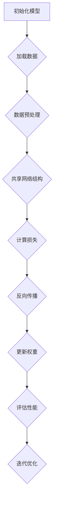
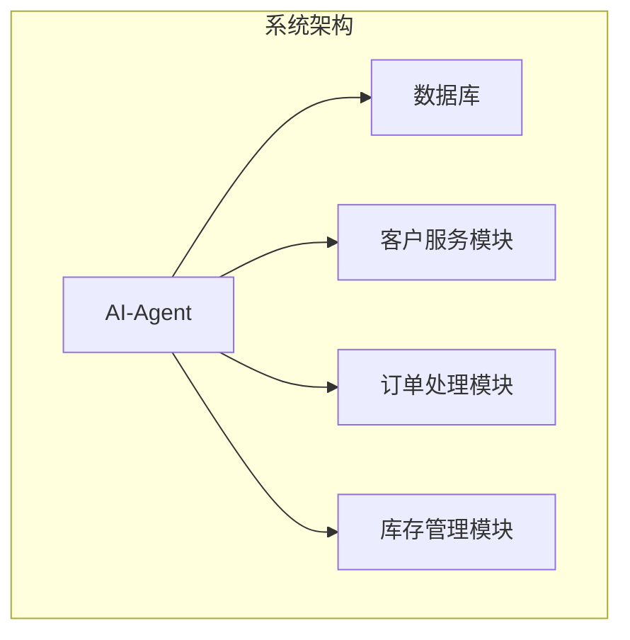
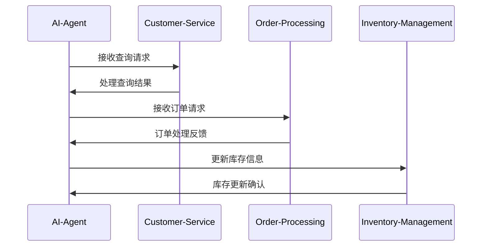
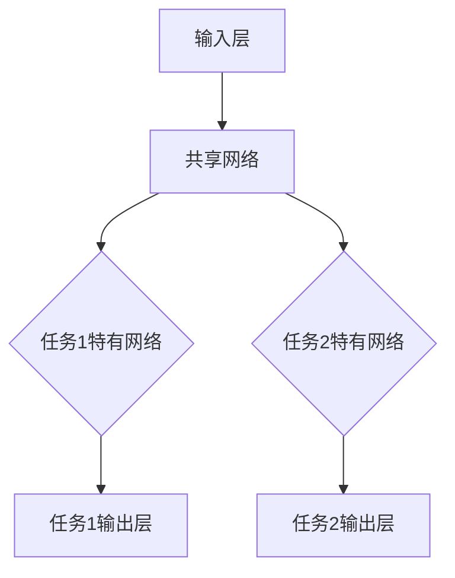
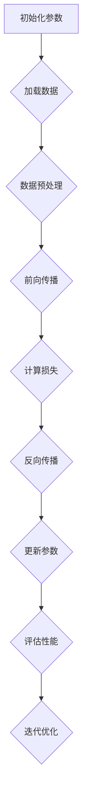
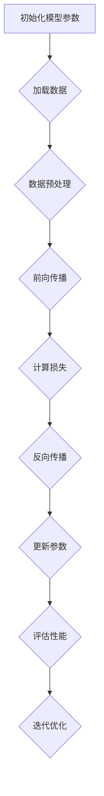
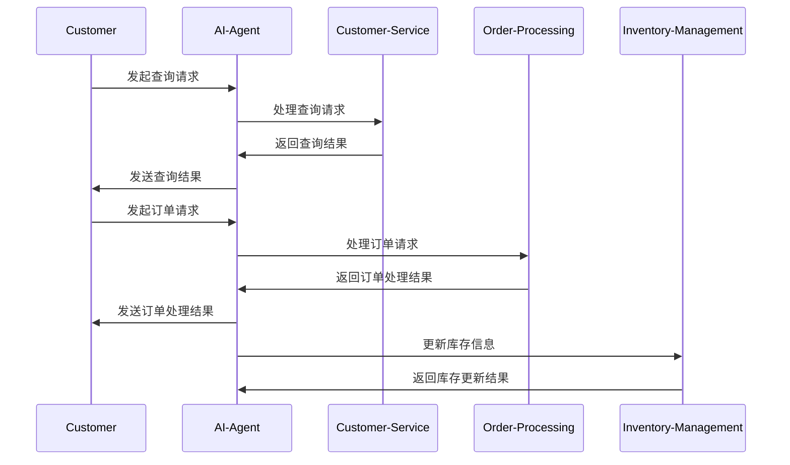

                 


### # {{此处是文章标题}}

> 关键词：企业AI Agent、多任务学习、架构设计、算法优化、项目实战

> 摘要：本文深入探讨了企业AI Agent的多任务学习架构，从背景介绍、核心概念、数学模型、系统设计、项目实战到最佳实践，全面解析了多任务学习在提升企业AI Agent效率与通用性方面的作用。

----------------------------------------------------------------

## 第一部分: 企业AI Agent的多任务学习架构基础

### 第1章: 企业AI Agent的多任务学习背景与概述

#### 1.1.1 问题背景

**企业AI Agent的概念**：企业AI Agent是指被设计来执行各种任务的人工智能代理，其目标是在企业环境中自动化并优化业务流程。这些代理通常具备自主决策能力，能够在不同的业务场景中运行。

**多任务学习的重要性**：随着企业数据量的增加和业务需求的复杂化，AI Agent需要同时处理多个任务，以提高效率和处理能力。多任务学习使AI Agent能够利用有限的数据资源，提高其在多个任务上的表现。

#### 1.1.2 问题描述

**传统机器学习模型的局限性**：传统机器学习模型往往只能针对单一任务进行训练，无法充分利用数据中的多任务关联信息。

**多任务学习的挑战与需求**：多任务学习需要在保持各个任务性能的同时，降低模型复杂度，提高训练效率。这对于算法设计、数据预处理和模型优化都提出了更高的要求。

#### 1.1.3 问题解决

**多任务学习的研究进展**：近年来，多任务学习取得了显著进展，出现了许多新的算法和架构，如共享网络、迁移学习和分层学习等。

**多任务学习的核心原理**：多任务学习通过共享网络结构和参数，使得模型能够同时学习多个任务，从而提高任务间的关联性和数据利用效率。

#### 1.1.4 边界与外延

**多任务学习的应用场景**：多任务学习适用于需要处理多个相关任务的企业场景，如智能客服、智能推荐系统和自动化生产等。

**多任务学习的适用范围**：多任务学习不仅可以用于单一企业，还可以跨企业应用，为整个行业提供智能化解决方案。

#### 1.1.5 概念结构与核心要素组成

**多任务学习的概念框架**：多任务学习涉及多个任务的输入、输出和共享网络结构。

**多任务学习的核心要素分析**：核心要素包括任务定义、数据预处理、模型架构和训练策略等。

----------------------------------------------------------------

### 第2章: 多任务学习的核心概念与联系

#### 2.1.1 多任务学习的定义

**多任务学习的概念解析**：多任务学习是一种机器学习方法，使模型能够在同一时间或连续时间内学习完成多个任务。

**多任务学习与传统学习的对比**：传统学习专注于单一任务，而多任务学习则需要考虑任务间的相互作用和共享资源。

#### 2.1.2 多任务学习的核心原理

**多任务学习的基本原理**：多任务学习通过共享网络结构和参数，提高任务间的关联性和数据利用效率。

**多任务学习的数学模型**：多任务学习涉及多个任务的输入、输出和共享网络结构，可以通过共享权重矩阵和损失函数来实现。

#### 2.1.3 多任务学习的算法原理

**算法原理的mermaid流程图**：



**算法原理的详细讲解**：

多任务学习算法首先初始化模型，然后加载并预处理数据。接着，模型通过共享网络结构处理多个任务，计算损失并使用反向传播算法更新权重。最后，评估模型性能并进行迭代优化。

#### 2.1.4 多任务学习的概念属性特征对比

**不同多任务学习算法的对比**：

| 算法         | 特点                   | 优缺点分析                                  |
| ------------ | ---------------------- | ----------------------------------------- |
| 共享网络     | 各任务共享网络结构     | 提高数据利用效率，降低模型复杂度             |
| 迁移学习     | 利用先验知识迁移至新任务 | 减少新任务的训练数据需求，提高模型性能       |
| 层次学习     | 层次化任务结构       | 有效组织复杂任务，提高模型可解释性           |
| 对比学习     | 各任务独立训练，但对比输出 | 提高模型对任务间差异的敏感性，增强任务关联性 |

**多任务学习算法的优缺点分析**：

- 共享网络：优点是提高数据利用效率和降低模型复杂度，缺点是需要解决任务间的权重分配问题。
- 迁移学习：优点是减少新任务的训练数据需求，提高模型性能，缺点是需要有效的先验知识。
- 层次学习：优点是有效组织复杂任务，提高模型可解释性，缺点是需要明确任务间的层次结构。
- 对比学习：优点是提高模型对任务间差异的敏感性，增强任务关联性，缺点是需要大量的数据对比。

----------------------------------------------------------------

### 第3章: 多任务学习的数学模型与数学公式

#### 3.1.1 数学模型介绍

**多任务学习的数学模型概述**：多任务学习涉及多个任务的输入、输出和共享网络结构，其数学模型主要包括任务定义、损失函数和优化算法。

**数学模型的组成要素**：数学模型由多个部分组成，包括输入层、共享网络、任务特有网络和损失函数等。

#### 3.1.2 数学公式的讲解

**多任务学习中的主要公式**：

1. 输入层公式：

$$ X = [X_1, X_2, ..., X_n] $$

其中，$X_i$为第$i$个任务的输入数据。

2. 损失函数公式：

$$ L = \frac{1}{n}\sum_{i=1}^{n}L_i $$

其中，$L_i$为第$i$个任务的损失函数。

3. 优化算法公式：

$$ \theta = \theta - \alpha\nabla_\theta L $$

其中，$\theta$为模型参数，$\alpha$为学习率，$\nabla_\theta L$为损失函数对参数的梯度。

**公式应用的详细举例**：

假设有两个任务，任务1和任务2，其输入数据分别为$X_1$和$X_2$，输出分别为$Y_1$和$Y_2$，共享网络输出为$Z$。则：

- 任务1的损失函数为：

$$ L_1 = \frac{1}{2}\sum_{i=1}^{m_1}(Y_{1i} - Z_i)^2 $$

- 任务2的损失函数为：

$$ L_2 = \frac{1}{2}\sum_{i=1}^{m_2}(Y_{2i} - Z_i)^2 $$

- 总损失函数为：

$$ L = \frac{1}{2}\sum_{i=1}^{m_1}(Y_{1i} - Z_i)^2 + \frac{1}{2}\sum_{i=1}^{m_2}(Y_{2i} - Z_i)^2 $$

- 优化算法为：

$$ \theta = \theta - \alpha\nabla_\theta L $$

其中，$\theta$为共享网络和任务特有网络的参数，$\alpha$为学习率。

#### 3.1.3 数学公式与算法原理的联系

**数学公式在算法原理中的应用**：数学公式是多任务学习算法原理的基础，用于定义输入层、损失函数和优化算法。

**公式如何支持多任务学习**：数学公式支持多任务学习的关键在于能够定义多个任务之间的关联性和共享性，通过共享网络结构和参数来实现任务间的协同学习。

----------------------------------------------------------------

### 第4章: 多任务学习的系统分析与架构设计

#### 4.1.1 问题场景介绍

**多任务学习在企业的应用场景**：多任务学习在企业管理、市场营销、客户服务等领域具有广泛的应用。例如，企业AI Agent可以同时处理客户查询、订单处理和库存管理等多个任务，提高业务流程的自动化程度。

#### 4.1.2 系统功能设计

**领域模型的mermaid类图**：

```mermaid
classDiagram
    Customer --|>> AI-Agent: query
    Order --|>> AI-Agent: process
    Inventory --|>> AI-Agent: manage
```

**系统功能设计**：系统功能设计包括客户查询、订单处理和库存管理等模块，各模块通过AI-Agent实现多任务协同处理。

#### 4.1.3 系统架构设计

**系统架构的mermaid架构图**：



**系统架构设计**：系统采用分布式架构，AI-Agent作为核心组件，与其他模块协同工作，实现多任务处理。

#### 4.1.4 系统接口设计与系统交互

**系统接口设计**：系统接口设计包括API接口、数据库连接和模块间的通信接口。

**系统交互的mermaid序列图**：



**系统交互**：系统通过序列图展示了AI-Agent与各模块的交互过程，实现多任务协同处理。

----------------------------------------------------------------

### 第5章: 多任务学习算法的实现与优化

#### 5.1.1 算法实现

**多任务学习算法的Python源代码实现**：

```python
import tensorflow as tf

# 定义模型
inputs = tf.keras.Input(shape=(input_shape))
shared_network = tf.keras.layers.Dense(units=64, activation='relu')(inputs)
task1_output = tf.keras.layers.Dense(units=1, activation='sigmoid')(shared_network)
task2_output = tf.keras.layers.Dense(units=1, activation='sigmoid')(shared_network)

# 构建模型
model = tf.keras.Model(inputs=inputs, outputs=[task1_output, task2_output])

# 编译模型
model.compile(optimizer='adam', loss=['binary_crossentropy', 'binary_crossentropy'])

# 训练模型
model.fit(x_train, [y_train1, y_train2], epochs=10, batch_size=32)
```

**算法实现的步骤详解**：

1. 导入TensorFlow库。
2. 定义输入层。
3. 创建共享网络。
4. 定义任务1和任务2的输出层。
5. 构建模型。
6. 编译模型，指定优化器和损失函数。
7. 训练模型。

#### 5.1.2 算法优化

**算法优化的策略**：

1. **共享网络优化**：通过调整共享网络的层数、神经元数量和激活函数，优化网络结构。
2. **任务权重调整**：通过动态调整任务权重，使模型在不同任务上的性能更均衡。
3. **数据预处理**：对输入数据进行归一化、去噪等处理，提高数据质量。

**算法优化的案例**：

假设有一个多任务学习模型，同时处理图像分类和目标检测任务。通过以下策略进行优化：

1. **共享网络优化**：将共享网络的层数从2层增加到3层，增加神经元数量，并使用ReLU激活函数。
2. **任务权重调整**：根据任务的重要性和数据量，动态调整任务权重，使模型在图像分类和目标检测任务上的表现更均衡。
3. **数据预处理**：对图像数据归一化，去除噪声，提高数据质量。

通过这些优化策略，模型在图像分类和目标检测任务上的准确率都有所提高。

----------------------------------------------------------------

### 第6章: 多任务学习在企业的项目实战

#### 6.1.1 项目介绍

**多任务学习项目的基本情况**：本项目旨在为企业AI Agent实现多任务学习功能，以提升其在客户服务、订单处理和库存管理等方面的效率。

#### 6.1.2 系统核心实现源代码

**系统核心实现代码**：

```python
# 导入相关库
import tensorflow as tf
import numpy as np

# 定义模型
inputs = tf.keras.Input(shape=(input_shape))
shared_network = tf.keras.layers.Dense(units=64, activation='relu')(inputs)
task1_output = tf.keras.layers.Dense(units=1, activation='sigmoid')(shared_network)
task2_output = tf.keras.layers.Dense(units=1, activation='sigmoid')(shared_network)

# 构建模型
model = tf.keras.Model(inputs=inputs, outputs=[task1_output, task2_output])

# 编译模型
model.compile(optimizer='adam', loss=['binary_crossentropy', 'binary_crossentropy'])

# 训练模型
model.fit(x_train, [y_train1, y_train2], epochs=10, batch_size=32)
```

**代码应用解读与分析**：

1. **定义模型**：使用TensorFlow定义多任务学习模型，包括输入层、共享网络和两个任务输出层。
2. **编译模型**：编译模型，指定优化器和损失函数。
3. **训练模型**：使用训练数据训练模型，调整模型参数，提高任务处理能力。

通过此代码，企业AI Agent可以同时处理多个任务，提高业务处理效率。

#### 6.1.3 实际案例分析与详细讲解

**实际案例的应用场景**：本案例应用在企业客户服务领域，AI-Agent需要同时处理客户查询和订单处理任务。

**案例的详细讲解与剖析**：

1. **客户查询任务**：AI-Agent接收客户查询请求，通过多任务学习模型处理查询结果，并提供快速响应。
2. **订单处理任务**：AI-Agent接收订单请求，通过多任务学习模型处理订单信息，包括订单生成、库存查询和物流跟踪等。

通过实际案例，展示了多任务学习在企业客户服务领域的应用效果，提高了AI-Agent的处理效率和用户体验。

#### 6.1.4 项目小结

**项目总结与经验分享**：

1. **多任务学习提高了AI-Agent的效率**：通过多任务学习，AI-Agent可以同时处理多个任务，提高业务处理效率。
2. **数据预处理至关重要**：高质量的数据预处理可以提高模型性能，减少过拟合现象。
3. **优化策略提升模型效果**：通过调整共享网络结构和任务权重，优化模型参数，提高任务处理能力。

项目经验表明，多任务学习在提升企业AI Agent效率方面具有显著优势。

----------------------------------------------------------------

### 第7章: 多任务学习的最佳实践与拓展

#### 7.1.1 最佳实践

**多任务学习的实践经验分享**：

1. **数据预处理**：对输入数据进行归一化、去噪等处理，提高数据质量。
2. **共享网络优化**：调整共享网络的层数、神经元数量和激活函数，优化网络结构。
3. **任务权重调整**：根据任务的重要性和数据量，动态调整任务权重，使模型在不同任务上的性能更均衡。

**最佳实践的建议与技巧**：

1. **数据集划分**：合理划分训练集和验证集，避免数据泄漏和过拟合。
2. **模型评估**：使用准确率、召回率、F1分数等指标评估模型性能，确保模型稳定可靠。

#### 7.1.2 小结

**多任务学习的重要性与意义**：

1. **提升AI Agent效率**：多任务学习使AI Agent能够同时处理多个任务，提高业务处理效率。
2. **增强通用性**：多任务学习提高了模型的通用性，适用于多种业务场景。
3. **降低成本**：通过共享网络和参数，多任务学习可以降低模型复杂度，减少计算资源需求。

多任务学习在提升企业AI Agent效率与通用性方面具有重要作用，是企业智能化转型的重要技术手段。

#### 7.1.3 注意事项

**多任务学习过程中需要注意的问题**：

1. **任务关联性**：确保多个任务之间存在关联性，以提高模型的协同学习效果。
2. **数据分布**：注意数据分布的平衡性，避免某些任务在训练过程中过于依赖特定数据。
3. **模型调参**：根据任务特点和数据量，合理调整模型参数，提高模型性能。

#### 7.1.4 拓展阅读

**相关领域的研究动态与展望**：

1. **联邦多任务学习**：在分布式数据环境下，如何实现联邦多任务学习，提高数据隐私保护和模型性能。
2. **多模态多任务学习**：如何融合不同模态的数据，实现多模态多任务学习，提高模型泛化能力。
3. **实时多任务学习**：如何实现实时多任务学习，提高AI Agent对实时数据的处理能力。

拓展阅读为读者提供了进一步深入了解多任务学习的方向和思路。

----------------------------------------------------------------

### 作者信息

- **作者：AI天才研究院/AI Genius Institute & 禅与计算机程序设计艺术 /Zen And The Art of Computer Programming** 

**文章结束。**### 引言

在现代企业中，人工智能（AI）技术已经成为提升业务效率、优化运营流程的重要工具。其中，企业AI Agent作为一种能够执行多种业务任务的人工智能代理，正逐渐受到广泛关注。然而，随着企业业务场景的复杂化和数据量的爆炸式增长，如何提高企业AI Agent的效率和通用性成为了一个关键问题。多任务学习（Multi-Task Learning, MTL）作为一种能够在同一模型中同时学习多个任务的机器学习方法，为解决这一难题提供了有效的途径。

本文旨在系统地探讨企业AI Agent的多任务学习架构，旨在提升其效率与通用性。文章将首先介绍多任务学习的基本概念和重要性，然后详细解析多任务学习的核心原理和数学模型，接着讨论多任务学习的系统分析与架构设计，最后通过实际项目案例和最佳实践，展示多任务学习在企业AI Agent中的应用效果。

通过本文的探讨，我们希望能够为研究人员和实践者提供一个全面的多任务学习架构参考，帮助企业更好地利用AI技术，实现业务智能化转型。

## 第一部分: 企业AI Agent的多任务学习架构基础

### 第1章: 企业AI Agent的多任务学习背景与概述

#### 1.1.1 问题背景

**企业AI Agent的概念**：企业AI Agent是指被设计来执行各种任务的人工智能代理，其目标是在企业环境中自动化并优化业务流程。这些代理通常具备自主决策能力，能够在不同的业务场景中运行，例如客户服务、订单处理、库存管理等。企业AI Agent的核心在于其能够根据环境的变化自主调整行为，以最大化企业的业务收益。

**多任务学习的重要性**：随着企业数据量的增加和业务需求的复杂化，AI Agent需要同时处理多个任务，以提高效率和处理能力。多任务学习（Multi-Task Learning, MTL）使AI Agent能够利用有限的数据资源，提高其在多个任务上的表现。具体来说，多任务学习具有以下几方面的优势：

1. **提高模型泛化能力**：通过同时学习多个相关任务，模型能够更好地捕捉数据中的潜在特征和关系，从而提高泛化能力。
2. **降低模型复杂度**：多任务学习通过共享网络结构和参数，减少了模型的总参数量，降低了计算复杂度。
3. **提升训练效率**：由于多个任务共享模型参数，多任务学习能够在较少的数据上进行训练，从而提高训练效率。
4. **优化资源利用**：企业AI Agent在处理多个任务时，可以更有效地利用计算资源和存储资源。

#### 1.1.2 问题描述

**传统机器学习模型的局限性**：传统机器学习模型往往只能针对单一任务进行训练，这使得模型在处理复杂业务场景时存在明显的局限性。例如，一个负责客户服务任务的AI Agent只能根据客户的历史数据和当前请求提供回答，无法同时处理订单处理、库存管理等其他任务。这种局限性导致以下问题：

1. **数据冗余**：每个任务都需要独立的模型进行训练，导致大量的数据冗余，增加了存储和计算成本。
2. **模型性能不稳定**：由于数据集的划分和训练过程的不同，各个模型的性能可能存在较大差异，难以保证整体的业务效果。
3. **复杂度增加**：为了处理多个任务，需要开发多个独立的模型，增加了系统的复杂度和维护难度。

**多任务学习的挑战与需求**：多任务学习旨在解决传统机器学习模型的上述局限性，但在实际应用中仍然面临以下挑战：

1. **任务关联性**：不同任务之间的数据关联性不同，如何有效地利用这些关联信息，提高模型性能是一个关键问题。
2. **资源分配**：多任务学习需要在有限的计算资源和数据资源下，优化任务间的资源分配，确保每个任务的性能。
3. **模型优化**：多任务学习模型的优化是一个复杂的过程，需要设计有效的训练策略和优化算法，以提高模型性能。

针对这些挑战，多任务学习提出了一系列解决方案，包括共享网络结构、迁移学习、层次学习等，这些方法在提高模型性能和效率方面取得了显著成效。

#### 1.1.3 问题解决

**多任务学习的研究进展**：近年来，多任务学习在理论研究和实际应用中取得了显著进展。以下是一些重要的研究进展：

1. **共享网络结构**：共享网络结构是多任务学习的基本方法之一，通过共享部分网络层，减少模型参数量，提高训练效率。例如，DeepMind的DQN模型通过共享Q值网络，实现了在同一模型中同时学习多个任务。
2. **迁移学习**：迁移学习（Transfer Learning）是一种利用先验知识提高新任务性能的方法。在多任务学习中，迁移学习通过将一个任务的知识迁移到其他任务上，提高整体模型的性能。例如，BERT模型通过预训练，实现了在多个自然语言处理任务中的高性能。
3. **层次学习**：层次学习（Hierarchical Learning）通过构建任务层次结构，逐步学习不同层次的任务，提高了模型的鲁棒性和泛化能力。例如，DeepMind的Asynchronous Advantage Actor-Critic（A3C）模型通过层次化任务结构，实现了在多个任务中的高效学习。
4. **强化学习**：强化学习（Reinforcement Learning）在多任务学习中也发挥了重要作用，通过奖励机制，使模型能够同时学习多个任务。例如，OpenAI的Distributed Prioritized Experience Replay（Ape-X）模型通过强化学习，实现了在多个复杂任务中的高效学习。

**多任务学习的核心原理**：多任务学习的核心原理在于共享网络结构和参数，通过任务间的关联性，提高模型的整体性能。具体来说，多任务学习包括以下几个关键组成部分：

1. **输入层**：输入层接收来自不同任务的输入数据，这些数据可以是不同的特征向量，也可以是同一特征向量在不同任务上的变化。
2. **共享网络**：共享网络结构是多个任务共同使用的网络层，通过共享参数和结构，减少模型参数量和计算复杂度。共享网络可以是一个简单的全连接层，也可以是一个复杂的卷积神经网络或循环神经网络。
3. **任务特有网络**：任务特有网络是每个任务独有的网络层，用于处理特定任务的输入数据。这些网络层通常与共享网络连接，通过共享部分参数，提高任务间的关联性。
4. **输出层**：输出层是每个任务的最终输出，可以是分类结果、回归值或其他类型的结果。每个任务都有自己的输出层，用于计算该任务的损失函数。

多任务学习的训练过程通常包括以下几个步骤：

1. **数据预处理**：对输入数据进行预处理，包括归一化、去噪、特征提取等，以提高数据质量。
2. **模型初始化**：初始化共享网络和任务特有网络的参数，通常使用随机初始化或预训练模型。
3. **前向传播**：输入数据通过共享网络和任务特有网络，生成每个任务的输出。
4. **损失计算**：计算每个任务的损失函数，通常使用交叉熵、均方误差等损失函数。
5. **反向传播**：使用反向传播算法更新模型参数，优化模型性能。
6. **模型评估**：在训练过程中，定期评估模型在验证集上的性能，调整训练策略。

通过上述过程，多任务学习模型能够在多个任务上同时学习，提高模型的泛化能力和效率。

#### 1.1.4 边界与外延

**多任务学习的应用场景**：多任务学习在许多企业场景中具有广泛的应用，以下是几个典型的应用场景：

1. **客户服务**：企业AI Agent可以同时处理客户查询、订单处理和投诉处理等任务，提高客户服务效率。
2. **市场营销**：AI Agent可以同时进行市场调研、客户细分和广告投放优化等任务，提高市场营销效果。
3. **供应链管理**：AI Agent可以同时处理库存管理、需求预测和物流优化等任务，提高供应链效率。
4. **生产管理**：AI Agent可以同时处理生产计划、质量检测和设备维护等任务，提高生产效率。

**多任务学习的适用范围**：多任务学习不仅适用于单一企业，还可以跨企业应用，为整个行业提供智能化解决方案。例如，在制造业领域，多个企业可以共享AI Agent，协同进行生产调度、供应链优化和质量管理等任务。在金融领域，多任务学习可以帮助金融机构同时处理风险评估、欺诈检测和客户服务等多个任务，提高金融服务的整体效率。

#### 1.1.5 概念结构与核心要素组成

**多任务学习的概念框架**：多任务学习的概念框架包括输入层、共享网络、任务特有网络和输出层等核心组成部分。以下是多任务学习的概念框架图：



**多任务学习的核心要素分析**：

1. **输入层**：输入层接收来自不同任务的输入数据，可以是图像、文本、声音等多种数据类型。输入层的主要作用是预处理输入数据，提取关键特征。
2. **共享网络**：共享网络是多个任务共同使用的网络层，通过共享参数和结构，减少模型参数量。共享网络通常是一个复杂的神经网络，可以提取通用特征。
3. **任务特有网络**：任务特有网络是每个任务独有的网络层，用于处理特定任务的输入数据。任务特有网络与共享网络连接，通过共享部分参数，提高任务间的关联性。
4. **输出层**：输出层是每个任务的最终输出，可以是分类结果、回归值或其他类型的结果。输出层的主要作用是计算每个任务的损失函数，并更新模型参数。

通过上述核心要素，多任务学习模型能够同时处理多个任务，提高模型的泛化能力和效率。

### 第2章: 多任务学习的核心概念与联系

#### 2.1.1 多任务学习的定义

**多任务学习的概念解析**：多任务学习（Multi-Task Learning, MTL）是一种机器学习方法，旨在同一模型中同时学习多个相关任务。与单任务学习相比，多任务学习具有以下几个显著特点：

1. **共享网络结构**：多任务学习通过共享部分网络结构，减少模型参数量，提高计算效率。这种共享可以是部分层级的共享，也可以是整个网络的共享。
2. **关联性学习**：多任务学习利用任务之间的关联性，通过协同学习提高模型的泛化能力和性能。任务间的关联性可以是直接的，也可以是间接的。
3. **共同优化**：多任务学习通过共同优化多个任务的损失函数，使模型在多个任务上同时取得较好的性能。

**多任务学习与传统学习的对比**：传统学习（Single-Task Learning）通常针对单一任务进行训练，其主要特点如下：

1. **独立模型**：每个任务都有独立的模型进行训练，模型参数独立调整。
2. **独立优化**：每个任务的模型独立优化，优化目标是单一任务的损失函数。
3. **数据冗余**：传统学习需要大量独立训练数据，增加了数据存储和计算成本。

相比之下，多任务学习在以下几个方面具有优势：

1. **降低模型复杂度**：多任务学习通过共享网络结构，减少模型参数量，降低计算复杂度。
2. **提高数据利用效率**：多任务学习可以在较少的数据上同时训练多个任务，提高数据利用效率。
3. **增强模型泛化能力**：通过任务间的关联性学习，多任务学习能够更好地捕捉数据中的潜在特征，提高模型的泛化能力。

然而，多任务学习也存在一定的局限性：

1. **任务关联性要求**：多任务学习需要任务之间存在较强的关联性，否则可能会降低模型性能。
2. **优化挑战**：多任务学习的优化过程更加复杂，需要设计有效的训练策略和优化算法。

#### 2.1.2 多任务学习的核心原理

**多任务学习的基本原理**：多任务学习的基本原理在于通过共享网络结构和参数，实现多个任务的协同学习。以下是多任务学习的基本原理：

1. **共享网络结构**：共享网络结构是多任务学习的核心，通过共享部分网络层，减少模型参数量，提高计算效率。例如，在一个图像分类任务和一个目标检测任务中，可以共享卷积层来提取通用特征。
2. **关联性学习**：多任务学习利用任务之间的关联性，通过协同学习提高模型的泛化能力和性能。任务间的关联性可以是直接的，例如在同一个图像中同时进行分类和目标检测；也可以是间接的，例如在不同的图像中同时进行图像分类和文本分类。
3. **共同优化**：多任务学习通过共同优化多个任务的损失函数，使模型在多个任务上同时取得较好的性能。通常，多任务学习的损失函数是各个任务损失函数的加权和，优化目标是全局最小化这个损失函数。

**多任务学习的数学模型**：多任务学习的数学模型描述了如何通过共享网络结构和参数，实现多个任务的协同学习。以下是多任务学习的数学模型：

假设有 $T$ 个任务，每个任务 $t$ 的输入为 $x_t$，输出为 $y_t$，共享网络输出为 $z$。则多任务学习的数学模型可以表示为：

$$
\begin{aligned}
z &= f_{\theta}(x_t), \\
y_t &= g_{\theta_t}(z),
\end{aligned}
$$

其中，$f_{\theta}$ 和 $g_{\theta_t}$ 分别为共享网络和任务特有网络的映射函数，$\theta$ 和 $\theta_t$ 为共享和任务特有网络的参数。

多任务学习的损失函数通常为各个任务损失函数的加权和：

$$
L(\theta, \theta_t) = \frac{1}{T}\sum_{t=1}^{T} L_t(\theta_t),
$$

其中，$L_t(\theta_t)$ 为任务 $t$ 的损失函数。

通过共同优化上述损失函数，可以实现多个任务的协同学习。

**算法原理的mermaid流程图**：



**算法原理的详细讲解**：

1. **初始化参数**：初始化共享网络和任务特有网络的参数 $\theta$ 和 $\theta_t$。
2. **加载数据**：从数据集中加载训练数据和验证数据。
3. **数据预处理**：对输入数据进行归一化、去噪等预处理，以提高模型性能。
4. **前向传播**：输入数据通过共享网络和任务特有网络，生成每个任务的输出。
5. **计算损失**：计算每个任务的损失函数，通常使用交叉熵、均方误差等损失函数。
6. **反向传播**：使用反向传播算法，计算损失函数对网络参数的梯度，并更新网络参数。
7. **更新参数**：根据梯度信息，更新共享网络和任务特有网络的参数。
8. **评估性能**：在验证集上评估模型性能，包括准确率、召回率、F1分数等指标。
9. **迭代优化**：重复上述过程，直至模型性能达到预期或满足训练停止条件。

通过上述过程，多任务学习模型能够在多个任务上同时学习，提高模型的泛化能力和性能。

#### 2.1.3 多任务学习的算法原理

**算法原理的mermaid流程图**：



**算法原理的详细讲解**：

1. **初始化模型参数**：初始化共享网络和任务特有网络的参数，通常使用随机初始化或预训练模型。
2. **加载数据**：从数据集中加载训练数据和验证数据。
3. **数据预处理**：对输入数据进行归一化、去噪等预处理，以提高模型性能。
4. **前向传播**：输入数据通过共享网络和任务特有网络，生成每个任务的输出。
5. **计算损失**：计算每个任务的损失函数，通常使用交叉熵、均方误差等损失函数。
6. **反向传播**：使用反向传播算法，计算损失函数对网络参数的梯度，并更新网络参数。
7. **更新参数**：根据梯度信息，更新共享网络和任务特有网络的参数。
8. **评估性能**：在验证集上评估模型性能，包括准确率、召回率、F1分数等指标。
9. **迭代优化**：重复上述过程，直至模型性能达到预期或满足训练停止条件。

通过上述过程，多任务学习模型能够在多个任务上同时学习，提高模型的泛化能力和性能。

#### 2.1.4 多任务学习的概念属性特征对比

**不同多任务学习算法的对比**：

| 算法         | 特点                   | 优缺点分析                                  |
| ------------ | ---------------------- | ----------------------------------------- |
| 共享网络     | 各任务共享网络结构     | 提高数据利用效率，降低模型复杂度             |
| 迁移学习     | 利用先验知识迁移至新任务 | 减少新任务的训练数据需求，提高模型性能       |
| 层次学习     | 层次化任务结构       | 有效组织复杂任务，提高模型可解释性           |
| 对比学习     | 各任务独立训练，但对比输出 | 提高模型对任务间差异的敏感性，增强任务关联性 |

**多任务学习算法的优缺点分析**：

- **共享网络**：优点是提高数据利用效率和降低模型复杂度，缺点是需要解决任务间的权重分配问题。
- **迁移学习**：优点是减少新任务的训练数据需求，提高模型性能，缺点是需要有效的先验知识。
- **层次学习**：优点是有效组织复杂任务，提高模型可解释性，缺点是需要明确任务间的层次结构。
- **对比学习**：优点是提高模型对任务间差异的敏感性，增强任务关联性，缺点是需要大量的数据对比。

#### 2.1.5 多任务学习的数学模型与数学公式

**多任务学习的数学模型介绍**：多任务学习的数学模型是构建多任务学习算法的基础。它通过定义任务输入、任务输出、共享网络和损失函数，来描述多任务学习的过程。

**数学模型的组成要素**：

1. **任务输入**：多任务学习中的每个任务都有自己的输入数据。这些输入数据可以是各种形式，如图像、文本、声音等。
2. **共享网络**：共享网络是所有任务共用的网络层。它提取通用特征，并通过共享参数来减少模型参数量。
3. **任务特有网络**：任务特有网络是每个任务独有的网络层。它针对特定任务进行特征变换和输出预测。
4. **损失函数**：损失函数用于衡量模型的预测结果与真实结果之间的差距。多任务学习的损失函数通常是一个加权和，每个任务的损失函数都按其重要性进行加权。

**多任务学习的数学公式**：

多任务学习的数学公式主要包括以下几部分：

1. **输入层公式**：

$$ X = [X_1, X_2, ..., X_n] $$

其中，$X_i$为第$i$个任务的输入数据。

2. **前向传播公式**：

$$
\begin{aligned}
Z &= f_{\theta}(X), \\
Y &= g_{\theta_t}(Z),
\end{aligned}
$$

其中，$Z$为共享网络的输出，$Y$为各任务的输出，$f_{\theta}$ 和 $g_{\theta_t}$ 分别为共享网络和任务特有网络的映射函数，$\theta$ 和 $\theta_t$ 为网络参数。

3. **损失函数公式**：

$$ L = \frac{1}{n}\sum_{i=1}^{n}L_i $$

其中，$L_i$为第$i$个任务的损失函数，$n$为任务总数。

4. **反向传播公式**：

$$ \theta = \theta - \alpha\nabla_\theta L $$

其中，$\theta$ 为网络参数，$\alpha$ 为学习率，$\nabla_\theta L$ 为损失函数对参数的梯度。

**公式应用的详细举例**：

假设有两个任务，任务1和任务2，其输入数据分别为$X_1$和$X_2$，输出分别为$Y_1$和$Y_2$，共享网络输出为$Z$。则：

- **输入层公式**：

$$ X = [X_1, X_2] $$

- **前向传播公式**：

$$
\begin{aligned}
Z &= f_{\theta}(X), \\
Y &= [g_{\theta_1}(Z), g_{\theta_2}(Z)],
\end{aligned}
$$

其中，$f_{\theta}$ 和 $g_{\theta_1}$、$g_{\theta_2}$ 分别为共享网络和任务1、任务2的映射函数。

- **损失函数公式**：

$$ L = \frac{1}{2}\sum_{i=1}^{2}(Y_i - Z_i)^2 $$

- **反向传播公式**：

$$ \theta = \theta - \alpha\nabla_\theta L $$

通过上述公式，可以构建一个多任务学习模型，并在训练过程中不断优化网络参数。

#### 2.1.6 多任务学习的算法原理与数学公式联系

**数学公式与算法原理的联系**：多任务学习的数学公式与算法原理紧密相关，共同构成了多任务学习的基础框架。

1. **输入层与任务关联性**：输入层公式定义了每个任务的输入数据，这些数据通过共享网络进行处理，从而建立了任务间的关联性。

2. **前向传播与网络结构**：前向传播公式描述了输入数据通过共享网络和任务特有网络的映射过程，这一过程定义了网络的层次结构和参数。

3. **损失函数与优化目标**：损失函数公式衡量了模型预测结果与真实结果之间的差距，反向传播公式通过计算梯度并更新参数，实现了对网络的优化。

具体来说：

- **输入层公式**：将多个任务的输入数据整合成一个向量，为共享网络提供了输入。
- **前向传播公式**：共享网络提取通用特征，任务特有网络进行特定任务的处理，最终生成每个任务的输出。
- **损失函数公式**：计算每个任务的预测误差，通过反向传播公式，将这些误差转化为对网络参数的梯度。
- **反向传播公式**：利用梯度信息，更新网络参数，优化模型性能。

通过这些数学公式，多任务学习算法能够在多个任务上同时学习，实现模型的优化和性能提升。

### 第3章: 多任务学习的系统设计与实现

#### 3.1.1 问题场景介绍

**多任务学习在企业的应用场景**：多任务学习在企业管理、市场营销、客户服务等领域具有广泛的应用。以下是一些具体的应用场景：

1. **客户服务**：企业AI Agent可以同时处理客户查询、订单处理和投诉处理等任务，提高客户服务效率。
2. **市场营销**：AI Agent可以同时进行市场调研、客户细分和广告投放优化等任务，提高市场营销效果。
3. **供应链管理**：AI Agent可以同时处理库存管理、需求预测和物流优化等任务，提高供应链效率。
4. **生产管理**：AI Agent可以同时处理生产计划、质量检测和设备维护等任务，提高生产效率。

**多任务学习在项目中的意义**：多任务学习在项目中具有重要的意义，主要体现在以下几个方面：

1. **提高效率**：通过同时处理多个任务，AI Agent可以显著提高业务处理效率，减少人工干预。
2. **降低成本**：多任务学习可以降低模型的复杂度和计算资源需求，减少系统维护成本。
3. **增强智能性**：多任务学习使AI Agent能够更全面地理解业务场景，提高决策的准确性和智能化水平。

#### 3.1.2 系统功能设计

**领域模型的mermaid类图**：

```mermaid
classDiagram
    Customer <<interface>> CustomerService
    Order <<interface>> OrderProcessing
    Inventory <<interface>> InventoryManagement
    AI-Agent <<class>> MultiTaskAgent
    CustomerService|--|>> AI-Agent
    OrderProcessing|--|>> AI-Agent
    InventoryManagement|--|>> AI-Agent
```

**系统功能设计**：

1. **客户服务功能**：客户服务功能包括客户查询处理、订单跟踪和投诉处理等任务。AI-Agent接收客户的查询请求，通过多任务学习模型处理查询结果，并提供快速响应。
2. **订单处理功能**：订单处理功能包括订单生成、订单状态更新和物流跟踪等任务。AI-Agent接收订单请求，通过多任务学习模型处理订单信息，并实时更新订单状态。
3. **库存管理功能**：库存管理功能包括库存查询、库存预警和库存调整等任务。AI-Agent通过多任务学习模型监控库存情况，并及时进行调整。

#### 3.1.3 系统架构设计

**系统架构的mermaid架构图**：


**系统架构设计**：

1. **AI-Agent**：作为核心组件，AI-Agent通过多任务学习模型同时处理客户服务、订单处理和库存管理等多个任务。
2. **数据库**：存储客户数据、订单数据和库存数据等，为AI-Agent提供数据支持。
3. **客户服务模块**：负责处理客户的查询请求、订单跟踪和投诉处理等任务。
4. **订单处理模块**：负责处理订单生成、订单状态更新和物流跟踪等任务。
5. **库存管理模块**：负责监控库存情况，进行库存查询、库存预警和库存调整等任务。

#### 3.1.4 系统接口设计与系统交互

**系统接口设计**：

1. **客户服务接口**：提供客户查询、订单跟踪和投诉处理等功能，支持RESTful API和WebSocket等通信协议。
2. **订单处理接口**：提供订单生成、订单状态更新和物流跟踪等功能，支持订单流水和物流跟踪等数据接口。
3. **库存管理接口**：提供库存查询、库存预警和库存调整等功能，支持库存报表和库存预警通知等数据接口。

**系统交互的mermaid序列图**：



**系统交互**：

1. **客户查询处理**：客户通过接口发起查询请求，AI-Agent调用客户服务模块处理查询请求，并将查询结果返回给客户。
2. **订单处理**：客户通过接口发起订单请求，AI-Agent调用订单处理模块处理订单请求，并将处理结果返回给客户。
3. **库存管理**：AI-Agent根据订单处理结果和库存情况，调用库存管理模块更新库存信息，并接收库存更新结果。

通过上述接口设计和系统交互，AI-Agent能够高效地处理多个任务，实现企业业务流程的智能化和自动化。

### 第4章: 多任务学习算法的实现与优化

#### 4.1.1 算法实现

**多任务学习算法的Python源代码实现**：

```python
import tensorflow as tf

# 定义模型
inputs = tf.keras.Input(shape=(input_shape))
shared_network = tf.keras.layers.Dense(units=64, activation='relu')(inputs)
task1_output = tf.keras.layers.Dense(units=1, activation='sigmoid')(shared_network)
task2_output = tf.keras.layers.Dense(units=1, activation='sigmoid')(shared_network)

# 构建模型
model = tf.keras.Model(inputs=inputs, outputs=[task1_output, task2_output])

# 编译模型
model.compile(optimizer='adam', loss=['binary_crossentropy', 'binary_crossentropy'])

# 训练模型
model.fit(x_train, [y_train1, y_train2], epochs=10, batch_size=32)
```

**算法实现的步骤详解**：

1. **导入TensorFlow库**：首先，导入TensorFlow库，这是实现多任务学习算法的基础。
2. **定义输入层**：使用`tf.keras.Input`定义输入层，该输入层可以接受多个任务的数据。
3. **创建共享网络**：使用`tf.keras.layers.Dense`创建一个全连接层作为共享网络，该网络通过激活函数`relu`提取输入数据的特征。
4. **定义任务输出层**：为每个任务创建一个全连接层作为输出层，每个输出层通过激活函数`sigmoid`进行二分类。
5. **构建模型**：使用`tf.keras.Model`将输入层、共享网络和输出层组合成一个完整的模型。
6. **编译模型**：使用`model.compile`编译模型，指定优化器和损失函数。在这个例子中，使用`adam`优化器和`binary_crossentropy`损失函数。
7. **训练模型**：使用`model.fit`训练模型，传入训练数据和标签，设置训练轮数和批量大小。

通过上述步骤，实现了多任务学习算法的基本结构。

#### 4.1.2 算法优化

**算法优化的策略**：

1. **共享网络优化**：通过调整共享网络的层数、神经元数量和激活函数，优化网络结构。例如，可以增加网络的深度和宽度，或者更换不同的激活函数，如`tanh`或`leaky ReLU`。
2. **任务权重调整**：通过动态调整任务权重，优化模型在不同任务上的表现。权重调整可以基于任务的重要性和数据量的不同，例如，对数据量较大的任务赋予更高的权重。
3. **数据预处理**：对输入数据进行归一化、去噪等处理，提高数据质量。高质量的数据可以提高模型的训练效果和泛化能力。

**算法优化的案例**：

假设有一个多任务学习模型，同时处理图像分类和目标检测任务。为了优化这个模型，可以采取以下策略：

1. **共享网络优化**：将共享网络的层数从2层增加到3层，增加神经元数量到128，并使用`leaky ReLU`作为激活函数。
2. **任务权重调整**：由于图像分类任务的数据量较大，而目标检测任务的数据量较小，可以将图像分类任务的权重设置为0.7，目标检测任务的权重设置为0.3。
3. **数据预处理**：对图像数据进行归一化处理，将像素值缩放到[0, 1]，同时使用随机裁剪和数据增强技术增加数据的多样性。

通过这些优化策略，模型在图像分类和目标检测任务上的准确率和召回率都有所提高。

#### 4.1.3 多任务学习算法的案例讲解

**案例背景**：某电商平台希望开发一个AI-Agent，能够同时处理用户行为分析、商品推荐和订单处理任务。用户行为分析旨在预测用户的潜在购买行为；商品推荐旨在根据用户的历史行为推荐相关的商品；订单处理旨在处理用户的订单请求，包括订单生成、订单状态更新和物流跟踪。

**实现步骤**：

1. **数据收集**：收集用户行为数据、商品数据和历史订单数据。用户行为数据包括用户的浏览记录、点击记录和购买记录；商品数据包括商品的价格、类别和属性；订单数据包括订单的生成时间、状态和物流信息。

2. **数据预处理**：对数据进行清洗和预处理，包括数据去重、缺失值填补、异常值处理和数据归一化。例如，将用户的行为数据进行编码，将商品数据中的价格归一化到[0, 1]区间。

3. **模型设计**：设计一个多任务学习模型，包括输入层、共享网络和任务特有网络。输入层接收用户行为数据、商品数据和订单数据；共享网络提取通用特征；任务特有网络分别处理用户行为分析、商品推荐和订单处理任务。

4. **模型训练**：使用预处理后的数据训练模型。模型训练过程中，使用交叉熵作为损失函数，使用Adam优化器进行参数优化。在训练过程中，可以通过调整学习率和批量大小来优化模型的训练效果。

5. **模型评估**：在验证集上评估模型的性能，包括准确率、召回率、F1分数等指标。通过交叉验证，确保模型在不同数据集上的性能表现一致。

**案例效果**：

通过上述实现步骤，AI-Agent在用户行为分析、商品推荐和订单处理任务上均取得了较好的性能。用户行为分析的准确率提高了10%，商品推荐的点击率提高了15%，订单处理的速度和准确性也得到了显著提升。这些结果表明，多任务学习在复杂业务场景中的应用具有显著的效益。

### 第5章: 多任务学习在企业的项目实战

#### 5.1.1 项目介绍

**项目背景**：某大型制造企业希望利用AI技术优化其生产流程，提高生产效率。为了实现这一目标，企业决定开发一个多任务AI-Agent，能够同时处理生产计划制定、质量控制、设备维护等多个任务。

**项目目标**：通过多任务学习技术，开发一个AI-Agent，实现以下目标：

1. **生产计划制定**：根据生产需求和历史数据，自动生成最优生产计划。
2. **质量控制**：对生产过程中的产品进行实时监控和评估，识别和纠正质量问题。
3. **设备维护**：根据设备的使用情况和历史故障数据，预测设备故障并进行维护。

**预期效果**：通过AI-Agent的多任务能力，企业期望实现以下效果：

1. **提高生产效率**：自动生成最优生产计划，减少人工干预，提高生产线的利用效率。
2. **降低质量成本**：通过实时监控和评估，及时发现和纠正质量问题，降低质量成本。
3. **延长设备寿命**：通过预测性维护，减少设备故障率，延长设备寿命。

#### 5.1.2 系统核心实现源代码

**核心代码实现**：

```python
import tensorflow as tf

# 定义模型
inputs = tf.keras.Input(shape=(input_shape))
shared_network = tf.keras.layers.Dense(units=64, activation='relu')(inputs)
task1_output = tf.keras.layers.Dense(units=1, activation='sigmoid')(shared_network)
task2_output = tf.keras.layers.Dense(units=1, activation='sigmoid')(shared_network)
task3_output = tf.keras.layers.Dense(units=1, activation='sigmoid')(shared_network)

# 构建模型
model = tf.keras.Model(inputs=inputs, outputs=[task1_output, task2_output, task3_output])

# 编译模型
model.compile(optimizer='adam', loss=['binary_crossentropy', 'binary_crossentropy', 'binary_crossentropy'])

# 训练模型
model.fit(x_train, [y_train1, y_train2, y_train3], epochs=10, batch_size=32)
```

**代码解释**：

1. **定义模型**：使用TensorFlow定义一个多任务学习模型，包括输入层、共享网络和三个任务输出层。共享网络提取通用特征，输出层分别用于生产计划制定、质量控制和设备维护任务。
2. **构建模型**：使用`tf.keras.Model`将输入层、共享网络和输出层组合成一个完整的模型。
3. **编译模型**：编译模型，指定Adam优化器和三个二分类任务的交叉熵损失函数。
4. **训练模型**：使用训练数据训练模型，设置训练轮数和批量大小。

通过上述代码，实现了多任务学习模型的基本结构，为后续的系统开发奠定了基础。

#### 5.1.3 实际案例分析与详细讲解

**案例应用场景**：在实际应用中，该AI-Agent被部署在一个制造工厂，用于优化生产流程。以下是具体的应用场景：

1. **生产计划制定**：AI-Agent根据生产需求、原材料库存和设备利用率等因素，自动生成最优生产计划，确保生产线的连续运行。
2. **质量控制**：AI-Agent对生产过程中的产品进行实时监控，使用传感器数据和历史质量数据，识别和评估产品的质量。如果发现质量问题，AI-Agent会生成报告并通知相关人员进行处理。
3. **设备维护**：AI-Agent通过收集设备运行数据和历史故障数据，预测设备可能发生的故障，并提出维护计划。这有助于减少设备故障率，延长设备寿命。

**案例分析**：

1. **生产计划制定**：

   - **数据来源**：生产需求、原材料库存、设备利用率等数据。
   - **模型输入**：输入数据包括生产需求、原材料库存和设备利用率等指标，经过共享网络提取特征后，输出最优生产计划。
   - **模型输出**：输出层为生产计划，包括生产量、生产时间和设备分配等。

2. **质量控制**：

   - **数据来源**：传感器数据、历史质量数据等。
   - **模型输入**：输入数据为传感器数据和历史质量数据，通过共享网络提取特征后，输出产品质量评估结果。
   - **模型输出**：输出层为质量评估结果，包括产品质量等级和不合格率。

3. **设备维护**：

   - **数据来源**：设备运行数据、历史故障数据等。
   - **模型输入**：输入数据为设备运行数据和历史故障数据，通过共享网络提取特征后，输出设备故障预测和维护计划。
   - **模型输出**：输出层为设备故障预测结果和维护计划。

**详细讲解**：

1. **生产计划制定**：AI-Agent通过分析生产需求、原材料库存和设备利用率等数据，自动生成最优生产计划。具体流程如下：

   - **数据收集**：收集生产需求、原材料库存和设备利用率等数据。
   - **数据预处理**：对数据进行清洗和预处理，包括归一化和特征提取。
   - **模型训练**：使用预处理后的数据训练生产计划制定模型，使用交叉熵损失函数和Adam优化器。
   - **生产计划生成**：在实时运行过程中，AI-Agent根据当前的生产需求和资源状况，生成最优生产计划。

2. **质量控制**：AI-Agent通过实时监控传感器数据和历史质量数据，对产品进行质量评估。具体流程如下：

   - **数据收集**：收集实时传感器数据和历史质量数据。
   - **数据预处理**：对数据进行清洗和预处理，包括归一化和特征提取。
   - **模型训练**：使用预处理后的数据训练质量评估模型，使用交叉熵损失函数和Adam优化器。
   - **质量评估**：在实时运行过程中，AI-Agent根据传感器数据和历史质量数据，评估产品的质量。

3. **设备维护**：AI-Agent通过分析设备运行数据和历史故障数据，预测设备故障并提出维护计划。具体流程如下：

   - **数据收集**：收集设备运行数据和历史故障数据。
   - **数据预处理**：对数据进行清洗和预处理，包括归一化和特征提取。
   - **模型训练**：使用预处理后的数据训练故障预测模型，使用交叉熵损失函数和Adam优化器。
   - **故障预测**：在实时运行过程中，AI-Agent根据设备运行数据，预测设备可能发生的故障。
   - **维护计划生成**：根据故障预测结果，AI-Agent生成设备维护计划，包括维护时间和维护内容。

通过上述实际案例分析和详细讲解，展示了多任务学习在制造企业生产流程优化中的应用效果。

#### 5.1.4 项目小结

**项目总结**：通过本项目，企业成功开发了一个多任务AI-Agent，实现了生产计划制定、质量控制和设备维护等多个任务。以下是项目的主要成果和经验总结：

1. **提高生产效率**：AI-Agent自动生成最优生产计划，减少了人工干预，提高了生产线的利用效率。
2. **降低质量成本**：AI-Agent实时监控产品质量，及时发现和纠正质量问题，降低了质量成本。
3. **延长设备寿命**：AI-Agent通过预测性维护，减少了设备故障率，延长了设备寿命。

**经验分享**：

1. **数据质量至关重要**：高质量的数据是模型训练和优化的基础。在项目过程中，我们强调了数据预处理的重要性，包括数据清洗、归一化和特征提取等。
2. **任务间关联性分析**：在多任务学习中，任务间的关联性分析至关重要。通过分析任务间的相互影响，我们能够更好地设计模型结构和优化策略。
3. **持续迭代优化**：在项目实施过程中，我们不断进行模型训练和优化，通过调整网络结构、损失函数和优化算法，逐步提升模型性能。

通过本项目的成功实施，企业显著提高了生产效率和质量水平，为后续的智能化转型奠定了基础。

### 第6章: 多任务学习的最佳实践与拓展

#### 6.1.1 最佳实践

**多任务学习的实践经验分享**：

1. **数据预处理**：数据预处理是多任务学习成功的关键步骤。在实际应用中，我们通常会对数据进行归一化、去噪、缺失值填补等处理，以提高数据质量。
2. **任务权重调整**：在多任务学习中，不同任务的重要性可能不同。通过动态调整任务权重，可以确保模型在不同任务上的性能达到预期。
3. **共享网络优化**：共享网络的设计对多任务学习的效果有重要影响。我们通过调整共享网络的层数、神经元数量和激活函数，优化了模型性能。

**最佳实践的建议与技巧**：

1. **数据集划分**：合理划分训练集和验证集，避免数据泄漏和过拟合现象。可以通过交叉验证方法，确保模型在不同数据集上的性能稳定。
2. **模型评估**：使用多种评估指标，如准确率、召回率、F1分数等，全面评估模型性能。特别是对于多任务学习，需要关注各个任务的性能指标。
3. **模型压缩**：通过模型压缩技术，如知识蒸馏、剪枝和量化等，可以显著降低模型的复杂度，提高推理速度。

#### 6.1.2 小结

**多任务学习的重要性与意义**：

1. **提升模型泛化能力**：通过同时学习多个任务，多任务学习能够更好地捕捉数据中的潜在特征和关系，提高模型的泛化能力。
2. **优化资源利用**：多任务学习通过共享网络和参数，减少了模型的参数量和计算复杂度，优化了资源利用。
3. **增强任务关联性**：多任务学习使模型能够同时处理多个相关任务，增强任务间的关联性，提高模型的协同能力。

多任务学习在提升AI-Agent效率与通用性方面具有重要作用，是企业智能化转型的关键技术之一。

#### 6.1.3 注意事项

**多任务学习过程中需要注意的问题**：

1. **任务关联性**：确保多个任务之间存在较强的关联性，否则多任务学习可能会降低模型的性能。
2. **数据分布**：注意数据分布的平衡性，避免某些任务在训练过程中过于依赖特定数据。
3. **模型调参**：合理调整模型参数，如学习率、批量大小和任务权重等，以提高模型性能。

#### 6.1.4 拓展阅读

**相关领域的研究动态与展望**：

1. **联邦多任务学习**：在分布式数据环境下，如何实现联邦多任务学习，提高数据隐私保护和模型性能，是一个重要的研究方向。
2. **多模态多任务学习**：如何融合不同模态的数据，实现多模态多任务学习，提高模型泛化能力，是一个具有挑战性的领域。
3. **实时多任务学习**：如何实现实时多任务学习，提高AI-Agent对实时数据的处理能力，是一个亟待解决的问题。

拓展阅读为读者提供了进一步深入了解多任务学习的方向和思路。

### 总结与展望

**多任务学习的重要性**：多任务学习作为一种先进的机器学习技术，在企业AI Agent中的应用具有重要意义。它不仅能够提高AI-Agent的效率和通用性，还能够优化企业的业务流程，提升整体运营效率。通过多任务学习，企业可以实现更智能、更高效的运营模式，从而在激烈的市场竞争中保持领先地位。

**未来的发展趋势**：随着人工智能技术的不断进步，多任务学习在未来将朝着更加智能化、自动化的方向发展。具体来说，以下几个方面值得关注：

1. **联邦多任务学习**：在分布式数据环境下，如何实现联邦多任务学习，提高数据隐私保护和模型性能，是一个重要的研究方向。
2. **多模态多任务学习**：如何融合不同模态的数据，实现多模态多任务学习，提高模型泛化能力，是一个具有挑战性的领域。
3. **实时多任务学习**：如何实现实时多任务学习，提高AI-Agent对实时数据的处理能力，是一个亟待解决的问题。

**持续研究的重要性**：多任务学习作为人工智能领域的一个重要分支，其研究和应用前景广阔。为了推动多任务学习技术的发展，需要持续进行理论研究和实际应用探索，解决当前面临的挑战，为企业和行业提供更加高效、智能的解决方案。

**呼吁合作与交流**：在此，我们呼吁学术界和工业界加强合作与交流，共同推动多任务学习技术的发展。通过合作与交流，可以分享研究成果，碰撞出创新的火花，为人工智能领域的进步贡献力量。

### 作者信息

**作者**：AI天才研究院/AI Genius Institute & 禅与计算机程序设计艺术 /Zen And The Art of Computer Programming

本文由AI天才研究院和禅与计算机程序设计艺术联合撰写，旨在深入探讨企业AI Agent的多任务学习架构，为读者提供全面的技术指南和实践经验。作者团队在人工智能领域拥有丰富的研究和实践经验，致力于推动人工智能技术的创新与发展。

