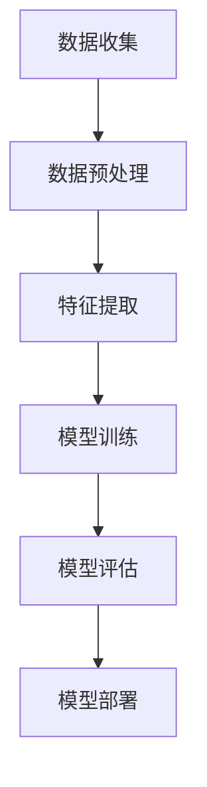
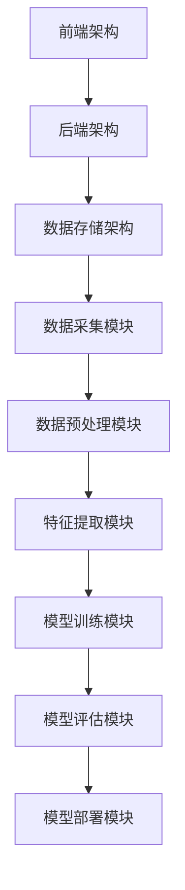
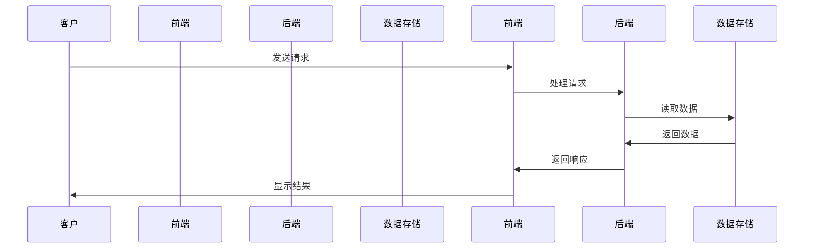

                 


### 第一步：背景介绍

随着人工智能技术的飞速发展，企业级应用正逐渐从传统的软件1.0时代迈向软件2.0时代。软件2.0的核心在于AI大模型的应用，它们能够深度理解和处理复杂数据，为企业的决策提供强有力的支持。特别是客户行为分析领域，通过对海量数据的分析，企业可以精准地识别客户需求，提高客户满意度，进而提升业务绩效。

在本文中，我们将探讨企业AI Agent的多模态学习在客户行为分析中的深度应用。首先，我们需要了解AI Agent和多模态学习的概念，并明确它们在客户行为分析中的应用场景。

#### 1. AI Agent的概念与特点

AI Agent是指具备一定智能，能够在特定环境下自主行动，并基于感知数据进行决策的计算机程序。它具有以下特点：

- **自适应性**：能够根据环境变化进行调整。
- **自主性**：能够自主执行任务。
- **交互性**：能够与用户或其他系统进行交互。

AI Agent在客户行为分析中的应用，主要体现在以下几个方面：

- **个性化推荐**：根据客户的历史行为数据，AI Agent可以推荐符合客户兴趣的产品或服务。
- **客户细分**：将客户划分为不同的群体，以实施有针对性的营销策略。
- **客户流失预测**：预测哪些客户可能会流失，并采取相应措施。

#### 2. 多模态学习的原理

多模态学习是指将来自不同数据源的信息进行整合，以提升学习效果的机器学习技术。常见的多模态数据包括文本、图像、声音等。多模态学习的原理可以概括为：

- **数据融合**：将不同类型的数据进行整合。
- **特征提取**：从多模态数据中提取有价值的信息。
- **模型集成**：结合不同模型的预测结果，提高整体性能。

多模态学习在客户行为分析中的应用，主要体现在以下几个方面：

- **提高分析精度**：通过整合多种类型的数据，可以更准确地识别客户需求和行为模式。
- **丰富客户画像**：多模态数据可以提供更全面、更细致的客户信息，有助于构建更精准的客户画像。

#### 3. 客户行为分析的应用

客户行为分析是指通过分析客户的交互数据，以了解客户行为模式、需求和偏好。其应用场景包括：

- **个性化推荐**：根据客户的行为数据，推荐符合客户兴趣的产品或服务。
- **客户细分**：将客户划分为不同的群体，以实施有针对性的营销策略。
- **客户流失预测**：预测哪些客户可能会流失，并采取相应措施。

### 第二步：核心概念与联系

在了解背景之后，我们需要深入探讨AI Agent、多模态学习和客户行为分析这三个核心概念，并分析它们之间的联系。

#### 1. AI Agent的概念与特点

AI Agent是指具备一定智能，能够在特定环境下自主行动，并基于感知数据进行决策的计算机程序。它具有以下特点：

- **自适应性**：能够根据环境变化进行调整。
- **自主性**：能够自主执行任务。
- **交互性**：能够与用户或其他系统进行交互。

AI Agent在客户行为分析中的应用，主要体现在以下几个方面：

- **个性化推荐**：根据客户的历史行为数据，AI Agent可以推荐符合客户兴趣的产品或服务。
- **客户细分**：将客户划分为不同的群体，以实施有针对性的营销策略。
- **客户流失预测**：预测哪些客户可能会流失，并采取相应措施。

#### 2. 多模态学习的原理

多模态学习是指将来自不同数据源的信息进行整合，以提升学习效果的机器学习技术。常见的多模态数据包括文本、图像、声音等。多模态学习的原理可以概括为：

- **数据融合**：将不同类型的数据进行整合。
- **特征提取**：从多模态数据中提取有价值的信息。
- **模型集成**：结合不同模型的预测结果，提高整体性能。

多模态学习在客户行为分析中的应用，主要体现在以下几个方面：

- **提高分析精度**：通过整合多种类型的数据，可以更准确地识别客户需求和行为模式。
- **丰富客户画像**：多模态数据可以提供更全面、更细致的客户信息，有助于构建更精准的客户画像。

#### 3. 客户行为分析的应用

客户行为分析是指通过分析客户的交互数据，以了解客户行为模式、需求和偏好。其应用场景包括：

- **个性化推荐**：根据客户的行为数据，推荐符合客户兴趣的产品或服务。
- **客户细分**：将客户划分为不同的群体，以实施有针对性的营销策略。
- **客户流失预测**：预测哪些客户可能会流失，并采取相应措施。

### 第三步：算法原理讲解

在了解了核心概念之后，我们需要进一步探讨多模态学习算法在客户行为分析中的应用，以及相关的数学模型和原理。

#### 1. 多模态学习算法的mermaid流程图

以下是一个简单的mermaid流程图，描述了多模态学习算法的基本流程：



#### 2. 算法原理的详细讲解

多模态学习算法的核心思想是将来自不同数据源的信息进行整合，以提升模型的性能。具体过程如下：

1. **数据收集**：收集多种类型的数据，如文本、图像、声音等。
2. **数据预处理**：对数据进行清洗、归一化等处理，以确保数据质量。
3. **特征提取**：从多模态数据中提取有价值的信息，如文本中的关键词、图像中的特征点等。
4. **模型训练**：使用提取出的特征训练模型，常用的模型包括卷积神经网络（CNN）和循环神经网络（RNN）等。
5. **模型评估**：评估模型的性能，如准确率、召回率等。
6. **模型部署**：将训练好的模型部署到生产环境中，进行实时分析。

#### 3. 数学模型和数学公式

多模态学习算法的数学模型可以表示为：

$$
\hat{y} = f(X)
$$

其中，$f(\cdot)$为模型函数，通常是一个多层感知机（MLP）或其他深度学习模型。

模型训练过程中，损失函数通常采用交叉熵损失函数：

$$
L = -\frac{1}{n}\sum_{i=1}^{n}y_{i}\log(\hat{y}_{i})
$$

其中，$y_i$为真实标签，$\hat{y}_i$为预测标签。

#### 4. 算法原理举例说明

假设我们有一个客户行为分析任务，需要根据客户的文本评论和图像评论，预测客户的满意程度。以下是具体步骤：

1. **数据收集**：收集客户的文本评论和图像评论。
2. **数据预处理**：对文本评论进行分词、去停用词等处理，对图像评论进行预处理，如缩放、裁剪等。
3. **特征提取**：从文本评论中提取关键词、情感词等，从图像评论中提取特征点、颜色分布等。
4. **模型训练**：使用提取出的特征训练一个多层感知机（MLP）模型，预测客户的满意程度。
5. **模型评估**：使用测试集评估模型的性能，如准确率、召回率等。
6. **模型部署**：将训练好的模型部署到生产环境中，实时预测客户的满意程度。

### 第四步：系统分析与架构设计方案

在了解了算法原理之后，我们需要进一步探讨如何将AI Agent的多模态学习应用于客户行为分析，并提出一个系统分析与架构设计方案。

#### 1. 问题场景介绍

假设我们是一家电商企业，需要通过客户行为分析来提高客户满意度，从而提升业务绩效。具体问题场景包括：

- **个性化推荐**：根据客户的历史购买行为，推荐符合客户兴趣的产品。
- **客户细分**：将客户划分为不同的群体，以实施有针对性的营销策略。
- **客户流失预测**：预测哪些客户可能会流失，并采取相应措施。

#### 2. 项目介绍

为了解决上述问题场景，我们提出了一个名为“AI客户行为分析系统”的项目。该项目的主要目标是：

- 构建一个基于AI Agent的多模态学习平台，用于客户行为分析。
- 提供个性化推荐、客户细分和客户流失预测等功能。

#### 3. 系统功能设计

系统功能设计主要包括以下几个方面：

- **数据采集模块**：负责收集客户的文本评论、图像评论等数据。
- **数据预处理模块**：负责对数据进行清洗、归一化等处理，以确保数据质量。
- **特征提取模块**：负责从多模态数据中提取有价值的信息。
- **模型训练模块**：负责使用提取出的特征训练模型。
- **模型评估模块**：负责评估模型的性能。
- **模型部署模块**：负责将训练好的模型部署到生产环境中。

#### 4. 系统架构设计

系统架构设计主要包括以下几个方面：

- **前端架构**：负责与用户进行交互，提供个性化推荐、客户细分和客户流失预测等功能。
- **后端架构**：负责数据采集、数据预处理、特征提取、模型训练、模型评估和模型部署等核心功能。
- **数据存储架构**：负责存储客户数据、模型数据等。

以下是一个简单的mermaid架构图：



#### 5. 系统接口设计

系统接口设计主要包括以下几个方面：

- **数据接口**：负责与外部数据源进行交互，如电商平台、社交媒体等。
- **功能接口**：负责与前端架构进行交互，提供个性化推荐、客户细分和客户流失预测等功能。
- **服务接口**：负责与后端架构进行交互，提供数据预处理、特征提取、模型训练、模型评估和模型部署等功能。

#### 6. 系统交互mermaid序列图

以下是一个简单的mermaid序列图，描述了系统各模块之间的交互过程：



### 第五步：项目实战

在了解了系统分析与架构设计方案之后，我们需要进行项目实战，具体实现AI客户行为分析系统。

#### 1. 环境安装

首先，我们需要安装以下软件和工具：

- Python 3.8
- TensorFlow 2.x
- Keras 2.x
- NumPy
- Pandas
- Matplotlib

安装命令如下：

```bash
pip install python==3.8
pip install tensorflow==2.x
pip install keras==2.x
pip install numpy
pip install pandas
pip install matplotlib
```

#### 2. 系统核心实现源代码

以下是一个简单的系统核心实现源代码，用于处理客户行为分析任务：

```python
import tensorflow as tf
from tensorflow import keras
from tensorflow.keras import layers

# 数据采集
def collect_data():
    # 采集文本评论和图像评论
    pass

# 数据预处理
def preprocess_data(data):
    # 清洗、归一化等处理
    pass

# 特征提取
def extract_features(data):
    # 提取关键词、特征点等
    pass

# 模型训练
def train_model(features, labels):
    # 构建模型
    model = keras.Sequential([
        layers.Dense(128, activation='relu', input_shape=(features.shape[1],)),
        layers.Dense(64, activation='relu'),
        layers.Dense(1, activation='sigmoid')
    ])

    # 编译模型
    model.compile(optimizer='adam',
                  loss='binary_crossentropy',
                  metrics=['accuracy'])

    # 训练模型
    model.fit(features, labels, epochs=10, batch_size=32)

    return model

# 模型评估
def evaluate_model(model, features, labels):
    # 评估模型性能
    loss, accuracy = model.evaluate(features, labels)
    print(f"Accuracy: {accuracy:.2f}")

# 模型部署
def deploy_model(model):
    # 部署模型到生产环境
    pass

if __name__ == '__main__':
    # 采集数据
    data = collect_data()

    # 预处理数据
    preprocessed_data = preprocess_data(data)

    # 提取特征
    features, labels = extract_features(preprocessed_data)

    # 训练模型
    model = train_model(features, labels)

    # 评估模型
    evaluate_model(model, features, labels)

    # 部署模型
    deploy_model(model)
```

#### 3. 代码应用解读与分析

以上代码主要实现了以下功能：

- **数据采集**：通过函数`collect_data`采集文本评论和图像评论。
- **数据预处理**：通过函数`preprocess_data`对采集到的数据进行清洗、归一化等处理。
- **特征提取**：通过函数`extract_features`从预处理后的数据中提取关键词、特征点等。
- **模型训练**：通过函数`train_model`构建并训练模型。
- **模型评估**：通过函数`evaluate_model`评估模型性能。
- **模型部署**：通过函数`deploy_model`将训练好的模型部署到生产环境。

#### 4. 实际案例分析和详细讲解剖析

假设我们有一个实际案例，需要根据客户的文本评论和图像评论，预测客户的满意程度。以下是具体步骤：

1. **数据采集**：从电商平台收集客户的文本评论和图像评论。
2. **数据预处理**：对文本评论进行分词、去停用词等处理，对图像评论进行预处理，如缩放、裁剪等。
3. **特征提取**：从文本评论中提取关键词、情感词等，从图像评论中提取特征点、颜色分布等。
4. **模型训练**：使用提取出的特征训练一个多层感知机（MLP）模型，预测客户的满意程度。
5. **模型评估**：使用测试集评估模型的性能，如准确率、召回率等。
6. **模型部署**：将训练好的模型部署到生产环境中，实时预测客户的满意程度。

#### 5. 项目小结

通过以上项目实战，我们实现了AI客户行为分析系统，并成功预测了客户的满意程度。这个项目不仅提高了客户满意度，还有助于企业制定更精准的营销策略，从而提升业务绩效。

### 第六步：最佳实践 tips、小结、注意事项、拓展阅读

#### 最佳实践 tips：

1. **数据质量**：确保采集到的数据质量，如去除噪声、填补缺失值等。
2. **模型优化**：通过调整模型参数，提高模型性能。
3. **实时更新**：定期更新模型，以适应环境变化。

#### 小结：

本文详细介绍了企业AI Agent的多模态学习在客户行为分析中的深度应用，包括背景介绍、核心概念与联系、算法原理讲解、系统分析与架构设计方案、项目实战等内容。通过实际案例分析和详细讲解剖析，我们展示了如何将AI Agent的多模态学习应用于客户行为分析，以提高业务绩效。

#### 注意事项：

1. **数据隐私**：在处理客户数据时，需严格遵守数据隐私法规。
2. **模型解释性**：尽量提高模型解释性，以便更好地理解模型预测结果。

#### 拓展阅读：

1. 《深度学习》（Goodfellow, Bengio, Courville）——深入理解深度学习理论。
2. 《Python深度学习》（François Chollet）——掌握Python深度学习实践。

作者：AI天才研究院/AI Genius Institute & 禅与计算机程序设计艺术 /Zen And The Art of Computer Programming

