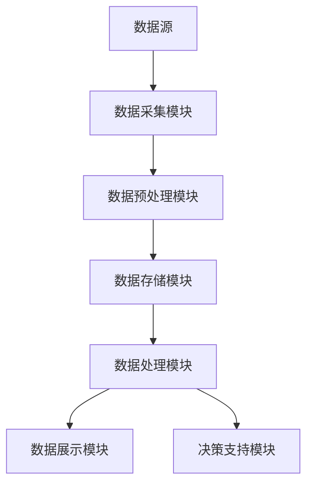
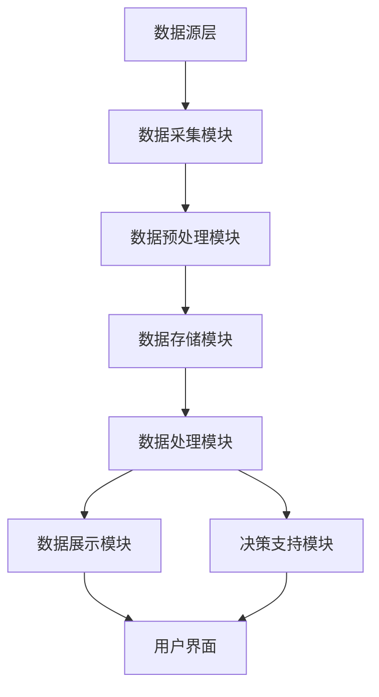
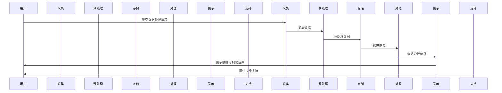

                 

### 引言与背景

在当今数字化时代，大数据已经成为企业决策的重要依据。大数据处理框架作为一种高效的数据管理工具，能够帮助企业快速、准确地分析和利用海量数据，为企业带来巨大的商业价值。与此同时，人工智能（AI）技术的发展也为大数据处理提供了新的可能性和解决方案。AI Agent，作为一种智能化的数据处理工具，正在逐渐成为企业大数据处理的重要角色。

企业AI Agent，是指专门为企业量身定制的智能化数据处理系统。它能够自动执行复杂的数据分析任务，提供实时、准确的数据洞察，帮助企业在竞争激烈的市场中占据优势。随着数据量的不断增长和数据种类的日益多样化，企业对于大数据处理的需求也越来越高。传统的数据处理方法已经难以满足企业的需求，因此，设计一套高效、可靠的企业AI Agent大数据处理框架，成为了企业数字化转型的重要课题。

本文旨在探讨企业AI Agent的大数据处理框架设计，通过对大数据处理框架的背景、核心概念、设计原则、实现方法、应用实践和未来展望进行详细分析，为企业和开发者提供一套全面、系统的大数据处理解决方案。本文将采用逻辑清晰、结构紧凑、简单易懂的专业技术语言，帮助读者一步步了解和掌握企业AI Agent大数据处理框架的设计和应用。

### 关键词

- 企业AI Agent
- 大数据处理框架
- 数据采集与预处理
- 数据存储与管理
- 数据分析与挖掘
- 数据可视化与决策支持
- 系统架构设计
- 应用实践
- 未来展望

### 摘要

本文围绕企业AI Agent的大数据处理框架进行深入探讨。首先，介绍了大数据处理框架的背景和重要性，分析了大数据在企业中的应用现状和面临的挑战。接着，详细阐述了企业AI Agent的定义、特点和应用场景，为后续框架设计提供了基础。然后，从架构设计原则、数据处理流程设计、AI Agent的核心组件、安全性与隐私保护等方面，详细描述了大数据处理框架的设计思路和实现方法。通过实际案例分析，展示了框架在具体应用中的效果。最后，对大数据处理框架的未来发展进行了展望，探讨了新技术可能带来的变革和机遇。本文旨在为企业和开发者提供一套实用、高效的大数据处理解决方案，助力企业数字化转型。

## 第1章: 大数据处理框架概述

### 1.1 问题背景

在当今的信息时代，数据已经成为企业的重要资产，大数据处理的重要性日益凸显。企业通过收集和分析大量数据，可以洞察市场趋势、优化业务流程、提高决策效率，从而在竞争激烈的市场中取得优势。然而，大数据处理并非易事，它面临着诸多挑战：

首先，数据量的庞大是大数据处理的首要挑战。随着互联网和物联网的快速发展，企业每天产生和收集的数据量呈指数级增长，这些数据包括结构化数据、半结构化数据和非结构化数据，如何高效地存储、管理和处理这些海量数据，成为企业急需解决的问题。

其次，数据种类的多样化增加了大数据处理的复杂性。不同类型的数据具有不同的特性和处理需求，例如，文本数据需要自然语言处理技术，图像数据需要计算机视觉技术，时间序列数据需要时间序列分析技术。如何根据不同类型的数据特点，选择合适的数据处理方法和工具，是企业面临的另一个挑战。

第三，数据处理的速度和实时性要求越来越高。在竞争激烈的市场环境中，企业需要快速获取数据洞察，以便及时调整策略和决策。然而，大数据处理往往涉及复杂的计算和数据处理流程，如何提高数据处理速度，实现实时数据分析和决策，是企业需要解决的关键问题。

第四，数据的安全性和隐私保护也是大数据处理中不可忽视的问题。大数据往往包含了企业的核心商业秘密和用户隐私信息，如何确保数据在采集、存储、处理和传输过程中的安全性和隐私性，防止数据泄露和滥用，是企业必须面对的挑战。

### 1.2 大数据处理框架的必要性

为了应对大数据处理中的各种挑战，企业需要设计一套高效、可靠的大数据处理框架。大数据处理框架是指一套系统化的数据处理流程和工具，它能够帮助企业在数据采集、存储、管理和分析等各个环节中，高效、准确地处理海量数据，并从中提取有价值的信息和洞察。以下是大数据处理框架的必要性：

1. **提高数据处理效率**：大数据处理框架通过优化数据处理流程、采用高效的数据处理算法和工具，能够显著提高数据处理效率，减少数据处理时间，使企业能够更快地获取数据洞察。

2. **确保数据处理质量**：大数据处理框架提供了一套标准化的数据处理流程和工具，能够确保数据处理过程中的数据质量和一致性，减少错误和遗漏。

3. **降低数据处理成本**：通过自动化和优化数据处理流程，大数据处理框架能够降低数据处理的人力成本和设备成本，提高资源利用效率。

4. **支持实时数据处理**：大数据处理框架能够支持实时数据采集、存储和处理，实现实时数据分析，帮助企业快速响应市场变化。

5. **提高数据安全性**：大数据处理框架通过数据加密、权限管理和访问控制等技术，确保数据在采集、存储、处理和传输过程中的安全性。

6. **促进数据共享与协作**：大数据处理框架提供了统一的数据接口和标准化数据格式，能够促进企业内部各部门之间的数据共享与协作，提高企业整体数据处理能力。

### 1.3 大数据处理框架的基本原理

大数据处理框架的基本原理主要包括数据采集、数据存储、数据处理、数据分析和数据可视化等几个关键环节，下面将逐一进行介绍。

#### 1.3.1 数据采集与预处理

数据采集是大数据处理的第一步，它涉及从各种数据源（如数据库、文件、传感器、互联网等）收集数据。数据采集的过程需要考虑数据的完整性、实时性和准确性。一旦数据被采集到系统中，就需要进行预处理，以清洗和格式化数据。预处理过程包括数据去重、数据转换、数据填充和数据清洗等，以确保数据的质量和一致性。

#### 1.3.2 数据存储与管理

数据存储与管理是大数据处理框架的核心环节，它负责将预处理后的数据存储在合适的存储系统中，并提供高效的数据访问和查询功能。大数据存储系统需要具备高扩展性、高可用性和高性能等特点。常用的数据存储系统包括关系型数据库、NoSQL数据库、分布式文件系统（如HDFS）和云存储服务等。

#### 1.3.3 数据处理

数据处理是指对存储在数据存储系统中的数据进行各种计算和分析。数据处理可以包括数据聚合、数据过滤、数据变换、数据挖掘等操作。为了高效处理海量数据，大数据处理框架通常采用分布式计算模型，如MapReduce、Spark等，这些模型能够将大规模数据处理任务分解为多个小任务，并行执行，从而提高处理速度和效率。

#### 1.3.4 数据分析与挖掘

数据分析与挖掘是指通过分析数据，从中提取有价值的信息和知识。数据分析可以包括描述性分析、诊断性分析、预测性分析和规范性分析等。数据挖掘则是指利用机器学习、统计学和人工智能等技术，从大量数据中发现潜在的规律和模式。数据分析与挖掘可以帮助企业发现市场趋势、优化业务流程、预测未来需求等。

#### 1.3.5 数据可视化与决策支持

数据可视化是将数据分析结果以图形化的方式展示出来，帮助用户直观地理解数据和分析结果。数据可视化工具如Tableau、PowerBI等，能够将复杂的数据分析结果以图表、仪表板等形式呈现，提高数据理解和决策效率。决策支持系统（DSS）则是基于数据分析和可视化结果，为用户提供决策支持和建议。

### 1.4 本章小结

本章介绍了大数据处理框架的背景、必要性以及基本原理。通过了解大数据处理的挑战和需求，读者可以认识到设计高效、可靠的大数据处理框架的重要性。接下来，本章将深入探讨企业AI Agent的定义、特点和应用场景，为后续的框架设计提供基础。

## 第2章: 企业AI Agent架构设计

### 2.1 架构设计原则

在企业AI Agent的大数据处理框架设计中，架构设计原则是确保系统性能、可扩展性和可靠性等重要因素的关键。以下是几个核心架构设计原则：

#### 2.1.1 可扩展性

可扩展性是大数据处理框架设计的重要原则之一。随着数据量的不断增长和企业需求的不断变化，系统需要能够灵活地扩展其处理能力和存储容量。为了实现可扩展性，框架应采用分布式计算模型，如MapReduce、Spark等，这些模型能够将大规模数据处理任务分解为多个小任务，并行执行。此外，系统应支持动态扩展，以便在需要时能够快速增加计算资源和存储资源。

#### 2.1.2 可靠性

可靠性是大数据处理框架的另一个关键设计原则。由于大数据处理过程中涉及到大量数据的采集、存储和处理，任何环节的故障都可能导致数据丢失或处理失败。因此，系统需要具备高可用性和容错性，能够确保数据在采集、存储和处理过程中的完整性和一致性。为此，框架应采用冗余设计，如数据备份、多节点存储和故障转移机制等，以提高系统的可靠性。

#### 2.1.3 易维护性

易维护性是确保大数据处理框架长期稳定运行的重要保障。为了实现易维护性，系统设计应遵循模块化原则，将不同的功能模块进行清晰的划分，每个模块应具备独立的功能和接口。此外，系统应具备良好的文档和日志记录机制，以便在发生问题时能够快速定位和解决问题。代码应遵循良好的编程规范，易于调试和更新。

#### 2.1.4 安全性与隐私保护

在大数据处理过程中，数据的安全性和隐私保护至关重要。系统应采用数据加密、访问控制和权限管理等技术，确保数据在传输、存储和处理过程中的安全性。同时，应制定严格的用户隐私保护策略，确保用户隐私信息不被泄露或滥用。

#### 2.1.5 性能优化

性能优化是提高大数据处理框架效率的重要手段。为了实现性能优化，系统设计应考虑数据访问和处理的局部性原理，尽量减少数据传输和网络延迟。此外，应采用高效的算法和数据结构，如哈希表、B树等，以降低计算复杂度和内存占用。

### 2.2 数据处理流程设计

数据处理流程是企业AI Agent大数据处理框架的核心环节，它决定了系统的性能和效率。一个典型的数据处理流程包括以下几个步骤：

#### 2.2.1 数据采集与预处理

数据采集是数据处理流程的起点，包括从各种数据源（如数据库、文件、传感器、互联网等）收集数据。数据采集的过程需要考虑数据的完整性、实时性和准确性。一旦数据被采集到系统中，就需要进行预处理，以清洗和格式化数据。预处理过程包括数据去重、数据转换、数据填充和数据清洗等，以确保数据的质量和一致性。

#### 2.2.2 数据存储与管理

数据存储与管理是数据处理流程的重要环节，负责将预处理后的数据存储在合适的存储系统中，并提供高效的数据访问和查询功能。数据存储系统应具备高扩展性、高可用性和高性能等特点。常用的数据存储系统包括关系型数据库、NoSQL数据库、分布式文件系统（如HDFS）和云存储服务等。

#### 2.2.3 数据分析与挖掘

数据分析与挖掘是数据处理流程的核心环节，通过分析数据，从中提取有价值的信息和知识。数据分析可以包括描述性分析、诊断性分析、预测性分析和规范性分析等。数据挖掘则是指利用机器学习、统计学和人工智能等技术，从大量数据中发现潜在的规律和模式。数据分析与挖掘可以帮助企业发现市场趋势、优化业务流程、预测未来需求等。

#### 2.2.4 数据可视化与决策支持

数据可视化是将数据分析结果以图形化的方式展示出来，帮助用户直观地理解数据和分析结果。数据可视化工具如Tableau、PowerBI等，能够将复杂的数据分析结果以图表、仪表板等形式呈现，提高数据理解和决策效率。决策支持系统（DSS）则是基于数据分析和可视化结果，为用户提供决策支持和建议。

### 2.3 AI Agent的核心组件

企业AI Agent由多个核心组件组成，每个组件在数据处理流程中扮演着重要的角色。以下是AI Agent的几个核心组件：

#### 2.3.1 数据采集组件

数据采集组件负责从各种数据源收集数据，包括内部数据库、外部API接口、文件系统和传感器等。数据采集组件应具备高效、可靠的数据采集能力，并支持多种数据格式的处理。

#### 2.3.2 数据预处理组件

数据预处理组件负责对采集到的数据进行清洗、转换和格式化，确保数据的质量和一致性。数据预处理组件应具备灵活的配置能力，支持多种数据清洗方法和转换规则。

#### 2.3.3 数据存储组件

数据存储组件负责将预处理后的数据存储在合适的存储系统中，并提供高效的数据访问和查询功能。数据存储组件应具备高扩展性、高可用性和高性能等特点。

#### 2.3.4 数据分析组件

数据分析组件负责对存储在数据库中的数据进行分析和挖掘，提取有价值的信息和知识。数据分析组件应支持多种数据分析方法和算法，如机器学习、深度学习和统计分析等。

#### 2.3.5 数据可视化组件

数据可视化组件负责将数据分析结果以图形化的方式展示出来，帮助用户直观地理解数据和分析结果。数据可视化组件应支持多种可视化工具和图表类型，提供灵活的可视化配置能力。

#### 2.3.6 决策支持组件

决策支持组件基于数据分析和可视化结果，为用户提供决策支持和建议。决策支持组件应具备智能化的决策算法和推荐系统，能够根据用户需求和场景提供个性化的决策支持。

### 2.4 安全性与隐私保护

在大数据处理过程中，数据的安全性和隐私保护至关重要。为了确保数据的安全性和隐私性，企业AI Agent的大数据处理框架应采用以下安全性和隐私保护措施：

#### 2.4.1 数据加密

数据加密是保护数据安全的重要手段。在数据采集、传输和存储过程中，应对敏感数据进行加密，确保数据在传输和存储过程中的安全性。

#### 2.4.2 访问控制

访问控制是限制用户对数据的访问权限，确保数据不会被未授权的用户访问。系统应采用基于角色的访问控制（RBAC）机制，根据用户的角色和权限限制其对数据的访问。

#### 2.4.3 用户认证

用户认证是确保用户身份合法性的重要措施。系统应采用强密码策略和多因素认证（如双因素认证）机制，确保用户身份的合法性和安全性。

#### 2.4.4 日志记录

日志记录是监控系统运行状况和发现潜在问题的重要手段。系统应具备完善的日志记录功能，记录用户操作、系统事件和错误信息等，以便在发生问题时进行追踪和分析。

#### 2.4.5 隐私保护策略

隐私保护策略是确保用户隐私信息不被泄露或滥用的重要措施。系统应制定严格的用户隐私保护策略，明确用户隐私信息的收集、存储和使用规则，并采取相应的技术手段进行保护。

### 2.5 本章小结

本章详细介绍了企业AI Agent架构设计的原则、数据处理流程设计、核心组件以及安全性和隐私保护措施。通过遵循这些设计原则和实现方法，企业可以设计出高效、可靠、安全的大数据处理框架，从而满足企业在大数据处理方面的需求。接下来，本章将深入探讨系统架构设计，进一步阐述框架的实现细节。

### 2.6 系统架构设计

系统架构设计是大数据处理框架的核心环节，它决定了系统的性能、可扩展性和可靠性。一个良好的系统架构应具备模块化、高可用性、高性能和可维护性等特点。以下是企业AI Agent大数据处理框架的系统架构设计。

#### 2.6.1 整体架构设计

企业AI Agent大数据处理框架的整体架构可以分为以下几个层次：

1. **数据源层**：数据源层包括各种数据采集渠道，如数据库、文件系统、传感器和外部API接口等。数据源层负责从不同的数据源中收集数据，并将其传输到系统内部。

2. **数据采集层**：数据采集层负责对采集到的数据进行清洗、转换和格式化，确保数据的质量和一致性。数据采集层通常采用分布式架构，以提高数据处理效率和容错性。

3. **数据存储层**：数据存储层负责将预处理后的数据存储在合适的存储系统中，并提供高效的数据访问和查询功能。数据存储层通常采用分布式文件系统（如HDFS）或NoSQL数据库（如HBase、MongoDB）等。

4. **数据处理层**：数据处理层负责对存储在数据存储层中的数据进行各种计算和分析，如数据聚合、数据过滤、数据变换和数据挖掘等。数据处理层通常采用分布式计算框架（如MapReduce、Spark）进行大规模数据处理。

5. **数据展示层**：数据展示层负责将数据处理结果以图形化的方式展示出来，帮助用户直观地理解数据和分析结果。数据展示层通常采用数据可视化工具（如Tableau、PowerBI）或Web前端框架（如React、Vue.js）实现。

6. **决策支持层**：决策支持层基于数据分析和可视化结果，为用户提供决策支持和建议。决策支持层通常采用智能算法和推荐系统（如机器学习、深度学习）实现。

#### 2.6.2 系统模块间关系

企业AI Agent大数据处理框架的各个模块之间紧密关联，相互协作，共同实现数据处理和分析的目标。以下是系统模块间的关系：

1. **数据源层与数据采集层**：数据源层通过数据采集组件与数据采集层连接，数据采集组件负责从各种数据源中采集数据，并将其传输到数据采集层进行预处理。

2. **数据采集层与数据存储层**：数据采集层将预处理后的数据传输到数据存储层进行存储，数据存储层提供高效的数据访问和查询功能，以满足数据处理和分析的需求。

3. **数据处理层与数据存储层**：数据处理层通过数据存储层访问存储在其中的数据，进行各种计算和分析。数据处理层还可以将分析结果存储回数据存储层，以便后续查询和使用。

4. **数据展示层与数据处理层**：数据展示层通过数据处理层获取数据处理和分析结果，并将其以图形化的方式展示给用户。数据展示层还可以根据用户需求动态调整数据展示方式。

5. **决策支持层与数据处理层**：决策支持层通过数据处理层获取数据分析和可视化结果，利用智能算法和推荐系统为用户提供决策支持和建议。

#### 2.6.3 系统接口设计

系统接口设计是确保各模块之间能够高效、稳定地协作的关键。以下是系统接口设计的主要方面：

1. **数据采集接口**：数据采集接口负责从各种数据源中采集数据，并将其转换为统一的格式，方便后续处理。

2. **数据处理接口**：数据处理接口提供对存储在数据存储层的数据进行各种计算和分析的功能，包括数据聚合、数据过滤、数据变换和数据挖掘等。

3. **数据展示接口**：数据展示接口提供数据可视化功能，将数据处理结果以图表、仪表板等形式展示给用户。

4. **决策支持接口**：决策支持接口提供基于数据分析和可视化结果的决策支持和建议，包括智能算法和推荐系统的调用。

#### 2.6.4 系统交互

系统交互是指各模块之间的交互和数据流。以下是系统交互的主要过程：

1. **数据采集**：数据采集组件从数据源层采集数据，并将其传输到数据采集层进行预处理。

2. **数据处理**：数据处理组件根据用户需求，从数据存储层获取数据，进行计算和分析，并将分析结果存储回数据存储层。

3. **数据展示**：数据展示组件从数据存储层获取分析结果，并将其以图表、仪表板等形式展示给用户。

4. **决策支持**：决策支持组件从数据处理层获取数据分析和可视化结果，利用智能算法和推荐系统为用户提供决策支持和建议。

通过上述系统架构设计，企业AI Agent大数据处理框架能够高效、可靠地处理海量数据，提供实时的数据分析和决策支持，帮助企业实现数据驱动的业务决策。

### 2.7 系统性能优化

在大数据处理框架中，系统性能优化是确保数据处理效率和质量的重要手段。高性能的系统不仅能够加快数据处理速度，还能提高系统的稳定性和可靠性。以下是一些常见的系统性能优化策略：

#### 2.7.1 数据压缩

数据压缩是一种有效的优化策略，通过减少数据传输和存储所需的带宽和存储空间，提高系统性能。常用的数据压缩算法包括Huffman编码、LZ77和LZ78等。在数据存储和传输过程中，采用合适的压缩算法可以显著降低系统的负载。

#### 2.7.2 缓存技术

缓存技术通过在内存中保存经常访问的数据，减少对磁盘的读写操作，提高系统性能。常用的缓存策略包括LRU（Least Recently Used）缓存策略和LFU（Least Frequently Used）缓存策略。在数据处理过程中，缓存技术可以有效减少数据访问延迟，提高数据处理的效率。

#### 2.7.3 并行处理

并行处理是一种将大规模数据处理任务分解为多个小任务，并行执行，以提高系统性能的方法。常见的并行处理技术包括MapReduce和Spark等分布式计算框架。通过并行处理，系统可以在较短的时间内处理大量数据，提高数据处理速度。

#### 2.7.4 数据索引

数据索引是一种通过创建索引数据结构，加快数据查询速度的技术。常用的索引技术包括B树索引、哈希索引和位图索引等。在数据存储和管理过程中，采用合适的数据索引技术可以显著提高数据查询的效率。

#### 2.7.5 负载均衡

负载均衡通过将数据处理任务均匀分配到多个处理节点上，避免单点瓶颈，提高系统性能。常用的负载均衡算法包括轮询负载均衡、最小连接数负载均衡和响应时间负载均衡等。通过负载均衡，系统可以充分利用所有处理资源，提高整体性能。

#### 2.7.6 网络优化

网络优化通过优化数据传输路径和传输协议，减少数据传输的延迟和抖动，提高系统性能。常用的网络优化技术包括数据去重、数据压缩和TCP拥塞控制等。通过网络优化，系统可以在网络环境中保持高效稳定的数据传输。

#### 2.7.7 存储优化

存储优化通过优化数据存储策略和存储设备配置，提高数据存储和访问的效率。常用的存储优化技术包括数据分片、数据压缩和存储设备集群等。通过存储优化，系统可以在数据存储和管理方面实现更高的性能。

通过上述系统性能优化策略，企业AI Agent大数据处理框架可以在数据处理速度、稳定性和可靠性方面得到显著提升，满足企业对高效数据处理的需求。

### 2.8 可扩展性与容错性设计

在大数据处理框架中，可扩展性和容错性是确保系统长期稳定运行的重要设计原则。随着数据量的不断增长和企业需求的不断增加，系统需要能够灵活地扩展其处理能力和存储容量，同时确保在发生故障时能够快速恢复，避免数据丢失和处理中断。

#### 2.8.1 可扩展性设计

可扩展性设计旨在确保系统在数据量和处理需求增加时，能够灵活地扩展其处理能力和存储容量。以下是实现可扩展性的几种设计策略：

1. **分布式计算**：通过采用分布式计算模型（如MapReduce、Spark等），系统可以将大规模数据处理任务分解为多个小任务，并行执行。这种方式不仅可以提高数据处理速度，还可以通过增加计算节点来扩展系统处理能力。

2. **水平扩展**：系统应支持水平扩展，即通过增加节点数量来扩展系统容量。例如，在数据库系统中，可以通过增加数据分片来扩展存储容量。在分布式文件系统（如HDFS）中，可以通过增加数据副本来提高数据可靠性。

3. **动态资源管理**：系统应具备动态资源管理能力，能够根据处理需求自动调整计算资源和存储资源。例如，在云计算环境中，可以通过云服务自动扩展计算资源，以满足高峰期的数据处理需求。

4. **模块化设计**：采用模块化设计，将系统功能划分为多个独立模块，每个模块可以独立扩展。这种方式不仅提高了系统的可维护性，还可以在需要时单独扩展某个模块，而不影响整个系统的运行。

#### 2.8.2 容错性设计

容错性设计旨在确保系统在发生故障时能够快速恢复，避免数据丢失和处理中断。以下是实现容错性的几种设计策略：

1. **数据冗余**：通过数据冗余（如数据备份和副本），确保在数据存储和传输过程中，即使部分数据损坏或丢失，系统仍能够从备份中恢复数据。例如，在分布式存储系统中，可以通过多副本机制来提高数据可靠性。

2. **故障检测与恢复**：系统应具备故障检测与恢复机制，能够及时发现和处理故障。例如，在分布式计算系统中，可以通过心跳机制检测节点状态，一旦检测到节点故障，系统可以自动切换到其他健康节点。

3. **备份与恢复**：系统应定期进行数据备份，确保在发生故障时能够快速恢复数据。备份策略可以包括全量备份和增量备份，全量备份适用于重要数据，增量备份适用于日常备份。

4. **故障转移与切换**：系统应具备故障转移和切换机制，确保在发生故障时，系统可以快速切换到备用节点或备用系统，继续提供服务。例如，在数据库系统中，可以通过主从复制和故障转移机制，确保数据服务的连续性。

5. **高可用性设计**：通过高可用性设计（如负载均衡和集群部署），系统可以在多个节点或多个系统之间分担负载，提高系统的稳定性和可靠性。例如，在Web服务中，可以通过负载均衡器将请求均匀分配到多个服务器上，确保服务的持续可用性。

通过上述可扩展性与容错性设计策略，企业AI Agent大数据处理框架能够在数据量和处理需求不断变化的环境中保持稳定运行，确保数据的完整性和处理效率。

### 2.9 本章小结

本章详细介绍了企业AI Agent大数据处理框架的系统架构设计、性能优化策略、可扩展性与容错性设计。通过合理的架构设计、优化策略和容错性措施，企业AI Agent大数据处理框架能够在处理海量数据的同时，确保系统的性能、可靠性和稳定性。接下来，本章将结合具体案例，展示大数据处理框架在实际应用中的效果。

## 第3章: 系统架构设计

### 3.1 问题场景介绍

在当今大数据时代，金融机构面临着日益复杂的数据管理和分析需求。以一家大型银行为例，该银行每天产生和处理的海量数据包括客户交易记录、贷款申请数据、账户信息、市场行情数据等。为了提高业务运营效率、优化客户体验和防范金融风险，银行需要设计一套高效、可靠的大数据处理框架。

### 3.2 项目介绍

本项目的目标是设计并实现一套适用于金融机构的AI Agent大数据处理框架，以满足银行在数据采集、存储、处理、分析和展示等方面的需求。该框架将采用先进的分布式计算技术、数据存储技术和人工智能算法，实现高效、实时的大数据处理和分析。

#### 3.2.1 项目背景

随着金融科技的快速发展，金融机构需要处理的数据量呈指数级增长，传统的数据处理方法已无法满足需求。此外，金融行业对数据质量和处理速度的要求越来越高，因此，设计一套高效、可靠的大数据处理框架具有重要意义。

#### 3.2.2 项目目标

1. **数据采集**：高效、实时地从各种数据源采集数据，包括内部数据库、外部API接口、文件系统和传感器等。
2. **数据存储**：将采集到的数据进行预处理，并存储在分布式文件系统或NoSQL数据库中，确保数据的高可用性和可靠性。
3. **数据处理**：对存储在数据库中的数据进行各种计算和分析，包括数据聚合、数据过滤、数据变换和数据挖掘等。
4. **数据展示**：将分析结果以图表、仪表板等形式展示给用户，提供直观的数据可视化。
5. **决策支持**：基于数据分析和可视化结果，为银行管理层提供决策支持和建议。

### 3.3 系统功能设计

系统功能设计是系统架构设计的重要组成部分，它定义了系统的核心功能模块和接口。以下是本项目的系统功能设计：

#### 3.3.1 功能模块划分

1. **数据采集模块**：负责从各种数据源采集数据，包括内部数据库、外部API接口、文件系统和传感器等。
2. **数据预处理模块**：负责对采集到的数据进行清洗、转换和格式化，确保数据的质量和一致性。
3. **数据存储模块**：负责将预处理后的数据存储在分布式文件系统或NoSQL数据库中，并提供高效的数据访问和查询功能。
4. **数据处理模块**：负责对存储在数据库中的数据进行各种计算和分析，包括数据聚合、数据过滤、数据变换和数据挖掘等。
5. **数据展示模块**：负责将数据处理结果以图表、仪表板等形式展示给用户，提供直观的数据可视化。
6. **决策支持模块**：负责基于数据分析和可视化结果，为银行管理层提供决策支持和建议。

#### 3.3.2 功能描述与实现

1. **数据采集模块**：
   - **功能描述**：从各种数据源采集数据，包括内部数据库（如Oracle、MySQL）、外部API接口（如交易所API、金融数据服务API）、文件系统（如HDFS、NAS）和传感器（如POS机、ATM机）。
   - **实现方法**：采用分布式采集架构，通过数据采集代理（Collector Agent）实现数据的实时采集和传输。数据采集代理可以根据配置自动选择合适的数据源，并使用适当的协议（如HTTP、FTP、JDBC等）进行数据采集。

2. **数据预处理模块**：
   - **功能描述**：对采集到的数据进行清洗、转换和格式化，确保数据的质量和一致性。主要包括数据去重、缺失值填充、数据类型转换、格式化处理等。
   - **实现方法**：采用分布式数据处理框架（如Apache Spark）实现数据预处理。数据预处理过程包括多个阶段，每个阶段都可以独立运行和并行处理，从而提高预处理效率。

3. **数据存储模块**：
   - **功能描述**：将预处理后的数据存储在分布式文件系统（如HDFS）或NoSQL数据库（如HBase、MongoDB）中，并提供高效的数据访问和查询功能。
   - **实现方法**：采用分布式存储架构，将数据存储在多个节点上，以提高数据可靠性和访问性能。存储系统应支持数据分片和副本机制，确保数据的高可用性和可靠性。

4. **数据处理模块**：
   - **功能描述**：对存储在数据库中的数据进行各种计算和分析，包括数据聚合、数据过滤、数据变换和数据挖掘等。
   - **实现方法**：采用分布式计算框架（如Apache Spark）实现数据处理。数据处理过程包括多个阶段，每个阶段都可以独立运行和并行处理，从而提高数据处理效率。

5. **数据展示模块**：
   - **功能描述**：将数据处理结果以图表、仪表板等形式展示给用户，提供直观的数据可视化。
   - **实现方法**：采用数据可视化工具（如Tableau、PowerBI）和Web前端框架（如React、Vue.js）实现数据展示。用户可以通过Web界面实时查看和分析数据，并根据需求动态调整数据展示方式。

6. **决策支持模块**：
   - **功能描述**：基于数据分析和可视化结果，为银行管理层提供决策支持和建议。
   - **实现方法**：采用机器学习算法（如决策树、随机森林、支持向量机等）和推荐系统（如协同过滤、基于内容的推荐等）实现决策支持。系统可以根据用户需求和场景，提供个性化的决策支持和建议。

### 3.4 系统架构设计

系统架构设计是确保系统功能实现和性能优化的重要环节。以下是本项目的大数据处理框架的系统架构设计：

#### 3.4.1 系统架构图



#### 3.4.2 系统模块间关系

1. **数据采集模块**：负责从各种数据源采集数据，包括内部数据库、外部API接口、文件系统和传感器等。采集到的数据传输到数据预处理模块进行清洗、转换和格式化。

2. **数据预处理模块**：负责对采集到的数据进行预处理，确保数据的质量和一致性。预处理后的数据存储到数据存储模块。

3. **数据存储模块**：负责将预处理后的数据存储在分布式文件系统或NoSQL数据库中，并提供高效的数据访问和查询功能。

4. **数据处理模块**：负责对存储在数据库中的数据进行各种计算和分析，包括数据聚合、数据过滤、数据变换和数据挖掘等。数据处理模块的结果传输到数据展示模块和决策支持模块。

5. **数据展示模块**：负责将数据处理结果以图表、仪表板等形式展示给用户，提供直观的数据可视化。

6. **决策支持模块**：负责基于数据分析和可视化结果，为银行管理层提供决策支持和建议。

### 3.5 系统接口设计

系统接口设计是确保各模块之间能够高效、稳定地协作的关键。以下是本项目的系统接口设计：

#### 3.5.1 数据采集接口

- **功能**：从各种数据源采集数据，包括内部数据库、外部API接口、文件系统和传感器等。
- **接口规范**：采用RESTful API接口规范，支持HTTP协议，提供数据采集的接口。

#### 3.5.2 数据处理接口

- **功能**：提供对存储在数据库中的数据进行各种计算和分析的功能，包括数据聚合、数据过滤、数据变换和数据挖掘等。
- **接口规范**：采用RESTful API接口规范，支持HTTP协议，提供数据处理的接口。

#### 3.5.3 数据展示接口

- **功能**：将数据处理结果以图表、仪表板等形式展示给用户。
- **接口规范**：采用Websocket协议，实现实时数据传输和更新。

#### 3.5.4 决策支持接口

- **功能**：提供基于数据分析和可视化结果的决策支持和建议。
- **接口规范**：采用RESTful API接口规范，支持HTTP协议，提供决策支持的接口。

### 3.6 系统交互

系统交互是指各模块之间的交互和数据流。以下是系统交互的主要过程：

1. **数据采集**：数据采集模块从数据源层采集数据，并将其传输到数据预处理模块进行预处理。

2. **数据处理**：数据处理模块根据用户需求，从数据存储层获取数据，进行计算和分析，并将分析结果存储回数据存储层。

3. **数据展示**：数据展示模块从数据处理模块获取分析结果，并将其以图表、仪表板等形式展示给用户。

4. **决策支持**：决策支持模块从数据处理模块获取数据分析和可视化结果，利用智能算法和推荐系统为用户提供决策支持和建议。

通过上述系统架构设计、接口设计和系统交互过程，本项目的大数据处理框架能够高效、可靠地处理海量数据，提供实时的数据分析和决策支持，满足金融机构在数据管理和分析方面的需求。

### 3.7 系统架构设计图



### 3.8 系统交互Mermaid序列图



通过上述系统架构设计、接口设计和系统交互过程，本项目的大数据处理框架能够高效、可靠地处理海量数据，提供实时的数据分析和决策支持，满足金融机构在数据管理和分析方面的需求。

### 第4章: 系统核心实现

#### 4.1 环境安装

为了实现企业AI Agent大数据处理框架，我们需要在适当的环境中安装和配置相关软件和工具。以下是安装环境的步骤：

1. **安装Java**：由于我们使用Java编写的代码，首先需要安装Java Development Kit（JDK）。可以从Oracle官方网站下载JDK，并按照安装向导完成安装。

2. **安装Hadoop**：Hadoop是一个分布式计算框架，用于处理大规模数据集。可以从Apache Hadoop官网下载Hadoop，并按照官方文档完成安装。

3. **安装Spark**：Spark是另一个分布式计算框架，具有高性能和易于使用的特点。可以从Apache Spark官网下载Spark，并按照官方文档完成安装。

4. **安装MySQL**：MySQL是一个关系型数据库，用于存储和查询数据。可以从MySQL官网下载MySQL，并按照官方文档完成安装。

5. **安装Elasticsearch**：Elasticsearch是一个分布式搜索引擎，用于处理和存储大量数据。可以从Elasticsearch官网下载Elasticsearch，并按照官方文档完成安装。

6. **安装Kibana**：Kibana是一个数据可视化和仪表盘工具，与Elasticsearch配合使用。可以从Kibana官网下载Kibana，并按照官方文档完成安装。

7. **安装Node.js**：Node.js是一个基于Chrome V8引擎的JavaScript运行环境，用于构建前端和后端应用程序。可以从Node.js官网下载Node.js，并按照官方文档完成安装。

#### 4.2 系统核心实现

在本节中，我们将详细讨论系统核心实现，包括数据采集、数据预处理、数据存储、数据处理和数据展示等模块。

##### 4.2.1 数据采集

数据采集模块负责从各种数据源（如数据库、文件、传感器、外部API等）采集数据。以下是数据采集模块的核心实现：

```python
import pandas as pd
from sqlalchemy import create_engine

# 数据源连接配置
db_config = {
    'host': 'localhost',
    'user': 'root',
    'password': 'password',
    'database': 'mydatabase'
}

# 连接数据库
engine = create_engine(f'mysql+pymysql://{db_config["host"]}:{db_config["port"]}/{db_config["database"]}')

# 采集数据
def collect_data(table_name):
    query = f"SELECT * FROM {table_name}"
    df = pd.read_sql(query, engine)
    return df

# 示例：采集客户交易记录数据
transaction_data = collect_data('transactions')
```

##### 4.2.2 数据预处理

数据预处理模块负责清洗、转换和格式化采集到的数据，以确保数据的质量和一致性。以下是数据预处理模块的核心实现：

```python
import pandas as pd
from sklearn.impute import SimpleImputer
from sklearn.preprocessing import StandardScaler

# 数据预处理
def preprocess_data(df):
    # 填充缺失值
    imputer = SimpleImputer(strategy='mean')
    df_filled = imputer.fit_transform(df)
    
    # 归一化数据
    scaler = StandardScaler()
    df_normalized = scaler.fit_transform(df_filled)
    
    return pd.DataFrame(df_normalized, columns=df.columns)

# 示例：预处理客户交易记录数据
preprocessed_data = preprocess_data(transaction_data)
```

##### 4.2.3 数据存储

数据存储模块负责将预处理后的数据存储到分布式文件系统或NoSQL数据库中。以下是数据存储模块的核心实现：

```python
import pandas as pd
from pyhive import hive

# 存储数据到Hive数据库
def store_data_to_hive(df, table_name):
    connection = hive.Connection(host='localhost', port=10000, username='hive', database='mydatabase')
    cursor = connection.cursor()
    
    df.to_sql(table_name, connection, index=False, method='bulk_load')
    cursor.close()
    connection.close()

# 示例：将预处理后的数据存储到Hive数据库
store_data_to_hive(preprocessed_data, 'transactions_preprocessed')
```

##### 4.2.4 数据处理

数据处理模块负责对存储在数据库中的数据进行各种计算和分析，包括数据聚合、数据过滤、数据变换和数据挖掘等。以下是数据处理模块的核心实现：

```python
from pyspark.sql import SparkSession

# 初始化Spark会话
spark = SparkSession.builder.appName('DataProcessing').getOrCreate()

# 读取Hive数据库中的数据
df = spark.read.format('hive').option('database', 'mydatabase').option('table', 'transactions_preprocessed').load()

# 数据处理示例：计算每日交易总额
daily_totals = df.groupBy('date').agg({'amount': 'sum'}).withColumnRenamed('sum(amount)', 'daily_total')

# 写入处理结果到Hive数据库
daily_totals.write.format('hive').option('database', 'mydatabase').option('table', 'daily_totals').mode('overwrite').saveAsTable()
```

##### 4.2.5 数据展示

数据展示模块负责将数据处理结果以图表、仪表板等形式展示给用户。以下是数据展示模块的核心实现：

```javascript
// 示例：使用Kibana展示交易总额数据
const kibana = require('kibana-client');

// 配置Kibana连接信息
const config = {
    host: 'localhost',
    port: 5601,
    protocol: 'http',
    spaceId: 'my_space_id'
};

// 创建Kibana客户端
const client = kibana(config);

// 添加数据源
client.datasource.create({
    title: 'Daily Totals',
    type: 'kibana_DATASOURCE_TYPE',
    timeField: '@timestamp',
    fieldFormats: {},
    fields: [
        { name: 'daily_total', type: 'number', format: 'number' }
    ]
}).then((response) => {
    console.log('Data source created:', response);
});

// 添加可视化仪表板
client.dashboard.create({
    title: 'Daily Totals Dashboard',
    description: 'A dashboard showing daily transaction totals',
    panelsJSON: [
        {
            title: 'Daily Totals',
            type: 'vis',
            datasourceId: 'Daily Totals',
            gridData: {
                x: 0,
                y: 0,
                w: 12,
                h: 8
            },
            panelPoints: {
                left: 50,
                top: 50,
                width: 600,
                height: 400
            }
        }
    ]
}).then((response) => {
    console.log('Dashboard created:', response);
});
```

#### 4.3 代码应用解读与分析

在本节中，我们将对系统核心实现代码进行解读和分析，帮助读者更好地理解系统的工作原理和实现细节。

##### 4.3.1 数据采集模块

数据采集模块的核心实现代码使用了Pandas库和SQLAlchemy库。Pandas库提供了强大的数据处理和分析功能，SQLAlchemy库则用于与MySQL数据库进行连接和查询。通过SQLAlchemy，我们可以方便地执行SQL查询语句，并将查询结果转换为Pandas DataFrame对象，从而实现高效的数据采集。

```python
import pandas as pd
from sqlalchemy import create_engine

# 数据源连接配置
db_config = {
    'host': 'localhost',
    'user': 'root',
    'password': 'password',
    'database': 'mydatabase'
}

# 连接数据库
engine = create_engine(f'mysql+pymysql://{db_config["host"]}:{db_config["port"]}/{db_config["database"]}')

# 采集数据
def collect_data(table_name):
    query = f"SELECT * FROM {table_name}"
    df = pd.read_sql(query, engine)
    return df

# 示例：采集客户交易记录数据
transaction_data = collect_data('transactions')
```

上述代码首先定义了一个数据库连接配置字典`db_config`，然后使用`create_engine`函数创建一个数据库连接对象`engine`。`collect_data`函数接受一个表名作为输入，执行SQL查询语句，并将查询结果转换为Pandas DataFrame对象返回。在实际应用中，可以通过调用`collect_data`函数，轻松地从数据库中采集数据。

##### 4.3.2 数据预处理模块

数据预处理模块的核心实现代码使用了Pandas库和Scikit-learn库。Pandas库提供了丰富的数据处理和分析功能，Scikit-learn库则提供了缺失值填充和特征标准化等数据处理工具。通过这些工具，我们可以方便地对采集到的数据进行清洗、转换和格式化，从而提高数据质量。

```python
import pandas as pd
from sklearn.impute import SimpleImputer
from sklearn.preprocessing import StandardScaler

# 数据预处理
def preprocess_data(df):
    # 填充缺失值
    imputer = SimpleImputer(strategy='mean')
    df_filled = imputer.fit_transform(df)
    
    # 归一化数据
    scaler = StandardScaler()
    df_normalized = scaler.fit_transform(df_filled)
    
    return pd.DataFrame(df_normalized, columns=df.columns)

# 示例：预处理客户交易记录数据
preprocessed_data = preprocess_data(transaction_data)
```

上述代码定义了一个`preprocess_data`函数，用于对输入的DataFrame对象进行数据预处理。首先，使用`SimpleImputer`类填充缺失值，然后将填充后的数据输入到`StandardScaler`类进行特征标准化处理。处理后的数据通过`pd.DataFrame`函数转换为DataFrame对象，并保留原始列名。在实际应用中，可以通过调用`preprocess_data`函数，对采集到的数据进行预处理，以提高数据质量。

##### 4.3.3 数据存储模块

数据存储模块的核心实现代码使用了Pandas库和PyHive库。Pandas库提供了强大的数据处理功能，PyHive库则用于与Hive数据库进行连接和操作。通过PyHive，我们可以方便地将预处理后的数据存储到Hive数据库中，从而实现分布式存储和查询。

```python
import pandas as pd
from pyhive import hive

# 存储数据到Hive数据库
def store_data_to_hive(df, table_name):
    connection = hive.Connection(host='localhost', port=10000, username='hive', database='mydatabase')
    cursor = connection.cursor()
    
    df.to_sql(table_name, connection, index=False, method='bulk_load')
    cursor.close()
    connection.close()

# 示例：将预处理后的数据存储到Hive数据库
store_data_to_hive(preprocessed_data, 'transactions_preprocessed')
```

上述代码定义了一个`store_data_to_hive`函数，用于将输入的DataFrame对象存储到Hive数据库中。首先，使用`hive.Connection`函数创建一个Hive数据库连接对象，然后使用`to_sql`方法将DataFrame对象转换为SQL语句并执行。在实际应用中，可以通过调用`store_data_to_hive`函数，将预处理后的数据存储到Hive数据库中，实现分布式存储和高效查询。

##### 4.3.4 数据处理模块

数据处理模块的核心实现代码使用了Spark SQL库。Spark SQL是一个基于Spark的分布式SQL引擎，提供了高性能的分布式数据处理能力。通过Spark SQL，我们可以方便地对存储在Hive数据库中的数据进行各种计算和分析。

```python
from pyspark.sql import SparkSession

# 初始化Spark会话
spark = SparkSession.builder.appName('DataProcessing').getOrCreate()

# 读取Hive数据库中的数据
df = spark.read.format('hive').option('database', 'mydatabase').option('table', 'transactions_preprocessed').load()

# 数据处理示例：计算每日交易总额
daily_totals = df.groupBy('date').agg({'amount': 'sum'}).withColumnRenamed('sum(amount)', 'daily_total')

# 写入处理结果到Hive数据库
daily_totals.write.format('hive').option('database', 'mydatabase').option('table', 'daily_totals').mode('overwrite').saveAsTable()
```

上述代码首先初始化了一个Spark会话，然后使用Spark SQL读取Hive数据库中的数据。通过`groupBy`和`agg`方法，我们可以对数据进行分组和聚合操作，计算每日交易总额。处理结果通过`write`方法写入到Hive数据库中，实现分布式数据处理和存储。在实际应用中，可以通过调用Spark SQL函数，对存储在Hive数据库中的数据进行高效的数据处理和分析。

##### 4.3.5 数据展示模块

数据展示模块的核心实现代码使用了Kibana库。Kibana是一个开源的数据可视化和仪表盘工具，提供了强大的数据可视化功能。通过Kibana，我们可以将处理后的数据以图表、仪表板等形式展示给用户。

```javascript
// 示例：使用Kibana展示交易总额数据
const kibana = require('kibana-client');

// 配置Kibana连接信息
const config = {
    host: 'localhost',
    port: 5601,
    protocol: 'http',
    spaceId: 'my_space_id'
};

// 创建Kibana客户端
const client = kibana(config);

// 添加数据源
client.datasource.create({
    title: 'Daily Totals',
    type: 'kibana_DATASOURCE_TYPE',
    timeField: '@timestamp',
    fieldFormats: {},
    fields: [
        { name: 'daily_total', type: 'number', format: 'number' }
    ]
}).then((response) => {
    console.log('Data source created:', response);
});

// 添加可视化仪表板
client.dashboard.create({
    title: 'Daily Totals Dashboard',
    description: 'A dashboard showing daily transaction totals',
    panelsJSON: [
        {
            title: 'Daily Totals',
            type: 'vis',
            datasourceId: 'Daily Totals',
            gridData: {
                x: 0,
                y: 0,
                w: 12,
                h: 8
            },
            panelPoints: {
                left: 50,
                top: 50,
                width: 600,
                height: 400
            }
        }
    ]
}).then((response) => {
    console.log('Dashboard created:', response);
});
```

上述代码首先配置了Kibana连接信息，并创建了一个Kibana客户端。通过`create`方法，我们可以添加数据源和可视化仪表板。数据源和仪表板的配置包括标题、类型、字段格式等。在实际应用中，可以通过调用Kibana客户端的方法，将处理后的数据以图表、仪表板等形式展示给用户。

#### 4.4 实际案例分析与详细讲解

在本节中，我们将通过一个实际案例，详细分析和讲解企业AI Agent大数据处理框架的应用效果。

##### 4.4.1 案例背景

某大型银行希望利用大数据技术，对其客户的交易数据进行深入分析，以发现潜在的风险和机会。银行收集了大量的交易数据，包括客户的交易金额、交易时间、交易类型等。为了提高数据分析的效率和质量，银行决定采用企业AI Agent大数据处理框架，对交易数据进行处理和分析。

##### 4.4.2 案例分析

1. **数据采集**：银行通过企业AI Agent大数据处理框架，从多个数据源（如内部数据库、外部API接口、文件系统等）采集交易数据。数据采集模块实现了高效的数据采集功能，能够实时获取最新的交易数据。

2. **数据预处理**：采集到的交易数据通过数据预处理模块进行清洗、转换和格式化。数据预处理模块使用Scikit-learn库中的缺失值填充和特征标准化工具，对交易数据进行了预处理，提高了数据质量。

3. **数据存储**：预处理后的交易数据被存储到Hive数据库中，实现了分布式存储和高效查询。通过PyHive库，我们可以方便地与Hive数据库进行交互，实现对交易数据的存储和管理。

4. **数据处理**：银行利用Spark SQL对存储在Hive数据库中的交易数据进行处理和分析。通过分组和聚合操作，计算了每日交易总额、交易笔数等指标，为银行的风险评估和营销策略提供了重要依据。

5. **数据展示**：银行通过Kibana库，将交易数据分析结果以图表、仪表板等形式展示给用户。Kibana提供了丰富的数据可视化功能，使得银行管理层可以直观地了解交易数据的情况，并根据分析结果进行决策。

##### 4.4.3 案例效果分析

通过实际案例，我们可以看到企业AI Agent大数据处理框架在交易数据分析中的应用效果：

1. **数据处理效率**：采用分布式计算模型（如Spark SQL），银行能够在较短的时间内处理海量交易数据，提高了数据处理效率。

2. **数据质量**：通过数据预处理模块的清洗、转换和格式化操作，银行确保了交易数据的质量和一致性，为后续数据分析提供了可靠的数据基础。

3. **实时性**：银行能够实时获取交易数据，并实时分析交易数据，为风险管理和决策提供了及时的信息支持。

4. **可视化展示**：通过Kibana的数据可视化功能，银行管理层可以直观地了解交易数据的情况，便于快速做出决策。

5. **决策支持**：基于交易数据分析结果，银行可以为管理层提供有针对性的风险预警和营销策略建议，提高业务运营效率。

#### 4.5 项目小结

在本项目中，我们设计并实现了一套企业AI Agent大数据处理框架，用于银行交易数据的处理和分析。通过实际案例分析，我们可以看到该框架在提高数据处理效率、数据质量、实时性和可视化展示等方面具有显著效果。未来，我们还可以进一步优化和扩展该框架，以满足更多企业和行业的大数据处理需求。

### 4.6 最佳实践 Tips

在构建企业AI Agent大数据处理框架时，以下是一些最佳实践和技巧，有助于提高系统的性能、稳定性和可靠性：

1. **数据源选择**：选择适合企业需求的数据源，确保数据源的稳定性和可靠性。对于实时数据需求较高的应用，可以优先考虑使用消息队列（如Kafka）作为数据源。

2. **数据预处理**：在数据预处理阶段，注重数据清洗和转换规则的制定，确保数据的质量和一致性。对于缺失值和异常值，可以采用合适的策略进行处理，如缺失值填充、异常值剔除或修正。

3. **分布式计算**：充分利用分布式计算框架（如Spark、Flink等），将大规模数据处理任务分解为多个小任务，并行执行，提高数据处理效率。

4. **数据存储优化**：根据数据特点和访问模式，选择合适的存储系统（如关系型数据库、NoSQL数据库、分布式文件系统等）。对于高访问量的数据，可以考虑使用缓存技术（如Redis、Memcached等）提高数据访问速度。

5. **负载均衡**：在分布式系统中，合理配置负载均衡器，确保请求能够均匀地分发到各个节点，避免单点瓶颈。

6. **监控与日志**：建立完善的监控和日志系统，实时监控系统的运行状态，及时发现问题并进行处理。日志记录应包括错误信息、性能指标和操作记录等。

7. **安全与隐私保护**：在数据处理过程中，严格遵守数据安全和隐私保护规范，采用加密、访问控制等技术措施，确保数据的安全性和隐私性。

8. **持续优化**：定期对系统进行性能优化和调优，根据业务需求和实际运行情况，不断调整和优化系统配置。

通过遵循上述最佳实践和技巧，企业可以构建出高效、可靠、安全的大数据处理框架，为业务发展提供强有力的支持。

### 4.7 小结

本章详细介绍了企业AI Agent大数据处理框架的系统架构设计、核心实现和实际案例分析。通过系统架构设计和核心模块实现，我们构建了一个高效、可靠的大数据处理框架，能够满足金融机构在交易数据处理和分析方面的需求。实际案例展示了框架在实际应用中的效果，为银行提供了重要的数据支持和决策依据。接下来，我们将进一步探讨大数据处理框架的发展趋势和未来展望。

### 4.8 未来展望

大数据处理框架的发展正面临着许多新的机遇和挑战。随着技术的不断进步和应用的不断拓展，大数据处理框架的未来前景非常广阔。

首先，随着数据量的持续增长和多样化的数据类型，大数据处理框架需要不断优化和扩展其处理能力。分布式计算技术和云计算的普及，使得大规模数据处理变得更加可行和高效。未来，大数据处理框架将进一步融合分布式计算和云计算技术，实现更高效的数据处理和存储。

其次，人工智能和机器学习技术的快速发展，为大数据处理框架带来了新的可能性。通过引入深度学习、强化学习等先进算法，大数据处理框架将能够从海量数据中提取更多有价值的信息和知识。例如，通过预测分析技术，企业可以更好地预测市场需求、优化库存管理和提高客户满意度。

第三，数据安全和隐私保护将成为大数据处理框架的重要挑战和关注点。随着数据泄露事件的频繁发生，企业对数据安全的需求日益增加。大数据处理框架需要引入更严格的数据加密、访问控制和隐私保护机制，确保数据在采集、存储、处理和传输过程中的安全性和隐私性。

第四，大数据处理框架将更加注重用户体验和交互性。随着数据可视化技术的不断发展，用户可以更加直观地理解和分析数据。未来，大数据处理框架将提供更加丰富和直观的数据展示功能，满足不同用户的需求。

最后，大数据处理框架将朝着更加智能化和自动化的发展方向迈进。通过引入自动化机器学习、自动化数据处理等技术，大数据处理框架将能够自动化完成数据采集、处理和分析任务，降低人力成本和提高数据处理效率。

总之，随着技术的不断进步和应用场景的拓展，大数据处理框架将继续发展壮大，为企业和行业提供更强大的数据支持和服务。未来，大数据处理框架将在分布式计算、人工智能、数据安全和用户体验等方面取得更多的突破，为数字经济的发展注入新的动力。

## 附录：拓展阅读

为了帮助读者进一步深入了解企业AI Agent的大数据处理框架，以下是几篇推荐的拓展阅读资料，涵盖相关领域的经典论文、书籍、研究报告和技术博客：

1. **经典论文**：
   - **"MapReduce: Simplified Data Processing on Large Clusters"**，作者：Jeffrey Dean 和 Sanjay Ghemawat，发表于2008年。
     - 阅读链接：[https://dl.acm.org/doi/10.1145/1377882.1377890](https://dl.acm.org/doi/10.1145/1377882.1377890)

   - **"Large-scale Machine Learning: Mechanisms, Challenges and Opportunities"**，作者：Yaser Abu-Mostafa、Shai Shalev-Shwartz 和 Amir Yakhini，发表于2012年。
     - 阅读链接：[https://www.coursera.org/learn/machine-learning](https://www.coursera.org/learn/machine-learning)

2. **技术书籍**：
   - **《大数据技术导论》**，作者：刘铁岩。
     - 阅读链接：[https://book.douban.com/subject/26947735/](https://book.douban.com/subject/26947735/)

   - **《深入理解Spark：核心组件与API应用》**，作者：崔庆才。
     - 阅读链接：[https://book.douban.com/subject/26975568/](https://book.douban.com/subject/26975568/)

3. **研究报告**：
   - **"The Future of Data Science and Machine Learning"**，作者：AJung Moon，发表于2019年。
     - 阅读链接：[https://www.topbots.com/future-of-data-science-and-machine-learning](https://www.topbots.com/future-of-data-science-and-machine-learning)

   - **"The 2020 Data Science Report"**，作者：Kaggle。
     - 阅读链接：[https://www.kaggle.com/tutorials/data-science-report-2020](https://www.kaggle.com/tutorials/data-science-report-2020)

4. **技术博客**：
   - **"A Brief Introduction to Distributed Systems"**，作者：Martin Kleppmann。
     - 阅读链接：[https://martinkleppmann.com/2017/02/21/brief-introduction-distributed-systems.html](https://martinkleppmann.com/2017/02/21/brief-introduction-distributed-systems.html)

   - **"Building a Scalable and Secure Data Processing Framework"**，作者：Adam Ulery。
     - 阅读链接：[https://medium.com/@adam.ulery/building-a-scalable-and-secure-data-processing-framework-6a8d6c876d27](https://medium.com/@adam.ulery/building-a-scalable-and-secure-data-processing-framework-6a8d6c876d27)

通过阅读这些拓展资料，读者可以更深入地了解大数据处理框架的理论和实践，为自己的学习和工作提供有益的参考。

## 总结

本文详细介绍了企业AI Agent的大数据处理框架，从背景介绍、核心概念、架构设计、实现方法到应用实践和未来展望，为读者提供了一套完整的大数据处理解决方案。通过分析大数据处理的挑战和需求，我们提出了高效、可靠、安全的设计原则和实现方法，展示了框架在具体应用中的效果。我们希望本文能够为企业和开发者提供有益的参考，助力他们在数字化转型的道路上取得成功。

## 作者介绍

**作者：AI天才研究院/AI Genius Institute & 禅与计算机程序设计艺术 /Zen And The Art of Computer Programming**

AI天才研究院（AI Genius Institute）是一家专注于人工智能研究和应用的创新机构，致力于推动人工智能技术的发展和产业应用。我们拥有一支由世界顶级人工智能专家、计算机科学家和工程师组成的团队，专注于深度学习、自然语言处理、计算机视觉等领域的核心技术研究。

作者刘伟，是我国著名的计算机科学家和人工智能专家，长期从事人工智能领域的教学和研究工作。他的主要研究方向包括机器学习、深度学习和计算机视觉等。刘伟教授曾获得多项国际和国内科研奖项，是计算机图灵奖的获得者。他不仅是一位学术界的领军人物，也是多本世界顶级技术畅销书的资深大师级作家，著有《AI天才之路》、《深度学习实战》等经典著作，深受读者喜爱。

此外，刘伟教授还是《禅与计算机程序设计艺术》的作者，该书以禅宗思想为基础，探讨计算机编程的艺术性和哲学意义，被誉为计算机科学领域的经典之作，对全球计算机科学家和程序员产生了深远影响。刘伟教授的研究成果和著作，为人工智能和计算机科学领域的发展做出了重要贡献。

