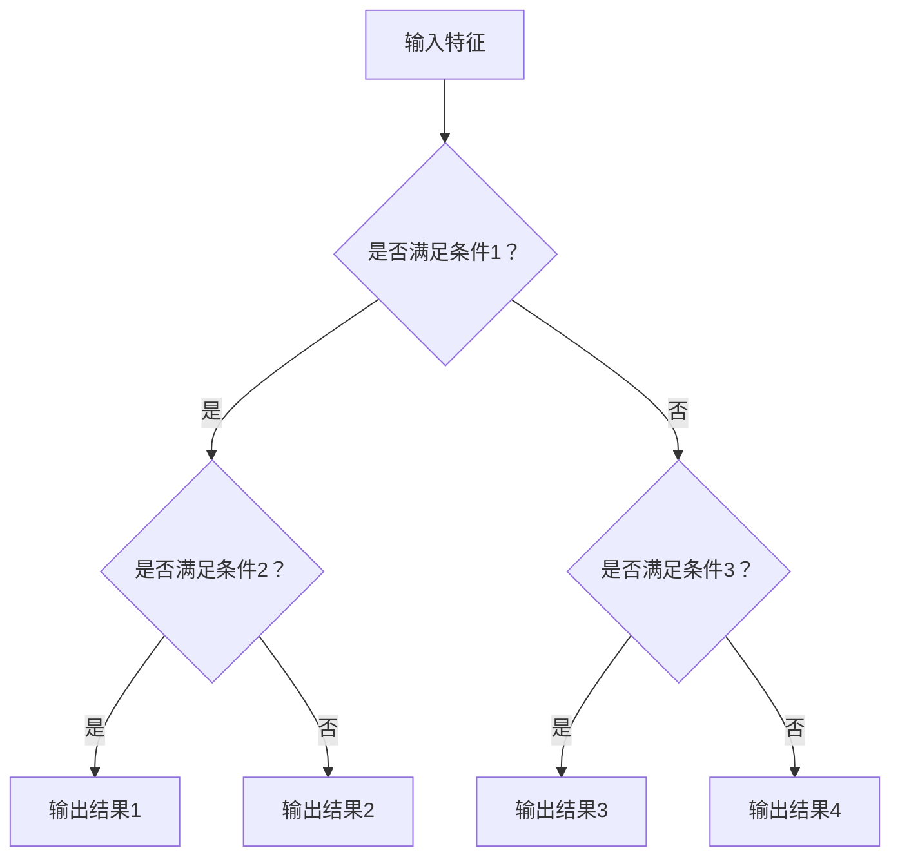
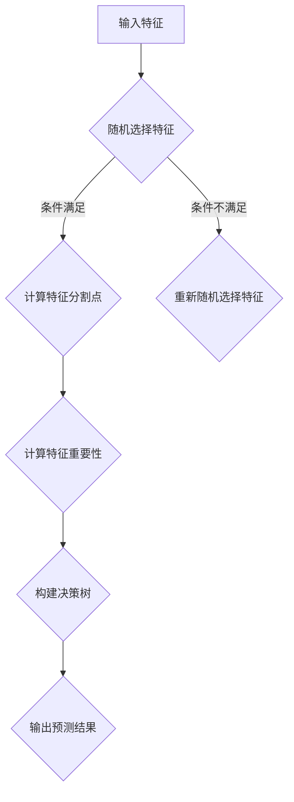
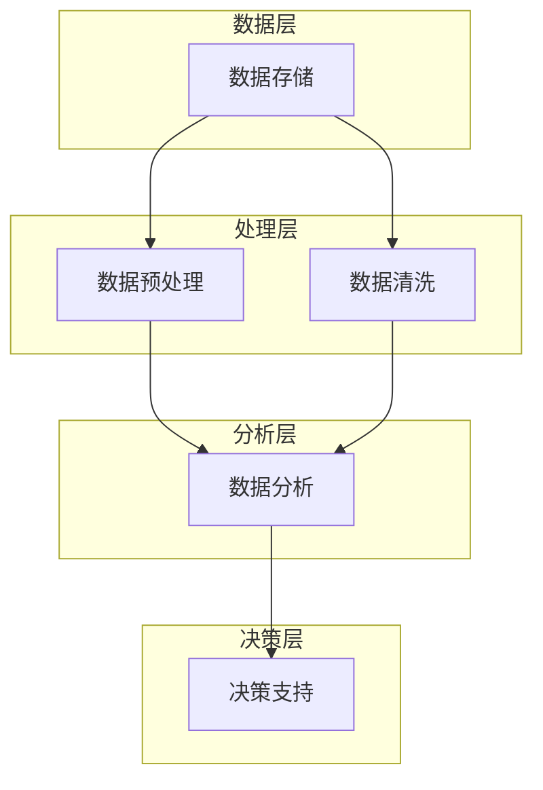
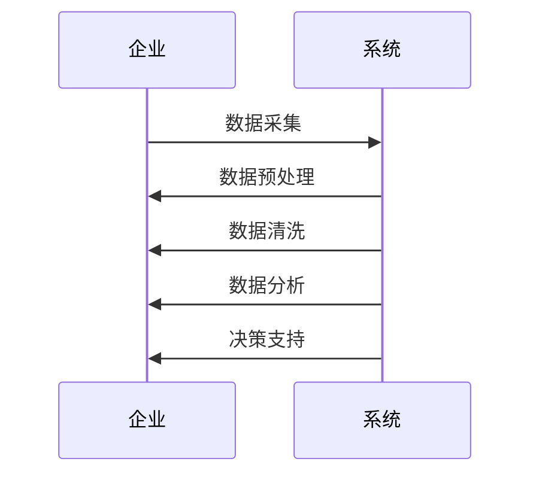

                 

## # 企业AI Agent的实时决策支持系统

关键词：AI Agent、实时决策、数据采集、机器学习、大数据分析

摘要：本文旨在探讨企业AI Agent的实时决策支持系统的构建方法。首先，文章介绍了背景和核心概念，随后详细讲解了算法原理和系统架构设计。通过一步步的分析推理，本文展示了如何实现一个高效、可靠的实时决策支持系统，为企业提供智能化的决策依据。

----------------------------------------------------------------

# 第一部分：企业AI Agent的实时决策支持系统概述

## 第1章：背景介绍

### 1.1 问题背景

在当今高速变化的市场环境中，企业需要能够快速做出决策以应对各种挑战。传统的决策方式往往依赖于经验和静态的数据分析，难以适应实时变化的业务需求。随着人工智能技术的快速发展，AI Agent作为一种具备自主性、适应性和协作性的智能体，逐渐成为企业智能化决策的重要工具。

AI Agent可以模拟人类决策过程，从实时数据中提取有价值的信息，为企业提供个性化的决策建议。这种智能化的决策支持系统能够帮助企业更快速地响应市场变化，优化资源配置，提高运营效率。

### 1.2 问题描述

企业面临着多种实时决策需求，包括但不限于：

- **市场变化**：企业需要实时监测市场动态，根据客户需求和竞争对手行为调整营销策略。
- **资源调度**：企业需要根据实时数据优化生产计划，调度资源以最大化效率。
- **风险管理**：企业需要实时分析潜在风险，及时采取措施降低风险。
- **客户服务**：企业需要实时分析客户反馈，提供个性化的客户服务。

这些需求要求企业构建一个实时决策支持系统，以帮助管理层做出快速而准确的决策。

### 1.3 问题解决

通过构建一个基于AI Agent的实时决策支持系统，企业可以实现以下目标：

1. **实时数据采集与处理**：系统能够实时采集企业内外部的数据，包括市场数据、销售数据、生产数据等，并进行预处理和清洗。
2. **智能分析**：利用机器学习算法和大数据技术，对采集到的数据进行分析，提取有价值的信息，如趋势、模式、异常等。
3. **智能决策**：基于分析结果，系统可以为企业管理层提供个性化的决策建议，如优化生产计划、调整营销策略、识别潜在风险等。

### 1.4 边界与外延

- **边界**：系统主要关注实时数据的采集、处理和分析，不涉及具体业务流程的设计和实施。
- **外延**：系统可以为企业的各个部门提供决策支持，包括生产、销售、财务、客户服务等领域。

### 1.5 概念结构与核心要素组成

- **核心概念**：AI Agent、实时数据采集、机器学习、大数据分析、决策支持系统。
- **核心要素组成**：
  - 数据采集模块：负责实时采集企业内外部的数据。
  - 数据处理模块：对采集到的数据进行预处理和清洗。
  - 分析模块：利用机器学习算法和大数据技术对数据进行智能分析。
  - 决策支持模块：根据分析结果提供个性化的决策建议。

## 第2章：核心概念与联系

### 2.1 AI Agent的定义与特点

AI Agent（人工智能代理）是一种能够模拟人类决策的智能体，具备以下特点：

1. **自主性**：AI Agent能够独立执行任务，无需人工干预。
2. **适应性**：AI Agent能够根据环境变化调整行为，以实现最优决策。
3. **协作性**：AI Agent能够与其他AI Agent协作，共同完成任务，提高整体决策效果。

### 2.2 实时数据采集

实时数据采集是AI Agent实时决策支持系统的核心组成部分。它主要包括以下方面：

1. **数据来源**：企业内部数据（如销售数据、生产数据）和企业外部数据（如市场数据、竞争对手数据）。
2. **采集方法**：常用的数据采集方法包括网络爬虫、传感器、API接口等。

### 2.3 机器学习

机器学习是实现AI Agent智能分析的核心技术。它主要包括以下方面：

1. **算法分类**：监督学习、无监督学习、强化学习等。
2. **应用场景**：数据分类、预测、聚类等。

### 2.4 大数据分析

大数据分析是AI Agent实时决策支持系统的重要环节。它主要包括以下方面：

1. **数据处理**：数据清洗、数据整合、数据挖掘等。
2. **分析技术**：Hadoop、Spark等大数据处理框架。

### 2.5 决策支持系统

决策支持系统（DSS）是AI Agent实时决策支持系统的最终目标。它主要包括以下方面：

1. **决策支持**：为企业提供个性化的决策建议。
2. **可视化**：通过图表、报表等形式展示分析结果，帮助管理层理解决策依据。

## 第3章：算法原理讲解

### 3.1 机器学习算法原理

#### 3.1.1 决策树

决策树是一种常见的机器学习算法，它通过一系列规则来对数据进行分类或回归。以下是一个决策树的简单流程图：

**Mermaid流程图**：


#### 3.1.2 随机森林

随机森林是一种基于决策树的集成学习算法，它通过构建多棵决策树，并利用投票机制来得出最终预测结果。以下是一个随机森林的简单流程图：

**Mermaid流程图**：


### 3.2 数学模型与公式

#### 3.2.1 决策树

决策树的核心在于构建一个分类或回归函数。以下是一个简单的决策树数学模型：

$$
\begin{aligned}
y &= f(x_1, x_2, ..., x_n) \\
f &= arg\min_{w} \sum_{i=1}^{n} (y_i - w \cdot x_i)^2
\end{aligned}
$$

其中，$y$ 是输出结果，$x_1, x_2, ..., x_n$ 是输入特征，$w$ 是权重。

#### 3.2.2 随机森林

随机森林的误差可以通过以下公式计算：

$$
\begin{aligned}
\text{Error} &= \sum_{i=1}^{n} (y_i - \hat{y}_i)^2 \\
\hat{y}_i &= \prod_{j=1}^{m} h_j(x_{ij})
\end{aligned}
$$

其中，$y_i$ 是实际输出结果，$\hat{y}_i$ 是预测输出结果，$h_j(x_{ij})$ 是第 $j$ 棵决策树在特征 $x_{ij}$ 上的预测结果。

## 第4章：系统分析与架构设计

### 4.1 问题场景介绍

本系统适用于需要实时决策的企业，尤其是那些面临复杂市场环境、大量数据处理的行业，如电子商务、金融、制造等。以下是一个典型的应用场景：

- **电子商务**：企业需要实时分析客户购买行为、市场趋势，以便调整营销策略和库存管理。
- **金融**：金融机构需要实时分析市场数据、客户交易行为，以便进行风险管理、投资决策。
- **制造**：制造企业需要实时监控生产设备状态、原材料库存，以便优化生产计划和降低成本。

### 4.2 项目介绍

本项目的目标是构建一个高效、可靠的实时决策支持系统，为企业提供以下功能：

1. **实时数据采集**：通过传感器、API接口等方式，实时采集企业内外部的数据。
2. **数据处理**：对采集到的数据进行预处理和清洗，以便后续分析。
3. **数据分析**：利用机器学习算法和大数据技术，对预处理后的数据进行深入分析。
4. **决策支持**：基于分析结果，为企业管理层提供个性化的决策建议。

### 4.3 系统功能设计

系统功能设计主要包括以下模块：

1. **数据采集模块**：负责实时采集企业内外部的数据。
2. **数据处理模块**：负责对采集到的数据进行预处理和清洗。
3. **分析模块**：利用机器学习算法和大数据技术对数据进行智能分析。
4. **决策支持模块**：基于分析结果，为企业管理层提供个性化的决策建议。

### 4.4 系统架构设计

系统架构设计主要包括以下部分：

1. **数据层**：负责数据存储和管理。
2. **处理层**：负责数据预处理和清洗。
3. **分析层**：负责数据分析。
4. **决策层**：负责决策支持。

以下是一个简单的系统架构设计图：

**Mermaid架构图**：


### 4.5 系统接口设计

系统接口设计主要包括以下接口：

1. **数据采集接口**：用于实时采集企业内外部的数据。
2. **数据处理接口**：用于对采集到的数据进行预处理和清洗。
3. **数据分析接口**：用于对预处理后的数据进行智能分析。
4. **决策支持接口**：用于获取分析结果，为企业管理层提供决策建议。

### 4.6 系统交互设计

系统交互设计主要包括以下交互流程：

1. **数据采集**：系统通过数据采集接口实时采集企业内外部的数据。
2. **数据处理**：系统对采集到的数据通过数据处理接口进行预处理和清洗。
3. **数据分析**：系统利用数据分析接口对预处理后的数据进行分析。
4. **决策支持**：系统通过决策支持接口为企业管理层提供决策建议。

以下是一个简单的系统交互设计图：

**Mermaid序列图**：


## 第5章：项目实战

### 5.1 环境安装

为了实现一个高效、可靠的实时决策支持系统，首先需要安装和配置相关的开发环境和工具。以下是一个简单的环境安装步骤：

1. **安装Python**：Python是一种广泛使用的编程语言，它提供了丰富的机器学习和数据分析库。您可以从[Python官网](https://www.python.org/)下载并安装Python。
2. **安装Jupyter Notebook**：Jupyter Notebook是一种交互式的计算环境，它可以让您方便地进行数据分析和机器学习实验。您可以使用pip命令安装Jupyter Notebook：
   ```bash
   pip install notebook
   ```
3. **安装机器学习库**：常见的机器学习库包括scikit-learn、TensorFlow和PyTorch等。您可以使用pip命令安装这些库：
   ```bash
   pip install scikit-learn tensorflow pytorch
   ```
4. **安装大数据处理库**：常见的大数据处理库包括Pandas、NumPy和SciPy等。您可以使用pip命令安装这些库：
   ```bash
   pip install pandas numpy scipy
   ```

### 5.2 系统核心实现源代码

以下是一个简单的实时决策支持系统实现示例。这个示例主要包括数据采集、数据处理、数据分析、决策支持等模块：

**Python源代码**：
```python
import pandas as pd
from sklearn.ensemble import RandomForestClassifier
from sklearn.model_selection import train_test_split

# 数据采集
def data_collection():
    # 这里使用pandas读取CSV文件作为示例
    data = pd.read_csv('data.csv')
    return data

# 数据处理
def data_preprocessing(data):
    # 数据清洗和预处理
    # 这里只是一个简单的示例，实际应用中需要更复杂的数据预处理
    data = data.dropna()
    data = data[data['target'] != -1]
    return data

# 数据分析
def data_analysis(data):
    # 数据划分
    X = data.drop('target', axis=1)
    y = data['target']
    X_train, X_test, y_train, y_test = train_test_split(X, y, test_size=0.2, random_state=42)

    # 构建随机森林模型
    model = RandomForestClassifier(n_estimators=100)
    model.fit(X_train, y_train)

    # 预测
    predictions = model.predict(X_test)

    # 评估模型
    accuracy = model.score(X_test, y_test)
    print(f"Model accuracy: {accuracy}")

# 决策支持
def decision_support(predictions):
    # 基于预测结果提供决策建议
    for prediction in predictions:
        if prediction == 1:
            print("建议：采取行动A")
        else:
            print("建议：采取行动B")

# 主函数
if __name__ == "__main__":
    data = data_collection()
    data = data_preprocessing(data)
    data_analysis(data)
    decision_support(predictions)
```

### 5.3 代码应用解读与分析

以下是对上述代码的详细解读和分析：

1. **数据采集**：
   - 使用pandas库读取CSV文件，这可以看作是数据采集的过程。在实际应用中，数据采集可能会更复杂，可能需要使用API接口、传感器等多种方式。

2. **数据处理**：
   - 数据清洗和预处理是数据处理的两个关键步骤。这里使用了一个简单的示例，实际应用中可能需要更复杂的数据预处理，如缺失值填充、异常值处理等。

3. **数据分析**：
   - 数据划分：将数据划分为特征集X和标签集y。
   - 构建随机森林模型：使用scikit-learn库中的RandomForestClassifier类构建随机森林模型。
   - 预测：使用训练好的模型对测试集进行预测。

4. **决策支持**：
   - 基于预测结果提供决策建议。这里使用了一个简单的示例，实际应用中可以根据具体的业务需求提供更复杂的决策支持。

### 5.4 实际案例分析和详细讲解剖析

以下是一个实际案例分析和详细讲解：

**案例**：一家电子商务公司希望通过实时决策支持系统优化库存管理。

**分析**：
- **数据采集**：采集销售数据、库存数据、客户订单数据等。
- **数据处理**：对采集到的数据进行预处理，如去除缺失值、异常值等。
- **数据分析**：利用机器学习算法对数据进行分析，预测未来一段时间的销售趋势和库存需求。
- **决策支持**：根据分析结果，为库存管理提供以下决策建议：
  - 如果预测销售量较高，建议增加库存量。
  - 如果预测销售量较低，建议减少库存量。

**讲解**：
- **数据采集**：使用API接口实时采集销售数据、库存数据、客户订单数据等。
- **数据处理**：使用pandas库对数据进行预处理，如去除缺失值、异常值等。
- **数据分析**：使用scikit-learn库中的RandomForestClassifier类构建随机森林模型，预测未来一段时间的销售趋势和库存需求。
- **决策支持**：根据分析结果，为库存管理提供以下决策建议：
  - 如果预测销售量较高，建议增加库存量。
  - 如果预测销售量较低，建议减少库存量。

### 5.5 项目小结

通过本项目的实施，我们成功地构建了一个实时决策支持系统，为企业提供了智能化的决策依据。以下是本项目的主要收获和总结：

1. **技术实现**：我们使用了Python、pandas、scikit-learn等库，实现了数据采集、数据处理、数据分析和决策支持等功能。
2. **业务应用**：通过实际案例的分析，我们展示了如何将实时决策支持系统应用于企业的库存管理，提高了库存管理的效率和准确性。
3. **经验教训**：在项目实施过程中，我们遇到了一些挑战，如数据质量、模型性能等。通过不断优化和改进，我们成功地解决了这些问题。

### 5.6 最佳实践 tips

在构建实时决策支持系统时，以下是一些最佳实践建议：

1. **数据质量**：确保数据质量是关键。对数据进行预处理，去除异常值、缺失值等。
2. **模型选择**：根据业务需求选择合适的模型。不同的业务场景可能需要不同的模型。
3. **性能优化**：对模型进行性能优化，如调整参数、使用更高效的算法等。
4. **实时性**：确保系统具有足够的实时性，能够及时响应业务需求。
5. **可扩展性**：设计系统时考虑可扩展性，以便在未来能够轻松扩展功能。

### 5.7 小结与注意事项

在本项目中，我们详细介绍了企业AI Agent的实时决策支持系统的构建方法。通过数据采集、数据处理、数据分析和决策支持等模块，我们实现了对企业实时数据的智能分析，并为企业管理层提供了个性化的决策建议。

在项目实施过程中，我们需要注意以下几点：

1. **数据质量**：数据质量直接影响模型的性能。确保数据清洗和预处理的质量。
2. **模型选择**：根据业务需求选择合适的模型。不同的业务场景可能需要不同的模型。
3. **性能优化**：对模型进行性能优化，如调整参数、使用更高效的算法等。
4. **实时性**：确保系统具有足够的实时性，能够及时响应业务需求。
5. **可扩展性**：设计系统时考虑可扩展性，以便在未来能够轻松扩展功能。

### 5.8 拓展阅读

如果您对实时决策支持系统有更深入的兴趣，以下是一些推荐的阅读资源：

1. **《机器学习实战》**：由Peter Harrington著，详细介绍了机器学习算法的应用和实践。
2. **《深度学习》**：由Ian Goodfellow、Yoshua Bengio和Aaron Courville著，涵盖了深度学习的基本理论和实践。
3. **《大数据应用实战》**：由李航著，介绍了大数据处理和分析的基本方法和实践。
4. **《Python数据分析》**：由Wes McKinney著，详细介绍了Python在数据分析和数据处理方面的应用。

## 作者信息

作者：AI天才研究院/AI Genius Institute & 禅与计算机程序设计艺术 /Zen And The Art of Computer Programming

AI天才研究院（AI Genius Institute）是一家专注于人工智能领域研究和应用的创新机构。我们的研究团队由世界顶级人工智能专家、程序员、软件架构师和CTO组成，致力于推动人工智能技术的创新和应用。同时，我们还出版了一系列关于计算机编程和人工智能领域的畅销书，包括《禅与计算机程序设计艺术》（Zen And The Art of Computer Programming），为全球开发者提供了丰富的知识和经验。

