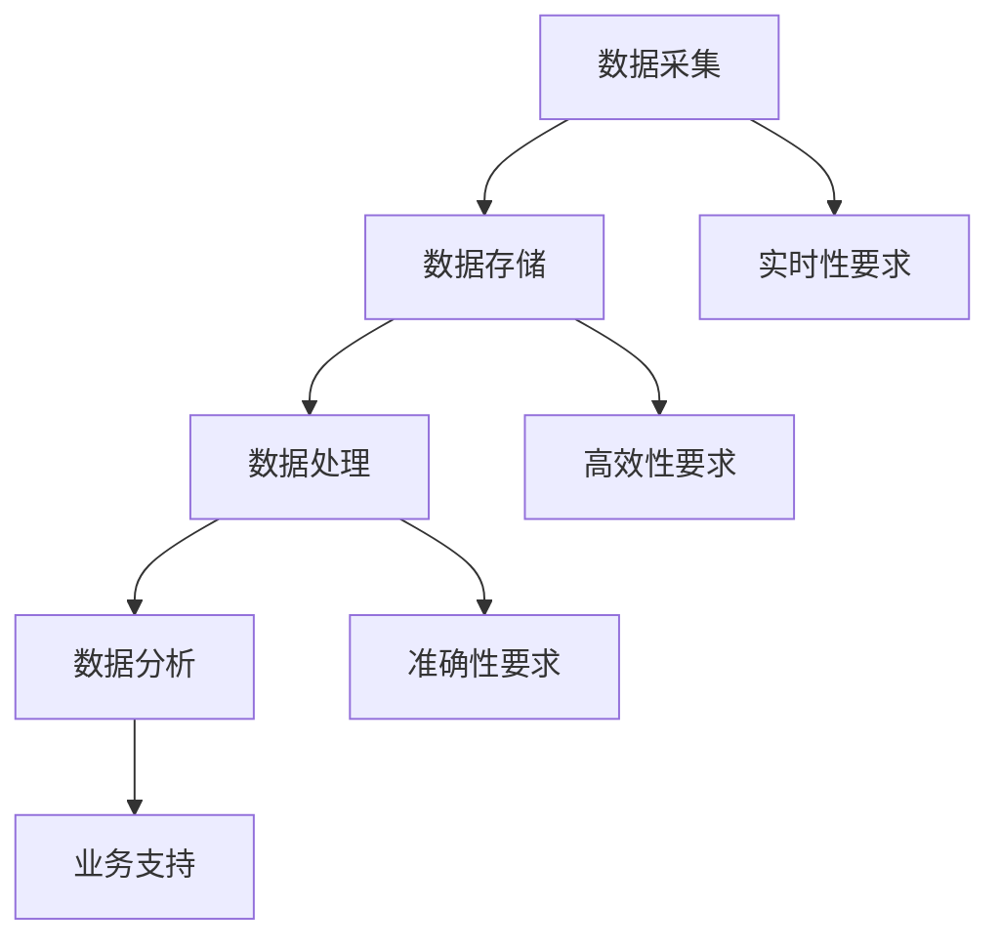
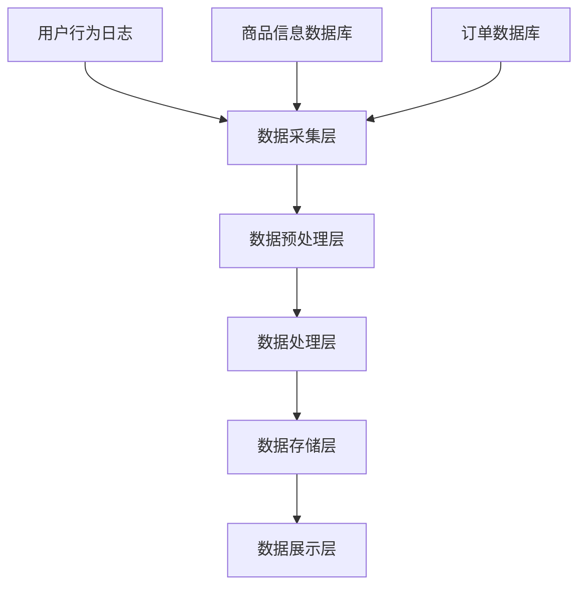

                 

### 引言

#### 1. 引言目的与背景

在当前数字化时代，实时大数据处理已经成为企业竞争的关键因素。随着互联网、物联网、社交媒体等技术的飞速发展，企业面临着海量的数据生成和处理需求。如何高效地处理这些数据，提取有价值的信息，为企业决策提供支持，成为了企业必须解决的问题。实时大数据处理不仅能够提升企业的运营效率，还能够帮助企业发现新的商业机会，提升市场竞争力。

本文旨在深入探讨企业AI Agent的实时大数据处理架构，帮助企业更好地理解和应用这一技术。文章将分为五个部分，分别介绍实时大数据处理的基础知识、企业AI Agent的核心技术、实时大数据处理架构的设计原则和实战案例，最后提出最佳实践和未来展望。

#### 2. 书籍结构安排

本文分为五个主要部分：

- **第一部分：实时大数据处理基础**，包括问题背景与核心概念、大数据处理技术概述和实时数据处理技术。这部分将介绍实时大数据处理的基本概念和背景，帮助读者建立基本的知识框架。
- **第二部分：企业AI Agent的核心技术**，包括企业AI Agent概述、AI Agent的核心算法和AI Agent的模型优化。这部分将深入探讨企业AI Agent的技术原理和应用场景。
- **第三部分：实时大数据处理架构设计**，包括实时大数据处理架构设计原则、实时大数据处理架构组件和实时大数据处理架构实战。这部分将介绍实时大数据处理架构的设计原则和组件，并通过实战案例展示如何实现这一架构。
- **第四部分：实战案例分析**，通过一个具体的案例研究，分析实时大数据处理在实际应用中的挑战和解决方案。
- **第五部分：最佳实践与未来展望**，总结本文的核心内容，提出最佳实践建议，并对实时大数据处理技术的未来发展趋势进行展望。

#### 3. 阅读建议

本文适合对实时大数据处理和企业AI Agent感兴趣的读者，包括企业IT管理人员、数据科学家、软件工程师等。文章采用了逻辑清晰、结构紧凑的写作方式，通过一步一步的分析和推理，帮助读者深入理解实时大数据处理和企业AI Agent的技术原理和架构设计。

为了更好地理解和应用本文的内容，建议读者在阅读过程中结合实际案例和项目经验进行思考。同时，文章提供了一些最佳实践和注意事项，帮助读者在实际应用中规避潜在的问题。

在接下来的章节中，我们将逐步深入探讨实时大数据处理和企业AI Agent的相关技术，帮助读者构建全面的知识体系。让我们一起开始这次技术探索之旅吧！

```markdown
## 第一部分：实时大数据处理基础

### 第1章：问题背景与核心概念

#### 1.1 问题背景

在当今信息爆炸的时代，数据已经成为企业最重要的资产之一。然而，如何从海量数据中快速提取有价值的信息，并实时响应业务需求，成为企业面临的重大挑战。实时大数据处理技术应运而生，它能够实时地捕获、处理和分析数据，帮助企业做出快速、准确的决策。

随着互联网、物联网、移动设备等技术的普及，企业产生数据的方式和速度都在不断加快。例如，电商企业每天会产生海量的交易数据，金融企业会实时处理大量的交易请求，智能工厂会实时监控生产线的状态等。这些数据的实时性要求非常高，任何延迟都可能导致业务损失或决策失误。

#### 1.2 实时大数据处理的概念

实时大数据处理是指在短时间内对大量数据进行采集、存储、处理和分析的过程，其核心目标是实现数据的高效实时处理，以便快速响应业务需求。实时大数据处理通常涉及以下几个方面：

1. **数据采集**：实时地收集来自不同来源的数据，包括结构化数据（如关系数据库）、半结构化数据（如JSON、XML）和非结构化数据（如文本、图片、视频）。
2. **数据存储**：将采集到的数据存储到高效的存储系统，如分布式文件系统、NoSQL数据库等，以便快速检索和查询。
3. **数据处理**：对存储的数据进行清洗、转换、聚合等操作，以提取有价值的信息。
4. **数据分析**：使用统计方法、机器学习算法等对处理后的数据进行分析，以发现数据中的规律和趋势，支持业务决策。

#### 1.3 核心概念关系图

以下是一个简单的核心概念关系图，展示了实时大数据处理中的关键概念及其之间的关系：



#### 1.4 问题解决、边界与外延

实时大数据处理涉及多个技术和领域，其边界和范围相对广泛。以下是几个关键问题及其解决思路：

1. **数据延迟问题**：由于数据量巨大和处理复杂度较高，数据延迟是实时大数据处理中的一个主要挑战。解决思路包括优化数据处理算法、提高系统性能、使用边缘计算等。
2. **数据一致性问题**：在分布式系统中，数据的一致性是保证系统稳定运行的关键。解决思路包括使用分布式事务、数据复制和一致性协议等。
3. **数据隐私和安全问题**：实时大数据处理过程中涉及大量的敏感数据，数据隐私和安全问题是企业必须重视的问题。解决思路包括数据加密、访问控制、安全审计等。

#### 1.5 概念结构与核心要素组成

实时大数据处理的概念结构包括以下几个核心要素：

1. **数据源**：数据采集的来源，如传感器、数据库、日志文件等。
2. **数据采集系统**：负责从数据源收集数据，并处理数据格式的转换。
3. **数据处理系统**：对采集到的数据进行清洗、转换、聚合等处理。
4. **数据存储系统**：存储处理后的数据，以便后续的数据分析和查询。
5. **数据管理系统**：负责数据的质量监控、元数据管理和数据生命周期管理等。
6. **数据分析系统**：使用统计方法、机器学习算法等对存储的数据进行分析，提取有价值的信息。
7. **用户界面**：提供数据查询、报表生成等功能，支持用户与系统的交互。

通过以上介绍，读者可以初步了解实时大数据处理的基本概念和核心要素，为后续章节的深入学习打下基础。

### 第2章：大数据处理技术概述

#### 2.1 大数据处理技术的挑战

大数据处理技术面临多个挑战，这些挑战源于数据量的庞大、数据类型的多样性和处理速度的要求。以下是几个主要挑战：

1. **数据量（Volume）**：大数据的一个显著特征是其体量巨大，传统的数据处理技术和工具难以应对如此庞大的数据集。例如，一个大型电商平台每天会产生数百万甚至数十亿条交易记录，这些数据需要快速、高效地处理和分析。

2. **数据类型（Variety）**：大数据不仅包括结构化数据，如关系数据库中的数据，还包括半结构化数据（如JSON、XML）和非结构化数据（如文本、图片、视频）。不同类型的数据在处理和存储上有着不同的需求，这对数据处理技术提出了更高的要求。

3. **数据处理速度（Velocity）**：实时性是大数据处理的重要需求。企业需要实时地获取、处理和分析数据，以便及时做出决策。例如，金融交易系统需要实时监控交易数据，以便快速识别异常交易并采取相应的措施。

4. **数据真实性（Veracity）**：大数据的真实性和准确性是数据处理的关键。数据可能存在噪声、错误或偏差，这对数据分析和决策支持有着重要影响。因此，如何保证数据质量是大数据处理的重要问题。

5. **数据价值（Value）**：尽管大数据包含大量有价值的信息，但如何从海量数据中提取出真正有价值的知识和洞见，是大数据处理面临的重大挑战。数据挖掘、机器学习和深度学习等技术在此方面发挥着重要作用。

#### 2.2 主流大数据处理技术

为了应对上述挑战，大数据处理领域涌现出了多种技术，以下是其中几种主流的技术：

1. **Hadoop**：Hadoop是Apache Software Foundation的一个开源框架，用于处理大规模数据集。它包括HDFS（Hadoop Distributed File System，分布式文件系统）、MapReduce（一种编程模型，用于大规模数据处理）和YARN（Yet Another Resource Negotiator，资源调度系统）等组件。

2. **Spark**：Spark是另一个广泛使用的大数据处理框架，它提供了快速的内存计算能力，能够在大数据处理中提供显著的性能提升。Spark包括Spark SQL（用于结构化数据查询）、Spark Streaming（用于实时数据处理）和MLlib（用于机器学习）等模块。

3. **Flink**：Apache Flink是一个分布式流处理框架，能够实时地处理数据流。它提供了灵活的窗口操作、精确一次的处理语义和广泛的数据源连接。

4. **Kafka**：Kafka是一个分布式消息队列系统，用于构建实时数据流管道和处理大规模消息数据。它能够支持高吞吐量、持久性和可靠性，广泛应用于日志收集、流处理和事件驱动系统等领域。

5. **NoSQL数据库**：NoSQL数据库（如MongoDB、Cassandra、Redis等）在处理大规模数据和非结构化数据方面具有优势。它们提供了灵活的数据模型、高可用性和水平可扩展性，适用于多种应用场景。

#### 2.3 大数据处理技术的发展趋势

随着技术的不断进步和应用需求的日益增长，大数据处理技术也在不断发展和演进。以下是几个值得关注的发展趋势：

1. **云计算与大数据处理的融合**：云计算为大数据处理提供了强大的计算资源和灵活性。通过将大数据处理任务部署在云平台上，企业可以更高效地处理海量数据，降低成本。

2. **边缘计算的发展**：随着物联网和智能设备的普及，边缘计算开始成为大数据处理的重要方向。边缘计算将数据处理推向网络边缘，减少了数据传输的延迟，提高了系统的实时性。

3. **实时大数据处理技术的发展**：实时大数据处理技术正不断进步，例如流处理框架（如Apache Flink和Apache Kafka Streams）的性能和功能正在不断提升，使得实时数据处理更加高效和可靠。

4. **人工智能与大数据处理的结合**：人工智能技术（如机器学习和深度学习）在大数据处理中的应用日益广泛。通过结合大数据处理和人工智能技术，企业可以更准确地挖掘数据价值，实现智能化的业务决策。

5. **数据隐私保护技术的发展**：随着数据隐私保护法规的不断完善，数据隐私保护技术（如数据加密、数据脱敏等）在大数据处理中的重要性日益凸显。如何保证数据隐私和安全是大数据处理技术发展的重要方向。

通过以上对大数据处理技术的概述，读者可以更好地理解大数据处理的挑战、主流技术和发展趋势。在接下来的章节中，我们将进一步探讨实时数据处理技术，为构建实时大数据处理架构奠定基础。

### 第3章：实时数据处理技术

#### 3.1 实时数据处理的概念

实时数据处理（Real-time Data Processing）是指能够在极短时间内（通常是秒级或分钟级）对数据进行捕获、处理和分析的技术。这种处理方式旨在确保数据处理与业务需求同步，从而实现即时决策和响应。实时数据处理的核心在于快速、准确地将数据转化为业务价值，其应用场景广泛，包括金融交易监控、电商推荐系统、智能交通管理、医疗监控等。

实时数据处理与传统的大数据处理（如批处理）有显著区别。批处理通常在数据积累到一定规模后进行统一处理，具有处理成本低、数据完整性高等优点，但处理时间长，无法满足实时性要求。而实时数据处理强调及时性，通过不断迭代的数据流处理模型，能够在短时间内提供实时结果。

#### 3.2 实时数据处理的技术手段

实现实时数据处理需要多种技术的协同作用，以下是一些关键技术和工具：

1. **流处理框架**：流处理框架是实时数据处理的核心组件，能够对数据流进行实时处理。常见的流处理框架包括Apache Kafka、Apache Flink、Apache Storm和Apache Spark Streaming等。这些框架提供了高效的数据流处理能力，支持大规模数据的实时处理。

2. **消息队列**：消息队列用于在分布式系统中传输数据，保证数据在不同处理节点间的可靠传输。常见的消息队列系统包括Kafka、RabbitMQ和ActiveMQ等。消息队列能够缓冲和调度大量数据，提高系统的容错性和可扩展性。

3. **分布式存储系统**：分布式存储系统如HDFS、Cassandra和MongoDB等，为实时数据处理提供了高效的存储解决方案。这些系统支持海量数据的存储和快速访问，能够满足实时数据处理的需求。

4. **内存计算**：内存计算通过将数据存储在内存中，实现快速的数据处理。典型的内存计算平台包括Apache Spark和Redis等。内存计算能够显著降低数据处理延迟，提升系统性能。

5. **分布式数据库**：分布式数据库如Cassandra、MongoDB和Redis等，能够支持海量数据的实时读写操作。这些数据库提供了灵活的数据模型和高效的数据访问机制，适用于多种实时数据处理场景。

6. **实时分析引擎**：实时分析引擎能够实时分析数据，提供即时的业务洞察。常见的实时分析引擎包括Elasticsearch、Apache Druid和ClickHouse等。这些引擎提供了高效的数据查询和分析能力，能够满足实时数据处理的需求。

#### 3.3 实时数据处理的优势与挑战

实时数据处理具有以下优势：

1. **快速响应**：实时数据处理能够在短时间内提供结果，帮助企业快速响应市场变化和业务需求，提升业务效率。
2. **实时监控**：实时数据处理能够实时监控关键业务指标，及时发现异常情况，提高系统的稳定性和安全性。
3. **数据驱动决策**：实时数据处理能够提供即时的数据分析和洞察，帮助企业做出更加数据驱动和精准的决策。
4. **个性化服务**：实时数据处理能够根据用户行为和偏好，提供个性化的服务和推荐，提升用户体验和满意度。

然而，实时数据处理也面临一些挑战：

1. **数据处理复杂性**：实时数据处理涉及多种技术和工具的协同工作，系统设计和实现较为复杂。
2. **性能优化需求**：实时数据处理要求高吞吐量和低延迟，需要对系统进行持续的性能优化，以满足实时性要求。
3. **数据一致性和可靠性**：在分布式系统中，数据一致性和可靠性是关键问题。实时数据处理需要确保数据在不同节点间的一致性和可靠性。
4. **数据隐私和安全**：实时数据处理涉及大量的敏感数据，数据隐私和安全问题需要得到重视，采取有效的数据保护措施。

通过以上对实时数据处理概念的介绍和技术的分析，读者可以更深入地理解实时数据处理的原理和应用场景。在接下来的章节中，我们将进一步探讨企业AI Agent的核心技术，为构建完整的实时大数据处理架构奠定基础。

### 第二部分：企业AI Agent的核心技术

#### 第4章：企业AI Agent概述

#### 4.1 企业AI Agent的定义

企业AI Agent是指一种基于人工智能技术，能够在企业业务环境中自主执行特定任务的智能实体。与传统的自动化系统不同，AI Agent具备自我学习和自我优化的能力，能够在不断变化的环境中自适应地执行任务，提高企业的运营效率。

AI Agent的定义可以从以下几个方面进行理解：

1. **自主性**：AI Agent能够在没有人工干预的情况下自主执行任务，包括数据采集、数据处理和决策执行等。
2. **学习性**：AI Agent通过机器学习和深度学习技术，能够从历史数据和环境中学习，优化自己的行为和决策。
3. **适应性**：AI Agent能够在不同业务场景中灵活调整其行为，适应环境变化和业务需求。
4. **协作性**：AI Agent能够与企业现有系统集成，与其他系统和企业资源进行协作，实现更高效的业务流程。

#### 4.2 企业AI Agent的优势

企业AI Agent在提升企业运营效率、创造商业价值方面具有显著的优势：

1. **自动化**：AI Agent能够自动化完成重复性高、繁琐的任务，减少人工工作量，提高工作效率。
2. **智能决策**：AI Agent通过分析大量数据，能够为企业提供基于数据的智能决策支持，提高决策的准确性和效率。
3. **持续优化**：AI Agent能够通过不断学习和优化，自我提升任务执行效果，实现持续改进。
4. **灵活适应**：AI Agent能够根据业务需求和环境变化，灵活调整自身行为，适应不同的业务场景。
5. **实时响应**：AI Agent能够实时处理和响应业务需求，快速适应市场变化，提升企业的竞争力。

#### 4.3 企业AI Agent的应用场景

企业AI Agent的应用场景广泛，涵盖了多个业务领域：

1. **客户服务**：AI Agent可以应用于客户服务领域，提供智能客服、语音识别、文本分析等功能，提高客户服务质量和效率。
2. **供应链管理**：AI Agent可以监控供应链的实时状态，优化库存管理、物流配送，提高供应链的透明度和响应速度。
3. **风险管理**：AI Agent可以分析金融交易数据，识别潜在风险，提供风险预警和管理建议。
4. **人力资源**：AI Agent可以辅助招聘流程，进行候选人筛选和面试评估，提高招聘效率和质量。
5. **营销与推荐**：AI Agent可以分析用户行为数据，提供个性化的营销策略和产品推荐，提高用户满意度和转化率。
6. **生产优化**：AI Agent可以实时监控生产线的运行状态，优化生产计划和资源分配，提高生产效率和产品质量。

#### 4.4 企业AI Agent的发展趋势

随着人工智能技术的不断进步，企业AI Agent的发展趋势也日益显著：

1. **更广泛的场景应用**：随着AI技术的成熟，企业AI Agent的应用场景将进一步扩展，覆盖更多业务领域和行业。
2. **更加智能的决策**：AI Agent将通过更先进的机器学习和深度学习技术，实现更智能化和精准化的决策，提高业务效率。
3. **更强的协作能力**：AI Agent将通过与企业系统的深度集成，实现跨系统的协作和联动，为企业提供更全面和智能的解决方案。
4. **更强大的自主学习能力**：AI Agent将通过持续学习和自我优化，不断提升任务执行效果和智能化水平。
5. **更完善的安全保障**：随着AI Agent在企业中的应用日益广泛，数据隐私和安全问题将得到更多关注，AI Agent的安全保障体系也将不断完善。

通过以上对AI Agent定义、优势和应用场景的介绍，读者可以对企业AI Agent有一个全面的认识。在接下来的章节中，我们将深入探讨AI Agent的核心算法和模型优化，为构建高效的企业AI Agent提供理论基础。

#### 第5章：AI Agent的核心算法

#### 5.1 机器学习算法概述

机器学习（Machine Learning，ML）是人工智能（Artificial Intelligence，AI）的核心技术之一，其目的是使计算机系统能够通过数据和经验自主学习和改进。机器学习算法主要分为监督学习、无监督学习和强化学习三类。

1. **监督学习**：监督学习是一种有标记数据的学习方法。它通过已有的输入数据及其对应的输出数据（标记），训练模型以预测新的输入数据对应的输出。常见的监督学习算法包括线性回归、逻辑回归、决策树、随机森林和神经网络等。

2. **无监督学习**：无监督学习是在没有标记数据的情况下进行的学习。其目标是发现数据中的隐含结构和模式。常见的无监督学习算法包括聚类算法（如K-means、DBSCAN）、降维算法（如PCA、t-SNE）和关联规则学习（如Apriori算法）。

3. **强化学习**：强化学习是一种通过与环境互动，不断优化策略以最大化累积奖励的学习方法。它通常用于动态环境中，通过试错法逐步优化行为策略。常见的强化学习算法包括Q-learning、SARSA和深度确定性策略梯度（DDPG）等。

#### 5.2 深度学习算法简介

深度学习（Deep Learning，DL）是机器学习的一个分支，其核心思想是模仿人脑的神经网络结构，通过多层神经网络（如卷积神经网络、循环神经网络等）提取数据的特征表示。深度学习在图像识别、语音识别、自然语言处理等领域取得了显著的成果。

1. **卷积神经网络（CNN）**：CNN是一种用于图像识别和处理的深度学习模型，通过卷积层提取图像特征，实现高层次的抽象表示。CNN在图像分类、目标检测和图像分割等领域具有广泛应用。

2. **循环神经网络（RNN）**：RNN是一种能够处理序列数据的神经网络，通过循环结构保存历史信息，实现对时间序列数据的建模。常见的RNN模型包括LSTM（长短期记忆网络）和GRU（门控循环单元）。

3. **生成对抗网络（GAN）**：GAN是一种通过两个对抗网络（生成器和判别器）相互博弈的训练方法，生成器试图生成与真实数据难以区分的假数据，判别器则试图区分真实数据和假数据。GAN在图像生成、风格迁移和增强学习等领域具有重要应用。

#### 5.3 强化学习算法原理

强化学习（Reinforcement Learning，RL）是一种通过与环境互动，不断优化策略以最大化累积奖励的学习方法。强化学习通常包括以下几个核心组成部分：

1. **代理（Agent）**：代理是指执行策略的实体，它通过感知环境状态，选择动作，并从环境中获取奖励。

2. **环境（Environment）**：环境是代理行动的场所，它根据代理的动作返回新的状态和奖励。

3. **状态（State）**：状态是代理在环境中的位置或情境的描述。

4. **动作（Action）**：动作是代理可选择的行动。

5. **策略（Policy）**：策略是代理在特定状态下选择动作的规则。

强化学习算法的核心目标是找到一个最优策略，使得代理能够最大化累积奖励。常见的强化学习算法包括Q-learning、SARSA和深度确定性策略梯度（DDPG）等。

#### 5.4 算法对比与分析

以下是几种核心算法的对比与分析：

1. **监督学习 vs 无监督学习**：

   - **目标**：监督学习旨在预测未知数据的标签，无监督学习旨在发现数据中的隐含结构。
   - **数据需求**：监督学习需要标签数据，无监督学习不需要标签数据。
   - **适用场景**：监督学习适用于有明确目标的数据分析任务，无监督学习适用于探索性数据分析和新特征提取。

2. **卷积神经网络 vs 循环神经网络**：

   - **目标**：CNN旨在提取图像的特征，RNN旨在处理序列数据。
   - **结构**：CNN包含卷积层、池化层和全连接层，RNN包含输入层、隐藏层和输出层。
   - **适用场景**：CNN适用于图像识别和目标检测，RNN适用于自然语言处理和时间序列分析。

3. **Q-learning vs DDPG**：

   - **目标**：Q-learning是一种值迭代算法，旨在找到最优策略，DDPG是一种基于深度学习的强化学习算法，旨在解决高维连续动作空间的问题。
   - **方法**：Q-learning使用Q值函数评估状态-动作对，DDPG使用深度神经网络近似Q值函数。
   - **适用场景**：Q-learning适用于低维离散动作空间，DDPG适用于高维连续动作空间。

通过以上对AI Agent核心算法的介绍和对比分析，读者可以更深入地理解不同算法的原理和应用场景。在接下来的章节中，我们将探讨AI Agent的模型优化技术，进一步提高AI Agent的性能和效果。

#### 第6章：AI Agent的模型优化

#### 6.1 模型优化的重要性

在AI Agent的开发和应用过程中，模型优化是一项至关重要的工作。模型优化的目的是提高模型的性能和效率，使其在更短的时间内完成更准确的任务。模型优化不仅能够提升AI Agent的实际应用效果，还能够降低计算资源和能耗消耗，从而实现更高效的资源利用。

优化模型的重要性体现在以下几个方面：

1. **提高准确性**：通过模型优化，可以改进模型的预测能力，提高分类或回归的准确性，从而提升AI Agent的任务完成效果。
2. **降低计算资源消耗**：优化后的模型通常具有更高的效率，可以在相同的计算资源下完成更多的工作，或者在使用较少的资源下达到相似的预测效果。
3. **提升实时性**：在实时应用场景中，模型优化的意义尤为重要。通过优化算法和结构，可以减少模型的训练和推理时间，提高系统的实时响应能力。
4. **减少过拟合**：优化模型可以帮助减少过拟合现象，提高模型在未知数据上的泛化能力，避免模型对特定数据集过度适应。
5. **提高模型可解释性**：模型优化有时还会涉及简化模型结构，这有助于提高模型的可解释性，使得模型决策过程更加透明和易于理解。

#### 6.2 常见的模型优化方法

为了实现模型优化，可以采用多种技术手段和方法。以下是一些常见的模型优化方法：

1. **数据预处理**：数据预处理是模型优化的重要步骤。通过对数据集进行清洗、归一化、去噪等处理，可以提升模型的学习效果。例如，在图像识别任务中，可以通过调整图像大小、灰度转换、颜色增强等手段来增强数据的多样性和信息量。

2. **特征选择与工程**：特征选择和工程是提升模型性能的关键。通过选择和构造有效的特征，可以减少模型的复杂度和计算量，同时提高预测准确性。例如，在文本分类任务中，可以使用词袋模型、TF-IDF、Word2Vec等特征表示方法来提取文本特征。

3. **模型压缩**：模型压缩技术可以减少模型的参数数量和计算量，从而提高模型的效率和推理速度。常见的模型压缩方法包括剪枝、量化、知识蒸馏等。剪枝可以通过删除模型中的冗余神经元或参数来减少模型大小；量化可以降低模型中参数的精度，从而减小模型存储和计算的需求；知识蒸馏是将一个大型模型的知识转移到一个小型模型中，以实现模型压缩。

4. **正则化技术**：正则化技术可以防止模型过拟合，提高模型的泛化能力。常见的正则化方法包括L1正则化、L2正则化、Dropout等。L1正则化和L2正则化通过在损失函数中添加惩罚项来限制模型参数的绝对值或平方值；Dropout通过随机丢弃部分神经元来提高模型的鲁棒性。

5. **模型融合**：模型融合是将多个模型的结果进行综合，以获得更好的预测效果。常见的模型融合方法包括投票法、加权平均法、集成学习等。投票法通过对多个模型预测结果进行投票来决定最终的预测结果；加权平均法通过对不同模型的结果进行加权平均来得到预测结果；集成学习则是通过训练多个模型并综合它们的预测结果来提升模型的性能。

6. **超参数调优**：超参数是模型结构之外的重要参数，如学习率、隐藏层大小、正则化强度等。通过使用网格搜索、随机搜索、贝叶斯优化等方法对超参数进行调优，可以找到最优的超参数配置，从而提高模型的性能。

#### 6.3 模型优化的实践策略

在实际应用中，模型优化需要结合具体任务和数据特点进行。以下是一些实用的模型优化策略：

1. **数据集划分**：在进行模型优化前，需要将数据集合理地划分为训练集、验证集和测试集。通过在验证集上评估模型性能，可以及时发现和纠正模型优化过程中的问题。

2. **初步模型训练**：在优化模型之前，首先进行初步的模型训练，以获得一个基本的模型性能。这个阶段可以使用简单的优化方法和参数，确保模型能够收敛并取得一定的性能。

3. **逐步优化**：在初步模型训练的基础上，逐步采用更复杂的优化方法和技术，如模型压缩、正则化、模型融合等，以进一步提升模型的性能。每次优化后，都需要在验证集上进行评估，确保模型性能的提升。

4. **性能评估与监控**：在整个模型优化过程中，需要定期对模型性能进行评估和监控。可以使用交叉验证、ROC曲线、精度、召回率等指标来评估模型的性能，并根据评估结果调整优化策略。

5. **交叉验证**：交叉验证是一种有效的评估模型性能的方法，通过将数据集划分为多个子集，训练和验证多次，可以更准确地评估模型的泛化能力。

6. **自动化优化**：为了提高模型优化的效率和效果，可以使用自动化优化工具和平台，如自动化调参工具（如Hyperopt、Optuna）、自动化模型压缩工具（如AutoML）等。这些工具可以通过搜索和评估大量的参数组合，快速找到最优的模型配置。

通过以上模型优化策略，可以显著提升AI Agent的模型性能和应用效果，为企业的智能化决策提供有力支持。

### 第三部分：实时大数据处理架构设计

#### 第7章：实时大数据处理架构设计原则

#### 7.1 架构设计原则

在设计实时大数据处理架构时，需要遵循一系列关键原则，以确保系统的可扩展性、性能优化、安全性和可靠性。以下是一些核心架构设计原则：

1. **模块化**：将系统划分为多个模块，每个模块负责特定的功能，如数据采集、数据存储、数据处理、数据分析和用户界面等。模块化设计有助于提高系统的可维护性和可扩展性。

2. **分布式**：采用分布式架构，将数据和处理任务分布在多个节点上，以实现高并发处理能力和横向扩展。分布式系统可以提高系统的容错能力和处理效率。

3. **弹性**：系统应具备弹性，能够在资源不足或节点故障时自动调整资源分配，确保系统的稳定运行。弹性设计有助于应对突发的数据流量和处理需求。

4. **数据一致性**：在分布式环境中，数据一致性是确保系统稳定运行的关键。通过采用分布式事务、数据复制和一致性协议等技术，可以确保数据在不同节点之间的一致性。

5. **实时性**：实时大数据处理架构应确保数据能够在极短的时间内进行处理和响应，以满足业务需求的即时性。优化数据传输和处理算法，提高系统的实时性。

6. **安全性**：数据安全和隐私保护是实时大数据处理架构设计的重要考虑因素。通过数据加密、访问控制和安全审计等技术，确保数据的安全性和隐私性。

7. **可监控性**：架构设计应包含监控系统，以便实时监控系统的性能和状态。通过监控和报警系统，可以及时发现和解决系统问题，保障系统的稳定性。

#### 7.2 可扩展性与性能优化

实时大数据处理架构需要具备良好的可扩展性和性能优化能力，以满足不断增长的数据量和业务需求。以下是一些实现方法：

1. **水平扩展**：通过增加节点数量来提高系统的处理能力。分布式系统可以通过水平扩展来适应数据量的增长，实现线性扩展。

2. **垂直扩展**：通过增加节点的计算资源和存储容量来提升系统性能。垂直扩展可以在特定场景下提高系统的处理能力。

3. **数据分片**：将数据集划分为多个分片，分布式存储和处理。数据分片可以提高数据访问速度和处理效率。

4. **缓存技术**：使用缓存技术减少数据的读取和计算次数，提高系统的响应速度。常见的缓存技术包括内存缓存、分布式缓存和CDN等。

5. **异步处理**：采用异步处理模式，将数据处理任务分解为多个独立的工作流，以提高系统的并发处理能力。

6. **资源调配**：通过资源调配算法，动态分配计算资源和存储资源，优化系统的资源利用率。

7. **负载均衡**：使用负载均衡技术，将数据处理任务均匀分布到多个节点上，避免单点瓶颈，提高系统的整体性能。

#### 7.3 安全性与可靠性

在实时大数据处理架构中，安全性和可靠性是保障系统稳定运行的重要方面。以下是一些关键技术：

1. **数据加密**：对数据进行加密处理，防止数据在传输和存储过程中被窃取或篡改。常用的加密算法包括对称加密和非对称加密。

2. **访问控制**：通过访问控制列表（ACL）和权限管理，确保只有授权用户可以访问特定的数据和系统资源。

3. **安全审计**：记录系统的操作日志和安全事件，定期进行审计，及时发现和防范潜在的安全威胁。

4. **故障恢复**：设计故障恢复机制，确保在节点故障或系统故障时，系统能够快速恢复并保持正常运行。

5. **容错设计**：通过冗余设计和故障转移机制，确保系统在高可用性要求下保持稳定运行。

6. **备份与恢复**：定期对数据进行备份，确保在数据丢失或系统故障时能够快速恢复数据。

通过以上架构设计原则、可扩展性与性能优化方法以及安全性与可靠性措施，可以构建一个高效、稳定、安全的实时大数据处理架构，为企业提供强大的数据处理能力和业务支持。

### 第三部分：实时大数据处理架构设计

#### 第8章：实时大数据处理架构组件

实时大数据处理架构是由多个关键组件构成的复杂系统，每个组件都承担着特定的任务和功能。下面我们将详细介绍实时大数据处理架构的几个核心组件，包括数据采集与预处理、数据存储与管理、数据处理与分析。

#### 8.1 数据采集与预处理

**数据采集**是实时大数据处理架构的第一步，它涉及到从各种来源收集数据，包括内部系统和外部数据源，如传感器、数据库、日志文件、API接口等。数据采集的关键技术包括：

1. **数据采集工具**：常用的数据采集工具有Flume、Kafka、Logstash等。这些工具能够高效地收集和传输大量数据，并具有高可靠性和容错能力。

2. **数据格式转换**：采集到的数据可能来自不同的系统和格式，因此需要将其转换为统一的格式，以便后续处理。常用的数据格式包括JSON、XML、CSV等。

3. **数据校验**：在数据采集过程中，对数据进行校验，确保数据的有效性和完整性。例如，通过检查数据类型、范围和格式等，排除错误数据。

**数据预处理**是数据采集后的重要步骤，其主要任务是清洗、转换和归一化数据，以提高数据质量和处理效率。数据预处理的步骤包括：

1. **数据清洗**：处理数据中的噪声、错误和缺失值。例如，通过填补缺失值、删除重复记录、修正错误数据等。

2. **数据转换**：将数据转换为适合处理和分析的格式。例如，将文本数据编码为数字或向量表示。

3. **数据归一化**：通过归一化处理，将不同尺度的数据进行标准化，以便后续的分析和比较。常用的归一化方法包括最小-最大规范化、均值-方差规范化等。

#### 8.2 数据存储与管理

**数据存储**是实时大数据处理架构的核心，它涉及到将数据存储到高效的存储系统，以便快速检索和查询。常见的数据存储系统包括：

1. **分布式文件系统**：如HDFS（Hadoop Distributed File System），适用于大规模数据存储和批量数据处理。

2. **NoSQL数据库**：如MongoDB、Cassandra、Redis等，适用于处理半结构化和非结构化数据，提供高性能和可扩展性。

3. **关系数据库**：如MySQL、PostgreSQL等，适用于结构化数据存储和查询。

**数据管理**是确保数据质量和有效利用的关键步骤，其主要任务包括：

1. **元数据管理**：元数据是关于数据的数据，包括数据定义、数据结构、数据来源等信息。元数据管理有助于数据整合、数据分析和数据安全。

2. **数据质量监控**：通过监控数据质量，及时发现和修复数据问题，确保数据的一致性和准确性。

3. **数据生命周期管理**：包括数据的创建、存储、访问、备份、归档和销毁等环节。数据生命周期管理有助于优化存储资源，提高数据利用率。

#### 8.3 数据处理与分析

**数据处理**是实时大数据处理架构的核心环节，它涉及到对存储的数据进行各种操作，如清洗、转换、聚合等，以提取有价值的信息。数据处理的主要技术包括：

1. **批处理**：批处理是将数据批量处理的一种方式，适用于处理大量历史数据。常用的批处理框架包括Hadoop、Spark等。

2. **流处理**：流处理是对实时数据流进行处理的一种方式，适用于处理实时数据。常用的流处理框架包括Kafka、Flink、Storm等。

**数据分析**是对处理后的数据进行深入分析和挖掘，以发现数据中的规律和趋势。数据分析的主要技术包括：

1. **统计分析**：通过统计分析方法，对数据进行分析和建模，提取数据中的统计特征和规律。

2. **机器学习**：通过机器学习算法，对数据进行建模和预测，实现智能分析和决策支持。

3. **深度学习**：通过深度学习模型，对复杂数据进行特征提取和高级分析，实现更精细和精准的数据分析。

4. **数据可视化**：通过数据可视化技术，将分析结果以图表、报表等形式直观展示，帮助用户更好地理解和利用数据。

通过以上对数据采集与预处理、数据存储与管理、数据处理与分析的详细讲解，我们可以看到实时大数据处理架构的各个组件是如何协同工作的，共同实现海量数据的实时处理和分析。在接下来的章节中，我们将通过一个具体的实战案例，展示如何在实际项目中实现实时大数据处理架构。

### 第三部分：实时大数据处理架构设计

#### 第9章：实时大数据处理架构实战

#### 9.1 实战项目介绍

在本章中，我们将通过一个电商平台的实时大数据处理项目，详细讲解实时大数据处理架构的设计和实现。这个项目的主要目标是实时分析用户行为数据，提供个性化推荐、流量监控和异常检测等功能，从而提升用户体验和运营效率。

#### 9.2 系统架构设计

为了实现上述目标，本项目采用了分布式实时大数据处理架构，包括以下几个核心组件：

1. **数据采集层**：负责从不同的数据源（如用户行为日志、商品信息数据库、订单数据库等）收集数据。
2. **数据预处理层**：对采集到的数据进行清洗、转换和归一化，以提高数据质量和处理效率。
3. **数据处理层**：使用流处理框架（如Apache Kafka和Apache Flink）对预处理后的数据进行实时处理，提取有价值的信息。
4. **数据存储层**：将处理后的数据存储到分布式数据库（如Apache HBase和MongoDB）中，以便后续的查询和分析。
5. **数据展示层**：通过数据可视化工具（如Elasticsearch和Kibana）展示分析结果，提供实时监控和报表功能。

#### 9.3 系统架构设计

以下是一个简化的系统架构图，展示了各个组件之间的关系：



#### 9.4 系统核心实现

在本节中，我们将详细描述系统架构中的各个核心组件的实现。

1. **数据采集层**：

   - 使用Kafka作为数据采集层的主要工具，从不同的数据源（如用户行为日志、商品信息数据库、订单数据库等）收集数据。
   - Kafka具有高吞吐量、可靠性和分布式特点，能够满足实时数据采集的需求。

2. **数据预处理层**：

   - 对采集到的数据进行清洗、转换和归一化，以提高数据质量和处理效率。
   - 使用Flink提供的API，对数据进行处理，包括数据清洗、转换、聚合等操作。

3. **数据处理层**：

   - 使用Apache Flink作为流处理框架，对预处理后的数据进行实时处理，提取有价值的信息。
   - Flink支持基于事件驱动的实时数据处理，适用于高并发的实时数据场景。

4. **数据存储层**：

   - 将处理后的数据存储到分布式数据库（如Apache HBase和MongoDB）中，以便后续的查询和分析。
   - HBase适用于大规模结构化数据的存储和快速查询，MongoDB适用于处理半结构化和非结构化数据。

5. **数据展示层**：

   - 使用Elasticsearch和Kibana作为数据展示工具，提供实时监控和报表功能。
   - Elasticsearch具有高吞吐量、实时搜索和分析能力，Kibana则提供了丰富的可视化工具，帮助用户更好地理解和利用数据。

#### 9.5 项目实战

以下是一个简化的项目实战流程：

1. **环境搭建**：

   - 在虚拟机或云服务器上搭建Kafka、Flink、HBase、MongoDB、Elasticsearch和Kibana的环境。
   - 配置Kafka主题、Flink任务和Elasticsearch索引。

2. **数据采集**：

   - 使用Kafka生产者向Kafka主题中发送用户行为日志数据。
   - 使用Kafka消费者从Kafka主题中读取数据，并将其传递给Flink任务。

3. **数据预处理**：

   - 在Flink任务中处理采集到的数据，包括数据清洗、转换和聚合等操作。
   - 将预处理后的数据存储到HBase和MongoDB中。

4. **数据处理**：

   - 使用Flink任务对用户行为数据进行实时分析，提取用户兴趣标签、推荐商品等。
   - 将分析结果存储到Elasticsearch中，以便后续的查询和可视化。

5. **数据展示**：

   - 使用Kibana创建可视化仪表板，展示实时监控和分析结果。
   - 用户可以通过仪表板查看用户行为分析、推荐商品和异常检测等数据。

#### 9.6 系统核心实现源代码

以下是一个简化的Flink任务源代码示例，用于处理用户行为数据：

```python
from pyflink.datastream import StreamExecutionEnvironment
from pyflink.table import StreamTableEnvironment

# 创建Flink执行环境
env = StreamExecutionEnvironment.get_execution_environment()
table_env = StreamTableEnvironment.create(env)

# 创建Kafka数据源
kafka_source = table_env.from_query("""
    CREATE TABLE user_behavior (
        user_id INT,
        behavior STRING,
        timestamp TIMESTAMP(3),
        WATERMARK FOR timestamp AS timestamp - INTERVAL '5' SECOND
    ) WITH (
        'connector' = 'kafka',
        'topic' = 'user_behavior_topic',
        'properties.bootstrap.servers' = 'kafka:9092',
        'format' = 'json',
        'scan.startup.mode' = 'latest-offset'
    )
""")

# 数据清洗和转换
cleaned_behavior = table_env.sql_query("""
    SELECT
        user_id,
        behavior,
        TO_TIMESTAMP(millis) AS timestamp
    FROM user_behavior
    WHERE length(behavior) > 0
""")

# 数据处理和分析
user_interest = cleaned_behavior.group_by("user_id, behavior").select("user_id, behavior, count(1) as behavior_count")

# 数据存储
user_interest.execute_insert("user_interest_table")

# 启动Flink任务
env.execute("User Behavior Analysis")
```

#### 9.7 代码应用解读与分析

在上面的代码示例中，我们首先创建了一个Flink执行环境和一个流表环境。然后，我们使用Kafka作为数据源，从指定的Kafka主题中读取用户行为数据。数据源表`user_behavior`包含了用户ID、行为类型和时间戳字段。

接下来，我们进行数据清洗和转换，将无效的数据过滤掉。具体来说，我们使用SQL语句将原始数据表`user_behavior`转换为清洗后的数据表`cleaned_behavior`，其中时间戳字段被转换为正确的Timestamp类型。

在数据处理和分析阶段，我们使用`group_by`函数对用户行为进行分组，并计算每个用户行为的计数。这个步骤可以用来分析用户的行为兴趣，为后续的个性化推荐提供支持。

最后，我们将处理后的数据存储到一个Hive表`user_interest_table`中，以便后续的查询和分析。通过这种方式，我们实现了对用户行为数据的实时处理和分析。

#### 9.8 实际案例分析和详细讲解

在本项目中，我们通过一个实际的电商场景，展示了如何使用实时大数据处理技术来分析用户行为、提供个性化推荐和监控流量。以下是一个简化的实际案例：

1. **用户行为分析**：

   - 项目开始时，我们收集了用户浏览、购买和搜索等行为数据，并将其存储在Kafka主题中。
   - 使用Flink任务对用户行为数据进行实时处理，提取用户兴趣标签和热门商品。

2. **个性化推荐**：

   - 根据用户的历史行为和兴趣标签，我们使用机器学习算法生成个性化推荐列表，向用户推荐他们可能感兴趣的商品。
   - 推荐结果通过Kafka主题实时传输到前端系统，供用户浏览。

3. **流量监控**：

   - 我们使用Flink任务实时分析网站流量，监测用户的浏览行为和页面停留时间，及时发现异常流量和潜在问题。
   - 分析结果通过Elasticsearch存储和查询，供运营团队进行监控和决策。

通过这个实际案例，我们可以看到实时大数据处理架构在电商场景中的应用效果。通过实时分析用户行为数据，我们能够提供更加个性化的服务和推荐，提高用户满意度和转化率。同时，实时流量监控和异常检测功能帮助我们及时发现和解决问题，保障网站的稳定运行。

#### 9.9 项目小结

在本章中，我们通过一个电商平台的实时大数据处理项目，详细讲解了实时大数据处理架构的设计和实现。项目涵盖了数据采集与预处理、数据处理与分析、数据存储与管理等多个环节，通过流处理框架和分布式数据库等技术，实现了对海量用户行为数据的实时分析和处理。

通过本项目的实战案例，我们展示了如何使用实时大数据处理技术来提升电商平台的运营效率和服务质量。在实际应用中，企业可以根据自身的业务需求和数据特点，灵活调整和优化架构，实现更加高效和智能的数据处理。

### 第五部分：最佳实践与未来展望

#### 第11章：最佳实践

#### 11.1 实时大数据处理的最佳实践

在实时大数据处理项目中，遵循以下最佳实践可以帮助确保系统的成功和高效运作：

1. **需求分析**：在项目启动前，进行详细的需求分析，明确业务目标、数据需求和性能指标。确保实时大数据处理系统能够满足实际业务需求。

2. **系统设计**：设计合理的系统架构，确保系统具有良好的可扩展性、可靠性和安全性。采用分布式架构，实现高并发和负载均衡。

3. **数据质量管理**：实时监控数据质量，确保数据的一致性、完整性和准确性。在数据采集、预处理和存储过程中，采用有效的数据清洗和转换方法。

4. **性能优化**：针对实时数据处理的高性能要求，采用优化算法、缓存技术和并行处理等手段，提高系统的处理速度和效率。

5. **安全性保障**：对数据进行加密、访问控制和审计，确保数据的安全性和隐私性。在分布式环境中，确保数据的一致性和可靠性。

6. **实时监控与报警**：建立实时监控和报警系统，及时发现和处理系统故障和异常情况，确保系统的稳定运行。

7. **持续迭代和优化**：定期评估系统性能和业务效果，根据实际需求进行系统优化和功能迭代，持续提升系统的性能和用户体验。

#### 11.2 企业AI Agent的部署与运维

在企业中部署和运维AI Agent需要遵循以下最佳实践：

1. **环境准备**：确保AI Agent部署环境的稳定性，包括服务器硬件、操作系统、数据库和其他依赖组件。

2. **模块化部署**：将AI Agent拆分为多个模块，分别部署在不同的服务器上，以提高系统的灵活性和可维护性。

3. **自动化部署**：采用自动化部署工具（如Docker、Kubernetes等），实现快速、稳定和一致的部署过程。

4. **监控与运维**：建立AI Agent的监控和运维体系，实时监控系统的运行状态，及时处理异常情况和性能瓶颈。

5. **数据安全和隐私保护**：确保AI Agent处理的数据符合数据保护和隐私法规要求，采取有效的数据加密和访问控制措施。

6. **版本管理**：对AI Agent的代码和配置进行版本管理，确保每次部署都能回滚到已知良好的状态。

7. **培训和支持**：为运维团队提供必要的培训和文档支持，确保他们能够熟练操作和维护AI Agent系统。

#### 11.3 未来发展趋势

随着人工智能和大数据技术的不断进步，实时大数据处理和企业AI Agent的发展趋势如下：

1. **云计算与实时处理的融合**：随着云计算技术的成熟，实时大数据处理将更加依赖于云服务。企业可以通过云平台提供的实时处理能力，实现灵活的资源调配和成本优化。

2. **边缘计算的发展**：边缘计算技术将使数据处理更靠近数据源，减少数据传输延迟，提高实时处理能力。边缘计算将广泛应用于物联网、智能交通、智能制造等领域。

3. **AI与实时处理的融合**：人工智能技术将更深入地应用于实时数据处理，实现更智能、更高效的数据分析。AI算法的优化和迭代将进一步提升实时大数据处理的能力。

4. **数据隐私和安全**：随着数据隐私保护法规的不断完善，实时大数据处理将更加注重数据安全和隐私保护。企业需要采取更加严格的数据加密和访问控制措施。

5. **多模态数据处理**：未来实时大数据处理将支持多种数据类型（如文本、图像、音频等），实现多模态数据的融合处理，为企业提供更加全面和准确的分析结果。

通过以上最佳实践和发展趋势的探讨，我们可以看到实时大数据处理和企业AI Agent在未来将继续发展壮大，为企业带来更大的价值。

### 总结与展望

在本文中，我们系统地介绍了企业AI Agent的实时大数据处理架构，从基础概念到具体实现，再到最佳实践，进行了全面的探讨。通过分析实时大数据处理的挑战、核心技术以及架构设计原则，我们为构建高效、稳定和安全的实时大数据处理系统提供了理论依据和实践指导。

首先，我们介绍了实时大数据处理的基本概念和背景，阐述了实时数据处理与批处理之间的区别，以及实时数据处理在当今信息爆炸时代的重要性。接着，我们详细介绍了大数据处理技术的挑战、主流技术和发展趋势，为后续的架构设计奠定了基础。

随后，我们深入探讨了企业AI Agent的核心技术，包括机器学习、深度学习和强化学习等核心算法，以及AI Agent的模型优化方法。通过这些核心技术的介绍，我们为AI Agent在实时数据处理中的高效应用提供了理论支持。

在架构设计部分，我们介绍了实时大数据处理架构的设计原则，如模块化、分布式、弹性和安全性等。同时，我们详细讲解了数据采集与预处理、数据存储与管理、数据处理与分析等核心组件，并展示了如何在实际项目中实现这些组件。通过具体的案例，我们展示了实时大数据处理架构在实际应用中的效果。

最后，我们提出了实时大数据处理和企业AI Agent的最佳实践，包括需求分析、系统设计、数据质量管理、性能优化、安全性保障和持续迭代等。同时，我们也展望了实时大数据处理和企业AI Agent的未来发展趋势，如云计算与实时处理的融合、边缘计算的发展、AI与实时处理的融合、数据隐私和安全等。

总之，实时大数据处理和企业AI Agent是当今数字化时代的重要技术，它们在提升企业运营效率、创造商业价值和增强市场竞争力方面具有重要作用。通过本文的介绍，我们希望能够为读者提供全面、深入的技术理解和实践指导，助力企业在实时大数据处理和企业AI Agent领域取得成功。

在未来的研究和实践中，我们建议继续探索以下几个方面：

1. **实时大数据处理的性能优化**：随着数据量的不断增长，如何进一步提高实时大数据处理的性能，是一个需要持续研究的问题。可以探索更高效的算法、优化数据传输和处理流程，以及利用硬件加速技术等。

2. **AI Agent的智能化水平提升**：通过深入研究深度学习和强化学习等先进的人工智能技术，进一步提升AI Agent的智能化水平，使其能够更准确地预测和优化业务流程。

3. **数据隐私和安全**：在实时大数据处理中，数据隐私和安全是一个重要且复杂的问题。需要深入研究如何在不牺牲数据可用性的前提下，保障数据的安全性和隐私性。

4. **边缘计算的融合应用**：随着物联网和智能设备的普及，边缘计算在实时大数据处理中的应用越来越重要。可以探索如何更好地将边缘计算与实时大数据处理相结合，提升系统的实时性和响应速度。

5. **跨行业应用探索**：实时大数据处理和企业AI Agent的应用场景非常广泛，可以探索其在金融、医疗、制造、交通等不同行业的应用，以进一步挖掘其潜在的商业价值。

通过不断的研究和实践，我们相信实时大数据处理和企业AI Agent将为企业的数字化转型和智能化发展提供强大的支持，助力企业在竞争激烈的市场中取得持续的成功。

### 作者信息

作者：AI天才研究院/AI Genius Institute & 禅与计算机程序设计艺术 /Zen And The Art of Computer Programming

AI天才研究院（AI Genius Institute）是一家专注于人工智能研究与应用的领先机构，致力于推动人工智能技术的发展与创新。研究院汇集了一批世界顶级的人工智能专家、程序员和软件架构师，为全球企业提供全方位的人工智能解决方案。

同时，本文作者也是《禅与计算机程序设计艺术》（Zen And The Art of Computer Programming）的作者，这是一部经典的技术著作，深入探讨了计算机编程的哲学与艺术，对全球计算机科学领域产生了深远的影响。作者凭借其深厚的技术积累和独特的思考方式，为读者提供了丰富而深刻的见解。

本文旨在通过系统性地介绍企业AI Agent的实时大数据处理架构，为读者提供全面的技术理解与实践指导，助力企业实现数字化转型和智能化发展。通过本文的探讨，读者可以更好地把握实时大数据处理和企业AI Agent的核心技术，为实际应用提供有力支持。

