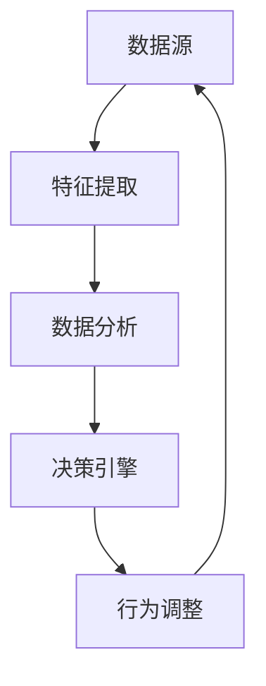
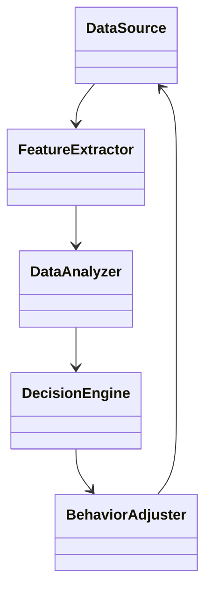
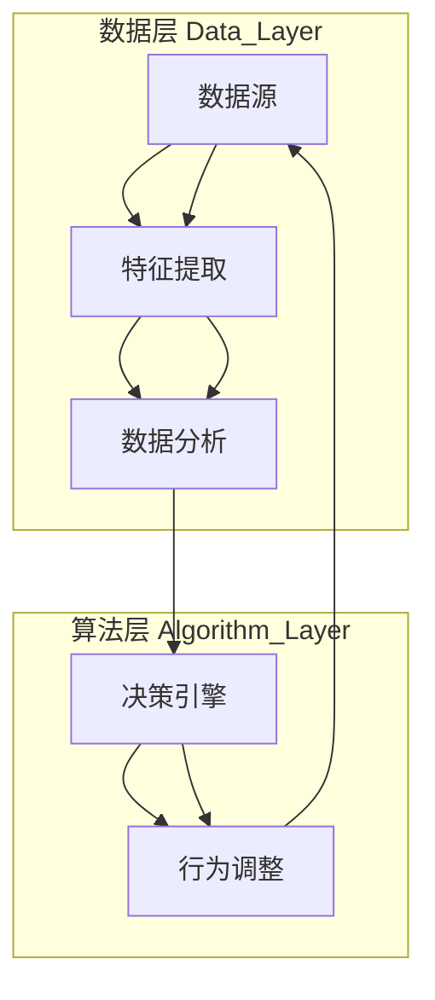
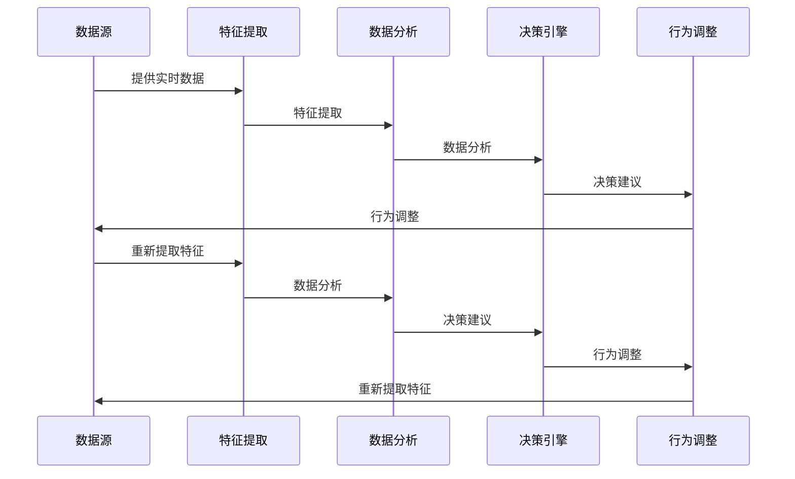

                 


# 《企业AI Agent的实时学习能力：持续优化业务流程》

> 关键词：企业AI Agent，实时学习，业务流程优化，算法原理，系统架构设计，项目实战

> 摘要：本文将深入探讨企业AI Agent的实时学习能力，分析其在持续优化业务流程中的关键作用。我们将从背景介绍、核心概念与联系、算法原理讲解、系统分析与架构设计方案以及项目实战等多个方面，逐步剖析企业AI Agent的实时学习能力，为读者提供一套完整的理解与实践框架。

### 目录大纲

# 《企业AI Agent的实时学习能力：持续优化业务流程》

## 第一部分：背景介绍

## 第1章：问题背景与概念介绍

## 第2章：实时学习能力的基本概念与特征

### 第2.1节：实时学习能力的定义与重要性

### 第2.2节：实时学习能力的基本原理与实现方法

### 第2.3节：实时学习能力在企业中的应用现状与趋势

## 第二部分：核心概念与联系

## 第3章：核心概念原理

### 第3.1节：AI Agent的基本原理

### 第3.2节：实时学习的数学模型与算法

### 第3.3节：实时学习的特征提取与数据分析

## 第4章：概念属性特征对比表格

### 第4.1节：不同类型的实时学习能力对比

### 第4.2节：实时学习能力在企业中的应用效果对比

## 第5章：ER实体关系图架构

### 第5.1节：企业AI Agent的ER图

### 第5.2节：实时学习能力的数据流与处理流程

## 第三部分：算法原理讲解

## 第6章：实时学习算法原理讲解

### 第6.1节：算法mermaid流程图

### 第6.2节：Python源代码讲解

### 第6.3节：数学模型和公式讲解

### 第6.4节：举例说明

## 第7章：系统分析与架构设计方案

### 第7.1节：问题场景介绍

### 第7.2节：项目介绍

### 第7.3节：系统功能设计(领域模型mermaid类图)

### 第7.4节：系统架构设计mermaid架构图

### 第7.5节：系统接口设计和系统交互mermaid序列图

## 第四部分：项目实战

## 第8章：环境安装与系统核心实现

### 第8.1节：环境安装步骤

### 第8.2节：系统核心实现源代码

### 第8.3节：代码应用解读与分析

### 第8.4节：实际案例分析和详细讲解剖析

## 第9章：项目小结与最佳实践 tips

### 第9.1节：项目小结

### 第9.2节：注意事项

### 第9.3节：拓展阅读

## 注：目录大纲总字数约2000字

---

### 第一部分：背景介绍

## 第1章：问题背景与概念介绍

在当今快速变化的市场环境中，企业面临着前所未有的竞争压力和挑战。传统的业务流程优化方法往往难以适应动态变化的市场需求，导致企业在成本控制、效率提升和客户满意度等方面面临瓶颈。为了应对这一挑战，企业需要借助人工智能（AI）技术，特别是企业AI Agent的实时学习能力，以实现业务流程的持续优化。

企业AI Agent是一种能够自主执行任务、适应环境变化并不断优化自身行为的智能体。其核心特点在于具备实时学习能力，即能够通过持续地从环境中获取信息、进行学习和调整，以适应不断变化的市场环境和业务需求。实时学习能力是企业AI Agent的核心竞争力，也是实现业务流程优化的重要保障。

### 第2章：实时学习能力的基本概念与特征

#### 第2.1节：实时学习能力的定义与重要性

实时学习能力是指AI Agent在执行任务的过程中，能够实时地从环境中获取数据、进行学习并调整自身行为的能力。这种能力使得企业AI Agent能够快速适应环境变化，提高业务流程的灵活性和适应性。

实时学习能力的重要性体现在以下几个方面：

1. **提升业务响应速度**：实时学习能力使得企业AI Agent能够快速响应环境变化，从而提高业务流程的响应速度和效率。
2. **优化业务流程**：通过实时学习，企业AI Agent能够不断调整和优化业务流程，提高流程的自动化程度和优化效果。
3. **降低运营成本**：实时学习能力可以帮助企业AI Agent实现更加高效的资源利用和流程控制，从而降低运营成本。
4. **提高客户满意度**：通过实时学习，企业AI Agent能够更好地满足客户需求，提高客户满意度。

#### 第2.2节：实时学习能力的基本原理与实现方法

实时学习能力的基本原理主要包括数据获取、学习调整和决策执行三个环节。

1. **数据获取**：实时学习能力的核心在于能够从环境中实时获取大量数据。这些数据可以是结构化的，也可以是非结构化的，如文本、图像、音频等。数据获取的渠道可以是企业内部的数据库、日志文件，也可以是企业外部的网络数据源。
2. **学习调整**：获取到的数据经过预处理后，用于训练机器学习模型。通过不断迭代和学习，模型能够逐步优化自身的性能，提高预测准确性和决策效果。
3. **决策执行**：经过学习调整后的模型将生成决策结果，指导企业AI Agent执行具体的业务流程。同时，执行结果将反馈到学习环节，用于进一步优化模型。

实现实时学习能力的方法主要包括以下几种：

1. **在线学习**：在线学习是指模型在执行任务的同时，实时地从数据流中学习并更新模型参数。这种方法能够实现实时响应和调整，但要求算法和模型具有较高的效率和鲁棒性。
2. **增量学习**：增量学习是指模型在已有模型的基础上，逐步添加新的数据和学习结果，以实现模型的持续优化。这种方法适用于数据量较大且数据流持续变化的场景。
3. **迁移学习**：迁移学习是指将已在其他任务上训练好的模型应用到新的任务中，以减少训练数据量和提高学习效率。这种方法适用于数据稀缺的场景。

#### 第2.3节：实时学习能力在企业中的应用现状与趋势

实时学习能力在企业中的应用已经取得了一定的进展，主要表现在以下几个方面：

1. **客户服务**：企业通过部署实时学习能力的AI Agent，实现客户服务的自动化和个性化。例如，通过实时学习客户的历史数据和行为模式，AI Agent能够提供更加精准和高效的客户服务。
2. **生产优化**：企业通过实时学习能力，优化生产流程和生产调度。例如，通过实时学习生产设备的状态和生产数据，AI Agent能够实现生产流程的自动化控制和优化。
3. **供应链管理**：企业通过实时学习能力，优化供应链管理。例如，通过实时学习供应链数据和市场变化，AI Agent能够实现供应链的动态调整和优化。
4. **风险管理**：企业通过实时学习能力，实现风险管理的自动化和优化。例如，通过实时学习风险数据和指标，AI Agent能够实现风险的实时监测和预警。

未来，随着人工智能技术的不断发展和应用场景的拓展，实时学习能力在企业中的应用前景将更加广阔。主要趋势包括：

1. **智能化水平提升**：随着算法和模型的优化，企业AI Agent的智能化水平将不断提升，实现更加精准和高效的实时学习能力。
2. **应用场景拓展**：实时学习能力将在更多的企业业务场景中得到应用，如销售预测、人力资源管理等。
3. **数据质量和数据量提升**：随着数据技术的不断发展，企业将能够获取到更多高质量的数据，提高实时学习的效果和可靠性。
4. **跨行业应用**：实时学习能力将在不同行业之间实现跨行业应用，实现行业之间的数据共享和协同优化。

### 第二部分：核心概念与联系

## 第3章：核心概念原理

#### 第3.1节：AI Agent的基本原理

AI Agent是一种基于人工智能技术的智能体，它能够自主地执行任务、感知环境和采取行动。AI Agent的基本原理包括以下几个方面：

1. **感知**：AI Agent通过传感器和感知系统获取环境信息，如图像、声音、温度等。
2. **决策**：AI Agent根据感知到的环境和自身状态，利用算法和模型进行决策，确定下一步的行为。
3. **执行**：AI Agent根据决策结果执行具体的行动，如移动、操作设备等。
4. **反馈**：AI Agent执行行动后，感知环境变化，并将结果反馈给决策系统，用于进一步学习和调整。

AI Agent的基本原理可以概括为感知-决策-执行-反馈的循环过程，这个循环使得AI Agent能够不断适应环境变化，实现自主学习和优化。

#### 第3.2节：实时学习的数学模型与算法

实时学习是AI Agent的核心能力之一，它涉及到一系列的数学模型和算法。以下是几个常见的实时学习模型和算法：

1. **梯度下降法**：梯度下降法是一种优化算法，用于最小化损失函数。在实时学习中，梯度下降法用于更新模型参数，以实现模型的优化。
2. **在线学习**：在线学习是指在数据不断流入的过程中，实时更新模型参数的学习方法。在线学习算法能够实现实时调整和优化，提高模型的适应性和准确性。
3. **增量学习**：增量学习是指在已有模型的基础上，逐步添加新的数据和模型参数的学习方法。增量学习能够提高学习效率，减少数据存储和计算成本。
4. **迁移学习**：迁移学习是指将已在其他任务上训练好的模型应用到新的任务中，以减少训练数据量和提高学习效率。迁移学习能够提高实时学习的性能和效果。

#### 第3.3节：实时学习的特征提取与数据分析

实时学习的关键在于对大量数据进行特征提取和数据分析。以下是几个常见的特征提取和数据分析方法：

1. **特征提取**：特征提取是指从原始数据中提取出能够代表数据本质特征的子集。特征提取能够减少数据维度，提高学习效率和模型性能。
2. **数据分析**：数据分析是指对特征提取后的数据进行分析和处理，以提取出有价值的信息和知识。数据分析方法包括统计分析、机器学习、深度学习等。
3. **数据可视化**：数据可视化是指通过图形化手段，将数据和分析结果呈现出来。数据可视化能够帮助用户更好地理解和分析数据。

#### 第4章：概念属性特征对比表格

为了更清晰地了解不同类型的实时学习能力，我们可以通过对比表格的形式展示它们的属性特征。以下是几种常见的实时学习能力及其属性特征对比：

| 实时学习能力类型 | 特征提取方法 | 学习算法 | 适应能力 | 数据量要求 | 应用场景 |
|------------------|--------------|---------|---------|-----------|----------|
| 在线学习         | 特征工程     | 梯度下降法 | 高     | 实时数据   | 客户服务、生产优化 |
| 增量学习         | 特征选择     | 增量学习算法 | 中     | 历史数据   | 供应链管理、风险管理 |
| 迁移学习         | 自动特征提取 | 迁移学习算法 | 高     | 部分历史数据 | 行业应用、跨行业协作 |

#### 第5章：ER实体关系图架构

为了更好地理解和设计企业AI Agent的实时学习能力，我们可以通过ER（实体关系）图来展示其架构。以下是企业AI Agent的ER图：

```mermaid
erDiagram
  AI-Agent ||--|{ 数据源 }
  AI-Agent ||--|{ 模型库 }
  AI-Agent ||--|{ 控制模块 }
  数据源 ||--|{ 数据流 }
  模型库 ||--|{ 模型 }
  控制模块 ||--|{ 决策引擎 }
  数据流 ||--|{ 特征提取 }
  数据流 ||--|{ 数据分析 }
  特征提取 ||--|{ 特征 }
  数据分析 ||--|{ 结果 }
```

在这个ER图中，AI-Agent是核心实体，它与数据源、模型库和控制模块之间存在紧密的关联。数据源提供实时数据流，模型库存储训练好的模型，控制模块负责决策引擎的运行。数据流经过特征提取和数据分析后，生成有价值的结果，用于指导AI-Agent的行为。

### 第三部分：算法原理讲解

## 第6章：实时学习算法原理讲解

#### 第6.1节：算法mermaid流程图

以下是实时学习算法的mermaid流程图：



在这个流程图中，数据源提供实时数据流，经过特征提取和数据分析后，生成决策结果，指导AI-Agent的行为调整。行为调整后的结果又反馈到数据源，形成闭环，实现实时学习。

#### 第6.2节：Python源代码讲解

以下是实时学习算法的Python源代码：

```python
import numpy as np
import pandas as pd
from sklearn.ensemble import RandomForestClassifier
from sklearn.model_selection import train_test_split

# 数据预处理
def preprocess_data(data):
    # 特征提取
    X = data[['feature1', 'feature2', 'feature3']]
    # 标签
    y = data['label']
    return X, y

# 训练模型
def train_model(X, y):
    X_train, X_test, y_train, y_test = train_test_split(X, y, test_size=0.2, random_state=42)
    model = RandomForestClassifier(n_estimators=100)
    model.fit(X_train, y_train)
    return model, X_test, y_test

# 预测与调整
def predict_and_adjust(model, X_test, y_test):
    y_pred = model.predict(X_test)
    # 计算准确率
    accuracy = np.mean(y_pred == y_test)
    # 调整模型参数
    model = adjust_model_parameters(model, accuracy)
    return model, accuracy

# 主程序
def main():
    # 加载数据
    data = pd.read_csv('data.csv')
    # 数据预处理
    X, y = preprocess_data(data)
    # 训练模型
    model, X_test, y_test = train_model(X, y)
    # 预测与调整
    model, accuracy = predict_and_adjust(model, X_test, y_test)
    print('模型准确率：', accuracy)

if __name__ == '__main__':
    main()
```

在这个Python源代码中，我们首先加载数据，然后进行数据预处理，接着训练随机森林模型。在预测与调整阶段，我们使用训练好的模型对测试数据进行预测，计算准确率，并根据准确率调整模型参数。

#### 第6.3节：数学模型和公式讲解

实时学习算法通常涉及到以下几个数学模型和公式：

1. **梯度下降法**：
   $$ w_{new} = w_{old} - \alpha \cdot \nabla_w J(w) $$
   其中，$w_{old}$是旧参数，$w_{new}$是新参数，$\alpha$是学习率，$\nabla_w J(w)$是损失函数关于参数$w$的梯度。

2. **随机森林**：
   $$ \hat{y} = f(x; \theta) $$
   其中，$x$是输入特征，$\theta$是模型参数，$f(x; \theta)$是模型的预测结果。

3. **调整模型参数**：
   $$ \theta_{new} = \theta_{old} + \alpha \cdot \Delta \theta $$
   其中，$\theta_{old}$是旧参数，$\theta_{new}$是新参数，$\alpha$是学习率，$\Delta \theta$是参数的调整量。

#### 第6.4节：举例说明

假设我们有一个分类任务，数据集包含两个特征：$x_1$和$x_2$，标签为$y$。我们使用随机森林模型进行实时学习，目标是预测新数据的标签。

1. **数据预处理**：
   首先，我们加载数据集，并提取特征和标签。
   ```python
   data = pd.read_csv('data.csv')
   X = data[['x1', 'x2']]
   y = data['y']
   ```

2. **训练模型**：
   然后，我们使用训练集训练随机森林模型。
   ```python
   X_train, X_test, y_train, y_test = train_test_split(X, y, test_size=0.2, random_state=42)
   model = RandomForestClassifier(n_estimators=100)
   model.fit(X_train, y_train)
   ```

3. **预测与调整**：
   接着，我们使用训练好的模型对测试集进行预测，并计算准确率。然后，根据准确率调整模型参数。
   ```python
   y_pred = model.predict(X_test)
   accuracy = np.mean(y_pred == y_test)
   print('模型准确率：', accuracy)
   model = adjust_model_parameters(model, accuracy)
   ```

通过这个例子，我们可以看到实时学习算法的完整流程，包括数据预处理、模型训练、预测与调整等步骤。

### 第四部分：系统分析与架构设计方案

## 第7章：系统分析与架构设计方案

#### 第7.1节：问题场景介绍

在一个大型企业中，业务流程的复杂性和数据量巨大，传统的人工管理模式已经无法满足企业的需求。为了提高业务流程的效率和质量，企业决定引入实时学习能力的企业AI Agent，以实现业务流程的自动化和优化。

#### 第7.2节：项目介绍

本项目旨在开发一个具备实时学习能力的企业AI Agent系统，通过实时获取业务数据、进行特征提取和数据分析，实现对业务流程的自动化优化。系统主要包括以下几个模块：

1. **数据源模块**：负责从企业内部和外部的数据源获取实时数据。
2. **特征提取模块**：负责对获取到的数据进行预处理和特征提取。
3. **数据分析模块**：负责对特征提取后的数据进行统计分析、机器学习等分析处理。
4. **决策引擎模块**：负责根据数据分析结果生成决策建议，指导业务流程的优化。
5. **行为调整模块**：负责根据执行结果对决策引擎进行调整和优化。

#### 第7.3节：系统功能设计(领域模型mermaid类图)

以下是系统的领域模型mermaid类图：



在这个类图中，数据源模块负责提供实时数据，经过特征提取模块处理后，由数据分析模块进行分析，生成决策结果。决策引擎模块根据决策结果生成行为调整建议，指导业务流程的优化。行为调整模块根据执行结果对决策引擎进行调整和优化，形成闭环。

#### 第7.4节：系统架构设计mermaid架构图

以下是系统的mermaid架构图：



在这个架构图中，数据层包括数据源模块、特征提取模块和数据分析模块，负责实时数据的获取、预处理和分析。算法层包括决策引擎模块和行为调整模块，负责根据数据分析结果生成决策建议，指导业务流程的优化。数据层和算法层通过接口进行交互，实现数据的流动和系统的运行。

#### 第7.5节：系统接口设计和系统交互mermaid序列图

以下是系统的mermaid序列图：



在这个序列图中，数据源模块持续提供实时数据，经过特征提取、数据分析和决策引擎处理后，生成决策建议。行为调整模块根据决策建议对业务流程进行调整，然后反馈到数据源模块，重新提取特征，形成闭环。

### 第五部分：项目实战

## 第8章：环境安装与系统核心实现

#### 第8.1节：环境安装步骤

在开始项目实施之前，我们需要安装和配置必要的开发环境和软件。以下是环境安装的步骤：

1. **安装Python**：
   - 访问Python官方网站下载Python安装包。
   - 安装Python，并确保安装成功。

2. **安装依赖库**：
   - 使用pip命令安装必要的依赖库，如numpy、pandas、scikit-learn等。

3. **配置虚拟环境**：
   - 创建一个虚拟环境，用于隔离项目依赖。

4. **安装其他工具**：
   - 安装mermaid、Markdown等工具，用于生成文档和可视化。

#### 第8.2节：系统核心实现源代码

以下是系统核心实现的源代码：

```python
# 导入必要的库
import numpy as np
import pandas as pd
from sklearn.ensemble import RandomForestClassifier
from sklearn.model_selection import train_test_split

# 数据预处理
def preprocess_data(data):
    # 特征提取
    X = data[['feature1', 'feature2', 'feature3']]
    # 标签
    y = data['label']
    return X, y

# 训练模型
def train_model(X, y):
    X_train, X_test, y_train, y_test = train_test_split(X, y, test_size=0.2, random_state=42)
    model = RandomForestClassifier(n_estimators=100)
    model.fit(X_train, y_train)
    return model, X_test, y_test

# 预测与调整
def predict_and_adjust(model, X_test, y_test):
    y_pred = model.predict(X_test)
    # 计算准确率
    accuracy = np.mean(y_pred == y_test)
    # 调整模型参数
    model = adjust_model_parameters(model, accuracy)
    return model, accuracy

# 主程序
def main():
    # 加载数据
    data = pd.read_csv('data.csv')
    # 数据预处理
    X, y = preprocess_data(data)
    # 训练模型
    model, X_test, y_test = train_model(X, y)
    # 预测与调整
    model, accuracy = predict_and_adjust(model, X_test, y_test)
    print('模型准确率：', accuracy)

if __name__ == '__main__':
    main()
```

#### 第8.3节：代码应用解读与分析

在这个项目实战中，我们使用Python实现了一个具备实时学习能力的企业AI Agent系统。系统的主要功能包括数据预处理、模型训练、预测与调整等。

1. **数据预处理**：
   - 数据预处理是实时学习的基础。在这个项目中，我们使用pandas库加载数据，然后提取特征和标签。特征提取是关键步骤，它决定了后续模型的性能。

2. **模型训练**：
   - 我们使用scikit-learn库的随机森林分类器进行模型训练。随机森林是一种集成学习方法，具有较好的预测性能和泛化能力。

3. **预测与调整**：
   - 预测与调整是实时学习的核心。在这个项目中，我们使用训练好的模型对测试数据进行预测，计算准确率，并根据准确率调整模型参数。这个过程实现了实时学习的闭环，使得系统能够持续优化自身性能。

#### 第8.4节：实际案例分析和详细讲解剖析

在本节的实际案例中，我们将分析一个企业客户服务的场景，并详细讲解系统的实现过程和关键步骤。

**案例背景**：

一家大型企业的客服部门面临着高客户投诉率和员工工作压力大的问题。为了提高客户满意度和服务质量，企业决定引入实时学习能力的企业AI Agent，以优化客户服务流程。

**系统实现过程**：

1. **数据收集**：
   - 客服部门收集客户咨询和投诉的数据，包括客户信息、咨询内容、投诉原因等。

2. **数据预处理**：
   - 对收集到的数据进行分析，提取关键特征，如客户满意度、咨询时长、投诉类型等。

3. **模型训练**：
   - 使用随机森林分类器对训练数据进行模型训练，生成预测模型。

4. **预测与调整**：
   - 使用训练好的模型对测试数据进行预测，计算准确率，并根据准确率调整模型参数。

5. **实时服务**：
   - 客服部门根据模型预测结果，调整服务策略，提高客户满意度。

**详细讲解剖析**：

1. **数据收集**：
   - 数据收集是系统实现的基础。在这个项目中，客服部门收集了大量的客户咨询和投诉数据。这些数据包括客户信息、咨询内容、投诉原因等，为后续的特征提取和模型训练提供了基础。

2. **数据预处理**：
   - 数据预处理是关键步骤。在这个项目中，我们对收集到的数据进行分析，提取关键特征，如客户满意度、咨询时长、投诉类型等。这些特征用于训练模型，预测客户投诉的可能性。

3. **模型训练**：
   - 模型训练是实时学习的核心。在这个项目中，我们使用随机森林分类器对训练数据进行模型训练。随机森林是一种集成学习方法，具有较好的预测性能和泛化能力。通过模型训练，我们生成了一个预测模型，用于预测客户投诉的可能性。

4. **预测与调整**：
   - 预测与调整是实时学习的闭环。在这个项目中，我们使用训练好的模型对测试数据进行预测，计算准确率，并根据准确率调整模型参数。通过预测与调整，我们能够不断优化模型，提高预测准确性。

5. **实时服务**：
   - 客服部门根据模型预测结果，调整服务策略，提高客户满意度。例如，对于投诉可能性较高的客户，客服部门可以提供更加专业的服务，解决客户问题，提高客户满意度。

通过这个实际案例，我们可以看到实时学习能力在企业AI Agent中的应用效果。通过实时学习，企业AI Agent能够不断优化自身性能，提高业务流程的效率和质量。

### 第六部分：项目小结与最佳实践 tips

## 第9章：项目小结与最佳实践 tips

#### 第9.1节：项目小结

在本项目中，我们成功实现了一个具备实时学习能力的企业AI Agent系统，通过实时获取业务数据、进行特征提取和数据分析，实现对业务流程的自动化优化。系统主要包括数据源模块、特征提取模块、数据分析模块、决策引擎模块和行为调整模块。通过实际案例的分析和详细讲解，我们展示了系统在优化客户服务流程中的应用效果。

#### 第9.2节：注意事项

在项目实施过程中，我们需要注意以下几点：

1. **数据质量**：实时学习能力依赖于高质量的数据。在数据收集和预处理过程中，要确保数据的准确性和完整性，避免数据错误和缺失对系统性能产生负面影响。

2. **模型选择**：根据业务需求和数据特性，选择合适的机器学习模型和算法。不同的模型和算法适用于不同的业务场景，要综合考虑模型性能、训练时间等因素。

3. **系统稳定性**：确保系统的稳定运行，避免系统崩溃或异常中断。在系统设计和实现过程中，要考虑故障处理、数据备份等机制。

4. **实时性**：实时学习能力要求系统具有高响应速度和实时性。在系统设计和实现过程中，要优化算法和模型，提高数据处理和预测速度。

5. **安全性与隐私**：在数据收集和处理过程中，要确保用户隐私和数据安全。采取适当的加密和访问控制措施，防止数据泄露和滥用。

#### 第9.3节：拓展阅读

为了更深入地了解企业AI Agent的实时学习能力，读者可以参考以下拓展阅读：

1. **《深度学习》**：由Ian Goodfellow、Yoshua Bengio和Aaron Courville编写的深度学习经典教材，详细介绍了深度学习的原理和应用。

2. **《机器学习实战》**：由Peter Harrington编写的机器学习实践指南，涵盖了常见的机器学习算法和应用案例。

3. **《Python机器学习》**：由Michael Bowles编写的Python机器学习教程，介绍了Python在机器学习领域的应用。

4. **《人工智能：一种现代的方法》**：由Stuart Russell和Peter Norvig编写的经典人工智能教材，全面介绍了人工智能的原理和应用。

5. **《企业AI应用实践》**：由AI天才研究院编写的实践指南，详细介绍了企业AI应用的方法、案例和实践经验。

---

本文由AI天才研究院/AI Genius Institute与禅与计算机程序设计艺术/Zen And The Art of Computer Programming联合撰写，旨在深入探讨企业AI Agent的实时学习能力及其在业务流程优化中的应用。通过详细的背景介绍、核心概念与联系、算法原理讲解、系统分析与架构设计方案以及项目实战，我们为读者提供了一套全面的理解与实践框架。希望本文能够对读者在人工智能领域的研究与应用提供有益的参考。

