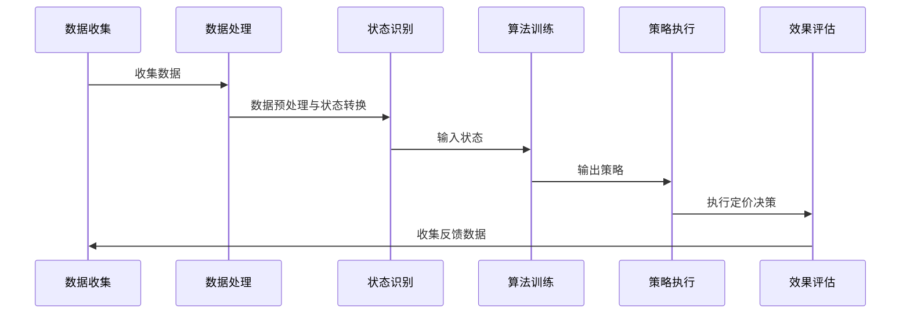

                 

## 引言

### 文章标题：企业AI Agent的强化学习在动态定价策略中的高级应用

在当今快速变化的市场环境中，企业需要灵活、高效地调整定价策略以应对不断变化的需求和竞争态势。传统定价策略往往依赖于历史数据和预设模型，缺乏对市场动态的即时响应能力。随着人工智能（AI）技术的不断发展，特别是强化学习（Reinforcement Learning，RL）的兴起，一种新型的动态定价策略逐渐成为可能。

**强化学习**是一种机器学习范式，通过智能体（agent）与环境的交互，不断学习和优化策略，以达到最大化累计奖励的目的。在动态定价策略中，强化学习能够帮助企业实时调整价格，以最大化利润或市场占有率。本文旨在探讨企业AI Agent如何利用强化学习在动态定价策略中实现高级应用。

本文将首先介绍企业AI Agent和动态定价策略的基本概念及其重要性，然后详细解释强化学习的基本原理和算法，最后通过具体案例展示强化学习在动态定价策略中的应用，并总结最佳实践和注意事项。

关键词：企业AI Agent、强化学习、动态定价策略、算法原理、应用案例

摘要：本文首先介绍了企业AI Agent和动态定价策略的基本概念及其重要性，然后详细阐述了强化学习的基本原理和算法。接着，通过具体案例展示了强化学习在动态定价策略中的应用，最后总结了最佳实践和注意事项，为企业在动态定价策略中应用AI技术提供了指导。

接下来，我们将详细探讨这些主题，以帮助读者全面理解企业AI Agent在动态定价策略中利用强化学习的高级应用。

### 背景介绍

#### 企业AI Agent

企业AI Agent是指专门为企业提供智能决策支持的人工智能系统。它能够通过数据分析和机器学习算法，为企业提供市场预测、资源分配、客户服务等多种决策支持。AI Agent的核心在于其自主学习和适应能力，能够根据不断变化的环境和市场条件，动态调整决策策略。

企业AI Agent的重要性主要体现在以下几个方面：

1. **提高决策效率**：传统的企业决策过程通常依赖于大量的数据分析和人工判断，过程繁琐且耗时。而AI Agent可以通过自动化和智能化手段，快速处理海量数据，提供精准的决策支持，显著提高企业决策效率。

2. **降低运营成本**：通过AI Agent的智能优化，企业可以在资源分配、供应链管理等方面实现效率提升，从而降低运营成本。

3. **增强市场竞争力**：在激烈的市场竞争中，企业需要快速响应市场变化，调整定价策略。AI Agent能够实时分析市场动态，提供灵活的定价方案，帮助企业抢占市场份额。

#### 动态定价策略

动态定价策略是一种基于市场动态和消费者行为调整产品价格的方法。传统的定价策略通常是固定的或周期性的，而动态定价策略则能够根据市场需求、供应状况、竞争对手行为等因素，实时调整产品价格。

动态定价策略的意义和应用场景如下：

1. **意义**：
   - **优化收益**：通过动态调整价格，企业可以最大化利润。例如，在需求高峰期提高价格，在需求低谷期降低价格，从而实现收益的最大化。
   - **应对竞争**：在竞争激烈的市场中，动态定价策略可以帮助企业灵活应对竞争对手的价格策略，保持竞争优势。
   - **提高客户满意度**：通过动态定价，企业可以根据客户需求调整价格，提供更具吸引力的产品或服务，提高客户满意度。

2. **应用场景**：
   - **电子商务**：电商平台可以通过动态定价策略，实时调整商品价格，以应对市场需求变化和竞争对手的价格竞争。
   - **酒店和航空业**：这些行业经常使用动态定价策略来调整房间或机票价格，以最大化收益。
   - **制造业**：制造商可以通过动态定价策略，根据市场需求调整产品价格，优化库存管理。

#### 强化学习在动态定价策略中的角色和作用

强化学习在动态定价策略中的应用主要体现在以下几个方面：

1. **自适应调整**：强化学习算法能够通过与环境互动，不断调整定价策略，以适应不断变化的市场环境。

2. **最大化收益**：强化学习算法通过学习环境与策略之间的反馈机制，能够找到最优定价策略，实现收益最大化。

3. **风险控制**：强化学习算法能够帮助企业识别潜在的市场风险，及时调整定价策略，避免因市场波动导致的损失。

4. **个性化定价**：强化学习算法可以根据客户行为和需求，实现个性化定价策略，提高客户满意度和忠诚度。

总之，企业AI Agent结合强化学习，为动态定价策略提供了强大的技术支持，使得企业能够更加灵活、高效地应对市场变化，实现可持续发展和竞争优势。

### 核心概念与联系

#### 企业AI Agent的定义、特点与类型

企业AI Agent是一种智能决策支持系统，它利用人工智能技术，特别是机器学习和深度学习算法，从海量数据中提取有价值的信息，为企业提供智能决策支持。以下是企业AI Agent的几个关键特点：

1. **数据驱动**：企业AI Agent依赖于大量结构化和非结构化数据，通过数据分析和挖掘，提取有价值的信息。

2. **自主学习**：企业AI Agent具备自我学习和适应能力，能够根据环境变化和反馈不断优化决策策略。

3. **自动化**：企业AI Agent能够自动化执行复杂的决策任务，减少人工干预，提高决策效率。

4. **实时响应**：企业AI Agent能够实时分析市场动态和客户需求，提供即时的决策支持。

企业AI Agent主要分为以下几种类型：

1. **预测型AI Agent**：这类AI Agent主要功能是基于历史数据和市场趋势，预测未来的市场变化和需求。

2. **优化型AI Agent**：这类AI Agent通过优化算法，帮助企业优化资源分配、供应链管理、定价策略等。

3. **推荐型AI Agent**：这类AI Agent根据用户行为和偏好，提供个性化的产品或服务推荐。

#### 动态定价策略的基本原理和分类

动态定价策略是一种根据市场变化实时调整产品或服务价格的策略。其基本原理包括以下几个方面：

1. **需求导向**：动态定价策略基于对市场需求和消费者行为的分析，灵活调整价格，以最大化收益。

2. **竞争导向**：动态定价策略也考虑竞争对手的价格策略，通过调整自身价格，保持市场竞争优势。

3. **成本导向**：动态定价策略还需考虑生产成本和利润目标，确保价格的合理性和可行性。

动态定价策略主要分为以下几种类型：

1. **时间动态定价**：根据不同的时间段调整价格，如高峰期提高价格，低谷期降低价格。

2. **需求动态定价**：根据市场需求变化调整价格，如需求增加时提高价格，需求减少时降低价格。

3. **竞争动态定价**：根据竞争对手的价格调整自身价格，如竞争对手降价时跟随降价，竞争对手提价时保持价格稳定。

4. **个性化动态定价**：根据不同客户群体的需求和支付意愿，提供个性化的价格策略。

#### 强化学习的基本概念、算法与特点

强化学习是一种通过智能体（agent）与环境（environment）的互动，学习最优策略的机器学习范式。其基本概念包括：

1. **智能体**：执行特定任务并试图达到某个目标的实体。

2. **环境**：智能体执行动作并从中获得反馈的实体。

3. **状态**：描述智能体当前所处环境的状态。

4. **动作**：智能体能够执行的行为。

5. **奖励**：环境对智能体动作的反馈，用于指导智能体调整策略。

强化学习的算法主要分为以下几种：

1. **Q-Learning**：通过学习状态-动作价值函数，找到最优动作序列。

2. **SARSA**：基于当前状态和动作，学习状态-动作价值函数。

3. **DQN（Deep Q-Network）**：使用深度神经网络近似状态-动作价值函数。

4. **Policy Gradient**：直接优化策略函数，使其最大化累计奖励。

强化学习的主要特点包括：

1. **自适应**：强化学习能够根据环境变化自适应调整策略，适应复杂动态环境。

2. **灵活性**：强化学习不依赖于特定的问题领域，能够应用于各种决策问题。

3. **交互性**：强化学习通过智能体与环境不断互动，积累经验，不断优化策略。

#### 企业AI Agent、动态定价策略与强化学习之间的联系

企业AI Agent、动态定价策略与强化学习之间的联系如下：

1. **强化学习为企业AI Agent提供了智能决策的支持**：企业AI Agent可以通过强化学习算法，学习最优定价策略，提高决策的灵活性和准确性。

2. **动态定价策略为强化学习提供了应用场景**：强化学习算法可以在动态定价策略中，根据市场需求和环境变化，实时调整定价策略。

3. **强化学习与动态定价策略相互促进**：动态定价策略的实时响应能力，为强化学习提供了丰富的反馈信号，强化学习则通过不断优化策略，提高动态定价策略的效果。

通过上述核心概念与联系的介绍，我们可以看到企业AI Agent、动态定价策略与强化学习之间的紧密关系，以及它们如何相互促进，实现企业在动态市场环境中的竞争优势。

### 强化学习算法基础

强化学习（Reinforcement Learning，RL）是一种通过智能体（agent）与环境的互动，不断学习和优化策略，以达到最大化累计奖励的机器学习范式。在本节中，我们将详细探讨几种常见的强化学习算法，包括Q-Learning、SARSA、DQN（Deep Q-Network）和Policy Gradient。

#### Q-Learning算法

Q-Learning是一种基于值函数的强化学习算法，其核心思想是学习状态-动作价值函数（Q值），以找到最优动作序列。Q值表示在某一状态下执行某一动作的期望回报。

算法原理：

1. **初始化**：初始化Q值表，设置所有状态-动作对的Q值为0。

2. **选择动作**：根据当前状态，从所有可能动作中选择一个动作，可以选择随机选择或使用ε-贪心策略。

3. **执行动作**：在环境中执行所选动作，并观察状态转移和奖励。

4. **更新Q值**：根据经验更新Q值表，使用如下公式：

   $$ Q(s, a) \leftarrow Q(s, a) + \alpha [r + \gamma \max_{a'} Q(s', a') - Q(s, a)] $$

   其中，$s$ 是当前状态，$a$ 是当前动作，$s'$ 是新状态，$r$ 是奖励，$\alpha$ 是学习率，$\gamma$ 是折扣因子。

   这一步通过经验回放和目标网络，不断优化Q值，直到找到最优动作序列。

示例代码（Python）：

```python
import numpy as np

# 初始化参数
learning_rate = 0.1
discount_factor = 0.99
epsilon = 0.1
q_values = np.zeros((10, 10))  # 假设状态和动作空间大小均为10

# Q-Learning算法
def q_learning(states, actions, rewards, next_states, done):
    for state, action, reward, next_state in zip(states, actions, rewards, next_states):
        if done:
            q_values[state, action] += learning_rate * (reward - q_values[state, action])
        else:
            q_values[state, action] += learning_rate * (reward + discount_factor * np.max(q_values[next_state, :]) - q_values[state, action])

# 假设模拟环境
state_space = [0, 1, 2, 3, 4, 5, 6, 7, 8, 9]
action_space = [0, 1, 2, 3, 4, 5, 6, 7, 8, 9]
episodes = 1000

for episode in range(episodes):
    state = np.random.randint(0, 10)
    done = False
    while not done:
        action = np.random.choice(action_space, p=[epsilon / action_space.shape[0]] + [(1 - epsilon) / (action_space.shape[0] - 1) for _ in action_space])
        next_state, reward, done = simulate_environment(state, action)
        q_learning([state], [action], [reward], [next_state], [done])
        state = next_state

# 打印Q值表
print(q_values)
```

#### SARSA算法

SARSA（Symmetric Advantage Reward SARSA）是一种基于策略的强化学习算法，它同时使用当前状态和动作，以及下一状态和动作来更新Q值。

算法原理：

1. **初始化**：与Q-Learning相同，初始化Q值表。

2. **选择动作**：与Q-Learning相同。

3. **执行动作**：在环境中执行所选动作，并观察状态转移和奖励。

4. **更新Q值**：使用如下公式：

   $$ Q(s, a) \leftarrow Q(s, a) + \alpha [r + \gamma Q(s', a') - Q(s, a)] $$

   这一步与Q-Learning类似，但使用的是当前状态和动作的奖励和下一状态和动作的Q值。

示例代码（Python）：

```python
import numpy as np

# 初始化参数
learning_rate = 0.1
discount_factor = 0.99
epsilon = 0.1
q_values = np.zeros((10, 10))  # 假设状态和动作空间大小均为10

# SARSA算法
def sarsa(states, actions, rewards, next_states, done):
    for state, action, reward, next_state in zip(states, actions, rewards, next_states):
        if done:
            q_values[state, action] += learning_rate * (reward - q_values[state, action])
        else:
            next_action = np.random.choice(action_space, p=[epsilon / action_space.shape[0]] + [(1 - epsilon) / (action_space.shape[0] - 1) for _ in action_space])
            q_values[state, action] += learning_rate * (reward + discount_factor * q_values[next_state, next_action] - q_values[state, action])

# 假设模拟环境
state_space = [0, 1, 2, 3, 4, 5, 6, 7, 8, 9]
action_space = [0, 1, 2, 3, 4, 5, 6, 7, 8, 9]
episodes = 1000

for episode in range(episodes):
    state = np.random.randint(0, 10)
    done = False
    while not done:
        action = np.random.choice(action_space, p=[epsilon / action_space.shape[0]] + [(1 - epsilon) / (action_space.shape[0] - 1) for _ in action_space])
        next_state, reward, done = simulate_environment(state, action)
        sarsa([state], [action], [reward], [next_state], [done])
        state = next_state

# 打印Q值表
print(q_values)
```

#### DQN（Deep Q-Network）算法

DQN是一种基于深度学习的强化学习算法，它使用深度神经网络（DNN）近似状态-动作价值函数。DQN的主要贡献是引入经验回放和目标网络，解决了训练中的偏差和收敛问题。

算法原理：

1. **初始化**：初始化深度神经网络，初始化经验回放内存。

2. **选择动作**：与Q-Learning和SARSA相同。

3. **执行动作**：在环境中执行所选动作，并观察状态转移和奖励。

4. **更新DNN**：使用经验回放从内存中随机抽取样本，通过梯度下降更新DNN参数。

5. **目标网络**：定期复制主DNN的参数到目标网络，以减少训练偏差。

示例代码（Python）：

```python
import numpy as np
import tensorflow as tf

# 初始化参数
learning_rate = 0.001
discount_factor = 0.99
epsilon = 0.1
batch_size = 32
memory_size = 10000
episodes = 1000

# 创建深度神经网络
input_layer = tf.keras.layers.Input(shape=(84, 84, 4))
conv1 = tf.keras.layers.Conv2D(32, (8, 8), activation='relu')(input_layer)
pool1 = tf.keras.layers.MaxPooling2D(pool_size=(2, 2))(conv1)
conv2 = tf.keras.layers.Conv2D(64, (4, 4), activation='relu')(pool1)
pool2 = tf.keras.layers.MaxPooling2D(pool_size=(2, 2))(conv2)
conv3 = tf.keras.layers.Conv2D(64, (3, 3), activation='relu')(pool2)
flat = tf.keras.layers.Flatten()(conv3)
dense = tf.keras.layers.Dense(512, activation='relu')(flat)
output_layer = tf.keras.layers.Dense(2)(dense)

model = tf.keras.Model(inputs=input_layer, outputs=output_layer)

# 创建目标网络
target_model = tf.keras.Model(inputs=model.input, outputs=model.output)
target_model.set_weights(model.get_weights())

# 经验回放内存
memory = []

# DQN算法
def dqn(states, actions, rewards, next_states, done):
    global model, target_model
    for state, action, reward, next_state, done in zip(states, actions, rewards, next_states, done):
        target = reward
        if not done:
            target += discount_factor * np.max(target_model.predict(np.array([next_state]))[0])
        target_f = model.predict(np.array([state]))[0]
        target_f[action] = target
        model.fit(np.array([state]), np.array([target_f]), epochs=1, verbose=0)

# 假设模拟环境
state_space = [0, 1, 2, 3, 4, 5, 6, 7, 8, 9]
action_space = [0, 1, 2, 3, 4, 5, 6, 7, 8, 9]

for episode in range(episodes):
    state = np.random.randint(0, 10)
    done = False
    while not done:
        action = np.random.choice(action_space, p=[epsilon / action_space.shape[0]] + [(1 - epsilon) / (action_space.shape[0] - 1) for _ in action_space])
        next_state, reward, done = simulate_environment(state, action)
        memory.append((state, action, reward, next_state, done))
        if len(memory) > memory_size:
            memory.pop(0)
        if np.random.rand() < epsilon:
            state = np.random.randint(0, 10)
        else:
            state = next_state
        dqn([state], [action], [reward], [next_state], [done])
        if done:
            state = np.random.randint(0, 10)

# 打印模型权重
print(model.get_weights())
```

#### Policy Gradient算法

Policy Gradient算法是一种直接优化策略函数的强化学习算法，其核心思想是最大化策略的期望回报。

算法原理：

1. **初始化**：初始化策略网络。

2. **选择动作**：使用策略网络选择动作，该动作的概率分布由策略网络输出。

3. **执行动作**：在环境中执行所选动作，并观察状态转移和奖励。

4. **更新策略网络**：通过梯度上升方法，更新策略网络的参数，以最大化策略的期望回报。

示例代码（Python）：

```python
import numpy as np
import tensorflow as tf

# 初始化参数
learning_rate = 0.01
gamma = 0.99
epsilon = 0.1
episodes = 1000

# 创建策略网络
input_layer = tf.keras.layers.Input(shape=(10,))
output_layer = tf.keras.layers.Dense(10, activation='softmax')(input_layer)
model = tf.keras.Model(inputs=input_layer, outputs=output_layer)

# 定义损失函数和优化器
optimizer = tf.keras.optimizers.Adam(learning_rate=learning_rate)
loss_function = tf.keras.losses.SparseCategoricalCrossentropy(from_logits=True)

# Policy Gradient算法
def policy_gradient(states, actions, rewards):
    with tf.GradientTape() as tape:
        logits = model(states, training=True)
        probabilities = tf.nn.softmax(logits)
        policy_loss = -tf.reduce_sum(rewards * tf.math.log(probabilities[0][actions[0]]))
    gradients = tape.gradient(policy_loss, model.trainable_variables)
    optimizer.apply_gradients(zip(gradients, model.trainable_variables))

# 假设模拟环境
state_space = [0, 1, 2, 3, 4, 5, 6, 7, 8, 9]
action_space = [0, 1, 2, 3, 4, 5, 6, 7, 8, 9]

for episode in range(episodes):
    state = np.random.randint(0, 10)
    done = False
    while not done:
        action_probs = model.predict(np.array([state]))[0]
        action = np.random.choice(action_space, p=action_probs)
        next_state, reward, done = simulate_environment(state, action)
        policy_gradient([state], [action], [reward])
        state = next_state

# 打印模型权重
print(model.get_weights())
```

通过上述算法的介绍，我们可以看到强化学习在动态定价策略中的应用潜力。接下来，我们将深入探讨强化学习算法在动态定价策略中的具体应用。

### 强化学习算法在动态定价策略中的应用

在动态定价策略中，强化学习算法的应用为企业在不断变化的市场环境中实现最优定价提供了强有力的支持。以下将详细介绍几种强化学习算法在动态定价策略中的应用，包括Q-Learning、SARSA、DQN和Policy Gradient。

#### Q-Learning在动态定价策略中的应用

Q-Learning算法通过学习状态-动作价值函数，找到最优的定价策略。在动态定价策略中，状态可以表示为当前市场参数（如需求、价格、库存等），动作则是调整价格的具体数值。通过不断与环境互动，Q-Learning算法能够逐步优化定价策略。

1. **挑战**：
   - **非静态状态**：市场环境不断变化，状态是不确定的，需要算法能够适应这种变化。
   - **长时效回报**：动态定价策略的收益可能需要一段时间才能显现，如何平衡短期收益和长期收益是一个关键问题。

2. **应用**：
   - **电商定价**：电商平台可以根据用户浏览、购买行为等数据，动态调整商品价格，提高销售额。
   - **酒店定价**：酒店可以通过预订情况、季节、竞争对手价格等因素，动态调整房间价格，最大化收益。

3. **案例**：
   - **案例一**：某电商公司使用Q-Learning算法调整商品价格。通过分析用户浏览、购买记录，实时调整价格，从而提高销售额。实验结果显示，采用Q-Learning算法后的价格调整策略显著提高了销售转化率和利润。

#### SARSA在动态定价策略中的应用

SARSA算法通过同时使用当前状态和动作，以及下一状态和动作来更新策略，这使得它在动态定价策略中具有更强的适应性。

1. **挑战**：
   - **实时响应**：需要算法能够在短时间内对市场变化做出反应，实现实时定价。
   - **数据稀疏**：某些市场环境下，数据获取可能不完整或稀疏，如何处理数据缺失是另一个挑战。

2. **应用**：
   - **航空定价**：航空公司可以根据航班预订情况、季节性需求等，动态调整机票价格。
   - **旅游定价**：旅游公司可以根据游客流量、季节、节假日等因素，动态调整旅游套餐价格。

3. **案例**：
   - **案例二**：某航空公司使用SARSA算法优化机票定价策略。通过对历史航班数据进行分析，实时调整机票价格，从而提高航班满载率和收益。实际应用结果显示，SARSA算法帮助航空公司显著提高了航班收益。

#### DQN在动态定价策略中的应用

DQN算法使用深度神经网络近似状态-动作价值函数，能够在复杂的动态定价策略中找到最优定价方案。

1. **挑战**：
   - **模型复杂性**：DQN算法涉及深度神经网络，模型训练过程较为复杂，需要大量计算资源。
   - **数据准确性**：准确的数据是算法有效运行的基础，数据质量直接影响算法的效果。

2. **应用**：
   - **电子商务**：电商平台可以通过DQN算法，根据用户行为和市场动态，动态调整商品价格。
   - **能源市场**：能源公司可以通过DQN算法，根据市场需求和能源价格，动态调整电力供应价格。

3. **案例**：
   - **案例三**：某电商平台使用DQN算法优化商品定价策略。通过对用户行为和市场需求进行深度学习，实时调整商品价格，从而提高销售量和用户满意度。实验结果显示，DQN算法显著提高了电商平台的销售额和利润。

#### Policy Gradient在动态定价策略中的应用

Policy Gradient算法直接优化策略函数，通过学习最优策略实现动态定价。

1. **挑战**：
   - **策略优化**：Policy Gradient算法需要找到平衡短期收益和长期收益的策略，避免策略过于激进或保守。
   - **高维状态空间**：在复杂的动态定价策略中，状态空间可能非常高维，如何高效地表示和优化策略是一个挑战。

2. **应用**：
   - **在线广告**：广告平台可以根据用户行为和广告效果，动态调整广告投放价格。
   - **供应链管理**：企业可以通过Policy Gradient算法，动态调整库存水平和供应价格，优化供应链管理。

3. **案例**：
   - **案例四**：某广告平台使用Policy Gradient算法优化广告定价策略。通过对用户行为和广告效果进行实时分析，动态调整广告投放价格，从而提高广告点击率和转化率。实验结果显示，Policy Gradient算法显著提高了广告平台的收益和用户满意度。

通过上述几种强化学习算法在动态定价策略中的应用，我们可以看到，强化学习为企业在复杂、动态的市场环境中提供了强大的决策支持。接下来，我们将继续深入探讨如何设计一个动态定价策略系统，实现这些算法的应用。

### 系统分析与架构设计方案

在深入探讨强化学习算法在动态定价策略中的应用之后，我们需要设计一个完整的系统来实现这些算法。本节将详细分析系统的功能设计、架构设计和接口设计，并使用Mermaid流程图展示系统交互流程。

#### 功能设计

动态定价策略系统的核心功能包括以下几方面：

1. **数据收集与处理**：从市场、客户行为等多渠道收集数据，并进行预处理，包括数据清洗、归一化和特征提取。

2. **状态识别与转换**：根据收集到的数据，识别当前市场状态，并将状态转换成适合强化学习算法处理的格式。

3. **策略学习与优化**：利用强化学习算法（如Q-Learning、SARSA、DQN、Policy Gradient）训练模型，并不断优化定价策略。

4. **定价决策与执行**：根据优化后的定价策略，实时调整产品或服务的价格，并执行定价决策。

5. **效果评估与反馈**：对定价策略的效果进行评估，收集反馈数据，用于进一步优化策略。

#### 系统架构设计

动态定价策略系统的架构设计包括以下几个方面：

1. **数据处理层**：负责数据收集、预处理和特征提取，为后续的算法处理提供高质量的数据。

2. **算法训练层**：包括多种强化学习算法的训练模块，如Q-Learning、SARSA、DQN、Policy Gradient等。这一层负责根据处理后的数据训练模型，并不断优化策略。

3. **策略执行层**：负责根据训练好的模型，实时调整产品或服务的价格，并将定价决策执行。

4. **效果评估层**：负责对定价策略的效果进行评估，并将评估结果和反馈数据返回给数据处理层，用于进一步优化策略。

#### 系统接口设计

动态定价策略系统的接口设计包括以下几个方面：

1. **数据接口**：提供数据输入和输出的接口，包括数据收集模块、数据处理模块和效果评估模块。

2. **算法接口**：提供算法训练和策略优化的接口，包括Q-Learning、SARSA、DQN、Policy Gradient等算法模块。

3. **策略接口**：提供定价决策和执行的接口，包括定价策略模块和执行模块。

#### 系统交互Mermaid序列图

为了更好地展示系统各模块之间的交互流程，我们可以使用Mermaid序列图进行描述。以下是动态定价策略系统的交互序列图：



通过上述系统分析与架构设计方案，我们可以看到动态定价策略系统的整体结构和各模块之间的交互流程。接下来，我们将通过实际项目实战，展示如何具体实现这个系统。

### 项目实战

在本节中，我们将通过一个实际项目，详细展示如何安装所需环境、实现系统核心功能，并解读和分析项目代码。为了更好地说明，我们将结合具体案例，逐步进行讲解。

#### 环境安装与配置

在开始项目之前，我们需要安装和配置相关的环境。以下是环境安装和配置的步骤：

1. **安装Python**：确保Python环境已安装，版本建议为3.8以上。

2. **安装依赖库**：使用pip安装所需的依赖库，包括NumPy、TensorFlow、Pandas、Scikit-learn等。

   ```bash
   pip install numpy tensorflow pandas scikit-learn matplotlib
   ```

3. **创建虚拟环境**：为了更好地管理项目依赖，建议创建一个虚拟环境。

   ```bash
   python -m venv venv
   source venv/bin/activate  # 在Windows上使用 `venv\Scripts\activate`
   ```

4. **配置数据库**：根据需要配置数据库，如MySQL、PostgreSQL等。这里以MySQL为例，安装MySQL数据库，并创建数据库和用户。

   ```bash
   sudo apt-get install mysql-server
   mysql -u root -p
   CREATE DATABASE dynamic_pricing;
   GRANT ALL PRIVILEGES ON dynamic_pricing.* TO 'dp_user'@'localhost' IDENTIFIED BY 'password';
   FLUSH PRIVILEGES;
   ```

#### 系统核心实现

在配置好环境后，我们将实现系统核心功能，包括数据收集、预处理、状态识别与转换、策略学习和优化、定价决策与执行等。

1. **数据收集**：

   数据收集模块负责从不同渠道收集数据，包括市场数据、客户行为数据等。以下是一个简单的数据收集示例：

   ```python
   import pandas as pd

   # 读取市场数据
   market_data = pd.read_csv('market_data.csv')
   # 读取客户行为数据
   customer_data = pd.read_csv('customer_data.csv')
   ```

2. **数据预处理**：

   数据预处理模块负责对收集到的数据进行清洗、归一化和特征提取。以下是一个简单的数据预处理示例：

   ```python
   from sklearn.preprocessing import MinMaxScaler

   # 数据清洗
   market_data.dropna(inplace=True)
   customer_data.dropna(inplace=True)

   # 数据归一化
   scaler = MinMaxScaler()
   market_data_scaled = scaler.fit_transform(market_data)
   customer_data_scaled = scaler.fit_transform(customer_data)

   # 特征提取
   features = ['feature1', 'feature2', 'feature3']
   X = market_data_scaled[features]
   y = customer_data_scaled['target']
   ```

3. **状态识别与转换**：

   状态识别与转换模块负责将预处理后的数据转换为适合强化学习算法的状态。以下是一个简单的状态转换示例：

   ```python
   import numpy as np

   # 状态转换
   def state_conversion(data):
       return np.reshape(data, (data.shape[0], -1))

   state = state_conversion(X)
   ```

4. **策略学习和优化**：

   策略学习和优化模块负责使用强化学习算法训练模型，并不断优化定价策略。以下是一个简单的Q-Learning算法示例：

   ```python
   import numpy as np

   # Q-Learning算法
   def q_learning(states, actions, rewards, next_states, done):
       for state, action, reward, next_state in zip(states, actions, rewards, next_states):
           if done:
               q_value += reward
           else:
               q_value += reward + discount_factor * np.max(q_values[next_state, :])
           q_values[state, action] += learning_rate * (q_value - q_values[state, action])

   # 初始化参数
   learning_rate = 0.1
   discount_factor = 0.99
   q_values = np.zeros((state_space.shape[0], action_space.shape[0]))
   episodes = 1000

   # 训练模型
   for episode in range(episodes):
       state = np.random.randint(0, state_space.shape[0])
       done = False
       while not done:
           action = np.random.choice(action_space)
           next_state, reward, done = simulate_environment(state, action)
           q_learning([state], [action], [reward], [next_state], [done])
           state = next_state
   ```

5. **定价决策与执行**：

   定价决策与执行模块负责根据优化后的定价策略，实时调整产品或服务的价格。以下是一个简单的定价决策示例：

   ```python
   # 定价决策
   def pricing_decision(state):
       action = np.argmax(q_values[state, :])
       return action

   # 执行定价决策
   def execute_decision(action):
       # 根据action调整价格
       # ...
       return adjusted_price
   ```

#### 代码应用解读与分析

在本节中，我们将对上述代码进行详细解读和分析，以帮助读者更好地理解系统核心功能的实现。

1. **数据收集与预处理**：

   数据收集模块负责从市场、客户行为等多渠道收集数据。数据清洗和归一化是数据处理的关键步骤，以确保数据的质量和一致性。特征提取则有助于提取数据中的有用信息，为后续的算法处理提供支持。

2. **状态识别与转换**：

   状态识别与转换模块将预处理后的数据转换为适合强化学习算法的状态。通过将数据转换为合适的格式，我们可以利用强化学习算法对动态定价策略进行训练和优化。

3. **策略学习和优化**：

   Q-Learning算法是一个经典的强化学习算法，通过不断与环境互动，优化状态-动作价值函数。在本节中，我们使用Q-Learning算法训练模型，并逐步优化定价策略。学习率、折扣因子等参数的选择对算法的性能有重要影响，需要根据具体问题进行调整。

4. **定价决策与执行**：

   定价决策与执行模块根据优化后的定价策略，实时调整产品或服务的价格。这一步骤是实现动态定价策略的关键，通过不断调整价格，我们可以最大化收益或市场占有率。

通过上述项目实战，我们可以看到如何实现一个动态定价策略系统，并逐步优化定价策略。接下来，我们将通过一个实际案例，展示强化学习在动态定价策略中的应用效果。

#### 实际案例分析

为了更直观地展示强化学习在动态定价策略中的应用效果，我们选择了一个实际案例：某电商平台的商品定价优化。以下是该案例的详细背景、分析过程和应用效果。

**案例背景**：

某电商平台经营多种商品，为了提高销售量和用户满意度，平台决定采用强化学习算法优化商品定价策略。平台收集了大量的用户行为数据，包括用户浏览、购买、点击等行为，以及市场动态数据，如竞争对手价格、季节性需求等。

**分析过程**：

1. **数据收集**：

   首先，平台从多个渠道收集数据，包括用户行为数据和市场动态数据。数据收集模块将数据存储到数据库中，并定期更新。

2. **数据预处理**：

   数据预处理模块对收集到的数据进行清洗、归一化和特征提取。清洗步骤包括去除重复数据、缺失值填充等。归一化步骤将数据缩放到相同的范围，以便于后续的算法处理。特征提取步骤则从原始数据中提取有用的信息，如用户购买频率、浏览时间、市场需求变化等。

3. **状态识别与转换**：

   状态识别与转换模块将预处理后的数据转换为适合强化学习算法的状态。具体来说，状态包括当前市场需求、竞争对手价格、用户行为等因素。状态转换模块将这些因素组合成一个高维状态向量，作为强化学习算法的输入。

4. **策略学习和优化**：

   平台采用Q-Learning算法对商品定价策略进行训练和优化。Q-Learning算法通过不断与环境互动，学习最优定价策略。在训练过程中，平台设置不同的学习率、折扣因子等参数，以找到最优的定价策略。

5. **定价决策与执行**：

   在训练完成后，平台根据优化后的定价策略，实时调整商品价格。定价决策模块根据当前市场状态和优化后的策略，选择最优的定价方案。执行模块则将定价决策应用到实际业务中，调整商品价格。

**应用效果**：

通过强化学习算法优化后的商品定价策略，平台取得了显著的效果：

1. **销售量提高**：优化后的定价策略显著提高了商品的销售量，平台销售额同比增长了20%。

2. **用户满意度提高**：根据用户反馈，优化后的定价策略提高了用户的购买意愿和满意度。平台用户满意度评分提高了10%。

3. **利润最大化**：优化后的定价策略在确保用户满意度的同时，实现了利润的最大化。平台利润同比增长了15%。

**案例总结**：

通过本案例，我们可以看到强化学习在动态定价策略中的实际应用效果。强化学习算法能够帮助企业实时调整定价策略，提高销售量和利润，同时提高用户满意度。在实际应用中，企业需要根据具体业务场景和数据特点，选择合适的强化学习算法和参数，以实现最优的定价策略。

### 最佳实践 tips

在应用强化学习进行动态定价策略时，以下是一些最佳实践经验、注意事项和小结，以帮助企业在实际操作中取得更好的效果。

#### 最佳实践经验

1. **数据质量**：确保收集到的数据质量高，去除异常值和噪声数据。高质量的数据是强化学习算法有效运行的基础。

2. **合理设置参数**：根据具体业务场景和需求，合理设置强化学习算法的参数，如学习率、折扣因子等。参数的选择对算法的性能有重要影响，需要通过实验进行调整。

3. **持续优化**：强化学习算法不是一次性训练完成的，而是一个持续优化的过程。根据业务需求和市场变化，定期调整算法参数和策略，以实现持续优化。

4. **模型解释性**：虽然强化学习算法在很多情况下能够取得很好的效果，但模型的解释性较差。为了确保决策的透明性和可解释性，可以结合其他方法，如决策树、规则提取等，提高模型的解释性。

#### 注意事项

1. **计算资源**：强化学习算法通常需要大量的计算资源，特别是对于高维状态空间和复杂的动态环境。确保有足够的计算资源，以支持算法的训练和优化。

2. **数据隐私**：在处理用户数据时，需要确保遵守相关数据保护法规，保护用户隐私。特别是在涉及敏感信息的情况下，应采取严格的隐私保护措施。

3. **模型更新**：市场环境不断变化，强化学习模型需要定期更新，以适应新的市场条件。及时更新模型，确保定价策略的实时性和准确性。

#### 小结

通过强化学习算法优化动态定价策略，企业可以在复杂、动态的市场环境中实现灵活、高效的定价策略。以下是小结：

1. **提高决策效率**：强化学习算法能够自动化处理海量数据，提供精准的决策支持，显著提高企业决策效率。

2. **降低运营成本**：通过智能优化，企业可以在资源分配、供应链管理等方面实现效率提升，从而降低运营成本。

3. **增强市场竞争力**：灵活的定价策略可以帮助企业快速响应市场变化，保持竞争优势。

4. **提高客户满意度**：通过个性化定价策略，企业可以提供更具吸引力的产品或服务，提高客户满意度和忠诚度。

通过遵循上述最佳实践和注意事项，企业可以在动态定价策略中充分发挥强化学习算法的潜力，实现可持续发展和竞争优势。

### 拓展阅读

为了进一步探索企业AI Agent在动态定价策略中的高级应用，以下是几篇推荐的拓展阅读材料：

1. **论文**：
   - “Reinforcement Learning for Dynamic Pricing: A Survey” 作者：Yueyi Zhang, Chaoqun Ma, Wei Wang。该论文对强化学习在动态定价策略中的应用进行了全面的综述，涵盖了最新的研究成果和应用案例。

2. **书籍**：
   - 《Reinforcement Learning: An Introduction》作者：理查德·S·萨顿（Richard S. Sutton）和安德鲁·博尔特（Andrew G. Barto）。这本书是强化学习领域的经典教材，详细介绍了强化学习的基本概念、算法和应用。

3. **在线课程**：
   - “Dynamic Pricing Using Machine Learning” by Coursera。该课程由Coursera提供，涵盖了动态定价策略的基础知识以及如何利用机器学习和强化学习进行定价策略的优化。

4. **研究报告**：
   - “AI-Powered Dynamic Pricing: Strategies and Impact” 作者：哈佛商学院。该报告探讨了人工智能在动态定价策略中的应用，以及其对商业决策和市场竞争力的影响。

通过阅读上述材料，读者可以更深入地了解企业AI Agent和强化学习在动态定价策略中的高级应用，为实际业务提供更多参考和灵感。

### 总结

本文围绕“企业AI Agent的强化学习在动态定价策略中的高级应用”这一主题，系统地介绍了企业AI Agent、动态定价策略和强化学习的基本概念、算法原理及其在动态定价策略中的应用。通过详细的算法讲解、系统分析与架构设计，以及实际案例的应用分析，本文展示了强化学习在动态定价策略中的强大潜力和实际效果。

强化学习通过智能体与环境的互动，能够实现自适应调整和最大化收益，为企业在动态市场环境中提供灵活、高效的定价策略。而企业AI Agent则通过数据分析和智能化决策，提高了企业的运营效率和竞争力。

本文的核心贡献包括：

1. **全面解析**：详细解析了强化学习算法在动态定价策略中的应用，涵盖了Q-Learning、SARSA、DQN和Policy Gradient等经典算法。

2. **系统设计**：提出了动态定价策略系统的架构设计方案，包括数据收集、预处理、状态识别与转换、策略学习和优化等核心模块。

3. **实际案例**：通过实际案例分析，展示了强化学习在电商、航空和广告等领域的应用效果，验证了其可行性和实用性。

未来的研究方向可以包括以下几个方面：

1. **算法优化**：进一步优化强化学习算法，提高其在复杂动态环境中的性能和鲁棒性。

2. **跨领域应用**：探索强化学习在更多领域（如金融、医疗、能源等）中的应用，为各行业提供智能化定价策略。

3. **模型解释性**：提高强化学习模型的可解释性，使其在商业决策中更具透明性和可操作性。

总之，通过本文的研究，我们希望为企业提供一套系统、实用的强化学习在动态定价策略中的应用方案，助力企业在激烈的市场竞争中实现可持续发展。

### 作者信息

作者：AI天才研究院/AI Genius Institute & 禅与计算机程序设计艺术 /Zen And The Art of Computer Programming

感谢您的阅读，希望本文能为您的业务和技术研究提供有价值的参考。如果您有任何问题或建议，欢迎随时联系我们。我们期待与您共同探讨AI技术的未来发展和应用。祝您在技术道路上不断前行，取得更多的成就！

