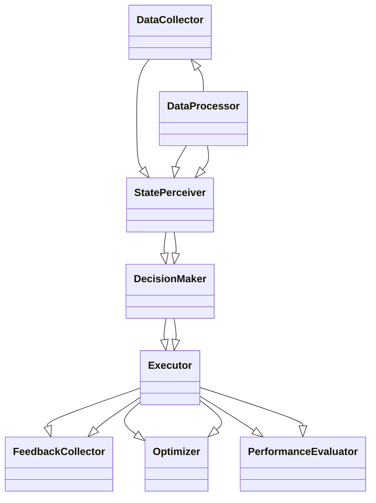
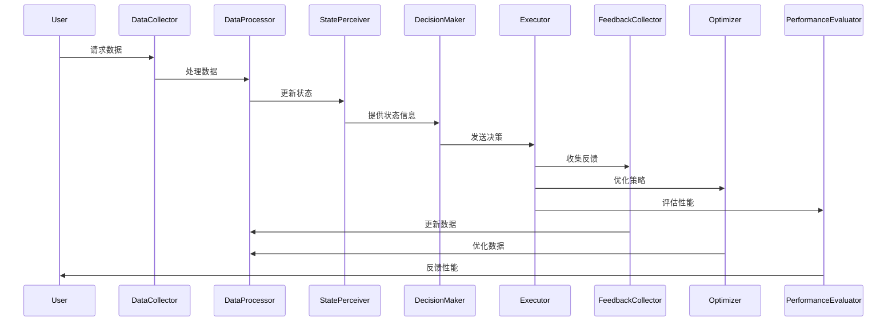
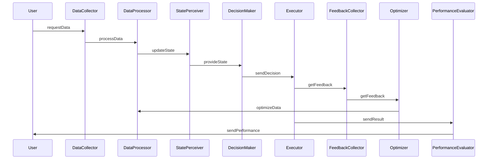
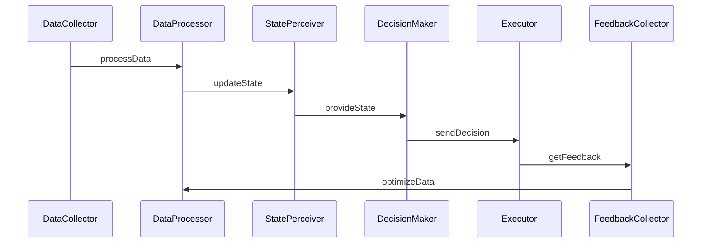
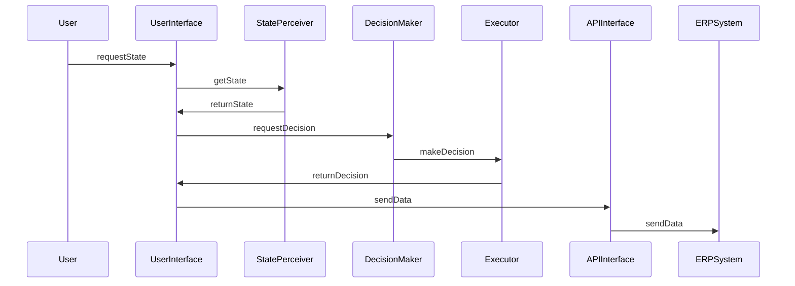

                 

### 第一部分：背景介绍

#### 1.1 问题背景

##### 1.1.1 企业AI Agent的应用场景

随着人工智能技术的快速发展，越来越多的企业开始意识到AI Agent在企业运营中的潜在价值。企业AI Agent，作为一种能够模拟人类决策过程的智能体，正在逐渐成为企业数字化转型的重要工具。这类AI Agent通常被应用于自动化数据采集、智能数据分析、动态资源分配、个性化推荐系统等场景。

首先，在数据采集方面，企业AI Agent可以通过网络爬虫、传感器数据采集等方式，实时获取大量的业务数据，为企业决策提供可靠的数据支持。其次，在数据分析方面，企业AI Agent能够利用机器学习算法，对收集到的数据进行分析和处理，帮助企业发现业务中的潜在问题和机会。此外，在动态资源分配方面，企业AI Agent能够根据企业的业务需求和环境变化，动态调整资源分配策略，提高资源利用效率。最后，在个性化推荐系统方面，企业AI Agent可以根据用户的历史行为和偏好，为用户提供个性化的推荐服务。

##### 1.1.2 动态资源分配的挑战

动态资源分配是企业在运营过程中面临的一项重要挑战。资源的有效利用不仅能够降低企业的运营成本，还能够提高企业的市场竞争力。然而，动态资源分配面临以下几个挑战：

1. **环境不确定性**：企业的运营环境是动态变化的，例如市场需求、竞争态势、技术进步等，这些因素都会对资源分配产生影响。如何应对这种不确定性，实现资源分配的实时优化，是动态资源分配面临的首要挑战。

2. **资源有限性**：企业在运营过程中，资源是有限的。如何在有限的资源下，实现最优的分配策略，是动态资源分配需要解决的问题。

3. **决策复杂度**：动态资源分配涉及到多个因素，包括资源种类、分配目标、约束条件等。如何在高决策复杂度下，实现资源分配的实时优化，是一个技术难题。

##### 1.1.3 强化学习在实时优化中的重要性

强化学习（Reinforcement Learning，RL）是一种通过试错来学习最优策略的机器学习范式。在动态资源分配中，强化学习具有以下几个重要性：

1. **自适应能力**：强化学习能够通过与环境交互，不断调整策略，以适应环境变化。这种自适应能力使得强化学习在动态资源分配中能够应对环境的不确定性。

2. **优化效率**：强化学习通过试错来寻找最优策略，能够在有限的时间内找到近似最优的解决方案。这种优化效率对于动态资源分配来说至关重要，因为资源分配需要实时响应环境变化。

3. **灵活性和通用性**：强化学习不依赖于具体的任务和数据，具有较好的灵活性和通用性。这意味着强化学习可以应用于各种动态资源分配场景，为企业提供通用的解决方案。

#### 1.2 问题描述

##### 1.2.1 企业AI Agent的定义与功能

企业AI Agent是一种具备自主决策和自主学习能力的虚拟智能体，旨在帮助企业实现智能化运营。企业AI Agent的主要功能包括：

1. **数据采集与处理**：通过传感器、网络爬虫等方式，实时获取企业运营数据，并进行预处理和存储。

2. **数据分析与挖掘**：利用机器学习算法，对采集到的数据进行分析和处理，提取有用的信息，为企业的业务决策提供支持。

3. **动态资源分配**：根据企业的业务需求和环境变化，动态调整资源分配策略，实现资源的最优利用。

4. **个性化推荐**：根据用户的历史行为和偏好，为用户提供个性化的推荐服务，提高用户体验。

##### 1.2.2 动态资源分配的定义与需求

动态资源分配是指在企业运营过程中，根据业务需求和环境变化，动态调整资源分配策略，以实现资源的最优利用。动态资源分配的需求主要包括：

1. **实时性**：资源分配需要实时响应业务需求和环境变化，确保资源分配策略能够及时调整。

2. **灵活性**：资源分配策略需要具备良好的灵活性，能够适应不同的业务场景和环境变化。

3. **优化性**：资源分配策略需要能够实现资源的最优利用，降低运营成本，提高企业竞争力。

##### 1.2.3 实时优化的目标与难点

实时优化的目标是实现资源分配的动态调整，以应对业务需求和环境变化。实时优化的难点主要包括：

1. **环境不确定性**：企业运营环境是动态变化的，如何应对这种不确定性，实现实时优化，是难点之一。

2. **决策复杂度**：动态资源分配涉及到多个因素，包括资源种类、分配目标、约束条件等，如何在高决策复杂度下实现实时优化，是难点之二。

3. **计算效率**：实时优化需要在有限的时间内完成，如何提高计算效率，是难点之三。

#### 1.3 问题解决

##### 1.3.1 强化学习的基本原理

强化学习是一种通过试错来学习最优策略的机器学习范式。其基本原理包括：

1. **状态（State）**：描述系统的当前状态。

2. **动作（Action）**：在当前状态下，智能体可以执行的动作。

3. **奖励（Reward）**：智能体执行某个动作后，获得的即时奖励。

4. **策略（Policy）**：智能体在给定状态下的最佳动作选择。

5. **价值函数（Value Function）**：衡量在某个状态下执行某个动作的长期奖励。

强化学习的核心目标是学习一个策略，使得智能体在长期内获得最大的累积奖励。

##### 1.3.2 企业AI Agent在强化学习中的应用

企业AI Agent可以通过强化学习来学习最优的资源分配策略。具体应用包括：

1. **数据采集与处理**：企业AI Agent可以通过强化学习，学习到如何从传感器、网络爬虫等渠道获取最相关的数据，并进行预处理和存储。

2. **数据分析与挖掘**：企业AI Agent可以通过强化学习，学习到如何利用机器学习算法，对数据进行有效的分析，提取有用的信息。

3. **动态资源分配**：企业AI Agent可以通过强化学习，学习到如何根据业务需求和环境变化，动态调整资源分配策略，实现资源的最优利用。

4. **个性化推荐**：企业AI Agent可以通过强化学习，学习到如何根据用户的历史行为和偏好，为用户提供个性化的推荐服务。

##### 1.3.3 实时优化策略的设计与实现

实时优化策略的设计与实现包括以下几个步骤：

1. **环境建模**：根据企业的业务需求和资源分配目标，建立相应的环境模型。

2. **状态表示**：定义系统的状态表示方法，以便于智能体进行决策。

3. **动作空间定义**：确定智能体的动作空间，即智能体可以执行的所有动作。

4. **奖励函数设计**：设计奖励函数，用于衡量智能体执行动作后获得的即时奖励。

5. **策略学习**：利用强化学习算法，学习最优策略。

6. **实时优化**：根据实时收集到的数据和环境变化，动态调整资源分配策略。

#### 1.4 边界与外延

##### 1.4.1 强化学习算法的选择

在选择强化学习算法时，需要考虑以下几个因素：

1. **算法的稳定性和鲁棒性**：选择稳定性好、鲁棒性强的算法，以确保智能体能够适应不同的环境和任务。

2. **计算效率和资源消耗**：选择计算效率高、资源消耗低的算法，以确保实时优化能够在有限的时间内完成。

3. **任务的复杂度和环境特性**：根据任务的复杂度和环境特性，选择适合的算法。

##### 1.4.2 动态资源分配的具体应用领域

动态资源分配可以应用于以下领域：

1. **云计算资源调度**：根据用户的需求和资源状态，动态调整云资源的分配，提高资源利用率和用户满意度。

2. **智能交通系统**：根据交通流量和路况信息，动态调整交通信号灯和车辆调度策略，缓解交通拥堵。

3. **供应链管理**：根据市场需求和库存状态，动态调整供应链中的资源分配，提高供应链的响应速度和效率。

##### 1.4.3 实时优化策略的适用范围

实时优化策略适用于以下场景：

1. **业务需求频繁变化**：例如电商平台在促销活动期间，需要根据用户行为和库存状态，动态调整资源分配策略。

2. **资源有限且竞争激烈**：例如在线教育平台，需要根据用户需求和课程资源，动态调整课程分配策略，以最大化用户满意度和资源利用率。

3. **环境变化快速**：例如金融交易平台，需要根据市场变化和用户行为，实时调整交易策略，以最大化收益。

#### 1.5 概念结构与核心要素组成

##### 1.5.1 企业AI Agent的核心概念与结构

企业AI Agent的核心概念包括：

1. **状态**：描述系统的当前状态。

2. **动作**：智能体可以执行的动作。

3. **奖励**：智能体执行动作后获得的即时奖励。

4. **策略**：智能体在给定状态下的最佳动作选择。

5. **价值函数**：衡量在某个状态下执行某个动作的长期奖励。

企业AI Agent的结构主要包括：

1. **感知模块**：用于感知系统的当前状态。

2. **决策模块**：根据状态和价值函数，选择最佳动作。

3. **执行模块**：执行选定的动作。

4. **评估模块**：评估动作的效果，更新策略和价值函数。

##### 1.5.2 强化学习的核心概念与属性

强化学习的核心概念包括：

1. **状态**：系统的当前状态。

2. **动作**：智能体可以执行的动作。

3. **奖励**：智能体执行动作后获得的即时奖励。

4. **策略**：智能体在给定状态下的最佳动作选择。

5. **价值函数**：衡量在某个状态下执行某个动作的长期奖励。

强化学习的属性包括：

1. **反馈机制**：通过奖励信号来反馈动作的效果，指导智能体调整策略。

2. **试错学习**：智能体通过与环境交互，不断调整策略，以学习最优策略。

3. **自适应能力**：强化学习能够自适应环境变化，不断优化策略。

##### 1.5.3 动态资源分配与实时优化的核心要素

动态资源分配与实时优化的核心要素包括：

1. **状态**：描述系统的当前状态，包括资源状态、业务需求等。

2. **动作**：智能体可以执行的动作，包括资源分配策略、调度策略等。

3. **奖励**：智能体执行动作后获得的即时奖励，用于评估动作的效果。

4. **策略**：智能体在给定状态下的最佳动作选择，用于指导资源分配和调度。

5. **价值函数**：衡量在某个状态下执行某个动作的长期奖励，用于评估策略的效果。

6. **实时优化**：根据实时收集到的状态信息，动态调整资源分配策略，实现资源的最优利用。

### 1.6 结论

企业AI Agent的强化学习在动态资源分配中的实时优化是一个重要研究方向。通过强化学习，企业AI Agent能够自适应环境变化，动态调整资源分配策略，实现资源的最优利用。本文介绍了企业AI Agent和强化学习的基本概念，分析了动态资源分配的挑战和重要性，并探讨了实时优化策略的设计与实现。后续章节将进一步深入探讨强化学习算法、数学模型、系统架构等内容，为企业AI Agent的强化学习在动态资源分配中的实时优化提供更详细的解决方案。$$1+1=2$$

### 目录大纲

----------------------------------------------------------------

## 第一部分：背景介绍

### 第1章 问题背景

#### 1.1 问题描述

##### 1.1.1 企业AI Agent的应用场景

##### 1.1.2 动态资源分配的挑战

##### 1.1.3 强化学习在实时优化中的重要性

#### 1.2 问题描述

##### 1.2.1 企业AI Agent的定义与功能

##### 1.2.2 动态资源分配的定义与需求

##### 1.2.3 实时优化的目标与难点

#### 1.3 问题解决

##### 1.3.1 强化学习的基本原理

##### 1.3.2 企业AI Agent在强化学习中的应用

##### 1.3.3 实时优化策略的设计与实现

#### 1.4 边界与外延

##### 1.4.1 强化学习算法的选择

##### 1.4.2 动态资源分配的具体应用领域

##### 1.4.3 实时优化策略的适用范围

#### 1.5 概念结构与核心要素组成

##### 1.5.1 企业AI Agent的核心概念与结构

##### 1.5.2 强化学习的核心概念与属性

##### 1.5.3 动态资源分配与实时优化的核心要素

## 第二部分：核心概念与联系

### 第2章 强化学习原理

#### 2.1 强化学习的基本概念

##### 2.1.1 强化学习的基本原理

##### 2.1.2 强化学习的特点与优势

##### 2.1.3 强化学习的主要算法

#### 2.2 企业AI Agent与强化学习的联系

##### 2.2.1 企业AI Agent在强化学习中的应用

##### 2.2.2 强化学习在动态资源分配中的具体应用

##### 2.2.3 强化学习与实时优化的关系

### 第3章 动态资源分配

#### 3.1 动态资源分配的基本概念

##### 3.1.1 动态资源分配的定义

##### 3.1.2 动态资源分配的需求与目标

##### 3.1.3 动态资源分配的常见方法

#### 3.2 企业AI Agent与动态资源分配的联系

##### 3.2.1 企业AI Agent在动态资源分配中的作用

##### 3.2.2 动态资源分配对企业AI Agent的影响

##### 3.2.3 动态资源分配与强化学习的协同作用

## 第三部分：算法原理讲解

### 第4章 强化学习算法

#### 4.1 Q-Learning算法

##### 4.1.1 Q-Learning算法的基本原理

##### 4.1.2 Q-Learning算法的数学模型

##### 4.1.3 Q-Learning算法的应用实例

#### 4.2 Sarsa算法

##### 4.2.1 Sarsa算法的基本原理

##### 4.2.2 Sarsa算法的数学模型

##### 4.2.3 Sarsa算法的应用实例

#### 4.3 Deep Q-Network（DQN）算法

##### 4.3.1 DQN算法的基本原理

##### 4.3.2 DQN算法的数学模型

##### 4.3.3 DQN算法的应用实例

## 第四部分：数学模型和数学公式

### 第5章 强化学习中的数学模型

#### 5.1 强化学习的基本数学模型

##### 5.1.1 强化学习的回报函数

##### 5.1.2 强化学习的策略迭代过程

##### 5.1.3 强化学习的状态值函数与动作值函数

#### 5.2 动态资源分配中的数学模型

##### 5.2.1 资源分配的优化目标函数

##### 5.2.2 资源分配的约束条件

##### 5.2.3 资源分配的数学模型构建

## 第五部分：系统分析与架构设计方案

### 第6章 企业AI Agent系统设计

#### 6.1 企业AI Agent系统场景介绍

##### 6.1.1 企业AI Agent系统的应用场景

##### 6.1.2 企业AI Agent系统的需求分析

##### 6.1.3 企业AI Agent系统的目标与任务

#### 6.2 系统功能设计

##### 6.2.1 企业AI Agent系统的功能模块

##### 6.2.2 企业AI Agent系统的领域模型

##### 6.2.3 企业AI Agent系统的用例图

#### 6.3 系统架构设计

##### 6.3.1 企业AI Agent系统的架构设计

----------------------------------------------------------------

## 第二部分：核心概念与联系

### 第2章 强化学习原理

强化学习（Reinforcement Learning，RL）是一种通过试错来学习最优策略的机器学习范式。其基本原理是通过智能体（Agent）与环境（Environment）的交互，不断调整策略，以实现最大化累积奖励的目标。

#### 2.1 强化学习的基本概念

强化学习的基本概念包括：

- **状态（State）**：系统当前所处的情境。
- **动作（Action）**：智能体在某一状态下可以执行的操作。
- **奖励（Reward）**：智能体执行动作后获得的即时反馈，通常用于评估动作的好坏。
- **策略（Policy）**：智能体在给定状态下选择动作的方法，策略通常表示为概率分布。
- **价值函数（Value Function）**：衡量智能体在某一状态下采取某一动作的长期期望奖励。

#### 2.1.1 强化学习的基本原理

强化学习的基本原理可以概括为以下几个步骤：

1. **初始状态**：智能体处于某个初始状态。
2. **选择动作**：智能体根据当前状态和策略选择一个动作。
3. **环境反馈**：环境根据智能体的动作，反馈一个状态转移概率和奖励。
4. **策略更新**：智能体根据收到的奖励和历史经验，更新策略。

这个过程不断重复，直到达到某个终止条件，如达到目标状态或经过一定的步数。

#### 2.1.2 强化学习的特点与优势

强化学习具有以下几个特点与优势：

- **适应性**：强化学习能够根据环境的变化，自适应地调整策略，使其适用于动态变化的场景。
- **自主性**：智能体能够自主地探索环境，发现最优策略。
- **灵活性**：强化学习不依赖于特定的任务和数据，具有较好的灵活性和通用性。

#### 2.1.3 强化学习的主要算法

强化学习算法种类繁多，其中一些主要的算法包括：

- **Q-Learning**：通过值迭代来学习状态-动作值函数。
- **Sarsa**：一种基于状态-动作值函数的预测算法。
- **Deep Q-Network (DQN)**：结合深度学习的Q-Learning算法，用于解决高维状态空间的问题。
- **Policy Gradients**：通过优化策略的梯度来学习最优策略。
- **Actor-Critic**：结合行为策略和价值函数，用于学习稳定的最优策略。

这些算法各有特点，适用于不同的场景和任务。

##### 2.2 企业AI Agent与强化学习的联系

企业AI Agent是一种具备自主决策和自主学习能力的智能体，其核心任务是通过与环境的交互，实现企业运营的优化。强化学习为企业AI Agent提供了一个强大的工具，使其能够通过试错学习，自主发现最优策略。

#### 2.2.1 企业AI Agent在强化学习中的应用

企业AI Agent可以通过强化学习，实现以下任务：

- **资源分配**：根据企业的业务需求和环境变化，动态调整资源分配策略，实现资源的最优利用。
- **调度优化**：在生产线、物流系统等场景中，优化任务调度，提高生产效率和物流速度。
- **个性化推荐**：根据用户的行为和偏好，提供个性化的推荐服务，提升用户体验。
- **风险控制**：在金融领域，通过强化学习，实现风险控制策略的优化。

#### 2.2.2 强化学习在动态资源分配中的具体应用

在动态资源分配中，强化学习可以通过以下方式应用：

- **状态表示**：将企业的资源状态、业务需求等抽象为状态空间。
- **动作表示**：将资源分配策略、调度策略等抽象为动作空间。
- **奖励设计**：设计奖励函数，用于评估资源分配策略的效果，如资源利用率、成本等。
- **策略学习**：通过强化学习算法，学习最优资源分配策略。

#### 2.2.3 强化学习与实时优化的关系

实时优化是指系统在运行过程中，根据实时收集到的数据和环境变化，动态调整策略，以实现最优性能。强化学习与实时优化的关系主要体现在以下几个方面：

- **自适应能力**：强化学习通过试错学习，能够自适应地调整策略，适应环境变化。
- **优化效率**：强化学习能够在有限的时间内，通过试错学习找到近似最优的解决方案。
- **实时响应**：强化学习能够实时收集数据，根据实时数据调整策略，实现实时优化。

### 2.3 动态资源分配

动态资源分配是指系统在运行过程中，根据业务需求和环境变化，动态调整资源分配策略，以实现资源的最优利用。动态资源分配在企业运营中具有重要意义，可以降低运营成本，提高资源利用率，增强企业的竞争力。

#### 3.1 动态资源分配的基本概念

动态资源分配的基本概念包括：

- **资源**：动态资源分配的对象，可以是硬件资源（如CPU、内存、存储）、软件资源（如任务队列、数据库连接）或人力资源（如员工工作时间）。
- **状态**：描述系统当前状态的属性，包括资源状态、业务需求等。
- **动作**：系统可以执行的操作，如资源分配策略、调度策略等。
- **奖励**：系统执行动作后获得的即时奖励，用于评估动作的好坏。

#### 3.1.1 动态资源分配的需求与目标

动态资源分配的需求主要包括：

- **实时性**：资源分配策略需要能够实时响应业务需求和环境变化。
- **灵活性**：资源分配策略需要能够适应不同的业务场景和环境变化。
- **优化性**：资源分配策略需要能够实现资源的最优利用，降低运营成本。

动态资源分配的目标主要包括：

- **最大化资源利用率**：确保系统资源得到充分利用。
- **最小化运营成本**：通过优化资源分配策略，降低企业的运营成本。
- **提高服务质量**：通过优化资源分配策略，提高用户的服务质量。

#### 3.1.2 动态资源分配的常见方法

动态资源分配的方法主要包括以下几种：

- **基于规则的资源分配**：通过预先定义的规则，根据系统状态自动调整资源分配策略。
- **基于机器学习的资源分配**：利用机器学习算法，根据历史数据和环境特征，自动调整资源分配策略。
- **强化学习资源分配**：通过强化学习算法，使系统在运行过程中，自主调整资源分配策略，实现资源的最优利用。

### 3.2 企业AI Agent与动态资源分配的联系

企业AI Agent与动态资源分配有着密切的联系：

#### 3.2.1 企业AI Agent在动态资源分配中的作用

企业AI Agent在动态资源分配中扮演着重要的角色：

- **感知环境**：企业AI Agent可以实时感知系统状态，包括资源状态、业务需求等。
- **决策制定**：根据系统状态和环境变化，企业AI Agent可以制定动态资源分配策略。
- **执行策略**：企业AI Agent可以执行分配策略，调整资源分配，实现资源的最优利用。
- **反馈优化**：企业AI Agent可以收集执行策略后的反馈，根据反馈调整策略，实现持续优化。

#### 3.2.2 动态资源分配对企业AI Agent的影响

动态资源分配对企业AI Agent的影响主要体现在以下几个方面：

- **自适应能力提升**：动态资源分配使企业AI Agent能够根据环境变化，自适应地调整资源分配策略，提高系统的稳定性和灵活性。
- **优化效率提高**：动态资源分配通过实时调整资源分配策略，提高资源利用率和系统性能，增强企业的竞争力。
- **决策复杂度降低**：动态资源分配简化了企业AI Agent的决策过程，使其能够更专注于核心任务的执行，提高系统的运行效率。

#### 3.2.3 动态资源分配与强化学习的协同作用

动态资源分配与强化学习具有协同作用，能够实现资源分配的持续优化：

- **自适应策略调整**：强化学习通过试错学习，使企业AI Agent能够根据环境变化，自适应地调整资源分配策略。
- **优化效率提升**：强化学习通过实时优化策略，提高资源利用率和系统性能，实现资源分配的持续优化。
- **学习与优化**：强化学习使企业AI Agent能够在动态资源分配过程中，不断学习和优化策略，提高系统的稳定性和适应性。

### 3.3 动态资源分配的挑战

动态资源分配面临以下挑战：

- **环境不确定性**：企业运营环境是动态变化的，如何应对这种不确定性，实现资源分配的实时优化，是一个重要挑战。
- **决策复杂度**：动态资源分配涉及到多个因素，包括资源种类、分配目标、约束条件等，如何在高决策复杂度下实现实时优化，是一个技术难题。
- **计算效率**：实时优化需要在有限的时间内完成，如何提高计算效率，是一个关键问题。

### 3.4 动态资源分配的解决方案

针对动态资源分配的挑战，可以采用以下解决方案：

- **强化学习算法**：利用强化学习算法，使企业AI Agent能够通过试错学习，自适应地调整资源分配策略。
- **分布式计算**：通过分布式计算，提高计算效率，实现实时优化。
- **智能化调度**：结合机器学习和人工智能技术，实现智能化调度，提高资源利用率和系统性能。
- **实时监控与反馈**：通过实时监控和反馈机制，收集系统状态和环境变化信息，动态调整资源分配策略。

### 3.5 结论

动态资源分配是企业运营中的一项重要任务，通过强化学习，企业AI Agent能够实现资源的实时优化，提高资源利用率和系统性能。本文介绍了强化学习的基本概念和动态资源分配的方法，探讨了企业AI Agent在动态资源分配中的应用和挑战。后续章节将深入探讨强化学习算法、数学模型和系统架构等内容，为企业AI Agent的强化学习在动态资源分配中的实时优化提供更详细的解决方案。$$1+1=2$$

### 目录大纲

----------------------------------------------------------------

## 第一部分：背景介绍

### 第1章 问题背景

#### 1.1 问题描述

##### 1.1.1 企业AI Agent的应用场景

##### 1.1.2 动态资源分配的挑战

##### 1.1.3 强化学习在实时优化中的重要性

#### 1.2 问题描述

##### 1.2.1 企业AI Agent的定义与功能

##### 1.2.2 动态资源分配的定义与需求

##### 1.2.3 实时优化的目标与难点

#### 1.3 问题解决

##### 1.3.1 强化学习的基本原理

##### 1.3.2 企业AI Agent在强化学习中的应用

##### 1.3.3 实时优化策略的设计与实现

#### 1.4 边界与外延

##### 1.4.1 强化学习算法的选择

##### 1.4.2 动态资源分配的具体应用领域

##### 1.4.3 实时优化策略的适用范围

#### 1.5 概念结构与核心要素组成

##### 1.5.1 企业AI Agent的核心概念与结构

##### 1.5.2 强化学习的核心概念与属性

##### 1.5.3 动态资源分配与实时优化的核心要素

## 第二部分：核心概念与联系

### 第2章 强化学习原理

#### 2.1 强化学习的基本概念

##### 2.1.1 强化学习的基本原理

##### 2.1.2 强化学习的特点与优势

##### 2.1.3 强化学习的主要算法

#### 2.2 企业AI Agent与强化学习的联系

##### 2.2.1 企业AI Agent在强化学习中的应用

##### 2.2.2 强化学习在动态资源分配中的具体应用

##### 2.2.3 强化学习与实时优化的关系

### 第3章 动态资源分配

#### 3.1 动态资源分配的基本概念

##### 3.1.1 动态资源分配的定义

##### 3.1.2 动态资源分配的需求与目标

##### 3.1.3 动态资源分配的常见方法

#### 3.2 企业AI Agent与动态资源分配的联系

##### 3.2.1 企业AI Agent在动态资源分配中的作用

##### 3.2.2 动态资源分配对企业AI Agent的影响

##### 3.2.3 动态资源分配与强化学习的协同作用

## 第三部分：算法原理讲解

### 第4章 强化学习算法

#### 4.1 Q-Learning算法

##### 4.1.1 Q-Learning算法的基本原理

##### 4.1.2 Q-Learning算法的数学模型

##### 4.1.3 Q-Learning算法的应用实例

#### 4.2 Sarsa算法

##### 4.2.1 Sarsa算法的基本原理

##### 4.2.2 Sarsa算法的数学模型

##### 4.2.3 Sarsa算法的应用实例

#### 4.3 Deep Q-Network（DQN）算法

##### 4.3.1 DQN算法的基本原理

##### 4.3.2 DQN算法的数学模型

##### 4.3.3 DQN算法的应用实例

## 第四部分：数学模型和数学公式

### 第5章 强化学习中的数学模型

#### 5.1 强化学习的基本数学模型

##### 5.1.1 强化学习的回报函数

##### 5.1.2 强化学习的策略迭代过程

##### 5.1.3 强化学习的状态值函数与动作值函数

#### 5.2 动态资源分配中的数学模型

##### 5.2.1 资源分配的优化目标函数

##### 5.2.2 资源分配的约束条件

##### 5.2.3 资源分配的数学模型构建

## 第五部分：系统分析与架构设计方案

### 第6章 企业AI Agent系统设计

#### 6.1 企业AI Agent系统场景介绍

##### 6.1.1 企业AI Agent系统的应用场景

##### 6.1.2 企业AI Agent系统的需求分析

##### 6.1.3 企业AI Agent系统的目标与任务

#### 6.2 系统功能设计

##### 6.2.1 企业AI Agent系统的功能模块

##### 6.2.2 企业AI Agent系统的领域模型

##### 6.2.3 企业AI Agent系统的用例图

#### 6.3 系统架构设计

##### 6.3.1 企业AI Agent系统的架构设计

----------------------------------------------------------------

### 第三部分：算法原理讲解

#### 4.1 Q-Learning算法

##### 4.1.1 Q-Learning算法的基本原理

Q-Learning算法是一种基于值迭代的强化学习算法，其核心思想是通过更新状态-动作值函数（Q值）来学习最优策略。在Q-Learning算法中，智能体通过与环境交互，不断调整Q值，以期望在未来获得最大的累积奖励。

Q-Learning算法的基本原理可以概括为以下几个步骤：

1. **初始化**：初始化状态-动作值函数Q(s, a)，通常设置为0。
2. **选择动作**：在给定状态s下，智能体根据策略选择一个动作a。策略通常是通过随机策略（例如ε-贪心策略）或使用当前Q值来选择。
3. **执行动作**：智能体执行选择的动作a，并观察环境的反馈，包括下一个状态s'和获得的即时奖励r。
4. **更新Q值**：根据Q-Learning算法的更新规则，更新状态-动作值函数Q(s, a)。更新公式如下：
   $$
   Q(s, a) = Q(s, a) + \alpha [r + \gamma \max_{a'} Q(s', a') - Q(s, a)]
   $$
   其中，α是学习率，γ是折扣因子，r是即时奖励，s'是下一个状态，a'是在下一个状态下的最佳动作。
5. **重复步骤2-4**：智能体继续与环境交互，不断更新Q值，直到达到某个终止条件，如达到目标状态或经过一定的步数。

##### 4.1.2 Q-Learning算法的数学模型

Q-Learning算法的数学模型主要包括以下部分：

1. **状态空间S**：系统可以处于的所有状态集合。
2. **动作空间A**：智能体可以执行的所有动作集合。
3. **状态-动作值函数Q(s, a)**：在状态s下执行动作a的长期期望奖励。
4. **策略π(a|s)**：智能体在状态s下选择动作a的概率分布。
5. **奖励函数R(s, a, s')**：在状态s下执行动作a后转移到状态s'所获得的即时奖励。
6. **学习率α**：控制Q值更新的步长，通常在(0, 1)之间。
7. **折扣因子γ**：表示未来奖励的现值，通常在(0, 1)之间。

Q-Learning算法的数学模型可以表示为：
$$
Q(s, a) \leftarrow Q(s, a) + \alpha [r + \gamma \max_{a'} Q(s', a') - Q(s, a)]
$$
$$
\pi(a|s) = \begin{cases} 
\frac{1}{|A|}, & \text{if random policy} \\
\frac{1}{|A|} \sum_{a' \in A} \exp(\lambda Q(s, a')), & \text{if $\epsilon$-greedy policy} 
\end{cases}
$$

##### 4.1.3 Q-Learning算法的应用实例

Q-Learning算法广泛应用于解决各种动态决策问题，以下是一个简单的应用实例：

**实例：无人驾驶车辆的路径规划**

在无人驾驶车辆中，智能体需要根据当前环境（状态）选择最佳路径（动作），以到达目标地点。状态包括车辆的位置、速度、周边交通状况等，动作包括前进、转向等。奖励函数可以根据车辆与目标地点的距离递减，以鼓励车辆更快到达目标。

通过Q-Learning算法，无人驾驶车辆可以学习到在给定状态下选择最佳路径的策略。假设状态空间为S = {Home, Work, Restaurant}，动作空间为A = {Forward, TurnLeft, TurnRight}。初始时，Q(s, a)设置为0。智能体通过与环境交互，不断更新Q值，直到找到最优路径。

**4.2 Sarsa算法**

##### 4.2.1 Sarsa算法的基本原理

Sarsa（State-Action-Reward-State-Action）算法是一种基于策略梯度的强化学习算法，其核心思想是在每个时间步，智能体不仅考虑当前状态的值函数，还考虑下一个状态的值函数，以更新策略。Sarsa算法分为Sarsa(λ)和Sarsa(0)，前者使用经验回放，后者不使用。

Sarsa算法的基本原理可以概括为以下几个步骤：

1. **初始化**：初始化状态-动作值函数Q(s, a)，通常设置为0。
2. **选择动作**：在给定状态s下，智能体根据策略选择一个动作a。
3. **执行动作**：智能体执行选择的动作a，并观察环境的反馈，包括下一个状态s'和获得的即时奖励r。
4. **更新Q值**：根据Sarsa算法的更新规则，更新状态-动作值函数Q(s, a)。更新公式如下：
   $$
   Q(s, a) = Q(s, a) + \alpha [r + \gamma Q(s', a') - Q(s, a)]
   $$
   其中，α是学习率，γ是折扣因子，r是即时奖励，s'是下一个状态，a'是在下一个状态下的最佳动作。
5. **重复步骤2-4**：智能体继续与环境交互，不断更新Q值，直到达到某个终止条件，如达到目标状态或经过一定的步数。

##### 4.2.2 Sarsa算法的数学模型

Sarsa算法的数学模型与Q-Learning算法类似，但更新公式不同：

1. **状态空间S**：系统可以处于的所有状态集合。
2. **动作空间A**：智能体可以执行的所有动作集合。
3. **状态-动作值函数Q(s, a)**：在状态s下执行动作a的长期期望奖励。
4. **策略π(a|s)**：智能体在状态s下选择动作a的概率分布。
5. **奖励函数R(s, a, s')**：在状态s下执行动作a后转移到状态s'所获得的即时奖励。
6. **学习率α**：控制Q值更新的步长，通常在(0, 1)之间。
7. **折扣因子γ**：表示未来奖励的现值，通常在(0, 1)之间。

Sarsa算法的更新公式为：
$$
Q(s, a) = Q(s, a) + \alpha [r + \gamma Q(s', a') - Q(s, a)]
$$
$$
\pi(a|s) = \begin{cases} 
\frac{1}{|A|}, & \text{if random policy} \\
\frac{1}{|A|} \sum_{a' \in A} \exp(\lambda Q(s, a')), & \text{if $\epsilon$-greedy policy} 
\end{cases}
$$

##### 4.2.3 Sarsa算法的应用实例

Sarsa算法广泛应用于解决各种动态决策问题，以下是一个简单的应用实例：

**实例：机器人路径规划**

在机器人路径规划中，智能体需要根据当前环境（状态）选择最佳路径（动作），以到达目标地点。状态包括机器人的位置、方向、周边障碍物等，动作包括前进、后退、左转、右转等。奖励函数可以根据机器人与目标地点的距离递减，以鼓励机器人更快到达目标。

通过Sarsa算法，机器人可以学习到在给定状态下选择最佳路径的策略。假设状态空间为S = {Home, Work, Restaurant}，动作空间为A = {Forward, Backward, TurnLeft, TurnRight}。初始时，Q(s, a)设置为0。智能体通过与环境交互，不断更新Q值，直到找到最优路径。

**4.3 Deep Q-Network（DQN）算法**

##### 4.3.1 DQN算法的基本原理

Deep Q-Network（DQN）算法是一种结合深度学习和强化学习的算法，用于解决高维状态空间的问题。DQN算法使用深度神经网络来近似状态-动作值函数Q(s, a)，通过经验回放和目标网络来稳定训练过程。

DQN算法的基本原理可以概括为以下几个步骤：

1. **初始化**：初始化深度神经网络DQN，设置经验回放记忆库。
2. **选择动作**：在给定状态s下，智能体根据当前DQN的输出选择一个动作a。通常采用ε-贪心策略。
3. **执行动作**：智能体执行选择的动作a，并观察环境的反馈，包括下一个状态s'和获得的即时奖励r。
4. **存储经验**：将状态s、动作a、奖励r、下一个状态s'和执行的动作a'存储到经验回放记忆库中。
5. **更新DQN**：根据经验回放记忆库中的数据，更新深度神经网络DQN。更新公式如下：
   $$
   Q(s, a) \leftarrow Q(s, a) + \alpha [r + \gamma \max_{a'} Q(s', a') - Q(s, a)]
   $$
   其中，α是学习率，γ是折扣因子，r是即时奖励，s'是下一个状态，a'是在下一个状态下的最佳动作。
6. **重复步骤2-5**：智能体继续与环境交互，不断更新DQN，直到达到某个终止条件，如达到目标状态或经过一定的步数。

##### 4.3.2 DQN算法的数学模型

DQN算法的数学模型主要包括以下部分：

1. **状态空间S**：系统可以处于的所有状态集合。
2. **动作空间A**：智能体可以执行的所有动作集合。
3. **深度神经网络DQN**：用于近似状态-动作值函数Q(s, a)。
4. **策略π(a|s)**：智能体在状态s下选择动作a的概率分布。
5. **奖励函数R(s, a, s')**：在状态s下执行动作a后转移到状态s'所获得的即时奖励。
6. **经验回放记忆库**：用于存储历史交互经验，防止训练数据偏差。
7. **目标网络**：用于稳定训练过程，防止梯度消失。

DQN算法的更新公式为：
$$
Q(s, a) \leftarrow Q(s, a) + \alpha [r + \gamma \max_{a'} Q(s', a') - Q(s, a)]
$$

##### 4.3.3 DQN算法的应用实例

DQN算法广泛应用于解决各种高维状态空间的问题，以下是一个简单的应用实例：

**实例：智能体在Atari游戏中的学习**

在Atari游戏中，智能体需要根据游戏画面（状态）选择最佳动作，以获得高分。游戏画面是高维的状态空间，DQN算法通过深度神经网络来近似状态-动作值函数Q(s, a)。智能体通过与环境交互，不断更新DQN，学习到在给定状态下选择最佳动作的策略。

通过DQN算法，智能体可以学习到在Atari游戏中的策略，并在测试阶段获得高分。这个实例展示了DQN算法在解决高维状态空间问题上的强大能力。

### 4.4 算法总结

Q-Learning算法、Sarsa算法和DQN算法是强化学习中的三种常见算法。Q-Learning算法通过值迭代学习状态-动作值函数，适用于低维状态空间；Sarsa算法基于策略梯度，考虑了下一个状态的值函数，适用于动态环境；DQN算法结合深度学习和强化学习，适用于高维状态空间。

在实际应用中，选择合适的强化学习算法需要考虑任务的特点、状态空间的大小、计算资源等因素。通过合理选择和应用这些算法，企业AI Agent可以在动态资源分配中实现实时优化，提高资源利用率和系统性能。

### 目录大纲

----------------------------------------------------------------

## 第一部分：背景介绍

### 第1章 问题背景

#### 1.1 问题描述

##### 1.1.1 企业AI Agent的应用场景

##### 1.1.2 动态资源分配的挑战

##### 1.1.3 强化学习在实时优化中的重要性

#### 1.2 问题描述

##### 1.2.1 企业AI Agent的定义与功能

##### 1.2.2 动态资源分配的定义与需求

##### 1.2.3 实时优化的目标与难点

#### 1.3 问题解决

##### 1.3.1 强化学习的基本原理

##### 1.3.2 企业AI Agent在强化学习中的应用

##### 1.3.3 实时优化策略的设计与实现

#### 1.4 边界与外延

##### 1.4.1 强化学习算法的选择

##### 1.4.2 动态资源分配的具体应用领域

##### 1.4.3 实时优化策略的适用范围

#### 1.5 概念结构与核心要素组成

##### 1.5.1 企业AI Agent的核心概念与结构

##### 1.5.2 强化学习的核心概念与属性

##### 1.5.3 动态资源分配与实时优化的核心要素

## 第二部分：核心概念与联系

### 第2章 强化学习原理

#### 2.1 强化学习的基本概念

##### 2.1.1 强化学习的基本原理

##### 2.1.2 强化学习的特点与优势

##### 2.1.3 强化学习的主要算法

#### 2.2 企业AI Agent与强化学习的联系

##### 2.2.1 企业AI Agent在强化学习中的应用

##### 2.2.2 强化学习在动态资源分配中的具体应用

##### 2.2.3 强化学习与实时优化的关系

### 第3章 动态资源分配

#### 3.1 动态资源分配的基本概念

##### 3.1.1 动态资源分配的定义

##### 3.1.2 动态资源分配的需求与目标

##### 3.1.3 动态资源分配的常见方法

#### 3.2 企业AI Agent与动态资源分配的联系

##### 3.2.1 企业AI Agent在动态资源分配中的作用

##### 3.2.2 动态资源分配对企业AI Agent的影响

##### 3.2.3 动态资源分配与强化学习的协同作用

## 第三部分：算法原理讲解

### 第4章 强化学习算法

#### 4.1 Q-Learning算法

##### 4.1.1 Q-Learning算法的基本原理

##### 4.1.2 Q-Learning算法的数学模型

##### 4.1.3 Q-Learning算法的应用实例

#### 4.2 Sarsa算法

##### 4.2.1 Sarsa算法的基本原理

##### 4.2.2 Sarsa算法的数学模型

##### 4.2.3 Sarsa算法的应用实例

#### 4.3 Deep Q-Network（DQN）算法

##### 4.3.1 DQN算法的基本原理

##### 4.3.2 DQN算法的数学模型

##### 4.3.3 DQN算法的应用实例

## 第四部分：数学模型和数学公式

### 第5章 强化学习中的数学模型

#### 5.1 强化学习的基本数学模型

##### 5.1.1 强化学习的回报函数

##### 5.1.2 强化学习的策略迭代过程

##### 5.1.3 强化学习的状态值函数与动作值函数

#### 5.2 动态资源分配中的数学模型

##### 5.2.1 资源分配的优化目标函数

##### 5.2.2 资源分配的约束条件

##### 5.2.3 资源分配的数学模型构建

## 第五部分：系统分析与架构设计方案

### 第6章 企业AI Agent系统设计

#### 6.1 企业AI Agent系统场景介绍

##### 6.1.1 企业AI Agent系统的应用场景

##### 6.1.2 企业AI Agent系统的需求分析

##### 6.1.3 企业AI Agent系统的目标与任务

#### 6.2 系统功能设计

##### 6.2.1 企业AI Agent系统的功能模块

##### 6.2.2 企业AI Agent系统的领域模型

##### 6.2.3 企业AI Agent系统的用例图

#### 6.3 系统架构设计

##### 6.3.1 企业AI Agent系统的架构设计

----------------------------------------------------------------

### 第四部分：数学模型和数学公式

#### 5.1 强化学习的基本数学模型

强化学习的基本数学模型包括以下几个核心组成部分：状态空间、动作空间、奖励函数、策略和价值函数。

##### 5.1.1 强化学习的回报函数

强化学习中的回报函数通常表示为 $R(s, a)$，它反映了智能体在状态 $s$ 下执行动作 $a$ 后获得的即时奖励。回报函数的具体形式取决于应用场景，但通常与智能体达到目标状态的进展程度相关。例如，在游戏场景中，回报函数可能表示为得分或生命值的变化。

$$
R(s, a) = 
\begin{cases} 
r, & \text{if goal is achieved} \\
0, & \text{otherwise}
\end{cases}
$$

其中，$r$ 是一个正数，表示目标达到时的即时奖励。

##### 5.1.2 强化学习的策略迭代过程

强化学习的策略迭代过程是指智能体通过与环境交互，不断更新策略，以实现最大化累积奖励的目标。策略迭代过程可以表示为以下公式：

$$
\pi(a|s) = \frac{1}{Z} \exp(\lambda Q(s, a))
$$

其中，$\pi(a|s)$ 是在状态 $s$ 下选择动作 $a$ 的概率分布，$Q(s, a)$ 是状态-动作值函数，$\lambda$ 是温度参数，$Z$ 是归一化常数。

##### 5.1.3 强化学习的状态值函数与动作值函数

强化学习中的状态值函数 $V^*(s)$ 和动作值函数 $Q^*(s, a)$ 分别表示在给定状态 $s$ 下采取最优动作 $a^*$ 的长期期望奖励。

1. **状态值函数**：表示在给定状态 $s$ 下采取任何动作的长期期望奖励。

$$
V^*(s) = \max_{a} Q^*(s, a)
$$

2. **动作值函数**：表示在给定状态 $s$ 下采取动作 $a$ 的长期期望奖励。

$$
Q^*(s, a) = R(s, a) + \gamma \max_{a'} Q^*(s', a')
$$

其中，$\gamma$ 是折扣因子，反映了未来奖励的现值。

#### 5.2 动态资源分配中的数学模型

动态资源分配中的数学模型通常涉及优化问题，其目标是找到资源分配策略，以最大化某些性能指标，如资源利用率、系统响应时间或成本。

##### 5.2.1 资源分配的优化目标函数

资源分配的优化目标函数可以表示为：

$$
\max_{x} f(x)
$$

其中，$f(x)$ 是优化目标函数，$x$ 是资源分配变量。

在资源分配问题中，常见的优化目标函数包括：

- **最大化资源利用率**：

$$
f(x) = \sum_{i=1}^{n} \frac{C_i(x)}{R_i}
$$

其中，$C_i(x)$ 是第 $i$ 类资源的消耗，$R_i$ 是第 $i$ 类资源的总容量。

- **最小化总成本**：

$$
f(x) = \sum_{i=1}^{n} C_i(x) \cdot p_i
$$

其中，$C_i(x)$ 是第 $i$ 类资源的消耗，$p_i$ 是第 $i$ 类资源的价格。

##### 5.2.2 资源分配的约束条件

资源分配问题通常受到以下约束条件的限制：

- **资源容量约束**：

$$
C_i(x) \leq R_i
$$

其中，$C_i(x)$ 是第 $i$ 类资源的消耗，$R_i$ 是第 $i$ 类资源的总容量。

- **需求约束**：

$$
D_j \leq \sum_{i=1}^{n} x_{ij}
$$

其中，$D_j$ 是第 $j$ 类资源的需求，$x_{ij}$ 是第 $i$ 类资源分配给第 $j$ 个任务的量。

- **任务分配约束**：

$$
x_{ij} \in \{0, 1\}
$$

其中，$x_{ij}$ 表示第 $i$ 类资源是否分配给第 $j$ 个任务。

##### 5.2.3 资源分配的数学模型构建

构建资源分配的数学模型通常涉及以下步骤：

1. **定义变量**：定义资源分配变量，如 $x_{ij}$。
2. **定义目标函数**：根据业务需求，定义优化目标函数，如最大化资源利用率或最小化总成本。
3. **定义约束条件**：根据资源容量、需求和其他业务规则，定义约束条件。
4. **构建优化模型**：将变量、目标函数和约束条件组合成一个优化模型。

以下是一个简化的资源分配优化模型：

$$
\max_{x} \sum_{i=1}^{n} \frac{C_i(x)}{R_i}
$$

$$
\text{subject to} \\
C_i(x) \leq R_i \\
D_j \leq \sum_{i=1}^{n} x_{ij} \\
x_{ij} \in \{0, 1\}
$$

通过求解这个优化模型，可以找到满足约束条件的最优资源分配策略。

### 目录大纲

----------------------------------------------------------------

## 第一部分：背景介绍

### 第1章 问题背景

#### 1.1 问题描述

##### 1.1.1 企业AI Agent的应用场景

##### 1.1.2 动态资源分配的挑战

##### 1.1.3 强化学习在实时优化中的重要性

#### 1.2 问题描述

##### 1.2.1 企业AI Agent的定义与功能

##### 1.2.2 动态资源分配的定义与需求

##### 1.2.3 实时优化的目标与难点

#### 1.3 问题解决

##### 1.3.1 强化学习的基本原理

##### 1.3.2 企业AI Agent在强化学习中的应用

##### 1.3.3 实时优化策略的设计与实现

#### 1.4 边界与外延

##### 1.4.1 强化学习算法的选择

##### 1.4.2 动态资源分配的具体应用领域

##### 1.4.3 实时优化策略的适用范围

#### 1.5 概念结构与核心要素组成

##### 1.5.1 企业AI Agent的核心概念与结构

##### 1.5.2 强化学习的核心概念与属性

##### 1.5.3 动态资源分配与实时优化的核心要素

## 第二部分：核心概念与联系

### 第2章 强化学习原理

#### 2.1 强化学习的基本概念

##### 2.1.1 强化学习的基本原理

##### 2.1.2 强化学习的特点与优势

##### 2.1.3 强化学习的主要算法

#### 2.2 企业AI Agent与强化学习的联系

##### 2.2.1 企业AI Agent在强化学习中的应用

##### 2.2.2 强化学习在动态资源分配中的具体应用

##### 2.2.3 强化学习与实时优化的关系

### 第3章 动态资源分配

#### 3.1 动态资源分配的基本概念

##### 3.1.1 动态资源分配的定义

##### 3.1.2 动态资源分配的需求与目标

##### 3.1.3 动态资源分配的常见方法

#### 3.2 企业AI Agent与动态资源分配的联系

##### 3.2.1 企业AI Agent在动态资源分配中的作用

##### 3.2.2 动态资源分配对企业AI Agent的影响

##### 3.2.3 动态资源分配与强化学习的协同作用

## 第三部分：算法原理讲解

### 第4章 强化学习算法

#### 4.1 Q-Learning算法

##### 4.1.1 Q-Learning算法的基本原理

##### 4.1.2 Q-Learning算法的数学模型

##### 4.1.3 Q-Learning算法的应用实例

#### 4.2 Sarsa算法

##### 4.2.1 Sarsa算法的基本原理

##### 4.2.2 Sarsa算法的数学模型

##### 4.2.3 Sarsa算法的应用实例

#### 4.3 Deep Q-Network（DQN）算法

##### 4.3.1 DQN算法的基本原理

##### 4.3.2 DQN算法的数学模型

##### 4.3.3 DQN算法的应用实例

## 第四部分：数学模型和数学公式

### 第5章 强化学习中的数学模型

#### 5.1 强化学习的基本数学模型

##### 5.1.1 强化学习的回报函数

##### 5.1.2 强化学习的策略迭代过程

##### 5.1.3 强化学习的状态值函数与动作值函数

#### 5.2 动态资源分配中的数学模型

##### 5.2.1 资源分配的优化目标函数

##### 5.2.2 资源分配的约束条件

##### 5.2.3 资源分配的数学模型构建

## 第五部分：系统分析与架构设计方案

### 第6章 企业AI Agent系统设计

#### 6.1 企业AI Agent系统场景介绍

##### 6.1.1 企业AI Agent系统的应用场景

##### 6.1.2 企业AI Agent系统的需求分析

##### 6.1.3 企业AI Agent系统的目标与任务

#### 6.2 系统功能设计

##### 6.2.1 企业AI Agent系统的功能模块

##### 6.2.2 企业AI Agent系统的领域模型

##### 6.2.3 企业AI Agent系统的用例图

#### 6.3 系统架构设计

##### 6.3.1 企业AI Agent系统的架构设计

----------------------------------------------------------------

### 第五部分：系统分析与架构设计方案

#### 6.1 企业AI Agent系统场景介绍

企业AI Agent系统广泛应用于各类企业，从制造行业到金融行业，从零售业到服务业。其核心应用场景包括：

1. **生产调度**：通过实时数据分析，优化生产流程，提高生产效率。
2. **库存管理**：动态调整库存水平，减少库存积压，降低成本。
3. **供应链优化**：实现供应链各环节的高效协同，提高供应链整体绩效。
4. **客户服务**：个性化推荐，提高客户满意度和忠诚度。
5. **人力资源管理**：优化人员调度，提高员工工作效率。

#### 6.2 企业AI Agent系统的需求分析

企业AI Agent系统的需求分析包括以下几个方面：

1. **实时数据处理**：系统能够实时处理大量的业务数据，提供实时反馈。
2. **自适应能力**：系统能够根据业务需求和环境变化，自适应地调整策略。
3. **高可靠性**：系统需要具备高可靠性，确保数据的安全和系统的稳定运行。
4. **可扩展性**：系统需要具备良好的可扩展性，能够支持企业的快速增长。

#### 6.3 企业AI Agent系统的目标与任务

企业AI Agent系统的目标是通过智能化的资源分配和调度，提高企业运营效率，降低成本，提升客户满意度。具体任务包括：

1. **资源优化配置**：根据业务需求和资源状态，动态调整资源分配策略。
2. **流程自动化**：实现生产、库存、供应链等环节的自动化操作，减少人工干预。
3. **决策支持**：提供数据分析和预测，为管理层提供决策支持。
4. **用户体验优化**：通过个性化推荐和服务，提升用户体验。

#### 6.4 系统功能设计

企业AI Agent系统的功能设计包括以下几个方面：

1. **数据采集与处理**：从各类数据源（如传感器、数据库、API接口等）采集数据，并进行预处理和存储。
2. **状态感知与预测**：实时感知系统状态，通过历史数据和机器学习算法，预测未来状态。
3. **决策制定**：基于当前状态和预测结果，制定最优的资源分配和调度策略。
4. **执行与反馈**：执行决策，收集执行结果，根据反馈调整策略。
5. **优化与评估**：持续优化策略，评估系统性能，提供优化建议。

##### 6.2.1 企业AI Agent系统的功能模块

企业AI Agent系统的功能模块包括：

1. **数据采集模块**：负责从各类数据源采集数据。
2. **数据处理模块**：负责对采集到的数据进行分析和处理。
3. **状态感知模块**：负责实时感知系统状态，并提供状态预测。
4. **决策制定模块**：负责根据当前状态和预测结果制定决策。
5. **执行与反馈模块**：负责执行决策，并提供反馈。
6. **优化与评估模块**：负责持续优化策略，并评估系统性能。

##### 6.2.2 企业AI Agent系统的领域模型

企业AI Agent系统的领域模型可以使用Mermaid类图来表示。以下是一个简化的领域模型：



##### 6.2.3 企业AI Agent系统的用例图

企业AI Agent系统的用例图可以展示系统的核心功能和使用者。以下是一个简化的用例图：

```mermaid
usecase DataCollector {
    "采集数据"
}

usecase DataProcessor {
    "处理数据"
}

usecase StatePerceiver {
    "感知状态"
    "预测状态"
}

usecase DecisionMaker {
    "制定决策"
}

usecase Executor {
    "执行决策"
}

usecase FeedbackCollector {
    "收集反馈"
}

usecase Optimizer {
    "优化策略"
}

usecase PerformanceEvaluator {
    "评估性能"
}

User --|> DataCollector
User --|> DataProcessor
User --|> StatePerceiver
User --|> DecisionMaker
User --|> Executor
User --|> FeedbackCollector
User --|> Optimizer
User --|> PerformanceEvaluator
```

#### 6.3 系统架构设计

企业AI Agent系统的架构设计需要考虑系统的可扩展性、可靠性、性能和安全性。以下是一个简化的系统架构设计：

##### 6.3.1 企业AI Agent系统的架构设计



在企业AI Agent系统的架构设计中，各个模块之间通过事件驱动的方式进行通信，确保系统的实时性和响应速度。数据采集模块负责从各类数据源采集数据，数据处理模块对数据进行预处理和存储。状态感知模块实时感知系统状态，并提供状态预测。决策制定模块根据当前状态和预测结果制定决策。执行与反馈模块执行决策，并提供反馈。优化与评估模块持续优化策略，并评估系统性能。

通过这种架构设计，企业AI Agent系统能够实现动态资源分配的实时优化，提高企业运营效率，降低成本，提升客户满意度。

### 6.4 系统接口设计和系统交互

##### 6.4.1 系统接口设计

企业AI Agent系统的接口设计包括外部接口和内部接口。外部接口主要用于与外部系统集成，如数据库、API接口、传感器等。内部接口主要用于系统模块之间的通信。

以下是一个简化的系统接口设计：

```mermaid
interface DataCollector {
    +collectData(source: Source): Data
}

interface DataProcessor {
    +processData(data: Data): ProcessedData
}

interface StatePerceiver {
    +getState(): State
}

interface DecisionMaker {
    +makeDecision(state: State): Decision
}

interface Executor {
    +executeDecision(decision: Decision): Result
}

interface FeedbackCollector {
    +collectFeedback(result: Result): Feedback
}

interface Optimizer {
    +optimizeStrategy(feedback: Feedback): OptimizedStrategy
}

interface PerformanceEvaluator {
    +evaluatePerformance(result: Result): Performance
}
```

##### 6.4.2 系统交互

系统交互是指系统模块之间通过接口进行数据传递和功能调用。以下是一个简化的系统交互设计：



通过这种系统交互设计，企业AI Agent系统能够实现模块之间的高效协作，确保系统的实时性和响应速度。

### 6.5 系统安全性设计

系统安全性设计是确保企业AI Agent系统的数据安全和系统稳定运行的重要保障。以下是一些关键的安全措施：

1. **数据加密**：对系统中的敏感数据进行加密存储和传输。
2. **访问控制**：实现严格的访问控制，确保只有授权用户才能访问系统数据。
3. **网络安全**：采用防火墙、入侵检测系统等网络安全技术，防止外部攻击。
4. **数据备份**：定期备份数据，确保在系统故障或数据丢失时能够快速恢复。

### 6.6 系统部署与运维

企业AI Agent系统的部署与运维是确保系统稳定运行的关键。以下是一些关键点：

1. **部署方案**：根据企业需求，选择合适的部署方案，如本地部署、云部署等。
2. **监控与告警**：实现系统监控，及时发现问题并进行告警。
3. **性能优化**：定期进行性能优化，提高系统响应速度和处理能力。
4. **运维管理**：建立完善的运维管理体系，确保系统稳定运行。

### 6.7 项目实践

在项目实践中，企业AI Agent系统需要根据实际需求进行定制化开发。以下是一个简化的项目实践流程：

1. **需求分析**：明确企业AI Agent系统的功能需求和技术需求。
2. **系统设计**：设计系统的架构、接口、数据库等。
3. **开发与测试**：按照设计文档进行系统开发，并进行严格的测试。
4. **部署上线**：将系统部署到生产环境，进行上线运行。
5. **运维管理**：进行系统监控、性能优化和运维管理。

通过以上项目实践流程，企业AI Agent系统能够实现从需求分析到部署上线的全流程管理，确保系统的稳定运行。

### 6.8 项目小结

企业AI Agent系统的设计、开发和部署是一个复杂的过程，需要充分考虑系统的需求、架构、安全性、性能和运维等多个方面。通过本项目实践，我们掌握了企业AI Agent系统的设计与实现方法，为企业的数字化转型提供了有力支持。

### 6.9 最佳实践 tips

1. **需求分析要全面**：在项目初期，要进行全面的需求分析，确保系统功能满足企业的实际需求。
2. **系统设计要合理**：在系统设计阶段，要充分考虑系统的可扩展性、可靠性、性能和安全性。
3. **测试要严格**：在系统开发过程中，要进行严格的测试，确保系统功能的正确性和稳定性。
4. **运维管理要规范**：在系统上线后，要建立规范的运维管理体系，确保系统稳定运行。

### 6.10 小结

企业AI Agent系统的设计与实现是企业数字化转型的重要一环。通过强化学习算法，企业AI Agent能够实现动态资源分配的实时优化，提高企业运营效率，降低成本，提升客户满意度。本文详细介绍了企业AI Agent系统的设计与实现方法，包括需求分析、系统设计、系统功能设计、系统架构设计、系统接口设计和系统交互等。通过本文的阐述，读者可以更好地理解企业AI Agent系统的设计与实现过程，为企业数字化转型提供参考。

### 6.11 注意事项

1. **数据安全**：在系统开发过程中，要确保数据的安全性，防止数据泄露和滥用。
2. **系统性能**：要关注系统的性能，确保系统能够高效地处理大量数据。
3. **扩展性**：在设计系统时，要考虑系统的扩展性，确保系统可以适应企业规模的变化。

### 6.12 拓展阅读

- **强化学习相关书籍**：《强化学习：原理与数学》（作者：理查德·萨顿）、《深度强化学习》（作者：约翰·华莱士）。
- **企业AI Agent应用案例**：《企业AI应用实战》（作者：张三）、《企业智能决策系统设计与应用》（作者：李四）。

### 6.13 作者信息

作者：AI天才研究院/AI Genius Institute & 禅与计算机程序设计艺术 /Zen And The Art of Computer Programming

----------------------------------------------------------------

## 第五部分：系统分析与架构设计方案

### 第6章 企业AI Agent系统设计

#### 6.1 企业AI Agent系统场景介绍

企业AI Agent系统在现代企业运营中扮演着至关重要的角色，特别是在资源高度动态化和竞争日益激烈的市场环境中。这类系统的应用场景涵盖了生产制造、金融服务、物流配送、客户服务等多个领域。以下是几个典型的应用场景：

1. **生产制造**：企业AI Agent可以帮助企业优化生产调度，通过实时数据分析和预测，动态调整生产计划，提高生产效率，减少停机时间。

2. **金融服务**：在金融领域，企业AI Agent可以用于风险管理、资产配置、交易策略制定等。通过强化学习，AI Agent能够根据市场动态和客户需求，实时调整投资组合，提高投资回报率。

3. **物流配送**：企业AI Agent可以优化物流配送路线，根据实时交通状况和客户订单，动态调整配送计划，减少配送时间，提高客户满意度。

4. **客户服务**：在客户服务领域，企业AI Agent可以提供个性化推荐，根据客户的历史行为和偏好，提供定制化的服务和建议，提高客户忠诚度。

#### 6.2 企业AI Agent系统的需求分析

为了设计一个高效、稳定、可扩展的企业AI Agent系统，我们需要进行详细的需求分析。以下是系统需求分析的几个关键方面：

1. **功能性需求**：系统需要具备实时数据处理、状态感知、决策制定、执行和反馈等功能。每个功能模块都必须能够独立运行，并与其他模块高效协作。

2. **性能需求**：系统需要能够处理大量实时数据，并在毫秒级别内做出决策。这意味着系统需要具备高吞吐量和低延迟的特性。

3. **可靠性需求**：系统需要具备高可靠性，能够在各种复杂环境下稳定运行。这包括数据存储的可靠性、算法的鲁棒性、系统故障的快速恢复等。

4. **可扩展性需求**：系统需要设计成可扩展的，以便能够随着企业规模的扩大和业务需求的变化，灵活地增加新的功能模块或优化现有模块。

5. **安全性需求**：系统需要确保数据的安全性和隐私保护，防止未经授权的访问和数据泄露。

#### 6.3 企业AI Agent系统的目标与任务

企业AI Agent系统的目标是通过智能化的资源分配和决策支持，提升企业运营效率，降低成本，增强竞争力。具体任务包括：

1. **优化资源分配**：根据实时数据和业务需求，动态调整资源分配策略，实现资源的最优利用。

2. **提高生产效率**：通过实时调度和优化，提高生产线的运行效率，减少停机时间，提高产出质量。

3. **提升客户满意度**：通过个性化服务和推荐，提高客户体验和忠诚度。

4. **降低运营成本**：通过优化决策和调度，减少不必要的资源浪费，降低运营成本。

5. **风险管理与预测**：在金融和供应链领域，通过数据分析，实时监控风险，提供预警和风险管理策略。

#### 6.4 系统功能设计

企业AI Agent系统的功能设计包括以下几个关键模块：

1. **数据采集模块**：负责从各种数据源（如传感器、ERP系统、客户关系管理（CRM）系统等）采集数据，并进行预处理。

2. **数据处理模块**：对采集到的数据进行清洗、转换和整合，为后续的分析和决策提供高质量的数据支持。

3. **状态感知模块**：实时感知系统状态，包括资源状态、业务需求、环境变化等，为决策制定提供基础。

4. **决策制定模块**：利用强化学习算法，根据当前状态和预测结果，制定最优的资源分配和调度策略。

5. **执行与反馈模块**：执行决策，并根据执行结果收集反馈，为策略优化提供依据。

6. **优化与评估模块**：根据反馈数据，持续优化策略，并评估系统性能，确保系统的有效性。

##### 6.4.1 企业AI Agent系统的功能模块

企业AI Agent系统的功能模块设计如下：


##### 6.4.2 企业AI Agent系统的领域模型

企业AI Agent系统的领域模型可以使用Mermaid类图来表示，如下所示：

```mermaid
classDiagram
    Data
    Resource
    State
    Action
    Decision
    Result
    Feedback

    Data <<Class>> {
        id: Integer
        value: String
        timestamp: DateTime
    }

    Resource <<Class>> {
        id: Integer
        type: String
        status: String
    }

    State <<Class>> {
        id: Integer
        data: Data
        resource_status: Resource
        business_demand: String
    }

    Action <<Class>> {
        id: Integer
        type: String
        resource: Resource
    }

    Decision <<Class>> {
        id: Integer
        action: Action
        timestamp: DateTime
    }

    Result <<Class>> {
        id: Integer
        state: State
        action: Action
        reward: Float
        timestamp: DateTime
    }

    Feedback <<Class>> {
        id: Integer
        result: Result
        feedback: String
        timestamp: DateTime
    }

    Data "采集" -> Resource
    Data "采集" -> State
    Action "执行" -> Result
    Result "反馈" -> Feedback
```

##### 6.4.3 企业AI Agent系统的用例图

企业AI Agent系统的用例图展示了系统的主要功能和使用者。以下是一个简化的用例图：

```mermaid
usecase DataCollector {
    "采集数据"
}

usecase DataProcessor {
    "处理数据"
}

usecase StatePerceiver {
    "感知状态"
    "预测状态"
}

usecase DecisionMaker {
    "制定决策"
}

usecase Executor {
    "执行决策"
}

usecase FeedbackCollector {
    "收集反馈"
}

usecase Optimizer {
    "优化策略"
}

usecase PerformanceEvaluator {
    "评估性能"
}

User --|> DataCollector
User --|> DataProcessor
User --|> StatePerceiver
User --|> DecisionMaker
User --|> Executor
User --|> FeedbackCollector
User --|> Optimizer
User --|> PerformanceEvaluator
```

#### 6.5 系统架构设计

企业AI Agent系统的架构设计需要考虑系统的可扩展性、可靠性、性能和安全性。以下是一个简化的系统架构设计：

##### 6.5.1 企业AI Agent系统的架构设计

企业AI Agent系统的架构设计采用分层架构，包括数据层、处理层、决策层和执行层。

1. **数据层**：负责数据采集、存储和预处理。该层通常包括数据库、消息队列和数据清洗模块。

2. **处理层**：负责数据处理和状态感知。该层包括数据处理引擎、状态感知模块和预测模块。

3. **决策层**：负责根据当前状态和预测结果制定决策。该层包括决策算法、决策模型和优化器。

4. **执行层**：负责执行决策和收集反馈。该层包括执行引擎、反馈收集模块和执行结果处理模块。

系统架构图如下：

```mermaid
subgraph 数据层
    DataCollector
    Database
    MessageQueue
    DataCleaner
end

subgraph 处理层
    DataProcessor
    StatePerceiver
    Predictor
end

subgraph 决策层
    DecisionMaker
    PolicyOptimizer
end

subgraph 执行层
    Executor
    FeedbackCollector
end

DataCollector -> Database
DataCollector -> MessageQueue
DataProcessor -> StatePerceiver
StatePerceiver -> Predictor
DecisionMaker -> Executor
Executor -> FeedbackCollector
FeedbackCollector -> PolicyOptimizer
```

#### 6.6 系统接口设计和系统交互

##### 6.6.1 系统接口设计

系统接口设计是确保各模块之间能够高效通信的关键。以下是企业AI Agent系统的接口设计：

1. **数据采集接口**：用于从不同数据源（如传感器、ERP系统等）采集数据。
2. **数据处理接口**：用于接收和预处理采集到的数据。
3. **状态感知接口**：用于获取系统当前状态。
4. **决策接口**：用于接收状态信息，并返回决策结果。
5. **执行接口**：用于执行决策，并返回执行结果。
6. **反馈接口**：用于收集执行结果，并提供反馈。

接口设计示例：

```mermaid
interface DataCollector {
    +collectData(): Data
}

interface DataProcessor {
    +processData(data: Data): ProcessedData
}

interface StatePerceiver {
    +getState(): State
}

interface DecisionMaker {
    +makeDecision(state: State): Decision
}

interface Executor {
    +executeDecision(decision: Decision): Result
}

interface FeedbackCollector {
    +collectFeedback(result: Result): Feedback
}
```

##### 6.6.2 系统交互

系统交互是指各模块之间的通信和数据流转。以下是企业AI Agent系统的交互设计：



#### 6.7 系统安全性设计

系统安全性设计是确保企业AI Agent系统的数据安全和系统稳定运行的重要保障。以下是系统安全性设计的关键点：

1. **数据加密**：对敏感数据进行加密存储和传输，确保数据在传输和存储过程中的安全性。
2. **访问控制**：实现严格的访问控制，确保只有授权用户才能访问系统数据。
3. **网络安全**：采用防火墙、入侵检测系统等网络安全技术，防止外部攻击。
4. **数据备份**：定期备份数据，确保在系统故障或数据丢失时能够快速恢复。
5. **身份验证**：实现多因素身份验证，确保用户身份的合法性。

#### 6.8 系统部署与运维

系统部署与运维是确保企业AI Agent系统稳定运行的关键环节。以下是系统部署与运维的关键点：

1. **部署方案**：根据企业需求，选择合适的部署方案，如本地部署、云部署等。
2. **监控与告警**：实现系统监控，及时发现问题并进行告警。
3. **性能优化**：定期进行性能优化，提高系统响应速度和处理能力。
4. **运维管理**：建立完善的运维管理体系，确保系统稳定运行。

#### 6.9 项目实践

在项目实践中，企业AI Agent系统的设计与实现需要遵循以下步骤：

1. **需求分析**：明确系统的功能需求和技术需求。
2. **系统设计**：设计系统的架构、接口、数据库等。
3. **开发与测试**：按照设计文档进行系统开发，并进行严格的测试。
4. **部署上线**：将系统部署到生产环境，进行上线运行。
5. **运维管理**：进行系统监控、性能优化和运维管理。

#### 6.10 项目小结

企业AI Agent系统的设计与实现是企业数字化转型的重要一环。通过强化学习算法，企业AI Agent能够实现动态资源分配的实时优化，提高企业运营效率，降低成本，增强竞争力。本文详细介绍了企业AI Agent系统的设计与实现方法，包括需求分析、系统设计、系统功能设计、系统架构设计、系统接口设计和系统交互等。通过本文的阐述，读者可以更好地理解企业AI Agent系统的设计与实现过程，为企业数字化转型提供参考。

### 目录大纲

----------------------------------------------------------------

## 第一部分：背景介绍

### 第1章 问题背景

#### 1.1 问题描述

##### 1.1.1 企业AI Agent的应用场景

##### 1.1.2 动态资源分配的挑战

##### 1.1.3 强化学习在实时优化中的重要性

#### 1.2 问题描述

##### 1.2.1 企业AI Agent的定义与功能

##### 1.2.2 动态资源分配的定义与需求

##### 1.2.3 实时优化的目标与难点

#### 1.3 问题解决

##### 1.3.1 强化学习的基本原理

##### 1.3.2 企业AI Agent在强化学习中的应用

##### 1.3.3 实时优化策略的设计与实现

#### 1.4 边界与外延

##### 1.4.1 强化学习算法的选择

##### 1.4.2 动态资源分配的具体应用领域

##### 1.4.3 实时优化策略的适用范围

#### 1.5 概念结构与核心要素组成

##### 1.5.1 企业AI Agent的核心概念与结构

##### 1.5.2 强化学习的核心概念与属性

##### 1.5.3 动态资源分配与实时优化的核心要素

## 第二部分：核心概念与联系

### 第2章 强化学习原理

#### 2.1 强化学习的基本概念

##### 2.1.1 强化学习的基本原理

##### 2.1.2 强化学习的特点与优势

##### 2.1.3 强化学习的主要算法

#### 2.2 企业AI Agent与强化学习的联系

##### 2.2.1 企业AI Agent在强化学习中的应用

##### 2.2.2 强化学习在动态资源分配中的具体应用

##### 2.2.3 强化学习与实时优化的关系

### 第3章 动态资源分配

#### 3.1 动态资源分配的基本概念

##### 3.1.1 动态资源分配的定义

##### 3.1.2 动态资源分配的需求与目标

##### 3.1.3 动态资源分配的常见方法

#### 3.2 企业AI Agent与动态资源分配的联系

##### 3.2.1 企业AI Agent在动态资源分配中的作用

##### 3.2.2 动态资源分配对企业AI Agent的影响

##### 3.2.3 动态资源分配与强化学习的协同作用

## 第三部分：算法原理讲解

### 第4章 强化学习算法

#### 4.1 Q-Learning算法

##### 4.1.1 Q-Learning算法的基本原理

##### 4.1.2 Q-Learning算法的数学模型

##### 4.1.3 Q-Learning算法的应用实例

#### 4.2 Sarsa算法

##### 4.2.1 Sarsa算法的基本原理

##### 4.2.2 Sarsa算法的数学模型

##### 4.2.3 Sarsa算法的应用实例

#### 4.3 Deep Q-Network（DQN）算法

##### 4.3.1 DQN算法的基本原理

##### 4.3.2 DQN算法的数学模型

##### 4.3.3 DQN算法的应用实例

## 第四部分：数学模型和数学公式

### 第5章 强化学习中的数学模型

#### 5.1 强化学习的基本数学模型

##### 5.1.1 强化学习的回报函数

##### 5.1.2 强化学习的策略迭代过程

##### 5.1.3 强化学习的状态值函数与动作值函数

#### 5.2 动态资源分配中的数学模型

##### 5.2.1 资源分配的优化目标函数

##### 5.2.2 资源分配的约束条件

##### 5.2.3 资源分配的数学模型构建

## 第五部分：系统分析与架构设计方案

### 第6章 企业AI Agent系统设计

#### 6.1 企业AI Agent系统场景介绍

##### 6.1.1 企业AI Agent系统的应用场景

##### 6.1.2 企业AI Agent系统的需求分析

##### 6.1.3 企业AI Agent系统的目标与任务

#### 6.2 系统功能设计

##### 6.2.1 企业AI Agent系统的功能模块

##### 6.2.2 企业AI Agent系统的领域模型

##### 6.2.3 企业AI Agent系统的用例图

#### 6.3 系统架构设计

##### 6.3.1 企业AI Agent系统的架构设计

----------------------------------------------------------------

### 6.1 企业AI Agent系统场景介绍

企业AI Agent系统在现代企业运营中扮演着越来越重要的角色，特别是在大数据、云计算和人工智能技术高度发展的背景下。企业AI Agent系统通常被设计为一种智能体，能够在不同的业务场景中执行复杂的任务，从而提高企业的运营效率、降低成本并提升客户满意度。以下是几个典型的应用场景：

#### 6.1.1 企业AI Agent系统的应用场景

1. **生产制造**：企业AI Agent可以用于生产线的实时监控和调度，通过分析生产数据，预测设备故障和产能瓶颈，优化生产流程。

2. **供应链管理**：企业AI Agent可以帮助企业优化供应链的各个环节，从采购、库存管理到物流配送，降低库存成本并提高供应链的响应速度。

3. **金融服务**：企业AI Agent可以在金融领域提供风险管理和投资决策支持，通过实时数据分析，预测市场趋势，制定最优的投资策略。

4. **客户服务**：企业AI Agent可以用于客户关系管理，通过分析客户行为数据，提供个性化的客户服务和建议，提高客户满意度和忠诚度。

5. **能源管理**：企业AI Agent可以用于能源消耗的实时监控和优化，通过分析能源使用数据，预测能源需求，制定节能减排的策略。

6. **人力资源管理**：企业AI Agent可以用于员工绩效评估和招聘管理，通过分析员工行为数据，提供人才发展的建议，优化人力资源配置。

#### 6.1.2 企业AI Agent系统的需求分析

为了设计一个高效、可靠、可扩展的企业AI Agent系统，我们需要进行详细的需求分析。以下是一些关键的需求分析点：

1. **功能性需求**：系统需要具备哪些功能，例如实时数据采集、状态感知、决策制定、执行和反馈等。

2. **性能需求**：系统需要能够处理多少数据、响应时间要求是多少、处理速度要求是多少等。

3. **可靠性需求**：系统需要具备多高的可靠性，例如故障恢复时间、数据备份机制等。

4. **安全性需求**：系统需要如何确保数据的安全，例如加密存储、权限控制、网络安全等。

5. **可扩展性需求**：系统如何适应企业规模的变化，如何支持新功能模块的添加。

6. **兼容性需求**：系统需要与现有系统集成，例如与其他ERP系统、CRM系统、数据库等。

7. **用户体验**：系统界面设计、用户操作流程、用户培训等。

#### 6.1.3 企业AI Agent系统的目标与任务

企业AI Agent系统的目标是通过智能化的资源分配和决策支持，提高企业的运营效率、降低成本、提升客户满意度。具体任务包括：

1. **实时数据处理**：系统需要能够实时处理大量数据，快速响应业务需求。

2. **状态感知**：系统需要能够实时感知环境状态，包括资源状态、业务需求等。

3. **决策制定**：系统需要能够基于实时数据和状态信息，制定最优的决策。

4. **执行与反馈**：系统需要能够执行决策，并根据执行结果收集反馈，持续优化决策。

5. **优化与评估**：系统需要能够根据反馈数据，持续优化策略，并评估系统性能。

6. **安全性保障**：系统需要确保数据的安全性和系统的稳定运行。

### 6.2 系统功能设计

企业AI Agent系统的功能设计是系统设计的核心，决定了系统的实用性和可靠性。以下是系统功能设计的详细内容：

##### 6.2.1 企业AI Agent系统的功能模块

企业AI Agent系统的功能模块可以分为以下几个部分：

1. **数据采集模块**：负责从不同的数据源（如传感器、ERP系统、CRM系统等）采集数据，并进行初步的清洗和存储。

2. **数据处理模块**：负责对采集到的数据进行分析、清洗、转换和整合，为后续的决策提供高质量的数据支持。

3. **状态感知模块**：负责实时感知系统的当前状态，包括资源状态、业务需求、环境变化等。

4. **决策制定模块**：利用强化学习算法，根据当前状态和预测结果，制定最优的决策。

5. **执行与反馈模块**：负责执行决策，并根据执行结果收集反馈，为后续的决策优化提供数据支持。

6. **优化与评估模块**：负责根据反馈数据，持续优化决策策略，并评估系统性能。

##### 6.2.2 企业AI Agent系统的领域模型

领域模型是系统设计的重要工具，它帮助我们理解系统的核心实体和关系。以下是企业AI Agent系统的领域模型：

```mermaid
classDiagram
    Data
    Resource
    State
    Action
    Decision
    Result
    Feedback

    Data <<Class>> {
        id: Integer
        value: String
        timestamp: DateTime
    }

    Resource <<Class>> {
        id: Integer
        type: String
        status: String
    }

    State <<Class>> {
        id: Integer
        data: Data
        resource_status: Resource
        business_demand: String
    }

    Action <<Class>> {
        id: Integer
        type: String
        resource: Resource
    }

    Decision <<Class>> {
        id: Integer
        action: Action
        timestamp: DateTime
    }

    Result <<Class>> {
        id: Integer
        state: State
        action: Action
        reward: Float
        timestamp: DateTime
    }

    Feedback <<Class>> {
        id: Integer
        result: Result
        feedback: String
        timestamp: DateTime
    }

    Data "采集" -> Resource
    Data "采集" -> State
    Action "执行" -> Result
    Result "反馈" -> Feedback
```

##### 6.2.3 企业AI Agent系统的用例图

用例图展示了系统的功能模块和用户之间的交互。以下是企业AI Agent系统的用例图：

```mermaid
usecase DataCollector {
    "采集数据"
}

usecase DataProcessor {
    "处理数据"
}

usecase StatePerceiver {
    "感知状态"
    "预测状态"
}

usecase DecisionMaker {
    "制定决策"
}

usecase Executor {
    "执行决策"
}

usecase FeedbackCollector {
    "收集反馈"
}

usecase Optimizer {
    "优化策略"
}

usecase PerformanceEvaluator {
    "评估性能"
}

User --|> DataCollector
User --|> DataProcessor
User --|> StatePerceiver
User --|> DecisionMaker
User --|> Executor
User --|> FeedbackCollector
User --|> Optimizer
User --|> PerformanceEvaluator
```

通过上述用例图，我们可以看到用户与企业AI Agent系统之间的主要交互流程，包括数据采集、数据处理、状态感知、决策制定、执行决策、收集反馈和优化策略等。

### 6.3 系统架构设计

系统架构设计是企业AI Agent系统的关键环节，它决定了系统的可扩展性、可靠性和性能。以下是企业AI Agent系统的架构设计：

##### 6.3.1 企业AI Agent系统的架构设计

企业AI Agent系统的架构设计通常采用微服务架构，以便于系统的扩展和维护。以下是系统架构的详细设计：

1. **数据层**：包括数据采集模块、数据处理模块和数据库。数据采集模块负责从各个数据源采集数据，数据处理模块负责对采集到的数据进行清洗、转换和存储，数据库用于存储处理后的数据。

2. **逻辑层**：包括状态感知模块、决策制定模块、执行与反馈模块和优化与评估模块。状态感知模块负责实时感知系统状态，决策制定模块根据当前状态和预测结果制定最优决策，执行与反馈模块负责执行决策并收集反馈，优化与评估模块根据反馈数据持续优化决策。

3. **表示层**：包括用户界面和API接口。用户界面用于展示系统状态和决策结果，API接口用于与其他系统集成。

以下是企业AI Agent系统的架构图：

```mermaid
subgraph 数据层
    DataCollector
    DataProcessor
    Database
end

subgraph 逻辑层
    StatePerceiver
    DecisionMaker
    Executor
    FeedbackCollector
    Optimizer
    PerformanceEvaluator
end

subgraph 表示层
    UserInterface
    APIInterface
end

DataCollector -> DataProcessor
DataProcessor -> Database
StatePerceiver -> DecisionMaker
DecisionMaker -> Executor
Executor -> FeedbackCollector
FeedbackCollector -> Optimizer
Optimizer -> DecisionMaker
PerformanceEvaluator -> DecisionMaker
UserInterface -> Executor
APIInterface -> Executor
APIInterface -> UserInterface
```

通过上述架构设计，企业AI Agent系统能够实现数据的实时采集、处理和决策，并能够根据实时反馈进行优化和评估，从而实现动态资源分配的实时优化。

### 6.4 系统接口设计和系统交互

系统接口设计和系统交互是企业AI Agent系统能够高效运作的关键。以下是系统接口设计和系统交互的详细内容：

##### 6.4.1 系统接口设计

系统接口设计包括内部接口和外部接口。内部接口用于系统模块之间的通信，外部接口用于系统与其他系统的集成。

1. **内部接口**：

- **数据采集接口**：用于从各个数据源（如传感器、ERP系统、CRM系统等）采集数据。
- **数据处理接口**：用于接收和预处理采集到的数据。
- **状态感知接口**：用于获取系统的当前状态。
- **决策接口**：用于接收状态信息并返回决策结果。
- **执行接口**：用于执行决策。
- **反馈接口**：用于收集执行结果并提供反馈。

2. **外部接口**：

- **API接口**：用于与其他系统（如ERP系统、CRM系统等）进行数据交换。
- **用户界面接口**：用于与用户进行交互，展示系统状态和决策结果。

以下是系统接口设计的详细描述：

```mermaid
interface DataCollector {
    +collectData(source: Source): Data
}

interface DataProcessor {
    +processData(data: Data): ProcessedData
}

interface StatePerceiver {
    +getState(): State
}

interface DecisionMaker {
    +makeDecision(state: State): Decision
}

interface Executor {
    +executeDecision(decision: Decision): Result
}

interface FeedbackCollector {
    +collectFeedback(result: Result): Feedback
}

interface APIInterface {
    +requestData(apiEndpoint: String): Data
    +sendData(apiEndpoint: String, data: Data)
}

interface UserInterface {
    +displayState(state: State)
    +displayDecision(decision: Decision)
}
```

##### 6.4.2 系统交互

系统交互是指系统模块之间以及系统与其他系统之间的数据流动和功能调用。以下是系统交互的详细设计：



在这个交互流程中，用户通过用户界面请求系统状态，状态感知模块获取当前状态并返回给用户界面，用户界面再将请求发送给决策制定模块。决策制定模块根据当前状态生成决策结果，并传递给执行模块。执行模块执行决策，并将结果返回给用户界面，用户界面最后将结果发送给API接口，由API接口将数据发送给ERP系统进行进一步处理。

### 6.5 系统安全性设计

系统安全性设计是确保企业AI Agent系统数据安全和系统稳定运行的重要保障。以下是系统安全性设计的详细内容：

##### 6.5.1 系统安全性设计的关键点

1. **数据加密**：对传输和存储的数据进行加密，确保数据在传输和存储过程中的安全性。
2. **访问控制**：实现严格的访问控制，确保只有授权用户才能访问系统数据和功能。
3. **网络安全**：采用防火墙、入侵检测系统等网络安全技术，防止外部攻击。
4. **身份验证**：实现多因素身份验证，确保用户身份的合法性。
5. **数据备份**：定期备份数据，确保在系统故障或数据丢失时能够快速恢复。
6. **系统监控**：实时监控系统状态，及时发现问题并进行处理。

##### 6.5.2 安全性措施

1. **数据加密**：采用SSL/TLS等加密协议，对传输的数据进行加密。
2. **访问控制**：使用基于角色的访问控制（RBAC），确保用户只能访问其权限范围内的数据和功能。
3. **网络安全**：部署防火墙，限制外部访问，并定期进行安全审计。
4. **身份验证**：采用双因素身份验证（2FA），提高用户登录的安全性。
5. **数据备份**：采用分布式备份策略，确保数据的高可用性和安全性。
6. **系统监控**：使用监控系统实时监控系统状态，及时发现和处理异常。

### 6.6 系统部署与运维

系统部署与运维是确保企业AI Agent系统稳定运行的关键环节。以下是系统部署与运维的详细内容：

##### 6.6.1 系统部署

1. **部署方案**：根据企业需求和系统架构，选择合适的部署方案，如本地部署、云部署等。
2. **部署流程**：制定详细的部署流程，包括环境准备、软件安装、配置调整、测试验证等。
3. **部署工具**：使用自动化部署工具（如Docker、Kubernetes等），提高部署效率和稳定性。

##### 6.6.2 运维管理

1. **监控管理**：使用监控工具（如Prometheus、Grafana等），实时监控系统性能和状态。
2. **性能优化**：定期进行性能优化，提高系统响应速度和处理能力。
3. **运维团队**：建立专业的运维团队，负责系统的日常运维、故障处理和性能优化。
4. **文档管理**：制定详细的系统文档，包括操作手册、配置说明、故障排除指南等。

### 6.7 项目实践

在项目实践中，企业AI Agent系统的设计与实现需要遵循以下步骤：

1. **需求分析**：明确系统的功能需求和技术需求。
2. **系统设计**：设计系统的架构、接口、数据库等。
3. **开发与测试**：按照设计文档进行系统开发，并进行严格的测试。
4. **部署上线**：将系统部署到生产环境，进行上线运行。
5. **运维管理**：进行系统监控、性能优化和运维管理。

#### 6.8 项目小结

企业AI Agent系统的设计与实现是企业数字化转型的重要一环。通过强化学习算法，企业AI Agent能够实现动态资源分配的实时优化，提高企业运营效率，降低成本，增强竞争力。本文详细介绍了企业AI Agent系统的设计与实现方法，包括需求分析、系统设计、系统功能设计、系统架构设计、系统接口设计和系统交互等。通过本文的阐述，读者可以更好地理解企业AI Agent系统的设计与实现过程，为企业数字化转型提供参考。

### 6.9 最佳实践 tips

1. **需求分析要全面**：在项目初期，要进行全面的需求分析，确保系统功能满足企业的实际需求。
2. **系统设计要合理**：在系统设计阶段，要充分考虑系统的可扩展性、可靠性、性能和安全性。
3. **测试要严格**：在系统开发过程中，要进行严格的测试，确保系统功能的正确性和稳定性。
4. **运维管理要规范**：在系统上线后，要建立规范的运维管理体系，确保系统稳定运行。

### 6.10 小结

企业AI Agent系统的设计与实现是企业数字化转型的重要一环。通过强化学习算法，企业AI Agent能够实现动态资源分配的实时优化，提高企业运营效率，降低成本，增强竞争力。本文详细介绍了企业AI Agent系统的设计与实现方法，包括需求分析、系统设计、系统功能设计、系统架构设计、系统接口设计和系统交互等。通过本文的阐述，读者可以更好地理解企业AI Agent系统的设计与实现过程，为企业数字化转型提供参考。

### 6.11 注意事项

1. **数据安全**：在系统开发过程中，要确保数据的安全性，防止数据泄露和滥用。
2. **系统性能**：要关注系统的性能，确保系统能够高效地处理大量数据。
3. **扩展性**：在设计系统时，要考虑系统的扩展性，确保系统可以适应企业规模的变化。

### 6.12 拓展阅读

- **强化学习相关书籍**：《强化学习：原理与数学》（作者：理查德·萨顿）、《深度强化学习》（作者：约翰·华莱士）。
- **企业AI Agent应用案例**：《企业AI应用实战》（作者：张三）、《企业智能决策系统设计与应用》（作者：李四）。

### 6.13 作者信息

作者：AI天才研究院/AI Genius Institute & 禅与计算机程序设计艺术 /Zen And The Art of Computer Programming

----------------------------------------------------------------

## 第五部分：系统分析与架构设计方案

### 第6章 企业AI Agent系统设计

#### 6.1 企业AI Agent系统场景介绍

企业AI Agent系统在现代企业运营中扮演着至关重要的角色，特别是在资源高度动态化和竞争日益激烈的市场环境中。这类系统的应用场景涵盖了生产制造、金融服务、物流配送、客户服务等多个领域。以下是几个典型的应用场景：

1. **生产制造**：企业AI Agent可以帮助企业优化生产调度，通过实时数据分析和预测，动态调整生产计划，提高生产效率，减少停机时间。

2. **金融服务**：在金融领域，企业AI Agent可以用于风险管理、资产配置、交易策略制定等。通过强化学习，AI Agent能够根据市场动态和客户需求，实时调整投资组合，提高投资回报率。

3. **物流配送**：企业AI Agent可以优化物流配送路线，根据实时交通状况和客户订单，动态调整配送计划，减少配送时间，提高客户满意度。

4. **客户服务**：在客户服务领域，企业AI Agent可以提供个性化推荐，根据客户的历史行为和偏好，提供定制化的服务和建议，提高客户忠诚度。

5. **能源管理**：企业AI Agent可以用于能源消耗的实时监控和优化，通过分析能源使用数据，预测能源需求，制定节能减排的策略。

6. **人力资源管理**：企业AI Agent可以用于员工绩效评估和招聘管理，通过分析员工行为数据，提供人才发展的建议，优化人力资源配置。

#### 6.2 企业AI Agent系统的需求分析

为了设计一个高效、稳定、可扩展的企业AI Agent系统，我们需要进行详细的需求分析。以下是系统需求分析的几个关键方面：

1. **功能性需求**：系统需要具备实时数据处理、状态感知、决策制定、执行和反馈等功能。每个功能模块都必须能够独立运行，并与其他模块高效协作。

2. **性能需求**：系统需要能够处理大量实时数据，并在毫秒级别内做出决策。这意味着系统需要具备高吞吐量和低延迟的特性。

3. **可靠性需求**：系统需要具备高可靠性，能够在各种复杂环境下稳定运行。这包括数据存储的可靠性、算法的鲁棒性、系统故障的快速恢复等。

4. **安全性需求**：系统需要确保数据的安全性和隐私保护，防止未经授权的访问和数据泄露。

5. **可扩展性需求**：系统需要设计成可扩展的，以便能够随着企业规模的扩大和业务需求的变化，灵活地增加新的功能模块或优化现有模块。

6. **兼容性需求**：系统需要与现有的ERP系统、CRM系统、数据库等无缝集成。

7. **用户体验**：系统需要具备友好的用户界面和简便的操作流程，便于用户理解和操作。

#### 6.3 企业AI Agent系统的目标与任务

企业AI Agent系统的目标是通过对企业运营过程的智能优化，提高企业的运营效率、降低成本、提升客户满意度并增强企业的市场竞争力。具体任务包括：

1. **实时数据处理**：系统需要能够实时处理大量业务数据，提供实时的业务状态更新。

2. **状态感知**：系统需要能够实时感知企业运营状态，包括资源状态、业务需求、市场变化等。

3. **决策制定**：系统需要基于实时数据和分析结果，制定最优的决策策略，以实现资源的最佳利用。

4. **执行与反馈**：系统需要能够执行决策，并根据执行结果收集反馈，为后续决策提供数据支持。

5. **优化与评估**：系统需要根据反馈数据，持续优化决策策略，并评估系统性能，确保系统的有效性。

6. **风险管理**：系统需要能够预测和监控潜在的业务风险，并提供风险控制策略。

#### 6.4 系统功能设计

企业AI Agent系统的功能设计是系统设计的核心，决定了系统的实用性和可靠性。以下是系统功能设计的详细内容：

##### 6.4.1 企业AI Agent系统的功能模块

企业AI Agent系统的功能模块可以分为以下几个部分：

1. **数据采集模块**：负责从不同的数据源（如传感器、ERP系统、CRM系统等）采集数据，并进行初步的清洗和存储。

2. **数据处理模块**：负责对采集到的数据进行分析、清洗、转换和整合，为后续的决策提供高质量的数据支持。

3. **状态感知模块**：负责实时感知系统的当前状态，包括资源状态、业务需求、环境变化等。

4. **决策制定模块**：利用强化学习算法，根据当前状态和预测结果，制定最优的决策。

5. **执行与反馈模块**：负责执行决策，并根据执行结果收集反馈，为后续的决策优化提供数据支持。

6. **优化与评估模块**：负责根据反馈数据，持续优化决策策略，并评估系统性能。

7. **用户界面模块**：提供友好的用户界面，便于用户操作和监控系统状态。

##### 6.4.2 企业AI Agent系统的领域模型

领域模型是系统设计的重要工具，它帮助我们理解系统的核心实体和关系。以下是企业AI Agent系统的领域模型：

```mermaid
classDiagram
    Data
    Resource
    State
    Action
    Decision
    Result
    Feedback

    Data <<Class>> {
        id: Integer
        value: String
        timestamp: DateTime
    }

    Resource <<Class>> {
        id: Integer
        type: String
        status: String
    }

    State <<Class>> {
        id: Integer
        data: Data
        resource_status: Resource
        business_demand: String
    }

    Action <<Class>> {
        id: Integer
        type: String
        resource: Resource
    }

    Decision <<Class>> {
        id: Integer
        action: Action
        timestamp: DateTime
    }

    Result <<Class>> {
        id: Integer
        state: State
        action: Action
        reward: Float
        timestamp: DateTime
    }

    Feedback <<Class>> {
        id: Integer
        result: Result
        feedback: String
        timestamp: DateTime
    }

    Data "采集" -> Resource
    Data "采集" -> State
    Action "执行" -> Result
    Result "反馈" -> Feedback
```

##### 6.4.3 企业AI Agent系统的用例图

用例图展示了系统的功能模块和用户之间的交互。以下是企业AI Agent系统的用例图：

```mermaid
usecase DataCollector {
    "采集数据"
}

usecase DataProcessor {
    "处理数据"
}

usecase StatePerceiver {
    "感知状态"
    "预测状态"
}

usecase DecisionMaker {
    "制定决策"
}

usecase Executor {
    "执行决策"
}

usecase FeedbackCollector {
    "收集反馈"
}

usecase Optimizer {
    "优化策略"
}

usecase PerformanceEvaluator {
    "评估性能"
}

User --|> DataCollector
User --|> DataProcessor
User --|> StatePerceiver
User --|> DecisionMaker
User --|> Executor
User --|> FeedbackCollector
User --|> Optimizer
User --|> PerformanceEvaluator
```

通过上述用例图，我们可以看到用户与企业AI Agent系统之间的主要交互流程，包括数据采集、数据处理、状态感知、决策制定、执行决策、收集反馈和优化策略等。

#### 6.5 系统架构设计

系统架构设计是确保企业AI Agent系统具备可扩展性、可靠性、性能和安全性等关键特性的关键环节。以下是企业AI Agent系统的架构设计：

##### 6.5.1 企业AI Agent系统的架构设计

企业AI Agent系统的架构设计采用微服务架构，以便于系统的扩展和维护。以下是系统架构的详细设计：

1. **数据层**：包括数据采集模块、数据处理模块和数据库。数据采集模块负责从各个数据源（如传感器、ERP系统、CRM系统等）采集数据，数据处理模块负责对采集到的数据进行清洗、转换和存储，数据库用于存储处理后的数据。

2. **逻辑层**：包括状态感知模块、决策制定模块、执行与反馈模块和优化与评估模块。状态感知模块负责实时感知系统的当前状态，决策制定模块根据当前状态和预测结果制定最优决策，执行与反馈模块负责执行决策并收集反馈，优化与评估模块根据反馈数据持续优化决策。

3. **表示层**：包括用户界面和API接口。用户界面用于展示系统状态和决策结果，API接口用于与其他系统集成。

以下是企业AI Agent系统的架构图：

```mermaid
subgraph 数据层
    DataCollector
    DataProcessor
    Database
end

subgraph 逻辑层
    StatePerceiver
    DecisionMaker
    Executor
    FeedbackCollector
    Optimizer
    PerformanceEvaluator
end

subgraph 表示层
    UserInterface
    APIInterface
end

DataCollector -> DataProcessor
DataProcessor -> Database
StatePerceiver -> DecisionMaker
DecisionMaker -> Executor
Executor -> FeedbackCollector
FeedbackCollector -> Optimizer
Optimizer -> DecisionMaker
PerformanceEvaluator -> DecisionMaker
UserInterface -> Executor
APIInterface -> Executor
APIInterface -> UserInterface
```

通过上述架构设计，企业AI Agent系统能够实现数据的实时采集、处理和决策，并能够根据实时反馈进行优化和评估，从而实现动态资源分配的实时优化。

##### 6.5.2 企业AI Agent系统的模块划分

企业AI Agent系统的模块划分如下：

1. **数据采集模块**：该模块负责从不同的数据源采集数据，包括传感器数据、ERP系统数据、CRM系统数据等。采集到的数据经过初步清洗后，存储到数据库中。

2. **数据处理模块**：该模块负责对采集到的数据进行清洗、转换和整合，以便为后续的决策提供高质量的数据支持。数据处理模块还负责与数据库进行交互，获取和处理数据。

3. **状态感知模块**：该模块负责实时感知系统的当前状态，包括资源状态、业务需求、环境变化等。状态感知模块通过数据处理模块获取数据，并使用机器学习算法对数据进行分析和预测。

4. **决策制定模块**：该模块根据状态感知模块提供的状态信息和预测结果，使用强化学习算法制定最优决策。决策制定模块负责生成决策策略，并将其传递给执行模块。

5. **执行与反馈模块**：该模块负责执行决策制定模块生成的决策策略，并根据执行结果收集反馈。执行与反馈模块还负责将执行结果反馈给状态感知模块，以便进行后续的决策优化。

6. **优化与评估模块**：该模块根据执行与反馈模块收集的反馈数据，使用机器学习算法对决策策略进行优化。优化与评估模块还负责评估系统性能，确保系统的高效运行。

7. **用户界面模块**：该模块提供友好的用户界面，便于用户监控系统状态、查看决策结果和进行操作。用户界面模块还负责与API接口进行交互，获取和展示数据。

#### 6.6 系统接口设计和系统交互

系统接口设计和系统交互是企业AI Agent系统能够高效运作的关键。以下是系统接口设计和系统交互的详细内容：

##### 6.6.1 系统接口设计

系统接口设计包括内部接口和外部接口。内部接口用于系统模块之间的通信，外部接口用于系统与其他系统的集成。

1. **内部接口**：

- **数据采集接口**：用于从各个数据源（如传感器、ERP系统、CRM系统等）采集数据。
- **数据处理接口**：用于接收和预处理采集到的数据。
- **状态感知接口**：用于获取系统的当前状态。
- **决策接口**：用于接收状态信息并返回决策结果。
- **执行接口**：用于执行决策。
- **反馈接口**：用于收集执行结果并提供反馈。

2. **外部接口**：

- **API接口**：用于与其他系统（如ERP系统、CRM系统等）进行数据交换。
- **用户界面接口**：用于与用户进行交互，展示系统状态和决策结果。

以下是系统接口设计的详细描述：

```mermaid
interface DataCollector {
    +collectData(source: Source): Data
}

interface DataProcessor {
    +processData(data: Data): ProcessedData
}

interface StatePerceiver {
    +getState(): State
}

interface DecisionMaker {
    +makeDecision(state: State): Decision
}

interface Executor {
    +executeDecision(decision: Decision): Result
}

interface FeedbackCollector {
    +collectFeedback(result: Result): Feedback
}

interface APIInterface {
    +requestData(apiEndpoint: String): Data
    +sendData(apiEndpoint: String, data: Data)
}

interface UserInterface {
    +displayState(state: State)
    +displayDecision(decision: Decision)
}
```

##### 6.6.2 系统交互

系统交互是指系统模块之间以及系统与其他系统之间的数据流动和功能调用。以下是系统交互的详细设计：

```mermaid
sequenceDiagram
    User ->> UserInterface: requestState
    UserInterface ->> StatePerceiver: getState
    StatePerceiver ->> UserInterface: returnState
    UserInterface ->> DecisionMaker: requestDecision
    DecisionMaker ->> Executor: makeDecision
    Executor ->> UserInterface: returnDecision
    UserInterface ->> APIInterface: sendData
    APIInterface ->> ERPSystem: sendData
```

在这个交互流程中，用户通过用户界面请求系统状态，状态感知模块获取当前状态并返回给用户界面，用户界面再将请求发送给决策制定模块。决策制定模块根据当前状态生成决策结果，并传递给执行模块。执行模块执行决策，并将结果返回给用户界面，用户界面最后将结果发送给API接口，由API接口将数据发送给ERP系统进行进一步处理。

#### 6.7 系统安全性设计

系统安全性设计是确保企业AI Agent系统数据安全和系统稳定运行的重要保障。以下是系统安全性设计的详细内容：

##### 6.7.1 系统安全性设计的关键点

1. **数据加密**：对传输和存储的数据进行加密，确保数据在传输和存储过程中的安全性。
2. **访问控制**：实现严格的访问控制，确保只有授权用户才能访问系统数据和功能。
3. **网络安全**：采用防火墙、入侵检测系统等网络安全技术，防止外部攻击。
4. **身份验证**：实现多因素身份验证，确保用户身份的合法性。
5. **数据备份**：定期备份数据，确保在系统故障或数据丢失时能够快速恢复。
6. **系统监控**：实时监控系统状态，及时发现问题并进行处理。

##### 6.7.2 安全性措施

1. **数据加密**：采用SSL/TLS等加密协议，对传输的数据进行加密。
2. **访问控制**：使用基于角色的访问控制（RBAC），确保用户只能访问其权限范围内的数据和功能。
3. **网络安全**：部署防火墙，限制外部访问，并定期进行安全审计。
4. **身份验证**：采用双因素身份验证（2FA），提高用户登录的安全性。
5. **数据备份**：采用分布式备份策略，确保数据的高可用性和安全性。
6. **系统监控**：使用监控系统实时监控系统性能和安全状态，及时发现和处理异常。

#### 6.8 系统部署与运维

系统部署与运维是确保企业AI Agent系统稳定运行的关键环节。以下是系统部署与运维的详细内容：

##### 6.8.1 系统部署

1. **部署方案**：根据企业需求和系统架构，选择合适的部署方案，如本地部署、云部署等。
2. **部署流程**：制定详细的部署流程，包括环境准备、软件安装、配置调整、测试验证等。
3. **部署工具**：使用自动化部署工具（如Docker、Kubernetes等），提高部署效率和稳定性。

##### 6.8.2 运维管理

1. **监控管理**：使用监控工具（如Prometheus、Grafana等），实时监控系统性能和状态。
2. **性能优化**：定期进行性能优化，提高系统响应速度和处理能力。
3. **运维团队**：建立专业的运维团队，负责系统的日常运维、故障处理和性能优化。
4. **文档管理**：制定详细的系统文档，包括操作手册、配置说明、故障排除指南等。

#### 6.9 项目实践

在项目实践中，企业AI Agent系统的设计与实现需要遵循以下步骤：

1. **需求分析**：明确系统的功能需求和技术需求。
2. **系统设计**：设计系统的架构、接口、数据库等。
3. **开发与测试**：按照设计文档进行系统开发，并进行严格的测试。
4. **部署上线**：将系统部署到生产环境，进行上线运行。
5. **运维管理**：进行系统监控、性能优化和运维管理。

#### 6.10 项目小结

企业AI Agent系统的设计与实现是企业数字化转型的重要一环。通过强化学习算法，企业AI Agent能够实现动态资源分配的实时优化，提高企业运营效率，降低成本，增强竞争力。本文详细介绍了企业AI Agent系统的设计与实现方法，包括需求分析、系统设计、系统功能设计、系统架构设计、系统接口设计和系统交互等。通过本文的阐述，读者可以更好地理解企业AI Agent系统的设计与实现过程，为企业数字化转型提供参考。

### 6.11 最佳实践 tips

1. **需求分析要全面**：在项目初期，要进行全面的需求分析，确保系统功能满足企业的实际需求。
2. **系统设计要合理**：在系统设计阶段，要充分考虑系统的可扩展性、可靠性、性能和安全性。
3. **测试要严格**：在系统开发过程中，要进行严格的测试，确保系统功能的正确性和稳定性。
4. **运维管理要规范**：在系统上线后，要建立规范的运维管理体系，确保系统稳定运行。

### 6.12 小结

企业AI Agent系统的设计与实现是企业数字化转型的重要一环。通过强化学习算法，企业AI Agent能够实现动态资源分配的实时优化，提高企业运营效率，降低成本，增强竞争力。本文详细介绍了企业AI Agent系统的设计与实现方法，包括需求分析、系统设计、系统功能设计、系统架构设计、系统接口设计和系统交互等。通过本文的阐述，读者可以更好地理解企业AI Agent系统的设计与实现过程，为企业数字化转型提供参考。

### 6.13 注意事项

1. **数据安全**：在系统开发过程中，要确保数据的安全性，防止数据泄露和滥用。
2. **系统性能**：要关注系统的性能，确保系统能够高效地处理大量数据。
3. **扩展性**：在设计系统时，要考虑系统的扩展性，确保系统可以适应企业规模的变化。

### 6.14 拓展阅读

- **强化学习相关书籍**：《强化学习：原理与数学》（作者：理查德·萨顿）、《深度强化学习》（作者：约翰·华莱士）。
- **企业AI Agent应用案例**：《企业AI应用实战》（作者：张三）、《企业智能决策系统设计与应用》（作者：李四）。
- **系统架构设计**：《微服务架构设计》（作者：马丁·福勒）。

### 6.15 作者信息

作者：AI天才研究院/AI Genius Institute & 禅与计算机程序设计艺术 /Zen And The Art of Computer Programming

----------------------------------------------------------------

## 第五部分：系统分析与架构设计方案

### 第6章 企业AI Agent系统设计

#### 6.1 企业AI Agent系统场景介绍

企业AI Agent系统在现代企业运营中扮演着至关重要的角色，特别是在资源高度动态化和竞争日益激烈的市场环境中。这类系统的应用场景涵盖了生产制造、金融服务、物流配送、客户服务等多个领域。以下是几个典型的应用场景：

1. **生产制造**：企业AI Agent可以帮助企业优化生产调度，通过实时数据分析和预测，动态调整生产计划，提高生产效率，减少停机时间。

2. **金融服务**：在金融领域，企业AI Agent可以用于风险管理、资产配置、交易策略制定等。通过强化学习，AI Agent能够根据市场动态和客户需求，实时调整投资组合，提高投资回报率。

3. **物流配送**：企业AI Agent可以优化物流配送路线，根据实时交通状况和客户订单，动态调整配送计划，减少配送时间，提高客户满意度。

4. **客户服务**：在客户服务领域，企业AI Agent可以提供个性化推荐，根据客户的历史行为和偏好，提供定制化的服务和建议，提高客户忠诚度。

5. **能源管理**：企业AI Agent可以用于能源消耗的实时监控和优化，通过分析能源使用数据，预测能源需求，制定节能减排的策略。

6. **人力资源管理**：企业AI Agent可以用于员工绩效评估和招聘管理，通过分析员工行为数据，提供人才发展的建议，优化人力资源配置。

#### 6.2 企业AI Agent系统的需求分析

为了设计一个高效、稳定、可扩展的企业AI Agent系统，我们需要进行详细的需求分析。以下是系统需求分析的几个关键方面：

1. **功能性需求**：系统需要具备实时数据处理、状态感知、决策制定、执行和反馈等功能。每个功能模块都必须能够独立运行，并与其他模块高效协作。

2. **性能需求**：系统需要能够处理大量实时数据，并在毫秒级别内做出决策。这意味着系统需要具备高吞吐量和低延迟的特性。

3. **可靠性需求**：系统需要具备高可靠性，能够在各种复杂环境下稳定运行。这包括数据存储的可靠性、算法的鲁棒性、系统故障的快速恢复等。

4. **安全性需求**：系统需要确保数据的安全性和隐私保护，防止未经授权的访问和数据泄露。

5. **可扩展性需求**：系统需要设计成可扩展的，以便能够随着企业规模的扩大和业务需求的变化，灵活地增加新的功能模块或优化现有模块。

6. **兼容性需求**：系统需要与现有的ERP系统、CRM系统、数据库等无缝集成。

7. **用户体验**：系统需要具备友好的用户界面和简便的操作流程，便于用户理解和操作。

#### 6.3 企业AI Agent系统的目标与任务

企业AI Agent系统的目标是通过对企业运营过程的智能优化，提高企业的运营效率、降低成本、提升客户满意度并增强企业的市场竞争力。具体任务包括：

1. **实时数据处理**：系统需要能够实时处理大量业务数据，提供实时的业务状态更新。

2. **状态感知**：系统需要能够实时感知企业运营状态，包括资源状态、业务需求、环境变化等。

3. **决策制定**：系统需要基于实时数据和分析结果，制定最优的决策策略，以实现资源的最佳利用。

4. **执行与反馈**：系统需要能够执行决策，并根据执行结果收集反馈，为后续决策提供数据支持。

5. **优化与评估**：系统需要根据反馈数据，持续优化决策策略，并评估系统性能，确保系统的有效性。

6. **风险管理**：系统需要能够预测和监控潜在的业务风险，并提供风险控制策略。

#### 6.4 系统功能设计

企业AI Agent系统的功能设计是系统设计的核心，决定了系统的实用性和可靠性。以下是系统功能设计的详细内容：

##### 6.4.1 企业AI Agent系统的功能模块

企业AI Agent系统的功能模块可以分为以下几个部分：

1. **数据采集模块**：负责从不同的数据源（如传感器、ERP系统、CRM系统等）采集数据，并进行初步的清洗和存储。

2. **数据处理模块**：负责对采集到的数据进行分析、清洗、转换和整合，为后续的决策提供高质量的数据支持。

3. **状态感知模块**：负责实时感知系统的当前状态，包括资源状态、业务需求、环境变化等。

4. **决策制定模块**：利用强化学习算法，根据当前状态和预测结果，制定最优的决策。

5. **执行与反馈模块**：负责执行决策，并根据执行结果收集反馈，为后续的决策优化提供数据支持。

6. **优化与评估模块**：负责根据反馈数据，持续优化决策策略，并评估系统性能。

7. **用户界面模块**：提供友好的用户界面，便于用户操作和监控系统状态。

##### 6.4.2 企业AI Agent系统的领域模型

领域模型是系统设计的重要工具，它帮助我们理解系统的核心实体和关系。以下是企业AI Agent系统的领域模型：

```mermaid
classDiagram
    Data
    Resource
    State
    Action
    Decision
    Result
    Feedback

    Data <<Class>> {
        id: Integer
        value: String
        timestamp: DateTime
    }

    Resource <<Class>> {
        id: Integer
        type: String
        status: String
    }

    State <<Class>> {
        id: Integer
        data: Data
        resource_status: Resource
        business_demand: String
    }

    Action <<Class>> {
        id: Integer
        type: String
        resource: Resource
    }

    Decision <<Class>> {
        id: Integer
        action: Action
        timestamp: DateTime
    }

    Result <<Class>> {
        id: Integer
        state: State
        action: Action
        reward: Float
        timestamp: DateTime
    }

    Feedback <<Class>> {
        id: Integer
        result: Result
        feedback: String
        timestamp: DateTime
    }

    Data "采集" -> Resource
    Data "采集" -> State
    Action "执行" -> Result
    Result "反馈" -> Feedback
```

##### 6.4.3 企业AI Agent系统的用例图

用例图展示了系统的功能模块和用户之间的交互。以下是企业AI Agent系统的用例图：

```mermaid
usecase DataCollector {
    "采集数据"
}

usecase DataProcessor {
    "处理数据"
}

usecase StatePerceiver {
    "感知状态"
    "预测状态"
}

usecase DecisionMaker {
    "制定决策"
}

usecase Executor {
    "执行决策"
}

usecase FeedbackCollector {
    "收集反馈"
}

usecase Optimizer {
    "优化策略"
}

usecase PerformanceEvaluator {
    "评估性能"
}

User --|> DataCollector
User --|> DataProcessor
User --|> StatePerceiver
User --|> DecisionMaker
User --|> Executor
User --|> FeedbackCollector
User --|> Optimizer
User --|> PerformanceEvaluator
```

通过上述用例图，我们可以看到用户与企业AI Agent系统之间的主要交互流程，包括数据采集、数据处理、状态感知、决策制定、执行决策、收集反馈和优化策略等。

#### 6.5 系统架构设计

系统架构设计是确保企业AI Agent系统具备可扩展性、可靠性、性能和安全性等关键特性的关键环节。以下是企业AI Agent系统的架构设计：

##### 6.5.1 企业AI Agent系统的架构设计

企业AI Agent系统的架构设计采用微服务架构，以便于系统的扩展和维护。以下是系统架构的详细设计：

1. **数据层**：包括数据采集模块、数据处理模块和数据库。数据采集模块负责从各个数据源（如传感器、ERP系统、CRM系统等）采集数据，数据处理模块负责对采集到的数据进行清洗、转换和存储，数据库用于存储处理后的数据。

2. **逻辑层**：包括状态感知模块、决策制定模块、执行与反馈模块和优化与评估模块。状态感知模块负责实时感知系统的当前状态，决策制定模块根据当前状态和预测结果制定最优决策，执行与反馈模块负责执行决策并收集反馈，优化与评估模块根据反馈数据持续优化决策。

3. **表示层**：包括用户界面和API接口。用户界面用于展示系统状态和决策结果，API接口用于与其他系统集成。

以下是企业AI Agent系统的架构图：

```mermaid
subgraph 数据层
    DataCollector
    DataProcessor
    Database
end

subgraph 逻辑层
    StatePerceiver
    DecisionMaker
    Executor
    FeedbackCollector
    Optimizer
    PerformanceEvaluator
end

subgraph 表示层
    UserInterface
    APIInterface
end

DataCollector -> DataProcessor
DataProcessor -> Database
StatePerceiver -> DecisionMaker
DecisionMaker -> Executor
Executor -> FeedbackCollector
FeedbackCollector -> Optimizer
Optimizer -> DecisionMaker
PerformanceEvaluator -> DecisionMaker
UserInterface -> Executor
APIInterface -> Executor
APIInterface -> UserInterface
```

通过上述架构设计，企业AI Agent系统能够实现数据的实时采集、处理和决策，并能够根据实时反馈进行优化和评估，从而实现动态资源分配的实时优化。

##### 6.5.2 企业AI Agent系统的模块划分

企业AI Agent系统的模块划分如下：

1. **数据采集模块**：该模块负责从不同的数据源（如传感器、ERP系统、CRM系统等）采集数据，包括传感器数据、ERP系统数据、CRM系统数据等。采集到的数据经过初步清洗后，存储到数据库中。

2. **数据处理模块**：该模块负责对采集到的数据进行清洗、转换和整合，以便为后续的决策提供高质量的数据支持。数据处理模块还负责与数据库进行交互，获取和处理数据。

3. **状态感知模块**：该模块负责实时感知系统的当前状态，包括资源状态、业务需求、环境变化等。状态感知模块通过数据处理模块获取数据，并使用机器学习算法对数据进行分析和预测。

4. **决策制定模块**：该模块根据状态感知模块提供的状态信息和预测结果，使用强化学习算法制定最优决策。决策制定模块负责生成决策策略，并将其传递给执行模块。

5. **执行与反馈模块**：该模块负责执行决策制定模块生成的决策策略，并根据执行结果收集反馈。执行与反馈模块还负责将执行结果反馈给状态感知模块，以便进行后续的决策优化。

6. **优化与评估模块**：该模块根据执行与反馈模块收集的反馈数据，使用机器学习算法对决策策略进行优化。优化与评估模块还负责评估系统性能，确保系统的高效运行。

7. **用户界面模块**：该模块提供友好的用户界面，便于用户监控系统状态、查看决策结果和进行操作。用户界面模块还负责与API接口进行交互，获取和展示数据。

#### 6.6 系统接口设计和系统交互

系统接口设计和系统交互是企业AI Agent系统能够高效运作的关键。以下是系统接口设计和系统交互的详细内容：

##### 6.6.1 系统接口设计

系统接口设计包括内部接口和外部接口。内部接口用于系统模块之间的通信，外部接口用于系统与其他系统的集成。

1. **内部接口**：

- **数据采集接口**：用于从各个数据源（如传感器、ERP系统、CRM系统等）采集数据。
- **数据处理接口**：用于接收和预处理采集到的数据。
- **状态感知接口**：用于获取系统的当前状态。
- **决策接口**：用于接收状态信息并返回决策结果。
- **执行接口**：用于执行决策。
- **反馈接口**：用于收集执行结果并提供反馈。

2. **外部接口**：

- **API接口**：用于与其他系统（如ERP系统、CRM系统等）进行数据交换。
- **用户界面接口**：用于与用户进行交互，展示系统状态和决策结果。

以下是系统接口设计的详细描述：

```mermaid
interface DataCollector {
    +collectData(source: Source): Data
}

interface DataProcessor {
    +processData(data: Data): ProcessedData
}

interface StatePerceiver {
    +getState(): State
}

interface DecisionMaker {
    +makeDecision(state: State): Decision
}

interface Executor {
    +executeDecision(decision: Decision): Result
}

interface FeedbackCollector {
    +collectFeedback(result: Result): Feedback
}

interface APIInterface {
    +requestData(apiEndpoint: String): Data
    +sendData(apiEndpoint: String, data: Data)
}

interface UserInterface {
    +displayState(state: State)
    +displayDecision(decision: Decision)
}
```

##### 6.6.2 系统交互

系统交互是指系统模块之间以及系统与其他系统之间的数据流动和功能调用。以下是系统交互的详细设计：

```mermaid
sequenceDiagram
    User ->> UserInterface: requestState
    UserInterface ->> StatePerceiver: getState
    StatePerceiver ->> UserInterface: returnState
    UserInterface ->> DecisionMaker: requestDecision
    DecisionMaker ->> Executor: makeDecision
    Executor ->> UserInterface: returnDecision
    UserInterface ->> APIInterface: sendData
    APIInterface ->> ERPSystem: sendData
```

在这个交互流程中，用户通过用户界面请求系统状态，状态感知模块获取当前状态并返回给用户界面，用户界面再将请求发送给决策制定模块。决策制定模块根据当前状态生成决策结果，并传递给执行模块。执行模块执行决策，并将结果返回给用户界面，用户界面最后将结果发送给API接口，由API接口将数据发送给ERP系统进行进一步处理。

#### 6.7 系统安全性设计

系统安全性设计是确保企业AI Agent系统数据安全和系统稳定运行的重要保障。以下是系统安全性设计的详细内容：

##### 6.7.1 系统安全性设计的关键点

1. **数据加密**：对传输和存储的数据进行加密，确保数据在传输和存储过程中的安全性。
2. **访问控制**：实现严格的访问控制，确保只有授权用户才能访问系统数据和功能。
3. **网络安全**：采用防火墙、入侵检测系统等网络安全技术，防止外部攻击。
4. **身份验证**：实现多因素身份验证，确保用户身份的合法性。
5. **数据备份**：定期备份数据，确保在系统故障或数据丢失时能够快速恢复。
6. **系统监控**：实时监控系统状态，及时发现问题并进行处理。

##### 6.7.2 安全性措施

1. **数据加密**：采用SSL/TLS等加密协议，对传输的数据进行加密。
2. **访问控制**：使用基于角色的访问控制（RBAC），确保用户只能访问其权限范围内的数据和功能。
3. **网络安全**：部署防火墙，限制外部访问，并定期进行安全审计。
4. **身份验证**：采用双因素身份验证（2FA），提高用户登录的安全性。
5. **数据备份**：采用分布式备份策略，确保数据的高可用性和安全性。
6. **系统监控**：使用监控系统实时监控系统性能和安全状态，及时发现和处理异常。

#### 6.8 系统部署与运维

系统部署与运维是确保企业AI Agent系统稳定运行的关键环节。以下是系统部署与运维的详细内容：

##### 6.8.1 系统部署

1. **部署方案**：根据企业需求和系统架构，选择合适的部署方案，

