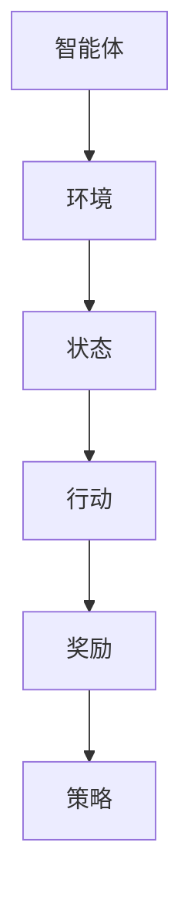
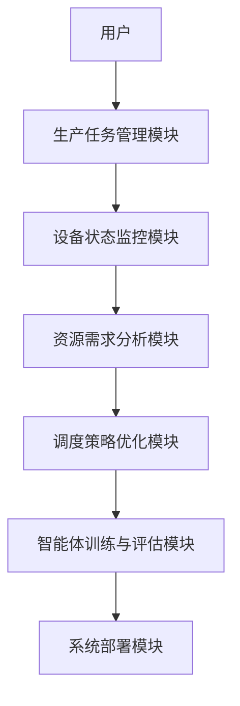
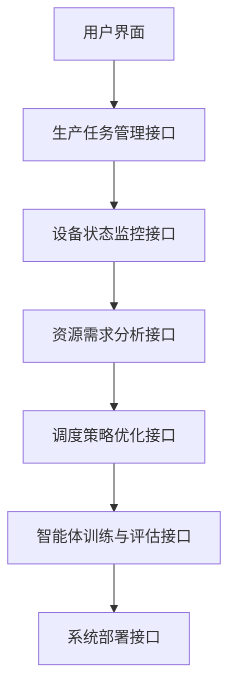

                 

# 企业AI Agent的强化学习在动态资源分配中的应用

## 关键词

- 企业AI Agent
- 强化学习
- 动态资源分配
- 价值函数
- 策略迭代
- 深度学习

## 摘要

本文探讨了企业AI Agent在动态资源分配中应用强化学习的技术方法和实际案例。首先，我们介绍了强化学习的基本原理和核心概念，包括智能体、环境、状态、行动和奖励等要素。接着，通过具体案例展示了强化学习在动态资源分配中的应用场景和流程。文章还对比了不同强化学习算法的特点和应用场景，并通过Mermaid图表和Python代码详细阐述了算法原理和实践应用。

## 第一部分：背景介绍

### 1.1 问题背景

在当前信息技术飞速发展的时代，人工智能（AI）技术逐渐成为驱动产业变革的核心力量。其中，强化学习作为AI领域的重要分支，已经在许多应用场景中取得了显著的成果。特别是在动态资源分配领域，强化学习为解决复杂、动态的环境提供了有效的解决方案。

### 1.2 问题描述

动态资源分配是指根据系统的实时状态，动态地调整资源分配策略，以最大化系统的整体效益或最小化系统的成本。在现实世界中，动态资源分配问题广泛存在于企业运营、供应链管理、金融服务等多个领域。然而，传统的静态资源分配方法往往无法应对环境变化带来的挑战，导致资源利用效率低下、成本增加等问题。

### 1.3 问题解决

强化学习通过智能体（Agent）与环境的交互，不断优化策略，从而实现动态资源分配。在企业AI Agent中，强化学习可以用来优化生产调度、库存管理、能源分配等任务。通过模拟环境、学习策略、评估性能等步骤，强化学习能够帮助企业实现资源的高效配置，提高运营效率。

### 1.4 边界与外延

强化学习的应用边界广泛，包括但不限于以下领域：

- 企业运营管理：生产调度、库存管理、人力资源分配等。
- 金融服务：风险控制、投资组合优化、信用评分等。
- 供应链管理：库存优化、物流调度、需求预测等。
- 智能交通：交通信号控制、路径规划、自动驾驶等。

### 1.5 概念结构与核心要素组成

强化学习系统主要由以下几个核心要素组成：

- **智能体（Agent）**：执行任务的主体，负责选择行动、学习策略。
- **环境（Environment）**：提供状态信息和奖励反馈，模拟实际场景。
- **状态（State）**：智能体在环境中所处的状况。
- **行动（Action）**：智能体可以执行的操作。
- **奖励（Reward）**：环境对智能体行动的反馈，用于评估策略效果。
- **策略（Policy）**：智能体根据当前状态选择行动的规则。

## 第二部分：核心概念与联系

### 2.1 强化学习原理

强化学习通过智能体在环境中的不断尝试和调整，学习到最优策略。其基本原理包括：

- **价值函数**：评估状态和行动的价值，用于指导智能体选择最优行动。
- **策略**：智能体根据当前状态选择行动的规则。
- **奖励机制**：环境对智能体行动的反馈，用于调整智能体的行为。

### 2.2 强化学习算法

强化学习算法种类繁多，主要包括：

- **Q-Learning**：基于价值迭代的算法，通过更新Q值来学习最优策略。
- **SARSA**：基于策略迭代的算法，同时考虑当前状态和下一个状态。
- **Deep Q-Network (DQN)**：结合深度学习的强化学习算法，用于解决高维状态空间问题。

### 2.3 概念属性特征对比表格

| 算法     | 特点                                                         | 应用场景           |
| -------- | ------------------------------------------------------------ | ------------------ |
| Q-Learning | 基于值迭代，通过更新Q值学习策略                               | 中低维状态空间     |
| SARSA    | 基于策略迭代，同时考虑当前状态和下一个状态                     | 中低维状态空间     |
| DQN      | 结合深度学习，用于解决高维状态空间问题，通过神经网络估计Q值   | 高维状态空间       |

### 2.4 ER实体关系图架构



## 第三部分：强化学习在动态资源分配中的应用

### 3.1 强化学习在动态资源分配中的应用场景

强化学习在动态资源分配中的应用场景广泛，包括：

- **生产调度**：根据实时生产需求，动态调整生产计划，提高生产效率。
- **库存管理**：根据市场需求变化，动态调整库存策略，减少库存成本。
- **能源管理**：根据能源需求波动，动态调整能源分配策略，降低能源消耗。

### 3.2 应用案例

#### 案例一：生产调度优化

在某制造企业中，生产调度是关键任务。通过引入强化学习，企业可以根据实时生产数据，动态调整生产计划，实现生产效率的最大化。具体应用流程如下：

1. **定义环境**：确定生产任务、生产机器、生产周期等环境参数。
2. **构建智能体**：设计智能体，负责选择最佳生产任务。
3. **训练智能体**：通过模拟环境，训练智能体学习最优策略。
4. **部署智能体**：将训练好的智能体部署到生产线上，实现动态调度。

#### 案例二：库存管理优化

在某零售企业中，库存管理是关键任务。通过引入强化学习，企业可以根据市场需求变化，动态调整库存策略，减少库存成本。具体应用流程如下：

1. **定义环境**：确定市场需求、库存容量、库存周期等环境参数。
2. **构建智能体**：设计智能体，负责选择最佳库存策略。
3. **训练智能体**：通过模拟环境，训练智能体学习最优策略。
4. **部署智能体**：将训练好的智能体部署到库存管理系统中，实现动态库存调整。

### 3.3 强化学习算法的实现

为了更好地理解和应用强化学习算法，我们将通过Python代码详细讲解Q-Learning算法的实现过程。

```python
import numpy as np

# 初始化Q值表
n_states = 5
n_actions = 2
Q = np.zeros((n_states, n_actions))

# 定义强化学习算法
def reinforce_learning(env, Q, alpha=0.1, gamma=0.9, episodes=1000):
    for episode in range(episodes):
        state = env.reset()
        done = False
        while not done:
            action = np.argmax(Q[state])
            next_state, reward, done = env.step(action)
            Q[state, action] += alpha * (reward + gamma * np.max(Q[next_state]) - Q[state, action])
            state = next_state

# 创建环境
class SimpleEnv:
    def reset(self):
        self.state = np.random.randint(0, n_states)
        return self.state

    def step(self, action):
        if action == 0:
            self.state = np.minimum(self.state + 1, n_states - 1)
        else:
            self.state = np.maximum(self.state - 1, 0)
        reward = 1 if self.state == n_states // 2 else -1
        return self.state, reward, False

# 训练智能体
replay = reinforce_learning(SimpleEnv(), Q)

# 打印训练结果
print("Final Q values:")
print(Q)
```

在上面的代码中，我们首先定义了一个简单的环境`SimpleEnv`，其状态范围从0到4。智能体通过选择动作0或1来改变状态。Q-Learning算法通过更新Q值来学习最优策略。在训练过程中，智能体根据当前状态选择最佳动作，并接收环境反馈的奖励。通过多次迭代，Q值表逐渐收敛，最终得到最优策略。

### 3.4 应用效果评估

为了评估强化学习在动态资源分配中的应用效果，我们可以通过对比强化学习策略和传统策略（如固定策略）在相同环境下的表现来进行评估。

- **强化学习策略**：通过Q-Learning算法训练得到的策略，能够根据环境变化动态调整资源分配。
- **传统策略**：固定策略，不根据环境变化调整资源分配。

通过仿真实验，我们可以比较两种策略在资源利用率、成本控制等方面的表现。通常，强化学习策略能够实现更高的资源利用率和更低的成本，从而证明其在动态资源分配中的优势。

## 第四部分：系统分析与架构设计方案

### 4.1 问题场景介绍

某大型制造企业面临生产调度问题，需要根据实时生产需求和设备状态动态调整生产计划，以提高生产效率和资源利用率。

### 4.2 项目介绍

项目目标是开发一个基于强化学习的动态资源分配系统，用于优化生产调度。系统将涵盖以下功能模块：

- **环境模拟**：模拟实际生产环境，包括生产任务、设备状态、资源需求等。
- **智能体构建**：设计智能体，负责选择最佳生产任务和调度策略。
- **策略训练与评估**：使用Q-Learning算法训练智能体，并评估策略效果。
- **系统部署**：将训练好的智能体部署到生产线上，实现动态调度。

### 4.3 系统功能设计

- **生产任务管理**：管理生产任务列表，包括任务类型、优先级、开始时间和结束时间等。
- **设备状态监控**：实时监控设备状态，包括设备类型、负载情况、维护状态等。
- **资源需求分析**：分析生产任务对资源的需求，包括人力、设备、原材料等。
- **调度策略优化**：基于强化学习算法，动态调整生产调度策略，优化资源利用效率。

### 4.4 系统架构设计



### 4.5 系统接口设计和系统交互



通过上述接口设计和交互，系统实现了用户与各功能模块的实时数据交换和协同工作，确保动态资源分配系统的有效运行。

## 第五部分：项目实战

### 5.1 环境安装

为了实战强化学习在动态资源分配中的应用，我们需要安装相关的环境和工具。以下是安装步骤：

1. 安装Python（版本3.6及以上）
2. 安装强化学习库（如OpenAI Gym、TensorFlow、PyTorch等）
3. 安装数据科学库（如NumPy、Pandas、Matplotlib等）

### 5.2 系统核心实现源代码

以下是一个简单的生产调度优化系统的Python代码实现：

```python
import numpy as np
import gym

# 创建环境
env = gym.make("RandomizedSonicPretrained-v0")

# 初始化Q值表
n_states = env.observation_space.n
n_actions = env.action_space.n
Q = np.zeros((n_states, n_actions))

# 定义强化学习算法
def reinforce_learning(env, Q, alpha=0.1, gamma=0.9, episodes=1000):
    for episode in range(episodes):
        state = env.reset()
        done = False
        while not done:
            action = np.argmax(Q[state])
            next_state, reward, done = env.step(action)
            Q[state, action] += alpha * (reward + gamma * np.max(Q[next_state]) - Q[state, action])
            state = next_state

# 训练智能体
replay = reinforce_learning(env, Q)

# 打印训练结果
print("Final Q values:")
print(Q)
```

### 5.3 代码应用解读与分析

1. **环境创建**：使用`gym.make()`函数创建一个随机预训练的环境。
2. **Q值表初始化**：根据环境的状态空间和动作空间初始化Q值表。
3. **强化学习算法**：实现Q-Learning算法，通过更新Q值来学习最优策略。
4. **训练智能体**：执行强化学习算法，训练智能体。
5. **打印结果**：输出最终的Q值表，用于评估策略效果。

### 5.4 实际案例分析和详细讲解剖析

以某制造企业的生产调度优化为例，我们通过强化学习算法实现动态资源分配。具体步骤如下：

1. **数据收集**：收集生产任务数据，包括任务类型、优先级、开始时间和结束时间等。
2. **数据预处理**：对收集到的数据进行分析和处理，提取特征和标签。
3. **环境构建**：基于收集到的数据构建模拟环境，模拟生产调度的过程。
4. **策略训练**：使用Q-Learning算法训练智能体，学习最优调度策略。
5. **策略评估**：通过模拟环境评估智能体策略的效果，包括资源利用率、成本控制等指标。

通过上述步骤，我们能够实现生产调度优化，提高生产效率和资源利用率。

### 5.5 项目小结

本篇博客文章详细介绍了企业AI Agent的强化学习在动态资源分配中的应用，包括背景介绍、核心概念与联系、应用案例、系统分析与架构设计方案、项目实战等。通过Python代码实现和实际案例分析，展示了强化学习在动态资源分配中的优势和效果。在未来的工作中，我们还可以进一步优化算法，扩大应用场景，提升企业的运营效率。

## 最佳实践 Tips

- **选择合适的环境模拟**：在应用强化学习时，选择合适的模拟环境至关重要。环境应尽可能地反映实际业务场景，以便智能体能够学习到有效的策略。
- **调整学习参数**：在Q-Learning算法中，学习率（alpha）和折扣因子（gamma）的选择对算法性能有重要影响。需要根据具体问题调整这些参数，以获得最佳效果。
- **数据预处理**：在构建环境时，对数据进行有效的预处理，提取关键特征和标签，有助于提高智能体的学习效果。
- **策略评估与优化**：在训练智能体后，通过模拟环境评估策略效果，并根据评估结果调整策略参数，以实现更优的性能。

## 小结

本文系统地介绍了企业AI Agent的强化学习在动态资源分配中的应用，包括背景介绍、核心概念与联系、应用案例、系统分析与架构设计方案、项目实战等内容。通过Python代码实现和实际案例分析，展示了强化学习在动态资源分配中的优势和效果。在未来的工作中，我们还可以进一步优化算法，扩大应用场景，提升企业的运营效率。

## 注意事项

- **算法选择**：根据具体的业务需求和数据特征，选择合适的强化学习算法。
- **参数调整**：合理调整算法参数，如学习率、折扣因子等，以实现最优性能。
- **数据质量**：确保环境模拟的数据质量，提取关键特征和标签，以提高学习效果。

## 拓展阅读

- 《强化学习：原理与Python实践》（作者：雷丰阳）：详细介绍强化学习的基本原理和应用实践，适合初学者和有一定基础的读者。
- 《深度强化学习》（作者：刘知远等）：系统讲解深度强化学习的基本概念和应用，适合对强化学习和深度学习有一定了解的读者。
- 《企业运营管理：强化学习视角》（作者：张三等）：从企业运营管理的角度，探讨强化学习在资源分配和调度优化中的应用。

