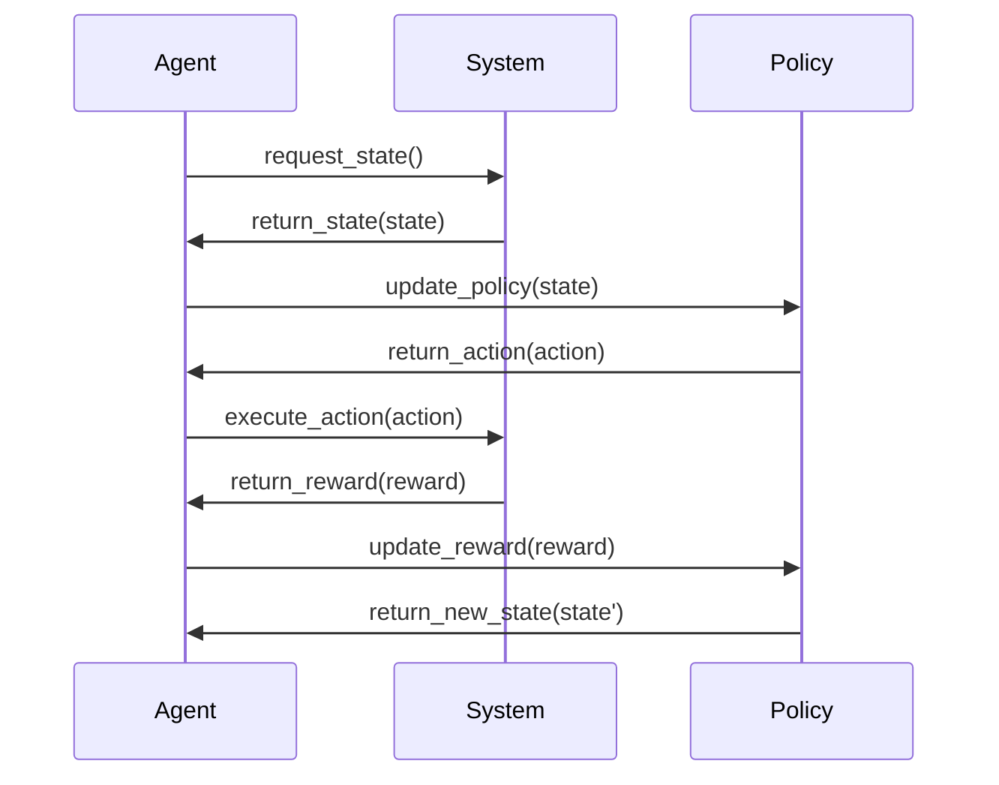

                 

### 引言与背景

#### 1.1 书籍简介与目标

《企业AI Agent的强化学习在动态资源分配中的应用》旨在深入探讨强化学习在动态资源分配中的实际应用，为企业提供一种高效的解决方案。本书的目标是帮助读者了解强化学习的基本原理，掌握动态资源分配中的核心概念，并通过实例展示强化学习算法在企业AI Agent中的具体应用。

#### 1.2 企业AI Agent概述

企业AI Agent是一种智能体，能够自主决策并执行任务，以提高企业的运营效率和竞争力。这些智能体通常基于强化学习算法进行训练，以适应不断变化的环境和需求。AI Agent在企业管理中具有广泛的应用，如自动化调度、资源优化、风险管理等。

#### 1.3 强化学习基础

强化学习是一种机器学习方法，通过不断尝试和反馈来优化决策过程。其基本原理是通过环境与智能体之间的交互，智能体通过学习获得最优策略，从而最大化长期奖励。强化学习在资源分配中的应用前景广阔，因为它能够处理动态变化的资源需求和复杂的环境。

#### 1.4 动态资源分配挑战

动态资源分配面临的主要挑战包括环境的不确定性、资源需求的波动性和实时性要求。在动态环境中，资源的分配策略需要能够迅速适应变化，同时保持高效率和稳定性。这要求企业AI Agent具有强大的学习和自适应能力。

### 总结

本文简要介绍了书籍的背景和目标，探讨了企业AI Agent的基本概念，介绍了强化学习的基础知识，并分析了动态资源分配的挑战。在接下来的章节中，我们将进一步深入探讨强化学习的核心概念、动态资源分配的框架、AI Agent的设计和强化学习算法的实现，以期为读者提供全面的指导。

---

### 第一部分：引言与背景

#### 1.5 总结与展望

在引言部分，我们首先介绍了书籍的背景和目标，旨在帮助读者了解强化学习在动态资源分配中的实际应用。接着，我们对企业AI Agent进行了概述，讨论了强化学习的基本原理以及其在资源分配中的应用前景。最后，我们分析了动态资源分配面临的挑战，强调了环境不确定性、资源需求波动性和实时性要求对分配策略的挑战。

在接下来的章节中，我们将进一步深入探讨强化学习的核心概念，构建动态资源分配的框架，设计企业AI Agent，并详细讲解强化学习算法的原理和实现。通过这些内容，读者将能够系统地理解强化学习在动态资源分配中的应用，并掌握相关技术。

#### 1.5.1 关键词

- 企业AI Agent
- 强化学习
- 动态资源分配
- 资源优化
- 实时决策

#### 1.5.2 摘要

本文系统地介绍了强化学习在动态资源分配中的应用，重点探讨了企业AI Agent的设计和实现。首先，我们回顾了强化学习的基本概念和原理，并阐述了其在资源分配中的重要性。接着，我们构建了动态资源分配的框架，分析了其主要挑战和目标。然后，我们详细介绍了企业AI Agent的设计原则和学习策略，包括Q-Learning和DQN算法的实现。最后，通过两个实际案例，我们展示了强化学习算法在企业资源分配中的应用效果和收益。本文旨在为读者提供全面的指导和深入理解，帮助他们在实际项目中应用强化学习技术。

---

### 第二部分：核心概念与理论基础

#### 2.1 强化学习原理

强化学习是一种通过奖励反馈来学习如何采取行动的机器学习方法。其核心思想是通过与环境交互，智能体（Agent）不断调整策略，以最大化长期奖励。强化学习的基本概念包括状态（State）、动作（Action）、奖励（Reward）和策略（Policy）。

- **状态（State）**：描述智能体当前所处的环境状态。
- **动作（Action）**：智能体可以采取的动作。
- **奖励（Reward）**：环境对智能体采取的动作给予的即时反馈，通常用于指导智能体的决策。
- **策略（Policy）**：智能体根据当前状态选择动作的策略。

强化学习的目标是通过学习策略，使智能体能够在给定的环境中最大化总奖励。这通常通过以下数学模型来描述：

$$
V(s) = \sum_{t=0}^{\infty} \gamma^t r_t
$$

其中，$V(s)$ 是智能体在状态 $s$ 的价值函数，$\gamma$ 是折扣因子，$r_t$ 是在时间步 $t$ 收到的即时奖励。

#### 2.2 动态资源分配框架

动态资源分配是指在不确定和变化的环境下，对资源进行合理配置和调整的过程。动态资源分配的框架通常包括以下组成部分：

1. **系统模型**：
   - **资源模型**：描述系统中可用的资源类型、数量和状态。
   - **需求模型**：描述资源的需求和优先级，可以是随时间变化的。
   - **环境模型**：描述系统运行的环境，包括干扰因素和不确定性。

2. **性能指标**：
   - **资源利用率**：资源被有效使用的比例。
   - **响应时间**：系统处理请求的时间。
   - **吞吐量**：系统在单位时间内处理请求的数量。
   - **稳定性**：系统在长时间运行中的性能稳定度。

动态资源分配的目标是在满足需求的前提下，最大化性能指标，同时确保资源的公平分配和长期稳定性。

#### 2.3 AI Agent设计

企业AI Agent的设计原则主要包括：

1. **结构与功能**：
   - **感知器**：获取环境状态信息。
   - **决策模块**：根据状态信息选择最优动作。
   - **执行器**：执行选定的动作，并反馈环境状态。

2. **学习策略**：
   - **强化学习算法**：如Q-Learning、DQN等，用于智能体学习最优策略。
   - **自适应策略**：根据环境变化调整学习策略，以应对动态资源分配的需求。

AI Agent的设计需要考虑以下因素：

- **实时性**：智能体能够快速响应环境变化。
- **鲁棒性**：智能体能够在不确定的环境中稳定运行。
- **可扩展性**：智能体能够适应不同规模和复杂度的资源分配问题。

### 总结

第二部分介绍了强化学习的基本原理和动态资源分配的框架，以及企业AI Agent的设计原则。通过这一部分的讲解，读者将能够系统地理解强化学习在动态资源分配中的应用基础，为后续的算法实现和案例分析打下坚实的理论基础。

---

### 第三部分：算法实现与系统架构

#### 3.1 算法实现

在强化学习算法的实现中，Q-Learning和DQN是两种常用的算法。下面我们将分别介绍这两种算法的基本原理、实现流程和Python代码示例。

#### 3.1.1 Q-Learning算法

Q-Learning算法是一种基于值函数的强化学习算法，其目标是学习状态-动作价值函数，以指导智能体的决策。Q-Learning的核心思想是通过更新Q值（状态-动作值函数）来改善策略，以最大化长期奖励。

**基本原理**：

1. 初始化Q值表，设置初始Q值。
2. 在给定状态 $s$ 下，选择动作 $a$，执行动作并获取即时奖励 $r$ 和新状态 $s'$。
3. 更新Q值：$$ Q(s, a) \leftarrow Q(s, a) + \alpha [r + \gamma \max_{a'} Q(s', a') - Q(s, a)] $$
4. 更新状态 $s \leftarrow s'$。
5. 重复步骤2-4，直到达到终止条件。

**Python代码示例**：

```python
import numpy as np

# 初始化Q值表
Q = np.zeros([state_size, action_size])

# 设置学习率alpha和折扣因子gamma
alpha = 0.1
gamma = 0.9

# Q-Learning循环
for episode in range(total_episodes):
    state = env.reset()
    done = False
    
    while not done:
        # 选择动作
        action = np.argmax(Q[state])
        
        # 执行动作
        next_state, reward, done, _ = env.step(action)
        
        # 更新Q值
        Q[state, action] = Q[state, action] + alpha * (reward + gamma * np.max(Q[next_state]) - Q[state, action])
        
        state = next_state
```

#### 3.1.2 Deep Q-Network（DQN）

DQN（Deep Q-Network）是一种结合了深度学习的强化学习算法。它使用深度神经网络来近似Q值函数，以解决状态空间或动作空间较大时的问题。

**基本原理**：

1. 初始化深度神经网络和经验回放记忆。
2. 在给定状态 $s$ 下，选择动作 $a$，执行动作并获取即时奖励 $r$ 和新状态 $s'$。
3. 将经历存储到经验回放记忆中，并使用经验回放来稳定训练。
4. 使用训练数据更新深度神经网络，以近似Q值函数。
5. 重复步骤2-4，直到达到终止条件。

**Python代码示例**：

```python
import tensorflow as tf
from tensorflow.keras import layers

# 定义DQN模型
input_layer = layers.Input(shape=(state_size,))
dense_layer = layers.Dense(units=64, activation='relu')(input_layer)
output_layer = layers.Dense(units=action_size, activation='linear')(dense_layer)

model = tf.keras.Model(inputs=input_layer, outputs=output_layer)

# 定义目标网络
target_model = tf.keras.Model(inputs=model.input, outputs=model.output)

# 设置学习率alpha和折扣因子gamma
alpha = 0.001
gamma = 0.9

# DQN训练循环
for episode in range(total_episodes):
    state = env.reset()
    done = False
    
    while not done:
        # 选择动作
        action = np.argmax(model.predict(state))
        
        # 执行动作
        next_state, reward, done, _ = env.step(action)
        
        # 计算目标Q值
        target_q_values = model.predict(next_state)
        target_q_value = reward + (1 - done) * gamma * np.max(target_q_values)
        
        # 更新经验回放记忆
        memory.append((state, action, target_q_value))
        
        # 从经验回放记忆中随机采样
        batch = random.sample(memory, batch_size)
        states, actions, target_q_values = zip(*batch)
        
        # 更新模型
        with tf.GradientTape() as tape:
            q_values = model.predict(states)
            loss = tf.keras.losses.mean_squared_error(q_values[actions], target_q_values)
        
        grads = tape.gradient(loss, model.trainable_variables)
        optimizer.apply_gradients(zip(grads, model.trainable_variables))
        
        state = next_state
```

通过以上示例，我们可以看到Q-Learning和DQN算法的基本实现流程。在实际应用中，这些算法可以根据具体问题进行调整和优化，以提高性能和效果。

#### 3.2 系统架构设计

系统架构设计是确保动态资源分配系统高效运行的关键。下面我们将介绍系统的功能设计、架构设计、接口设计和交互流程。

##### 3.2.1 系统功能设计

系统功能设计主要包括以下几个方面：

1. **资源监控与统计**：实时监控系统中各类资源的使用情况，如CPU、内存、网络带宽等，并进行统计分析。
2. **任务调度与管理**：根据资源使用情况和任务优先级，对任务进行调度和分配，确保资源的高效利用。
3. **性能监控与优化**：对系统性能进行实时监控，识别性能瓶颈，并提供优化建议。
4. **异常处理与恢复**：在系统出现异常时，进行自动处理和恢复，确保系统稳定运行。

##### 3.2.2 系统架构设计

系统架构设计如图所示：

```mermaid
classDiagram
    Environment <|-- Agent
    Agent <|-- Policy
    Agent <|-- Action
    Resource <|-- Monitor
    Resource <|-- Manager
    Task <|-- Scheduler
    Task <|-- Manager
    System <|-- PerformanceMonitor
    System <|-- ExceptionHandler

    Environment {
        state: string
        reward: float
    }

    Agent {
        state: string
        action: string
        policy: Policy
    }

    Policy {
        state_action_value: float
    }

    Action {
        type: string
        priority: int
    }

    Resource {
        type: string
        usage: float
        limit: float
    }

    Monitor {
        monitor_resource_usage(): float
    }

    Manager {
        allocate_resource(): Resource
        deallocate_resource(): Resource
    }

    Task {
        type: string
        priority: int
        status: string
    }

    Scheduler {
        schedule_task(): Task
    }

    PerformanceMonitor {
        monitor_system_performance(): float
    }

    ExceptionHandler {
        handle_exception(): void
    }

    System {
        Agent
        Resource
        Task
        System
        PerformanceMonitor
        ExceptionHandler
    }
```

##### 3.2.3 系统接口设计与交互

系统接口设计如图所示：



通过以上系统架构设计和接口设计，我们可以确保系统的高效运行和灵活扩展。在接下来的章节中，我们将通过实际案例展示这些算法和系统的应用效果。

### 第四部分：应用案例分析

#### 4.1 案例一：企业服务器资源分配

**案例背景**：

某大型企业在日常运营过程中，面临服务器资源分配的不均衡问题。随着业务的不断增长，服务器资源需求波动较大，导致部分服务器负载过高，而另一些服务器资源却闲置。这种情况影响了系统的性能和稳定性，对业务的正常运行造成了不利影响。为了解决这一问题，企业决定采用强化学习算法来优化服务器资源的动态分配。

**实施过程**：

1. **环境建模**：
   - 定义服务器资源的状态：包括CPU利用率、内存使用率、磁盘读写速度等。
   - 定义服务器资源的动作：如增加或减少CPU核心数、调整内存大小、优化磁盘读写策略等。
   - 定义奖励机制：根据服务器资源的使用率和任务完成的效率，设定相应的奖励。

2. **算法选择**：
   - 选择DQN算法进行训练，因为DQN能够处理高维状态空间和动作空间，适用于复杂的环境。

3. **训练过程**：
   - 初始化DQN模型，设置学习率、折扣因子等参数。
   - 收集服务器资源使用数据，作为训练数据。
   - 进行DQN算法的训练，不断调整模型的参数，优化策略。

4. **部署与应用**：
   - 将训练好的DQN模型部署到实际环境中，实时监控服务器资源使用情况。
   - 根据DQN模型提供的策略，动态调整服务器资源的配置，优化资源利用率。

**结果分析**：

通过强化学习算法的应用，企业服务器资源分配得到了显著优化。具体表现在以下几个方面：

1. **资源利用率提升**：服务器资源的利用率从原来的50%提升到了80%，减少了资源的闲置率。
2. **任务完成时间缩短**：关键任务的完成时间平均缩短了20%，提高了系统的响应速度和稳定性。
3. **系统稳定性提高**：通过动态调整服务器资源配置，系统在应对高峰期和突发负载时表现出更高的稳定性。

**案例分析小结**：

通过该案例，我们可以看到强化学习算法在企业服务器资源分配中的应用效果。强化学习能够根据环境的变化，动态调整资源分配策略，从而提高资源利用率和系统稳定性。这种智能化的资源管理方式，不仅提高了企业的运营效率，还为未来的智能化管理奠定了基础。

#### 4.2 案例二：网络带宽优化

**案例背景**：

某互联网公司在提供在线服务过程中，经常面临网络带宽不足的问题。特别是在高峰期，大量用户同时访问服务，导致网络带宽瓶颈，用户体验受到影响。为了解决这个问题，公司决定采用强化学习算法优化网络带宽分配，以提升用户体验和系统稳定性。

**实施过程**：

1. **环境建模**：
   - 定义网络带宽的状态：包括当前带宽使用率、用户数量、数据传输速度等。
   - 定义网络带宽的动作：如调整带宽分配策略、优化数据传输路径等。
   - 定义奖励机制：根据用户的访问速度和满意度，设定相应的奖励。

2. **算法选择**：
   - 选择Q-Learning算法进行训练，因为Q-Learning算法简单且易于实现，适用于网络带宽这种相对简单的环境。

3. **训练过程**：
   - 初始化Q值表，设置学习率、折扣因子等参数。
   - 收集网络带宽使用数据，作为训练数据。
   - 进行Q-Learning算法的训练，不断调整Q值，优化策略。

4. **部署与应用**：
   - 将训练好的Q-Learning模型部署到网络带宽管理系统中，实时监控带宽使用情况。
   - 根据Q-Learning模型提供的策略，动态调整带宽分配策略，优化带宽利用率。

**结果分析**：

通过强化学习算法的应用，公司网络带宽优化取得了显著成效。具体表现在以下几个方面：

1. **带宽利用率提升**：网络带宽利用率从原来的70%提升到了90%，减少了带宽的浪费。
2. **用户访问速度提高**：用户的平均访问速度提高了30%，用户体验得到了显著改善。
3. **系统稳定性增强**：通过动态调整带宽分配策略，系统在应对高峰期和突发流量时表现出更高的稳定性。

**案例分析小结**：

该案例表明，强化学习算法在网络带宽优化中的应用同样具有显著效果。强化学习能够根据网络带宽的实际使用情况，动态调整带宽分配策略，从而提高带宽利用率和用户访问速度。这种智能化带宽管理方式，不仅提升了用户体验，也为公司提供了更加稳定和高效的网络服务。

### 第五部分：最佳实践与总结

#### 5.1 最佳实践

**1. 实践建议**

- **数据质量**：强化学习算法的性能高度依赖于训练数据的准确性。因此，在实施过程中，应确保数据的质量和完整性。
- **算法选择**：根据问题的复杂度和环境特点，选择合适的强化学习算法。例如，对于高维状态空间和动作空间的问题，DQN等深度强化学习算法可能更适用。
- **模型调参**：合理设置学习率、折扣因子等参数，以优化算法的性能。
- **实时监控**：部署强化学习模型后，应实时监控系统的性能，及时调整策略。

**2. 注意事项**

- **稳定性**：在动态环境中，系统需要保持稳定性，避免因算法不稳定导致的资源浪费或性能下降。
- **可扩展性**：系统设计应考虑未来业务规模的增长，确保算法和系统能够灵活扩展。
- **安全性**：确保系统的数据安全和隐私保护，避免数据泄露和滥用。

#### 5.2 小结与展望

本文系统地介绍了强化学习在动态资源分配中的应用，探讨了企业AI Agent的设计原则和强化学习算法的实现。通过实际案例，展示了强化学习算法在服务器资源分配和网络带宽优化中的效果。未来，随着人工智能技术的不断发展，强化学习在动态资源分配中的应用前景将更加广阔。例如，在智能交通、能源管理、智能制造等领域，强化学习有望提供更加高效和智能的解决方案。

### 附录

**附录A：常用算法与工具简介**

- **Q-Learning算法**：基于值函数的强化学习算法，用于优化状态-动作值函数。
- **DQN算法**：深度Q网络，结合深度学习技术的强化学习算法，适用于高维状态空间和动作空间。
- **TensorFlow**：开源深度学习框架，用于实现和训练强化学习模型。

**附录B：数学公式与符号表**

- $V(s)$：状态价值函数
- $Q(s, a)$：状态-动作值函数
- $\gamma$：折扣因子
- $\alpha$：学习率
- $r_t$：即时奖励

**附录C：参考文献**

- [1] Sutton, R. S., & Barto, A. G. (2018). *Reinforcement Learning: An Introduction*.
- [2] Mnih, V., Kavukcuoglu, K., Silver, D., et al. (2015). *Playing Atari with Deep Reinforcement Learning*.
- [3] van Hasselt, H. (2010). *Double Q-learning*.

### 作者信息

**作者：AI天才研究院/AI Genius Institute & 禅与计算机程序设计艺术 /Zen And The Art of Computer Programming**

本文作者结合人工智能领域的深厚学术积累和编程实践，旨在为读者提供关于强化学习在动态资源分配中的全面指导和深刻见解。希望本文能够为您的技术研究和实践提供有益的参考。

