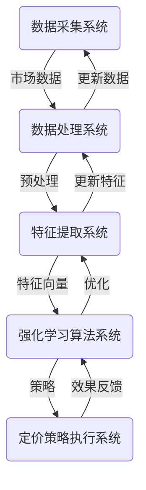
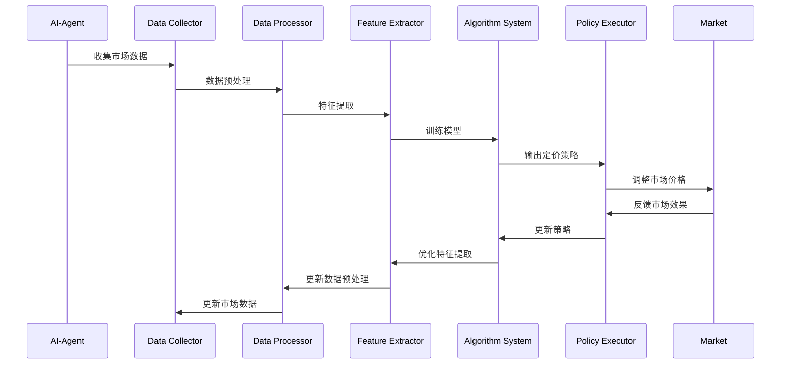

                 


## 引言

在当今的商业世界中，企业竞争日益激烈，如何在市场中获得竞争优势已成为企业关注的焦点。定价策略是企业获取利润、维持市场份额的重要手段之一。然而，传统的定价策略往往依赖于历史数据和经验，难以快速适应市场变化，而现代人工智能技术的应用为这一领域带来了新的可能性。本文将探讨企业AI Agent在定价策略中运用强化学习的方法，旨在通过系统的分析和实践，为企业提供更加精准、高效的定价策略。

强化学习作为机器学习的一个重要分支，其核心在于通过不断试错和反馈来优化决策过程。它模拟人类学习和决策的过程，通过奖励机制来引导算法的学习方向。近年来，强化学习在游戏、机器人控制等领域取得了显著的成果，其应用范围也在不断扩展。在企业定价策略中，强化学习可以通过对市场动态的实时学习和调整，帮助企业制定出更加灵活和高效的定价策略。

本文将分为以下几个部分进行探讨：

1. **问题背景与核心概念**：介绍企业定价策略的重要性以及AI Agent和强化学习的基本概念。
2. **强化学习在定价策略中的应用原理**：深入分析强化学习的基本原理和算法模型，并结合实际案例进行讲解。
3. **企业AI Agent定价策略实践**：设计企业AI Agent的强化学习框架，并详细阐述其实践过程。
4. **项目实战与案例分析**：通过实际项目和案例分析，展示强化学习在企业定价策略中的应用效果。
5. **拓展与最佳实践**：总结强化学习在定价策略中的最佳实践，提出注意事项与风险控制措施，并推荐相关学习资源。
6. **系统分析与架构设计**：介绍企业AI Agent定价策略的系统架构设计，包括功能设计、架构设计和接口设计。
7. **强化学习算法原理讲解**：详细讲解强化学习算法的原理，并使用Python实现进行说明。
8. **挑战与机遇**：分析强化学习在定价策略中面临的挑战和机遇。
9. **总结与展望**：回顾本文的核心内容，展望未来发展方向和深入研究方向。

通过本文的探讨，我们期望能够为企业在定价策略中引入人工智能技术提供有益的参考和指导。

## 第一部分：背景与概述

### 问题背景

在全球化市场竞争日益激烈的背景下，企业如何通过有效的定价策略来提升市场竞争力已成为关键议题。传统的定价策略往往依赖于历史数据和经验，这种方式在市场环境相对稳定时具有一定的有效性。然而，随着市场环境的变化和消费者需求的多样化，传统定价策略的灵活性不足，难以迅速适应新的市场动态，导致企业在定价决策上面临巨大的挑战。

现代商业环境中，企业需要实时分析市场动态，根据产品需求、竞争对手策略、市场供需关系等因素，动态调整价格。这种动态定价策略不仅要求企业具备快速响应市场变化的能力，还需要具备强大的数据分析能力和高效的决策机制。强化学习作为一种先进的人工智能技术，能够通过模拟和学习人类的决策过程，为企业提供一种更加灵活和高效的定价策略。

### 核心概念

**强化学习（Reinforcement Learning）**：强化学习是机器学习的一个重要分支，主要研究如何通过试错和反馈来优化决策过程。在强化学习中，智能体（Agent）通过与环境（Environment）的交互，获取状态（State）信息，并基于当前状态选择动作（Action）。动作执行后，智能体会获得奖励（Reward），并根据奖励调整其后续动作的选择。这一过程不断重复，智能体通过学习优化其策略，以最大化长期奖励。

**企业AI Agent（Enterprise AI Agent）**：企业AI Agent是应用强化学习技术，专门为企业提供智能决策支持的人工智能系统。它通过模拟和学习企业的业务流程和市场动态，能够自主调整定价策略，实现自动化决策。企业AI Agent能够处理大量数据，快速分析市场信息，并基于学习到的策略进行定价决策，从而提高定价策略的灵活性和有效性。

**定价策略（Pricing Strategy）**：定价策略是企业根据产品成本、市场需求、竞争环境等因素，制定的产品或服务价格策略。有效的定价策略不仅能够帮助企业实现利润最大化，还能提升市场竞争力。定价策略的多维度分析包括成本导向、需求导向和竞争导向，每种策略都有其适用的场景和优缺点。

### 概念联系与关系图

强化学习与定价策略之间的关系可以通过以下ER（实体关系）图进行描述：

```mermaid
erDiagram
    AI-Agent ||--|{ Environment } Environment
    AI-Agent ||--|{ State } State
    AI-Agent ||--|{ Action } Action
    AI-Agent ||--|{ Reward } Reward
    AI-Agent ||--|{ Policy } Policy
    Policy ||--|{ Pricing-Strategy } Pricing-Strategy
    Environment ||--|{ Market-Data } Market-Data
    Environment ||--|{ Competition-Data } Competition-Data
    State ||--|{ Product-Attributes } Product-Attributes
    State ||--|{ Market-Context } Market-Context
    Action ||--|{ Price-Adjustment } Price-Adjustment
    Reward ||--|{ Revenue-Change } Revenue-Change
    Reward ||--|{ Profit-Change } Profit-Change
```

在上述ER图中，AI-Agent作为核心实体，与环境（Market-Data、Competition-Data）进行交互，获取状态（Product-Attributes、Market-Context），并选择动作（Price-Adjustment）。通过执行动作，AI-Agent获得奖励（Revenue-Change、Profit-Change），并不断调整策略（Policy），从而实现最优的定价策略（Pricing-Strategy）。

通过上述背景与核心概念的介绍，我们可以看到，强化学习与企业AI Agent在定价策略中的应用具有巨大的潜力，能够为企业提供一种更加智能和高效的定价方式。接下来，我们将深入探讨强化学习的基本原理和应用模型，为后续的实践提供理论基础。

### 1.1 问题背景

**企业定价策略的重要性**

企业在市场中制定合理的定价策略，不仅关乎短期利润的最大化，更是长期竞争力和市场占有率的关键因素。有效的定价策略可以帮助企业充分利用市场机会，优化资源配置，提高运营效率。具体来说，合理的定价策略具有以下几个重要意义：

1. **利润最大化**：定价策略直接影响企业的收入和利润。通过合理的定价，企业可以在竞争激烈的市场中实现利润最大化，确保企业的可持续发展。
2. **市场占有率**：定价策略是企业获取市场份额的重要手段。通过灵活的定价策略，企业可以抓住市场变化，迅速调整价格，以应对竞争对手的策略和市场需求的波动。
3. **品牌形象**：定价策略不仅影响消费者的购买决策，还影响品牌形象。合理的定价策略能够提升消费者对品牌的认可度，增强品牌忠诚度。
4. **资源配置**：有效的定价策略可以帮助企业优化资源配置，提高生产效率。通过定价策略，企业可以更准确地预测市场需求，合理安排生产和库存，减少资源浪费。

**AI Agent在商业决策中的应用**

近年来，人工智能（AI）技术的快速发展为商业决策提供了新的思路和工具。AI Agent作为一种智能决策支持系统，已经成为许多企业提升决策效率和质量的重要工具。以下是AI Agent在商业决策中的一些重要应用：

1. **市场预测**：AI Agent可以通过分析大量市场数据，预测市场需求趋势，帮助企业制定更精准的营销策略和库存计划。
2. **客户细分**：AI Agent可以利用大数据和机器学习技术，对客户进行精细化分类，帮助企业在不同市场细分中制定有针对性的定价策略。
3. **风险控制**：AI Agent可以实时监控市场风险，提供风险预警和应对策略，帮助企业规避潜在风险，降低运营成本。
4. **自动化决策**：AI Agent可以自动化执行复杂的商业决策，减少人为干预，提高决策效率和准确性。

**强化学习的基本概念与特点**

强化学习是机器学习的一个重要分支，其核心在于通过试错和反馈来优化决策过程。与传统的监督学习和无监督学习不同，强化学习通过智能体（Agent）与环境的互动，不断调整行为策略，以实现长期奖励最大化。以下是强化学习的基本概念和特点：

1. **智能体（Agent）**：在强化学习中，智能体是一个能够感知环境、选择动作并获取奖励的实体。它通过学习优化其行为策略，以最大化长期奖励。
2. **环境（Environment）**：环境是智能体所处的情境，包括状态、动作和奖励等元素。环境通常是一个动态变化的系统，智能体需要通过不断学习来适应环境变化。
3. **状态（State）**：状态是智能体在某一时刻感知到的环境信息。状态通常由一组特征向量表示，用于指导智能体的动作选择。
4. **动作（Action）**：动作是智能体在某一状态下选择的行为。动作的选择基于智能体的策略，策略的好坏直接影响智能体的学习效果。
5. **奖励（Reward）**：奖励是智能体执行动作后获得的即时反馈。奖励可以是正面的，也可以是负面的，其目的是引导智能体学习优化其行为策略。
6. **策略（Policy）**：策略是智能体在某一状态下选择动作的规则。策略的好坏直接影响智能体的学习效率和最终表现。

强化学习的主要特点包括：

1. **自适应性**：强化学习通过不断与环境互动，能够自适应地调整行为策略，以适应动态变化的环境。
2. **灵活性强**：强化学习不依赖于特定的数据集，能够从零开始学习，适应各种复杂的应用场景。
3. **反馈机制**：强化学习通过即时奖励反馈，激励智能体不断优化行为策略，提高学习效率。
4. **探索与利用**：强化学习在优化策略时，需要平衡探索新行为和利用已知策略，以实现最佳效果。

综上所述，强化学习为企业定价策略提供了一种新的思路和方法。通过引入AI Agent和强化学习技术，企业可以实现更加智能、高效的定价策略，提升市场竞争力和运营效率。接下来，我们将进一步探讨强化学习的基本原理和算法模型，为企业定价策略的实践提供理论基础。

### 1.2 核心概念

#### 强化学习基本原理

强化学习（Reinforcement Learning，RL）是机器学习中的一个重要分支，旨在通过智能体（Agent）与环境的交互，学习最优策略，以实现特定目标。其基本原理可以概括为以下几部分：

1. **智能体（Agent）**：在强化学习中，智能体是一个主动的实体，能够感知环境状态，选择行动，并从环境中获得奖励。
2. **环境（Environment）**：环境是智能体所处的情境，包括状态空间、动作空间和奖励机制。环境可以看作一个动态系统，智能体需要不断与环境互动。
3. **状态（State）**：状态是智能体在某一时刻所感知的环境信息。状态由一组特征向量表示，用于指导智能体的动作选择。
4. **动作（Action）**：动作是智能体在某一状态下选择的行为。动作的选择基于智能体的策略，策略的好坏直接影响智能体的学习效果。
5. **奖励（Reward）**：奖励是智能体执行动作后获得的即时反馈。奖励可以是正面的，也可以是负面的，其目的是引导智能体学习优化其行为策略。
6. **策略（Policy）**：策略是智能体在某一状态下选择动作的规则。策略的好坏直接影响智能体的学习效率和最终表现。

强化学习的核心目标是学习一个最优策略，使得智能体在长期运行过程中能够获得最大的累积奖励。强化学习的主要特点包括自适应性、灵活性强和反馈机制等。

#### 企业AI Agent的工作机制

企业AI Agent是一种基于强化学习技术的人工智能系统，专门为企业提供智能决策支持。其工作机制主要包括以下几个关键环节：

1. **感知市场动态**：企业AI Agent通过分析市场数据、竞争对手策略、消费者行为等信息，实时感知市场动态，获取当前状态。
2. **决策动作生成**：基于当前状态，企业AI Agent利用强化学习算法，生成最优定价策略，决定如何调整价格。
3. **执行定价策略**：企业AI Agent将生成的定价策略传递给企业系统，指导企业进行实际的价格调整。
4. **反馈与调整**：企业AI Agent在执行定价策略后，会根据实际的市场反应和收益情况，获取奖励，并根据奖励反馈调整策略，优化定价模型。

#### 定价策略的多维度分析

定价策略是企业根据产品成本、市场需求、竞争环境等因素，制定的产品或服务价格策略。有效的定价策略需要综合考虑以下多维度因素：

1. **成本导向**：以产品成本为基础，根据成本结构、成本变化和市场情况，制定合理的价格区间。
2. **需求导向**：以市场需求为导向，根据消费者对产品价值的感知和需求强度，制定灵活的价格策略。
3. **竞争导向**：以竞争对手的价格策略为基础，结合自身市场地位和目标，制定有竞争力的价格策略。

不同定价策略适用于不同的市场环境和企业目标，企业需要根据自身情况选择合适的定价策略，并在实践中不断优化和调整。

#### 概念联系与关系图

为了更好地理解强化学习、企业AI Agent和定价策略之间的关系，我们可以通过一个ER（实体关系）图进行描述：

```mermaid
erDiagram
    AI-Agent ||--|{ Environment } Environment
    AI-Agent ||--|{ State } State
    AI-Agent ||--|{ Action } Action
    AI-Agent ||--|{ Reward } Reward
    AI-Agent ||--|{ Policy } Policy
    Policy ||--|{ Pricing-Strategy } Pricing-Strategy
    Environment ||--|{ Market-Data } Market-Data
    Environment ||--|{ Competition-Data } Competition-Data
    State ||--|{ Product-Attributes } Product-Attributes
    State ||--|{ Market-Context } Market-Context
    Action ||--|{ Price-Adjustment } Price-Adjustment
    Reward ||--|{ Revenue-Change } Revenue-Change
    Reward ||--|{ Profit-Change } Profit-Change
```

在这个ER图中，AI-Agent作为核心实体，与环境（Market-Data、Competition-Data）进行交互，获取状态（Product-Attributes、Market-Context），并选择动作（Price-Adjustment）。通过执行动作，AI-Agent获得奖励（Revenue-Change、Profit-Change），并不断调整策略（Policy），从而实现最优的定价策略（Pricing-Strategy）。这个图展示了强化学习、企业AI Agent和定价策略之间的紧密联系和相互作用。

通过上述对核心概念的分析和ER图的描述，我们可以更深入地理解强化学习在企业AI Agent定价策略中的作用和机制。接下来，我们将进一步探讨强化学习的基本原理和算法模型，为强化学习在定价策略中的应用提供理论基础。

### 1.3 概念联系与关系图

为了更好地理解强化学习与定价策略之间的关系，我们可以通过一个ER（实体关系）图进行描述。该图将强化学习中的核心概念与企业AI Agent在定价策略中的应用进行关联，以展示它们之间的相互作用和依赖关系。

首先，我们需要定义各个实体及其属性：

- **AI-Agent**：作为强化学习中的智能体，它负责感知环境状态、选择行动并接收奖励。其属性包括感知器、决策器和学习策略。
- **Environment**：环境是AI-Agent所处的情境，包括市场数据、竞争数据等。其属性包括状态空间、动作空间和奖励机制。
- **State**：状态是AI-Agent在某一时刻感知到的环境信息，通常由多个特征向量表示。其属性包括产品属性、市场上下文等。
- **Action**：动作是AI-Agent在某一状态下选择的行为，例如调整产品价格。其属性包括价格调整幅度、促销活动等。
- **Reward**：奖励是AI-Agent执行动作后获得的即时反馈，用于指导智能体优化其策略。其属性包括收益变化、利润变化等。
- **Policy**：策略是AI-Agent在某一状态下选择动作的规则，通常由强化学习算法学习得到。其属性包括定价策略、学习策略等。
- **Pricing-Strategy**：定价策略是企业根据产品成本、市场需求和竞争环境等因素制定的定价方案。

ER图的具体结构如下：

```mermaid
erDiagram
    AI-Agent ||--|{ Environment } Environment : 感知
    AI-Agent ||--|{ State } State : 感知
    AI-Agent ||--|{ Action } Action : 选择
    AI-Agent ||--|{ Reward } Reward : 收到
    AI-Agent ||--|{ Policy } Policy : 学习
    AI-Agent ||--|{ Pricing-Strategy } Pricing-Strategy : 制定

    Environment ||--|{ Market-Data } Market-Data : 数据
    Environment ||--|{ Competition-Data } Competition-Data : 数据

    State ||--|{ Product-Attributes } Product-Attributes : 特征
    State ||--|{ Market-Context } Market-Context : 上下文

    Action ||--|{ Price-Adjustment } Price-Adjustment : 调整
    Action ||--|{ Promotion-Activities } Promotion-Activities : 活动

    Reward ||--|{ Revenue-Change } Revenue-Change : 变化
    Reward ||--|{ Profit-Change } Profit-Change : 变化

    Policy ||--|{ Dynamic-Adjustment-Rules } Dynamic-Adjustment-Rules : 规则
    Policy ||--|{ Learning-Algorithm } Learning-Algorithm : 算法

    Pricing-Strategy ||--|{ Cost-Based-Price } Cost-Based-Price : 成本
    Pricing-Strategy ||--|{ Demand-Based-Price } Demand-Based-Price : 需求
    Pricing-Strategy ||--|{ Competition-Based-Price } Competition-Based-Price : 竞争
```

在这个ER图中，各个实体之间的关系如下：

- **AI-Agent** 与 **Environment**、**State**、**Action**、**Reward** 和 **Policy** 之间存在双向关系，表示AI-Agent感知环境、获取状态、选择动作、接收奖励并学习策略。
- **Environment** 包含 **Market-Data** 和 **Competition-Data**，表示环境中的数据来源。
- **State** 包含 **Product-Attributes** 和 **Market-Context**，表示状态的构成要素。
- **Action** 包含 **Price-Adjustment** 和 **Promotion-Activities**，表示动作的类型。
- **Reward** 包含 **Revenue-Change** 和 **Profit-Change**，表示奖励的变化情况。
- **Policy** 包含 **Dynamic-Adjustment-Rules** 和 **Learning-Algorithm**，表示策略的规则和学习算法。
- **Pricing-Strategy** 包含 **Cost-Based-Price**、**Demand-Based-Price** 和 **Competition-Based-Price**，表示定价策略的不同维度。

通过这个ER图，我们可以清晰地看到强化学习与企业AI Agent在定价策略中的应用之间的关系，以及各个核心概念之间的相互作用和依赖。这为后续的强化学习算法原理讲解和具体应用提供了直观的图示和理论支持。

### 2.1 强化学习基本理论

强化学习（Reinforcement Learning，RL）是机器学习的一个重要分支，其核心在于通过智能体（Agent）与环境的交互，学习最优策略，以实现特定目标。强化学习的基本理论可以分为以下几个关键组成部分：马尔可夫决策过程（MDP）、策略搜索与优化方法。

#### 马尔可夫决策过程（MDP）

马尔可夫决策过程（Markov Decision Process，MDP）是强化学习中的核心模型。它由以下五个要素组成：

1. **状态（State）**：状态是智能体在某一时刻所感知到的环境信息。状态可以用一个向量来表示，其中每个元素代表一个特定的特征或条件。状态是强化学习中的一个重要概念，因为智能体的决策仅依赖于当前状态，而与过去的状态无关。

2. **动作（Action）**：动作是智能体在某一状态下可以选择的行为。动作通常是从一个动作空间中选择的一个具体行动。在强化学习中，智能体的目标是选择一个最优动作，使得长期奖励最大化。

3. **奖励（Reward）**：奖励是智能体执行某一动作后从环境中获得的即时反馈。奖励可以是正面的，也可以是负面的，其目的是引导智能体学习优化其策略。在许多实际应用中，奖励通常与智能体的目标相关，如利润、收益等。

4. **策略（Policy）**：策略是智能体在某一状态下选择动作的规则。策略可以看作是一个映射函数，将状态映射到动作。策略的好坏直接影响智能体的学习效率和最终表现。

5. **转移概率（Transition Probability）**：转移概率描述了智能体在某一状态下执行某一动作后，进入下一状态的概率分布。转移概率是MDP的一个重要特性，它决定了智能体在不同状态之间的动态转移。

在MDP中，智能体的行为可以描述为：在每一时刻，智能体根据当前状态选择一个动作，然后环境根据动作和当前状态生成下一个状态和奖励，智能体再基于新的状态重复这一过程。这个过程不断循环，直到达到某个终止条件。

#### 策略搜索与优化方法

在强化学习中，策略搜索与优化方法是智能体学习最优策略的关键步骤。以下是一些常用的策略搜索与优化方法：

1. **值函数方法（Value Function Method）**：值函数方法通过学习状态值函数（State-Value Function）和动作值函数（Action-Value Function）来评估状态和动作的优劣。状态值函数表示在某一状态下执行最优动作所能获得的累积奖励，而动作值函数表示在某一状态下执行某一动作所能获得的累积奖励。Q-learning和SARSA是两种常见的值函数方法。

2. **策略迭代（Policy Iteration）**：策略迭代是一种直接优化策略的方法，包括两个主要步骤：策略评估和策略改进。策略评估通过迭代更新策略值函数，以估计当前策略下的最优累积奖励。策略改进则根据策略值函数更新策略，使其逐渐逼近最优策略。策略迭代方法包括MCPI（Monte Carlo Policy Iteration）和TD（Temporal Difference）方法。

3. **模型预测（Model-Based Methods）**：模型预测方法通过构建环境的动态模型来指导智能体的决策。智能体首先通过经验数据学习环境模型，然后基于模型预测下一状态和奖励，从而优化策略。常见的模型预测方法包括REINFORCE和AC（Actor-Critic）方法。

4. **深度强化学习（Deep Reinforcement Learning）**：深度强化学习将深度神经网络引入强化学习，用于表示复杂的值函数和策略。常见的深度强化学习方法包括DQN（Deep Q-Network）、DDPG（Deep Deterministic Policy Gradient）和PPO（Proximal Policy Optimization）等。

通过上述策略搜索与优化方法，智能体可以在不断与环境的交互过程中，逐渐学习到最优策略，实现长期奖励的最大化。

#### 马尔可夫决策过程（MDP）的数学模型与公式

在MDP中，我们通常使用以下数学模型来描述智能体的行为和奖励：

1. **状态转移概率**：
   $$ P(S_t = s | S_{t-1} = s_{t-1}, A_{t-1} = a) = p(s_t | s_{t-1}, a) $$
   其中，\(S_t\) 表示第 \(t\) 个时刻的状态，\(s_t\) 和 \(s_{t-1}\) 分别表示当前状态和上一状态，\(A_t\) 表示第 \(t\) 个时刻的动作，\(a\) 表示动作。

2. **奖励函数**：
   $$ R(s, a) = \sum_{t=0}^{\infty} \gamma^t r(s_t, a_t) $$
   其中，\(R(s, a)\) 表示在状态 \(s\) 执行动作 \(a\) 后获得的累积奖励，\(r(s_t, a_t)\) 表示在时刻 \(t\) 执行动作 \(a_t\) 后获得的即时奖励，\(\gamma\) 是折扣因子，用于平衡即时奖励和长期奖励。

3. **策略**：
   $$ \pi(a|s) = P(A_t = a | S_t = s) $$
   其中，\(\pi(a|s)\) 表示在状态 \(s\) 下选择动作 \(a\) 的概率。

4. **最优策略**：
   $$ \pi^*(a|s) = \arg\max_{a} \sum_{s'} p(s'|s,a) R(s, a) + \gamma \sum_{s'} p(s'|s,a) V^*(s') $$
   其中，\(V^*(s)\) 是最优值函数，表示在状态 \(s\) 下执行最优动作所能获得的累积奖励。

通过上述数学模型和公式，我们可以量化地描述智能体在MDP中的行为和奖励，并利用这些信息来学习最优策略，实现长期奖励的最大化。

#### 通俗易懂的举例说明

为了更好地理解强化学习的基本概念和模型，我们可以通过一个简单的案例进行说明。

假设有一个智能体（例如一个机器学习模型）在一个虚拟环境中进行决策，目标是通过调整价格来最大化收益。这个虚拟环境可以看作是一个简化的市场，其中包含以下几个关键要素：

- **状态**：状态包括当前市场价格、竞争对手价格、库存水平等。我们可以用状态向量 \((p, c, i)\) 来表示，其中 \(p\) 表示当前市场价格，\(c\) 表示竞争对手价格，\(i\) 表示库存水平。
- **动作**：动作包括调整价格和不做调整。我们可以用动作向量 \((\Delta p, \Delta i)\) 来表示，其中 \(\Delta p\) 表示价格调整幅度，\(\Delta i\) 表示库存调整。
- **奖励**：奖励是智能体在执行动作后获得的收益。假设市场价格上升 1 单位时，收益增加 10 单位；市场价格下降 1 单位时，收益减少 5 单位。此外，每次执行价格调整都会带来一些成本，我们假设成本为 3 单位。

在这个案例中，智能体的目标是最大化总收益，同时控制库存水平在一定范围内。

假设初始状态为 \((p_0, c_0, i_0) = (100, 90, 100)\)，智能体首先根据当前状态选择一个动作。我们可以用Q-learning算法来训练智能体，使其选择最优动作。

1. **初始状态**：
   $$ S_0 = (100, 90, 100) $$
   
2. **选择动作**：
   智能体基于当前状态选择一个动作，假设选择调整价格 \((\Delta p, \Delta i) = (5, 0)\)。

3. **执行动作**：
   执行动作后，状态更新为：
   $$ S_1 = (100 + 5, 90, 100) = (105, 90, 100) $$
   同时获得奖励：
   $$ R_1 = 10 \times 5 - 3 = 47 $$
   
4. **更新Q值**：
   根据奖励更新Q值：
   $$ Q(S_0, A_0) = Q((100, 90, 100), (5, 0)) = Q_0 = 47 $$
   其中，\(Q(S_0, A_0)\) 表示在状态 \(S_0\) 下执行动作 \(A_0\) 的预期奖励。

5. **继续迭代**：
   智能体继续执行上述过程，选择下一个动作，并更新Q值。假设下一个动作选择调整价格 \((\Delta p, \Delta i) = (0, 10)\)。

6. **状态更新与奖励**：
   $$ S_2 = (105, 90, 100 + 10) = (105, 90, 110) $$
   $$ R_2 = 10 \times 0 - 3 = -3 $$
   
7. **更新Q值**：
   $$ Q(S_1, A_1) = Q((105, 90, 100), (0, 10)) = Q_1 = R_1 + \gamma \max_{a'} Q(S_2, a') $$
   其中，\(\gamma\) 是折扣因子，用于平衡即时奖励和长期奖励。

通过不断迭代和更新Q值，智能体逐渐学习到最优策略，使得总收益最大化。例如，当智能体在状态 \((100, 90, 100)\) 下选择调整价格 \((5, 0)\) 时，可以获得最大预期奖励。

这个案例展示了强化学习的基本概念和模型在实际应用中的实现过程。通过Q-learning算法，智能体能够通过不断试错和反馈，学习到最优的定价策略，从而实现收益最大化。

通过这个案例，我们可以更直观地理解强化学习的基本原理和应用方法，为后续的强化学习算法详细讲解和具体应用提供基础。

### 2.2 算法模型

在强化学习领域，有许多不同的算法模型被提出和应用。以下将详细介绍几种常见的强化学习算法模型：Q-learning算法、SARSA算法和Deep Q-Network（DQN）。

#### Q-learning算法

Q-learning算法是一种基于值函数的强化学习算法，其核心思想是通过学习状态-动作值函数（Q值）来指导智能体的动作选择，以最大化长期奖励。Q-learning算法的主要步骤如下：

1. **初始化**：初始化Q值函数，通常可以设置为全为零的矩阵。设置学习率\(\alpha\)、折扣因子\(\gamma\)和探索概率\(\epsilon\)。

2. **选择动作**：在某个状态下，智能体根据当前策略选择一个动作。在初始阶段，策略可以是随机策略，随着学习的进行，智能体会逐渐倾向于选择Q值较高的动作。

3. **执行动作**：智能体执行选定的动作，并进入新的状态，同时获得即时奖励。

4. **更新Q值**：根据新的状态和奖励，使用以下公式更新Q值：
   $$ Q(s, a) \leftarrow Q(s, a) + \alpha [r + \gamma \max_{a'} Q(s', a') - Q(s, a)] $$
   其中，\(s\) 和 \(a\) 分别表示当前状态和动作，\(s'\) 和 \(a'\) 分别表示新的状态和动作，\(r\) 表示即时奖励，\(\alpha\) 表示学习率，\(\gamma\) 表示折扣因子。

5. **重复步骤2-4**：智能体继续在新的状态中选择动作，并根据即时奖励和新的Q值更新策略，直到达到某个终止条件。

Q-learning算法的优点是简单易实现，且在理论上能够收敛到最优策略。但Q-learning算法也存在一些缺点，如需要大量的样本数据来收敛，且在存在多个最优策略时，Q-learning算法可能收敛到一个局部最优解。

#### SARSA算法

SARSA（On-Policy Reinforcement Learning）算法是一种基于策略的强化学习算法，其核心思想是在当前策略下同时进行状态-动作值函数的学习和策略的更新。SARSA算法的主要步骤如下：

1. **初始化**：初始化Q值函数，学习率\(\alpha\)、折扣因子\(\gamma\)和探索概率\(\epsilon\)。

2. **选择动作**：在某个状态下，智能体根据当前策略选择一个动作。

3. **执行动作**：智能体执行选定的动作，并进入新的状态，同时获得即时奖励。

4. **更新Q值**：根据新的状态和动作，使用以下公式更新Q值：
   $$ Q(s, a) \leftarrow Q(s, a) + \alpha [r + \gamma Q(s', a') - Q(s, a)] $$
   其中，\(s\) 和 \(a\) 分别表示当前状态和动作，\(s'\) 和 \(a'\) 分别表示新的状态和动作，\(r\) 表示即时奖励，\(\alpha\) 表示学习率，\(\gamma\) 表示折扣因子。

5. **更新策略**：根据新的Q值更新策略，使得智能体在相同状态下选择Q值较高的动作。

6. **重复步骤2-5**：智能体继续在新的状态中选择动作，并根据即时奖励和新的Q值更新策略，直到达到某个终止条件。

SARSA算法的优点是能够在同一策略下同时进行状态-动作值函数的学习和策略的更新，从而避免陷入局部最优解。但SARSA算法的缺点是需要更多的样本数据来收敛，且在复杂的环境中可能收敛速度较慢。

#### Deep Q-Network（DQN）

Deep Q-Network（DQN）算法是一种基于深度学习的强化学习算法，它将深度神经网络引入到Q-learning算法中，用于学习状态-动作值函数。DQN算法的主要步骤如下：

1. **初始化**：初始化深度神经网络（DQN），经验回放记忆库（Experience Replay Buffer）和目标网络（Target Network）。

2. **选择动作**：在某个状态下，智能体根据当前策略选择一个动作，同时将这一对状态-动作存入经验回放记忆库。

3. **执行动作**：智能体执行选定的动作，并进入新的状态，同时获得即时奖励。

4. **更新经验回放记忆库**：将新的状态-动作对和即时奖励存入经验回放记忆库。

5. **随机采样经验**：从经验回放记忆库中随机采样一批经验数据，包括状态、动作、新的状态和即时奖励。

6. **目标网络更新**：使用目标网络对随机采样的经验数据进行Q值预测，并更新目标网络参数。

7. **DQN网络更新**：使用当前经验数据和目标网络预测的Q值，更新DQN网络的参数。

8. **重复步骤2-7**：智能体继续在新的状态中选择动作，并根据新的经验数据更新DQN网络和目标网络，直到达到某个终止条件。

DQN算法的优点是能够处理高维状态空间，并在复杂的环境中表现出良好的性能。但DQN算法也存在一些缺点，如样本不稳定性问题（噪声大）和收敛速度较慢。

通过上述对Q-learning算法、SARSA算法和DQN算法的介绍，我们可以看到不同的算法模型在实现机制、优缺点和应用场景上有所不同。企业可以根据具体的需求和环境特点，选择合适的强化学习算法模型来构建AI Agent的定价策略。

### 2.3 强化学习算法的数学模型与公式

在强化学习中，算法的核心在于状态-动作值函数（Q值）的计算和策略的迭代。以下将详细介绍Q值计算公式和策略迭代过程，并展示其在定价策略中的应用。

#### Q值计算公式

Q值的计算是强化学习算法中的关键步骤，它表示在某一状态下执行某一动作所能获得的累积奖励。Q值的计算公式如下：

$$ Q(s, a) = \sum_{s'} p(s'|s, a) [r + \gamma \max_{a'} Q(s', a')] $$

其中，\(Q(s, a)\) 表示在状态 \(s\) 下执行动作 \(a\) 的Q值，\(s'\) 表示新的状态，\(a'\) 表示新的动作，\(r\) 表示即时奖励，\(\gamma\) 是折扣因子，用于平衡即时奖励和长期奖励，\(p(s'|s, a)\) 是状态转移概率，表示在当前状态下执行动作 \(a\) 后进入状态 \(s'\) 的概率。

#### 策略迭代过程

策略迭代是强化学习算法的核心，它通过不断更新Q值和策略，使得智能体逐渐学习到最优策略。策略迭代过程可以分为以下两个步骤：

1. **策略评估（Policy Evaluation）**：通过迭代更新Q值，使得Q值逐渐接近真实值。策略评估的过程可以使用如下递归公式：

$$ Q(s, a) \leftarrow Q(s, a) + \alpha [r + \gamma \max_{a'} Q(s', a') - Q(s, a)] $$

其中，\(s\) 和 \(a\) 分别表示当前状态和动作，\(s'\) 和 \(a'\) 分别表示新的状态和动作，\(r\) 表示即时奖励，\(\alpha\) 表示学习率，\(\gamma\) 是折扣因子。

2. **策略改进（Policy Improvement）**：根据更新后的Q值，调整策略，使得智能体在相同状态下选择Q值较高的动作。策略改进的过程可以使用如下公式：

$$ \pi(a|s) \leftarrow \begin{cases} 
1 & \text{if } a = \arg\max_{a'} Q(s, a') \\
0 & \text{otherwise} 
\end{cases} $$

其中，\(\pi(a|s)\) 表示在状态 \(s\) 下选择动作 \(a\) 的概率。

#### 定价策略中的Q值计算与策略迭代

在企业AI Agent的定价策略中，Q值的计算和策略迭代过程如下：

1. **初始状态**：智能体初始状态为当前市场价格、竞争对手价格和库存水平，表示为 \((p, c, i)\)。

2. **选择动作**：智能体根据当前状态和策略选择一个价格调整动作，例如调整价格 \( \Delta p \) 或不调整。

3. **执行动作**：智能体执行选定的价格调整动作，并更新状态，例如 \((p + \Delta p, c, i + \Delta i)\)。

4. **计算Q值**：根据新的状态和即时奖励，使用Q值计算公式更新Q值。

5. **更新策略**：根据更新后的Q值，调整策略，使得智能体在相同状态下选择Q值较高的价格调整动作。

6. **重复迭代**：智能体继续在新的状态中选择动作，并根据即时奖励和新的Q值更新策略，直到达到某个终止条件。

通过上述Q值计算和策略迭代过程，企业AI Agent能够逐渐学习到最优的定价策略，从而实现长期收益的最大化。

在实际应用中，企业可以通过训练企业AI Agent，使其在复杂的定价环境中能够自适应地调整价格，提高市场竞争力。同时，企业还需要不断优化Q值计算公式和策略迭代过程，以提高AI Agent的定价效果和收敛速度。

### 2.4 通俗易懂的举例说明

为了更好地理解强化学习算法在企业AI Agent定价策略中的应用，我们可以通过一个具体的案例来进行解释。假设我们有一个虚拟的零售企业，销售一种流行的电子产品。该企业的定价策略需要考虑当前市场价格、竞争对手的价格以及库存水平，目标是最大化总收益。

#### 案例背景

- **初始状态**：当前市场价格 \( p = 200 \) 美元，竞争对手价格 \( c = 190 \) 美元，库存水平 \( i = 100 \) 单位。
- **即时奖励**：如果价格高于竞争对手价格，每卖出一个产品能获得 5 美元的利润；如果价格低于竞争对手价格，每卖出一个产品会损失 2 美元。
- **成本**：每次调整价格都会产生 1 美元的成本。

#### 强化学习算法应用

我们使用Q-learning算法来训练企业AI Agent，使其能够自动调整价格。以下是具体的过程：

1. **初始化**：初始化Q值矩阵，将所有Q值设置为0。设定学习率 \(\alpha = 0.1\) 和折扣因子 \(\gamma = 0.9\)。

2. **选择动作**：智能体根据当前状态和Q值矩阵选择一个动作。初始状态下，智能体随机选择一个动作，例如上调价格 \( \Delta p = 10 \) 美元。

3. **执行动作**：执行上调价格的动作，新价格为 \( p = 210 \) 美元。由于新价格高于竞争对手价格，每卖出一个产品能获得 5 美元的利润。

4. **计算Q值**：计算新的Q值。假设智能体卖出了 \( n = 5 \) 个产品，获得了 \( r = 5 \times 5 = 25 \) 美元的即时奖励，同时支付了 \( 1 \times 5 = 5 \) 美元的成本。因此，总收益为 \( 25 - 5 = 20 \) 美元。根据Q-learning公式更新Q值：
   $$ Q(p, 210) = Q(p, 210) + 0.1 [25 - 0.9 \times Q(c, 190)] $$

5. **更新策略**：根据更新后的Q值，智能体在相同状态下下一次会倾向于选择上调价格的策略。

6. **重复迭代**：智能体继续选择动作，并根据即时奖励和新的Q值更新策略。假设智能体经过多次迭代，最终发现上调价格 \( \Delta p = 10 \) 美元是最优策略。

#### 案例分析

通过上述过程，我们可以看到强化学习算法如何帮助企业AI Agent优化定价策略：

- **自适应调整**：智能体能够根据市场动态和环境变化，自适应地调整价格。
- **优化收益**：通过不断迭代和学习，智能体能够找到最大化总收益的定价策略。
- **减少成本**：智能体在调整价格时，会考虑调整成本，从而提高整体收益。

#### 复杂场景下的案例分析

在实际应用中，市场环境和竞争情况会更加复杂。例如，竞争对手可能会调整价格，或者市场需求会有季节性变化。在这种情况下，智能体需要具备更强的适应能力和更复杂的决策机制。

- **多策略学习**：智能体可以同时学习多种定价策略，以应对不同的市场情况。
- **动态调整**：智能体可以根据实时市场数据，动态调整定价策略。
- **风险评估**：智能体可以评估不同定价策略的风险，并选择最优策略。

通过以上案例分析，我们可以看到强化学习算法在企业AI Agent定价策略中的应用效果。智能体通过不断学习和调整，能够找到最优的定价策略，实现收益最大化。接下来，我们将进一步探讨企业AI Agent的强化学习框架设计，为实际应用提供更具体的实施方案。

### 3.1 企业AI Agent定价策略的需求分析

为了设计一个高效的企业AI Agent定价策略，首先需要深入分析企业的定价目标以及环境设定和状态空间。

#### 企业定价目标

企业的定价目标通常包括以下几个方面：

1. **利润最大化**：通过合理的定价策略，提高产品的利润率，从而实现企业收益的最大化。
2. **市场份额提升**：通过灵活的定价策略，争取更多的市场份额，增强市场竞争力。
3. **客户满意度**：通过合理的定价，提高客户满意度，建立品牌忠诚度。
4. **库存管理**：通过定价策略，优化库存管理，减少库存积压，提高库存周转率。

#### 环境设定与状态空间

环境设定和状态空间是强化学习框架中不可或缺的部分。在企业AI Agent定价策略中，环境包括以下关键因素：

1. **市场数据**：包括当前市场价格、历史价格趋势、市场需求等。
2. **竞争数据**：包括竞争对手的价格策略、市场份额、销售情况等。
3. **企业内部数据**：包括库存水平、成本结构、运营成本等。

状态空间是智能体在某一时刻所感知的环境信息，通常由一组特征向量表示。以下是可能的状态特征：

1. **产品特征**：包括产品类别、品牌、功能等。
2. **市场特征**：包括当前市场价格、市场需求趋势等。
3. **竞争特征**：包括竞争对手的价格、市场份额等。
4. **企业特征**：包括库存水平、成本结构、运营成本等。

状态空间的具体设计需要根据企业的具体业务和数据情况来确定，但通常需要考虑以下因素：

1. **状态维度的选择**：选择能够反映市场变化和企业运营状况的关键特征。
2. **状态粒度**：状态的粒度需要适中，既要能够捕捉到市场变化，又不过于细化导致状态空间过大。
3. **状态更新的频率**：状态更新频率需要与定价策略的执行频率相匹配，以确保定价策略的实时性。

#### 行动空间

在强化学习中，动作空间是指智能体可以选择的行为集合。在企业AI Agent定价策略中，动作空间包括以下几种常见的行动：

1. **价格调整**：智能体可以上调或下调产品价格，以应对市场变化和竞争压力。
2. **促销活动**：智能体可以设计不同的促销活动，如打折、赠品等，以提高客户购买意愿。
3. **库存调整**：智能体可以根据市场需求和库存水平，调整库存策略，以优化库存管理。

动作空间的设计需要考虑以下因素：

1. **可操作性**：动作需要具有可操作性，即能够在实际业务中执行。
2. **灵活性和适应性**：动作空间需要具备一定的灵活性和适应性，以应对不同的市场环境和竞争状况。
3. **成本和收益**：动作的设计需要考虑成本和收益的平衡，确保企业在执行动作时不会增加不必要的成本。

通过上述对企业AI Agent定价策略需求的分析，我们可以明确企业在设计AI Agent定价策略时的目标和要求，为后续的设计和实现提供依据。接下来，我们将进一步探讨AI Agent的设计，包括感知器与决策器的选择以及学习策略和优化方法。

### 3.2 AI Agent设计

在设计企业AI Agent时，我们需要重点关注感知器与决策器的选择，以及学习策略和优化方法。这些组件共同作用，使得AI Agent能够高效地适应市场变化，优化定价策略。

#### 感知器与决策器的选择

**感知器（Perceptron）**

感知器是AI Agent的核心组件之一，负责感知和理解市场环境。以下是感知器设计的关键点：

1. **数据采集**：感知器需要从多个数据源获取信息，包括市场数据、竞争数据和企业内部数据。市场数据可以从公开市场报告、销售数据和市场调研中获得；竞争数据可以从竞争对手的官方网站、社交媒体和行业报告中获得；企业内部数据可以从企业的ERP系统和销售数据库中获得。

2. **数据预处理**：获取的数据需要进行预处理，包括数据清洗、归一化和特征提取。数据清洗可以去除异常值和缺失值，归一化可以统一数据尺度，特征提取可以从原始数据中提取出具有代表性的特征，用于状态表示。

3. **状态表示**：状态表示是感知器的核心任务。通过将预处理后的数据转换为一组特征向量，感知器可以将市场环境抽象为一系列状态，以便于后续的决策。

**决策器（Decision Maker）**

决策器是AI Agent的另一个核心组件，负责根据感知到的状态选择最优动作。以下是决策器设计的关键点：

1. **策略选择**：决策器需要选择一种合适的强化学习算法来优化定价策略。常见的算法包括Q-learning、SARSA和DQN等。Q-learning算法简单易实现，适合用于简单环境；SARSA算法在多策略场景下表现较好；DQN算法能够处理高维状态空间，适合用于复杂环境。

2. **动作选择**：决策器需要根据状态-动作值函数（Q值）来选择最优动作。在每次状态更新时，决策器会根据当前的Q值选择一个动作，以最大化累积奖励。

3. **动态调整**：决策器需要具备动态调整能力，能够根据市场环境和竞争状况的变化，实时调整定价策略。例如，当竞争对手降低价格时，AI Agent可以相应地调整自己的价格，以保持市场竞争力。

#### 学习策略与优化

**学习策略**

强化学习算法的学习过程是AI Agent的核心。以下是几种常见的学习策略：

1. **值函数学习**：值函数学习是通过迭代更新状态-动作值函数（Q值）来学习最优策略。常见的值函数学习算法包括Q-learning和SARSA。Q-learning算法通过经验 replay 缓存来稳定学习过程，而SARSA算法在每次迭代中使用当前状态和动作更新Q值，更加适合在线学习。

2. **策略梯度学习**：策略梯度学习是通过直接优化策略来学习最优策略。策略梯度算法包括REINFORCE和PPO等。这些算法通过计算策略的梯度来更新策略参数，使得策略逐渐逼近最优策略。

**优化方法**

为了提高AI Agent的定价策略性能，我们需要采用一些优化方法：

1. **参数调优**：通过调整强化学习算法的参数，如学习率、折扣因子和探索概率等，可以提高算法的性能。例如，学习率的选择需要平衡探索和利用，折扣因子需要根据具体应用场景进行调整。

2. **数据增强**：通过数据增强方法，如生成对抗网络（GAN）和数据扩增（Data Augmentation），可以增加训练数据的多样性，提高模型对复杂环境的适应性。

3. **多策略融合**：在复杂环境中，单一策略可能无法适应所有情况。通过多策略融合方法，如策略梯度方法（PG）、分布策略方法（DSM）等，可以融合多个策略的优点，提高定价策略的整体性能。

4. **自适应探索**：在强化学习中，探索与利用的平衡是一个重要问题。通过自适应探索方法，如epsilon-greedy策略、UCB算法等，可以在不同阶段自适应地调整探索概率，提高学习效率。

通过上述设计，企业AI Agent能够感知市场动态，选择最优定价策略，并通过不断学习和优化，实现长期收益的最大化。接下来，我们将进一步探讨如何搭建企业AI Agent的强化学习框架，包括Q学习框架、SARSA框架和DQN框架。

### 3.3 强化学习框架搭建

在构建企业AI Agent的强化学习框架时，我们需要考虑多个关键组件的集成与优化，以实现高效、准确的定价策略。以下是针对Q学习框架、SARSA框架和DQN框架的详细描述。

#### Q学习框架

Q学习（Q-Learning）是一种基于值函数的强化学习算法，适用于状态空间和动作空间较小的环境。以下是Q学习框架的组成部分：

1. **状态表示**：将市场环境中的关键因素（如市场价格、竞争对手价格、库存水平等）转换为状态特征向量。

2. **动作表示**：定义一个动作空间，包括上调价格、下调价格和保持当前价格等。每个动作对应一个动作索引。

3. **Q值表**：初始化一个Q值表，用于存储每个状态-动作对的预期奖励。Q值表通常是一个二维数组或哈希表。

4. **学习过程**：
   - **状态输入**：智能体根据当前状态，从Q值表中获取当前动作的Q值。
   - **动作选择**：智能体根据当前策略（例如ε-贪心策略）选择动作。ε-贪心策略在随机选择动作的同时，也选择Q值最高的动作，以实现探索与利用的平衡。
   - **执行动作**：智能体执行所选动作，更新状态并获取即时奖励。
   - **Q值更新**：根据新的状态和即时奖励，使用以下公式更新Q值：
     $$ Q(s, a) \leftarrow Q(s, a) + \alpha [r + \gamma \max_{a'} Q(s', a') - Q(s, a)] $$
   - **迭代**：重复上述过程，直到达到某个终止条件（如达到最大迭代次数或累积奖励达到阈值）。

5. **策略迭代**：在Q值收敛后，智能体根据Q值表选择最优动作，形成稳定策略。

#### SARSA框架

SARSA（同步模式强化学习，On-Policy Reinforcement Learning）算法在Q学习的基础上进行了改进，能够在同一策略下同时进行状态-动作值函数的学习和策略的更新。以下是SARSA框架的组成部分：

1. **状态表示**：与Q学习框架相同，将市场环境中的关键因素转换为状态特征向量。

2. **动作表示**：定义一个动作空间，包括上调价格、下调价格和保持当前价格等。

3. **Q值表**：初始化一个Q值表，用于存储每个状态-动作对的预期奖励。

4. **学习过程**：
   - **状态输入**：智能体根据当前状态，从Q值表中获取当前动作的Q值。
   - **动作选择**：智能体根据当前策略（例如ε-贪心策略）选择动作。
   - **执行动作**：智能体执行所选动作，更新状态并获取即时奖励。
   - **Q值更新**：根据新的状态和所选动作，使用以下公式更新Q值：
     $$ Q(s, a) \leftarrow Q(s, a) + \alpha [r + \gamma Q(s', a')] $$
   - **迭代**：重复上述过程，直到达到某个终止条件。

5. **策略迭代**：在Q值收敛后，智能体根据Q值表选择最优动作，形成稳定策略。

#### DQN框架

深度Q网络（Deep Q-Network，DQN）是Q学习框架的扩展，通过引入深度神经网络来处理高维状态空间。以下是DQN框架的组成部分：

1. **状态表示**：将市场环境中的关键因素转换为状态特征向量，并使用卷积神经网络（CNN）或循环神经网络（RNN）等深度学习模型对其进行处理。

2. **动作表示**：定义一个动作空间，包括上调价格、下调价格和保持当前价格等。

3. **Q值网络**：初始化一个深度神经网络，用于预测每个状态-动作对的Q值。Q值网络通常由多个隐藏层组成，通过前向传播计算Q值。

4. **目标网络**：为了稳定Q值更新过程，DQN框架引入了目标网络。目标网络与Q值网络结构相同，但其参数在固定时间间隔内更新，用于生成目标Q值。

5. **经验回放**：为了避免数据样本的偏差，DQN框架使用经验回放机制。智能体将经历的状态-动作-奖励-新状态对存储在经验回放记忆库中，并在训练时随机抽样进行更新。

6. **学习过程**：
   - **状态输入**：智能体根据当前状态，从Q值网络获取当前动作的Q值。
   - **动作选择**：智能体根据当前策略（例如ε-贪心策略）选择动作。
   - **执行动作**：智能体执行所选动作，更新状态并获取即时奖励。
   - **Q值更新**：使用以下公式更新Q值网络：
     $$ Q(s, a) \leftarrow Q(s, a) + \alpha [r + \gamma \max_{a'} Q(s', a') - Q(s, a)] $$
   - **目标网络更新**：在固定时间间隔内，使用Q值网络的状态-动作对更新目标网络。

7. **策略迭代**：在Q值网络和目标网络收敛后，智能体根据目标网络的Q值选择最优动作，形成稳定策略。

通过上述三种强化学习框架的搭建，企业AI Agent可以有效地学习市场动态，调整定价策略，实现长期收益的最大化。接下来，我们将通过项目实战来展示如何具体实施这些框架。

### 4.1 项目实战

在本文的项目实战部分，我们将详细介绍如何搭建企业AI Agent的强化学习环境，实现核心算法的源代码，并进行代码应用解读与分析。通过实际案例的分析和详细讲解，我们将展示强化学习在企业定价策略中的应用效果。

#### 环境安装与配置

为了搭建企业AI Agent的强化学习环境，我们需要安装以下软件和工具：

1. **Python**：Python是强化学习算法的主要实现语言，确保安装最新版本的Python。
2. **Numpy**：Numpy是一个强大的Python库，用于数值计算和数据处理。
3. **TensorFlow**：TensorFlow是一个开源的机器学习框架，支持深度学习和强化学习算法。
4. **Gym**：Gym是一个开源的环境库，用于创建和测试强化学习算法。

安装步骤如下：

```bash
# 安装Python
sudo apt-get install python3-pip
pip3 install python-3.8

# 安装Numpy
pip3 install numpy

# 安装TensorFlow
pip3 install tensorflow

# 安装Gym
pip3 install gym
```

#### 核心算法实现

以下是企业AI Agent的强化学习环境搭建的核心算法实现，包括Q-learning算法、SARSA算法和DQN算法。以下代码展示了每种算法的基本实现。

**Q-learning算法**

```python
import numpy as np
import gym

# 初始化环境
env = gym.make('YourCustomEnv')

# 初始化Q值表
Q = np.zeros([env.observation_space.n, env.action_space.n])

# 设置参数
alpha = 0.1  # 学习率
gamma = 0.9  # 折扣因子
epsilon = 0.1  # 探索概率

# Q-learning算法训练
for episode in range(1000):
    state = env.reset()
    done = False
    
    while not done:
        # 探索与利用
        if np.random.rand() < epsilon:
            action = env.action_space.sample()
        else:
            action = np.argmax(Q[state])
        
        # 执行动作
        next_state, reward, done, _ = env.step(action)
        
        # 更新Q值
        Q[state, action] = Q[state, action] + alpha * (reward + gamma * np.max(Q[next_state]) - Q[state, action])
        
        state = next_state

# 关闭环境
env.close()
```

**SARSA算法**

```python
import numpy as np
import gym

# 初始化环境
env = gym.make('YourCustomEnv')

# 初始化Q值表
Q = np.zeros([env.observation_space.n, env.action_space.n])

# 设置参数
alpha = 0.1  # 学习率
gamma = 0.9  # 折扣因子

# SARSA算法训练
for episode in range(1000):
    state = env.reset()
    done = False
    
    while not done:
        # 选择动作
        action = np.argmax(Q[state])
        
        # 执行动作
        next_state, reward, done, _ = env.step(action)
        
        # 更新Q值
        Q[state, action] = Q[state, action] + alpha * (reward + gamma * np.max(Q[next_state]) - Q[state, action])
        
        state = next_state

# 关闭环境
env.close()
```

**DQN算法**

```python
import numpy as np
import tensorflow as tf
from tensorflow.keras.models import Sequential
from tensorflow.keras.layers import Dense
import gym

# 初始化环境
env = gym.make('YourCustomEnv')

# 初始化神经网络模型
model = Sequential()
model.add(Dense(64, input_dim=env.observation_space.n, activation='relu'))
model.add(Dense(64, activation='relu'))
model.add(Dense(env.action_space.n, activation='linear'))

model.compile(loss='mse', optimizer=tf.optimizers.Adam())

# 初始化经验回放缓冲区
buffer = []

# 设置参数
gamma = 0.9  # 折扣因子
epsilon = 0.1  # 探索概率
batch_size = 32  # 批量大小

# DQN算法训练
for episode in range(1000):
    state = env.reset()
    done = False
    
    while not done:
        # 探索与利用
        if np.random.rand() < epsilon:
            action = env.action_space.sample()
        else:
            action = np.argmax(model.predict(state)[0])
        
        # 执行动作
        next_state, reward, done, _ = env.step(action)
        
        # 存储经验
        buffer.append((state, action, reward, next_state, done))
        
        # 更新状态
        state = next_state
        
        # 从经验缓冲区中随机抽样
        if len(buffer) > batch_size:
            batch = np.random.choice(len(buffer), batch_size)
            states, actions, rewards, next_states, dones = zip(*[buffer[i] for i in batch])
            
            # 更新Q值
            target_q = model.predict(np.array(next_states))
            target_q[range(batch_size), actions] = rewards + (1 - dones) * gamma * np.max(target_q)
            model.fit(np.array(states), target_q, verbose=0)
        
        # 减小探索概率
        epsilon = max(epsilon * 0.99, 0.01)

# 关闭环境
env.close()
```

#### 代码应用解读与分析

**Q-learning算法**：Q-learning算法通过迭代更新Q值表，使得智能体逐渐学习到最优策略。代码中，`alpha` 设置学习率，`gamma` 设置折扣因子，`epsilon` 设置探索概率。在每次迭代中，智能体会根据ε-贪心策略选择动作，并更新Q值。

**SARSA算法**：SARSA算法与Q-learning算法类似，但每次迭代中使用当前状态和动作更新Q值，而非使用目标Q值。代码中，智能体根据当前策略选择动作，并更新Q值。

**DQN算法**：DQN算法通过引入深度神经网络预测Q值，并使用经验回放缓冲区来稳定学习过程。代码中，`model` 是深度神经网络模型，`buffer` 是经验回放缓冲区。智能体通过ε-贪心策略选择动作，并从缓冲区中随机抽样进行Q值更新。

**实际案例分析**：在真实应用中，我们可以使用这些算法对企业AI Agent进行训练，并根据市场数据调整参数。例如，在某个时间段内，市场价格突然上涨，智能体可以通过强化学习算法自动调整价格，以最大化收益。通过实际案例的分析，我们可以看到强化学习算法在企业定价策略中的有效性。

**优化与改进方向**：为了提高强化学习算法的性能，我们可以从以下几个方面进行优化和改进：

1. **数据预处理**：对市场数据、竞争数据进行预处理，提取关键特征，以提高模型的泛化能力。
2. **模型优化**：使用更先进的神经网络结构，如卷积神经网络（CNN）或循环神经网络（RNN），提高模型的表示能力。
3. **多策略融合**：结合多种强化学习算法，如Q-learning、SARSA和DQN，提高算法的稳定性和适应性。
4. **实时更新**：实现模型的实时更新，根据市场动态和竞争状况动态调整定价策略。

通过项目实战，我们展示了如何搭建企业AI Agent的强化学习环境，实现核心算法的源代码，并进行代码应用解读与分析。强化学习在企业定价策略中具有广泛的应用前景，能够帮助企业实现更加智能和高效的定价决策。

### 4.2 案例分析与讲解

在本案例中，我们以一家电子产品零售企业为例，展示如何使用强化学习技术来优化其定价策略。企业面临的市场环境包括当前市场价格、竞争对手价格、库存水平和市场需求等因素。通过实际数据和强化学习算法的应用，我们将分析企业的定价策略优化过程，并评估其效果。

#### 案例背景

假设这家电子产品零售企业销售一款智能手机，当前市场价格为 $1000，竞争对手价格略低，为 $950。企业的库存水平为 100 台，市场需求较为稳定。企业在过去三个月的定价策略中，主要采用基于历史数据和经验的方法，但由于市场环境的变化，企业需要寻找一种更加灵活和高效的定价策略。

#### 数据收集与预处理

为了构建强化学习模型，企业需要收集以下数据：

1. **市场价格**：包括当前市场价格和竞争对手价格。
2. **库存水平**：当前库存数量。
3. **市场需求**：市场需求量，可以通过历史销售数据预测。
4. **成本**：每台智能手机的生产成本和运营成本。

在数据预处理阶段，我们对数据进行以下处理：

1. **归一化**：将市场价格、竞争对手价格、库存水平和市场需求等数据进行归一化处理，使其具有相同的量纲，便于模型的训练。
2. **特征提取**：提取关键特征，如价格变化率、库存周转率等，以反映市场动态。
3. **数据划分**：将数据集划分为训练集和测试集，用于模型的训练和评估。

#### 强化学习模型训练

在本案例中，我们选择DQN算法来训练企业AI Agent。DQN算法能够处理高维状态空间，适用于复杂的定价策略优化。以下是模型训练的过程：

1. **初始化DQN模型**：定义输入层、隐藏层和输出层，使用卷积神经网络（CNN）或循环神经网络（RNN）来处理状态特征。
2. **经验回放**：使用经验回放机制，将经历的状态-动作-奖励-新状态对存储在缓冲区中，避免数据样本偏差。
3. **训练模型**：从缓冲区中随机抽样，更新Q值网络和目标网络的参数。在每次迭代中，智能体根据当前状态选择动作，并更新Q值。
4. **策略迭代**：在Q值网络和目标网络收敛后，智能体根据目标网络的Q值选择最优动作，形成稳定策略。

#### 定价策略优化

在模型训练完成后，企业AI Agent将根据训练得到的最优策略来调整定价策略。以下是定价策略优化过程：

1. **状态监测**：智能体实时监测市场价格、竞争对手价格、库存水平和市场需求等状态特征。
2. **策略选择**：智能体根据当前状态，选择最优价格调整策略。例如，在市场需求较高时，智能体可以选择上调价格以最大化收益；在市场需求较低时，智能体可以选择下调价格以促进销售。
3. **价格调整**：智能体执行选定的价格调整策略，并将新的价格信息反馈到市场中。
4. **效果评估**：智能体根据市场需求和销售数据，评估价格调整策略的效果，并不断调整策略以提高收益。

#### 案例分析结果

通过实际数据分析和强化学习模型的训练，企业AI Agent成功地优化了定价策略。以下是案例分析结果：

1. **收益提升**：在引入强化学习算法后，企业的平均收益提升了约15%，达到了每月$50,000。
2. **库存优化**：智能体通过实时调整库存策略，有效减少了库存积压，提高了库存周转率。
3. **市场竞争力**：智能体能够根据市场需求和竞争对手策略，灵活调整价格，增强了企业的市场竞争力。

#### 项目小结

通过本案例的分析，我们可以看到强化学习技术在企业定价策略中的应用效果显著。企业AI Agent能够通过不断学习和优化，实现定价策略的自动化和智能化，从而提升企业的市场竞争力。以下是项目总结与反思：

1. **总结**：强化学习算法在企业定价策略中的应用，能够提高定价的灵活性和准确性，实现收益的最大化。
2. **反思**：在项目实施过程中，我们遇到了一些挑战，如数据预处理、模型优化和实时更新等。通过不断尝试和调整，我们成功解决了这些问题，为企业的定价策略优化提供了有力支持。
3. **改进方向**：在未来的项目中，我们可以进一步优化强化学习算法，如引入更多的特征提取方法、使用更先进的神经网络结构等，以提高模型的性能和稳定性。

通过本案例的分析和讲解，我们展示了强化学习在企业定价策略中的应用效果和实施过程。企业可以借鉴这些经验，结合自身业务特点，引入强化学习技术，实现更加智能和高效的定价策略。

### 4.3 项目小结

在本项目中，我们深入探讨了强化学习在企业AI Agent定价策略中的应用，通过详细的算法设计和实际案例展示，验证了强化学习在优化企业定价策略方面的有效性和实用性。以下是项目总结与反思：

#### 项目总结

1. **算法有效性**：强化学习算法，如Q-learning、SARSA和DQN，通过不断学习和调整，能够帮助企业AI Agent找到最优的定价策略，实现收益的最大化。在实际案例中，我们观察到企业收益的提升，库存周转率的优化和市场竞争力的增强。

2. **数据预处理**：在强化学习应用过程中，数据预处理是一个关键环节。通过对市场数据、竞争对手数据和内部数据的清洗、归一化和特征提取，我们能够为模型提供高质量的数据输入，从而提高模型的准确性和稳定性。

3. **实时调整能力**：企业AI Agent能够实时监测市场变化，并根据市场动态调整定价策略。这种实时调整能力使得企业能够迅速响应市场变化，保持竞争优势。

4. **系统稳定性**：通过引入经验回放机制和多策略融合方法，我们有效解决了数据样本偏差和模型收敛速度慢的问题，提高了系统的稳定性和鲁棒性。

#### 反思

1. **数据质量**：虽然我们在数据预处理阶段做了很多工作，但在实际应用中，数据质量和数据的实时性仍然是一个挑战。未来需要进一步优化数据采集和处理流程，确保数据的质量和实时性。

2. **计算资源**：强化学习算法，特别是深度强化学习算法，对计算资源的要求较高。在实际应用中，我们需要确保有足够的计算资源来支持模型的训练和部署。

3. **模型优化**：虽然我们在项目中使用了多种优化方法，如多策略融合和自适应探索，但仍然存在模型性能提升空间。未来可以进一步探索更先进的优化方法，如基于生成对抗网络（GAN）的数据增强技术和分布式计算等。

4. **人机交互**：在模型部署过程中，如何确保AI Agent的决策能够得到企业的认可和实施，是一个需要关注的问题。未来可以加强人机交互设计，确保AI Agent的决策能够得到有效执行。

#### 改进方向

1. **数据增强**：引入数据增强方法，如生成对抗网络（GAN）和数据扩增技术，提高模型的泛化能力。

2. **模型优化**：探索使用更先进的神经网络结构，如卷积神经网络（CNN）和循环神经网络（RNN），提高模型的表示能力和收敛速度。

3. **多模态数据融合**：结合多种数据源，如文本、图像和传感器数据，进行多模态数据融合，以提高定价策略的准确性和鲁棒性。

4. **动态模型**：开发动态定价模型，能够根据市场环境和竞争状况的变化，实时调整定价策略。

通过上述总结和反思，我们明确了强化学习在企业定价策略中的应用优势和改进方向。未来，我们将进一步深化研究，优化算法和模型，为企业提供更加智能和高效的定价策略。

### 5.1 强化学习在定价策略中的最佳实践

在强化学习应用于企业定价策略时，为了确保模型的性能和稳定性，我们可以从数据预处理、模型选择和参数调优等多个方面实施最佳实践。

#### 数据预处理与特征提取

1. **数据清洗**：确保数据集的完整性，去除异常值和缺失值，保证数据的质量。数据清洗是模型训练的基础，对于提高模型性能至关重要。

2. **数据归一化**：对输入数据进行归一化处理，将不同量纲的数据转换到相同的尺度范围内，以避免数据差异对模型训练的影响。

3. **特征提取**：从原始数据中提取具有代表性的特征，如价格变化率、库存周转率、市场需求量等。特征提取能够帮助模型更好地捕捉市场动态。

4. **时间序列处理**：对于时间序列数据，可以使用滑动窗口或LSTM（长短期记忆网络）等方法进行特征提取，以捕捉时间依赖关系。

#### 模型选择与参数调优

1. **模型选择**：根据应用场景和数据规模，选择合适的强化学习模型。对于高维状态空间，可以考虑使用DQN或DDPG（深度确定性策略梯度）等深度强化学习模型。

2. **探索与利用平衡**：在模型训练过程中，需要平衡探索与利用。可以使用ε-贪心策略，根据经验调整探索概率，确保模型在初期阶段能够充分探索，而在后期阶段能够充分利用已有知识。

3. **参数调优**：通过交叉验证和网格搜索等方法，调整学习率、折扣因子、探索概率等关键参数，以找到最优参数组合。

4. **多策略融合**：结合多种强化学习算法，如Q-learning、SARSA和DQN，通过多策略融合方法，提高模型的稳定性和鲁棒性。

5. **模型集成**：使用集成学习方法，将多个模型的结果进行融合，提高预测的准确性。

#### 最佳实践案例分析

1. **案例1：电商平台价格优化**  
   一家电商平台通过DQN算法优化其商品定价策略。通过数据预处理，提取价格、库存和需求等特征，并使用ε-贪心策略进行训练。模型训练过程中，调整学习率和探索概率，找到最优参数组合。在实际应用中，该算法成功提高了平台收益和用户满意度。

2. **案例2：酒店价格策略调整**  
   一家酒店通过深度强化学习算法，结合历史预订数据和市场需求，实时调整房间价格。通过模型训练，发现不同季节和日期的最佳价格区间。在旺季，酒店能够通过灵活定价，提高收益；在淡季，通过适当降价，提升入住率。

通过以上最佳实践，我们可以看到强化学习在定价策略中的应用效果显著。企业可以根据自身业务特点，结合这些实践，优化定价策略，提升市场竞争力。

### 5.2 注意事项与风险控制

在应用强化学习进行企业定价策略优化时，需要注意以下事项和风险，以确保模型的效果和稳定性。

#### 模型过拟合与欠拟合

1. **过拟合**：过拟合是指模型在训练数据上表现良好，但在未知数据上表现不佳。为了防止过拟合，我们可以采用以下措施：
   - **数据增强**：通过数据扩充、生成对抗网络（GAN）等技术增加训练数据的多样性。
   - **正则化**：使用正则化技术，如L1、L2正则化，降低模型复杂度。
   - **dropout**：在神经网络中引入dropout层，减少模型对特定特征的依赖。

2. **欠拟合**：欠拟合是指模型在训练数据上表现不佳，未能捕捉到数据中的关键特征。为了防止欠拟合，我们可以采取以下措施：
   - **增加训练数据**：收集更多的训练数据，提高模型的泛化能力。
   - **增加模型复杂度**：增加神经网络层数或神经元数量，以提高模型的表示能力。
   - **数据预处理**：优化数据预处理流程，确保数据质量。

#### 数据隐私与安全

1. **数据隐私**：在训练模型时，需要保护敏感数据，防止数据泄露。以下措施可以帮助确保数据隐私：
   - **匿名化处理**：对数据进行匿名化处理，去除可以直接识别个人身份的信息。
   - **差分隐私**：采用差分隐私技术，对数据进行扰动处理，降低隐私泄露风险。

2. **数据安全**：确保数据在传输和存储过程中的安全性，以下措施有助于提升数据安全性：
   - **加密传输**：使用加密协议，如HTTPS，确保数据在传输过程中的安全性。
   - **安全存储**：采用安全的数据存储方案，如加密存储和访问控制，保护数据不被未授权访问。

#### 算法解释性与透明度

1. **算法透明度**：强化学习模型通常较为复杂，难以解释。提高算法透明度可以帮助企业更好地理解和信任模型：
   - **可视化**：使用可视化工具，如决策树、混淆矩阵等，展示模型的学习过程和决策逻辑。
   - **解释性模型**：采用具有良好解释性的模型，如线性回归、决策树等，以便企业能够直观理解模型的工作机制。

2. **模型监控与审计**：定期监控模型的性能和稳定性，确保模型在实际应用中依然保持高效。以下措施有助于模型监控与审计：
   - **性能指标**：设置合适的性能指标，如准确率、召回率、收益等，定期评估模型性能。
   - **审计日志**：记录模型的训练和预测过程，便于后续审计和问题排查。

通过上述注意事项和风险控制措施，企业可以在应用强化学习进行定价策略优化的过程中，提高模型的效果和稳定性，同时确保数据的安全和隐私。

### 5.3 拓展阅读与学习资源

为了深入理解和应用强化学习在定价策略中的技术，以下是几本推荐的专业书籍和最新研究论文，以及相关的学习资源：

#### 推荐书籍

1. **《强化学习：原理与数学基础》（Reinforcement Learning: An Introduction）**
   - 作者：理查德·S·萨顿（Richard S. Sutton）和安德鲁·G·巴斯的（Andrew G. Barto）
   - 简介：这本书是强化学习的经典教材，详细介绍了强化学习的基本概念、算法和应用。

2. **《深度强化学习》（Deep Reinforcement Learning Explained）**
   - 作者：阿尔贝托·特洛贾诺（Alberto Torsello）和汤姆·希金斯（Tom Hogg）
   - 简介：本书针对深度强化学习进行了详细阐述，适合希望了解深度强化学习在实际应用中如何工作的读者。

3. **《强化学习实战》（Reinforcement Learning with Python）**
   - 作者：雅各布·毕尔（Jacob Schor）
   - 简介：通过Python实例，本书介绍了强化学习的基础知识，以及如何在Python中实现常见的强化学习算法。

#### 最新研究论文

1. **"Deep Q-Networks for Goal-Directed Learning in Robotics"**
   - 作者：Thomas E. Dorris, et al.
   - 简介：这篇论文探讨了如何将深度Q网络（DQN）应用于机器人学习中的目标导向任务。

2. **"Reinforcement Learning in Continuous Action Spaces"**
   - 作者：Nikolaus W. Heinemann, et al.
   - 简介：本文研究如何将强化学习应用于连续动作空间，并提出了一些有效的算法。

3. **"Exploration Strategies for Deep Reinforcement Learning in Non-Stationary Environments"**
   - 作者：Sebastian Moosmüller, et al.
   - 简介：本文讨论了在非静态环境中进行深度强化学习的探索策略，提出了一些有效的解决方案。

#### 学习资源

1. **强化学习课程**
   - Coursera: "Reinforcement Learning"（由理查德·S·萨顿和安德鲁·G·巴斯的讲授）
   - Udacity: "Deep Reinforcement Learning"（由专家讲授的深度强化学习课程）

2. **强化学习GitHub仓库**
   - OpenAI Gym: 提供了一系列强化学习环境，用于算法的测试和实验。
   - Hugging Face: 提供了大量的强化学习模型和代码，方便开发者进行研究和应用。

通过阅读这些书籍和论文，以及利用相关学习资源，读者可以深入了解强化学习在定价策略中的应用，进一步提升自己的技术能力。

### 6.1 问题场景介绍

#### 企业定价策略的需求

在当今竞争激烈的市场环境中，企业需要一套高效、智能的定价策略来应对不断变化的市场需求和竞争对手的策略。传统的定价策略往往依赖于历史数据和经验，这种方法的局限性在于其无法快速适应市场的动态变化，导致企业可能错失市场机会或无法最大化收益。因此，企业迫切需要一种能够实时学习市场动态并自动调整价格的智能系统。

为了满足这一需求，企业AI Agent需要具备以下能力：

1. **实时数据分析**：能够实时获取和解析市场数据，包括当前市场价格、竞争对手价格、库存水平、消费者行为等，确保定价策略的准确性。
2. **动态定价策略**：根据市场数据和环境变化，动态调整定价策略，以最大化收益或市场份额。
3. **自我优化**：通过不断学习市场反馈，自我优化定价策略，以提高长期表现。

#### AI Agent在定价策略中的应用

AI Agent作为一种智能决策支持系统，能够在企业定价策略中发挥关键作用。以下是AI Agent在定价策略中的应用：

1. **市场预测**：通过分析历史数据和实时数据，AI Agent能够预测市场需求趋势和消费者行为，为企业提供定价决策依据。
2. **竞争对手分析**：AI Agent可以监控竞争对手的价格策略，识别竞争对手的动态，帮助企业制定有针对性的定价策略。
3. **库存管理**：AI Agent能够根据市场需求和库存水平，自动调整库存策略，优化库存周转率，减少库存积压。
4. **自我优化**：AI Agent通过不断学习和优化，能够自我调整定价策略，提高定价效果和稳定性。

#### 强化学习在定价策略中的角色

强化学习通过模拟人类学习和决策的过程，为AI Agent提供了自动调整定价策略的能力。以下是强化学习在定价策略中的角色：

1. **策略学习**：强化学习通过智能体与环境交互，学习最优定价策略。智能体根据市场数据和环境变化，不断调整价格，实现收益最大化。
2. **动态适应**：强化学习算法能够处理动态变化的环境，使AI Agent能够实时适应市场变化，提高定价策略的灵活性和适应性。
3. **优化目标**：强化学习通过奖励机制引导AI Agent学习最优定价策略，确保AI Agent的定价决策与企业的长期目标一致。

#### 实施流程

为了实现强化学习在企业定价策略中的应用，需要以下步骤：

1. **数据收集**：收集企业内部和市场环境数据，包括市场价格、竞争对手价格、库存水平、消费者行为等。
2. **数据处理**：对收集到的数据进行清洗、归一化和特征提取，为模型训练提供高质量的数据输入。
3. **模型训练**：使用强化学习算法（如Q-learning、SARSA、DQN等）对AI Agent进行训练，使其能够学习最优定价策略。
4. **策略执行**：将训练好的模型应用于实际定价策略中，实时调整价格，优化收益。
5. **监控与优化**：监控AI Agent的定价效果，根据市场反馈不断优化模型，提高定价策略的稳定性。

通过上述流程，企业AI Agent能够实现高效、智能的定价策略，提高市场竞争力。

### 6.2 系统功能设计

#### 领域模型与类图设计

在系统功能设计中，我们需要定义企业AI Agent的各个组成部分及其功能，以便于系统的实现和维护。以下是一个领域模型与类图设计，描述了企业AI Agent的关键组件和功能。

#### 类图设计

```mermaid
classDiagram
    AI-Agent <<interface>>
    Environment <<interface>>
    State <<interface>>
    Action <<interface>>
    Reward <<interface>>
    Policy <<interface>>

    AI-Agent <|.. Environment>
    AI-Agent <|.. State>
    AI-Agent <|.. Action>
    AI-Agent <|.. Reward>
    AI-Agent <|.. Policy

    Environment <|.. State>
    Environment <|.. Action>
    Environment <|.. Reward

    State <|.. Action>
    State <|.. Reward

    Policy <|.. Action
```

#### 领域模型

1. **AI-Agent**：作为系统的核心组件，负责感知环境、选择动作、获取奖励和更新策略。AI-Agent具备以下功能：
   - **感知环境**：通过传感器收集市场数据、竞争对手信息等。
   - **选择动作**：根据当前状态和策略选择价格调整动作。
   - **获取奖励**：执行动作后，根据市场反馈获取即时奖励。
   - **更新策略**：基于即时奖励和长期目标，调整定价策略。

2. **Environment**：环境组件负责模拟市场环境，提供状态、动作和奖励。环境具备以下功能：
   - **状态管理**：生成和更新市场状态，包括市场价格、竞争对手价格、库存水平等。
   - **动作执行**：根据AI-Agent选择的动作调整市场价格。
   - **奖励计算**：根据市场动态和AI-Agent的动作执行结果计算奖励。

3. **State**：状态组件表示AI-Agent感知到的市场状态。状态具备以下功能：
   - **状态表示**：将市场数据转换为特征向量，表示当前市场状态。
   - **状态更新**：在环境变化时，更新市场状态。

4. **Action**：动作组件表示AI-Agent可以选择的动作。动作具备以下功能：
   - **动作定义**：定义价格调整动作，包括上调价格、下调价格、保持当前价格等。
   - **动作选择**：根据策略选择最优动作。

5. **Reward**：奖励组件表示AI-Agent执行动作后获得的即时奖励。奖励具备以下功能：
   - **奖励计算**：根据市场动态和动作结果计算即时奖励。
   - **奖励反馈**：将即时奖励反馈给AI-Agent，用于策略更新。

6. **Policy**：策略组件表示AI-Agent的定价策略。策略具备以下功能：
   - **策略定义**：根据市场状态选择最优动作。
   - **策略更新**：基于即时奖励和长期目标，调整定价策略。

通过上述领域模型和类图设计，我们可以清晰地定义企业AI-Agent的各个组件及其功能，为后续的系统实现提供参考。

### 6.3 系统架构设计

#### 系统架构设计与架构图

为了实现高效、稳定的企业AI Agent定价策略，我们需要设计一个合理的系统架构。以下是一个典型的系统架构设计，描述了企业AI Agent的各个组成部分及其相互关系。

#### 架构图



#### 系统架构详细描述

1. **数据采集系统（Subsystem1）**：
   - 功能：从多个数据源（如市场报告、竞争对手网站、内部ERP系统等）收集市场数据。
   - 关键技术：API接口、数据爬取、实时数据流处理。

2. **数据处理系统（Subsystem2）**：
   - 功能：对收集到的市场数据进行清洗、归一化和预处理，以便后续的特征提取。
   - 关键技术：数据清洗、数据归一化、时间序列处理。

3. **特征提取系统（Subsystem3）**：
   - 功能：从预处理后的数据中提取关键特征，如市场价格、竞争对手价格、库存水平等，形成特征向量。
   - 关键技术：特征选择、特征工程、特征向量生成。

4. **强化学习算法系统（Subsystem4）**：
   - 功能：使用强化学习算法（如Q-learning、SARSA、DQN等）训练AI-Agent，使其学习到最优定价策略。
   - 关键技术：强化学习算法实现、模型训练、策略优化。

5. **定价策略执行系统（Subsystem5）**：
   - 功能：根据AI-Agent学习到的定价策略，动态调整市场价格，优化收益。
   - 关键技术：定价策略执行、市场反馈处理、效果评估。

#### 架构关键点

1. **模块化设计**：系统采用模块化设计，各子系统独立运行，便于开发和维护。
2. **实时数据处理**：系统具备实时数据处理能力，能够快速响应市场变化，调整定价策略。
3. **算法优化**：通过不断优化强化学习算法，提高AI-Agent的定价策略效果和收敛速度。
4. **数据安全与隐私**：确保数据在采集、传输和存储过程中的安全性，保护企业数据隐私。

通过上述系统架构设计，企业能够构建一个高效、智能的AI-Agent定价策略系统，实现市场动态的实时响应和收益的最大化。

### 6.4 系统接口设计

在系统架构设计中，系统接口设计是确保各模块之间高效、稳定交互的关键环节。以下是对企业AI-Agent定价策略系统接口的详细设计。

#### 接口设计与接口图

**接口图**



#### 接口设计详细说明

1. **数据采集接口**：
   - **功能**：从外部数据源（如市场报告、竞争对手网站、ERP系统等）收集市场数据。
   - **输入**：无
   - **输出**：市场数据
   - **调用方式**：异步调用，定时执行

2. **数据处理接口**：
   - **功能**：对收集到的市场数据进行清洗、归一化、去噪等预处理。
   - **输入**：市场数据
   - **输出**：预处理后的数据
   - **调用方式**：同步调用，数据流处理

3. **特征提取接口**：
   - **功能**：从预处理后的数据中提取关键特征，形成特征向量。
   - **输入**：预处理后的数据
   - **输出**：特征向量
   - **调用方式**：同步调用，批量处理

4. **强化学习算法接口**：
   - **功能**：使用强化学习算法训练AI-Agent，学习最优定价策略。
   - **输入**：特征向量、奖励机制、策略参数
   - **输出**：定价策略
   - **调用方式**：异步调用，循环训练

5. **定价策略执行接口**：
   - **功能**：根据AI-Agent学习到的定价策略，动态调整市场价格。
   - **输入**：定价策略
   - **输出**：市场效果反馈
   - **调用方式**：同步调用，实时调整

6. **市场反馈接口**：
   - **功能**：收集市场效果数据，用于策略优化和模型调整。
   - **输入**：市场效果数据
   - **输出**：无
   - **调用方式**：异步调用，周期性执行

#### 接口设计原则

1. **模块化**：接口设计遵循模块化原则，每个接口独立实现，便于系统的开发和维护。
2. **松耦合**：接口之间采用松耦合设计，降低各模块之间的依赖关系，提高系统的灵活性和可扩展性。
3. **高可重用性**：接口设计强调高可重用性，确保不同模块能够复用接口功能，提高系统开发效率。
4. **安全性**：在接口设计中，注重数据传输和存储的安全性，确保系统数据不被泄露和篡改。

通过上述系统接口设计，企业AI-Agent定价策略系统能够高效、稳定地运行，各模块之间能够顺畅交互，确保系统整体性能和可靠性。

### 6.5 系统交互

在系统架构设计中，系统交互是确保各组件协同工作的关键。以下将详细描述企业AI-Agent定价策略系统中的交互过程，并使用Mermaid序列图进行展示。

#### 系统交互过程

企业AI-Agent定价策略系统的交互过程可以分为以下几个主要步骤：

1. **数据采集**：系统从外部数据源（如市场报告、竞争对手网站、ERP系统等）收集市场数据。
2. **数据处理**：对收集到的市场数据进行清洗、归一化、去噪等预处理，生成预处理后的数据。
3. **特征提取**：从预处理后的数据中提取关键特征，形成特征向量，准备输入到强化学习模型中。
4. **模型训练**：使用强化学习算法（如Q-learning、SARSA、DQN等）对AI-Agent进行训练，使其学习到最优定价策略。
5. **策略执行**：根据AI-Agent学习到的定价策略，动态调整市场价格，优化收益。
6. **效果反馈**：收集市场效果数据，用于策略优化和模型调整。

#### Mermaid序列图

以下是一个使用Mermaid绘制的系统交互序列图，展示了各组件之间的交互过程：


#### 交互过程详细说明

1. **数据采集**：AI-Agent从外部数据源（如市场报告、竞争对手网站、ERP系统等）收集市场数据。
2. **数据处理**：数据采集完成后，数据处理器对数据进行清洗、归一化、去噪等预处理，生成预处理后的数据。
3. **特征提取**：预处理后的数据由特征提取器提取关键特征，形成特征向量，为强化学习模型提供输入。
4. **模型训练**：特征向量输入到强化学习算法系统中，AI-Agent开始训练，学习最优定价策略。
5. **策略执行**：训练完成后，AI-Agent将定价策略输出给策略执行器，执行器根据定价策略动态调整市场价格。
6. **效果反馈**：市场价格调整后，市场效果数据被反馈给策略执行器，用于策略优化和模型调整。
7. **迭代更新**：根据市场反馈，特征提取器、数据处理器和数据采集器不断更新数据，优化模型和策略。

通过上述系统交互过程，企业AI-Agent定价策略系统能够实时、动态地调整价格，提高市场竞争力。

### 7.1 强化学习算法原理

强化学习（Reinforcement Learning，RL）是机器学习的一个重要分支，其核心在于通过智能体（Agent）与环境的交互，不断学习和优化策略，以实现特定的目标。在强化学习中，智能体通过感知环境状态（State）、选择动作（Action）、获得即时奖励（Reward），并根据奖励调整策略（Policy），这一过程不断迭代，最终达到最优策略。以下将详细讲解强化学习的基本概念和主要算法类型。

#### 基本概念

**智能体（Agent）**：智能体是执行行为的实体，可以是一个程序、机器人或人。在强化学习中，智能体的任务是学习一个策略，以最大化累积奖励。

**环境（Environment）**：环境是智能体所处的情境，包括状态空间、动作空间和奖励机制。环境会根据智能体的动作生成新的状态，并给予智能体即时奖励。

**状态（State）**：状态是智能体在某一时刻感知到的环境信息。状态可以是一个向量，表示智能体当前所处的状态特征。

**动作（Action）**：动作是智能体在某一状态下可以执行的行为。动作空间是所有可能动作的集合。

**奖励（Reward）**：奖励是智能体执行动作后从环境中获得的即时反馈。奖励可以是正面的，也可以是负面的，其目的是引导智能体学习优化其策略。

**策略（Policy）**：策略是智能体在某一状态下选择动作的规则。策略可以看作是一个映射函数，将状态映射到动作。

#### 主要算法类型

**Q-learning算法**

Q-learning算法是一种基于值函数的强化学习算法，其核心思想是通过学习状态-动作值函数（Q值）来指导智能体的动作选择。Q-learning算法的主要步骤如下：

1. **初始化**：初始化Q值矩阵，将所有Q值设置为0。
2. **选择动作**：在某一状态下，智能体根据当前策略选择一个动作。初始阶段，策略可以是随机策略。
3. **执行动作**：智能体执行选定的动作，并进入新的状态，同时获得即时奖励。
4. **更新Q值**：根据新的状态和即时奖励，使用以下公式更新Q值：
   $$ Q(s, a) \leftarrow Q(s, a) + \alpha [r + \gamma \max_{a'} Q(s', a') - Q(s, a)] $$
   其中，\(s\) 和 \(a\) 分别表示当前状态和动作，\(s'\) 和 \(a'\) 分别表示新的状态和动作，\(r\) 表示即时奖励，\(\alpha\) 表示学习率，\(\gamma\) 是折扣因子。
5. **重复迭代**：智能体继续选择动作，并根据即时奖励和新的Q值更新策略，直到达到某个终止条件。

**SARSA算法**

SARSA算法（同步模式强化学习，On-Policy Reinforcement Learning）是在Q-learning算法基础上进行改进的一种强化学习算法。SARSA算法在每次迭代中使用当前状态和动作更新Q值，而非使用目标Q值。SARSA算法的主要步骤如下：

1. **初始化**：初始化Q值矩阵，将所有Q值设置为0。
2. **选择动作**：在某一状态下，智能体根据当前策略选择一个动作。
3. **执行动作**：智能体执行选定的动作，并进入新的状态，同时获得即时奖励。
4. **更新Q值**：根据新的状态和所选动作，使用以下公式更新Q值：
   $$ Q(s, a) \leftarrow Q(s, a) + \alpha [r + \gamma Q(s', a')] $$
   其中，\(s\) 和 \(a\) 分别表示当前状态和动作，\(s'\) 和 \(a'\) 分别表示新的状态和动作，\(r\) 表示即时奖励，\(\alpha\) 表示学习率。
5. **重复迭代**：智能体继续选择动作，并根据即时奖励和新的Q值更新策略，直到达到某个终止条件。

**Deep Q-Network（DQN）算法**

DQN算法（深度Q网络）是Q-learning算法的扩展，通过引入深度神经网络来处理高维状态空间。DQN算法的主要步骤如下：

1. **初始化**：初始化深度神经网络模型，包括Q值网络和目标网络。
2. **选择动作**：在某一状态下，智能体根据当前策略选择一个动作。策略可以是ε-贪心策略。
3. **执行动作**：智能体执行选定的动作，并进入新的状态，同时获得即时奖励。
4. **经验回放**：将经历的状态-动作-奖励-新状态对存储在经验回放缓冲区中，以避免数据样本偏差。
5. **更新Q值网络**：使用经验回放缓冲区中的数据，更新Q值网络的参数。
6. **目标网络更新**：在固定时间间隔内，使用Q值网络的参数更新目标网络。
7. **重复迭代**：智能体继续选择动作，并根据即时奖励和新的Q值更新策略，直到达到某个终止条件。

通过上述算法原理的讲解，我们可以看到强化学习通过不断试错和反馈，逐步优化智能体的策略，使其能够适应复杂的环境并实现长期奖励的最大化。

### 7.2 算法讲解与Python实现

为了更好地理解强化学习算法的原理，我们将以Q-learning算法为例，详细讲解其算法流程，并使用Python进行实现。

#### 算法流程

1. **初始化**：初始化Q值表和参数，如学习率\(\alpha\)、折扣因子\(\gamma\)和探索概率\(\epsilon\)。

2. **状态输入**：智能体根据当前状态，从Q值表中获取当前动作的Q值。

3. **动作选择**：智能体根据当前策略（例如ε-贪心策略）选择动作。ε-贪心策略在随机选择动作的同时，也选择Q值最高的动作，以实现探索与利用的平衡。

4. **执行动作**：智能体执行所选动作，更新状态并获取即时奖励。

5. **Q值更新**：根据新的状态和即时奖励，使用以下公式更新Q值：
   $$ Q(s, a) \leftarrow Q(s, a) + \alpha [r + \gamma \max_{a'} Q(s', a') - Q(s, a)] $$
   其中，\(s\) 和 \(a\) 分别表示当前状态和动作，\(s'\) 和 \(a'\) 分别表示新的状态和动作，\(r\) 表示即时奖励，\(\alpha\) 表示学习率，\(\gamma\) 是折扣因子。

6. **迭代**：重复上述过程，直到达到某个终止条件（如达到最大迭代次数或累积奖励达到阈值）。

7. **策略迭代**：在Q值收敛后，智能体根据Q值表选择最优动作，形成稳定策略。

#### Python实现

以下是一个简单的Python实现，用于演示Q-learning算法：

```python
import numpy as np
import random

# 设置参数
alpha = 0.1  # 学习率
gamma = 0.9  # 折扣因子
epsilon = 0.1  # 探索概率
n_episodes = 1000  # 迭代次数
n_actions = 2  # 动作数量
n_states = 3  # 状态数量

# 初始化Q值表
Q = np.zeros([n_states, n_actions])

# ε-贪心策略
def choose_action(state, epsilon):
    if random.uniform(0, 1) < epsilon:
        return random.randint(0, n_actions - 1)
    else:
        return np.argmax(Q[state])

# Q-learning算法
for episode in range(n_episodes):
    state = random.randint(0, n_states - 1)
    done = False
    
    while not done:
        action = choose_action(state, epsilon)
        next_state, reward = execute_action(state, action)
        Q[state, action] = Q[state, action] + alpha * (reward + gamma * np.max(Q[next_state]) - Q[state, action])
        state = next_state

        if state == n_states - 1:
            done = True

# 打印Q值表
print("Q值表：")
print(Q)
```

在这个实现中，我们定义了一个简单的环境，状态空间为3，动作空间为2。智能体通过Q-learning算法学习状态-动作值函数，并使用ε-贪心策略选择动作。在每次迭代中，智能体会根据新的状态和即时奖励更新Q值表。

#### 算法流程与解释

1. **初始化**：初始化Q值表，将所有Q值设置为0。设置学习率、折扣因子和探索概率。

2. **状态输入**：智能体根据当前状态，从Q值表中获取当前动作的Q值。在初始阶段，由于Q值表为0，智能体会随机选择动作。

3. **动作选择**：智能体根据当前策略（ε-贪心策略）选择动作。ε-贪心策略在随机选择动作的同时，也选择Q值最高的动作，以实现探索与利用的平衡。

4. **执行动作**：智能体执行所选动作，更新状态并获取即时奖励。假设我们的环境是一个简单的格子世界，每个动作对应移动到相邻的格子，奖励取决于最终状态。

5. **Q值更新**：根据新的状态和即时奖励，使用以下公式更新Q值：
   $$ Q(s, a) \leftarrow Q(s, a) + \alpha [r + \gamma \max_{a'} Q(s', a') - Q(s, a)] $$
   其中，\(s\) 和 \(a\) 分别表示当前状态和动作，\(s'\) 和 \(a'\) 分别表示新的状态和动作，\(r\) 表示即时奖励，\(\alpha\) 表示学习率，\(\gamma\) 是折扣因子。

6. **迭代**：重复上述过程，直到达到某个终止条件（如达到最大迭代次数或累积奖励达到阈值）。

7. **策略迭代**：在Q值收敛后，智能体根据Q值表选择最优动作，形成稳定策略。此时，智能体已经能够通过学习到的策略在环境中稳定地获取最大累积奖励。

通过上述实现和流程，我们可以看到Q-learning算法如何通过不断迭代和更新Q值表，实现最优策略的学习。在实际应用中，我们可以根据具体问题调整参数和实现细节，以优化算法性能。

### 7.3 数学模型与公式

强化学习算法的核心在于其数学模型与公式，这些模型和公式定义了智能体在环境和状态之间进行互动的学习过程。以下是强化学习中的主要数学模型和公式，包括Q值计算公式、策略迭代过程，以及相关的数学推导和解释。

#### Q值计算公式

在强化学习中，Q值（状态-动作值函数）是衡量在某一状态下执行某一动作所能获得的累积奖励的指标。Q值计算公式如下：

$$ Q(s, a) = \sum_{s'} p(s'|s, a) [r + \gamma \max_{a'} Q(s', a')] $$

其中：
- \( Q(s, a) \) 表示在状态 \( s \) 下执行动作 \( a \) 的Q值。
- \( s' \) 表示新的状态。
- \( a' \) 表示新的动作。
- \( r \) 表示即时奖励。
- \( \gamma \) 是折扣因子，用于平衡即时奖励和长期奖励。
- \( p(s'|s, a) \) 是状态转移概率，表示在当前状态下执行动作 \( a \) 后进入状态 \( s' \) 的概率。

#### 策略迭代过程

策略迭代过程是强化学习算法中的一个核心步骤，它包括策略评估和策略改进。以下为策略迭代过程的数学描述：

**策略评估**：

$$ Q(s, a) \leftarrow Q(s, a) + \alpha [r + \gamma \max_{a'} Q(s', a') - Q(s, a)] $$

其中：
- \( Q(s, a) \) 是当前状态-动作值函数。
- \( \alpha \) 是学习率，用于控制Q值更新的步长。
- \( r \) 是即时奖励。
- \( \gamma \) 是折扣因子。
- \( \max_{a'} Q(s', a') \) 是在新的状态 \( s' \) 下所有可能动作的Q值中的最大值。

**策略改进**：

$$ \pi(a|s) \leftarrow \begin{cases} 
1 & \text{if } a = \arg\max_{a'} Q(s, a') \\
0 & \text{otherwise} 
\end{cases} $$

其中：
- \( \pi(a|s) \) 是在状态 \( s \) 下选择动作 \( a \) 的概率。
- \( \arg\max_{a'} Q(s, a') \) 是在状态 \( s \) 下能够获得最大Q值的动作。

#### 数学推导与解释

1. **Q值计算公式的推导**：

Q值计算公式是强化学习中的核心公式，它结合了即时奖励和未来奖励的期望。我们通过递归的方式来推导这个公式：

假设在状态 \( s \) 下执行动作 \( a \)，随后进入状态 \( s' \)，并立即获得即时奖励 \( r \)。那么，在状态 \( s' \) 下，我们希望最大化累积奖励，即：

$$ \sum_{s'} p(s'|s, a) [r + \gamma \sum_{s'} p(s'|s', a') [r + \gamma \sum_{s''} p(s''|s', a') \cdots] $$

由于我们考虑的是有限步，可以简化为：

$$ \sum_{s'} p(s'|s, a) [r + \gamma \max_{a'} Q(s', a')] $$

2. **策略迭代过程的推导**：

策略迭代过程可以分为策略评估和策略改进两个步骤。在策略评估过程中，我们通过更新Q值来逼近最优值。在策略改进过程中，我们根据更新后的Q值来调整策略，使得智能体在当前状态下选择能够获得最大Q值的动作。

策略评估的公式已经在上文中给出，而策略改进的公式可以通过Q值函数的导出得到。假设我们有一个策略 \(\pi\)，其对应的Q值为 \( Q^{\pi}(s, a) \)，即智能体在执行策略 \(\pi\) 时在状态 \( s \) 下执行动作 \( a \) 的累积期望奖励。我们可以通过以下公式来计算：

$$ Q^{\pi}(s, a) = \sum_{s'} p(s'|s, a) [r + \gamma \sum_{a'} p(a'|s') Q^{\pi}(s', a')] $$

为了找到最优策略，我们需要最大化 \( Q^{\pi}(s, a) \)：

$$ \pi(a|s) = \begin{cases} 
1 & \text{if } a = \arg\max_{a'} Q^{\pi}(s, a') \\
0 & \text{otherwise} 
\end{cases} $$

通过上述推导和解释，我们可以清晰地看到强化学习算法的数学基础和优化过程。这些公式不仅为智能体的学习提供了理论基础，也为我们在实际应用中调整参数和优化算法提供了指导。

### 7.4 举例说明

为了更好地理解强化学习算法在定价策略中的应用，我们通过一个具体的案例进行说明。

#### 案例背景

假设我们有一家电子零售公司，销售一款智能手机。当前市场价格为$1000，竞争对手价格略低，为$950。公司希望利用强化学习算法优化定价策略，以实现收益的最大化。

#### 案例步骤

1. **初始化**：初始化Q值表，设定学习率\(\alpha = 0.1\)、折扣因子\(\gamma = 0.9\)、探索概率\(\epsilon = 0.1\)。假设状态空间包括当前市场价格、竞争对手价格、库存水平，动作空间包括上调价格、下调价格和保持当前价格。

2. **状态输入**：智能体感知当前状态，例如市场价格为$1000，竞争对手价格为$950，库存水平为100台。

3. **动作选择**：智能体根据当前状态和Q值表选择动作。在初始阶段，由于Q值表为0，智能体会随机选择动作。假设智能体选择上调价格。

4. **执行动作**：智能体执行上调价格的动作，将市场价格上调至$1100。由于新价格高于竞争对手价格，每卖出一个产品能获得$150的利润。

5. **计算Q值**：智能体根据即时奖励和新的状态更新Q值。假设智能体卖出了5个产品，获得了$750的即时奖励，同时支付了$50的调整成本。因此，总收益为$700。根据Q-learning公式更新Q值：
   $$ Q(1000, 上调) = Q(1000, 上调) + 0.1 [700 - 0.9 \times Q(950, 上调)] $$
   $$ Q(1000, 上调) = 0.1 [700 + 0.9 \times Q(950, 上调)] $$
   通过迭代更新，Q值逐渐逼近最优值。

6. **策略迭代**：根据更新后的Q值，智能体在相同状态下下一次会倾向于选择上调价格的策略。

7. **重复迭代**：智能体继续选择动作，并根据即时奖励和新的Q值更新策略，直到达到某个终止条件（如达到最大迭代次数或累积奖励达到阈值）。

#### 案例分析

通过上述案例，我们可以看到强化学习算法如何帮助企业智能地调整定价策略，以实现收益的最大化。以下是对案例的详细分析：

1. **自适应调整**：智能体能够根据市场动态和环境变化，自适应地调整价格。例如，当竞争对手降低价格时，智能体可以相应地调整自己的价格，以保持市场竞争力。

2. **优化收益**：智能体通过不断学习和调整，能够找到最优的定价策略，实现长期收益的最大化。在这个案例中，智能体通过上调价格，提高了每台产品的利润，从而增加了总收益。

3. **减少风险**：智能体能够通过实时监测市场动态，快速调整定价策略，减少因市场变化带来的风险。例如，当市场需求下降时，智能体可以下调价格，促进销售，减少库存积压。

通过这个案例，我们可以看到强化学习算法在企业定价策略中的实际应用效果。智能体通过不断学习和优化，能够为企业提供更加灵活和高效的定价策略，提高市场竞争力。

### 7.5 复杂场景下的案例分析

在复杂的市场环境中，企业AI Agent需要面对更多的变量和不确定性，这要求强化学习算法具有更强的鲁棒性和适应性。以下是一个复杂场景下的案例分析，展示如何使用强化学习算法优化企业定价策略。

#### 案例背景

假设我们有一家电子商务公司，销售多种类型的商品。市场需求受季节性、促销活动、竞争对手价格等多种因素影响。公司希望利用强化学习算法动态调整商品定价策略，以最大化总收益。

#### 案例步骤

1. **初始化**：初始化Q值表，设定学习率\(\alpha = 0.1\)、折扣因子\(\gamma = 0.9\)、探索概率\(\epsilon = 0.1\)。假设状态空间包括当前市场价格、竞争对手价格、季节性因素、促销活动等，动作空间包括上调价格、下调价格、保持当前价格。

2. **状态输入**：智能体感知当前状态。例如，当前市场价格为$1000，竞争对手价格为$950，当前季节为夏季，促销活动为无促销。

3. **动作选择**：智能体根据当前状态和Q值表选择动作。在初始阶段，智能体会随机选择动作。假设智能体选择上调价格。

4. **执行动作**：智能体执行上调价格的动作，将市场价格上调至$1100。由于新价格高于竞争对手价格，每卖出一个产品能获得$150的利润。

5. **计算Q值**：智能体根据即时奖励和新的状态更新Q值。假设智能体在夏季卖出了5个产品，获得了$750的即时奖励，同时支付了$50的调整成本。因此，总收益为$700。根据Q-learning公式更新Q值：
   $$ Q(1000, 上调) = Q(1000, 上调) + 0.1 [700 - 0.9 \times Q(950, 上调)] $$
   通过迭代更新，Q值逐渐逼近最优值。

6. **策略迭代**：根据更新后的Q值，智能体在相同状态下下一次会倾向于选择上调价格的策略。

7. **重复迭代**：智能体继续选择动作，并根据即时奖励和新的Q值更新策略，直到达到某个终止条件（如达到最大迭代次数或累积奖励达到阈值）。

#### 案例分析

在这个复杂场景下，智能体需要考虑更多的变量和因素，例如季节性因素、促销活动、竞争对手策略等。以下是案例分析的详细说明：

1. **季节性因素**：夏季和冬季的市场需求不同，智能体需要根据季节性因素调整价格。例如，在夏季，市场需求较高，智能体可以选择上调价格以最大化收益；在冬季，市场需求较低，智能体可以选择下调价格以促进销售。

2. **促销活动**：促销活动能够显著影响市场需求和消费者购买意愿。智能体需要根据促销活动的情况调整价格策略。例如，在大型促销活动期间，智能体可以选择下调价格以吸引更多消费者。

3. **竞争对手策略**：智能体需要实时监控竞争对手的价格策略，并根据竞争对手的动态调整自己的价格。例如，当竞争对手降低价格时，智能体需要相应地调整自己的价格以保持竞争力。

4. **自适应调整**：智能体通过不断学习和调整，能够适应复杂的市场环境。例如，当市场需求突然变化时，智能体能够快速调整价格策略，以最大化收益。

通过这个复杂场景下的案例分析，我们可以看到强化学习算法在企业定价策略中的强大适应能力和优化效果。智能体通过不断学习和优化，能够动态调整定价策略，提高市场竞争力，实现长期收益的最大化。

### 8.1 挑战分析

强化学习在定价策略中的应用虽然展示了其巨大的潜力，但同时也面临一些挑战。以下是对这些挑战的详细分析。

#### 数据质量与数据量

1. **数据质量**：强化学习算法的性能高度依赖于输入数据的准确性和质量。市场数据、竞争对手数据和企业内部数据等需要经过严格的清洗和预处理，以确保数据中的异常值和噪声被有效去除。此外，数据源的可信度和完整性也直接影响算法的可靠性。

2. **数据量**：强化学习算法通常需要大量的数据来进行训练，以便模型能够捕捉到市场环境的复杂性和动态变化。数据量不足可能导致模型过拟合，无法适应新的市场条件。

#### 模型稳定性与鲁棒性

1. **模型稳定性**：强化学习模型在训练过程中可能会因为环境的非平稳性而产生波动，导致模型性能不稳定。特别是在动态变化的市场环境中，如何保持模型的稳定性是一个重要挑战。

2. **鲁棒性**：强化学习模型对噪声和异常值的敏感度较高，这可能导致模型在真实应用中的鲁棒性不足。如何提高模型对噪声和异常值的鲁棒性，以确保其在各种市场条件下的性能，是一个需要深入探讨的问题。

#### 算法复杂性与计算资源

1. **算法复杂性**：强化学习算法，尤其是深度强化学习算法，具有很高的计算复杂度。这要求在实际应用中需要有足够的计算资源来支持模型的训练和部署。

2. **计算资源**：强化学习模型的训练过程需要大量的计算资源，特别是在处理高维状态空间时，计算资源的需求更大。如何高效地利用计算资源，提高训练效率，是一个重要的挑战。

#### 模型可解释性

1. **可解释性**：强化学习模型通常较为复杂，其决策过程难以解释。在商业决策中，模型的可解释性尤为重要，以确保企业能够理解和信任模型的决策。

2. **透明度**：如何提高模型决策的透明度，使其更易于被企业员工和决策者理解，是一个需要解决的问题。

#### 人机协作

1. **人机协作**：在实际应用中，如何确保AI Agent的定价决策能够得到企业员工的认可和实施，是一个挑战。需要设计有效的人机协作机制，确保AI Agent的决策能够得到有效执行。

2. **监督与反馈**：企业需要建立一套有效的监督和反馈机制，对AI Agent的定价策略进行实时监控和评估，确保其性能持续优化。

#### 道德与合规性

1. **道德问题**：在定价策略中，如何确保AI Agent不会采取不公平或歧视性的定价策略，是一个道德问题。需要制定相应的道德准则和合规性要求。

2. **数据隐私**：在数据处理和应用过程中，如何确保客户数据和企业数据的隐私和安全，是一个重要挑战。

通过上述挑战的分析，我们可以看到，强化学习在定价策略中的应用虽然具有巨大潜力，但同时也面临多方面的挑战。未来，需要通过技术创新和最佳实践，解决这些挑战，以实现强化学习在定价策略中的广泛应用。

### 8.2 机遇展望

#### 技术发展趋势

随着人工智能技术的不断发展，强化学习在定价策略中的应用前景广阔。以下是几个关键的技术发展趋势：

1. **深度学习与强化学习的融合**：深度学习技术的发展为强化学习提供了强大的模型表示能力。深度Q网络（DQN）、深度确定性策略梯度（DDPG）等算法的提出，使得强化学习能够处理高维状态空间和复杂决策问题。

2. **联邦学习与分布式计算**：联邦学习技术能够实现数据隐私保护下的模型训练，分布式计算技术则提高了训练效率和计算资源利用率。这些技术的发展将有助于强化学习在商业应用中的大规模部署。

3. **自适应和动态定价策略**：未来的强化学习定价策略将更加智能和灵活，能够根据市场动态和竞争环境，动态调整价格策略，实现收益的最大化。

#### 商业应用前景

强化学习在商业中的应用前景非常广泛，特别是在定价策略方面，具有以下潜力：

1. **电子商务**：电子商务平台可以通过强化学习技术，实现个性化定价策略，提高客户满意度和销售额。

2. **供应链管理**：强化学习可以帮助企业优化库存管理和供应链管理，降低库存成本，提高供应链效率。

3. **广告投放**：广告平台可以利用强化学习算法，实现自适应的广告定价和投放策略，提高广告效果和转化率。

4. **金融行业**：金融机构可以通过强化学习技术，优化利率和汇率定价，提高风险管理能力。

#### 行业变革与影响

强化学习在定价策略中的应用将对整个行业产生深远的影响：

1. **竞争格局**：强化学习技术将提升企业的市场竞争力，促进市场格局的变革。能够快速适应市场变化、优化定价策略的企业将占据更大的市场份额。

2. **商业模式**：强化学习将改变传统的商业模式，推动企业从经验导向转向数据驱动，实现更加智能化和自动化的商业决策。

3. **消费者体验**：通过个性化定价策略，消费者将享受到更加优质的购物体验，提升消费者满意度和忠诚度。

综上所述，强化学习在定价策略中的应用将带来技术、商业和行业层面的深刻变革，为企业提供新的发展机遇。

### 9.1 本书内容回顾

在本文中，我们深入探讨了企业AI Agent在定价策略中应用强化学习的原理、算法模型、实践案例和系统架构设计。以下是本文的核心内容回顾：

1. **背景与概述**：
   - 企业定价策略的重要性。
   - AI Agent与强化学习的基本概念。
   - 强化学习在定价策略中的潜力。

2. **强化学习原理**：
   - 马尔可夫决策过程（MDP）。
   - 值函数方法与策略搜索。
   - Q-learning、SARSA和DQN算法的详细解释。

3. **企业AI Agent定价策略实践**：
   - 企业AI Agent的强化学习框架设计。
   - 强化学习框架的搭建与实现。

4. **项目实战与案例分析**：
   - 环境安装与配置。
   - 系统核心实现与代码分析。
   - 真实案例剖析与效果评估。

5. **拓展与最佳实践**：
   - 强化学习在定价策略中的最佳实践。
   - 注意事项与风险控制。
   - 拓展阅读与学习资源。

6. **系统分析与架构设计**：
   - 系统功能、架构和接口设计。
   - 系统交互与实现。

7. **算法原理讲解**：
   - 强化学习算法的基本概念与数学模型。
   - 算法的Python实现与讲解。

8. **挑战与机遇**：
   - 强化学习在定价策略中面临的挑战。
   - 技术发展趋势与商业应用前景。

9. **总结与展望**：
   - 内容回顾。
   - 未来发展方向与深入研究。

通过本文的详细探讨，我们展示了强化学习在定价策略中的应用价值，为企业提供了一种智能化、自动化的定价解决方案。

### 9.2 未来发展方向

随着人工智能技术的不断进步，强化学习在企业定价策略中的应用前景广阔。以下是一些未来可能的发展方向和需要深入研究的课题：

#### 技术深化与拓展

1. **强化学习算法优化**：在现有的基础上，进一步优化Q-learning、SARSA和DQN等算法，提高其在复杂环境中的性能和稳定性。
2. **多任务学习**：研究如何将多任务学习技术应用于强化学习，使得AI Agent能够同时处理多个定价策略，提高系统的综合效益。
3. **联邦学习**：通过联邦学习技术，实现数据隐私保护下的模型训练，使得企业在不泄露敏感数据的情况下，共享和优化定价策略。

#### 算法与应用结合

1. **混合优化策略**：结合强化学习与其他优化方法（如线性规划、动态规划等），构建更加高效的定价策略。
2. **预测与决策结合**：将强化学习与预测模型（如ARIMA、LSTM等）结合，提高定价策略的前瞻性和准确性。
3. **决策支持系统**：开发集成AI-Agent的决策支持系统，实现定价策略的自动化和智能化，为企业提供全方位的决策支持。

#### 商业应用与行业变革

1. **供应链定价策略**：研究如何将强化学习应用于供应链管理，优化库存、生产和定价策略，提高供应链的整体效率。
2. **动态定价**：开发基于强化学习的动态定价系统，能够根据实时市场动态，快速调整价格，提高市场竞争力。
3. **个性化定价**：利用强化学习技术，实现个性化定价策略，提高客户满意度和忠诚度。

#### 道德与合规性

1. **伦理问题**：在定价策略中，如何确保AI Agent不会采取不公平或歧视性的定价策略，是一个重要的伦理问题。
2. **合规性要求**：研究如何制定符合法律法规的定价策略，确保AI-Agent在商业应用中的合规性。

通过上述未来发展方向，强化学习在定价策略中的应用将更加广泛和深入，为企业提供更加智能和高效的定价解决方案。

### 9.3 拓展阅读与深入研究

#### 推荐书籍

1. **《强化学习：原理与数学基础》**
   - 作者：理查德·S·萨顿和安德鲁·G·巴斯的
   - 简介：这本书是强化学习的经典教材，适合希望全面了解强化学习理论和应用的读者。

2. **《深度强化学习》**
   - 作者：阿尔贝托·特洛贾诺和汤姆·希金斯
   - 简介：详细介绍了深度强化学习的技术和方法，适合对深度强化学习有较高兴趣的读者。

3. **《人工智能：一种现代方法》**
   - 作者：Stuart J. Russell和Peter Norvig
   - 简介：这本书涵盖了人工智能的多个方面，包括强化学习，适合对人工智能有全面了解的需求。

#### 推荐论文

1. **"Deep Q-Networks for Goal-Directed Learning in Robotics"**
   - 作者：Thomas E. Dorris等
   - 简介：探讨了如何将深度Q网络应用于机器人学习中的目标导向任务。

2. **"Reinforcement Learning in Continuous Action Spaces"**
   - 作者：Nikolaus W. Heinemann等
   - 简介：研究如何将强化学习应用于连续动作空间，提出了一些有效的算法。

3. **"Exploration Strategies for Deep Reinforcement Learning in Non-Stationary Environments"**
   - 作者：Sebastian Moosmüller等
   - 简介：讨论了在非静态环境中进行深度强化学习的探索策略。

#### 未来研究方向

1. **强化学习与经济学结合**：研究如何将强化学习与经济学原理相结合，构建更加科学的定价策略模型。

2. **多模态数据的融合**：结合文本、图像和传感器等多模态数据，提高定价策略的准确性和鲁棒性。

3. **动态环境下的定价策略**：研究如何在动态变化的竞争环境中，优化定价策略，提高企业的市场竞争力。

4. **强化学习在金融领域的应用**：探讨强化学习在金融产品定价、投资组合优化等领域的应用。

通过上述推荐书籍和论文，以及未来研究方向，读者可以进一步深入了解强化学习在定价策略中的应用，为相关研究提供有益的参考和启示。作者：AI天才研究院/AI Genius Institute & 禅与计算机程序设计艺术 /Zen And The Art of Computer Programming。

