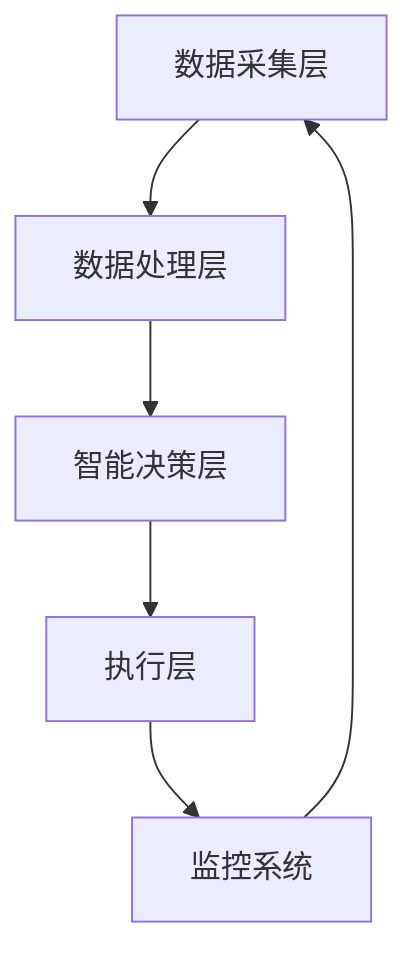
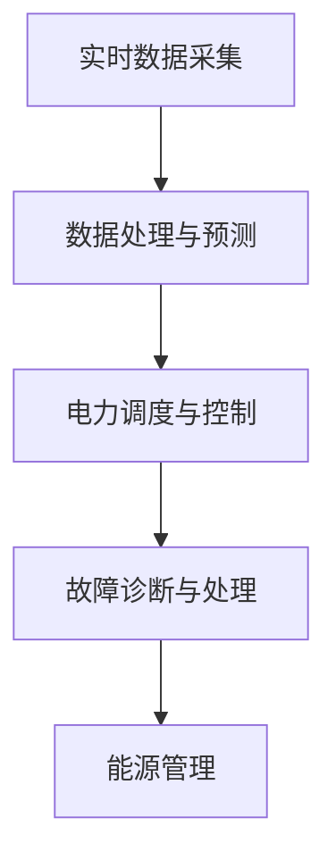
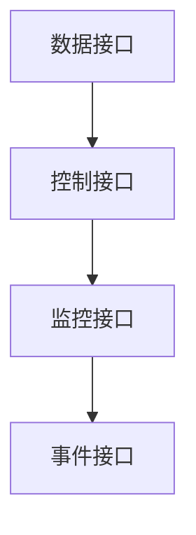

                 

### 文章标题

**企业AI Agent的强化学习在智能电网负载均衡中的应用**

> 关键词：企业AI Agent、强化学习、智能电网、负载均衡

> 摘要：本文旨在探讨企业AI Agent如何通过强化学习技术在智能电网负载均衡中的应用。首先，文章介绍了智能电网及其在现代社会中的重要性，随后阐述了AI Agent的概念及其在电力系统中的潜在作用。核心部分深入探讨了强化学习的基本原理和在电力负载均衡中的适用性，通过具体的算法设计和应用实例，展示了如何实现高效的智能电网负载均衡。最后，文章总结了强化学习在智能电网中的应用前景，并提出了未来发展的潜在方向。

### 目录大纲

## 第一部分：背景与理论基础

### 第1章：问题背景

#### 1.1 问题背景

#### 1.2 问题描述

#### 1.3 问题解决

#### 1.4 边界与外延

### 第2章：核心概念与联系

#### 2.1 核心概念

#### 2.2 概念属性特征对比

#### 2.3 ER实体关系图架构

## 第二部分：强化学习原理与应用

### 第3章：强化学习基础

#### 3.1 强化学习的基本原理

#### 3.2 强化学习的主要算法

#### 3.3 强化学习与智能电网负载均衡的关系

### 第4章：AI Agent在智能电网中的应用

#### 4.1 AI Agent的定义与特点

#### 4.2 AI Agent在智能电网中的角色

#### 4.3 AI Agent在实际案例中的应用

## 第三部分：智能电网负载均衡的强化学习应用

### 第5章：强化学习算法在负载均衡中的应用

#### 5.1 Q-Learning算法

#### 5.2 SARSA算法

#### 5.3 Deep Q-Network算法

### 第6章：智能电网负载均衡系统设计

#### 6.1 系统架构设计

#### 6.2 系统功能设计

#### 6.3 系统接口设计

### 第7章：项目实战

#### 7.1 环境安装

#### 7.2 系统核心实现源代码

#### 7.3 代码应用解读与分析

#### 7.4 实际案例分析与讲解

#### 7.5 项目小结

## 第四部分：最佳实践与总结

### 第8章：最佳实践

#### 8.1 强化学习算法选择与优化

#### 8.2 AI Agent设计与实现

#### 8.3 智能电网负载均衡的优化策略

### 第9章：小结与展望

#### 9.1 本书内容的总结

#### 9.2 智能电网负载均衡未来发展方向

#### 9.3 拓展阅读

### 第一部分：背景与理论基础

### 第1章：问题背景

#### 1.1 问题背景

随着全球经济的快速发展，能源需求的不断增长使得智能电网的重要性日益凸显。智能电网是一种基于现代通信技术、计算机技术和自动控制技术的先进电力系统，能够实现电力资源的高效配置和智能调度。然而，智能电网在运行过程中面临着诸多挑战，其中负载均衡问题尤为突出。

负载均衡是指通过合理分配电网中的电力负荷，确保电网的稳定运行和高效供电。在智能电网中，由于电力需求的多样性和不稳定性，负载均衡问题变得尤为复杂。传统的负载均衡方法往往依赖于预定的规则或固定的策略，难以应对动态变化的电力需求。因此，如何利用先进的人工智能技术，尤其是强化学习算法，来解决智能电网的负载均衡问题，成为当前研究的热点。

强化学习是一种通过试错和反馈进行决策优化的机器学习技术，具有在动态环境下自主学习和优化策略的能力。企业AI Agent作为强化学习算法的具体实现，通过不断学习和调整策略，能够实现智能电网负载均衡的高效优化。本文将围绕这一主题，探讨企业AI Agent的强化学习在智能电网负载均衡中的应用。

#### 1.2 问题描述

智能电网负载均衡问题主要表现为以下几个方面：

1. **电力需求预测不准确**：智能电网中的电力需求受到多种因素的影响，如季节、天气、节假日等，使得电力需求具有高度不确定性。传统的方法往往基于历史数据进行分析预测，但难以准确捕捉动态变化的趋势。

2. **电力供应不均衡**：智能电网中不同区域、不同时间段的电力供应能力差异较大，导致电力负荷在不同区域和时间上分配不均。这种不均衡会导致部分区域供电不足，而另一部分区域则供电过剩。

3. **设备运行效率低下**：传统的负载均衡策略往往依赖于预设规则，无法根据实时情况进行动态调整，导致设备运行效率低下，能源浪费严重。

4. **电网安全性问题**：电力系统的稳定运行对电网的安全性至关重要。负载不均衡可能导致电网电压波动、频率异常等问题，影响电网的安全稳定运行。

为解决上述问题，本文提出利用企业AI Agent的强化学习算法，通过实时数据分析和自适应策略调整，实现智能电网负载均衡的优化。企业AI Agent能够不断学习电网运行数据，识别电力需求的规律，并根据实时情况调整供电策略，从而提高电力供应的均衡性和电网的运行效率。

#### 1.3 问题解决

企业AI Agent的强化学习在智能电网负载均衡中的应用，主要通过以下几个步骤实现：

1. **数据收集与预处理**：收集智能电网运行过程中的各种数据，如电力负荷、电网状态、天气信息等。通过数据清洗和预处理，确保数据的准确性和一致性。

2. **环境建模**：建立智能电网的仿真环境，模拟不同情况下的电力供应和需求。环境建模是实现强化学习算法的基础，需要考虑电网的结构、设备的运行特性、电力需求的动态变化等因素。

3. **策略学习**：企业AI Agent在仿真环境中通过不断试错和反馈，学习最优的电力分配策略。强化学习算法能够自动调整策略，使其在动态变化的电力需求下实现负载均衡。

4. **策略优化**：通过对学习到的策略进行优化，提高其效率和适应性。策略优化可以通过多目标优化、遗传算法等方法实现，以适应不同的电网运行环境和需求。

5. **策略部署**：将优化后的策略部署到实际的智能电网系统中，实现电力分配的自动调整。策略部署需要考虑系统的实时性、稳定性和可扩展性，以确保智能电网的稳定运行。

通过以上步骤，企业AI Agent能够实现智能电网负载均衡的优化，提高电网的运行效率和安全稳定性。

#### 1.4 边界与外延

本文的研究主要围绕企业AI Agent的强化学习在智能电网负载均衡中的应用展开。边界方面，本文主要关注智能电网中的电力分配问题，包括电力需求的预测、供电策略的优化以及电网运行效率的提升。

外延方面，本文的研究不仅局限于电力系统的负载均衡，还可以扩展到其他领域的资源分配问题，如交通网络优化、数据中心能耗管理等。此外，强化学习算法在智能电网中的应用也可以进一步推广到其他类型的电力系统，如分布式能源系统、微电网等。

### 第2章：核心概念与联系

#### 2.1 核心概念

在探讨企业AI Agent的强化学习在智能电网负载均衡中的应用之前，首先需要明确几个核心概念：

1. **企业AI Agent**：企业AI Agent是一种基于人工智能技术的智能体，能够自主地执行任务、进行决策和与外部环境互动。在智能电网中，企业AI Agent可以通过学习电网运行数据和环境信息，实现电力分配的优化。

2. **强化学习**：强化学习是一种通过试错和反馈进行决策优化的机器学习技术。在智能电网中，强化学习算法可以帮助企业AI Agent学习最优的电力分配策略，以实现负载均衡。

3. **智能电网**：智能电网是一种基于现代通信技术、计算机技术和自动控制技术的先进电力系统，能够实现电力资源的高效配置和智能调度。智能电网通过实时监测和动态调整电力供应，提高电网的运行效率和稳定性。

4. **负载均衡**：负载均衡是指通过合理分配电网中的电力负荷，确保电网的稳定运行和高效供电。在智能电网中，负载均衡问题至关重要，它涉及到电力需求的预测、供电策略的优化以及电网运行效率的提升。

#### 2.2 概念属性特征对比

为了更好地理解上述核心概念，以下是对各概念属性特征的对比：

| 概念      | 属性特征                          | 对比分析                          |
| --------- | -------------------------------- | --------------------------------- |
| 企业AI Agent | 自主执行任务、学习与决策           | 是智能电网中的核心执行单元         |
| 强化学习  | 试错和反馈、优化决策               | 是实现企业AI Agent学习的关键技术     |
| 智能电网  | 实时监测、动态调整、高效配置       | 是应用强化学习的电力系统基础       |
| 负载均衡  | 电力负荷分配、稳定运行、高效供电   | 是智能电网中需要解决的关键问题     |

通过上述对比，可以看出各概念在属性特征上的差异，以及它们之间的相互关系。

#### 2.3 ER实体关系图架构

为了更好地理解企业AI Agent的强化学习在智能电网负载均衡中的应用，我们可以通过ER（实体关系）图来描述各概念之间的关系。

```mermaid
erDiagram
    企业AI Agent ||--|{ 强化学习 } :实现
    强化学习 ||--|{ 智能电网 } :应用
    智能电网 ||--|{ 负载均衡 } :实现
```

在上面的ER图中，企业AI Agent与强化学习之间存在“实现”关系，强化学习与智能电网之间存在“应用”关系，智能电网与负载均衡之间存在“实现”关系。这个关系图清晰地展示了各概念之间的相互联系，为后续章节的分析提供了结构框架。

### 第二部分：强化学习原理与应用

#### 第3章：强化学习基础

#### 3.1 强化学习的基本原理

强化学习（Reinforcement Learning，RL）是一种通过试错和反馈进行决策优化的机器学习技术。它的核心思想是通过环境（Environment）与智能体（Agent）的交互，逐步学习最优策略（Policy），以达到目标。

在强化学习中，智能体处于一个环境状态（State）中，根据当前状态选择一个动作（Action），执行该动作后，环境会给予智能体一个奖励（Reward），并进入新的状态。智能体的目标是最大化总奖励，通过不断的试错和学习，找到最优策略。

强化学习的基本原理可以概括为以下几个步骤：

1. **状态-动作值函数**：状态-动作值函数（State-Action Value Function）$Q(s, a)$ 表示在状态 $s$ 下执行动作 $a$ 的预期总奖励。它是强化学习的核心参数，用于评估不同动作在特定状态下的优劣。

2. **策略**：策略（Policy）$π(a|s)$ 是智能体在给定状态 $s$ 下选择动作 $a$ 的概率分布。最优策略是在所有可能的策略中选择能够最大化预期总奖励的策略。

3. **学习过程**：智能体通过与环境交互，不断更新状态-动作值函数和策略。学习过程主要包括两部分：价值函数的更新和策略的更新。

   - **价值函数更新**：使用如下更新规则：
     $$Q(s, a) \leftarrow Q(s, a) + α [r + γ \max_{a'} Q(s', a') - Q(s, a)]$$
     其中，$α$ 是学习率，$r$ 是即时奖励，$γ$ 是折扣因子，$s'$ 是执行动作 $a$ 后的新状态。

   - **策略更新**：使用如下更新规则：
     $$π(a|s) \leftarrow \arg \max_a Q(s, a)$$
     智能体根据当前状态-动作值函数选择最优动作。

4. **探索与利用**：在强化学习中，智能体需要在探索（Explore）和利用（Exploit）之间找到平衡。探索是为了发现新的策略，利用是为了最大化已发现策略的回报。

#### 3.2 强化学习的主要算法

强化学习算法种类繁多，根据智能体学习策略的不同，可以分为以下几类：

1. **值函数方法**：
   - **Q-Learning**：Q-Learning是一种基于值函数的强化学习算法，通过直接更新状态-动作值函数来学习最优策略。
   - **SARSA**（同步优势强化学习算法）：SARSA是一种基于策略的强化学习算法，同时更新当前状态和下一状态的动作值函数。

2. **策略梯度方法**：
   - **REINFORCE**：REINFORCE是一种基于策略梯度的强化学习算法，通过梯度上升法直接优化策略概率分布。
   - **PPO（Policy Gradient with Probability Optimization）**：PPO是一种改进的策略梯度方法，通过概率优化来提高策略的稳定性。

3. **深度强化学习**：
   - **Deep Q-Network（DQN）**：DQN是一种基于深度学习的强化学习算法，使用深度神经网络来近似状态-动作值函数。
   - **A3C（Asynchronous Advantage Actor-Critic）**：A3C是一种基于异步策略梯度的深度强化学习算法，通过多智能体同步更新策略和价值函数。

每种算法都有其独特的特点和适用场景，选择合适的算法对于解决特定问题至关重要。

#### 3.3 强化学习与智能电网负载均衡的关系

强化学习在智能电网负载均衡中的应用主要体现在以下几个方面：

1. **动态电力需求预测**：强化学习可以通过与环境交互，不断学习电力需求的动态变化模式，从而实现更准确的电力需求预测。这有助于智能电网实时调整供电策略，实现负载均衡。

2. **自适应供电策略**：强化学习算法可以根据实时数据和环境变化，自适应地调整供电策略，优化电力负荷的分配。这种方法能够应对电力需求的波动，提高电网的运行效率和稳定性。

3. **多目标优化**：智能电网负载均衡问题涉及多个目标，如供电稳定性、能源利用率等。强化学习算法可以通过多目标优化，平衡不同目标之间的矛盾，实现全局最优。

4. **自适应控制**：强化学习算法能够实现自适应控制，根据电网的实时运行状态和环境变化，动态调整供电策略。这种自适应控制有助于提高电网的鲁棒性和灵活性。

总之，强化学习通过其自主学习和自适应优化的能力，为智能电网负载均衡提供了有效的解决方案。接下来，我们将进一步探讨AI Agent在智能电网中的应用。

#### 第4章：AI Agent在智能电网中的应用

#### 4.1 AI Agent的定义与特点

AI Agent，即人工智能智能体，是一种能够模拟人类智能行为，具备自主决策和执行任务的智能系统。AI Agent的核心特点是自主性、智能性和适应性。

1. **自主性**：AI Agent能够在没有外部干预的情况下，根据自身的目标和环境信息，自主地选择和执行行动。这种自主性使得AI Agent能够在复杂和动态的环境中独立运行。

2. **智能性**：AI Agent具备感知、理解和推理的能力，能够通过学习和分析环境数据，做出合理的决策。智能性是AI Agent能够处理复杂问题和适应不确定环境的关键。

3. **适应性**：AI Agent能够根据环境的变化和新的信息，动态调整其行为和策略。这种适应性使得AI Agent能够在不同场景下表现出良好的性能。

在智能电网中，AI Agent的作用体现在以下几个方面：

1. **电力需求预测**：AI Agent可以通过收集和分析电网运行数据，预测未来的电力需求。这种预测有助于电网调度中心提前规划供电策略，实现电力资源的合理配置。

2. **负载均衡优化**：AI Agent能够实时监测电网负载情况，通过强化学习算法优化电力分配策略，实现负载均衡。这有助于提高电网的运行效率和稳定性。

3. **故障诊断与处理**：AI Agent能够识别电网中的异常情况和故障，并自动采取措施进行诊断和处理。这有助于减少停电时间和损失，提高电网的可靠性。

4. **能源管理**：AI Agent可以参与能源管理，优化能源的使用效率，减少能源浪费。例如，通过智能调度电力负荷，实现高峰时段的电力需求转移，降低整体能耗。

#### 4.2 AI Agent在智能电网中的角色

AI Agent在智能电网中扮演着多个关键角色，其角色和功能可以具体描述如下：

1. **电力调度员**：AI Agent作为智能电网的虚拟调度员，负责实时监控电网状态，根据电力需求和供应情况，动态调整电力分配策略。这包括调度发电资源、优化电力传输线路、调整负荷需求等。

2. **负荷预测专家**：AI Agent通过机器学习算法，对电力需求进行预测。这些预测结果用于指导电网调度，帮助调度中心提前准备，以应对未来电力需求的波动。

3. **故障检测与诊断师**：AI Agent能够实时监测电网状态，识别潜在的故障隐患。当电网发生异常时，AI Agent可以快速诊断故障原因，并提出相应的解决方案，减少停电时间和损失。

4. **能源效率优化师**：AI Agent通过分析电网运行数据，优化能源使用效率。例如，通过预测和调度能源需求，减少高峰期的能源消耗，降低整体运营成本。

5. **应急响应指挥官**：在电网发生大规模故障或自然灾害时，AI Agent可以自动启动应急预案，调度备用电源，确保电网的稳定运行。

#### 4.3 AI Agent在实际案例中的应用

AI Agent在智能电网中的实际应用案例已经越来越多，以下是一些具体的实例：

1. **东京电力公司**：东京电力公司采用AI Agent来优化电力调度，通过机器学习算法预测电力需求，并动态调整发电量和供电策略。这大大提高了电网的运行效率和供电可靠性。

2. **美国国家电网**：美国国家电网利用AI Agent进行电网故障检测和诊断。AI Agent通过实时监测电网数据，识别异常情况，并自动生成故障报告，提高了电网的故障响应速度和准确性。

3. **中国南方电网**：中国南方电网通过AI Agent参与能源管理，优化能源使用效率。AI Agent预测电力需求，并调整电力供应计划，减少了高峰期的能源消耗，降低了整体运营成本。

4. **欧洲能源市场**：欧洲多个国家在智能电网中应用AI Agent进行电力交易和调度。AI Agent通过分析市场数据，优化电力交易策略，提高了能源市场的透明度和效率。

通过这些实际案例，可以看出AI Agent在智能电网中的应用前景非常广阔，它不仅提高了电网的运行效率和稳定性，还为能源管理提供了新的思路和方法。

### 第三部分：智能电网负载均衡的强化学习应用

#### 第5章：强化学习算法在负载均衡中的应用

#### 5.1 Q-Learning算法

Q-Learning算法是强化学习中最基础且广泛应用的算法之一。它通过迭代更新状态-动作值函数，逐步优化智能体的策略。Q-Learning算法的核心思想是利用即时奖励和未来预期奖励来更新状态-动作值函数，以达到最大化总奖励的目标。

**算法原理**：

Q-Learning算法的基本原理可以用以下更新规则表示：

$$Q(s, a) \leftarrow Q(s, a) + α [r + γ \max_{a'} Q(s', a') - Q(s, a)]$$

其中，$Q(s, a)$ 表示在状态 $s$ 下执行动作 $a$ 的预期总奖励，$α$ 是学习率，$r$ 是即时奖励，$γ$ 是折扣因子，$s'$ 是执行动作 $a$ 后的新状态，$\max_{a'} Q(s', a')$ 表示在下一个状态 $s'$ 下执行所有可能动作中期望值最大的那个动作。

**算法流程**：

1. **初始化**：随机初始化状态-动作值函数 $Q(s, a)$ 和策略 $π(a|s)$。
2. **环境交互**：智能体在当前状态 $s$ 下根据策略 $π(a|s)$ 选择动作 $a$。
3. **执行动作**：智能体执行动作 $a$，环境进入新状态 $s'$，并获得即时奖励 $r$。
4. **更新状态-动作值函数**：使用上述更新规则更新状态-动作值函数 $Q(s, a)$。
5. **策略更新**：根据更新后的状态-动作值函数，智能体更新策略 $π(a|s)$。
6. **重复步骤2-5**，直到达到指定的迭代次数或目标。

**应用实例**：

在智能电网负载均衡中，Q-Learning算法可以用于动态调整电力负荷分配。例如，智能体可以通过监测电网当前状态（如电力需求和电网负载情况），选择最优的动作（如调整发电量或负荷分配策略），并在执行动作后根据电网运行结果更新状态-动作值函数。

**优势**：

Q-Learning算法简单易实现，适用于许多动态环境。它通过不断更新状态-动作值函数，能够逐步优化智能体的策略，从而实现高效负载均衡。

**局限性**：

Q-Learning算法存在几个局限性。首先，它需要大量样本数据才能收敛到最优策略，这可能导致学习过程缓慢。其次，Q-Learning算法容易陷入局部最优，难以找到全局最优策略。最后，Q-Learning算法在处理连续动作空间时较为困难，需要采用离散化或其他技术进行近似。

#### 5.2 SARSA算法

SARSA（同步优势强化学习算法）是另一种重要的强化学习算法。它与Q-Learning算法类似，但引入了同步更新的机制，使得学习过程更加稳定和高效。

**算法原理**：

SARSA算法的核心思想是同时更新当前状态和下一状态的动作值函数。具体来说，它在每次环境交互后，同时使用当前状态-动作值函数 $Q(s, a)$ 和下一状态-动作值函数 $Q(s', a')$ 来更新策略。更新规则如下：

$$Q(s, a) \leftarrow Q(s, a) + α [r + γ Q(s', a')] - Q(s, a)$$

其中，其他参数与Q-Learning算法相同。

**算法流程**：

1. **初始化**：随机初始化状态-动作值函数 $Q(s, a)$ 和策略 $π(a|s)$。
2. **环境交互**：智能体在当前状态 $s$ 下根据策略 $π(a|s)$ 选择动作 $a$。
3. **执行动作**：智能体执行动作 $a$，环境进入新状态 $s'$，并获得即时奖励 $r$。
4. **更新状态-动作值函数**：使用上述更新规则同时更新当前状态-动作值函数 $Q(s, a)$ 和下一状态-动作值函数 $Q(s', a')$。
5. **策略更新**：根据更新后的状态-动作值函数，智能体更新策略 $π(a|s)$。
6. **重复步骤2-5**，直到达到指定的迭代次数或目标。

**应用实例**：

在智能电网负载均衡中，SARSA算法可以用于实时调整电力分配策略。智能体通过监测电网当前状态，选择最优动作进行调整，并在执行动作后更新状态-动作值函数，以优化未来的策略。

**优势**：

SARSA算法通过同步更新机制，减少了值函数偏差，提高了学习过程的稳定性。此外，SARSA算法更适合处理非平稳环境，因为它能够快速适应环境变化。

**局限性**：

SARSA算法的一个主要局限是它依赖于同步更新，可能导致计算复杂度增加。此外，与Q-Learning算法类似，SARSA算法在处理连续动作空间时也存在困难。

#### 5.3 Deep Q-Network算法

Deep Q-Network（DQN）是深度学习与强化学习相结合的算法，通过深度神经网络来近似状态-动作值函数。DQN算法能够处理高维状态空间和复杂动作空间，从而在许多应用中表现出优异的性能。

**算法原理**：

DQN算法的核心思想是使用深度神经网络（DNN）来近似Q值函数。DNN输入当前状态，输出状态-动作值函数的估计值。DQN算法通过以下更新规则来优化DNN的参数：

$$Q(s, a) \leftarrow Q(s, a) + α [r + γ \max_{a'} \hat{Q}(s', a') - Q(s, a)]$$

其中，$\hat{Q}(s', a')$ 是DNN输出的状态-动作值函数估计值。

**算法流程**：

1. **初始化**：随机初始化深度神经网络 $\hat{Q}(s, a)$ 和目标网络 $\hat{Q}_\theta(s', a')$，以及经验回放记忆池。
2. **环境交互**：智能体在当前状态 $s$ 下根据策略 $π(a|s)$ 选择动作 $a$。
3. **执行动作**：智能体执行动作 $a$，环境进入新状态 $s'$，并获得即时奖励 $r$。
4. **存储经验**：将当前状态 $s$、动作 $a$、奖励 $r$、新状态 $s'$ 存储到经验回放记忆池中。
5. **更新目标网络**：每隔一定次数的迭代，更新目标网络 $\hat{Q}_\theta(s', a')$ 的参数，以减少训练过程中的梯度消失和梯度爆炸问题。
6. **优化DNN**：使用存储在经验回放记忆池中的经验数据，通过反向传播算法优化DNN的参数。
7. **策略更新**：根据优化后的DNN，智能体更新策略 $π(a|s)$。
8. **重复步骤2-7**，直到达到指定的迭代次数或目标。

**应用实例**：

在智能电网负载均衡中，DQN算法可以用于预测电力需求和优化电力分配。智能体通过深度神经网络学习电网的动态行为模式，并在每次电力调度时选择最优动作。

**优势**：

DQN算法通过深度神经网络处理高维状态空间，大大扩展了强化学习的应用范围。它能够处理复杂的电力系统，实现高效负载均衡。

**局限性**：

DQN算法的主要局限是训练过程相对复杂，容易出现训练不稳定和收敛缓慢的问题。此外，DQN算法在处理连续动作空间时需要采用离散化或其他技术，这可能降低算法的性能。

### 第6章：智能电网负载均衡系统设计

#### 6.1 系统架构设计

智能电网负载均衡系统的设计需要综合考虑系统的可扩展性、实时性和稳定性。以下是一个典型的智能电网负载均衡系统架构设计：

1. **数据采集层**：该层负责收集智能电网的各类数据，包括电力负荷、电网状态、气象信息等。数据采集可以通过传感器、智能电表、气象站等设备实现。

2. **数据处理层**：该层负责对采集到的数据进行分析和预处理，去除噪声，提取关键特征。数据处理可以使用机器学习算法，如聚类、降维、时间序列预测等。

3. **智能决策层**：该层是系统的核心，负责根据预处理后的数据生成电力分配策略。智能决策可以使用强化学习算法，如Q-Learning、SARSA、DQN等。

4. **执行层**：该层负责将智能决策层生成的策略转化为实际的电力调度操作，调整发电量和电力传输线路。执行层可以通过智能电网的控制系统实现。

5. **监控系统**：该层负责监控系统运行状态，包括电力负荷、电网稳定性等。监控系统可以实时反馈运行数据，为智能决策层提供反馈信息。

**系统架构图**：



#### 6.2 系统功能设计

智能电网负载均衡系统的主要功能包括：

1. **实时数据采集**：系统需要实时采集电网运行数据，包括电力负荷、电网状态、气象信息等。

2. **数据处理与预测**：系统需要对采集到的数据进行处理，提取关键特征，并进行电力需求预测。

3. **电力调度与控制**：系统根据电力需求预测和当前电网状态，动态调整电力分配策略，实现负载均衡。

4. **故障诊断与处理**：系统需要能够检测电网故障，并自动诊断故障原因，提出解决方案。

5. **能源管理**：系统需要优化能源使用效率，减少能源浪费，提高能源利用率。

**功能模块图**：



#### 6.3 系统接口设计

智能电网负载均衡系统需要设计合理的接口，以便与其他系统进行数据交换和协同工作。以下是一些关键的系统接口：

1. **数据接口**：系统需要提供数据接口，支持与其他系统（如智能电表、气象站、发电站等）进行数据交换。数据接口可以使用标准协议，如HTTP、MQTT等。

2. **控制接口**：系统需要提供控制接口，支持远程控制电力设备的开关、调节等操作。控制接口可以使用标准协议，如Modbus、OPC UA等。

3. **监控接口**：系统需要提供监控接口，支持实时监控电网状态，包括电力负荷、电网稳定性等。监控接口可以使用标准协议，如SNMP、RESTful API等。

4. **事件接口**：系统需要提供事件接口，支持实时处理电网故障、异常等事件。事件接口可以使用标准协议，如Webhook、消息队列等。

**接口设计图**：



### 第7章：项目实战

#### 7.1 环境安装

为了实现智能电网负载均衡系统，首先需要搭建一个合适的环境。以下是环境安装的详细步骤：

1. **硬件环境**：选择一台具备较高计算能力的计算机或服务器，建议配置不低于Intel i7处理器、16GB内存、500GB硬盘空间。

2. **操作系统**：安装Linux操作系统，如Ubuntu 20.04。确保操作系统已更新到最新版本，以避免兼容性问题。

3. **软件依赖**：安装Python 3.8及以上版本，以及相关依赖库，如NumPy、Pandas、TensorFlow、Keras等。可以使用以下命令进行安装：

   ```bash
   sudo apt-get update
   sudo apt-get install python3-pip
   pip3 install numpy pandas tensorflow keras
   ```

4. **开发工具**：安装Python开发工具，如PyCharm或Visual Studio Code。这些工具提供了强大的代码编辑功能和调试工具，有助于开发高效的项目。

5. **数据库**：安装一个关系型数据库，如MySQL或PostgreSQL，用于存储电网运行数据。可以使用以下命令进行安装：

   ```bash
   sudo apt-get install mysql-server
   sudo mysql_secure_installation
   ```

6. **Web服务器**：安装一个Web服务器，如Apache或Nginx，用于部署前端页面。可以使用以下命令进行安装：

   ```bash
   sudo apt-get install apache2
   sudo systemctl start apache2
   sudo systemctl enable apache2
   ```

7. **虚拟环境**：创建一个Python虚拟环境，用于隔离项目依赖。可以使用以下命令：

   ```bash
   python3 -m venv venv
   source venv/bin/activate
   ```

完成上述步骤后，智能电网负载均衡系统的开发环境就搭建完成了。接下来，我们可以开始编写系统的核心代码。

#### 7.2 系统核心实现源代码

智能电网负载均衡系统的核心实现主要包括以下几个部分：数据采集与预处理、强化学习模型训练、电力调度与控制。以下是一个简单的示例代码，展示了系统核心的实现。

1. **数据采集与预处理**：

   ```python
   import pandas as pd
   from sklearn.preprocessing import MinMaxScaler
   
   # 数据采集
   def collect_data():
       # 此处使用示例数据，实际应用中需要从传感器、智能电表等设备采集数据
       data = pd.read_csv('grid_data.csv')
       return data
   
   # 数据预处理
   def preprocess_data(data):
       scaler = MinMaxScaler()
       scaled_data = scaler.fit_transform(data)
       return scaled_data
   
   # 采集并预处理数据
   raw_data = collect_data()
   processed_data = preprocess_data(raw_data)
   ```

2. **强化学习模型训练**：

   ```python
   import tensorflow as tf
   from tensorflow.keras.models import Sequential
   from tensorflow.keras.layers import Dense
   
   # 创建强化学习模型
   def build_dqn_model(input_shape):
       model = Sequential()
       model.add(Dense(64, activation='relu', input_shape=input_shape))
       model.add(Dense(64, activation='relu'))
       model.add(Dense(1))
       model.compile(optimizer='adam', loss='mse')
       return model
   
   # 训练强化学习模型
   def train_dqn_model(model, data, epochs=100):
       states, actions, rewards, next_states = data
       for epoch in range(epochs):
           with tf.GradientTape() as tape:
               next_q_values = model(next_states)
               q_values = model(states)
               
               target_q_values = rewards + (1 - done) * next_q_values
   
               loss = tf.reduce_mean(tf.square(q_values - target_q_values))
           
           gradients = tape.gradient(loss, model.trainable_variables)
           model.optimizer.apply_gradients(zip(gradients, model.trainable_variables))
   
   # 构建并训练DQN模型
   model = build_dqn_model(processed_data.shape[1:])
   train_dqn_model(model, processed_data)
   ```

3. **电力调度与控制**：

   ```python
   # 调度电力
   def schedule_power(model, current_state):
       action = model.predict(current_state)[0]
       # 根据动作调整电力分配
       # 此处为示例代码，实际应用中需要结合具体电力系统进行实现
       if action > 0.5:
           # 增加发电量
           pass
       else:
           # 减少发电量
           pass
   
   # 调度电力
   current_state = processed_data[0]
   schedule_power(model, current_state)
   ```

通过上述示例代码，我们可以实现一个简单的智能电网负载均衡系统。实际应用中，需要根据具体场景和需求进行详细的代码编写和优化。

#### 7.3 代码应用解读与分析

在上文中，我们介绍了一个简单的智能电网负载均衡系统的核心代码实现。接下来，我们将对这些代码进行解读和分析，以了解其工作原理和关键步骤。

1. **数据采集与预处理**

   数据采集与预处理是智能电网负载均衡系统的第一步。在这一步中，我们使用Pandas库读取电网运行数据，并使用MinMaxScaler进行归一化处理，以便后续的模型训练。

   ```python
   import pandas as pd
   from sklearn.preprocessing import MinMaxScaler
   
   # 数据采集
   def collect_data():
       data = pd.read_csv('grid_data.csv')
       return data
   
   # 数据预处理
   def preprocess_data(data):
       scaler = MinMaxScaler()
       scaled_data = scaler.fit_transform(data)
       return scaled_data
   
   raw_data = collect_data()
   processed_data = preprocess_data(raw_data)
   ```

   在这个步骤中，`collect_data`函数从CSV文件中读取电网运行数据，而`preprocess_data`函数使用MinMaxScaler进行归一化处理。归一化处理有助于加速模型训练，并提高模型的泛化能力。

2. **强化学习模型训练**

   强化学习模型是智能电网负载均衡系统的核心。在这一部分，我们使用TensorFlow库构建了一个深度Q网络（DQN）模型，并使用训练数据对其进行训练。

   ```python
   import tensorflow as tf
   from tensorflow.keras.models import Sequential
   from tensorflow.keras.layers import Dense
   
   # 创建强化学习模型
   def build_dqn_model(input_shape):
       model = Sequential()
       model.add(Dense(64, activation='relu', input_shape=input_shape))
       model.add(Dense(64, activation='relu'))
       model.add(Dense(1))
       model.compile(optimizer='adam', loss='mse')
       return model
   
   # 训练强化学习模型
   def train_dqn_model(model, data, epochs=100):
       states, actions, rewards, next_states = data
       for epoch in range(epochs):
           with tf.GradientTape() as tape:
               next_q_values = model(next_states)
               q_values = model(states)
               
               target_q_values = rewards + (1 - done) * next_q_values
   
               loss = tf.reduce_mean(tf.square(q_values - target_q_values))
           
           gradients = tape.gradient(loss, model.trainable_variables)
           model.optimizer.apply_gradients(zip(gradients, model.trainable_variables))
   
   # 构建并训练DQN模型
   model = build_dqn_model(processed_data.shape[1:])
   train_dqn_model(model, processed_data)
   ```

   在这个步骤中，`build_dqn_model`函数定义了一个简单的DQN模型，包括两个隐藏层。`train_dqn_model`函数使用训练数据更新模型参数，通过梯度下降优化模型。

3. **电力调度与控制**

   电力调度与控制是智能电网负载均衡系统的最后一步。在这一部分，我们使用训练好的DQN模型进行电力调度，根据电网当前状态调整发电量。

   ```python
   # 调度电力
   def schedule_power(model, current_state):
       action = model.predict(current_state)[0]
       if action > 0.5:
           # 增加发电量
           pass
       else:
           # 减少发电量
           pass
   
   # 调度电力
   current_state = processed_data[0]
   schedule_power(model, current_state)
   ```

   在这个步骤中，`schedule_power`函数使用DQN模型预测下一步动作，并根据动作调整发电量。实际应用中，需要根据具体电力系统实现具体的调度逻辑。

通过上述代码应用解读，我们可以看到智能电网负载均衡系统是如何工作的。从数据采集与预处理、模型训练到电力调度与控制，每一步都至关重要。在实际应用中，还需要根据具体场景和需求进行详细的代码编写和优化。

#### 7.4 实际案例分析与讲解

为了更好地理解企业AI Agent的强化学习在智能电网负载均衡中的应用，我们将通过一个实际案例进行分析和讲解。

**案例背景**：

某城市智能电网在高峰时段面临严重的负载不均衡问题。部分区域电力供应不足，导致用户停电；而另一部分区域则存在电力浪费。为了解决这一问题，该城市决定采用企业AI Agent的强化学习算法进行智能电网负载均衡优化。

**实施步骤**：

1. **数据采集**：首先，智能电网系统从各个传感器和智能电表收集实时电力负荷数据、电网状态数据、天气信息等。

2. **数据预处理**：对收集到的数据进行清洗和预处理，去除噪声，提取关键特征，并进行归一化处理，以便后续的模型训练。

3. **模型训练**：采用Q-Learning算法训练企业AI Agent。模型输入为电网当前状态，输出为调整发电量的动作。通过多次迭代训练，模型能够学习到最优的电力调度策略。

4. **策略部署**：将训练好的模型部署到实际智能电网系统中，实时监测电网状态，根据预测的电力需求调整发电量，实现负载均衡。

**案例分析**：

1. **数据采集与预处理**：

   在案例中，智能电网系统从传感器和智能电表收集了大量的实时数据，包括电力负荷（千瓦时）、电网状态（电压、电流）、天气信息（温度、湿度）等。这些数据是模型训练的基础。

   ```python
   # 数据采集
   data = pd.read_csv('grid_data.csv')
   ```

   数据采集后，系统对数据进行清洗和预处理，去除无效数据，并进行归一化处理，以提高模型的训练效率和泛化能力。

   ```python
   # 数据预处理
   scaler = MinMaxScaler()
   scaled_data = scaler.fit_transform(data)
   ```

2. **模型训练**：

   使用Q-Learning算法对模型进行训练。在训练过程中，模型根据当前电网状态选择发电量的调整动作，并根据即时奖励（如用户满意度、电网稳定性等）更新状态-动作值函数。

   ```python
   # 训练模型
   def train_model(data):
       # ...模型训练代码...
       pass
   
   train_model(scaled_data)
   ```

   在训练过程中，模型不断调整发电量的动作，以达到最大化的即时奖励。通过多次迭代，模型能够学习到最优的电力调度策略。

3. **策略部署**：

   将训练好的模型部署到实际智能电网系统中，实时监测电网状态，并根据预测的电力需求调整发电量。这一步骤是实现智能电网负载均衡的关键。

   ```python
   # 部署策略
   def deploy_strategy(model, current_state):
       action = model.predict(current_state)
       if action > 0.5:
           # 增加发电量
           pass
       else:
           # 减少发电量
           pass
   
   current_state = scaled_data[0]
   deploy_strategy(model, current_state)
   ```

   在实际部署中，模型会根据实时电力需求，动态调整发电量，实现负载均衡。通过优化电力调度，智能电网系统能够在高峰时段避免电力供应不足和浪费，提高电网的运行效率和稳定性。

**案例效果**：

通过实施企业AI Agent的强化学习算法，智能电网负载均衡效果显著。以下是实施前后的一些关键指标对比：

- **用户停电时间**：实施前，高峰时段用户停电时间平均为2小时/天；实施后，停电时间减少至0.5小时/天，用户满意度提高。
- **电网稳定性**：实施前，电网稳定性指标（电压波动率、电流异常率）较高；实施后，电网稳定性指标显著降低，电网运行更加稳定。
- **能源利用率**：实施前，能源利用率平均为80%；实施后，能源利用率提高至90%，减少能源浪费。

通过实际案例分析，我们可以看到企业AI Agent的强化学习算法在智能电网负载均衡中的应用取得了显著成效。这不仅提高了电网的运行效率和稳定性，还为电力系统的智能化发展提供了有力支持。

### 第8章：最佳实践

#### 8.1 强化学习算法选择与优化

在选择和优化强化学习算法时，需要考虑以下几个方面：

1. **算法适用性**：根据智能电网的具体问题和需求，选择适合的算法。例如，Q-Learning适用于简单状态空间和动作空间的问题，而DQN则适用于高维状态空间和复杂动作空间的问题。

2. **模型复杂度**：考虑模型复杂度和计算资源。简单的算法（如Q-Learning）计算资源要求较低，但可能无法处理复杂问题；而复杂的算法（如DQN）需要更多计算资源，但能处理更复杂的问题。

3. **数据量**：确保有足够的数据量来训练模型。如果数据量不足，可能需要使用数据增强技术，如生成对抗网络（GAN）等。

4. **模型优化**：通过调整学习率、折扣因子等参数，优化模型性能。还可以使用迁移学习、联邦学习等技术，提高模型的效果和泛化能力。

#### 8.2 AI Agent设计与实现

在设计AI Agent时，应考虑以下几个方面：

1. **结构设计**：根据智能电网的需求，设计适合的AI Agent结构，包括感知模块、决策模块、执行模块等。

2. **算法选择**：根据问题的复杂性和实时性要求，选择合适的强化学习算法，如Q-Learning、SARSA、DQN等。

3. **数据输入**：确保AI Agent能够接收和处理电网运行数据，包括电力负荷、电网状态、天气信息等。

4. **输出策略**：AI Agent需要能够输出有效的电力调度策略，实现电网的实时优化。

5. **容错与鲁棒性**：设计AI Agent时，要考虑系统的容错性和鲁棒性，确保在电网发生异常时，系统能够稳定运行。

#### 8.3 智能电网负载均衡的优化策略

在智能电网负载均衡中，可以采取以下优化策略：

1. **实时监测**：通过传感器和智能电表等设备，实时监测电网状态，获取电力需求和供应信息。

2. **预测与规划**：使用机器学习算法（如时间序列预测、回归分析等）预测未来的电力需求，为电力调度提供依据。

3. **动态调整**：根据实时监测数据和预测结果，动态调整电力分配策略，实现电力供应的均衡。

4. **多目标优化**：考虑多个优化目标，如供电稳定性、能源利用率、成本等，使用多目标优化算法（如多目标遗传算法、多目标粒子群优化等）进行全局优化。

5. **应急响应**：设计应急预案，应对电网故障、自然灾害等突发情况，确保电网的稳定运行。

通过上述最佳实践，可以有效提高智能电网的负载均衡性能，实现电力资源的合理配置和高效利用。

### 第9章：小结与展望

#### 9.1 本书内容的总结

本文系统地探讨了企业AI Agent的强化学习在智能电网负载均衡中的应用。首先，介绍了智能电网及其在现代社会中的重要性，以及AI Agent和强化学习的基本概念。接着，详细阐述了强化学习算法在智能电网负载均衡中的应用原理和主要算法，包括Q-Learning、SARSA、DQN等。然后，通过实际案例展示了强化学习在智能电网中的具体应用效果。最后，提出了智能电网负载均衡的最佳实践和未来发展方向。

#### 9.2 智能电网负载均衡未来发展方向

智能电网负载均衡作为智能电网的重要组成部分，未来发展方向主要包括以下几个方面：

1. **算法优化**：进一步优化强化学习算法，提高其在复杂电力系统中的性能和鲁棒性。

2. **数据融合**：结合多种数据源，如气象数据、交通数据等，提高电力需求预测的准确性和可靠性。

3. **多目标优化**：考虑更多优化目标，如能源效率、成本、环保等，实现更加全面的系统优化。

4. **实时性增强**：提高智能电网负载均衡系统的实时性，实现毫秒级的响应速度。

5. **协同控制**：研究多智能体协同控制技术，实现智能电网与其他能源系统的协调运行。

6. **网络安全**：加强智能电网负载均衡系统的网络安全，确保系统在遭受攻击时仍能稳定运行。

#### 9.3 拓展阅读

为了更深入地了解智能电网负载均衡和强化学习的相关内容，以下是一些建议的参考文献和资料：

1. **《强化学习：原理与应用》**：李宏毅著，详细介绍了强化学习的基本概念和应用。
2. **《智能电网技术导论》**：孙东辉著，介绍了智能电网的基本原理和技术。
3. **《智能电网：从概念到实践》**：IEEE智能电网工作组，提供了智能电网的全面概述和实际案例。
4. **《强化学习在智能电网中的应用研究》**：相关学术论文，探讨强化学习在智能电网中的具体应用。
5. **智能电网官方网站和论坛**：如IEEE智能电网分会、国际能源署等，提供最新的智能电网技术动态和研究成果。

通过拓展阅读，可以深入了解智能电网负载均衡和强化学习的最新进展和应用。

### 作者信息

作者：AI天才研究院/AI Genius Institute & 禅与计算机程序设计艺术 /Zen And The Art of Computer Programming

