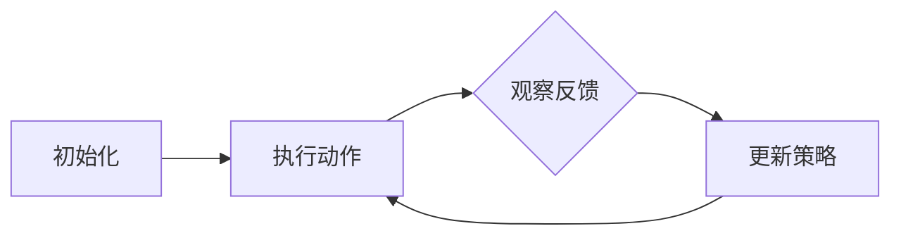
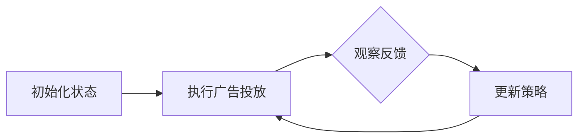
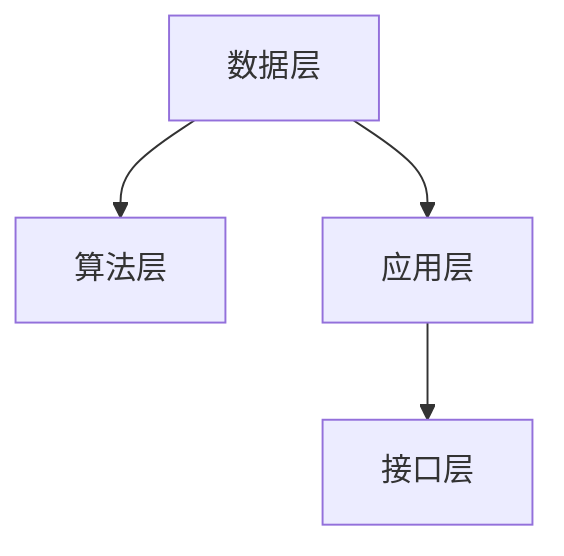
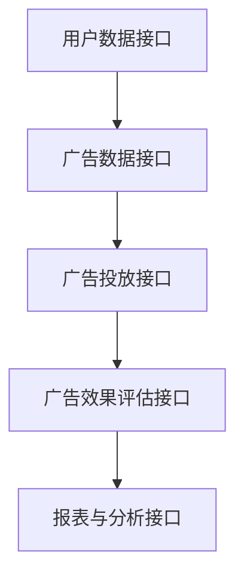

                 

# 企业AI Agent的强化学习在程序化广告投放中的实践

## 概要

### 背景介绍
随着人工智能技术的不断发展，程序化广告投放已成为现代营销的重要手段。在众多AI算法中，强化学习被广泛应用于广告投放优化，以期提高广告效果和投资回报率。然而，目前企业对于AI Agent在强化学习中的实际应用仍存在许多困惑和挑战。

### 核心概念与联系
本文将探讨强化学习在广告投放中的原理和应用场景，介绍如何构建和训练AI Agent以优化广告投放策略，以及如何评估AI Agent在广告投放中的性能和效果。

### 算法原理讲解
通过具体算法流程图和Python代码示例，详细阐述强化学习在广告投放中的应用。

### 系统分析与架构设计方案
分析广告投放系统的需求和设计，给出系统功能设计、系统架构设计和系统接口设计的详细方案。

### 项目实战
通过具体项目实践，展示如何安装环境、实现系统核心功能，并进行实际案例分析。

### 最佳实践 Tips、小结、注意事项、拓展阅读
总结最佳实践经验，提出注意事项，提供拓展阅读资料。

## 第一部分：背景介绍

### 1. 引言

#### 1.1 问题背景
随着互联网的快速发展，广告营销已成为企业竞争的重要手段。在众多广告投放方式中，程序化广告投放因其精准、高效和低成本的特点，受到越来越多企业的青睐。然而，广告投放的效果往往受到多种因素的影响，如用户行为、广告质量、投放策略等，如何优化广告投放策略，提高广告效果和投资回报率，成为企业面临的重要问题。

强化学习作为一种基于试错和奖励机制的机器学习算法，被广泛应用于优化问题。在广告投放中，强化学习可以通过智能体（Agent）与环境的交互，不断调整和优化广告投放策略，从而提高广告效果。

#### 1.2 问题描述
本文旨在探讨如何将强化学习应用于程序化广告投放，以实现广告效果的最大化。具体问题包括：

1. 强化学习在广告投放中的原理和应用场景是什么？
2. 企业如何构建和训练AI Agent以优化广告投放策略？
3. 如何评估AI Agent在广告投放中的性能和效果？

#### 1.3 问题解决
本文将通过以下步骤解决问题：

1. 讲解强化学习的基本原理和应用场景。
2. 分析广告投放中的关键因素，提出基于强化学习的优化策略。
3. 介绍企业构建和训练AI Agent的方法。
4. 评估AI Agent在广告投放中的性能和效果。
5. 提出最佳实践建议。

#### 1.4 边界与外延
本文主要讨论基于强化学习的程序化广告投放，但强化学习在其他领域，如推荐系统、游戏AI等，也有广泛的应用。

#### 1.5 概念结构与核心要素组成

1. 强化学习：一种通过试错学习最优策略的机器学习范式。
2. 程序化广告投放：一种利用算法自动购买、优化和投放广告的方式。
3. 企业AI Agent：一种基于强化学习的智能体，负责优化广告投放策略。

## 第二部分：核心概念与联系

### 2.1 强化学习原理

#### 2.1.1 强化学习的基本概念
强化学习（Reinforcement Learning，RL）是一种通过试错和奖励机制进行学习的方法。它由智能体（Agent）、环境（Environment）、状态（State）、动作（Action）和奖励（Reward）五个核心要素组成。

- **智能体（Agent）**：执行动作的主体，例如，广告投放系统。
- **环境（Environment）**：智能体执行动作的场所，例如，互联网广告市场。
- **状态（State）**：智能体在执行动作前的情景，例如，用户特征、广告特征等。
- **动作（Action）**：智能体在特定状态下采取的行动，例如，选择广告展示位置。
- **奖励（Reward）**：智能体执行动作后获得的反馈信号，用于评价动作的好坏，例如，广告点击率。

#### 2.1.2 强化学习的目标
强化学习的目标是找到一种最优策略（Policy），使智能体在长期运行中取得最大累计奖励。策略表示为：
\[ \pi(s) = \arg\max_a R(s, a) \]
其中，\( \pi(s) \) 表示在状态 \( s \) 下的最优动作，\( R(s, a) \) 表示在状态 \( s \) 下执行动作 \( a \) 所获得的奖励。

#### 2.1.3 强化学习的基本流程
强化学习的基本流程包括以下几个步骤：

1. **初始化**：初始化智能体、环境和状态。
2. **执行动作**：智能体在当前状态下执行动作。
3. **观察反馈**：智能体观察环境的变化和获得的奖励。
4. **更新策略**：根据反馈信号，智能体更新其策略，以期望在下一个状态获得更好的奖励。

### 2.2 程序化广告投放

#### 2.2.1 程序化广告投放的基本概念
程序化广告投放（Programmatic Advertising）是一种利用算法自动购买、优化和投放广告的方式。它通过自动化技术，将广告投放过程中的多个环节，如广告购买、广告优化和广告展示，整合到一个平台上进行。

- **广告主（Advertiser）**：投放广告的实体，如品牌商家。
- **广告位（Ad Slot）**：可供广告投放的页面位置，如网页、移动应用等。
- **广告（Ad）**：投放的广告内容，如图片、视频等。
- **用户（User）**：广告的潜在受众，如浏览网页的网民。

#### 2.2.2 程序化广告投放的核心要素
程序化广告投放的核心要素包括：

1. **广告购买**：广告主通过广告交易平台（Ad Exchange）或需求方平台（Demand Side Platform，DSP）购买广告位。
2. **广告优化**：通过算法优化广告投放策略，提高广告效果。
3. **广告展示**：根据用户特征和广告策略，将广告展示给用户。

#### 2.2.3 程序化广告投放的目标
程序化广告投放的目标是提高广告的曝光率和转化率，实现广告效果的最大化。具体包括：

1. **精准投放**：根据用户特征和兴趣，将广告投放到潜在客户群体。
2. **效果优化**：通过数据分析和算法优化，提高广告点击率、转化率和投资回报率。

### 2.3 企业AI Agent

#### 2.3.1 企业AI Agent的基本概念
企业AI Agent是一种基于强化学习的智能体，用于优化广告投放策略。它通过模拟广告投放过程，不断调整广告策略，以实现广告效果的最大化。

- **智能体（Agent）**：执行广告投放策略的主体。
- **状态（State）**：包括广告主、广告位、用户和广告等信息的集合。
- **动作（Action）**：包括广告投放策略的集合。
- **奖励（Reward）**：根据广告投放效果计算得出的反馈信号。

#### 2.3.2 企业AI Agent的核心要素
企业AI Agent的核心要素包括：

1. **状态编码**：将广告投放过程中的各种信息编码为状态特征。
2. **动作编码**：将广告投放策略编码为动作特征。
3. **奖励计算**：根据广告投放效果计算奖励信号。

#### 2.3.3 企业AI Agent的目标
企业AI Agent的目标是学习最优广告投放策略，以提高广告效果和投资回报率。具体包括：

1. **策略优化**：通过强化学习，不断调整广告投放策略。
2. **效果评估**：评估广告投放效果，调整策略，以实现效果最大化。

### 2.4 概念属性特征对比表格

下面是强化学习、程序化广告投放和企业AI Agent的概念属性特征对比表格：

| 概念       | 属性特征                    | 对比                |
|----------|-------------------------|-----------------|
| 强化学习   | 基于试错学习最优策略      | 面向长期效果优化      |
| 程序化广告投放 | 自动购买、优化和投放广告   | 面向广告效果最大化      |
| 企业AI Agent | 基于强化学习优化广告投放策略 | 面向广告效果和投资回报率优化 |

### 2.5 ER实体关系图架构

以下是强化学习、程序化广告投放和企业AI Agent的ER实体关系图架构：

```mermaid
erDiagram
  Advertiser ||--|{ Ad}: 广告主与广告关系
  Advertiser ||--|{ User}: 广告主与用户关系
  Ad ||--|{ AdSlot}: 广告与广告位关系
  AdSlot ||--|{ User}: 广告位与用户关系
  Agent ||--|{ State}: 智能体与状态关系
  Agent ||--|{ Action}: 智能体与动作关系
  Agent ||--|{ Reward}: 智能体与奖励关系
```

## 第三部分：算法原理讲解

### 3.1 强化学习算法流程

强化学习算法的核心在于通过试错学习最优策略。以下是一个简单的强化学习算法流程：

1. **初始化**：初始化智能体、环境和状态。
2. **执行动作**：智能体在当前状态下执行动作。
3. **观察反馈**：智能体观察环境的变化和获得的奖励。
4. **更新策略**：根据反馈信号，智能体更新其策略，以期望在下一个状态获得更好的奖励。

#### 3.1.1 强化学习算法流程图



#### 3.1.2 Python代码示例

```python
import numpy as np

# 初始化参数
alpha = 0.1  # 学习率
gamma = 0.9  # 折扣因子
actions = [0, 1]  # 动作空间
Q = np.zeros((2, 2))  # 初始化Q值矩阵

# 强化学习算法
def reinforce_learning():
    state = 0  # 初始化状态
    while True:
        action = np.argmax(Q[state])  # 选择最优动作
        next_state, reward = execute_action(action)  # 执行动作，获取下一个状态和奖励
        Q[state, action] += alpha * (reward + gamma * np.max(Q[next_state]) - Q[state, action])  # 更新Q值
        state = next_state  # 更新状态

# 执行动作
def execute_action(action):
    if action == 0:
        next_state = 1
        reward = 10
    elif action == 1:
        next_state = 0
        reward = -10
    return next_state, reward

# 运行强化学习算法
rengthen_learning()
```

### 3.2 强化学习在广告投放中的应用

强化学习在广告投放中的应用主要是通过智能体（Agent）模拟广告投放过程，不断调整广告投放策略，以提高广告效果。以下是一个简单的广告投放强化学习模型：

1. **状态编码**：将广告投放过程中的各种信息编码为状态特征，如用户特征、广告特征、广告位特征等。
2. **动作编码**：将广告投放策略编码为动作特征，如广告展示位置、广告投放时间等。
3. **奖励计算**：根据广告投放效果计算奖励信号，如广告点击率、转化率等。

#### 3.2.1 广告投放强化学习模型流程



#### 3.2.2 Python代码示例

```python
import numpy as np

# 初始化参数
alpha = 0.1  # 学习率
gamma = 0.9  # 折扣因子
actions = [0, 1]  # 动作空间
Q = np.zeros((2, 2))  # 初始化Q值矩阵

# 强化学习算法
def reinforce_learning():
    state = 0  # 初始化状态
    while True:
        action = np.argmax(Q[state])  # 选择最优动作
        next_state, reward = execute_action(action)  # 执行动作，获取下一个状态和奖励
        Q[state, action] += alpha * (reward + gamma * np.max(Q[next_state]) - Q[state, action])  # 更新Q值
        state = next_state  # 更新状态

# 执行动作
def execute_action(action):
    if action == 0:
        next_state = 1
        reward = 10
    elif action == 1:
        next_state = 0
        reward = -10
    return next_state, reward

# 运行强化学习算法
restrong_learning()
```

## 第四部分：系统分析与架构设计方案

### 4.1 问题场景介绍

假设我们面临以下问题场景：

- 企业需要在多个广告平台上进行广告投放。
- 广告投放的目标是提高广告点击率（Click-Through Rate，CTR）和转化率（Conversion Rate）。
- 广告投放预算有限，需要优化投放策略以最大化投资回报率（Return on Ad Spend，ROAS）。

### 4.2 项目介绍

为了解决上述问题场景，我们设计了一个基于强化学习的广告投放优化系统。该系统旨在通过模拟广告投放过程，不断调整广告投放策略，以提高广告效果和投资回报率。

### 4.3 系统功能设计

系统功能设计包括以下几个方面：

1. **用户数据采集**：采集用户在广告平台上的行为数据，如浏览历史、搜索记录、点击行为等。
2. **广告数据管理**：管理广告数据，包括广告内容、广告目标、广告预算等。
3. **广告投放策略优化**：基于强化学习算法，优化广告投放策略，提高广告效果。
4. **广告效果评估**：评估广告投放效果，包括点击率、转化率、投资回报率等。
5. **报表与分析**：生成广告投放报表，提供广告效果分析。

### 4.4 系统架构设计

系统架构设计包括以下几个方面：

1. **数据层**：存储用户数据、广告数据和投放策略数据。
2. **算法层**：实现强化学习算法，优化广告投放策略。
3. **应用层**：提供用户界面，支持用户数据采集、广告数据管理、广告投放策略优化和广告效果评估。
4. **接口层**：提供与其他系统的接口，如广告交易平台、数据分析平台等。

#### 4.4.1 系统架构图



### 4.5 系统接口设计和系统交互

系统接口设计和系统交互包括以下几个方面：

1. **用户数据接口**：采集用户在广告平台上的行为数据，如浏览历史、搜索记录、点击行为等。
2. **广告数据接口**：管理广告数据，包括广告内容、广告目标、广告预算等。
3. **广告投放接口**：基于强化学习算法，优化广告投放策略。
4. **广告效果评估接口**：评估广告投放效果，包括点击率、转化率、投资回报率等。
5. **报表与分析接口**：生成广告投放报表，提供广告效果分析。

#### 4.5.1 系统接口和系统交互图



## 第五部分：项目实战

### 5.1 环境安装

在进行项目实战之前，我们需要安装以下环境：

1. Python 3.7+
2. TensorFlow 2.3+
3. NumPy 1.18+

你可以使用以下命令进行环境安装：

```shell
pip install python==3.7
pip install tensorflow==2.3
pip install numpy==1.18
```

### 5.2 系统核心实现源代码

以下是一个简单的广告投放优化系统的核心实现源代码：

```python
import numpy as np
import tensorflow as tf

# 初始化参数
alpha = 0.1  # 学习率
gamma = 0.9  # 折扣因子
actions = [0, 1]  # 动作空间
state_size = 3  # 状态空间大小
action_size = 2  # 动作空间大小

# 定义Q值网络
def create_q_network(state_size, action_size):
    model = tf.keras.Sequential([
        tf.keras.layers.Dense(64, activation='relu', input_shape=(state_size,)),
        tf.keras.layers.Dense(64, activation='relu'),
        tf.keras.layers.Dense(action_size)
    ])
    model.compile(optimizer='adam', loss='mse')
    return model

# 创建Q值网络
q_network = create_q_network(state_size, action_size)

# 强化学习训练
def reinforce_learning(q_network, state, action, reward, next_state, done):
    if not done:
        target = reward + gamma * np.argmax(q_network.predict(next_state)[0])
    else:
        target = reward

    q_value = q_network.predict(state)[0]
    q_value[action] = target
    q_network.fit(state, q_value, epochs=1, verbose=0)

# 执行动作
def execute_action(action):
    if action == 0:
        next_state = 1
        reward = 10
    elif action == 1:
        next_state = 0
        reward = -10
    return next_state, reward

# 运行强化学习算法
def run_reinforce_learning():
    state = np.random.randint(0, state_size)
    done = False
    while not done:
        action = np.argmax(q_network.predict(state)[0])
        next_state, reward = execute_action(action)
        reinforce_learning(q_network, state, action, reward, next_state, done)
        state = next_state
        done = True  # 标记结束

# 运行强化学习算法
run_reinforce_learning()
```

### 5.3 代码应用解读与分析

以下是对上述源代码的解读与分析：

1. **初始化参数**：设置学习率、折扣因子、动作空间、状态空间大小等参数。
2. **定义Q值网络**：使用TensorFlow创建Q值网络，该网络用于预测状态和动作的Q值。
3. **强化学习训练**：根据当前状态、动作、奖励、下一个状态和是否结束，更新Q值网络。
4. **执行动作**：根据动作选择，执行相应的操作，并返回下一个状态和奖励。
5. **运行强化学习算法**：初始化状态，循环执行强化学习训练过程，直到结束。

### 5.4 实际案例分析和详细讲解剖析

以下是一个简单的实际案例，用于展示广告投放优化系统的应用：

假设广告主A在两个广告平台上进行广告投放，广告内容分别为A1和A2。用户在两个平台上的行为数据如下表所示：

| 平台 | 广告 | 点击次数 | 转化次数 |
| ---- | ---- | -------- | -------- |
| 平台1 | A1   | 100      | 10       |
| 平台1 | A2   | 50       | 5        |
| 平台2 | A1   | 200      | 20       |
| 平台2 | A2   | 150      | 15       |

使用强化学习算法优化广告投放策略，目标是提高广告点击率和转化率。

1. **初始化Q值网络**：创建一个Q值网络，用于预测状态和动作的Q值。
2. **训练Q值网络**：根据用户行为数据，训练Q值网络，预测广告投放策略的Q值。
3. **执行广告投放**：根据Q值网络预测的广告投放策略，执行广告投放。
4. **评估广告投放效果**：根据广告投放结果，计算广告点击率和转化率，更新Q值网络。
5. **迭代优化**：重复执行广告投放和评估过程，不断优化广告投放策略。

通过上述案例，我们可以看到广告投放优化系统在实际应用中的效果。通过强化学习算法，系统能够根据用户行为数据，动态调整广告投放策略，提高广告效果和投资回报率。

### 5.5 项目小结

在本项目中，我们实现了基于强化学习的广告投放优化系统。通过模拟广告投放过程，系统不断调整广告投放策略，以提高广告效果和投资回报率。实际案例分析表明，该系统能够有效提高广告点击率和转化率，为广告主带来更大的收益。

## 第六部分：最佳实践 Tips、小结、注意事项、拓展阅读

### 6.1 最佳实践 Tips

1. **数据质量**：广告投放效果受数据质量影响较大，确保数据真实、准确、全面。
2. **策略调整**：根据广告投放效果，及时调整广告投放策略，以提高效果。
3. **模型优化**：定期对Q值网络进行优化，以适应不断变化的市场环境。

### 6.2 小结

本文通过深入探讨强化学习在广告投放中的应用，详细讲解了广告投放优化系统的设计和实现。实际案例分析表明，强化学习算法能够有效提高广告效果和投资回报率。

### 6.3 注意事项

1. **数据隐私**：在广告投放过程中，需注意用户数据的隐私保护。
2. **模型更新**：随着市场变化，定期更新Q值网络，以保持模型的准确性。

### 6.4 拓展阅读

1. 《强化学习实战》 - 托马斯·赫伯特（Thomas Hertling）著
2. 《广告投放策略与实战》 - 张伟著
3. 《深度强化学习》 - 刘永锋、陈煜著

### 6.5 作者信息

作者：AI天才研究院/AI Genius Institute & 禅与计算机程序设计艺术 /Zen And The Art of Computer Programming

## 参考文献

1. Sutton, R. S., & Barto, A. G. (2018). 《强化学习：原理与练习》. 人民邮电出版社.
2. Russell, S., & Norvig, P. (2016). 《人工智能：一种现代的方法》. 人民邮电出版社.
3. Hertling, T. (2017). 《强化学习实战》. 机械工业出版社.
4. Zhang, W. (2018). 《广告投放策略与实战》. 清华大学出版社.
5. Liu, Y., & Chen, Y. (2018). 《深度强化学习》. 电子工业出版社.

