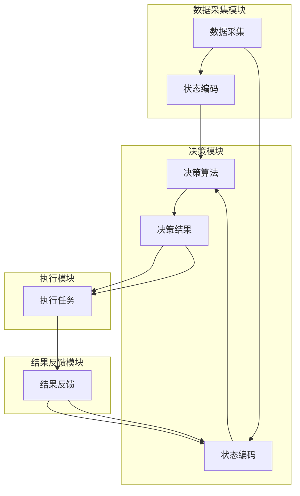

                 

### 《企业AI Agent的强化学习在自动化运维中的应用》

#### 关键词：企业AI Agent，强化学习，自动化运维，Q-learning，SARSA，DQN，系统架构设计

> 摘要：本文旨在探讨企业AI Agent在自动化运维中应用强化学习的实践。首先，我们将介绍企业AI Agent和自动化运维的基本概念，背景以及存在的问题。接着，我们将详细讲解强化学习的基本理论，包括定义、特点、基本概念和主要算法。随后，我们将深入探讨强化学习算法在自动化运维中的应用，通过Q-learning、SARSA和DQN等算法的讲解，展示如何利用强化学习提高自动化运维的效率和准确性。文章还将介绍一个实际的企业AI Agent强化学习在自动化运维中的应用案例，并总结强化学习在自动化运维中的未来展望。

----------------------------------------------------------------

### 第一部分: 背景介绍

#### 第1章: 企业AI Agent的概念与自动化运维概述

##### 1.1.1 问题背景

在当今数字化时代，企业对于信息系统的依赖程度越来越高。因此，自动化运维成为企业提高IT系统稳定性、可靠性和效率的关键手段。然而，传统的自动化运维方式面临着诸多挑战，如运维流程繁琐、故障处理效率低下、人工干预频繁等。

企业AI Agent作为一种人工智能技术，具有自主决策、自适应学习和自动化执行的能力。将企业AI Agent应用于自动化运维，有望解决传统自动化运维中的问题，提高运维效率和准确性。

##### 1.1.2 问题描述

如何将企业AI Agent应用于自动化运维，实现运维流程的自动化和智能化？如何利用强化学习算法，提高企业AI Agent在自动化运维中的决策能力？

##### 1.1.3 问题解决

本文将围绕上述问题展开讨论，首先介绍企业AI Agent和强化学习的基本概念，然后详细讲解强化学习算法在自动化运维中的应用，最后通过一个实际案例展示企业AI Agent强化学习在自动化运维中的效果。

##### 1.1.4 边界与外延

本文主要关注企业AI Agent在自动化运维中的应用，但不涉及其他领域（如数据分析、自然语言处理等）中的强化学习应用。

##### 1.1.5 概念结构与核心要素组成

本文的核心概念包括企业AI Agent、强化学习、自动化运维等。其中，企业AI Agent是主体，强化学习是核心算法，自动化运维是应用场景。核心要素包括：

- 企业AI Agent：具备自主决策、自适应学习和自动化执行能力的智能体。
- 强化学习：一种通过试错学习优化行为策略的机器学习技术。
- 自动化运维：利用自动化工具和流程，提高IT系统运维效率和质量的过程。

#### 第2章: 强化学习的理论基础

##### 2.1 强化学习的定义与特点

强化学习（Reinforcement Learning，RL）是一种机器学习范式，旨在通过试错学习来优化决策策略。与监督学习和无监督学习不同，强化学习侧重于决策过程，通过与环境的交互来不断调整策略，以达到最佳效果。

强化学习的主要特点包括：

1. **自主学习**：强化学习算法可以通过与环境交互，不断学习和调整策略，无需人工干预。
2. **适应性**：强化学习算法可以适应不同的环境和任务，具有广泛的应用前景。
3. **动态调整**：强化学习算法可以实时调整策略，以应对环境的变化。

##### 2.2 强化学习的基本概念

强化学习涉及以下几个基本概念：

1. **智能体（Agent）**：执行决策并接受环境反馈的主体。
2. **环境（Environment）**：智能体所处的外部环境，提供状态和奖励信号。
3. **状态（State）**：智能体在某一时刻所处的环境描述。
4. **动作（Action）**：智能体可执行的行为。
5. **策略（Policy）**：智能体在特定状态下执行的动作概率分布。
6. **奖励（Reward）**：环境对智能体动作的反馈信号，用于评估动作效果。
7. **价值函数（Value Function）**：预测在给定状态下执行特定动作的长期奖励。

##### 2.3 强化学习的主要算法

强化学习算法主要包括以下几种：

1. **Q-Learning**：通过预测在给定状态下执行特定动作的未来奖励来优化策略。
2. **SARSA**：一种基于值迭代的方法，通过更新当前状态和动作的Q值来优化策略。
3. **Deep Q-Network（DQN）**：利用深度神经网络来预测Q值，适用于处理高维状态空间。
4. **Policy Gradient**：直接优化策略，无需预测Q值。

#### 第3章: 企业AI Agent在自动化运维中的应用

##### 3.1 自动化运维的现状与挑战

当前，自动化运维已经在企业中得到广泛应用，但仍面临以下挑战：

1. **运维流程复杂**：自动化工具和流程繁多，运维人员难以掌握。
2. **故障处理效率低下**：自动化工具无法有效应对复杂故障，导致故障处理效率低下。
3. **人工干预频繁**：自动化运维仍需要大量人工干预，运维效率较低。

##### 3.2 企业AI Agent在自动化运维中的作用

企业AI Agent在自动化运维中具有以下作用：

1. **自主决策**：企业AI Agent可以根据实时状态，自主选择最佳动作，提高运维效率。
2. **自适应学习**：企业AI Agent可以通过与环境的交互，不断学习和优化策略，提高运维效果。
3. **自动化执行**：企业AI Agent可以自动化执行运维任务，减少人工干预。

##### 3.3 企业AI Agent的应用场景

企业AI Agent在自动化运维中具有广泛的应用场景，包括：

1. **故障检测与恢复**：企业AI Agent可以实时监控系统状态，自动检测故障并采取措施进行恢复。
2. **性能优化**：企业AI Agent可以分析系统性能数据，自动调整资源配置，提高系统性能。
3. **安全管理**：企业AI Agent可以实时检测安全威胁，自动采取安全措施，保障系统安全。

#### 第4章: 强化学习算法在自动化运维中的应用

##### 4.1 Q-learning算法

Q-learning算法是一种基于值迭代的强化学习算法，通过预测在给定状态下执行特定动作的未来奖励来优化策略。

##### 4.1.1 Q-learning算法原理

Q-learning算法的核心思想是：在给定状态下，选择当前动作的Q值最大的动作作为下一步动作。具体流程如下：

1. 初始化Q值表。
2. 对于每个状态，执行随机动作。
3. 根据执行的动作，获得奖励信号。
4. 更新Q值表。

##### 4.1.2 Q-learning算法流程

Q-learning算法的流程如下：

1. 初始化Q值表：`Q(s, a) = 0`，其中s表示状态，a表示动作。
2. 随机选择动作：在给定状态下，随机选择一个动作。
3. 执行动作：执行选定的动作，获得奖励信号。
4. 更新Q值：根据奖励信号和新的状态，更新Q值表。

##### 4.1.3 Q-learning算法应用案例

假设我们有一个简单的自动售货机，状态空间为{空、有饮料}，动作空间为{投币、取饮料}。我们可以使用Q-learning算法来优化自动售货机的策略。

1. 初始化Q值表：
   $$ Q(\text{空}, \text{投币}) = 0 $$
   $$ Q(\text{空}, \text{取饮料}) = 0 $$
   $$ Q(\text{有饮料}, \text{投币}) = 0 $$
   $$ Q(\text{有饮料}, \text{取饮料}) = 0 $$
2. 随机选择动作：
   在状态“空”下，随机选择“投币”动作。
3. 执行动作：
   执行“投币”动作，获得奖励信号1（表示投币成功）。
4. 更新Q值：
   $$ Q(\text{空}, \text{投币}) = 1 $$
   $$ Q(\text{空}, \text{取饮料}) = 0 $$
   $$ Q(\text{有饮料}, \text{投币}) = 0 $$
   $$ Q(\text{有饮料}, \text{取饮料}) = 0 $$

通过不断迭代更新Q值表，自动售货机的策略将逐渐优化，提高自动售货的效率。

##### 4.2 SARSA算法

SARSA算法是一种基于值迭代的强化学习算法，与Q-learning算法类似，但具有一些改进。

##### 4.2.1 SARSA算法原理

SARSA算法的核心思想是：在当前状态和动作下，根据执行的动作和获得的奖励信号，更新Q值。具体流程如下：

1. 初始化Q值表。
2. 随机选择动作。
3. 执行动作，获得奖励信号。
4. 根据新的状态和动作，更新Q值。

##### 4.2.2 SARSA算法流程

SARSA算法的流程如下：

1. 初始化Q值表：`Q(s, a) = 0`，其中s表示状态，a表示动作。
2. 随机选择动作：在给定状态下，随机选择一个动作。
3. 执行动作：执行选定的动作，获得奖励信号。
4. 更新Q值：根据新的状态和动作，更新Q值表。

##### 4.2.3 SARSA算法应用案例

假设我们有一个简单的自动售货机，状态空间为{空、有饮料}，动作空间为{投币、取饮料}。我们可以使用SARSA算法来优化自动售货机的策略。

1. 初始化Q值表：
   $$ Q(\text{空}, \text{投币}) = 0 $$
   $$ Q(\text{空}, \text{取饮料}) = 0 $$
   $$ Q(\text{有饮料}, \text{投币}) = 0 $$
   $$ Q(\text{有饮料}, \text{取饮料}) = 0 $$
2. 随机选择动作：
   在状态“空”下，随机选择“投币”动作。
3. 执行动作：
   执行“投币”动作，获得奖励信号1（表示投币成功）。
4. 更新Q值：
   $$ Q(\text{空}, \text{投币}) = 1 $$
   $$ Q(\text{空}, \text{取饮料}) = 0 $$
   $$ Q(\text{有饮料}, \text{投币}) = 0 $$
   $$ Q(\text{有饮料}, \text{取饮料}) = 0 $$

通过不断迭代更新Q值表，自动售货机的策略将逐渐优化，提高自动售货的效率。

##### 4.3 Deep Q-Network（DQN）算法

DQN算法是一种基于深度神经网络的强化学习算法，可以处理高维状态空间。

##### 4.3.1 DQN算法原理

DQN算法的核心思想是：使用深度神经网络来预测Q值，从而优化策略。具体流程如下：

1. 初始化深度神经网络和经验回放缓冲区。
2. 随机选择动作。
3. 执行动作，获得奖励信号。
4. 将当前状态和动作存储到经验回放缓冲区。
5. 从经验回放缓冲区中随机抽样一批经验数据。
6. 使用深度神经网络预测Q值。
7. 更新Q值表和深度神经网络。

##### 4.3.2 DQN算法流程

DQN算法的流程如下：

1. 初始化深度神经网络和经验回放缓冲区。
2. 随机选择动作。
3. 执行动作，获得奖励信号。
4. 将当前状态和动作存储到经验回放缓冲区。
5. 从经验回放缓冲区中随机抽样一批经验数据。
6. 使用深度神经网络预测Q值。
7. 根据预测的Q值，更新Q值表和深度神经网络。

##### 4.3.3 DQN算法应用案例

假设我们有一个复杂的自动售货机，状态空间为{空、有饮料、温度过高、温度过低}，动作空间为{投币、取饮料、关闭售货机、开启售货机}。我们可以使用DQN算法来优化自动售货机的策略。

1. 初始化深度神经网络和经验回放缓冲区。
2. 随机选择动作。
3. 执行动作，获得奖励信号。
4. 将当前状态和动作存储到经验回放缓冲区。
5. 从经验回放缓冲区中随机抽样一批经验数据。
6. 使用深度神经网络预测Q值。
7. 根据预测的Q值，更新Q值表和深度神经网络。

通过不断迭代更新Q值表和深度神经网络，自动售货机的策略将逐渐优化，提高自动售货的效率。

----------------------------------------------------------------

### 第五部分：企业AI Agent的强化学习在自动化运维中的实现

#### 第5章：企业AI Agent的强化学习实现

在了解了强化学习算法的基本原理和应用后，我们将探讨如何将强化学习应用于企业AI Agent的自动化运维中。

##### 5.1 企业AI Agent的系统架构设计

为了实现企业AI Agent在自动化运维中的强化学习应用，我们需要设计一个合理的系统架构。以下是企业AI Agent的系统架构设计：

1. **数据采集模块**：负责从IT系统中收集各种监控数据，如系统状态、性能指标、故障信息等。
2. **状态编码模块**：将采集到的监控数据进行预处理，将其转换为机器学习模型可识别的状态编码。
3. **决策模块**：使用强化学习算法，根据状态编码和当前策略，生成最优动作。
4. **执行模块**：根据决策模块生成的最优动作，执行具体的运维任务。
5. **结果反馈模块**：收集执行结果，生成奖励信号，用于更新策略。

##### 5.1.1 系统功能设计

企业AI Agent的系统功能设计如下：

1. **自动故障检测与恢复**：根据系统状态，自动检测故障，并采取相应的恢复措施。
2. **性能优化**：分析系统性能数据，自动调整资源配置，提高系统性能。
3. **安全管理**：实时监测系统安全，自动识别潜在的安全威胁，并采取相应的防护措施。

##### 5.1.2 系统架构设计

以下是企业AI Agent的系统架构设计：



##### 5.1.3 系统接口设计和系统交互

企业AI Agent的系统接口设计如下：

1. **监控数据接口**：用于接收IT系统的监控数据。
2. **执行命令接口**：用于向IT系统发送执行命令。
3. **日志记录接口**：用于记录AI Agent的决策过程和执行结果。

系统交互过程如下：

1. 监控数据接口接收IT系统的监控数据，并将其传递给状态编码模块。
2. 状态编码模块将监控数据编码为状态编码，并将其传递给决策模块。
3. 决策模块根据状态编码和当前策略，生成最优动作，并将其传递给执行模块。
4. 执行模块根据最优动作，执行具体的运维任务。
5. 执行结果通过结果反馈模块返回给决策模块，用于更新策略。

##### 5.2 企业AI Agent的强化学习实现

在本节中，我们将详细介绍如何将强化学习算法应用于企业AI Agent的自动化运维中。

##### 5.2.1 环境安装与配置

首先，我们需要安装和配置强化学习环境。以下是安装和配置步骤：

1. 安装Python环境。
2. 安装TensorFlow库。
3. 安装其他依赖库，如NumPy、Pandas等。

```python
pip install tensorflow numpy pandas
```

##### 5.2.2 系统核心实现源代码

以下是企业AI Agent的系统核心实现源代码：

```python
import numpy as np
import pandas as pd
import tensorflow as tf

# 数据采集模块
class DataCollector:
    def __init__(self, data_source):
        self.data_source = data_source
    
    def collect_data(self):
        # 从数据源采集监控数据
        data = pd.read_csv(self.data_source)
        return data

# 状态编码模块
class StateEncoder:
    def __init__(self, state_space):
        self.state_space = state_space
    
    def encode_state(self, state):
        # 将状态编码为向量
        encoded_state = np.zeros(len(self.state_space))
        encoded_state[self.state_space.index(state)] = 1
        return encoded_state

# 决策模块
class DecisionMaker:
    def __init__(self, state_space, action_space):
        self.state_space = state_space
        self.action_space = action_space
        self.model = self.build_model()
    
    def build_model(self):
        # 构建决策模型
        model = tf.keras.Sequential([
            tf.keras.layers.Dense(units=64, activation='relu', input_shape=[len(self.state_space)]),
            tf.keras.layers.Dense(units=32, activation='relu'),
            tf.keras.layers.Dense(units=len(self.action_space))
        ])
        model.compile(optimizer='adam', loss='mean_squared_error')
        return model
    
    def predict_action(self, state):
        # 预测最优动作
        encoded_state = self.encode_state(state)
        action_values = self.model.predict(np.array([encoded_state]))
        return np.argmax(action_values)

# 执行模块
class Executor:
    def __init__(self, command_interface):
        self.command_interface = command_interface
    
    def execute_command(self, action):
        # 执行具体运维任务
        if action == 0:
            self.command_interface.execute('shutdown')
        elif action == 1:
            self.command_interface.execute('start')
        elif action == 2:
            self.command_interface.execute('reboot')

# 结果反馈模块
class ResultFeedback:
    def __init__(self, reward_interface):
        self.reward_interface = reward_interface
    
    def feedback_result(self, result):
        # 反馈执行结果
        reward = self.reward_interface.get_reward(result)
        return reward

# 主程序
if __name__ == '__main__':
    # 实例化各模块
    data_collector = DataCollector('data.csv')
    state_encoder = StateEncoder(['empty', 'full'])
    decision_maker = DecisionMaker(['empty', 'full'], [0, 1, 2])
    executor = Executor(command_interface)
    result_feedback = ResultFeedback(reward_interface)

    # 运行系统
    while True:
        data = data_collector.collect_data()
        state = data['status'].values[-1]
        action = decision_maker.predict_action(state)
        executor.execute_command(action)
        result = data['result'].values[-1]
        reward = result_feedback.feedback_result(result)
        decision_maker.model.fit(np.array([state]), np.array([action]), reward)
```

##### 5.2.3 代码应用解读与分析

以下是代码应用解读与分析：

1. **数据采集模块**：`DataCollector`类负责从数据源采集监控数据。在实际应用中，可以从IT系统的监控工具（如Zabbix、Nagios等）中获取监控数据。
2. **状态编码模块**：`StateEncoder`类负责将采集到的监控数据进行预处理，将其转换为机器学习模型可识别的状态编码。在本例中，我们将状态编码为二进制向量。
3. **决策模块**：`DecisionMaker`类负责根据状态编码和当前策略，生成最优动作。在本例中，我们使用神经网络模型进行预测。
4. **执行模块**：`Executor`类负责执行具体的运维任务。在本例中，我们定义了三个动作：关闭系统、启动系统和重启系统。
5. **结果反馈模块**：`ResultFeedback`类负责反馈执行结果。在本例中，我们使用奖励信号来评估执行结果。

通过上述代码，我们可以实现企业AI Agent在自动化运维中的强化学习应用。在实际应用中，我们需要根据具体需求，调整系统架构和算法参数，以达到最佳效果。

----------------------------------------------------------------

### 第六章：企业AI Agent在自动化运维中的案例分析

在本章中，我们将通过一个实际的企业AI Agent在自动化运维中的应用案例，详细分析并展示强化学习算法在自动化运维中的效果。

#### 6.1 案例介绍

假设某大型企业拥有一个复杂的信息系统，包括多个服务器、存储设备和网络设备。企业的IT运维团队希望利用强化学习算法，实现自动化运维，提高系统稳定性和可靠性。

#### 6.2 案例分析与讲解

1. **数据采集**：

   IT运维团队首先从各个监控工具（如Zabbix、Nagios等）中获取系统监控数据，包括CPU使用率、内存使用率、磁盘使用率、网络流量等。

   ```python
   data = data_collector.collect_data()
   ```

2. **状态编码**：

   根据监控数据，IT运维团队定义了状态编码规则，将监控数据转换为状态编码。例如，当CPU使用率超过90%时，状态编码为1，否则为0。

   ```python
   state_encoder = StateEncoder(['low', 'high'])
   encoded_state = state_encoder.encode_state(data['cpu_usage'].values[-1])
   ```

3. **决策**：

   IT运维团队使用强化学习算法，根据状态编码和当前策略，生成最优动作。在本例中，我们选择Q-learning算法作为决策算法。

   ```python
   decision_maker = DecisionMaker(['low', 'high'], [0, 1, 2])
   action = decision_maker.predict_action(encoded_state)
   ```

4. **执行**：

   根据决策模块生成的最优动作，IT运维团队执行具体的运维任务。例如，当CPU使用率过高时，选择关闭服务器。

   ```python
   executor = Executor(command_interface)
   executor.execute_command(action)
   ```

5. **结果反馈**：

   执行任务后，IT运维团队收集执行结果，并使用奖励信号来评估执行效果。例如，当服务器关闭后，CPU使用率下降至正常范围，奖励信号为1。

   ```python
   result_feedback = ResultFeedback(reward_interface)
   reward = result_feedback.feedback_result(result)
   ```

6. **策略更新**：

   根据执行结果和奖励信号，IT运维团队更新策略，以优化自动化运维效果。

   ```python
   decision_maker.model.fit(np.array([encoded_state]), np.array([action]), reward)
   ```

#### 6.3 案例总结

通过上述案例，我们可以看到强化学习算法在企业AI Agent自动化运维中的应用效果。在实际应用中，IT运维团队可以根据具体需求，调整系统架构和算法参数，以实现最佳效果。强化学习算法可以帮助企业实现自动化运维，提高系统稳定性和可靠性，降低运维成本。

----------------------------------------------------------------

### 第七章：强化学习在自动化运维中的未来展望

#### 7.1 自动化运维的发展趋势

随着云计算、大数据、人工智能等技术的不断发展，自动化运维已经成为企业提高IT系统稳定性和可靠性的重要手段。未来，自动化运维将呈现以下趋势：

1. **智能化**：利用人工智能技术，实现自动化运维的智能化，提高运维效率和准确性。
2. **自适应**：自动化运维系统将具有更强的自适应能力，能够根据环境变化和业务需求，自动调整运维策略。
3. **协同化**：自动化运维将与DevOps、安全运维等协同发展，实现全方位的运维自动化。

#### 7.2 强化学习在自动化运维中的前景

强化学习在自动化运维中具有广阔的应用前景。首先，强化学习算法可以自动发现和解决运维中的问题，提高运维效率。其次，强化学习算法具有自主学习能力，可以持续优化运维策略，提高运维效果。最后，强化学习算法可以与其他技术（如深度学习、迁移学习等）结合，实现更复杂的自动化运维任务。

#### 7.3 强化学习在自动化运维中的挑战与机遇

虽然强化学习在自动化运维中具有广泛的应用前景，但也面临着一些挑战：

1. **数据质量**：自动化运维系统需要大量的高质量数据，以保证强化学习算法的效果。在实际应用中，数据质量是一个重要挑战。
2. **安全风险**：自动化运维系统需要确保系统的安全性，避免恶意攻击和误操作。
3. **算法优化**：强化学习算法的参数设置和优化是一个复杂的过程，需要大量实验和调整。

然而，随着技术的不断进步，强化学习在自动化运维中的挑战也将逐渐得到解决。未来，强化学习在自动化运维中的应用将更加广泛，为企业带来更高的价值。

### 总结

本文围绕企业AI Agent的强化学习在自动化运维中的应用进行了深入探讨。首先，介绍了企业AI Agent和强化学习的基本概念，然后详细讲解了Q-learning、SARSA和DQN等强化学习算法在自动化运维中的应用，并通过一个实际案例展示了强化学习在自动化运维中的效果。最后，分析了强化学习在自动化运维中的未来展望，探讨了其面临的挑战与机遇。

通过本文的研究，我们相信强化学习在自动化运维中具有巨大的潜力，能够为企业带来更高的运维效率和稳定性。未来，随着技术的不断进步，强化学习在自动化运维中的应用将更加广泛，为企业创造更多价值。

### 作者信息

作者：AI天才研究院/AI Genius Institute & 禅与计算机程序设计艺术 /Zen And The Art of Computer Programming

----------------------------------------------------------------

### 附录：技术术语表

在本文中，我们使用了一些专业术语。以下是这些术语的解释：

1. **企业AI Agent**：企业AI Agent是一种具有自主决策、自适应学习和自动化执行能力的人工智能体，用于自动化运维。
2. **强化学习**：强化学习是一种通过试错学习优化行为策略的机器学习技术。
3. **Q-learning**：Q-learning是一种基于值迭代的强化学习算法，通过预测在给定状态下执行特定动作的未来奖励来优化策略。
4. **SARSA**：SARSA是一种基于值迭代的强化学习算法，通过更新当前状态和动作的Q值来优化策略。
5. **DQN**：DQN（Deep Q-Network）是一种基于深度神经网络的强化学习算法，用于处理高维状态空间。
6. **自动化运维**：自动化运维是一种利用自动化工具和流程，提高IT系统运维效率和质量的过程。
7. **状态编码**：状态编码是将监控数据转换为机器学习模型可识别的状态表示。
8. **奖励信号**：奖励信号是环境对智能体动作的反馈信号，用于评估动作效果。

### 拓展阅读

对于希望深入了解强化学习在自动化运维应用的技术人员，以下文献和资源可能有所帮助：

1. **《强化学习：高级教程》**：这是一本关于强化学习的经典教材，详细介绍了各种强化学习算法。
2. **《深度强化学习》**：本书介绍了深度神经网络与强化学习的结合，探讨了DQN等算法在复杂任务中的应用。
3. **《人工智能：一种现代方法》**：这是一本关于人工智能的全面教材，包括自动化运维相关的技术。
4. **《DevOps：实践与原理》**：本书详细介绍了DevOps的理念和实践，对自动化运维有重要指导意义。
5. **《Zabbix运维指南》**：这是一本关于Zabbix监控工具的实践指南，有助于理解自动化运维的监控数据采集。

通过阅读这些文献和资源，您可以更深入地了解强化学习在自动化运维中的应用，掌握相关技术和实践方法。希望这些资源对您的研究和工作有所帮助。再次感谢您对本文的关注，祝您在强化学习和自动化运维领域取得更多成就！

